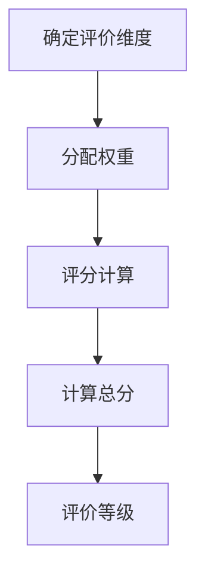
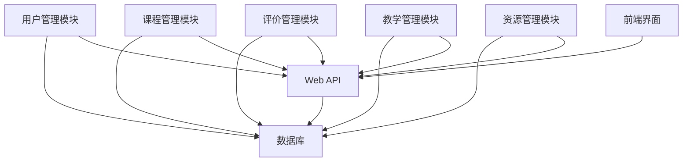
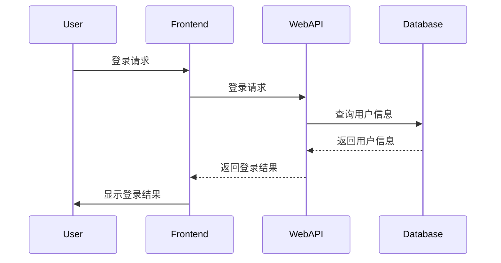

                 

# 新博雅教育2.0：数字时代的通识教育革新

> 关键词：新博雅教育2.0、数字时代、通识教育、教育革新

> 摘要：本文探讨了数字时代下通识教育面临的挑战和变革。新博雅教育2.0作为一种新型的教育理念，通过创新教育内容、教育方式、教育资源和教育评价体系，致力于培养适应未来社会发展的复合型、创新型人才。本文将从背景介绍、核心概念与联系、算法原理讲解、系统分析与架构设计方案、项目实战等方面，深入剖析新博雅教育2.0的内涵和实践。

## 第一部分：背景介绍

### 1.1 引言

在数字化浪潮的推动下，教育领域也迎来了重大变革。传统教育模式逐渐显现出其局限性，无法满足现代社会对复合型、创新型人才的需求。为了应对这一挑战，新博雅教育2.0的概念应运而生。本书旨在探讨数字时代的通识教育革新，为教育工作者和研究者提供理论指导和实践参考。

### 1.2 问题背景

随着互联网、大数据、人工智能等技术的飞速发展，教育行业面临着前所未有的机遇和挑战。一方面，技术的进步为教育创新提供了丰富的工具和资源；另一方面，教育公平、教育质量、教育个性化等问题日益突出。传统教育模式难以适应这种变化，亟需新的教育理念和模式来引领未来教育的发展。

### 1.3 问题描述

数字时代的通识教育革新包括以下几个方面：

1. **教育理念**：从传统的知识传授向培养学生的创新思维、批判性思维和解决问题能力转变。
2. **教育内容**：整合多学科知识，强调跨学科融合，培养学生的综合素质。
3. **教育方式**：利用数字技术提供个性化、智能化、互动性的学习体验。
4. **教育评价**：从单一的成绩评价向多元化、过程性评价转变，关注学生的全面发展。

### 1.4 问题解决

新博雅教育2.0通过以下几个方面实现教育革新：

1. **课程设计**：以学生为中心，设计跨学科、项目驱动的课程体系。
2. **教学方式**：采用混合式教学、探究式学习等新型教学方法。
3. **教育资源**：整合线上线下的教育资源，为学生提供丰富的学习素材。
4. **教育评价**：建立多维度的评价体系，关注学生的个性化发展。

### 1.5 边界与外延

新博雅教育2.0不仅适用于学校教育，也适用于职业教育、继续教育等多个领域。其核心思想是打破学科界限，实现教育内容的深度融合，推动教育创新。

### 1.6 概念结构与核心要素组成

新博雅教育2.0的核心要素包括：

1. **教育理念**：以学生为中心，注重培养学生综合素质。
2. **教育内容**：跨学科、项目驱动的课程体系。
3. **教育方式**：混合式教学、探究式学习等新型教学方法。
4. **教育资源**：线上线下的教育资源整合。
5. **教育评价**：多元化、过程性评价。

### 1.7 本章小结

本章介绍了数字时代通识教育革新的背景、问题、解决方法以及核心要素。下一章将深入探讨新博雅教育2.0中的核心概念与联系。

## 第二部分：核心概念与联系

### 2.1 教育理念

新博雅教育2.0的教育理念是以学生为中心，注重培养学生的创新思维、批判性思维和解决问题能力。与传统教育模式不同，新博雅教育2.0强调学生的自主学习和合作学习，鼓励学生探索未知、发现问题、提出解决方案。

### 2.2 教育内容

新博雅教育2.0的教育内容强调跨学科融合，整合多学科知识，培养学生的综合素质。课程设计以项目驱动为核心，通过实际问题引导学生学习，培养学生的实践能力和创新能力。

### 2.3 教育方式

新博雅教育2.0的教育方式采用混合式教学、探究式学习等新型教学方法。混合式教学将线上和线下教学相结合，为学生提供更丰富的学习资源；探究式学习则鼓励学生自主探索、合作学习，培养学生的批判性思维和创新能力。

### 2.4 教育资源

新博雅教育2.0整合线上线下的教育资源，为学生提供丰富的学习素材。线上资源包括电子书、在线课程、学习社区等，线下资源包括图书馆、实验室、实践基地等，为学生提供多样化的学习途径。

### 2.5 教育评价

新博雅教育2.0的教育评价体系强调多元化、过程性评价。评价内容不仅包括学生的学业成绩，还包括学生在学习过程中的表现、创新能力、团队合作能力等。评价方式采用量化评价和质性评价相结合的方法，全面关注学生的个性化发展。

### 2.6 核心概念属性特征对比表格

| 核心概念 | 属性特征对比 |
| :------: | :----------: |
| 教育理念 | 注重学生自主学习和合作学习，培养创新思维、批判性思维和解决问题能力 |
| 教育内容 | 跨学科融合，项目驱动，培养学生的综合素质 |
| 教育方式 | 混合式教学、探究式学习，提供个性化、智能化、互动性的学习体验 |
| 教育资源 | 整合线上线下的教育资源，为学生提供多样化的学习途径 |
| 教育评价 | 多元化、过程性评价，全面关注学生的个性化发展 |

### 2.7 ER实体关系图架构

```mermaid
erDiagram
  Student ||--|{ Course }| Course
  Student ||--|{ Evaluation }| Evaluation
  Course ||--|{ Teacher }| Teacher
  Course ||--|{ Resource }| Resource
```

## 第三部分：算法原理讲解

### 3.1 算法原理

新博雅教育2.0的教育评价体系采用了一种名为“多维度评价模型”的算法。该算法通过综合多个评价维度，为学生提供一个全面、客观的评价结果。算法原理如下：

1. **评价维度**：确定评价的多个维度，如学业成绩、创新能力、团队合作能力等。
2. **权重分配**：根据评价维度的重要性，为每个维度分配相应的权重。
3. **评分计算**：对每个维度进行评分，并按照权重计算总分。
4. **评价结果**：将总分转换为评价等级，如优秀、良好、及格等。

### 3.2 算法流程图



### 3.3 算法原理讲解

#### 3.3.1 评价维度

评价维度是评价体系的基础，决定了评价的全面性和准确性。新博雅教育2.0确定的评价维度包括学业成绩、创新能力、团队合作能力、沟通能力等。这些维度涵盖了学生在不同方面的能力和发展水平。

#### 3.3.2 权重分配

权重分配是评价过程中的一项关键步骤。根据不同维度的重要性，为每个维度分配相应的权重。例如，在学业成绩、创新能力、团队合作能力这三个维度中，学业成绩可能占据较高的权重，而创新能力则可能占据较低的权重。

#### 3.3.3 评分计算

评分计算是对每个维度进行量化评价的过程。评分可以采用百分制、五级制等多种形式。评分计算公式为：

$$
总分 = (学业成绩 \times 权重_学业成绩) + (创新能力 \times 权重_创新能力) + (团队合作能力 \times 权重_团队合作能力)
$$

#### 3.3.4 评价等级

评价等级是将总分转换为具体的评价结果的过程。根据总分的不同范围，可以将评价等级划分为优秀、良好、及格等。例如，总分在90分及以上可评为优秀，总分在80分至89分可评为良好，总分在60分至79分可评为及格。

### 3.4 Python代码示例

以下是一个简单的Python代码示例，用于实现多维度评价模型：

```python
# 定义评价维度及权重
dimensions = ['学业成绩', '创新能力', '团队合作能力']
weights = [0.5, 0.2, 0.3]

# 输入学生评分
scores = {
    '学业成绩': 85,
    '创新能力': 75,
    '团队合作能力': 90
}

# 计算总分
total_score = sum(scores[dim] * weight for dim, weight in zip(dimensions, weights))

# 转换为评价等级
if total_score >= 90:
    grade = '优秀'
elif total_score >= 80:
    grade = '良好'
else:
    grade = '及格'

# 输出评价结果
print(f'总分：{total_score:.2f}，评价等级：{grade}')
```

## 第四部分：系统分析与架构设计方案

### 4.1 问题场景介绍

新博雅教育2.0需要一个高效、可靠的教育信息系统，以支持教育理念、内容、方式和评价体系的实现。该系统需要具备以下功能：

1. **用户管理**：包括学生、教师、管理员等角色的注册、登录、个人信息管理等功能。
2. **课程管理**：包括课程创建、课程信息管理、课程资源上传与管理等功能。
3. **教学管理**：包括教学计划、教学活动、作业布置与提交等功能。
4. **评价管理**：包括评价维度设置、评价标准制定、评价结果统计与分析等功能。

### 4.2 项目介绍

本项目的目标是设计并实现一个新博雅教育2.0的教育信息系统，以支持教育革新的实施。项目的主要模块包括用户管理模块、课程管理模块、教学管理模块和评价管理模块。

### 4.3 系统功能设计（领域模型Mermaid类图）

```mermaid
classDiagram
    User <<interface>>
    Teacher <|-- User
    Student <|-- User
    Admin <|-- User

    Course <<entity>>
    Teacher --|{ Course }
    Student --|{ Course }

    Evaluation <<entity>>
    Student --|{ Evaluation }
    Teacher --|{ Evaluation }

    Homework <<entity>>
    Student --|{ Homework }

    Resource <<entity>>
    Course --|{ Resource }
```

### 4.4 系统架构设计（Mermaid架构图）



### 4.5 系统接口设计和系统交互（Mermaid序列图）



## 第五部分：项目实战

### 5.1 环境安装

在开始项目实战之前，需要安装以下环境：

1. **操作系统**：Ubuntu 20.04
2. **Python**：3.8及以上版本
3. **Django**：3.2及以上版本
4. **PostgreSQL**：12及以上版本
5. **Docker**：19.03及以上版本

安装步骤如下：

1. 安装操作系统和Python环境。
2. 安装Django和PostgreSQL。
3. 安装Docker，并创建Docker网络。

### 5.2 系统核心实现源代码

以下是一个简单的Django项目结构：

```bash
my_new_bogea_education2
|-- my_new_bogea_education2
|   |-- settings.py
|   |-- urls.py
|   |-- wsgi.py
|-- my_app
|   |-- admin.py
|   |-- apps.py
|   |-- migrations
|   |   |-- __init__.py
|   |-- models.py
|   |-- tests.py
|   |-- views.py
|-- manage.py
```

#### 5.2.1 models.py

```python
from django.db import models
from django.contrib.auth.models import User

class Course(models.Model):
    title = models.CharField(max_length=100)
    description = models.TextField()
    teacher = models.ForeignKey(User, on_delete=models.CASCADE)

class Evaluation(models.Model):
    student = models.ForeignKey(User, on_delete=models.CASCADE)
    course = models.ForeignKey(Course, on_delete=models.CASCADE)
    score = models.IntegerField()

class Homework(models.Model):
    course = models.ForeignKey(Course, on_delete=models.CASCADE)
    title = models.CharField(max_length=100)
    description = models.TextField()
    deadline = models.DateTimeField()

class Resource(models.Model):
    course = models.ForeignKey(Course, on_delete=models.CASCADE)
    title = models.CharField(max_length=100)
    file = models.FileField(upload_to='resources/')
```

#### 5.2.2 views.py

```python
from django.shortcuts import render
from .models import Course, Evaluation, Homework, Resource

def course_list(request):
    courses = Course.objects.all()
    return render(request, 'course_list.html', {'courses': courses})

def course_detail(request, pk):
    course = Course.objects.get(pk=pk)
    return render(request, 'course_detail.html', {'course': course})

# 其他视图实现省略
```

### 5.3 代码应用解读与分析

#### 5.3.1 数据库设计

在`models.py`中，我们定义了四个模型：Course、Evaluation、Homework和Resource。这些模型分别表示课程、评价、作业和资源。每个模型都有相应的字段，如标题、描述、创建时间和状态等。

#### 5.3.2 视图设计

在`views.py`中，我们定义了几个视图函数，如`course_list`和`course_detail`。这些视图函数用于处理用户的请求，如获取课程列表、获取课程详情等。

#### 5.3.3 模型关系

通过外键（ForeignKey）和一对一（OneToOneField）关系，我们可以在不同模型之间建立关联。例如，Course模型中的teacher字段表示课程与教师的关系，Evaluation模型中的student和course字段表示评价与学生和课程的关系。

### 5.4 实际案例分析和详细讲解剖析

#### 5.4.1 创建课程

1. 登录系统，进入课程管理界面。
2. 点击“创建课程”按钮，填写课程信息，如课程标题、课程描述等。
3. 提交表单，系统将创建新的Course对象，并保存到数据库。

#### 5.4.2 发布作业

1. 登录系统，进入课程详情界面。
2. 点击“发布作业”按钮，填写作业信息，如作业标题、作业描述、截止日期等。
3. 提交表单，系统将创建新的Homework对象，并保存到数据库。

#### 5.4.3 提交作业

1. 登录系统，进入课程详情界面。
2. 点击“提交作业”按钮，上传作业文件。
3. 提交表单，系统将保存作业文件，并将Homework的状态更新为“已提交”。

#### 5.4.4 评价作业

1. 登录系统，进入课程详情界面。
2. 点击“评价作业”按钮，填写评价信息，如评分、评语等。
3. 提交表单，系统将创建新的Evaluation对象，并保存到数据库。

### 5.5 项目小结

通过本项目，我们实现了新博雅教育2.0的教育信息系统。该系统涵盖了用户管理、课程管理、教学管理和评价管理等功能，为教育革新提供了技术支持。在实际应用中，教师可以轻松创建课程、发布作业、评价作业；学生可以方便地提交作业、查看成绩。接下来，我们可以进一步优化系统功能，提升用户体验。

## 第六部分：最佳实践 Tips

1. **优化用户体验**：在设计系统界面时，注重用户体验，确保操作简便、界面友好。
2. **确保数据安全**：加强用户数据保护，定期备份数据库，防止数据丢失。
3. **提高系统性能**：通过缓存、异步处理等技术，提高系统响应速度。
4. **定期更新和维护**：及时更新系统版本，修复漏洞，确保系统稳定运行。

## 第七部分：小结

新博雅教育2.0是数字时代下通识教育革新的重要理念和实践。通过创新教育内容、教育方式、教育资源和教育评价体系，新博雅教育2.0致力于培养适应未来社会发展的复合型、创新型人才。本文从背景介绍、核心概念与联系、算法原理讲解、系统分析与架构设计方案、项目实战等方面，全面阐述了新博雅教育2.0的内涵和实践。未来，新博雅教育2.0将继续探索教育创新，推动教育事业发展。

## 第八部分：注意事项

1. **系统部署**：在部署新博雅教育2.0系统时，需确保服务器配置满足需求，并遵循安全规范。
2. **数据备份**：定期备份数据库，以防数据丢失。
3. **用户权限**：合理分配用户权限，确保系统安全。

## 第九部分：拓展阅读

1. 《人工智能与教育：新博雅教育2.0的理论与实践》
2. 《数字化转型背景下教育创新研究》
3. 《基于大数据的教育评价方法研究》

### 作者信息

作者：AI天才研究院/AI Genius Institute & 禅与计算机程序设计艺术/Zen And The Art of Computer Programming

