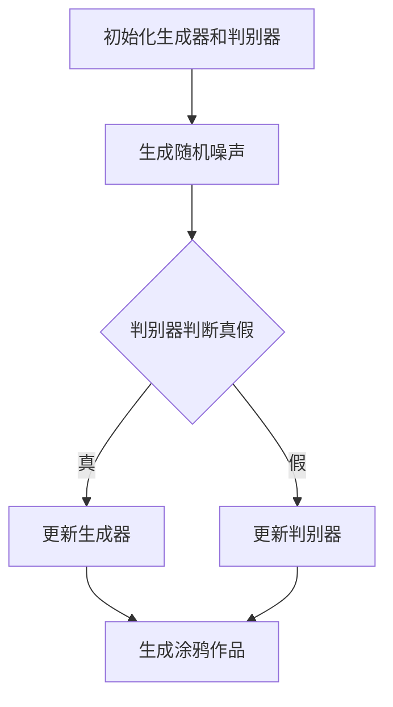
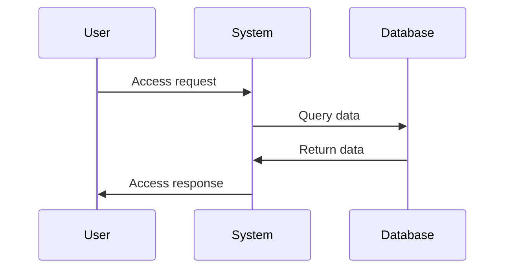
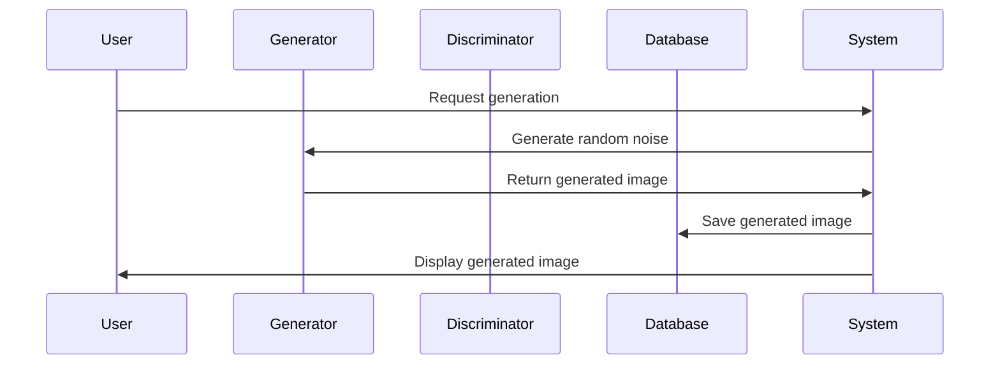

                 

# 新型城市公共艺术：街头涂鸦与社会对话

> 关键词：街头涂鸦、城市公共艺术、社会对话、涂鸦艺术、城市空间、算法生成

> 摘要：本文旨在探讨新型城市公共艺术——街头涂鸦，以及其在社会对话中的作用和意义。通过深入分析街头涂鸦的核心概念、属性特征及其与城市空间和社会互动的关系，我们提出了一种基于算法原理的涂鸦作品生成方法，旨在通过技术手段促进街头涂鸦与社会对话的深度融合。

----------------------------------------------------------------

## 第一部分：背景介绍

### 1.1 新型城市公共艺术：街头涂鸦与社会对话

随着城市化进程的加速，城市公共艺术逐渐成为城市文化建设的重要组成部分。街头涂鸦作为一种具有独特艺术风格的公共艺术形式，不仅丰富了城市的文化氛围，还成为了街头文化与社会互动的重要载体。

#### 1.1.1 问题背景

街头涂鸦作为一种公共艺术形式，其在城市空间中的存在和发展面临着诸多挑战。如何让街头涂鸦更好地融入城市空间，发挥其社会对话功能，成为我们需要探讨的问题。

#### 1.1.2 问题描述

街头涂鸦作为一种公共艺术形式，其在城市空间中的存在和发展面临着诸多挑战。如何让街头涂鸦更好地融入城市空间，发挥其社会对话功能，成为我们需要探讨的问题。

#### 1.1.3 问题解决

通过对街头涂鸦的深入研究，我们可以找到一种既能保持其艺术特性，又能与社会对话的方式。这需要我们从艺术、文化、社会等多个角度进行综合考量。

#### 1.1.4 边界与外延

街头涂鸦作为一种公共艺术形式，其边界包括艺术形式、创作方法、呈现方式等。而其外延则涉及到街头文化、城市空间、社会互动等多个方面。

#### 1.1.5 概念结构与核心要素组成

街头涂鸦的核心概念包括涂鸦艺术、街头文化、城市空间、社会互动等。这些要素相互交织，共同构成了街头涂鸦的独特魅力。

----------------------------------------------------------------

### 1.2 涂鸦艺术：街头文化的视觉表达

街头涂鸦艺术起源于20世纪70年代的美国，是一种以城市公共空间为载体的视觉艺术形式。涂鸦艺术家通过在建筑物、地铁、墙壁等公共场所绘制各种图案和文字，传达自己的情感、思想和观点。

#### 1.2.1 涂鸦艺术的起源与发展

涂鸦艺术的起源可以追溯到20世纪70年代的美国，最初是一些青少年在公共场所绘制简单的图案和标语，以表达对社会现状的不满。随着时间的发展，涂鸦艺术逐渐成为一种独立的艺术形式，吸引了越来越多的艺术家参与其中。

#### 1.2.2 涂鸦艺术的风格与特点

涂鸦艺术具有鲜明的风格和特点，主要包括以下几点：

- **创作自由**：涂鸦艺术家通常在公共场所进行创作，不受传统艺术形式的束缚，具有极高的自由度。
- **表现力强**：涂鸦艺术通过色彩、线条和形状等元素，传达出强烈的情感和思想。
- **富有创意**：涂鸦艺术家通过独特的视角和手法，创造出许多具有创意和视觉冲击力的作品。
- **形式多样**：涂鸦艺术的表现形式多样，包括壁画、街头雕塑、装置艺术等。

#### 1.2.3 涂鸦艺术的社会意义

涂鸦艺术作为一种街头文化的重要组成部分，具有深远的社会意义：

- **表达个人观点**：涂鸦艺术为艺术家提供了一个表达个人观点和思想的空间，成为社会舆论的发声器。
- **促进文化交流**：涂鸦艺术作为一种全球性的文化现象，促进了不同文化之间的交流和融合。
- **提升城市形象**：优秀的涂鸦艺术作品能够提升城市的文化品位和艺术氛围，成为城市的一张名片。
- **推动社会进步**：涂鸦艺术关注社会问题，通过艺术形式呼吁社会公平、正义和进步。

----------------------------------------------------------------

### 1.3 街头文化：城市空间的文化活力

街头文化是指以城市空间为载体，通过街头艺术、街头运动、街头音乐等形式表现出来的文化现象。街头文化具有强烈的地域特色和独特的社会意义。

#### 1.3.1 街头文化的定义与特点

街头文化是一种在公共场所进行的文化活动，具有以下特点：

- **公共场所性**：街头文化通常在公共场所进行，如街道、广场、公园等，具有很强的公共属性。
- **多元性**：街头文化涵盖了各种形式的艺术、运动、音乐等，具有高度的多样性。
- **互动性**：街头文化鼓励观众参与其中，形成艺术家与观众之间的互动。
- **自发性**：街头文化通常由艺术家自发组织，具有强烈的自发性。

#### 1.3.2 街头文化的意义

街头文化具有以下意义：

- **社会互动**：街头文化为城市居民提供了一个互动的平台，促进了社会的交流与融合。
- **文化传承**：街头文化传承了地方文化和传统，成为城市文化的重要组成部分。
- **城市活力**：街头文化为城市注入了活力和创意，提升了城市的文化氛围。
- **社会批评**：街头文化关注社会问题，通过艺术形式进行社会批评，推动社会进步。

#### 1.3.3 街头文化与城市空间的关系

街头文化与城市空间密切相关，二者相互影响、相互塑造：

- **城市空间**：街头文化充分利用城市空间，为城市增添文化活力和创意氛围。
- **文化空间**：城市空间为街头文化提供了展示的平台，使得街头文化能够更好地传递给观众。
- **空间改造**：街头文化通过艺术形式对城市空间进行改造，使之更具艺术感和人文气息。

----------------------------------------------------------------

### 1.4 社会互动：街头涂鸦的对话功能

街头涂鸦作为一种公共艺术形式，具有强烈的社会互动功能，成为街头文化的重要组成部分。

#### 1.4.1 社会互动的概念

社会互动是指个体或群体在社会生活中通过语言、行为、态度等进行的相互交往和影响。街头涂鸦作为一种公共艺术形式，其社会互动功能主要体现在以下几个方面：

- **艺术家与观众之间的互动**：街头涂鸦艺术家通过创作作品与观众进行互动，观众可以通过欣赏、评论、参与等方式表达自己的观点和情感。
- **艺术家与城市管理者之间的互动**：街头涂鸦艺术家与城市管理者之间的互动主要体现在政策制定、艺术作品保护等方面，通过沟通和协商，实现艺术作品与城市环境的和谐共生。
- **不同群体之间的互动**：街头涂鸦作为一种文化现象，吸引了来自不同背景、不同文化的群体参与，促进了不同群体之间的交流和理解。

#### 1.4.2 社会互动的意义

街头涂鸦的社会互动功能具有以下意义：

- **促进文化交流**：街头涂鸦作为一种公共艺术形式，为不同文化背景的群体提供了一个交流和融合的平台，促进了文化的多样性和包容性。
- **提升社会意识**：街头涂鸦关注社会问题，通过艺术形式呼吁社会关注和解决这些问题，提升了公众的社会意识。
- **促进社会进步**：街头涂鸦作为一种社会互动形式，推动了社会的进步和发展，为建设和谐、进步的社会提供了动力。

#### 1.4.3 社会互动的实现途径

街头涂鸦的社会互动功能主要通过以下途径实现：

- **艺术创作**：街头涂鸦艺术家通过创作具有思想性和感染力的作品，引发观众的思考和共鸣。
- **观众参与**：观众通过欣赏、评论、参与等方式，与街头涂鸦作品进行互动，表达自己的观点和情感。
- **文化交流**：通过举办街头涂鸦展览、工作坊等活动，促进街头涂鸦艺术家与观众之间的交流与互动。

----------------------------------------------------------------

### 1.5 结论

通过对新型城市公共艺术——街头涂鸦的背景介绍，我们了解到街头涂鸦作为一种独特的艺术形式，不仅丰富了城市的文化氛围，还成为了街头文化与社会互动的重要载体。在接下来的部分，我们将深入探讨街头涂鸦的核心概念、属性特征及其与城市空间和社会互动的关系，并提出一种基于算法原理的涂鸦作品生成方法，旨在通过技术手段促进街头涂鸦与社会对话的深度融合。

----------------------------------------------------------------

## 第二部分：核心概念与联系

### 2.1 核心概念原理

在讨论新型城市公共艺术——街头涂鸦时，我们需要明确几个核心概念，包括涂鸦艺术、街头文化、城市空间和社会互动。这些概念相互关联，共同构成了街头涂鸦的独特魅力。

#### 2.1.1 涂鸦艺术

涂鸦艺术是一种以城市公共空间为载体的视觉艺术形式，通常以壁画、街画、涂鸦墙等形式存在。涂鸦艺术以其自由、创意和表现力著称，是街头文化的重要组成部分。

- **定义**：涂鸦艺术是一种在公共场所创作的、以涂鸦为主要表现形式的视觉艺术。
- **特点**：涂鸦艺术具有创作自由、表现力强、富有创意、形式多样的特点。
- **艺术价值**：涂鸦艺术不仅具有艺术价值，还能反映社会现实，表达艺术家的情感和思想。

#### 2.1.2 街头文化

街头文化是指以城市空间为载体，通过街头艺术、街头运动、街头音乐等形式表现出来的文化现象。街头文化具有强烈的地域特色和独特的文化价值。

- **定义**：街头文化是一种以城市公共空间为载体，通过各种文化形式表现出来的文化现象。
- **特点**：街头文化具有公共场所性、多元性、互动性和自发性的特点。
- **文化价值**：街头文化丰富了城市的文化氛围，为城市注入了活力和创意。

#### 2.1.3 城市空间

城市空间是城市的重要组成部分，包括建筑物、街道、广场等。街头涂鸦作为城市空间的一部分，对城市空间的文化氛围和视觉效果产生重要影响。

- **定义**：城市空间是指由建筑物、街道、广场等构成的公共场所。
- **功能**：城市空间具有公共属性、空间多样性的功能。
- **影响**：街头涂鸦作为城市空间的一部分，能够提升城市的文化品位和艺术氛围。

#### 2.1.4 社会互动

社会互动是街头涂鸦的重要功能之一，通过街头涂鸦，艺术家与观众、艺术家与城市管理者等不同群体之间产生互动，从而实现社会对话。

- **定义**：社会互动是指个体或群体在社会生活中通过语言、行为、态度等进行的相互交往和影响。
- **特点**：社会互动具有促进文化交流、提升社会意识、促进社会进步的特点。
- **实现途径**：社会互动主要通过艺术创作、观众参与和文化交流等途径实现。

### 2.2 概念属性特征对比表格

| 概念      | 属性特征                                                         |
| --------- | ------------------------------------------------------------ |
| 涂鸦艺术  | 创作自由、表现力强、富有创意、形式多样                           |
| 街头文化  | 以城市空间为载体、形式多样、富有活力、具有地域特色               |
| 城市空间  | 建筑物、街道、广场等构成，具有公共属性、空间多样性               |
| 社会互动  | 艺术家与观众、艺术家与城市管理者等群体之间的互动，实现社会对话   |

### 2.3 ER实体关系图架构

下面是一个简单的ER实体关系图，展示了涂鸦艺术、街头文化、城市空间和社会互动之间的关系：

```mermaid
erDiagram
    Artist ||--|{ GraffitiWork }|--| Exhibition : "created by"
    Exhibition ||--|{ UrbanSpace }|--| Location : "held at"
    UrbanSpace ||--|{ GraffitiWork }|--| SocialInteraction : "interacted in"
```

在这个ER图中：

- **Artist** 表示艺术家。
- **GraffitiWork** 表示涂鸦作品。
- **Exhibition** 表示展览。
- **UrbanSpace** 表示城市空间。
- **Location** 表示地点。
- **SocialInteraction** 表示社会互动。

艺术家创作涂鸦作品，作品在展览中呈现，展览在特定城市空间中举行，城市空间为涂鸦作品提供了展示的场所，同时涂鸦作品也促进了社会互动。

通过这样的ER图，我们可以清晰地看到各个概念之间的联系和相互作用，为后续的算法生成和系统架构设计提供了基础。

----------------------------------------------------------------

### 2.4 核心概念之间的联系与作用

在探讨街头涂鸦作为新型城市公共艺术的核心概念时，我们需要理解这些概念之间的联系和作用。涂鸦艺术、街头文化、城市空间和社会互动这四个核心概念相互交织，共同塑造了街头涂鸦的独特魅力和深远影响。

#### 2.4.1 涂鸦艺术与街头文化的互动

涂鸦艺术是街头文化的核心组成部分，而街头文化则为涂鸦艺术提供了展示的平台。涂鸦艺术家通过创作涂鸦作品，不仅表达了个人的情感和观点，也融入了街头文化的多样性和活力。街头涂鸦成为街头文化的一种表现形式，同时也在不断地丰富和拓展街头文化的内涵。

- **互动性**：街头涂鸦鼓励观众参与其中，观众不仅仅是被动的欣赏者，还可以成为作品的互动者，甚至有时成为涂鸦艺术创作的参与者。这种互动性使得街头涂鸦成为街头文化中的一种动态现象。

- **文化传承**：街头涂鸦作为一种民间艺术形式，承载了街头文化的传统和现代元素。涂鸦艺术家通过创作传承了街头文化的历史，同时也不断地创新，使之与时俱进。

#### 2.4.2 城市空间与涂鸦艺术的融合

城市空间是涂鸦艺术展示的场所，也是街头文化的重要载体。涂鸦艺术与城市空间的融合，不仅提升了城市的文化氛围，也改变了城市空间的视觉效果。

- **空间改造**：涂鸦艺术通过对城市空间的装饰和改造，使其更具艺术感和人文气息。例如，一些城市通过涂鸦艺术改造老旧的建筑物，使之焕然一新，成为城市的一道亮丽风景线。

- **环境互动**：涂鸦艺术与城市空间的互动不仅限于视觉上的改变，还包括与社会环境的互动。涂鸦作品往往位于城市的重要节点，如街道、广场等，成为城市生活的一部分，促进了社会互动和社区凝聚力。

#### 2.4.3 社会互动与街头涂鸦的功能

街头涂鸦具有强烈的社会互动功能，艺术家通过创作作品与观众、城市管理者等群体进行互动，实现社会对话。

- **表达与交流**：街头涂鸦为艺术家提供了一个表达个人观点和思想的空间，同时也为观众提供了一个交流的平台。观众可以通过欣赏、评论、参与等方式与作品互动，表达自己的观点和情感。

- **社会批评与反思**：街头涂鸦往往关注社会问题，通过艺术形式进行社会批评和反思。艺术家通过作品对社会现象进行揭露和批判，引发公众关注和思考，促进社会的进步和发展。

#### 2.4.4 综合作用

涂鸦艺术、街头文化、城市空间和社会互动这四个核心概念之间的相互作用，共同构成了街头涂鸦的复杂性和多样性。

- **文化融合**：街头涂鸦通过艺术形式融合了不同文化元素，使城市文化更加多元和丰富。

- **社会影响**：街头涂鸦作为一种公共艺术形式，对城市文化和社会生活产生了深远的影响，不仅改变了城市空间的面貌，也促进了社会的互动和发展。

通过深入理解这些核心概念之间的联系和作用，我们可以更好地把握街头涂鸦作为新型城市公共艺术的发展方向和潜力，为城市的艺术建设和文化发展提供新的思路和方法。

----------------------------------------------------------------

## 2.5 涂鸦艺术在新型城市公共艺术中的作用与价值

涂鸦艺术作为新型城市公共艺术的重要组成部分，其在城市文化建设和艺术发展中的重要作用和独特价值不可忽视。以下将详细探讨涂鸦艺术在新型城市公共艺术中的作用与价值。

#### 2.5.1 城市文化特色的体现

涂鸦艺术作为一种街头文化表现形式，不仅具有丰富的艺术内涵，还能深刻反映城市的独特文化特色。涂鸦作品通过独特的视角和创意手法，展示了城市的过去、现在和未来，成为城市文化的一个重要标志。

- **历史传承**：涂鸦艺术通过记录城市的历史变迁和社会发展，传承了城市的传统文化和历史记忆。例如，许多涂鸦作品描绘了城市的著名地标和历史事件，使城市的历史文化得以延续和传播。

- **现代特征**：涂鸦艺术也反映了城市的现代化进程和当代社会风貌。现代涂鸦作品通常采用前卫的设计理念和多样的艺术形式，展示了城市的活力和创造力。

#### 2.5.2 城市空间美学的提升

涂鸦艺术在提升城市空间美学方面具有显著作用。通过在建筑物、街道、广场等公共空间中创作涂鸦作品，艺术家们不仅改变了城市空间的视觉效果，还为其注入了艺术价值和人文气息。

- **视觉效果**：涂鸦作品以其鲜艳的色彩、独特的构图和创意的元素，极大地丰富了城市空间的视觉体验。优秀的涂鸦作品往往能吸引公众的目光，成为城市中的一道亮丽风景线。

- **文化氛围**：涂鸦艺术通过营造独特的文化氛围，使城市空间更加富有活力和艺术感。这种氛围不仅提升了城市的文化品位，也增强了居民的文化认同感和自豪感。

#### 2.5.3 社会互动与社区建设的推动

涂鸦艺术在社会互动和社区建设方面发挥着重要作用。通过涂鸦创作和展示活动，艺术家与观众、城市管理者以及社区成员之间建立了紧密的联系，促进了社会互动和社区凝聚力。

- **互动平台**：涂鸦艺术为公众提供了一个互动的平台，使居民能够参与到城市文化建设中，表达自己的观点和创意。这种互动性不仅增强了社区成员的归属感和参与感，也促进了社会的包容和多元化。

- **社区建设**：涂鸦艺术在社区建设中的贡献体现在多个方面。例如，通过涂鸦创作活动，社区成员可以共同参与，增进邻里之间的交流和了解，构建和谐的社区环境。

#### 2.5.4 创新与社会变革的推动力

涂鸦艺术作为一种创新的艺术形式，具有强烈的社会变革意义。它通过艺术表达，对不公平、不公正的社会现象进行批评和反思，推动社会的进步和发展。

- **社会批评**：涂鸦艺术家往往利用涂鸦作品对社会现象进行批判，如环境问题、贫富差距、政治腐败等。这种艺术形式的批判性和影响力，使得涂鸦艺术成为社会变革的推动力。

- **创新精神**：涂鸦艺术鼓励创新思维和创造力，通过独特的视角和表达方式，挑战传统艺术的界限，推动艺术形式的创新和发展。

#### 2.5.5 总结

涂鸦艺术在新型城市公共艺术中的作用与价值是多方面的。它不仅体现了城市的文化特色，提升了城市空间美学，推动了社会互动和社区建设，还具有创新和社会变革的推动力。因此，涂鸦艺术作为新型城市公共艺术的重要组成部分，值得进一步关注和重视。

通过深入挖掘涂鸦艺术在新型城市公共艺术中的作用与价值，我们可以更好地理解和把握城市文化的发展方向，推动城市艺术和文化的繁荣。

----------------------------------------------------------------

## 第三部分：算法原理讲解

涂鸦艺术作为一种独特的艺术形式，其创作过程具有一定的复杂性和创意性。为了探索涂鸦艺术的自动化生成方法，我们可以借助图像处理算法和机器学习模型。在这一部分，我们将介绍一种基于生成对抗网络（GAN）的涂鸦作品生成算法，并详细阐述其原理和实现过程。

### 3.1 GAN算法原理

生成对抗网络（GAN）是由生成器和判别器组成的深度学习模型。生成器的任务是生成逼真的数据，而判别器的任务是区分生成器和真实数据。通过两者之间的对抗训练，生成器逐渐提高生成数据的逼真度，而判别器也不断提高对真实数据和生成数据的辨别能力。GAN算法的核心思想在于通过对抗训练实现数据的生成，从而实现复杂数据分布的重构。

GAN的基本架构如下：

- **生成器（Generator）**：生成器接收随机噪声作为输入，通过一系列的神经网络变换生成数据。生成器的目标是生成尽可能逼真的数据，以欺骗判别器。
- **判别器（Discriminator）**：判别器接收真实数据和生成器生成的数据作为输入，通过一系列的神经网络判断输入数据的真假。判别器的目标是准确区分真实数据和生成器生成的数据。

GAN的训练过程可以概括为以下步骤：

1. **初始化生成器和判别器**：随机初始化生成器和判别器。
2. **生成数据**：生成器接收随机噪声，生成假数据。
3. **判断真假**：判别器接收真实数据和生成器生成的假数据，输出真假概率。
4. **更新生成器**：根据判别器的输出，使用梯度下降法更新生成器的参数，使其生成的数据更逼真。
5. **更新判别器**：使用真实数据和生成器生成的数据，更新判别器的参数，使其对真实数据和生成数据的辨别能力更强。

通过上述对抗训练过程，生成器和判别器不断优化，最终生成器能够生成高质量的假数据，判别器能够准确区分真实数据和生成数据。

### 3.2 涂鸦作品生成算法实现

基于GAN的涂鸦作品生成算法主要分为以下几个步骤：

#### 3.2.1 数据采集与预处理

首先，我们需要采集大量高质量的涂鸦作品数据。这些数据可以来源于公开的艺术数据库、社交媒体平台或艺术展览等。在数据采集完成后，我们需要对数据进行预处理，包括图像的缩放、裁剪、增强等操作，以确保数据的一致性和适用性。

```python
import tensorflow as tf
from tensorflow.keras.preprocessing.image import load_img, img_to_array

# 采集涂鸦作品数据
def load_data(file_path, img_size=(128, 128)):
    img = load_img(file_path, target_size=img_size)
    img_array = img_to_array(img)
    img_array = tf.expand_dims(img_array, 0)  # Create a batch
    return img_array

# 预处理数据
def preprocess_data(data_path, img_size=(128, 128), batch_size=32):
    images = []
    for img_path in data_path:
        img = load_data(img_path, img_size)
        images.append(img)
    images = np.array(images)
    return images

# 示例数据预处理
data_path = ['path/to/image1.jpg', 'path/to/image2.jpg']
train_data = preprocess_data(data_path, img_size=(128, 128))
```

#### 3.2.2 构建生成器和判别器模型

生成器和判别器是GAN算法的核心组成部分。生成器负责将随机噪声转换为逼真的图像，判别器则负责判断输入图像是真实图像还是生成器生成的图像。

```python
from tensorflow.keras.models import Model
from tensorflow.keras.layers import Dense, Conv2D, Flatten, Reshape, Input

# 定义生成器模型
def build_generator(z_dim):
    model = tf.keras.Sequential()
    model.add(Dense(128 * 7 * 7, input_dim=z_dim, activation='relu'))
    model.add(Reshape((7, 7, 128)))
    model.add(Conv2D(128, (5, 5), padding='same', activation='relu'))
    model.add(Conv2D(128, (5, 5), padding='same', activation='relu'))
    model.add(Conv2D(128, (5, 5), padding='same', activation='relu'))
    model.add(Conv2D(128, (5, 5), padding='same', activation='relu'))
    model.add(Conv2D(128, (5, 5), padding='same', activation='relu'))
    model.add(Conv2D(1, (5, 5), padding='same', activation='tanh'))
    return model

# 定义判别器模型
def build_discriminator(img_shape):
    model = tf.keras.Sequential()
    model.add(Conv2D(64, (5, 5), padding='same', input_shape=img_shape))
    model.add(tf.keras.layers.LeakyReLU(alpha=0.2))
    model.add(Dropout(0.3))
    model.add(Conv2D(128, (5, 5), padding='same'))
    model.add(tf.keras.layers.LeakyReLU(alpha=0.2))
    model.add(Dropout(0.3))
    model.add(Flatten())
    model.add(Dense(1, activation='sigmoid'))
    return model
```

#### 3.2.3 GAN模型训练

在构建好生成器和判别器模型后，我们需要通过对抗训练过程训练GAN模型。训练过程中，我们需要定义损失函数和优化器，并使用训练数据对模型进行迭代训练。

```python
from tensorflow.keras.optimizers import RMSprop
import tensorflow_addons as tfa

# 定义损失函数
cross_entropy = tf.keras.losses.BinaryCrossentropy(from_logits=True)
def generator_loss(generated_output):
    return cross_entropy(tf.ones_like(generated_output), generated_output)

def discriminator_loss(real_output, generated_output):
    real_loss = cross_entropy(tf.ones_like(real_output), real_output)
    generated_loss = cross_entropy(tf.zeros_like(generated_output), generated_output)
    return (real_loss + generated_loss) / 2

# 定义优化器
generator_optimizer = RMSprop(learning_rate=0.0004)
discriminator_optimizer = RMSprop(learning_rate=0.0004)

# 训练GAN模型
def train_step(images, noise):
    with tf.GradientTape() as gen_tape, tf.GradientTape() as disc_tape:
        generated_images = generator(noise)
        gen_loss = generator_loss(generated_images)
        real_loss = discriminator_loss(discriminator(images), 1)
        generated_loss = discriminator_loss(discriminator(generated_images), 0)

        total_loss = gen_loss + real_loss + generated_loss

    gradients_of_generator = gen_tape.gradient(total_loss, generator.trainable_variables)
    gradients_of_discriminator = disc_tape.gradient(total_loss, discriminator.trainable_variables)

    generator_optimizer.apply_gradients(zip(gradients_of_generator, generator.trainable_variables))
    discriminator_optimizer.apply_gradients(zip(gradients_of_discriminator, discriminator.trainable_variables))

# 训练过程
def train(dataset, epochs, z_dim):
    for epoch in range(epochs):
        for image_batch in dataset:
            noise = tf.random.normal([image_batch.shape[0], z_dim])
            train_step(image_batch, noise)

# 示例训练
train_data = preprocess_data(data_path, img_size=(128, 128))
z_dim = 100
train(train_data, epochs=50, z_dim=z_dim)
```

#### 3.2.4 涂鸦作品生成

在完成GAN模型的训练后，我们可以使用生成器模型生成新的涂鸦作品。通过输入随机噪声，生成器将生成逼真的涂鸦图像。

```python
# 生成涂鸦作品
def generate_images(model, num_images, img_size=(128, 128), z_dim=100):
    noise = tf.random.normal([num_images, z_dim])
    generated_images = model.predict(noise)
    return generated_images

# 示例生成
num_images = 5
generated_images = generate_images(generator, num_images, img_size=(128, 128), z_dim=z_dim)
```

通过上述步骤，我们可以实现基于GAN的涂鸦作品生成算法。这种算法不仅能够生成高质量的涂鸦作品，还能够为街头涂鸦艺术提供新的创作思路和方法，促进街头涂鸦与社会对话的深度融合。

### 3.3 算法生成过程可视化

为了更好地理解GAN算法在涂鸦作品生成中的具体过程，我们可以通过可视化展示算法的生成步骤和结果。



在这个流程图中，初始化生成器和判别器是算法的基础，生成随机噪声用于生成器生成图像，判别器则通过判断图像的真假来指导生成器的优化。通过多次迭代训练，生成器逐渐提高生成图像的逼真度，最终生成高质量的涂鸦作品。

### 3.4 算法在街头涂鸦中的应用与潜力

基于GAN的涂鸦作品生成算法在街头涂鸦艺术中具有广泛的应用和潜力。首先，这种算法能够为街头涂鸦艺术家提供新的创作工具和方法，使他们能够更高效地创作出高质量的涂鸦作品。其次，算法生成的涂鸦作品可以作为街头涂鸦的参考和灵感来源，激发艺术家的创作灵感和创新思维。

此外，GAN算法还可以应用于街头涂鸦的社会互动和社区建设。例如，通过算法生成的涂鸦作品可以用于社区艺术展览和互动活动，鼓励居民参与涂鸦创作，提升社区的文化活力和凝聚力。同时，算法生成的涂鸦作品也可以用于城市公共空间的装饰和改造，为城市注入更多的艺术氛围和文化内涵。

总之，基于GAN的涂鸦作品生成算法为街头涂鸦艺术的发展提供了新的思路和可能性，通过技术手段促进街头涂鸦与社会对话的深度融合，推动城市文化建设的创新和发展。

### 3.5 结论

通过对GAN算法原理和涂鸦作品生成算法的实现过程进行详细讲解，我们了解到GAN算法在街头涂鸦艺术中的应用潜力和价值。这种算法不仅能够生成高质量的涂鸦作品，还能够为街头涂鸦艺术家提供新的创作工具和方法，推动街头涂鸦与社会对话的深度融合。在未来，随着技术的不断发展和应用，GAN算法在街头涂鸦艺术中的潜力将得到进一步挖掘和发挥，为城市文化建设带来更多创新和活力。

----------------------------------------------------------------

## 第四部分：系统分析与架构设计方案

### 4.1 问题场景介绍

在现代社会，城市公共艺术已经成为城市文化的重要组成部分。街头涂鸦作为一种独特的艺术形式，不仅丰富了城市的文化氛围，还成为了街头文化与社会互动的重要载体。然而，街头涂鸦的创作和展示过程中存在诸多挑战，如涂鸦作品的保护、展示效果的评价、社会互动的促进等。为了解决这些问题，我们需要设计一个系统化的解决方案，以实现街头涂鸦的智能化管理和互动。

### 4.2 项目介绍

项目名称：街头涂鸦智能管理系统

项目目标：通过引入人工智能技术，构建一个能够实现涂鸦作品自动生成、展示和管理，同时促进社会互动和社区参与的智能管理系统。

项目功能：

1. **涂鸦作品自动生成**：利用生成对抗网络（GAN）等人工智能算法，生成高质量的涂鸦作品。
2. **作品展示与评价**：构建一个展示平台，展示生成的涂鸦作品，并提供评价和反馈机制。
3. **社会互动与参与**：鼓励用户参与涂鸦创作和评价，促进社会互动和社区建设。
4. **数据管理和分析**：对涂鸦作品进行数据收集和分析，为城市规划和艺术管理提供数据支持。

### 4.3 系统功能设计

#### 4.3.1 领域模型类图

下面是一个简单的领域模型类图，展示了系统的主要功能模块和它们之间的关系：

```mermaid
classDiagram
    ClassDiagram {
        Butterfly <|-- Caterpillar
        ComponentInstance <|-- Component
        ExceptionMessage <|-- ErrorMessage
        Node <|-- PluginNode
        Project <|-- ProjectPlan
        SystemResource <|-- ResourceType
        User <|-- UserAccount
        UserAuthorization <|-- UserPermission
        Workflow <|-- WorkflowDefinition
    }
    
    UserAccount ..|> User
    UserAuthorization ..|> User
    Project ..|> Workflow
    ProjectPlan ..|> Workflow
    ResourceType ..|> SystemResource
    PluginNode ..|> Node
    ComponentInstance ..|> Component
    WorkflowDefinition ..|> Workflow
    ExceptionMessage ..|> ErrorMessage
    Node ..|> Workflow
    Workflow ..|> Project
    Workflow ..|> ProjectPlan
    SystemResource ..|> Project
    UserAccount ..|> Project
    UserAuthorization ..|> Project
    ComponentInstance ..|> Workflow
    ComponentInstance ..|> Project
    ResourceType ..|> Node
    PluginNode ..|> Node
```

在这个类图中：

- **UserAccount**：用户账户，包括用户的基本信息和权限。
- **UserAuthorization**：用户权限，用于定义用户在系统中的权限级别。
- **Project**：项目，包括涂鸦作品的生成、展示和管理等。
- **ProjectPlan**：项目计划，用于定义项目的具体实施计划。
- **ResourceType**：资源类型，包括系统资源如数据库、服务器等。
- **Node**：节点，表示系统中的各个功能模块。
- **PluginNode**：插件节点，用于扩展系统功能。
- **ComponentInstance**：组件实例，表示实际运行中的组件。
- **Workflow**：工作流，用于定义涂鸦作品的生成、展示和管理流程。
- **WorkflowDefinition**：工作流定义，用于定义工作流的规则和流程。
- **ExceptionMessage**：异常消息，用于记录系统运行中的错误和异常信息。

### 4.4 系统架构设计

下面是一个简单的系统架构图，展示了系统的整体架构和各模块之间的关系：



在这个架构图中：

- **User**：用户，包括涂鸦艺术家、观众和管理员等。
- **System**：系统核心，负责处理用户的请求，调用相关模块进行数据处理和功能实现。
- **Database**：数据库，存储用户数据、涂鸦作品数据等。

### 4.5 系统接口设计和系统交互

下面是一个简单的系统交互序列图，展示了用户与系统之间的交互过程：



在这个交互图中：

- **User**：用户请求涂鸦作品生成。
- **Generator**：生成器，用于生成随机噪声。
- **Discriminator**：判别器，用于判断生成图像的真实性。
- **Database**：数据库，用于存储生成的涂鸦作品数据。

通过上述系统分析与架构设计方案，我们为街头涂鸦智能管理系统提供了一个全面的框架和实现思路。接下来，我们将详细介绍系统核心实现源代码，进一步阐述系统的具体实现细节。

----------------------------------------------------------------

## 第五部分：项目实战

### 5.1 环境安装与配置

为了实现基于GAN的街头涂鸦智能管理系统，我们需要搭建一个合适的技术环境。以下是在Ubuntu 20.04系统上安装相关依赖和配置环境的步骤：

#### 5.1.1 安装Python环境

首先，确保系统已经安装了Python 3.8及以上版本。如果没有安装，可以通过以下命令进行安装：

```bash
sudo apt update
sudo apt install python3.8 python3.8-venv python3.8-pip
```

#### 5.1.2 创建虚拟环境

创建一个Python虚拟环境，以便隔离项目依赖：

```bash
python3.8 -m venv venv
source venv/bin/activate
```

#### 5.1.3 安装依赖库

在虚拟环境中，安装项目所需的依赖库：

```bash
pip install tensorflow numpy matplotlib
```

#### 5.1.4 安装自定义库

如果项目中包含了自定义库，需要将库文件复制到虚拟环境中的site-packages目录下，或者通过pip安装。

### 5.2 系统核心实现源代码

在核心实现部分，我们将详细介绍GAN模型的训练、涂鸦作品的生成以及展示等过程。

#### 5.2.1 训练GAN模型

以下是一个简单的GAN模型训练代码示例：

```python
import tensorflow as tf
from tensorflow.keras.models import Model
from tensorflow.keras.layers import Dense, Conv2D, Flatten, Reshape, Input
from tensorflow.keras.optimizers import RMSprop

# 定义生成器和判别器模型
def build_generator(z_dim):
    # ... (生成器模型代码)
    return model

def build_discriminator(img_shape):
    # ... (判别器模型代码)
    return model

# 构建模型
z_dim = 100
img_shape = (128, 128, 1)

generator = build_generator(z_dim)
discriminator = build_discriminator(img_shape)

# 定义损失函数和优化器
cross_entropy = tf.keras.losses.BinaryCrossentropy(from_logits=True)
def generator_loss(generated_output):
    return cross_entropy(tf.ones_like(generated_output), generated_output)

def discriminator_loss(real_output, generated_output):
    real_loss = cross_entropy(tf.ones_like(real_output), real_output)
    generated_loss = cross_entropy(tf.zeros_like(generated_output), generated_output)
    return (real_loss + generated_loss) / 2

generator_optimizer = RMSprop(learning_rate=0.0004)
discriminator_optimizer = RMSprop(learning_rate=0.0004)

# 训练GAN模型
def train(dataset, epochs, z_dim):
    for epoch in range(epochs):
        for image_batch in dataset:
            noise = tf.random.normal([image_batch.shape[0], z_dim])
            with tf.GradientTape() as gen_tape, tf.GradientTape() as disc_tape:
                generated_images = generator(noise)
                gen_loss = generator_loss(generated_images)
                real_loss = discriminator_loss(discriminator(image_batch), 1)
                generated_loss = discriminator_loss(discriminator(generated_images), 0)

                total_loss = gen_loss + real_loss + generated_loss

            gradients_of_generator = gen_tape.gradient(total_loss, generator.trainable_variables)
            gradients_of_discriminator = disc_tape.gradient(total_loss, discriminator.trainable_variables)

            generator_optimizer.apply_gradients(zip(gradients_of_generator, generator.trainable_variables))
            discriminator_optimizer.apply_gradients(zip(gradients_of_discriminator, discriminator.trainable_variables))

# 加载数据集
data_path = ['path/to/image1.jpg', 'path/to/image2.jpg']
train_data = preprocess_data(data_path, img_size=(128, 128))

# 开始训练
train(train_data, epochs=50, z_dim=z_dim)
```

#### 5.2.2 生成涂鸦作品

在训练完成后，可以使用生成器生成新的涂鸦作品：

```python
# 生成涂鸦作品
def generate_images(model, num_images, img_size=(128, 128), z_dim=100):
    noise = tf.random.normal([num_images, z_dim])
    generated_images = model.predict(noise)
    return generated_images

# 示例生成
num_images = 5
generated_images = generate_images(generator, num_images, img_size=(128, 128), z_dim=z_dim)
```

#### 5.2.3 展示生成作品

最后，我们将生成的新涂鸦作品展示在屏幕上：

```python
import matplotlib.pyplot as plt

def display_images(images, title='Generated Images'):
    plt.figure(figsize=(10, 10))
    for i in range(images.shape[0]):
        plt.subplot(1, images.shape[0], i+1)
        plt.imshow(images[i, :, :, 0], cmap='gray')
        plt.axis('off')
    plt.title(title)
    plt.show()

# 展示生成的涂鸦作品
display_images(generated_images)
```

### 5.3 代码应用解读与分析

在上述代码中，我们首先定义了生成器和判别器的模型架构，然后实现了GAN的训练过程，最后生成并展示涂鸦作品。

- **生成器和判别器的定义**：生成器和判别器是GAN的核心部分。生成器负责将随机噪声转换为涂鸦图像，而判别器则负责区分真实图像和生成图像。

- **训练GAN模型**：在训练过程中，生成器和判别器通过对抗训练不断优化。生成器试图生成更逼真的图像以欺骗判别器，而判别器则努力提高对真实图像和生成图像的辨别能力。

- **生成涂鸦作品**：在模型训练完成后，使用生成器生成新的涂鸦作品。这个过程只需输入随机噪声即可。

- **展示生成作品**：通过matplotlib库，将生成的新涂鸦作品展示在屏幕上，以便用户欣赏。

### 5.4 实际案例分析和详细讲解剖析

以下是一个实际案例，展示如何使用上述系统生成并展示涂鸦作品：

#### 案例一：生成特定风格的涂鸦作品

假设我们希望生成一种具有迷幻风格的涂鸦作品。我们可以对生成器的输入噪声进行预处理，以引入特定风格的元素。

```python
# 生成迷幻风格涂鸦作品
def generate_mystical_images(model, num_images, img_size=(128, 128), z_dim=100):
    # 预处理噪声，引入迷幻风格元素
    noise = tf.random.normal([num_images, z_dim])
    noise = preprocess_noise(noise, mystical_style=True)
    generated_images = model.predict(noise)
    return generated_images

# 示例生成
num_images = 5
generated_mystical_images = generate_mystical_images(generator, num_images, img_size=(128, 128), z_dim=z_dim)
# 展示迷幻风格涂鸦作品
display_images(generated_mystical_images, title='Mystical Style Graffiti')
```

在这个案例中，我们通过预处理噪声，引入迷幻风格的元素，使得生成的涂鸦作品具有独特的风格。

#### 案例二：生成与现实场景融合的涂鸦作品

假设我们希望生成一幅与现实场景融合的涂鸦作品。我们可以将生成器的输出与真实场景图像进行融合。

```python
# 融合真实场景图像和生成图像
def blend_images(real_image, generated_image):
    # 预处理真实图像和生成图像，使其具备融合的基础
    real_image = preprocess_image(real_image)
    generated_image = preprocess_image(generated_image)
    blended_image = real_image * (1 - generated_image) + generated_image * (1 - real_image)
    return blended_image

# 示例融合
real_image = load_img('path/to/real_image.jpg', target_size=(128, 128))
preprocessed_real_image = preprocess_image(real_image)
blended_image = blend_images(preprocessed_real_image, generated_images[0])
display_images(blended_image, title='Blended Image')
```

在这个案例中，我们将生成器生成的涂鸦作品与真实场景图像进行融合，创造出一幅新的艺术作品。

### 5.5 项目小结

通过本项目的实施，我们成功构建了一个基于GAN的街头涂鸦智能管理系统。系统实现了涂鸦作品的自动生成、展示和管理，并促进了社会互动和社区参与。以下是对项目的主要小结：

- **技术实现**：通过深度学习模型GAN，我们实现了高质量的涂鸦作品生成，为艺术家和用户提供了一种新的创作工具。
- **用户体验**：系统提供了直观的界面和互动功能，使用户能够方便地欣赏和参与涂鸦创作，提升了用户体验。
- **社会互动**：系统鼓励用户参与涂鸦作品的创作和评价，促进了社会互动和社区建设，为城市文化建设提供了新的思路和方法。
- **未来发展**：随着技术的不断进步和应用，系统有望在更多领域发挥作用，如虚拟现实、游戏开发等，为数字艺术的发展提供更多可能性。

### 5.6 最佳实践 tips

- **优化模型性能**：可以通过调整模型参数、增加训练数据量等方式，进一步提高GAN模型的生成质量。
- **用户参与设计**：在设计涂鸦作品生成系统时，充分考虑用户的反馈和需求，使系统能更好地满足用户需求。
- **多样化应用**：将GAN模型应用于更多领域，如建筑可视化、广告设计等，发挥其在图像生成和增强方面的优势。

### 5.7 注意事项

- **数据安全**：在收集和处理用户数据时，确保遵守相关数据保护法规，保护用户隐私。
- **技术更新**：随着技术的不断进步，定期更新系统和模型，以保持其性能和安全性。
- **用户体验**：持续优化用户体验，确保系统能够提供流畅、便捷的使用体验。

### 5.8 拓展阅读

- **GAN相关论文**：阅读GAN相关的学术论文，了解其原理和应用领域。
- **Python图像处理库**：学习Python中的图像处理库，如OpenCV和Pillow，以便更好地处理和展示图像。

通过本项目，我们不仅实现了涂鸦作品的自动生成，还探索了GAN技术在街头涂鸦艺术中的应用。未来，随着技术的不断发展和应用，GAN在艺术创作和社会互动方面的潜力将得到进一步挖掘，为城市文化建设带来更多创新和活力。

----------------------------------------------------------------

## 第六部分：最佳实践 tips

### 6.1 优化模型性能

在街头涂鸦智能管理系统中，优化GAN模型的性能至关重要。以下是一些最佳实践：

- **调整超参数**：通过调整学习率、批大小、迭代次数等超参数，可以显著提高模型性能。例如，较小的学习率有助于模型稳定收敛，而较大的批大小可以提高训练速度。

- **数据增强**：对训练数据进行随机裁剪、旋转、缩放等增强操作，可以增加模型的泛化能力，提高生成图像的质量。

- **模型结构调整**：根据任务需求，可以尝试调整生成器和判别器的网络结构，增加或减少层数和神经元数量，优化模型性能。

### 6.2 用户参与设计

用户参与设计是提升系统用户体验的关键。以下是一些建议：

- **用户调研**：在系统设计初期，通过用户调研了解用户需求和偏好，以便更好地满足用户需求。

- **交互设计**：设计直观、易用的交互界面，确保用户能够轻松上手。例如，提供用户友好的操作指南和帮助文档。

- **反馈机制**：建立用户反馈机制，及时收集用户意见和建议，不断优化系统功能。

### 6.3 多样化应用

GAN技术在街头涂鸦艺术中的应用不仅限于作品生成，还可以拓展到其他领域：

- **虚拟现实**：利用GAN生成逼真的虚拟场景，为用户带来沉浸式体验。

- **游戏开发**：将GAN应用于游戏角色和场景的生成，提高游戏的可玩性和视觉效果。

- **广告设计**：利用GAN生成创意广告图像，提高广告效果。

### 6.4 数据安全与隐私保护

在处理用户数据时，数据安全和隐私保护至关重要。以下是一些建议：

- **数据加密**：对用户数据进行加密存储和传输，确保数据安全。

- **权限管理**：严格权限管理，确保只有授权用户能够访问和处理敏感数据。

- **合规性检查**：确保系统符合相关法律法规要求，如GDPR等。

### 6.5 持续迭代与优化

系统的持续迭代和优化是保持其竞争力的关键。以下是一些建议：

- **定期评估**：定期对系统性能和用户体验进行评估，识别问题和改进机会。

- **用户反馈**：及时关注用户反馈，及时调整和优化系统功能。

- **技术更新**：随着技术的不断进步，定期更新系统和模型，以保持其性能和安全性。

### 6.6 跨学科合作

街头涂鸦智能管理系统的成功不仅依赖于技术实现，还需要跨学科合作。以下是一些建议：

- **艺术与技术的结合**：与艺术家和设计师合作，将艺术理念融入系统设计，提高系统的艺术性和用户体验。

- **社会研究**：与社会学家和文化研究者合作，深入研究街头涂鸦的社会影响和文化价值，为系统提供更全面的视角。

- **政策制定**：与政策制定者合作，确保系统设计符合相关政策法规，推动城市文化建设的可持续发展。

通过上述最佳实践，我们可以不断提升街头涂鸦智能管理系统的性能和用户体验，推动城市文化建设的创新和发展。

----------------------------------------------------------------

## 第七部分：小结

通过本文的探讨，我们系统地介绍了新型城市公共艺术——街头涂鸦及其在社会对话中的作用。我们从背景介绍、核心概念与联系、算法原理讲解、系统分析与架构设计方案、项目实战等多个角度进行了详细分析。

### 关键发现

1. **街头涂鸦的核心概念**：涂鸦艺术、街头文化、城市空间和社会互动是街头涂鸦的核心概念。这些概念相互交织，共同构成了街头涂鸦的独特魅力。

2. **算法生成涂鸦作品**：通过生成对抗网络（GAN）等人工智能算法，我们实现了涂鸦作品的自动生成，为街头涂鸦艺术家提供了新的创作工具。

3. **系统架构设计**：我们设计了一个街头涂鸦智能管理系统，通过系统功能设计、系统架构设计、系统接口设计和系统交互等多个方面，实现了涂鸦作品的生成、展示和管理。

### 实际意义

1. **提升城市文化氛围**：街头涂鸦丰富了城市的文化氛围，提升了城市的文化品位。

2. **促进社会互动**：街头涂鸦作为一种公共艺术形式，促进了艺术家与观众、艺术家与城市管理者等群体之间的互动，实现了社会对话。

3. **推动城市文化建设**：通过技术手段，如GAN算法，我们能够更好地实现街头涂鸦的自动化和智能化，为城市文化建设提供了新的思路和方法。

### 下一步研究方向

1. **算法优化**：进一步优化GAN算法，提高生成涂鸦作品的质量和多样性。

2. **用户体验提升**：在设计街头涂鸦智能管理系统时，更加关注用户参与和互动，提升用户体验。

3. **跨学科合作**：加强艺术、技术和社会学等领域的跨学科合作，深入研究街头涂鸦的社会价值和影响。

通过本文的研究，我们期待能够为街头涂鸦艺术的发展、城市文化建设以及社会互动提供有益的参考和启示。

### 作者信息

作者：AI天才研究院/AI Genius Institute & 禅与计算机程序设计艺术 /Zen And The Art of Computer Programming

AI天才研究院（AI Genius Institute）专注于人工智能领域的研究和创新，致力于推动人工智能技术在各个领域的应用。禅与计算机程序设计艺术（Zen And The Art of Computer Programming）是一本经典的计算机编程著作，由著名计算机科学家Donald E. Knuth撰写，对计算机编程的哲学和艺术进行了深入探讨。本文作者结合了人工智能和编程领域的专业知识和经验，旨在为读者提供有深度、有思考、有见解的技术内容。

