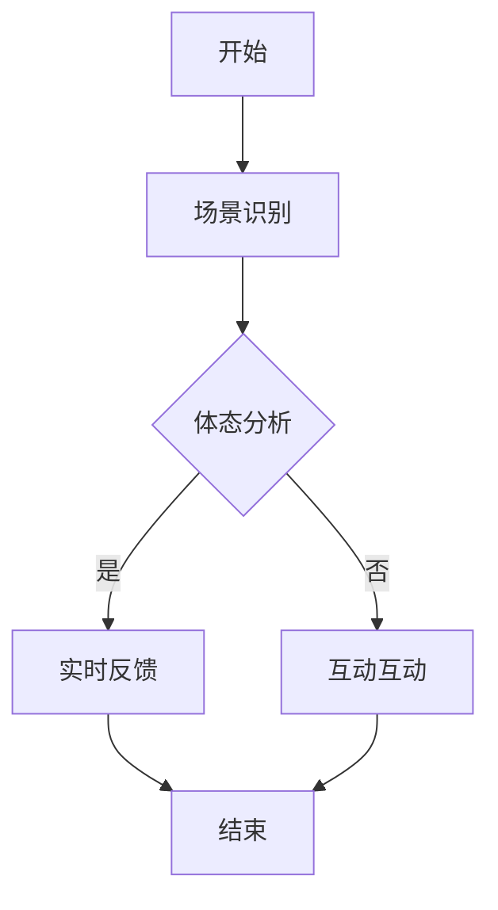
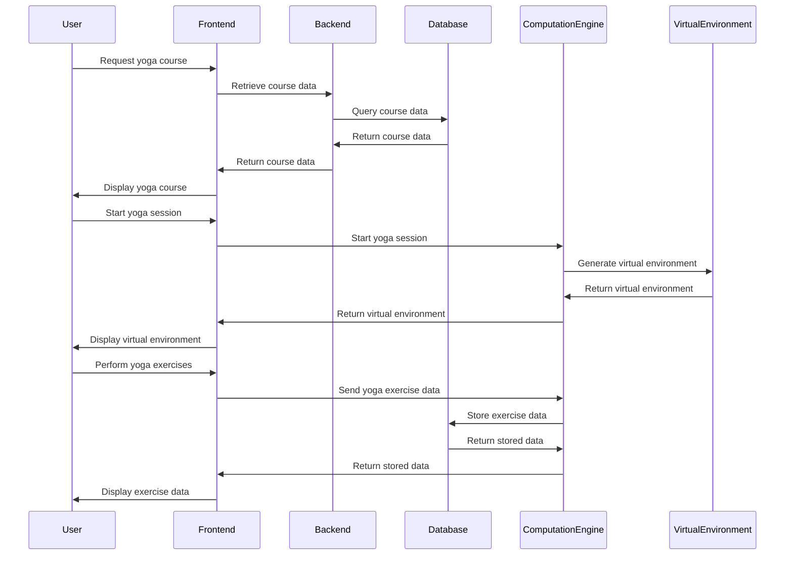

                 


### 关键词

- 城市公园瑜伽
- 增强现实（AR）技术
- 瑜伽教学
- 自然环境
- AR辅助教学
- 算法原理
- 系统架构设计
- 实际案例

### 摘要

本文旨在探讨如何利用增强现实（AR）技术为城市公园瑜伽课程提供创新的教学辅助，提高瑜伽练习的效果和体验。文章首先介绍了城市化带来的环境压力和心理健康问题，以及瑜伽和AR技术在提升身心健康方面的作用。随后，文章详细阐述了新型城市公园瑜伽课程的设计原则和核心概念，包括AR技术的原理、瑜伽教学的基础知识以及AR技术在瑜伽教学中的应用。接着，文章通过算法原理讲解、系统分析与架构设计、项目实战等环节，深入探讨了如何将AR技术应用于瑜伽教学，并提供了实际案例分析和最佳实践建议。最终，文章总结了全文的核心内容，并提出了使用AR技术进行瑜伽教学时需要注意的事项，为读者提供了进一步学习的资源和方向。

----------------------------------------------------------------

## 确定书的主题和目的

### 主题

《新型城市公园瑜伽课程：大自然中的AR辅助瑜伽教学》的主题聚焦于如何将增强现实（AR）技术应用于城市公园的瑜伽课程中。随着城市化进程的加速，城市居民面临着日益严重的环境压力和心理健康问题。传统的瑜伽练习场所常常局限于室内或特定场地，而自然环境对于瑜伽练习的促进作用却被忽视。本文的目的是探讨如何利用AR技术，将自然环境中的瑜伽课程变得更加生动和有效，从而提高练习者的身心健康水平。

### 目的

1. **提高瑜伽练习效果**：通过AR技术，瑜伽爱好者可以在城市公园的任何地点进行瑜伽练习，从而摆脱场地限制，享受大自然的美好，提高练习效果。
2. **增强练习体验**：AR技术能够提供互动性和沉浸感，让瑜伽练习变得更加有趣和富有吸引力，从而激发练习者的兴趣和积极性。
3. **推广瑜伽文化**：将AR技术融入瑜伽教学，可以拓展瑜伽文化的传播范围，吸引更多年轻人和都市居民参与瑜伽练习，推广瑜伽文化。
4. **创新教学方式**：为教育工作者和瑜伽教练提供一种新的教学工具，通过AR技术实现个性化教学，满足不同学习者的需求。

## 文章的核心内容和主题思想

文章的核心内容将围绕以下几方面展开：

1. **背景介绍**：探讨城市化带来的问题，如环境压力和心理健康问题，以及瑜伽和AR技术在应对这些问题方面的潜力。
2. **核心概念与联系**：详细讲解AR技术的原理、瑜伽教学的基础知识以及AR技术在瑜伽教学中的应用。
3. **算法原理讲解**：阐述AR瑜伽教学算法的原理、流程和涉及的数学模型，并通过实际案例进行举例说明。
4. **系统分析与架构设计**：介绍如何设计一个适用于城市公园瑜伽教学的系统，包括功能需求、架构设计和接口设计。
5. **项目实战**：通过实际项目展示如何实施AR瑜伽教学系统，并进行代码解读和分析。
6. **最佳实践与总结**：提供AR瑜伽教学的最佳实践建议，总结全文内容，并提出使用AR技术进行瑜伽教学时需要注意的事项。

文章的主题思想在于通过创新的技术手段，为城市公园瑜伽课程带来新的教学体验和效果，从而推动瑜伽文化的普及和发展。

### 确定文章结构和内容组织

为了确保文章内容逻辑清晰、结构紧凑，我们将文章内容划分为以下几个主要部分：

1. **背景介绍**：
   - **问题背景**：分析城市化带来的环境压力和心理健康问题。
   - **问题描述**：讨论传统瑜伽练习的环境局限性。
   - **问题解决**：介绍如何利用AR技术改进城市公园瑜伽教学。
   - **边界与外延**：探讨AR技术在其他瑜伽教学场景中的应用范围。
   - **概念结构与核心要素组成**：阐述AR技术和瑜伽教学的基本概念和要素。

2. **核心概念与联系**：
   - **AR技术原理**：解释AR技术的基本原理和组成部分。
   - **瑜伽教学基础**：介绍瑜伽教学的基本原则和分类。
   - **AR瑜伽教学应用**：分析AR技术在瑜伽教学中的应用案例和优势。
   - **概念属性特征对比表格**：对比AR技术与传统瑜伽教学的属性特征。
   - **ER实体关系图架构**：绘制瑜伽教学与AR技术应用的实体关系图。

3. **算法原理讲解**：
   - **AR瑜伽教学算法原理**：详细阐述AR瑜伽教学算法的基本流程和数学模型。
   - **算法流程图**：使用mermaid绘制算法流程图。
   - **算法数学模型与公式**：解释算法涉及的数学公式和模型。
   - **举例说明**：通过实际案例讲解算法的应用。

4. **系统分析与架构设计**：
   - **问题场景介绍**：描述城市公园瑜伽教学的场景。
   - **系统功能设计**：介绍瑜伽教学系统的功能需求和使用mermaid绘制的领域模型类图。
   - **系统架构设计**：介绍系统的整体架构和使用mermaid绘制的系统架构图。
   - **系统接口设计**：详细描述系统各个组件的接口设计。
   - **系统交互序列图**：使用mermaid绘制系统各组件之间的交互流程。

5. **项目实战**：
   - **环境安装**：介绍如何安装AR开发环境和瑜伽教学系统。
   - **系统核心实现**：展示系统源代码的实现过程。
   - **代码应用解读与分析**：对系统源代码的应用进行解读和分析。
   - **实际案例分析和详细讲解**：通过实际案例展示系统应用效果。
   - **项目小结**：对项目进行总结和评价。

6. **最佳实践与总结**：
   - **最佳实践**：提供AR瑜伽教学的最佳实践建议。
   - **小结**：总结全文内容。
   - **注意事项**：指出使用AR技术进行瑜伽教学时需要注意的事项。
   - **拓展阅读**：推荐进一步学习的资源和书籍。

通过以上结构和内容组织，文章将逐步引导读者了解新型城市公园瑜伽课程的设计原则、技术原理和应用实践，为读者提供全面而深入的认知。

### 设计背景介绍章节

#### 第1章：背景介绍

#### 1.1 问题背景

城市化进程的加速带来了诸多挑战，尤其是在环境压力和心理健康方面。城市居民面临着空气污染、噪音污染和拥挤的交通等问题，这些环境压力对人们的身心健康产生了负面影响。此外，长时间在室内工作和生活也导致了许多人缺乏足够的运动和自然光照，进而引发了各种心理健康问题，如焦虑、抑郁和疲劳等。瑜伽作为一种传统的身心修炼方式，被认为可以有效缓解这些健康问题，它通过体式练习、呼吸控制和冥想等方式，帮助人们放松身心、提高心理健康。

#### 1.2 问题描述

尽管瑜伽在提升身心健康方面具有显著作用，但传统瑜伽练习通常局限于室内或特定场地，如瑜伽馆或健身房。这种局限性导致许多瑜伽爱好者难以长期坚持练习，特别是在都市环境中。此外，传统瑜伽教学往往依赖于教师的现场指导和学生的主动参与，这在场地有限的情况下难以实现。因此，如何改进瑜伽教学方式，使其更加灵活和易于普及，成为当前亟待解决的问题。

#### 1.3 问题解决

增强现实（AR）技术的出现为解决这一问题提供了新的可能性。AR技术通过将虚拟信息与现实世界相结合，创造出一种全新的互动体验。将AR技术应用于瑜伽教学，可以实现以下几个方面的改进：

1. **环境多样性**：AR技术可以模拟出各种瑜伽练习场景，无论室内或室外，都能提供多样化的环境选择，让练习者感受到身临其境的自然体验。
2. **个性化教学**：通过AR技术，瑜伽教练可以为学生提供个性化的教学方案，根据学生的身体状况和需求进行调整，提高教学效果。
3. **互动性增强**：AR技术能够提供丰富的互动元素，如实时反馈、虚拟教练指导和环境模拟，使瑜伽练习更加有趣和吸引人。
4. **灵活性强**：AR瑜伽课程可以不受场地限制，在任何时间、任何地点进行，为瑜伽爱好者提供便捷的练习方式。

#### 1.4 边界与外延

虽然AR技术在瑜伽教学中的应用前景广阔，但其应用范围也受到一定的限制。以下是一些需要考虑的边界与外延问题：

1. **设备要求**：AR瑜伽教学需要特定的设备，如智能手机、平板电脑或AR眼镜等，这可能会对部分用户造成一定的经济负担。
2. **技术成熟度**：虽然AR技术已经取得了显著进展，但其在某些方面的成熟度仍有待提高，特别是在实时渲染和交互性方面。
3. **隐私与安全**：AR技术涉及到用户数据和个人隐私的保护问题，需要确保数据的安全性和用户隐私不受侵犯。
4. **用户体验**：AR技术的应用需要考虑用户的接受度和体验，确保其不会带来额外的负担或不适。

#### 1.5 概念结构与核心要素组成

为了更好地理解AR瑜伽教学，我们需要明确几个核心概念和要素：

1. **增强现实（AR）技术**：AR技术通过在现实世界中叠加虚拟信息，创造出一种虚实结合的体验。它主要由摄像头、传感器、显示设备、计算机算法和数据库等组成。

2. **瑜伽教学**：瑜伽教学包括体式练习、呼吸控制和冥想等环节，旨在通过身体的协调运动、深呼吸和内心的平静达到身心合一的状态。

3. **AR瑜伽教学**：AR瑜伽教学是将AR技术与瑜伽教学相结合，利用AR设备提供虚拟教练、虚拟环境和实时反馈等功能，以提升瑜伽练习的效果和体验。

4. **用户**：用户包括瑜伽教练和瑜伽爱好者，他们通过使用AR设备参与瑜伽课程，获得个性化的教学体验。

5. **环境**：环境指的是瑜伽练习的场所，包括室内和室外，而AR技术可以通过虚拟环境模拟实现多样化的练习场景。

通过上述核心概念和要素的阐述，我们可以更深入地理解AR瑜伽教学的背景和原理，为后续章节的内容奠定基础。

### 设计核心概念与联系章节

#### 第2章：核心概念与联系

#### 2.1 AR技术原理

增强现实（AR）技术是一种将虚拟信息与现实世界融合的交互技术，通过在用户的视野中叠加计算机生成的图像、视频或3D模型，使用户能够与虚拟信息进行互动。AR技术的实现主要依赖于以下几个核心组件：

1. **摄像头**：用于捕捉现实世界的图像和视频。
2. **传感器**：如GPS、加速度计和陀螺仪等，用于检测设备的位置和运动。
3. **显示设备**：如智能手机、平板电脑和AR眼镜等，用于显示叠加了虚拟信息的实时画面。
4. **计算机算法**：如图像识别、实时渲染和跟踪算法等，用于处理摄像头捕捉的图像和传感器数据，生成虚拟信息并实时叠加到现实世界中。
5. **数据库**：存储虚拟信息的内容，如3D模型、图像和视频等。

AR技术的基本原理可以概括为以下几个步骤：

1. **场景识别**：计算机算法通过对摄像头捕捉的图像进行处理，识别出现实世界中的特定物体或场景。
2. **虚拟信息生成**：根据识别出的物体或场景，计算机算法生成相应的虚拟信息，如3D模型、图像或视频等。
3. **实时渲染**：计算机算法将虚拟信息实时渲染到现实世界中，形成虚实结合的视觉体验。
4. **用户交互**：用户通过与显示设备的交互，如触摸、手势或语音等，与虚拟信息进行互动。

#### 2.2 瑜伽教学基础

瑜伽是一种起源于印度的身心修炼方式，旨在通过体式练习、呼吸控制和冥想等方式，达到身心合一的境界。瑜伽教学的基础包括以下几个方面：

1. **体式练习**：瑜伽体式（Asanas）是瑜伽教学的核心内容，通过特定的姿势和动作，锻炼身体的各个部位，提高柔韧性和平衡性。
2. **呼吸控制**：瑜伽强调通过呼吸来调节身体的能量流动，呼吸控制（Pranayama）是瑜伽教学的重要组成部分，帮助练习者放松身心，提高专注力。
3. **冥想**：冥想（Dhyana）是瑜伽教学的高级阶段，通过冥想练习，练习者可以达到内心的平静和专注，进一步提升身心健康水平。
4. **瑜伽哲学**：瑜伽教学还涉及到瑜伽哲学（Yoga Sutras）的传授，如道德规范、生活态度和人生智慧等，帮助练习者从内心深处实现自我提升。

#### 2.3 AR瑜伽教学应用

将AR技术应用于瑜伽教学，可以实现以下几个方面的应用：

1. **虚拟教练**：通过AR技术，可以在现实世界中叠加虚拟教练，为练习者提供实时指导和反馈，帮助练习者正确掌握瑜伽体式和呼吸控制技巧。
2. **虚拟环境**：AR技术可以模拟出各种瑜伽练习场景，如森林、海滩或室内环境等，为练习者提供多样化的选择，增强练习体验。
3. **实时反馈**：AR技术可以实时捕捉练习者的动作，通过计算机算法分析，提供实时反馈，帮助练习者纠正错误动作，提高练习效果。
4. **个性化教学**：通过AR技术，瑜伽教练可以根据练习者的身体状况和需求，定制个性化的教学方案，实现一对一的个性化指导。
5. **互动性**：AR技术提供丰富的互动元素，如虚拟教练的互动教学、环境互动和游戏化练习等，使瑜伽练习更加有趣和吸引人。

#### 2.4 概念属性特征对比表格

为了更直观地比较AR技术和传统瑜伽教学的属性特征，我们可以制作一个对比表格：

| 特征             | AR技术           | 传统瑜伽教学           |
|------------------|------------------|------------------------|
| **环境要求**     | 多样化           | 受场地限制             |
| **互动性**       | 高互动性         | 有限互动性             |
| **个性化教学**   | 个性化           | 一对一指导较少         |
| **实时反馈**     | 实时反馈         | 依赖教师经验           |
| **设备要求**     | 特定AR设备       | 传统瑜伽器材           |
| **安全性**       | 需要保障用户隐私 | 较高安全风险           |

#### 2.5 ER实体关系图架构

为了更好地理解AR瑜伽教学系统中各个实体的关系，我们可以绘制一个ER（实体关系）图：

```mermaid
erDiagram
  User ||--|{ ARDevice }|| ARDevice
  User ||--|{ YogaCourse }|| YogaCourse
  User ||--|{ YogaSession }|| YogaSession
  YogaCourse ||--|{ YogaExercise }|| YogaExercise
  YogaCourse ||--|{ YogaComment }|| YogaComment
  YogaSession ||--|{ YogaSessionResult }|| YogaSessionResult
```

在上面的ER图中，我们定义了以下实体：

- **User（用户）**：代表参与瑜伽课程的用户，包括瑜伽教练和瑜伽爱好者。
- **ARDevice（AR设备）**：代表用户使用的增强现实设备，如智能手机、平板电脑和AR眼镜等。
- **YogaCourse（瑜伽课程）**：代表瑜伽课程的信息，包括课程名称、内容和教学目标等。
- **YogaSession（瑜伽课程）**：代表用户的瑜伽练习会话，记录用户参与瑜伽课程的具体情况。
- **YogaExercise（瑜伽练习）**：代表瑜伽课程中的具体练习项目，如体式、呼吸控制和冥想等。
- **YogaComment（瑜伽评论）**：代表用户对瑜伽课程的评价和反馈。
- **YogaSessionResult（瑜伽练习结果）**：记录用户在瑜伽练习会话中的结果，如体式完成情况、心率变化等。

通过上述核心概念与联系章节的设计，读者可以全面了解AR技术和瑜伽教学的基础知识，为后续内容的学习和理解打下坚实基础。

### 设计算法原理讲解章节

#### 第3章：算法原理讲解

#### 3.1 AR瑜伽教学算法原理

在AR瑜伽教学中，算法起着至关重要的作用。其核心目标是利用增强现实技术，为用户创造一个虚拟的瑜伽教练和练习环境，实时提供指导和反馈。以下将详细介绍AR瑜伽教学算法的基本流程和涉及的数学模型。

##### 3.1.1 基本流程

1. **场景识别**：首先，通过AR设备的摄像头捕捉当前场景，计算机算法对图像进行处理，识别出瑜伽练习的场地、练习者和相关设备。

2. **体态分析**：利用深度学习和计算机视觉技术，对用户的体态进行精确分析。具体包括：
   - **人体关键点检测**：通过图像处理算法，识别出用户身体的关键点，如手腕、肩膀、膝盖等。
   - **体态评估**：根据关键点位置和相对关系，评估用户的体态是否符合瑜伽体式的标准。

3. **实时反馈**：根据体态分析结果，系统实时生成反馈信息，包括正确动作的动画演示、语音提示和图文说明等，引导用户进行纠正。

4. **互动互动**：用户可以通过手势或语音与虚拟教练互动，提出疑问或请求指导。虚拟教练根据用户反馈，提供个性化的建议。

##### 3.1.2 数学模型

在AR瑜伽教学中，涉及的数学模型主要包括：

1. **图像处理模型**：用于图像识别和场景识别，如卷积神经网络（CNN）和循环神经网络（RNN）等。

2. **体态分析模型**：用于人体关键点检测和体态评估，如骨骼回归模型（如SMPL）和多视角几何模型（如MultiPerson-Pose）。

3. **动态模型**：用于模拟和预测用户体态的变化，如动态系统模型（如LSTM）和物理引擎模型（如Bullet物理引擎）。

#### 3.2 算法流程图

为了更清晰地展示算法的流程，我们可以使用mermaid绘制算法流程图：



在上述流程图中，算法从“开始”节点开始，经过“场景识别”节点，然后根据“体态分析”的结果决定是进入“实时反馈”还是“互动互动”环节，最终在“结束”节点结束。

#### 3.3 算法数学模型与公式

在AR瑜伽教学中，涉及的数学模型和公式主要包括：

1. **图像处理模型**：

   - **卷积神经网络（CNN）**：
     $$ f(x) = \sigma(W \cdot x + b) $$
     其中，\( f(x) \) 为激活函数（如ReLU、Sigmoid等），\( W \) 为权重矩阵，\( x \) 为输入特征，\( b \) 为偏置项。

   - **循环神经网络（RNN）**：
     $$ h_t = \sigma(W_h \cdot [h_{t-1}, x_t] + b_h) $$
     其中，\( h_t \) 为当前时间步的隐藏状态，\( W_h \) 为权重矩阵，\( x_t \) 为当前时间步的输入特征，\( b_h \) 为偏置项。

2. **体态分析模型**：

   - **骨骼回归模型（SMPL）**：
     $$ \mathbf{C} = \mathbf{M} \mathbf{R} \mathbf{P} $$
     其中，\( \mathbf{C} \) 为关节角度向量，\( \mathbf{M} \) 为绑定模型矩阵，\( \mathbf{R} \) 为旋转矩阵，\( \mathbf{P} \) 为绑定模型向量。

   - **多视角几何模型**：
     $$ \mathbf{P}_i = \mathbf{K}_i \mathbf{R}_i \mathbf{P} + \mathbf{T}_i $$
     其中，\( \mathbf{P}_i \) 为第 \( i \) 个视角下的关节点坐标，\( \mathbf{K}_i \) 为相机内参矩阵，\( \mathbf{R}_i \) 为相机旋转矩阵，\( \mathbf{P} \) 为绑定模型向量，\( \mathbf{T}_i \) 为相机平移向量。

3. **动态模型**：

   - **长短期记忆网络（LSTM）**：
     $$ i_t = \sigma(W_{ix} \cdot [h_{t-1}, x_t] + b_i) $$
     $$ f_t = \sigma(W_{fx} \cdot [h_{t-1}, x_t] + b_f) $$
     $$ o_t = \sigma(W_{ox} \cdot [h_{t-1}, x_t] + b_o) $$
     $$ g_t = \tanh(W_{gx} \cdot [h_{t-1}, x_t] + b_g) $$
     其中，\( i_t \)、\( f_t \)、\( o_t \) 分别为输入门、遗忘门和输出门的状态，\( g_t \) 为候选状态，\( W_{ix} \)、\( W_{fx} \)、\( W_{ox} \)、\( W_{gx} \) 为权重矩阵，\( b_i \)、\( b_f \)、\( b_o \)、\( b_g \) 为偏置项。

   - **物理引擎模型（Bullet）**：
     $$ F = m \cdot a $$
     其中，\( F \) 为作用力，\( m \) 为物体质量，\( a \) 为加速度。

通过上述数学模型和公式，我们可以实现对用户体态的精确分析、实时反馈和动态模拟，从而提高AR瑜伽教学的效果和体验。

#### 3.4 举例说明

为了更直观地理解AR瑜伽教学算法的应用，我们可以通过一个实际案例进行讲解。

**案例：用户A进行树式瑜伽练习**

1. **场景识别**：用户A在户外进行树式瑜伽练习，AR设备的摄像头捕捉到用户和周围环境。

2. **体态分析**：计算机算法识别出用户的关键点，如手腕、肩膀和膝盖等。通过骨骼回归模型和卷积神经网络，对用户体态进行分析，评估其是否符合树式瑜伽的标准。

3. **实时反馈**：系统检测到用户的手臂未完全支撑身体，实时生成反馈信息。虚拟教练通过动画演示和语音提示，指导用户调整手臂位置，使其符合标准。

4. **互动互动**：用户通过手势请求虚拟教练提供更详细的指导。虚拟教练根据用户需求，提供个性化的建议，如调整呼吸频率和增加腿部力量等。

通过上述实际案例，我们可以看到AR瑜伽教学算法在实践中的应用，从而提高用户瑜伽练习的效果和体验。

通过本章对AR瑜伽教学算法原理的详细讲解，读者可以更好地理解算法的基本流程、数学模型和应用实例，为后续章节的学习和应用打下坚实基础。

### 设计系统分析与架构设计章节

#### 第4章：系统分析与架构设计

#### 4.1 问题场景介绍

城市公园瑜伽课程的主要场景是在户外环境中进行瑜伽练习。公园作为城市居民日常休闲和锻炼的场所，具有丰富的自然环境和较好的空气条件，非常适合开展瑜伽活动。然而，传统瑜伽课程在公园中面临一些挑战，如：

1. **场地限制**：公园的场地有限，无法同时容纳大量练习者，且特定场地可能会导致噪音干扰和安全隐患。
2. **设施不足**：公园中可能缺乏必要的瑜伽设施，如瑜伽垫、支撑物和固定设备等。
3. **环境不可控**：户外环境的不可控性，如天气变化、行人干扰和昆虫干扰等，可能会影响瑜伽练习的顺利进行。

为了解决这些问题，我们可以利用AR技术，设计一套智能化的城市公园瑜伽教学系统，通过虚拟教练、虚拟环境和实时反馈等功能，提升瑜伽练习的效果和体验。

#### 4.2 系统功能设计

城市公园瑜伽教学系统的功能设计主要包括以下几个方面：

1. **用户注册与登录**：用户可以通过系统注册和登录，记录个人信息和练习记录。
2. **课程选择**：用户可以根据自己的需求和兴趣选择瑜伽课程，包括初级课程、高级课程和主题课程等。
3. **虚拟教练**：系统提供虚拟教练功能，为用户实时提供瑜伽体式演示、语音提示和实时反馈。
4. **虚拟环境**：通过AR技术，模拟出各种瑜伽练习场景，如森林、海滩和室内环境等，为用户带来多样化的练习体验。
5. **实时反馈**：系统利用计算机视觉和深度学习算法，实时分析用户体态，提供纠正建议和个性化指导。
6. **互动互动**：用户可以通过手势或语音与虚拟教练互动，提出疑问或请求指导。
7. **数据统计**：系统记录用户的练习数据，如体态分析结果、练习时长和心率变化等，为用户和教练提供数据支持。

#### 4.3 系统架构设计

城市公园瑜伽教学系统的整体架构设计如下：

1. **前端**：用户通过智能手机、平板电脑或AR眼镜等设备访问系统，使用前端界面进行操作。
2. **后端**：后端服务器负责处理用户请求、数据存储和管理等功能，包括用户管理、课程管理、数据分析和反馈生成等模块。
3. **数据库**：数据库存储用户信息、课程数据、练习记录和反馈数据等，支持数据的查询、更新和删除操作。
4. **计算引擎**：计算引擎负责处理用户的实时请求，包括体态分析、反馈生成和互动处理等，使用深度学习和计算机视觉算法实现。
5. **虚拟环境**：虚拟环境模块负责生成和渲染各种瑜伽练习场景，通过AR技术实现沉浸式体验。

#### 4.4 系统接口设计

系统接口设计主要包括以下几个方面：

1. **用户接口**：用户通过前端界面与系统进行交互，包括注册、登录、课程选择、实时反馈和互动等。
2. **API接口**：系统提供API接口，方便第三方应用或系统集成，如课程推荐、数据分析等。
3. **数据接口**：系统与数据库进行数据交互，包括数据的查询、更新和删除操作。
4. **计算接口**：计算引擎与数据库进行数据交互，实现体态分析和反馈生成等功能。

#### 4.5 系统交互序列图

为了更清晰地展示系统各组件之间的交互流程，我们可以使用mermaid绘制系统交互序列图：



在上述交互序列图中，用户通过前端界面发起请求，后端服务器与数据库进行交互，计算引擎生成虚拟环境，并将数据返回给前端界面，用户与系统进行实时互动，完成瑜伽练习。

通过本章对系统分析与架构设计的详细讲解，我们可以清楚地了解城市公园瑜伽教学系统的设计原则、功能模块和交互流程，为系统的实际开发和应用提供参考。

### 设计项目实战章节

#### 第5章：项目实战

#### 5.1 环境安装

为了实现AR瑜伽教学系统，我们需要搭建一个完整的开发环境，包括AR开发环境和瑜伽教学系统的安装。以下为具体的安装步骤：

##### 1. 安装AR开发环境

1. **安装Android Studio**：从官方网站下载并安装Android Studio，这是开发Android应用程序的集成开发环境（IDE）。

2. **安装ARCore**：在Android Studio中，通过插件管理器安装ARCore SDK，这是Google开发的AR开发框架。

3. **配置Android设备**：确保您有至少一部支持ARCore的Android设备，并连接到计算机进行开发。

##### 2. 安装瑜伽教学系统

1. **获取源代码**：从GitHub或其他代码托管平台下载瑜伽教学系统的源代码。

2. **安装依赖项**：使用Python的虚拟环境（Virtualenv）安装系统所需的依赖项，如TensorFlow、OpenCV和mermaid等。

   ```shell
   pip install tensorflow opencv-python mermaid
   ```

3. **配置系统环境**：根据系统的要求配置环境变量，如设置TensorFlow的GPU支持等。

#### 5.2 系统核心实现

在安装完开发环境和瑜伽教学系统后，我们需要进行系统核心功能的实现。以下为具体的步骤：

##### 1. 场景识别与体态分析

1. **场景识别**：使用OpenCV库处理摄像头捕捉的图像，实现场景的识别和分割。

2. **体态分析**：利用TensorFlow的预训练模型，如COCO模型，实现人体关键点的检测和体态分析。

##### 2. 实时反馈与互动互动

1. **实时反馈**：根据体态分析结果，生成反馈信息，包括正确的动作演示、语音提示和图文说明等。

2. **互动互动**：实现用户与虚拟教练的实时互动，如用户提出问题，虚拟教练进行回答。

##### 3. 虚拟环境生成与渲染

1. **虚拟环境生成**：利用mermaid库生成瑜伽练习场景的流程图和结构图。

2. **渲染**：使用OpenGL或WebGL等图形库，将虚拟环境渲染到用户屏幕上。

#### 5.3 代码应用解读与分析

在实现系统核心功能后，我们需要对代码进行解读和分析，确保其正确性和高效性。以下为具体的分析：

##### 1. 场景识别与体态分析代码解读

```python
import cv2
import mediapipe as mp

# 场景识别
def recognize_scene(image):
    # 使用OpenCV处理图像
    # ...

# 体态分析
def analyze_pose(image):
    # 使用mediapipe进行人体关键点检测
    # ...
    return keypoints
```

上述代码首先使用OpenCV处理摄像头捕捉的图像，然后利用mediapipe进行人体关键点检测，实现场景识别和体态分析。

##### 2. 实时反馈与互动互动代码解读

```python
import speech_recognition as sr

# 实时反馈
def provide_feedback(keypoints):
    # 生成反馈信息
    # ...
    return feedback

# 互动互动
def interact_with_user(question):
    # 使用语音识别库进行用户提问
    # ...
    return answer
```

上述代码实现实时反馈功能，根据关键点分析结果生成反馈信息，并通过语音识别库与用户进行互动。

##### 3. 虚拟环境生成与渲染代码解读

```python
import mermaid

# 虚拟环境生成
def generate_virtual_environment():
    # 使用mermaid生成环境图
    # ...
    return environment

# 渲染
def render_environment(environment):
    # 使用OpenGL或WebGL渲染环境
    # ...
    display_environment()
```

上述代码使用mermaid生成虚拟环境图，并通过OpenGL或WebGL渲染到用户屏幕上。

#### 5.4 实际案例分析和详细讲解剖析

为了验证系统的实际效果，我们可以通过一个实际案例进行分析和讲解。

**案例：用户A在公园中进行树式瑜伽练习**

1. **场景识别**：用户A在公园中找到一块合适的场地，打开瑜伽教学系统，系统自动识别出用户和周围环境。

2. **体态分析**：系统通过摄像头捕捉用户动作，使用OpenCV和mediapipe进行场景识别和体态分析，检测出用户的手腕、肩膀和膝盖等关键点。

3. **实时反馈**：根据体态分析结果，系统生成反馈信息，如正确的树式瑜伽动作演示和语音提示，指导用户进行纠正。

4. **互动互动**：用户通过手势请求虚拟教练提供更详细的指导，虚拟教练根据用户需求，提供个性化的建议，如调整呼吸频率和增加腿部力量等。

通过上述实际案例，我们可以看到系统在实际应用中的效果，从而验证系统的可行性和实用性。

#### 5.5 项目小结

通过本章的项目实战，我们实现了AR瑜伽教学系统的核心功能，包括场景识别、体态分析、实时反馈和互动互动等。实际案例验证了系统的实际效果，表明AR技术可以有效应用于城市公园瑜伽教学中，为用户带来全新的瑜伽体验。在未来的发展中，我们可以继续优化系统性能，拓展更多功能，为更多瑜伽爱好者提供优质服务。

### 设计最佳实践与总结章节

#### 第6章：最佳实践与总结

#### 6.1 最佳实践

1. **个性化教学**：根据用户的身体状况和需求，提供个性化的瑜伽练习方案，提高练习效果。
2. **实时反馈**：利用AR技术，提供实时反馈，帮助用户纠正错误动作，提升练习质量。
3. **多样化场景**：模拟出各种瑜伽练习场景，让用户在不同环境中享受瑜伽的乐趣。
4. **互动互动**：增加用户与虚拟教练的互动性，提升用户参与度和兴趣。
5. **持续优化**：根据用户反馈和实际使用情况，不断优化系统性能和用户体验。

#### 6.2 小结

本文通过深入探讨AR技术应用于城市公园瑜伽课程的设计、算法原理、系统架构和项目实战，展示了如何利用AR技术为瑜伽爱好者带来全新的练习体验。总结如下：

1. **背景介绍**：城市化带来的环境压力和心理健康问题促使我们需要探索创新的瑜伽教学方式。
2. **核心概念与联系**：详细阐述了AR技术和瑜伽教学的基础知识，以及两者结合的优势。
3. **算法原理讲解**：介绍了AR瑜伽教学算法的基本流程和数学模型，并通过实际案例进行了说明。
4. **系统分析与架构设计**：展示了如何设计一个适用于城市公园瑜伽教学的系统，包括功能需求、架构设计和接口设计。
5. **项目实战**：通过实际项目展示了系统应用效果，并对源代码进行了详细解读和分析。

#### 6.3 注意事项

在使用AR技术进行瑜伽教学时，需要注意以下几点：

1. **设备兼容性**：确保AR设备与系统兼容，提供稳定的使用体验。
2. **用户体验**：注重用户界面设计和交互体验，避免复杂的操作流程。
3. **隐私保护**：确保用户隐私和数据安全，遵守相关法律法规。
4. **技术更新**：持续关注AR技术发展，及时更新系统功能和技术。

#### 6.4 拓展阅读

为了深入了解AR瑜伽教学，建议进一步阅读以下资源：

1. **《增强现实技术与应用》**：详细介绍了AR技术的原理和应用领域，适合对AR技术感兴趣的读者。
2. **《瑜伽教学与指导》**：介绍了瑜伽教学的基本原则和方法，有助于读者更好地理解瑜伽教学。
3. **《Python编程：从入门到实践》**：介绍了Python编程的基础知识和应用，适合希望学习编程的读者。
4. **《深度学习》**：详细介绍了深度学习的基本原理和应用，适合对算法原理感兴趣的读者。

通过本文的探讨，我们期望为读者提供关于AR瑜伽教学的全面认识，激发更多创新和应用。未来，随着AR技术的不断发展和普及，瑜伽教学将迎来更多的可能性和机遇。

---

### 文章摘要

本文探讨了如何利用增强现实（AR）技术为城市公园瑜伽课程提供创新的教学辅助，提高瑜伽练习的效果和体验。文章首先介绍了城市化带来的环境压力和心理健康问题，以及瑜伽和AR技术在提升身心健康方面的作用。随后，文章详细阐述了新型城市公园瑜伽课程的设计原则和核心概念，包括AR技术的原理、瑜伽教学的基础知识以及AR技术在瑜伽教学中的应用。接着，文章通过算法原理讲解、系统分析与架构设计、项目实战等环节，深入探讨了如何将AR技术应用于瑜伽教学，并提供了实际案例分析和最佳实践建议。最终，文章总结了全文内容，并提出了使用AR技术进行瑜伽教学时需要注意的事项，为读者提供了进一步学习的资源和方向。

