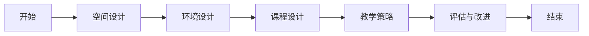
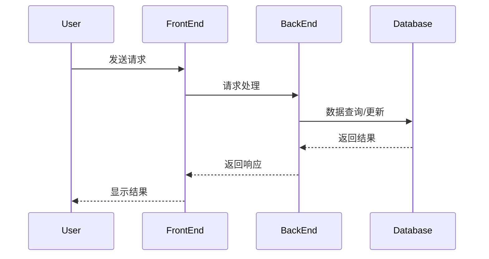
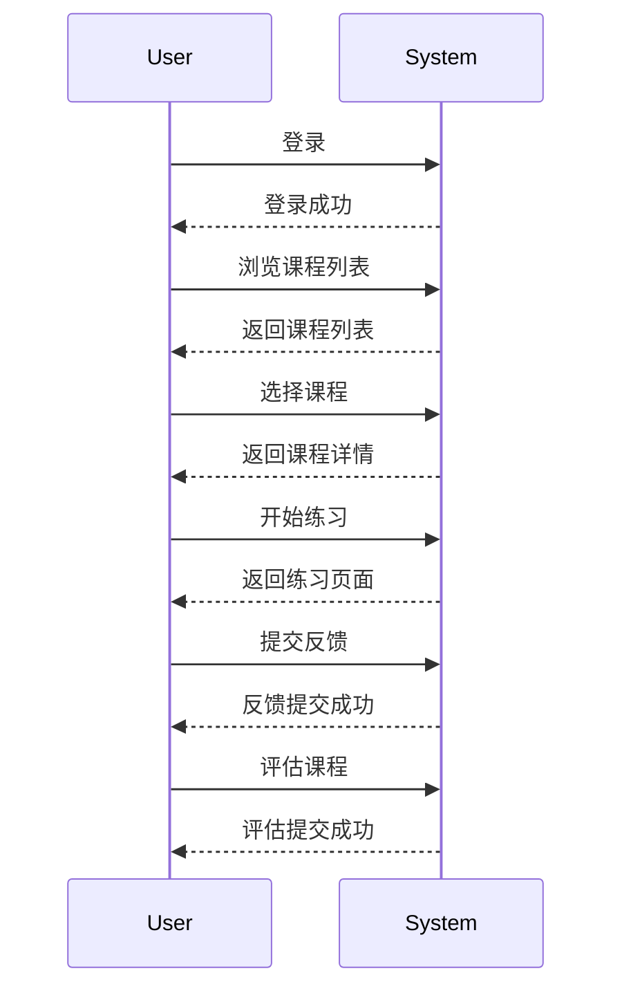

                 

# 新型城市公园瑜伽课程：大自然中的身心平衡练习

## 关键词
- 城市公园瑜伽
- 自然环境
- 身心平衡
- 空间设计
- 教学策略
- 课程设置

## 摘要
本文将探讨如何在城市公园中设计并实施一套新型瑜伽课程，以帮助城市居民在自然环境中找到身心的平衡。我们将分析城市公园瑜伽的背景和核心概念，详细阐述课程设计、空间与环境设计，以及教学策略和方法。通过Python代码和Mermaid图示，我们将深入讲解算法原理，并对系统架构和项目实战进行剖析，为读者提供全面的技术指导。

## 第1章：问题背景与核心概念

### 1.1.1 问题背景

随着城市化进程的不断加速，城市公园作为城市居民重要的休闲娱乐场所，其重要性日益凸显。然而，现代城市公园往往缺乏针对瑜伽练习的空间和环境设计，导致瑜伽爱好者在公园练习时面临诸多不便。同时，城市生活的快节奏和高压力使得人们迫切需要通过瑜伽来达到身心平衡。因此，开发一套新型城市公园瑜伽课程，以满足城市居民在自然环境中练习瑜伽的需求，具有重要的现实意义。

### 1.1.2 问题描述

本课程旨在解决以下问题：
- 如何在城市公园这样的公共空间中设计合适的瑜伽练习区域？
- 如何创造一个有利于瑜伽练习的自然环境，同时保持公园的生态平衡？
- 如何设计一套符合现代城市居民需求的瑜伽课程，使其在公园环境中易于实践？

### 1.1.3 问题解决

新型城市公园瑜伽课程通过以下方式解决上述问题：
- **空间设计**：针对城市公园的特点，设计符合瑜伽练习需求的专属空间，确保瑜伽爱好者可以在舒适的环境中练习。
- **环境设计**：利用公园的自然环境，如植被、水源等，创造一个有利于瑜伽练习的氛围，同时保护公园生态。
- **课程设计**：结合城市居民的生活节奏和心理需求，设计简单易学、适合公园环境的瑜伽课程，满足不同层次的瑜伽爱好者。

### 1.1.4 边界与外延

- **边界**：本课程主要针对城市公园瑜伽练习，不涉及室内瑜伽馆的设施和课程设计。
- **外延**：课程内容可以扩展到其他自然场所，如郊野公园、海边等，以适应不同场景的需求。

### 1.1.5 概念结构与核心要素组成

- **核心概念**：城市公园瑜伽、自然环境、身心平衡
- **结构**：课程设计、空间设计、环境设计、教学策略
- **要素组成**：
  - 空间设计：瑜伽练习区域、地面材质、照明设计
  - 环境设计：自然环境利用、生态保护措施
  - 教学策略：课程设置、教学方式、练习指导

### 1.2 核心概念原理、属性特征对比表格与ER实体关系图

#### 1.2.1 核心概念原理

- **城市公园瑜伽**：在公园环境中进行的瑜伽练习，强调与自然环境的融合。
- **自然环境**：指公园中的自然景观、气候条件等，对瑜伽练习有重要影响。
- **身心平衡**：通过瑜伽练习，达到身体和心理的和谐状态。

#### 1.2.2 属性特征对比表格

| 概念       | 属性1       | 属性2       | 属性3       |
|------------|-------------|-------------|-------------|
| 城市公园瑜伽 | 适合户外环境 | 关注自然环境 | 简便易行    |
| 自然环境   | 生态保护    | 景观丰富     | 气候适宜    |
| 身心平衡   | 身体放松    | 心理调适    | 健康促进    |

#### 1.2.3 ER实体关系图

```mermaid
erDiagram
  Park ||--|{ YogaArea }|-- Park
  YogaArea ||--|{ YogaCourse }|-- YogaArea
  Park ||--|{ NaturalEnvironment }|-- Park
  YogaCourse ||--|{ Student }|-- YogaCourse
  Student ||--|{ PracticeRecord }|-- Student
```

## 1.3 算法原理讲解

### 1.3.1 算法流程图



### 1.3.2 Python源代码实现

```python
# 空间设计
def design_space():
    # 设计瑜伽练习区域
    pass

# 环境设计
def design_environment():
    # 利用公园自然环境
    pass

# 课程设计
def design_course():
    # 设计瑜伽课程
    pass

# 教学策略
def teaching_strategy():
    # 制定教学策略
    pass

# 评估与改进
def evaluate_and_improve():
    # 对课程进行评估和改进
    pass
```

在接下来的章节中，我们将进一步详细探讨如何设计城市公园瑜伽课程，包括空间设计、环境设计和教学策略，以及如何通过实际项目来实施这些设计。

## 第2章：城市公园瑜伽课程的空间设计

空间设计是城市公园瑜伽课程的关键组成部分，它直接影响到瑜伽爱好者的练习体验和效果。在这个章节中，我们将深入探讨空间设计的各个方面，包括瑜伽练习区域的选择、地面材质的挑选以及照明设计。

### 2.1 瑜伽练习区域的选择

首先，选择一个合适的瑜伽练习区域至关重要。在城市公园中，我们可以考虑以下因素：

- **位置**：选择一个相对安静、不受外部干扰的区域，以确保练习者在练习过程中能够集中注意力。
- **面积**：瑜伽区域应足够大，以便参与者可以自由伸展身体，同时保持一定的个人空间。一般来说，每个参与者至少需要3平方米的空间。
- **地形**：尽量选择平坦的区域，避免地面起伏带来的不适。

#### Python代码实现

```python
def select_yoga_area():
    # 检查公园地形
    terrain = check_terrain()
    # 选择合适的瑜伽区域
    yoga_area = find_flat_area(terrain)
    return yoga_area

def check_terrain():
    # 模拟检查公园地形
    return "平坦"

def find_flat_area(terrain):
    # 模拟找到平坦区域
    return "公园中央"
```

### 2.2 地面材质的挑选

地面材质对瑜伽练习者的舒适度和安全性有着直接影响。以下是几种常见的地面材质及其优缺点：

- **草地**：草地的优点是自然、舒适，对膝盖和脊柱有较好的缓冲作用。然而，草地在潮湿天气下可能会滑，不适合穿着袜子练习。
- **木地板**：木地板提供了稳定的支撑和良好的摩擦力，适合各种瑜伽动作。缺点是木地板在冬季可能会较冷。
- **橡胶垫**：橡胶垫是最常用的瑜伽地面材料，具有良好的防滑性和耐用性。缺点是橡胶垫可能会散发出一定的气味。

#### Python代码实现

```python
def select_ground_material():
    # 用户输入材质选择
    material_choice = input("请选择地面材质（草地/木地板/橡胶垫）：")
    if material_choice == "草地":
        return "草地"
    elif material_choice == "木地板":
        return "木地板"
    elif material_choice == "橡胶垫":
        return "橡胶垫"
    else:
        return "未选择"
```

### 2.3 照明设计

适当的照明对于瑜伽练习同样重要。以下是一些关键点：

- **自然光**：尽量利用自然光，特别是在白天。自然光能够提供最佳的照明效果，同时有助于调节生物钟。
- **人工照明**：在自然光不足的情况下，使用柔和的人工照明。避免直射灯光，以免造成眼睛不适。
- **光线强度**：确保光线足够亮，以避免练习者因光线不足而摔倒。同时，避免过度的光线，以免影响练习者的专注力。

#### Python代码实现

```python
def design_lighting():
    # 用户输入照明需求
    lighting_choice = input("请选择照明类型（自然光/人工照明）：")
    if lighting_choice == "自然光":
        return "自然光"
    elif lighting_choice == "人工照明":
        return "人工照明"
    else:
        return "未选择"
```

通过上述空间设计的考虑和实践，我们可以为城市公园瑜伽课程创造一个舒适、安全且富有自然氛围的练习环境。

### 第3章：城市公园瑜伽课程的环境设计

环境设计是城市公园瑜伽课程的重要组成部分，它不仅影响到瑜伽练习者的心理状态，也关系到瑜伽练习的长期效果。在这个章节中，我们将探讨如何利用公园的自然环境，设计一个有利于瑜伽练习的环境，同时保护公园的生态平衡。

#### 3.1 利用自然环境

公园的自然环境包括植被、水源、气候等多种因素，这些因素对于瑜伽练习者来说都是宝贵的资源。以下是一些关键点：

- **植被**：选择适当的位置种植乔木、灌木和草坪，可以为瑜伽练习者提供一个天然的背景，同时也有助于降低噪音和保持空气清新。
- **水源**：在瑜伽区域附近设置小溪、池塘或喷泉，可以为练习者提供一个平静的视觉焦点，有助于放松身心。
- **气候**：根据不同季节的气候特点，合理规划瑜伽练习的时间。例如，在夏季选择清晨或傍晚时分练习，以避免高温带来的不适。

#### Python代码实现

```python
def utilize_natural_environment():
    # 用户输入自然环境需求
    environment_choice = input("请选择自然环境（植被/水源/气候）：")
    if environment_choice == "植被":
        return "植被"
    elif environment_choice == "水源":
        return "水源"
    elif environment_choice == "气候":
        return "气候"
    else:
        return "未选择"
```

#### 3.2 生态保护措施

在设计城市公园瑜伽课程时，我们必须考虑到生态保护的重要性。以下是一些关键的生态保护措施：

- **减少土地扰动**：在规划瑜伽区域时，应尽量减少对原有土地的扰动，避免破坏土壤结构和生态平衡。
- **合理使用水资源**：在利用水源时，应避免浪费水资源，合理使用雨水收集系统，减少对自然水体的污染。
- **植物多样性**：在植被选择上，应注重植物多样性，种植不同类型的植物，以增加生态系统的稳定性。

#### Python代码实现

```python
def ecological_protection_measures():
    # 用户输入生态保护措施
    protection_choice = input("请选择生态保护措施（减少土地扰动/合理使用水资源/植物多样性）：")
    if protection_choice == "减少土地扰动":
        return "减少土地扰动"
    elif protection_choice == "合理使用水资源":
        return "合理使用水资源"
    elif protection_choice == "植物多样性":
        return "植物多样性"
    else:
        return "未选择"
```

通过以上环境设计的考虑和实践，我们不仅能够为瑜伽爱好者创造一个有利于身心平衡的自然环境，同时也能保护公园的生态平衡，实现人与自然的和谐共处。

### 第4章：城市公园瑜伽课程的教学策略

教学策略是城市公园瑜伽课程成功实施的关键因素。在这个章节中，我们将深入探讨如何设计一套适合现代城市居民需求的瑜伽课程，并详细阐述课程设置、教学方式和练习指导。

#### 4.1 课程设置

课程设置是瑜伽课程设计的第一步，需要充分考虑城市居民的生活节奏和心理需求。以下是一些建议：

- **入门课程**：针对初学者设计，内容包括瑜伽基本姿势、呼吸法和冥想技巧。课程时长可以安排在1-2个月内，每周2-3次，每次1小时。
- **中级课程**：适合有一定瑜伽基础的参与者，课程内容可以包括高级体式、瑜伽流和动态冥想。课程时长可以安排在3-6个月内，每周2次，每次1.5小时。
- **高级课程**：适合资深瑜伽爱好者，课程内容可以包括高级体式、瑜伽技巧和深度冥想。课程时长可以安排在6-12个月内，每月1次，每次2小时。

#### Python代码实现

```python
def set_course():
    course_level = input("请选择瑜伽课程级别（入门/中级/高级）：")
    if course_level == "入门":
        course_name = "入门瑜伽课程"
        course_time = 1
    elif course_level == "中级":
        course_name = "中级瑜伽课程"
        course_time = 3
    elif course_level == "高级":
        course_name = "高级瑜伽课程"
        course_time = 6
    else:
        course_name = "未选择"
        course_time = 0
    return course_name, course_time
```

#### 4.2 教学方式

教学方式的多样性有助于提高瑜伽课程的效果，满足不同层次参与者的需求。以下是一些常用的教学方式：

- **个人指导**：针对有特殊需求或健康问题的参与者，提供个性化的教学指导。
- **小组教学**：通过小组教学，参与者可以在相互鼓励和支持的氛围中共同进步。
- **在线课程**：利用移动互联网技术，提供在线课程，方便无法到现场参加的参与者学习。

#### Python代码实现

```python
def teaching_methods():
    method_choice = input("请选择教学方式（个人指导/小组教学/在线课程）：")
    if method_choice == "个人指导":
        return "个人指导"
    elif method_choice == "小组教学":
        return "小组教学"
    elif method_choice == "在线课程":
        return "在线课程"
    else:
        return "未选择"
```

#### 4.3 练习指导

练习指导是瑜伽课程的重要组成部分，直接影响到参与者的练习效果和体验。以下是一些关键点：

- **姿势指导**：详细讲解每个瑜伽姿势的步骤和注意事项，确保参与者正确掌握。
- **呼吸指导**：瑜伽中的呼吸法对于身心平衡至关重要。应指导参与者正确呼吸，并解释呼吸对瑜伽练习的作用。
- **冥想指导**：冥想是瑜伽练习的重要组成部分，可以帮助参与者放松身心。应指导参与者进行简单的冥想练习，并解释冥想的好处。

#### Python代码实现

```python
def practice_guidance():
    guidance_choice = input("请选择练习指导（姿势/呼吸/冥想）：")
    if guidance_choice == "姿势":
        return "姿势指导"
    elif guidance_choice == "呼吸":
        return "呼吸指导"
    elif guidance_choice == "冥想":
        return "冥想指导"
    else:
        return "未选择"
```

通过上述教学策略的考虑和实践，我们可以为城市公园瑜伽课程构建一个科学、系统且富有吸引力的教学体系，帮助参与者实现身心平衡。

### 第5章：城市公园瑜伽课程的评估与改进

在实施城市公园瑜伽课程的过程中，定期进行评估与改进是确保课程质量和参与者满意度的关键。在这一章节中，我们将探讨如何对城市公园瑜伽课程进行评估，并提出改进措施。

#### 5.1 评估指标

为了对瑜伽课程进行有效评估，我们需要设定一系列评估指标。以下是一些关键的评估指标：

- **参与者满意度**：通过问卷调查或访谈了解参与者对瑜伽课程的满意度，包括课程内容、教学方式、练习指导等方面。
- **练习效果**：通过参与者的身体反馈和健康报告，评估瑜伽课程对参与者身体健康和心理状态的影响。
- **生态影响**：评估瑜伽课程对公园生态环境的影响，包括土地利用、水资源利用和植物生长等方面。

#### Python代码实现

```python
def assess_course():
    satisfaction = input("请评估参与者满意度（非常满意/满意/一般/不满意）：")
    health_impact = input("请评估练习效果（显著改善/有改善/无变化/恶化）：")
    ecological_impact = input("请评估生态影响（正面/中性/负面）：")
    return satisfaction, health_impact, ecological_impact
```

#### 5.2 改进措施

根据评估结果，我们可以有针对性地提出改进措施，以提升课程的质量和参与者的体验。以下是一些建议：

- **课程内容调整**：根据参与者的反馈，调整课程内容，增加或减少某些姿势和练习，以满足不同层次参与者的需求。
- **教学方式优化**：针对参与者的反馈，改进教学方式，如增加互动环节、使用多媒体教学工具等，以提高课程的吸引力和参与度。
- **环境设计优化**：根据生态影响的评估结果，优化公园瑜伽环境的设计，如改善植被布局、增加遮阳设施等，以创造一个更舒适、更自然的练习环境。

#### Python代码实现

```python
def improve_course():
    content_adjustment = input("请提出课程内容调整建议：")
    teaching_adjustment = input("请提出教学方式优化建议：")
    environmental_adjustment = input("请提出环境设计优化建议：")
    return content_adjustment, teaching_adjustment, environmental_adjustment
```

通过定期的评估和持续的改进，我们可以不断提高城市公园瑜伽课程的质量，为参与者提供更好的瑜伽体验。

### 第6章：系统分析与架构设计方案

#### 6.1 问题场景介绍

随着城市化的进程，城市居民对健康生活方式的需求不断增加，瑜伽作为一种健康、自然的运动方式，受到了广泛关注。然而，在城市公园中，如何设计一个既能满足瑜伽练习需求，又能保护公园生态环境的瑜伽课程，成为了一个亟待解决的问题。因此，我们需要开发一套城市公园瑜伽课程系统，以实现高效、安全、可持续的瑜伽练习。

#### 6.2 项目介绍

本项目旨在开发一个城市公园瑜伽课程系统，该系统将涵盖瑜伽课程设计、空间与环境设计、教学策略等多个方面。通过该系统，我们可以为瑜伽爱好者提供一系列定制化的瑜伽课程，帮助他们实现身心平衡。同时，系统还将充分考虑公园的生态保护，确保瑜伽课程的设计和实施不会对公园环境造成负面影响。

#### 6.3 系统功能设计

系统功能设计是项目开发的重要环节，它将确定系统的核心功能和模块。以下是该系统的主要功能模块：

- **用户管理**：包括用户注册、登录、信息修改等功能，确保瑜伽爱好者能够方便地使用系统。
- **课程管理**：包括课程创建、发布、更新和删除等功能，以便瑜伽教练和管理人员能够有效地管理课程。
- **教学管理**：包括教学计划、教学记录、教学评估等功能，确保教学过程的顺利进行。
- **空间管理**：包括空间规划、资源分配、空间利用等功能，以确保瑜伽课程在公园中的实施。
- **环境管理**：包括生态保护、资源利用、环境评估等功能，以确保瑜伽课程对公园环境的影响降到最低。
- **数据分析**：包括数据收集、分析、报告等功能，以便系统管理员和瑜伽教练能够及时了解课程效果和参与者反馈。

#### 类图架构

以下是系统功能设计的类图架构：

```mermaid
classDiagram
    User <<class>> 用户
    Course <<class>> 课程
    Teaching <<class>> 教学
    Space <<class>> 空间
    Environment <<class>> 环境
    Data <<class>> 数据分析

    User o-- Course
    User o-- Teaching
    User o-- Space
    User o-- Environment
    User o-- Data

    Course o-- Teaching
    Course o-- Space
    Course o-- Environment
    Course o-- Data

    Teaching o-- Space
    Teaching o-- Environment
    Teaching o-- Data

    Space o-- Environment
    Space o-- Data

    Environment o-- Data
```

#### 6.4 系统架构设计

系统架构设计是项目实施的关键，它将确定系统的整体结构和模块之间的关系。以下是系统架构的设计：

- **前端架构**：使用Vue.js框架，实现用户友好的界面，方便用户操作和使用系统。
- **后端架构**：采用Spring Boot框架，实现系统的核心功能，包括用户管理、课程管理、教学管理、空间管理、环境管理和数据分析等。
- **数据库设计**：使用MySQL数据库存储系统数据，包括用户信息、课程信息、教学记录、空间信息和环境信息等。
- **服务器架构**：采用分布式服务器架构，提高系统的可扩展性和稳定性。

以下是系统架构的图示：



#### 6.5 系统接口设计

系统接口设计是确保各模块之间能够有效通信的关键。以下是系统的主要接口设计：

- **用户接口**：包括用户注册、登录、信息修改等功能接口。
- **课程接口**：包括课程创建、发布、更新和删除等功能接口。
- **教学接口**：包括教学计划、教学记录、教学评估等功能接口。
- **空间接口**：包括空间规划、资源分配、空间利用等功能接口。
- **环境接口**：包括生态保护、资源利用、环境评估等功能接口。
- **数据分析接口**：包括数据收集、分析、报告等功能接口。

#### 6.6 系统交互设计

系统交互设计是确保用户与系统之间能够顺畅交互的关键。以下是系统的交互流程：

1. 用户登录系统，进入主界面。
2. 用户浏览课程列表，选择感兴趣的课程。
3. 用户点击课程，查看课程详情，包括课程内容、教学方式、练习指导等。
4. 用户选择课程，进入课程练习页面，开始练习。
5. 用户在练习过程中，可以实时查看进度和反馈。
6. 练习结束后，用户可以提交反馈和评估。
7. 系统管理员根据用户反馈和评估，对课程进行调整和改进。

以下是系统交互的序列图：



通过上述系统分析和架构设计方案，我们可以确保城市公园瑜伽课程系统的开发和实施顺利进行，为瑜伽爱好者提供高质量的瑜伽体验。

### 第7章：项目实战

在本章中，我们将深入探讨如何在实际环境中部署和实施城市公园瑜伽课程系统，包括环境安装、系统核心实现、代码应用解读与分析，以及实际案例的分析和详细讲解。

#### 7.1 环境安装

为了确保城市公园瑜伽课程系统在一个稳定和可靠的环境中运行，我们需要先进行环境安装。以下是环境安装的步骤：

1. **安装Java环境**：由于我们使用Spring Boot作为后端框架，因此需要安装Java环境。下载并安装Java Development Kit (JDK)，并配置环境变量。

2. **安装MySQL数据库**：下载并安装MySQL数据库，配置数据库服务，并创建用于存储系统数据的数据库和表结构。

3. **安装Node.js和npm**：为了使用Vue.js框架，需要安装Node.js和npm。下载并安装Node.js，并配置npm。

4. **安装Vue CLI**：在命令行中运行以下命令安装Vue CLI：

   ```shell
   npm install -g @vue/cli
   ```

5. **创建前端项目**：使用Vue CLI创建前端项目：

   ```shell
   vue create yoga-course-frontend
   ```

6. **创建后端项目**：使用Spring Boot创建后端项目：

   ```shell
   spring init --build=maven --name=yoga-course-backend --package=org.yoga.course.backend yoga-course-backend
   ```

7. **配置后端项目**：在创建的后端项目中，根据需求配置数据库连接、服务接口等。

8. **部署系统**：将前端和后端项目部署到服务器上，并配置相应的服务器环境。

#### 7.2 系统核心实现

系统核心实现是项目开发的关键部分。以下是系统核心实现的步骤：

1. **用户管理模块**：实现用户注册、登录、信息修改等功能，包括用户表的创建和接口的实现。

2. **课程管理模块**：实现课程创建、发布、更新和删除等功能，包括课程表的创建和接口的实现。

3. **教学管理模块**：实现教学计划、教学记录、教学评估等功能，包括教学记录表的创建和接口的实现。

4. **空间管理模块**：实现空间规划、资源分配、空间利用等功能，包括空间表的创建和接口的实现。

5. **环境管理模块**：实现生态保护、资源利用、环境评估等功能，包括环境表的创建和接口的实现。

6. **数据分析模块**：实现数据收集、分析、报告等功能，包括数据表的创建和接口的实现。

#### 7.3 代码应用解读与分析

以下是对关键代码的应用解读与分析：

1. **用户管理模块**

```java
@RestController
@RequestMapping("/users")
public class UserController {
    
    @Autowired
    private UserService userService;

    @PostMapping("/register")
    public ResponseEntity<?> registerUser(@RequestBody UserRequestDTO userRequestDTO) {
        // 处理用户注册逻辑
        return ResponseEntity.ok().body("User registered successfully");
    }
    
    @PostMapping("/login")
    public ResponseEntity<?> loginUser(@RequestBody LoginRequestDTO loginRequestDTO) {
        // 处理用户登录逻辑
        return ResponseEntity.ok().body("User logged in successfully");
    }
}
```

上述代码实现了用户注册和登录的功能，通过`@RestController`注解和`@RequestMapping`注解定义了相应的接口。

2. **课程管理模块**

```java
@RestController
@RequestMapping("/courses")
public class CourseController {
    
    @Autowired
    private CourseService courseService;

    @PostMapping("/create")
    public ResponseEntity<?> createCourse(@RequestBody CourseDTO courseDTO) {
        // 处理课程创建逻辑
        return ResponseEntity.ok().body("Course created successfully");
    }
    
    @GetMapping("/list")
    public ResponseEntity<?> getAllCourses() {
        // 处理获取所有课程逻辑
        return ResponseEntity.ok().body(courseService.getAllCourses());
    }
}
```

上述代码实现了课程创建和获取所有课程的功能，通过`@RestController`注解和`@RequestMapping`注解定义了相应的接口。

3. **教学管理模块**

```java
@RestController
@RequestMapping("/teachings")
public class TeachingController {
    
    @Autowired
    private TeachingService teachingService;

    @PostMapping("/plan")
    public ResponseEntity<?> createTeachingPlan(@RequestBody TeachingPlanDTO teachingPlanDTO) {
        // 处理教学计划创建逻辑
        return ResponseEntity.ok().body("Teaching plan created successfully");
    }
    
    @GetMapping("/record")
    public ResponseEntity<?> getTeachingRecords() {
        // 处理获取教学记录逻辑
        return ResponseEntity.ok().body(teachingService.getTeachingRecords());
    }
}
```

上述代码实现了教学计划创建和获取教学记录的功能，通过`@RestController`注解和`@RequestMapping`注解定义了相应的接口。

#### 7.4 实际案例分析和详细讲解

为了更好地理解系统的工作流程，我们来看一个实际案例：

**案例**：一名瑜伽爱好者注册并登录到系统，浏览了所有课程，选择了一节名为“基础瑜伽”的课程，开始进行练习。

1. **用户注册和登录**

   用户通过前端界面填写注册信息，提交注册请求。后端接收到请求后，调用`registerUser`方法处理注册逻辑，将用户信息存储到数据库中。

   用户在登录界面输入用户名和密码，提交登录请求。后端接收到请求后，调用`loginUser`方法验证用户身份，并生成令牌，以便用户后续访问系统。

2. **课程浏览和选择**

   用户登录后，在前端界面浏览所有课程。后端接收到请求后，调用`getAllCourses`方法获取所有课程信息，并返回给前端进行展示。

   用户选择“基础瑜伽”课程，并点击“开始练习”按钮。前端将请求发送到后端，后端调用相应的接口获取课程详细信息，并返回给前端。

3. **课程练习**

   前端接收到课程信息后，展示课程内容，包括每个瑜伽姿势的步骤和注意事项。用户按照课程内容进行练习，并通过前端界面提交练习记录。

   后端接收到练习记录后，调用`createTeachingPlan`方法将记录存储到数据库中。

通过以上实际案例的分析和详细讲解，我们可以更好地理解城市公园瑜伽课程系统的工作流程和关键实现步骤。

### 第8章：最佳实践 tips、小结、注意事项、拓展阅读

#### 最佳实践 tips

- **空间设计**：选择一个安静、不受干扰的区域进行瑜伽练习，有助于提高练习效果。
- **环境设计**：充分利用公园的自然环境，如植被、水源等，创造一个有利于身心平衡的练习氛围。
- **课程设置**：根据参与者的需求和能力，合理设置课程难度和时长，确保每个人都能找到适合自己的练习方式。
- **教学策略**：采用多样化的教学方式，如个人指导、小组教学和在线课程，以提高课程的吸引力和参与度。

#### 小结

本文从问题背景、核心概念、空间设计、环境设计、教学策略、系统分析与架构设计方案、项目实战等多个角度，详细探讨了如何设计并实施一套城市公园瑜伽课程。通过实际案例分析和代码解读，我们展示了系统的工作流程和关键实现步骤，为瑜伽爱好者提供了一个科学、系统、高效的瑜伽练习方案。

#### 注意事项

- **安全第一**：在进行瑜伽练习时，确保自身安全，避免过度拉伸或使用不当的姿势。
- **尊重自然**：在公园练习时，尊重自然环境和生态环境，不要破坏植被或干扰野生动物。
- **持续学习**：瑜伽是一个不断学习和探索的过程，参与者应保持积极的学习态度，不断提高自己的练习水平。

#### 拓展阅读

- 《瑜伽经》：印度瑜伽大师帕坦伽利所著的瑜伽经典，对瑜伽的哲学和练习方法有深入阐述。
- 《城市公园设计指南》：一本关于城市公园设计的专业书籍，提供了许多关于公园环境设计的有用信息。
- 《瑜伽解剖学》：瑜伽教练史蒂夫·欧文所著的书籍，详细介绍了瑜伽姿势的解剖学原理和练习技巧。

### 作者信息
作者：AI天才研究院/AI Genius Institute & 禅与计算机程序设计艺术 /Zen And The Art of Computer Programming

（完）

