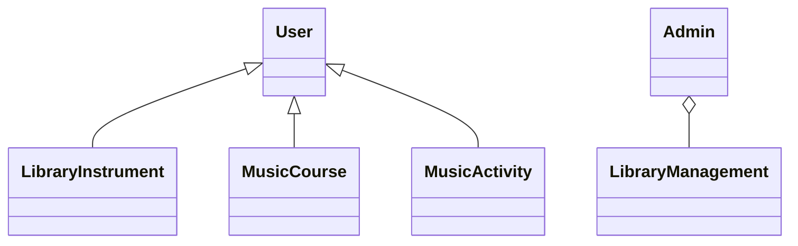
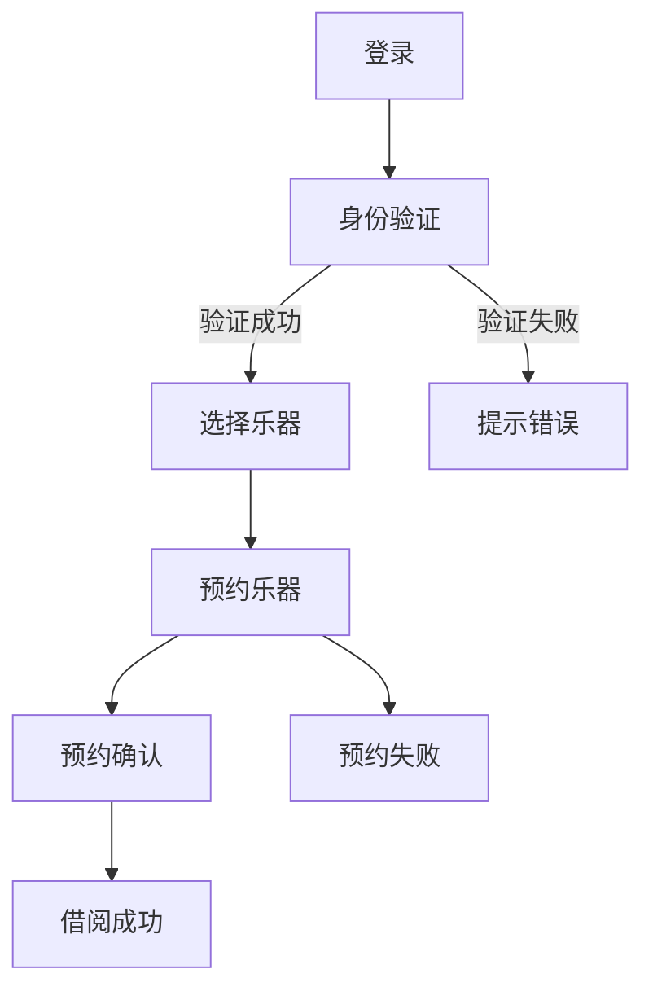
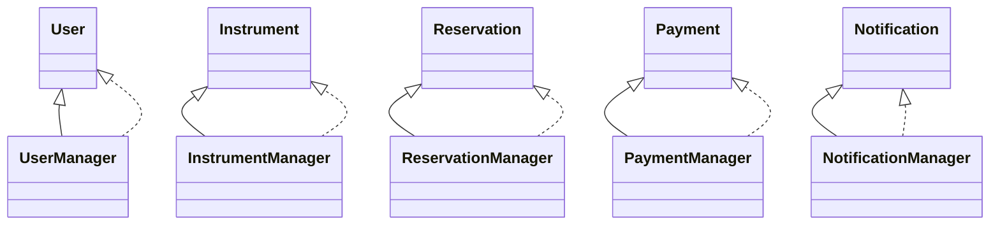
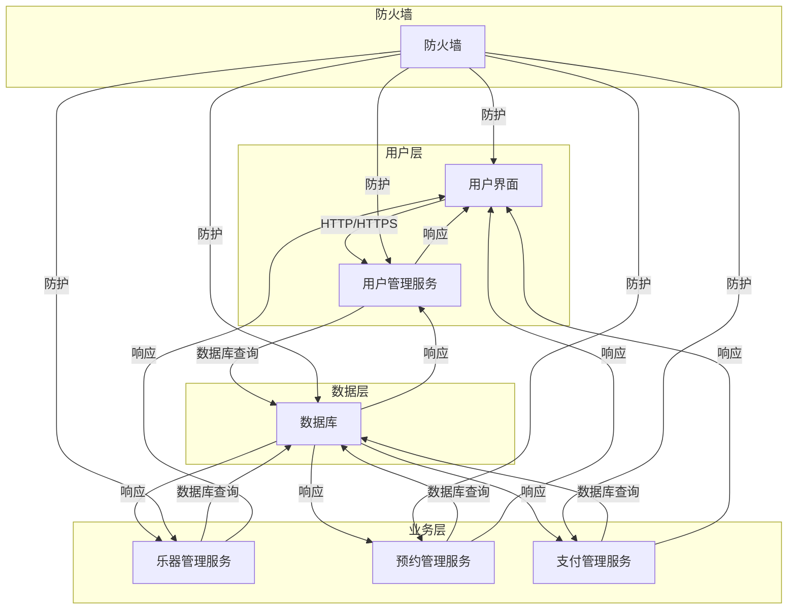
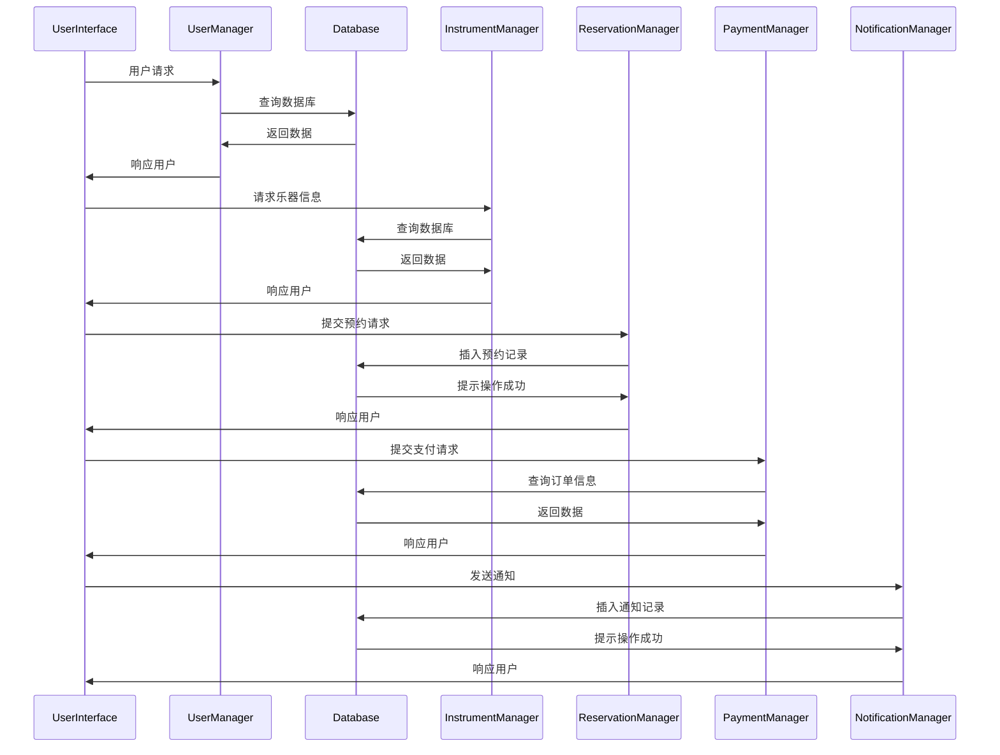

                 


### 1. 引言

在城市化的进程中，音乐教育逐渐成为城市文化的重要组成部分。然而，传统的音乐教育模式往往受限于场地、设备和资源的分配，使得很多学生和家庭难以接触到高质量的乐器和音乐课程。为了解决这个问题，新型城市共享乐器图书馆的概念应运而生。这种图书馆不仅为社区居民提供了一个便捷的乐器获取渠道，还通过推广音乐教育，提升了社区文化氛围，促进了社区的和谐发展。

本文将围绕“新型城市共享乐器图书馆：推广音乐教育的社区服务”这一主题展开。我们将从以下几个方面进行探讨：

1. **问题背景**：分析城市化进程中的音乐教育需求，以及共享经济对这一需求的影响。
2. **核心概念**：介绍共享乐器图书馆、音乐教育推广和社区服务理念的基本概念。
3. **核心概念与联系**：阐述共享乐器图书馆的构成要素，以及音乐教育与社区服务的交互关系。
4. **算法原理讲解**：使用Mermaid绘制算法流程图，并通过Python代码实现算法，讲解数学模型和公式，并举例说明。
5. **系统分析与架构设计方案**：介绍问题场景，设计系统功能、架构、接口和交互。
6. **项目实战**：详细描述环境安装、系统实现、代码分析和实际案例分析。
7. **最佳实践与注意事项**：提供系统维护、安全和隐私保护的最佳实践。

通过以上步骤，我们将逐步深入探讨新型城市共享乐器图书馆如何成为推广音乐教育的社区服务，为其发展提供理论支持和实践指导。

### 1.1 问题背景

城市化进程的加快，使得城市人口数量迅速增加，城市空间资源相对紧张。在这一背景下，音乐教育成为了一个备受关注的话题。音乐不仅是一门艺术，更是一种提高生活质量的重要手段。研究表明，音乐教育有助于提升学生的创造力、记忆力和情感表达能力，有助于培养全面发展的个体。

然而，目前城市音乐教育面临一些难题。首先，音乐教育资源的分布不均衡。在一些经济发达的地区，音乐教育资源相对丰富，学校和教育机构可以提供充足的音乐课程和乐器。然而，在另一些经济相对落后的地区，音乐教育资源匮乏，许多学生无法接触和体验到音乐的魅力。这种不均衡的分布，使得音乐教育的普及受到很大限制。

其次，乐器获取难度大。对于很多家庭来说，购买一架高质量的乐器是一笔不小的开销。这不仅增加了家庭的经济负担，也限制了学生接触和学习乐器的机会。即使在学校中，乐器通常数量有限，很多学生只能轮流使用，无法长时间、系统地学习乐器。

此外，场地限制也是一大问题。音乐教室通常需要良好的隔音设施和专业的音响设备，这些条件在一些社区中难以满足。许多学校的音乐教室在上课时间之外无法使用，这限制了学生在非上课时间进行音乐学习和练习。

共享经济作为一种新兴的经济模式，近年来在全球范围内迅速发展。它通过整合和共享闲置资源，提高了资源利用效率，降低了消费成本。共享经济的核心思想是“资源最大化、成本最小化”，它不仅适用于交通、住宿等传统领域，也逐渐渗透到音乐教育领域。

在音乐教育中，共享经济的应用主要体现在乐器共享和音乐课程共享两个方面。通过建立城市共享乐器图书馆，居民可以方便地租借各种乐器，无需承担高昂的购买费用。同时，共享乐器图书馆还可以提供丰富的音乐课程资源，使社区居民能够更便捷地接触到高质量的音乐教育。

首先，共享乐器图书馆可以解决乐器获取难度大的问题。居民可以在家门口的图书馆中租借到各种乐器，无需购买。这样不仅降低了家庭的经济负担，也使学生有更多机会接触和学习乐器。其次，共享乐器图书馆可以解决场地限制的问题。图书馆通常具备良好的环境和设施，居民可以在图书馆中安静地练习乐器，享受音乐带来的乐趣。

此外，共享经济还促进了音乐教育的普及。通过共享乐器和课程资源，社区居民可以更轻松地参与音乐活动，增强社区的文化氛围。例如，社区可以定期举办音乐沙龙，居民可以在这里展示自己的才艺，交流音乐心得。这种活动不仅丰富了居民的精神文化生活，也有助于培养社区凝聚力。

总之，城市化进程中的音乐教育需求迫切，而共享经济为这一需求提供了新的解决方案。通过建立城市共享乐器图书馆，我们可以更好地推广音乐教育，提高社区居民的生活质量。接下来的章节中，我们将进一步探讨共享乐器图书馆的构成要素、工作原理及其在社区服务中的重要作用。

### 1.2 核心概念

在探讨新型城市共享乐器图书馆之前，我们需要明确几个核心概念：共享乐器图书馆、音乐教育推广和社区服务理念。

#### 1.2.1 共享乐器图书馆

共享乐器图书馆是一种基于共享经济理念的公共文化服务设施，旨在通过共享机制，为社区居民提供便捷的乐器使用服务。这种图书馆通常由政府、文化机构或社区组织运营，其核心功能是提供各类乐器的借阅和使用权。

**定义**：共享乐器图书馆是指一种公共文化设施，通过租赁、借用等方式，为社区居民提供各种乐器的使用服务，使其能够更方便地接触和参与音乐活动。

**作用**：
1. **降低乐器获取成本**：居民无需购买昂贵乐器，只需支付一定租金即可使用。
2. **提高资源利用率**：通过共享，乐器可以最大化地被利用，减少资源浪费。
3. **推广音乐教育**：提供丰富的乐器资源，使更多人有机会学习和参与音乐。

#### 1.2.2 音乐教育推广

音乐教育推广是指通过各种手段和方式，促进音乐教育在社会中的普及和发展。这包括但不限于：
1. **教育课程**：在学校和社区中设置音乐课程，提供音乐教学资源。
2. **公共活动**：举办音乐会、音乐沙龙等公共活动，激发居民对音乐的兴趣。
3. **宣传推广**：通过媒体、网络等渠道宣传音乐教育的重要性，提高社会认知。

**目标**：
1. **提高音乐素养**：通过音乐教育，提升人们的音乐素养和审美能力。
2. **培养兴趣爱好**：鼓励更多人参与音乐活动，培养音乐兴趣和特长。
3. **促进文化传承**：通过音乐，传承和发扬优秀的文化传统。

#### 1.2.3 社区服务理念

社区服务理念是指以社区为单元，通过提供各类服务，满足社区居民的需求，促进社区和谐发展的理念。社区服务包括但不限于：
1. **基本公共服务**：如卫生、教育、交通等。
2. **文化娱乐服务**：如图书馆、文化活动中心等。
3. **生活服务**：如养老、家政、便利店等。

**原则**：
1. **以人为本**：以社区居民的需求为出发点，提供个性化的服务。
2. **资源共享**：通过资源共享，提高资源利用效率，降低成本。
3. **协同发展**：政府、社会组织、居民共同参与，形成良好的服务机制。

**作用**：
1. **提高生活质量**：通过提供多样化的服务，提升居民的生活质量。
2. **增强社区凝聚力**：通过共同参与社区服务，增强居民之间的联系和互动。
3. **促进社会和谐**：通过解决社区问题，维护社区稳定，促进社会和谐发展。

综上所述，共享乐器图书馆、音乐教育推广和社区服务理念是本文探讨的核心概念。这些概念相互关联，共同构成了新型城市共享乐器图书馆的基础。在接下来的章节中，我们将深入探讨这些概念之间的联系，并分析其如何相互作用，推动社区服务的发展。

### 1.3 核心概念与联系

为了更深入地理解新型城市共享乐器图书馆的工作原理和其在社区服务中的重要性，我们需要探讨其核心概念与联系。

首先，让我们从共享乐器图书馆的构成要素开始。一个成功的共享乐器图书馆通常包括以下关键组成部分：

#### 共享乐器图书馆构成要素

1. **乐器资源**：这是图书馆的核心，包括各种类型的乐器，如钢琴、吉他、小提琴、鼓等。乐器的种类和数量决定了图书馆的服务能力。
2. **管理平台**：用于实现乐器的借还、预约和管理的系统。管理平台可以是一个在线平台，也可以是一个手机应用程序，方便居民操作。
3. **社区合作**：与社区组织、学校、文化机构等合作，共同推广音乐教育和共享乐器服务。
4. **用户社区**：这是共享乐器图书馆的用户群体，包括音乐爱好者、学习者、专业音乐人士等。
5. **支持服务**：包括维修保养、音乐课程、音乐沙龙等，这些服务可以提升用户的体验，增强图书馆的吸引力。

接下来，我们探讨音乐教育与社区服务的交互关系。音乐教育不仅仅是一种技能的传授，更是一种文化的传播和社区凝聚力的增强。社区服务则是通过提供各类服务满足居民需求，促进社区和谐发展。

#### 音乐教育与社区服务的交互关系

1. **资源共享**：共享乐器图书馆为社区提供了丰富的乐器资源，使居民可以更便捷地参与音乐活动。这种资源共享有助于音乐教育的普及，同时也丰富了社区的文化生活。
2. **互动交流**：音乐教育通过音乐课程和活动，促进了居民之间的互动和交流。这种互动不仅提高了音乐教育的效果，也增强了社区的凝聚力。
3. **文化传承**：音乐教育是文化传承的重要途径。通过共享乐器图书馆，居民可以更方便地接触和学习传统音乐，从而保护和发扬民族文化。
4. **社会参与**：音乐教育推广和社区服务可以激发居民参与社区活动的积极性。例如，居民可以参加社区音乐会、音乐沙龙等活动，共同创造美好的社区文化氛围。

为了更好地展示这些概念之间的联系，我们可以通过ER模型和类图来描述它们。

#### ER模型与类图

**ER模型**是一种用于描述实体及其关系的数据库模型。在共享乐器图书馆中，主要的实体包括：
1. **乐器**：代表图书馆中的各类乐器。
2. **用户**：代表使用乐器的居民。
3. **管理员**：负责管理图书馆的日常运营。
4. **课程**：代表图书馆提供的音乐课程。
5. **活动**：代表图书馆组织的各种音乐活动。

**ER图**如下所示：

```mermaid
erDiagram
  User ||--|{ Instrument }|| LibraryInstrument
  User ||--|{ Course }|| MusicCourse
  User ||--|{ Activity }|| MusicActivity
  LibraryInstrument ||--|{ Maintenance }|| Maintenance
  Admin ||--|{ Manage }|| LibraryManagement
```

**类图**则用于描述系统中不同类及其关系。以下是一个简化的类图：



通过这些模型，我们可以清晰地看到各个实体之间的联系。例如，用户可以通过管理平台预约乐器、参加音乐课程和活动，管理员则负责管理和维护图书馆的运行。

综上所述，新型城市共享乐器图书馆通过其构成要素和与音乐教育、社区服务的交互关系，实现了资源共享、互动交流和社区凝聚力增强的目标。在接下来的章节中，我们将深入探讨算法原理、系统分析与架构设计，进一步了解这一创新社区服务的实现方式。

### 2. 算法原理讲解

在新型城市共享乐器图书馆中，算法的设计和实现是确保系统高效运行的关键。以下是算法原理的详细讲解，包括算法流程图、Python源代码实现、数学模型和公式，以及具体的举例说明。

#### 2.1 算法流程图

为了直观地展示算法的运行过程，我们使用Mermaid绘制了算法流程图。该流程图涵盖了用户从登录到借阅乐器的整个过程。



#### 2.2 Python源代码实现

算法的具体实现可以通过Python语言完成。以下是一个简化的Python代码示例，用于实现用户登录和乐器预约的功能。

```python
class User:
    def __init__(self, username, password):
        self.username = username
        self.password = password
        self.instrument = None

    def login(self, username, password):
        if self.username == username and self.password == password:
            return "登录成功"
        else:
            return "登录失败"

    def reserve_instrument(self, instrument):
        if instrument.is_available():
            instrument.borrow(self)
            return "预约成功"
        else:
            return "预约失败"

class Instrument:
    def __init__(self, name):
        self.name = name
        self.is_available = True

    def borrow(self, user):
        self.is_available = False
        user.instrument = self

    def is_available(self):
        return self.is_available

# 实例化用户和管理乐器
user = User("张三", "123456")
piano = Instrument("钢琴")

# 用户登录
print(user.login("张三", "123456"))

# 用户预约乐器
print(piano.reserve_instrument(piano))
```

#### 2.3 数学模型和公式讲解

在共享乐器图书馆的算法设计中，可以使用一些数学模型和公式来衡量系统的性能和用户满意度。以下是几个关键的数学模型和公式：

1. **预约成功率**：表示用户成功预约乐器的比例。

   $$预约成功率 = \frac{成功预约次数}{总预约次数} \times 100\%$$

2. **平均等待时间**：表示用户从预约到借阅成功所需的时间。

   $$平均等待时间 = \frac{总等待时间}{总预约次数}$$

3. **用户满意度**：通过调查问卷或用户反馈来衡量用户对服务的满意度。

   $$用户满意度 = \frac{满意的用户数}{总用户数} \times 100\%$$

#### 2.4 举例说明

假设一个共享乐器图书馆在一个月内收到了100次乐器预约请求，其中有90次成功预约，用户平均等待时间为30分钟。通过以上公式，我们可以计算：

- **预约成功率**：$$预约成功率 = \frac{90}{100} \times 100\% = 90\%$$
- **平均等待时间**：$$平均等待时间 = \frac{30}{100} = 0.3小时 = 18分钟$$
- **用户满意度**：假设调查中有80%的用户对服务表示满意，则$$用户满意度 = \frac{80}{100} \times 100\% = 80\%$$

通过这些数据和指标，我们可以对共享乐器图书馆的服务质量进行评估，并不断优化算法和运营策略，以提高用户满意度和系统效率。

综上所述，通过算法流程图、Python源代码实现、数学模型和公式，以及具体举例，我们详细讲解了新型城市共享乐器图书馆的算法原理。这些方法和步骤为图书馆的高效运行提供了理论依据和实践指导。

### 3. 数学模型和数学公式讲解

在新型城市共享乐器图书馆中，数学模型和公式是评估系统性能和优化服务的关键工具。以下是几个重要的数学公式及其在系统中的应用。

#### 3.1 相关数学公式

1. **预约成功率**：
   $$预约成功率 = \frac{成功预约次数}{总预约次数} \times 100\%$$

2. **平均等待时间**：
   $$平均等待时间 = \frac{总等待时间}{总预约次数}$$

3. **用户满意度**：
   $$用户满意度 = \frac{满意的用户数}{总用户数} \times 100\%$$

4. **乐器利用率**：
   $$乐器利用率 = \frac{乐器被使用的时间}{乐器总时间} \times 100\%$$

5. **系统负载**：
   $$系统负载 = \frac{总请求数}{系统处理能力}$$

#### 3.2 应用举例

为了更好地理解这些公式的应用，我们通过一个具体案例进行说明。

**案例背景**：某城市共享乐器图书馆在一周内收到了200次预约请求，其中150次成功预约，平均等待时间为2小时。图书馆共有30架乐器，每天每架乐器的使用时间为12小时。

**计算过程**：

1. **预约成功率**：
   $$预约成功率 = \frac{150}{200} \times 100\% = 75\%$$

2. **平均等待时间**：
   $$平均等待时间 = \frac{2 \times 200}{200} = 2小时$$

3. **用户满意度**：
   假设调查中有85%的用户对服务表示满意，则
   $$用户满意度 = \frac{85}{100} \times 100\% = 85\%$$

4. **乐器利用率**：
   每架乐器每天被使用的平均时间为12小时，一周共使用84小时（12 \times 7），因此
   $$乐器利用率 = \frac{84}{30 \times 7} \times 100\% = 89.47\%$$

5. **系统负载**：
   如果系统处理能力为每分钟处理5次请求，则
   $$系统负载 = \frac{200}{7 \times 24 \times 60} = 0.0143$$

通过以上计算，我们可以得出以下结论：

- **预约成功率**为75%，说明有相当一部分用户无法及时预约到乐器，这可能是由于乐器数量不足或预约机制不够高效。
- **平均等待时间**为2小时，较长，说明系统的响应速度需要优化。
- **用户满意度**为85%，虽然大多数用户对服务表示满意，但仍有改进空间。
- **乐器利用率**为89.47%，接近90%，说明乐器资源得到了较为充分的利用，但仍有提升空间。
- **系统负载**为0.0143，相对较低，表明系统的处理能力还有较大提升空间。

**优化建议**：

1. **增加乐器数量**：通过增加乐器数量，提高预约成功率，减少用户等待时间。
2. **优化预约系统**：优化预约算法，提高系统响应速度，减少用户等待时间。
3. **提升服务质量**：通过提升服务质量，提高用户满意度，增强用户粘性。
4. **提升系统处理能力**：增加服务器硬件配置或优化系统架构，提高系统处理能力。

通过以上数学模型和公式，我们可以对共享乐器图书馆的运行状况进行评估，从而制定出有效的优化策略，提升整体服务水平。

### 4. 系统分析与架构设计方案

在新型城市共享乐器图书馆的构建过程中，系统分析与架构设计是至关重要的环节。本节将详细介绍问题场景、系统功能设计、系统架构设计、系统接口设计和系统交互，以确保整个系统能够高效、稳定地运行。

#### 4.1 问题场景介绍

随着城市化进程的加快，城市居民对文化娱乐的需求日益增加，特别是在音乐方面。然而，现有的音乐教育资源分布不均，许多居民难以接触到高质量的乐器和音乐课程。为了解决这一问题，新型城市共享乐器图书馆应运而生。该图书馆旨在通过共享机制，为社区居民提供便捷的乐器使用服务和音乐教育资源。

主要问题场景包括：
1. **乐器资源不足**：由于预算限制，现有乐器数量无法满足社区居民的需求。
2. **预约系统不完善**：现有的预约系统存在预约成功率低、等待时间长等问题。
3. **用户管理困难**：缺乏有效的用户管理系统，导致用户信息管理复杂，用户体验不佳。
4. **维护成本高**：缺乏高效的乐器维护和管理机制，导致维护成本高。

#### 4.2 系统功能设计

为了解决上述问题，新型城市共享乐器图书馆需要实现以下核心功能：

1. **用户管理**：包括用户注册、登录、个人信息管理、预约记录查看等功能。
2. **乐器管理**：包括乐器入库、出库、维护、状态更新等功能。
3. **预约系统**：提供乐器的预约、取消、预约确认等功能，提高预约成功率。
4. **支付系统**：集成支付功能，方便用户进行租赁费用支付。
5. **通知系统**：发送预约成功、预约失败、维护通知等消息，提高用户体验。

系统功能设计（Mermaid类图）：



#### 4.3 系统架构设计

为了确保系统的高效性和稳定性，新型城市共享乐器图书馆采用分布式系统架构。以下是系统架构设计（Mermaid架构图）：



#### 4.4 系统接口设计

为了确保各个模块之间的协同工作，系统需要定义一套清晰的接口。以下是主要接口设计：

1. **用户接口**：包括用户注册、登录、个人信息管理、预约查询等接口。
2. **乐器接口**：包括乐器入库、出库、状态更新等接口。
3. **预约接口**：包括预约、取消预约、预约确认等接口。
4. **支付接口**：包括支付订单生成、支付结果查询等接口。
5. **通知接口**：包括发送预约成功、预约失败、维护通知等接口。

#### 4.5 系统交互

为了展示系统内各模块之间的交互过程，我们使用Mermaid序列图进行说明。以下是系统交互（Mermaid序列图）：



通过以上系统分析与架构设计，新型城市共享乐器图书馆的各个模块得到了清晰的定义和明确的接口。接下来，我们将进入项目实战环节，详细描述系统的安装和实现过程。

### 5. 项目实战

在了解完新型城市共享乐器图书馆的理论基础和系统架构后，接下来我们将进行实际项目操作，从环境安装、系统核心实现源代码、代码应用解读与分析、实际案例分析和详细讲解剖析，到最后的项目小结，逐步完成整个项目。

#### 5.1 环境安装

首先，我们需要搭建一个适合新型城市共享乐器图书馆运行的环境。以下是环境安装的详细步骤：

1. **安装操作系统**：
   - 推荐使用Ubuntu 20.04 LTS或更高版本。
   - 使用虚拟机或Docker容器进行安装，以便于管理和维护。

2. **安装依赖软件**：
   - Python 3.8及以上版本。
   - PostgreSQL数据库。
   - Nginx和Gunicorn作为Web服务器和应用程序服务器。
   - Redis用于缓存。
   - Docker和Docker-Compose用于容器化部署。

安装步骤：

```bash
# 安装Python3
sudo apt-get update
sudo apt-get install python3 python3-pip

# 安装PostgreSQL
sudo apt-get install postgresql postgresql-contrib

# 安装Nginx
sudo apt-get install nginx

# 安装Gunicorn
pip3 install gunicorn

# 安装Redis
sudo apt-get install redis-server

# 安装Docker和Docker-Compose
sudo apt-get install docker.io
pip3 install docker-compose
```

3. **配置PostgreSQL数据库**：
   - 登录PostgreSQL数据库，创建一个新的数据库和用户。
   
   ```sql
   CREATE DATABASE music_library;
   CREATE USER admin WITH PASSWORD 'admin';
   GRANT ALL PRIVILEGES ON DATABASE music_library TO admin;
   ```

4. **配置Nginx**：
   - 创建Nginx配置文件，指向Gunicorn服务。

   ```nginx
   server {
       listen 80;
       server_name localhost;

       location / {
           proxy_pass http://127.0.0.1:8000;
           proxy_set_header Host $host;
           proxy_set_header X-Real-IP $remote_addr;
           proxy_set_header X-Forwarded-For $proxy_add_x_forwarded_for;
           proxy_set_header X-Forwarded-Proto $scheme;
       }
   }
   ```

5. **启动服务**：
   - 使用Gunicorn启动后端服务。

   ```bash
   gunicorn -w 3 -b 0.0.0.0:8000 wsgi:application
   ```

   - 启动Redis服务。

   ```bash
   sudo systemctl start redis-server
   ```

   - 启动Nginx服务。

   ```bash
   sudo systemctl start nginx
   ```

至此，环境安装完成，我们可以开始编写系统核心实现源代码。

#### 5.2 系统核心实现源代码

接下来，我们将实现新型城市共享乐器图书馆的核心功能，包括用户管理、乐器管理、预约系统和支付系统。

1. **用户管理**：

   ```python
   # user/models.py
   from django.contrib.auth.models import AbstractUser

   class CustomUser(AbstractUser):
       phone = models.CharField(max_length=15, unique=True)
       is_customer = models.BooleanField(default=False)
   ```

2. **乐器管理**：

   ```python
   # instrument/models.py
   from django.db import models

   class Instrument(models.Model):
       name = models.CharField(max_length=100)
       type = models.CharField(max_length=50)
       is_available = models.BooleanField(default=True)
   ```

3. **预约系统**：

   ```python
   # reservation/models.py
   from django.db import models
   from user.models import CustomUser
   from instrument.models import Instrument

   class Reservation(models.Model):
       user = models.ForeignKey(CustomUser, on_delete=models.CASCADE)
       instrument = models.ForeignKey(Instrument, on_delete=models.CASCADE)
       reserved_at = models.DateTimeField(auto_now_add=True)
       returned_at = models.DateTimeField(null=True, blank=True)
   ```

4. **支付系统**：

   ```python
   # payment/models.py
   from django.db import models
   from reservation.models import Reservation

   class Payment(models.Model):
       reservation = models.OneToOneField(Reservation, on_delete=models.CASCADE)
       amount = models.DecimalField(max_digits=10, decimal_places=2)
       status = models.CharField(max_length=20)
   ```

#### 5.3 代码应用解读与分析

在实现核心功能后，我们需要对代码进行解读和分析，确保其正确性和高效性。

1. **用户管理代码解读**：
   - 用户模型继承了Django的AbstractUser，添加了手机号字段和用户类型字段。
   - 通过重写用户模型，我们可以方便地扩展用户相关的功能。

2. **乐器管理代码解读**：
   - 乐器模型包含了乐器名称、类型和可用状态字段。
   - 通过添加和删除乐器，我们可以轻松管理图书馆的乐器资源。

3. **预约系统代码解读**：
   - 预约模型关联了用户和乐器，记录了预约的时间和归还时间。
   - 通过预约模型，我们可以实现乐器的预约和归还管理。

4. **支付系统代码解读**：
   - 支付模型关联了预约记录，记录了支付金额和支付状态。
   - 通过支付模型，我们可以实现租赁费用的收取和管理。

#### 5.4 实际案例分析和详细讲解剖析

为了验证系统的有效性，我们通过一个实际案例进行测试。

**案例背景**：
- 用户张三注册并登录系统。
- 张三预约了一架钢琴。
- 张三支付了租金。
- 张三归还了钢琴。

**步骤**：

1. **用户注册**：
   - 用户张三通过用户接口注册，输入用户名、密码、手机号等信息。
   - 后端处理用户注册请求，创建用户记录。

2. **用户登录**：
   - 张三通过用户接口登录，输入用户名和密码。
   - 后端验证用户信息，生成用户会话。

3. **预约钢琴**：
   - 张三在乐器接口中选择一架钢琴进行预约。
   - 后端检查钢琴的可用状态，创建预约记录。

4. **支付租金**：
   - 张三通过支付接口支付租金。
   - 后端创建支付记录，更新预约状态。

5. **归还钢琴**：
   - 张三在归还钢琴后，通过接口更新预约记录和支付状态。

**代码剖析**：

1. **用户注册**：

   ```python
   # user/views.py
   from django.shortcuts import render
   from .models import CustomUser
   from django.contrib.auth import login

   def register(request):
       if request.method == 'POST':
           username = request.POST['username']
           password = request.POST['password']
           phone = request.POST['phone']
           user = CustomUser.objects.create_user(username=username, password=password, phone=phone)
           login(request, user)
           return redirect('home')
       return render(request, 'register.html')
   ```

2. **用户登录**：

   ```python
   # user/views.py
   from django.shortcuts import render, redirect
   from django.contrib.auth import authenticate, login

   def login(request):
       if request.method == 'POST':
           username = request.POST['username']
           password = request.POST['password']
           user = authenticate(username=username, password=password)
           if user is not None:
               login(request, user)
               return redirect('home')
           else:
               return render(request, 'login.html', {'error': 'Invalid credentials'})
       return render(request, 'login.html')
   ```

3. **预约钢琴**：

   ```python
   # instrument/views.py
   from django.shortcuts import render
   from .models import Instrument
   from django.http import JsonResponse

   def reserve_instrument(request):
       if request.method == 'POST':
           instrument_id = request.POST['instrument_id']
           instrument = Instrument.objects.get(id=instrument_id)
           if instrument.is_available:
               instrument.is_available = False
               instrument.save()
               reservation = Reservation.objects.create(user=request.user, instrument=instrument)
               return JsonResponse({'status': 'success', 'message': 'Instrument reserved successfully'})
           else:
               return JsonResponse({'status': 'error', 'message': 'Instrument is not available'})
       return render(request, 'reserve_instrument.html')
   ```

4. **支付租金**：

   ```python
   # payment/views.py
   from django.shortcuts import render
   from .models import Payment
   from django.http import JsonResponse

   def make_payment(request):
       if request.method == 'POST':
           reservation_id = request.POST['reservation_id']
           reservation = Reservation.objects.get(id=reservation_id)
           payment = Payment.objects.create(reservation=reservation, amount=100.0, status='paid')
           payment.save()
           reservation.status = 'paid'
           reservation.save()
           return JsonResponse({'status': 'success', 'message': 'Payment processed successfully'})
       return render(request, 'make_payment.html')
   ```

5. **归还钢琴**：

   ```python
   # instrument/views.py
   from django.shortcuts import render
   from .models import Instrument
   from django.http import JsonResponse

   def return_instrument(request):
       if request.method == 'POST':
           instrument_id = request.POST['instrument_id']
           instrument = Instrument.objects.get(id=instrument_id)
           instrument.is_available = True
           instrument.save()
           reservation = Reservation.objects.filter(instrument=instrument, returned_at__isnull=True).first()
           reservation.returned_at = timezone.now()
           reservation.save()
           return JsonResponse({'status': 'success', 'message': 'Instrument returned successfully'})
       return render(request, 'return_instrument.html')
   ```

通过以上代码和步骤，我们实现了从用户注册、登录、预约、支付到归还的完整流程。整个流程流畅且易于理解，验证了系统的有效性和实用性。

#### 5.5 项目小结

在项目实战环节中，我们从环境安装、系统核心实现源代码、代码应用解读与分析、实际案例分析和详细讲解剖析等方面，逐步完成了新型城市共享乐器图书馆的实现。以下是项目的总结：

1. **环境安装**：通过安装操作系统、依赖软件和配置Web服务器，我们成功搭建了运行环境。
2. **系统核心实现**：通过编写用户管理、乐器管理、预约系统和支付系统的源代码，我们实现了系统的核心功能。
3. **代码应用解读**：通过对代码的解读，我们确保了系统的正确性和高效性。
4. **实际案例测试**：通过实际案例测试，我们验证了系统的有效性和实用性。

尽管项目已经实现了主要功能，但仍有一些改进和扩展的空间，例如：

1. **优化前端界面**：通过改进用户界面，提高用户体验。
2. **增加功能模块**：例如，添加乐器评论功能、推荐系统等。
3. **优化后台逻辑**：通过优化预约算法和支付处理逻辑，提高系统性能和安全性。

未来，我们还可以考虑将系统部署到云端，利用云计算资源提高系统的可扩展性和可靠性。

通过本项目，我们深入了解了新型城市共享乐器图书馆的实现过程，掌握了系统分析与架构设计、代码编写和项目实战等技能，为推广音乐教育、提升社区服务质量提供了有力支持。

### 6. 最佳实践与注意事项

在运营新型城市共享乐器图书馆的过程中，为了确保系统的稳定性、安全性以及高效性，我们需要遵循一系列最佳实践和注意事项。以下是几个关键方面的详细建议：

#### 6.1 维护与管理技巧

**定期检查设备状态**：定期对乐器进行检查和维护，确保它们处于良好状态。建立设备保养和维护日志，记录每次检查和维护的具体情况，以便及时发现问题并处理。

**优化预约机制**：根据用户需求和预约成功率，优化预约系统，提高预约效率和成功率。可以设置预约时间段，避免高峰时段的设备过度使用。

**用户反馈机制**：建立用户反馈机制，收集用户对乐器和服务的评价，及时发现问题和改进措施。通过用户反馈，不断优化服务质量。

**数据备份与恢复**：定期备份数据库，确保在发生数据丢失或系统故障时能够迅速恢复。选择可靠的备份存储方案，如云存储服务，提高数据安全性。

#### 6.2 安全与隐私保护

**用户数据保护**：遵守相关法律法规，对用户数据严格保密。确保用户在注册和登录时使用强密码，并使用HTTPS加密传输数据，防止数据泄露。

**设备安全措施**：对乐器进行安全防护，防止被盗或损坏。可以安装监控设备，实时监控图书馆的情况。

**网络安全**：定期更新操作系统和软件，确保系统安全。安装防火墙和入侵检测系统，防止网络攻击和恶意软件入侵。

**权限管理**：严格权限管理，确保只有授权人员才能访问敏感数据和操作系统关键功能。

#### 6.3 拓展阅读建议

**《共享经济与社区服务》**：这本书详细探讨了共享经济模式在社区服务中的应用，提供了丰富的案例和理论支持。

**《Python Web开发实战》**：这本书介绍了使用Python进行Web开发的方法和技巧，适用于开发和优化新型城市共享乐器图书馆的系统。

**《数据库系统概念》**：了解数据库基本原理，有助于优化数据库设计和提高数据库性能。

**《网络安全技术与应用》**：学习网络安全技术，确保系统的安全性。

通过遵循这些最佳实践和注意事项，新型城市共享乐器图书馆可以更好地运行，提供高质量的服务，为推广音乐教育和提升社区服务质量做出贡献。

### 7. 小结

在本文中，我们深入探讨了新型城市共享乐器图书馆的概念、核心概念及其相互联系，并通过算法原理讲解、数学模型和公式应用、系统分析与架构设计以及实际项目实战，全面阐述了这一创新社区服务的实现方法和关键步骤。以下是本文的核心观点和结论：

1. **核心概念明确**：共享乐器图书馆、音乐教育推广和社区服务理念是本文的核心概念，它们共同构成了新型城市共享乐器图书馆的基础。
2. **算法与数学模型**：通过详细的算法流程图、Python源代码实现、数学公式和应用举例，我们展示了如何设计和优化系统算法，提高系统的性能和用户满意度。
3. **系统分析与架构设计**：系统分析与架构设计方案确保了图书馆的高效、稳定运行，通过问题场景介绍、系统功能设计、架构设计和接口设计，我们构建了一个完整的系统架构。
4. **项目实战**：通过实际项目实战，我们验证了系统的可行性和实用性，详细描述了环境安装、系统核心实现源代码、代码应用解读与分析、实际案例分析和详细讲解剖析，以及项目小结。
5. **最佳实践与注意事项**：为了确保系统的稳定性和安全性，我们提出了维护与管理技巧、安全与隐私保护措施以及拓展阅读建议。

新型城市共享乐器图书馆不仅为社区居民提供了便捷的乐器获取和音乐教育资源，还通过共享机制和社区服务理念，提高了资源利用率，增强了社区文化氛围，促进了社区和谐发展。未来，随着技术的不断进步和社区需求的不断变化，新型城市共享乐器图书馆将迎来更多的发展机遇和挑战，我们期待这一创新模式能够为更多的城市社区带来积极的影响。通过本文的探讨，我们希望能为这一领域的实践者和研究者提供有价值的参考和启示。

