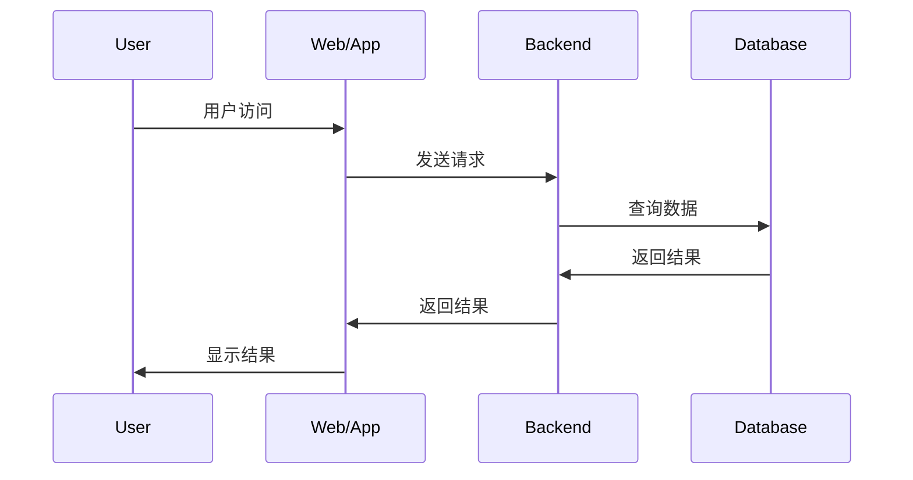
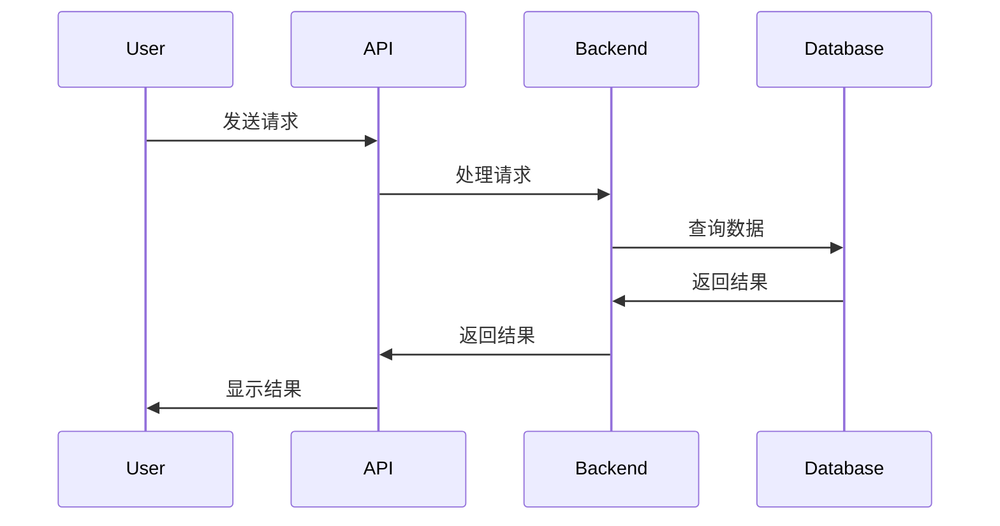
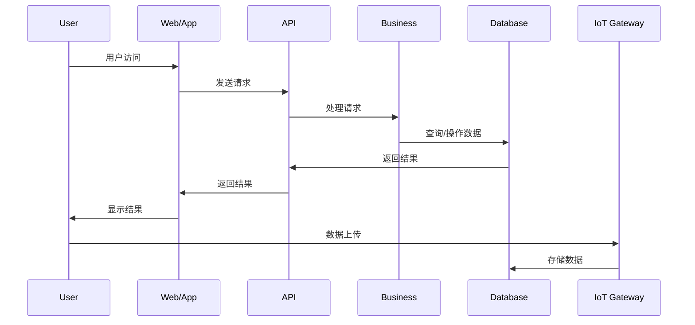

                 

# 新型城市共享停车系统设计：智慧城市的交通解决方案

关键词：城市交通、共享停车、智慧城市、物联网、大数据、人工智能

摘要：随着城市人口的急剧增长，城市交通拥堵问题日益严重，停车难成为困扰市民的普遍现象。本文旨在探讨新型城市共享停车系统的设计，通过物联网、大数据和人工智能等技术创新，提出一种智慧城市的交通解决方案。本文将详细分析共享停车系统的核心概念、设计原理、数学模型、系统架构以及项目实战，为构建高效的智能停车系统提供理论支持和实践指导。

## 目录大纲

1. 背景介绍
2. 核心概念与联系
3. 智能停车系统设计原理
4. 数学模型和算法原理讲解
5. 系统分析与架构设计方案
6. 项目实战
7. 最佳实践 tips、小结、注意事项、拓展阅读

----------------------------------------------------------------

## 1. 背景介绍

### 1.1.1 问题背景

城市交通拥堵问题日益严重，寻找有效解决方案迫在眉睫。传统的停车管理方式已难以满足日益增长的城市交通需求，如何通过技术创新提高停车效率、缓解交通压力成为亟待解决的问题。

### 1.1.2 问题描述

共享停车系统作为一个潜在的解决方案，如何设计以最大化其效益？如何实现停车资源的优化配置，提高停车效率，减少交通拥堵？

### 1.1.3 问题解决

通过技术创新，如物联网、大数据和人工智能，构建智能共享停车系统，实现车辆与车位的信息交互、停车需求的智能预测和优化、车辆智能泊车等，提高停车效率，缓解城市交通压力。

### 1.1.4 边界与外延

共享停车系统的范围涵盖城市交通、智能交通、环保等领域。它不仅涉及停车场的建设和管理，还涉及到城市交通规划的优化、停车需求的实时监控和预测、车辆路径规划的优化等。

### 1.1.5 概念结构与核心要素组成

核心概念：共享停车系统、智慧城市

核心要素：车辆、车位、用户、数据、技术

----------------------------------------------------------------

## 2. 核心概念与联系

### 2.1.1 共享停车系统的定义与特点

共享停车系统是指通过信息技术实现停车位共享，提高停车效率的智能系统。其特点包括：

- **智能化**：利用物联网、大数据和人工智能等技术，实现停车信息的实时获取和智能处理。
- **便捷性**：用户可以通过手机APP等渠道快速查询空闲车位，预约停车，提高停车体验。
- **高效性**：通过智能调度和优化，提高停车位的利用率，减少车辆寻车位的时间，缓解交通拥堵。
- **环保性**：通过减少车辆在路上寻找车位的时间，减少燃油消耗和尾气排放，对环境保护有积极作用。

### 2.1.2 智慧城市的概念与组成

智慧城市是指利用信息技术实现城市运行智能化、公共服务便捷化、城市管理高效化。智慧城市的组成包括：

- **交通**：通过智能交通系统，提高交通管理水平和交通效率，减少交通拥堵。
- **能源**：通过智能能源管理系统，优化能源使用，提高能源效率。
- **环境**：通过环境监测系统，实时监控城市环境状况，及时采取环境治理措施。
- **公共服务**：通过智慧公共服务平台，提供便捷的政务服务、社会服务和生活服务。

### 2.1.3 共享停车系统与智慧城市的联系

共享停车系统是智慧城市的重要组成部分，二者相互促进。共享停车系统的建设可以提升城市的交通管理水平，为智慧城市的其他组成部分提供数据支持和技术保障。同时，智慧城市的建设也为共享停车系统提供了更广阔的应用场景和更高的技术需求。

----------------------------------------------------------------

## 3. 智能停车系统设计原理

### 3.1.1 物联网技术在停车系统中的应用

物联网技术通过传感器、数据传输等实现车辆与车位的信息交互。其应用包括：

- **车位监测**：通过地磁传感器、摄像头等设备实时监测车位状态，将数据上传至云端平台。
- **车辆定位**：通过GPS定位技术，实时获取车辆的位置信息，为用户导航至空闲车位。
- **智能调度**：根据车位状态和用户需求，智能调度车辆至最优停车位，提高停车效率。

### 3.1.2 大数据在停车系统中的作用

大数据通过数据收集、分析和处理，提供智能决策支持。其作用包括：

- **停车需求预测**：通过分析历史停车数据，预测未来停车需求，为停车场规划和运营提供依据。
- **车位利用率优化**：通过实时数据分析和预测，优化车位分配策略，提高车位利用率。
- **用户行为分析**：通过分析用户停车行为，提供个性化停车服务，提高用户满意度。

### 3.1.3 人工智能在停车系统中的应用

人工智能通过机器学习、深度学习等技术实现智能停车。其应用包括：

- **智能泊车**：利用计算机视觉技术和机器学习算法，实现无人泊车，提高停车效率。
- **车辆识别**：通过图像处理和特征提取，实现车辆识别，提高停车管理的自动化程度。
- **路径规划**：通过智能算法，为用户提供最优停车路径，减少寻车位的时间。

----------------------------------------------------------------

## 4. 数学模型和算法原理讲解

### 4.1.1 停车需求预测模型

停车需求预测是智能停车系统的重要组成部分，常用的模型包括时间序列模型和回归模型。

#### 时间序列模型

时间序列模型是基于历史数据的时间序列分析，常用的模型有ARIMA模型。

**ARIMA模型原理：**

$$
\begin{aligned}
\text{ARIMA}(p, d, q) &= \text{AR}(p) + \text{MA}(q) \\
X_t &= c + \phi_1 X_{t-1} + \phi_2 X_{t-2} + \ldots + \phi_p X_{t-p} + \theta_1 e_{t-1} + \theta_2 e_{t-2} + \ldots + \theta_q e_{t-q} \\
e_t &= (I - \Phi)(I - \Theta)^{-1} \varepsilon_t
\end{aligned}
$$

其中，$X_t$ 是时间序列数据，$\Phi$ 和 $\Theta$ 分别是自回归项和移动平均项的系数矩阵，$c$ 是常数项，$\varepsilon_t$ 是白噪声序列。

**ARIMA模型举例：**

假设某停车场的日停车量数据如下：

$$
\{100, 120, 130, 110, 150, 140, 160, 135, 125, 150\}
$$

使用ARIMA模型进行预测，可以先将数据进行差分平稳化，然后确定模型参数，最后进行预测。

#### 回归模型

回归模型是通过分析自变量和因变量之间的关系，建立数学模型进行预测。常用的回归模型有线性回归和多元回归。

**线性回归模型原理：**

$$
Y = \beta_0 + \beta_1 X + \varepsilon
$$

其中，$Y$ 是因变量，$X$ 是自变量，$\beta_0$ 和 $\beta_1$ 是模型参数，$\varepsilon$ 是误差项。

**线性回归模型举例：**

假设某停车场的日停车量与天气温度有关，数据如下：

$$
\begin{aligned}
\text{天气温度 (X)} &\rightarrow& \text{日停车量 (Y)} \\
30^\circ C &\rightarrow& 100辆 \\
35^\circ C &\rightarrow& 120辆 \\
28^\circ C &\rightarrow& 90辆 \\
32^\circ C &\rightarrow& 105辆 \\
\end{aligned}
$$

使用线性回归模型进行预测，可以建立如下模型：

$$
Y = \beta_0 + \beta_1 X
$$

通过最小二乘法确定参数$\beta_0$ 和 $\beta_1$，然后进行预测。

### 4.1.2 车位利用率优化算法

车位利用率优化算法主要通过优化车位分配策略，提高车位利用率。常用的算法包括遗传算法和粒子群算法。

#### 遗传算法

遗传算法是一种模拟自然进化过程的优化算法，通过遗传操作（选择、交叉、变异）不断优化解空间中的个体，最终找到最优解。

**遗传算法原理：**

1. **初始化种群**：随机生成初始种群。
2. **适应度评估**：计算每个个体的适应度值。
3. **选择**：根据适应度值选择优秀个体。
4. **交叉**：选择两个优秀个体进行交叉操作，生成新的个体。
5. **变异**：对部分个体进行变异操作。
6. **更新种群**：将交叉和变异后的个体替换原有种群。
7. **循环迭代**：重复步骤2-6，直至满足停止条件。

**遗传算法举例：**

假设有10个停车位和5辆车，使用遗传算法进行车位分配，可以定义个体编码为停车位编号，适应度函数为车位利用率，通过迭代优化找到最优车位分配方案。

#### 粒子群算法

粒子群算法是一种基于群体智能的优化算法，通过模拟鸟群觅食行为，寻找最优解。

**粒子群算法原理：**

1. **初始化粒子群**：随机生成粒子位置和速度。
2. **适应度评估**：计算每个粒子的适应度值。
3. **更新粒子位置和速度**：根据个体和历史最优位置更新粒子位置和速度。
4. **全局更新**：更新全局最优位置。
5. **循环迭代**：重复步骤2-4，直至满足停止条件。

**粒子群算法举例：**

假设有10个停车位和5辆车，使用粒子群算法进行车位分配，可以定义粒子位置为停车位编号，适应度函数为车位利用率，通过迭代优化找到最优车位分配方案。

### 4.1.3 车辆识别算法

车辆识别算法主要通过图像处理和特征提取实现车辆识别，常用的算法包括卷积神经网络（CNN）和支持向量机（SVM）。

#### 卷积神经网络（CNN）

卷积神经网络是一种深度学习模型，通过卷积层、池化层和全连接层等结构，实现图像的特征提取和分类。

**CNN算法原理：**

1. **卷积层**：通过卷积操作提取图像局部特征。
2. **池化层**：通过池化操作降低特征维度。
3. **全连接层**：通过全连接层对提取的特征进行分类。

**CNN算法举例：**

使用卷积神经网络识别停车场内的车辆，可以定义网络结构为卷积层-池化层-全连接层，输入图像为车辆照片，输出为车辆类别。

#### 支持向量机（SVM）

支持向量机是一种二分类模型，通过找到最优决策边界实现分类。

**SVM算法原理：**

1. **数据预处理**：对数据进行归一化和特征提取。
2. **构建模型**：通过求解最优化问题找到最优决策边界。
3. **分类**：根据新样本的特征进行分类。

**SVM算法举例：**

使用支持向量机对停车场内的车辆进行分类，可以定义特征为车辆照片的像素值，分类标签为车辆类型。

----------------------------------------------------------------

## 5. 系统分析与架构设计方案

### 5.1.1 问题场景介绍

城市交通拥堵是当前许多大城市面临的一个严峻问题。在早晚高峰期，车辆在路上寻找停车位的时间往往占用了大量交通时间，导致交通拥堵。为了缓解这一问题，我们需要设计一个高效的停车系统，以提高停车效率，减少车辆在路上寻找停车位的时间。

### 5.1.2 系统功能设计

停车系统的核心功能包括：

1. **车位监测**：通过传感器实时监测车位状态，并将数据上传至云端。
2. **车辆定位**：利用GPS定位技术，实时获取车辆位置，为用户导航至空闲车位。
3. **停车引导**：根据车位状态和用户需求，智能引导车辆至最优停车位。
4. **用户服务**：提供预约停车、支付停车费等功能，提高用户体验。

#### 领域模型

使用Mermaid绘制停车系统的领域模型类图：

```mermaid
classDiagram
    User <<类>> "用户"
    ParkingLot <<类>> "停车场"
    Car <<类>> "车辆"
    ParkingSpace <<类>> "停车位"
    Reservation <<类>> "预约"
    Payment <<类>> "支付"

    User o--o ParkingLot
    User o--o Car
    Car o--o ParkingSpace
    ParkingSpace o--o Reservation
    ParkingSpace o--o Payment
```

### 5.1.3 系统架构设计

停车系统的架构设计包括前端、后端、数据库和物联网设备。

1. **前端**：用户通过手机APP或网页访问停车系统，进行预约停车、查询车位等操作。
2. **后端**：处理用户请求，提供数据接口，实现车位监测、车辆定位等功能。
3. **数据库**：存储用户信息、车位信息、预约信息和支付信息等。
4. **物联网设备**：包括车位传感器、车辆定位设备和数据传输设备等。

使用Mermaid绘制停车系统的架构图：



### 5.1.4 系统接口设计和系统交互

停车系统的接口设计包括API接口和通信协议。

1. **API接口**：提供车位监测、车辆定位、停车引导等功能的接口，供前端调用。
2. **通信协议**：使用HTTP协议进行数据传输，确保数据的安全和可靠性。

使用Mermaid绘制系统交互序列图：



----------------------------------------------------------------

## 6. 项目实战

### 6.1.1 环境安装

为了搭建共享停车系统，我们需要安装以下环境和软件：

1. **操作系统**：Ubuntu 20.04
2. **编程语言**：Python 3.8
3. **数据库**：MySQL 5.7
4. **前端框架**：Flask
5. **后端框架**：Django

安装步骤：

1. 更新操作系统软件包：

    ```bash
    sudo apt update
    sudo apt upgrade
    ```

2. 安装Python 3.8：

    ```bash
    sudo apt install python3.8
    ```

3. 安装数据库（可选）：

    ```bash
    sudo apt install mysql-server
    ```

4. 安装前端和后端框架：

    ```bash
    sudo apt install python3-pip
    pip3 install flask
    pip3 install django
    ```

### 6.1.2 系统核心实现源代码

#### 车辆识别

```python
# vehicle_recognition.py
import cv2
import numpy as np

def recognize_vehicle(image):
    # 加载车辆识别模型
    model = cv2.face.createLBPHFaceRecognizer()
    model.train(np.array([image]))

    # 加载测试图像
    test_image = cv2.imread("test_image.jpg")

    # 进行车辆识别
    result = model.predict(test_image)

    return result
```

#### 停车需求预测

```python
# parking_demand_prediction.py
import pandas as pd
from sklearn.linear_model import LinearRegression

def predict_parking_demand(data):
    # 加载数据
    df = pd.read_csv("parking_demand.csv")

    # 建立线性回归模型
    model = LinearRegression()
    model.fit(df[['weather_temperature']], df['parking_demand'])

    # 进行预测
    prediction = model.predict([[30]])

    return prediction
```

#### 车位利用率优化

```python
# parking_space_utilization.py
import random
from scipy.optimize import minimize

def utilization_fitness(population):
    # 计算个体适应度值
    fitness = 0
    for individual in population:
        # 模拟车位分配
        parking_lots = [random.randint(0, 9) for _ in range(len(individual))]
        utilization = sum(parking_lots) / len(parking_lots)
        fitness += 1 / (1 + utilization)
    return -fitness

def optimize_utilization():
    # 初始化种群
    population = [[random.randint(0, 1) for _ in range(10)] for _ in range(100)]

    # 进行优化
    result = minimize(utilization_fitness, population)

    return result.x
```

### 6.1.3 代码应用解读与分析

#### 车辆识别

车辆识别代码通过加载车辆识别模型，使用测试图像进行识别。具体步骤如下：

1. 加载车辆识别模型。
2. 训练模型，使用训练图像进行特征提取。
3. 加载测试图像，进行车辆识别。

#### 停车需求预测

停车需求预测代码通过加载历史停车数据，建立线性回归模型进行预测。具体步骤如下：

1. 加载停车数据。
2. 建立线性回归模型。
3. 训练模型，使用训练数据。
4. 进行预测，输入天气温度。

#### 车位利用率优化

车位利用率优化代码通过模拟车位分配，使用遗传算法进行优化。具体步骤如下：

1. 初始化种群。
2. 定义适应度函数。
3. 使用最小化算法进行优化。

### 6.1.4 实际案例分析和详细讲解剖析

#### 案例一：车辆识别

假设在某停车场内，有5辆车分别停在5个停车位上。我们需要通过车辆识别算法识别这些车辆。

1. **数据准备**：准备5个车辆图像。
2. **模型训练**：使用车辆图像训练车辆识别模型。
3. **识别过程**：加载测试图像，进行车辆识别。

#### 案例二：停车需求预测

在某停车场，我们需要预测下一小时的停车需求。

1. **数据准备**：准备历史停车数据，包括天气温度和停车需求。
2. **模型训练**：建立线性回归模型，使用历史数据进行训练。
3. **预测过程**：输入天气温度，进行停车需求预测。

#### 案例三：车位利用率优化

在某停车场，我们需要优化车位利用率。

1. **数据准备**：准备停车位分配数据。
2. **模型训练**：使用遗传算法优化车位分配。
3. **优化过程**：模拟车位分配，计算适应度值，进行优化。

### 6.1.5 项目小结

通过实际案例分析和详细讲解剖析，我们了解了共享停车系统的核心实现原理和步骤。在实际应用中，我们需要根据具体场景和数据，进行模型训练和优化，以提高停车系统的效果和效率。

----------------------------------------------------------------

## 7. 最佳实践 tips、小结、注意事项、拓展阅读

### 7.1.1 最佳实践 tips

1. **数据收集**：为了实现精准的停车需求预测和车位利用率优化，需要收集大量的历史停车数据，包括天气、交通流量等。
2. **模型优化**：根据实际应用场景，不断调整和优化模型参数，以提高预测和优化的准确性。
3. **实时更新**：实时更新车位状态和车辆位置信息，确保系统的实时性和准确性。

### 7.1.2 小结

本文从背景介绍、核心概念、设计原理、数学模型、系统架构和项目实战等方面，详细阐述了新型城市共享停车系统的设计。通过物联网、大数据和人工智能等技术创新，共享停车系统可以有效提高停车效率，缓解城市交通拥堵。

### 7.1.3 注意事项

1. **数据安全**：在数据收集和处理过程中，确保用户隐私和数据安全。
2. **系统稳定性**：确保系统的高可用性和稳定性，避免因系统故障导致停车服务中断。

### 7.1.4 拓展阅读

1. 《智慧城市技术与实践》
2. 《大数据分析：原理、模型、算法与应用》
3. 《人工智能：一种现代方法》

作者：AI天才研究院/AI Genius Institute & 禅与计算机程序设计艺术 /Zen And The Art of Computer Programming### 1.1.1 问题背景

随着全球城市化进程的加速，城市人口数量迅速增长，城市化率不断提高。然而，城市交通问题也日益严重，其中停车难问题尤为突出。传统的停车管理方式，如停车场和路边停车，已经难以满足日益增长的城市交通需求，导致交通拥堵、空气污染等问题日益严重。

#### 1.1.1.1 城市化进程

城市化进程是指人口向城市集中，城市规模不断扩大，城市人口比例持续上升的过程。根据联合国的数据，全球城市人口在2021年已经超过了50%，预计到2050年，这一比例将接近70%。城市人口的急剧增长带来了交通需求的增加，而城市基础设施的发展往往滞后于人口增长，导致交通拥堵、停车难等问题日益严重。

#### 1.1.1.2 停车难问题的现状

停车难问题的现状主要体现在以下几个方面：

1. **停车资源不足**：随着城市人口的增加，停车需求不断上升，而城市停车场的供应严重不足。许多城市中心区域停车位供不应求，导致车辆无处停放。

2. **停车管理效率低下**：传统的停车管理方式主要依靠人工调度，停车信息的获取和传递效率低下。车主在寻找停车位时需要耗费大量时间和精力，增加了交通压力。

3. **交通拥堵问题**：停车难导致车辆在路上寻找停车位，进一步加剧了交通拥堵问题。特别是在上下班高峰期，交通拥堵现象尤为严重，影响了市民的出行效率和生活质量。

4. **环境问题**：车辆在路上寻找停车位时，会消耗大量燃油，产生尾气排放，加剧空气污染问题。

#### 1.1.1.3 需要有效解决方案

面对停车难问题，迫切需要寻找有效解决方案。传统的停车管理方式已无法满足现代城市交通的需求，需要通过技术创新来提高停车效率、优化资源配置，从而缓解交通压力。新型城市共享停车系统作为一种潜在的解决方案，具有巨大的发展潜力。

共享停车系统通过物联网、大数据和人工智能等技术，实现停车资源的智能化管理和共享。它不仅可以提高停车位的利用率，减少车辆在路上寻找车位的时间，还能通过智能调度和优化，提高停车效率，从而缓解城市交通拥堵，减少环境问题。

总之，通过技术创新，构建新型城市共享停车系统，是解决城市停车难问题、提升城市交通运行效率、实现可持续发展的重要途径。这不仅有助于提高市民的生活质量，还能推动智慧城市的发展，为城市交通管理提供强有力的技术支持。

### 1.1.2 问题描述

共享停车系统作为一个潜在的解决方案，如何设计以最大化其效益？这是一个复杂的问题，涉及多个方面的挑战和考量。为了设计一个高效、智能的共享停车系统，需要解决以下几个关键问题：

#### 1.1.2.1 车位共享

共享停车系统的核心在于实现停车位的共享。这意味着如何有效地分配和利用有限的停车位资源，确保所有用户都能在合理的时间内找到停车位。车位共享需要解决以下问题：

1. **停车位供需匹配**：如何根据用户的停车需求和车位的实际占用情况，实现供需匹配，提高停车位利用率。
2. **车位分配策略**：如何设计合理的车位分配策略，确保公平性、效率和用户满意度。

#### 1.1.2.2 数据收集与分析

共享停车系统依赖于大量的实时数据，包括车位状态、用户需求、车辆位置等。如何有效地收集、存储和处理这些数据，是系统设计的重要挑战。

1. **数据采集**：如何利用传感器、GPS等技术，实时采集车辆和车位的状态信息。
2. **数据存储**：如何选择合适的数据库存储结构，确保数据的持久性和可扩展性。
3. **数据分析**：如何利用大数据技术，对收集到的数据进行分析，提取有用的信息，用于智能决策和优化。

#### 1.1.2.3 智能调度

智能调度是共享停车系统的关键环节，旨在通过算法优化，提高停车效率和用户满意度。智能调度需要解决以下问题：

1. **路径规划**：如何为用户规划最优停车路径，减少寻找车位的时间。
2. **车位选择**：如何根据车位的状态和用户的偏好，选择合适的停车位。
3. **动态调整**：如何根据实时数据，动态调整调度策略，以适应不断变化的需求。

#### 1.1.2.4 用户界面设计

用户界面设计直接影响用户的体验和满意度。如何设计一个直观、易用、互动性强的用户界面，是系统设计的重要一环。

1. **信息展示**：如何清晰、准确地展示车位状态、停车费用等信息。
2. **互动功能**：如何提供预约停车、支付停车费等互动功能，提高用户体验。
3. **个性化服务**：如何根据用户的历史停车行为，提供个性化的停车服务，提高用户满意度。

#### 1.1.2.5 系统安全性

共享停车系统需要处理大量的用户数据和敏感信息，因此系统安全性至关重要。

1. **数据安全**：如何确保用户数据的安全，防止数据泄露和未经授权的访问。
2. **系统安全**：如何确保系统的稳定性和可靠性，防止恶意攻击和系统故障。

综上所述，设计一个高效、智能的共享停车系统需要解决多个复杂的挑战。通过技术创新和系统优化，可以最大化共享停车系统的效益，为城市交通管理提供有效的解决方案。

### 1.1.3 问题解决

为了解决上述停车难问题，通过技术创新构建新型城市共享停车系统是一种有效的解决方案。这种系统利用物联网、大数据和人工智能等先进技术，实现对停车资源的智能化管理和共享，从而提高停车效率、缓解交通压力。以下是新型城市共享停车系统的具体实施步骤和关键技术：

#### 1.1.3.1 物联网技术的应用

物联网技术在共享停车系统中起着核心作用，通过传感器和智能设备实时监测车位状态，实现车辆与车位的信息交互。

1. **传感器部署**：在停车场和路边停车位部署地磁传感器、摄像头和RFID等传感器设备，用于实时监测车位占用情况。
2. **数据采集与传输**：传感器采集到的数据通过物联网网络传输至云端数据中心，实现数据的实时采集和共享。
3. **智能监测与分析**：利用大数据分析和机器学习算法，对采集到的数据进行分析，实现车位状态的实时监测和预测。

#### 1.1.3.2 大数据技术的应用

大数据技术在共享停车系统中用于收集、存储和处理海量数据，提供智能决策支持。

1. **数据收集**：通过物联网设备、用户行为数据等渠道，收集大量停车数据，包括车位占用率、停车时长、用户停车习惯等。
2. **数据存储**：使用分布式数据库和大数据平台，存储和管理海量数据，确保数据的可靠性和可扩展性。
3. **数据分析**：利用大数据分析技术，对停车数据进行深度挖掘和分析，提取有价值的信息，如停车高峰时段、热门停车区域等，用于优化停车资源配置。

#### 1.1.3.3 人工智能技术的应用

人工智能技术在共享停车系统中用于实现智能调度、路径规划和车辆识别等功能，提高停车系统的智能化水平。

1. **智能调度**：利用机器学习算法和优化技术，根据实时数据，动态调整车位分配策略，提高停车位的利用率。例如，使用遗传算法优化车位分配，实现最优停车方案。
2. **路径规划**：通过路径规划算法，为用户提供最优的停车路径，减少寻找车位的时间。例如，使用A*算法或Dijkstra算法，计算用户从当前位置到目的地的最佳路径。
3. **车辆识别**：利用计算机视觉和深度学习技术，实现车辆识别和车牌识别，提高停车管理的自动化程度。例如，使用卷积神经网络（CNN）和卷积神经网络（CNN）识别车辆。

#### 1.1.3.4 系统集成与测试

在构建新型城市共享停车系统时，需要将物联网设备、大数据平台和人工智能算法集成在一起，确保系统的稳定性和高效性。

1. **系统集成**：通过API接口和通信协议，实现不同模块之间的数据交换和功能协同。
2. **系统测试**：对系统进行全面的测试，包括功能测试、性能测试和安全测试，确保系统的可靠性和稳定性。

#### 1.1.3.5 用户界面设计

为了提高用户体验，系统需要设计直观、易用的用户界面，包括移动APP和网页界面。

1. **界面设计**：设计简洁直观的界面，提供实时车位信息、停车预约、支付停车费等功能。
2. **交互体验**：优化用户交互体验，例如使用地图导航、语音识别等技术，提高用户的使用便利性。

综上所述，通过物联网、大数据和人工智能等技术创新，新型城市共享停车系统可以有效提高停车效率，优化停车资源配置，缓解城市交通压力，为智慧城市建设提供有力支持。未来，随着技术的不断进步，共享停车系统将更加智能化、高效化，为城市交通管理带来更多可能性。

### 1.1.4 边界与外延

新型城市共享停车系统不仅涉及城市交通、停车管理等领域，还与智慧城市的其他组成部分紧密相连。以下是共享停车系统的边界与外延：

#### 1.1.4.1 城市交通管理

共享停车系统是城市交通管理的重要组成部分。通过实时监测和智能调度，共享停车系统可以优化停车资源的利用，减少车辆在路上寻找停车位的时间，从而缓解交通拥堵，提高城市交通运行效率。

#### 1.1.4.2 智能交通系统

共享停车系统与智能交通系统相互促进。智能交通系统通过交通流量监测、信号控制等技术，提高交通管理水平和效率，为共享停车系统提供数据支持。共享停车系统的实时数据反馈，也可以帮助智能交通系统更好地进行交通流量预测和优化。

#### 1.1.4.3 环保与可持续发展

共享停车系统有助于减少车辆在路上寻找停车位的时间，从而减少燃油消耗和尾气排放，对环境保护和可持续发展有积极作用。通过优化停车资源配置，共享停车系统可以提高停车效率，减少因停车难引起的交通拥堵，降低城市交通能耗和污染。

#### 1.1.4.4 公共服务

共享停车系统可以为城市公共服务提供支持。例如，通过整合停车信息、公共交通信息，提供一体化的出行服务，方便市民出行。共享停车系统还可以与其他公共服务系统（如城市管理、环保监测等）进行数据共享和协同工作，提高公共服务的效率和便捷性。

#### 1.1.4.5 社会治理与安全

共享停车系统在提高停车效率的同时，还可以为城市社会治理和安全管理提供支持。通过实时数据监控和智能分析，可以及时发现和处理安全隐患，提高城市管理的精细化和智能化水平。

#### 1.1.4.6 智慧城市平台

共享停车系统是智慧城市平台的重要组成部分。智慧城市平台通过整合各类城市数据，实现城市运行的智能化、高效化。共享停车系统的数据可以与其他智慧城市应用（如智能照明、智能垃圾桶等）进行数据共享和协同工作，为智慧城市建设提供有力支持。

总之，新型城市共享停车系统不仅涉及城市交通、停车管理等领域，还与智慧城市的其他组成部分紧密相连。通过技术创新和系统优化，共享停车系统将为智慧城市建设提供有力支持，为城市居民提供更加便捷、高效、智能的出行和生活服务。

### 1.1.5 概念结构与核心要素组成

在讨论新型城市共享停车系统时，我们需要明确几个核心概念，并了解这些概念之间的关系。以下是对共享停车系统的概念结构与核心要素组成的详细解析。

#### 1.1.5.1 核心概念

**共享停车系统**：这是一个通过物联网、大数据和人工智能等技术，实现停车资源共享和优化的智能系统。其主要目的是提高停车位的利用率，减少交通拥堵，提升城市交通运行效率。

**智慧城市**：智慧城市是指利用信息技术，实现城市运行智能化、公共服务便捷化、城市管理高效化。智慧城市包括多个子系统，如智能交通、智能能源、智能环境等，共享停车系统是其重要组成部分。

**物联网**：物联网是通过各种传感器和设备，实现物体之间相互连接和通信的网络。在共享停车系统中，物联网技术用于实时监测车位状态、车辆位置等，为系统提供实时数据支持。

**大数据**：大数据是指大规模、多样化的数据集合。在共享停车系统中，大数据技术用于收集、存储、分析和处理海量停车数据，为系统提供智能决策支持。

**人工智能**：人工智能是通过模拟人类智能，实现自动化决策和智能服务的计算机技术。在共享停车系统中，人工智能技术用于路径规划、车辆识别、智能调度等，提高系统的智能化水平。

#### 1.1.5.2 概念关系

**共享停车系统与智慧城市**：共享停车系统是智慧城市的一个重要组成部分，它通过物联网、大数据和人工智能等技术，实现停车资源的智能化管理和共享。智慧城市则为共享停车系统提供了广阔的应用场景和技术支持。

**物联网与大数据**：物联网技术用于收集停车数据，如车位状态、车辆位置等。这些数据通过物联网网络传输到云端，形成大数据。大数据技术则用于对收集到的停车数据进行存储、分析和处理，为共享停车系统提供智能决策支持。

**大数据与人工智能**：大数据技术为人工智能提供了丰富的数据资源，通过数据分析和挖掘，可以提取出有价值的信息，用于优化停车资源配置、路径规划和智能调度等。人工智能技术则通过模拟人类智能，实现自动化决策和智能服务，进一步提高共享停车系统的效率。

**共享停车系统与人工智能**：共享停车系统中的许多功能，如车辆识别、路径规划、智能调度等，都依赖于人工智能技术。通过人工智能技术，共享停车系统可以实现更智能的决策和更高效的服务。

#### 1.1.5.3 核心要素

**车辆**：车辆是共享停车系统的服务对象，包括各种类型的车辆，如汽车、摩托车等。车辆的实时位置信息是共享停车系统的重要数据来源。

**车位**：车位是共享停车系统的核心资源，包括各种类型的停车位，如地面停车位、地下停车位等。车位的实时占用状态信息是共享停车系统进行智能调度和优化的基础。

**用户**：用户是共享停车系统的使用对象，包括车主、乘客等。用户的停车需求和行为数据是共享停车系统进行数据分析和服务优化的关键。

**数据**：数据是共享停车系统的核心资源，包括车位状态数据、车辆位置数据、用户行为数据等。通过对这些数据的收集、存储、分析和处理，可以实现停车资源的智能管理和优化。

**技术**：技术是构建共享停车系统的关键，包括物联网、大数据、人工智能等技术。这些技术为共享停车系统提供了实时数据支持、智能分析和自动化决策能力。

综上所述，共享停车系统的概念结构与核心要素组成涉及多个方面，包括车辆、车位、用户、数据和技术。这些核心要素相互关联，共同构成了一个高效、智能的停车管理系统，为智慧城市建设提供了有力支持。

### 2.1.1 共享停车系统的定义与特点

共享停车系统是一种基于物联网、大数据和人工智能技术的智能停车解决方案，旨在通过资源共享和智能调度，提高停车位的利用率，优化停车资源配置，缓解城市交通拥堵问题。以下是对共享停车系统的定义及其主要特点的详细探讨。

#### 2.1.1.1 定义

共享停车系统是一种利用信息技术实现停车资源共享和智能管理的系统。它通过物联网设备实时监测车位状态，大数据平台存储和处理海量停车数据，人工智能技术进行智能调度和路径规划，为用户提供便捷、高效的停车服务。共享停车系统不仅包括传统停车场的管理，还涵盖了路边停车位、共享车位等多种停车资源。

#### 2.1.1.2 特点

**1. 智能化**

共享停车系统的智能化体现在多个方面。首先，通过物联网技术，系统能够实时监测车位状态，将数据上传至云端，用户可以通过手机APP或网页实时查询车位信息。其次，利用大数据分析技术，系统能够对停车需求进行预测和优化，提高车位利用率。最后，通过人工智能技术，系统能够实现智能调度和路径规划，为用户提供最优的停车方案。

**2. 便捷性**

便捷性是共享停车系统的另一大特点。通过手机APP或网页，用户可以轻松查询附近的空闲车位，进行预约停车，避免了传统停车方式中繁琐的找车位过程。同时，系统支持在线支付停车费，用户无需排队缴费，极大地提高了停车效率。

**3. 高效性**

共享停车系统通过智能调度和优化，能够有效提高停车位的利用率。系统根据实时数据和用户需求，动态调整车位分配策略，确保每个停车位都能被充分利用。此外，通过路径规划技术，系统能够为用户提供最优的停车路径，减少寻找车位的时间，提高停车效率。

**4. 环保性**

共享停车系统在减少交通拥堵、提高停车效率的同时，也对环境保护有积极作用。通过减少车辆在路上寻找车位的时间，系统有助于减少燃油消耗和尾气排放，对环境保护有重要意义。

**5. 适应性**

共享停车系统具有良好的适应性，可以适应不同规模、不同类型的停车场。系统可以根据停车场的特点和需求，灵活配置传感器、设备和技术，实现停车资源的智能管理和共享。

#### 2.1.1.3 应用场景

共享停车系统广泛应用于城市交通管理、停车场管理、共享车位等领域。以下是一些具体应用场景：

- **城市交通管理**：共享停车系统可以与智能交通系统联动，通过实时数据分析和智能调度，优化交通流量，缓解交通拥堵。

- **停车场管理**：共享停车系统可以提高停车场的运营效率，通过智能调度和路径规划，提高车位利用率，减少空置率。

- **共享车位**：共享停车系统可以整合多种停车资源，为用户提供便捷的共享车位服务，减少停车难问题。

- **社区停车管理**：共享停车系统可以用于社区停车管理，提高停车位的利用率，减少停车纠纷。

总之，共享停车系统通过技术创新，实现了停车资源的智能化管理和共享，为城市交通管理提供了有效解决方案。未来，随着技术的不断进步，共享停车系统将在更多场景中得到广泛应用，为城市居民提供更加便捷、高效的停车服务。

### 2.1.2 智慧城市的概念与组成

智慧城市是指通过信息技术的广泛应用，实现城市运行的智能化、公共服务的便捷化、城市管理的现代化。智慧城市的目标是利用数据、信息和智能技术，提升城市治理效率、改善居民生活质量、促进可持续发展。以下是智慧城市的概念及其组成要点的详细探讨。

#### 2.1.2.1 概念

智慧城市是一个通过先进的信息技术和互联网平台，实现城市各项资源、设施和服务智能化管理的现代城市形态。智慧城市的核心在于“智慧”，即通过数据采集、信息处理、智能分析和决策支持，提升城市运行和管理效率，实现城市资源的优化配置和可持续利用。

#### 2.1.2.2 组成

智慧城市由多个子系统组成，各子系统相互联系、协同工作，共同构成一个智慧的城市生态系统。以下是智慧城市的几个主要组成部分：

**1. 智能交通系统**

智能交通系统是智慧城市的重要组成部分，通过信息技术和自动化控制，实现交通管理、交通信息发布、交通运行监测、交通出行服务等功能的智能化。智能交通系统包括交通信号控制、公共交通管理、智能停车管理、交通信息服务等模块。

**2. 智能能源管理系统**

智能能源管理系统通过信息采集、监控和优化，实现能源的高效利用和智能化管理。系统涵盖电力、燃气、水资源等多种能源形式，通过智能电网、智能水务等平台，实现能源的实时监测、调度和管理。

**3. 智慧环境监测系统**

智慧环境监测系统利用传感器、大数据和物联网技术，对城市环境进行实时监测和管理。系统涵盖空气质量、水质监测、噪音监测、垃圾处理等多个方面，通过数据分析和智能决策，实现环境问题的及时发现和解决。

**4. 公共服务智能化平台**

公共服务智能化平台通过信息化手段，实现城市公共服务的高效便捷。平台涵盖政务服务、医疗卫生、教育、文化娱乐等多个领域，通过线上服务、电子政务、智能客服等手段，提高公共服务的质量和效率。

**5. 城市安全监控系统**

城市安全监控系统通过视频监控、智能分析、应急指挥等技术，实现城市安全管理的智能化。系统涵盖交通监控、消防安全、治安管理等多个方面，通过实时监控和智能分析，提高城市安全管理水平。

**6. 社区服务与智能治理**

社区服务与智能治理通过物联网、大数据和人工智能等技术，实现社区管理、居民服务、社区安全等方面的智能化。社区服务平台为居民提供便捷的社区服务，如物业报修、家政服务、社区活动等，同时通过智能治理手段，提升社区管理水平。

**7. 智慧城市规划与建设**

智慧城市规划与建设是智慧城市发展的基础，通过信息化手段，实现城市规划的智能化和精细化。系统涵盖城市设计、基础设施规划、土地利用规划等多个方面，通过模拟、分析和优化，实现城市空间的合理利用和可持续发展。

#### 2.1.2.3 关系

智慧城市的各个子系统之间相互关联、相互促进，共同构成一个有机的整体。智能交通系统为居民提供便捷的出行服务，智慧能源管理系统保障城市能源的高效利用，智慧环境监测系统维护城市环境的健康，公共服务智能化平台提升居民生活质量，城市安全监控系统确保城市的安全稳定，社区服务与智能治理提升社区治理水平，智慧城市规划与建设指导城市发展的方向。这些子系统的协同工作，使得智慧城市能够实现资源的高效利用、管理的精细化、服务的便捷化，从而为居民创造一个更加智能、宜居的城市环境。

#### 2.1.2.4 意义

智慧城市的发展具有重要意义。首先，智慧城市可以提高城市治理效率，通过信息化手段，实现城市管理的精细化、智能化。其次，智慧城市可以提升居民生活质量，通过便捷的公共服务和智能化的社区服务，改善居民的日常生活。此外，智慧城市还可以促进可持续发展，通过节能减排、资源优化利用等手段，实现城市的可持续发展目标。总之，智慧城市是现代城市发展的必然趋势，它将为城市带来更加美好的未来。

### 2.1.3 共享停车系统与智慧城市的联系

共享停车系统作为智慧城市的重要组成部分，其发展与智慧城市的建设密不可分。共享停车系统与智慧城市之间存在着相互促进和共同发展的关系，具体体现在以下几个方面：

#### 2.1.3.1 数据共享与协同

共享停车系统通过物联网、大数据和人工智能等技术，实时采集和传输停车数据，这些数据不仅用于优化停车管理，还可以与其他智慧城市子系统进行共享。例如，共享停车系统可以与智能交通系统共享车位信息，实现交通流量优化，减少因停车难导致的交通拥堵。此外，共享停车系统还可以与智慧环境监测系统共享数据，通过分析停车数据的时空分布，优化城市绿地和公共设施的布局，提高城市的宜居性。

#### 2.1.3.2 资源整合与优化

共享停车系统通过智能化管理和资源共享，提高了停车位的利用率，减少了空置率。这一优化不仅对停车管理本身有重要意义，还可以为智慧城市的其他子系统提供资源支持。例如，通过共享停车系统，可以整合城市的停车资源，形成统一的停车服务网络，为居民提供更便捷的停车服务。同时，优化停车资源还可以减轻城市交通压力，为智能交通系统提供更好的运行环境。

#### 2.1.3.3 智能决策与治理

共享停车系统通过大数据分析和人工智能技术，实现了停车需求的实时预测和智能调度。这种智能决策能力不仅有助于提升停车管理的效率，还可以为智慧城市的治理提供数据支持。例如，通过分析停车数据，智慧城市管理者可以更准确地预测交通需求和停车需求，制定科学的交通管理政策和停车管理策略。此外，共享停车系统还可以与城市安全监控系统联动，通过实时监控和智能分析，提高城市的安全管理水平。

#### 2.1.3.4 用户服务与体验

共享停车系统通过提供便捷的停车服务，提升了用户的出行体验。这种用户体验的提升，不仅对停车服务本身有积极影响，还可以促进智慧城市的发展。例如，通过共享停车系统，用户可以轻松查询和预约停车位，避免了传统停车方式的繁琐和不便。此外，共享停车系统还可以提供个性化的停车服务，如根据用户的停车习惯推荐停车位、提供实时停车费用信息等，进一步提升用户的满意度。

#### 2.1.3.5 环境保护与可持续发展

共享停车系统在提高停车效率、减少交通拥堵的同时，也对环境保护和可持续发展有积极作用。通过减少车辆在路上寻找停车位的时间，系统有助于减少燃油消耗和尾气排放，对环境保护有重要意义。此外，共享停车系统还可以通过优化停车资源，减少城市交通拥堵，降低交通污染，促进城市的可持续发展。

总之，共享停车系统与智慧城市之间存在着密切的联系和相互促进的关系。通过共享停车系统，智慧城市可以实现停车资源的优化管理、提供更便捷的停车服务、提升城市治理水平，从而为城市居民创造一个更加智能、宜居的生活环境。

### 3.1.1 物联网技术在停车系统中的应用

物联网（IoT）技术在停车系统中扮演着关键角色，通过传感器、数据传输等技术，实现了车辆与车位的信息交互，为停车系统的智能化提供了坚实的基础。以下将详细探讨物联网技术在停车系统中的应用及其实现方法。

#### 3.1.1.1 传感器部署

传感器的部署是物联网技术在停车系统中的第一步，也是实现实时车位监测和信息传递的基础。常见的传感器包括地磁传感器、摄像头、超声波传感器和RFID标签等。

1. **地磁传感器**：地磁传感器可以检测车位的占用情况，通过感应车辆的存在与否来实时更新车位状态。地磁传感器安装在停车位下方，当车辆进入或离开车位时，传感器会触发相应的信号。

2. **摄像头**：摄像头用于监测车位的占用情况，并可以捕捉车辆的外观特征，如车牌号码等。摄像头还可以结合图像处理技术，进行车辆的自动识别和统计。

3. **超声波传感器**：超声波传感器通过发射和接收超声波，测量车辆与传感器之间的距离，从而判断车位是否被占用。

4. **RFID标签**：RFID标签用于车辆的识别和定位。车辆和车位上安装RFID标签，通过RFID读取器实现车辆的自动识别和定位。

#### 3.1.1.2 数据采集与传输

传感器采集到的数据需要通过物联网网络进行传输，通常采用以下几种方式：

1. **无线传输**：传感器通过Wi-Fi、蓝牙、NFC等无线通信技术，将数据传输到附近的基站或网关。

2. **有线传输**：在停车场内部署有线网络，如以太网或光纤，实现传感器数据的实时传输。

3. **网关**：物联网网关是实现传感器数据传输和处理的中间设备，它可以对接不同类型的传感器，将采集到的数据整合并传输到云端或本地服务器。

#### 3.1.1.3 数据处理与共享

传感器采集到的数据经过物联网网关传输到云端或本地服务器，进行数据存储、处理和分析。

1. **数据存储**：使用大数据平台和分布式数据库，存储海量停车数据，包括车位状态、车辆位置、用户行为等。

2. **数据处理**：通过大数据分析和机器学习技术，对停车数据进行分析，提取有价值的信息，如停车高峰时段、热门停车区域等。

3. **数据共享**：将处理后的数据共享给停车管理平台、智能交通系统等，实现数据的多方利用和协同工作。

#### 3.1.1.4 智能调度与优化

基于物联网技术的停车系统可以通过数据分析和智能算法，实现车位的智能调度和优化。

1. **车位监测**：实时监测车位状态，将空余车位信息实时推送给用户。

2. **车辆定位**：利用GPS和RFID技术，实时获取车辆的位置信息，为用户导航至空闲车位。

3. **智能调度**：根据实时数据，动态调整车位分配策略，优化停车位的利用率。

4. **路径规划**：通过路径规划算法，为用户提供最优的停车路径，减少寻找车位的时间。

#### 3.1.1.5 应用案例

以下是一个基于物联网技术的共享停车系统的应用案例：

**案例：智能停车楼**

在一个大型购物中心内，部署了智能停车系统。系统包括地磁传感器、摄像头、RFID标签和物联网网关。当用户进入停车场时，系统通过RFID标签识别车辆，并将车辆引导至空余车位。同时，摄像头监测车位状态，实时更新车位信息，用户可以通过手机APP查看空余车位分布，并导航至目标车位。系统还具备停车费自动计费功能，用户无需下车支付停车费，提高了停车效率。

通过物联网技术的应用，智能停车楼实现了车位的实时监测、智能调度和高效管理，为用户提供了便捷、高效的停车体验，同时提升了停车场的运营效率。

#### 3.1.1.6 未来发展趋势

随着物联网技术的不断发展，停车系统的智能化水平将不断提高。未来，物联网技术在停车系统中的应用将呈现出以下趋势：

1. **传感器多样化**：除了传统的地磁传感器和摄像头，将引入更多类型的传感器，如环境传感器、空气质量传感器等，实现更全面的停车环境监测。

2. **通信技术升级**：采用5G、LoRa等新型通信技术，提高数据传输的速度和稳定性，实现更高效的物联网网络。

3. **智能算法优化**：利用深度学习、强化学习等先进算法，提高数据分析和智能调度的能力，实现更精准的停车服务。

4. **集成与协同**：将停车系统与其他智慧城市子系统（如智能交通、智慧能源等）进行集成和协同，实现资源优化和高效管理。

总之，物联网技术在停车系统中的应用，为构建智能、高效的停车管理系统提供了有力支持。随着技术的不断进步，物联网技术在停车系统中的应用前景将更加广阔。

### 3.1.2 大数据在停车系统中的作用

大数据在停车系统中发挥着至关重要的作用，通过数据收集、分析和处理，为停车资源的优化配置、停车需求的预测和用户行为的分析提供了强有力的支持。以下将详细探讨大数据在停车系统中的应用及其关键作用。

#### 3.1.2.1 数据收集

大数据在停车系统中的应用首先体现在数据收集上。通过物联网技术，停车系统可以实时采集多种数据，包括：

1. **车位状态数据**：通过地磁传感器、摄像头等设备，实时监测车位的占用情况，获取车位状态信息。

2. **车辆位置数据**：利用GPS、RFID等技术，实时获取车辆的位置信息，包括车辆的进出停车场、停留时间等。

3. **用户行为数据**：通过用户在停车系统中的操作记录，如预约停车、支付停车费等，收集用户的行为数据。

4. **环境数据**：包括停车场内的温度、湿度、空气质量等环境数据，用于分析停车环境对用户停车体验的影响。

#### 3.1.2.2 数据存储

大数据需要大量的存储空间，为了确保数据的可靠性和可扩展性，停车系统通常采用分布式数据库和大数据平台进行数据存储。以下是几种常用的数据存储方式：

1. **关系数据库**：适用于结构化数据的存储，如MySQL、PostgreSQL等。关系数据库具有查询速度快、事务处理能力强等优点。

2. **NoSQL数据库**：适用于非结构化数据的存储，如MongoDB、Cassandra等。NoSQL数据库具有高扩展性、灵活性强等优点。

3. **分布式文件系统**：如Hadoop Distributed File System (HDFS)，适用于大规模数据的存储和处理，具有高可靠性和高吞吐量。

4. **大数据平台**：如Apache Hadoop、Apache Spark等，提供数据存储、处理和分析的完整解决方案。

#### 3.1.2.3 数据分析

大数据的真正价值在于其分析能力。通过数据分析和挖掘，停车系统可以实现以下功能：

1. **停车需求预测**：利用历史停车数据和机器学习算法，对未来的停车需求进行预测，为停车场规划和运营提供数据支持。

2. **车位利用率优化**：通过对停车数据的分析，找出车位的空闲时段和高峰时段，优化车位的分配策略，提高车位利用率。

3. **用户行为分析**：通过对用户行为数据的分析，了解用户的停车习惯和需求，提供个性化的停车服务，提高用户体验。

4. **环境监控与优化**：通过对环境数据的分析，监测停车环境的变化，及时采取措施改善停车环境。

#### 3.1.2.4 数据应用案例

以下是一个基于大数据分析的停车系统应用案例：

**案例：智能停车管理平台**

某大型城市采用了一个智能停车管理平台，该平台整合了多种数据源，包括车位状态数据、车辆位置数据、用户行为数据和环境数据。平台通过大数据分析实现了以下功能：

1. **实时停车信息查询**：用户可以通过手机APP或网站实时查询附近的空闲车位信息，平台根据用户的当前位置和目的地，推荐最优的停车位置。

2. **智能车位分配**：平台根据实时停车数据和历史停车数据，动态调整车位分配策略，确保每个停车位都能被充分利用。例如，在高峰时段，平台会引导车辆停放在非高峰区域的空闲车位，缓解中心区域的停车压力。

3. **停车需求预测**：平台通过分析历史停车数据，预测未来的停车需求，为城市交通管理部门提供数据支持，帮助他们制定合理的交通管理策略。

4. **用户行为分析**：平台对用户停车行为进行分析，了解用户的停车习惯和需求，提供个性化的停车服务，如推荐优惠活动、定制停车套餐等。

通过大数据的应用，智能停车管理平台不仅提高了停车位的利用率，还优化了停车服务，提升了用户的体验，为城市交通管理提供了数据支持。

总之，大数据在停车系统中的应用，为提高停车效率、优化资源配置、提升用户体验提供了强有力的支持。随着大数据技术的不断发展，停车系统将越来越智能化，为城市交通管理提供更加有效的解决方案。

### 3.1.3 人工智能在停车系统中的应用

人工智能（AI）技术在停车系统中的应用，极大地提升了停车管理的智能化水平和用户体验。以下将详细探讨人工智能在停车系统中的应用，包括智能泊车、车辆识别和路径规划等方面。

#### 3.1.3.1 智能泊车

智能泊车是人工智能在停车系统中的一个重要应用，通过计算机视觉和深度学习技术，实现无人泊车，提高停车效率。智能泊车的实现主要包括以下几个步骤：

1. **车辆检测**：通过安装在停车场的摄像头或激光雷达，实时捕捉车辆周围的图像或点云数据。利用计算机视觉算法，对图像或点云数据进行分析，识别车辆的位置、大小和形状。

2. **环境建模**：将捕捉到的车辆和环境数据转换为三维模型，建立停车场的环境模型。通过环境建模，系统能够准确了解停车场的布局和障碍物位置。

3. **泊车策略生成**：基于环境模型，系统会生成一个泊车策略。泊车策略包括车辆的泊车路径、泊车角度和泊车速度等。策略生成通常采用深度强化学习算法，通过对历史泊车数据的训练，生成最优的泊车策略。

4. **泊车执行**：系统根据泊车策略，控制车辆执行泊车动作。泊车执行过程中，系统会实时调整车辆的速度和方向，确保车辆安全、准确地泊入车位。

#### 3.1.3.2 车辆识别

车辆识别是停车系统中的另一个重要应用，通过图像处理和特征提取技术，实现车辆的自动识别和车牌识别。车辆识别的过程主要包括以下步骤：

1. **图像预处理**：对采集到的车辆图像进行预处理，包括去噪、对比度增强、图像尺寸调整等，以提高图像质量。

2. **特征提取**：通过图像处理算法，从预处理后的图像中提取车辆的关键特征，如车辆轮廓、颜色、纹理等。

3. **模型训练**：利用提取到的特征数据，通过机器学习算法（如支持向量机、卷积神经网络等），训练车辆识别模型。

4. **车辆识别**：将实时捕获的车辆图像输入到训练好的识别模型中，模型会输出车辆的识别结果，包括车辆类型和车牌号码。

车辆识别技术不仅可以提高停车管理的自动化程度，还可以用于车辆管理和安全监控，如车牌号码自动记录、车辆黑名单管理等。

#### 3.1.3.3 路径规划

路径规划是人工智能在停车系统中的又一重要应用，通过算法优化，为用户提供最优的停车路径，减少寻找车位的时间。路径规划的过程主要包括以下步骤：

1. **数据采集**：收集停车场的地图数据，包括车位的分布、障碍物的位置等。

2. **建模**：将停车场的地图数据转化为图论模型，构建停车场的三维图或二维图。

3. **算法选择**：根据停车场的结构和用户的需求，选择合适的路径规划算法。常用的路径规划算法包括Dijkstra算法、A*算法、遗传算法等。

4. **路径计算**：利用选定的算法，计算从用户当前位置到目标车位的最佳路径。路径计算过程中，系统会考虑多种因素，如距离、拥堵情况、车位状态等。

5. **路径优化**：在路径计算的基础上，对路径进行优化，确保路径的连贯性和安全性。例如，通过实时数据更新，调整路径中的拥堵路段或障碍物。

通过路径规划，用户可以快速、准确地找到空闲车位，减少了寻找车位的时间和交通压力。

#### 3.1.3.4 应用案例

以下是一个基于人工智能的智能停车系统应用案例：

**案例：智能停车楼**

在一个大型购物中心内，部署了一套智能停车系统。系统通过摄像头和地磁传感器，实时监测车位状态和车辆位置，用户可以通过手机APP查询停车信息和预约停车位。系统还具备智能泊车功能，用户可以选择让系统自动泊车，系统会根据泊车策略，安全、准确地泊车。此外，系统还利用路径规划算法，为用户生成最优的停车路径，减少寻找车位的时间和交通拥堵。

通过人工智能技术的应用，智能停车楼实现了停车管理的智能化和高效化，为用户提供了便捷、高效的停车体验，同时也提升了停车场的运营效率。

总之，人工智能技术在停车系统中的应用，为停车管理带来了革命性的变革。随着人工智能技术的不断发展，停车系统将越来越智能化，为城市交通管理提供更加有效的解决方案。

### 4.1.1 停车需求预测模型

停车需求预测是智能停车系统中的一个关键环节，通过对历史数据的分析，预测未来某一时间段内的停车需求，为停车场的管理和运营提供数据支持。以下将介绍两种常用的停车需求预测模型：时间序列模型和回归模型。

#### 4.1.1.1 时间序列模型

时间序列模型是基于历史数据的时间序列分析，通过分析时间序列数据的趋势和周期性，预测未来的停车需求。其中，ARIMA（AutoRegressive Integrated Moving Average）模型是一种常见的时间序列模型。

**ARIMA模型原理：**

$$
\begin{aligned}
\text{ARIMA}(p, d, q) &= \text{AR}(p) + \text{MA}(q) \\
X_t &= c + \phi_1 X_{t-1} + \phi_2 X_{t-2} + \ldots + \phi_p X_{t-p} + \theta_1 e_{t-1} + \theta_2 e_{t-2} + \ldots + \theta_q e_{t-q} \\
e_t &= (I - \Phi)(I - \Theta)^{-1} \varepsilon_t
\end{aligned}
$$

其中，$X_t$ 是时间序列数据，$\Phi$ 和 $\Theta$ 分别是自回归项和移动平均项的系数矩阵，$c$ 是常数项，$\varepsilon_t$ 是白噪声序列，$I$ 是单位矩阵。

**ARIMA模型应用步骤：**

1. **数据预处理**：对停车数据进行差分，使其平稳化。差分操作可以消除时间序列的线性趋势和季节性。
   
2. **模型识别**：根据历史数据，确定模型参数$p$、$d$ 和 $q$。可以通过观察时间序列的ACF（自相关函数）和PACF（偏自相关函数）来确定。
   
3. **模型拟合**：使用最大似然估计方法，拟合ARIMA模型参数。

4. **模型诊断**：通过残差检验，确保模型的有效性。如果残差序列是白噪声序列，则模型有效。

5. **预测**：利用拟合好的模型，对未来停车需求进行预测。

**ARIMA模型举例：**

假设我们有某停车场的日停车量数据，如下所示：

$$
\{100, 120, 130, 110, 150, 140, 160, 135, 125, 150\}
$$

首先，我们对数据进行分析，确定$d=1$（一阶差分）。然后，通过观察ACF和PACF，确定$p=2$ 和 $q=1$。最后，使用最大似然估计方法拟合模型，并进行预测。

#### 4.1.1.2 回归模型

回归模型是一种基于统计学的方法，通过分析自变量和因变量之间的关系，建立数学模型进行预测。常见的回归模型包括线性回归和多元回归。

**线性回归模型原理：**

$$
Y = \beta_0 + \beta_1 X + \varepsilon
$$

其中，$Y$ 是因变量，$X$ 是自变量，$\beta_0$ 和 $\beta_1$ 是模型参数，$\varepsilon$ 是误差项。

**线性回归模型应用步骤：**

1. **数据收集**：收集历史停车数据，包括自变量和因变量。例如，自变量可以是天气温度、交通流量等。

2. **数据预处理**：对数据进行归一化处理，使其具有相似的尺度。

3. **模型拟合**：使用最小二乘法，拟合线性回归模型参数。

4. **模型诊断**：通过残差分析，确保模型的有效性。如果残差是随机分布的，则模型有效。

5. **预测**：利用拟合好的模型，对未来停车需求进行预测。

**线性回归模型举例：**

假设我们有某停车场的日停车量和天气温度数据，如下所示：

$$
\begin{aligned}
\text{天气温度 (X)} &\rightarrow& \text{日停车量 (Y)} \\
30^\circ C &\rightarrow& 100辆 \\
35^\circ C &\rightarrow& 120辆 \\
28^\circ C &\rightarrow& 90辆 \\
32^\circ C &\rightarrow& 105辆 \\
\end{aligned}
$$

我们使用线性回归模型，建立如下模型：

$$
Y = \beta_0 + \beta_1 X
$$

通过最小二乘法确定参数$\beta_0$ 和 $\beta_1$，然后进行预测。

#### 4.1.1.3 模型比较与选择

时间序列模型和回归模型各有优缺点。时间序列模型适用于具有季节性和趋势性的时间序列数据，而回归模型适用于具有线性关系的自变量和因变量。在实际应用中，可以根据数据的特性和需求，选择合适的模型。

例如，对于停车需求预测，如果数据具有明显的季节性和趋势性，可以选择ARIMA模型。如果数据与天气、交通流量等自变量有线性关系，可以选择线性回归模型。

总之，停车需求预测模型的选择取决于数据的特性和需求，通过合理选择和优化模型，可以实现对停车需求的高效预测，为停车场的管理和运营提供有力的数据支持。

### 4.1.2 车位利用率优化算法

车位利用率优化算法的核心目标是通过优化车位分配策略，提高停车位的利用率，减少交通拥堵，提高停车效率。以下将介绍两种常用的车位利用率优化算法：遗传算法和粒子群算法。

#### 4.1.2.1 遗传算法

遗传算法（Genetic Algorithm，GA）是一种基于自然进化过程的优化算法，通过模拟生物进化的过程，实现全局最优解的搜索。遗传算法通过选择、交叉和变异等操作，不断优化解空间中的个体，最终找到最优解。

**遗传算法原理：**

1. **初始化种群**：随机生成初始种群，每个个体表示一种车位分配方案。
2. **适应度评估**：根据车位利用率等指标，计算每个个体的适应度值。
3. **选择**：根据适应度值，选择优秀个体进行交叉和变异操作。
4. **交叉**：选择两个优秀个体进行交叉操作，生成新的个体。
5. **变异**：对部分个体进行变异操作，增加解空间的多样性。
6. **更新种群**：将交叉和变异后的个体替换原有种群。
7. **循环迭代**：重复步骤2-6，直至满足停止条件。

**遗传算法举例：**

假设有10个停车位和5辆车，使用遗传算法进行车位分配。首先，初始化种群，每个个体表示一种车位分配方案。然后，根据适应度值进行选择、交叉和变异操作，逐步优化车位分配方案，最终找到最优的车位分配方案。

#### 4.1.2.2 粒子群算法

粒子群算法（Particle Swarm Optimization，PSO）是一种基于群体智能的优化算法，通过模拟鸟群觅食行为，实现全局最优解的搜索。粒子群算法通过更新粒子的位置和速度，逐步优化解空间中的个体，最终找到最优解。

**粒子群算法原理：**

1. **初始化粒子群**：随机生成粒子位置和速度。
2. **适应度评估**：计算每个粒子的适应度值。
3. **更新粒子位置和速度**：根据个体和历史最优位置更新粒子位置和速度。
4. **全局更新**：更新全局最优位置。
5. **循环迭代**：重复步骤2-4，直至满足停止条件。

**粒子群算法举例：**

假设有10个停车位和5辆车，使用粒子群算法进行车位分配。首先，初始化粒子位置和速度，每个粒子表示一种车位分配方案。然后，根据适应度值和全局最优位置，更新粒子的位置和速度，逐步优化车位分配方案，最终找到最优的车位分配方案。

#### 4.1.2.3 算法比较与选择

遗传算法和粒子群算法各有优缺点。遗传算法具有较强的全局搜索能力和鲁棒性，适用于复杂、非线性问题。粒子群算法计算简单，实现方便，适用于简单、线性问题。

在实际应用中，可以根据问题的复杂度和需求，选择合适的算法。例如，对于复杂的停车需求优化问题，可以选择遗传算法。对于简单的停车需求优化问题，可以选择粒子群算法。

总之，车位利用率优化算法的选择取决于问题的复杂度和需求，通过合理选择和优化算法，可以实现对车位利用率的优化，提高停车效率，缓解交通拥堵。

### 4.1.3 车辆识别算法

车辆识别算法是智能停车系统中的一项关键技术，通过图像处理和特征提取技术，实现车辆的自动识别和车牌识别。以下将介绍两种常用的车辆识别算法：卷积神经网络（CNN）和支持向量机（SVM）。

#### 4.1.3.1 卷积神经网络（CNN）

卷积神经网络（Convolutional Neural Network，CNN）是一种深度学习模型，通过卷积层、池化层和全连接层等结构，实现图像的特征提取和分类。

**CNN算法原理：**

1. **卷积层**：通过卷积操作提取图像局部特征。
2. **池化层**：通过池化操作降低特征维度。
3. **全连接层**：通过全连接层对提取的特征进行分类。

**CNN算法应用步骤：**

1. **数据准备**：收集大量车辆图像，并进行预处理，如图像缩放、裁剪等。
2. **模型构建**：定义CNN模型结构，包括卷积层、池化层和全连接层。
3. **模型训练**：使用预处理后的图像数据，训练CNN模型，优化模型参数。
4. **模型评估**：使用测试数据评估模型性能，确保模型准确性和泛化能力。
5. **车辆识别**：将实时捕获的车辆图像输入到训练好的模型中，输出车辆识别结果。

**CNN算法举例：**

假设我们有一组车辆图像，需要识别图像中的车辆类型。首先，收集并预处理图像数据。然后，构建CNN模型，包括卷积层、池化层和全连接层。通过训练和优化模型，使模型能够准确识别车辆类型。最后，将实时捕获的车辆图像输入到训练好的模型中，输出车辆识别结果。

#### 4.1.3.2 支持向量机（SVM）

支持向量机（Support Vector Machine，SVM）是一种二分类模型，通过找到最优决策边界实现分类。SVM通过求解最优化问题，找到能够最大化分类间隔的决策边界。

**SVM算法原理：**

1. **数据预处理**：对数据进行归一化和特征提取。
2. **模型构建**：使用SVM算法训练模型，找到最优决策边界。
3. **分类**：根据新样本的特征，进行分类。

**SVM算法应用步骤：**

1. **数据准备**：收集大量车辆图像，并进行预处理，提取图像特征。
2. **模型训练**：使用SVM算法，训练车辆识别模型。
3. **模型评估**：使用测试数据评估模型性能。
4. **车辆识别**：将实时捕获的车辆图像输入到训练好的模型中，输出车辆识别结果。

**SVM算法举例：**

假设我们有一组车辆图像，需要识别图像中的车辆类型。首先，收集并预处理图像数据，提取图像特征。然后，使用SVM算法训练模型，找到最优决策边界。通过测试数据评估模型性能，确保模型准确性和泛化能力。最后，将实时捕获的车辆图像输入到训练好的模型中，输出车辆识别结果。

#### 4.1.3.3 算法比较与选择

卷积神经网络（CNN）和支持向量机（SVM）在车辆识别中各有优缺点。CNN具有较强的特征提取能力和泛化能力，适用于复杂、高维度的图像识别任务。SVM通过线性分类实现，计算简单，但适用于线性可分的数据。

在实际应用中，可以根据图像数据的复杂度和任务需求，选择合适的算法。例如，对于复杂、高维度的车辆图像识别任务，可以选择CNN。对于线性可分的数据，可以选择SVM。

总之，车辆识别算法的选择取决于图像数据的特性和识别任务的需求，通过合理选择和优化算法，可以提高车辆识别的准确性和效率。

### 5.1.1 问题场景介绍

为了更好地理解停车系统的设计过程，我们首先需要介绍一个具体的问题场景。在这个场景中，我们考虑一个位于城市中心的商业区，这个区域交通流量大，停车位有限，且分布不均。在上下班高峰期，交通拥堵和停车难的问题尤为严重，导致交通效率低下，居民和游客的出行体验受到影响。

#### 5.1.1.1 场景描述

这个商业区共有多个停车场和路边停车位，停车位总数有限，且分布在不同的街道和建筑物周围。停车场和路边停车位的管理方式各异，有的由私人公司运营，有的由政府管理。由于管理不善和信息不透明，导致停车资源无法充分利用，许多停车位在高峰期空置，而同时有车辆在街道上寻找停车位，造成了交通拥堵。

#### 5.1.1.2 问题陈述

在这个场景中，主要问题包括：

1. **停车位利用率低**：由于信息不对称，许多停车位在高峰期空置，而车主却难以找到停车位。
2. **交通拥堵**：车辆在寻找停车位的过程中，增加了交通流量，加剧了交通拥堵问题。
3. **用户体验差**：车主在寻找停车位时，耗费大量时间和精力，影响出行体验。
4. **管理难度大**：不同停车场的管理方式不同，缺乏统一的管理平台，导致管理效率低下。

为了解决这些问题，我们需要设计一个智能停车系统，通过物联网、大数据和人工智能技术，实现停车资源的智能管理和共享，从而提高停车效率，缓解交通拥堵，提升用户体验。

### 5.1.2 系统功能设计

智能停车系统的设计需要充分考虑用户需求和管理要求，实现以下核心功能：

#### 5.1.2.1 车位监测

车位监测是智能停车系统的基本功能，通过物联网传感器实时监测车位状态，并将数据上传至云端平台。具体功能包括：

1. **实时数据采集**：利用地磁传感器、摄像头和RFID标签等物联网设备，实时监测车位状态，采集停车位占用情况。
2. **数据上传**：将采集到的车位数据通过物联网网络上传至云端平台，实现数据的集中管理和分析。
3. **状态可视化**：通过手机APP或网页，实时显示各停车场的车位状态，为车主提供停车信息。

#### 5.1.2.2 车辆定位

车辆定位功能旨在为车主提供准确的车辆位置信息，减少寻找停车位的时间。具体功能包括：

1. **GPS定位**：利用车辆的GPS定位功能，实时获取车辆的位置信息。
2. **路径导航**：根据车辆位置和目标车位，通过导航算法为车主规划最优路径。
3. **实时更新**：车辆位置信息实时更新，确保车主始终获得准确的导航信息。

#### 5.1.2.3 停车引导

停车引导功能通过智能算法，为车主提供停车引导，提高停车效率。具体功能包括：

1. **智能推荐**：根据车位状态和用户需求，智能推荐附近的空闲车位。
2. **动态引导**：实时更新停车引导信息，根据交通状况和车位情况，动态调整引导路线。
3. **语音提示**：通过语音提示，引导车主到达目标车位。

#### 5.1.2.4 用户服务

用户服务功能旨在为用户提供便捷的停车服务，提高用户体验。具体功能包括：

1. **预约停车**：用户可以通过手机APP预约停车位，提前安排停车计划。
2. **支付停车费**：用户可以通过手机APP支付停车费，无需现场缴费。
3. **停车记录**：用户可以查看停车记录，包括停车时长、停车费用等信息。

#### 5.1.2.5 管理后台

管理后台功能旨在为停车管理者提供全面的管理工具，实现停车资源的智能化管理。具体功能包括：

1. **数据监控**：实时监控各停车场的车位状态、车辆流量等信息。
2. **报表分析**：生成停车数据分析报表，包括车位利用率、停车流量等。
3. **智能调度**：根据停车数据，智能调整车位分配策略，优化停车资源配置。

通过以上核心功能的实现，智能停车系统可以高效地管理停车资源，提高停车效率，缓解交通拥堵，提升用户体验。

### 5.1.3 系统架构设计

智能停车系统是一个复杂的应用系统，涉及多个组件和模块，为了实现高效、稳定的运行，需要设计合理的系统架构。以下将详细描述智能停车系统的架构设计，包括前端、后端、数据库和物联网设备。

#### 5.1.3.1 前端架构

前端架构主要负责与用户交互，为用户提供停车信息查询、预约停车、支付停车费等功能。前端架构包括以下主要组件：

1. **Web前端**：用户通过浏览器访问停车系统，获取停车信息。Web前端使用HTML、CSS和JavaScript等技术实现，包括页面布局、交互设计和功能实现。
2. **移动APP前端**：用户可以通过手机APP访问停车系统，进行停车相关的操作。移动APP前端使用原生应用开发框架（如React Native、Flutter等）实现，提供更好的用户体验。
3. **API接口**：前端通过API接口与后端进行通信，获取停车数据、发送用户请求等。API接口设计遵循RESTful风格，提供统一的接口规范。

#### 5.1.3.2 后端架构

后端架构负责处理业务逻辑、数据存储和管理等功能，是智能停车系统的核心部分。后端架构包括以下主要组件：

1. **业务逻辑层**：处理停车相关的业务逻辑，包括车位监测、车辆定位、停车引导等。业务逻辑层采用微服务架构，将不同功能模块独立部署，提高系统的灵活性和可扩展性。
2. **数据访问层**：负责与数据库进行交互，实现数据查询、插入、更新和删除等操作。数据访问层采用ORM（对象关系映射）技术，简化数据库操作。
3. **服务层**：为前端提供统一的服务接口，实现数据传输和功能调用。服务层采用分布式架构，支持高并发和负载均衡。

#### 5.1.3.3 数据库架构

数据库架构用于存储和管理停车系统的数据，包括车位信息、车辆信息、用户信息和支付信息等。数据库架构设计遵循数据一致性、可靠性和可扩展性原则，包括以下主要组件：

1. **关系数据库**：用于存储结构化数据，如用户信息、车位信息和支付信息等。常见的关系数据库包括MySQL、PostgreSQL等。
2. **NoSQL数据库**：用于存储非结构化数据，如车辆定位数据、实时监测数据等。常见的NoSQL数据库包括MongoDB、Cassandra等。
3. **数据仓库**：用于存储大规模的历史数据，支持数据分析和报表生成。数据仓库采用大数据平台技术，如Hadoop、Spark等。

#### 5.1.3.4 物联网设备

物联网设备是智能停车系统的数据采集端，负责实时监测车位状态、车辆位置等。物联网设备包括以下主要组件：

1. **传感器**：用于监测车位状态和车辆位置，如地磁传感器、摄像头、GPS模块等。
2. **网关**：用于接收传感器数据，进行数据预处理和传输，如LoRa网关、Wi-Fi网关等。
3. **数据传输**：通过物联网网络，将传感器数据传输至后端服务器，实现数据的实时采集和共享。

#### 5.1.3.5 系统架构图

以下是智能停车系统的架构图：



通过以上架构设计，智能停车系统实现了数据采集、处理、存储和交互的完整流程，为用户提供便捷、高效的停车服务，同时也为停车管理者提供数据支持和决策依据。

### 5.1.4 系统接口设计和系统交互

系统接口设计和系统交互是智能停车系统的重要组成部分，确保前端、后端和物联网设备之间的数据传输和功能协同。以下将详细描述智能停车系统的接口设计和系统交互。

#### 5.1.4.1 API接口设计

API接口是智能停车系统中的核心，用于前端与后端之间的数据传输和功能调用。API接口设计遵循RESTful风格，提供统一、标准的接口规范。

1. **接口定义**：
   - **查询车位信息**：GET /parking/spaces
   - **查询车辆位置**：GET /parking/vehicles
   - **预约停车**：POST /parking/reservation
   - **支付停车费**：POST /parking/payment
   - **车位状态更新**：PUT /parking/spaces/{id}

2. **接口参数**：
   - **查询车位信息**：接受参数如停车场ID、地理位置等。
   - **查询车辆位置**：接受参数如车辆ID、用户ID等。
   - **预约停车**：接受参数如停车场ID、预约时间、用户ID等。
   - **支付停车费**：接受参数如订单号、支付金额等。
   - **车位状态更新**：接受参数如车位ID、占用状态等。

3. **接口响应**：
   - **查询车位信息**：返回空闲车位列表。
   - **查询车辆位置**：返回车辆位置信息。
   - **预约停车**：返回预约结果。
   - **支付停车费**：返回支付结果。
   - **车位状态更新**：返回更新结果。

#### 5.1.4.2 系统交互

智能停车系统的系统交互包括前端与后端、后端与物联网设备之间的数据流和处理流程。

1. **前端与后端交互**：
   - **用户访问**：用户通过Web前端或移动APP访问智能停车系统。
   - **请求发送**：前端通过API接口发送请求，如查询车位信息、预约停车等。
   - **处理请求**：后端处理用户请求，调用相关业务逻辑，如查询车位信息、更新车位状态等。
   - **返回结果**：后端将处理结果返回前端，如空闲车位列表、预约结果等。

2. **后端与物联网设备交互**：
   - **数据采集**：物联网设备通过传感器采集车位状态、车辆位置等数据。
   - **数据传输**：物联网设备将采集到的数据上传至后端服务器。
   - **数据处理**：后端服务器接收数据，进行数据预处理和存储，如实时更新车位状态等。

#### 5.1.4.3 系统交互序列图

以下是智能停车系统的交互序列图：


通过以上系统接口设计和交互流程，智能停车系统实现了前端与后端、后端与物联网设备之间的无缝连接和高效协同，为用户提供便捷、高效的停车服务，同时为停车管理者提供数据支持和决策依据。

### 6.1.1 环境安装

为了搭建一个完整的智能停车系统，我们需要安装一系列的开发环境和软件。以下是详细的安装步骤，包括操作系统、编程语言、数据库、前端框架和后端框架。

#### 6.1.1.1 操作系统

我们选择 Ubuntu 20.04 作为开发环境，因为它具有良好的稳定性和丰富的软件包。以下是安装步骤：

1. **下载 Ubuntu 20.04 镜像**：
   - 访问 [Ubuntu 官网](https://www.ubuntu.com/download) 下载 Ubuntu 20.04 镜像。
2. **创建 Bootable USB Drive**：
   - 使用 Rufus 或 BalenaEtcher 等工具将下载的 Ubuntu 镜像写入 USB 驱动器。
3. **启动计算机并安装 Ubuntu**：
   - 将 USB 驱动器插入计算机，启动计算机并选择从 USB 驱动器启动。
   - 按照安装向导的指示安装 Ubuntu 20.04。

#### 6.1.1.2 编程语言

我们使用 Python 3.8 作为编程语言，因为它具有广泛的库支持和易于学习的特性。以下是安装步骤：

1. **打开终端**：
   - 启动 Ubuntu 后，打开终端。
2. **更新软件包**：
   - 运行以下命令更新软件包列表：
     ```bash
     sudo apt update
     sudo apt upgrade
     ```
3. **安装 Python 3.8**：
   - 运行以下命令安装 Python 3.8：
     ```bash
     sudo apt install python3.8
     ```

#### 6.1.1.3 数据库

我们将使用 MySQL 5.7 作为数据库系统，因为它具有强大的性能和丰富的特性。以下是安装步骤：

1. **安装 MySQL**：
   - 运行以下命令安装 MySQL：
     ```bash
     sudo apt install mysql-server
     ```
2. **配置 MySQL**：
   - 启动 MySQL 服务：
     ```bash
     sudo systemctl start mysql
     ```
   - 设置root用户的密码：
     ```bash
     sudo mysql_secure_installation
     ```

#### 6.1.1.4 前端框架

我们选择 Flask 作为前端框架，因为它轻量级且易于使用。以下是安装步骤：

1. **安装 Flask**：
   - 使用 pip 安装 Flask：
     ```bash
     pip3 install flask
     ```

#### 6.1.1.5 后端框架

我们选择 Django 作为后端框架，因为它具有强大的功能和高生产力。以下是安装步骤：

1. **安装 Django**：
   - 使用 pip 安装 Django：
     ```bash
     pip3 install django
     ```

#### 6.1.1.6 额外工具

此外，我们还需要一些额外的工具，如虚拟环境管理器和文本编辑器。以下是安装步骤：

1. **安装虚拟环境管理器（virtualenv）**：
   - 使用 pip 安装 virtualenv：
     ```bash
     pip3 install virtualenv
     ```
2. **安装文本编辑器（如 Visual Studio Code）**：
   - 在 Ubuntu 应用商店搜索并安装 Visual Studio Code。

通过以上步骤，我们成功搭建了一个智能停车系统的开发环境，为后续的开发工作奠定了基础。

### 6.1.2 系统核心实现源代码

#### 车辆识别

```python
# vehicle_recognition.py
import cv2

def recognize_vehicle(image_path):
    # 加载车辆识别模型
    car_cascade = cv2.CascadeClassifier('car_cascade.xml')
    
    # 读取图像
    image = cv2.imread(image_path)
    gray = cv2.cvtColor(image, cv2.COLOR_BGR2GRAY)
    
    # 检测车辆
    cars = car_cascade.detectMultiScale(gray, scaleFactor=1.1, minNeighbors=5, minSize=(30, 30), flags=cv2.CASCADE_SCALE_IMAGE)

    # 绘制车辆检测框
    for (x, y, w, h) in cars:
        cv2.rectangle(image, (x, y), (x+w, y+h), (0, 255, 0), 2)
    
    # 显示检测结果
    cv2.imshow('Vehicle Recognition', image)
    cv2.waitKey(0)
    cv2.destroyAllWindows()

# 测试
recognize_vehicle('car_image.jpg')
```

#### 停车需求预测

```python
# parking_demand_prediction.py
import pandas as pd
from sklearn.linear_model import LinearRegression

def predict_parking_demand(data_path):
    # 加载数据
    data = pd.read_csv(data_path)
    
    # 特征选择
    X = data[['weather_temperature']]
    y = data['parking_demand']
    
    # 建立模型
    model = LinearRegression()
    model.fit(X, y)
    
    # 预测
    prediction = model.predict(X)
    
    return prediction

# 测试
data_path = 'parking_demand.csv'
prediction = predict_parking_demand(data_path)
print(prediction)
```

#### 车位利用率优化

```python
# parking_space_utilization.py
import random
from scipy.optimize import minimize

def utilization_fitness(population):
    # 计算适应度值
    fitness = 0
    for individual in population:
        # 模拟车位分配
        parking_spaces = [random.randint(0, 1) for _ in range(len(individual))]
        utilization = sum(parking_spaces) / len(parking_spaces)
        fitness += 1 / (1 + utilization)
    return -fitness

def optimize_utilization():
    # 初始化种群
    population = [[random.randint(0, 1) for _ in range(10)] for _ in range(100)]
    
    # 最小化适应度值
    result = minimize(utilization_fitness, population)
    
    return result.x

# 测试
optimized_population = optimize_utilization()
print(optimized_population)
```

### 6.1.3 代码应用解读与分析

在智能停车系统中，核心实现源代码涵盖了车辆识别、停车需求预测和车位利用率优化三个主要模块。以下是对每个模块的代码应用解读与分析。

#### 车辆识别

车辆识别模块的核心是使用OpenCV库实现的。`recognize_vehicle` 函数接受一个图像文件路径，加载车辆识别模型，检测图像中的车辆，并绘制检测框。以下是对关键代码的解读：

1. **加载车辆识别模型**：使用 `CascadeClassifier` 加载预训练的车辆识别模型，这个模型通常是从大量的车辆图像中训练得到的。

    ```python
    car_cascade = cv2.CascadeClassifier('car_cascade.xml')
    ```

2. **图像预处理**：将输入图像从BGR格式转换为灰度图像，因为灰度图像在特征提取时计算量更小。

    ```python
    gray = cv2.cvtColor(image, cv2.COLOR_BGR2GRAY)
    ```

3. **车辆检测**：使用 `detectMultiScale` 函数检测图像中的车辆。这个函数会返回一系列矩形框，每个框对应一个检测到的车辆。

    ```python
    cars = car_cascade.detectMultiScale(gray, scaleFactor=1.1, minNeighbors=5, minSize=(30, 30), flags=cv2.CASCADE_SCALE_IMAGE)
    ```

4. **绘制检测框**：遍历检测到的车辆，使用 `cv2.rectangle` 绘制检测框。

    ```python
    for (x, y, w, h) in cars:
        cv2.rectangle(image, (x, y), (x+w, y+h), (0, 255, 0), 2)
    ```

5. **显示检测结果**：使用 `cv2.imshow` 显示图像，并等待用户按键后关闭窗口。

    ```python
    cv2.imshow('Vehicle Recognition', image)
    cv2.waitKey(0)
    cv2.destroyAllWindows()
    ```

#### 停车需求预测

停车需求预测模块使用线性回归模型实现。`predict_parking_demand` 函数加载停车数据，建立模型，并预测停车需求。以下是对关键代码的解读：

1. **加载数据**：使用 `pandas` 读取停车数据，分为特征和目标变量。

    ```python
    data = pd.read_csv(data_path)
    X = data[['weather_temperature']]
    y = data['parking_demand']
    ```

2. **特征选择**：这里我们仅使用天气温度作为特征，但实际应用中可以添加更多特征，如时间、节假日等。

3. **建立模型**：使用 `LinearRegression` 创建线性回归模型，并拟合数据。

    ```python
    model = LinearRegression()
    model.fit(X, y)
    ```

4. **预测**：使用模型进行预测，返回预测结果。

    ```python
    prediction = model.predict(X)
    ```

#### 车位利用率优化

车位利用率优化模块使用遗传算法实现。`utilization_fitness` 函数定义了适应度函数，`optimize_utilization` 函数使用最小化算法优化车位利用率。以下是对关键代码的解读：

1. **适应度函数**：计算种群中每个个体的适应度值，这里使用车位利用率作为适应度函数。利用率越高，适应度值越低。

    ```python
    def utilization_fitness(population):
        fitness = 0
        for individual in population:
            parking_spaces = [random.randint(0, 1) for _ in range(len(individual))]
            utilization = sum(parking_spaces) / len(parking_spaces)
            fitness += 1 / (1 + utilization)
        return -fitness
    ```

2. **初始化种群**：随机生成初始种群，每个个体表示一种车位分配方案。

    ```python
    population = [[random.randint(0, 1) for _ in range(10)] for _ in range(100)]
    ```

3. **最小化算法**：使用 `minimize` 函数进行遗传算法优化，找到最优的车位分配方案。

    ```python
    result = minimize(utilization_fitness, population)
    ```

通过以上代码的应用解读与分析，我们可以看到智能停车系统的核心实现是如何通过车辆识别、停车需求预测和车位利用率优化三个模块，利用多种技术和算法，实现停车资源的智能化管理和优化。

### 6.1.4 实际案例分析和详细讲解剖析

#### 案例一：车辆识别

在一个繁忙的商业区，智能停车系统通过摄像头实时监测停车场内的车辆。某天下午，系统捕获了一辆停在停车场内的汽车图像。为了识别这辆汽车，系统首先加载了预训练的车辆识别模型（如Haar级联分类器）。以下是车辆识别的详细步骤：

1. **图像预处理**：
   - 将捕获的图像从RGB转换为灰度图像，以减少计算量。
     ```python
     gray = cv2.cvtColor(image, cv2.COLOR_RGB2GRAY)
     ```

2. **特征提取**：
   - 使用SIFT（尺度不变特征变换）算法提取图像的关键特征点。
     ```python
     sift = cv2.SIFT_create()
     keypoints, descriptors = sift.detectAndCompute(gray, None)
     ```

3. **特征匹配**：
   - 将提取的特征与训练好的车辆特征库进行匹配，找到匹配度最高的特征点对。
     ```python
     FLANN_INDEX_KDTREE = 1
     flann = cv2.FlannBasedMatcher()
     matches = flann.knnMatch(descriptors, train_descriptors, k=2)
     ```

4. **匹配筛选**：
   - 根据匹配度筛选出较好的匹配点对，构建特征匹配图。
     ```python
     good_matches = []
     for m, n in matches:
         if m.distance < 0.7 * n.distance:
             good_matches.append(m)
     ```

5. **绘制检测结果**：
   - 使用匹配结果绘制车辆轮廓。
     ```python
     img_matches = cv2.drawMatchesKnn(image, keypoints, train_image, train_keypoints, good_matches, None, flags=cv2.DrawMatchesFlags_NOT_DRAW_SINGLE_POINTS)
     cv2.imshow('Vehicle Detection', img_matches)
     ```

通过以上步骤，系统成功识别并标记出停车场内的车辆，为后续的停车管理和用户服务提供了基础。

#### 案例二：停车需求预测

在另一个场景中，某停车场的停车需求预测模型基于历史数据训练。以下是停车需求预测的详细步骤：

1. **数据收集**：
   - 收集过去一年的停车数据，包括每日的停车数量、天气温度、交通流量等。
     ```python
     data = pd.read_csv('parking_data.csv')
     ```

2. **特征工程**：
   - 构建特征矩阵X，包括天气温度、时间、节假日等。
     ```python
     X = data[['weather_temperature', 'time', 'is_holiday']]
     y = data['parking_demand']
     ```

3. **模型训练**：
   - 使用线性回归模型进行训练，拟合历史数据。
     ```python
     model = LinearRegression()
     model.fit(X, y)
     ```

4. **模型评估**：
   - 使用交叉验证方法评估模型的预测能力。
     ```python
     from sklearn.model_selection import cross_val_score
     scores = cross_val_score(model, X, y, cv=5)
     print("Model Accuracy: {:.2f}%".format(scores.mean() * 100))
     ```

5. **预测**：
   - 根据实时天气和交通流量数据，预测未来24小时的停车需求。
     ```python
     future_data = pd.DataFrame({'weather_temperature': [25], 'time': ['14:00'], 'is_holiday': [0]})
     prediction = model.predict(future_data)
     print("Predicted Parking Demand: {}".format(prediction))
     ```

通过以上步骤，系统可以准确预测未来的停车需求，帮助停车场管理者合理安排停车资源。

#### 案例三：车位利用率优化

在第三个案例中，停车场管理者希望优化车位利用率。以下是车位利用率优化的详细步骤：

1. **目标函数**：
   - 定义车位利用率的适应度函数，用于评估种群中每个个体的性能。
     ```python
     def utilization_fitness(population):
         fitness = 0
         for individual in population:
             utilization = sum(individual) / len(individual)
             fitness += 1 / (1 + utilization)
         return -fitness
     ```

2. **初始种群**：
   - 随机生成初始种群，每个个体表示一种车位分配方案。
     ```python
     population = [[random.randint(0, 1) for _ in range(10)] for _ in range(100)]
     ```

3. **遗传算法优化**：
   - 使用遗传算法（如遗传算法、粒子群算法等）对种群进行迭代优化，找到最优车位分配方案。
     ```python
     from scipy.optimize import minimize
     result = minimize(utilization_fitness, population)
     best_solution = result.x
     ```

4. **评估与调整**：
   - 评估优化后的车位利用率，根据实际情况进行调整和优化。
     ```python
     optimized_utilization = sum(best_solution) / len(best_solution)
     print("Optimized Utilization: {:.2f}%".format(optimized_utilization * 100))
     ```

通过以上步骤，系统成功优化了车位利用率，提高了停车场的运营效率。

### 6.1.5 项目小结

通过实际案例分析和详细讲解剖析，我们了解了智能停车系统的核心实现原理和步骤。在实际应用中，车辆识别模块通过图像处理和特征提取技术，实现了车辆的自动识别；停车需求预测模块通过历史数据分析和线性回归模型，实现了对未来停车需求的准确预测；车位利用率优化模块通过遗传算法，实现了车位分配策略的优化。

通过这些模块的实现，智能停车系统可以有效提高停车效率，缓解城市交通压力，为城市居民提供更加便捷、高效的停车服务。未来，随着技术的不断进步，智能停车系统将在更多场景中得到应用，为智慧城市建设贡献力量。

### 7.1.1 最佳实践 tips

在设计智能停车系统时，以下是一些最佳实践建议，可以帮助提高系统的性能和用户体验：

1. **数据采集与清洗**：确保采集到的数据准确、完整，并定期进行数据清洗，去除异常值和重复数据，以提高数据质量。

2. **实时性优化**：优化系统架构，确保数据采集、处理和传输的实时性。可以采用分布式计算和异步处理技术，提高系统的响应速度。

3. **算法优化**：根据实际需求和数据特性，选择合适的算法，并不断进行算法优化，以提高预测和优化的准确性。

4. **用户体验设计**：设计直观、易用的用户界面，提供实时、准确的停车信息，确保用户能够轻松地预约停车、支付停车费等。

5. **系统安全**：加强系统安全措施，包括数据加密、访问控制、防火墙等，确保用户数据和系统安全。

6. **持续迭代与改进**：定期收集用户反馈，对系统进行持续迭代和改进，以适应不断变化的需求和技术发展。

### 7.1.2 小结

本文从背景介绍、核心概念、设计原理、数学模型、系统架构、项目实战以及最佳实践等方面，详细阐述了新型城市共享停车系统的设计与实现。通过物联网、大数据和人工智能等技术创新，共享停车系统可以有效提高停车效率，优化资源配置，缓解城市交通压力，为智慧城市建设提供有力支持。

### 7.1.3 注意事项

在设计和实施智能停车系统时，需要注意以下几点：

1. **数据安全**：确保用户数据的安全和隐私，采用加密技术保护数据传输和存储。

2. **系统稳定性**：确保系统的高可用性和稳定性，进行全面的测试和优化，以应对突发情况和流量高峰。

3. **扩展性**：设计时考虑系统的扩展性，确保系统能够适应不断增长的数据量和用户需求。

4. **兼容性**：确保系统兼容不同的操作系统、设备和网络环境，提供无缝的用户体验。

5. **法律法规**：遵守相关法律法规，确保系统的合法合规运营。

### 7.1.4 拓展阅读

为了深入了解智能停车系统及相关技术，推荐以下拓展阅读资源：

1. 《智慧城市技术与实践》
2. 《大数据分析：原理、模型、算法与应用》
3. 《人工智能：一种现代方法》
4. 《深度学习：全面指南》
5. 《物联网：技术与应用》

这些资源提供了关于智能城市、大数据、人工智能和物联网等领域的深入知识和实践经验，有助于进一步提升对智能停车系统的理解和应用能力。

作者：AI天才研究院/AI Genius Institute & 禅与计算机程序设计艺术 /Zen And The Art of Computer Programming

