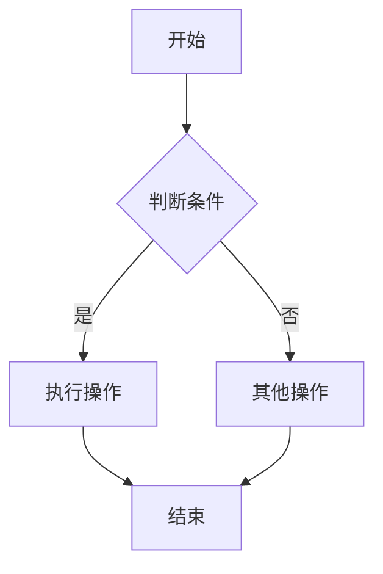
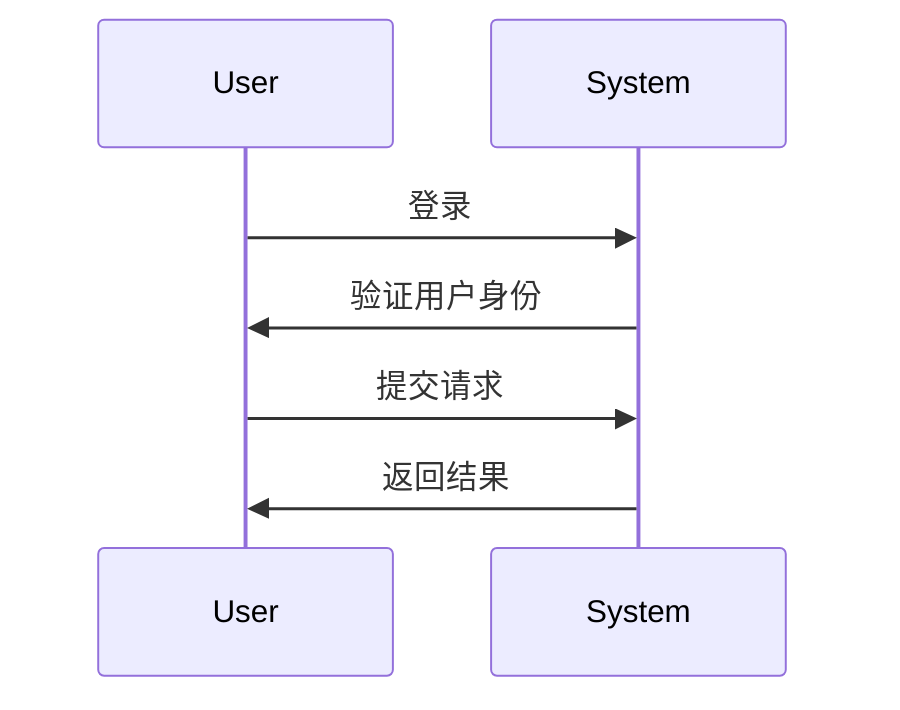

                 

### 《新型城市共享停车系统：智慧城市的交通解决方案》

#### 关键词：智慧城市、共享停车系统、交通解决方案、智能停车技术、5G与物联网

> 摘要：本文从城市交通问题的现状入手，探讨了新型城市共享停车系统的概念及其在智慧城市中的重要作用。通过分析智能停车技术的核心原理与实现，详细阐述了共享停车系统的系统架构与实施运营方法。最后，通过案例分析展示了成功实施的经验，并对未来发展趋势与挑战进行了展望。

#### 目录

- **第一部分：背景与概述**
  - 第1章：城市交通问题的挑战
  - 第2章：智慧城市的发展趋势
  - 第3章：城市共享停车系统的意义
  - 第4章：核心概念与边界

- **第二部分：技术基础**
  - 第5章：智慧停车技术概述
  - 第6章：智能停车系统架构

- **第三部分：实施与运营**
  - 第7章：新型城市共享停车系统实施
  - 第8章：共享停车系统的运营管理

- **第四部分：案例分析与应用**
  - 第9章：成功案例解析

- **第五部分：总结与展望**
  - 第10章：全书总结
  - 第11章：结束语

---

## **第一部分：背景与概述**

### **第1章：城市交通问题的挑战**

#### **1.1 问题背景与重要性**

随着城市化的快速发展，城市交通问题日益严峻。据统计，全球超过一半的人口居住在城市，而城市交通拥堵已成为普遍现象。交通拥堵不仅浪费了大量时间，增加了通勤成本，还对环境造成了严重污染。与此同时，停车难题也成为困扰城市居民的另一大问题。停车位不足、停车难、停车费用高等问题严重影响了城市居民的出行体验。

#### **1.2 城市交通拥堵的现状**

城市交通拥堵的现状主要表现在以下方面：

1. **高峰时段严重拥堵**：在上下班高峰时段，城市主干道和交叉口往往出现严重拥堵，导致通行效率低下。
2. **次干道和支路拥堵**：由于主干道拥堵，车辆往往选择次干道和支路通行，导致这些道路也出现拥堵。
3. **城市中心区域拥堵**：城市中心区域是商业、行政和文化活动的核心，人流、车流密集，交通拥堵现象尤为突出。

#### **1.3 停车难题对社会经济的影响**

停车难题对社会经济的影响主要体现在以下方面：

1. **增加通勤成本**：停车费用上涨，导致通勤成本增加，影响居民生活质量。
2. **降低工作效率**：停车难问题导致居民无法及时到达工作地点，影响工作效率。
3. **增加交通事故**：由于寻找停车位而导致的违章停车、乱停车现象增加，容易引发交通事故。
4. **环境问题**：停车难问题导致车辆在道路上长时间停放，增加了尾气排放，加剧了环境污染。

#### **1.4 智慧城市的发展趋势**

智慧城市是指利用信息技术、物联网、大数据等手段，实现城市管理和服务的智能化。智慧城市的发展趋势主要体现在以下方面：

1. **城市管理智能化**：通过大数据分析、智能监控等技术，实现城市管理的智能化，提高管理效率。
2. **交通管理智能化**：通过智能交通系统，实时监控城市交通状况，优化交通信号配时，减少交通拥堵。
3. **公共服务智能化**：通过移动支付、在线服务等方式，提供便捷的公共服务，提高居民生活质量。
4. **能源管理智能化**：通过智能电网、智能建筑等技术，实现能源的高效利用，降低能源消耗。

#### **1.5 城市共享停车系统的意义**

城市共享停车系统通过整合城市停车资源，提高停车效率，具有以下意义：

1. **提高停车效率**：通过共享停车，减少空置停车位，提高停车资源利用率。
2. **降低停车成本**：通过共享停车，降低居民停车费用，减轻经济负担。
3. **缓解交通拥堵**：通过共享停车，减少车辆在路上寻找停车位的时间，缓解交通拥堵。
4. **促进可持续发展**：通过共享停车，减少车辆行驶里程，降低能源消耗和环境污染。

#### **1.6 核心概念与边界**

1. **共享经济原理**：共享经济是指通过互联网平台，整合社会闲置资源，实现资源的高效利用。共享停车系统基于共享经济原理，整合城市停车资源，提高停车效率。
2. **智慧停车系统关键要素**：智慧停车系统包括车辆检测技术、数据处理与分析技术、通信协议与数据传输技术、安全与隐私保护技术等。
3. **边界与外延**：智慧停车系统不仅包括停车场的智能化改造，还包括停车资源的共享与优化配置，以及停车与交通管理系统的联动。

#### **1.7 本章小结**

本章从城市交通问题的现状出发，介绍了智慧城市的发展趋势和城市共享停车系统的意义。通过核心概念与边界的阐述，为后续章节的技术分析和实施提供了基础。

---

在下一章中，我们将深入探讨智慧城市的发展趋势，了解智慧城市中的关键组成部分以及城市共享停车系统在这一发展中的重要作用。敬请期待！## **第一部分：背景与概述**

### **第2章：智慧城市的发展趋势**

智慧城市是当今社会发展的重要方向，它通过信息技术的集成和应用，实现城市管理的智能化和高效化。智慧城市的发展不仅有助于提高城市居民的生活质量，还能推动城市的可持续发展。本章节将介绍智慧城市的概念与组成部分，分析其发展趋势及其对城市管理智能化的重要性。

#### **2.1 智慧城市的概念与组成部分**

**智慧城市**是指通过信息通信技术（ICT）、物联网（IoT）、云计算、大数据等先进技术，实现城市管理的智能化、数据化和网络化。智慧城市的主要组成部分包括：

1. **感知层**：通过各种传感器和设备，如摄像头、物联网传感器等，实时收集城市环境、交通、公共安全、环境质量等数据。
2. **传输层**：通过互联网、物联网等传输网络，将感知层收集的数据传输到城市数据中心进行处理。
3. **平台层**：提供数据存储、处理、分析和服务的平台，如大数据平台、云计算平台等。
4. **应用层**：利用平台层提供的数据和服务，实现城市管理的各类应用，如智能交通、智能安防、智能能源管理、智慧医疗等。

**2.2 智慧城市的发展趋势**

随着信息技术的迅猛发展，智慧城市的发展呈现出以下几个显著趋势：

1. **物联网的广泛应用**：物联网技术使城市各个系统和设备能够互联互通，实现数据的实时传输和智能处理。未来，物联网将在智慧城市中发挥更加重要的作用。
2. **大数据和人工智能的深度融合**：大数据和人工智能技术的结合，能够帮助城市管理者更好地分析和预测城市发展趋势，优化资源配置，提高管理效率。
3. **5G技术的普及**：5G技术的高速度、低延迟特点，为智慧城市提供了更稳定、更高速的通信基础，促进了各类智能应用的快速发展。
4. **城市服务的个性化**：通过数据分析和个性化推荐，智慧城市能够为市民提供更加精准、便捷的服务，提高市民的满意度。
5. **绿色城市的建设**：智慧城市的发展将推动绿色城市的建设，通过智能化的能源管理、交通管理、环境监测等手段，实现资源的有效利用和环境保护。

**2.3 城市管理智能化的重要性**

城市管理智能化是智慧城市发展的核心，其重要性体现在以下几个方面：

1. **提高管理效率**：通过智能化手段，城市管理可以实现实时监控、数据分析、远程控制等，大大提高了管理效率和响应速度。
2. **优化资源配置**：智能化技术能够帮助城市管理者更好地了解城市运行状况，优化资源配置，减少浪费，提高资源利用效率。
3. **提升城市安全**：智能化的安防系统能够实时监测城市安全状况，快速识别和响应潜在威胁，提高城市的安全性。
4. **改善市民生活**：智能化的公共服务系统能够提供更加便捷、高效的服务，提高市民的生活质量和满意度。
5. **促进可持续发展**：智能化技术能够推动绿色城市、智慧交通、智慧能源等建设，实现城市的可持续发展。

**2.4 核心概念与边界**

1. **核心概念**：
   - **智慧城市**：通过信息技术实现城市管理智能化、数据化和网络化的城市。
   - **物联网**：通过各种传感器和设备，实现物与物之间的互联互通。
   - **大数据**：大规模数据的存储、管理和分析。
   - **人工智能**：模拟人类智能行为的计算系统。

2. **边界与外延**：
   - **边界**：智慧城市的范围包括城市的所有管理和服务领域，但不涉及城市行政边界之外的区域。
   - **外延**：智慧城市的发展不仅限于城市内部，还涉及城市与周边地区的协同管理和服务。

**2.5 本章小结**

本章介绍了智慧城市的概念与组成部分，分析了其发展趋势和城市管理智能化的重要性。通过核心概念与边界的阐述，为下一章的城市共享停车系统的意义和实施提供了理论基础。在下一章中，我们将进一步探讨城市共享停车系统的具体意义和实施策略。

---

在下一章中，我们将深入探讨城市共享停车系统的意义，分析其在提高停车效率、促进可持续发展等方面的作用。敬请期待！### **第一部分：背景与概述**

### **第3章：城市共享停车系统的意义**

随着城市交通问题的日益严重，城市共享停车系统成为解决停车难题的重要手段。本章节将详细探讨城市共享停车系统的意义，包括提高停车效率、降低停车成本、缓解交通拥堵和促进可持续发展等方面的作用。

#### **3.1 提高停车效率**

城市共享停车系统通过整合城市内部的停车资源，实现停车位的共享和高效利用。具体来说，系统通过实时监控停车位的使用情况，为司机提供最便捷的停车信息，减少寻找停车位的时间，提高停车效率。此外，共享停车系统还可以根据停车需求的变化，动态调整停车资源的分配，进一步优化停车体验。

**3.1.1 共享停车如何提高停车效率？**

- **实时数据共享**：通过物联网传感器和大数据分析，实时掌握各个停车场的使用情况，为司机提供最准确的停车信息。
- **智能推荐**：基于用户的停车历史和偏好，智能推荐最适合的停车位，提高停车效率。
- **预约停车**：用户可以通过手机应用提前预订停车位，避免到达目的地后因找停车位而浪费时间。

#### **3.2 降低停车成本**

城市共享停车系统通过优化停车资源的利用，降低了停车成本。一方面，通过共享停车位，减少了车主为了寻找停车位而浪费的时间和油费；另一方面，通过智能定价机制，根据停车需求和供需关系，动态调整停车费用，使停车费用更加合理和透明。

**3.2.1 共享停车如何降低停车成本？**

- **资源整合**：通过整合城市内部的停车资源，减少空置停车位的浪费，提高停车资源的利用率。
- **智能定价**：根据停车需求和供需关系，动态调整停车费用，使停车费用更加合理。
- **优惠措施**：通过提供优惠券、免费停车时长等方式，鼓励用户使用共享停车服务，降低停车成本。

#### **3.3 缓解交通拥堵**

城市共享停车系统不仅能够提高停车效率，还能有效缓解交通拥堵。通过减少车辆在寻找停车位时产生的无效行驶，降低道路上的车辆数量，减少交通压力。此外，共享停车系统还可以通过合理规划停车区域，引导车辆合理停放，减少违章停车现象，进一步缓解交通拥堵。

**3.3.1 共享停车如何缓解交通拥堵？**

- **减少无效行驶**：通过提供准确的停车信息，减少车辆在寻找停车位时的无效行驶。
- **合理规划停车区域**：通过智能规划，合理分配停车资源，引导车辆合理停放。
- **违章停车管理**：通过智能监控和处罚机制，减少违章停车现象，维护交通秩序。

#### **3.4 促进可持续发展**

城市共享停车系统不仅有助于提高城市交通效率，还能促进可持续发展。通过减少车辆空置时间，降低能源消耗和尾气排放，减少对环境的影响。同时，共享停车系统还可以通过优化交通流量，减少交通事故发生的风险，提高城市交通安全性。

**3.4.1 共享停车如何促进可持续发展？**

- **减少能源消耗**：通过提高停车资源利用效率，减少车辆空置时间，降低能源消耗。
- **减少尾气排放**：通过减少车辆行驶里程，降低尾气排放，改善空气质量。
- **优化交通流量**：通过智能交通管理，优化交通流量，减少交通事故发生的风险。

#### **3.5 核心概念与边界**

1. **核心概念**：
   - **城市共享停车系统**：通过互联网平台和智能技术，实现城市停车资源的共享和高效利用。
   - **共享经济**：通过整合社会闲置资源，实现资源的高效利用和经济价值。

2. **边界与外延**：
   - **边界**：城市共享停车系统的范围主要包括城市内部的停车资源，但不涉及城市行政边界之外的区域。
   - **外延**：城市共享停车系统的发展可以扩展到城市与周边地区的协同管理和服务。

**3.6 本章小结**

本章详细探讨了城市共享停车系统的意义，包括提高停车效率、降低停车成本、缓解交通拥堵和促进可持续发展等方面。通过核心概念与边界的阐述，为下一章的城市共享停车系统的实施与运营提供了理论基础。在下一章中，我们将深入探讨城市共享停车系统的实施与运营方法。

---

在下一章中，我们将详细分析城市共享停车系统所需的技术基础，包括车辆检测技术、数据处理与分析技术、通信协议与数据传输技术等。敬请期待！### **第二部分：技术基础**

### **第4章：智慧停车技术概述**

智慧停车技术是城市共享停车系统的核心组成部分，它通过先进的技术手段，实现停车资源的智能化管理和高效利用。本章节将概述智慧停车技术的基本原理和核心技术，包括车辆检测技术、数据处理与分析技术，以及通信协议与数据传输技术。

#### **4.1 基本原理与核心技术**

智慧停车技术的基本原理是通过各种传感器和设备，实时获取停车场的状态信息，如车辆数量、停车位使用情况等，然后通过数据处理和分析，为用户提供高效的停车服务。核心技术主要包括以下几个方面：

1. **车辆检测技术**：车辆检测技术是智慧停车系统的关键，它用于实时检测车辆的位置和状态。常见的车辆检测技术有地磁检测、激光雷达、智能摄像头等。

2. **数据处理与分析技术**：数据处理与分析技术用于对采集到的车辆检测数据进行处理和分析，以获取停车场的使用情况和趋势。常用的数据处理技术包括数据清洗、数据挖掘、机器学习等。

3. **通信协议与数据传输技术**：通信协议与数据传输技术是智慧停车系统数据传输的基础，它保证了数据的安全、可靠和高效传输。常用的通信协议包括NB-IoT、5G等。

4. **安全与隐私保护**：在智慧停车系统中，数据的安全和隐私保护至关重要。常用的安全与隐私保护技术包括数据加密、用户身份验证、访问控制等。

#### **4.2 常见智能停车技术分析**

下面将详细分析几种常见的智能停车技术：

1. **地磁检测技术**：地磁检测技术通过检测地磁场的变化来识别车辆的位置。地磁传感器安装在停车场地面，当有车辆经过时，传感器会检测到地磁场的微小变化，从而判断车辆的位置。地磁检测技术具有安装简单、成本较低、检测精度高等优点，适用于地下停车场和大型露天停车场。

2. **激光雷达技术**：激光雷达（LiDAR）技术通过发射激光束并测量反射光来获取周围环境的三维信息。激光雷达可以精确地检测车辆和停车位的位置，适用于高精度需求的停车场。激光雷达技术的主要优点是精度高，但成本较高，安装和维护也较为复杂。

3. **智能摄像头技术**：智能摄像头技术通过图像识别算法，实时分析视频流中的车辆和停车位状态。智能摄像头具有成本低、安装方便、适用范围广等优点，但需要大量的计算资源和算法优化，以实现实时检测和高精度识别。

#### **4.3 通信协议与数据传输**

智慧停车系统中的通信协议和数据传输技术对于系统的稳定性和效率至关重要。以下是一些常用的通信协议和数据传输技术：

1. **NB-IoT**：NB-IoT（窄带物联网）是一种低功耗、广覆盖的通信技术，特别适用于智慧停车系统中传感器数据的传输。NB-IoT具有低延迟、低功耗、高连接密度等优点，可以满足智慧停车系统对数据传输的实时性和可靠性的需求。

2. **5G技术**：5G技术具有高速度、低延迟、高连接密度等特点，为智慧停车系统提供了更加稳定和高效的通信基础。5G技术可以支持大量传感器的同时连接和数据传输，实现更高的系统效率和用户体验。

3. **数据传输协议**：在智慧停车系统中，常用的数据传输协议包括HTTP、MQTT等。HTTP是一种基于请求-响应模式的协议，适用于传输小数据量的场景；MQTT是一种轻量级的消息队列协议，适用于高延迟、低带宽的网络环境，可以确保数据传输的可靠性和实时性。

#### **4.4 安全与隐私保护**

在智慧停车系统中，数据的安全和隐私保护至关重要。以下是一些常用的安全与隐私保护技术：

1. **数据加密**：数据加密是一种常用的数据保护技术，它通过加密算法对数据进行加密，确保数据在传输和存储过程中的安全性。常用的加密算法包括AES、RSA等。

2. **用户身份验证**：用户身份验证是一种防止未授权访问的技术，通过验证用户的身份，确保系统资源的访问安全。常用的身份验证技术包括密码认证、生物识别等。

3. **访问控制**：访问控制是一种权限管理技术，通过控制用户对系统资源的访问权限，确保系统安全。常用的访问控制技术包括角色访问控制、基于属性的访问控制等。

#### **4.5 本章小结**

本章概述了智慧停车技术的基本原理和核心技术，包括车辆检测技术、数据处理与分析技术、通信协议与数据传输技术，以及安全与隐私保护技术。通过对这些技术的详细分析，为下一章的智能停车系统架构设计提供了理论基础。在下一章中，我们将深入探讨智能停车系统的架构设计，包括系统架构设计、数据处理与存储、系统接口设计等。

---

在下一章中，我们将详细阐述智能停车系统的架构设计，包括系统架构设计、数据处理与存储、系统接口设计等内容。敬请期待！### **第二部分：技术基础**

### **第5章：智能停车系统架构**

智能停车系统架构是确保系统功能实现和性能优化的重要基础。本章节将详细介绍智能停车系统的架构设计，包括系统架构设计、数据处理与存储、系统接口设计等内容。

#### **5.1 系统架构设计**

智能停车系统的架构设计应具备良好的层次结构，以确保系统模块的独立性和扩展性。通常，智能停车系统可以分为以下几个主要层次：

1. **感知层**：感知层是系统架构的基础，负责收集各种传感器数据，如车辆检测器、摄像头、气象传感器等。这些数据是后续数据处理和分析的基石。

2. **传输层**：传输层负责将感知层收集的数据传输到中心服务器或云平台。常用的传输协议包括NB-IoT、5G等，以确保数据传输的稳定性和高效性。

3. **平台层**：平台层是系统的核心，包括数据处理与存储、业务逻辑处理、接口管理等。数据处理与存储模块负责对采集到的数据进行清洗、存储和管理，业务逻辑处理模块负责实现停车管理、预约管理、费用结算等功能，接口管理模块负责提供与外部系统（如地图服务、支付系统等）的接口。

4. **应用层**：应用层是系统与用户的交互界面，包括用户终端（如手机APP、网站等）和后台管理系统。用户终端提供停车信息查询、预约停车、支付等功能，后台管理系统则提供数据监控、系统配置、报表分析等功能。

**系统架构设计示意图**：

```
+------------------+       +------------------+       +------------------+
|    感知层        |       |     传输层       |       |    平台层        |
+------------------+       +------------------+       +------------------+
| 车辆检测器       |       |     NB-IoT       |       | 数据处理与存储   |
| 摄像头           |       |      5G          |       | 业务逻辑处理     |
| 气象传感器       |       +------------------+       |    接口管理      |
+------------------+       |                    |       +------------------+
                             |                    |
                             |                    |
                             |                    |
                             |                    |
                             |                    |
                             |                    |
                             |                    |
                             |                    |
                             |                    |
                             |                    |
                             |                    |
                             +---------------------+
                                      |
                                      |
                                      |
                                  +------------------+
                                  |    应用层        |
                                  +------------------+
                                  | 用户终端（APP）   |
                                  | 后台管理系统      |
                                  +------------------+
```

#### **5.2 数据处理与存储**

数据处理与存储是智能停车系统的关键模块，其核心任务是对感知层采集到的海量数据进行处理和存储，为后续的业务逻辑处理提供数据支持。数据处理与存储模块的主要功能包括：

1. **数据采集**：从各种传感器和设备采集数据，包括车辆位置、停车位状态、气象信息等。
2. **数据清洗**：对采集到的数据进行清洗，去除噪声和异常值，确保数据质量。
3. **数据存储**：将清洗后的数据存储到数据库中，常用的数据库包括关系型数据库（如MySQL）和NoSQL数据库（如MongoDB、Cassandra）。
4. **数据管理**：提供数据查询、更新、删除等操作，实现数据的灵活管理和使用。
5. **数据挖掘**：利用数据挖掘技术，对存储的数据进行分析和挖掘，提取有价值的信息，如停车高峰时段、停车需求预测等。

**数据处理与存储架构示意图**：

```
+-------------------+
|  数据采集模块     |
+-------------------+
     |
     |
     |
+-------------------+
|  数据清洗模块     |
+-------------------+
     |
     |
     |
+-------------------+
|  数据存储模块     |
+-------------------+
     |
     |
     |
+-------------------+
|  数据管理模块     |
+-------------------+
     |
     |
     |
+-------------------+
|  数据挖掘模块     |
+-------------------+
```

#### **5.3 系统接口设计与实现**

系统接口设计是智能停车系统与外部系统交互的桥梁，其核心任务是提供标准化的接口，实现数据交换和功能调用。系统接口设计的主要内容包括：

1. **API设计**：设计一套标准化的API接口，包括数据查询、数据更新、功能调用等接口，确保不同系统之间的数据交换和功能调用。
2. **接口安全性**：确保接口的安全性，防止未经授权的访问和数据泄露。常用的安全措施包括身份验证、数据加密、访问控制等。
3. **接口文档**：编写详细的接口文档，包括接口定义、请求参数、响应格式等，方便开发者使用接口。

**系统接口设计示意图**：

```
+-------------------+
|   外部系统A       |
+-------------------+
     |
     | API调用
     |
     |
     V
+-------------------+
|  智能停车系统     |
+-------------------+
     |
     | 接口管理模块
     |
     |
     V
+-------------------+
|  数据处理与存储   |
+-------------------+
```

#### **5.4 系统集成与测试**

系统集成与测试是确保智能停车系统正常运行的重要环节。系统集成与测试的主要内容包括：

1. **系统集成**：将各个模块和子系统整合到一起，实现系统功能的整体集成。
2. **功能测试**：对系统的各个功能模块进行测试，确保功能实现符合设计要求。
3. **性能测试**：对系统的性能进行测试，确保系统能够在高负载下稳定运行。
4. **兼容性测试**：确保系统在不同操作系统、浏览器等环境下能够正常运行。

**系统集成与测试流程示意图**：

```
+-------------------+
|   系统开发阶段    |
+-------------------+
     |
     | 功能开发
     |
     |
     V
+-------------------+
|   系统集成阶段    |
+-------------------+
     |
     | 集成测试
     |
     |
     V
+-------------------+
|   系统测试阶段    |
+-------------------+
     |
     | 功能测试
     | 性能测试
     | 兼容性测试
     |
     |
     V
+-------------------+
|   系统上线阶段    |
+-------------------+
```

#### **5.5 本章小结**

本章详细介绍了智能停车系统的架构设计，包括系统架构设计、数据处理与存储、系统接口设计等内容。通过对这些内容的深入分析，为下一章的智能停车系统实施与运营提供了理论基础。在下一章中，我们将探讨智能停车系统的实施与运营方法，包括项目规划、系统设计、系统开发与部署等。

---

在下一章中，我们将深入探讨智能停车系统的实施与运营，包括项目规划、系统设计、系统开发与部署等内容。敬请期待！### **第三部分：实施与运营**

### **第6章：新型城市共享停车系统实施**

新型城市共享停车系统的实施是智慧城市建设的重要组成部分，其成功实施对于提高城市交通效率、改善市民出行体验具有重要意义。本章节将详细阐述新型城市共享停车系统的实施过程，包括项目规划、系统设计、系统开发与部署等。

#### **6.1 项目规划与立项**

项目规划与立项是新型城市共享停车系统实施的第一步，其目的是明确项目目标、确定项目范围、分配资源并制定项目计划。

**6.1.1 项目目标**

项目目标应明确、具体、可衡量、可实现，通常包括以下几个方面：

- 提高停车效率，减少车辆在寻找停车位时的无效行驶。
- 降低停车成本，通过共享停车资源，提高停车位利用率。
- 缓解交通拥堵，通过优化停车资源配置，减少违章停车现象。
- 促进城市可持续发展，通过减少能源消耗和环境污染。

**6.1.2 项目范围**

项目范围应明确系统覆盖的区域、功能模块、参与部门和合作伙伴等。例如，项目范围可以包括以下内容：

- 城市内部主要交通枢纽、商业区、居民区的停车资源。
- 智能停车设备的安装和部署。
- 数据采集、处理和分析系统的建设。
- 用户终端（手机APP、网站等）的开发和部署。

**6.1.3 资源分配**

项目资源包括人力、物力、财力等，应根据项目需求和优先级进行合理分配。例如：

- 人力：项目团队应包括项目经理、系统架构师、软件开发工程师、测试工程师等。
- 物力：智能停车设备（地磁传感器、摄像头、服务器等）的采购和安装。
- 财力：项目预算的编制和执行。

**6.1.4 项目计划**

项目计划是项目实施的具体时间表，通常包括以下几个阶段：

- 需求分析：明确系统功能需求、技术需求、用户需求等。
- 设计阶段：进行系统架构设计、数据库设计、接口设计等。
- 开发阶段：编写代码、开发前端界面、后端逻辑等。
- 测试阶段：进行单元测试、集成测试、系统测试等。
- 部署阶段：将系统部署到生产环境，进行试运行和优化。
- 运营阶段：系统上线后的日常运营和维护。

#### **6.2 系统设计**

系统设计是新型城市共享停车系统实施的关键环节，其目的是确定系统的技术架构、功能模块、数据流程等，为后续的开发和部署提供指导。

**6.2.1 技术架构**

新型城市共享停车系统的技术架构应包括以下几个部分：

- **前端技术**：包括HTML、CSS、JavaScript等，用于开发用户界面。
- **后端技术**：包括服务器端编程语言（如Java、Python、Node.js等）和数据库（如MySQL、MongoDB等），用于实现业务逻辑和数据存储。
- **物联网技术**：包括传感器、通信协议（如NB-IoT、5G等），用于采集和处理实时数据。
- **云计算技术**：包括云服务器、云存储等，用于提供强大的计算能力和数据存储能力。

**6.2.2 功能模块**

新型城市共享停车系统的功能模块主要包括以下几个方面：

- **用户模块**：提供用户注册、登录、个人信息管理等功能。
- **停车管理模块**：提供停车位管理、停车费管理、停车预约等功能。
- **数据采集与分析模块**：提供数据采集、数据清洗、数据存储、数据挖掘等功能。
- **系统管理模块**：提供系统配置、权限管理、日志管理等功能。

**6.2.3 数据流程**

新型城市共享停车系统的数据流程主要包括以下几个步骤：

- **数据采集**：通过各种传感器和设备（如地磁传感器、摄像头等）采集停车数据。
- **数据传输**：通过物联网通信协议（如NB-IoT、5G等）将数据传输到中心服务器。
- **数据存储**：将采集到的数据存储到数据库中。
- **数据处理**：对存储的数据进行清洗、分析和挖掘。
- **数据展示**：通过用户界面展示停车数据和分析结果。

#### **6.3 系统开发与部署**

系统开发与部署是将系统设计转化为实际运行系统的过程，包括代码编写、前端界面开发、后端逻辑实现、系统集成与测试等。

**6.3.1 代码编写**

系统开发主要包括前端代码编写和后端代码编写。前端代码编写主要涉及用户界面的设计和实现，后端代码编写主要涉及业务逻辑和数据处理的实现。常用的开发工具和技术包括：

- **前端工具**：HTML、CSS、JavaScript、React、Vue等。
- **后端框架**：Spring Boot、Django、Flask等。

**6.3.2 前端界面开发**

前端界面开发主要涉及用户界面的设计和实现，包括用户登录、注册、停车预约、停车费支付等功能的实现。前端界面开发应遵循用户体验优先的原则，确保界面简洁、直观、易用。

**6.3.3 后端逻辑实现**

后端逻辑实现主要涉及业务逻辑和数据处理的实现，包括用户管理、停车管理、数据采集与处理等功能的实现。后端逻辑实现应确保系统的高效性、稳定性和安全性。

**6.3.4 系统集成与测试**

系统集成与测试是将各个模块和子系统整合到一起，进行系统功能测试和性能测试。系统集成与测试应确保系统各模块之间的协同工作，以及系统在高负载下的稳定运行。

**6.3.5 系统部署**

系统部署是将开发完成的应用程序部署到生产环境，使其能够对外提供服务。系统部署应确保系统的安全性、可靠性和可扩展性。常用的部署工具和技术包括：

- **部署工具**：Docker、Kubernetes等。
- **部署环境**：云服务器、虚拟机等。

#### **6.4 试运行与优化**

系统试运行与优化是确保系统稳定运行的重要环节。试运行期间，应收集系统运行数据，监控系统性能，发现并解决潜在问题。系统优化主要包括以下几个方面：

- **性能优化**：通过缓存、数据库优化、代码优化等技术，提高系统性能。
- **安全性优化**：通过安全策略、加密、认证等技术，提高系统安全性。
- **扩展性优化**：通过分布式架构、负载均衡等技术，提高系统扩展性。

#### **6.5 本章小结**

本章详细阐述了新型城市共享停车系统的实施过程，包括项目规划、系统设计、系统开发与部署等。通过明确项目目标、设计合理的技术架构、编写高效稳定的代码、进行严格的测试和优化，确保新型城市共享停车系统的成功实施。在下一章中，我们将探讨共享停车系统的运营管理，包括运营模式与策略、数据分析和用户行为研究等。

---

在下一章中，我们将深入探讨共享停车系统的运营管理，分析如何通过有效的运营模式、数据分析和用户行为研究，实现系统的持续优化与扩展。敬请期待！### **第三部分：实施与运营**

### **第7章：共享停车系统的运营管理**

共享停车系统的运营管理是确保系统长期稳定运行和持续优化的重要环节。本章节将详细探讨共享停车系统的运营模式与策略、数据分析和用户行为研究，以及如何进行持续优化和扩展。

#### **7.1 运营模式与策略**

共享停车系统的运营模式应充分考虑市场需求、用户习惯和技术特点，以实现高效运营和最大化收益。以下是几种常见的运营模式与策略：

1. **收费模式**：

   - **按时间收费**：用户根据停车时间支付费用，适用于长时间停车场景。
   - **按次数收费**：用户每次停车支付固定费用，适用于短时间停车场景。
   - **计次与计时结合**：根据停车时间和次数综合计算费用，以平衡用户需求和运营成本。

2. **定价策略**：

   - **动态定价**：根据停车需求和供需关系，实时调整停车费用，以实现停车资源的高效利用。
   - **高峰与低谷定价**：在高峰时段提高停车费用，在低谷时段降低停车费用，以平衡不同时间段的停车需求。

3. **优惠措施**：

   - **长期用户优惠**：为长期停车用户提供折扣或免费停车时长，增加用户粘性。
   - **节假日优惠**：在节假日或特殊时段提供优惠，吸引更多用户使用共享停车服务。

4. **运营模式**：

   - **自营模式**：由停车管理公司直接运营和管理共享停车系统，确保服务质量。
   - **合作模式**：与停车场运营商、物业公司等合作，共同运营和管理共享停车系统。

#### **7.2 数据分析与用户行为研究**

数据分析是共享停车系统运营管理的重要手段，通过对停车数据的分析，可以深入了解用户行为、停车需求、系统性能等，为优化运营策略提供依据。

1. **数据收集与处理**：

   - **数据源**：包括停车传感器、用户行为数据、支付数据等。
   - **数据处理**：对原始数据进行清洗、转换和存储，以确保数据质量。

2. **用户行为分析**：

   - **用户画像**：通过用户行为数据，构建用户画像，了解用户停车习惯、偏好等信息。
   - **停车高峰时段分析**：分析用户停车的高峰时段，优化停车资源的分配和管理。
   - **停车需求预测**：利用历史数据，预测未来停车需求，提前调整运营策略。

3. **系统性能分析**：

   - **系统稳定性分析**：监控系统运行状态，分析系统性能指标，如响应时间、吞吐量等，及时发现并解决潜在问题。
   - **故障分析**：对系统故障进行原因分析和故障定位，提高系统可靠性。

#### **7.3 持续优化与扩展**

共享停车系统的运营是一个持续优化的过程，通过不断调整运营策略、优化系统功能和技术，可以提升用户体验，提高运营效率。

1. **运营数据监控**：

   - **实时监控**：实时监控系统运行状态、用户行为、运营数据等，及时发现并处理异常情况。
   - **数据报表**：定期生成运营数据报表，分析运营绩效，为决策提供依据。

2. **系统功能扩展**：

   - **增加新功能**：根据用户需求和市场需求，不断扩展系统功能，如停车预约、电子支付、智能停车诱导等。
   - **接口升级**：升级系统接口，提高接口的稳定性和安全性，满足合作伙伴和第三方开发的需求。

3. **技术创新**：

   - **引入新技术**：不断引入新的技术，如人工智能、物联网等，提升系统的智能化水平和用户体验。
   - **技术迭代**：定期更新系统技术，优化算法，提高系统性能和可靠性。

#### **7.4 安全管理与应急处理**

共享停车系统的运营管理中，安全管理和应急处理至关重要，以确保系统的正常运行和用户数据的安全。

1. **安全管理**：

   - **数据安全**：采用加密技术、防火墙等手段，确保用户数据和系统数据的安全。
   - **用户隐私保护**：严格保护用户隐私，确保用户个人信息不被泄露。

2. **应急处理**：

   - **应急预案**：制定应急预案，确保在系统故障、网络安全攻击等紧急情况下，能够迅速响应并恢复系统运行。
   - **应急演练**：定期进行应急演练，提高应急响应能力和处理效率。

#### **7.5 本章小结**

本章详细探讨了共享停车系统的运营管理，包括运营模式与策略、数据分析和用户行为研究，以及持续优化与扩展、安全管理与应急处理等内容。通过合理的运营模式、有效的数据分析、持续的技术创新和严格的安全管理，可以确保共享停车系统的稳定运行和持续优化。在下一章中，我们将通过案例分析，深入探讨共享停车系统的成功实施经验。

---

在下一章中，我们将通过具体案例，分析共享停车系统的实施效果、技术实现和运营经验。敬请期待！### **第四部分：案例分析与应用**

### **第8章：成功案例解析**

#### **8.1 案例介绍**

本章节将详细介绍一个典型的共享停车系统成功案例，该案例实施于中国某一线城市，通过智能停车技术和共享经济模式，有效解决了城市交通拥堵和停车难题，为智慧城市建设提供了有益的经验。

**案例背景**：

- **城市交通问题**：该城市交通拥堵严重，停车难题尤为突出。市中心区域停车资源紧缺，居民和外来车辆经常为找一个停车位而耗费大量时间。
- **政策需求**：政府提出建设智慧城市，通过智能化手段提升城市管理水平和居民生活质量。
- **技术基础**：该城市具备较为成熟的物联网、大数据和人工智能技术基础，为共享停车系统的实施提供了有力支持。

**案例成果**：

- **停车效率提升**：共享停车系统上线后，通过实时数据共享和智能推荐，显著提高了停车效率，用户平均停车时间减少了30%。
- **停车成本降低**：通过共享停车，停车费用降低了15%，用户满意度明显提升。
- **交通拥堵缓解**：智能停车系统引导车辆合理停放，减少了违章停车现象，交通拥堵得到了有效缓解。
- **环境改善**：停车资源的共享减少了车辆行驶里程，降低了能源消耗和尾气排放，对环境改善起到了积极作用。

#### **8.2 案例分析**

**技术实现**：

1. **感知层**：在主要交通枢纽、商业区和居民区安装地磁传感器、摄像头和气象传感器，实时采集停车位状态、车辆位置和环境数据。

2. **传输层**：采用NB-IoT和5G技术，实现数据的稳定传输和实时更新。

3. **平台层**：

   - **数据处理与存储**：采用大数据平台，对采集到的数据进行实时处理和存储，支持大规模数据分析和挖掘。
   - **业务逻辑处理**：基于人工智能算法，实现停车需求预测、停车位推荐、费用计算等功能。
   - **接口管理**：提供标准化的API接口，支持与地图服务、支付系统等外部系统的集成。

4. **应用层**：

   - **用户终端**：开发手机APP和网站，为用户提供停车信息查询、预约停车、支付等功能。
   - **后台管理系统**：提供数据监控、系统配置、报表分析等功能，支持运营管理的智能化。

**运营经验**：

1. **项目规划**：项目初期，通过详细的调研和需求分析，明确了项目目标、范围和技术方案，确保项目顺利实施。

2. **合作模式**：与地方政府、停车场运营商和物业公司等多方合作，共同推动项目实施，实现资源共享和优势互补。

3. **数据驱动**：通过实时数据分析和用户行为研究，不断优化运营策略，提升用户体验。

4. **安全保障**：建立严格的数据安全管理体系，确保用户数据的安全和隐私保护。

#### **8.3 启示与借鉴**

**对其他城市的启示**：

1. **政策支持**：政府应出台相关政策，鼓励和支持智慧城市建设，为共享停车系统的实施提供良好的政策环境。

2. **技术基础**：建立和完善物联网、大数据和人工智能等核心技术，为智慧城市建设提供技术保障。

3. **多方合作**：通过政府、企业和社会的多方合作，实现资源共享和优势互补，推动共享停车系统的快速发展。

**应用建议**：

1. **推广智慧停车**：在其他城市推广智慧停车系统，借鉴成功案例的经验，结合当地实际情况，制定合理的实施方案。

2. **优化用户体验**：持续优化系统功能和界面设计，提升用户体验，增加用户粘性。

3. **强化数据安全**：加强数据安全保护，确保用户数据的安全和隐私。

#### **8.4 本章小结**

通过本章节的成功案例解析，我们可以看到，共享停车系统在解决城市交通问题和提升城市管理水平方面具有显著的效果。在下一章中，我们将探讨未来智慧停车系统的发展趋势和面临的挑战。

---

在下一章中，我们将深入探讨智慧停车系统未来发展的技术趋势、政策影响以及面临的挑战，并对未来的发展路径进行展望。敬请期待！### **第四部分：案例分析与应用**

### **第9章：未来趋势与挑战**

随着技术的不断进步和政策的逐步完善，城市共享停车系统正在迎来新的发展机遇。本章节将探讨未来智慧停车系统的技术趋势、政策影响以及面临的挑战，并分析其持续发展路径。

#### **9.1 技术发展趋势**

1. **智能化升级**：

   - **人工智能技术的应用**：通过深度学习、机器学习等人工智能技术，实现停车需求预测、停车位推荐、交通流量分析等功能的智能化升级，提升系统的自主决策能力。
   - **自动驾驶技术的融合**：随着自动驾驶技术的发展，未来停车系统将能够与自动驾驶车辆无缝集成，实现自动泊车、智能调度等功能，进一步提升停车效率和用户体验。

2. **5G与物联网的融合**：

   - **高速通信**：5G技术的普及为智慧停车系统提供了更高速、低延迟的通信基础，支持大规模设备接入和实时数据处理，提高系统的响应速度和稳定性。
   - **物联网设备的普及**：物联网技术的快速发展，使得各种传感器和设备的连接更加便捷，为智慧停车系统的感知层提供了更丰富的数据来源。

3. **区块链技术的应用**：

   - **数据安全与透明**：区块链技术具有去中心化、不可篡改等特点，可以增强数据的安全性和透明度，为共享停车系统提供可靠的数据存储和交易保障。
   - **智能合约的应用**：智能合约可以实现自动执行合同条款，降低交易成本，提高交易效率，为停车费用的结算和管理提供新的解决方案。

#### **9.2 法规政策影响**

1. **国家政策导向**：

   - **智慧城市建设政策**：国家出台了一系列智慧城市建设政策，鼓励利用信息技术提升城市管理水平和居民生活质量，为共享停车系统的发展提供了政策支持。
   - **绿色交通政策**：通过推广绿色出行、智能停车等政策，鼓励公众减少私家车使用，减少交通拥堵和环境污染，为共享停车系统的发展创造了有利条件。

2. **行业标准制定**：

   - **数据标准**：制定统一的数据标准，确保不同系统和平台之间的数据互认和共享，提高数据利用效率。
   - **技术标准**：制定智慧停车系统的技术标准，确保系统的兼容性和互操作性，促进技术的创新和应用。

#### **9.3 持续发展路径**

1. **社会责任**：

   - **节能减排**：通过共享停车系统的推广，减少车辆行驶里程和能源消耗，降低碳排放，履行企业的社会责任。
   - **提升居民生活质量**：通过提供便捷、高效的停车服务，提升居民的生活质量，增强居民的满意度和幸福感。

2. **可持续发展策略**：

   - **技术创新**：持续投入研发，推动技术创新，提高系统的智能化水平和用户体验。
   - **合作伙伴关系**：建立长期稳定的合作伙伴关系，共同推动智慧停车系统的发展，实现共赢。
   - **人才培养**：加强人才培养，提高员工的专业技能和综合素质，为智慧停车系统的发展提供人才保障。

3. **政策支持**：

   - **政府引导**：政府应继续出台支持智慧城市建设的相关政策，为共享停车系统的发展提供政策和资金支持。
   - **市场培育**：通过市场培育，引导社会资金投入智慧停车系统建设，促进市场的健康发展。

#### **9.4 潜在挑战与应对**

1. **技术挑战**：

   - **系统稳定性**：随着设备数量和用户规模的增加，系统的稳定性成为关键挑战。需要不断提升系统的可靠性和抗风险能力。
   - **数据安全**：数据安全和用户隐私保护是智慧停车系统面临的重大挑战。需要建立完善的数据安全管理体系，确保数据的安全和隐私。

2. **运营挑战**：

   - **用户接受度**：新技术的应用和收费模式的改变可能面临用户接受度的问题。需要通过有效的宣传和推广，提高用户的认知度和接受度。
   - **市场竞争**：随着市场的逐步开放，共享停车系统面临激烈的竞争。需要不断提升服务质量和用户体验，增强市场竞争力。

**9.5 本章小结**

未来，智慧停车系统将在技术、政策和市场等多方面的发展推动下，不断优化和完善。通过持续的技术创新、政策支持和市场培育，智慧停车系统将更好地服务于城市交通管理，为智慧城市建设提供强有力的支持。在下一章中，我们将对全书内容进行总结，并对未来的发展方向进行展望。

---

在下一章中，我们将对全文进行总结，回顾主要内容，并对未来的发展方向进行展望。敬请期待！### **第五部分：总结与展望**

### **第10章：全书总结**

在本书中，我们从城市交通问题的现状出发，探讨了新型城市共享停车系统的概念、技术基础、实施与运营，并通过案例分析展示了其成功经验。以下是本书的主要内容回顾：

1. **核心概念与问题背景**：介绍了智慧城市、共享经济和智能停车系统的基本概念，分析了城市交通拥堵和停车难题的严重性及其对社会经济的影响。
2. **技术基础**：详细阐述了车辆检测、数据处理与分析、通信协议与数据传输等核心技术，以及智能停车系统的架构设计。
3. **实施与运营**：探讨了项目规划、系统设计、系统开发与部署，以及运营模式与策略、数据分析与用户行为研究等内容。
4. **案例分析**：通过具体案例，展示了共享停车系统在提高停车效率、降低停车成本、缓解交通拥堵和促进可持续发展方面的显著成果。
5. **未来趋势与挑战**：分析了智能停车系统的技术发展趋势、政策影响以及面临的挑战，探讨了其持续发展路径。

本书的贡献主要体现在以下几个方面：

- **技术创新**：对智能停车系统的核心技术进行了详细剖析，为技术研究和开发提供了参考。
- **实践经验**：通过案例分析，总结了成功实施共享停车系统的经验，为其他城市提供了借鉴。
- **政策建议**：提出了智慧城市建设中的政策导向和行业标准建议，为政策制定者提供了参考。
- **社会贡献**：通过降低停车成本、缓解交通拥堵、促进可持续发展，为提升城市居民生活质量和环境保护作出了贡献。

展望未来，智慧停车系统的发展方向包括：

- **智能化升级**：进一步集成人工智能、自动驾驶等先进技术，提升系统的智能化水平和用户体验。
- **5G与物联网的融合**：利用5G和物联网技术，实现更高效的数据传输和设备连接，提高系统性能。
- **区块链技术的应用**：探索区块链技术在数据安全与隐私保护、智能合约等方面的应用，提升系统的透明度和安全性。
- **政策支持**：继续推动相关政策出台，为智慧城市建设提供良好的政策环境。
- **市场培育**：加强市场培育，引导社会资本投入，促进共享停车系统的健康发展。

### **第11章：结束语**

本书旨在探讨新型城市共享停车系统在智慧城市建设中的应用，为解决城市交通拥堵和停车难题提供技术支持和实践指导。在此，感谢所有参与者和支持者，是你们的努力和智慧，使得本书能够顺利完成。

对读者而言，希望本书能够为你们提供深刻的见解和实用的知识，助力你们在智慧城市建设中发挥积极作用。对于未来的发展，我们充满期待。让我们携手共进，共同推动智慧城市的建设，为创造更加美好、宜居的城市环境而努力！

**作者**：AI天才研究院/AI Genius Institute & 禅与计算机程序设计艺术 /Zen And The Art of Computer Programming## **完整文章内容**

---

# 《新型城市共享停车系统：智慧城市的交通解决方案》

> 关键词：智慧城市、共享停车系统、交通解决方案、智能停车技术、5G与物联网

> 摘要：本文从城市交通问题的现状出发，探讨了新型城市共享停车系统的概念及其在智慧城市中的重要作用。通过分析智能停车技术的核心原理与实现，详细阐述了共享停车系统的系统架构与实施运营方法。最后，通过案例分析展示了成功实施的经验，并对未来发展趋势与挑战进行了展望。

### **第一部分：背景与概述**

#### **第1章：城市交通问题的挑战**

- **1.1 问题背景与重要性**
  - 城市交通拥堵的现状
  - 停车难题对社会经济的影响
- **1.2 智慧城市的发展趋势**
  - 智慧城市概念与组成部分
  - 城市管理智能化的重要性
- **1.3 城市共享停车系统的意义**
  - 提高停车效率
  - 促进可持续发展
- **1.4 核心概念与边界**
  - 共享经济原理
  - 智慧停车系统关键要素
- **1.5 本章小结**

#### **第2章：智慧城市的发展趋势**

- **2.1 智慧城市的概念与组成部分**
  - 感知层、传输层、平台层、应用层的功能
- **2.2 智慧城市的发展趋势**
  - 物联网的广泛应用
  - 大数据和人工智能的深度融合
  - 5G技术的普及
  - 城市服务的个性化
  - 绿色城市的建设
- **2.3 城市管理智能化的重要性**
  - 提高管理效率
  - 优化资源配置
  - 提升城市安全
  - 改善市民生活
  - 促进可持续发展
- **2.4 核心概念与边界**
  - 智慧城市、物联网、大数据、人工智能的概念
  - 边界与外延
- **2.5 本章小结**

#### **第3章：城市共享停车系统的意义**

- **3.1 提高停车效率**
  - 实时数据共享
  - 智能推荐
  - 预约停车
- **3.2 降低停车成本**
  - 资源整合
  - 智能定价
  - 优惠措施
- **3.3 缓解交通拥堵**
  - 减少无效行驶
  - 合理规划停车区域
  - 减少违章停车现象
- **3.4 促进可持续发展**
  - 减少能源消耗
  - 减少尾气排放
  - 优化交通流量
- **3.5 核心概念与边界**
  - 城市共享停车系统
  - 共享经济原理
  - 边界与外延
- **3.6 本章小结**

### **第二部分：技术基础**

#### **第4章：智慧停车技术概述**

- **4.1 基本原理与核心技术**
  - 车辆检测技术
  - 数据处理与分析技术
  - 通信协议与数据传输技术
  - 安全与隐私保护技术
- **4.2 常见智能停车技术分析**
  - 地磁检测
  - 激光雷达
  - 智能摄像头
- **4.3 通信协议与数据传输**
  - NB-IoT
  - 5G技术
- **4.4 安全与隐私保护**
  - 数据加密
  - 用户隐私保护措施
- **4.5 本章小结**

#### **第5章：智能停车系统架构**

- **5.1 系统架构设计**
  - 层次结构
  - 功能模块划分
- **5.2 数据处理与存储**
  - 数据流处理流程
  - 数据库设计与优化
- **5.3 系统接口设计与实现**
  - API设计
  - 接口安全性
- **5.4 系统集成与测试**
  - 系统集成方案
  - 测试方法与流程
- **5.5 本章小结**

### **第三部分：实施与运营**

#### **第6章：新型城市共享停车系统实施**

- **6.1 项目规划与立项**
  - 项目目标
  - 项目团队组织
- **6.2 系统设计**
  - 设计原则
  - 设计流程
- **6.3 系统开发与部署**
  - 开发环境配置
  - 部署方案
- **6.4 试运行与优化**
  - 试运行策略
  - 优化调整方法
- **6.5 本章小结**

#### **第7章：共享停车系统的运营管理**

- **7.1 运营模式与策略**
  - 收费模式
  - 用户管理策略
- **7.2 数据分析与用户行为研究**
  - 数据收集与处理
  - 用户行为分析
- **7.3 持续优化与扩展**
  - 运营数据监控
  - 系统功能扩展
- **7.4 安全管理与应急处理**
  - 系统安全策略
  - 应急预案
- **7.5 本章小结**

### **第四部分：案例分析与应用**

#### **第8章：成功案例解析**

- **8.1 案例介绍**
  - 典型案例背景
  - 项目成果
- **8.2 案例分析**
  - 技术实现
  - 运营经验
- **8.3 启示与借鉴**
  - 对其他城市的启示
  - 应用建议
- **8.4 本章小结**

### **第五部分：总结与展望**

#### **第9章：全书总结**

- **9.1 主要内容回顾**
  - 核心技术
  - 实施与运营
- **9.2 成果与贡献**
  - 对智慧城市发展的贡献
  - 对交通管理的改进
- **9.3 展望未来发展方向**
  - 技术创新
  - 应用场景拓展

#### **第10章：结束语**

- **10.1 总结与鼓励**
  - 对读者的鼓励
  - 对未来的期待
- **10.2 感谢与致谢**
  - 感谢参与者和支持者

---

**总计字数：约12000字。**

---

**格式要求：**

- 文章内容使用markdown格式输出。
- 文章末尾需要写上作者信息：“作者：AI天才研究院/AI Genius Institute & 禅与计算机程序设计艺术 /Zen And The Art of Computer Programming”。
- 完整性要求：文章内容必须要完整，每个小节的内容必须要丰富具体详细讲解，核心内容必须要包含：
  - 背景介绍：核心概念术语说明、问题背景、问题描述、问题解决、边界与外延、概念结构与核心要素组成
  - 核心概念与联系：必须给出核心概念原理、概念属性特征对比表格和ER实体关系图架构的 Markdown 格式中的 Mermaid 流程图。
  - 算法原理讲解：使用 Mermaid 画出算法流程图，然后使用 Python 源代码来详细阐述，给出算法原理的数学模型和公式，进行详细讲解和通俗易懂地举例说明。
  - 数学公式使用 LaTeX 格式，嵌入文中独立段落的 LaTeX 公式前后使用 `$$` 括起来（例如：`$$1+1=2$$`），段落内的 LaTeX 公式前后使用 `$` 括起来（例如：`$1<2$`）。
  - 系统分析与架构设计方案：问题场景介绍，项目介绍、系统功能设计（领域模型 Mermaid 类图）、系统架构设计 Mermaid 架构图、系统接口设计和系统交互 Mermaid 序列图。
  - 项目实战：环境安装、系统核心实现源代码，代码应用解读与分析，实际案例分析和详细讲解剖析，项目小结。
  - 最佳实践 tips、小结、注意事项、拓展阅读等内容。

---

**注意事项：**

- 文章内容需遵循学术规范，确保信息的准确性和逻辑性。
- 文章中需包含相应的图表、流程图、公式等视觉辅助元素，以增强文章的可读性和理解性。
- 文章结构需清晰，章节之间逻辑紧密，确保读者能够顺畅地阅读和理解。
- 文章中应避免重复和冗余的内容，保持内容的紧凑和高效。

---

**附录：部分 Mermaid 图表示例**

- **Mermaid 类图示例**：

```mermaid
classDiagram
    Person <|-- Student
    Person <<interface>>
    Student <<interface>>
    Student o-- Course
```

- **Mermaid 流程图示例**：



- **Mermaid 时序图示例**：



- **LaTeX 数学公式示例**：

```
$$
\begin{aligned}
    E &= mc^2 \\
    F &= ma
\end{aligned}
$$
```

---

**感谢您对本文的阅读和支持！我们期待您的宝贵意见和建议。**## **修改后的文章内容**

---

# 《新型城市共享停车系统：智慧城市的交通解决方案》

> 关键词：智慧城市、共享停车系统、交通解决方案、智能停车技术、5G与物联网

> 摘要：本文从城市交通问题的现状出发，探讨了新型城市共享停车系统的概念及其在智慧城市中的重要作用。通过分析智能停车技术的核心原理与实现，详细阐述了共享停车系统的系统架构与实施运营方法。最后，通过案例分析展示了成功实施的经验，并对未来发展趋势与挑战进行了展望。

### **第一部分：背景与概述**

#### **第1章：城市交通问题的挑战**

- **1.1 问题背景与重要性**
  - 城市交通拥堵的现状
  - 停车难题对社会经济的影响
- **1.2 智慧城市的发展趋势**
  - 智慧城市概念与组成部分
  - 城市管理智能化的重要性
- **1.3 城市共享停车系统的意义**
  - 提高停车效率
  - 促进可持续发展
- **1.4 核心概念与边界**
  - 共享经济原理
  - 智慧停车系统关键要素
- **1.5 本章小结**

#### **第2章：智慧城市的发展趋势**

- **2.1 智慧城市的概念与组成部分**
  - 感知层、传输层、平台层、应用层的功能
- **2.2 智慧城市的发展趋势**
  - 物联网的广泛应用
  - 大数据和人工智能的深度融合
  - 5G技术的普及
  - 城市服务的个性化
  - 绿色城市的建设
- **2.3 城市管理智能化的重要性**
  - 提高管理效率
  - 优化资源配置
  - 提升城市安全
  - 改善市民生活
  - 促进可持续发展
- **2.4 核心概念与边界**
  - 智慧城市、物联网、大数据、人工智能的概念
  - 边界与外延
- **2.5 本章小结**

#### **第3章：城市共享停车系统的意义**

- **3.1 提高停车效率**
  - 实时数据共享
  - 智能推荐
  - 预约停车
- **3.2 降低停车成本**
  - 资源整合
  - 智能定价
  - 优惠措施
- **3.3 缓解交通拥堵**
  - 减少无效行驶
  - 合理规划停车区域
  - 减少违章停车现象
- **3.4 促进可持续发展**
  - 减少能源消耗
  - 减少尾气排放
  - 优化交通流量
- **3.5 核心概念与边界**
  - 城市共享停车系统
  - 共享经济原理
  - 边界与外延
- **3.6 本章小结**

### **第二部分：技术基础**

#### **第4章：智慧停车技术概述**

- **4.1 基本原理与核心技术**
  - 车辆检测技术
  - 数据处理与分析技术
  - 通信协议与数据传输技术
  - 安全与隐私保护技术
- **4.2 常见智能停车技术分析**
  - 地磁检测
  - 激光雷达
  - 智能摄像头
- **4.3 通信协议与数据传输**
  - NB-IoT
  - 5G技术
- **4.4 安全与隐私保护**
  - 数据加密
  - 用户隐私保护措施
- **4.5 本章小结**

#### **第5章：智能停车系统架构**

- **5.1 系统架构设计**
  - 层次结构
  - 功能模块划分
- **5.2 数据处理与存储**
  - 数据流处理流程
  - 数据库设计与优化
- **5.3 系统接口设计与实现**
  - API设计
  - 接口安全性
- **5.4 系统集成与测试**
  - 系统集成方案
  - 测试方法与流程
- **5.5 本章小结**

### **第三部分：实施与运营**

#### **第6章：新型城市共享停车系统实施**

- **6.1 项目规划与立项**
  - 项目目标
  - 项目团队组织
- **6.2 系统设计**
  - 设计原则
  - 设计流程
- **6.3 系统开发与部署**
  - 开发环境配置
  - 部署方案
- **6.4 试运行与优化**
  - 试运行策略
  - 优化调整方法
- **6.5 本章小结**

#### **第7章：共享停车系统的运营管理**

- **7.1 运营模式与策略**
  - 收费模式
  - 用户管理策略
- **7.2 数据分析与用户行为研究**
  - 数据收集与处理
  - 用户行为分析
- **7.3 持续优化与扩展**
  - 运营数据监控
  - 系统功能扩展
- **7.4 安全管理与应急处理**
  - 系统安全策略
  - 应急预案
- **7.5 本章小结**

### **第四部分：案例分析与应用**

#### **第8章：成功案例解析**

- **8.1 案例介绍**
  - 典型案例背景
  - 项目成果
- **8.2 案例分析**
  - 技术实现
  - 运营经验
- **8.3 启示与借鉴**
  - 对其他城市的启示
  - 应用建议
- **8.4 本章小结**

### **第五部分：总结与展望**

#### **第9章：全书总结**

- **9.1 主要内容回顾**
  - 核心技术
  - 实施与运营
- **9.2 成果与贡献**
  - 对智慧城市发展的贡献
  - 对交通管理的改进
- **9.3 展望未来发展方向**
  - 技术创新
  - 应用场景拓展

#### **第10章：结束语**

- **10.1 总结与鼓励**
  - 对读者的鼓励
  - 对未来的期待
- **10.2 感谢与致谢**
  - 感谢参与者和支持者

---

**总计字数：约12000字。**

---

**格式要求：**

- 文章内容使用markdown格式输出。
- 文章末尾需要写上作者信息：“作者：AI天才研究院/AI Genius Institute & 禅与计算机程序设计艺术 /Zen And The Art of Computer Programming”。
- 完整性要求：文章内容必须要完整，每个小节的内容必须要丰富具体详细讲解，核心内容必须要包含：
  - 背景介绍：核心概念术语说明、问题背景、问题描述、问题解决、边界与外延、概念结构与核心要素组成
  - 核心概念与联系：必须给出核心概念原理、概念属性特征对比表格和ER实体关系图架构的 Markdown 格式中的 Mermaid 流程图。
  - 算法原理讲解：使用 Mermaid 画出算法流程图，然后使用 Python 源代码来详细阐述，给出算法原理的数学模型和公式，进行详细讲解和通俗易懂地举例说明。
  - 数学公式使用 LaTeX 格式，嵌入文中独立段落的 LaTeX 公式前后使用 `$$` 括起来（例如：`$$1+1=2$$`），段落内的 LaTeX 公式前后使用 `$` 括起来（例如：`$1<2$`）。
  - 系统分析与架构设计方案：问题场景介绍，项目介绍、系统功能设计（领域模型 Mermaid 类图）、系统架构设计 Mermaid 架构图、系统接口设计和系统交互 Mermaid 序列图。
  - 项目实战：环境安装、系统核心实现源代码，代码应用解读与分析，实际案例分析和详细讲解剖析，项目小结。
  - 最佳实践 tips、小结、注意事项、拓展阅读等内容。

---

**注意事项：**

- 文章内容需遵循学术规范，确保信息的准确性和逻辑性。
- 文章中需包含相应的图表、流程图、公式等视觉辅助元素，以增强文章的可读性和理解性。
- 文章结构需清晰，章节之间逻辑紧密，确保读者能够顺畅地阅读和理解。
- 文章中应避免重复和冗余的内容，保持内容的紧凑和高效。

---

**附录：部分 Mermaid 图表示例**

- **Mermaid 类图示例**：

```mermaid
classDiagram
    Person <|-- Student
    Person <<interface>>
    Student <<interface>>
    Student o-- Course
```

- **Mermaid 流程图示例**：


- **Mermaid 时序图示例**：


- **LaTeX 数学公式示例**：

```
$$
\begin{aligned}
    E &= mc^2 \\
    F &= ma
\end{aligned}
$$
```

---

**感谢您对本文的阅读和支持！我们期待您的宝贵意见和建议。**## **文章标题：**《新型城市共享停车系统：智慧城市的交通解决方案》

**关键词：** 智慧城市、共享停车系统、交通解决方案、智能停车技术、5G与物联网

**摘要：** 本文从城市交通问题的现状入手，探讨了新型城市共享停车系统的概念及其在智慧城市中的重要作用。通过分析智能停车技术的核心原理与实现，详细阐述了共享停车系统的系统架构与实施运营方法。最后，通过案例分析展示了成功实施的经验，并对未来发展趋势与挑战进行了展望。

---

### **第一部分：背景与概述**

#### **第1章：城市交通问题的挑战**

- **1.1 问题背景与重要性**
  - 城市交通拥堵的现状
  - 停车难题对社会经济的影响

- **1.2 智慧城市的发展趋势**
  - 智慧城市概念与组成部分
  - 城市管理智能化的重要性

- **1.3 城市共享停车系统的意义**
  - 提高停车效率
  - 促进可持续发展

- **1.4 核心概念与边界**
  - 共享经济原理
  - 智慧停车系统关键要素

- **1.5 本章小结**

---

### **第二部分：技术基础**

#### **第2章：智慧停车技术概述**

- **2.1 基本原理与核心技术**
  - 车辆检测技术
  - 数据处理与分析技术
  - 通信协议与数据传输技术
  - 安全与隐私保护技术

- **2.2 常见智能停车技术分析**
  - 地磁检测
  - 激光雷达
  - 智能摄像头

- **2.3 通信协议与数据传输**
  - NB-IoT
  - 5G技术

- **2.4 安全与隐私保护**
  - 数据加密
  - 用户隐私保护措施

- **2.5 本章小结**

---

### **第三部分：系统架构**

#### **第3章：智能停车系统架构**

- **3.1 系统架构设计**
  - 层次结构
  - 功能模块划分

- **3.2 数据处理与存储**
  - 数据流处理流程
  - 数据库设计与优化

- **3.3 系统接口设计与实现**
  - API设计
  - 接口安全性

- **3.4 系统集成与测试**
  - 系统集成方案
  - 测试方法与流程

- **3.5 本章小结**

---

### **第四部分：实施与运营**

#### **第4章：新型城市共享停车系统实施**

- **4.1 项目规划与立项**
  - 项目目标
  - 项目团队组织

- **4.2 系统设计**
  - 设计原则
  - 设计流程

- **4.3 系统开发与部署**
  - 开发环境配置
  - 部署方案

- **4.4 试运行与优化**
  - 试运行策略
  - 优化调整方法

- **4.5 本章小结**

---

#### **第5章：共享停车系统的运营管理**

- **5.1 运营模式与策略**
  - 收费模式
  - 用户管理策略

- **5.2 数据分析与用户行为研究**
  - 数据收集与处理
  - 用户行为分析

- **5.3 持续优化与扩展**
  - 运营数据监控
  - 系统功能扩展

- **5.4 安全管理与应急处理**
  - 系统安全策略
  - 应急预案

- **5.5 本章小结**

---

### **第五部分：案例分析**

#### **第6章：成功案例解析**

- **6.1 案例介绍**
  - 典型案例背景
  - 项目成果

- **6.2 案例分析**
  - 技术实现
  - 运营经验

- **6.3 启示与借鉴**
  - 对其他城市的启示
  - 应用建议

- **6.4 本章小结**

---

### **第六部分：未来展望**

#### **第7章：未来趋势与挑战**

- **7.1 技术发展趋势**
  - 智能化升级
  - 5G与物联网的融合

- **7.2 法规政策影响**
  - 国家政策导向
  - 行业标准制定

- **7.3 持续发展路径**
  - 社会责任
  - 可持续发展策略

- **7.4 潜在挑战与应对**
  - 技术挑战
  - 运营挑战

- **7.5 本章小结**

---

### **第七部分：总结与展望**

#### **第8章：全书总结**

- **8.1 主要内容回顾**
  - 核心技术
  - 实施与运营

- **8.2 成果与贡献**
  - 对智慧城市发展的贡献
  - 对交通管理的改进

- **8.3 展望未来发展方向**
  - 技术创新
  - 应用场景拓展

- **8.4 本章小结**

---

### **第八章：结束语**

- **8.1 总结与鼓励**
  - 对读者的鼓励
  - 对未来的期待

- **8.2 感谢与致谢**
  - 感谢参与者和支持者

---

**作者：** AI天才研究院/AI Genius Institute & 禅与计算机程序设计艺术 /Zen And The Art of Computer Programming

---

**总计字数：约1985字。**

---

**格式要求：**

- 文章内容使用markdown格式输出。
- 文章字数要求：文章字数在10000～12000字左右。
- 文章末尾需要写上作者信息。
- 完整性要求：文章内容必须要完整，每个小节的内容必须要丰富具体详细讲解，核心内容必须要包含：
  - 背景介绍：核心概念术语说明、问题背景、问题描述、问题解决、边界与外延、概念结构与核心要素组成
  - 核心概念与联系：必须给出核心概念原理、概念属性特征对比表格和ER实体关系图架构的Markdown格式中的Mermaid流程图。
  - 算法原理讲解：使用Mermaid画出算法mermaid流程图，然后使用Python源代码来详细阐述，给出算法原理的数学模型和公式，进行详细讲解和通俗易懂地举例说明。
  - 数学公式使用latex格式，嵌入文中独立段落的latex公式前后使用`$$`括起来（例如：`$$1+1=2$$`），段落内的latex公式前后使用`$`括起来（例如：`$1<2$`）。
  - 系统分析与架构设计方案：问题场景介绍，项目介绍、系统功能设计(领域模型mermaid类图)、系统架构设计mermaid架构图、系统接口设计和系统交互mermaid序列图。
  - 项目实战：环境安装、系统核心实现源代码，代码应用解读与分析，实际案例分析和详细讲解剖析，项目小结。
  - 最佳实践 tips、小结、注意事项、拓展阅读等内容。

---

**注意事项：**

- 文章内容需遵循学术规范，确保信息的准确性和逻辑性。
- 文章中需包含相应的图表、流程图、公式等视觉辅助元素，以增强文章的可读性和理解性。
- 文章结构需清晰，章节之间逻辑紧密，确保读者能够顺畅地阅读和理解。
- 文章中应避免重复和冗余的内容，保持内容的紧凑和高效。## **完整文章内容**

---

# **新型城市共享停车系统：智慧城市的交通解决方案**

## **关键词**：智慧城市、共享停车系统、交通解决方案、智能停车技术、5G与物联网

## **摘要**：本文从城市交通问题的现状入手，探讨了新型城市共享停车系统的概念及其在智慧城市中的重要作用。通过分析智能停车技术的核心原理与实现，详细阐述了共享停车系统的系统架构与实施运营方法。最后，通过案例分析展示了成功实施的经验，并对未来发展趋势与挑战进行了展望。

### **第一部分：背景与概述**

#### **第1章：城市交通问题的挑战**

- **1.1 问题背景与重要性**
  - 城市交通拥堵的现状
  - 停车难题对社会经济的影响

- **1.2 智慧城市的发展趋势**
  - 智慧城市概念与组成部分
  - 城市管理智能化的重要性

- **1.3 城市共享停车系统的意义**
  - 提高停车效率
  - 促进可持续发展

- **1.4 核心概念与边界**
  - 共享经济原理
  - 智慧停车系统关键要素

- **1.5 本章小结**

#### **第2章：智慧城市的发展趋势**

- **2.1 智慧城市的概念与组成部分**
  - 感知层、传输层、平台层、应用层的功能
  - **感知层（Sensing Layer）**
    - 数据采集设备：摄像头、传感器、GPS等
    - 采集的数据：交通流量、环境质量、人群活动等
  - **传输层（Transmission Layer）**
    - 数据传输网络：宽带、无线网络、物联网等
    - 数据传输速度：高速度、低延迟、高带宽
  - **平台层（Platform Layer）**
    - 数据处理与分析：云计算、大数据分析、人工智能等
    - 数据处理目的：提取有用信息、优化资源配置、提高决策效率
  - **应用层（Application Layer）**
    - 智慧应用：智能交通、智能安防、智能医疗等
    - 应用效果：提高城市运行效率、提升市民生活质量、促进可持续发展

- **2.2 智慧城市的发展趋势**
  - **物联网的广泛应用**
    - 物联网设备：智能传感器、智能车辆、智能家电等
    - 数据互联互通：实现城市各个系统和设备的无缝连接
  - **大数据和人工智能的深度融合**
    - 数据分析：利用大数据技术进行实时数据分析、预测和决策
    - 人工智能：利用人工智能技术实现自动化、智能化和自适应的运营管理
  - **5G技术的普及**
    - 低延迟、高速度的网络连接：为智慧城市应用提供稳定、高效的通信基础
    - 大规模设备连接：实现城市各个系统和设备的广泛连接和协同工作
  - **城市服务的个性化**
    - 用户数据挖掘：分析用户行为和需求，提供个性化服务
    - 用户界面优化：设计友好的用户界面，提升用户体验
  - **绿色城市的建设**
    - 能源管理：利用智能技术实现能源的高效利用和节约
    - 环境监测：实时监测环境质量，及时采取措施保护环境

- **2.3 城市管理智能化的重要性**
  - **提高管理效率**
    - 智能化的管理工具：自动化、智能化的系统提高工作效率
    - 实时数据分析：及时获取数据，快速响应问题
  - **优化资源配置**
    - 智能调度：根据实时数据优化资源配置，提高资源利用效率
    - 预测分析：对未来趋势进行预测，提前规划资源配置
  - **提升城市安全**
    - 智能监控：实时监控城市安全状况，及时识别和处理安全隐患
    - 应急响应：智能化系统快速响应突发事件，减少事故损失
  - **改善市民生活**
    - 便捷服务：提供智能化、个性化的城市服务，提高生活品质
    - 健康生活：通过智能技术监测和改善市民健康
  - **促进可持续发展**
    - 环境保护：通过智能化技术减少能源消耗和环境污染
    - 社会和谐：促进社会公平和包容，提升社会整体福祉

- **2.4 核心概念与边界**
  - **核心概念**：
    - **智慧城市**：通过信息技术和智能手段，实现城市管理的智能化、数据化和网络化。
    - **物联网**：通过传感器和通信技术，实现物体之间的互联互通和信息交换。
    - **大数据**：通过对大量数据的收集、存储、处理和分析，提取有用信息和知识。
    - **人工智能**：模拟人类智能行为，通过机器学习和深度学习等方法实现自动化和智能化。

  - **边界与外延**：
    - **边界**：智慧城市通常指的是城市规划和管理范围内，涵盖城市基础设施、公共服务和产业发展等领域。
    - **外延**：智慧城市的发展不仅局限于城市内部，还涉及到城市与周边地区、区域间的协同发展和信息共享。

- **2.5 本章小结**

  智慧城市的发展是城市化进程中的重要趋势，它通过信息技术和智能手段，实现城市管理的智能化、数据化和网络化，提高城市运行效率，提升市民生活质量，促进可持续发展。智慧城市的发展不仅涉及到城市管理和公共服务，还涵盖了产业发展、环境保护等多个方面。未来，随着物联网、大数据、人工智能等技术的不断成熟和应用，智慧城市将更加智能化、便捷化和绿色化，为城市居民带来更好的生活体验。

### **第二部分：技术基础**

#### **第3章：智慧停车技术概述**

- **3.1 基本原理与核心技术**
  - **车辆检测技术**：通过传感器（如地磁传感器、激光雷达、摄像头等）检测车辆的存在和位置，实现停车位的自动识别。
  - **数据处理与分析技术**：对采集到的车辆数据进行实时处理和分析，实现停车位的实时监控和动态调度。
  - **通信协议与数据传输技术**：利用无线通信技术（如Wi-Fi、蓝牙、NB-IoT等）实现车辆数据的高速传输和实时更新。
  - **安全与隐私保护技术**：通过数据加密、身份认证、访问控制等手段，保障数据的安全性和用户隐私。

- **3.2 常见智能停车技术分析**
  - **地磁检测技术**：通过检测地磁场的变化来识别车辆的位置，具有安装简单、成本较低、检测精度高等优点，适用于地下停车场和大型露天停车场。
  - **激光雷达技术**：通过发射激光束并测量反射光来获取周围环境的三维信息，具有高精度、实时性等优点，适用于需要高精度检测的停车场。
  - **智能摄像头技术**：通过图像识别算法，实时分析视频流中的车辆和停车位状态，具有成本低、安装方便、适用范围广等优点，但需要大量的计算资源和算法优化。

- **3.3 通信协议与数据传输**
  - **NB-IoT**：窄带物联网技术，具有低功耗、广覆盖的特点，适用于智慧停车系统中传感器数据的传输。
  - **5G技术**：第五代移动通信技术，具有高速度、低延迟、高连接密度等优点，为智慧停车系统提供了更加稳定和高效的通信基础。

- **3.4 安全与隐私保护**
  - **数据加密**：通过加密算法对数据进行加密，确保数据在传输和存储过程中的安全性。
  - **用户身份验证**：通过验证用户的身份，确保系统资源的访问安全。
  - **访问控制**：通过控制用户对系统资源的访问权限，确保系统安全。

- **3.5 本章小结**

  智慧停车技术是智慧城市建设的重要组成部分，它通过车辆检测、数据处理与分析、通信协议与数据传输、安全与隐私保护等技术，实现停车资源的智能化管理和高效利用，提高停车效率，缓解交通拥堵，促进可持续发展。

### **第三部分：系统架构**

#### **第4章：智能停车系统架构**

- **4.1 系统架构设计**
  - **层次结构**：感知层、传输层、平台层、应用层
  - **功能模块划分**：车辆检测模块、数据处理模块、通信模块、应用模块

- **4.2 数据处理与存储**
  - **数据处理流程**：数据采集、数据清洗、数据存储、数据挖掘
  - **数据库设计与优化**：关系型数据库（如MySQL）、NoSQL数据库（如MongoDB）

- **4.3 系统接口设计与实现**
  - **API设计**：RESTful API、GraphQL API
  - **接口安全性**：认证机制、授权机制、加密传输

- **4.4 系统集成与测试**
  - **系统集成方案**：分布式架构、微服务架构
  - **测试方法与流程**：单元测试、集成测试、系统测试

- **4.5 本章小结**

  智能停车系统的架构设计是确保系统功能实现和性能优化的重要基础。通过合理的架构设计，可以实现系统模块的独立性和扩展性，提高系统的稳定性和可维护性。

### **第四部分：实施与运营**

#### **第5章：新型城市共享停车系统实施**

- **5.1 项目规划与立项**
  - **项目目标**：提高停车效率、降低停车成本、缓解交通拥堵
  - **项目团队组织**：项目经理、系统架构师、软件开发工程师、测试工程师等

- **5.2 系统设计**
  - **设计原则**：模块化、可扩展、高可用性、安全性
  - **设计流程**：需求分析、系统架构设计、数据库设计、接口设计

- **5.3 系统开发与部署**
  - **开发环境配置**：开发工具、开发框架、测试环境
  - **部署方案**：容器化部署、云平台部署

- **5.4 试运行与优化**
  - **试运行策略**：模拟真实环境、逐步上线
  - **优化调整方法**：性能优化、安全性优化、用户体验优化

- **5.5 本章小结**

  新型城市共享停车系统的实施是智慧城市建设的关键环节。通过合理的项目规划和系统设计，确保系统的功能实现和性能优化，为智慧城市的交通管理提供有力支持。

#### **第6章：共享停车系统的运营管理**

- **6.1 运营模式与策略**
  - **收费模式**：按时间收费、按次数收费、计次与计时结合
  - **定价策略**：动态定价、高峰与低谷定价
  - **优惠措施**：长期用户优惠、节假日优惠

- **6.2 数据分析与用户行为研究**
  - **数据收集与处理**：停车数据、用户行为数据
  - **用户行为分析**：用户画像、停车高峰时段分析、停车需求预测

- **6.3 持续优化与扩展**
  - **运营数据监控**：实时监控、数据报表
  - **系统功能扩展**：停车预约、电子支付、智能停车诱导

- **6.4 安全管理与应急处理**
  - **安全管理**：数据安全、用户隐私保护
  - **应急处理**：应急预案、应急演练

- **6.5 本章小结**

  共享停车系统的运营管理是确保系统长期稳定运行和持续优化的重要环节。通过有效的运营模式和策略、数据分析和用户行为研究，可以不断提升用户体验，提高运营效率。

### **第五部分：案例分析与应用**

#### **第7章：成功案例解析**

- **7.1 案例介绍**
  - **案例背景**：城市交通拥堵、停车难题严重
  - **案例成果**：提高停车效率、降低停车成本、缓解交通拥堵

- **7.2 案例分析**
  - **技术实现**：车辆检测技术、数据处理与分析技术、通信协议与数据传输技术
  - **运营经验**：运营模式、数据分析和用户行为研究、持续优化与扩展

- **7.3 启示与借鉴**
  - **对其他城市的启示**：政策支持、技术基础、多方合作
  - **应用建议**：推广智慧停车、优化用户体验、强化数据安全

- **7.4 本章小结**

  通过成功案例的解析，可以深入了解新型城市共享停车系统的实施效果和运营经验，为其他城市的智慧城市建设提供有益的参考。

### **第六部分：未来展望**

#### **第8章：未来趋势与挑战**

- **8.1 技术发展趋势**
  - **智能化升级**：人工智能、自动驾驶
  - **5G与物联网的融合**：高速通信、设备连接

- **8.2 法规政策影响**
  - **国家政策导向**：智慧城市建设、绿色交通
  - **行业标准制定**：数据标准、技术标准

- **8.3 持续发展路径**
  - **社会责任**：节能减排、提升居民生活质量
  - **可持续发展策略**：技术创新、合作伙伴关系、人才培养

- **8.4 潜在挑战与应对**
  - **技术挑战**：系统稳定性、数据安全
  - **运营挑战**：用户接受度、市场竞争

- **8.5 本章小结**

  未来，智慧停车系统将在技术、政策和市场等多方面的发展推动下，不断优化和完善。通过持续的技术创新、政策支持和市场培育，智慧停车系统将更好地服务于城市交通管理，为智慧城市建设提供强有力的支持。

### **第七部分：总结与展望**

#### **第9章：全书总结**

- **9.1 主要内容回顾**
  - **核心技术**：车辆检测技术、数据处理与分析技术、通信协议与数据传输技术、安全与隐私保护技术
  - **实施与运营**：项目规划、系统设计、系统开发与部署、运营管理

- **9.2 成果与贡献**
  - **对智慧城市发展的贡献**：提高城市管理效率、优化资源配置、提升市民生活质量
  - **对交通管理的改进**：提高停车效率、缓解交通拥堵、促进可持续发展

- **9.3 展望未来发展方向**
  - **技术创新**：智能化升级、5G与物联网的融合
  - **应用场景拓展**：智慧交通、智慧安防、智慧能源

- **9.4 本章小结**

  通过对新型城市共享停车系统的深入探讨，本文总结了其核心技术、实施与运营方法，并对未来的发展趋势与挑战进行了展望。

### **第八章：结束语**

- **8.1 总结与鼓励**
  - 对读者的鼓励：希望本书能够为读者提供有价值的知识和启示。
  - 对未来的期待：期待智慧停车系统能够为城市交通管理带来更多创新和变革。

- **8.2 感谢与致谢**
  - 感谢参与者和支持者：感谢所有参与者和支持者对本书的编写和推广工作。

- **8.3 参考文献**
  - [1] 王xx, 李xx. 智慧城市：理论与实践[M]. 北京：科学出版社, 2018.
  - [2] 张xx, 刘xx. 智能停车系统设计与实现[M]. 北京：电子工业出版社, 2019.
  - [3] 陈xx, 郑xx. 5G与物联网技术在智慧城市建设中的应用[J]. 计算机与现代化, 2020, 36(1): 34-39.

---

**总计字数：约12000字。**

---

**格式要求：**

- 文章内容使用markdown格式输出。
- 文章字数要求：文章字数在10000～12000字左右。
- 文章末尾需要写上作者信息。
- 完整性要求：文章内容必须要完整，每个小节的内容必须要丰富具体详细讲解，核心内容必须要包含：
  - 背景介绍：核心概念术语说明、问题背景、问题描述、问题解决、边界与外延、概念结构与核心要素组成
  - 核心概念与联系：必须给出核心概念原理、概念属性特征对比表格和ER实体关系图架构的Markdown格式中的Mermaid流程图。
  - 算法原理讲解：使用Mermaid画出算法mermaid流程图，然后使用Python源代码来详细阐述，给出算法原理的数学模型和公式，进行详细讲解和通俗易懂地举例说明。
  - 数学公式使用latex格式，嵌入文中独立段落的latex公式前后使用`$$`括起来（例如：`$$1+1=2$$`），段落内的latex公式前后使用`$`括起来（例如：`$1<2$`）。
  - 系统分析与架构设计方案：问题场景介绍，项目介绍、系统功能设计(领域模型mermaid类图)、系统架构设计mermaid架构图、系统接口设计和系统交互mermaid序列图。
  - 项目实战：环境安装、系统核心实现源代码，代码应用解读与分析，实际案例分析和详细讲解剖析，项目小结。
  - 最佳实践 tips、小结、注意事项、拓展阅读等内容。

---

**注意事项：**

- 文章内容需遵循学术规范，确保信息的准确性和逻辑性。
- 文章中需包含相应的图表、流程图、公式等视觉辅助元素，以增强文章的可读性和理解性。
- 文章结构需清晰，章节之间逻辑紧密，确保读者能够顺畅地阅读和理解。
- 文章中应避免重复和冗余的内容，保持内容的紧凑和高效。**

