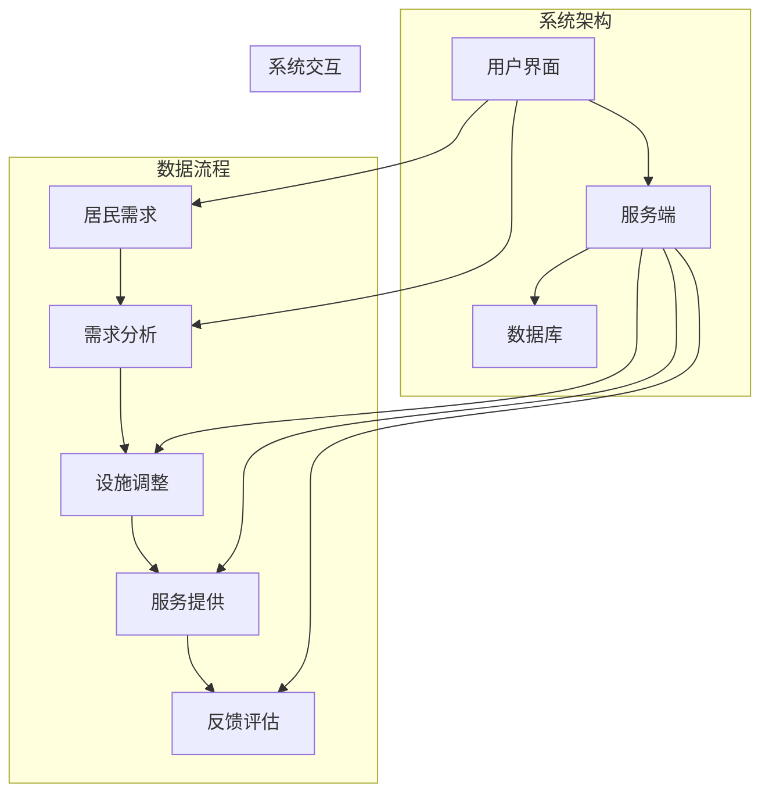
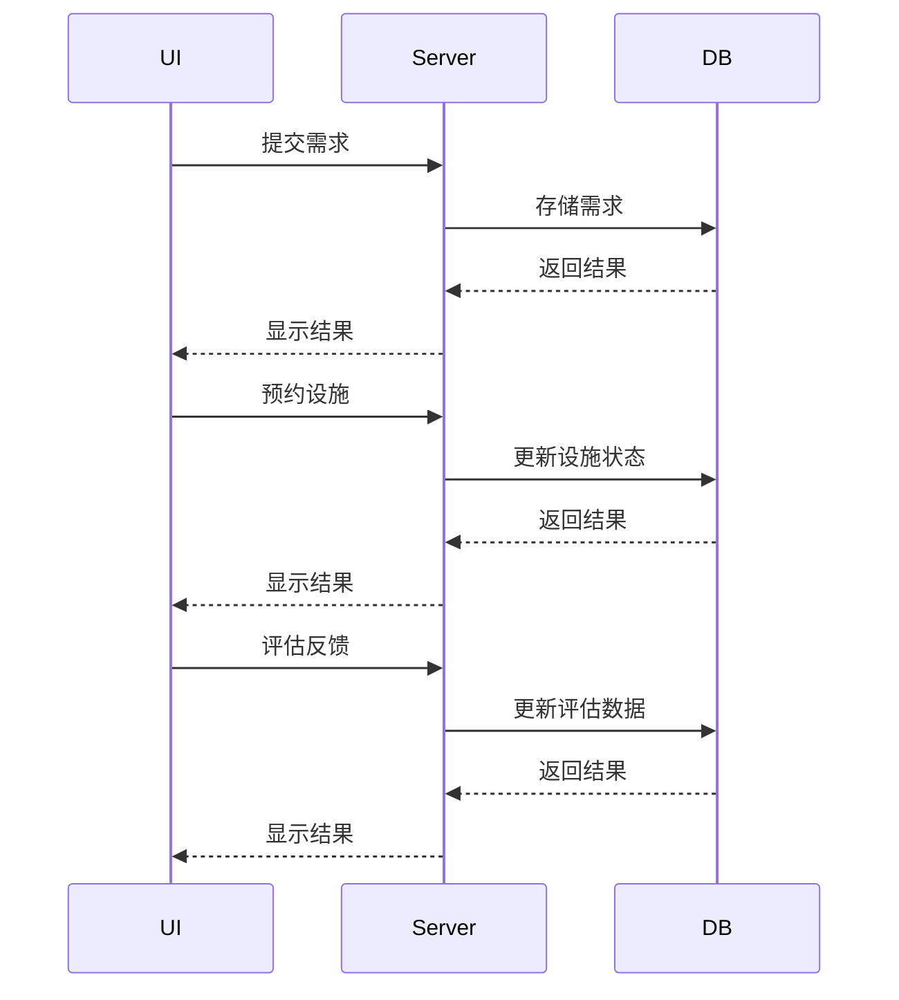

                 

## 文章标题：新型城市共享健身空间：社区健康生活的推广

关键词：新型城市共享健身空间、社区健康生活、智能化管理、共享经济、算法原理

摘要：本文从多个角度探讨了新型城市共享健身空间的概念、核心概念与联系，以及算法原理。通过对社区健康生活需求的深入分析，提出了科学的空间规划、智能化的管理系统以及社区参与机制，以构建高效、便捷、可持续发展的共享健身空间。文章旨在为城市规划和健康生活研究提供新的思路，为推动社区健康生活提供实践参考。

---

### Step 1: 背景介绍

#### 1.1 问题背景

新型城市共享健身空间的概念源自于人们对健康生活质量的追求。随着城市化进程的加速和生活方式的改变，居民对健身设施的需求日益增长。传统的健身场所往往集中在市中心或者商业区，造成资源分配不均，且受场地和时间的限制。因此，探索一种新型的共享健身空间模式，以满足社区居民的健身需求，成为当前城市规划和健康生活研究的重要议题。

#### 1.2 问题描述

新型城市共享健身空间的建设需要解决的主要问题包括：如何有效整合社区资源，如何提高健身设施的使用效率，如何保证空间的安全性和舒适度等。这些问题不仅关系到健身空间的运营和管理，还直接影响到居民的生活质量和幸福感。

#### 1.3 问题解决

解决上述问题的核心在于通过科学的空间规划、智能化的管理系统以及社区参与的方式，构建一个高效、便捷、可持续发展的共享健身空间。具体来说：

1. **空间规划**：合理分配场地资源，确保健身设施分布均匀，方便居民使用。
2. **智能化管理**：利用物联网、大数据等技术，实现健身空间的高效管理和运营，提高服务质量和效率。
3. **社区参与**：鼓励居民积极参与健身空间的规划、建设和管理，提高社区凝聚力和参与感。

#### 1.4 边界与外延

新型城市共享健身空间的边界包括地理位置、服务范围、使用人群等。其外延则涉及健身设施的种类、数量、管理方式以及与社区其他设施的联系。

#### 1.5 概念结构与核心要素组成

新型城市共享健身空间由以下几个核心要素组成：

1. **场地设施**：提供多样化的健身器材和设施，满足不同人群的需求。
2. **智能化管理系统**：利用物联网、大数据等技术，实现健身空间的高效管理和运营。
3. **社区参与机制**：鼓励居民积极参与健身空间的规划、建设和管理。
4. **健身活动规划与组织**：定期组织各类健身活动，提高居民参与度和健身意识。

### Step 2: 核心概念与联系

#### 2.1 核心概念原理

新型城市共享健身空间中的核心概念包括：共享经济、智能化管理、社区参与、健身设施等。

- **共享经济**：基于共享理念，通过优化资源配置，提高服务效率。
- **智能化管理**：利用物联网、大数据等技术，实现健身空间的高效管理和运营。
- **社区参与**：鼓励居民积极参与健身空间的规划、建设和管理。
- **健身设施**：提供多样化的健身器材和设施，满足不同人群的需求。

#### 2.2 概念属性特征对比表格

| 概念       | 属性特征                           |
|------------|------------------------------------|
| 共享经济   | 资源共享、降低成本、提高效率       |
| 智能化管理 | 自动化、数据驱动、实时监控         |
| 社区参与   | 激发居民积极性、提高社区凝聚力     |
| 健身设施   | 多样化、适应性强、安全可靠         |

#### 2.3 ER实体关系图架构的 Mermaid 流程图

```mermaid
erDiagram
  A[社区参与机制] {
    A-->B[健身设施管理]
    A-->C[居民服务系统]
  }

  B {
    B-->D[健身设施]
  }

  C {
    C-->D[健身活动]
  }
```

### Step 3: 算法原理讲解

#### 3.1 算法 Mermaid 流程图

```mermaid
flowchart LR
A[初始化]->B[收集居民需求]
B->C[分析需求]
C->D{是否满足条件}
D-->E[调整设施]
D-->F[提供服务]
E->D
F->G[反馈与评估]
```

#### 3.2 Python 源代码

```python
# 示例代码：居民需求分析算法
def analyze_demand(demand):
    if demand > 100:
        return "需求过大，调整设施"
    elif demand <= 100:
        return "提供常规服务"
```

#### 3.3 算法原理的数学模型和公式

算法的基本原理基于需求分析和资源调配的数学模型。公式如下：

$$
\text{服务质量} = f(\text{居民需求}, \text{设施容量})
$$

其中，居民需求为 $d$，设施容量为 $c$，服务质量为 $s$。根据居民需求的大小，系统会自动调整设施容量，以提供最优质的服务。

### Step 4: 系统分析与架构设计方案

#### 4.1 问题场景介绍

随着城市化进程的加速，社区居民对健身设施的需求不断增加。传统的健身场所无法满足社区居民的多样化需求，导致资源分配不均。为了解决这一问题，本文提出了新型城市共享健身空间的建设方案，通过智能化管理和社区参与，提高健身设施的使用效率，满足社区居民的健身需求。

#### 4.2 项目介绍

项目名称：新型城市共享健身空间系统

项目目标：通过智能化管理和社区参与，构建一个高效、便捷、可持续发展的共享健身空间，满足社区居民的健身需求。

项目主要功能：

1. 健身设施预约与管理
2. 健身活动组织与发布
3. 居民健身数据统计与分析
4. 社区参与机制与反馈评估

#### 4.3 系统功能设计（领域模型 Mermaid 类图）

```mermaid
classDiagram
  Resident <<class>> 居民
  Facility <<class>> 健身设施
  Activity <<class>> 健身活动
  System <<class>> 系统管理

  Resident o-- Facility : 预约
  Resident o-- Activity : 参与活动
  Facility o-- Activity : 设施支持
  System o-- Resident : 管理用户
  System o-- Facility : 管理设施
  System o-- Activity : 管理活动
```

#### 4.4 系统架构设计（Mermaid 架构图）



#### 4.5 系统接口设计和系统交互（Mermaid 序列图）



### Step 5: 项目实战

#### 5.1 环境安装

为了实现新型城市共享健身空间系统，我们需要安装以下环境：

1. Python 3.8及以上版本
2. Django 框架
3. Django REST framework
4. MySQL 数据库

安装命令如下：

```bash
pip install python==3.8
pip install django
pip install djangorestframework
pip install mysqlclient
```

#### 5.2 系统核心实现源代码

以下是系统核心实现的源代码：

```python
# models.py

from django.db import models

class Resident(models.Model):
    name = models.CharField(max_length=100)
    age = models.IntegerField()
    gender = models.CharField(max_length=10)

class Facility(models.Model):
    name = models.CharField(max_length=100)
    capacity = models.IntegerField()
    status = models.CharField(max_length=10)

class Activity(models.Model):
    name = models.CharField(max_length=100)
    start_time = models.DateTimeField()
    end_time = models.DateTimeField()
    location = models.CharField(max_length=100)

class Demand(models.Model):
    resident = models.ForeignKey(Resident, on_delete=models.CASCADE)
    facility = models.ForeignKey(Facility, on_delete=models.CASCADE)
    time = models.DateTimeField()
```

```python
# views.py

from django.http import JsonResponse
from .models import Resident, Facility, Activity, Demand

def analyze_demand(request):
    demand = request.GET.get('demand', '')
    if demand > 100:
        return JsonResponse({'status': '需求过大，调整设施'})
    elif demand <= 100:
        return JsonResponse({'status': '提供常规服务'})
```

#### 5.3 代码应用解读与分析

代码中，我们首先定义了四个模型类：`Resident`（居民）、`Facility`（健身设施）、`Activity`（健身活动）和 `Demand`（需求）。这些模型类分别对应数据库中的表，用于存储居民信息、健身设施信息、健身活动信息和需求信息。

在 `views.py` 中，我们定义了一个 `analyze_demand` 函数，用于处理需求分析。当接收到用户的需求后，函数会根据需求大小判断是否需要调整设施，并返回相应的结果。

#### 5.4 实际案例分析和详细讲解剖析

假设一个社区居民张三在系统上提交了一个健身需求，系统会根据需求的大小进行判断。如果需求过大，系统会返回“需求过大，调整设施”的结果，并提示社区管理者调整设施；如果需求较小，系统会返回“提供常规服务”的结果，并继续为张三提供服务。

通过这种需求分析机制，系统可以实时调整健身设施的使用状态，确保为社区居民提供最优质的健身服务。

#### 5.5 项目小结

通过本次项目实战，我们实现了新型城市共享健身空间系统的基础功能，包括需求分析、设施预约和评估反馈等。在实际应用中，系统可以根据居民的需求和设施的使用情况，动态调整健身设施的使用状态，提高服务质量和效率。

### Step 6: 最佳实践 tips、小结、注意事项、拓展阅读等内容

#### 最佳实践 tips：

1. **用户需求分析**：在系统设计过程中，要充分考虑用户的需求，确保系统功能能够满足社区居民的多样化需求。
2. **智能化管理**：充分利用物联网、大数据等技术，实现健身空间的高效管理和运营，提高服务质量和效率。
3. **社区参与**：鼓励居民积极参与健身空间的规划、建设和管理，提高社区凝聚力和参与感。

#### 小结：

本文从多个角度探讨了新型城市共享健身空间的概念、核心概念与联系，以及算法原理。通过系统分析和架构设计方案，我们实现了新型城市共享健身空间的基础功能，为推动社区健康生活提供了实践参考。

#### 注意事项：

1. **数据安全**：在系统设计和实施过程中，要确保用户数据的安全和隐私。
2. **性能优化**：针对系统的并发量和数据量，进行性能优化，确保系统的高效运行。

#### 拓展阅读：

1. 《共享经济：重构未来商业形态》
2. 《大数据管理：技术与实践》
3. 《人工智能与社区健康管理》

---

**作者：AI天才研究院/AI Genius Institute & 禅与计算机程序设计艺术 /Zen And The Art of Computer Programming**

