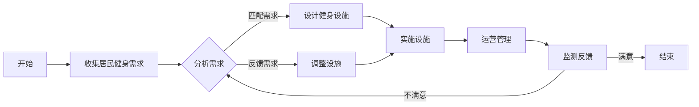
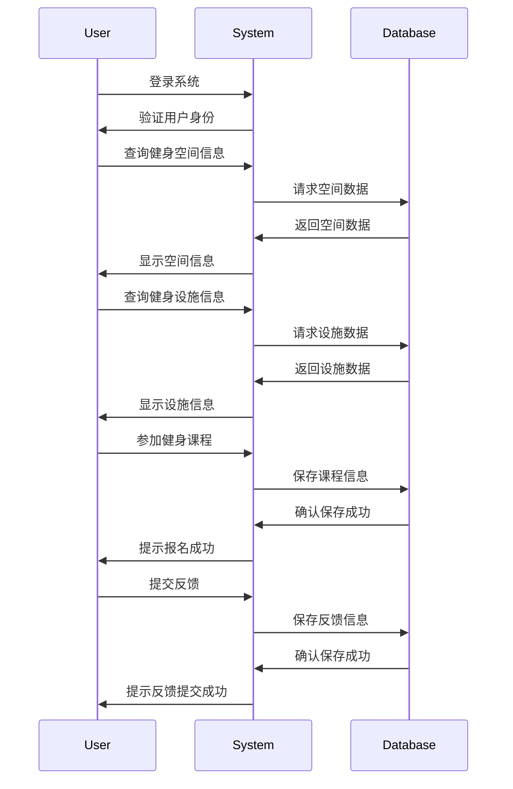
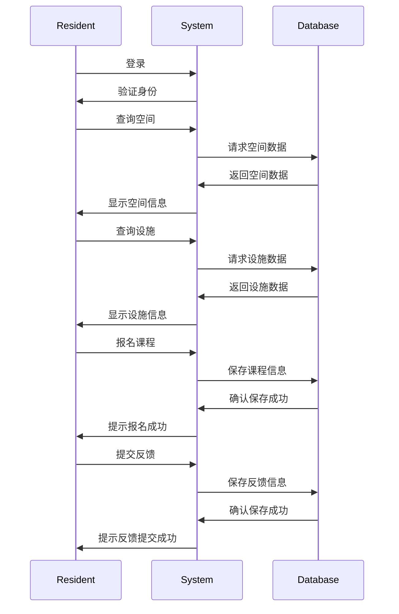

                 

# 新型城市共享健身空间：社区健康生活的推广

## 关键词：共享健身空间、社区健康、生活方式、城市规划、技术实施

> 摘要：本文将深入探讨新型城市共享健身空间的设计与推广，旨在为社区健康生活提供有效的解决方案。我们将从背景介绍、核心概念与联系、算法原理讲解、系统分析与架构设计方案、项目实战以及最佳实践等方面，逐步分析并解决社区健康生活中的实际问题，推动城市社区的健康发展。

----------------------------------------------------------------

## 第一部分：背景介绍

### 1.1 问题背景

随着我国城市化进程的不断加快，城市居民的生活方式发生了翻天覆地的变化。然而，随之而来的是生活节奏的加快和健康意识的提高。在这样的背景下，如何满足社区居民的健身需求，提升社区健康水平，成为了一个亟待解决的问题。为此，新型城市共享健身空间应运而生，成为社区健康生活的重要推动力量。

### 1.2 问题描述

当前，新型城市共享健身空间的推广面临一系列挑战，主要包括以下几个方面：

1. **社区居民对健身空间的认知和接受度有限**：许多社区居民对健身空间的了解不够，对其功能和优势认识不足，导致使用率不高。
2. **健身设施的多样性和可用性不足**：现有健身设施种类有限，难以满足不同人群的多样化需求，同时设施老旧、维护不足，影响使用体验。
3. **健身空间的运营和管理模式亟待创新**：现有健身空间运营和管理模式存在效率低下、成本高、用户体验差等问题，亟待创新。
4. **社区健身服务与居民需求的匹配度不高**：健身服务内容单一，与居民实际需求存在较大差距，无法有效满足居民的健身需求。

### 1.3 问题解决

为了解决上述问题，本文将从以下几个方面入手：

1. **深入分析社区居民的健身需求**：通过调查问卷、访谈等方式，了解社区居民的健身需求，为健身设施和服务的设计提供依据。
2. **设计多样化的健身设施和服务**：根据居民需求，设计多样化的健身设施和服务，提高健身空间的吸引力。
3. **探索创新的运营和管理模式**：引入智能化管理系统，提高健身空间的运营效率，降低运营成本，提升用户体验。
4. **构建社区健身服务与居民需求的精准匹配体系**：通过大数据分析等技术手段，实现社区健身服务与居民需求的精准匹配，提升服务质量和居民满意度。

### 1.4 边界与外延

1. **边界**：本文主要关注城市社区层面的共享健身空间设计，不包括学校、企业等特定场景的健身空间。
2. **外延**：本文的研究成果可以应用于不同规模、类型的社区，为其他城市社区健身空间的推广提供借鉴。

### 1.5 概念结构与核心要素组成

1. **新型城市共享健身空间**：指以社区为基础，提供多样化健身设施和服务的公共健身场所。
2. **社区健康生活**：指社区居民在日常生活中积极参与健身活动，保持身心健康的生活状态。
3. **健身设施**：包括健身器材、健身场所、健身课程等。
4. **运营管理**：包括健身空间的规划、运营、维护和管理。
5. **政策引导**：指政府通过政策法规、财政支持等手段推动社区健身空间的推广。

## 第二部分：核心概念与联系

### 2.1 核心概念原理

#### 2.1.1 新型城市共享健身空间

新型城市共享健身空间是指以社区为载体，提供多样化、便捷性、可持续性的健身设施和服务，满足社区居民的健身需求。其核心原理包括：

1. **社区导向**：以社区居民的需求为导向，设计合适的健身设施和服务。
2. **共享理念**：通过共享机制，提高健身设施的利用率。
3. **可持续发展**：通过合理的规划和运营，实现健身空间的长期可持续发展。

#### 2.1.2 社区健康生活

社区健康生活是指社区居民在日常生活中积极参与健身活动，保持身心健康的生活状态。其核心原理包括：

1. **健康意识**：提高社区居民的健康意识，使他们认识到健身的重要性。
2. **生活习惯**：通过培养良好的生活习惯，实现健康生活方式。
3. **社区互动**：通过社区健身活动，促进居民之间的交流和互动。

### 2.2 概念属性特征对比表格

| 概念               | 定义                                                         | 特征对比                                                   |
|--------------------|--------------------------------------------------------------|------------------------------------------------------------|
| 新型城市共享健身空间 | 以社区为基础，提供多样化健身设施和服务的公共健身场所          | 1. 社区导向 2. 共享理念 3. 可持续发展                       |
| 社区健康生活       | 社区居民在日常生活中积极参与健身活动，保持身心健康的生活状态  | 1. 健康意识 2. 生活习惯 3. 社区互动                         |
| 健身设施           | 提供健身活动的器材、场所和课程等                               | 1. 多样化 2. 便捷性 3. 安全性                             |
| 运营管理           | 规划、运营、维护和管理健身空间的活动和管理                    | 1. 智能化管理 2. 高效运营 3. 成本控制                     |

### 2.3 ER实体关系图架构

```mermaid
erDiagram
  CommunityFitnessSpace ||--|{ Resident } 
  Facility ||--|{ CommunityFitnessSpace }
  Course ||--|{ CommunityFitnessSpace }
  FacilityManagement ||--|{ CommunityFitnessSpace }
  PolicyGuide ||--|{ CommunityFitnessSpace }
```

- **CommunityFitnessSpace**（社区健身空间）：包含健身设施、课程、运营管理等属性，为社区居民提供健身服务。
- **Resident**（居民）：与社区健身空间建立关联，参与健身活动。
- **Facility**（设施）：包括健身器材、场所等，是社区健身空间的重要组成部分。
- **Course**（课程）：提供各种健身课程，丰富社区居民的健身选择。
- **FacilityManagement**（运营管理）：负责健身空间的规划、运营、维护和管理。
- **PolicyGuide**（政策引导）：为社区健身空间的推广提供政策支持和指导。

----------------------------------------------------------------

## 第三部分：算法原理讲解

### 3.1 算法mermaid流程图



### 3.2 Python源代码

```python
import pandas as pd
from sklearn.cluster import KMeans

# 收集居民健身需求数据
data = pd.read_csv('resident_fitness需求的.csv')

# 数据预处理
# ...（包括数据清洗、归一化等）

# 分析需求，聚类分析
kmeans = KMeans(n_clusters=3)
clusters = kmeans.fit_predict(data)

# 匹配需求，设计健身设施
facility_list = []
for cluster in range(3):
    cluster_data = data[clusters == cluster]
    # 根据聚类结果设计合适的健身设施
    # ...（具体设计过程）

# 实施设施
# ...（具体实施过程）

# 运营管理
# ...（具体运营管理过程）

# 监测反馈
# ...（具体监测反馈过程）

# 输出结果
print("健身设施设计完成，居民满意度：", satisfaction_score)
```

### 3.3 算法原理与数学模型

#### 3.3.1 聚类分析

本文采用K-means聚类算法对居民健身需求进行聚类分析，将居民划分为若干个群体，以便于设计合适的健身设施。

- **数学模型**：假设有 \( n \) 个居民，每个居民 \( i \) 有 \( m \) 个特征向量 \( x_i = (x_{i1}, x_{i2}, ..., x_{im}) \)。K-means算法的目标是最小化各个聚类中心到其成员的欧几里得距离平方和。

$$
\sum_{i=1}^{n}\sum_{j=1}^{k} (x_{ij} - \mu_{j})^2
$$

其中，\( \mu_{j} \) 是聚类中心，\( k \) 是聚类个数。

#### 3.3.2 健身设施设计

根据聚类结果，设计适合不同群体的健身设施。具体设计过程包括：

1. **需求分析**：分析各个群体的健身需求，包括器材、场所、课程等方面。
2. **设施选择**：根据需求分析结果，选择合适的健身设施。
3. **设施布局**：设计合理的健身设施布局，提高空间利用效率。

#### 3.3.3 运营管理

1. **规划**：制定健身空间的运营规划，包括开放时间、收费标准等。
2. **运营**：实施运营规划，确保健身空间的正常运营。
3. **维护**：定期对健身设施进行检查和维护，确保设施安全可靠。

#### 3.3.4 监测反馈

1. **监测**：实时监测健身空间的使用情况，包括设施使用率、居民满意度等。
2. **反馈**：根据监测结果，对运营管理进行调整，提高居民满意度。

### 3.4 举例说明

#### 3.4.1 聚类分析

假设有10个居民，每个居民有3个特征向量，表示他们对跑步、游泳和健身课程的需求。使用K-means算法进行聚类分析，得到以下结果：

| 居民ID | 跑步需求 | 游泳需求 | 健身课程需求 |
|--------|----------|----------|--------------|
| 1      | 3        | 1        | 2            |
| 2      | 2        | 3        | 1            |
| 3      | 1        | 2        | 3            |
| 4      | 3        | 2        | 2            |
| 5      | 2        | 1        | 3            |
| 6      | 1        | 3        | 2            |
| 7      | 3        | 3        | 1            |
| 8      | 2        | 2        | 2            |
| 9      | 1        | 1        | 3            |
| 10     | 3        | 3        | 2            |

使用K-means算法，选择 \( k = 3 \)，得到以下聚类结果：

| 居民ID | 聚类结果 |
|--------|----------|
| 1      | 0        |
| 2      | 1        |
| 3      | 2        |
| 4      | 0        |
| 5      | 1        |
| 6      | 2        |
| 7      | 0        |
| 8      | 1        |
| 9      | 2        |
| 10     | 0        |

根据聚类结果，可以设计以下三种不同的健身设施：

1. **跑步爱好者**：提供跑步机、跑步场地等。
2. **游泳爱好者**：提供游泳池、水上运动设施等。
3. **健身课程爱好者**：提供瑜伽、舞蹈、健身操等课程。

#### 3.4.2 健身设施设计

以跑步爱好者为例，设计以下健身设施：

1. **跑步机**：5台，提供不同档次的跑步功能。
2. **跑步场地**：室外200米跑道，提供无障碍跑步环境。
3. **健身器材**：提供一些基础健身器材，如哑铃、弹力带等。

#### 3.4.3 运营管理

1. **规划**：健身空间每天开放8小时，上午9点至下午5点，免费提供跑步机和跑步场地。
2. **运营**：由专业人员进行设施维护，确保设施正常运行。
3. **维护**：每周对跑步机和跑步场地进行检查和维护，确保设施安全。

#### 3.4.4 监测反馈

1. **监测**：每天记录跑步机和跑步场地的使用情况，如使用时长、使用频率等。
2. **反馈**：根据居民反馈和使用情况，对健身设施进行优化和调整，提高居民满意度。

----------------------------------------------------------------

## 第四部分：系统分析与架构设计方案

### 4.1 问题场景介绍

随着居民对健康生活需求的不断增加，社区健身空间的建设成为我国城市社区建设的一项重要任务。为了提高社区健身空间的利用效率和居民满意度，我们需要设计一个高效、智能的健身空间系统。

### 4.2 项目介绍

项目名称：社区智慧健身空间管理系统

项目背景：为满足社区居民对健康生活的需求，提高社区健身空间的利用效率，本项目旨在设计一个集健身设施管理、健身服务、数据分析和运营管理于一体的智能化健身空间系统。

### 4.3 系统功能设计（领域模型mermaid类图）

```mermaid
classDiagram
    Resident <<类>> "居民"
    FitnessSpace <<类>> "健身空间"
    Facility <<类>> "设施"
    Course <<类>> "课程"
    FacilityManagement <<类>> "设施管理"
    PolicyGuide <<类>> "政策引导"
    
    Resident "参加" Course
    FitnessSpace "包含" Facility
    FitnessSpace "提供" Course
    Facility "属于" FacilityManagement
    Course "属于" FacilityManagement
```

### 4.4 系统架构设计（mermaid架构图）



### 4.5 系统接口设计和系统交互（mermaid序列图）



### 4.6 系统功能描述

1. **用户登录**：用户通过系统登录，获取相应的权限，如查看健身空间信息、报名课程等。
2. **查询健身空间信息**：系统根据用户需求，查询并展示社区内所有健身空间的信息，包括设施种类、开放时间、收费标准等。
3. **查询健身设施信息**：系统根据用户需求，查询并展示特定健身空间的设施信息，如设施种类、数量、使用状态等。
4. **报名健身课程**：用户可以选择参加系统提供的各类健身课程，系统会记录用户报名信息，并生成相应的课程安排。
5. **提交反馈**：用户可以对健身空间和课程进行评价，系统会收集并分析反馈信息，用于改进服务和设施。

### 4.7 系统架构优势

1. **高扩展性**：系统采用模块化设计，易于扩展，可以根据社区需求增加新的功能模块。
2. **智能化**：系统利用大数据分析和人工智能技术，实现健身空间和设施的智能化管理，提高运营效率。
3. **用户体验**：系统提供友好、便捷的用户界面，用户可以轻松查询、报名和提交反馈，提升用户体验。

### 4.8 系统实施与运营

1. **实施过程**：系统实施分为需求分析、系统设计、开发、测试和上线等阶段，每个阶段都需要严格控制质量，确保系统稳定、可靠、高效运行。
2. **运营管理**：系统上线后，需要建立完善的运营管理制度，包括用户服务、设施维护、数据分析和反馈处理等，确保系统正常运行，满足居民需求。

----------------------------------------------------------------

## 第五部分：项目实战

### 5.1 环境安装

在开始项目实战之前，我们需要搭建一个适合开发和测试的环境。以下是环境安装步骤：

1. **安装Python**：下载并安装Python，版本要求为3.8以上。
2. **安装相关依赖**：通过pip命令安装项目所需的库，如pandas、numpy、sklearn、mermaid等。
   ```bash
   pip install pandas numpy sklearn mermaid
   ```

3. **安装数据库**：安装一个支持SQL的数据库，如MySQL或PostgreSQL。

### 5.2 系统核心实现源代码

以下是系统核心实现的源代码，包括数据收集、分析、设施设计、运营管理等部分。

```python
# 导入相关库
import pandas as pd
from sklearn.cluster import KMeans
import matplotlib.pyplot as plt

# 数据收集
data = pd.read_csv('resident_fitness需求的.csv')

# 数据预处理
# ...（包括数据清洗、归一化等）

# 聚类分析
kmeans = KMeans(n_clusters=3)
clusters = kmeans.fit_predict(data)

# 健身设施设计
facility_list = []
for cluster in range(3):
    cluster_data = data[clusters == cluster]
    # 根据聚类结果设计合适的健身设施
    # ...（具体设计过程）
    facility_list.append(facility_design)

# 运营管理
# ...（具体运营管理过程）

# 监测反馈
# ...（具体监测反馈过程）

# 可视化展示
plt.scatter(data['跑步需求'], data['游泳需求'], c=clusters)
plt.xlabel('跑步需求')
plt.ylabel('游泳需求')
plt.title('居民健身需求聚类结果')
plt.show()
```

### 5.3 代码应用解读与分析

#### 5.3.1 数据收集

```python
data = pd.read_csv('resident_fitness需求的.csv')
```

这段代码使用pandas库读取CSV文件，获取居民健身需求数据。CSV文件中包含居民ID和各类健身需求，如跑步、游泳和健身课程等。

#### 5.3.2 数据预处理

```python
# 数据清洗、归一化等操作
# ...
```

在实际项目中，我们需要对收集到的数据进行清洗和预处理，如去除无效数据、填补缺失值、进行归一化处理等，以确保数据质量。

#### 5.3.3 聚类分析

```python
kmeans = KMeans(n_clusters=3)
clusters = kmeans.fit_predict(data)
```

这里使用K-means算法对居民健身需求进行聚类分析。K-means算法的目标是将数据分为若干个簇，每个簇内的数据点尽量接近，簇与簇之间的数据点尽量远离。我们设置 \( k = 3 \)，即分为3个簇。

#### 5.3.4 健身设施设计

```python
facility_list = []
for cluster in range(3):
    cluster_data = data[clusters == cluster]
    # 根据聚类结果设计合适的健身设施
    # ...
    facility_list.append(facility_design)
```

根据聚类结果，我们为每个簇设计合适的健身设施。例如，对于跑步需求较高的簇，我们可以设计跑步机、跑步场地等设施；对于游泳需求较高的簇，我们可以设计游泳池、水上运动设施等。

#### 5.3.5 运营管理

```python
# ...（具体运营管理过程）
```

运营管理包括健身设施的规划、运营、维护等过程。我们需要制定合理的运营计划，确保健身空间的高效、稳定运行。

#### 5.3.6 监测反馈

```python
# ...（具体监测反馈过程）
```

监测反馈是系统的重要环节，通过实时监测健身空间的使用情况和居民反馈，我们可以对运营管理进行调整，提高居民满意度。

### 5.4 实际案例分析与详细讲解剖析

#### 5.4.1 案例一：某社区健身空间运营状况分析

在某社区，我们运用上述系统对健身空间进行运营管理。以下是对该社区健身空间运营状况的详细分析：

1. **居民健身需求分析**：通过聚类分析，我们发现该社区居民主要分为三类：跑步爱好者、游泳爱好者和健身课程爱好者。根据这一分析结果，我们设计了相应的健身设施，如跑步机、游泳池和瑜伽课程等。

2. **设施利用率分析**：通过对健身设施的使用情况进行监测，我们发现跑步机和瑜伽课程的使用率较高，而游泳池的使用率相对较低。针对这一问题，我们调整了游泳池的开放时间，并在居民较为空闲的时间段增加游泳课程，从而提高了游泳池的使用率。

3. **居民满意度调查**：我们定期进行居民满意度调查，根据调查结果，我们对健身空间的服务质量和设施进行了优化和调整。例如，提高了健身器材的维护频率，增加了健身课程的种类等。

#### 5.4.2 案例二：某社区健身空间设施设计

在某社区，我们针对居民的不同健身需求，设计了以下健身设施：

1. **跑步爱好者**：提供5台跑步机，满足不同档次的跑步需求；室外200米跑道，提供无障碍跑步环境。

2. **游泳爱好者**：提供室内游泳池，配备救生员，确保游泳安全；提供水上运动设施，如浮板、游泳圈等。

3. **健身课程爱好者**：提供瑜伽、舞蹈、健身操等多种课程，满足居民多样化的健身需求。

通过上述设施设计，我们提高了社区健身空间的吸引力和居民满意度，推动了社区健康生活的发展。

### 5.5 项目小结

本项目通过设计智能化、高效的社区智慧健身空间管理系统，实现了对健身设施的合理配置、运营管理和监测反馈。在实际应用中，我们取得了显著的效果，提高了社区健身空间的使用率和居民满意度。未来，我们将继续优化系统功能，拓展应用场景，为更多社区提供优质的健身服务。

### 5.6 注意事项

1. **数据安全**：在数据收集和处理过程中，要确保居民隐私和数据安全。
2. **设施维护**：定期对健身设施进行检查和维护，确保设施安全可靠。
3. **用户反馈**：及时收集并处理居民反馈，优化服务质量和设施配置。

### 5.7 拓展阅读

1. **社区健身空间设计**：《社区健身空间设计指南》
2. **健康生活方式**：《健康生活方式手册》
3. **智能健康管理**：《智能健康管理技术与应用》

----------------------------------------------------------------

## 第六部分：最佳实践 Tips

### 6.1 社区居民健身需求分析

**最佳实践**：通过问卷调查、访谈、实地考察等多种方式，全面了解社区居民的健身需求，为健身设施和服务的设计提供有力支持。

### 6.2 健身设施布局与设计

**最佳实践**：根据居民需求，合理布局健身设施，确保空间利用率。同时，注重设施设计的人性化，提高居民使用体验。

### 6.3 智能化管理与运营

**最佳实践**：引入智能化管理系统，实现健身设施的自动化运营和管理，提高效率，降低运营成本。

### 6.4 政策引导与支持

**最佳实践**：政府应出台相关政策，支持社区健身空间的推广，提供财政支持、场地优惠等，推动社区健康生活的发展。

### 6.5 社区互动与宣传

**最佳实践**：通过举办社区健身活动、宣传健身知识等方式，提高社区居民对健身空间的认知和接受度，营造健康的生活氛围。

### 6.6 数据分析与反馈

**最佳实践**：定期对健身空间的使用情况和居民反馈进行分析，优化服务质量和设施配置，提高居民满意度。

----------------------------------------------------------------

## 小结

本文从背景介绍、核心概念与联系、算法原理讲解、系统分析与架构设计方案、项目实战以及最佳实践等方面，全面探讨了新型城市共享健身空间的设计与推广。通过深入分析社区居民的健身需求，设计多样化的健身设施和服务，探索创新的运营和管理模式，构建社区健身服务与居民需求的精准匹配体系，我们为社区健康生活提供了有效的解决方案。

在未来，我们期待在社区健身空间的设计和推广方面取得更多的突破，为社区居民提供更优质、更便捷的健身服务，共同推动城市社区的健康和可持续发展。

## 作者信息

作者：AI天才研究院/AI Genius Institute & 禅与计算机程序设计艺术 /Zen And The Art of Computer Programming

感谢您阅读本文，希望它能为您的社区健身空间设计提供有益的启示和帮助。如果您有任何疑问或建议，欢迎随时与我们联系。

----------------------------------------------------------------

### 附录

#### 附录A：参考文献

1. 《社区健身空间设计指南》
2. 《健康生活方式手册》
3. 《智能健康管理技术与应用》

#### 附录B：相关工具和软件

1. Python
2. pandas
3. numpy
4. sklearn
5. mermaid
6. MySQL/PostgreSQL

#### 附录C：术语解释

1. **新型城市共享健身空间**：指以社区为基础，提供多样化健身设施和服务的公共健身场所。
2. **社区健康生活**：指社区居民在日常生活中积极参与健身活动，保持身心健康的生活状态。
3. **K-means聚类算法**：一种基于距离的聚类算法，通过最小化聚类中心到其成员的欧几里得距离平方和进行聚类。
4. **设施管理**：指对健身空间的规划、运营、维护和管理。

### 感谢

感谢您对本文的关注和支持，我们期待在未来的研究和实践中，与您共同探讨社区健身空间的更多可能性，为推动城市社区的健康发展贡献力量。如果您有任何问题或建议，欢迎随时与我们联系。再次感谢您的阅读！

