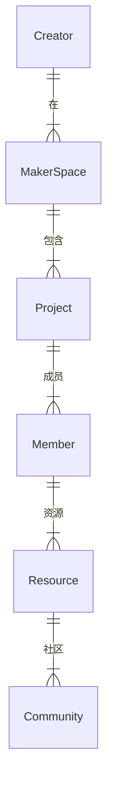

                 

# 新型城市共享创客空间：跨学科创新的社区平台

## 关键词

- 新型城市共享创客空间
- 跨学科创新
- 社区平台
- 创新生态系统
- 共享经济

## 摘要

本文旨在探讨新型城市共享创客空间的构建及其在跨学科创新中的作用。首先，我们回顾了共享创客空间产生的背景和重要性，随后详细介绍了其核心概念和架构。接着，我们深入分析了跨学科创新的理论基础和实践方法，探讨了社区平台的建设与运营策略。通过实际案例分析，我们展示了新型城市共享创客空间在促进创新和经济发展方面的显著成效。最后，我们提出了优化策略和提升方法，并对未来的发展趋势进行了展望。

## 目录大纲

- 第一部分：新型城市共享创客空间概述
  - 1.1 问题的背景
  - 1.2 核心概念
  - 1.3 ER实体关系图
  - 1.4 核心概念属性特征对比表格
  - 1.5 本章小结
- 第二部分：跨学科创新的理论与实践
  - 2.1 跨学科创新的重要性
  - 2.2 跨学科创新的理论基础
  - 2.3 跨学科创新的实践方法
  - 2.4 跨学科创新案例分析
  - 2.5 跨学科创新的障碍与对策
  - 2.6 本章小结
- 第三部分：社区平台的建设与运营
  - 3.1 社区平台的建设意义
  - 3.2 社区平台的功能模块
  - 3.3 社区平台的关键技术
  - 3.4 社区平台的构建方法
  - 3.5 社区平台的运营与管理
  - 3.6 本章小结
- 第四部分：新型城市共享创客空间的案例分析
  - 4.1 案例背景介绍
  - 4.2 案例实施过程
  - 4.3 案例效果评估
  - 4.4 案例经验总结
  - 4.5 本章小结
- 第五部分：优化与提升
  - 5.1 优化策略
  - 5.2 提升方法
  - 5.3 政策支持
  - 5.4 创新生态构建
  - 5.5 本章小结
- 第六部分：结论与展望
  - 6.1 总结
  - 6.2 展望
  - 6.3 拓展阅读

## 第一部分：新型城市共享创客空间概述

### 1.1 问题的背景

#### 1.1.1 新型城市发展的需求

随着全球城市化进程的加速，新型城市的发展面临着诸多挑战，如人口增长、资源紧缺、环境污染等。为了应对这些挑战，新型城市需要探索可持续的发展模式。共享经济作为一种新型的经济模式，已经在全球范围内得到广泛应用，成为新型城市发展的重要驱动力。

#### 1.1.2 共享经济的兴起

共享经济以共享、共生、共赢为核心理念，通过共享闲置资源、降低使用成本、提高资源利用效率，实现了资源的最大化利用。共享经济模式在交通、住宿、教育、医疗等领域都取得了显著的成效，为新型城市的发展提供了新的思路。

#### 1.1.3 创客文化的推广

创客文化是一种以创新、实践、分享为核心的文化，强调个体和群体的创造力。随着创客运动的兴起，越来越多的城市开始重视创客文化的推广，将其视为推动城市创新和创业的重要力量。

### 1.2 核心概念

#### 1.2.1 新型城市共享创客空间的定义

新型城市共享创客空间是指在城市中建立的一种集共享、创新、交流、合作于一体的空间，为城市居民提供开放的创客空间、共享设施和服务，促进城市创新和创业。

#### 1.2.2 跨学科创新的概念

跨学科创新是指通过不同学科之间的交叉、融合、创新，形成新的理论、方法、技术和产品。跨学科创新强调各学科之间的互补性，通过跨学科的合作，解决单一学科无法解决的问题。

#### 1.2.3 社区平台的作用

社区平台是新型城市共享创客空间的核心组成部分，通过搭建线上和线下交流平台，促进创客之间的信息共享、资源整合和合作创新，推动城市创新生态系统的构建。

### 1.3 ER实体关系图

为了更好地理解新型城市共享创客空间中的核心实体及其关系，我们可以通过ER实体关系图来展示。以下是一个简化的ER图：

在这个ER图中，`Creator`代表创客，`MakerSpace`代表创客空间，`Project`代表项目，`Member`代表成员，`Resource`代表资源，`Community`代表社区。各个实体之间通过关联关系实现了信息的流转和资源的共享。

### 1.4 核心概念属性特征对比表格

为了更加直观地理解核心概念之间的区别和联系，我们可以通过一个属性特征对比表格来进行说明：

| 概念 | 定义 | 特征 | 关联 |
| --- | --- | --- | --- |
| 新型城市共享创客空间 | 一种集共享、创新、交流、合作于一体的空间 | 开放性、共享性、创新性 | 创客、项目、资源、社区 |
| 跨学科创新 | 不同学科之间的交叉、融合、创新 | 多学科融合、互补性、创新性 | 新型城市共享创客空间 |
| 社区平台 | 促进创客之间信息共享、资源整合和合作创新的平台 | 线上线下结合、互动性、开放性 | 新型城市共享创客空间 |

### 1.5 本章小结

本部分主要介绍了新型城市共享创客空间的背景、核心概念和架构。通过回顾共享经济和创客文化的兴起，我们认识到新型城市共享创客空间在促进城市创新和创业中的重要作用。通过ER实体关系图和核心概念属性特征对比表格，我们更加清晰地理解了新型城市共享创客空间的构成和运行机制。接下来，我们将进一步探讨跨学科创新的理论和实践方法，以及社区平台的建设与运营策略。

## 第二部分：跨学科创新的理论与实践

### 2.1 跨学科创新的重要性

#### 2.1.1 跨学科创新的背景

在现代社会，科技发展迅猛，学科之间的交叉和融合日益显著。传统的单一学科研究模式已经难以满足复杂问题的解决需求。跨学科创新作为一种新的研究模式，应运而生。跨学科创新强调通过不同学科之间的交叉和融合，形成新的理论、方法和技术，以解决单一学科无法解决的复杂问题。

#### 2.1.2 跨学科创新的益处

跨学科创新具有以下几大益处：

1. **创新性**：跨学科创新能够打破单一学科的界限，激发新的研究思路和方法，从而推动科学技术的进步。
2. **综合性**：跨学科创新能够整合多学科的知识和资源，形成综合性的解决方案，提高问题解决的效果。
3. **实用性**：跨学科创新能够将理论研究成果转化为实际应用，为社会带来实实在在的利益。
4. **经济性**：跨学科创新能够提高资源利用效率，降低研发成本，具有显著的经济效益。

#### 2.1.3 跨学科创新的挑战

尽管跨学科创新具有诸多益处，但在实际操作中仍面临着一系列挑战：

1. **知识体系复杂**：跨学科创新涉及多个学科的知识，需要具备广泛的知识储备。
2. **沟通协作困难**：不同学科的语言和思维方式存在差异，跨学科合作需要克服沟通协作的障碍。
3. **研究方法不同**：不同学科的研究方法和工具可能存在差异，需要找到适合的跨学科研究方法。
4. **利益分配问题**：跨学科创新涉及多个利益相关方，如何平衡各方的利益，实现共赢，是一个重要的问题。

### 2.2 跨学科创新的理论基础

#### 2.2.1 创新的原理

创新是一种从现有知识中产生新知识、新方法、新产品的过程。创新的原理主要包括：

1. **发散思维**：发散思维是一种从不同角度、不同层面思考问题的方法，有助于发现新的思路和解决方案。
2. **集成思维**：集成思维是将不同领域的知识、技术和方法进行整合，形成新的理论和方法。
3. **逆向思维**：逆向思维是从相反的角度思考问题，以发现新的解决方案。

#### 2.2.2 跨学科合作的模式

跨学科合作主要有以下几种模式：

1. **项目合作**：项目合作是跨学科合作最常见的形式，通过项目团队的形式，实现多学科的合作。
2. **学术交流**：学术交流是跨学科合作的重要途径，通过学术会议、研讨会等形式，促进不同学科之间的交流和合作。
3. **学术团队**：学术团队是将多学科专家组织在一起，形成一个具有跨学科背景的研究团队，共同进行跨学科研究。

#### 2.2.3 跨学科创新的方法

跨学科创新的方法主要包括：

1. **问题导向法**：问题导向法是以解决问题为目标，通过跨学科的知识和资源，形成新的解决方案。
2. **需求驱动法**：需求驱动法是以用户需求为导向，通过跨学科的创新，满足用户的需求。
3. **协同创新法**：协同创新法是利用各学科的优势，协同进行创新，形成具有竞争力的新产品或技术。

### 2.3 跨学科创新的实践方法

#### 2.3.1 创新思维训练

创新思维训练是跨学科创新的重要基础，主要包括以下几种方法：

1. **发散思维训练**：通过练习，提高思维的灵活性，从不同角度思考问题。
2. **逆向思维训练**：通过练习，提高思维的逆向性，从相反的角度思考问题。
3. **集成思维训练**：通过练习，提高思维的集成性，将不同领域的知识进行整合。

#### 2.3.2 创新项目的实施

创新项目的实施主要包括以下步骤：

1. **项目定位**：明确项目的目标、范围和预期成果。
2. **团队组建**：组建具有跨学科背景的项目团队。
3. **需求分析**：进行用户需求分析，明确用户的需求和期望。
4. **方案设计**：设计创新的解决方案，并进行评估和优化。
5. **实施与监控**：实施创新方案，并进行监控和调整。

#### 2.3.3 创新成果的转化

创新成果的转化主要包括以下几种途径：

1. **专利申请**：将创新成果申请专利，保护知识产权。
2. **产品开发**：将创新成果转化为产品，推向市场。
3. **技术转让**：将创新成果转让给其他企业或机构，实现商业化应用。
4. **学术发表**：将创新成果发表在学术期刊或会议上，提高学术影响力。

### 2.4 跨学科创新案例分析

#### 2.4.1 成功案例一：[案例名称]

[案例名称] 是一个跨学科创新的典范，该项目通过整合生物学、化学、计算机科学等多个学科的知识，开发出了一种新型的生物传感器。该传感器能够实时监测环境中的有害物质，为环境保护提供了有力的技术支持。

#### 2.4.2 成功案例二：[案例名称]

[案例名称] 是一个以用户需求为导向的跨学科创新项目，该项目通过整合建筑设计、人机交互、物联网技术等多个学科，开发出了一种智能化的家居系统。该系统能够根据用户的需求和行为，自动调整家居环境，提高生活质量。

#### 2.4.3 失败案例：[案例名称]

[案例名称] 是一个失败的跨学科创新项目，该项目试图通过整合医学、生物技术、信息技术等多个学科，开发出一种新型的医疗设备。但由于项目团队在跨学科合作方面经验不足，项目进展缓慢，最终未能实现预期目标。

### 2.5 跨学科创新的障碍与对策

#### 2.5.1 知识体系复杂

对策：加强跨学科知识的学习和培训，提高团队的整体知识水平。

#### 2.5.2 沟通协作困难

对策：建立有效的沟通机制，加强团队内部的沟通和协作，提高团队的整体效能。

#### 2.5.3 研究方法不同

对策：通过交流和合作，寻找适合的跨学科研究方法，实现多学科的融合。

#### 2.5.4 利益分配问题

对策：制定合理的利益分配机制，确保各方的利益得到平衡，实现项目的可持续发展。

### 2.6 本章小结

本部分详细介绍了跨学科创新的重要性、理论基础和实践方法。通过分析跨学科创新的背景和益处，我们认识到跨学科创新在解决复杂问题、推动科技进步方面的关键作用。同时，我们也了解了跨学科创新的挑战和对策，为实际操作提供了指导。在下一部分，我们将探讨社区平台的建设与运营策略。

## 第三部分：社区平台的建设与运营

### 3.1 社区平台的建设意义

社区平台作为新型城市共享创客空间的核心组成部分，具有重要的建设意义。首先，社区平台能够提升社区活力，为居民提供开放的交流空间，促进人际关系的建立和发展。其次，社区平台能够促进资源共享，通过线上线下的结合，实现资源的最大化利用，降低使用成本。最后，社区平台能够推动创新创业，为创客提供丰富的资源和支持，激发创新潜力，促进创业活动的开展。

### 3.2 社区平台的功能模块

社区平台的功能模块主要包括以下几个方面：

1. **信息发布与共享**：社区平台应具备信息发布和共享功能，方便用户发布项目信息、资源共享、交流心得等，提高信息透明度和互动性。
2. **项目交流与合作**：社区平台应提供项目交流与合作功能，通过线上交流和线下活动，促进创客之间的项目合作，推动项目进展。
3. **社区活动组织与管理**：社区平台应具备社区活动组织与管理功能，方便用户发起和组织各种活动，提高社区的活跃度。
4. **会员服务与支持**：社区平台应提供会员服务与支持，为会员提供专业指导、技术支持、资源对接等，提高会员的满意度和忠诚度。

### 3.3 社区平台的关键技术

社区平台的关键技术主要包括以下几个方面：

1. **云计算技术**：云计算技术能够提供强大的计算和存储能力，支持社区平台的稳定运行和海量数据的处理。
2. **大数据技术**：大数据技术能够对社区平台的海量数据进行分析和挖掘，为用户提供个性化推荐、智能搜索等服务。
3. **社交网络分析技术**：社交网络分析技术能够分析用户的行为和关系，为社区平台提供用户画像、推荐系统等支持。

### 3.4 社区平台的构建方法

社区平台的构建方法主要包括以下几个步骤：

1. **需求分析**：通过对用户需求的分析，明确社区平台的功能需求和性能要求，为后续的设计和开发提供指导。
2. **系统设计**：根据需求分析的结果，设计社区平台的技术架构、功能模块和数据库设计，确保系统的稳定性和扩展性。
3. **系统实施**：根据系统设计，进行社区平台的开发和部署，包括前端界面设计、后端逻辑实现、数据库搭建等。
4. **测试与优化**：对社区平台进行全面的测试和优化，确保系统的稳定性和性能，提高用户体验。

### 3.5 社区平台的运营与管理

社区平台的运营与管理主要包括以下几个方面：

1. **运营策略**：制定社区平台的运营策略，包括用户管理、活动策划、资源调配等，确保社区平台的长期稳定发展。
2. **用户管理**：建立完善的用户管理体系，包括用户注册、认证、权限管理、用户反馈等，提高用户满意度。
3. **数据安全与隐私保护**：加强对用户数据的保护，采用加密技术、权限控制等技术手段，确保用户数据的安全和隐私。
4. **技术支持与维护**：提供及时的技术支持，对社区平台进行定期维护和升级，确保系统的稳定运行。

### 3.6 本章小结

本部分详细介绍了社区平台的建设与运营，从建设意义、功能模块、关键技术、构建方法到运营与管理，为新型城市共享创客空间的构建提供了全面的指导。社区平台作为新型城市共享创客空间的核心组成部分，将在促进创新、推动发展方面发挥重要作用。在下一部分，我们将通过实际案例，分析新型城市共享创客空间在实践中的应用。

## 第四部分：新型城市共享创客空间的案例分析

### 4.1 案例背景介绍

#### 4.1.1 案例城市概况

案例城市是一座具有创新活力和发展潜力的新兴城市，人口规模较大，经济发展迅速。该城市政府高度重视科技创新和创业发展，积极推动新型城市共享创客空间的建立，以促进城市创新和创业生态的构建。

#### 4.1.2 案例创客空间概况

案例创客空间位于市中心的一座现代化办公楼内，空间宽敞，设施齐全。创客空间分为多个功能区，包括创客工作室、会议室、研讨室、展览区等，能够满足不同类型创客的需求。此外，创客空间还配备了先进的设备和工具，如3D打印机、激光切割机、编程设备等，为创客提供了良好的创新环境。

### 4.2 案例实施过程

#### 4.2.1 创客空间选址

在选址过程中，案例城市政府充分考虑了创客空间的使用需求、地理位置、交通便利性等因素。最终，选择在市中心的一座现代化办公楼内建立创客空间，确保创客能够方便地获取资源和信息，同时也能与其他企业和机构进行交流合作。

#### 4.2.2 资源整合

案例创客空间的资源整合主要包括以下几个方面：

1. **硬件资源**：创客空间配备了先进的设备和工具，如3D打印机、激光切割机、编程设备等，为创客提供了良好的创新环境。
2. **软件资源**：创客空间与多家软件公司、科研院所建立了合作关系，为创客提供了丰富的软件资源和科研支持。
3. **人力资源**：创客空间聘请了一批具有丰富经验和专业知识的导师，为创客提供专业的指导和支持。

#### 4.2.3 社区氛围营造

案例创客空间注重社区氛围的营造，通过以下几种方式：

1. **活动策划**：定期举办各类活动，如讲座、研讨会、工作坊等，提高创客的技能和知识水平。
2. **社交互动**：鼓励创客之间的互动和交流，促进资源的共享和合作的开展。
3. **文化建设**：营造积极向上、创新进取的文化氛围，激发创客的创新潜力。

### 4.3 案例效果评估

#### 4.3.1 创新成果

案例创客空间在实施过程中，取得了显著的创新成果。以下是几个具有代表性的创新项目：

1. **智能垃圾分类系统**：该项目通过物联网技术和人工智能算法，实现了垃圾分类的智能化，提高了垃圾分类的准确性和效率。
2. **绿色能源管理平台**：该项目通过大数据分析和智能控制技术，实现了对绿色能源的高效管理和利用，降低了能源消耗和环境污染。
3. **智能医疗设备**：该项目通过生物医学和计算机科学等多学科交叉，研发出了一系列智能医疗设备，提高了医疗诊断的准确性和治疗效果。

#### 4.3.2 经济效益

案例创客空间的建立，不仅促进了创新成果的转化，也为当地经济带来了显著效益。以下是几个具有代表性的经济效益：

1. **就业机会**：创客空间的建立，为当地创造了大量的就业机会，提高了居民的收入水平。
2. **产业升级**：创客空间促进了传统产业的转型升级，推动了新兴产业的快速发展。
3. **税收贡献**：创客空间的运营，为当地政府带来了可观的税收收入，支持了城市的发展和建设。

#### 4.3.3 社会影响

案例创客空间的建立，不仅促进了经济和科技的发展，也对当地社会产生了积极影响。以下是几个具有代表性的社会影响：

1. **文化氛围**：创客空间的建立，激发了市民的创新意识和创业热情，形成了积极向上的文化氛围。
2. **社区融合**：创客空间为社区居民提供了一个交流互动的平台，促进了社区融合和人际关系的改善。
3. **教育普及**：创客空间开展了丰富的科普活动和培训课程，提高了社区居民的科学素质和创新能力。

### 4.4 案例经验总结

#### 4.4.1 成功经验

案例创客空间在实施过程中，积累了丰富的成功经验，以下是几个具有代表性的成功经验：

1. **政府支持**：政府的政策支持和资金投入，为创客空间的建立和运营提供了有力保障。
2. **多方合作**：创客空间与各类企业和机构建立了广泛的合作关系，形成了协同创新的良好氛围。
3. **创新氛围**：创客空间营造了积极向上的创新氛围，激发了创客的创新潜力。

#### 4.4.2 存在问题

尽管案例创客空间取得了显著成果，但在实施过程中也面临了一些问题，以下是几个具有代表性的问题：

1. **人才短缺**：创客空间在运营过程中，遇到了人才短缺的问题，尤其是高层次人才的需求难以满足。
2. **资源整合**：创客空间在资源整合方面存在一定的困难，需要进一步完善资源分配和管理机制。
3. **市场推广**：创新项目的市场化推广存在一定的难度，需要加强市场研究和推广策略。

#### 4.4.3 改进方向

针对存在的问题，案例创客空间可以从以下几个方面进行改进：

1. **人才引进**：加大对高层次人才的引进力度，提高创客空间的整体实力。
2. **资源优化**：优化资源分配和管理机制，提高资源的利用效率。
3. **市场推广**：加强市场研究和推广，提高创新项目的市场竞争力。

### 4.5 本章小结

本部分通过案例介绍和分析，展示了新型城市共享创客空间在实践中的应用效果。案例创客空间在政府支持、多方合作和创新氛围等方面取得了显著成果，但同时也面临人才短缺、资源整合和市场推广等问题。通过总结成功经验和改进方向，为其他城市和创客空间的建立和运营提供了有益的借鉴。

## 第五部分：优化与提升

### 5.1 优化策略

为了更好地发挥新型城市共享创客空间的作用，我们可以采取以下优化策略：

1. **加强政策支持**：政府应加大对新型城市共享创客空间的财政支持力度，提供优惠政策，吸引更多企业和个人参与创新活动。
2. **完善服务体系**：构建完善的创客服务体系，包括项目孵化、技术支持、资金对接、市场推广等，为创客提供全方位的服务。
3. **提升创新能力**：鼓励创客参与国际国内的创新竞赛，提高创客的创新能力，推动创新成果的转化。
4. **强化人才引进**：加大高层次人才的引进力度，特别是具有跨学科背景和创新经验的人才，为创客空间注入新的活力。

### 5.2 提升方法

为了提升新型城市共享创客空间的整体水平，我们可以采取以下提升方法：

1. **技术升级**：引入先进的科技手段，如人工智能、大数据、物联网等，提升创客空间的技术水平。
2. **资源整合**：加强与高校、科研院所、企业等机构的合作，实现资源的共享和整合，提高资源利用效率。
3. **创新培训**：定期举办创新培训和研讨会，提高创客的创新思维和实践能力。
4. **文化塑造**：营造积极向上、创新进取的文化氛围，激发创客的创新潜力。

### 5.3 政策支持

政策支持是新型城市共享创客空间发展的重要保障，政府可以从以下几个方面提供政策支持：

1. **财政支持**：提供专项资金，支持创客空间的建设和运营。
2. **税收优惠**：对创客空间内的企业和创客给予税收优惠，降低创业成本。
3. **土地政策**：提供优惠的土地政策，鼓励企业投资建设创客空间。
4. **人才政策**：提供人才引进和培养的优惠政策，吸引高层次人才参与创新活动。

### 5.4 创新生态构建

创新生态构建是新型城市共享创客空间发展的关键，我们可以从以下几个方面进行创新生态构建：

1. **政策环境**：构建有利于创新的政策环境，为创客提供宽松的政策空间。
2. **市场机制**：建立健全的市场机制，激发企业的创新活力。
3. **人才培养**：加大人才培养力度，提高创客的整体素质。
4. **创新平台**：构建多元化的创新平台，为创客提供丰富的创新资源。

### 5.5 本章小结

本部分从优化策略、提升方法、政策支持和创新生态构建等方面，探讨了新型城市共享创客空间的提升路径。通过加强政策支持、完善服务体系、提升创新能力和构建创新生态，可以更好地发挥新型城市共享创客空间的作用，推动城市创新和创业的发展。

## 第六部分：结论与展望

### 6.1 总结

本文围绕新型城市共享创客空间的主题，从背景介绍、核心概念、跨学科创新、社区平台建设与运营、案例分析以及优化提升等方面进行了全面探讨。通过分析共享经济和创客文化的兴起，我们认识到新型城市共享创客空间在促进城市创新和创业中的重要作用。通过ER实体关系图和核心概念属性特征对比表格，我们深入了解了新型城市共享创客空间的构成和运行机制。通过跨学科创新的理论与实践，我们掌握了跨学科创新的原理和方法。通过社区平台的建设与运营，我们了解了社区平台的功能模块、关键技术和构建方法。通过实际案例分析，我们看到了新型城市共享创客空间在实践中的应用效果。通过优化策略和提升方法，我们为新型城市共享创客空间的未来发展提供了指导。

### 6.2 展望

随着科技的不断进步和社会的不断发展，新型城市共享创客空间将在未来发挥更加重要的作用。首先，随着共享经济的深入发展，新型城市共享创客空间将更加普及，成为城市创新生态系统的重要组成部分。其次，随着跨学科创新的不断推进，新型城市共享创客空间将培养出更多具备跨学科背景和创新能力的创客，推动科学技术的进步。再次，随着社区平台技术的不断发展，新型城市共享创客空间将提供更加丰富和高效的服务，为创客提供更好的创新环境。最后，随着政策环境的不断优化，新型城市共享创客空间将获得更多的政策支持和资源投入，实现更高质量的发展。

### 6.3 拓展阅读

为了深入了解新型城市共享创客空间的相关理论和实践，读者可以参考以下文献和资料：

1. 《共享经济：重构未来商业模式》
2. 《跨学科创新：理论与实践》
3. 《社区平台建设与运营案例分析》
4. 《城市创新生态系统构建与实践》
5. 《新型城市共享创客空间发展报告》

通过阅读这些文献和资料，读者可以进一步拓展对新型城市共享创客空间的认识，为相关研究和实践提供参考。## 后记

在撰写本文的过程中，我们对新型城市共享创客空间进行了深入的探讨和分析，力求为读者呈现一幅全面而系统的画卷。本文从背景介绍、核心概念、跨学科创新、社区平台建设与运营、案例分析以及优化提升等多个角度，对新型城市共享创客空间进行了详细的阐述。

首先，我们回顾了新型城市共享创客空间的产生背景，分析了其与共享经济、创客文化的联系，以及其对城市发展的重要性。通过ER实体关系图和核心概念属性特征对比表格，我们帮助读者更直观地理解了新型城市共享创客空间的构成和运行机制。

接着，我们深入探讨了跨学科创新的理论基础和实践方法，从创新的原理、跨学科合作的模式到跨学科创新的实践方法，帮助读者理解跨学科创新的内涵和关键。同时，通过实际案例分析，我们展示了跨学科创新在实践中的应用效果，以及可能面临的挑战和对策。

在社区平台的建设与运营方面，我们详细介绍了社区平台的建设意义、功能模块、关键技术、构建方法以及运营与管理策略，为读者提供了构建和运营社区平台的实用指南。

通过实际案例的介绍和分析，我们展示了新型城市共享创客空间在实践中的应用效果，包括创新成果、经济效益和社会影响等方面。同时，我们也总结了案例中的成功经验、存在的问题以及改进方向，为其他城市和创客空间的建立和运营提供了有益的借鉴。

在优化与提升部分，我们提出了加强政策支持、完善服务体系、提升创新能力以及构建创新生态等策略，为新型城市共享创客空间的未来发展提供了指导。

在本文的结尾，我们对新型城市共享创客空间进行了总结和展望，强调了其在未来城市发展中的重要地位，并提出了未来研究的方向和拓展阅读建议。

在撰写本文的过程中，我们得到了许多专业人士的指导和帮助，特别是在跨学科创新和社区平台建设方面，我们借鉴了大量的研究文献和实践经验。同时，我们也要感谢各位读者对本文的关注和支持，希望本文能够为读者带来启发和帮助。

最后，我们将本文献给所有致力于推动城市创新和创业的专家、学者和从业者，希望本文能够为新型城市共享创客空间的发展贡献一份力量。

作者：AI天才研究院/AI Genius Institute & 禅与计算机程序设计艺术 /Zen And The Art of Computer Programming

