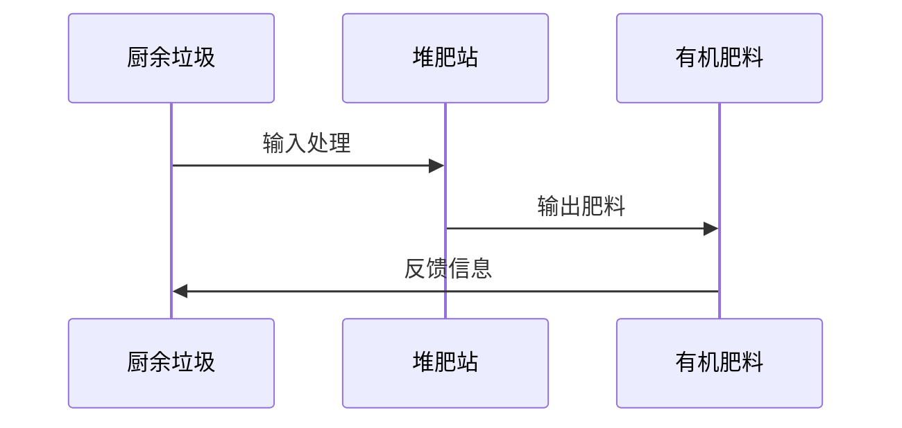

                 

# 新型城市共享厨余堆肥站：社区环保意识的培养

> 关键词：城市共享厨余堆肥站、环保意识、垃圾分类、资源循环利用、社区参与

> 摘要：本文将探讨新型城市共享厨余堆肥站的设计与实施，以及其在培养社区环保意识方面的重要作用。通过分析厨余垃圾处理的技术原理、堆肥站的设计与运营管理、社区环保意识的培养策略和实践，本文旨在为推动城市可持续发展提供有益的参考。

## 第一部分：背景介绍

### 1.1. 新型城市共享厨余堆肥站的概念

**核心概念术语说明**：
- **城市共享厨余堆肥站**：一种集中处理城市居民日常厨余垃圾的设施，通过生物技术将其转化为有机肥料，实现垃圾资源化利用。
- **环保意识**：指公众对环境保护问题的认识和重视程度，包括对环保法律法规的了解、环保行为的自觉性以及对环保事业的参与度。

**问题背景**：
城市化进程中，垃圾处理问题日益突出，特别是厨余垃圾的处理。传统的垃圾填埋和焚烧方式不仅效率低下，而且对环境造成严重污染。随着环保意识的提高，寻找一种可持续的厨余垃圾处理方式已成为迫切需求。

**问题描述**：
厨余垃圾种类繁多，含有大量的有机物质，若处理不当，会释放恶臭、滋生细菌，影响环境卫生。如何有效处理这些垃圾，实现资源循环利用，是当前亟待解决的问题。

**问题解决**：
新型城市共享厨余堆肥站通过生物技术将厨余垃圾转化为有机肥料，不仅解决了垃圾处理难题，还提供了绿色、环保的肥料。这种堆肥站的设计与运营，有助于培养社区环保意识。

**边界与外延**：
- **边界**：涉及厨余垃圾的产生、收集、处理和利用。
- **外延**：包括相关的法律法规、技术标准、运营模式和社会影响。

**概念结构与核心要素组成**：
- **厨余垃圾**：有机物质，包括食物残余、菜叶等。
- **堆肥**：将有机物质转化为有机肥料的过程。
- **共享厨余堆肥站**：处理厨余垃圾的设施，提供肥料。

### 1.2. 社区环保意识的培养

**问题背景**：
环保意识是解决环境问题的基础。社区作为城市的基本单元，是培养环保意识的重要场所。然而，当前社区环保意识普遍较弱，需要通过多种途径进行培养。

**问题描述**：
社区居民对环保知识的了解不足，环保行为自觉性不高，导致垃圾处理不当，资源浪费严重。如何有效提高社区环保意识，是当前面临的重要问题。

**问题解决**：
通过开展环保教育活动、设立垃圾分类奖励机制、推广环保科技产品等方式，可以有效地培养社区环保意识。同时，政府、企业和居民的共同参与也是关键。

**边界与外延**：
- **边界**：涉及环保知识的传播、环保行为的引导和环保意识的提升。
- **外延**：包括政策法规、教育体系、社会宣传和社区活动。

**概念结构与核心要素组成**：
- **环保教育**：传播环保知识，提高环保意识。
- **垃圾分类**：按照属性分类垃圾，实现资源化利用。
- **环保科技**：应用先进技术，提高环保效率。
- **社区活动**：组织环保活动，增强参与感。

## 第二部分：新型城市共享厨余堆肥站的技术原理与设计

### 第1章：新型城市共享厨余堆肥站概述

**核心概念原理**：
城市共享厨余堆肥站是一种通过生物技术将厨余垃圾转化为有机肥料的设施。其基本原理是利用微生物的发酵作用，将有机物质分解并转化为有机肥料。

**概念属性特征对比表格**：

| 特征         | 传统的垃圾处理方式 | 新型城市共享厨余堆肥站 |
| ------------ | ------------------- | ---------------------- |
| **处理效率** | 低效，处理时间长   | 高效，处理时间短       |
| **环境影响** | 污染严重           | 环保，无二次污染       |
| **资源利用** | 废弃物处理         | 资源循环利用           |
| **运营成本** | 高                 | 低                     |

**ER实体关系图架构**：

```mermaid
erDiagram
  厨余垃圾 ||--o{ 堆肥站 } : 转化
  堆肥站 ||--o{ 有机肥料 } : 产出
  社区居民 ||--o{ 环保意识 } : 提高
```

### 第2章：厨余垃圾的处理技术

**算法原理讲解**：

**堆肥过程**：

1. **预处理**：将厨余垃圾进行初步处理，去除大块固体和异物。
2. **发酵**：将预处理后的厨余垃圾与微生物（如细菌、真菌）混合，在控制温度、湿度和氧气含量的条件下，进行发酵分解。
3. **后处理**：发酵后的物料进行筛分、去杂，得到有机肥料。

**数学模型**：

- **发酵速率**：\( R(t) = k \cdot [有机物质](t) \)
- **有机物质分解**：\( [有机物质](t) = [有机物质]_0 \cdot e^{-kt} \)

**Python源代码示例**：

```python
import numpy as np
import matplotlib.pyplot as plt

def fermentation_rate(time, rate_constant, initial substrate):
    return initial_substrate * np.exp(-rate_constant * time)

time = np.linspace(0, 100, 1000)
rate_constant = 0.1
initial_substrate = 100

fermentation_rate_curve = fermentation_rate(time, rate_constant, initial_substrate)

plt.plot(time, fermentation_rate_curve)
plt.xlabel('Time (days)')
plt.ylabel('Remaining Substrate (%)')
plt.title('Fermentation Rate Over Time')
plt.show()
```

### 第3章：堆肥站的设计与建设

**核心概念原理**：
堆肥站的设计与建设需要考虑多个因素，包括选址、布局、设备与设施等。

**概念属性特征对比表格**：

| **要素**       | **重要性** | **作用**                             |
| -------------- | ---------- | ------------------------------------ |
| **选址**       | 高         | 影响堆肥站的运行成本与环境影响       |
| **布局**       | 中         | 确保堆肥过程的高效与安全             |
| **设备与设施** | 高         | 确保堆肥过程的顺利进行与质量保证     |

**ER实体关系图架构**：

```mermaid
erDiagram
  选址 ||--o{ 布局 } : 确定位置
  布局 ||--o{ 设备与设施 } : 安装设备
  厨余垃圾 ||--o{ 堆肥站 } : 输入处理
```

### 第4章：堆肥站的运营管理

**核心概念原理**：
堆肥站的运营管理包括厨余垃圾的收集与预处理、堆肥过程的控制与管理、有机肥料的处理与包装等。

**概念属性特征对比表格**：

| **管理环节**     | **重要性** | **作用**                                   |
| ---------------- | ---------- | ------------------------------------------ |
| **收集与预处理** | 高         | 确保厨余垃圾的质量与处理效率             |
| **堆肥过程**     | 高         | 确保堆肥效果与肥料质量                   |
| **有机肥料**     | 中         | 提高肥料利用率与市场竞争力               |

**ER实体关系图架构**：

```mermaid
erDiagram
  厨余垃圾 ||--o{ 收集与预处理 } : 处理垃圾
  收集与预处理 ||--o{ 堆肥过程 } : 进行堆肥
  堆肥过程 ||--o{ 有机肥料 } : 产出肥料
```

## 第二部分：社区环保意识的培养策略与实践

### 第5章：环保教育在社区的应用

**核心概念原理**：
环保教育是通过多种途径传播环保知识，提高居民的环保意识。

**概念属性特征对比表格**：

| **教育途径**       | **作用**                             |
| ------------------ | ------------------------------------ |
| **宣传活动**       | 提高居民对环保问题的关注度           |
| **知识讲座**       | 传播环保知识，增强环保意识           |
| **实践活动**       | 提高居民的环保实践能力               |
| **社区互动**       | 增强居民之间的环保互动，形成环保氛围 |

**ER实体关系图架构**：

```mermaid
erDiagram
  宣传活动 ||--o{ 知识讲座 } : 进行讲座
  知识讲座 ||--o{ 实践活动 } : 进行实践
  社区互动 ||--o{ 环保氛围 } : 增强互动
```

### 第6章：垃圾分类与回收体系

**核心概念原理**：
垃圾分类与回收体系是提高资源利用效率，减少环境污染的重要手段。

**概念属性特征对比表格**：

| **分类标准**       | **作用**                             |
| ------------------ | ------------------------------------ |
| **有害垃圾**       | 需要专门处理，防止对环境和人体健康造成危害 |
| **可回收物**       | 可以再次利用，减少资源浪费           |
| **湿垃圾**         | 可以转化为有机肥料，实现资源循环利用   |
| **干垃圾**         | 需要进一步处理，减少环境污染         |

**ER实体关系图架构**：

```mermaid
erDiagram
  有害垃圾 ||--o{ 可回收物 } : 分类
  可回收物 ||--o{ 湿垃圾 } : 分类
  湿垃圾 ||--o{ 干垃圾 } : 分类
```

### 第7章：社区环保活动的组织与实施

**核心概念原理**：
社区环保活动是通过组织各种形式的活动，提高居民的环保意识与参与度。

**概念属性特征对比表格**：

| **活动形式**       | **作用**                             |
| ------------------ | ------------------------------------ |
| **环保讲座**       | 传播环保知识，增强环保意识           |
| **垃圾分类竞赛**   | 提高居民对垃圾分类的掌握程度         |
| **植树活动**       | 增强居民的环保实践能力               |
| **清洁行动**       | 培养居民的环保习惯，改善社区环境     |

**ER实体关系图架构**：

```mermaid
erDiagram
  环保讲座 ||--o{ 垃圾分类竞赛 } : 进行竞赛
  垃圾分类竞赛 ||--o{ 植树活动 } : 进行活动
  植树活动 ||--o{ 清洁行动 } : 进行行动
```

## 第三部分：新型城市共享厨余堆肥站案例研究

### 第8章：案例背景与目标

**核心概念原理**：
案例研究是对实际项目中堆肥站的设计与运营进行深入分析，以揭示其成功经验和不足之处。

**项目介绍**：
以北京市某社区的新型城市共享厨余堆肥站为例，该项目旨在通过建立共享厨余堆肥站，实现厨余垃圾的资源化利用，同时提高社区居民的环保意识。

**系统功能设计**：

**领域模型类图**：

```mermaid
classDiagram
  厨余垃圾 <<entity>>
  堆肥站 <<entity>>
  有机肥料 <<entity>>

  厨余垃圾 --|>{ 堆肥站 }
  堆肥站 --|>{ 有机肥料 }
```

**系统架构设计**：

**架构图**：



### 第9章：案例实施过程

**实施过程**：
1. **前期准备**：进行场地考察、选址，确定堆肥站的位置和规模。
2. **设计规划**：根据选址结果，进行堆肥站的设计和设备采购。
3. **建设施工**：按照设计方案进行建设，包括设备安装和调试。
4. **运营管理**：开始运营，进行厨余垃圾的收集、处理和肥料产出。

### 第10章：案例效果评估

**效果评估**：
1. **垃圾处理效率**：堆肥站运营后，厨余垃圾处理效率明显提高，减少了垃圾填埋和焚烧的需求。
2. **环保意识提升**：社区居民的环保意识得到显著提高，垃圾分类参与度和积极性明显增强。
3. **经济效益**：堆肥站的建设和运营创造了就业机会，提高了社区的经济效益。

### 第11章：案例经验与启示

**经验与启示**：
1. **政策支持**：政府的政策支持和资金投入是堆肥站建设成功的关键。
2. **社区参与**：社区居民的积极参与是推动堆肥站运营的重要动力。
3. **技术创新**：不断引进和研发新技术，提高堆肥站的运营效率和肥料质量。

## 第四部分：未来展望与政策建议

### 第12章：未来展望

**核心概念原理**：
随着科技的进步和环保意识的提高，新型城市共享厨余堆肥站的发展前景广阔。

**未来趋势**：
1. **智能化**：利用物联网技术实现堆肥站智能监控和自动化管理。
2. **绿色化**：采用更加环保的材料和技术，降低堆肥站对环境的影响。
3. **社会化**：推动堆肥站的社会化运营，提高资源利用效率。

### 第13章：政策建议

**政策建议**：
1. **完善法规**：制定和完善相关法规，规范堆肥站的建设和运营。
2. **加大投入**：政府应加大对堆肥站建设的资金投入，支持技术创新。
3. **推广宣传**：通过多种渠道宣传堆肥站的环保优势，提高公众参与度。

### 第14章：总结与展望

**总结**：
本文通过对新型城市共享厨余堆肥站的设计与实施、社区环保意识的培养策略与实践以及案例研究，揭示了堆肥站在城市可持续发展中的重要作用。

**展望**：
未来，随着环保意识的不断提高，新型城市共享厨余堆肥站将在城市垃圾处理和资源循环利用中发挥更大的作用，为实现城市可持续发展贡献力量。

## 附录

**最佳实践 Tips**：
1. 堆肥站选址应考虑交通便利和居民参与度。
2. 垃圾分类应结合当地实际情况，制定合适的分类标准。
3. 环保教育应注重实际操作，提高居民的实践能力。

**小结**：
新型城市共享厨余堆肥站是解决城市垃圾处理难题、培养社区环保意识的重要手段。通过科学设计、合理运营和广泛参与，堆肥站将为城市可持续发展作出积极贡献。

**注意事项**：
1. 堆肥过程中应注意控制温度、湿度和氧气含量，以确保堆肥效果。
2. 垃圾分类应遵循环保原则，确保垃圾得到合理处理。

**拓展阅读**：
1. 《城市垃圾处理与资源化利用》
2. 《社区环保教育理论与实践》
3. 《堆肥技术与应用》

### 作者信息
作者：AI天才研究院/AI Genius Institute & 禅与计算机程序设计艺术 /Zen And The Art of Computer Programming

