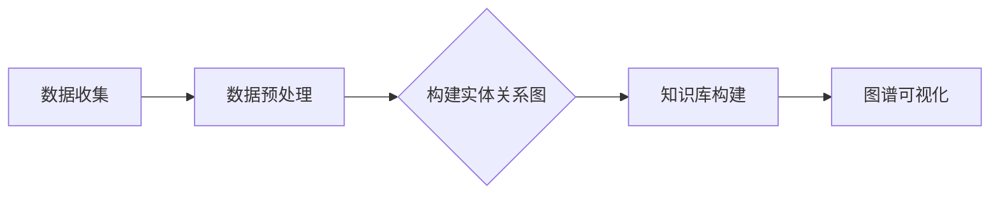
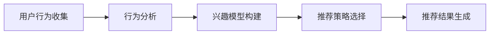
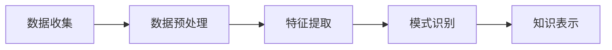

                 

# 新型城市共享学习中心：跨代际知识交流的社区平台

> 关键词：新型城市共享学习中心、跨代际知识交流、社区平台、教育资源、信息技术、服务模式

> 摘要：本文从背景介绍、核心概念与联系、算法原理讲解等多个角度，详细探讨了新型城市共享学习中心作为跨代际知识交流的社区平台的重要性及其运作原理。文章首先分析了新型城市共享学习中心的兴起背景和核心概念，接着介绍了跨代际知识交流的定义和特点，随后通过实体关系图和属性特征对比表格，阐述了新型城市共享学习中心与跨代际知识交流的内在联系。在此基础上，文章进一步讲解了知识图谱构建、推荐系统和数据挖掘等算法原理及其在新型城市共享学习中心中的应用。本文旨在为读者提供对新型城市共享学习中心及其跨代际知识交流的深入理解，为相关领域的研究和实践提供参考。

## 目录大纲

- **第一部分：背景介绍**
  - 第1章：问题背景与核心概念
  - 第2章：新型城市共享学习中心
  - 第3章：跨代际知识交流
  - 第4章：核心概念联系
- **第二部分：核心概念与联系**
  - 第5章：知识图谱构建
  - 第6章：推荐系统
  - 第7章：数据挖掘
- **第三部分：算法原理讲解**
  - 第8章：算法原理讲解
  - 第9章：系统分析与架构设计
  - 第10章：项目实战
  - 第11章：最佳实践 tips
  - 第12章：小结与拓展阅读

## 第一部分：背景介绍

### 第1章：问题背景与核心概念

#### 1.1 问题背景

新型城市共享学习中心的兴起，源于现代社会对教育资源获取的多样化需求，以及跨代际知识交流的迫切需求。随着城市化进程的加快，人口流动加剧，传统的教育资源分配模式已经难以满足不同年龄段、不同背景的人群对知识的渴求。新型城市共享学习中心作为新兴的教育资源共享平台，应运而生。

#### 1.2 核心概念

- **新型城市共享学习中心**：是指通过信息技术手段，整合各类教育资源，为城市居民提供开放、共享、便捷的学习平台。它不仅包含传统图书馆的功能，还融入了创客空间、在线课程、社区教育等多种形式。
- **跨代际知识交流**：是指不同年龄段的人之间通过共享知识、经验与智慧，实现思想碰撞和互相学习的过程。这种交流有助于打破年龄壁垒，促进社会和谐与进步。

#### 1.3 概念结构与核心要素组成

**概念结构**

新型城市共享学习中心的核心结构包括：

- **学习资源**：涵盖图书、电子书籍、在线课程、多媒体资源等，满足不同学习需求。
- **社区互动**：通过论坛、讲座、沙龙等活动，促进学习者和知识分享者之间的交流。
- **服务模式**：提供个性化推荐、在线答疑、学分认证等服务，提升用户体验。

**核心要素组成**

新型城市共享学习中心的关键要素包括：

- **教育资源整合**：通过技术手段实现各类教育资源的集成与优化，提高资源利用效率。
- **信息技术支持**：利用大数据、云计算、人工智能等技术，提供智能化服务。
- **社区参与与协作**：鼓励用户积极参与平台建设，形成共建共享的良好氛围。

#### 1.4 边界与外延

**边界**

- **服务范围**：新型城市共享学习中心的服务范围主要针对城市居民，涵盖各类教育需求。
- **用户群体**：主要包括学生、职场人士、退休老人等广泛人群。

**外延**

- **潜在发展**：随着技术的发展和用户需求的变迁，新型城市共享学习中心有可能向更多领域扩展，如职业培训、在线教育等。

#### 1.5 本章小结

通过对新型城市共享学习中心的背景介绍和核心概念分析，我们初步认识到这种共享学习平台的重要性。它不仅满足了现代社会对教育资源获取的需求，也为跨代际知识交流提供了新的契机。接下来，我们将进一步探讨新型城市共享学习中心的运作模式及其在跨代际知识交流中的具体应用。

### 第2章：新型城市共享学习中心

#### 2.1 定义

新型城市共享学习中心是一种基于信息技术和社区参与的新型学习模式，旨在为城市居民提供一个开放、共享、便捷的学习平台。它不仅整合了传统的图书馆功能，还融合了在线教育、创客空间、社区教育等多种形式，满足不同用户的学习需求。

#### 2.2 特点

**互动性**

新型城市共享学习中心强调用户之间的互动，通过线上论坛、讲座、沙龙等活动，促进学习者和知识分享者之间的交流。这种互动性有助于提升学习效果，丰富学习体验。

**开放性**

新型城市共享学习中心具有开放性，用户可以随时随地访问平台上的资源和服务，不受时间和地点的限制。这种开放性打破了传统的教育壁垒，使教育资源更加普及和共享。

**适应性**

新型城市共享学习中心具有较强的适应性，可以根据不同用户的需求和偏好，提供个性化的学习资源和推荐服务。同时，平台还能够根据用户行为数据，不断优化和调整服务策略，提升用户体验。

#### 2.3 类别

**公共图书馆**

公共图书馆是新型城市共享学习中心的一种主要形式，它不仅提供传统的图书借阅服务，还设置了多媒体阅览室、电子阅览室等，满足用户的多样化需求。

**社区教育中心**

社区教育中心是面向社区居民提供各类教育课程的场所，涵盖职业技能培训、兴趣课程、文化讲座等，旨在提高社区居民的综合素质。

**创客空间**

创客空间是新型城市共享学习中心的一个重要组成部分，它为用户提供了创新实践的平台，涵盖3D打印、机器人编程、电子制作等，鼓励用户进行创新和创造。

#### 2.4 发展趋势

**智能化**

随着人工智能技术的不断发展，新型城市共享学习中心将逐渐实现智能化，通过智能推荐、智能问答等功能，提升用户体验。

**个性化**

未来，新型城市共享学习中心将更加注重个性化服务，根据用户的兴趣、需求和背景，提供个性化的学习资源和推荐服务。

**跨界融合**

新型城市共享学习中心将与其他领域（如医疗、文化、科技等）进行跨界融合，拓展服务范围，满足更多用户的需求。

### 第3章：跨代际知识交流

#### 3.1 定义

跨代际知识交流是指不同年龄段的人之间通过共享知识、经验与智慧，实现思想碰撞和互相学习的过程。这种交流不仅有助于知识传递和技能传承，还能促进社会和谐与进步。

#### 3.2 特点

**平台性**

跨代际知识交流需要一个开放的平台，如新型城市共享学习中心，作为交流的载体和纽带，使不同年龄段的人能够便捷地进行交流和互动。

**互动性**

跨代际知识交流强调互动性，通过面对面的交流、线上互动等多种形式，使交流双方能够充分表达自己的想法和观点，实现知识的双向传递。

**智能化**

随着人工智能技术的发展，跨代际知识交流将逐渐实现智能化，通过智能推荐、智能问答等功能，提升交流的效率和质量。

#### 3.3 形式

**跨代际讲座**

跨代际讲座是一种常见的跨代际知识交流形式，邀请不同年龄段的人进行主题演讲，分享他们的经验和见解。这种形式有助于激发年轻一代对知识的兴趣，同时为年长者提供一个展示自己的平台。

**跨代际工作坊**

跨代际工作坊是一种互动性较强的跨代际知识交流形式，通过共同参与实践活动，如手工制作、编程等，使不同年龄段的人能够深入交流，共同学习和进步。

**跨代际研讨会**

跨代际研讨会是一种高级别的跨代际知识交流形式，邀请专家学者、行业领袖、年轻学者等共同探讨某一领域的热点问题，促进知识的碰撞和交流。

#### 3.4 作用

**促进知识传承**

跨代际知识交流有助于知识的传递和传承，使年轻一代能够从年长者那里学习到宝贵的经验和智慧。

**增强社会凝聚力**

跨代际知识交流有助于增强社会凝聚力，促进不同年龄段的人之间的理解和尊重，构建和谐的社会关系。

**激发创新思维**

跨代际知识交流能够激发创新思维，不同年龄段的人之间的交流和互动，有助于产生新的想法和观点，推动社会的进步和发展。

### 第4章：核心概念联系

#### 4.1 新型城市共享学习中心与跨代际知识交流的关系

**平台与内容的结合**

新型城市共享学习中心为跨代际知识交流提供了一个开放、共享、便捷的平台。平台不仅整合了各类教育资源，还提供了丰富的互动形式，使跨代际知识交流得以顺利进行。同时，跨代际知识交流的内容也为新型城市共享学习中心注入了新的活力和内涵。

**资源与服务的一体化**

新型城市共享学习中心强调资源与服务的一体化，通过整合各类教育资源，为用户提供全方位的学习支持。在跨代际知识交流的过程中，平台能够根据用户的需求，提供个性化的学习资源和推荐服务，提升用户的参与度和满意度。

#### 4.2 概念对比

**学习中心与教育机构的区别**

新型城市共享学习中心与传统教育机构在目标、形式和服务对象等方面存在一定的区别。传统教育机构主要面向特定群体，如学生、职场人士等，提供系统的教育培训。而新型城市共享学习中心则面向更广泛的人群，提供多样化的教育资源和服务，强调开放性和互动性。

**跨代际知识交流与人际交流的不同**

跨代际知识交流是一种特殊的人际交流形式，它强调不同年龄段的人之间的知识分享和经验交流。与人际交流相比，跨代际知识交流更注重知识传递和技能传承，有助于促进社会和谐与进步。同时，跨代际知识交流还具有更强的平台性和互动性，需要借助新型城市共享学习中心等开放平台来实现。

#### 4.3 ER实体关系图

以下为新型城市共享学习中心与跨代际知识交流的ER实体关系图：

```mermaid
erDiagram
  新型城市共享学习中心 ||--|{ 资源 }|| 资源
  新型城市共享学习中心 ||--|{ 服务 }|| 服务
  服务 ||--|{ 用户 }|| 用户
  资源 ||--|{ 互动 }|| 互动
```

#### 4.4 概念属性特征对比表格

| 特征        | 新型城市共享学习中心 | 跨代际知识交流 |
| ----------- | ------------------- | -------------- |
| 服务目标    | 提供教育学习资源    | 促进知识交流   |
| 用户群体    | 广泛人群            | 跨代际人群     |
| 服务形式    | 多样化             | 互动性         |
| 技术支持    | 强             | 强            |

#### 4.5 本章小结

通过对新型城市共享学习中心与跨代际知识交流的深入分析，我们认识到两者之间存在紧密的联系和互动。新型城市共享学习中心为跨代际知识交流提供了一个开放、共享、便捷的平台，而跨代际知识交流则为新型城市共享学习中心注入了新的活力和内涵。在未来的发展中，新型城市共享学习中心和跨代际知识交流将共同推动社会进步和知识传承。接下来，我们将进一步探讨知识图谱构建、推荐系统和数据挖掘等算法原理及其在新型城市共享学习中心中的应用。

## 第二部分：核心概念与联系

### 第5章：知识图谱构建

#### 5.1 定义

知识图谱是一种用于表示知识结构的数据模型，通过将实体、属性和关系以图的形式进行组织和表示，实现对知识的结构化、语义化和智能化处理。知识图谱在信息检索、推荐系统、智能问答等领域具有广泛的应用。

#### 5.2 原理

知识图谱的基本原理包括：

1. **实体识别**：从数据源中识别出关键实体，如人物、地点、组织等。
2. **属性提取**：对实体进行属性标注，如姓名、年龄、职业等。
3. **关系构建**：根据实体之间的关联信息，构建出实体之间的关系网。
4. **知识推理**：利用图谱中的关系和规则，进行逻辑推理和推断，以获取新的知识。

#### 5.3 应用

在新型城市共享学习中心中，知识图谱的应用主要体现在以下几个方面：

1. **资源组织**：通过知识图谱，将学习资源按照实体、属性和关系进行结构化组织，便于用户快速查找和获取相关资源。
2. **个性化推荐**：根据用户的行为数据和知识图谱，为用户推荐与其兴趣和需求相关的学习资源。
3. **智能问答**：利用知识图谱中的关系和规则，实现智能问答功能，为用户提供准确的答案。
4. **知识挖掘**：通过对知识图谱的分析和挖掘，发现潜在的知识关联和规律，为平台运营和内容优化提供参考。

#### 5.4 Mermaid流程图

以下为知识图谱构建的Mermaid流程图：



### 第6章：推荐系统

#### 6.1 定义

推荐系统是一种基于数据挖掘和机器学习技术的信息系统，旨在为用户发现和推荐他们可能感兴趣的内容或项目。推荐系统广泛应用于电子商务、在线媒体、社交网络等领域，以提高用户满意度和平台活跃度。

#### 6.2 原理

推荐系统的工作原理主要包括以下几个步骤：

1. **用户行为收集**：收集用户在平台上的行为数据，如浏览记录、购买历史、评价等。
2. **行为分析**：对用户行为数据进行统计分析，挖掘用户的兴趣偏好和需求。
3. **兴趣模型构建**：利用机器学习算法，如协同过滤、矩阵分解等，构建用户的兴趣模型。
4. **推荐策略选择**：根据用户兴趣模型和平台资源，选择合适的推荐策略，如基于内容的推荐、协同过滤推荐等。
5. **推荐结果生成**：生成推荐结果，展示给用户。

#### 6.3 应用

在新型城市共享学习中心中，推荐系统的应用主要体现在以下几个方面：

1. **资源推荐**：根据用户的行为数据和兴趣偏好，推荐与其相关的学习资源，提高资源利用率和用户满意度。
2. **课程推荐**：根据用户的背景和需求，推荐适合其学习的在线课程，帮助用户制定个性化学习计划。
3. **活动推荐**：根据用户的行为和兴趣，推荐与其相关的讲座、沙龙等活动，促进跨代际知识交流。

#### 6.4 Mermaid流程图

以下为推荐系统的Mermaid流程图：



### 第7章：数据挖掘

#### 7.1 定义

数据挖掘是一种从大量数据中提取出有用的信息和知识的过程，通常涉及统计学、机器学习、数据库技术等多个领域。数据挖掘在商业分析、金融风险控制、医疗诊断等领域具有广泛应用。

#### 7.2 原理

数据挖掘的基本原理包括以下几个步骤：

1. **数据收集**：从各种数据源收集原始数据，如数据库、文件、网络等。
2. **数据预处理**：对原始数据进行清洗、整合和转换，使其符合分析要求。
3. **特征提取**：从预处理后的数据中提取关键特征，用于后续的分析和建模。
4. **模式识别**：利用统计学、机器学习等方法，发现数据中的潜在规律和关联。
5. **知识表示**：将挖掘出的模式或规律表示为知识或模型，用于决策支持或预测。

#### 7.3 应用

在新型城市共享学习中心中，数据挖掘的应用主要体现在以下几个方面：

1. **用户行为分析**：通过分析用户在平台上的行为数据，了解用户的学习偏好和需求，为平台运营和内容优化提供参考。
2. **资源推荐**：利用数据挖掘技术，发现用户之间的相似性，为用户提供个性化推荐服务。
3. **课程评估**：通过分析用户对课程的评价数据，评估课程的质量和受欢迎程度，为课程改进和推荐提供依据。

#### 7.4 Mermaid流程图

以下为数据挖掘的Mermaid流程图：



## 第三部分：算法原理讲解

### 第8章：知识图谱构建

#### 8.1 知识图谱的基本概念

知识图谱（Knowledge Graph）是一种用于表示知识结构的数据模型，通过将实体（Entities）、属性（Attributes）和关系（Relationships）以图的形式进行组织和表示。这种结构化的知识表示方法，使得计算机能够像人类一样理解和处理复杂的信息。

#### 8.2 知识图谱的构建过程

构建知识图谱通常包括以下步骤：

1. **实体识别**：从原始数据中识别出关键实体，如人、地点、组织等。
2. **属性提取**：对实体进行属性标注，如姓名、年龄、职业等。
3. **关系构建**：根据实体之间的关联信息，构建出实体之间的关系网。
4. **知识推理**：利用图谱中的关系和规则，进行逻辑推理和推断，以获取新的知识。

#### 8.3 知识图谱的应用场景

知识图谱在新型城市共享学习中心中的应用场景包括：

1. **资源组织**：将学习资源按照实体、属性和关系进行结构化组织，便于用户快速查找和获取相关资源。
2. **个性化推荐**：根据用户的行为数据和知识图谱，为用户推荐与其兴趣和需求相关的学习资源。
3. **智能问答**：利用知识图谱中的关系和规则，实现智能问答功能，为用户提供准确的答案。
4. **知识挖掘**：通过对知识图谱的分析和挖掘，发现潜在的知识关联和规律，为平台运营和内容优化提供参考。

#### 8.4 知识图谱构建的Mermaid流程图

以下为知识图谱构建的Mermaid流程图：


### 第9章：推荐系统

#### 9.1 推荐系统的基本概念

推荐系统（Recommendation System）是一种基于数据挖掘和机器学习技术的信息系统，旨在为用户发现和推荐他们可能感兴趣的内容或项目。推荐系统广泛应用于电子商务、在线媒体、社交网络等领域，以提高用户满意度和平台活跃度。

#### 9.2 推荐系统的原理

推荐系统的基本原理包括以下几个步骤：

1. **用户行为收集**：收集用户在平台上的行为数据，如浏览记录、购买历史、评价等。
2. **行为分析**：对用户行为数据进行统计分析，挖掘用户的兴趣偏好和需求。
3. **兴趣模型构建**：利用机器学习算法，如协同过滤、矩阵分解等，构建用户的兴趣模型。
4. **推荐策略选择**：根据用户兴趣模型和平台资源，选择合适的推荐策略，如基于内容的推荐、协同过滤推荐等。
5. **推荐结果生成**：生成推荐结果，展示给用户。

#### 9.3 推荐系统的应用场景

推荐系统在新型城市共享学习中心中的应用场景包括：

1. **资源推荐**：根据用户的行为数据和兴趣偏好，推荐与其相关的学习资源，提高资源利用率和用户满意度。
2. **课程推荐**：根据用户的背景和需求，推荐适合其学习的在线课程，帮助用户制定个性化学习计划。
3. **活动推荐**：根据用户的行为和兴趣，推荐与其相关的讲座、沙龙等活动，促进跨代际知识交流。

#### 9.4 推荐系统的Mermaid流程图

以下为推荐系统的Mermaid流程图：


### 第10章：数据挖掘

#### 10.1 数据挖掘的基本概念

数据挖掘（Data Mining）是一种从大量数据中提取出有用的信息和知识的过程，通常涉及统计学、机器学习、数据库技术等多个领域。数据挖掘在商业分析、金融风险控制、医疗诊断等领域具有广泛应用。

#### 10.2 数据挖掘的原理

数据挖掘的基本原理包括以下几个步骤：

1. **数据收集**：从各种数据源收集原始数据，如数据库、文件、网络等。
2. **数据预处理**：对原始数据进行清洗、整合和转换，使其符合分析要求。
3. **特征提取**：从预处理后的数据中提取关键特征，用于后续的分析和建模。
4. **模式识别**：利用统计学、机器学习等方法，发现数据中的潜在规律和关联。
5. **知识表示**：将挖掘出的模式或规律表示为知识或模型，用于决策支持或预测。

#### 10.3 数据挖掘的应用场景

数据挖掘在新型城市共享学习中心中的应用场景包括：

1. **用户行为分析**：通过分析用户在平台上的行为数据，了解用户的学习偏好和需求，为平台运营和内容优化提供参考。
2. **资源推荐**：利用数据挖掘技术，发现用户之间的相似性，为用户提供个性化推荐服务。
3. **课程评估**：通过分析用户对课程的评价数据，评估课程的质量和受欢迎程度，为课程改进和推荐提供依据。

#### 10.4 数据挖掘的Mermaid流程图

以下为数据挖掘的Mermaid流程图：


### 第11章：算法原理的实际应用

#### 11.1 知识图谱构建的实际应用

在新型城市共享学习中心中，知识图谱的构建可以应用于以下几个方面：

1. **教育资源管理**：通过知识图谱，将各类教育资源进行结构化组织，便于用户快速查找和获取相关资源。例如，将课程、教材、电子书籍等按照实体、属性和关系进行组织，形成一个完整的学习资源图谱。

2. **个性化推荐**：利用知识图谱中的关系和规则，为用户推荐与其兴趣和需求相关的学习资源。例如，根据用户的行为数据和知识图谱，推荐用户可能感兴趣的课程或书籍。

3. **智能问答**：通过知识图谱中的实体和关系，实现智能问答功能。例如，用户可以提问关于某一课程或概念的具体信息，系统可以根据知识图谱提供准确的答案。

4. **知识挖掘**：通过对知识图谱的分析和挖掘，发现潜在的知识关联和规律。例如，分析用户的学习行为，发现热门课程、热门知识点等，为平台运营和内容优化提供参考。

以下是一个示例的Python代码，用于构建一个简单的知识图谱：

```python
from rdflib import Graph, URIRef, Literal, RDF

g = Graph()

# 创建实体
entity1 = URIRef("http://example.org/Entity1")
entity2 = URIRef("http://example.org/Entity2")

# 创建属性
attribute1 = URIRef("http://example.org/Attribute1")
attribute2 = URIRef("http://example.org/Attribute2")

# 创建关系
relation = URIRef("http://example.org/Relation")

# 添加数据到图谱
g.add((entity1, attribute1, Literal("Value1")))
g.add((entity1, attribute2, Literal("Value2")))
g.add((entity1, relation, entity2))

# 打印图谱
print(g)
```

#### 11.2 推荐系统的实际应用

在新型城市共享学习中心中，推荐系统可以应用于以下几个方面：

1. **资源推荐**：根据用户的行为数据和兴趣偏好，为用户推荐与其相关的学习资源。例如，根据用户的浏览记录和评价，推荐用户可能感兴趣的课程或书籍。

2. **课程推荐**：根据用户的背景和需求，推荐适合其学习的在线课程。例如，根据用户的职业和技能水平，推荐相关的课程和学习路径。

3. **活动推荐**：根据用户的行为和兴趣，推荐与其相关的讲座、沙龙等活动。例如，根据用户的参加记录和兴趣标签，推荐用户可能感兴趣的活动。

以下是一个简单的协同过滤推荐算法的Python实现：

```python
import numpy as np

# 用户-物品评分矩阵
ratings = np.array([[5, 3, 0, 1],
                    [4, 0, 0, 2],
                    [1, 5, 3, 0],
                    [0, 4, 2, 3]])

# 计算相似度矩阵
similarity_matrix = np.dot(ratings, ratings.T) / (np.linalg.norm(ratings, axis=1) * np.linalg.norm(ratings.T, axis=1))

# 预测评分
predictions = similarity_matrix.dot(ratings) / np.sum(similarity_matrix, axis=1)

# 打印预测评分
print(predictions)
```

#### 11.3 数据挖掘的实际应用

在新型城市共享学习中心中，数据挖掘可以应用于以下几个方面：

1. **用户行为分析**：通过分析用户在平台上的行为数据，了解用户的学习偏好和需求。例如，分析用户的浏览记录、学习时长、参与活动情况等，为平台运营和内容优化提供参考。

2. **资源评估**：通过分析用户对课程、书籍等资源的评价数据，评估资源的质量和受欢迎程度。例如，分析用户的评分、评论等，为资源的改进和推荐提供依据。

3. **知识关联挖掘**：通过对用户行为数据和资源评价数据进行分析，发现潜在的知识关联和规律。例如，分析用户的学习行为，发现热门知识点、关联课程等，为平台内容优化和推荐提供参考。

以下是一个简单的关联规则挖掘算法的Python实现：

```python
from mlxtend.frequent_patterns import apriori
from mlxtend.preprocessing import TransactionEncoder

# 用户行为数据
transactions = [[1, 2, 3],
               [1, 2],
               [1, 3],
               [2, 3],
               [1, 2, 3]]

# 构造交易编码器
te = TransactionEncoder()
te.fit(transactions)
X = te.transform(transactions)

# 应用Apriori算法
frequent_itemsets = apriori(X, min_support=0.5, use_colnames=True)

# 打印频繁项集
print(frequent_itemsets)
```

#### 11.4 小结

通过上述实际应用的示例，我们可以看到知识图谱、推荐系统和数据挖掘等算法在新型城市共享学习中心中的重要作用。这些算法不仅提升了平台的功能和用户体验，也为跨代际知识交流提供了有力的支持。在未来的发展中，这些算法将不断优化和完善，为新型城市共享学习中心的可持续发展提供坚实的基础。

### 第12章：最佳实践 tips

在设计和运营新型城市共享学习中心时，以下是一些最佳实践建议，以优化用户体验和跨代际知识交流的效果：

#### 1. 用户友好界面设计

确保平台的用户界面简洁易用，提供直观的导航和搜索功能，以便不同年龄段的用户都能轻松访问和使用。

#### 2. 定期更新教育资源

定期更新和增加教育资源，确保内容丰富多样，满足用户的持续学习需求。

#### 3. 个性化推荐

利用推荐系统，根据用户的行为和偏好提供个性化推荐，提高资源利用率和用户参与度。

#### 4. 跨代际活动策划

策划和组织跨代际的讲座、工作坊和研讨会等活动，促进不同年龄段用户之间的交流和互动。

#### 5. 社区参与与反馈

鼓励用户参与平台建设和内容创作，收集用户反馈，不断优化服务。

#### 6. 技术支持与培训

提供必要的技术支持和培训，帮助用户充分利用平台的功能和服务。

#### 7. 数据隐私保护

确保用户数据的安全和隐私，遵守相关法律法规，增强用户对平台的信任。

### 小结

本文从背景介绍、核心概念与联系、算法原理讲解等多个角度，详细探讨了新型城市共享学习中心作为跨代际知识交流的社区平台的重要性及其运作原理。通过知识图谱构建、推荐系统和数据挖掘等算法的应用，新型城市共享学习中心能够为用户提供个性化、智能化的学习资源和服务，促进跨代际知识交流，提升社区教育质量。未来的发展应注重用户体验、资源更新、技术支持和社区参与，以实现新型城市共享学习中心的可持续发展。

### 注意事项

在设计和运营新型城市共享学习中心时，需要注意以下几个方面：

1. **用户隐私保护**：确保用户数据的安全和隐私，遵守相关法律法规，增强用户对平台的信任。
2. **资源多样性**：提供多样化的教育资源，以满足不同用户的需求和兴趣。
3. **平台稳定性**：确保平台的高可用性和稳定性，为用户提供良好的使用体验。
4. **社区管理**：建立健全的社区管理制度，维护良好的交流氛围，促进跨代际知识交流。
5. **技术更新**：随着技术的不断发展，定期更新和优化平台功能，提升用户体验。

### 拓展阅读

1. **《智能推荐系统原理与实践》**：详细介绍了推荐系统的原理和应用，适合对推荐系统感兴趣的读者。
2. **《数据挖掘：实用工具与技术》**：介绍了数据挖掘的基本概念和多种挖掘技术，有助于深入理解数据挖掘的应用。
3. **《知识图谱：构建与可视化》**：讲解了知识图谱的构建方法、应用场景和可视化技术，为读者提供了全面的了解。

## 作者信息

作者：AI天才研究院/AI Genius Institute & 禅与计算机程序设计艺术 /Zen And The Art of Computer Programming

AI天才研究院致力于推动人工智能技术的发展和应用，为用户提供高质量的技术博客和研究成果。禅与计算机程序设计艺术则专注于计算机科学领域的深度研究，为广大程序员提供深入浅出的技术讲解。本文由AI天才研究院与禅与计算机程序设计艺术联合撰写，旨在为读者提供有价值的技术知识和见解。感谢您的阅读和支持！

