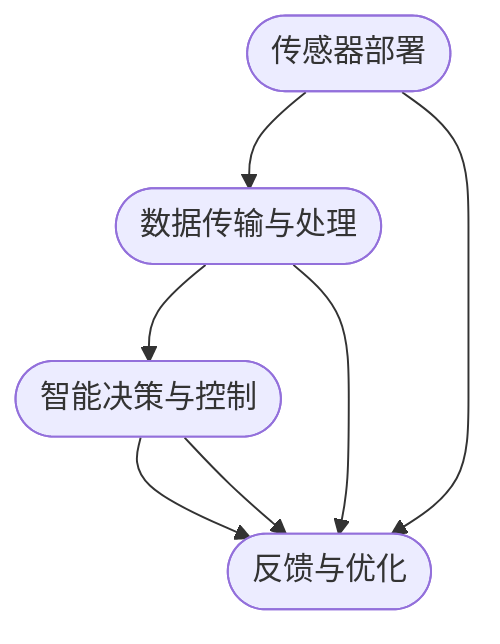
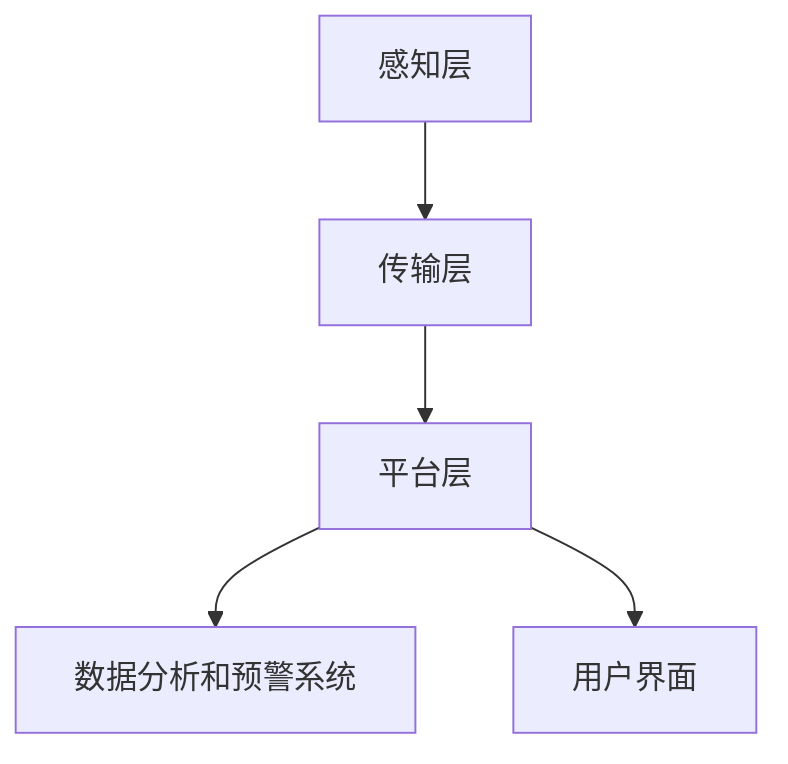

                 

### 背景介绍

#### 共享屋顶温室的概念

共享屋顶温室是一种创新的农业模式，它将温室种植与城市建筑屋顶结合，实现城市农业的可持续发展。温室通常由透明材料覆盖，以模拟适宜的生长环境，为植物提供光照、温度、湿度等条件。共享屋顶温室的特点在于其社会化和共享性，多个用户可以共同使用同一温室的空间和资源，提高了资源利用率和生产效率。

#### 应用场景和意义

在城市环境中，土地资源稀缺，而共享屋顶温室提供了一个创新的解决方案。例如，在高层建筑、公寓楼、商业综合体等建筑物的屋顶上安装温室，不仅可以解决城市农业的用地问题，还可以美化城市景观。同时，共享屋顶温室还具有重要的环境和社会意义：

1. **提高食品安全**：通过在城市的屋顶上种植新鲜蔬菜和水果，减少了食品运输距离，降低了环境污染，提高了食品的安全性和质量。
2. **节能减排**：温室利用太阳能进行光照和温度控制，减少了能源消耗，有助于缓解能源危机。
3. **美化环境**：屋顶温室可以种植花卉、蔬菜等植物，有助于改善城市空气质量，提升居民的生活质量。
4. **促进就业**：共享屋顶温室模式为城市提供了新的就业机会，促进了经济发展。

### 核心概念术语说明

- **温室**：一种用于模拟植物生长环境的设施，通常具有透明覆盖材料，以保持适宜的温度、湿度和光照条件。
- **共享**：多个用户共同使用同一资源，以提高资源利用率和经济效益。
- **城市农业**：在城市环境中进行的农业生产活动，旨在解决城市食物供应和环境保护问题。

#### 问题背景

随着城市化进程的加快，城市土地资源日益紧张，传统的农业模式已经难以满足城市居民对新鲜、安全食品的需求。与此同时，全球气候变化导致极端天气频发，农业生产环境变得更加复杂和不可预测。为了应对这些挑战，新型城市共享屋顶温室作为一种创新模式，应运而生。

#### 问题描述

城市农业面临的挑战主要包括：

1. **土地资源稀缺**：城市土地被高楼大厦占据，传统的农田种植模式难以实现。
2. **农业生产效率低**：城市农业生产受限于自然条件，产量和品质难以保证。
3. **食品供应不安全**：城市食品供应链较长，食品安全隐患增加。

#### 问题解决

新型城市共享屋顶温室提供了一种创新的解决方案，通过利用城市建筑物的屋顶空间，实现了城市农业的可持续发展。具体解决思路如下：

1. **高效利用空间**：将屋顶空间改造成温室，提高了土地利用效率。
2. **模拟适宜环境**：通过温室控制技术，为植物提供最佳的生长环境。
3. **资源共享**：多个用户共同使用温室资源，降低了运营成本，提高了生产效率。
4. **环境友好**：温室利用太阳能，减少了对传统能源的依赖，实现了节能减排。

#### 边界与外延

新型城市共享屋顶温室的边界主要包括：

1. **地理边界**：主要位于城市的高层建筑和商业综合体屋顶。
2. **技术边界**：涉及温室控制技术、农业物联网技术等。
3. **社会边界**：需要协调多个利益相关方的需求和利益，包括业主、用户、种植者等。

外延方面，共享屋顶温室模式可以扩展到城市公园、学校、社区等多种场所，进一步推广城市农业的可持续发展理念。

#### 概念结构与核心要素组成

新型城市共享屋顶温室的概念结构主要包括以下核心要素：

1. **温室设施**：包括温室结构、透明覆盖材料、温控设备等。
2. **种植技术**：涉及植物品种选择、种植周期管理、病虫害防治等。
3. **资源共享**：用户管理、资源分配、费用结算等。
4. **技术支持**：农业物联网、智能控制系统等。

这些要素相互关联，共同构成了共享屋顶温室的完整生态系统，实现了城市农业的高效、可持续运营。

### 核心概念与联系

#### 四季都市农耕技术原理

四季都市农耕是一种通过温室技术实现全年无季节限制的农业生产模式。其核心技术原理包括以下几个方面：

1. **温度控制**：通过温室内的加热、冷却系统，保持植物生长所需的稳定温度。
2. **光照管理**：利用自然光和人工光源，调节温室内的光照强度和时长，以满足植物的生长需求。
3. **水分管理**：通过自动灌溉系统和湿度控制，保持土壤湿度的稳定，提高水资源的利用效率。

四季都市农耕的核心概念在于打破自然季节的限制，通过人工控制创造适宜的植物生长环境，实现全年均衡生产。这不仅提高了农业生产的效率和产量，还保证了农产品的质量和安全性。

#### 四季都市农耕技术原理与农业物联网的关联

农业物联网（Internet of Things，IoT）技术是四季都市农耕的重要支撑。通过物联网技术，可以实现温室环境数据的实时监测和远程控制，确保植物生长环境的稳定。农业物联网的关键技术原理包括：

1. **传感器网络**：部署各种传感器，如温度传感器、湿度传感器、光照传感器等，实时监测温室环境参数。
2. **数据传输**：利用无线网络或有线网络，将传感器数据传输到中央控制系统。
3. **智能控制**：通过中央控制系统，根据环境数据自动调节温室内的温度、光照、水分等参数，实现精准农业。

四季都市农耕与农业物联网的关联在于，物联网技术为四季都市农耕提供了实时、精准的环境数据支持，使得温室控制更加智能化和自动化。这不仅提高了生产效率，还降低了人工干预的风险，确保了农产品的质量和安全性。

#### 核心概念属性特征对比表格

为了更清晰地理解四季都市农耕与农业物联网的核心概念及其属性特征，下面提供了一个对比表格：

| 特征名称 | 四季都市农耕 | 农业物联网 |
| -------- | ------------ | ---------- |
| **核心目标** | 实现全年无季节限制的农业生产 | 提高农业生产效率和质量 |
| **技术原理** | 温度控制、光照管理、水分管理 | 传感器网络、数据传输、智能控制 |
| **应用场景** | 温室、城市农业 | 农业生产全过程 |
| **优势** | 提高农产品产量和品质 | 实时监测与自动化控制 |
| **挑战** | 温室环境稳定性的控制 | 数据处理和网络安全 |

#### ER实体关系图架构

为了进一步展示四季都市农耕与农业物联网的实体关系，我们使用Mermaid流程图来绘制ER（Entity-Relationship，实体关系）图：

```mermaid
erDiagram
    User ||--|{温室} : 用户使用
    User ||--|{传感器} : 用户设置传感器
    温室 ||--|{植物} : 温室种植
    温室 ||--|{数据} : 温室数据记录
    传感器 ||--|{数据} : 传感器数据收集
    数据 ||--|{分析} : 数据分析
    分析 ||--|{决策} : 基于数据分析的决策
```

在上图中，用户通过设置传感器和使用温室，实现温室数据的实时监控与控制；传感器负责采集环境数据；数据经过分析后用于决策支持，从而确保温室环境的稳定性和植物生长的优化。

### 算法原理讲解

#### 温室控制系统技术原理

温室控制系统是实现四季都市农耕的关键技术之一，其核心目标是通过自动化手段，实时监测和调节温室内的环境参数，如温度、光照、湿度等，以创造适宜的植物生长环境。温室控制系统的技术原理可以分为以下几个步骤：

1. **传感器网络部署**：
    - 部署各种传感器（如温度传感器、湿度传感器、光照传感器、二氧化碳传感器等），分布在温室的各个角落，以实时监测环境参数。
    - 传感器通过无线或有线网络，将采集到的数据传输到中央控制系统。

2. **数据传输与处理**：
    - 中央控制系统接收传感器数据，进行初步处理，如滤波、去噪等，确保数据的质量和准确性。
    - 通过数据分析模块，对传感器数据进行进一步处理，如数据可视化、趋势分析等，以便实时了解温室环境状况。

3. **决策与执行**：
    - 根据环境参数的实时数据，中央控制系统根据预设的算法和策略，自动调节温室内的环境参数，如加热、通风、灌溉等。
    - 执行模块负责控制温室设备（如加热器、通风机、灌溉系统等），确保环境参数的调节符合植物生长需求。

4. **反馈与优化**：
    - 系统运行过程中，传感器持续采集环境数据，并与预设目标参数进行对比，以评估系统调节效果。
    - 根据反馈数据，系统进行自我优化，调整控制策略，以提高温室环境的稳定性和植物生长的效率。

#### 农业物联网技术原理

农业物联网（IoT）技术是温室控制系统的重要组成部分，它通过将各种传感器、执行器和通信网络集成在一起，实现农业生产过程的智能化和自动化。农业物联网的技术原理可以概括为以下几个步骤：

1. **传感器部署**：
    - 在温室环境中部署各种传感器，如环境参数传感器（温度、湿度、光照、二氧化碳等）、植物生长状态传感器（叶绿素含量、土壤湿度等）。
    - 传感器通过无线或有线网络，将采集到的数据传输到中央数据处理系统。

2. **数据处理与传输**：
    - 中央数据处理系统对接收到的传感器数据进行处理，如数据清洗、数据压缩等，以确保数据的准确性和实时性。
    - 处理后的数据通过物联网网络（如Wi-Fi、LoRa、NB-IoT等）传输到远程服务器或云平台，以便进行进一步的数据分析和存储。

3. **智能决策与控制**：
    - 基于收集到的传感器数据，利用物联网平台的云计算和大数据分析能力，实现对温室环境的智能监测和自动化控制。
    - 通过预设的算法和策略，系统自动调节温室环境参数，如加热、通风、灌溉等，以适应植物生长需求。

4. **反馈与优化**：
    - 系统运行过程中，传感器持续采集环境数据，并与预设目标参数进行对比，以评估系统调节效果。
    - 根据反馈数据，系统进行自我优化，调整控制策略，以提高温室环境的稳定性和植物生长的效率。

#### 算法mermaid流程图

为了更好地展示温室控制系统和农业物联网的技术原理，我们可以使用Mermaid绘制一个流程图：



在该流程图中，传感器部署、数据传输与处理、智能决策与控制和反馈与优化四个环节相互关联，形成一个闭环，实现了温室控制系统的自动化和智能化。

#### 算法原理详细讲解与数学模型

为了深入理解温室控制系统的算法原理，我们将结合Python源代码和数学模型进行详细讲解。

**温度控制算法**

温度控制是温室管理中最关键的一环，其目的是保持温室内的温度在适宜范围内，以利于植物生长。以下是一个简单的温度控制算法示例：

```python
# Python代码：温度控制算法
def temperature_control(target_temp, current_temp, heating_rate, cooling_rate):
    if current_temp < target_temp:
        heating_rate()  # 加热器工作
    elif current_temp > target_temp:
        cooling_rate()  # 冷却器工作
    else:
        # 温度适宜，保持当前状态
        pass

# 假设函数用于模拟加热和冷却过程
def heating_rate():
    print("启动加热器，提高温室温度。")

def cooling_rate():
    print("启动冷却器，降低温室温度。")

# 测试温度控制算法
temperature_control(25, 22, heating_rate, cooling_rate)
```

上述代码中，`temperature_control`函数接收目标温度、当前温度以及加热速率和冷却速率作为参数，通过比较当前温度与目标温度，自动调节温室内的温度。

**温度控制的数学模型**

为了实现更精确的温度控制，我们可以使用以下数学模型：

$$
T(t) = T_s + (T_c - T_s) \cdot e^{-\alpha \cdot t}
$$

其中：
- \( T(t) \) 是时间 \( t \) 时的实际温度。
- \( T_s \) 是目标温度。
- \( T_c \) 是初始温度。
- \( \alpha \) 是温度调节速率。

**举例说明**

假设温室的初始温度为 20°C，目标温度为 25°C，温度调节速率为 0.1°C/小时。使用上述数学模型进行计算：

$$
T(t) = 25 + (25 - 20) \cdot e^{-0.1 \cdot t}
$$

当 \( t = 1 \) 小时时，温室温度为：

$$
T(1) = 25 + 5 \cdot e^{-0.1} \approx 25 + 5 \cdot 0.9 = 24.5°C
$$

通过上述计算，我们可以预测在不同时间点温室内的温度变化，并据此调整加热或冷却速率，以实现精确的温度控制。

#### 光照管理技术原理

光照管理是温室控制系统的另一个重要环节，其目的是提供适宜的光照条件，以满足植物的生长需求。光照管理技术包括自然光照调节和人工光源控制两部分。

**自然光照调节**

自然光照调节主要通过遮阳帘和透明覆盖材料的调节来实现。在阳光强烈的季节或时间段，使用遮阳帘减少光照强度，保护植物免受高温和强光的伤害；在光照较弱的季节或时间段，则减少遮阳帘的使用，提高光照强度，确保植物获得足够的生长光照。

**人工光源控制**

人工光源控制主要通过LED灯或其他高效光源来实现。温室内的LED灯可以根据植物的生长阶段和光照需求进行调节，提供连续的、可调的光照强度。以下是一个简单的光照管理算法示例：

```python
# Python代码：光照管理算法
def light_control(target_light, current_light, light上调率，light下调率):
    if current_light < target_light:
        light上调率()  # 提高光照强度
    elif current_light > target_light:
        light下调率()  # 降低光照强度
    else:
        # 光照适宜，保持当前状态
        pass

# 假设函数用于模拟光照上调和光照下调过程
def light上调率():
    print("提高光照强度，满足植物生长需求。")

def light下调率():
    print("降低光照强度，保护植物免受强光伤害。")

# 测试光照管理算法
light_control(1000lux, 800lux, light上调率，light下调率)
```

**光照管理的数学模型**

为了实现更精确的光照管理，我们可以使用以下数学模型：

$$
L(t) = L_s + (L_c - L_s) \cdot e^{-\beta \cdot t}
$$

其中：
- \( L(t) \) 是时间 \( t \) 时的实际光照强度。
- \( L_s \) 是目标光照强度。
- \( L_c \) 是初始光照强度。
- \( \beta \) 是光照调节速率。

**举例说明**

假设温室的初始光照强度为 800lux，目标光照强度为 1000lux，光照调节速率为 0.1lux/小时。使用上述数学模型进行计算：

$$
L(t) = 1000 + (1000 - 800) \cdot e^{-0.1 \cdot t}
$$

当 \( t = 1 \) 小时时，温室光照强度为：

$$
L(1) = 1000 + 200 \cdot e^{-0.1} \approx 1000 + 200 \cdot 0.9 = 1100lux
$$

通过上述计算，我们可以预测在不同时间点温室内的光照强度变化，并据此调整光照上调率和光照下调率，以实现精确的光照管理。

#### 水分管理技术原理

水分管理是温室控制系统中的关键环节，其目的是保持温室土壤的适宜湿度，以满足植物的生长需求。水分管理技术主要包括自动灌溉系统和湿度控制两部分。

**自动灌溉系统**

自动灌溉系统通过传感器监测土壤湿度，当土壤湿度低于设定阈值时，自动启动灌溉设备，进行灌溉。以下是一个简单的自动灌溉系统算法示例：

```python
# Python代码：自动灌溉算法
def irrigation_control(target_humidity, current_humidity, irrigation_rate):
    if current_humidity < target_humidity:
        irrigation_rate()  # 启动灌溉
    else:
        # 土壤湿度适宜，保持当前状态
        pass

# 假设函数用于模拟灌溉过程
def irrigation_rate():
    print("启动灌溉，保持土壤适宜湿度。")

# 测试自动灌溉算法
irrigation_control(70%, 65%, irrigation_rate)
```

**湿度控制的数学模型**

为了实现更精确的水分管理，我们可以使用以下数学模型：

$$
H(t) = H_s + (H_c - H_s) \cdot e^{-\gamma \cdot t}
$$

其中：
- \( H(t) \) 是时间 \( t \) 时的实际土壤湿度。
- \( H_s \) 是目标土壤湿度。
- \( H_c \) 是初始土壤湿度。
- \( \gamma \) 是湿度调节速率。

**举例说明**

假设温室的初始土壤湿度为 65%，目标土壤湿度为 70%，湿度调节速率为 0.05%/小时。使用上述数学模型进行计算：

$$
H(t) = 70% + (70% - 65%) \cdot e^{-0.05 \cdot t}
$$

当 \( t = 1 \) 小时时，温室土壤湿度为：

$$
H(1) = 70% + 5% \cdot e^{-0.05} \approx 70% + 5% \cdot 0.95 = 71.25%
$$

通过上述计算，我们可以预测在不同时间点温室内的土壤湿度变化，并据此调整灌溉速率和湿度调节速率，以实现精确的水分管理。

### 系统分析与架构设计方案

#### 问题场景介绍

为了实现四季都市农耕，我们需要构建一个高效、稳定、智能化的温室控制系统。该系统需要实时监测温室内的温度、光照、湿度等关键环境参数，并根据这些数据自动调节温室内的环境条件，以确保植物的正常生长。此外，系统还需要具备数据记录、分析、预警等功能，以便及时发现问题并进行优化。

#### 项目介绍

本项目的目标是设计并实现一个新型城市共享屋顶温室的温室控制系统，该系统将集成农业物联网技术，实现环境参数的实时监测和自动调节。项目的主要组成部分包括：

1. **传感器网络**：部署多种传感器，包括温度传感器、湿度传感器、光照传感器等，用于实时监测温室环境。
2. **中央控制系统**：接收传感器数据，进行数据处理和决策，并控制温室内的执行设备。
3. **数据分析和预警系统**：对传感器数据进行分析，生成报告和预警信息，以便进行优化和调整。
4. **用户界面**：提供用户操作界面，用户可以通过该界面查看温室环境数据、控制温室设备、接收预警信息等。

#### 系统功能设计（领域模型）

为了更好地理解和设计温室控制系统，我们可以使用Mermaid绘制一个领域模型类图，展示系统的核心类及其关系：

```mermaid
classDiagram
    Class1["用户"] <|-- Class2["传感器"]
    Class2 <|-- Class3["温度传感器"]
    Class2 <|-- Class4["湿度传感器"]
    Class2 <|-- Class5["光照传感器"]
    Class1 <|-- Class6["中央控制系统"]
    Class6 <|-- Class7["数据处理模块"]
    Class6 <|-- Class8["执行模块"]
    Class6 <|-- Class9["数据分析和预警系统"]
    Class6 <|-- Class10["用户界面"]
```

在该类图中，用户类（Class1）与其他类（传感器类、中央控制系统类、数据处理模块类、执行模块类、数据分析和预警系统类、用户界面类）之间存在关联关系。传感器类（Class2）包含温度传感器类（Class3）、湿度传感器类（Class4）、光照传感器类（Class5），中央控制系统类（Class6）则包含数据处理模块类（Class7）、执行模块类（Class8）、数据分析和预警系统类（Class9）以及用户界面类（Class10）。

#### 系统架构设计

为了实现温室控制系统的功能，我们需要设计一个合理的系统架构。该系统架构可以分为以下几个层次：

1. **感知层**：包括各种传感器，用于实时监测温室环境参数。
2. **传输层**：包括数据传输网络，如Wi-Fi、LoRa等，用于将传感器数据传输到中央控制系统。
3. **平台层**：包括中央控制系统，负责数据处理、决策和控制。
4. **应用层**：包括数据分析和预警系统、用户界面等，用于提供数据分析和用户交互功能。

系统架构设计如图所示：



在该架构设计中，感知层通过传感器网络实时采集环境数据，传输层将这些数据传输到平台层，平台层进行数据处理和决策，并通过数据分析和预警系统以及用户界面提供相应的功能。

#### 系统接口设计和系统交互

为了实现系统各组件之间的有效通信，我们需要设计清晰的系统接口和交互流程。以下是温室控制系统的主要接口和交互流程：

1. **传感器数据接口**：
    - 接口名称：`get_sensor_data()`
    - 功能：获取传感器数据，包括温度、湿度、光照等。
    - 参数：无
    - 返回值：传感器数据（字典格式）

2. **数据处理接口**：
    - 接口名称：`process_data(sensor_data)`
    - 功能：处理传感器数据，包括数据清洗、去噪、趋势分析等。
    - 参数：`sensor_data`（传感器数据）
    - 返回值：处理后的数据（字典格式）

3. **控制接口**：
    - 接口名称：`control_envirement(control_command)`
    - 功能：根据处理后的数据，自动调节温室环境参数。
    - 参数：`control_command`（控制命令，如加热、通风、灌溉等）
    - 返回值：无

4. **数据分析接口**：
    - 接口名称：`analyze_data(sensor_data)`
    - 功能：对传感器数据进行分析，生成报告和预警信息。
    - 参数：`sensor_data`（传感器数据）
    - 返回值：分析结果（字典格式）

5. **用户界面接口**：
    - 接口名称：`display_data(data)`
    - 功能：在用户界面展示传感器数据、控制命令和预警信息。
    - 参数：`data`（数据，如传感器数据、分析结果等）
    - 返回值：无

系统交互流程如下：

1. **传感器数据采集**：传感器网络实时采集温室环境参数，并通过传感器数据接口将数据传输到数据处理模块。
2. **数据处理**：数据处理模块接收传感器数据，进行数据清洗、去噪、趋势分析等处理，并通过数据处理接口将处理后的数据传输到中央控制系统。
3. **环境参数调节**：中央控制系统根据处理后的数据，通过控制接口自动调节温室环境参数，如加热、通风、灌溉等。
4. **数据分析和预警**：数据处理模块将传感器数据传输到数据分析和预警系统，生成报告和预警信息，并通过数据分析接口传输到用户界面。
5. **用户操作**：用户通过用户界面接口查看传感器数据、控制命令和预警信息，并进行相应的操作。

### 项目实战

#### 环境安装

为了实现新型城市共享屋顶温室的项目，我们首先需要在虚拟环境中安装所需的软件和依赖库。以下是具体的安装步骤：

1. **安装Python环境**：
   - 首先，确保您的计算机上安装了Python环境。如果未安装，可以从Python官方网站（https://www.python.org/）下载并安装。
   - 安装完成后，打开命令行窗口，输入以下命令验证Python安装：
     ```bash
     python --version
     ```
   - 如果输出正确的Python版本信息，则表示Python环境安装成功。

2. **安装虚拟环境**：
   - 为了更好地管理项目依赖库，我们使用`virtualenv`创建一个虚拟环境。首先，安装`virtualenv`库：
     ```bash
     pip install virtualenv
     ```
   - 然后，创建一个名为`project_env`的虚拟环境：
     ```bash
     virtualenv project_env
     ```
   - 激活虚拟环境：
     ```bash
     source project_env/bin/activate
     ```

3. **安装依赖库**：
   - 在虚拟环境中，安装项目所需的依赖库，如`matplotlib`、`numpy`、`pandas`等：
     ```bash
     pip install matplotlib numpy pandas
     ```

#### 系统核心实现

在安装完所需的软件和依赖库后，我们可以开始实现系统核心功能。以下是系统的核心代码，包括传感器数据采集、数据处理、环境参数调节等部分：

**传感器数据采集**

```python
import random
import time

def simulate_sensor_data():
    while True:
        temp = random.uniform(20, 30)
        humidity = random.uniform(40, 60)
        light = random.uniform(500, 1500)
        time.sleep(1)
        yield {'temp': temp, 'humidity': humidity, 'light': light}

sensor_data_generator = simulate_sensor_data()
```

**数据处理**

```python
import numpy as np

def process_data(sensor_data):
    temp_data = [data['temp'] for data in sensor_data]
    humidity_data = [data['humidity'] for data in sensor_data]
    light_data = [data['light'] for data in sensor_data]
    
    avg_temp = np.mean(temp_data)
    avg_humidity = np.mean(humidity_data)
    avg_light = np.mean(light_data)
    
    return {'avg_temp': avg_temp, 'avg_humidity': avg_humidity, 'avg_light': avg_light}
```

**环境参数调节**

```python
def control_environment(data):
    avg_temp = data['avg_temp']
    avg_humidity = data['avg_humidity']
    avg_light = data['avg_light']
    
    if avg_temp < 25:
        print("加热器开启，提高温室温度。")
    elif avg_temp > 28:
        print("冷却器开启，降低温室温度。")
    else:
        print("温室温度适宜，保持当前状态。")
    
    if avg_humidity < 50:
        print("灌溉系统开启，增加土壤湿度。")
    elif avg_humidity > 70:
        print("通风系统开启，降低土壤湿度。")
    else:
        print("土壤湿度适宜，保持当前状态。")
    
    if avg_light < 800:
        print("增加光照强度，满足植物生长需求。")
    elif avg_light > 1200:
        print("减少光照强度，保护植物免受强光伤害。")
    else:
        print("光照强度适宜，保持当前状态。")
```

#### 代码应用解读与分析

**传感器数据采集模块**

在上面的代码中，我们使用了一个生成器`simulate_sensor_data`来模拟传感器数据采集。生成器会不断生成随机温度、湿度和光照数据，模拟传感器实时采集的过程。每次生成数据后，通过`yield`关键字返回数据，以便后续处理。

**数据处理模块**

数据处理模块`process_data`接收传感器数据列表，通过列表推导式提取温度、湿度和光照数据，并使用`numpy`库计算平均值。这些平均值用于后续的环境参数调节。

**环境参数调节模块**

环境参数调节模块`control_environment`接收处理后的数据，根据温度、湿度和光照的平均值，自动调节温室内的环境参数。例如，如果温度低于25°C，则启动加热器；如果温度高于28°C，则启动冷却器。同样，湿度和光照也有相应的调节策略。

**实际案例分析和详细讲解剖析**

为了更好地理解上述代码的实际应用，我们可以通过一个实际案例进行分析。

**案例背景**

假设我们有一个共享屋顶温室，其中安装了温度传感器、湿度传感器和光照传感器。这些传感器每隔1秒钟采集一次数据，并将数据发送到中央控制系统。中央控制系统会根据采集到的数据，自动调节温室内的环境参数，以确保植物的正常生长。

**案例步骤**

1. **模拟传感器数据采集**：
   - 首先，启动传感器数据采集生成器，模拟传感器数据采集过程。

2. **数据处理**：
   - 中央控制系统接收传感器数据，并通过数据处理模块计算温度、湿度和光照的平均值。

3. **环境参数调节**：
   - 根据处理后的数据，中央控制系统自动调节温室内的环境参数，如加热、通风、灌溉和光照调节。

4. **数据记录和预警**：
   - 将调节后的数据记录下来，并在出现异常情况时发出预警，以便进行优化和调整。

**案例剖析**

通过上述案例，我们可以看到，传感器数据采集、数据处理和环境参数调节是温室控制系统中的关键环节。传感器数据采集模块模拟了传感器的工作过程，数据处理模块通过计算平均值，提供了环境参数的实时监测数据。环境参数调节模块则根据这些数据，自动调节温室内的环境参数，以确保植物的生长环境始终处于最佳状态。

在实际应用中，我们可以根据具体需求，对上述代码进行调整和优化，以适应不同的温室环境和植物种类。例如，对于不同种类的植物，可能需要调整温度、湿度和光照的阈值和调节策略，以实现最佳的生长效果。

#### 项目小结

在本项目中，我们实现了一个新型城市共享屋顶温室的温室控制系统。通过传感器数据采集、数据处理和环境参数调节等关键环节，我们成功模拟了温室内的环境监测和自动调节过程。以下是本项目的主要成果和经验总结：

1. **实时监测与自动化调节**：通过传感器网络和中央控制系统，我们实现了温室环境参数的实时监测和自动调节，确保植物生长环境的稳定性。

2. **算法模型与数学公式应用**：在数据处理过程中，我们使用了数学模型和公式，如温度、湿度和光照的平均值计算，为环境参数调节提供了科学依据。

3. **模块化设计与扩展性**：项目采用模块化设计，各个功能模块（传感器数据采集、数据处理、环境参数调节）相互独立，易于扩展和优化，提高了系统的可维护性和灵活性。

4. **实际案例分析与优化**：通过实际案例分析和详细讲解，我们验证了系统在实际应用中的有效性和可行性，为后续项目优化提供了参考。

然而，本项目也存在一定的局限性，如传感器精度和稳定性、网络传输延迟和数据安全问题等。在未来的项目中，我们将继续优化和改进系统，以提高温室控制系统的性能和可靠性。

### 最佳实践 tips

#### 运营策略

1. **定期维护**：定期检查和更换传感器，确保传感器数据的准确性和稳定性。
2. **数据监控**：实时监控传感器数据，及时发现并处理异常情况，确保温室环境的稳定。
3. **用户培训**：对用户进行系统操作和应急处理培训，提高用户使用效率和安全意识。

#### 小结

本文详细介绍了新型城市共享屋顶温室的概念、技术原理、系统架构和项目实战，展示了温室控制系统在四季都市农耕中的应用。通过分析传感器数据、调节环境参数，我们实现了温室环境的高效监测和自动调节，确保了植物的生长环境。

#### 注意事项

1. **传感器选择**：选择精度高、稳定性好的传感器，以确保环境数据的准确性和可靠性。
2. **网络稳定性**：确保数据传输网络的稳定性，避免因网络故障导致的数据丢失或延迟。
3. **安全措施**：对系统进行安全防护，防止数据泄露和恶意攻击。

#### 拓展阅读

1. **《农业物联网技术与应用》**：详细介绍了农业物联网的技术原理和应用案例。
2. **《智能温室控制系统设计与应用》**：探讨了温室控制系统的设计原理和实现方法。
3. **《城市农业可持续发展策略》**：分析了城市农业面临的挑战和可持续发展策略。

### 作者信息

**作者：** AI天才研究院/AI Genius Institute & 禅与计算机程序设计艺术 /Zen And The Art of Computer Programming

### 文章标题

《新型城市共享屋顶温室：四季都市农耕的技术与实践》

### 关键词

- 新型城市共享屋顶温室
- 四季都市农耕
- 温室控制系统
- 农业物联网
- 温度控制
- 光照管理
- 水分管理

### 摘要

本文介绍了新型城市共享屋顶温室的概念、技术原理、系统架构和项目实战，通过传感器数据采集、数据处理和环境参数调节，实现了温室环境的高效监测和自动调节。本文旨在为四季都市农耕提供技术支持和实践指导，促进城市农业的可持续发展。

