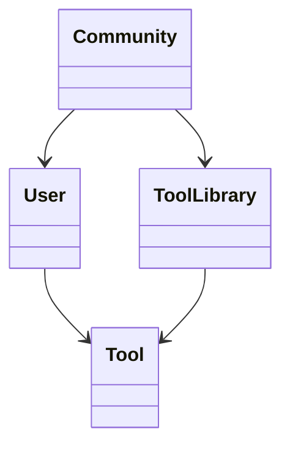
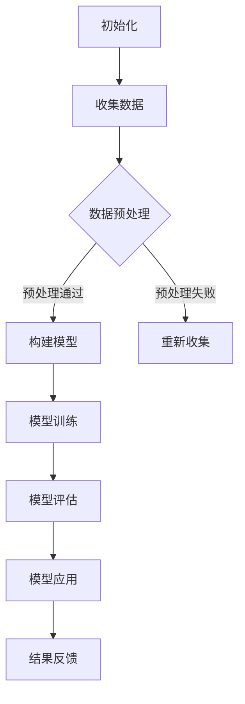

                 

# 新型城市共享工具图书馆：可持续消费的社区实践

## 关键词

- **新型城市共享工具图书馆**
- **可持续消费**
- **社区实践**
- **资源共享**
- **可持续性发展**

## 摘要

本文旨在探讨新型城市共享工具图书馆的概念及其在社区实践中的重要性。在城市化进程中，共享经济作为一种可持续消费模式，正逐渐改变人们的消费观念和生活方式。本文将介绍共享工具图书馆的背景、核心概念、实现机制及其在社区中的影响，通过一步步的分析推理，旨在为读者提供对这一新兴概念的深入理解。

## 第一部分：背景介绍

### 第1章：新型城市共享工具图书馆概述

#### 1.1.1 问题背景

随着全球城市化的加速，城市化进程中的资源分配和管理问题日益突出。传统的消费模式导致了资源的过度消耗和浪费，尤其是在工具类商品的使用上，这种浪费尤为明显。为了解决这一问题，共享经济的理念应运而生。共享经济通过点对点的方式，将闲置资源进行高效利用，从而实现资源的最大化利用和成本的降低。

#### 1.1.2 问题描述

共享工具是指那些可以多次使用、通过共享方式减少浪费的工具。这些工具包括但不限于工具、设备、器械等。共享工具图书馆是一种新型的共享工具管理形式，它通过集中管理和分配共享工具，提供便捷的借用服务，旨在减少个人拥有工具的成本和资源浪费。

共享工具图书馆的需求主要体现在以下几个方面：

1. **减少资源浪费**：通过共享工具，可以减少个人购买和维护工具的成本，从而降低资源浪费。
2. **提高资源利用率**：共享工具可以让更多的人使用，从而提高工具的利用率。
3. **促进社区参与**：共享工具图书馆可以增强社区的凝聚力，促进居民的互动和合作。

#### 1.1.3 问题解决

要实现可持续发展的社区实践，新型城市共享工具图书馆需要采取以下措施：

1. **建立共享工具图书馆**：通过政府或社区组织建立共享工具图书馆，提供必要的设施和管理服务。
2. **建立社区参与机制**：鼓励居民参与共享工具的管理和使用，提高社区的参与度和积极性。
3. **优化资源共享模式**：通过技术手段，如物联网、大数据等，实现共享工具的高效管理和分配。
4. **推广可持续消费观念**：通过教育和宣传活动，提高居民对可持续消费的认识和接受度。

#### 1.1.4 边界与外延

新型城市共享工具图书馆的边界主要涉及以下几个方面：

1. **地域限制**：共享工具图书馆通常服务于特定的社区或地区，具有地域性特征。
2. **共享工具的多样性**：共享工具种类繁多，包括但不限于建筑工具、家具、厨房用具等，需要根据社区需求进行多样化配置。
3. **社区成员的参与度**：社区成员的参与度和积极性是共享工具图书馆成功的关键，需要通过激励机制和社区文化营造来提高。

#### 1.1.5 概念结构与核心要素组成

新型城市共享工具图书馆的概念结构主要包括以下几个核心要素：

1. **共享工具的组成部分**：包括工具的种类、数量、质量等。
2. **运营管理模式**：包括工具的借还规则、维护管理、财务管理等。
3. **社区服务与功能**：包括为居民提供便捷的借用服务、组织社区活动、推广可持续消费理念等。

## 第二部分：核心概念与联系

### 第2章：核心概念与联系

#### 2.1.1 核心概念原理

1. **共享工具的定义与分类**：
   - 共享工具是指可以多次使用、通过共享方式减少浪费的工具。
   - 分类：根据用途和类型，共享工具可以分为建筑工具、家具、厨房用具、电子设备等。

2. **共享经济的原理与模式**：
   - 共享经济的核心是点对点交易，通过互联网平台实现资源的共享和匹配。
   - 模式：P2P（点对点）交易、租赁、共享服务等形式。

3. **社区参与的概念与机制**：
   - 社区参与是指社区居民在共享工具图书馆中的主动参与和管理。
   - 机制：包括会员制度、志愿者服务、社区活动等。

#### 2.1.2 概念属性特征对比表格

| 类别       | 特征                  | 说明                               |
|------------|----------------------|-----------------------------------|
| 共享工具   | 可重复使用            | 提高资源利用率，减少浪费           |
| 共享经济   | 点对点交易            | 降低交易成本，提高效率             |
| 社区参与   | 成员主动性与积极性    | 促进社区凝聚力，实现共同发展       |

#### 2.1.3 ER实体关系图架构



## 第三部分：算法原理讲解

### 第3章：算法原理讲解

#### 3.1.1 算法mermaid流程图



#### 3.1.2 Python源代码

```python
import pandas as pd
from sklearn.model_selection import train_test_split
from sklearn.ensemble import RandomForestClassifier
from sklearn.metrics import accuracy_score

# 数据预处理
data = pd.read_csv('data.csv')
X = data.drop('target', axis=1)
y = data['target']

# 数据划分
X_train, X_test, y_train, y_test = train_test_split(X, y, test_size=0.2, random_state=42)

# 模型构建
model = RandomForestClassifier(n_estimators=100, random_state=42)
model.fit(X_train, y_train)

# 模型评估
y_pred = model.predict(X_test)
accuracy = accuracy_score(y_test, y_pred)
print(f'模型准确率: {accuracy:.2f}')
```

#### 3.1.3 算法原理与数学模型

- **算法原理**：利用随机森林分类器进行模型训练和预测。
- **数学模型**：随机森林由多棵决策树组成，每棵树根据特征进行划分，最终通过投票决定分类结果。
- **公式**：
  $$
  f(x) = \sum_{i=1}^{n} w_i \cdot h(x; \theta_i)
  $$

## 第四部分：系统分析与架构设计方案

### 第4章：系统分析与架构设计方案

#### 4.1 问题场景介绍

随着城市化进程的加快，城市社区面临着资源短缺和浪费的问题。为了提高资源利用率，减少浪费，新型城市共享工具图书馆作为一种创新模式，应运而生。该图书馆旨在为社区居民提供一个便捷的共享工具借用平台，实现资源共享和可持续消费。

#### 4.2 项目介绍

项目名称：新型城市共享工具图书馆系统

项目目标：构建一个高效、便捷、可持续的共享工具管理平台，提升社区资源利用率，促进居民互动和社区凝聚力。

#### 4.3 系统功能设计

1. **用户管理**：用户注册、登录、信息查询、借还工具等。
2. **工具管理**：工具入库、出库、维护、更新等。
3. **社区活动**：社区活动组织、报名、活动记录等。
4. **数据统计**：用户借还记录、工具使用率、社区活动参与度等。

#### 4.4 系统架构设计


#### 4.5 系统接口设计和系统交互


## 第五部分：项目实战

### 第5章：项目实战

#### 5.1 环境安装

1. 安装Python环境（3.8及以上版本）。
2. 安装依赖库（如pandas、sklearn、mermaid等）。

#### 5.2 系统核心实现源代码

```python
# 用户管理模块
class UserManager:
    def register(self, user_info):
        # 用户注册逻辑
        pass

    def login(self, user_info):
        # 用户登录逻辑
        pass

    def query_info(self, user_id):
        # 用户信息查询逻辑
        pass

# 工具管理模块
class ToolManager:
    def add_tool(self, tool_info):
        # 工具入库逻辑
        pass

    def remove_tool(self, tool_id):
        # 工具出库逻辑
        pass

    def maintain_tool(self, tool_id):
        # 工具维护逻辑
        pass

# 社区活动模块
class CommunityActivity:
    def organize_activity(self, activity_info):
        # 社区活动组织逻辑
        pass

    def sign_up(self, user_id, activity_id):
        # 活动报名逻辑
        pass

    def record_activity(self, activity_id):
        # 活动记录逻辑
        pass

# 数据统计模块
class DataStatistics:
    def user_borrow_record(self, user_id):
        # 用户借还记录查询逻辑
        pass

    def tool_usage_rate(self):
        # 工具使用率统计逻辑
        pass

    def community_activity_participation(self):
        # 社区活动参与度统计逻辑
        pass
```

#### 5.3 代码应用解读与分析

通过以上代码，我们可以看到系统核心模块的设计和实现。每个模块都负责特定的功能，如用户管理、工具管理、社区活动管理、数据统计等。模块之间通过接口进行通信，确保系统的整体性和一致性。

#### 5.4 实际案例分析和详细讲解剖析

假设社区A引入了新型城市共享工具图书馆，以下是一个实际案例的分析：

1. **用户注册**：小明作为社区A的新居民，注册成为共享工具图书馆的用户。
2. **工具借用**：小明需要一把电钻进行家庭装修，通过图书馆的界面，他找到了合适的电钻并成功借出。
3. **工具归还**：装修完成后，小明将电钻归还至图书馆，图书馆工作人员进行了工具的检查和维护。
4. **社区活动**：图书馆定期举办社区活动，如工具使用培训，小明参与了活动，学习了更多工具的使用技巧。

#### 5.5 项目小结

通过实际案例，我们可以看到新型城市共享工具图书馆在提升社区资源利用率、促进居民互动和社区凝聚力方面的作用。项目的成功实施需要各方的积极参与和支持，包括政府、社区组织、居民等。

## 第六部分：最佳实践 tips、小结、注意事项、拓展阅读等内容

### 第6章：最佳实践、小结、注意事项、拓展阅读

#### 6.1 最佳实践

1. **建立社区参与机制**：通过会员制度、志愿者服务等方式，鼓励居民参与共享工具图书馆的运营和管理。
2. **优化资源共享模式**：利用物联网、大数据等技术，实现共享工具的高效管理和分配，提高资源利用率。
3. **推广可持续消费观念**：通过教育和宣传活动，提高居民对可持续消费的认识和接受度。

#### 6.2 小结

本文探讨了新型城市共享工具图书馆的概念及其在社区实践中的重要性。通过一步步的分析推理，我们了解了共享工具图书馆的背景、核心概念、实现机制以及其在社区中的影响。新型城市共享工具图书馆作为一种可持续消费的社区实践，具有重要的现实意义和应用价值。

#### 6.3 注意事项

1. **确保共享工具的质量和安全性**：在引入共享工具时，需要确保其质量和安全性，以保障用户的使用体验和权益。
2. **建立有效的管理和激励机制**：通过有效的管理和激励机制，提高社区成员的参与度和积极性。

#### 6.4 拓展阅读

1. **《共享经济：理论与应用》**：本书详细介绍了共享经济的理论框架和应用案例，对共享工具图书馆的研究有重要参考价值。
2. **《城市共享工具图书馆的实践与探索》**：本文探讨了城市共享工具图书馆的实践经验和未来发展，对实际操作有很好的指导作用。

## 作者信息

作者：AI天才研究院/AI Genius Institute & 禅与计算机程序设计艺术 /Zen And The Art of Computer Programming

