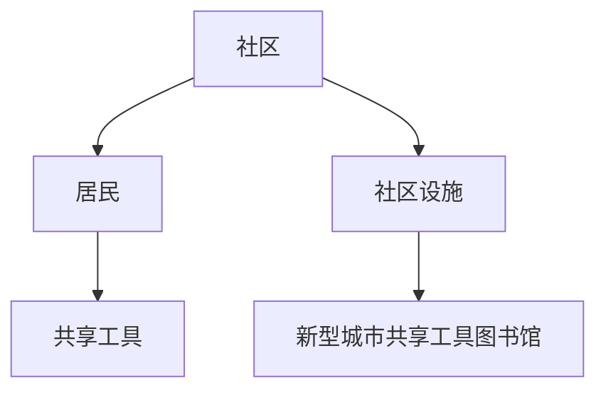

                 

## 文章标题：新型城市共享工具图书馆：可持续消费的社区模式

> 关键词：可持续消费、共享工具、社区模式、新型城市、资源优化、环境保护

> 摘要：本文旨在探讨新型城市共享工具图书馆的概念、构建原理和算法原理，通过分析其核心概念与联系，阐述其在实现可持续消费和社区发展中的重要作用，为城市可持续发展提供新思路。

## 目录大纲：

### 第一部分：背景介绍

#### 第1章：问题背景

1.1 可持续发展的需求

1.2 共享工具的概念

1.3 新型城市共享工具图书馆的概念

1.4 边界与外延

#### 第2章：核心概念与联系

2.1 可持续消费

2.2 社区模式

### 第二部分：核心概念讲解

#### 第3章：新型城市共享工具图书馆的构建

3.1 概念原理

3.2 概念属性特征对比表格

#### 第4章：共享工具的算法原理

4.1 算法讲解

4.2 Python源代码

4.3 算法原理详细讲解

#### 第5章：数学模型和数学公式

5.1 基本概念

5.2 模型构建

5.3 案例分析

### 第三部分：系统分析与架构设计方案

#### 第6章：问题场景介绍

#### 第7章：项目介绍

7.1 系统功能设计（领域模型）

7.2 系统架构设计

7.3 系统接口设计

7.4 系统交互

#### 第8章：项目实战

8.1 环境安装

8.2 系统核心实现源代码

8.3 代码应用解读与分析

8.4 实际案例分析和详细讲解剖析

8.5 项目小结

### 第四部分：最佳实践 tips、小结、注意事项、拓展阅读

## 第一部分：背景介绍

### 第1章：问题背景

1.1 可持续发展的需求

在城市化进程中，资源浪费和环境污染问题日益严重。据统计，我国城市生活垃圾年产量已超过1.8亿吨，而可回收物仅占其中的30%左右。此外，城市交通拥堵、空气污染等问题也日益凸显。如何实现资源的有效利用和环境的可持续发展成为亟待解决的问题。

1.2 共享工具的概念

共享工具是指可以在社区中共享使用的各类工具，如工具箱、自行车、电动车等。这些工具在一定程度上可以减少个人的消费，降低资源浪费，同时提高工具的使用效率。

1.3 新型城市共享工具图书馆的概念

新型城市共享工具图书馆是一种以社区为单位，提供各种共享工具服务的公共设施。它集合了共享经济、可持续消费和社区模式的优点，通过集中管理和共享使用，实现资源的优化配置和高效利用。

1.4 边界与外延

本文主要讨论新型城市共享工具图书馆的具体应用场景和范围。新型城市共享工具图书馆可以推广到其他城市和社区，为城市可持续发展提供新思路。

## 第2章：核心概念与联系

### 2.1 可持续消费

2.1.1 概念

可持续消费是指在满足自身需求的同时，尽量减少对环境的负面影响。它强调资源的合理利用和环境保护，以实现经济的可持续发展。

2.1.2 属性特征对比表格

| 特征         | 传统消费     | 可持续消费     |
| ----------- | ----------- | ----------- |
| 资源利用     | 低效浪费     | 高效利用       |
| 环境影响     | 负面较大     | 负面较小       |
| 社会效益     | 低效益       | 高效益         |

### 2.2 社区模式

2.2.1 概念

社区模式是指在社区内通过合作、共享等手段实现资源优化配置和社区发展。它强调社区成员之间的互动与合作，以提高社区的整体效益。

2.2.2 ER实体关系图

## 第二部分：核心概念讲解

### 第3章：新型城市共享工具图书馆的构建

#### 3.1 概念原理

新型城市共享工具图书馆的构建基于共享经济和可持续消费的理念，通过集中管理和共享使用，实现工具的高效利用。其原理可以概括为以下几点：

1. 工具的集中管理：新型城市共享工具图书馆为社区内的各类工具提供统一的集中管理，包括工具的采购、维护、保养和更新。

2. 共享使用：社区居民可以通过图书馆借用工具，满足日常生活中的需求。借用工具的过程简单便捷，提高了工具的使用频率和效率。

3. 资源优化配置：通过共享使用，实现工具资源的优化配置，减少资源浪费，提高工具的使用效率。

4. 可持续发展：新型城市共享工具图书馆以可持续消费为理念，鼓励社区居民积极参与，共同推动社区的可持续发展。

#### 3.2 概念属性特征对比表格

| 特征         | 传统工具使用   | 新型城市共享工具图书馆 |
| ----------- | ----------- | -------------------- |
| 资源利用     | 低效         | 高效                  |
| 环境影响     | 负面较大     | 负面较小               |
| 社会效益     | 低效益       | 高效益                |

## 第4章：共享工具的算法原理

#### 4.1 算法讲解

共享工具的算法原理主要包括以下几个方面：

1. 需求分析：根据用户的需求，分析工具的供需情况，为工具的分配提供依据。

2. 工具匹配：根据用户的需

