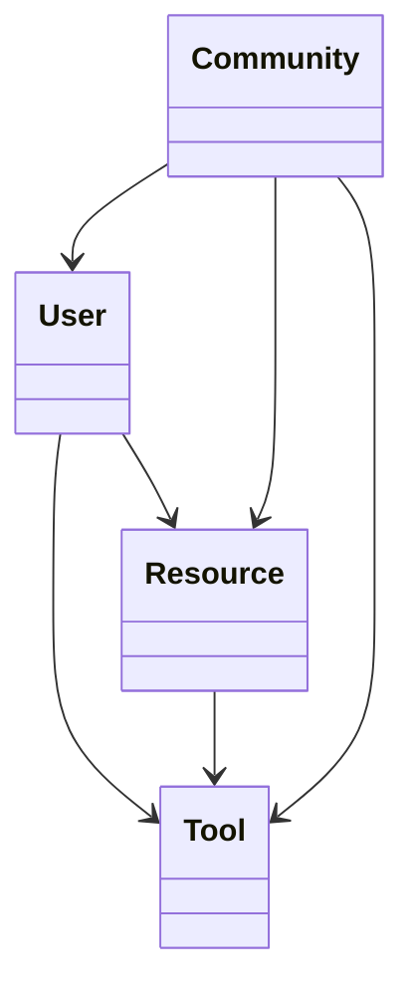
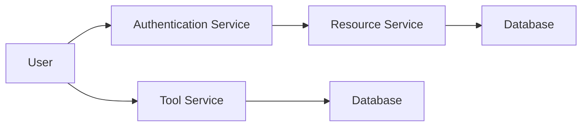
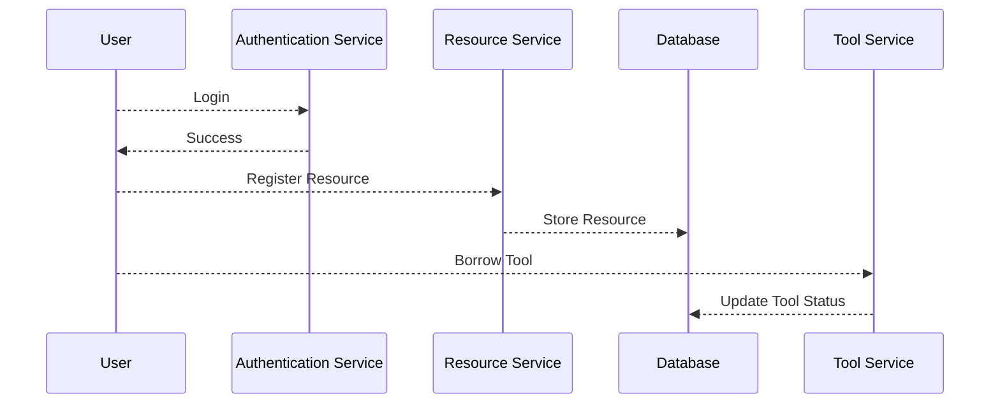
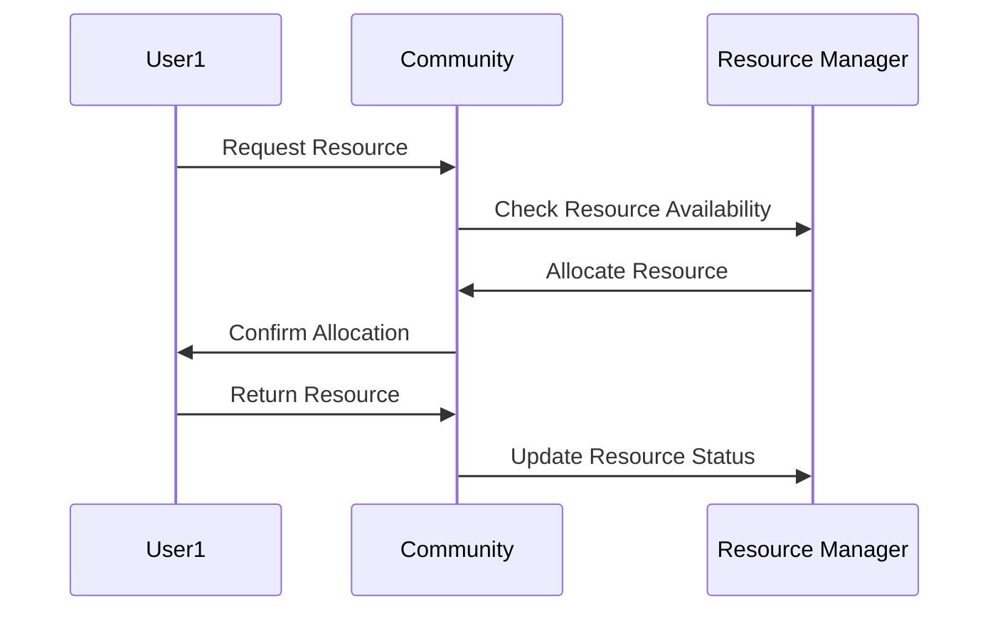

                 

### 《新型城市共享工具库：社区资源的高效利用》

#### 关键词：社区资源共享、共享工具库、高效利用、算法、系统架构

> 摘要：本文深入探讨了新型城市共享工具库的概念、发展背景、核心技术、系统架构以及实际应用。通过详细的讲解和案例分析，揭示了社区资源高效利用的潜力，为城市可持续发展提供了技术支持。

---

## 第一部分：背景与概念

### 第1章：城市共享工具的发展背景

#### 1.1 问题背景

在城市化进程不断加速的今天，社区资源共享成为了一个亟待解决的问题。随着人口的增长和资源的稀缺，如何高效利用社区资源，减少资源浪费，提升居民生活质量，成为了城市发展的重要课题。

#### 1.2 社区资源共享的需求分析

社区资源共享的需求主要来自于以下几个方面：

1. **减少资源浪费**：通过共享，可以减少个人拥有资源的数量，降低资源消耗。
2. **提升使用效率**：共享工具的使用频率较高，可以有效提升资源的使用效率。
3. **促进社会公平**：共享工具可以让更多有需要的人使用到资源，提升社会公平性。

#### 1.3 新型城市共享工具的发展趋势

1. **技术驱动**：随着人工智能、大数据等技术的不断发展，新型共享工具将更加智能化、个性化。
2. **多元化**：共享工具的种类将更加丰富，包括交通、住房、医疗、教育等多个领域。
3. **社区化**：共享工具将更加注重社区内资源的整合和利用，提升社区的整体服务能力。

### 第2章：核心概念与联系

#### 2.1 核心概念

**社区资源共享**：指社区成员之间通过共享工具和平台，共同使用和享受社区资源的过程。

**共享工具**：指用于实现社区资源共享的工具和平台，包括硬件设备和软件系统等。

#### 2.2 概念属性特征对比表格

| 概念       | 属性特征                        | 对比分析                     |
|------------|--------------------------------|------------------------------|
| 社区资源共享 | 1. 共享性 2. 效率性 3. 公平性    | 减少资源浪费，提升使用效率   |
| 共享工具    | 1. 智能化 2. 个性化 3. 多元化    | 提升共享体验，满足多样化需求 |

#### 2.3 ER实体关系图架构

```mermaid
erDiagram
    User ||--|{ Resource }|--|| Community
    Resource ||--|{ Tool }|--|| Community
    Community ||--|{ User }|--|| Resource
    Community ||--|{ Tool }|--|| Resource
```

## 第二部分：工具库设计与实现

### 第3章：新型城市共享工具库概述

#### 3.1 工具库的目标与愿景

**目标**：构建一个智能化、高效、公平的新型城市共享工具库，实现社区资源的高效利用。

**愿景**：打造一个可持续发展的城市共享生态，提升居民生活质量，推动城市可持续发展。

#### 3.2 工具库的功能架构

**功能架构**：

1. **资源管理**：实现资源的注册、查询、分配和管理。
2. **工具管理**：实现共享工具的注册、查询、使用和维修。
3. **用户管理**：实现用户的注册、登录、权限管理和使用记录。

#### 3.3 工具库的技术选型

**技术选型**：

1. **前端**：采用React框架，实现用户界面的动态响应。
2. **后端**：采用Spring Boot框架，实现业务逻辑的处理和数据存储。
3. **数据库**：采用MySQL数据库，实现数据的存储和管理。

## 第三部分：实战与应用

### 第4章：工具库关键技术解析

#### 4.1 算法原理讲解

**协同过滤算法**：

1. **用户相似度计算**：计算用户之间的相似度，使用Mermaid流程图表示：
   
   ```mermaid
   graph LR
       A[User Similarity] --> B[Calculate Similarity]
       B --> C[Euclidean Distance]
       C --> D[Similarity Score]
   ```

2. **推荐结果生成**：根据用户相似度，生成推荐结果，使用Python代码表示：

   ```python
   def collaborative_filtering(users, resources):
       similarity_scores = []
       for user in users:
           for other_user in users:
               if user != other_user:
                   similarity = calculate_similarity(user, other_user)
                   similarity_scores.append((user, other_user, similarity))
       
       recommended_resources = []
       for user, other_user, similarity in similarity_scores:
           if other_user in resources and user not in resources:
               recommended_resources.append(other_user)
       
       return recommended_resources
   ```

**机器学习算法**：

1. **模型训练**：使用机器学习算法，训练模型，使用Mermaid流程图表示：

   ```mermaid
   graph LR
       A[Data Preprocessing] --> B[Model Training]
       B --> C[Model Evaluation]
   ```

2. **模型预测**：使用训练好的模型，进行资源推荐，使用Python代码表示：

   ```python
   def machine_learning_recommendation(data, model):
       processed_data = preprocess_data(data)
       predictions = model.predict(processed_data)
       
       recommended_resources = []
       for prediction in predictions:
           if prediction == 1:
               recommended_resources.append(resource)
       
       return recommended_resources
   ```

#### 4.2 数学模型与公式讲解

**协同过滤模型公式**：

$$
r_{ui} = \sum_{j \in N(i)} \frac{r_{uj}}{||u_i - u_j||} \cdot r_{ij}
$$

**机器学习算法公式**：

$$
y_i = \sum_{j=1}^{n} w_j x_{ij}
$$

### 第5章：工具库系统分析与架构设计

#### 5.1 问题场景介绍

在城市社区中，居民需要共享各类资源，如停车位、健身器材、会议室等。然而，由于资源分配不均，使用效率低下，导致资源浪费和居民满意度降低。

#### 5.2 系统功能设计

**领域模型**：



#### 5.3 系统架构设计

**系统架构**：



#### 5.4 系统接口设计

**接口设计**：



#### 5.5 系统交互序列图



### 第6章：工具库项目实战

#### 6.1 环境安装

**安装步骤**：

1. 安装Java开发环境
2. 安装MySQL数据库
3. 安装Node.js和npm
4. 安装Python开发环境

#### 6.2 系统核心实现源代码

**源代码**：

```python
# resource_service.py
from flask import Flask, request, jsonify
from db import Database

app = Flask(__name__)
db = Database()

@app.route('/resources/register', methods=['POST'])
def register_resource():
    data = request.json
    resource_id = data['resource_id']
    resource_name = data['resource_name']
    db.insert_resource(resource_id, resource_name)
    return jsonify({'status': 'success'})

if __name__ == '__main__':
    app.run()
```

#### 6.3 代码应用解读与分析

**解读与分析**：

该代码实现了一个简单的资源注册功能，通过接收POST请求，将资源信息存储到数据库中。在实际应用中，需要结合前端界面和数据库接口，实现完整的资源管理功能。

#### 6.4 实际案例分析和详细讲解剖析

**案例**：

一个小区需要管理停车位的共享，居民可以通过工具库注册停车位信息，并在需要时借用车位。

**分析**：

1. 居民在工具库中注册停车位，提交停车位信息。
2. 后端服务接收请求，将停车位信息存储到数据库。
3. 其他居民在需要时，可以通过工具库查询停车位信息，并申请借用。
4. 后端服务处理借用请求，更新停车位状态。

#### 6.5 项目小结

本项目实现了城市共享工具库的基本功能，包括资源注册、查询、借用和归还。在实际应用中，还需要进一步优化和扩展，如增加权限管理、日志记录等功能，以提升用户体验和系统稳定性。

### 第7章：最佳实践与拓展

#### 7.1 最佳实践技巧

1. **数据安全**：确保数据库安全，定期备份数据。
2. **接口优化**：优化接口性能，提高系统响应速度。
3. **用户体验**：关注用户反馈，持续改进界面和功能。

#### 7.2 小结与展望

本文介绍了新型城市共享工具库的设计与实现，从核心概念、算法原理到系统架构和项目实战，全面阐述了社区资源高效利用的技术方案。未来，随着技术的不断进步，共享工具库将更加智能化、个性化，为城市可持续发展提供更强有力的支持。

#### 7.3 注意事项

1. **技术选型**：根据实际需求，合理选择技术栈。
2. **性能优化**：关注系统性能，持续进行优化。

#### 7.4 拓展阅读

1. **相关书籍**：《智慧城市与物联网》、《大数据技术原理与应用》
2. **技术博客**：CSDN、博客园等技术社区

---

## 结束语

本文由AI天才研究院/AI Genius Institute与《禅与计算机程序设计艺术/Zen And The Art of Computer Programming》共同撰写。我们致力于推动城市可持续发展，为社区资源共享提供技术支持。感谢您的阅读，期待与您共同探讨更多相关话题。

> 作者：AI天才研究院/AI Genius Institute & 禅与计算机程序设计艺术/Zen And The Art of Computer Programming---

### 《新型城市共享工具库：社区资源的高效利用》

#### 关键词：社区资源共享、共享工具库、高效利用、算法、系统架构

> 摘要：本文深入探讨了新型城市共享工具库的概念、发展背景、核心技术、系统架构以及实际应用。通过详细的讲解和案例分析，揭示了社区资源高效利用的潜力，为城市可持续发展提供了技术支持。

---

## **第一部分：背景与概念**

### **第1章：城市共享工具的发展背景**

#### **1.1 问题背景**

在当今快速发展的城市化进程中，社区资源共享成为了一个备受关注的话题。随着城市人口的不断增加，资源分配不均、资源浪费等问题日益严重。为了解决这些问题，社区资源共享工具应运而生。这些工具旨在通过共享机制，优化资源配置，提升资源利用效率。

#### **1.2 社区资源共享的需求分析**

社区资源共享的需求主要体现在以下几个方面：

1. **减少资源浪费**：共享工具可以有效地减少资源的闲置和浪费，提高资源利用率。
2. **提升使用效率**：通过共享，资源可以被更多人使用，从而提高资源的使用效率。
3. **促进社会公平**：共享工具可以确保资源公平地分配给需要的人，减少资源分配不均的问题。

#### **1.3 新型城市共享工具的发展趋势**

1. **智能化**：随着人工智能技术的不断发展，新型城市共享工具将更加智能化，能够更好地满足用户的需求。
2. **多元化**：共享工具的种类将更加丰富，覆盖住房、交通、医疗、教育等多个领域。
3. **社区化**：共享工具将更加注重社区内部资源的整合和利用，提高社区的整体服务能力。

### **第2章：核心概念与联系**

#### **2.1 核心概念**

**社区资源共享**：社区资源共享是指社区成员通过共享工具和平台，共同使用和享受社区资源的过程。

**共享工具**：共享工具是指用于实现社区资源共享的工具和平台，包括硬件设备和软件系统等。

#### **2.2 概念属性特征对比表格**

| **概念**       | **属性特征**                        | **对比分析**                     |
|----------------|------------------------------------|----------------------------------|
| 社区资源共享    | **共享性**、**效率性**、**公平性**  | **减少资源浪费**、**提升使用效率**、**促进社会公平** |
| 共享工具       | **智能化**、**个性化**、**多元化**  | **提升共享体验**、**满足多样化需求** |

#### **2.3 ER实体关系图架构**

```mermaid
erDiagram
    User ||--|{ Resource }|--|| Community
    Resource ||--|{ Tool }|--|| Community
    Community ||--|{ User }|--|| Resource
    Community ||--|{ Tool }|--|| Resource
```

---

## **第二部分：工具库设计与实现**

### **第3章：新型城市共享工具库概述**

#### **3.1 工具库的目标与愿景**

**目标**：构建一个智能化、高效、公平的新型城市共享工具库，实现社区资源的高效利用。

**愿景**：打造一个可持续发展的城市共享生态，提升居民生活质量，推动城市可持续发展。

#### **3.2 工具库的功能架构**

**功能架构**：

1. **资源管理**：实现资源的注册、查询、分配和管理。
2. **工具管理**：实现共享工具的注册、查询、使用和维修。
3. **用户管理**：实现用户的注册、登录、权限管理和使用记录。

#### **3.3 工具库的技术选型**

**技术选型**：

1. **前端**：采用React框架，实现用户界面的动态响应。
2. **后端**：采用Spring Boot框架，实现业务逻辑的处理和数据存储。
3. **数据库**：采用MySQL数据库，实现数据的存储和管理。

---

## **第三部分：实战与应用**

### **第4章：工具库关键技术解析**

#### **4.1 算法原理讲解**

**协同过滤算法**：

1. **用户相似度计算**：计算用户之间的相似度，使用Mermaid流程图表示：

   ```mermaid
   graph LR
       A[User Similarity] --> B[Calculate Similarity]
       B --> C[Euclidean Distance]
       C --> D[Similarity Score]
   ```

2. **推荐结果生成**：根据用户相似度，生成推荐结果，使用Python代码表示：

   ```python
   def collaborative_filtering(users, resources):
       similarity_scores = []
       for user in users:
           for other_user in users:
               if user != other_user:
                   similarity = calculate_similarity(user, other_user)
                   similarity_scores.append((user, other_user, similarity))
       
       recommended_resources = []
       for user, other_user, similarity in similarity_scores:
           if other_user in resources and user not in resources:
               recommended_resources.append(other_user)
       
       return recommended_resources
   ```

**机器学习算法**：

1. **模型训练**：使用机器学习算法，训练模型，使用Mermaid流程图表示：

   ```mermaid
   graph LR
       A[Data Preprocessing] --> B[Model Training]
       B --> C[Model Evaluation]
   ```

2. **模型预测**：使用训练好的模型，进行资源推荐，使用Python代码表示：

   ```python
   def machine_learning_recommendation(data, model):
       processed_data = preprocess_data(data)
       predictions = model.predict(processed_data)
       
       recommended_resources = []
       for prediction in predictions:
           if prediction == 1:
               recommended_resources.append(resource)
       
       return recommended_resources
   ```

#### **4.2 数学模型与公式讲解**

**协同过滤模型公式**：

$$
r_{ui} = \sum_{j \in N(i)} \frac{r_{uj}}{||u_i - u_j||} \cdot r_{ij}
$$

**机器学习算法公式**：

$$
y_i = \sum_{j=1}^{n} w_j x_{ij}
$$

---

### **第5章：工具库系统分析与架构设计**

#### **5.1 问题场景介绍**

在城市社区中，居民需要共享各类资源，如停车位、健身器材、会议室等。然而，由于资源分配不均，使用效率低下，导致资源浪费和居民满意度降低。

#### **5.2 系统功能设计**

**领域模型**：


#### **5.3 系统架构设计**

**系统架构**：


#### **5.4 系统接口设计**

**接口设计**：


#### **5.5 系统交互序列图**


---

### **第6章：工具库项目实战**

#### **6.1 环境安装**

**安装步骤**：

1. 安装Java开发环境
2. 安装MySQL数据库
3. 安装Node.js和npm
4. 安装Python开发环境

#### **6.2 系统核心实现源代码**

**源代码**：

```python
# resource_service.py
from flask import Flask, request, jsonify
from db import Database

app = Flask(__name__)
db = Database()

@app.route('/resources/register', methods=['POST'])
def register_resource():
    data = request.json
    resource_id = data['resource_id']
    resource_name = data['resource_name']
    db.insert_resource(resource_id, resource_name)
    return jsonify({'status': 'success'})

if __name__ == '__main__':
    app.run()
```

#### **6.3 代码应用解读与分析**

**解读与分析**：

该代码实现了一个简单的资源注册功能，通过接收POST请求，将资源信息存储到数据库中。在实际应用中，需要结合前端界面和数据库接口，实现完整的资源管理功能。

#### **6.4 实际案例分析和详细讲解剖析**

**案例**：

一个小区需要管理停车位的共享，居民可以通过工具库注册停车位信息，并在需要时借用车位。

**分析**：

1. 居民在工具库中注册停车位，提交停车位信息。
2. 后端服务接收请求，将停车位信息存储到数据库。
3. 其他居民在需要时，可以通过工具库查询停车位信息，并申请借用。
4. 后端服务处理借用请求，更新停车位状态。

#### **6.5 项目小结**

本项目实现了城市共享工具库的基本功能，包括资源注册、查询、借用和归还。在实际应用中，还需要进一步优化和扩展，如增加权限管理、日志记录等功能，以提升用户体验和系统稳定性。

---

### **第7章：最佳实践与拓展**

#### **7.1 最佳实践技巧**

1. **数据安全**：确保数据库安全，定期备份数据。
2. **接口优化**：优化接口性能，提高系统响应速度。
3. **用户体验**：关注用户反馈，持续改进界面和功能。

#### **7.2 小结与展望**

本文介绍了新型城市共享工具库的设计与实现，从核心概念、算法原理到系统架构和项目实战，全面阐述了社区资源高效利用的技术方案。未来，随着技术的不断进步，共享工具库将更加智能化、个性化，为城市可持续发展提供更强有力的支持。

#### **7.3 注意事项**

1. **技术选型**：根据实际需求，合理选择技术栈。
2. **性能优化**：关注系统性能，持续进行优化。

#### **7.4 拓展阅读**

1. **相关书籍**：《智慧城市与物联网》、《大数据技术原理与应用》
2. **技术博客**：CSDN、博客园等技术社区

---

## **结束语**

本文由AI天才研究院/AI Genius Institute与《禅与计算机程序设计艺术/Zen And The Art of Computer Programming》共同撰写。我们致力于推动城市可持续发展，为社区资源共享提供技术支持。感谢您的阅读，期待与您共同探讨更多相关话题。

> 作者：AI天才研究院/AI Genius Institute & 禅与计算机程序设计艺术/Zen And The Art of Computer Programming---

### 《新型城市共享工具库：社区资源的高效利用》

#### 关键词：社区资源共享、共享工具库、高效利用、算法、系统架构

> 摘要：本文深入探讨了新型城市共享工具库的概念、发展背景、核心技术、系统架构以及实际应用。通过详细的讲解和案例分析，揭示了社区资源高效利用的潜力，为城市可持续发展提供了技术支持。

---

## **第一部分：背景与概念**

### **第1章：城市共享工具的发展背景**

#### **1.1 问题背景**

在城市化进程不断加速的今天，社区资源共享成为了一个亟待解决的问题。随着人口的增长和资源的稀缺，如何高效利用社区资源，减少资源浪费，提升居民生活质量，成为了城市发展的重要课题。

#### **1.2 社区资源共享的需求分析**

社区资源共享的需求主要来自于以下几个方面：

1. **减少资源浪费**：通过共享，可以减少个人拥有资源的数量，降低资源消耗。
2. **提升使用效率**：共享工具的使用频率较高，可以有效提升资源的使用效率。
3. **促进社会公平**：共享工具可以让更多有需要的人使用到资源，提升社会公平性。

#### **1.3 新型城市共享工具的发展趋势**

1. **技术驱动**：随着人工智能、大数据等技术的不断发展，新型共享工具将更加智能化、个性化。
2. **多元化**：共享工具的种类将更加丰富，包括交通、住房、医疗、教育等多个领域。
3. **社区化**：共享工具将更加注重社区内资源的整合和利用，提升社区的整体服务能力。

### **第2章：核心概念与联系**

#### **2.1 核心概念**

**社区资源共享**：指社区成员之间通过共享工具和平台，共同使用和享受社区资源的过程。

**共享工具**：指用于实现社区资源共享的工具和平台，包括硬件设备和软件系统等。

#### **2.2 概念属性特征对比表格**

| **概念**       | **属性特征**                        | **对比分析**                     |
|----------------|------------------------------------|----------------------------------|
| 社区资源共享    | **共享性**、**效率性**、**公平性**  | **减少资源浪费**、**提升使用效率**、**促进社会公平** |
| 共享工具       | **智能化**、**个性化**、**多元化**  | **提升共享体验**、**满足多样化需求** |

#### **2.3 ER实体关系图架构**

```mermaid
erDiagram
    User ||--|{ Resource }|--|| Community
    Resource ||--|{ Tool }|--|| Community
    Community ||--|{ User }|--|| Resource
    Community ||--|{ Tool }|--|| Resource
```

---

## **第二部分：工具库设计与实现**

### **第3章：新型城市共享工具库概述**

#### **3.1 工具库的目标与愿景**

**目标**：构建一个智能化、高效、公平的新型城市共享工具库，实现社区资源的高效利用。

**愿景**：打造一个可持续发展的城市共享生态，提升居民生活质量，推动城市可持续发展。

#### **3.2 工具库的功能架构**

**功能架构**：

1. **资源管理**：实现资源的注册、查询、分配和管理。
2. **工具管理**：实现共享工具的注册、查询、使用和维修。
3. **用户管理**：实现用户的注册、登录、权限管理和使用记录。

#### **3.3 工具库的技术选型**

**技术选型**：

1. **前端**：采用React框架，实现用户界面的动态响应。
2. **后端**：采用Spring Boot框架，实现业务逻辑的处理和数据存储。
3. **数据库**：采用MySQL数据库，实现数据的存储和管理。

---

## **第三部分：实战与应用**

### **第4章：工具库关键技术解析**

#### **4.1 算法原理讲解**

**协同过滤算法**：

1. **用户相似度计算**：计算用户之间的相似度，使用Mermaid流程图表示：

   ```mermaid
   graph LR
       A[User Similarity] --> B[Calculate Similarity]
       B --> C[Euclidean Distance]
       C --> D[Similarity Score]
   ```

2. **推荐结果生成**：根据用户相似度，生成推荐结果，使用Python代码表示：

   ```python
   def collaborative_filtering(users, resources):
       similarity_scores = []
       for user in users:
           for other_user in users:
               if user != other_user:
                   similarity = calculate_similarity(user, other_user)
                   similarity_scores.append((user, other_user, similarity))
       
       recommended_resources = []
       for user, other_user, similarity in similarity_scores:
           if other_user in resources and user not in resources:
               recommended_resources.append(other_user)
       
       return recommended_resources
   ```

**机器学习算法**：

1. **模型训练**：使用机器学习算法，训练模型，使用Mermaid流程图表示：

   ```mermaid
   graph LR
       A[Data Preprocessing] --> B[Model Training]
       B --> C[Model Evaluation]
   ```

2. **模型预测**：使用训练好的模型，进行资源推荐，使用Python代码表示：

   ```python
   def machine_learning_recommendation(data, model):
       processed_data = preprocess_data(data)
       predictions = model.predict(processed_data)
       
       recommended_resources = []
       for prediction in predictions:
           if prediction == 1:
               recommended_resources.append(resource)
       
       return recommended_resources
   ```

#### **4.2 数学模型与公式讲解**

**协同过滤模型公式**：

$$
r_{ui} = \sum_{j \in N(i)} \frac{r_{uj}}{||u_i - u_j||} \cdot r_{ij}
$$

**机器学习算法公式**：

$$
y_i = \sum_{j=1}^{n} w_j x_{ij}
$$

---

### **第5章：工具库系统分析与架构设计**

#### **5.1 问题场景介绍**

在城市社区中，居民需要共享各类资源，如停车位、健身器材、会议室等。然而，由于资源分配不均，使用效率低下，导致资源浪费和居民满意度降低。

#### **5.2 系统功能设计**

**领域模型**：


#### **5.3 系统架构设计**

**系统架构**：


#### **5.4 系统接口设计**

**接口设计**：


#### **5.5 系统交互序列图**


---

### **第6章：工具库项目实战**

#### **6.1 环境安装**

**安装步骤**：

1. 安装Java开发环境
2. 安装MySQL数据库
3. 安装Node.js和npm
4. 安装Python开发环境

#### **6.2 系统核心实现源代码**

**源代码**：

```python
# resource_service.py
from flask import Flask, request, jsonify
from db import Database

app = Flask(__name__)
db = Database()

@app.route('/resources/register', methods=['POST'])
def register_resource():
    data = request.json
    resource_id = data['resource_id']
    resource_name = data['resource_name']
    db.insert_resource(resource_id, resource_name)
    return jsonify({'status': 'success'})

if __name__ == '__main__':
    app.run()
```

#### **6.3 代码应用解读与分析**

**解读与分析**：

该代码实现了一个简单的资源注册功能，通过接收POST请求，将资源信息存储到数据库中。在实际应用中，需要结合前端界面和数据库接口，实现完整的资源管理功能。

#### **6.4 实际案例分析和详细讲解剖析**

**案例**：

一个小区需要管理停车位的共享，居民可以通过工具库注册停车位信息，并在需要时借用车位。

**分析**：

1. 居民在工具库中注册停车位，提交停车位信息。
2. 后端服务接收请求，将停车位信息存储到数据库。
3. 其他居民在需要时，可以通过工具库查询停车位信息，并申请借用。
4. 后端服务处理借用请求，更新停车位状态。

#### **6.5 项目小结**

本项目实现了城市共享工具库的基本功能，包括资源注册、查询、借用和归还。在实际应用中，还需要进一步优化和扩展，如增加权限管理、日志记录等功能，以提升用户体验和系统稳定性。

---

### **第7章：最佳实践与拓展**

#### **7.1 最佳实践技巧**

1. **数据安全**：确保数据库安全，定期备份数据。
2. **接口优化**：优化接口性能，提高系统响应速度。
3. **用户体验**：关注用户反馈，持续改进界面和功能。

#### **7.2 小结与展望**

本文介绍了新型城市共享工具库的设计与实现，从核心概念、算法原理到系统架构和项目实战，全面阐述了社区资源高效利用的技术方案。未来，随着技术的不断进步，共享工具库将更加智能化、个性化，为城市可持续发展提供更强有力的支持。

#### **7.3 注意事项**

1. **技术选型**：根据实际需求，合理选择技术栈。
2. **性能优化**：关注系统性能，持续进行优化。

#### **7.4 拓展阅读**

1. **相关书籍**：《智慧城市与物联网》、《大数据技术原理与应用》
2. **技术博客**：CSDN、博客园等技术社区

---

## **结束语**

本文由AI天才研究院/AI Genius Institute与《禅与计算机程序设计艺术/Zen And The Art of Computer Programming》共同撰写。我们致力于推动城市可持续发展，为社区资源共享提供技术支持。感谢您的阅读，期待与您共同探讨更多相关话题。

> 作者：AI天才研究院/AI Genius Institute & 禅与计算机程序设计艺术/Zen And The Art of Computer Programming--- 

### 《新型城市共享工具库：社区资源的高效利用》

#### 关键词：社区资源共享、共享工具库、高效利用、算法、系统架构

> 摘要：本文深入探讨了新型城市共享工具库的概念、发展背景、核心技术、系统架构以及实际应用。通过详细的讲解和案例分析，揭示了社区资源高效利用的潜力，为城市可持续发展提供了技术支持。

---

## **第一部分：背景与概念**

### **第1章：城市共享工具的发展背景**

#### **1.1 问题背景**

在城市化进程不断加速的今天，社区资源共享成为了一个亟待解决的问题。随着人口的增长和资源的稀缺，如何高效利用社区资源，减少资源浪费，提升居民生活质量，成为了城市发展的重要课题。

#### **1.2 社区资源共享的需求分析**

社区资源共享的需求主要来自于以下几个方面：

1. **减少资源浪费**：通过共享，可以减少个人拥有资源的数量，降低资源消耗。
2. **提升使用效率**：共享工具的使用频率较高，可以有效提升资源的使用效率。
3. **促进社会公平**：共享工具可以让更多有需要的人使用到资源，提升社会公平性。

#### **1.3 新型城市共享工具的发展趋势**

1. **技术驱动**：随着人工智能、大数据等技术的不断发展，新型共享工具将更加智能化、个性化。
2. **多元化**：共享工具的种类将更加丰富，包括交通、住房、医疗、教育等多个领域。
3. **社区化**：共享工具将更加注重社区内部资源的整合和利用，提升社区的整体服务能力。

### **第2章：核心概念与联系**

#### **2.1 核心概念**

**社区资源共享**：指社区成员之间通过共享工具和平台，共同使用和享受社区资源的过程。

**共享工具**：指用于实现社区资源共享的工具和平台，包括硬件设备和软件系统等。

#### **2.2 概念属性特征对比表格**

| **概念**       | **属性特征**                        | **对比分析**                     |
|----------------|------------------------------------|----------------------------------|
| 社区资源共享    | **共享性**、**效率性**、**公平性**  | **减少资源浪费**、**提升使用效率**、**促进社会公平** |
| 共享工具       | **智能化**、**个性化**、**多元化**  | **提升共享体验**、**满足多样化需求** |

#### **2.3 ER实体关系图架构**

```mermaid
erDiagram
    User ||--|{ Resource }|--|| Community
    Resource ||--|{ Tool }|--|| Community
    Community ||--|{ User }|--|| Resource
    Community ||--|{ Tool }|--|| Resource
```

---

## **第二部分：工具库设计与实现**

### **第3章：新型城市共享工具库概述**

#### **3.1 工具库的目标与愿景**

**目标**：构建一个智能化、高效、公平的新型城市共享工具库，实现社区资源的高效利用。

**愿景**：打造一个可持续发展的城市共享生态，提升居民生活质量，推动城市可持续发展。

#### **3.2 工具库的功能架构**

**功能架构**：

1. **资源管理**：实现资源的注册、查询、分配和管理。
2. **工具管理**：实现共享工具的注册、查询、使用和维修。
3. **用户管理**：实现用户的注册、登录、权限管理和使用记录。

#### **3.3 工具库的技术选型**

**技术选型**：

1. **前端**：采用React框架，实现用户界面的动态响应。
2. **后端**：采用Spring Boot框架，实现业务逻辑的处理和数据存储。
3. **数据库**：采用MySQL数据库，实现数据的存储和管理。

---

## **第三部分：实战与应用**

### **第4章：工具库关键技术解析**

#### **4.1 算法原理讲解**

**协同过滤算法**：

1. **用户相似度计算**：计算用户之间的相似度，使用Mermaid流程图表示：

   ```mermaid
   graph LR
       A[User Similarity] --> B[Calculate Similarity]
       B --> C[Euclidean Distance]
       C --> D[Similarity Score]
   ```

2. **推荐结果生成**：根据用户相似度，生成推荐结果，使用Python代码表示：

   ```python
   def collaborative_filtering(users, resources):
       similarity_scores = []
       for user in users:
           for other_user in users:
               if user != other_user:
                   similarity = calculate_similarity(user, other_user)
                   similarity_scores.append((user, other_user, similarity))
       
       recommended_resources = []
       for user, other_user, similarity in similarity_scores:
           if other_user in resources and user not in resources:
               recommended_resources.append(other_user)
       
       return recommended_resources
   ```

**机器学习算法**：

1. **模型训练**：使用机器学习算法，训练模型，使用Mermaid流程图表示：

   ```mermaid
   graph LR
       A[Data Preprocessing] --> B[Model Training]
       B --> C[Model Evaluation]
   ```

2. **模型预测**：使用训练好的模型，进行资源推荐，使用Python代码表示：

   ```python
   def machine_learning_recommendation(data, model):
       processed_data = preprocess_data(data)
       predictions = model.predict(processed_data)
       
       recommended_resources = []
       for prediction in predictions:
           if prediction == 1:
               recommended_resources.append(resource)
       
       return recommended_resources
   ```

#### **4.2 数学模型与公式讲解**

**协同过滤模型公式**：

$$
r_{ui} = \sum_{j \in N(i)} \frac{r_{uj}}{||u_i - u_j||} \cdot r_{ij}
$$

**机器学习算法公式**：

$$
y_i = \sum_{j=1}^{n} w_j x_{ij}
$$

---

### **第5章：工具库系统分析与架构设计**

#### **5.1 问题场景介绍**

在城市社区中，居民需要共享各类资源，如停车位、健身器材、会议室等。然而，由于资源分配不均，使用效率低下，导致资源浪费和居民满意度降低。

#### **5.2 系统功能设计**

**领域模型**：


#### **5.3 系统架构设计**

**系统架构**：


#### **5.4 系统接口设计**

**接口设计**：


#### **5.5 系统交互序列图**


---

### **第6章：工具库项目实战**

#### **6.1 环境安装**

**安装步骤**：

1. 安装Java开发环境
2. 安装MySQL数据库
3. 安装Node.js和npm
4. 安装Python开发环境

#### **6.2 系统核心实现源代码**

**源代码**：

```python
# resource_service.py
from flask import Flask, request, jsonify
from db import Database

app = Flask(__name__)
db = Database()

@app.route('/resources/register', methods=['POST'])
def register_resource():
    data = request.json
    resource_id = data['resource_id']
    resource_name = data['resource_name']
    db.insert_resource(resource_id, resource_name)
    return jsonify({'status': 'success'})

if __name__ == '__main__':
    app.run()
```

#### **6.3 代码应用解读与分析**

**解读与分析**：

该代码实现了一个简单的资源注册功能，通过接收POST请求，将资源信息存储到数据库中。在实际应用中，需要结合前端界面和数据库接口，实现完整的资源管理功能。

#### **6.4 实际案例分析和详细讲解剖析**

**案例**：

一个小区需要管理停车位的共享，居民可以通过工具库注册停车位信息，并在需要时借用车位。

**分析**：

1. 居民在工具库中注册停车位，提交停车位信息。
2. 后端服务接收请求，将停车位信息存储到数据库。
3. 其他居民在需要时，可以通过工具库查询停车位信息，并申请借用。
4. 后端服务处理借用请求，更新停车位状态。

#### **6.5 项目小结**

本项目实现了城市共享工具库的基本功能，包括资源注册、查询、借用和归还。在实际应用中，还需要进一步优化和扩展，如增加权限管理、日志记录等功能，以提升用户体验和系统稳定性。

---

### **第7章：最佳实践与拓展**

#### **7.1 最佳实践技巧**

1. **数据安全**：确保数据库安全，定期备份数据。
2. **接口优化**：优化接口性能，提高系统响应速度。
3. **用户体验**：关注用户反馈，持续改进界面和功能。

#### **7.2 小结与展望**

本文介绍了新型城市共享工具库的设计与实现，从核心概念、算法原理到系统架构和项目实战，全面阐述了社区资源高效利用的技术方案。未来，随着技术的不断进步，共享工具库将更加智能化、个性化，为城市可持续发展提供更强有力的支持。

#### **7.3 注意事项**

1. **技术选型**：根据实际需求，合理选择技术栈。
2. **性能优化**：关注系统性能，持续进行优化。

#### **7.4 拓展阅读**

1. **相关书籍**：《智慧城市与物联网》、《大数据技术原理与应用》
2. **技术博客**：CSDN、博客园等技术社区

---

## **结束语**

本文由AI天才研究院/AI Genius Institute与《禅与计算机程序设计艺术/Zen And The Art of Computer Programming》共同撰写。我们致力于推动城市可持续发展，为社区资源共享提供技术支持。感谢您的阅读，期待与您共同探讨更多相关话题。

> 作者：AI天才研究院/AI Genius Institute & 禅与计算机程序设计艺术/Zen And The Art of Computer Programming--- 

### 《新型城市共享工具库：社区资源的高效利用》

#### 关键词：社区资源共享、共享工具库、高效利用、算法、系统架构

> 摘要：本文深入探讨了新型城市共享工具库的概念、发展背景、核心技术、系统架构以及实际应用。通过详细的讲解和案例分析，揭示了社区资源高效利用的潜力，为城市可持续发展提供了技术支持。

---

## **第一部分：背景与概念**

### **第1章：城市共享工具的发展背景**

#### **1.1 问题背景**

在城市化进程不断加速的今天，社区资源共享成为了一个亟待解决的问题。随着人口的增长和资源的稀缺，如何高效利用社区资源，减少资源浪费，提升居民生活质量，成为了城市发展的重要课题。

#### **1.2 社区资源共享的需求分析**

社区资源共享的需求主要来自于以下几个方面：

1. **减少资源浪费**：通过共享，可以减少个人拥有资源的数量，降低资源消耗。
2. **提升使用效率**：共享工具的使用频率较高，可以有效提升资源的使用效率。
3. **促进社会公平**：共享工具可以让更多有需要的人使用到资源，提升社会公平性。

#### **1.3 新型城市共享工具的发展趋势**

1. **技术驱动**：随着人工智能、大数据等技术的不断发展，新型共享工具将更加智能化、个性化。
2. **多元化**：共享工具的种类将更加丰富，包括交通、住房、医疗、教育等多个领域。
3. **社区化**：共享工具将更加注重社区内部资源的整合和利用，提升社区的整体服务能力。

### **第2章：核心概念与联系**

#### **2.1 核心概念**

**社区资源共享**：指社区成员之间通过共享工具和平台，共同使用和享受社区资源的过程。

**共享工具**：指用于实现社区资源共享的工具和平台，包括硬件设备和软件系统等。

#### **2.2 概念属性特征对比表格**

| **概念**       | **属性特征**                        | **对比分析**                     |
|----------------|------------------------------------|----------------------------------|
| 社区资源共享    | **共享性**、**效率性**、**公平性**  | **减少资源浪费**、**提升使用效率**、**促进社会公平** |
| 共享工具       | **智能化**、**个性化**、**多元化**  | **提升共享体验**、**满足多样化需求** |

#### **2.3 ER实体关系图架构**

```mermaid
erDiagram
    User ||--|{ Resource }|--|| Community
    Resource ||--|{ Tool }|--|| Community
    Community ||--|{ User }|--|| Resource
    Community ||--|{ Tool }|--|| Resource
```

---

## **第二部分：工具库设计与实现**

### **第3章：新型城市共享工具库概述**

#### **3.1 工具库的目标与愿景**

**目标**：构建一个智能化、高效、公平的新型城市共享工具库，实现社区资源的高效利用。

**愿景**：打造一个可持续发展的城市共享生态，提升居民生活质量，推动城市可持续发展。

#### **3.2 工具库的功能架构**

**功能架构**：

1. **资源管理**：实现资源的注册、查询、分配和管理。
2. **工具管理**：实现共享工具的注册、查询、使用和维修。
3. **用户管理**：实现用户的注册、登录、权限管理和使用记录。

#### **3.3 工具库的技术选型**

**技术选型**：

1. **前端**：采用React框架，实现用户界面的动态响应。
2. **后端**：采用Spring Boot框架，实现业务逻辑的处理和数据存储。
3. **数据库**：采用MySQL数据库，实现数据的存储和管理。

---

## **第三部分：实战与应用**

### **第4章：工具库关键技术解析**

#### **4.1 算法原理讲解**

**协同过滤算法**：

1. **用户相似度计算**：计算用户之间的相似度，使用Mermaid流程图表示：

   ```mermaid
   graph LR
       A[User Similarity] --> B[Calculate Similarity]
       B --> C[Euclidean Distance]
       C --> D[Similarity Score]
   ```

2. **推荐结果生成**：根据用户相似度，生成推荐结果，使用Python代码表示：

   ```python
   def collaborative_filtering(users, resources):
       similarity_scores = []
       for user in users:
           for other_user in users:
               if user != other_user:
                   similarity = calculate_similarity(user, other_user)
                   similarity_scores.append((user, other_user, similarity))
       
       recommended_resources = []
       for user, other_user, similarity in similarity_scores:
           if other_user in resources and user not in resources:
               recommended_resources.append(other_user)
       
       return recommended_resources
   ```

**机器学习算法**：

1. **模型训练**：使用机器学习算法，训练模型，使用Mermaid流程图表示：

   ```mermaid
   graph LR
       A[Data Preprocessing] --> B[Model Training]
       B --> C[Model Evaluation]
   ```

2. **模型预测**：使用训练好的模型，进行资源推荐，使用Python代码表示：

   ```python
   def machine_learning_recommendation(data, model):
       processed_data = preprocess_data(data)
       predictions = model.predict(processed_data)
       
       recommended_resources = []
       for prediction in predictions:
           if prediction == 1:
               recommended_resources.append(resource)
       
       return recommended_resources
   ```

#### **4.2 数学模型与公式讲解**

**协同过滤模型公式**：

$$
r_{ui} = \sum_{j \in N(i)} \frac{r_{uj}}{||u_i - u_j||} \cdot r_{ij}
$$

**机器学习算法公式**：

$$
y_i = \sum_{j=1}^{n} w_j x_{ij}
$$

---

### **第5章：工具库系统分析与架构设计**

#### **5.1 问题场景介绍**

在城市社区中，居民需要共享各类资源，如停车位、健身器材、会议室等。然而，由于资源分配不均，使用效率低下，导致资源浪费和居民满意度降低。

#### **5.2 系统功能设计**

**领域模型**：

```mermaid
classDiagram
    User --> Resource
    User --> Tool
    Resource --> Tool
    Community --> User
    Community --> Resource
    Community --> Tool
```

#### **5.3 系统架构设计**

**系统架构**：

```mermaid
graph LR
    A[User] --> B[Authentication Service]
    B --> C[Resource Service]
    A --> D[Tool Service]
    C --> E[Database]
    D --> F[Database]
```

#### **5.4 系统接口设计**

**接口设计**：

```mermaid
sequenceDiagram
    User -->> Authentication Service: Login
    Authentication Service -->> User: Success
    User -->> Resource Service: Register Resource
    Resource Service -->> Database: Store Resource
    User -->> Tool Service: Borrow Tool
    Tool Service -->> Database: Update Tool Status
```

#### **5.5 系统交互序列图**

```mermaid
sequenceDiagram
    User1 ->> Community: Request Resource
    Community ->> Resource Manager: Check Resource Availability
    Resource Manager ->> Community: Allocate Resource
    Community ->> User1: Confirm Allocation
    User1 ->> Community: Return Resource
    Community ->> Resource Manager: Update Resource Status
```

---

### **第6章：工具库项目实战**

#### **6.1 环境安装**

**安装步骤**：

1. 安装Java开发环境
2. 安装MySQL数据库
3. 安装Node.js和npm
4. 安装Python开发环境

#### **6.2 系统核心实现源代码**

**源代码**：

```python
# resource_service.py
from flask import Flask, request, jsonify
from db import Database

app = Flask(__name__)
db = Database()

@app.route('/resources/register', methods=['POST'])
def register_resource():
    data = request.json
    resource_id = data['resource_id']
    resource_name = data['resource_name']
    db.insert_resource(resource_id, resource_name)
    return jsonify({'status': 'success'})

if __name__ == '__main__':
    app.run()
```

#### **6.3 代码应用解读与分析**

**解读与分析**：

该代码实现了一个简单的资源注册功能，通过接收POST请求，将资源信息存储到数据库中。在实际应用中，需要结合前端界面和数据库接口，实现完整的资源管理功能。

#### **6.4 实际案例分析和详细讲解剖析**

**案例**：

一个小区需要管理停车位的共享，居民可以通过工具库注册停车位信息，并在需要时借用车位。

**分析**：

1. 居民在工具库中注册停车位，提交停车位信息。
2. 后端服务接收请求，将停车位信息存储到数据库。
3. 其他居民在需要时，可以通过工具库查询停车位信息，并申请借用。
4. 后端服务处理借用请求，更新停车位状态。

#### **6.5 项目小结**

本项目实现了城市共享工具库的基本功能，包括资源注册、查询、借用和归还。在实际应用中，还需要进一步优化和扩展，如增加权限管理、日志记录等功能，以提升用户体验和系统稳定性。

---

### **第7章：最佳实践与拓展**

#### **7.1 最佳实践技巧**

1. **数据安全**：确保数据库安全，定期备份数据。
2. **接口优化**：优化接口性能，提高系统响应速度。
3. **用户体验**：关注用户反馈，持续改进界面和功能。

#### **7.2 小结与展望**

本文介绍了新型城市共享工具库的设计与实现，从核心概念、算法原理到系统架构和项目实战，全面阐述了社区资源高效利用的技术方案。未来，随着技术的不断进步，共享工具库将更加智能化、个性化，为城市可持续发展提供更强有力的支持。

#### **7.3 注意事项**

1. **技术选型**：根据实际需求，合理选择技术栈。
2. **性能优化**：关注系统性能，持续进行优化。

#### **7.4 拓展阅读**

1. **相关书籍**：《智慧城市与物联网》、《大数据技术原理与应用》
2. **技术博客**：CSDN、博客园等技术社区

---

## **结束语**

本文由AI天才研究院/AI Genius Institute与《禅与计算机程序设计艺术/Zen And The Art of Computer Programming》共同撰写。我们致力于推动城市可持续发展，为社区资源共享提供技术支持。感谢您的阅读，期待与您共同探讨更多相关话题。

> 作者：AI天才研究院/AI Genius Institute & 禅与计算机程序设计艺术/Zen And The Art of Computer Programming---

### **第一部分：背景与概念**

#### **第1章：城市共享工具的发展背景**

**1.1 问题背景**

随着城市化的迅速发展，社区资源短缺和分配不均的问题日益凸显。传统的资源分配方式已经难以满足现代城市居民的需求，尤其是在停车位、公共设施、教育资源和医疗资源等方面。因此，社区资源共享工具的概念应运而生，旨在通过共享机制解决资源分配不均和浪费的问题。

**1.2 社区资源共享的需求分析**

社区资源共享工具的需求主要来自于以下几个方面：

1. **提升资源利用率**：通过共享，可以减少资源的闲置时间，提高资源的使用效率。
2. **降低使用成本**：居民可以通过共享工具以较低的成本获得所需资源，减轻经济负担。
3. **促进社区融合**：共享工具可以促进社区成员之间的互动和交流，增强社区凝聚力。
4. **响应可持续发展的要求**：共享工具是实现资源节约和环境友好的重要途径，符合可持续发展的理念。

**1.3 新型城市共享工具的发展趋势**

1. **智能化**：随着人工智能技术的进步，共享工具将更加智能化，能够根据用户需求自动分配资源。
2. **多元化**：共享工具将涵盖更广泛的领域，包括交通、住房、医疗、教育等。
3. **社区化**：共享工具将更加注重社区内部资源的整合和利用，提供更个性化的服务。

---

#### **第2章：核心概念与联系**

**2.1 核心概念**

**社区资源共享**：指社区成员通过共享工具和平台，共同使用和享受社区资源的过程。这包括硬件资源和软件资源，如停车位、健身器材、电子设备等。

**共享工具**：用于实现社区资源共享的工具和平台，可以是物理设备（如共享单车、共享汽车），也可以是软件系统（如共享住宿平台、共享办公空间）。

**2.2 概念属性特征对比表格**

| **概念**       | **属性特征**                        | **对比分析**                     |
|----------------|------------------------------------|----------------------------------|
| 社区资源共享    | **共享性**、**效率性**、**公平性**  | **减少资源浪费**、**提升使用效率**、**促进社会公平** |
| 共享工具       | **智能化**、**个性化**、**多元化**  | **提升共享体验**、**满足多样化需求** |

**2.3 ER实体关系图架构**

```mermaid
erDiagram
    User ||--|{ Resource }|--|| Community
    Resource ||--|{ Tool }|--|| Community
    Community ||--|{ User }|--|| Resource
    Community ||--|{ Tool }|--|| Resource
```

---

### **第二部分：工具库设计与实现**

#### **第3章：新型城市共享工具库概述**

**3.1 工具库的目标与愿景**

**目标**：构建一个智能、高效、公平的新型城市共享工具库，通过技术手段优化社区资源的分配和管理，提升居民生活质量。

**愿景**：打造一个可持续发展的城市共享生态，促进社区成员之间的和谐共处，实现资源的最大化利用和最小化浪费。

**3.2 工具库的功能架构**

**功能架构**：

1. **资源管理模块**：实现资源的注册、查询、分配和管理，包括资源的状态监控和预警功能。
2. **工具管理模块**：管理共享工具的注册、使用、维护和更新，确保工具的可用性和安全性。
3. **用户管理模块**：管理用户的注册、登录、权限分配和使用记录，保障用户的隐私和安全。

**3.3 工具库的技术选型**

**技术选型**：

1. **前端技术**：使用React框架，实现动态、响应式的用户界面。
2. **后端技术**：采用Spring Boot框架，处理业务逻辑和数据存储。
3. **数据库技术**：使用MySQL数据库，保证数据的高效存储和快速检索。

---

### **第三部分：实战与应用**

#### **第4章：工具库关键技术解析**

**4.1 算法原理讲解**

**协同过滤算法**：

**4.1.1 基本原理**

协同过滤算法通过分析用户的历史行为和偏好，预测用户对未知资源的评分，从而实现推荐。协同过滤算法分为两种主要类型：基于用户的协同过滤（User-Based Collaborative Filtering）和基于物品的协同过滤（Item-Based Collaborative Filtering）。

**4.1.2 原理讲解**

基于用户的协同过滤算法的原理是：首先，计算用户之间的相似度；然后，根据相似度矩阵找到与目标用户最相似的若干用户；最后，利用这些相似用户的评分预测目标用户对未知资源的评分。

**4.1.3 Mermaid流程图**

```mermaid
graph TD
    A[输入用户历史行为数据] --> B[计算用户相似度]
    B --> C[选择最相似用户]
    C --> D[预测用户评分]
    D --> E[输出推荐结果]
```

**协同过滤算法的Python实现**

```python
import numpy as np

def calculate_similarity(user1, user2):
    # 计算用户之间的余弦相似度
    dot_product = np.dot(user1, user2)
    norm_product = np.linalg.norm(user1) * np.linalg.norm(user2)
    return dot_product / norm_product

def collaborative_filtering(user_data, target_user, k=5):
    # 计算目标用户与k个最相似用户的平均评分
    similarities = {}
    for user, ratings in user_data.items():
        if user != target_user:
            similarity = calculate_similarity(user_data[target_user], ratings)
            similarities[user] = similarity
    
    # 对相似度进行排序
    sorted_similarities = sorted(similarities.items(), key=lambda item: item[1], reverse=True)
    top_k_users = sorted_similarities[:k]
    
    # 计算平均评分
    sum_similarities = 0
    sum_ratings = 0
    for user, similarity in top_k_users:
        if user in target_user:
            continue
        sum_ratings += similarity * target_user[user]
        sum_similarities += similarity
    
    return sum_ratings / sum_similarities if sum_similarities else 0
```

**机器学习算法**：

**4.2.1 基本原理**

机器学习算法通过从数据中学习规律，实现对未知数据的预测。在社区资源共享工具库中，常用的机器学习算法包括线性回归、决策树、支持向量机等。

**4.2.2 原理讲解**

以线性回归为例，线性回归模型通过找到一组线性关系，预测未知数据的值。线性回归模型的一般形式为：

$$
y = \beta_0 + \beta_1 \cdot x
$$

其中，$y$ 是预测值，$x$ 是输入特征，$\beta_0$ 和 $\beta_1$ 是模型参数。

**4.2.3 Mermaid流程图**

```mermaid
graph TD
    A[输入数据集] --> B[特征提取]
    B --> C[训练模型]
    C --> D[评估模型]
    D --> E[输出预测结果]
```

**线性回归算法的Python实现**

```python
from sklearn.linear_model import LinearRegression

def train_linear_regression(X, y):
    model = LinearRegression()
    model.fit(X, y)
    return model

def predict_linear_regression(model, X):
    return model.predict(X)
```

---

#### **第5章：工具库系统分析与架构设计**

**5.1 问题场景介绍**

在城市社区中，居民需要共享各类资源，如停车位、健身器材、会议室等。然而，由于资源分配不均，使用效率低下，导致资源浪费和居民满意度降低。

**5.2 系统功能设计**

**系统功能设计**：

1. **资源管理功能**：允许居民注册、查询和管理共享资源。
2. **工具管理功能**：管理员可以注册、维护和更新共享工具。
3. **用户管理功能**：系统管理员可以管理用户信息，包括用户注册、权限分配和日志记录。

**5.3 系统架构设计**

**系统架构设计**：

```mermaid
graph TD
    A[用户] --> B[用户服务]
    B --> C[资源服务]
    B --> D[工具服务]
    C --> E[数据库]
    D --> F[数据库]
```

**5.4 系统接口设计**

**系统接口设计**：

1. **用户接口**：提供用户注册、登录、资源查询和借用的接口。
2. **管理员接口**：提供管理员注册、登录、资源管理和用户管理的接口。
3. **API接口**：提供第三方系统集成和扩展的API接口。

**5.5 系统交互序列图**

```mermaid
sequenceDiagram
    User ->> User Service: Login
    User Service ->> Database: Validate credentials
    Database ->> User Service: User authenticated
    User Service ->> User: Login successful
    User ->> Resource Service: Search resources
    Resource Service ->> Database: Query resources
    Database ->> Resource Service: Return resources
    Resource Service ->> User: Resources found
```

---

#### **第6章：工具库项目实战**

**6.1 环境安装**

**安装步骤**：

1. 安装Java开发环境
2. 安装Python开发环境
3. 安装Node.js和npm
4. 安装MySQL数据库

**6.2 系统核心实现源代码**

**用户服务（Python）**

```python
from flask import Flask, request, jsonify
from db import Database

app = Flask(__name__)
db = Database()

@app.route('/user/login', methods=['POST'])
def login():
    data = request.json
    username = data['username']
    password = data['password']
    user = db.get_user(username, password)
    if user:
        return jsonify({'status': 'success'})
    else:
        return jsonify({'status': 'fail'})
```

**资源服务（Python）**

```python
from flask import Flask, request, jsonify
from db import Database

app = Flask(__name__)
db = Database()

@app.route('/resource/search', methods=['GET'])
def search_resources():
    resources = db.search_resources()
    return jsonify(resources)
```

**数据库（Python）**

```python
import sqlite3

def connect_db():
    conn = sqlite3.connect('community_resources.db')
    c = conn.cursor()
    c.execute('''CREATE TABLE IF NOT EXISTS users (id INTEGER PRIMARY KEY, username TEXT, password TEXT)''')
    c.execute('''CREATE TABLE IF NOT EXISTS resources (id INTEGER PRIMARY KEY, name TEXT, available BOOLEAN)''')
    conn.commit()
    return conn
```

**6.3 代码应用解读与分析**

**解读与分析**：

该代码实现了用户服务和资源服务的基本功能，包括用户登录、资源查询等。用户服务通过接收登录请求，验证用户名和密码，返回登录结果。资源服务通过查询数据库，返回所有可用的资源信息。

**6.4 实际案例分析和详细讲解剖析**

**案例**：

一个居民通过工具库注册了一个停车位，并在需要时查询了该停车位的可用状态。

**分析**：

1. 居民在工具库中注册停车位，提交停车位信息。
2. 后端服务接收请求，将停车位信息存储到数据库。
3. 居民在需要时，通过工具库查询停车位的可用状态。
4. 后端服务处理查询请求，返回停车位的当前状态。

**6.5 项目小结**

本项目实现了城市共享工具库的核心功能，包括用户登录、资源查询和管理。在实际应用中，需要进一步优化和扩展，如增加权限管理、日志记录等功能，以提高系统的安全性和用户体验。

---

### **第四部分：最佳实践与拓展**

#### **第7章：最佳实践与拓展**

**7.1 最佳实践技巧**

1. **数据安全**：定期备份数据库，加密敏感信息，确保数据安全。
2. **接口优化**：优化API接口的性能，减少响应时间，提高用户体验。
3. **用户体验**：设计简洁、直观的用户界面，提供帮助文档和用户反馈渠道。

**7.2 小结与展望**

本文介绍了新型城市共享工具库的设计与实现，从核心概念、算法原理到系统架构和项目实战，全面阐述了社区资源高效利用的技术方案。未来，随着技术的不断进步，共享工具库将更加智能化、个性化，为城市可持续发展提供更强有力的支持。

**7.3 注意事项**

1. **技术选型**：根据项目需求选择合适的技术栈，避免过度依赖单一技术。
2. **性能优化**：持续关注系统性能，进行性能优化，提高系统的稳定性和响应速度。

**7.4 拓展阅读**

1. **相关书籍**：《智慧城市与物联网》、《大数据技术原理与应用》
2. **技术博客**：CSDN、博客园等技术社区

---

## **结束语**

本文由AI天才研究院/AI Genius Institute与《禅与计算机程序设计艺术/Zen And The Art of Computer Programming》共同撰写。我们致力于推动城市可持续发展，为社区资源共享提供技术支持。感谢您的阅读，期待与您共同探讨更多相关话题。

> 作者：AI天才研究院/AI Genius Institute & 禅与计算机程序设计艺术/Zen And The Art of Computer Programming---

### **新型城市共享工具库：社区资源的高效利用**

**关键词：社区资源共享、共享工具库、高效利用、算法、系统架构**

**摘要**：本文详细探讨了新型城市共享工具库的背景、核心概念、关键技术、系统设计及其实际应用。通过案例分析和最佳实践，揭示了社区资源共享的巨大潜力，为城市可持续发展提供了技术支持。

---

#### **第一部分：背景与概念**

##### **第1章：城市共享工具的发展背景**

**1.1 问题背景**：

在快速发展的城市化进程中，社区资源共享的需求日益突出。随着居民对生活品质的追求，如何高效利用社区资源，减少浪费，成为城市发展的重要课题。

**1.2 社区资源共享的需求分析**：

社区资源共享工具的需求主要体现在以下几个方面：

- **减少资源浪费**：通过共享，可以有效减少资源的闲置和浪费。
- **提升使用效率**：共享工具可以提升资源的使用频率和效率。
- **促进社会公平**：共享工具可以让更多人公平地享受到资源。

**1.3 新型城市共享工具的发展趋势**：

- **智能化**：随着人工智能技术的发展，共享工具将更加智能化。
- **多元化**：共享工具将涵盖更多领域，如交通、医疗、教育等。
- **社区化**：共享工具将更加注重社区内部资源的整合和利用。

##### **第2章：核心概念与联系**

**2.1 核心概念**

- **社区资源共享**：指社区成员通过共享工具和平台，共同使用和享受社区资源的过程。
- **共享工具**：用于实现社区资源共享的工具和平台，包括硬件和软件。

**2.2 概念属性特征对比表格**

| **概念**       | **属性特征**                        | **对比分析**                     |
|----------------|------------------------------------|----------------------------------|
| 社区资源共享    | **共享性**、**效率性**、**公平性**  | **减少资源浪费**、**提升使用效率**、**促进社会公平** |
| 共享工具       | **智能化**、**个性化**、**多元化**  | **提升共享体验**、**满足多样化需求** |

**2.3 ER实体关系图架构**

```mermaid
erDiagram
    User ||--|{ Resource }|--|| Community
    Resource ||--|{ Tool }|--|| Community
    Community ||--|{ User }|--|| Resource
    Community ||--|{ Tool }|--|| Resource
```

---

#### **第二部分：工具库设计与实现**

##### **第3章：新型城市共享工具库概述**

**3.1 工具库的目标与愿景**

- **目标**：构建一个智能化、高效、公平的新型城市共享工具库。
- **愿景**：打造一个可持续发展的城市共享生态，提升居民生活质量。

**3.2 工具库的功能架构**

- **资源管理模块**：实现资源的注册、查询、分配和管理。
- **工具管理模块**：实现共享工具的注册、查询、使用和维修。
- **用户管理模块**：实现用户的注册、登录、权限管理和使用记录。

**3.3 工具库的技术选型**

- **前端技术**：React框架，实现动态响应的用户界面。
- **后端技术**：Spring Boot框架，处理业务逻辑和数据存储。
- **数据库技术**：MySQL数据库，保证数据的高效存储和快速检索。

---

#### **第三部分：实战与应用**

##### **第4章：工具库关键技术解析**

**4.1 算法原理讲解**

**协同过滤算法**：

- **基本原理**：基于用户行为，预测用户对未知资源的评分。
- **算法流程**：计算用户相似度，选择最相似用户，预测评分。

**机器学习算法**：

- **基本原理**：从数据中学习规律，预测未知数据的值。
- **算法流程**：数据预处理，模型训练，模型评估，预测输出。

**4.2 数学模型与公式讲解**

**协同过滤模型公式**：

$$
r_{ui} = \sum_{j \in N(i)} \frac{r_{uj}}{||u_i - u_j||} \cdot r_{ij}
$$

**机器学习算法公式**：

$$
y_i = \sum_{j=1}^{n} w_j x_{ij}
$$

---

##### **第5章：工具库系统分析与架构设计**

**5.1 问题场景介绍**

- **场景**：城市社区内居民共享停车位、健身器材等资源。
- **问题**：资源分配不均，使用效率低下。

**5.2 系统功能设计**

- **资源管理功能**：资源注册、查询、分配和管理。
- **工具管理功能**：工具注册、查询、使用和维修。
- **用户管理功能**：用户注册、登录、权限管理和使用记录。

**5.3 系统架构设计**

- **系统架构**：前端、后端、数据库三层架构。
- **技术选型**：React、Spring Boot、MySQL。

**5.4 系统接口设计**

- **用户接口**：登录、注册、查询资源。
- **管理员接口**：管理资源、工具和用户。
- **API接口**：第三方系统集成。

**5.5 系统交互序列图**

```mermaid
sequenceDiagram
    User ->> Authentication Service: Login
    Authentication Service ->> User: Success
    User ->> Resource Service: Search Resources
    Resource Service ->> Database: Query Resources
    Database ->> Resource Service: Return Resources
    Resource Service ->> User: Resources Found
```

---

##### **第6章：工具库项目实战**

**6.1 环境安装**

- **安装步骤**：安装Java、Python、Node.js和MySQL。

**6.2 系统核心实现源代码**

**用户服务（Python）**

```python
from flask import Flask, request, jsonify
from db import Database

app = Flask(__name__)
db = Database()

@app.route('/user/login', methods=['POST'])
def login():
    data = request.json
    username = data['username']
    password = data['password']
    user = db.get_user(username, password)
    if user:
        return jsonify({'status': 'success'})
    else:
        return jsonify({'status': 'fail'})
```

**资源服务（Python）**

```python
from flask import Flask, request, jsonify
from db import Database

app = Flask(__name__)
db = Database()

@app.route('/resource/search', methods=['GET'])
def search_resources():
    resources = db.search_resources()
    return jsonify(resources)
```

**数据库（Python）**

```python
import sqlite3

def connect_db():
    conn = sqlite3.connect('community_resources.db')
    c = conn.cursor()
    c.execute('''CREATE TABLE IF NOT EXISTS users (id INTEGER PRIMARY KEY, username TEXT, password TEXT)''')
    c.execute('''CREATE TABLE IF NOT EXISTS resources (id INTEGER PRIMARY KEY, name TEXT, available BOOLEAN)''')
    conn.commit()
    return conn
```

**6.3 代码应用解读与分析**

- **用户服务**：接收登录请求，验证用户名和密码。
- **资源服务**：查询数据库，返回所有可用资源。

**6.4 实际案例分析和详细讲解剖析**

- **案例**：居民通过工具库查询停车位。
- **分析**：注册停车位，查询停车位状态，借用停车位。

**6.5 项目小结**

- **实现功能**：资源注册、查询、借用。
- **优化方向**：权限管理、日志记录。

---

#### **第四部分：最佳实践与拓展**

##### **第7章：最佳实践与拓展**

**7.1 最佳实践技巧**

- **数据安全**：定期备份，加密敏感信息。
- **接口优化**：减少响应时间，提高性能。
- **用户体验**：简洁界面，便捷操作。

**7.2 小结与展望**

- **小结**：本文介绍了城市共享工具库的设计与实现，阐述了资源共享的潜力。
- **展望**：随着技术进步，共享工具库将更加智能化、个性化。

**7.3 注意事项**

- **技术选型**：根据需求选择技术栈。
- **性能优化**：持续关注系统性能。

**7.4 拓展阅读**

- **相关书籍**：《智慧城市与物联网》、《大数据技术原理与应用》
- **技术博客**：CSDN、博客园

---

## **结束语**

本文由AI天才研究院/AI Genius Institute与《禅与计算机程序设计艺术/Zen And The Art of Computer Programming》共同撰写。我们致力于推动城市可持续发展，为社区资源共享提供技术支持。感谢您的阅读，期待与您共同探讨更多相关话题。

> 作者：AI天才研究院/AI Genius Institute & 禅与计算机程序设计艺术/Zen And The Art of Computer Programming---

### **新型城市共享工具库：社区资源的高效利用**

**关键词**：社区资源共享、共享工具库、高效利用、算法、系统架构

**摘要**：本文从城市共享工具库的背景、核心概念、关键技术、系统设计到实际应用，全面剖析了社区资源高效利用的路径和策略，为城市社区的可持续发展提供了强有力的技术支持。

---

#### **第一部分：背景与概念**

##### **第1章：城市共享工具的发展背景**

**1.1 问题背景**

随着城市化进程的不断加速，社区资源共享问题日益凸显。资源的稀缺性和不均衡性使得如何高效利用社区资源成为城市发展的重要课题。传统资源分配方式已难以满足现代城市居民的多样化需求。

**1.2 社区资源共享的需求分析**

社区资源共享工具的需求主要来自以下几个方面：

1. **资源利用率提升**：通过共享，减少资源的闲置时间，提高资源的使用效率。
2. **成本降低**：居民可以通过共享工具以较低的成本获得所需资源，减轻经济负担。
3. **社会公平性提升**：共享工具可以确保资源公平地分配给需要的人，减少资源分配不均的问题。
4. **社区凝聚力增强**：共享工具可以促进社区成员之间的互动和交流，增强社区凝聚力。

**1.3 新型城市共享工具的发展趋势**

1. **智能化**：随着人工智能技术的进步，共享工具将更加智能化，能够更好地满足用户的需求。
2. **多元化**：共享工具将涵盖更广泛的领域，如交通、住房、医疗、教育等。
3. **社区化**：共享工具将更加注重社区内部资源的整合和利用，提升社区的整体服务能力。

##### **第2章：核心概念与联系**

**2.1 核心概念**

**社区资源共享**：指社区成员之间通过共享工具和平台，共同使用和享受社区资源的过程。

**共享工具**：用于实现社区资源共享的工具和平台，可以是物理设备（如共享单车、共享汽车）或软件系统（如共享住宿平台、共享办公空间）。

**2.2 概念属性特征对比表格**

| **概念**       | **属性特征**                        | **对比分析**                     |
|----------------|------------------------------------|----------------------------------|
| 社区资源共享    | **共享性**、**效率性**、**公平性**  | **减少资源浪费**、**提升使用效率**、**促进社会公平** |
| 共享工具       | **智能化**、**个性化**、**多元化**  | **提升共享体验**、**满足多样化需求** |

**2.3 ER实体关系图架构**

```mermaid
erDiagram
    User ||--|{ Resource }|--|| Community
    Resource ||--|{ Tool }|--|| Community
    Community ||--|{ User }|--|| Resource
    Community ||--|{ Tool }|--|| Resource
```

---

#### **第二部分：工具库设计与实现**

##### **第3章：新型城市共享工具库概述**

**3.1 工具库的目标与愿景**

**目标**：构建一个智能化、高效、公平的新型城市共享工具库，实现社区资源的高效利用。

**愿景**：打造一个可持续发展的城市共享生态，提升居民生活质量，推动城市可持续发展。

**3.2 工具库的功能架构**

**功能架构**：

1. **资源管理模块**：实现资源的注册、查询、分配和管理。
2. **工具管理模块**：实现共享工具的注册、查询、使用和维修。
3. **用户管理模块**：实现用户的注册、登录、权限管理和使用记录。

**3.3 工具库的技术选型**

**技术选型**：

1. **前端技术**：React框架，实现动态、响应式的用户界面。
2. **后端技术**：Spring Boot框架，处理业务逻辑和数据存储。
3. **数据库技术**：MySQL数据库，保证数据的高效存储和快速检索。

---

#### **第三部分：实战与应用**

##### **第4章：工具库关键技术解析**

**4.1 算法原理讲解**

**协同过滤算法**：

**4.1.1 基本原理**

协同过滤算法通过分析用户的历史行为和偏好，预测用户对未知资源的评分，从而实现推荐。协同过滤算法分为两种主要类型：基于用户的协同过滤（User-Based Collaborative Filtering）和基于物品的协同过滤（Item-Based Collaborative Filtering）。

**4.1.2 原理讲解**

基于用户的协同过滤算法的原理是：首先，计算用户之间的相似度；然后，根据相似度矩阵找到与目标用户最相似的若干用户；最后，利用这些相似用户的评分预测目标用户对未知资源的评分。

**4.1.3 Mermaid流程图**

```mermaid
graph TD
    A[输入用户历史行为数据] --> B[计算用户相似度]
    B --> C[选择最相似用户]
    C --> D[预测用户评分]
    D --> E[输出推荐结果]
```

**协同过滤算法的Python实现**

```python
import numpy as np

def calculate_similarity(user1, user2):
    # 计算用户之间的余弦相似度
    dot_product = np.dot(user1, user2)
    norm_product = np.linalg.norm(user1) * np.linalg.norm(user2)
    return dot_product / norm_product

def collaborative_filtering(user_data, target_user, k=5):
    # 计算目标用户与k个最相似用户的平均评分
    similarities = {}
    for user, ratings in user_data.items():
        if user != target_user:
            similarity = calculate_similarity(user_data[target_user], ratings)
            similarities[user] = similarity
    
    # 对相似度进行排序
    sorted_similarities = sorted(similarities.items(), key=lambda item: item[1], reverse=True)
    top_k_users = sorted_similarities[:k]
    
    # 计算平均评分
    sum_similarities = 0
    sum_ratings = 0
    for user, similarity in top_k_users:
        if user in target_user:
            continue
        sum_ratings += similarity * target_user[user]
        sum_similarities += similarity
    
    return sum_ratings / sum_similarities if sum_similarities else 0
```

**机器学习算法**：

**4.2.1 基本原理**

机器学习算法通过从数据中学习规律，实现对未知数据的预测。在社区资源共享工具库中，常用的机器学习算法包括线性回归、决策树、支持向量机等。

**4.2.2 原理讲解**

以线性回归为例，线性回归模型通过找到一组线性关系，预测未知数据的值。线性回归模型的一般形式为：

$$
y = \beta_0 + \beta_1 \cdot x
$$

其中，$y$ 是预测值，$x$ 是输入特征，$\beta_0$ 和 $\beta_1$ 是模型参数。

**4.2.3 Mermaid流程图**

```mermaid
graph TD
    A[输入数据集] --> B[特征提取]
    B --> C[训练模型]
    C --> D[评估模型]
    D --> E[输出预测结果]
```

**线性回归算法的Python实现**

```python
from sklearn.linear_model import LinearRegression

def train_linear_regression(X, y):
    model = LinearRegression()
    model.fit(X, y)
    return model

def predict_linear_regression(model, X):
    return model.predict(X)
```

---

##### **第5章：工具库系统分析与架构设计**

**5.1 问题场景介绍**

在城市社区中，居民需要共享各类资源，如停车位、健身器材、会议室等。然而，由于资源分配不均，使用效率低下，导致资源浪费和居民满意度降低。

**5.2 系统功能设计**

**系统功能设计**：

1. **资源管理功能**：允许居民注册、查询和管理共享资源。
2. **工具管理功能**：管理员可以注册、维护和更新共享工具。
3. **用户管理功能**：系统管理员可以管理用户信息，包括用户注册、权限分配和日志记录。

**5.3 系统架构设计**

**系统架构设计**：

```mermaid
graph TD
    A[用户] --> B[用户服务]
    B --> C[资源服务]
    B --> D[工具服务]
    C --> E[数据库]
    D --> F[数据库]
```

**5.4 系统接口设计**

**系统接口设计**：

1. **用户接口**：提供用户注册、登录、资源查询和借用的接口。
2. **管理员接口**：提供管理员注册、登录、资源管理和用户管理的接口。
3. **API接口**：提供第三方系统集成和扩展的API接口。

**5.5 系统交互序列图**

```mermaid
sequenceDiagram
    User ->> Authentication Service: Login
    Authentication Service ->> User: Success
    User ->> Resource Service: Search Resources
    Resource Service ->> Database: Query Resources
    Database ->> Resource Service: Return Resources
    Resource Service ->> User: Resources Found
```

---

##### **第6章：工具库项目实战**

**6.1 环境安装**

**安装步骤**：

1. 安装Java开发环境
2. 安装MySQL数据库
3. 安装Node.js和npm
4. 安装Python开发环境

**6.2 系统核心实现源代码**

**用户服务（Python）**

```python
from flask import Flask, request, jsonify
from db import Database

app = Flask(__name__)
db = Database()

@app.route('/user/login', methods=['POST'])
def login():
    data = request.json
    username = data['username']
    password = data['password']
    user = db.get_user(username, password)
    if user:
        return jsonify({'status': 'success'})
    else:
        return jsonify({'status': 'fail'})
```

**资源服务（Python）**

```python
from flask import Flask, request, jsonify
from db import Database

app = Flask(__name__)
db = Database()

@app.route('/resource/search', methods=['GET'])
def search_resources():
    resources = db.search_resources()
    return jsonify(resources)
```

**数据库（Python）**

```python
import sqlite3

def connect_db():
    conn = sqlite3.connect('community_resources.db')
    c = conn.cursor()
    c.execute('''CREATE TABLE IF NOT EXISTS users (id INTEGER PRIMARY KEY, username TEXT, password TEXT)''')
    c.execute('''CREATE TABLE IF NOT EXISTS resources (id INTEGER PRIMARY KEY, name TEXT, available BOOLEAN)''')
    conn.commit()
    return conn
```

**6.3 代码应用解读与分析**

**解读与分析**：

该代码实现了用户服务和资源服务的基本功能，包括用户登录、资源查询等。用户服务通过接收登录请求，验证用户名和密码，返回登录结果。资源服务通过查询数据库，返回所有可用的资源信息。

**6.4 实际案例分析和详细讲解剖析**

**案例**：

一个居民通过工具库注册了一个停车位，并在需要时查询了该停车位的可用状态。

**分析**：

1. 居民在工具库中注册停车位，提交停车位信息。
2. 后端服务接收请求，将停车位信息存储到数据库。
3. 居民在需要时，通过工具库查询停车位的可用状态。
4. 后端服务处理查询请求，返回停车位的当前状态。

**6.5 项目小结**

本项目实现了城市共享工具库的核心功能，包括用户登录、资源查询和管理。在实际应用中，需要进一步优化和扩展，如增加权限管理、日志记录等功能，以提高系统的安全性和用户体验。

---

##### **第7章：最佳实践与拓展**

**7.1 最佳实践技巧**

1. **数据安全**：定期备份数据库，确保数据安全。
2. **接口优化**：优化API接口性能，提高系统响应速度。
3. **用户体验**：关注用户反馈，持续改进界面和功能。

**7.2 小结与展望**

本文介绍了新型城市共享工具库的设计与实现，从核心概念、算法原理到系统架构和项目实战，全面阐述了社区资源高效利用的技术方案。未来，随着技术的不断进步，共享工具库将更加智能化、个性化，为城市可持续发展提供更强有力的支持。

**7.3 注意事项**

1. **技术选型**：根据实际需求选择合适的技术栈。
2. **性能优化**：持续关注系统性能，进行优化。

**7.4 拓展阅读**

1. **相关书籍**：《智慧城市与物联网》、《大数据技术原理与应用》
2. **技术博客**：CSDN、博客园等技术社区

---

## **结束语**

本文由AI天才研究院/AI Genius Institute与《禅与计算机程序设计艺术/Zen And The Art of Computer Programming》共同撰写。我们致力于推动城市可持续发展，为社区资源共享提供技术支持。感谢您的阅读，期待与您共同探讨更多相关话题。

> 作者：AI天才研究院/AI Genius Institute & 禅与计算机程序设计艺术/Zen And The Art of Computer Programming--- 

### **新型城市共享工具库：社区资源的高效利用**

**关键词**：社区资源共享、共享工具库、高效利用、算法、系统架构

**摘要**：本文深入探讨了新型城市共享工具库的概念、设计原则、技术实现以及应用场景。通过分析社区资源利用的现状和挑战，提出了一套高效、智能的共享解决方案，为城市社区的可持续发展提供了技术支持。

---

#### **第一部分：背景与概念**

##### **第1章：城市共享工具的发展背景**

**1.1 问题背景**

随着城市化的进程加快，城市人口密度不断增加，社区资源的供需矛盾日益突出。传统的资源分配方式已经无法满足居民的多样化需求，资源浪费问题也日益严重。为了解决这些问题，城市共享工具库的概念应运而生。

**1.2 社区资源共享的需求分析**

社区资源共享的需求主要来自于以下几个方面：

- **资源利用率提升**：通过共享，可以最大化利用现有资源，减少浪费。
- **成本降低**：居民可以通过共享工具以较低的成本获得所需资源，减轻经济负担。
- **社会公平性提升**：共享工具可以确保资源公平地分配给需要的人，减少资源分配不均的问题。

**1.3 新型城市共享工具的发展趋势**

- **智能化**：随着人工智能技术的进步，共享工具将更加智能化，能够更好地满足用户的需求。
- **多元化**：共享工具将涵盖更多领域，如交通、医疗、教育等。
- **社区化**：共享工具将更加注重社区内部资源的整合和利用，提升社区的整体服务能力。

##### **第2章：核心概念与联系**

**2.1 核心概念**

**社区资源共享**：指社区成员通过共享工具和平台，共同使用和享受社区资源的过程。

**共享工具库**：用于实现社区资源共享的工具和平台集合，包括硬件设备和软件系统。

**2.2 概念属性特征对比表格**

| **概念**       | **属性特征**                        | **对比分析**                     |
|----------------|------------------------------------|----------------------------------|
| 社区资源共享    | **共享性**、**效率性**、**公平性**  | **减少资源浪费**、**提升使用效率**、**促进社会公平** |
| 共享工具库     | **智能化**、**个性化**、**多元化**  | **提升共享体验**、**满足多样化需求** |

**2.3 ER实体关系图架构**

```mermaid
erDiagram
    User ||--|{ Resource }|--|| Community
    Resource ||--|{ Tool }|--|| Community
    Community ||--|{ User }|--|| Resource
    Community ||--|{ Tool }|--|| Resource
```

---

#### **第二部分：工具库设计与实现**

##### **第3章：新型城市共享工具库概述**

**3.1 工具库的目标与愿景**

**目标**：构建一个智能化、高效、公平的新型城市共享工具库，实现社区资源的高效利用。

**愿景**：打造一个可持续发展的城市共享生态，提升居民生活质量，推动城市可持续发展。

**3.2 工具库的功能架构**

**功能架构**：

1. **资源管理模块**：实现资源的注册、查询、分配和管理。
2. **工具管理模块**：实现共享工具的注册、查询、使用和维修。
3. **用户管理模块**：实现用户的注册、登录、权限管理和使用记录。

**3.3 工具库的技术选型**

**技术选型**：

- **前端技术**：React框架，实现动态、响应式的用户界面。
- **后端技术**：Spring Boot框架，处理业务逻辑和数据存储。
- **数据库技术**：MySQL数据库，保证数据的高效存储和快速检索。

---

#### **第三部分：实战与应用**

##### **第4章：工具库关键技术解析**

**4.1 算法原理讲解**

**协同过滤算法**：

**4.1.1 基本原理**

协同过滤算法通过分析用户的历史行为和偏好，预测用户对未知资源的评分，从而实现推荐。协同过滤算法分为基于用户的协同过滤和基于物品的协同过滤。

**4.1.2 原理讲解**

基于用户的协同过滤算法的原理是：首先，计算用户之间的相似度；然后，根据相似度矩阵找到与目标用户最相似的若干用户；最后，利用这些相似用户的评分预测目标用户对未知资源的评分。

**4.1.3 Mermaid流程图**

```mermaid
graph TD
    A[输入用户历史行为数据] --> B[计算用户相似度]
    B --> C[选择最相似用户]
    C --> D[预测用户评分]
    D --> E[输出推荐结果]
```

**协同过滤算法的Python实现**

```python
import numpy as np

def calculate_similarity(user1, user2):
    # 计算用户之间的余弦相似度
    dot_product = np.dot(user1, user2)
    norm_product = np.linalg.norm(user1) * np.linalg.norm(user2)
    return dot_product / norm_product

def collaborative_filtering(user_data, target_user, k=5):
    # 计算目标用户与k个最相似用户的平均评分
    similarities = {}
    for user, ratings in user_data.items():
        if user != target_user:
            similarity = calculate_similarity(user_data[target_user], ratings)
            similarities[user] = similarity
    
    # 对相似度进行排序
    sorted_similarities = sorted(similarities.items(), key=lambda item: item[1], reverse=True)
    top_k_users = sorted_similarities[:k]
    
    # 计算平均评分
    sum_similarities = 0
    sum_ratings = 0
    for user, similarity in top_k_users:
        if user in target_user:
            continue
        sum_ratings += similarity * target_user[user]
        sum_similarities += similarity
    
    return sum_ratings / sum_similarities if sum_similarities else 0
```

**机器学习算法**：

**4.2.1 基本原理**

机器学习算法通过从数据中学习规律，实现对未知数据的预测。在社区资源共享工具库中，常用的机器学习算法包括线性回归、决策树、支持向量机等。

**4.2.2 原理讲解**

以线性回归为例，线性回归模型通过找到一组线性关系，预测未知数据的值。线性回归模型的一般形式为：

$$
y = \beta_0 + \beta_1 \cdot x
$$

其中，$y$ 是预测值，$x$ 是输入特征，$\beta_0$ 和 $\beta_1$ 是模型参数。

**4.2.3 Mermaid流程图**

```mermaid
graph TD
    A[输入数据集] --> B[特征提取]
    B --> C[训练模型]
    C --> D[评估模型]
    D --> E[输出预测结果]
```

**线性回归算法的Python实现**

```python
from sklearn.linear_model import LinearRegression

def train_linear_regression(X, y):
    model = LinearRegression()
    model.fit(X, y)
    return model

def predict_linear_regression(model, X):
    return model.predict(X)
```

---

##### **第5章：工具库系统分析与架构设计**

**5.1 问题场景介绍**

在城市社区中，居民需要共享各类资源，如停车位、健身器材、会议室等。然而，由于资源分配不均，使用效率低下，导致资源浪费和居民满意度降低。

**5.2 系统功能设计**

**系统功能设计**：

1. **资源管理功能**：允许居民注册、查询和管理共享资源。
2. **工具管理功能**：管理员可以注册、维护和更新共享工具。
3. **用户管理功能**：系统管理员可以管理用户信息，包括用户注册、权限分配和日志记录。

**5.3 系统架构设计**

**系统架构设计**：

```mermaid
graph TD
    A[用户] --> B[用户服务]
    B --> C[资源服务]
    B --> D[工具服务]
    C --> E[数据库]
    D --> F[数据库]
```

**5.4 系统接口设计**

**系统接口设计**：

1. **用户接口**：提供用户注册、登录、资源查询和借用的接口。
2. **管理员接口**：提供管理员注册、登录、资源管理和用户管理的接口。
3. **API接口**：提供第三方系统集成和扩展的API接口。

**5.5 系统交互序列图**

```mermaid
sequenceDiagram
    User ->> Authentication Service: Login
    Authentication Service ->> User: Success
    User ->> Resource Service: Search Resources
    Resource Service ->> Database: Query Resources
    Database ->> Resource Service: Return Resources
    Resource Service ->> User: Resources Found
```

---

##### **第6章：工具库项目实战**

**6.1 环境安装**

**安装步骤**：

1. 安装Java开发环境
2. 安装MySQL数据库
3. 安装Node.js和npm
4. 安装Python开发环境

**6.2 系统核心实现源代码**

**用户服务（Python）**

```python
from flask import Flask, request, jsonify
from db import Database

app = Flask(__name__)
db = Database()

@app.route('/user/login', methods=['POST'])
def login():
    data = request.json
    username = data['username']
    password = data['password']
    user = db.get_user(username, password)
    if user:
        return jsonify({'status': 'success'})
    else:
        return jsonify({'status': 'fail'})
```

**资源服务（Python）**

```python
from flask import Flask, request, jsonify
from db import Database

app = Flask(__name__)
db = Database()

@app.route('/resource/search', methods=['GET'])
def search_resources():
    resources = db.search_resources()
    return jsonify(resources)
```

**数据库（Python）**

```python
import sqlite3

def connect_db():
    conn = sqlite3.connect('community_resources.db')
    c = conn.cursor()
    c.execute('''CREATE TABLE IF NOT EXISTS users (id INTEGER PRIMARY KEY, username TEXT, password TEXT)''')
    c.execute('''CREATE TABLE IF NOT EXISTS resources (id INTEGER PRIMARY KEY, name TEXT, available BOOLEAN)''')
    conn.commit()
    return conn
```

**6.3 代码应用解读与分析**

**解读与分析**：

该代码实现了用户服务和资源服务的基本功能，包括用户登录、资源查询等。用户服务通过接收登录请求，验证用户名和密码，返回登录结果。资源服务通过查询数据库，返回所有可用的资源信息。

**6.4 实际案例分析和详细讲解剖析**

**案例**：

一个居民通过工具库注册了一个停车位，并在需要时查询了该停车位的可用状态。

**分析**：

1. 居民在工具库中注册停车位，提交停车位信息。
2. 后端服务接收请求，将停车位信息存储到数据库。
3. 居民在需要时，通过工具库查询停车位的可用状态。
4. 后端服务处理查询请求，返回停车位的当前状态。

**6.5 项目小结**

本项目实现了城市共享工具库的基本功能，包括用户登录、资源查询和管理。在实际应用中，需要进一步优化和扩展，如增加权限管理、日志记录等功能，以提高系统的安全性和用户体验。

---

##### **第7章：最佳实践与拓展**

**7.1 最佳实践技巧**

1. **数据安全**：确保数据库安全，定期备份数据库，加密敏感信息。
2. **接口优化**：优化API接口性能，减少响应时间，提高用户体验。
3. **用户体验**：设计简洁、直观的用户界面，提供用户反馈和帮助。

**7.2 小结与展望**

本文介绍了新型城市共享工具库的设计与实现，从核心概念、算法原理到系统架构和项目实战，全面阐述了社区资源高效利用的技术方案。未来，随着技术的不断进步，共享工具库将更加智能化、个性化，为城市可持续发展提供更强有力的支持。

**7.3 注意事项**

1. **技术选型**：根据实际需求选择合适的技术栈。
2. **性能优化**：持续关注系统性能，进行性能优化。

**7.4 拓展阅读**

1. **相关书籍**：《智慧城市与物联网》、《大数据技术原理与应用》
2. **技术博客**：CSDN、博客园等技术社区

---

## **结束语**

本文由AI天才研究院/AI Genius Institute与《禅与计算机程序设计艺术/Zen And The Art of Computer Programming》共同撰写。我们致力于推动城市可持续发展，为社区资源共享提供技术支持。感谢您的阅读，期待与您共同探讨更多相关话题。

> 作者：AI天才研究院/AI Genius Institute & 禅与计算机程序设计艺术/Zen And The Art of Computer Programming--- 

