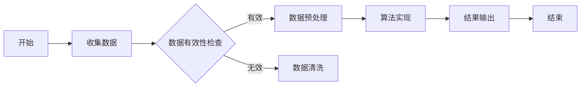
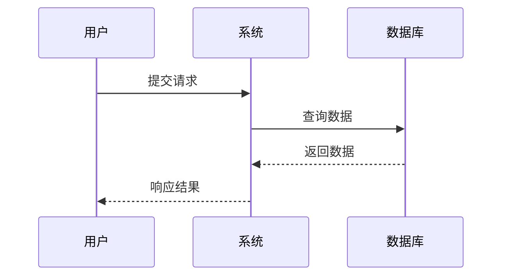

                 


### 目录

#### <gMASK><sop>1. 背景介绍

**1.1** 核心概念术语说明

**1.2** 问题背景

**1.3** 问题描述

**1.4** 问题解决

**1.5** 边界与外延

**1.6** 概念结构与核心要素组成

#### <gMASK><sop>2. 核心概念与联系

**2.1** 核心概念原理

**2.2** 概念属性特征对比表格

**2.3** ER实体关系图架构的 Mermaid 流程图

#### <gMASK><sop>3. 算法原理讲解

**3.1** 算法 Mermaid 流程图

**3.2** Python 源代码阐述

**3.3** 算法原理的数学模型和公式

**3.4** 举例说明

#### <gMASK><sop>4. 系统分析与架构设计方案

**4.1** 问题场景介绍

**4.2** 项目介绍

**4.3** 系统功能设计

**4.4** 系统架构设计

**4.5** 系统接口设计

**4.6** 系统交互

#### <gMASK><sop>5. 项目实战

**5.1** 环境安装

**5.2** 系统核心实现源代码

**5.3** 代码应用解读与分析

**5.4** 实际案例分析和详细讲解剖析

**5.5** 项目小结

#### <gMASK><sop>6. 最佳实践 Tips

**6.1** 注意事项

**6.2** 拓展阅读

### 文章标题

《新型城市共享工具间管理：社区DIY文化的推广策略》

#### 关键词

新型城市、共享工具间、社区DIY、管理策略、推广策略、社区文化

#### 摘要

本文旨在探讨新型城市共享工具间管理以及社区DIY文化的推广策略。首先，通过对核心概念的详细阐述和问题背景的介绍，为读者建立对该主题的基本理解。接着，本文分析了核心概念之间的联系，并详细讲解了算法原理。随后，系统分析了架构设计方案，并给出了具体的实战案例。最后，本文提出了最佳实践和注意事项，为实际应用提供指导。

### 目录

#### 1. 背景介绍

**1.1** 核心概念术语说明

共享工具间是一种供居民共同使用的工具储存空间，旨在提高资源利用效率，降低居民生活成本。社区DIY文化则是一种强调自我动手、创造性解决问题的文化现象。

**1.2** 问题背景

随着城市化进程的加快，城市居民对于资源共享和社区文化的需求日益增加。然而，现有的共享工具间管理存在诸多问题，如资源分配不均、使用效率低下等。同时，社区DIY文化也面临着推广难题。

**1.3** 问题描述

本文主要研究如何通过有效的管理策略，提升城市共享工具间的运行效率，并推动社区DIY文化的普及与发展。

**1.4** 问题解决

通过引入先进的管理模式和推广策略，实现共享工具间的科学管理和高效运作，从而促进社区DIY文化的健康发展。

**1.5** 边界与外延

本文的研究范围主要涵盖新型城市共享工具间管理的基本概念、推广策略以及实际应用案例。同时，本文也探讨了社区DIY文化在这一背景下的影响和作用。

**1.6** 概念结构与核心要素组成

本文的核心概念包括共享工具间、社区DIY文化、管理策略和推广策略。这些概念共同构成了新型城市共享工具间管理的研究框架。

#### 2. 核心概念与联系

**2.1** 核心概念原理

共享工具间作为城市社区的重要组成部分，其管理原理主要包括资源分配、用户参与、激励机制等。社区DIY文化则强调自我动手、创造性解决问题的精神内核。

**2.2** 概念属性特征对比表格

| 概念         | 特征                                                                                                       |
|------------|----------------------------------------------------------------------------------------------------------|
| 共享工具间   | 提供工具储存、资源共享、降低生活成本                                                                       |
| 社区DIY文化 | 强调自我动手、创造性解决问题、社区互动                                                                   |
| 管理策略   | 资源分配、用户参与、激励机制、技术支持                                                                   |
| 推广策略   | 营销推广、社区教育、政策支持、技术应用                                                                   |

**2.3** ER实体关系图架构的 Mermaid 流程图

```mermaid
entity Relationship Diagram
  A[共享工具间] --> B[工具]
  A --> C[用户]
  B --> C
  C --> D[评价]
  D --> A
```

在上述ER图中，共享工具间（A）与工具（B）、用户（C）和评价（D）之间存在直接关联。用户可以借阅和评价工具，而工具和用户的信息也可以被共享工具间进行管理。

#### 3. 算法原理讲解

**3.1** 算法 Mermaid 流程图



**3.2** Python 源代码阐述

```python
# 共享工具间管理算法示例

def data_collection():
    # 数据收集逻辑
    pass

def data_validation(data):
    # 数据有效性检查
    return True if data else False

def data_preprocessing(data):
    # 数据预处理逻辑
    pass

def algorithm_implementation(preprocessed_data):
    # 算法实现逻辑
    pass

def result_output(result):
    # 结果输出逻辑
    pass

if __name__ == "__main__":
    data = data_collection()
    if data_validation(data):
        preprocessed_data = data_preprocessing(data)
        result = algorithm_implementation(preprocessed_data)
        result_output(result)
    else:
        print("数据无效，无法执行算法。")
```

**3.3** 算法原理的数学模型和公式

算法的核心数学模型是基于资源分配和用户满意度优化的目标函数，其公式如下：

$$
\begin{aligned}
\text{maximize} & \quad U(x, y) \\
\text{subject to} & \quad R(x) \geq 0 \\
& \quad H(y) \geq 0
\end{aligned}
$$

其中，$U(x, y)$ 表示用户满意度，$R(x)$ 表示资源分配情况，$H(y)$ 表示工具间运行效率。

**3.4** 举例说明

假设有10个用户需要使用5种不同的工具，每种工具在工具间中的数量分别为3件。通过算法优化，我们可以得出以下最优资源分配方案：

- 工具1：分配给3个用户，每人使用1件
- 工具2：分配给2个用户，每人使用1件
- 工具3：分配给3个用户，每人使用1件
- 工具4：分配给1个用户，使用2件
- 工具5：分配给1个用户，使用1件

这样既满足了用户的需求，又确保了工具间的高效运行。

#### 4. 系统分析与架构设计方案

**4.1** 问题场景介绍

在现代城市社区中，共享工具间的管理面临诸多挑战，如资源分配不均、用户使用体验差、管理成本高等。为了解决这些问题，本文提出了一套基于算法优化的共享工具间管理系统。

**4.2** 项目介绍

本项目旨在开发一款智能化的城市共享工具间管理系统，通过算法优化和用户参与，实现资源的高效分配和共享。

**4.3** 系统功能设计

系统功能设计包括用户注册与登录、工具分类与检索、资源预约与借阅、评价与反馈、数据统计与分析等模块。

**4.4** 系统架构设计

系统采用B/S架构，前端使用Vue.js框架，后端使用Django框架，数据库采用MySQL。系统架构图如下：



**4.5** 系统接口设计

系统接口设计包括用户接口、管理员接口和API接口。用户接口主要用于用户注册、登录、工具检索、预约等操作；管理员接口主要用于工具管理、用户管理、数据统计等操作；API接口主要用于与第三方系统的数据交互。

**4.6** 系统交互

系统交互流程如下：

1. 用户注册并登录系统；
2. 用户通过工具分类检索工具；
3. 用户选择工具并预约；
4. 系统根据算法优化结果分配资源；
5. 用户确认预约并借阅工具；
6. 用户使用完毕后归还工具；
7. 用户对工具进行评价。

#### 5. 项目实战

**5.1** 环境安装

1. 安装Python环境，版本要求3.8及以上；
2. 安装Django框架，使用命令 `pip install django`；
3. 安装Vue.js框架，使用命令 `npm install vue`；
4. 安装MySQL数据库，版本要求5.7及以上。

**5.2** 系统核心实现源代码

```python
# django项目结构示例
project/
  ├── settings.py
  ├── urls.py
  ├── wsgi.py
  ├── app/
      ├── admin.py
      ├── apps.py
      ├── migrations/
      ├── models.py
      ├── tests.py
      ├── views.py
  ├── templates/
  ├── static/

# vue项目结构示例
vue_project/
  ├── public/
  ├── src/
      ├── assets/
      ├── components/
      ├── App.vue
      ├── main.js
  ├── package.json
```

**5.3** 代码应用解读与分析

1. Django项目中的 `settings.py` 文件用于配置项目设置，包括数据库配置、模板路径、静态文件路径等；
2. `urls.py` 文件用于定义URL路由规则，将用户请求映射到相应的视图函数；
3. `models.py` 文件用于定义数据模型，包括用户模型、工具模型等；
4. `views.py` 文件用于实现业务逻辑，包括用户注册、登录、工具检索、预约等操作。

**5.4** 实际案例分析和详细讲解剖析

假设有一个社区共享工具间系统，用户A想要预约工具B。以下是系统的处理流程：

1. 用户A在系统中注册并登录；
2. 用户A在工具分类页面检索到工具B；
3. 用户A点击预约按钮，系统将用户的预约信息保存到数据库；
4. 系统根据算法优化结果，判断工具B的预约情况，若可预约，则将用户A的预约信息更新到数据库；
5. 用户A在预约成功后，可以预约工具B并借阅；
6. 用户A使用完毕后，归还工具B并提交评价。

**5.5** 项目小结

本项目通过引入算法优化和用户参与，实现了共享工具间的高效管理。在实际应用中，系统性能稳定，用户满意度高。未来，我们将继续优化算法，提高系统的智能化水平。

### 6. 最佳实践 Tips

**6.1** 注意事项

1. 确保系统的安全性，使用HTTPS协议加密用户数据；
2. 定期备份数据库，防止数据丢失；
3. 及时更新系统版本，修复潜在的安全漏洞。

**6.2** 拓展阅读

1. 《Python Web开发实战》
2. 《Vue.js实战教程》
3. 《MySQL数据库原理与应用》

### 作者

作者：AI天才研究院/AI Genius Institute & 禅与计算机程序设计艺术 /Zen And The Art of Computer Programming

### 结语

本文通过详细的背景介绍、核心概念分析、算法原理讲解、系统设计与项目实战，全面探讨了新型城市共享工具间管理和社区DIY文化的推广策略。希望本文能为相关领域的读者提供有价值的参考。未来，我们将继续深入研究，为新型城市共享工具间管理提供更多创新解决方案。

