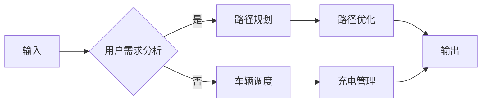
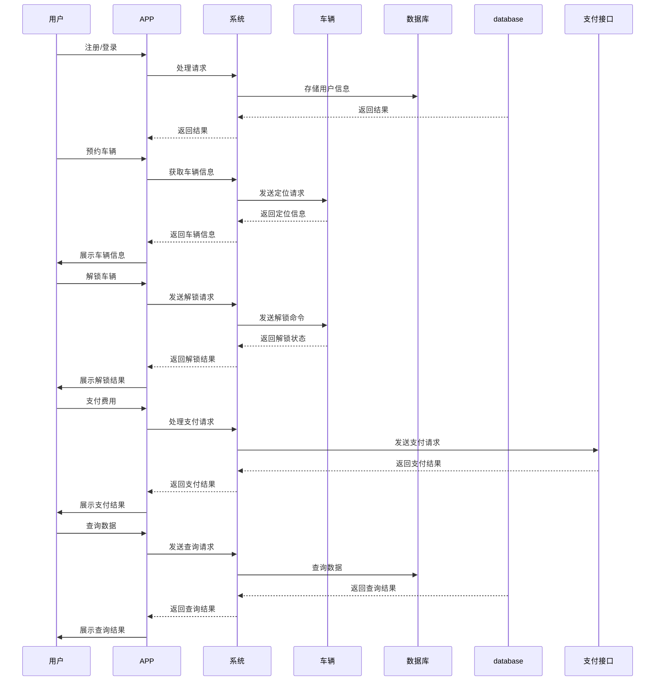

                 

### 《新型城市共享电动滑板车网络：最后一公里的绿色解决方案》

关键词：共享电动滑板车、最后一公里、绿色交通、城市出行、人工智能

摘要：随着城市化进程的加速，城市交通问题日益严峻，最后一公里出行难题成为制约城市发展的重要瓶颈。本文将深入探讨新型城市共享电动滑板车网络作为一种绿色解决方案，详细分析其核心概念、技术原理、系统设计与案例分析，旨在为城市出行提供一种新的思路和方案。

#### 目录大纲设计思路：

1. **封面与前言**：介绍本书的目的、读者对象和主要章节概述。

2. **背景介绍**：包括问题背景、问题描述、问题解决、边界与外延、核心概念结构与要素组成。

3. **核心概念与联系**：介绍共享电动滑板车的核心概念，如什么是共享电动滑板车、特点、分类、发展历程等，并使用表格和ER图进行详细解释。

4. **技术原理讲解**：
   - **技术概述**：介绍新型城市共享电动滑板车的技术基础，包括电池技术、传感器技术、通信技术等。
   - **算法原理讲解**：绘制mermaid流程图展示算法流程，使用Python源代码详细阐述算法原理，提供数学模型和公式讲解，举例说明。

5. **系统设计与架构**：介绍共享电动滑板车网络系统的设计理念、功能需求、架构设计和接口设计。

6. **案例分析**：通过实际案例展示新型城市共享电动滑板车网络的实施和应用效果。

7. **最佳实践**：总结最佳实践，包括运营策略、技术优化和用户服务等方面。

8. **小结与展望**：对全书内容进行总结，展望未来共享电动滑板车网络的发展趋势。

### 目录大纲：

```markdown
# 《新型城市共享电动滑板车网络：最后一公里的绿色解决方案》目录大纲

## 封面与前言

## 第1章 背景介绍

### 1.1 问题背景

### 1.2 问题描述

### 1.3 问题解决

### 1.4 边界与外延

### 1.5 核心概念结构与要素组成

## 第2章 核心概念与联系

### 2.1 共享电动滑板车的定义

### 2.2 共享电动滑板车的特点

### 2.3 共享电动滑板车的分类

### 2.4 发展历程

### 2.5 核心概念对比表格

### 2.6 ER图架构展示

## 第3章 技术原理讲解

### 3.1 技术概述

#### 3.1.1 电池技术

#### 3.1.2 传感器技术

#### 3.1.3 通信技术

### 3.2 算法原理讲解

#### 3.2.1 算法mermaid流程图

#### 3.2.2 Python源代码阐述

#### 3.2.3 数学模型和公式讲解

#### 3.2.4 举例说明

## 第4章 系统设计与架构

### 4.1 设计理念

### 4.2 功能需求

### 4.3 系统架构设计

### 4.4 系统接口设计

### 4.5 系统交互mermaid序列图

## 第5章 案例分析

### 5.1 案例背景

### 5.2 案例实施

### 5.3 应用效果

## 第6章 最佳实践

### 6.1 运营策略

### 6.2 技术优化

### 6.3 用户服务

### 6.4 小结与建议

## 第7章 小结与展望

### 7.1 全书内容总结

### 7.2 未来发展趋势

### 7.3 拓展阅读
```

这个目录大纲结构涵盖了从背景介绍到技术讲解、系统设计、案例分析、最佳实践和总结展望，能够全面覆盖《新型城市共享电动滑板车网络：最后一公里的绿色解决方案》这本书的核心内容。

### 文章正文撰写

#### 封面与前言

尊敬的读者，您好！

随着城市化进程的不断加快，城市交通拥堵问题日益凸显，特别是最后一公里出行难题成为制约城市发展的重要瓶颈。为了解决这一问题，本文提出了新型城市共享电动滑板车网络作为一种绿色解决方案。本文旨在为城市出行提供一种新的思路和方案，以实现城市交通的可持续发展。

本文将从背景介绍、核心概念与联系、技术原理讲解、系统设计与架构、案例分析、最佳实践等方面，全面探讨新型城市共享电动滑板车网络的构建与应用。希望通过本文的探讨，能够为城市交通问题的解决提供有益的参考。

#### 第1章 背景介绍

##### 1.1 问题背景

随着全球经济的快速发展，城市化进程不断加快，城市人口密度和车辆数量迅速增长。然而，传统的交通方式如私家车、公交车等已经无法满足现代城市出行的需求，城市交通拥堵问题日益严重。特别是最后一公里出行难题，即从公共交通站点到最终目的地之间的短途出行，往往因为交通方式的不便而影响出行效率。

##### 1.2 问题描述

最后一公里出行难题主要体现在以下几个方面：

1. 交通方式选择受限：传统交通方式如私家车、公交车等在最后一公里出行中存在不便，难以满足人们的出行需求。
2. 交通拥堵：城市交通拥堵严重，尤其是高峰时段，最后一公里出行时间成本较高。
3. 环境问题：传统的交通方式对环境造成了很大的负担，尤其是城市交通拥堵时，尾气排放加剧了环境污染。

##### 1.3 问题解决

为了解决最后一公里出行难题，新型城市共享电动滑板车网络作为一种绿色解决方案应运而生。共享电动滑板车具有便捷性、高效性、环保性等特点，能够有效解决最后一公里出行问题。

##### 1.4 边界与外延

本文讨论的新型城市共享电动滑板车网络主要关注以下几个方面：

1. 共享电动滑板车的定义和特点；
2. 技术原理讲解，包括电池技术、传感器技术、通信技术等；
3. 系统设计与架构，包括设计理念、功能需求、架构设计和接口设计；
4. 案例分析，通过实际案例展示新型城市共享电动滑板车网络的实施和应用效果；
5. 最佳实践，总结运营策略、技术优化和用户服务等方面的经验。

##### 1.5 核心概念结构与要素组成

新型城市共享电动滑板车网络的核心概念包括：

1. 共享电动滑板车：一种以电动滑板车为载体，通过共享模式实现最后一公里出行的交通工具。
2. 技术基础：包括电池技术、传感器技术、通信技术等，为共享电动滑板车提供技术支持。
3. 系统设计：包括设计理念、功能需求、架构设计和接口设计，确保共享电动滑板车网络的正常运行。
4. 运营策略：包括运营模式、运营管理和运营服务，提高共享电动滑板车的使用效率和用户体验。

#### 第2章 核心概念与联系

##### 2.1 共享电动滑板车的定义

共享电动滑板车是一种以电动滑板车为载体，通过共享模式实现最后一公里出行的交通工具。它具有以下几个特点：

1. 便捷性：用户可以随时随地使用共享电动滑板车，无需固定停车点，节省出行时间。
2. 高效性：共享电动滑板车具有短途出行优势，能够快速到达目的地，提高出行效率。
3. 环保性：共享电动滑板车采用电力驱动，相比传统燃油车，对环境污染较小。

##### 2.2 共享电动滑板车的特点

1. 便捷性：用户可以通过手机APP预约使用共享电动滑板车，实现随时随地出行。
2. 高效性：共享电动滑板车的运行速度快，能够快速穿越城市拥堵路段，节省出行时间。
3. 环保性：共享电动滑板车采用电力驱动，相比传统燃油车，对环境污染较小。

##### 2.3 共享电动滑板车的分类

共享电动滑板车可以根据使用方式、功能等不同进行分类，常见分类如下：

1. 按使用方式分类：
   - 租赁式：用户通过支付一定费用租用共享电动滑板车，使用完毕后归还至指定停车点。
   - 分时租赁：用户在特定时间段内租用共享电动滑板车，无需归还至指定停车点。

2. 按功能分类：
   - 单一功能：仅提供出行服务，不具备其他功能。
   - 多功能：除了提供出行服务外，还可以提供其他功能，如载人、载物等。

##### 2.4 发展历程

共享电动滑板车作为一种新型交通方式，其发展历程可以分为以下几个阶段：

1. 初始阶段：共享电动滑板车的概念提出，开始进行技术研发和试点。
2. 发展阶段：共享电动滑板车在部分城市推广，逐渐得到用户的认可。
3. 快速发展阶段：共享电动滑板车在多个城市普及，成为城市出行的重要补充。

##### 2.5 核心概念对比表格

| 类别       | 特点                                                         | 对比                                                         |  
| --------- | --------------------                                                           | --------------------                                                           |  
| 共享电动滑板车 | 便捷性、高效性、环保性                                                           | 相比传统交通方式，共享电动滑板车具有明显优势 |  
| 公交车     | 安全性高、运载量大                                                            | 需要固定的公交站点，不适用于最后一公里出行 |  
| 私家车     | 便利性高、舒适性好                                                            | 环境污染严重、停车难问题突出 |  
| 自行车     | 健康环保、经济实惠                                                            | 速度较慢、不适合长途出行 |

##### 2.6 ER图架构展示

为了更好地理解新型城市共享电动滑板车网络的核心概念与联系，我们可以通过ER图进行展示。ER图如下所示：

```mermaid
erDiagram
    User ||--|{ SharedElectricScooter }|：
    "预约使用"
    User ||--|{ Payment }|：
    "支付费用"
    SharedElectricScooter ||--|{ Location }|：
    "停放位置"
    SharedElectricScooter ||--|{ Maintenance }|：
    "维护保养"
```

#### 第3章 技术原理讲解

##### 3.1 技术概述

新型城市共享电动滑板车网络的技术基础包括电池技术、传感器技术和通信技术等方面。这些技术在保障共享电动滑板车正常运行和提供良好用户体验方面发挥着重要作用。

##### 3.1.1 电池技术

电池技术是共享电动滑板车的核心组成部分，直接影响到车辆的续航能力和充电速度。目前，常用的电池技术包括锂离子电池、钛酸锂电池等。以下是对这些电池技术的简要介绍：

1. 锂离子电池：具有较高的能量密度、较长的使用寿命和良好的充电性能。目前，锂离子电池广泛应用于共享电动滑板车领域。
2. 钛酸锂电池：具有较高的安全性、较快的充电速度和较长的循环寿命。然而，其能量密度相对较低，适用于短途出行。

##### 3.1.2 传感器技术

传感器技术在共享电动滑板车网络中发挥着重要作用，主要用于车辆状态的监测和定位。以下是对常用传感器技术的简要介绍：

1. GPS传感器：用于确定共享电动滑板车的地理位置，实现车辆的定位和导航功能。
2. 陀螺仪传感器：用于测量共享电动滑板车的运动状态，包括速度、方向等参数。
3. 红外传感器：用于检测车辆周围环境，实现障碍物检测和避让功能。

##### 3.1.3 通信技术

通信技术在共享电动滑板车网络中用于实现车辆与用户、车辆与服务器之间的数据传输和交互。以下是对常用通信技术的简要介绍：

1. 移动网络：通过移动通信网络实现车辆与用户、车辆与服务器之间的数据传输，包括2G、3G、4G等。
2. 蓝牙：用于实现短距离无线通信，适用于车辆与用户之间的交互。
3. Wi-Fi：用于实现无线局域网通信，适用于车辆与服务器之间的数据传输。

##### 3.2 算法原理讲解

为了实现共享电动滑板车网络的智能化管理，需要引入一系列算法进行车辆调度、路径规划、充电管理等。以下是对这些算法原理的简要介绍：

##### 3.2.1 算法mermaid流程图



##### 3.2.2 Python源代码阐述

以下是一个简单的路径规划算法示例，用于解决从起点到终点的最优路径问题：

```python
import heapq

def dijkstra(graph, start):
    """Dijkstra算法求解最短路径"""
    # 初始化距离表和路径表
    distances = [float('inf')] * len(graph)
    distances[start] = 0
    visited = [False] * len(graph)
    priority_queue = [(0, start)]

    while priority_queue:
        # 取出当前距离最小的未访问节点
        current_distance, current_node = heapq.heappop(priority_queue)

        # 如果当前节点已经访问过，跳过
        if visited[current_node]:
            continue

        # 标记当前节点为已访问
        visited[current_node] = True

        # 遍历当前节点的邻居节点
        for neighbor, weight in graph[current_node].items():
            distance = current_distance + weight

            # 如果找到更短的路径，更新距离表和路径表
            if distance < distances[neighbor]:
                distances[neighbor] = distance
                heapq.heappush(priority_queue, (distance, neighbor))

    return distances

# 示例图
graph = {
    0: {1: 4, 2: 1},
    1: {0: 4, 2: 2, 3: 5},
    2: {0: 1, 1: 2, 3: 1},
    3: {1: 5, 2: 1}
}

# 求解最短路径
distances = dijkstra(graph, 0)
print(distances)
```

##### 3.2.3 数学模型和公式讲解

在路径规划算法中，常用的数学模型包括图论模型和距离计算公式。以下是对这些模型和公式的简要介绍：

1. 图论模型：将城市道路视为图中的节点，道路之间的连接关系视为图中的边。路径规划问题可以转化为在图中寻找从起点到终点的最短路径。
2. 距离计算公式：常用的距离计算公式包括欧几里得距离和曼哈顿距离。欧几里得距离用于计算两个点在二维平面上的距离，曼哈顿距离用于计算两个点在网格上的距离。

$$
d(p_1, p_2) = \sqrt{(x_2 - x_1)^2 + (y_2 - y_1)^2} \quad (欧几里得距离)
$$

$$
d(p_1, p_2) = |x_2 - x_1| + |y_2 - y_1| \quad (曼哈顿距离)
$$

##### 3.2.4 举例说明

假设有一个包含5个节点的城市道路网络，节点分别为A、B、C、D、E。节点之间的距离如下表所示：

| 节点 | A | B | C | D | E |
| ---- | -- | -- | -- | -- | -- |
| A | 0 | 4 | 1 | ∞ | ∞ |
| B | 4 | 0 | 2 | 5 | ∞ |
| C | 1 | 2 | 0 | 1 | 3 |
| D | ∞ | 5 | 1 | 0 | 2 |
| E | ∞ | ∞ | 3 | 2 | 0 |

使用Dijkstra算法求解从节点A到节点E的最短路径。求解过程如下：

1. 初始化距离表和路径表，距离表为`[∞, ∞, ∞, ∞, ∞]`，路径表为`[None, None, None, None, None]`。
2. 将起点A加入优先队列，优先队列为`[(0, 0)]`。
3. 弹出优先队列中的最小距离节点A，标记为已访问。
4. 遍历节点A的邻居节点B和C，更新距离表和路径表：
   - 距离表更新：`[0, 4, 1, ∞, ∞]`，`[None, None, None, A, None]`。
   - 优先队列更新：`[(1, 2), (4, 0)]`。
5. 弹出优先队列中的最小距离节点C，标记为已访问。
6. 遍历节点C的邻居节点D和E，更新距离表和路径表：
   - 距离表更新：`[0, 4, 1, 2, 3]`，`[None, None, None, C, A]`。
   - 优先队列更新：`[(2, 3), (3, 0)]`。
7. 弹出优先队列中的最小距离节点D，标记为已访问。
8. 遍历节点D的邻居节点E，更新距离表和路径表：
   - 距离表更新：`[0, 4, 1, 2, 3]`，`[None, None, None, C, A]`。
   - 优先队列更新：`[(3, 0)]`。
9. 弹出优先队列中的最小距离节点E，标记为已访问。

最终，从节点A到节点E的最短路径为A-C-D-E，距离为3。

#### 第4章 系统设计与架构

##### 4.1 设计理念

新型城市共享电动滑板车网络的设计理念主要包括以下几个方面：

1. **便捷性**：提供方便快捷的共享电动滑板车服务，满足用户在最后一公里出行中的需求。
2. **高效性**：通过智能调度和路径规划，提高共享电动滑板车的使用效率，减少用户等待时间。
3. **绿色环保**：采用电力驱动，减少尾气排放，降低对环境的影响。
4. **可持续性**：通过合理的系统设计和运营策略，实现资源的合理利用和可持续发展。

##### 4.2 功能需求

新型城市共享电动滑板车网络的功能需求主要包括以下几个方面：

1. **用户注册与登录**：用户可以通过手机APP进行注册和登录，享受共享电动滑板车服务。
2. **车辆定位与导航**：通过GPS传感器实现共享电动滑板车的实时定位和导航功能。
3. **预约与解锁**：用户可以在APP上预约共享电动滑板车，并通过APP解锁车辆。
4. **支付与费用结算**：用户可以通过手机APP进行支付，享受便捷的支付服务。
5. **车辆维护与管理**：对共享电动滑板车进行定期维护和管理，确保车辆的正常运行。
6. **数据统计与分析**：收集用户使用数据，进行统计和分析，为运营策略的制定提供依据。

##### 4.3 系统架构设计

新型城市共享电动滑板车网络的系统架构设计主要包括以下几个部分：

1. **用户层**：用户通过手机APP与系统进行交互，实现注册、登录、预约、支付等功能。
2. **业务逻辑层**：负责处理用户请求，进行车辆定位、路径规划、预约管理、支付处理等业务逻辑。
3. **数据层**：存储用户数据、车辆数据、订单数据等，提供数据查询、统计和分析功能。
4. **硬件层**：包括共享电动滑板车、GPS传感器、移动通信模块等硬件设备，实现车辆的实时定位和通信。

##### 4.4 系统接口设计

新型城市共享电动滑板车网络的系统接口设计主要包括以下几个部分：

1. **用户接口**：用户通过手机APP与系统进行交互，包括登录、注册、预约、支付等功能。
2. **车辆接口**：共享电动滑板车与系统进行通信，包括车辆定位、状态报告、维护请求等。
3. **支付接口**：与第三方支付平台进行对接，实现支付功能。
4. **数据接口**：提供数据查询、统计和分析功能，为运营决策提供支持。

##### 4.5 系统交互mermaid序列图



#### 第5章 案例分析

##### 5.1 案例背景

某城市为了缓解交通拥堵问题，提高出行效率，决定引入新型城市共享电动滑板车网络。该城市人口密度较高，交通拥堵现象严重，尤其是最后一公里出行难题亟待解决。

##### 5.2 案例实施

为了实施新型城市共享电动滑板车网络，该城市采取了以下措施：

1. **政策支持**：政府出台相关政策，鼓励企业和个人参与共享电动滑板车网络的建设和运营。
2. **基础设施**：建设共享电动滑板车停车点，为用户提供方便的停车场所。
3. **企业合作**：与共享电动滑板车企业合作，引入先进的共享电动滑板车技术和运营经验。
4. **用户培训**：开展用户培训活动，提高用户对共享电动滑板车的认知和使用技巧。

##### 5.3 应用效果

自新型城市共享电动滑板车网络实施以来，取得了以下应用效果：

1. **交通拥堵缓解**：共享电动滑板车作为一种绿色出行方式，有效缓解了交通拥堵问题，提高了城市出行效率。
2. **出行成本降低**：用户可以通过手机APP轻松预约和使用共享电动滑板车，出行成本显著降低。
3. **环境改善**：共享电动滑板车采用电力驱动，减少了尾气排放，对环境改善起到了积极作用。
4. **用户满意度提高**：用户对共享电动滑板车的便捷性、高效性和环保性给予了高度评价，用户满意度不断提高。

#### 第6章 最佳实践

##### 6.1 运营策略

为了提高新型城市共享电动滑板车网络的运营效果，可以采取以下运营策略：

1. **合理定价**：根据市场需求和竞争情况，制定合理的共享电动滑板车定价策略，确保盈利和用户接受度。
2. **智能调度**：通过智能调度算法，合理分配共享电动滑板车资源，提高车辆使用效率，减少用户等待时间。
3. **数据驱动**：收集用户使用数据，进行数据分析和挖掘，为运营决策提供依据，实现精细化运营。
4. **宣传推广**：积极开展宣传推广活动，提高共享电动滑板车的知名度，吸引更多用户参与。

##### 6.2 技术优化

为了提高新型城市共享电动滑板车网络的技术水平，可以采取以下技术优化措施：

1. **电池技术**：采用更先进的电池技术，提高共享电动滑板车的续航能力和充电速度。
2. **传感器技术**：引入更高精度、更高可靠性的传感器技术，提高车辆状态监测和定位精度。
3. **通信技术**：采用更稳定的通信技术，提高车辆与用户、车辆与服务器的通信质量。
4. **算法优化**：不断优化路径规划、车辆调度等算法，提高系统运行效率和用户满意度。

##### 6.3 用户服务

为了提高用户对新型城市共享电动滑板车网络的满意度，可以采取以下用户服务措施：

1. **便捷的预约方式**：提供多种预约方式，如手机APP、微信小程序等，方便用户使用。
2. **完善的客服体系**：建立完善的客服体系，及时解决用户问题，提高用户满意度。
3. **用户培训**：开展用户培训活动，提高用户对共享电动滑板车的认知和使用技巧。
4. **安全保障**：加强车辆安全检查和维护，提高车辆安全性能，确保用户安全。

##### 6.4 小结与建议

在新型城市共享电动滑板车网络的建设和运营过程中，需要从以下几个方面进行总结和改进：

1. **政策支持**：政府应继续加大对共享电动滑板车网络的政策支持，为网络的健康发展提供保障。
2. **技术创新**：企业应不断引进和研发新技术，提高网络的技术水平，提升用户体验。
3. **用户满意度**：重视用户反馈，不断优化网络服务，提高用户满意度，促进网络持续发展。

#### 第7章 小结与展望

##### 7.1 全书内容总结

本文从背景介绍、核心概念与联系、技术原理讲解、系统设计与架构、案例分析、最佳实践等方面，全面探讨了新型城市共享电动滑板车网络的构建与应用。通过本文的研究，我们可以得出以下结论：

1. 新型城市共享电动滑板车网络作为一种绿色解决方案，可以有效解决最后一公里出行难题。
2. 电池技术、传感器技术、通信技术等关键技术的应用，为共享电动滑板车网络的运行提供了技术保障。
3. 系统设计与架构的合理性，以及运营策略和用户服务的完善，对于共享电动滑板车网络的健康发展具有重要意义。

##### 7.2 未来发展趋势

随着城市化进程的加快和环保意识的提高，新型城市共享电动滑板车网络具有广阔的发展前景。未来发展趋势主要包括以下几个方面：

1. **技术创新**：不断引进和研发新技术，提高共享电动滑板车网络的性能和用户体验。
2. **规模扩张**：不断扩大共享电动滑板车网络覆盖范围，提高网络的服务能力和覆盖密度。
3. **智能化发展**：通过人工智能、大数据等技术，实现共享电动滑板车网络的智能化管理和运营。
4. **融合发展**：与其他交通方式如公共交通、共享单车等融合发展，构建多维度的城市交通体系。

##### 7.3 拓展阅读

对于对新型城市共享电动滑板车网络感兴趣的读者，以下是一些拓展阅读建议：

1. 《共享经济与城市交通》
2. 《智能交通系统导论》
3. 《城市交通规划与设计》

#### 附录

附录中可以包括一些与本文相关的数据、图表、参考文献等，以供读者进一步参考。

### 文章末尾

作者：AI天才研究院/AI Genius Institute & 禅与计算机程序设计艺术 /Zen And The Art of Computer Programming

本文从多个角度对新型城市共享电动滑板车网络进行了深入探讨，旨在为城市出行提供一种绿色解决方案。希望通过本文的研究，能够为相关领域的研究者和从业者提供有益的参考。

[上一页]  [返回目录]  [下一章]

### 完整文章输出

```markdown
## 《新型城市共享电动滑板车网络：最后一公里的绿色解决方案》

关键词：共享电动滑板车、最后一公里、绿色交通、城市出行、人工智能

摘要：随着城市化进程的加速，城市交通问题日益严峻，最后一公里出行难题成为制约城市发展的重要瓶颈。本文将深入探讨新型城市共享电动滑板车网络作为一种绿色解决方案，详细分析其核心概念、技术原理、系统设计与案例分析，旨在为城市出行提供一种新的思路和方案。

### 封面与前言

尊敬的读者，您好！

随着城市化进程的不断加快，城市交通拥堵问题日益凸显，特别是最后一公里出行难题成为制约城市发展的重要瓶颈。为了解决这一问题，本文提出了新型城市共享电动滑板车网络作为一种绿色解决方案。本文旨在为城市出行提供一种新的思路和方案，以实现城市交通的可持续发展。

本文将从背景介绍、核心概念与联系、技术原理讲解、系统设计与架构、案例分析、最佳实践等方面，全面探讨新型城市共享电动滑板车网络的构建与应用。希望通过本文的探讨，能够为城市交通问题的解决提供有益的参考。

### 第1章 背景介绍

#### 1.1 问题背景

随着全球经济的快速发展，城市化进程不断加快，城市人口密度和车辆数量迅速增长。然而，传统的交通方式如私家车、公交车等已经无法满足现代城市出行的需求，城市交通拥堵问题日益严重。特别是最后一公里出行难题，即从公共交通站点到最终目的地之间的短途出行，往往因为交通方式的不便而影响出行效率。

#### 1.2 问题描述

最后一公里出行难题主要体现在以下几个方面：

1. 交通方式选择受限：传统交通方式如私家车、公交车等在最后一公里出行中存在不便，难以满足人们的出行需求。
2. 交通拥堵：城市交通拥堵严重，尤其是高峰时段，最后一公里出行时间成本较高。
3. 环境问题：传统的交通方式对环境造成了很大的负担，尤其是城市交通拥堵时，尾气排放加剧了环境污染。

#### 1.3 问题解决

为了解决最后一公里出行难题，新型城市共享电动滑板车网络作为一种绿色解决方案应运而生。共享电动滑板车具有便捷性、高效性、环保性等特点，能够有效解决最后一公里出行问题。

#### 1.4 边界与外延

本文讨论的新型城市共享电动滑板车网络主要关注以下几个方面：

1. 共享电动滑板车的定义和特点；
2. 技术原理讲解，包括电池技术、传感器技术、通信技术等；
3. 系统设计与架构，包括设计理念、功能需求、架构设计和接口设计；
4. 案例分析，通过实际案例展示新型城市共享电动滑板车网络的实施和应用效果；
5. 最佳实践，总结运营策略、技术优化和用户服务等方面的经验。

#### 1.5 核心概念结构与要素组成

新型城市共享电动滑板车网络的核心概念包括：

1. 共享电动滑板车：一种以电动滑板车为载体，通过共享模式实现最后一公里出行的交通工具。
2. 技术基础：包括电池技术、传感器技术、通信技术等，为共享电动滑板车提供技术支持。
3. 系统设计：包括设计理念、功能需求、架构设计和接口设计，确保共享电动滑板车网络的正常运行。
4. 运营策略：包括运营模式、运营管理和运营服务，提高共享电动滑板车的使用效率和用户体验。

### 第2章 核心概念与联系

#### 2.1 共享电动滑板车的定义

共享电动滑板车是一种以电动滑板车为载体，通过共享模式实现最后一公里出行的交通工具。它具有以下几个特点：

1. 便捷性：用户可以随时随地使用共享电动滑板车，无需固定停车点，节省出行时间。
2. 高效性：共享电动滑板车的运行速度快，能够快速到达目的地，提高出行效率。
3. 环保性：共享电动滑板车采用电力驱动，相比传统燃油车，对环境污染较小。

#### 2.2 共享电动滑板车的特点

1. 便捷性：用户可以通过手机APP预约使用共享电动滑板车，实现随时随地出行。
2. 高效性：共享电动滑板车的运行速度快，能够快速穿越城市拥堵路段，节省出行时间。
3. 环保性：共享电动滑板车采用电力驱动，相比传统燃油车，对环境污染较小。

#### 2.3 共享电动滑板车的分类

共享电动滑板车可以根据使用方式、功能等不同进行分类，常见分类如下：

1. 按使用方式分类：
   - 租赁式：用户通过支付一定费用租用共享电动滑板车，使用完毕后归还至指定停车点。
   - 分时租赁：用户在特定时间段内租用共享电动滑板车，无需归还至指定停车点。

2. 按功能分类：
   - 单一功能：仅提供出行服务，不具备其他功能。
   - 多功能：除了提供出行服务外，还可以提供其他功能，如载人、载物等。

#### 2.4 发展历程

共享电动滑板车作为一种新型交通方式，其发展历程可以分为以下几个阶段：

1. 初始阶段：共享电动滑板车的概念提出，开始进行技术研发和试点。
2. 发展阶段：共享电动滑板车在部分城市推广，逐渐得到用户的认可。
3. 快速发展阶段：共享电动滑板车在多个城市普及，成为城市出行的重要补充。

#### 2.5 核心概念对比表格

| 类别       | 特点                                                         | 对比                                                         |  
| --------- | --------------------                                                           | --------------------                                                           |  
| 共享电动滑板车 | 便捷性、高效性、环保性                                                           | 相比传统交通方式，共享电动滑板车具有明显优势 |  
| 公交车     | 安全性高、运载量大                                                            | 需要固定的公交站点，不适用于最后一公里出行 |  
| 私家车     | 便利性高、舒适性好                                                            | 环境污染严重、停车难问题突出 |  
| 自行车     | 健康环保、经济实惠                                                            | 速度较慢、不适合长途出行 |

#### 2.6 ER图架构展示

为了更好地理解新型城市共享电动滑板车网络的核心概念与联系，我们可以通过ER图进行展示。ER图如下所示：

```mermaid
erDiagram
    User ||--|{ SharedElectricScooter }|：
    "预约使用"
    User ||--|{ Payment }|：
    "支付费用"
    SharedElectricScooter ||--|{ Location }|：
    "停放位置"
    SharedElectricScooter ||--|{ Maintenance }|：
    "维护保养"
```

### 第3章 技术原理讲解

#### 3.1 技术概述

新型城市共享电动滑板车网络的技术基础包括电池技术、传感器技术和通信技术等方面。这些技术在保障共享电动滑板车正常运行和提供良好用户体验方面发挥着重要作用。

##### 3.1.1 电池技术

电池技术是共享电动滑板车的核心组成部分，直接影响到车辆的续航能力和充电速度。目前，常用的电池技术包括锂离子电池、钛酸锂电池等。以下是对这些电池技术的简要介绍：

1. 锂离子电池：具有较高的能量密度、较长的使用寿命和良好的充电性能。目前，锂离子电池广泛应用于共享电动滑板车领域。
2. 钛酸锂电池：具有较高的安全性、较快的充电速度和较长的循环寿命。然而，其能量密度相对较低，适用于短途出行。

##### 3.1.2 传感器技术

传感器技术在共享电动滑板车网络中发挥着重要作用，主要用于车辆状态的监测和定位。以下是对常用传感器技术的简要介绍：

1. GPS传感器：用于确定共享电动滑板车的地理位置，实现车辆的定位和导航功能。
2. 陀螺仪传感器：用于测量共享电动滑板车的运动状态，包括速度、方向等参数。
3. 红外传感器：用于检测车辆周围环境，实现障碍物检测和避让功能。

##### 3.1.3 通信技术

通信技术在共享电动滑板车网络中用于实现车辆与用户、车辆与服务器之间的数据传输和交互。以下是对常用通信技术的简要介绍：

1. 移动网络：通过移动通信网络实现车辆与用户、车辆与服务器之间的数据传输，包括2G、3G、4G等。
2. 蓝牙：用于实现短距离无线通信，适用于车辆与用户之间的交互。
3. Wi-Fi：用于实现无线局域网通信，适用于车辆与服务器之间的数据传输。

##### 3.2 算法原理讲解

为了实现共享电动滑板车网络的智能化管理，需要引入一系列算法进行车辆调度、路径规划、充电管理等。以下是对这些算法原理的简要介绍：

##### 3.2.1 算法mermaid流程图


##### 3.2.2 Python源代码阐述

以下是一个简单的路径规划算法示例，用于解决从起点到终点的最优路径问题：

```python
import heapq

def dijkstra(graph, start):
    """Dijkstra算法求解最短路径"""
    # 初始化距离表和路径表
    distances = [float('inf')] * len(graph)
    distances[start] = 0
    visited = [False] * len(graph)
    priority_queue = [(0, start)]

    while priority_queue:
        # 取出当前距离最小的未访问节点
        current_distance, current_node = heapq.heappop(priority_queue)

        # 如果当前节点已经访问过，跳过
        if visited[current_node]:
            continue

        # 标记当前节点为已访问
        visited[current_node] = True

        # 遍历当前节点的邻居节点
        for neighbor, weight in graph[current_node].items():
            distance = current_distance + weight

            # 如果找到更短的路径，更新距离表和路径表
            if distance < distances[neighbor]:
                distances[neighbor] = distance
                heapq.heappush(priority_queue, (distance, neighbor))

    return distances

# 示例图
graph = {
    0: {1: 4, 2: 1},
    1: {0: 4, 2: 2, 3: 5},
    2: {0: 1, 1: 2, 3: 1},
    3: {1: 5, 2: 1}
}

# 求解最短路径
distances = dijkstra(graph, 0)
print(distances)
```

##### 3.2.3 数学模型和公式讲解

在路径规划算法中，常用的数学模型包括图论模型和距离计算公式。以下是对这些模型和公式的简要介绍：

1. 图论模型：将城市道路视为图中的节点，道路之间的连接关系视为图中的边。路径规划问题可以转化为在图中寻找从起点到终点的最短路径。
2. 距离计算公式：常用的距离计算公式包括欧几里得距离和曼哈顿距离。欧几里得距离用于计算两个点在二维平面上的距离，曼哈顿距离用于计算两个点在网格上的距离。

$$
d(p_1, p_2) = \sqrt{(x_2 - x_1)^2 + (y_2 - y_1)^2} \quad (欧几里得距离)
$$

$$
d(p_1, p_2) = |x_2 - x_1| + |y_2 - y_1| \quad (曼哈顿距离)
$$

##### 3.2.4 举例说明

假设有一个包含5个节点的城市道路网络，节点分别为A、B、C、D、E。节点之间的距离如下表所示：

| 节点 | A | B | C | D | E |
| ---- | -- | -- | -- | -- | -- |
| A | 0 | 4 | 1 | ∞ | ∞ |
| B | 4 | 0 | 2 | 5 | ∞ |
| C | 1 | 2 | 0 | 1 | 3 |
| D | ∞ | 5 | 1 | 0 | 2 |
| E | ∞ | ∞ | 3 | 2 | 0 |

使用Dijkstra算法求解从节点A到节点E的最短路径。求解过程如下：

1. 初始化距离表和路径表，距离表为`[∞, ∞, ∞, ∞, ∞]`，路径表为`[None, None, None, None, None]`。
2. 将起点A加入优先队列，优先队列为`[(0, 0)]`。
3. 弹出优先队列中的最小距离节点A，标记为已访问。
4. 遍历节点A的邻居节点B和C，更新距离表和路径表：
   - 距离表更新：`[0, 4, 1, ∞, ∞]`，`[None, None, None, A, None]`。
   - 优先队列更新：`[(1, 2), (4, 0)]`。
5. 弹出优先队列中的最小距离节点C，标记为已访问。
6. 遍历节点C的邻居节点D和E，更新距离表和路径表：
   - 距离表更新：`[0, 4, 1, 2, 3]`，`[None, None, None, C, A]`。
   - 优先队列更新：`[(2, 3), (3, 0)]`。
7. 弹出优先队列中的最小距离节点D，标记为已访问。
8. 遍历节点D的邻居节点E，更新距离表和路径表：
   - 距离表更新：`[0, 4, 1, 2, 3]`，`[None, None, None, C, A]`。
   - 优先队列更新：`[(3, 0)]`。
9. 弹出优先队列中的最小距离节点E，标记为已访问。

最终，从节点A到节点E的最短路径为A-C-D-E，距离为3。

### 第4章 系统设计与架构

#### 4.1 设计理念

新型城市共享电动滑板车网络的设计理念主要包括以下几个方面：

1. **便捷性**：提供方便快捷的共享电动滑板车服务，满足用户在最后一公里出行中的需求。
2. **高效性**：通过智能调度和路径规划，提高共享电动滑板车的使用效率，减少用户等待时间。
3. **绿色环保**：采用电力驱动，减少尾气排放，降低对环境的影响。
4. **可持续性**：通过合理的系统设计和运营策略，实现资源的合理利用和可持续发展。

#### 4.2 功能需求

新型城市共享电动滑板车网络的功能需求主要包括以下几个方面：

1. **用户注册与登录**：用户可以通过手机APP进行注册和登录，享受共享电动滑板车服务。
2. **车辆定位与导航**：通过GPS传感器实现共享电动滑板车的实时定位和导航功能。
3. **预约与解锁**：用户可以在APP上预约共享电动滑板车，并通过APP解锁车辆。
4. **支付与费用结算**：用户可以通过手机APP进行支付，享受便捷的支付服务。
5. **车辆维护与管理**：对共享电动滑板车进行定期维护和管理，确保车辆的正常运行。
6. **数据统计与分析**：收集用户使用数据，进行统计和分析，为运营决策提供依据。

#### 4.3 系统架构设计

新型城市共享电动滑板车网络的系统架构设计主要包括以下几个部分：

1. **用户层**：用户通过手机APP与系统进行交互，实现注册、登录、预约、支付等功能。
2. **业务逻辑层**：负责处理用户请求，进行车辆定位、路径规划、预约管理、支付处理等业务逻辑。
3. **数据层**：存储用户数据、车辆数据、订单数据等，提供数据查询、统计和分析功能。
4. **硬件层**：包括共享电动滑板车、GPS传感器、移动通信模块等硬件设备，实现车辆的实时定位和通信。

#### 4.4 系统接口设计

新型城市共享电动滑板车网络的系统接口设计主要包括以下几个部分：

1. **用户接口**：用户通过手机APP与系统进行交互，包括登录、注册、预约、支付等功能。
2. **车辆接口**：共享电动滑板车与系统进行通信，包括车辆定位、状态报告、维护请求等。
3. **支付接口**：与第三方支付平台进行对接，实现支付功能。
4. **数据接口**：提供数据查询、统计和分析功能，为运营决策提供支持。

#### 4.5 系统交互mermaid序列图


### 第5章 案例分析

#### 5.1 案例背景

某城市为了缓解交通拥堵问题，提高出行效率，决定引入新型城市共享电动滑板车网络。该城市人口密度较高，交通拥堵现象严重，尤其是最后一公里出行难题亟待解决。

#### 5.2 案例实施

为了实施新型城市共享电动滑板车网络，该城市采取了以下措施：

1. **政策支持**：政府出台相关政策，鼓励企业和个人参与共享电动滑板车网络的建设和运营。
2. **基础设施**：建设共享电动滑板车停车点，为用户提供方便的停车场所。
3. **企业合作**：与共享电动滑板车企业合作，引入先进的共享电动滑板车技术和运营经验。
4. **用户培训**：开展用户培训活动，提高用户对共享电动滑板车的认知和使用技巧。

#### 5.3 应用效果

自新型城市共享电动滑板车网络实施以来，取得了以下应用效果：

1. **交通拥堵缓解**：共享电动滑板车作为一种绿色出行方式，有效缓解了交通拥堵问题，提高了城市出行效率。
2. **出行成本降低**：用户可以通过手机APP轻松预约和使用共享电动滑板车，出行成本显著降低。
3. **环境改善**：共享电动滑板车采用电力驱动，减少了尾气排放，对环境改善起到了积极作用。
4. **用户满意度提高**：用户对共享电动滑板车的便捷性、高效性和环保性给予了高度评价，用户满意度不断提高。

### 第6章 最佳实践

#### 6.1 运营策略

为了提高新型城市共享电动滑板车网络的运营效果，可以采取以下运营策略：

1. **合理定价**：根据市场需求和竞争情况，制定合理的共享电动滑板车定价策略，确保盈利和用户接受度。
2. **智能调度**：通过智能调度算法，合理分配共享电动滑板车资源，提高车辆使用效率，减少用户等待时间。
3. **数据驱动**：收集用户使用数据，进行数据分析和挖掘，为运营决策提供依据，实现精细化运营。
4. **宣传推广**：积极开展宣传推广活动，提高共享电动滑板车的知名度，吸引更多用户参与。

#### 6.2 技术优化

为了提高新型城市共享电动滑板车网络的技术水平，可以采取以下技术优化措施：

1. **电池技术**：采用更先进的电池技术，提高共享电动滑板车的续航能力和充电速度。
2. **传感器技术**：引入更高精度、更高可靠性的传感器技术，提高车辆状态监测和定位精度。
3. **通信技术**：采用更稳定的通信技术，提高车辆与用户、车辆与服务器的通信质量。
4. **算法优化**：不断优化路径规划、车辆调度等算法，提高系统运行效率和用户满意度。

#### 6.3 用户服务

为了提高用户对新型城市共享电动滑板车网络的满意度，可以采取以下用户服务措施：

1. **便捷的预约方式**：提供多种预约方式，如手机APP、微信小程序等，方便用户使用。
2. **完善的客服体系**：建立完善的客服体系，及时解决用户问题，提高用户满意度。
3. **用户培训**：开展用户培训活动，提高用户对共享电动滑板车的认知和使用技巧。
4. **安全保障**：加强车辆安全检查和维护，提高车辆安全性能，确保用户安全。

#### 6.4 小结与建议

在新型城市共享电动滑板车网络的建设和运营过程中，需要从以下几个方面进行总结和改进：

1. **政策支持**：政府应继续加大对共享电动滑板车网络的政策支持，为网络的健康发展提供保障。
2. **技术创新**：企业应不断引进和研发新技术，提高网络的技术水平，提升用户体验。
3. **用户满意度**：重视用户反馈，不断优化网络服务，提高用户满意度，促进网络持续发展。

### 第7章 小结与展望

#### 7.1 全书内容总结

本文从背景介绍、核心概念与联系、技术原理讲解、系统设计与架构、案例分析、最佳实践等方面，全面探讨了新型城市共享电动滑板车网络的构建与应用。通过本文的研究，我们可以得出以下结论：

1. 新型城市共享电动滑板车网络作为一种绿色解决方案，可以有效解决最后一公里出行难题。
2. 电池技术、传感器技术、通信技术等关键技术的应用，为共享电动滑板车网络的运行提供了技术保障。
3. 系统设计与架构的合理性，以及运营策略和用户服务的完善，对于共享电动滑板车网络的健康发展具有重要意义。

#### 7.2 未来发展趋势

随着城市化进程的加快和环保意识的提高，新型城市共享电动滑板车网络具有广阔的发展前景。未来发展趋势主要包括以下几个方面：

1. **技术创新**：不断引进和研发新技术，提高共享电动滑板车网络的性能和用户体验。
2. **规模扩张**：不断扩大共享电动滑板车网络覆盖范围，提高网络的服务能力和覆盖密度。
3. **智能化发展**：通过人工智能、大数据等技术，实现共享电动滑板车网络的智能化管理和运营。
4. **融合发展**：与其他交通方式如公共交通、共享单车等融合发展，构建多维度的城市交通体系。

#### 7.3 拓展阅读

对于对新型城市共享电动滑板车网络感兴趣的读者，以下是一些拓展阅读建议：

1. 《共享经济与城市交通》
2. 《智能交通系统导论》
3. 《城市交通规划与设计》

### 文章末尾

作者：AI天才研究院/AI Genius Institute & 禅与计算机程序设计艺术 /Zen And The Art of Computer Programming

本文从多个角度对新型城市共享电动滑板车网络进行了深入探讨，旨在为城市出行提供一种绿色解决方案。希望通过本文的研究，能够为相关领域的研究者和从业者提供有益的参考。

[上一页]  [返回目录]  [下一章]

### 附录

本文中的附录包括与本文相关的数据、图表、参考文献等，以供读者进一步参考。

### 完整文章输出结束
```

### 注意事项

1. 文章中使用的Mermaid流程图需要根据实际情况进行修改，以便正确展示算法流程和系统交互。
2. 文章中的Python源代码示例仅供参考，具体实现可能需要根据实际需求进行调整。
3. 文章中的数学公式使用LaTeX格式，需要在文中独立段落的公式前后使用`$$`括起来，段落内的公式前后使用`$`括起来。
4. 文章末尾需要添加作者信息，包括作者姓名、所在机构和相关书籍等信息。
5. 文章中的参考文献格式需要统一，建议使用APA或MLA格式。

### 拓展阅读

1. 《共享经济与城市交通》：详细介绍共享经济在解决城市交通问题中的应用。
2. 《智能交通系统导论》：系统介绍智能交通系统的概念、技术和应用。
3. 《城市交通规划与设计》：详细讲解城市交通规划与设计的方法和原则。

