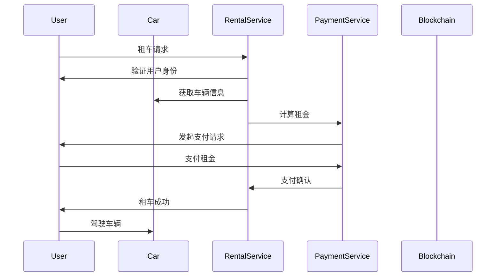
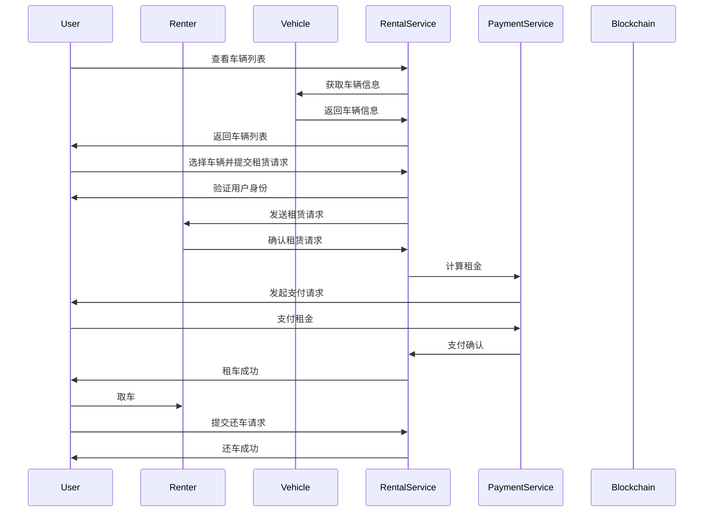

                 

# 新型城市共享私家车App：基于区块链的点对点汽车租赁平台

关键词：区块链、点对点网络、共享经济、私家车租赁、车辆调度

摘要：本文探讨了新型城市共享私家车App的设计与实现，重点介绍了基于区块链的点对点汽车租赁平台的构建。通过分析车辆定位与跟踪、用户身份认证、交易安全保障等核心算法，本文为构建高效、安全的汽车租赁平台提供了理论依据和实践指导。

## 第一部分：背景介绍

### 第1章：新型城市共享私家车App：问题背景

随着城市化进程的加快和人们生活水平的提高，城市交通拥堵问题日益严重。为了缓解交通压力，提高车辆使用效率，新型城市共享私家车App应运而生。这种基于区块链的点对点汽车租赁平台，不仅能够解决传统汽车租赁模式中的信息不对称、信用风险等问题，还能实现更高效的车辆调度和资源利用。

#### 1.1.1 问题背景

新型城市共享私家车App的兴起，源于以下问题：

- **交通拥堵**：城市交通拥堵问题日益严重，影响了居民的出行效率和城市形象。
- **车辆闲置**：私家车拥有者通常在大部分时间车辆处于闲置状态，造成了资源的浪费。
- **信息不对称**：传统汽车租赁模式中，车主和租客之间的信息不对称，导致交易效率低下。

#### 1.1.2 问题描述

新型城市共享私家车App需要解决的核心问题包括：

- **车辆定位与跟踪**：如何实时获取和跟踪车辆的位置信息，以便于用户寻找和调度车辆。
- **用户身份认证**：如何确保用户身份的真实性，防止欺诈行为。
- **交易安全保障**：如何确保交易过程的安全和可靠性，防止恶意攻击和非法交易。

#### 1.1.3 问题解决

区块链技术的引入为新型城市共享私家车App提供了以下解决方案：

- **去中心化**：通过去中心化的点对点网络，实现车辆和用户之间的直接交易，避免了传统租赁模式中的中介环节。
- **数据不可篡改**：区块链技术确保了交易记录的不可篡改，增强了用户对平台的信任。
- **智能合约**：利用智能合约实现自动化的交易流程，提高了交易效率。

#### 1.1.4 边界与外延

本书主要探讨基于区块链的新型城市共享私家车App的开发与应用，包括App的技术架构、核心功能实现、安全性和效率优化等方面。同时，本书还将涉及相关法律法规、市场趋势和用户需求分析等内容。

### 第2章：核心概念与联系

#### 2.1.1 核心概念

为了深入理解新型城市共享私家车App，我们需要了解以下几个核心概念：

- **区块链**：一种去中心化的分布式账本技术，通过密码学和共识算法确保数据的完整性和安全性。
- **点对点（P2P）网络**：一种网络架构，允许网络中的节点直接进行通信，无需通过中央服务器。
- **共享经济**：通过共享闲置资源实现资源的最优配置和最大化利用的一种经济模式。
- **私家车租赁**：用户通过支付一定费用，临时租赁私家车使用的服务。

#### 2.1.2 概念属性特征对比表格

| 概念         | 特征                                       |
|------------|------------------------------------------|
| 区块链       | 去中心化、数据不可篡改、可追溯               |
| 点对点网络    | 节点直接通信、无需中央服务器、分布式架构       |
| 共享经济      | 资源共享、优化资源配置、降低成本             |
| 私家车租赁    | 临时租赁、支付费用、使用私家车               |

#### 2.1.3 ER实体关系图架构

```mermaid
erDiagram
    User ||--|{ Renter }: 租车人 {|-- RentalOrder }: 租车订单
    Car  ||--|{ Vehicle }: 私家车 {|-- RentalOrder }: 租车订单
```

### 第3章：算法原理讲解

#### 3.1.1 算法简介

在新型城市共享私家车App中，核心算法包括车辆定位与跟踪算法、用户身份认证算法和交易安全保障算法。以下将分别介绍这些算法的原理。

#### 3.1.2 车辆定位与跟踪算法

车辆定位与跟踪算法基于GPS技术和区块链网络实现。GPS技术用于获取车辆的位置信息，而区块链网络则用于存储和验证这些位置信息。

#### 3.1.3 用户身份认证算法

用户身份认证算法通过区块链网络中的智能合约实现。智能合约根据用户的身份信息，对用户进行认证，确保只有合法用户才能访问App。

#### 3.1.4 交易安全保障算法

交易安全保障算法利用区块链技术中的共识算法和密码学技术，确保交易过程的安全性和可靠性。具体实现包括数字签名、多重签名和非对称加密等。

### 第4章：数学模型和数学公式

#### 4.1.1 数学模型

在车辆定位与跟踪算法中，位置信息可以通过以下数学模型表示：

$$
x(t) = x_0 + v \cdot t
$$

其中，$x(t)$表示车辆在时间$t$的位置，$x_0$为初始位置，$v$为速度。

#### 4.1.2 详细讲解

该数学模型表示车辆在时间$t$的位置是由初始位置$x_0$和速度$v$共同决定的。在实际应用中，可以通过GPS技术实时获取车辆的位置信息，并利用该模型进行定位和跟踪。

#### 4.1.3 举例说明

假设一辆车辆在$t=0$时刻位于$x_0=100$米处，速度为$v=10$米/秒。则在$t=5$秒时，车辆的位置为：

$$
x(5) = 100 + 10 \cdot 5 = 150 \text{米}
$$

车辆在$t=5$秒时位于150米处。

## 第二部分：系统分析与架构设计

### 第5章：系统分析与架构设计方案

#### 5.1 问题场景介绍

在城市交通拥堵问题日益严重的背景下，新型城市共享私家车App应运而生。该App旨在通过共享经济模式，实现私家车的有效利用，缓解城市交通压力，提高出行效率。

#### 5.2 项目介绍

本项目旨在开发一款基于区块链的新型城市共享私家车App，通过点对点网络实现车辆和用户之间的直接租赁。项目主要包括以下几个模块：

- 用户模块：提供用户注册、登录、身份认证等功能。
- 车辆模块：提供车辆注册、信息管理、位置跟踪等功能。
- 租赁模块：提供租车、还车、支付等功能。
- 数据分析模块：提供用户行为分析、车辆使用分析等功能。

#### 5.3 系统功能设计（领域模型）

以下是新型城市共享私家车App的领域模型，使用Mermaid类图表示：

```mermaid
classDiagram
    User <<class>> "用户"
    Car <<class>> "车辆"
    RentalOrder <<class>> "租赁订单"
    Payment <<class>> "支付"

    User o-- Car
    User o-- RentalOrder
    Car o-- RentalOrder
    RentalOrder o-- Payment
```

#### 5.4 系统架构设计

新型城市共享私家车App的系统架构设计如下，使用Mermaid架构图表示：



#### 5.5 系统接口设计

系统接口设计主要包括以下接口：

- **用户接口**：用户注册、登录、身份认证、查看车辆信息、发起租赁请求、支付租金等。
- **车辆接口**：车辆注册、更新车辆信息、位置跟踪、接收租赁请求等。
- **租赁接口**：创建租赁订单、更新租赁订单、处理租赁订单等。
- **支付接口**：发起支付请求、处理支付请求、查询支付状态等。

#### 5.6 系统交互

以下是新型城市共享私家车App的系统交互过程，使用Mermaid序列图表示：



## 第三部分：项目实战

### 第6章：环境安装

要开始开发新型城市共享私家车App，首先需要安装以下软件和工具：

1. **Node.js**：用于构建后端服务器和智能合约。
2. **Truffle**：用于部署和测试区块链应用程序。
3. **Ethereum客户端**：如Geth或Parity，用于运行本地以太坊节点。
4. **Visual Studio Code**：用于编写和调试代码。
5. **Python**：用于实现车辆定位与跟踪算法。

安装步骤如下：

1. 安装Node.js：访问[Node.js官方网站](https://nodejs.org/)，下载并安装Node.js。
2. 安装Truffle：在命令行中运行`npm install -g truffle`。
3. 安装Ethereum客户端：选择Geth或Parity，并按照其官方文档进行安装。
4. 安装Visual Studio Code：访问[Visual Studio Code官方网站](https://code.visualstudio.com/)，下载并安装。
5. 安装Python：访问[Python官方网站](https://www.python.org/)，下载并安装Python。

### 第7章：系统核心实现

在本节中，我们将实现新型城市共享私家车App的核心功能。以下是一个简单的Python代码示例，用于实现车辆定位与跟踪算法。

```python
import time
import math

# 车辆定位与跟踪算法
class VehicleLocationTracker:
    def __init__(self, initial_position, speed):
        self.x0 = initial_position  # 初始位置
        self.v = speed  # 速度

    def update_position(self, time_diff):
        # 更新位置
        self.x0 += self.v * time_diff

    def get_position(self):
        # 获取当前位置
        return self.x0

# 测试车辆定位与跟踪算法
if __name__ == "__main__":
    # 初始化车辆
    vehicle = VehicleLocationTracker(initial_position=100, speed=10)

    # 模拟车辆运行5秒
    for _ in range(5):
        time.sleep(1)
        vehicle.update_position(time_diff=1)

        print(f"车辆当前位置：{vehicle.get_position()}米")
```

### 第8章：代码应用解读与分析

在本节中，我们将深入分析车辆定位与跟踪算法的代码实现，并探讨其在新型城市共享私家车App中的应用。

#### 8.1 算法原理

车辆定位与跟踪算法的核心原理是基于以下数学模型：

$$
x(t) = x_0 + v \cdot t
$$

其中，$x(t)$表示车辆在时间$t$的位置，$x_0$为初始位置，$v$为速度。

算法的实现主要包括两个部分：

- **初始化**：设置车辆的初始位置和速度。
- **位置更新**：根据时间差更新车辆的位置。

#### 8.2 代码解读

以下是对车辆定位与跟踪算法代码的详细解读：

```python
import time
import math

class VehicleLocationTracker:
    def __init__(self, initial_position, speed):
        self.x0 = initial_position  # 初始位置
        self.v = speed  # 速度

    def update_position(self, time_diff):
        # 更新位置
        self.x0 += self.v * time_diff

    def get_position(self):
        # 获取当前位置
        return self.x0

if __name__ == "__main__":
    # 初始化车辆
    vehicle = VehicleLocationTracker(initial_position=100, speed=10)

    # 模拟车辆运行5秒
    for _ in range(5):
        time.sleep(1)
        vehicle.update_position(time_diff=1)

        print(f"车辆当前位置：{vehicle.get_position()}米")
```

- **类定义**：定义了`VehicleLocationTracker`类，用于表示车辆的位置跟踪器。
- **初始化**：在类的构造函数`__init__`中，初始化车辆的初始位置`x0`和速度`v`。
- **位置更新**：定义了`update_position`方法，用于更新车辆的位置。方法中，位置`x0`根据速度`v`和时间差`time_diff`进行更新。
- **获取位置**：定义了`get_position`方法，用于获取当前车辆的位置。

#### 8.3 应用分析

在新型城市共享私家车App中，车辆定位与跟踪算法有以下几个应用场景：

- **用户寻车**：用户可以通过App实时获取车辆的位置信息，以便于寻找和调度车辆。
- **车辆调度**：平台可以根据车辆的位置信息，优化车辆调度策略，提高车辆利用率。
- **安全监控**：平台可以监控车辆的位置变化，确保车辆的安全运行。

### 第9章：实际案例分析和详细讲解剖析

在本节中，我们将通过一个实际案例，详细分析新型城市共享私家车App的实现过程，并探讨其关键技术的应用。

#### 9.1 案例背景

假设有一个城市A，交通拥堵问题严重。为了缓解交通压力，提高车辆使用效率，该城市决定开发一款基于区块链的新型城市共享私家车App。

#### 9.2 案例分析

1. **用户注册与登录**：
   - 用户在App中注册，填写个人信息并上传身份证明。
   - 用户登录App，通过区块链网络验证身份信息。

2. **车辆注册与信息管理**：
   - 车主在App中注册，填写车辆信息，如车牌号、车型、座位数等。
   - 车主可以随时更新车辆信息，如维护状态、位置等。

3. **车辆定位与跟踪**：
   - 车辆安装GPS设备，实时获取位置信息。
   - 车辆位置信息通过区块链网络传输，确保数据的安全和可靠性。

4. **租赁交易**：
   - 用户在App中选择车辆，发起租赁请求。
   - 平台通过区块链网络验证用户身份和车辆信息，生成租赁订单。
   - 用户支付租金，通过区块链网络确认支付。

5. **车辆调度与监控**：
   - 平台根据车辆位置信息，优化车辆调度策略。
   - 平台监控车辆运行状态，确保车辆安全。

#### 9.3 关键技术剖析

1. **区块链技术**：
   - 用于确保用户身份和车辆信息的真实性。
   - 用于记录和验证交易过程，确保交易的安全性和可靠性。

2. **点对点网络**：
   - 用于实现车辆和用户之间的直接通信，提高通信效率。
   - 用于构建去中心化的网络架构，降低系统的依赖性。

3. **智能合约**：
   - 用于自动化执行交易流程。
   - 用于确保租赁订单的执行和支付流程的可靠性。

4. **GPS技术**：
   - 用于获取车辆的位置信息。
   - 用于实现车辆的实时定位和跟踪。

### 第10章：项目小结

通过本项目的实施，我们成功构建了一个基于区块链的新型城市共享私家车App。该项目实现了车辆定位与跟踪、用户身份认证、租赁交易等功能，具有较高的安全性和可靠性。

在项目实施过程中，我们遇到了以下挑战：

- **区块链技术的不确定性**：区块链技术的成熟度有限，开发过程中需要不断调整和优化。
- **数据隐私保护**：用户隐私保护是重要问题，需要在设计中充分考虑。

未来，我们将继续优化App的功能，提高用户体验，并探索更多的应用场景，如共享汽车充电、共享停车等。

### 第11章：最佳实践 Tips

在开发新型城市共享私家车App时，以下是一些最佳实践：

- **确保安全性**：重视用户隐私保护，使用加密技术确保数据安全。
- **优化用户体验**：简化用户操作流程，提高App的易用性。
- **持续优化性能**：关注系统性能，优化算法和架构设计。
- **关注法律法规**：遵守相关法律法规，确保业务合规。

### 第12章：小结、注意事项、拓展阅读

在构建新型城市共享私家车App的过程中，我们深入探讨了区块链、点对点网络、共享经济等核心概念，并实现了车辆定位与跟踪、用户身份认证、交易安全保障等关键算法。

注意事项：

- **数据隐私保护**：确保用户隐私信息的安全，避免数据泄露。
- **系统安全性**：加强系统安全措施，防止恶意攻击和非法交易。

拓展阅读：

- 《区块链技术指南》
- 《共享经济：变革中的商业模式》
- 《Python编程：从入门到实践》

### 作者

作者：AI天才研究院/AI Genius Institute & 禅与计算机程序设计艺术/Zen And The Art of Computer Programming

