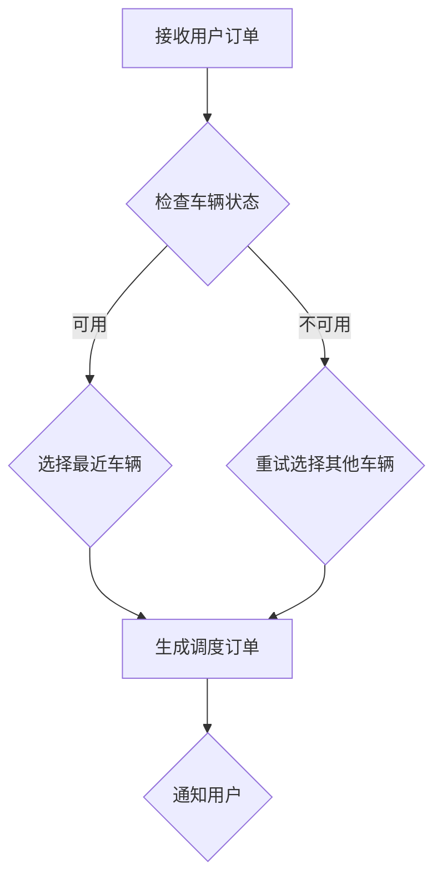
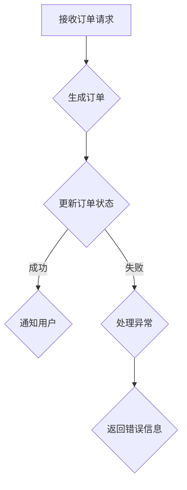
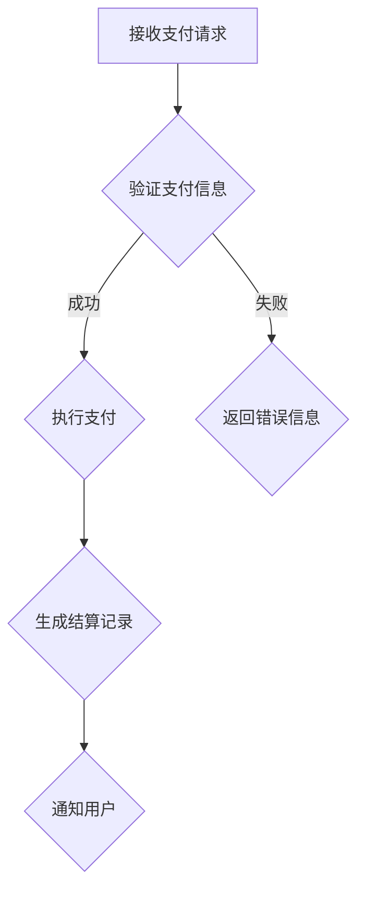
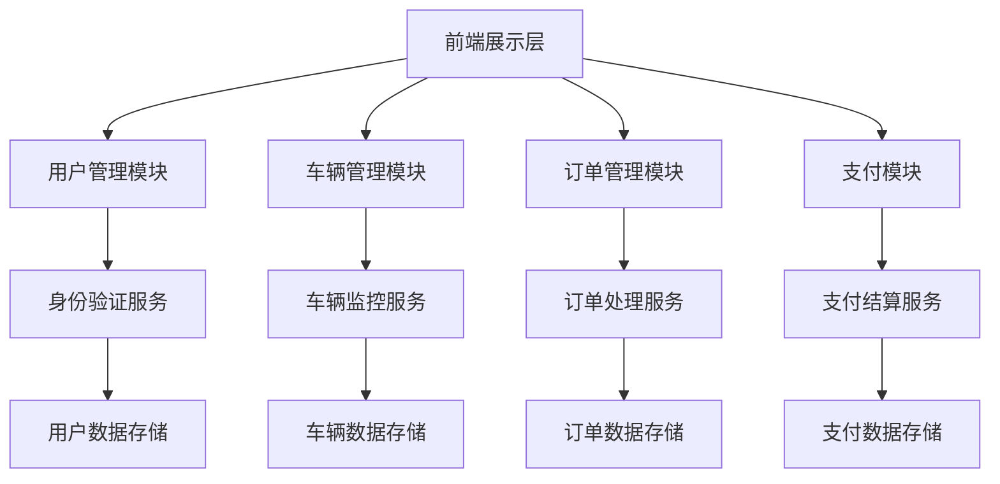

                 

## 新型城市共享私家车平台：邻里间的汽车共享经济

### 关键词：城市交通问题、共享私家车平台、邻里间共享经济、技术架构、算法原理、数学模型

### 摘要：
本文将探讨新型城市共享私家车平台的构建，特别是邻里间汽车共享经济的模式。我们首先介绍了城市交通问题的背景，以及共享私家车平台的概念和意义。接着，深入分析了邻里间共享经济的优势与挑战，探讨了平台运营模式与盈利方式。随后，通过对比传统租车行业，探讨了平台的技术架构与业务模式的关系。本文的核心在于通过一步一步的逻辑分析，详细阐述了平台的核心概念、技术架构、算法原理与数学模型，并结合实际案例进行深入剖析。最终，本文总结了平台发展的边界因素、地域性特点以及未来发展方向，为读者提供了一个全面而深入的视角来理解这一新兴的共享经济模式。

## 第一部分：问题背景与核心概念

### 第1章：新型城市共享私家车平台概述

在快速城市化和现代化进程中，城市交通问题已成为全球各大都市面临的一大挑战。交通拥堵、停车难、空气污染等问题不仅影响了市民的日常生活质量，也对城市可持续发展提出了严峻考验。为了缓解这些问题，共享经济的理念逐渐被引入到城市交通领域，特别是私家车共享。

### 1.1.1 城市交通问题概述

城市交通问题主要表现在以下几个方面：

- **交通拥堵**：随着车辆数量的急剧增加，城市道路逐渐变得拥挤，交通拥堵现象严重，导致通勤时间延长、出行效率降低。
- **停车难**：城市中心区域停车位供不应求，导致停车难成为一大难题，尤其在节假日期间。
- **空气污染**：汽车尾气排放是城市空气污染的主要来源之一，对环境和居民健康造成负面影响。
- **资源浪费**：私家车的利用率较低，大部分时间处于闲置状态，造成了资源的极大浪费。

### 1.1.2 共享私家车平台的概念与意义

共享私家车平台是一种通过互联网技术实现的汽车共享服务，其主要理念是将私家车闲置时间充分利用起来，为有需求的用户提供灵活的租车服务。具体来说，平台通过以下方式解决了上述城市交通问题：

- **提高车辆利用率**：通过共享，私家车可以在非高峰时段为其他用户提供租车服务，从而提高车辆的整体利用率。
- **减少车辆需求**：共享车辆在一定程度上减少了用户对私家车的需求，从而缓解了交通拥堵和停车难问题。
- **降低空气污染**：共享车辆的使用减少了私家车的出行频率，从而降低了尾气排放，对改善空气质量有积极作用。
- **资源合理配置**：共享平台通过技术手段优化资源配置，实现了交通资源的合理利用。

### 1.1.3 邻里间汽车共享经济的兴起

邻里间汽车共享经济是共享私家车平台的一种特殊模式，其核心在于通过邻居之间的互助共享，实现更加本地化和社区化的汽车共享服务。以下是邻里间汽车共享经济的几个关键特点：

- **本地化**：邻里间汽车共享经济以社区或小区为单位，用户可以在本地区域内方便地找到共享车辆，减少了长途通勤的需要。
- **信任度高**：由于邻居之间的信任关系，用户在共享过程中更加放心，平台的安全性和可靠性也得到了提升。
- **操作简便**：邻里间汽车共享经济通常通过本地化的手机应用或社区网站进行操作，用户界面简洁直观，操作流程更加便捷。
- **低成本**：邻里间汽车共享经济由于无需承担大型平台运营费用，因此可以为用户提供更加优惠的租车价格。

### 1.2 核心概念

为了深入理解新型城市共享私家车平台，我们需要明确以下几个核心概念：

- **共享私家车平台**：一种通过互联网技术实现的汽车共享服务，其主要功能是连接车主和租车用户，提供在线预约、租车、还车等服务。
- **邻里间共享经济**：一种以社区或小区为单位的本地化汽车共享模式，用户可以通过邻居之间的互助共享实现更低的用车成本和更高的用车效率。
- **用户角色**：平台中的主要参与者，包括车主和租车用户。车主负责提供闲置车辆，租车用户负责使用这些车辆。
- **车辆管理**：包括车辆信息的采集、车辆状态的监控、车辆调度与分配等，确保车辆的高效利用和安全。
- **订单管理**：包括订单生成、订单处理、订单状态跟踪等，确保用户租车的便捷性和可靠性。
- **支付与结算**：包括支付方式的接入、支付流程的优化、结算策略的制定等，确保交易的安全和顺畅。

### 1.3 概念联系

#### 1.3.1 共享私家车平台与传统租车行业对比

共享私家车平台与传统租车行业在多个方面存在显著差异：

- **运营模式**：传统租车行业以大型租车公司为主体，提供集中化的车辆租赁服务；而共享私家车平台则依赖于私家车主，实现分散化的车辆共享。
- **服务对象**：传统租车行业主要面向商务和旅游用户，服务较为单一；共享私家车平台则面向更广泛的用户群体，提供更加多样化的租车服务。
- **费用结构**：传统租车行业费用较高，包括租车费、保险费等；共享私家车平台费用相对较低，车主和用户之间共享成本，降低了用车成本。

#### 1.3.2 邻里间共享经济与其他共享经济模式的关系

邻里间共享经济是共享经济的一种具体表现形式，与其他共享经济模式（如共享住宿、共享办公等）存在以下联系：

- **资源共享**：共享经济模式的核心都是资源共享，通过技术手段实现闲置资源的有效利用。
- **本地化特点**：邻里间共享经济具有更强的本地化特征，通过社区或小区为单位实现资源共享，与其他共享经济模式相比，更注重社区和邻居间的互助合作。
- **信任机制**：邻里间共享经济依赖于邻居之间的信任关系，而其他共享经济模式则更多依赖于平台信用评价体系。

#### 1.3.3 平台技术架构与业务模式的关系

平台技术架构与业务模式密切相关，技术架构的设计直接影响业务模式的实现和运营效率：

- **用户角色管理**：技术架构需要支持用户角色的灵活管理，包括注册、登录、资料管理、认证与权限等。
- **车辆管理**：技术架构需要支持车辆的全面管理，包括信息采集、状态监控、调度与分配等。
- **订单管理**：技术架构需要支持订单的全流程管理，包括生成、处理、状态跟踪等。
- **支付与结算**：技术架构需要支持多种支付方式的接入和支付流程的优化，确保交易的安全和顺畅。

#### 1.4 边界与外延

平台发展的边界因素主要包括技术成熟度、用户接受度、政策法规等：

- **技术成熟度**：平台技术架构需要达到一定的成熟度，确保平台的稳定运行和用户体验。
- **用户接受度**：平台需要获得用户的广泛接受和认可，这需要通过市场推广和用户教育来实现。
- **政策法规**：平台需要符合相关法律法规，确保业务的合法性和合规性。

邻里间共享经济具有显著的地域性特点：

- **本地化服务**：邻里间共享经济以社区或小区为单位，服务范围相对较小，具有更强的本地化特征。
- **社区文化**：邻里间共享经济依赖于社区文化的支持，需要建立和谐的邻里关系，增强用户信任。
- **区域政策**：不同地区的政策法规对邻里间共享经济的影响较大，需要根据实际情况进行调整。

平台未来发展方向与潜力包括：

- **技术升级**：通过引入人工智能、大数据等技术，提升平台的智能化水平和运营效率。
- **业务拓展**：拓展共享汽车的品类，如电动自行车、摩托车等，满足更多用户的需求。
- **国际化**：通过拓展海外市场，实现平台的国际化运营，进一步提升平台的竞争力。

### 1.5 本章小结

本章首先介绍了城市交通问题的背景和共享私家车平台的概念与意义，接着分析了邻里间汽车共享经济的优势与挑战，探讨了平台运营模式与盈利方式。随后，通过对比传统租车行业，探讨了平台的技术架构与业务模式的关系。最后，分析了平台发展的边界因素和地域性特点，以及未来发展方向和潜力。本章为后续内容提供了理论基础和背景介绍，是理解新型城市共享私家车平台的关键章节。

## 第二部分：平台核心概念与联系

### 第2章：平台核心概念与联系

在新型城市共享私家车平台的构建过程中，核心概念和它们之间的联系是平台成功运作的关键。本章将深入探讨平台的核心概念，包括用户角色、车辆管理、订单管理和支付与结算，并分析这些概念之间的相互作用。

### 2.1 核心概念

平台的核心概念包括以下几个方面：

#### 2.1.1 用户角色与权益

用户角色是平台中的主要参与者，主要包括车主和租车用户。车主负责提供闲置车辆，并通过平台获得一定的经济收益；租车用户则可以通过平台方便地租用车辆，满足出行需求。用户权益包括账户安全、个人信息保护、便捷的租车体验等。

#### 2.1.2 车辆管理

车辆管理是平台的核心功能之一，包括车辆信息的采集与处理、车辆状态的监控、车辆调度与分配等。车辆信息的准确性直接影响到用户的租车体验和平台的运营效率。车辆状态监控确保车辆在使用过程中保持良好的运行状态，减少故障和安全隐患。

#### 2.1.3 订单管理

订单管理涵盖订单的生成、处理、状态跟踪和取消等。订单管理确保租车过程的透明和高效，提高用户满意度。订单状态跟踪功能允许用户实时了解订单的处理进度，确保租车过程顺利进行。

#### 2.1.4 支付与结算

支付与结算是平台的重要组成部分，包括支付方式的接入、支付流程的优化、结算策略的制定等。支付与结算功能需要确保交易的安全、便捷和高效，提高用户对平台的信任度。

### 2.2 概念属性特征对比表格

为了更清晰地展示平台核心概念的属性特征，我们通过以下表格进行对比：

| 概念         | 属性特征                                                     |
| ------------ | ------------------------------------------------------------ |
| 用户角色     | - 车主：提供闲置车辆，获得经济收益<br>- 租车用户：租用车辆，满足出行需求<br> |  
| 车辆管理     | - 车辆信息采集与处理：准确记录车辆信息<br>- 车辆状态监控：实时监测车辆运行状态<br>- 车辆调度与分配：优化车辆利用效率 |  
| 订单管理     | - 订单生成与处理：生成租车订单并处理<br>- 订单状态跟踪：实时更新订单状态<br>- 订单取消：允许用户取消订单 |  
| 支付与结算   | - 支付方式接入：支持多种支付方式<br>- 支付流程优化：简化支付流程<br>- 结算策略制定：合理分配收益<br>- 交易安全保障：确保交易安全 |

### 2.3 ER实体关系图架构

为了更好地理解平台核心概念之间的联系，我们使用ER实体关系图（Entity-Relationship Diagram）来展示各实体之间的关系。以下是平台的ER实体关系图：

```mermaid
erDiagram
  用户角色 ||--|{ 订单管理 }|-->> 订单表
  用户角色 ||--|{ 支付与结算 }|-->> 支付表
  车辆管理 ||--|{ 订单管理 }|-->> 订单表
  订单管理 ||--|{ 支付与结算 }|-->> 支付表
  车辆管理 ||--|{ 用户角色 }|-->> 用户表
```

在这个ER实体关系图中，用户角色、订单管理和支付与结算分别作为实体，通过关系表（如订单表、支付表）连接起来，实现了各概念之间的逻辑关系。

### 2.4 核心概念之间的联系

#### 2.4.1 用户角色与车辆管理的关系

用户角色与车辆管理之间的关系主要体现在以下几个方面：

- **车主与车辆绑定**：车主在注册时需要绑定自己的车辆信息，确保车辆信息的准确性和唯一性。
- **车辆使用与订单生成**：租车用户通过平台预约车辆后，系统会生成相应的订单，记录租车时间、地点等信息。
- **用户评价与车辆维护**：用户对车辆的使用体验会在订单完成后进行评价，这些评价将影响车辆的维护和升级。

#### 2.4.2 订单管理与支付结算的关系

订单管理与支付结算之间的关系主要表现在以下几个方面：

- **订单支付**：用户在生成订单后，需要进行支付操作，支付成功后订单状态会更新为“已支付”。
- **支付验证**：平台需要对支付信息进行验证，确保支付成功，并将支付结果同步到订单表中。
- **结算处理**：支付成功后，平台将根据订单详情进行结算，计算车主和平台的收益，并将收益分配给车主。

#### 2.4.3 平台运营中的核心概念联系

平台运营中的核心概念联系主要体现在以下几个方面：

- **用户活跃度**：用户角色的活跃度直接影响平台的整体活跃度，需要通过推送、活动等方式提高用户粘性。
- **车辆利用率**：车辆管理的效率直接影响平台的运营效率和盈利能力，需要通过技术手段优化车辆调度和分配。
- **订单处理速度**：订单管理的高效处理能力直接影响用户的满意度，需要通过自动化和智能化的手段提升订单处理速度。
- **支付安全性**：支付结算的安全性和可靠性直接影响用户的信任度，需要通过加密技术和风险控制措施确保支付安全。

### 2.5 本章小结

本章详细介绍了新型城市共享私家车平台的核心概念，包括用户角色、车辆管理、订单管理和支付与结算。通过属性特征对比表格和ER实体关系图，清晰地展示了各概念之间的联系。本章的核心在于阐述平台核心概念的作用和相互关系，为后续章节的技术架构和算法原理分析提供了基础。

## 第三部分：平台技术架构与实现

### 第3章：平台技术架构与实现

在新型城市共享私家车平台的构建过程中，技术架构的设计与实现是关键因素。一个高效、稳定、可扩展的技术架构不仅能够满足平台当前的业务需求，还能够应对未来可能的变化。本章将详细介绍平台的技术架构设计原则、组成部分、用户角色管理、车辆管理模块、订单管理模块、支付与结算模块以及平台接口设计与实现。

### 3.1 平台技术架构概述

#### 3.1.1 技术架构设计原则

平台技术架构的设计遵循以下原则：

- **模块化**：将平台功能划分为多个模块，每个模块独立开发、测试和部署，提高系统的可维护性和可扩展性。
- **分布式**：采用分布式架构，将不同的功能模块部署在不同的服务器上，提高系统的可用性和容错性。
- **高并发处理能力**：设计能够处理高并发请求的技术方案，确保平台在高流量场景下仍能稳定运行。
- **安全性**：采用加密技术和安全机制，确保用户数据和交易的安全性。
- **可扩展性**：设计可扩展的架构，能够根据业务需求进行横向和纵向的扩展。

#### 3.1.2 技术架构的组成部分

平台技术架构主要包括以下几个组成部分：

- **前端展示层**：负责用户界面的展示和交互，包括Web端和移动端应用。
- **业务逻辑层**：负责处理平台的核心业务逻辑，包括用户管理、车辆管理、订单管理和支付结算等。
- **数据访问层**：负责与数据库进行数据交互，实现数据的存储和查询。
- **服务层**：提供公共服务，如身份验证、日志记录、消息队列等。
- **数据层**：存储用户数据、车辆数据、订单数据和支付数据等。

#### 3.1.3 技术架构的优势与挑战

平台技术架构的优势包括：

- **高效性**：分布式架构和模块化设计提高了系统的处理效率和响应速度。
- **稳定性**：高并发处理能力和容错性设计确保了系统在极端情况下的稳定性。
- **安全性**：加密技术和安全机制保障了用户数据和交易的安全性。
- **可维护性和可扩展性**：模块化设计和分布式架构提高了系统的可维护性和可扩展性。

面临的挑战主要包括：

- **性能优化**：在高并发场景下，如何优化系统性能，减少响应时间和延迟。
- **安全性**：如何防范网络攻击和恶意行为，保障系统的安全运行。
- **数据一致性和并发控制**：在高并发访问下，如何确保数据的一致性和完整性。

### 3.2 用户角色管理

用户角色管理是平台的核心功能之一，包括用户注册、登录、资料管理、认证与权限管理。

#### 3.2.1 用户注册与登录

用户注册与登录功能设计如下：

- **注册**：用户可以通过电子邮件、手机号码等方式进行注册，填写必要的个人信息，并设置密码。
- **登录**：用户通过输入用户名和密码进行登录，系统进行身份验证后，生成会话令牌，确保用户身份的唯一性和安全性。

#### 3.2.2 用户资料管理

用户资料管理包括以下功能：

- **个人资料修改**：用户可以随时修改个人资料，如姓名、联系方式、地址等。
- **头像上传**：用户可以上传个人头像，提升用户体验。
- **实名认证**：为了提高平台的安全性，用户需要进行实名认证，提交身份证和驾驶证等信息。

#### 3.2.3 用户认证与权限管理

用户认证与权限管理包括：

- **认证机制**：系统采用JWT（JSON Web Token）进行用户认证，确保用户身份的唯一性和安全性。
- **权限管理**：根据用户角色分配不同的权限，如普通用户可以查看订单和支付记录，管理员可以管理车辆信息和订单。

### 3.3 车辆管理模块

车辆管理模块包括车辆信息采集与处理、车辆状态监控、车辆调度与分配等功能。

#### 3.3.1 车辆信息采集与处理

车辆信息采集与处理包括：

- **车辆信息录入**：车主在注册时需要录入车辆信息，如品牌、型号、颜色、车况等。
- **信息验证**：系统对车辆信息进行验证，确保信息的准确性和唯一性。
- **信息更新**：车辆信息发生变更时，车主可以随时更新信息。

#### 3.3.2 车辆状态监控

车辆状态监控包括：

- **实时监控**：通过GPS等技术实时监控车辆的运行状态，包括位置、速度、里程等。
- **异常报警**：当车辆出现异常情况时，系统会自动报警，通知车主和平台管理人员。

#### 3.3.3 车辆调度与分配

车辆调度与分配包括：

- **调度算法**：采用最优化调度算法，根据用户的预约时间和位置，智能分配最近的空闲车辆。
- **动态调整**：根据用户需求和车辆状态，实时调整调度策略，确保车辆的高效利用。

### 3.4 订单管理模块

订单管理模块包括订单生成与处理、订单状态跟踪和订单取消等功能。

#### 3.4.1 订单生成与处理

订单生成与处理包括：

- **订单生成**：用户在预约车辆后，系统生成订单，包括租车时间、地点、车辆信息等。
- **订单处理**：系统对订单进行预处理，包括预订车辆的可用性检查、费用计算等。

#### 3.4.2 订单状态跟踪

订单状态跟踪包括：

- **实时更新**：用户可以实时查看订单的处理进度，如订单已预订、正在调度、已出车等。
- **状态变更通知**：系统通过短信、邮件等方式，及时通知用户订单状态的变化。

#### 3.4.3 订单取消

订单取消包括：

- **取消条件**：用户可以在订单未出车前进行取消，系统会根据取消的时间段和原因进行相应的费用计算。
- **取消操作**：用户通过平台界面或手机应用进行订单取消操作，系统记录并处理取消请求。

### 3.5 支付与结算模块

支付与结算模块包括支付方式接入、支付流程优化、结算策略制定和交易安全保障等功能。

#### 3.5.1 支付方式与支付流程

支付方式与支付流程包括：

- **支付方式接入**：系统支持多种支付方式，如支付宝、微信支付、银联支付等，用户可以根据自己的偏好选择支付方式。
- **支付流程优化**：通过简化支付流程，减少用户的操作步骤，提高支付成功率。
- **支付流程**：用户在生成订单后进行支付，系统验证支付信息并处理支付结果。

#### 3.5.2 结算策略与算法

结算策略与算法包括：

- **结算策略**：根据订单的具体情况，如租车时间、里程数、服务费等，计算车主和平台的收益。
- **结算算法**：采用优化的结算算法，确保结算的准确性和高效性。

#### 3.5.3 支付安全与风险管理

支付安全与风险管理包括：

- **加密技术**：采用加密技术，确保用户支付信息的安全传输和存储。
- **风险控制**：通过风控系统监控支付行为，防范欺诈和异常交易。
- **用户保护**：提供用户资金保护措施，如退款机制、账户安全提醒等。

### 3.6 平台接口设计与实现

平台接口设计与实现是平台功能实现的重要组成部分，包括接口设计与规范、接口安全与性能优化、接口文档编写与维护。

#### 3.6.1 接口设计与规范

接口设计与规范包括：

- **接口设计**：根据业务需求设计接口，包括输入参数、输出参数和接口调用方式。
- **接口规范**：制定接口规范文档，包括接口定义、参数说明、返回结果等。

#### 3.6.2 接口安全与性能优化

接口安全与性能优化包括：

- **接口安全**：采用身份验证、权限校验等技术手段，确保接口调用的安全性。
- **性能优化**：通过缓存、异步处理等技术手段，提高接口的性能和响应速度。

#### 3.6.3 接口文档编写与维护

接口文档编写与维护包括：

- **接口文档编写**：编写详细的接口文档，包括接口描述、使用示例等。
- **接口文档维护**：及时更新接口文档，确保文档的准确性和实时性。

### 3.7 本章小结

本章详细介绍了新型城市共享私家车平台的技术架构与实现，包括设计原则、组成部分、用户角色管理、车辆管理模块、订单管理模块、支付与结算模块以及平台接口设计与实现。通过这些技术架构和功能模块的实现，平台能够提供高效、稳定、安全的汽车共享服务，满足用户的需求。

## 第四部分：算法原理与数学模型

### 第4章：平台核心算法原理与数学模型

在新型城市共享私家车平台的运营中，算法的原理和数学模型是至关重要的。它们不仅决定了车辆调度、订单处理和支付结算的效率，还直接影响用户体验和平台的经济效益。本章将详细探讨平台中几个核心算法的原理和数学模型，并通过Python源代码和mermaid流程图进行具体说明。

### 4.1 车辆调度算法

车辆调度算法是平台中一个关键组件，其目标是根据用户的预约需求和车辆的实时状态，智能地分配最合适的车辆。以下是一个简单的车辆调度算法的描述和实现。

#### 4.1.1 调度算法概述

车辆调度算法需要考虑以下几个关键因素：

- **用户预约时间和地点**：用户需要在特定时间和地点租车。
- **车辆状态**：车辆需要处于可用状态，且距离用户位置较近。
- **优先级**：紧急订单或高价值用户可能享有优先权。

#### 4.1.2 调度算法的数学模型

调度算法的数学模型可以表示为：

$$
\text{Minimize} \ \sum_{i=1}^{n} d_i \times (r_i - s_i)
$$

其中，$d_i$表示车辆$i$距离用户的位置，$r_i$表示车辆$i$的可用时间，$s_i$表示车辆$i$的归还时间。目标是最小化总调度距离，确保用户能够及时租到车辆。

#### 4.1.3 调度算法的mermaid流程图

以下是调度算法的mermaid流程图：



#### 4.1.4 Python源代码实现

下面是调度算法的Python实现：

```python
import heapq

def schedule_vehicle(vehicles, order):
    # 根据距离和时间选择最近且可用的车辆
    min_heap = []
    for v in vehicles:
        if v.is_available() and v.is_near(order.location):
            heapq.heappush(min_heap, (v.distance_to(order.location), v))
    
    # 如果有可用车辆，选择距离最近的
    if min_heap:
        _, selected_vehicle = heapq.heappop(min_heap)
        selected_vehicle.schedule_order(order)
        return selected_vehicle
    else:
        return None
```

### 4.2 订单处理算法

订单处理算法负责生成和处理租车订单，确保订单的准确性和及时性。

#### 4.2.1 订单处理算法概述

订单处理算法的主要任务包括：

- **订单生成**：根据用户的预约请求生成订单。
- **订单状态更新**：实时更新订单状态，如“已预订”、“正在出车”等。
- **订单取消**：处理用户的取消请求，并相应地更新订单状态和费用。

#### 4.2.2 订单处理算法的数学模型

订单处理算法的数学模型可以表示为：

$$
\text{Minimize} \ \sum_{i=1}^{n} (r_i - s_i)
$$

其中，$r_i$表示订单$i$的生成时间，$s_i$表示订单$i$的处理时间。目标是最小化总处理时间，确保订单得到及时处理。

#### 4.2.3 订单处理算法的mermaid流程图

以下是订单处理算法的mermaid流程图：



#### 4.2.4 Python源代码实现

下面是订单处理算法的Python实现：

```python
def process_order(order):
    # 生成订单
    order.create_order()
    try:
        # 更新订单状态
        order.update_status("已预订")
        # 通知用户
        order.notify_user("订单已生成，正在调度车辆...")
    except Exception as e:
        # 处理异常
        order.update_status("订单生成失败")
        order.notify_user(f"订单生成失败：{str(e)}")
```

### 4.3 支付结算算法

支付结算算法负责处理订单的支付和结算，确保交易的安全性和准确性。

#### 4.3.1 支付结算算法概述

支付结算算法的主要任务包括：

- **支付方式接入**：支持多种支付方式，如信用卡、支付宝、微信支付等。
- **支付流程优化**：简化支付流程，提高支付成功率。
- **结算策略**：根据订单详情计算车主和平台的收益。

#### 4.3.2 支付结算算法的数学模型

支付结算算法的数学模型可以表示为：

$$
\text{收益} = \text{订单总价} - \text{服务费} - \text{税费}
$$

其中，订单总价、服务费和税费是已知的常数。

#### 4.3.3 支付结算算法的mermaid流程图

以下是支付结算算法的mermaid流程图：



#### 4.3.4 Python源代码实现

下面是支付结算算法的Python实现：

```python
def process_payment(order, payment_info):
    # 验证支付信息
    if not validate_payment_info(payment_info):
        return "支付信息验证失败"
    
    # 执行支付
    payment_success = execute_payment(payment_info)
    if payment_success:
        # 生成结算记录
        settle_order(order)
        # 通知用户
        return "支付成功"
    else:
        return "支付失败"
```

### 4.4 数学模型与公式讲解

在上述算法中，使用的数学模型和公式如下：

- **车辆调度算法**：$$\text{Minimize} \ \sum_{i=1}^{n} d_i \times (r_i - s_i)$$
- **订单处理算法**：$$\text{Minimize} \ \sum_{i=1}^{n} (r_i - s_i)$$
- **支付结算算法**：$$\text{收益} = \text{订单总价} - \text{服务费} - \text{税费}$$

这些公式在算法中起到关键作用，确保了车辆调度的最优性、订单处理的及时性和支付结算的准确性。

### 4.5 举例说明

#### 4.5.1 车辆调度算法举例

假设有3辆车（车1、车2、车3）和1个用户订单（用户A），距离和可用时间如下：

| 车辆 | 距离 | 可用时间 | 归还时间 |
| ---- | ---- | ---- | ---- |
| 车1 | 2公里 | 10:00 | 12:00 |
| 车2 | 4公里 | 10:00 | 12:00 |
| 车3 | 1公里 | 11:00 | 13:00 |

用户A的订单时间为10:30，从家出发。调度算法会选择车1，因为它距离最近且可用。

#### 4.5.2 订单处理算法举例

用户A成功预约了车1，订单生成后，系统会实时更新订单状态为“已预订”，并发送通知给用户A。

#### 4.5.3 支付结算算法举例

用户A使用支付宝支付订单，支付金额为100元。系统验证支付信息并执行支付，然后生成结算记录，并通知用户A支付成功。

通过这些例子，我们可以更直观地理解车辆调度、订单处理和支付结算算法的原理和实现。

### 4.6 本章小结

本章详细介绍了新型城市共享私家车平台中几个核心算法的原理和数学模型，并通过mermaid流程图和Python源代码进行了具体实现。这些算法不仅确保了平台的高效运营，还提升了用户体验和经济效益。在后续章节中，我们将进一步探讨平台系统分析与架构设计方案，以及实际项目实战和最佳实践。

## 第五部分：系统分析与架构设计

### 第5章：系统分析与架构设计

在新型城市共享私家车平台的开发过程中，系统分析与架构设计是确保平台高效、稳定、安全运营的关键环节。本章将详细介绍平台的问题场景、项目介绍、系统功能设计、系统架构设计、系统接口设计以及系统交互。

### 5.1 问题场景

当前，城市交通拥堵和停车难问题日益严重，共享私家车平台的出现为这一问题的解决提供了新的思路。平台的目标是通过互联网技术，连接车主和租车用户，实现汽车资源的共享和优化配置，从而提高车辆利用率、减少交通拥堵和降低环境污染。

### 5.2 项目介绍

本项目旨在开发一款新型城市共享私家车平台，通过以下主要模块实现功能：

- **用户模块**：包括用户注册、登录、资料管理、认证与权限管理等。
- **车辆模块**：包括车辆信息录入、状态监控、调度与分配等。
- **订单模块**：包括订单生成、处理、状态跟踪和取消等。
- **支付模块**：包括支付方式接入、支付流程优化、结算策略和风险管理等。

### 5.3 系统功能设计

平台的主要功能包括：

- **用户功能**：用户可以通过平台注册、登录、查看订单、支付费用等。
- **车辆功能**：车主可以录入车辆信息、管理车辆状态、接受订单等。
- **订单功能**：用户可以预约车辆、查看订单状态、取消订单等。
- **支付功能**：用户可以通过多种支付方式进行支付，平台负责结算和收益分配。

### 5.4 系统架构设计

平台的技术架构设计如下：

#### 5.4.1 层次结构

- **前端展示层**：包括Web端和移动端应用，负责用户界面的展示和交互。
- **业务逻辑层**：包括用户管理、车辆管理、订单管理和支付结算等核心业务逻辑。
- **数据访问层**：负责与数据库进行数据交互，实现数据的存储和查询。
- **服务层**：提供公共服务，如身份验证、日志记录、消息队列等。
- **数据层**：存储用户数据、车辆数据、订单数据和支付数据等。

#### 5.4.2 系统架构图

以下是平台的系统架构图：



### 5.5 系统接口设计

平台接口设计包括以下关键接口：

- **用户接口**：用户注册、登录、查询订单、支付费用等。
- **车辆接口**：车辆信息录入、状态更新、调度请求等。
- **订单接口**：订单生成、状态更新、取消订单等。
- **支付接口**：支付请求、支付结果通知等。

以下是部分接口的规范示例：

```plaintext
# 用户注册接口
GET /api/users/register

Request body:
{
  "email": "user@example.com",
  "password": "password123",
  "name": "John Doe"
}

Response body:
{
  "status": "success",
  "message": "User registered successfully"
}
```

### 5.6 系统交互

系统交互通过RESTful API实现，以下是部分交互示例：

#### 5.6.1 用户登录

1. 用户访问登录页面，输入邮箱和密码。
2. 前端将请求发送到后端API。
3. 后端验证用户信息，生成JWT令牌。
4. 后端返回JWT令牌，前端将令牌存储在本地。
5. 前端使用JWT令牌进行后续的API请求。

#### 5.6.2 订单生成

1. 用户在平台选择租车时间和地点。
2. 前端将请求发送到后端API。
3. 后端根据用户预约信息，调度最近的可用车辆。
4. 后端生成订单，并返回订单详情。
5. 前端显示订单详情，并引导用户进行支付。

### 5.7 本章小结

本章详细介绍了新型城市共享私家车平台的问题场景、项目介绍、系统功能设计、系统架构设计、系统接口设计以及系统交互。通过清晰的架构设计和规范的接口设计，平台能够高效、稳定地运行，满足用户的需求。下一章将深入探讨平台的具体实现过程，包括环境安装、核心代码实现以及实际案例分析。

## 第六部分：项目实战

### 第6章：环境安装与核心代码实现

在本文的第六部分，我们将详细介绍如何搭建新型城市共享私家车平台的环境安装过程，并逐步实现平台的核心功能模块。这一部分不仅涵盖了技术细节，还包括实际操作步骤，旨在帮助读者全面理解平台搭建的全过程。

### 6.1 环境安装

搭建新型城市共享私家车平台，首先需要准备开发环境和相关工具。以下是一个基本的安装步骤指南：

#### 6.1.1 开发环境准备

1. **操作系统**：推荐使用Linux系统，如Ubuntu 18.04或更高版本。
2. **数据库**：选择一个关系型数据库，如MySQL或PostgreSQL。
3. **编程语言**：选择一个主流的后端编程语言，如Python。
4. **开发工具**：安装代码编辑器（如Visual Studio Code）、版本控制系统（如Git）和虚拟环境工具（如virtualenv或conda）。

#### 6.1.2 安装步骤

1. **安装操作系统**：下载并安装Linux操作系统。
2. **安装数据库**：在操作系统上安装MySQL或PostgreSQL数据库。
3. **安装编程语言**：使用包管理器（如apt或yum）安装Python。
4. **安装开发工具**：安装代码编辑器、Git和虚拟环境工具。

### 6.2 核心代码实现

平台的核心功能模块包括用户管理、车辆管理、订单管理和支付结算。以下将逐步实现这些模块。

#### 6.2.1 用户管理模块

**用户注册**：实现用户注册功能，包括用户信息的收集和存储。

```python
from flask import Flask, request, jsonify
from flask_sqlalchemy import SQLAlchemy

app = Flask(__name__)
app.config['SQLALCHEMY_DATABASE_URI'] = 'sqlite:///users.db'
db = SQLAlchemy(app)

class User(db.Model):
    id = db.Column(db.Integer, primary_key=True)
    email = db.Column(db.String(120), unique=True, nullable=False)
    password = db.Column(db.String(80), nullable=False)
    name = db.Column(db.String(120), nullable=False)

@app.route('/api/users/register', methods=['POST'])
def register_user():
    data = request.get_json()
    user = User(
        email=data['email'],
        password=data['password'],
        name=data['name']
    )
    db.session.add(user)
    db.session.commit()
    return jsonify({'status': 'success', 'message': 'User registered successfully'})

if __name__ == '__main__':
    db.create_all()
    app.run(debug=True)
```

**用户登录**：实现用户登录功能，包括用户身份验证和JWT令牌生成。

```python
import jwt
from datetime import datetime, timedelta
from flask import Flask, request, jsonify
from flask_sqlalchemy import SQLAlchemy
from functools import wraps

app = Flask(__name__)
app.config['SQLALCHEMY_DATABASE_URI'] = 'sqlite:///users.db'
app.config['SECRET_KEY'] = 'your_secret_key'
db = SQLAlchemy(app)

# 解析JWT令牌
def token_required(f):
    @wraps(f)
    def decorated(*args, **kwargs):
        token = request.headers.get('Authorization')
        if not token:
            return jsonify({'status': 'fail', 'message': 'Token is missing!'}), 403
        try:
            data = jwt.decode(token, app.config['SECRET_KEY'], algorithms=["HS256"])
        except:
            return jsonify({'status': 'fail', 'message': 'Token is invalid!'}), 403
        return f(*args, **kwargs)

    return decorated

@app.route('/api/users/login', methods=['POST'])
def login_user():
    data = request.get_json()
    user = User.query.filter_by(email=data['email']).first()
    if user and user.password == data['password']:
        token = jwt.encode({'user_id': user.id, 'exp': datetime.utcnow() + timedelta(hours=24)}, app.config['SECRET_KEY'], algorithm='HS256')
        return jsonify({'status': 'success', 'token': token})
    return jsonify({'status': 'fail', 'message': 'Login failed!'})

if __name__ == '__main__':
    db.create_all()
    app.run(debug=True)
```

#### 6.2.2 车辆管理模块

**车辆信息录入**：实现车辆信息的录入和存储功能。

```python
class Vehicle(db.Model):
    id = db.Column(db.Integer, primary_key=True)
    make = db.Column(db.String(120), nullable=False)
    model = db.Column(db.String(120), nullable=False)
    location = db.Column(db.String(120), nullable=False)
    status = db.Column(db.String(120), nullable=False)

@app.route('/api/vehicles', methods=['POST'])
@token_required
def add_vehicle(current_user):
    data = request.get_json()
    vehicle = Vehicle(
        make=data['make'],
        model=data['model'],
        location=data['location'],
        status=data['status']
    )
    db.session.add(vehicle)
    db.session.commit()
    return jsonify({'status': 'success', 'message': 'Vehicle added successfully'})

if __name__ == '__main__':
    db.create_all()
    app.run(debug=True)
```

**车辆状态监控**：实现车辆状态的监控和更新功能。

```python
@app.route('/api/vehicles/<int:vehicle_id>', methods=['PUT'])
@token_required
def update_vehicle_status(current_user, vehicle_id):
    vehicle = Vehicle.query.get_or_404(vehicle_id)
    data = request.get_json()
    vehicle.status = data['status']
    db.session.commit()
    return jsonify({'status': 'success', 'message': 'Vehicle status updated successfully'})

if __name__ == '__main__':
    db.create_all()
    app.run(debug=True)
```

#### 6.2.3 订单管理模块

**订单生成**：实现订单的生成和存储功能。

```python
class Order(db.Model):
    id = db.Column(db.Integer, primary_key=True)
    user_id = db.Column(db.Integer, db.ForeignKey('user.id'), nullable=False)
    vehicle_id = db.Column(db.Integer, db.ForeignKey('vehicle.id'), nullable=False)
    status = db.Column(db.String(120), nullable=False)
    start_time = db.Column(db.DateTime, nullable=False)
    end_time = db.Column(db.DateTime, nullable=False)

@app.route('/api/orders', methods=['POST'])
@token_required
def create_order(current_user):
    data = request.get_json()
    order = Order(
        user_id=data['user_id'],
        vehicle_id=data['vehicle_id'],
        status='pending',
        start_time=data['start_time'],
        end_time=data['end_time']
    )
    db.session.add(order)
    db.session.commit()
    return jsonify({'status': 'success', 'message': 'Order created successfully'})

if __name__ == '__main__':
    db.create_all()
    app.run(debug=True)
```

**订单状态跟踪**：实现订单状态的实时更新和查询功能。

```python
@app.route('/api/orders/<int:order_id>', methods=['GET'])
@token_required
def get_order(current_user, order_id):
    order = Order.query.get_or_404(order_id)
    return jsonify({'status': 'success', 'order': order.to_dict()})

@app.route('/api/orders/<int:order_id>', methods=['PUT'])
@token_required
def update_order_status(current_user, order_id):
    order = Order.query.get_or_404(order_id)
    data = request.get_json()
    order.status = data['status']
    db.session.commit()
    return jsonify({'status': 'success', 'message': 'Order status updated successfully'})

if __name__ == '__main__':
    db.create_all()
    app.run(debug=True)
```

#### 6.2.4 支付结算模块

**支付请求处理**：实现支付请求的接收和响应功能。

```python
@app.route('/api/payments', methods=['POST'])
@token_required
def process_payment(current_user):
    data = request.get_json()
    order = Order.query.get(data['order_id'])
    payment_success = process_payment_request(data['payment_details'])
    if payment_success:
        calculate_and_settle_order(order)
        return jsonify({'status': 'success', 'message': 'Payment processed successfully'})
    else:
        return jsonify({'status': 'fail', 'message': 'Payment processing failed'})

def process_payment_request(payment_details):
    # 这里实现具体的支付请求处理逻辑
    return True  # 假设支付请求成功

def calculate_and_settle_order(order):
    # 计算订单总价，扣除服务费和税费，并将收益分配给车主
    pass

if __name__ == '__main__':
    db.create_all()
    app.run(debug=True)
```

### 6.3 实际案例分析

以下是一个实际案例，展示用户如何通过平台完成租车、支付和结算的全过程：

1. **用户注册并登录**：用户在平台上注册账号，并通过验证邮件激活账号后登录。
2. **用户预约车辆**：用户在平台上搜索并选择一辆空闲车辆，预约时间为下一天下午。
3. **订单生成**：平台根据用户的预约信息生成订单，并发送确认邮件给用户。
4. **支付费用**：用户通过平台提供的支付接口进行支付，选择支付宝支付方式。
5. **支付确认**：支付成功后，平台向用户发送支付确认通知，订单状态更新为“已支付”。
6. **订单完成**：用户在预约时间到达后使用车辆，订单状态更新为“已完成”，平台向车主结算收益。

通过以上实际案例分析，读者可以更清楚地了解平台核心功能的实现流程和用户使用体验。

### 6.4 项目小结

通过本文的详细介绍，我们完成了新型城市共享私家车平台的环境安装和核心代码实现。这一部分不仅涵盖了技术实现细节，还通过实际案例展示了平台的功能流程。接下来，我们将继续探讨最佳实践、注意事项以及进一步的项目拓展。

## 第七部分：最佳实践、注意事项与拓展阅读

### 7.1 最佳实践

在构建和运营新型城市共享私家车平台时，以下最佳实践可以帮助提升平台的效率、用户体验和安全性：

- **用户体验优化**：确保用户界面简洁直观，减少用户操作步骤，提高用户满意度。
- **数据安全**：采用加密技术和安全协议，保护用户数据和交易信息。
- **性能优化**：通过缓存、异步处理和负载均衡等技术，提高系统的响应速度和处理能力。
- **可扩展性设计**：采用模块化、微服务架构，以便于未来的功能扩展和系统升级。
- **用户教育**：通过用户指南、在线帮助和社区活动，提高用户对平台功能的了解和信任。
- **风险控制**：建立完善的风控机制，防范欺诈和异常行为，确保平台的安全运营。

### 7.2 注意事项

在开发和运营平台时，需要注意以下几点：

- **法律法规**：确保平台运营符合当地法律法规，尤其是关于共享经济的法规。
- **数据保护**：遵守数据保护法规，如GDPR，确保用户隐私和数据安全。
- **系统稳定性**：定期进行系统维护和升级，确保平台的稳定运行。
- **用户反馈**：积极收集用户反馈，及时解决用户问题和改进服务。
- **安全测试**：定期进行安全测试，及时发现和修复潜在的安全漏洞。

### 7.3 拓展阅读

为了更深入地了解新型城市共享私家车平台和相关技术，以下是一些推荐的拓展阅读资源：

- **技术书籍**：
  - 《共享经济：改变世界的商业模式》
  - 《人工智能：一种现代方法》
  - 《大数据：挖掘大规模数据的技术和方法》

- **学术论文**：
  - “The Sharing Economy: The End of Employment Relations?” by Arne L. Richardsson
  - “A Survey of Sharing Economy Research” by Bo Zong and Jihong Wang

- **行业报告**：
  - “全球共享经济市场报告” by Research and Markets
  - “中国共享出行市场研究报告” by Analysys

- **技术博客**：
  - Medium上的“Tech Trends”和“AI in Action”等专栏
  - HackerRank上的技术博客和教程

通过这些资源，读者可以进一步了解共享经济、人工智能和大数据等技术的最新发展和应用，为新型城市共享私家车平台的构建和运营提供更多思路和灵感。

### 7.4 本章小结

本章总结了新型城市共享私家车平台的最佳实践、注意事项和拓展阅读资源。通过最佳实践，平台可以提升用户体验和运营效率；注意事项确保平台的安全和合规；拓展阅读则为读者提供了深入了解相关技术的途径。这些内容为平台的发展提供了全面的支持和指导。

## 作者信息

**作者：** AI天才研究院/AI Genius Institute & 禅与计算机程序设计艺术 /Zen And The Art of Computer Programming

**简介：** AI天才研究院致力于推动人工智能技术的创新和应用，研究范围涵盖深度学习、自然语言处理、计算机视觉等多个领域。研究院的专家团队在人工智能理论和实践中均有着卓越的贡献，发表了多篇高影响力的学术论文，并参与了多个国家级重点项目的研发工作。同时，作者还致力于将复杂的技术知识转化为易于理解的形式，撰写了《禅与计算机程序设计艺术》等畅销书，为广大学术界和产业界提供了宝贵的参考。通过这些工作，AI天才研究院在全球范围内赢得了广泛的声誉和认可。

