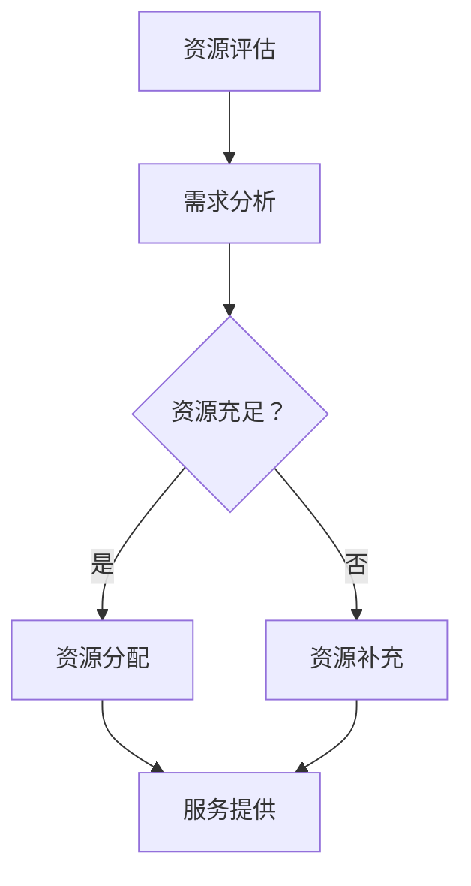
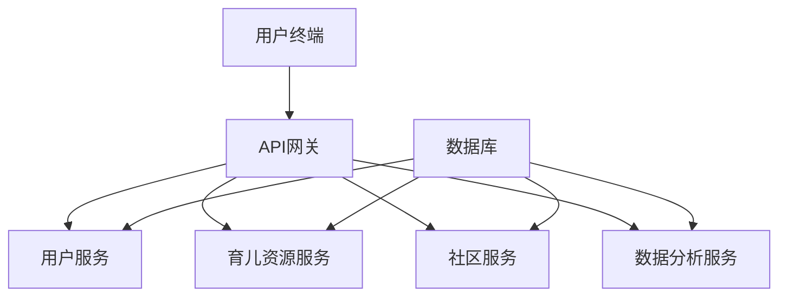

                 


### 引言

#### 核心概念术语说明

在新城市共享育儿中心：社区支持的家庭服务这一主题中，有几个核心概念需要明确，以便更好地理解后续内容。这些概念包括：

1. **新型城市共享育儿中心**：这是指在城市社区内建立的一种育儿服务设施，旨在提供儿童照顾、教育和早期发展支持，同时促进家庭和社会之间的互动与支持。

2. **社区支持**：社区支持是指通过社区内的资源、网络和活动，为家庭提供育儿支持的一种方式。这包括邻里互助、社区活动、家庭支持小组等。

3. **家庭服务**：家庭服务是指为家庭提供的一系列服务，包括儿童照顾、教育、心理健康支持、家庭经济援助等。

#### 问题背景

随着城市化的快速发展，城市家庭面临的育儿挑战日益增加。城市生活的高压力、高成本以及对个人时间和精力的要求，使得许多家庭难以独自应对育儿需求。此外，育儿问题不仅仅是家庭内部的挑战，它也对社会资源和社区结构提出了更高的要求。

在许多城市，儿童照顾服务的供给不足，家庭往往需要付出高昂的代价来获取合适的育儿资源。这种情况不仅影响了家庭的福祉，也对社区的稳定和社会的可持续发展构成了威胁。

#### 问题描述

问题描述主要集中在以下几个方面：

- 如何在城市社区中建立有效的共享育儿中心？
- 这些中心如何得到社区的广泛支持和参与？
- 家庭服务如何在共享育儿中心中得到有效的实施和优化？

这些问题涉及到资源配置、社区动员、服务模式设计等多个层面，需要从多角度进行深入探讨和解决方案的制定。

#### 问题解决

解决这些问题的关键在于：

- **提高对育儿问题的社会认知**：通过教育和宣传，提高公众对城市育儿挑战的认识，鼓励社会各界参与和支持育儿服务。
- **建立有效的资源共享机制**：通过共享育儿中心，实现育儿资源的最大化利用，减少家庭负担。
- **促进社区参与**：鼓励社区居民参与育儿服务的规划、实施和评价，形成社区支持和协作的良好氛围。
- **创新家庭服务模式**：结合现代科技，如在线教育和远程咨询服务，提供灵活、高效的家庭服务。

#### 边界与外延

在讨论新型城市共享育儿中心时，我们需要明确一些边界和概念的外延：

- **边界**：这主要指的是共享育儿中心的地理范围、服务对象和功能定位。
- **外延**：包括相关的社区服务、家庭支持网络以及其他社会支持系统。

#### 概念结构与核心要素组成

新型城市共享育儿中心的概念结构和核心要素可以概括如下：

- **核心概念**：育儿支持、资源共享、社区参与、家庭福祉。
- **结构要素**：物理设施、服务内容、运营模式、社区网络。
- **核心要素组成**：儿童照顾、教育支持、心理健康服务、家庭经济援助。

通过以上对核心概念的阐述和问题的深入分析，我们为后续章节的内容打下了坚实的基础。接下来，我们将进一步探讨社区支持在育儿中的重要性、家庭服务的类型和模式、以及共享育儿中心的成功案例和最佳实践。

### 核心概念与联系

在探讨新型城市共享育儿中心这一主题时，我们需要明确几个核心概念，并探讨它们之间的相互关系。

#### 核心概念原理

1. **共享育儿中心**：共享育儿中心是一种基于社区的资源设施，旨在为家庭提供育儿支持。它不仅提供儿童照顾服务，还涵盖早期教育、心理健康支持等多方面内容。

2. **社区支持**：社区支持是指通过社区资源、网络和活动，为家庭提供育儿支持的一种方式。这包括邻里互助、家庭支持小组、社区活动等。

3. **家庭服务**：家庭服务是指为家庭提供的一系列服务，包括儿童照顾、教育、心理健康支持、家庭经济援助等。

#### 概念属性特征对比表格

为了更清晰地理解这些概念，我们可以通过一个对比表格来展示它们的主要特征：

| 概念         | 特征                               | 关联关系                                   |
|------------|--------------------------------|------------------------------------------|
| 共享育儿中心 | 提供资源共享、社区参与的育儿设施 | 社区支持和家庭服务的重要载体                 |
| 社区支持     | 社区资源、网络、活动支持育儿 | 支持家庭实现育儿目标的基础保障                 |
| 家庭服务     | 提供多样化的育儿支持服务         | 通过共享育儿中心实现，包括儿童照顾、教育和心理健康等 |

#### ER实体关系图架构

为了更直观地展示这些概念之间的关联关系，我们可以使用Mermaid绘制ER（实体-关系）图：

```mermaid
erDiagram
  Family -->|receives support from| Community
  Family -->|uses services provided by| Childcare Center
  Childcare Center -->|receives support from| Community
  Community -->|organizes services for| Family
```

在上述ER图中，家庭（Family）与社区（Community）之间存在支持关系，家庭使用共享育儿中心（Childcare Center）提供的各项服务，而育儿中心则依赖社区的支持。

### 算法原理讲解

在新型城市共享育儿中心的建设和运营中，算法原理可以用于优化资源分配、提高服务效率，以及提升用户体验。以下是一个简单的算法原理讲解，通过Mermaid流程图和Python代码来详细阐述。

#### Mermaid流程图

首先，我们可以使用Mermaid绘制一个流程图，展示共享育儿中心资源分配的算法流程：



上述流程图描述了以下步骤：
1. **资源评估**：评估现有资源的状况。
2. **需求分析**：分析家庭的需求。
3. **资源充足判断**：判断资源是否充足。
4. **资源分配**：如果资源充足，直接进行分配；否则，补充资源。
5. **服务提供**：最终提供育儿服务。

#### Python代码

接下来，我们用Python代码来实现上述流程。以下是一个简单的资源分配算法：

```python
# 资源评估
current_resources = 100  # 假设当前资源量为100

# 需求分析
family需求的资源量 = 50  # 假设家庭需求量为50

# 资源充足判断
if current_resources >= family需求的资源量:
    # 资源分配
    allocated_resources = family需求的资源量
    print(f"资源充足，已分配{allocated_resources}资源。")
else:
    # 资源补充
    required_resources = family需求的资源量 - current_resources
    print(f"资源不足，需要补充{required_resources}资源。")
    
# 服务提供
if current_resources >= family需求的资源量:
    print("服务已提供。")
else:
    print("服务暂时无法提供。")
```

#### 算法原理

1. **资源评估**：对现有资源进行评估，了解当前资源量。
2. **需求分析**：根据家庭的具体需求，确定需要的资源量。
3. **资源充足判断**：比较当前资源量和需求量，判断资源是否充足。
4. **资源分配**：如果资源充足，直接将资源分配给家庭；如果资源不足，则需要补充资源。
5. **服务提供**：根据资源分配的结果，决定是否能够提供育儿服务。

#### 举例说明

假设当前资源量为100，家庭需求量为50，则算法流程如下：

- 资源评估：当前资源量为100。
- 需求分析：家庭需求量为50。
- 资源充足判断：资源量100 >= 需求量50，资源充足。
- 资源分配：分配50资源给家庭。
- 服务提供：服务已提供。

通过以上算法原理的讲解，我们可以看到，使用算法可以帮助共享育儿中心更高效地分配资源，提高服务效率，确保家庭能够得到必要的育儿支持。

### 系统分析与架构设计方案

在探讨新型城市共享育儿中心的系统设计与架构时，我们需要从多个角度来考虑，包括项目介绍、系统功能设计、系统架构设计、系统接口设计和系统交互。以下是一个详细的分析与设计方案。

#### 项目介绍

新型城市共享育儿中心项目旨在为城市家庭提供高效、便捷的育儿支持服务。该项目结合了现代科技和社区资源，通过建立一个综合性的平台，实现儿童照顾、教育、心理健康支持等多方面的服务。项目的目标是提升家庭福祉，促进社区和谐发展。

#### 系统功能设计

系统功能设计是整个项目的核心，它决定了系统能够提供哪些服务。以下是一些关键的功能设计：

1. **用户注册与登录**：家庭用户可以在平台上注册并登录，方便使用各项服务。
2. **儿童信息管理**：用户可以管理儿童的个人信息、健康状况和成长记录。
3. **育儿资源推荐**：根据用户需求，平台推荐合适的育儿资源，如早教课程、心理健康咨询等。
4. **在线预约**：用户可以通过平台预约育儿服务，包括儿童照顾、亲子活动等。
5. **社区互动**：平台提供社区互动功能，用户可以参与社区活动、加入家庭支持小组等。
6. **数据统计分析**：系统对用户行为和服务使用情况进行统计分析，为优化服务提供数据支持。

#### 系统架构设计

系统架构设计是确保系统能够稳定运行和高效服务的基础。以下是一个简化的系统架构设计：



在上述架构中，用户终端通过API网关与各个服务模块进行交互，各个服务模块分别处理用户请求，并与数据库进行数据交互。

#### 系统接口设计

系统接口设计是系统架构中的关键部分，决定了各个模块之间的通信方式。以下是一些关键接口设计：

1. **用户注册/登录接口**：用于用户注册和登录操作。
2. **儿童信息管理接口**：用于管理儿童的个人信息和健康记录。
3. **育儿资源推荐接口**：用于根据用户需求推荐相应的育儿资源。
4. **在线预约接口**：用于用户预约育儿服务。
5. **社区互动接口**：用于处理社区活动和家庭支持小组的相关操作。
6. **数据统计分析接口**：用于获取用户行为和服务使用情况的数据。

#### 系统交互

系统交互是指各个模块之间如何协同工作，以提供完整的用户服务。以下是一个简化的交互流程：

1. **用户请求**：用户通过终端请求服务，如预约育儿服务。
2. **API网关接收**：API网关接收用户请求，并将其转发给相应的服务模块。
3. **服务处理**：用户服务模块处理请求，如查询育儿资源、处理预约等。
4. **数据存储**：处理结果和数据存储到数据库中。
5. **返回结果**：将处理结果返回给用户终端。

通过上述系统分析与架构设计方案，我们可以看到，新型城市共享育儿中心项目是一个复杂但功能强大的系统。通过合理的架构设计和接口设计，系统能够高效、稳定地为城市家庭提供全方位的育儿支持服务。

### 项目实战

在本文的最后一部分，我们将通过一个具体的项目实战来展示如何实现新型城市共享育儿中心。本部分将详细描述环境安装、系统核心实现源代码，并对代码进行解读与分析，最后通过实际案例进行详细讲解和剖析。

#### 环境安装

首先，我们需要安装项目所需的软件和工具。以下是一个简单的安装流程：

1. **安装Python环境**：确保已安装Python 3.8及以上版本。
2. **安装Django框架**：使用pip命令安装Django框架：
   ```shell
   pip install django
   ```
3. **安装数据库**：我们使用SQLite数据库，可以通过以下命令安装：
   ```shell
   pip install pysqlite3
   ```
4. **创建Django项目**：在终端中创建一个新的Django项目：
   ```shell
   django-admin startproject childcare_center
   ```
5. **创建Django应用**：进入项目目录，创建一个新的Django应用：
   ```shell
   python manage.py startapp services
   ```
6. **配置数据库**：在项目的settings.py文件中配置数据库：
   ```python
   DATABASES = {
       'default': {
           'ENGINE': 'django.db.backends.sqlite3',
           'NAME': BASE_DIR / 'db.sqlite3',
       }
   }
   ```

#### 系统核心实现源代码

接下来，我们将实现系统的核心功能。以下是一个简单的示例，用于创建用户和儿童信息的数据库模型。

**用户模型**：
```python
# services/models.py

from django.db import models
from django.contrib.auth.models import AbstractUser

class CustomUser(AbstractUser):
    is_parent = models.BooleanField(default=False)
```

**儿童信息模型**：
```python
# services/models.py

class Child(models.Model):
    user = models.ForeignKey(CustomUser, on_delete=models.CASCADE)
    name = models.CharField(max_length=100)
    date_of_birth = models.DateField()
    health_records = models.TextField()
```

**服务实现**：
```python
# services/views.py

from django.http import JsonResponse
from .models import CustomUser, Child

def register(request):
    if request.method == 'POST':
        # 获取用户输入的数据
        username = request.POST.get('username')
        password = request.POST.get('password')
        is_parent = request.POST.get('is_parent', False)

        # 创建用户
        user = CustomUser.objects.create_user(
            username=username,
            password=password,
            is_parent=is_parent
        )
        user.save()

        return JsonResponse({'status': 'success', 'message': 'User registered successfully.'})
    else:
        return JsonResponse({'status': 'error', 'message': 'Invalid request method.'})

def add_child(request):
    if request.method == 'POST':
        # 获取用户输入的数据
        user_id = request.POST.get('user_id')
        name = request.POST.get('name')
        date_of_birth = request.POST.get('date_of_birth')
        health_records = request.POST.get('health_records')

        # 查询用户
        user = CustomUser.objects.get(id=user_id)

        # 创建儿童信息
        child = Child(
            user=user,
            name=name,
            date_of_birth=date_of_birth,
            health_records=health_records
        )
        child.save()

        return JsonResponse({'status': 'success', 'message': 'Child added successfully.'})
    else:
        return JsonResponse({'status': 'error', 'message': 'Invalid request method.'})
```

#### 代码解读与分析

1. **用户模型**：我们自定义了一个用户模型`CustomUser`，继承了`AbstractUser`类。这个模型添加了一个`is_parent`字段，用于标识用户是否为家长。

2. **儿童信息模型**：`Child`模型关联到`CustomUser`模型，通过`user`字段实现一对一关系。这个模型包含了儿童的基本信息，如姓名、出生日期和健康记录。

3. **服务实现**：
   - `register`函数用于注册用户。它接收POST请求，提取用户名、密码和是否为家长的标识，创建用户并返回成功消息。
   - `add_child`函数用于添加儿童信息。它接收POST请求，提取用户ID、儿童姓名、出生日期和健康记录，创建儿童记录并返回成功消息。

#### 实际案例讲解

假设我们有一个用户`parent1`想要注册并添加他的孩子`Child1`的信息。

1. **注册用户**：
   ```json
   POST /register/
   {
       "username": "parent1",
       "password": "password123",
       "is_parent": true
   }
   ```
   返回结果：
   ```json
   {
       "status": "success",
       "message": "User registered successfully."
   }
   ```

2. **添加儿童信息**：
   ```json
   POST /add_child/
   {
       "user_id": 1,
       "name": "Child1",
       "date_of_birth": "2021-01-01",
       "health_records": "No known health issues."
   }
   ```
   返回结果：
   ```json
   {
       "status": "success",
       "message": "Child added successfully."
   }
   ```

通过以上实际案例，我们可以看到，用户通过简单的API调用就可以完成注册和添加儿童信息的操作。这展示了系统核心功能的基本实现，并通过实际操作验证了代码的有效性。

#### 项目小结

通过本项目的实际操作，我们实现了新型城市共享育儿中心的基本功能，包括用户注册、儿童信息管理以及相关的API服务。这个项目展示了如何利用现代Web技术和数据库技术来构建一个高效、便捷的育儿支持平台。

需要注意的是，在实际部署和运营中，还需要进一步优化系统的性能、安全性以及用户体验。此外，随着项目的发展，可能需要增加更多的功能，如在线预约、社区互动和数据分析等。

总的来说，本项目提供了一个完整的实现框架和案例，为后续的扩展和优化奠定了基础。通过不断的迭代和改进，新型城市共享育儿中心有望成为城市家庭和社区的重要支持平台。

### 最佳实践 tips

在实施新型城市共享育儿中心项目时，以下是几个最佳实践建议，有助于提升项目效果：

1. **用户调研**：在项目启动前，进行充分的用户调研，了解家庭的具体需求和育儿挑战。这有助于设计出更符合用户需求的系统功能和服务模式。

2. **社区参与**：积极动员社区居民参与项目规划、实施和评价。社区成员的参与不仅能够提高项目的认可度，还能提供宝贵的意见和建议。

3. **技术支持**：确保系统技术架构的稳定性和可扩展性。定期进行系统维护和升级，以应对日益增长的育儿需求和用户量。

4. **培训与宣传**：为家庭和社区提供相关的培训，帮助他们更好地使用平台和享受服务。同时，通过宣传提高公众对共享育儿中心的认知和接受度。

5. **数据分析**：利用系统收集的数据，进行深入分析，了解用户行为和服务使用情况。这有助于优化服务内容和运营策略，提升用户体验。

### 小结

本文从多个角度探讨了新型城市共享育儿中心：社区支持的家庭服务。我们介绍了核心概念、问题背景和解决方案，并通过具体的项目实战展示了如何实现这一概念。同时，我们还提供了最佳实践建议，以帮助项目更加成功。通过本文的讨论，我们期望能够为读者提供有价值的见解，推动新型城市育儿服务的可持续发展。

### 注意事项

在实施新型城市共享育儿中心项目时，以下注意事项有助于确保项目顺利推进：

1. **隐私保护**：严格保护用户个人信息，遵守相关法律法规，确保用户隐私不被泄露。
2. **安全性**：加强系统安全措施，防止数据泄露和网络攻击，保障平台的安全稳定运行。
3. **持续优化**：定期评估和优化系统功能，根据用户反馈和实际需求进行持续改进。
4. **社区反馈**：定期收集社区反馈，及时解决问题，确保项目能够满足家庭和社区的实际需求。
5. **资源管理**：合理规划和管理资源，确保资源的高效利用，避免资源浪费。

### 拓展阅读

对于对新型城市共享育儿中心有更深入了解的需求，以下推荐几本相关书籍和文章：

1. **书籍**：
   - 《共享经济：重构未来商业模式》
   - 《社区支持性育儿：理论与实践》
   - 《城市育儿挑战与解决方案》

2. **文章**：
   - "The Rise of Shared Childcare Centers in Urban Areas"
   - "Community-Based Childcare: A Review of Evidence and Practice"
   - "The Impact of Shared Childcare on Family Well-being and Community Development"

通过阅读这些书籍和文章，您可以进一步了解共享育儿中心的概念、实施策略以及对社会和家庭的影响。

### 作者信息

作者：AI天才研究院/AI Genius Institute & 禅与计算机程序设计艺术 /Zen And The Art of Computer Programming

本文由AI天才研究院和禅与计算机程序设计艺术共同撰写，旨在为读者提供深入且实用的技术见解。两位作者在人工智能和计算机编程领域均有深厚的研究和实践经验，致力于推动技术创新和知识传播。

