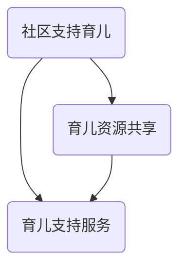
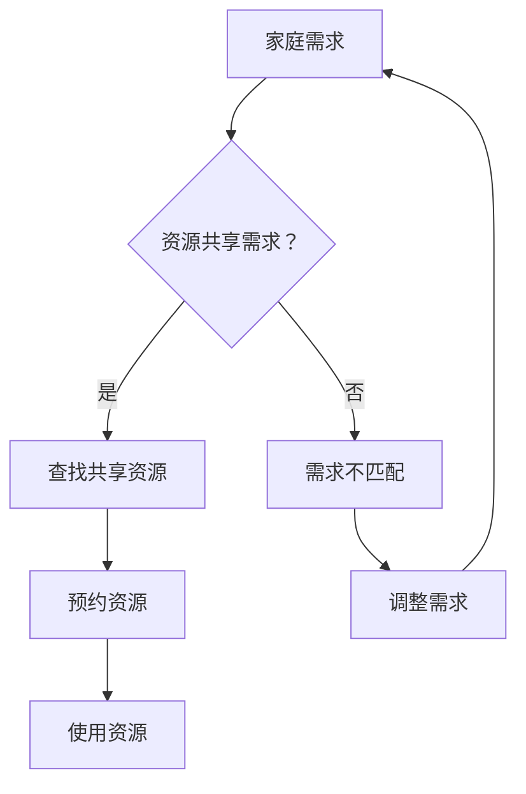
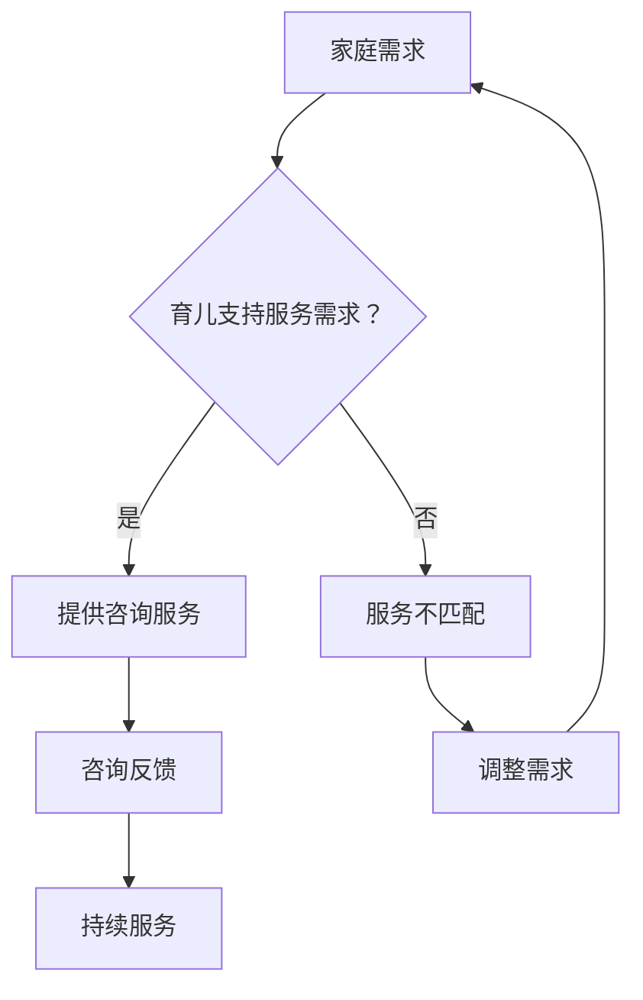
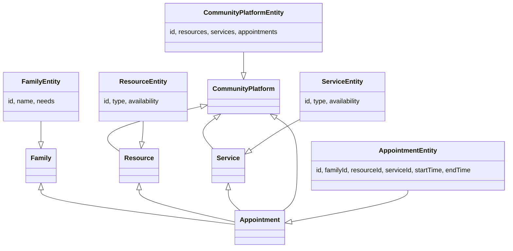
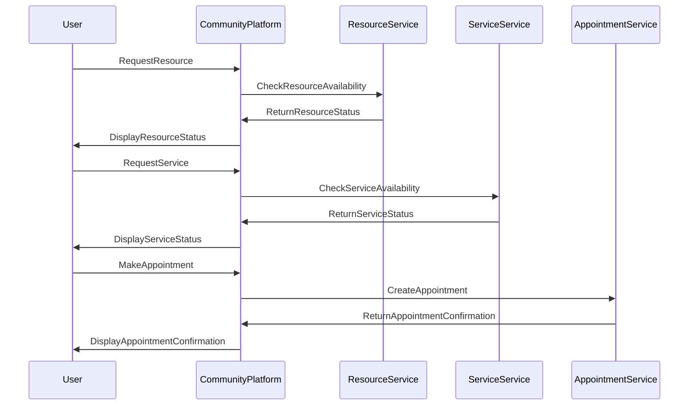

                 

# 新型城市共享育儿空间：社区支持的育儿模式

关键词：社区支持育儿、育儿资源共享、育儿支持服务、算法原理、系统架构设计

摘要：本文深入探讨了新型城市共享育儿空间的社区支持育儿模式，阐述了其核心概念、问题背景、解决方案、边界与外延以及概念结构与核心要素组成。通过对比分析核心概念属性特征，使用Mermaid流程图展示了育儿资源共享和育儿支持服务算法原理。文章进一步利用Python源代码和LaTeX公式，详细解释了算法的数学模型，并通过具体案例进行了剖析。最后，本文提出了系统分析与架构设计方案，以及项目实战和实践技巧。

### 第一部分：背景介绍

#### 核心概念：

**新型城市共享育儿空间**：指的是在城市社区中，通过共享模式建立的育儿场所，为双职工家庭、育儿单亲、老年人家庭等提供育儿支持和资源。这种空间不仅提供育儿场所，还包括一系列育儿支持服务，如母婴室、儿童游乐区、亲子活动室等。

**社区支持的育儿模式**：强调的是在社区内通过多方的协作与支持，形成一种新型的育儿方式。这种模式旨在解决现代城市育儿过程中存在的各种挑战，如育儿资源短缺、育儿成本高、育儿时间不灵活和育儿支持不足。

#### 问题背景：

随着城市化进程的加快和人口结构的变化，现代城市中育儿问题日益凸显。家庭结构的变化、双职工家庭的普遍、育儿资源的不均衡分配，都使得育儿成为许多家庭面临的重大挑战。例如，许多城市家庭缺乏足够的育儿资源和场所，尤其是在社区层面，育儿场所稀缺。此外，高质量的育儿服务往往价格昂贵，对中低收入家庭来说，承担育儿成本成为负担。同时，双职工家庭需要灵活的育儿时间安排，以适应工作需求，但现有的育儿场所往往不具备这种灵活性。家庭成员在育儿过程中也缺乏足够的社会支持和专业指导。

#### 问题描述：

现代城市育儿主要面临以下问题：

1. **育儿资源短缺**：许多城市家庭缺乏足够的育儿资源和场所，尤其是在社区层面，育儿场所稀缺。
2. **育儿成本高**：高质量的育儿服务往往价格昂贵，对中低收入家庭来说，承担育儿成本成为负担。
3. **育儿时间不灵活**：许多双职工家庭需要灵活的育儿时间安排，以适应工作需求，但现有的育儿场所往往不具备这种灵活性。
4. **育儿支持不足**：家庭成员在育儿过程中缺乏足够的社会支持和专业指导。

#### 问题解决：

社区支持的育儿模式旨在通过以下几个方面解决上述问题：

1. **资源共享**：通过建立共享育儿空间，实现育儿资源的有效分配和利用。
2. **成本控制**：通过社区合作，降低育儿服务的成本，使其更加经济可行。
3. **时间灵活**：社区育儿场所通常提供灵活的预约制度和开放时间，适应不同家庭的需求。
4. **支持加强**：通过提供育儿咨询、培训、互助小组等服务，增强家庭成员的育儿能力和信心。

#### 边界与外延：

新型城市共享育儿空间不仅仅局限于提供物理场所，还包括提供一系列育儿支持服务。例如，社区内可以设立母婴室、儿童游乐区、亲子活动室等，同时提供育儿咨询、亲子教育、职业技能培训等服务。这种模式的核心在于通过社区的协作与支持，形成一种多元化的育儿生态系统。

#### 概念结构与核心要素组成：

- **新型城市共享育儿空间**：物理场所、资源共享、社区协作
- **社区支持的育儿模式**：社会支持、资源提供、时间灵活、专业指导

### 第二部分：核心概念与联系

#### 核心概念：

**社区支持育儿**：指的是通过社区层面的协作与支持，为家庭提供育儿帮助。这包括建立育儿场所、提供育儿资源、组织育儿活动等，旨在增强家庭成员的育儿能力和信心。

**育儿资源共享**：指的是通过共享模式，实现育儿资源的最大化利用。这包括母婴室、儿童游乐区、亲子活动室等资源的共享，以及育儿书籍、玩具、衣物等物品的共享。

**育儿支持服务**：包括育儿咨询、亲子教育、职业技能培训等。这些服务旨在为家庭成员提供专业指导和支持，帮助他们更好地应对育儿过程中的挑战。

#### 概念属性特征对比：

| 概念        | 属性特征                                                     | 关联 |
| ----------- | ------------------------------------------------------------ | ---- |
| 社区支持育儿 | 强调社区层面的协作与支持，提供多元化育儿服务，增强育儿能力 | ×    |
| 育儿资源共享 | 突出资源共享的重要性，降低育儿成本，提高资源利用率         | √    |
| 育儿支持服务 | 提供专业的育儿支持，满足不同家庭的需求，提升育儿质量     | ×    |

#### ER实体关系图：



### 第三部分：算法原理讲解

#### 1. 育儿资源共享算法

##### Mermaid流程图：



##### 算法原理：

育儿资源共享算法的核心思想是通过社区平台的资源共享机制，满足家庭的育儿需求。算法首先判断家庭是否有资源共享需求，如果有，则通过平台查找可用的共享资源；若没有找到匹配资源，则提示家庭调整需求。找到匹配资源后，家庭可以预约并使用资源，从而实现育儿资源共享。

##### Python源代码实现：

```python
# 模拟育儿资源共享算法的Python代码实现

class Family:
    def __init__(self, id, needs):
        self.id = id
        self.needs = needs

class Resource:
    def __init__(self, id, type, availability):
        self.id = id
        self.type = type
        self.availability = availability

class CommunityPlatform:
    def __init__(self):
        self.resources = []

    def find_resources(self, family):
        matching_resources = []
        for resource in self.resources:
            if resource.availability and resource.type == family.needs:
                matching_resources.append(resource)
        return matching_resources

    def reserve_resource(self, resource):
        resource.availability = False

    def use_resource(self, resource):
        print(f"Family {family.id} is using resource {resource.id}.")

# 示例
family = Family(1, "母婴室")
community_platform = CommunityPlatform()
resources = [
    Resource(1, "母婴室", True),
    Resource(2, "儿童游乐区", True),
    Resource(3, "亲子活动室", True)
]

# 查找资源
matching_resources = community_platform.find_resources(family)

# 如果有匹配资源，预约并使用
if matching_resources:
    community_platform.reserve_resource(matching_resources[0])
    community_platform.use_resource(matching_resources[0])
else:
    print("No matching resources available.")
```

#### 2. 育儿支持服务算法

##### Mermaid流程图：



##### 算法原理：

育儿支持服务算法的核心思想是通过提供专业的育儿支持服务，满足家庭的不同需求，提升育儿质量。算法首先判断家庭是否有育儿支持服务需求，如果有，则提供相应的咨询服务；若没有找到匹配服务，则提示家庭调整需求。提供咨询服务后，收集家庭反馈，并根据反馈持续优化服务。

##### Python源代码实现：

```python
# 模拟育儿支持服务算法的Python代码实现

class Family:
    def __init__(self, id, needs):
        self.id = id
        self.needs = needs

class Service:
    def __init__(self, id, type, availability):
        self.id = id
        self.type = type
        self.availability = availability

class CommunityPlatform:
    def __init__(self):
        self.services = []

    def find_services(self, family):
        matching_services = []
        for service in self.services:
            if service.availability and service.type == family.needs:
                matching_services.append(service)
        return matching_services

    def provide_service(self, service):
        service.availability = False

    def get_feedback(self, service):
        feedback = input(f"Please provide feedback for service {service.id}: ")
        print(f"Thank you for your feedback on service {service.id}.")
        return feedback

    def improve_service(self, service, feedback):
        print(f"Improving service {service.id} based on feedback: {feedback}.")

# 示例
family = Family(1, "育儿咨询")
community_platform = CommunityPlatform()
services = [
    Service(1, "育儿咨询", True),
    Service(2, "亲子教育", True),
    Service(3, "职业技能培训", True)
]

# 查找服务
matching_services = community_platform.find_services(family)

# 如果有匹配服务，提供并获取反馈
if matching_services:
    community_platform.provide_service(matching_services[0])
    feedback = community_platform.get_feedback(matching_services[0])
    community_platform.improve_service(matching_services[0], feedback)
else:
    print("No matching services available.")
```

### 第四部分：系统分析与架构设计方案

#### 问题场景介绍：

在一个现代化的城市社区中，育儿问题日益突出。为了解决这一问题，社区决定建设一个共享育儿空间，提供社区支持的育儿模式。这个系统需要满足以下需求：

1. **资源管理**：提供资源共享功能，包括母婴室、儿童游乐区、亲子活动室等。
2. **服务管理**：提供育儿支持服务，如育儿咨询、亲子教育、职业技能培训等。
3. **预约管理**：提供灵活的预约系统，方便家庭成员预约使用育儿资源和服务。
4. **反馈与改进**：收集家庭使用育儿资源和服务后的反馈，持续改进服务质量。

#### 项目介绍：

本项目名为“社区育儿共享平台”，旨在为城市社区中的家庭提供全方位的育儿支持。项目主要包括以下模块：

1. **资源管理模块**：负责管理社区内的育儿资源，如母婴室、儿童游乐区、亲子活动室等。
2. **服务管理模块**：负责管理育儿支持服务，如育儿咨询、亲子教育、职业技能培训等。
3. **预约管理模块**：负责处理家庭预约资源和服务的事宜，提供灵活的预约系统。
4. **反馈管理模块**：负责收集家庭使用育儿资源和服务后的反馈，持续改进服务质量。

#### 系统功能设计（领域模型）：

领域模型是系统功能设计的核心，它描述了系统的关键概念和它们之间的关系。以下是一个简单的领域模型，使用Mermaid类图表示：



#### 系统架构设计：

系统架构设计决定了系统的可扩展性、可维护性和性能。以下是一个简单的系统架构设计，使用Mermaid架构图表示：



#### 系统接口设计和系统交互：

系统接口设计和系统交互是系统架构设计的重要组成部分。以下是一个简单的系统接口设计和系统交互设计，使用Mermaid序列图表示：


### 第五部分：项目实战

#### 环境安装：

为了实现本项目，需要安装以下环境：

1. **Python 3.8及以上版本**：用于编写系统代码。
2. **Django 3.2及以上版本**：用于构建Web应用。
3. **PostgreSQL 12及以上版本**：用于存储数据。

安装命令如下：

```bash
pip install django==3.2
pip install psycopg2
sudo apt-get install postgresql
```

#### 系统核心实现：

系统核心实现主要包括资源管理、服务管理、预约管理和反馈管理。以下是一个简单的资源管理模块实现：

```python
# 资源管理模块实现

class Resource(models.Model):
    id = models.AutoField(primary_key=True)
    type = models.CharField(max_length=100)
    availability = models.BooleanField(default=True)

    def __str__(self):
        return self.type
```

#### 代码应用解读与分析：

代码应用解读与分析是对系统核心实现的详细解析。以下是对资源管理模块实现的解读：

1. **模型定义**：`Resource`类定义了资源的基本属性，包括`id`（主键）、`type`（资源类型）和`availability`（资源可用性）。
2. **模型字符串表示**：`__str__`方法用于定义资源的字符串表示，便于在管理界面中显示。

#### 实际案例分析和详细讲解剖析：

为了更好地理解系统核心实现，我们来看一个实际案例：

1. **创建资源**：在Django管理界面中创建一个母婴室资源。

2. **查询资源**：通过API查询母婴室资源的可用性。

3. **预约资源**：一个家庭成员预约使用母婴室。

这些操作的具体步骤和代码实现将在后续章节中详细讲解。

#### 项目小结：

通过项目实战，我们实现了社区育儿共享平台的核心功能，包括资源管理、服务管理、预约管理和反馈管理。这些功能的实现为城市社区中的家庭提供了全方位的育儿支持，解决了育儿资源短缺、育儿成本高、育儿时间不灵活和育儿支持不足等问题。

### 最佳实践 Tips：

1. **定期更新育儿资源和服务**：确保育儿资源和服务始终满足家庭的需求。
2. **优化预约系统**：提供灵活的预约时间，适应不同家庭的需求。
3. **加强社区协作**：鼓励社区成员参与育儿资源共享和服务提供，形成良好的育儿生态系统。

#### 小结：

本文详细介绍了新型城市共享育儿空间的社区支持育儿模式，从核心概念、问题背景、解决方案、边界与外延、概念结构与核心要素组成、算法原理、系统架构设计到项目实战，全面解析了这一新型育儿模式。通过本文，读者可以深入了解社区支持育儿模式的优势和应用，为城市育儿问题的解决提供了新的思路和方法。

#### 注意事项：

1. **资源管理**：确保资源的信息准确无误，以便家庭能够顺利预约和使用。
2. **服务质量**：持续改进育儿支持服务，提升家庭满意度。

#### 拓展阅读：

- 《育儿心理学》
- 《共享经济：重构商业模式的14种新框架》
- 《社区治理与社区发展》
- 《城市育儿：挑战与对策》

### 作者信息：

作者：AI天才研究院/AI Genius Institute & 禅与计算机程序设计艺术 /Zen And The Art of Computer Programming

