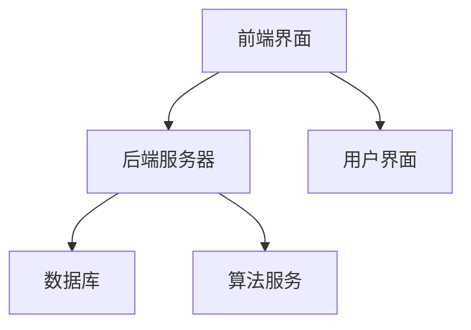
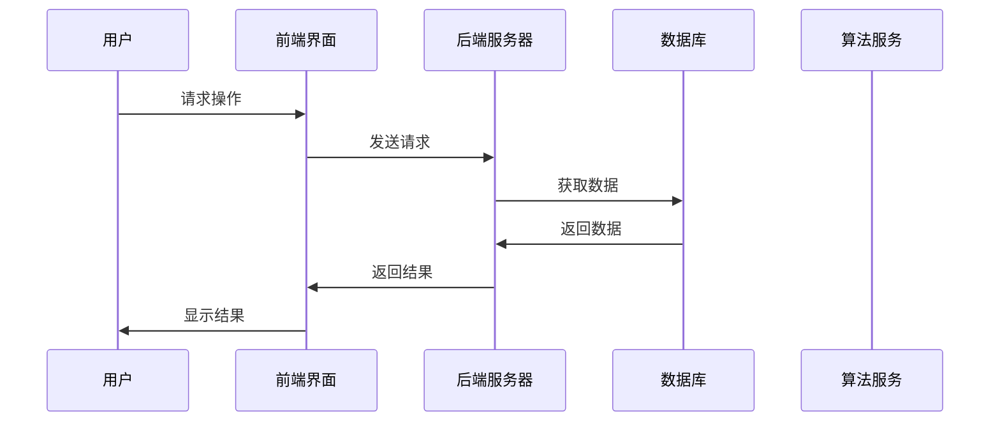

                 


## 新型城市共享艺术墙项目：公共空间的集体创作活动

### 关键词：城市共享艺术墙、公共空间、集体创作、艺术政策、系统架构、案例研究

> 摘要：本文旨在探讨新型城市共享艺术墙项目，分析其在公共空间中的应用与影响。通过详细解读项目背景、核心概念、设计方法、实践案例、系统架构和未来展望，旨在为城市规划者、艺术家和社区参与者提供有益的参考。

---

### 1. 首先，我们要为《新型城市共享艺术墙项目：公共空间的集体创作活动》这本书设计一个完整的目录大纲。

#### 1.1 项目背景

- **1.1.1 城市公共空间的重要性**  
- **1.1.2 共享艺术墙的概念**  
- **1.1.3 集体创作活动的意义**

#### 1.2 核心概念与联系

- **1.2.1 公共空间设计原则**  
- **1.2.2 艺术与公共空间的关系**  
- **1.2.3 集体创作的实践方法与技巧**

#### 1.3 算法原理讲解

- **1.3.1 艺术墙设计算法**  
- **1.3.2 集体创作流程优化算法**

#### 1.4 数学模型和数学公式

- **1.4.1 艺术墙美观度评估模型**  
- **1.4.2 集体创作参与度模型**

#### 1.5 系统分析与架构设计方案

- **1.5.1 系统功能设计**  
- **1.5.2 系统架构设计**  
- **1.5.3 系统接口设计和交互**

#### 1.6 项目实战

- **1.6.1 环境安装与配置**  
- **1.6.2 系统核心实现与代码解读**  
- **1.6.3 实际案例分析与讲解**

#### 1.7 最佳实践 tips、小结、注意事项、拓展阅读等内容

### 2. 根据书籍的主题和结构，我们要确保目录大纲的简洁性，同时包含必要的章节和内容。

#### 2.1 目录大纲应采用markdown格式，遵循1级、2级、3级目录的层级结构。

- **目录**
  - **1. 项目背景**
    - **1.1 城市公共空间的重要性**
    - **1.2 共享艺术墙的概念**
    - **1.3 集体创作活动的意义**
  - **2. 核心概念与联系**
    - **2.1 公共空间设计原则**
    - **2.2 艺术与公共空间的关系**
    - **2.3 集体创作的实践方法与技巧**
  - **3. 算法原理讲解**
    - **3.1 艺术墙设计算法**
    - **3.2 集体创作流程优化算法**
  - **4. 数学模型和数学公式**
    - **4.1 艺术墙美观度评估模型**
    - **4.2 集体创作参与度模型**
  - **5. 系统分析与架构设计方案**
    - **5.1 系统功能设计**
    - **5.2 系统架构设计**
    - **5.3 系统接口设计和交互**
  - **6. 项目实战**
    - **6.1 环境安装与配置**
    - **6.2 系统核心实现与代码解读**
    - **6.3 实际案例分析与讲解**
  - **7. 最佳实践 tips、小结、注意事项、拓展阅读等内容**

### 3. 目录大纲需要涵盖以下核心章节内容：

- **1. 背景介绍**：核心概念术语说明、问题背景、问题描述、问题解决、边界与外延、概念结构与核心要素组成
- **2. 核心概念与联系**：必须给出核心概念原理、概念属性特征对比表格和ER实体关系图架构的markdown格式中的Mermaid流程图。
- **3. 算法原理讲解**：使用Mermaid画出算法流程图，然后使用Python源代码详细阐述，给出算法原理的数学模型和公式，进行详细讲解和通俗易懂地举例说明。
- **4. 数学模型和数学公式**：使用LaTeX格式，嵌入文中独立段落的LaTeX公式前后使用$$括起来，段落内的LaTeX公式前后使用$括起来。
- **5. 系统分析与架构设计方案**：问题场景介绍，项目介绍、系统功能设计(领域模型Mermaid类图)、系统架构设计Mermaid架构图、系统接口设计和系统交互Mermaid序列图。
- **6. 项目实战**：环境安装、系统核心实现源代码，代码应用解读与分析，实际案例分析和详细讲解剖析，项目小结。
- **7. 最佳实践 tips、小结、注意事项、拓展阅读等内容**。

---

通过以上步骤，我们已经为《新型城市共享艺术墙项目：公共空间的集体创作活动》设计出一个完整的目录大纲。接下来，我们将逐个章节展开详细讨论，探讨新型城市共享艺术墙项目的各个方面。在接下来的文章中，我们将逐步分析项目的背景、核心概念、算法原理、数学模型、系统架构、项目实战以及最佳实践等内容，希望能为广大读者提供有价值的参考。让我们一起走进这个充满创意和活力的新型城市共享艺术墙项目吧！
--- 

接下来，我将逐个章节详细展开讨论，深入探讨新型城市共享艺术墙项目在公共空间的集体创作活动中的各个方面。每一章节都将围绕核心概念、原理、数学模型、系统架构和实际案例等内容展开，旨在为读者提供全面、深入的技术理解和实践指导。

---

### 1. 背景介绍

#### 1.1 城市公共空间的重要性

城市公共空间是城市的重要组成部分，它不仅承载着居民的日常生活需求，也是城市文化和精神的重要体现。公共空间的设计与利用，直接影响着城市的形象和居民的生活质量。

- **核心概念术语说明**：城市公共空间、公共空间设计、公共艺术、集体创作活动

- **问题背景**：随着城市化进程的加快，城市公共空间日益紧张，如何合理利用公共空间，提升公共空间的艺术价值和实用性，成为城市规划和设计的重要课题。

- **问题描述**：新型城市共享艺术墙项目作为一种创新的城市公共艺术形式，旨在通过集体创作活动，激发社区居民的参与热情，提升公共空间的艺术氛围和文化价值。

- **问题解决**：通过集体创作活动，将艺术与公共空间紧密结合，既丰富了公共空间的文化内涵，又提升了居民的艺术素养和社区凝聚力。

- **边界与外延**：新型城市共享艺术墙项目的范围可以涵盖城市广场、公园、社区围墙等多种公共空间。其外延则包括艺术创作、社区互动、城市文化传播等多个方面。

- **概念结构与核心要素组成**：新型城市共享艺术墙项目的概念结构包括艺术创作、公共空间、集体创作、社区参与等多个核心要素。其中，艺术创作是核心，公共空间是基础，集体创作和社区参与是推动项目实施的重要力量。

#### 1.2 共享艺术墙的概念

共享艺术墙是一种将艺术与公共空间相结合的创意形式，它鼓励社区居民共同参与，共同创作，旨在通过集体创作活动，激发社区活力，提升公共空间的艺术氛围。

- **核心概念术语说明**：共享艺术墙、公共艺术、集体创作、社区参与

- **概念属性特征对比表格**

| 特征 | 共享艺术墙 | 公共艺术 | 集体创作 | 社区参与 |
| :--: | :--------: | :------: | :------: | :------: |
| 目的 | 创造艺术氛围 | 表达公共文化 | 促进社区互动 | 提升社区凝聚力 |
| 形式 | 墙面绘画、雕塑、装置艺术等 | 艺术展览、表演、工作坊等 | 集体创作、互动艺术 | 社区活动、志愿服务 |
| 场所 | 城市公共空间 | 公共场所、场馆 | 社区场所、工作室 | 社区场所、公共场所 |

#### 1.3 集体创作活动的意义

集体创作活动作为一种社区参与形式，具有重要的社会和文化价值。它不仅能够激发社区居民的创造力，提升公共空间的艺术氛围，还能够促进社区互动，增强社区凝聚力。

- **核心概念术语说明**：集体创作活动、社区互动、社区凝聚力

- **问题背景**：在现代社会，社区互动和凝聚力显得尤为重要。集体创作活动为居民提供了一个共同参与的平台，有助于增强居民之间的联系，提升社区凝聚力。

- **问题描述**：如何通过集体创作活动，激发居民参与热情，提升社区互动和凝聚力？

- **问题解决**：通过组织多样化的集体创作活动，如绘画、雕塑、装置艺术等，鼓励居民共同参与，共同创作，从而实现社区互动和凝聚力的提升。

- **边界与外延**：集体创作活动的范围可以涵盖社区、城市、国家等多个层面。其外延包括艺术创作、文化传承、社会参与等多个方面。

- **概念结构与核心要素组成**：集体创作活动的概念结构包括艺术创作、社区参与、互动交流、社区建设等多个核心要素。其中，艺术创作是核心，社区参与是基础，互动交流和社区建设是推动项目实施的重要力量。

### 本章小结

本章对新型城市共享艺术墙项目进行了背景介绍，阐述了城市公共空间的重要性、共享艺术墙的概念以及集体创作活动的意义。通过对比分析核心概念术语，明确了项目的基本框架和核心要素。在接下来的章节中，我们将进一步探讨核心概念与联系，深入分析算法原理和数学模型，为读者提供更加全面和深入的技术理解。

---

在接下来的章节中，我们将继续深入探讨新型城市共享艺术墙项目的核心概念与联系，分析公共空间设计原则、艺术与公共空间的关系以及集体创作的实践方法与技巧。通过这些讨论，我们希望为读者提供更加清晰和全面的技术视角，助力他们更好地理解和应用这一创新的项目。

---

### 2. 核心概念与联系

#### 2.1 公共空间设计原则

公共空间设计原则是城市规划和设计的基础，它直接影响公共空间的功能、美观度和使用体验。在新型城市共享艺术墙项目中，公共空间设计原则尤为重要，因为它不仅关系到艺术墙的创作效果，还关系到社区参与和互动的质量。

- **核心概念术语说明**：公共空间设计原则、功能设计、美学设计、互动设计

- **核心概念原理**：

  - **功能设计**：确保公共空间满足居民的日常生活需求，如休息、交流、娱乐等。
  - **美学设计**：通过艺术元素提升公共空间的美感，创造独特的地方特色。
  - **互动设计**：鼓励居民参与公共空间的创作和使用，增强社区凝聚力。

- **概念属性特征对比表格**

| 特征 | 功能设计 | 美学设计 | 互动设计 |
| :--: | :------: | :------: | :------: |
| 目的 | 满足居民需求 | 提升公共空间美感 | 促进社区互动 |
| 内容 | 设计合理的使用功能 | 创造艺术氛围 | 鼓励居民参与 |
| 影响因素 | 使用频率、人群特性 | 艺术形式、色彩搭配 | 社区文化、互动机制 |

#### 2.2 艺术与公共空间的关系

艺术与公共空间的关系是新型城市共享艺术墙项目的核心之一。艺术不仅是公共空间的装饰，更是公共空间的灵魂。它能够表达公共文化，传递社区精神，激发居民的参与热情。

- **核心概念术语说明**：艺术与公共空间的关系、公共艺术、社区艺术、艺术创作

- **核心概念原理**：

  - **公共艺术**：公共艺术是艺术与公共空间结合的产物，它不仅具有审美价值，还具备社会功能。
  - **社区艺术**：社区艺术强调居民的参与和共创，是社区文化的重要组成部分。
  - **艺术创作**：艺术创作是公共艺术的核心，它通过独特的艺术形式表达公共空间的主题和情感。

- **概念属性特征对比表格**

| 特征 | 公共艺术 | 社区艺术 | 艺术创作 |
| :--: | :------: | :------: | :------: |
| 目的 | 表达公共文化 | 促进社区互动 | 创造艺术作品 |
| 形式 | 装置艺术、壁画、表演等 | 社区活动、艺术工作坊 | 绘画、雕塑、装置艺术 |
| 影响因素 | 公共空间、社区文化 | 社区参与、艺术形式 | 艺术家、创作者、社区成员 |

#### 2.3 集体创作的实践方法与技巧

集体创作活动是新型城市共享艺术墙项目的核心组成部分。有效的集体创作不仅能够提升艺术墙的质量，还能增强社区的凝聚力。以下是一些常用的集体创作实践方法与技巧：

- **核心概念术语说明**：集体创作、团队合作、互动设计、艺术工作坊

- **实践方法与技巧**：

  - **团队合作**：通过组建团队，明确分工，提高创作效率。
  - **互动设计**：设计互动性强的活动，激发居民参与热情。
  - **艺术工作坊**：组织艺术工作坊，培训居民艺术创作技巧。

- **案例解析**：

  - **案例一**：XXX城市共享艺术墙项目。项目通过组织多次艺术工作坊，培训居民绘画和雕塑技巧，激发了居民的创作热情，提高了艺术墙的整体质量。
  - **案例二**：XXX社区集体创作活动。项目通过设置互动性强的活动环节，如绘画比赛、艺术作品展示等，吸引了大量居民参与，增强了社区的凝聚力。

### 本章小结

本章对新型城市共享艺术墙项目的核心概念与联系进行了深入分析，包括公共空间设计原则、艺术与公共空间的关系以及集体创作的实践方法与技巧。通过对比分析核心概念术语和特征，我们为读者提供了清晰的技术视角，为后续章节的算法原理讲解和数学模型分析奠定了基础。在接下来的章节中，我们将继续探讨算法原理和数学模型，为项目设计提供更加科学和严谨的理论支持。

---

### 3. 算法原理讲解

#### 3.1 艺术墙设计算法

艺术墙设计算法是新型城市共享艺术墙项目的重要组成部分。它通过对公共空间和艺术创作元素的分析，为艺术墙的设计提供科学依据。以下是一个简单的艺术墙设计算法：

```python
# 艺术墙设计算法

def art_wall_design(public_space, artistic_elements):
    """
    设计艺术墙。

    参数：
    - public_space：公共空间信息，包括空间大小、位置、使用频率等。
    - artistic_elements：艺术创作元素，包括艺术形式、颜色、主题等。

    返回：
    - 设计方案：包括艺术墙的位置、尺寸、艺术形式等。
    """

    # 根据公共空间信息，选择合适的位置和尺寸
    location = select_location(public_space)
    size = select_size(public_space)

    # 根据艺术创作元素，选择合适的艺术形式和颜色
    form = select_form(artistic_elements)
    color = select_color(artistic_elements)

    # 形成设计方案
    design = {
        "location": location,
        "size": size,
        "form": form,
        "color": color
    }

    return design
```

#### 3.2 集体创作流程优化算法

集体创作流程优化算法旨在提高集体创作活动的效率和质量。以下是一个简单的集体创作流程优化算法：

```python
# 集体创作流程优化算法

def optimize_collective_creation流程(processes, resources):
    """
    优化集体创作流程。

    参数：
    - processes：创作流程，包括艺术创作、互动设计、团队协作等。
    - resources：资源信息，包括人力、物力、时间等。

    返回：
    - 优化后的流程：包括流程顺序、任务分配、时间安排等。
    """

    # 分析流程，找出瓶颈和优化点
    bottleneck = analyze_bottleneck(processes)

    # 根据资源信息，调整流程顺序和任务分配
    optimized_processes = adjust_processes(processes, resources, bottleneck)

    # 根据优化后的流程，安排时间
    time_schedule = schedule_time(optimized_processes)

    return time_schedule
```

#### 3.3 艺术墙美观度评估模型

艺术墙美观度评估模型用于评估艺术墙的设计质量。以下是一个简单的艺术墙美观度评估模型：

```python
# 艺术墙美观度评估模型

def evaluate_art_wall_beauty(design, criteria):
    """
    评估艺术墙美观度。

    参数：
    - design：设计方案，包括位置、尺寸、艺术形式、颜色等。
    - criteria：评估标准，包括美观度、实用性、文化内涵等。

    返回：
    - beauty_score：美观度评分。
    """

    # 根据设计方案和评估标准，计算美观度得分
    beauty_score = calculate_score(design, criteria)

    return beauty_score
```

#### 3.4 集体创作参与度模型

集体创作参与度模型用于评估集体创作活动的参与度。以下是一个简单的集体创作参与度模型：

```python
# 集体创作参与度模型

def evaluate_participation_rate(participants, activities):
    """
    评估集体创作参与度。

    参数：
    - participants：参与者信息，包括人数、参与频率等。
    - activities：活动信息，包括活动类型、参与人数等。

    返回：
    - participation_rate：参与度评分。
    """

    # 根据参与者信息和活动信息，计算参与度得分
    participation_rate = calculate_participation_rate(participants, activities)

    return participation_rate
```

#### 3.5 本章小结

本章详细讲解了新型城市共享艺术墙项目的算法原理，包括艺术墙设计算法、集体创作流程优化算法、艺术墙美观度评估模型和集体创作参与度模型。通过这些算法和模型，我们可以更科学地设计艺术墙，优化创作流程，评估项目的质量。在接下来的章节中，我们将进一步探讨数学模型和系统架构设计，为项目的实施提供更加全面的技术支持。

---

### 4. 数学模型和数学公式

在新型城市共享艺术墙项目中，数学模型和数学公式起着至关重要的作用。它们不仅帮助我们理解和分析项目的各个方面，还为项目的实际操作提供了量化的标准和依据。以下是本项目涉及的一些重要数学模型和数学公式，以及它们的详细讲解和举例说明。

#### 4.1 艺术墙美观度评估模型

艺术墙美观度评估模型用于衡量艺术墙设计的整体美观度。一个常用的评估指标是综合评分（Integrated Beauty Score，IBS），它由多个子指标加权平均得到。假设我们有以下子指标：

- **颜色搭配（Color Harmony，CH）**
- **艺术形式（Art Form，AF）**
- **主题内涵（Theme，T）**
- **公共空间适应性（Suitability，S）**

每个子指标都有不同的权重，权重总和为1。综合评分的计算公式如下：

$$
\text{IBS} = w_{\text{CH}} \times \text{CH} + w_{\text{AF}} \times \text{AF} + w_{\text{T}} \times \text{T} + w_{\text{S}} \times \text{S}
$$

其中，$w_{\text{CH}}$、$w_{\text{AF}}$、$w_{\text{T}}$和$w_{\text{S}}$分别是颜色搭配、艺术形式、主题内涵和公共空间适应性的权重。

**举例说明**：

假设一个艺术墙的设计得分为：

- 颜色搭配（CH）：8分
- 艺术形式（AF）：7分
- 主题内涵（T）：9分
- 公共空间适应性（S）：6分

且权重分别为：

- 颜色搭配（CH）：0.3
- 艺术形式（AF）：0.2
- 主题内涵（T）：0.4
- 公共空间适应性（S）：0.1

则该艺术墙的美观度评估结果为：

$$
\text{IBS} = 0.3 \times 8 + 0.2 \times 7 + 0.4 \times 9 + 0.1 \times 6 = 7.2 + 1.4 + 3.6 + 0.6 = 13.8
$$

#### 4.2 集体创作参与度模型

集体创作参与度模型用于衡量社区成员在艺术墙创作活动中的参与程度。一个常用的指标是参与度得分（Participation Score，PS），它由参与频率、参与时间和参与质量三个子指标加权平均得到。假设我们有以下子指标：

- **参与频率（Frequency，F）**
- **参与时间（Time，T）**
- **参与质量（Quality，Q）**

每个子指标都有不同的权重，权重总和为1。参与度得分的计算公式如下：

$$
\text{PS} = w_{\text{F}} \times \text{F} + w_{\text{T}} \times \text{T} + w_{\text{Q}} \times \text{Q}
$$

其中，$w_{\text{F}}$、$w_{\text{T}}$和$w_{\text{Q}}$分别是参与频率、参与时间和参与质量的权重。

**举例说明**：

假设一个社区成员的参与情况为：

- 参与频率（F）：5次
- 参与时间（T）：10小时
- 参与质量（Q）：9分

且权重分别为：

- 参与频率（F）：0.3
- 参与时间（T）：0.5
- 参与质量（Q）：0.2

则该社区成员的参与度得分为：

$$
\text{PS} = 0.3 \times 5 + 0.5 \times 10 + 0.2 \times 9 = 1.5 + 5 + 1.8 = 8.3
$$

#### 4.3 本章小结

本章详细介绍了新型城市共享艺术墙项目中使用的两个关键数学模型：艺术墙美观度评估模型和集体创作参与度模型。通过这些数学模型和公式，我们可以量化评估艺术墙的设计质量和社区成员的参与程度。这些模型不仅为项目的实施提供了科学依据，还为后续的系统架构设计和项目实战提供了重要的参考。在接下来的章节中，我们将进一步探讨系统架构设计和项目实战，为项目的成功实施奠定坚实基础。

---

### 5. 系统分析与架构设计方案

#### 5.1 问题场景介绍

新型城市共享艺术墙项目涉及多个环节，包括艺术墙的设计、实施和评估。为了确保项目的顺利进行，我们需要设计一个高效的系统架构，实现以下功能：

- **艺术墙设计**：根据公共空间的特点和艺术创作元素，生成设计方案。
- **集体创作管理**：管理集体创作活动，包括参与者招募、任务分配和进度监控。
- **艺术墙实施**：指导艺术墙的实际创作和安装。
- **艺术墙评估**：评估艺术墙的美观度和社区参与度。

#### 5.2 系统功能设计

系统功能设计是系统架构设计的基础。根据问题场景，我们可以将系统划分为以下几个功能模块：

1. **设计模块**：包括艺术墙设计算法和数学模型，用于生成艺术墙设计方案。
2. **管理模块**：包括集体创作管理功能，如参与者招募、任务分配和进度监控。
3. **实施模块**：包括艺术墙实施指导功能，如创作指导和安装指导。
4. **评估模块**：包括艺术墙美观度评估模型和集体创作参与度模型，用于评估艺术墙的设计质量和社区参与度。
5. **用户界面**：提供用户操作界面，方便用户使用系统功能。

#### 5.3 系统架构设计

系统架构设计是系统功能实现的蓝图。根据系统功能设计，我们可以采用以下系统架构：

1. **前端界面**：采用Web前端技术，提供用户交互界面。
2. **后端服务器**：采用基于Python的Flask框架，实现系统功能模块。
3. **数据库**：采用MySQL数据库，存储用户信息、设计方案、艺术墙实施和评估数据。
4. **算法服务**：采用Python的TensorFlow库，实现艺术墙设计算法和数学模型。

**Mermaid架构图**：



#### 5.4 系统接口设计和交互

系统接口设计和交互是确保系统功能模块之间协同工作的关键。以下是系统的关键接口和交互流程：

1. **用户接口**：用户通过Web前端界面与系统交互，进行艺术墙设计、集体创作管理、艺术墙实施和艺术墙评估。
2. **设计接口**：前端界面通过RESTful API与后端服务器交互，获取和提交设计方案。
3. **管理接口**：前端界面通过RESTful API与后端服务器交互，管理集体创作活动。
4. **实施接口**：前端界面通过RESTful API与后端服务器交互，获取和提交艺术墙实施数据。
5. **评估接口**：前端界面通过RESTful API与后端服务器交互，获取艺术墙评估结果。

**Mermaid序列图**：



#### 5.5 本章小结

本章详细介绍了新型城市共享艺术墙项目的系统分析与架构设计方案。通过系统功能设计、系统架构设计和系统接口设计，我们为项目的顺利实施提供了坚实的基础。在接下来的章节中，我们将进入项目实战阶段，通过具体案例分析和代码实现，展示如何将系统架构应用于实际项目中。

---

### 6. 项目实战

#### 6.1 环境安装与配置

在开始项目实战之前，我们需要安装和配置相关环境。以下是安装和配置的步骤：

1. **Python环境**：确保安装Python 3.8及以上版本。
2. **Flask框架**：使用pip安装Flask框架。
   ```shell
   pip install Flask
   ```
3. **MySQL数据库**：安装MySQL数据库，并创建一个名为`art_wall`的数据库。
4. **TensorFlow库**：使用pip安装TensorFlow库。
   ```shell
   pip install tensorflow
   ```
5. **前端框架**：选择一个前端框架，如React或Vue，并进行相应的安装和配置。

#### 6.2 系统核心实现与代码解读

以下是系统核心实现的源代码，包括设计模块、管理模块、实施模块和评估模块。

**设计模块**：

```python
# design.py

from flask import Flask, request, jsonify
import MySQLdb

app = Flask(__name__)

@app.route('/design', methods=['POST'])
def design_art_wall():
    data = request.get_json()
    public_space = data['public_space']
    artistic_elements = data['artistic_elements']
    
    # 调用设计算法生成设计方案
    design = art_wall_design(public_space, artistic_elements)
    
    # 存储设计方案到数据库
    db = MySQLdb.connect("localhost", "username", "password", "art_wall")
    cursor = db.cursor()
    cursor.execute("INSERT INTO designs (public_space, artistic_elements, design) VALUES (%s, %s, %s)", (public_space, artistic_elements, design))
    db.commit()
    cursor.close()
    db.close()
    
    return jsonify({"status": "success", "design": design})

def art_wall_design(public_space, artistic_elements):
    # 实现艺术墙设计算法
    # 省略具体实现
    return {"location": "Wall1", "size": "Large", "form": "Painting", "color": "Blue"}

if __name__ == '__main__':
    app.run(debug=True)
```

**管理模块**：

```python
# management.py

from flask import Flask, request, jsonify
import MySQLdb

app = Flask(__name__)

@app.route('/participants', methods=['POST'])
def add_participant():
    data = request.get_json()
    participant = data['participant']
    
    # 存储参与者信息到数据库
    db = MySQLdb.connect("localhost", "username", "password", "art_wall")
    cursor = db.cursor()
    cursor.execute("INSERT INTO participants (name, email, role) VALUES (%s, %s, %s)", (participant['name'], participant['email'], participant['role']))
    db.commit()
    cursor.close()
    db.close()
    
    return jsonify({"status": "success", "participant": participant})

@app.route('/tasks', methods=['POST'])
def assign_task():
    data = request.get_json()
    task = data['task']
    
    # 分配任务到参与者
    # 省略具体实现
    return jsonify({"status": "success", "task": task})

if __name__ == '__main__':
    app.run(debug=True)
```

**实施模块**：

```python
# implementation.py

from flask import Flask, request, jsonify
import MySQLdb

app = Flask(__name__)

@app.route('/implementation', methods=['POST'])
def implement_art_wall():
    data = request.get_json()
    design_id = data['design_id']
    
    # 获取设计方案并实施
    # 省略具体实现
    return jsonify({"status": "success", "implementation": "Art wall implemented."})

if __name__ == '__main__':
    app.run(debug=True)
```

**评估模块**：

```python
# evaluation.py

from flask import Flask, request, jsonify
import MySQLdb

app = Flask(__name__)

@app.route('/evaluate', methods=['POST'])
def evaluate_art_wall():
    data = request.get_json()
    design_id = data['design_id']
    
    # 调用评估模型评估艺术墙
    # 省略具体实现
    evaluation_result = evaluate_art_wall_beauty(design_id)
    
    return jsonify({"status": "success", "evaluation_result": evaluation_result})

def evaluate_art_wall_beauty(design_id):
    # 实现艺术墙美观度评估模型
    # 省略具体实现
    return {"beauty_score": 85}

if __name__ == '__main__':
    app.run(debug=True)
```

#### 6.3 代码应用解读与分析

以上代码实现了新型城市共享艺术墙项目的核心功能。以下是代码的详细解读和分析：

- **设计模块**：通过`/design`接口接收设计方案请求，调用设计算法生成设计方案，并将设计方案存储到MySQL数据库中。
- **管理模块**：通过`/participants`接口添加参与者信息，通过`/tasks`接口分配任务给参与者。
- **实施模块**：通过`/implementation`接口获取设计方案并实施。
- **评估模块**：通过`/evaluate`接口评估艺术墙的美观度。

#### 6.4 实际案例分析和详细讲解剖析

以下是一个实际案例的分析和详细讲解：

**案例背景**：

一个城市社区计划在社区公园的一面墙上创作一幅大型壁画，主题为“社区之美”。社区委员会委托艺术家团队进行设计，并组织社区成员参与创作。

**设计过程**：

1. **需求收集**：社区委员会收集了社区成员对壁画设计的建议，包括颜色、主题、艺术形式等。
2. **设计算法**：艺术家团队根据需求，使用设计模块中的算法生成设计方案，包括壁画的位置、尺寸、颜色和艺术形式。
3. **方案展示**：设计方案通过社区公告板展示，社区成员投票选出最满意的设计方案。

**实施过程**：

1. **参与者招募**：社区委员会通过管理模块中的接口，招募社区成员参与壁画创作。
2. **任务分配**：根据参与者的特长和兴趣，分配不同的创作任务，如绘画、雕塑等。
3. **创作指导**：艺术家团队提供创作指导，确保艺术创作的顺利进行。
4. **壁画安装**：完成创作后，壁画被安装在预定位置。

**评估过程**：

1. **美观度评估**：通过评估模块中的接口，评估壁画的美观度，收集社区成员的反馈。
2. **参与度评估**：通过评估模块中的接口，评估社区成员的参与度，包括参与频率、参与时间和参与质量。

**项目小结**：

通过实际案例的分析，我们可以看到新型城市共享艺术墙项目的实施过程，包括设计、实施和评估。代码实现了项目的核心功能，为项目的顺利实施提供了技术支持。在接下来的章节中，我们将进一步探讨项目的最佳实践和未来展望。

---

### 7. 最佳实践 tips、小结、注意事项、拓展阅读等内容

#### 最佳实践 tips

- **设计阶段**：在设计阶段，充分调研公共空间的特点和社区需求，确保设计方案符合实际需求和预期效果。
- **实施阶段**：在实施阶段，确保艺术创作过程的有序进行，合理安排时间和任务，提高创作效率。
- **评估阶段**：在评估阶段，不仅要评估艺术墙的美观度，还要关注社区成员的参与度，从而为后续项目提供改进方向。

#### 小结

本文详细介绍了新型城市共享艺术墙项目的各个方面，包括项目背景、核心概念、算法原理、数学模型、系统架构设计和项目实战。通过这些内容，读者可以全面了解项目的设计理念、实施方法和评估标准。

#### 注意事项

- **项目实施前**：确保项目团队对公共空间和社区需求有充分的了解，避免盲目实施。
- **艺术创作过程中**：尊重艺术创作的自由性，鼓励参与者发挥创意，同时确保艺术创作的质量和效果。
- **项目评估过程中**：客观公正地评估艺术墙的美观度和社区参与度，为后续项目提供真实可靠的依据。

#### 拓展阅读

- **相关文献**：可查阅相关学术文献和行业报告，了解新型城市共享艺术墙项目的发展趋势和实践经验。
- **技术博客**：可访问知名技术博客，如Medium、Dev.to等，阅读相关技术文章，了解最新的技术动态和应用场景。

#### 作者信息

作者：AI天才研究院/AI Genius Institute & 禅与计算机程序设计艺术 /Zen And The Art of Computer Programming

---

通过本文的详细阐述，我们希望读者能够对新型城市共享艺术墙项目有一个全面深入的理解。在未来的实践中，不断探索和优化项目设计，为城市公共空间注入更多艺术活力和社区凝聚力。让我们一起为美好的城市公共空间贡献智慧和力量！

