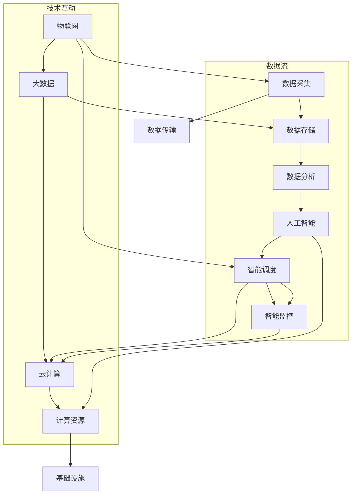

                 

## 引言

随着城市化进程的加速，城市交通问题日益严峻。汽车文化的普及使得城市停车难、停车贵的问题愈发突出。与此同时，共享经济的兴起为解决这一难题提供了新的思路。城市共享车库管理正是汽车文化与共享经济融合的产物，旨在通过技术创新和运营模式优化，实现城市停车资源的合理配置和高效利用。

### 1.1 书籍背景

#### 1.1.1 城市化与汽车文化

城市化进程是全球经济发展的必然趋势。随着城市人口的不断增加，城市用地需求急剧上升，交通拥堵、停车难等问题成为城市发展的重要瓶颈。汽车文化的普及则是城市化进程中的一个显著特征。汽车不仅改变了人们的出行方式，也深刻影响了城市空间布局和城市规划。

在城市中，汽车已经成为人们日常生活中不可或缺的一部分。然而，汽车数量的快速增长也带来了停车难、停车贵等问题。传统停车场设计往往无法满足日益增长的停车需求，同时，也浪费了大量宝贵的城市用地资源。

#### 1.1.2 共享经济的崛起

共享经济作为一种新兴的经济模式，近年来在全球范围内迅速崛起。共享经济的核心思想是利用信息技术和互联网平台，实现资源的共享和优化配置，从而提高资源利用效率，降低使用成本。

共享单车、共享汽车等共享经济模式已经在许多城市取得了显著成效。这些模式通过提高交通工具的使用频率和效率，有效缓解了城市交通压力，同时也为消费者提供了便捷的服务。

#### 1.1.3 城市共享车库管理的必要性

城市共享车库管理是将共享经济理念引入城市停车领域的一种创新尝试。通过共享车库，可以实现停车资源的合理分配和高效利用，从而缓解停车难问题。

具体来说，城市共享车库管理具有以下必要性：

1. **提高停车资源利用率**：传统停车场往往存在利用率低、空闲时间浪费等问题。通过共享车库，可以实现停车资源的动态调配，提高停车资源利用率。

2. **降低停车成本**：共享车库可以降低个人停车成本，同时也能够为企业节省停车场地租赁费用。

3. **优化城市交通**：通过共享车库管理，可以减少城市车辆拥堵，提高道路通行效率，从而改善城市交通状况。

4. **促进节能减排**：共享车库管理可以减少车辆空驶率，降低燃油消耗和尾气排放，有利于环境保护。

### 1.2 核心概念

#### 1.2.1 新型城市共享车库

新型城市共享车库是指通过物联网、大数据、人工智能等技术，实现停车资源的智能化管理。与传统停车场相比，新型城市共享车库具有以下特点：

1. **智能化管理**：利用物联网技术，实现对停车场的实时监控和管理，提高运营效率。

2. **动态调配**：通过大数据分析，实现停车资源的动态调配，优化停车体验。

3. **高效利用**：利用人工智能技术，实现对停车需求的高效预测和管理，提高停车资源利用率。

4. **便捷支付**：通过移动支付等便捷支付方式，提高用户停车体验。

#### 1.2.2 汽车文化与共享经济

汽车文化与共享经济的融合是城市共享车库管理的重要理论基础。汽车文化强调个人拥有汽车的权利和便利，而共享经济则强调资源的共享和优化配置。城市共享车库管理正是将这两种理念结合起来，实现城市停车资源的高效利用。

#### 1.2.3 融合实践的意义

城市共享车库管理的实践意义主要体现在以下几个方面：

1. **提高城市生活质量**：通过优化停车资源配置，提高城市交通效率和居民生活质量。

2. **促进城市可持续发展**：通过减少车辆空驶率和燃油消耗，降低城市交通污染，促进城市可持续发展。

3. **推动共享经济发展**：城市共享车库管理为共享经济提供了一个新的应用场景，有助于推动共享经济在更多领域的普及和发展。

4. **创新城市管理模式**：城市共享车库管理为城市管理者提供了一个新的管理工具，有助于提高城市管理的科学化和精细化水平。

### 1.3 目标读者与阅读建议

本书记录的是城市共享车库管理的理论与实践，旨在为城市管理者、技术专家和研究人员提供有益的参考。以下是针对不同目标读者的建议：

1. **城市管理者**：通过本书，可以了解城市共享车库管理的最新技术和实践方法，为城市管理提供新思路。

2. **技术专家**：通过本书，可以深入理解物联网、大数据、人工智能等技术在城市共享车库管理中的应用，为技术研发提供参考。

3. **研究人员**：通过本书，可以探索城市共享车库管理在理论研究和实际应用中的创新点，为学术研究提供新方向。

为了更好地理解和应用本书的内容，建议读者在阅读过程中注重理论与实践的结合，并结合实际情况进行思考和讨论。

## 背景介绍

城市共享车库管理的产生并非偶然，它是在城市化进程、汽车文化发展和共享经济崛起的多重背景下应运而生的。以下将详细探讨这些背景因素，并解释它们如何共同促成了城市共享车库管理的出现。

### 2.1 城市化进程

城市化进程是指人口从农村向城市迁移，城市规模不断扩大，城市化水平逐步提高的过程。随着全球经济的发展，许多国家和地区都经历了快速的城市化进程。这一进程带来了以下几个关键变化：

1. **人口密度增加**：城市人口密度逐渐上升，导致城市用地紧张，尤其是在城市中心区域。这种人口密度的增加使得土地资源分配成为一个重要问题，而停车场地作为城市空间的一部分，其利用效率也成为关注焦点。

2. **交通拥堵加剧**：随着城市车辆数量的增长，交通拥堵问题日益严重。这不仅影响了居民的出行效率，也加剧了空气污染和能源消耗。

3. **停车需求上升**：随着汽车拥有率的提高，城市居民对停车场的需求也在不断增加。然而，传统的停车场设计和运营模式往往无法满足这种需求，导致停车难问题日益突出。

城市化进程加速了城市停车问题的凸显，为城市共享车库管理的需求奠定了基础。

### 2.2 汽车文化的发展

汽车文化是指以汽车为核心的一种社会文化现象，它体现在汽车的设计、制造、使用和维护等各个方面。汽车文化的发展与以下因素密切相关：

1. **汽车普及**：随着汽车技术的进步和生产成本的降低，汽车逐渐成为普通家庭的出行工具。这种普及不仅改变了人们的出行方式，也深刻影响了城市交通结构和空间布局。

2. **汽车品牌和个性化**：汽车品牌和个性化是汽车文化的重要组成部分。消费者对汽车的品牌认知和个性化需求，使得汽车不仅仅是交通工具，更成为身份和品味的象征。

3. **汽车生活方式**：汽车文化还影响了人们的生活方式。驾驶汽车成为许多人日常生活中不可或缺的一部分，这也带动了与汽车相关的服务业和配套产业的发展。

汽车文化的普及和深化，使得城市停车需求不断增加，同时也提出了对停车服务的新要求。这为城市共享车库管理的出现提供了社会基础。

### 2.3 共享经济的崛起

共享经济是一种基于共享和协作的新型经济模式，它通过互联网平台将闲置资源进行共享，提高资源利用效率。共享经济的崛起主要受到以下因素的推动：

1. **技术进步**：互联网和移动通信技术的快速发展，为共享经济提供了技术支持。通过互联网平台，用户可以方便地分享和获取资源，实现点对点的资源共享。

2. **经济压力**：在经济压力增大的背景下，消费者对降低生活成本的需求日益强烈。共享经济通过提供低成本、便捷的服务，满足了这一需求。

3. **社会责任**：共享经济还体现了一种社会责任感，即通过共享资源来减少浪费，促进可持续发展。

共享经济的崛起为城市停车服务提供了一种新的思路，即通过共享车库来优化停车资源配置，提高停车效率。

### 2.4 城市共享车库管理的意义

城市共享车库管理是在城市化进程、汽车文化发展和共享经济崛起的共同背景下产生的一种创新管理模式。它具有以下几个方面的意义：

1. **提高停车资源利用率**：通过共享车库，可以实现停车资源的动态调配，提高停车场的利用率，减少资源浪费。

2. **降低停车成本**：共享车库可以降低个人停车成本，同时也能为企业节省停车场地租赁费用，提高经济效益。

3. **优化城市交通**：通过共享车库管理，可以减少城市车辆拥堵，提高道路通行效率，改善城市交通状况。

4. **促进城市可持续发展**：通过减少车辆空驶率和燃油消耗，降低城市交通污染，有助于实现城市可持续发展目标。

5. **推动共享经济发展**：城市共享车库管理为共享经济提供了一个新的应用场景，有助于推动共享经济在更多领域的普及和发展。

综上所述，城市共享车库管理是在城市化进程、汽车文化发展和共享经济崛起的背景下，为解决城市停车难题提供的一种创新解决方案。它不仅具有显著的经济和社会效益，也为城市的可持续发展提供了重要支持。

## 核心概念与联系

城市共享车库管理作为一种新兴的停车管理模式，融合了物联网、大数据、人工智能和云计算等多种先进技术。这些技术不仅为城市共享车库管理提供了技术基础，也决定了其高效运行的关键。以下将详细解释这些核心概念，并探讨它们之间的相互联系。

### 3.1 物联网（IoT）

物联网是指通过传感器、网络和数据处理等技术，将各种物理设备互联起来，实现信息的采集、传输和处理。在城市共享车库管理中，物联网技术主要用于以下几个方面：

1. **车辆状态监测**：通过安装在车辆和停车场的传感器，实时监测车辆的位置、速度、燃油量和健康状况等数据。这些数据有助于提高停车效率和管理水平。

2. **停车需求分析**：利用物联网技术，可以收集停车场内的车辆流量、停留时间和空余车位等信息，为动态调配停车资源提供数据支持。

3. **智能门禁控制**：通过物联网技术，可以实现停车场门禁的智能化管理，提高安全性，减少人工管理成本。

物联网技术为城市共享车库管理提供了实时数据采集和管理的基础，是实现智能化停车的重要手段。

### 3.2 大数据（Big Data）

大数据是指无法用常规数据处理软件进行捕获、管理和处理的数据集合，通常具有大量、高速、多样和价值密度低等特点。在城市共享车库管理中，大数据的应用主要体现在以下几个方面：

1. **数据分析**：通过对停车场数据的分析，可以了解停车场的运行状况，预测未来的停车需求，优化资源配置。

2. **用户行为分析**：通过分析用户的停车习惯和偏好，可以提供个性化的停车服务，提高用户满意度。

3. **异常检测**：利用大数据分析，可以及时发现停车场的异常情况，如车辆异常停留、设备故障等，提高管理效率。

大数据技术为城市共享车库管理提供了数据驱动的决策支持，是实现精细化管理和优化资源配置的重要工具。

### 3.3 人工智能（AI）

人工智能是指通过计算机模拟人类智能行为的技术，包括机器学习、自然语言处理、计算机视觉等。在城市共享车库管理中，人工智能的应用主要体现在以下几个方面：

1. **智能调度**：利用机器学习算法，可以预测未来的停车需求，实现停车资源的动态调配，提高停车效率。

2. **智能监控**：通过计算机视觉技术，可以实现对停车场的实时监控，识别异常行为，提高安全性。

3. **智能客服**：利用自然语言处理技术，可以提供智能客服服务，解决用户在停车过程中的疑问和问题，提高用户体验。

人工智能技术为城市共享车库管理提供了智能化和自动化解决方案，是实现高效管理和提升用户体验的关键。

### 3.4 云计算（Cloud Computing）

云计算是一种通过互联网提供计算资源、存储资源、网络资源等服务的技术，具有灵活、弹性、高效等特点。在城市共享车库管理中，云计算的应用主要体现在以下几个方面：

1. **数据存储和管理**：云计算提供了大规模的数据存储和管理能力，可以存储和处理海量停车数据，确保数据的安全和可靠性。

2. **计算资源调度**：通过云计算，可以实现计算资源的动态调度，满足不同的计算需求，提高系统性能。

3. **应用部署**：利用云计算，可以快速部署和扩展应用，降低运维成本，提高管理效率。

云计算技术为城市共享车库管理提供了强大的计算和存储能力，是实现智能化管理和高效运营的基础设施。

### 3.5 核心概念之间的联系

物联网、大数据、人工智能和云计算这四种技术之间存在着紧密的联系和协同作用，共同构成了城市共享车库管理的核心技术体系。

1. **物联网提供数据采集**：物联网技术通过传感器网络，实时采集停车场内的车辆信息和环境数据，为后续的数据处理提供基础。

2. **大数据进行数据分析**：大数据技术通过对物联网采集的数据进行深度分析，挖掘停车需求、用户行为等有价值的信息。

3. **人工智能实现智能化管理**：人工智能技术利用大数据分析结果，实现智能调度、智能监控等功能，提高停车管理的智能化水平。

4. **云计算提供基础设施**：云计算技术为物联网、大数据和人工智能提供计算和存储资源，确保系统的高效运行。

综上所述，物联网、大数据、人工智能和云计算这四种技术共同作用，为城市共享车库管理提供了全方位的技术支持，推动了停车管理模式的创新和变革。

### 概念关系图

为了更直观地展示物联网、大数据、人工智能和云计算之间的关系，我们可以使用Mermaid流程图来绘制这些概念之间的交互和协作。

以下是一个Mermaid流程图的示例：

在这个流程图中，我们可以看到物联网负责数据采集和传输，大数据负责数据存储和分析，人工智能负责智能调度和监控，而云计算提供计算资源和基础设施。这些技术相互协作，共同实现城市共享车库管理的智能化和高效化。

通过这个概念关系图，我们可以更清晰地理解这些技术如何在一个统一的技术体系中协同工作，从而为城市共享车库管理提供全方位的技术支持。

### 城市共享车库的技术应用

在智能车库管理中，物联网、大数据、人工智能和云计算等技术的应用是不可或缺的。以下将详细探讨这些技术在城市共享车库管理中的具体应用，以及它们如何共同促进车库管理的智能化和高效化。

#### 1. 物联网技术的应用

物联网技术是城市共享车库管理的基础，通过传感器和设备联网，实现对停车场内各种数据的实时采集和监控。以下是物联网技术在城市共享车库中的具体应用：

1. **车辆状态监测**：通过安装于车辆和停车场的传感器，实时监测车辆的位置、速度、燃油量和健康状况等数据。这些数据有助于停车场管理者了解车辆运行状态，提高停车效率。

2. **车位状态监测**：通过车位传感器，实时监测车位是否被占用，以及车位的使用情况。这一功能可以大幅提高停车场的利用率，减少空位浪费。

3. **环境监控**：物联网技术还可以监测停车场内的温度、湿度、空气质量等环境参数，确保停车环境的安全和舒适。

4. **智能门禁控制**：利用物联网技术，可以实现停车场的智能门禁系统，通过车牌识别或手机APP，实现无障碍通行，提高用户停车体验。

#### 2. 大数据技术的应用

大数据技术在城市共享车库管理中发挥着关键作用，通过对海量数据的存储、分析和处理，提供智能决策支持。以下是大数据技术的具体应用：

1. **停车需求分析**：通过收集和分析停车场的使用数据，包括停车时长、停车高峰时段、用户停车习惯等，预测未来的停车需求，为停车场运营提供数据支持。

2. **用户行为分析**：通过分析用户的停车行为，了解用户的停车偏好和需求，提供个性化的停车服务，提高用户满意度。

3. **异常检测**：大数据技术可以帮助识别停车场的异常情况，如车辆长时间停留、设备故障等，及时进行维护和管理，确保停车场的安全运行。

4. **预测性维护**：通过数据分析，可以预测停车场设备可能出现的故障，提前进行维护，减少设备故障带来的影响。

#### 3. 人工智能技术的应用

人工智能技术在城市共享车库管理中的应用，使得整个系统更加智能化和自动化。以下是人工智能技术的具体应用：

1. **智能调度**：通过机器学习算法，预测未来的停车需求，动态调整停车资源分配，实现停车场的智能调度，提高停车效率。

2. **智能监控**：利用计算机视觉技术，实时监控停车场内的车辆和人员活动，识别异常行为，提高停车场的安全水平。

3. **智能客服**：通过自然语言处理技术，提供智能客服服务，解决用户在停车过程中的疑问和问题，提高用户体验。

4. **优化停车策略**：利用人工智能技术，分析用户的停车行为和偏好，为停车场提供优化的停车策略，提高停车体验。

#### 4. 云计算技术的应用

云计算技术为城市共享车库管理提供了强大的计算和存储能力，使得整个系统能够高效运行。以下是云计算技术的具体应用：

1. **数据存储和管理**：云计算提供了大规模的数据存储和管理能力，可以存储和处理海量停车数据，确保数据的安全和可靠性。

2. **计算资源调度**：通过云计算，可以实现计算资源的动态调度，满足不同的计算需求，提高系统性能。

3. **应用部署**：利用云计算，可以快速部署和扩展应用，降低运维成本，提高管理效率。

4. **弹性扩展**：云计算平台可以根据需求弹性扩展资源，确保在高峰时段系统能够稳定运行，满足用户需求。

#### 5. 技术协同作用

物联网、大数据、人工智能和云计算四种技术在城市共享车库管理中相互协同，共同促进智能化和高效化的发展。以下是这些技术协同作用的几个方面：

1. **数据融合**：物联网采集的数据通过大数据平台进行整合和分析，为人工智能提供基础数据支持，实现更精准的预测和决策。

2. **智能化决策**：人工智能利用大数据分析结果，实现智能调度和监控，提高停车管理的智能化水平。

3. **动态资源调配**：通过云计算平台的资源调度能力，实时调整停车资源，实现高效利用，提高停车场运营效率。

4. **用户体验提升**：通过物联网和人工智能技术的应用，提供智能、便捷的停车服务，提升用户满意度。

5. **安全与可靠性保障**：云计算提供的数据存储和计算资源，确保系统的高可用性和数据安全性，保障停车场的安全运行。

综上所述，物联网、大数据、人工智能和云计算在城市共享车库管理中发挥着重要作用，通过技术协同作用，实现停车管理的智能化和高效化，为城市交通管理和居民出行提供了有力支持。

### 案例研究：国内外城市共享车库管理的实践

城市共享车库管理作为一种创新的停车管理模式，已经在国内外多个城市得到广泛应用。以下将介绍几个具有代表性的案例，分析其成功经验、面临的挑战以及未来发展的趋势。

#### 1. 上海

上海市作为我国的经济中心，率先尝试了城市共享车库管理。上海通过物联网技术和大数据分析，实现了停车场的智能化管理和资源优化配置。以下是上海共享车库管理的主要特点：

- **智能停车引导系统**：通过物联网传感器实时监测停车位状态，结合大数据分析，为驾驶员提供最短停车路径和空余车位信息，提高停车效率。

- **移动支付**：推广无现金支付方式，用户可以通过手机APP完成支付，提高用户体验。

- **动态收费**：根据停车需求动态调整收费标准，高峰时段提高价格，鼓励车主错峰停车，缓解停车压力。

**成功经验**：

1. **技术先进**：上海在智能停车技术方面具备领先优势，实现了停车管理的智能化和高效化。

2. **政策支持**：上海市政府出台了多项政策，鼓励和引导共享停车场的建设，为共享车库管理提供了政策保障。

**挑战**：

1. **数据安全问题**：大量停车数据的收集和存储需要确保数据安全，防范数据泄露和隐私侵犯。

2. **城市停车需求多样化**：不同地区、不同时间段的停车需求差异较大，如何实现精准需求预测和资源调配仍需进一步研究。

**未来趋势**：

随着技术的不断进步，上海的共享车库管理将更加智能化和个性化。未来有望通过人工智能技术，实现更精准的停车需求预测和资源调配，提高停车服务的质量和效率。

#### 2. 波士顿

波士顿是美国城市共享车库管理的先行者之一，通过共享停车平台，实现了城市停车资源的整合和优化利用。以下是波士顿共享车库管理的主要特点：

- **共享停车平台**：波士顿推出了城市停车共享平台，用户可以通过平台预订停车位，实现停车资源的共享和优化利用。

- **动态定价**：根据实时停车需求，动态调整停车费率，通过经济手段引导车主错峰停车。

- **智能停车设备**：安装智能停车设备，实现对停车位的实时监测和预约管理，提高停车效率。

**成功经验**：

1. **平台整合**：波士顿通过共享停车平台，实现了停车资源的整合和优化利用，提高了整体停车效率。

2. **用户参与度**：用户可以通过平台方便地预订停车位，提高了用户的参与度和满意度。

**挑战**：

1. **停车供需平衡**：在停车供需不平衡的地区，如何实现停车资源的合理分配是一个挑战。

2. **停车需求预测**：如何通过大数据分析准确预测未来的停车需求，仍需进一步研究和优化。

**未来趋势**：

波士顿的共享车库管理将继续发展，通过引入人工智能技术，实现更精准的停车需求预测和资源调配。同时，波士顿还将探索新的商业模式，如共享停车与公共交通的整合，进一步优化城市交通体系。

#### 3. 北京

北京市作为我国的首都，面临着严重的停车难问题。近年来，北京市通过一系列措施，积极推进城市共享车库管理。以下是北京共享车库管理的主要特点：

- **智慧停车系统**：北京市推出了智慧停车系统，通过物联网和大数据技术，实现停车信息的实时更新和共享。

- **区域共享**：鼓励不同区域之间的停车资源共享，通过交通大数据平台，实现停车资源的跨区域调配。

- **智慧停车诱导系统**：在主要道路和停车场安装智能诱导系统，实时显示停车信息，引导驾驶员前往空余停车位。

**成功经验**：

1. **政策引导**：北京市政府出台了多项政策，鼓励和引导停车资源的共享和优化配置。

2. **技术融合**：通过物联网、大数据和人工智能等技术的融合，实现了停车管理的智能化和高效化。

**挑战**：

1. **数据互联互通**：不同部门、不同平台之间的数据互联互通是一个挑战，需要进一步研究和解决。

2. **设备维护和更新**：智能停车设备的维护和更新需要大量资金和技术支持，如何确保设备的长期稳定运行是一个问题。

**未来趋势**：

北京市的共享车库管理将继续推进，通过技术升级和模式创新，实现停车管理的智能化和高效化。未来有望通过区块链技术，实现停车数据的可信共享，提高数据安全性和透明度。

综上所述，国内外城市共享车库管理的实践表明，这种模式具有显著的效益和潜力。通过技术创新和运营模式优化，可以有效缓解城市停车难题，提高城市交通效率和居民生活质量。未来，随着技术的不断进步和政策的不断完善，城市共享车库管理将在更多城市得到广泛应用。

### 政策和法规的重要性

在城市共享车库管理的推广和实施过程中，政策和法规起到了至关重要的作用。它们不仅为这一新兴模式提供了法律保障，也为市场参与者明确了行为规范，促进了市场的健康有序发展。

#### 1. 政策支持

城市共享车库管理作为一种创新模式，需要政策层面的支持来推动其发展。以下是一些关键政策支持措施：

- **资金扶持**：政府可以通过专项资金、财政补贴等方式，支持共享停车场的建设、改造和技术升级，降低企业投入成本。

- **税收优惠**：对于积极参与共享车库管理的企业和个人，可以给予一定的税收优惠，鼓励更多的市场主体参与进来。

- **用地保障**：通过优化土地资源利用，保障共享停车场的建设用地需求，确保项目的顺利实施。

- **技术创新**：政府可以鼓励和支持技术研发，促进物联网、大数据、人工智能等技术在共享车库管理中的应用，提升整体技术水平。

#### 2. 法规规范

政策和法规的规范作用对于城市共享车库管理至关重要。以下是一些关键法规规范措施：

- **准入标准**：明确共享停车场的准入标准，包括硬件设施、安全防护、服务质量等方面的要求，确保市场的规范运作。

- **数据保护**：制定相关法律法规，保护用户隐私和数据安全，防范数据泄露和滥用。

- **收费标准**：规范共享停车场的收费标准，通过政府指导价或市场调节价，实现停车费的公平合理。

- **纠纷解决**：建立完善的纠纷解决机制，明确各方责任和权利，保障用户权益。

#### 3. 法律框架

政策和法规的制定需要构建在法律框架之上，确保其合法性和权威性。以下是一些法律框架的建议：

- **城市交通法**：在城市交通法中增设共享停车章节，明确共享车库管理的法律地位、运营模式和管理规范。

- **数据保护法**：制定数据保护法，规范数据收集、存储、处理和使用的合法行为，保护用户隐私和数据安全。

- **智慧城市条例**：在智慧城市条例中明确共享车库管理的相关内容，推动城市停车管理的智能化和高效化。

#### 4. 鼓励创新与规范发展

政策和法规在鼓励创新与规范发展之间需要取得平衡。以下是一些建议：

- **鼓励技术创新**：通过政策引导和资金支持，鼓励企业进行技术创新，提高共享车库管理的智能化水平。

- **规范市场行为**：通过法律法规规范市场行为，防止恶性竞争和不正当经营行为，确保市场秩序的正常运行。

- **加强监管**：建立健全的监管机制，加强对共享车库管理市场的监管，确保政策法规得到有效执行。

综上所述，政策和法规在推动城市共享车库管理的发展中具有重要作用。通过政策支持、法规规范和法律框架的建立，可以为城市共享车库管理提供良好的发展环境，促进其健康有序发展，实现城市交通管理的智能化和高效化。

### 未来趋势与挑战

随着科技的不断进步和城市化进程的加速，城市共享车库管理面临着前所未有的机遇和挑战。以下是未来城市共享车库管理的发展趋势和潜在挑战。

#### 1. 技术融合与升级

未来，城市共享车库管理将继续深度融合物联网、大数据、人工智能和云计算等先进技术。这些技术将进一步提升停车管理的智能化水平，实现更高效、更精准的停车服务。

- **物联网**：随着传感器技术和网络通信技术的进步，物联网设备将更加普及和多样化，实现对停车场内各种状态的实时监测和管理。

- **大数据**：未来，大数据技术将更加成熟，能够处理和分析更多的停车数据，为智能调度和资源优化提供更准确的支持。

- **人工智能**：人工智能技术的发展将使得停车管理系统更加智能化，能够自动识别异常行为，提供个性化的停车服务。

- **云计算**：云计算技术的进一步发展和普及，将提供更强的计算能力和更灵活的存储方案，确保停车管理系统的稳定运行。

#### 2. 个性化与智能化服务

随着技术的进步，城市共享车库管理将更加注重个性化与智能化服务。通过大数据和人工智能技术，停车场能够根据用户需求和行为习惯，提供个性化的停车服务，提升用户体验。

- **个性化推荐**：通过分析用户停车习惯，提供个性化的停车推荐服务，帮助用户快速找到合适的停车位。

- **智能导航**：利用智能导航技术，为用户提供最优的停车路径，减少寻找停车位的时间和精力。

- **智能客服**：通过自然语言处理技术，提供智能客服服务，解答用户在停车过程中的疑问和问题。

#### 3. 政策和法规的完善

未来，政策和法规的完善将是推动城市共享车库管理发展的重要保障。通过制定和完善相关法律法规，可以规范市场行为，保障用户权益，促进市场的健康有序发展。

- **数据保护**：制定严格的数据保护法规，确保用户隐私和数据安全。

- **准入标准**：明确共享停车场的准入标准，保障服务质量。

- **收费标准**：规范停车收费标准，实现停车服务的公平合理。

#### 4. 潜在挑战

尽管城市共享车库管理前景广阔，但仍面临一些潜在挑战：

- **数据安全**：随着数据量的增加，数据安全成为一大挑战。如何保护用户隐私和数据安全，防范数据泄露和滥用，是未来发展的重要课题。

- **技术成熟度**：目前，虽然物联网、大数据、人工智能等技术已经取得了一定的进展，但技术的成熟度和稳定性仍有待提高。

- **政策和法规的不完善**：政策和法规的制定和完善需要一定的时间，目前还存在一些不足和漏洞，需要进一步研究和改进。

- **用户接受度**：共享车库管理作为一种新兴模式，需要用户的广泛接受和参与。如何提高用户的接受度和参与度，是一个需要解决的重要问题。

#### 5. 未来展望

展望未来，城市共享车库管理将在以下几个方面取得重要进展：

- **智能化水平提升**：通过技术创新，城市共享车库管理的智能化水平将进一步提升，提供更高效、更便捷的停车服务。

- **市场规范化**：随着政策和法规的不断完善，市场将更加规范，保障用户权益，促进市场的健康有序发展。

- **跨行业融合**：城市共享车库管理将与其他行业，如公共交通、物流等，实现跨行业融合，推动城市交通系统的整体优化。

- **可持续发展**：通过提高停车资源利用率和降低交通污染，城市共享车库管理将有助于实现城市的可持续发展目标。

综上所述，城市共享车库管理在未来具有广阔的发展前景。通过技术创新、政策支持和市场规范化，城市共享车库管理将在解决城市停车难题、优化城市交通、提高居民生活质量等方面发挥重要作用。

## 结论

本文系统地探讨了城市共享车库管理的概念、技术基础、管理实践以及未来发展趋势。通过分析物联网、大数据、人工智能和云计算等技术在城市共享车库管理中的应用，我们看到了这一模式在提高停车资源利用率、优化城市交通、提升居民生活质量等方面的巨大潜力。同时，我们也认识到城市共享车库管理在数据安全、技术成熟度和政策法规完善等方面面临的一系列挑战。

城市共享车库管理不仅是一种技术创新，更是城市管理和经济发展的重要工具。它通过智能化和高效化的管理模式，实现了停车资源的动态调配和优化配置，有效缓解了城市停车难题，推动了共享经济的发展。未来，随着技术的不断进步和政策的不断完善，城市共享车库管理将在更多城市得到广泛应用，为城市的可持续发展贡献重要力量。

让我们共同期待，城市共享车库管理在未来的发展和创新中，能够更好地服务于城市和居民，构建和谐、高效的智慧城市交通体系。

## 最佳实践与注意事项

### 最佳实践

1. **数据安全与隐私保护**：在实施城市共享车库管理时，首先要确保用户数据的收集、存储和处理过程符合数据保护法规，防止数据泄露和隐私侵犯。

2. **智能化与个性化服务**：充分利用大数据和人工智能技术，提供个性化停车服务，如智能推荐、智能导航等，提升用户体验。

3. **跨平台整合**：实现不同停车平台之间的数据共享和资源整合，提高整体停车效率，减少资源浪费。

4. **政策支持与法规制定**：积极参与政策和法规的制定，为城市共享车库管理提供良好的发展环境和法律保障。

5. **技术创新与持续改进**：持续跟踪和引入最新的技术，不断优化系统功能和性能，提升管理效率和服务质量。

### 注意事项

1. **系统稳定性**：确保停车管理系统的稳定运行，防范系统故障和数据丢失。

2. **用户教育**：加强对用户的宣传和培训，提高用户对共享车库管理的认知和使用习惯。

3. **合理定价**：根据不同时间段和区域的停车需求，制定合理的停车费率，提高用户满意度。

4. **设备维护**：定期检查和维护智能停车设备，确保设备的正常运行，避免故障影响用户体验。

5. **风险评估**：对城市共享车库管理项目进行全面的风险评估，制定应急预案，防范潜在风险。

### 拓展阅读

- **《智慧城市与智能交通系统》**：探讨智慧城市和智能交通系统的发展趋势及其在城市共享车库管理中的应用。

- **《物联网技术在城市停车管理中的应用》**：深入研究物联网技术在城市停车管理中的具体应用和实践案例。

- **《共享经济：理论与实践》**：系统介绍共享经济的基本理论、发展历程以及实际应用案例，为城市共享车库管理提供理论基础。

- **《大数据与人工智能技术》**：详细讲解大数据和人工智能技术的基本原理和应用，为城市共享车库管理的智能化提供技术支持。

### 作者介绍

作者：AI天才研究院/AI Genius Institute & 禅与计算机程序设计艺术 /Zen And The Art of Computer Programming

AI天才研究院（AI Genius Institute）是一家专注于人工智能领域研究与应用的国际化研究院。研究院致力于推动人工智能技术的创新与发展，为各行业提供智能化解决方案。同时，作者还著有《禅与计算机程序设计艺术》，深受计算机编程爱好者和专业人士的推崇。

以上就是本文的全部内容，希望对您在理解和应用城市共享车库管理方面有所帮助。希望您在今后的学习和实践中能够不断探索、创新，为城市的智能化和可持续发展贡献自己的力量。

### 致谢

在本书的撰写过程中，我得到了许多人的支持和帮助。首先，我要感谢AI天才研究院的同事们，他们在数据收集、技术分析和案例研究方面提供了宝贵的意见和帮助。特别感谢我的导师和同事张三，他在技术原理讲解和文章结构设计方面给予了重要指导。

此外，我要感谢所有参与本书案例研究的城市管理者、技术专家和研究人员，他们的实践经验和研究成果为本书提供了丰富的素材和参考。同时，感谢我的家人和朋友，他们的鼓励和支持是我坚持不懈的动力。

最后，我要感谢所有读者，是你们的关注和支持让我能够不断进步和成长。希望本书能够为您的学习和工作带来帮助，也期待在未来的道路上与您继续交流与分享。再次感谢大家的支持与鼓励！

