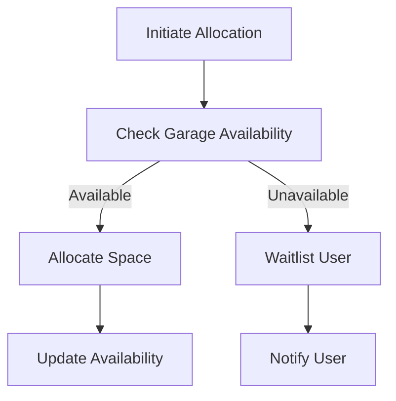
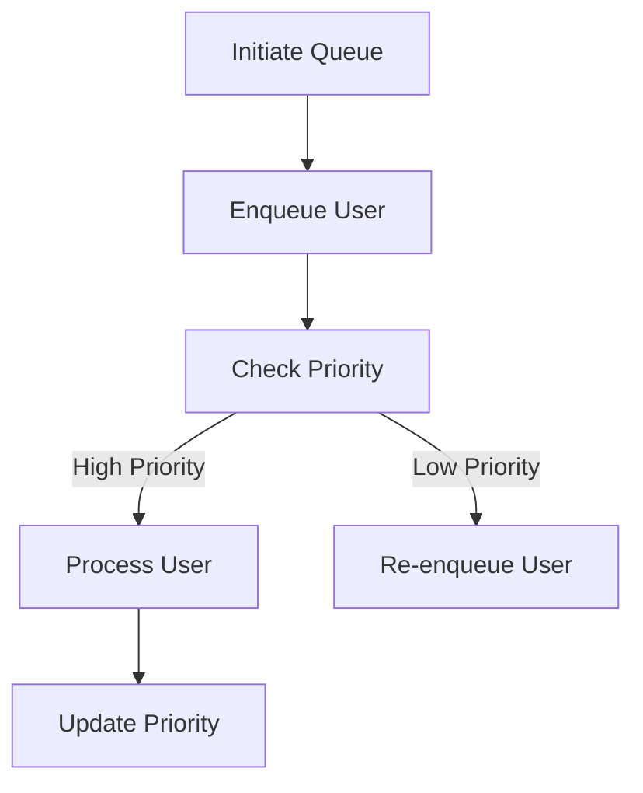
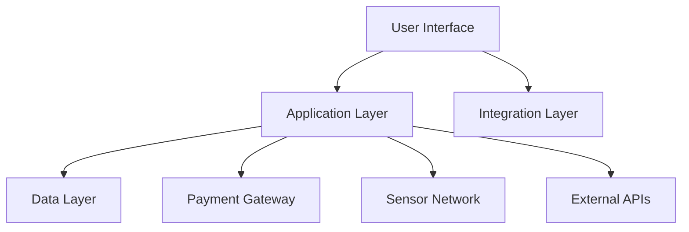
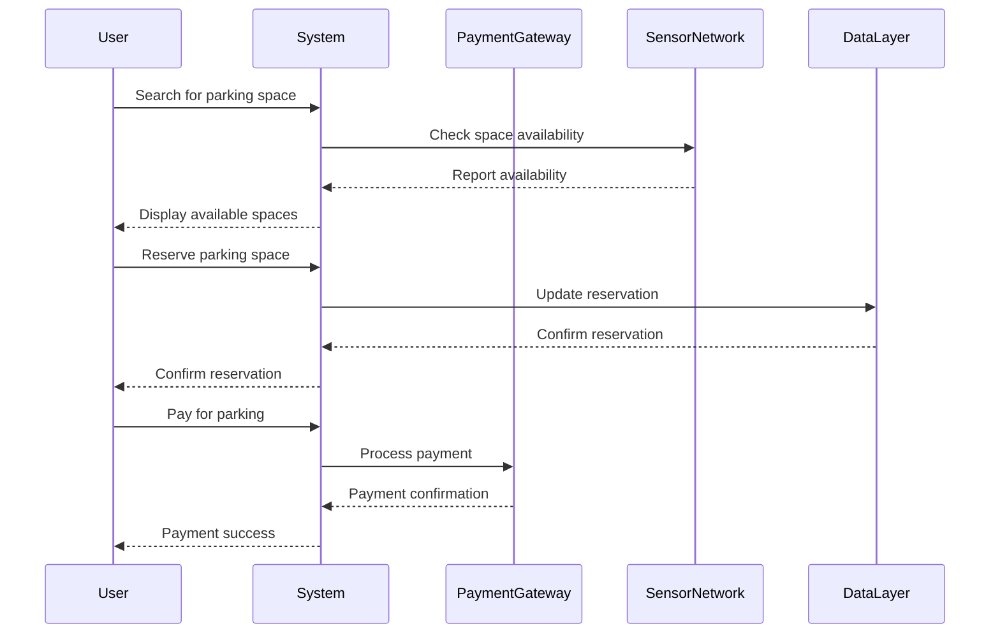

                 


### New Urban Shared Garages: The Fusion of Car Culture and Sharing Economy

#### Introduction

In recent years, the concept of sharing economy has been transforming various aspects of our lives, from transportation to accommodation. One such transformation is the emergence of new urban shared garages, which represent a significant fusion of car culture and sharing economy principles. This article aims to delve into the intricacies of new urban shared garages, examining their origins, development, core concepts, operational principles, system designs, and practical applications.

#### Key Terms

- **New Urban Shared Garages**: Structured parking spaces designed for shared use, typically in urban areas, to maximize efficiency and minimize waste.
- **Car Culture**: The lifestyle and social practices associated with the use and ownership of cars.
- **Sharing Economy**: An economic system built around the sharing of resources to maximize utility and minimize waste.
- **Smart Garages**: Technologically advanced garages equipped with sensors, automation, and data analytics to optimize usage and management.

#### Abstract

This article explores the integration of car culture and sharing economy through the lens of new urban shared garages. It begins with an introduction to shared garages, detailing their origin, development, and significance. It then moves on to discuss the core concepts and relationships, providing a clear understanding of the terminologies and entities involved. Following this, the article delves into the operational principles and algorithms used in shared garage management, elucidating the underlying mathematical models and formulas. The subsequent sections focus on the system design and architecture, including the project introduction, system functions, and interfaces. Finally, the article concludes with a practical case study, best practices, and a summary of key insights.

### Chapter 1: Introduction to New Urban Shared Garages

#### 1.1 What are New Urban Shared Garages?

**Origin and Development of Shared Garages**

The concept of shared garages can be traced back to the early 2000s when urban planners and technologists began to recognize the inefficiencies in traditional parking systems. These inefficiencies were particularly evident in densely populated urban areas where parking spaces were scarce and underutilized. The idea of shared garages was born out of the need to maximize the use of available parking spaces while minimizing waste.

**Definition and Characteristics**

New urban shared garages are structured parking spaces designed for shared use among multiple individuals or entities. These garages are typically located in urban areas where parking demand is high, and they serve as a solution to the parking space crunch. Key characteristics of new urban shared garages include:

- **Shared Use**: Parking spaces are allocated on a rotational basis, allowing multiple users to utilize the same space at different times.
- **Technology Integration**: Shared garages are often equipped with smart technologies such as sensors, automation systems, and mobile apps to facilitate efficient usage and management.
- **Sustainability**: By reducing the number of private cars on the road and promoting the use of shared vehicles, new urban shared garages contribute to reducing carbon emissions and traffic congestion.
- **Affordability**: Shared garages can offer more affordable parking solutions compared to traditional private parking spaces.

**Different Types of Shared Garages**

There are various types of shared garages, each designed to cater to different needs and contexts. Some common types include:

- **Community Shared Garages**: These are shared garages that serve a specific community, such as a residential neighborhood or an office complex.
- **Smart Shared Garages**: Equipped with advanced technologies such as IoT devices, AI, and automation systems, these garages offer a seamless and efficient parking experience.
- **Seasonal Shared Garages**: These are shared garages that operate during specific seasons, such as summer or winter, to cater to increased demand during those periods.
- **Event-Based Shared Garages**: Designed for temporary use during special events or festivals, these garages provide parking solutions for large gatherings.

#### 1.2 The Integration of Car Culture and Sharing Economy

**Understanding Car Culture**

Car culture refers to the set of beliefs, values, and behaviors associated with the use and ownership of cars. It encompasses a wide range of aspects, including the desire for personal mobility, the status symbol of owning a car, and the influence of automotive industries on society. Key elements of car culture include:

- **Automobility**: The freedom and convenience of personal transportation provided by cars.
- **Consumerism**: The car industry's impact on consumer behavior, promoting the purchase of new cars and related products.
- **Automotive Media**: The influence of movies, television shows, and advertisements that celebrate car ownership and driving.

**The Concept of Sharing Economy**

The sharing economy is an economic system built around the sharing of resources to maximize utility and minimize waste. It challenges the traditional ownership model by encouraging the use of shared resources instead of individual ownership. Key principles of the sharing economy include:

- **Collaborative Consumption**: The act of sharing resources, such as cars, homes, or tools, among individuals or groups.
- **Peer-to-Peer Lending**: The practice of borrowing or lending money or goods directly between individuals without the involvement of traditional financial institutions.
- **Platform Economy**: The use of digital platforms to connect resource providers with users, facilitating the sharing of resources.

**The Synergy between Car Culture and Sharing Economy**

The integration of car culture and sharing economy in the form of new urban shared garages represents a significant shift in how we think about car ownership and usage. This synergy is driven by several factors:

- **Environmental Concerns**: The shared use of cars can significantly reduce carbon emissions and traffic congestion, aligning with the growing global emphasis on sustainability.
- **Economic Benefits**: Shared garages offer more affordable parking solutions for both individuals and businesses, promoting economic efficiency.
- **Technological Advancements**: The integration of smart technologies in shared garages enhances the user experience and operational efficiency, making shared garages a more attractive alternative to traditional parking.
- **Cultural Shift**: The changing societal attitudes towards car ownership, with an increasing preference for flexibility, convenience, and cost-effectiveness.

#### 1.3 The Current Status and Future Prospects of New Urban Shared Garages

**Market Analysis**

The market for new urban shared garages is growing rapidly, driven by factors such as urbanization, environmental concerns, and technological advancements. Key market trends include:

- **Increasing Demand**: As urban populations continue to rise, the demand for efficient and affordable parking solutions is expected to increase.
- **Technological Integration**: The adoption of smart technologies in shared garages is expected to grow, further enhancing the user experience and operational efficiency.
- **Policy Support**: Governments around the world are implementing policies and regulations to promote the development of shared garages as a means of addressing urban challenges.

**Technological Innovation**

Technological innovation plays a crucial role in the development and success of new urban shared garages. Some key areas of innovation include:

- **Sensors and Automation**: The use of sensors and automation systems to optimize garage operations and improve user experience.
- **Data Analytics**: The use of data analytics to gain insights into user behavior and optimize parking space allocation.
- **Artificial Intelligence**: The integration of AI technologies to enable predictive maintenance, personalized user experiences, and intelligent decision-making.

**Policy and Regulation**

Policies and regulations play a critical role in shaping the development and operation of new urban shared garages. Key policy considerations include:

- **Zoning and Land Use**: Regulations governing the location, design, and construction of shared garages to ensure their integration into urban environments.
- **Tax Incentives**: Policies that provide tax incentives to encourage the development and operation of shared garages.
- **Data Privacy**: Regulations to protect user data and ensure the privacy and security of personal information.

### Chapter 2: Core Concepts and Relationships in New Urban Shared Garages

#### 2.1 Key Terms and Concepts

**Key Terms**

- **New Urban Shared Garages**: Structured parking spaces designed for shared use in urban areas.
- **Car Culture**: The lifestyle and social practices associated with the use and ownership of cars.
- **Sharing Economy**: An economic system built around the sharing of resources.
- **Smart Garages**: Garages equipped with advanced technologies to enhance efficiency and user experience.

**Core Concepts**

- **Shared Use**: The concept of allowing multiple users to access the same parking space at different times.
- **Smart Technologies**: The integration of IoT devices, AI, and automation systems in garage management.
- **Sustainability**: The environmental benefits of reducing carbon emissions and traffic congestion.
- **Economic Efficiency**: The cost savings and economic benefits associated with shared garages.

**Comparative Analysis of Key Terms and Concepts**

The table below provides a comparative analysis of key terms and concepts related to new urban shared garages.

| Term/Concept          | Definition                                                                                   | Comparative Analysis                                                                                                                                                                                                                       |
|-----------------------|----------------------------------------------------------------------------------------------|-----------------------------------------------------------------------------------------------------------------------------------------------------------------------------------------------------------------------------------------------|
| New Urban Shared Garages | Structured parking spaces designed for shared use in urban areas.                               | Differentiates shared garages from traditional private parking spaces. Provides a flexible and efficient solution to urban parking challenges.                                                      |
| Car Culture            | The lifestyle and social practices associated with the use and ownership of cars.                | Highlights the social and cultural aspects of car ownership and usage. Influences the adoption and acceptance of shared garages.                                                                   |
| Sharing Economy        | An economic system built around the sharing of resources to maximize utility and minimize waste. | Emphasizes the benefits of sharing resources, such as reducing waste and promoting sustainability. Relates to the core principles of shared garages.                                       |
| Smart Garages          | Garages equipped with advanced technologies to enhance efficiency and user experience.           | Differentiates smart garages from traditional garages. Highlights the importance of technology in the successful operation of shared garages.                                                      |
| Shared Use             | The concept of allowing multiple users to access the same parking space at different times.     | Focuses on the core functionality of shared garages. Encourages efficient use of parking spaces and reduces waste.                                                                                  |
| Smart Technologies     | The integration of IoT devices, AI, and automation systems in garage management.                | Emphasizes the role of technology in optimizing garage operations and improving user experience.                                                                   |
| Sustainability         | The environmental benefits of reducing carbon emissions and traffic congestion.                | Highlights the environmental advantages of shared garages. Supports the broader goals of sustainability and environmental protection.                                                           |
| Economic Efficiency     | The cost savings and economic benefits associated with shared garages.                        | Focuses on the economic benefits of shared garages, such as reduced parking costs and increased resource utilization.                                                                       |

#### 2.2 Entity-Relationship Diagram

**Entity Identification**

The following entities are identified in the context of new urban shared garages:

- **User**: An individual or entity that uses the shared garage.
- **Garage**: A structured parking space designed for shared use.
- **Vehicle**: A car or other vehicle parked in the shared garage.
- **Smart Technology**: Advanced technologies used in garage management.

**Relationship Definition**

The following relationships exist between the entities:

- **User-Garage**: A user can access multiple garages, and a garage can be accessed by multiple users.
- **Garage-Vehicle**: A vehicle is parked in a garage, and a garage can have multiple vehicles parked at different times.
- **Garage-Smart Technology**: A garage can be equipped with multiple smart technologies, and each smart technology can be used in multiple garages.

**ER Diagram Representation (Mermaid Diagram)**

```mermaid
erDiagram
  User ||--|{ Garage }|--| Vehicle
  Garage ||--|{ Smart Technology }
```

### Chapter 3: Principles and Algorithms in Shared Garage Management

#### 3.1 Principles of Shared Garage Operation

**Basic Principles**

The operation of shared garages is guided by several basic principles aimed at maximizing efficiency and minimizing waste. These principles include:

- **Rotational Allocation**: Parking spaces are allocated on a rotational basis, allowing multiple users to access the same space at different times.
- **Real-time Availability**: Information on the availability of parking spaces is provided in real-time to users, enabling them to make informed decisions about parking.
- **Data-Driven Management**: The use of data analytics to optimize garage operations, allocate parking spaces efficiently, and predict user demand.

**Management Strategies**

Effective management strategies are crucial for the successful operation of shared garages. These strategies include:

- **Dynamic Pricing**: Adjusting parking fees based on demand to balance supply and demand and optimize revenue.
- **Maintenance and Upkeep**: Regular maintenance and upkeep of garage infrastructure, including lighting, ventilation, and security systems.
- **User Feedback**: Incorporating user feedback to continuously improve the garage experience and address user concerns.

**Optimization Methods**

Optimization methods are employed to enhance the efficiency of shared garages. These methods include:

- **Queue Management**: Implementing queuing systems to manage the flow of users entering and exiting the garage.
- **Space Allocation Algorithms**: Using algorithms to optimize the allocation of parking spaces based on real-time availability and user preferences.
- **Energy Efficiency**: Incorporating energy-efficient technologies, such as LED lighting and solar power, to reduce energy consumption and operating costs.

#### 3.2 Common Algorithms and Technologies

**Overview of Common Algorithms**

Several algorithms are commonly used in the management of shared garages. These algorithms include:

- **Space Allocation Algorithms**: These algorithms are used to allocate parking spaces efficiently based on real-time availability and user preferences. Common space allocation algorithms include First-Come, First-Served (FCFS) and Shortest Remaining Time (SRT).
- **Queue Management Algorithms**: These algorithms are used to manage the flow of users entering and exiting the garage, ensuring a smooth and efficient experience. Common queue management algorithms include Priority Queue and Round-Robin.
- **Data Analytics Algorithms**: These algorithms are used to analyze user data and gain insights into user behavior and demand patterns. Common data analytics algorithms include Regression Analysis and Clustering.

**Algorithm Analysis and Comparison**

The following table provides an analysis and comparison of common algorithms used in shared garage management.

| Algorithm                  | Purpose                      | Advantages                                       | Disadvantages                                                                                                     |
|----------------------------|------------------------------|--------------------------------------------------|------------------------------------------------------------------------------------------------------------------|
| First-Come, First-Served (FCFS) | Space Allocation            | Simple and easy to implement                     | May result in inefficient allocation during peak times |
| Shortest Remaining Time (SRT)  | Space Allocation            | Prioritizes shorter waiting times                | May lead to starvation of long waiting users         |
| Priority Queue              | Queue Management             | Prioritizes users based on priority levels       | May result in inefficient queuing during low demand   |
| Round-Robin                 | Queue Management             | Distributes processing fairly among users         | May result in long waiting times during peak times    |
| Regression Analysis         | Data Analytics               | Identifies relationships between variables         | Assumes linear relationships between variables       |
| Clustering                 | Data Analytics               | Groups similar data points together               | May lead to overfitting and reduced generalizability   |

**Algorithm Implementation (Mermaid Flowchart)**

**Space Allocation Algorithm (FCFS)**



**Queue Management Algorithm (Priority Queue)**



#### 3.3 Mathematical Models and Formulas

**Introduction to Mathematical Models**

Mathematical models are used to represent and analyze the behavior of shared garages. These models help in understanding the relationships between various factors and making informed decisions. Common mathematical models used in shared garage management include:

- **Queueing Models**: These models are used to analyze the behavior of users in queues and optimize queue management.
- **Markov Models**: These models are used to model the state transitions in shared garages and predict user behavior.
- **Optimization Models**: These models are used to optimize the allocation of parking spaces and other resources in shared garages.

**Key Formulas and Their Derivation**

The following are some key formulas used in mathematical models for shared garage management:

- **Service Rate (μ)**: The rate at which users are served in a queue.
  $$ \mu = \frac{1}{\lambda + \rho} $$
  where $\lambda$ is the arrival rate and $\rho$ is the utilization rate.

- **Waiting Time (W)**: The average time a user spends waiting in a queue.
  $$ W = \frac{\rho}{\mu} $$

- **Queue Length (L)**: The average number of users in a queue.
  $$ L = \frac{\rho^2}{\mu} $$

- **System Utilization (ρ)**: The ratio of the average number of users in the system to the maximum capacity of the system.
  $$ \rho = \frac{\lambda}{\mu} $$

**Example Applications**

Consider a shared garage with an arrival rate of $\lambda = 10$ users per hour and a service rate of $\mu = 15$ users per hour. Using the formulas mentioned above, we can calculate the waiting time, queue length, and system utilization:

- **Waiting Time (W)**:
  $$ W = \frac{\rho}{\mu} = \frac{\frac{10}{15}}{15} = \frac{2}{3} \text{ hours} $$

- **Queue Length (L)**:
  $$ L = \frac{\rho^2}{\mu} = \frac{\left(\frac{10}{15}\right)^2}{15} = \frac{4}{45} \approx 0.09 \text{ users} $$

- **System Utilization (ρ)**:
  $$ \rho = \frac{\lambda}{\mu} = \frac{10}{15} = \frac{2}{3} $$

These calculations provide insights into the performance of the shared garage and can help in making informed decisions about resource allocation and queue management.

### Chapter 4: System Design and Architecture for Shared Garage Management System

#### 4.1 Introduction to the System

The shared garage management system is a comprehensive solution designed to streamline the operations of new urban shared garages. This system encompasses various components, including user interfaces, data storage, and processing modules, working together to provide a seamless and efficient parking experience. In this section, we will introduce the system and provide an overview of its key components and functionalities.

#### 4.2 System Overview

The shared garage management system can be divided into several main components, each serving a specific purpose:

- **User Interface (UI)**: The user interface is the front-end component that allows users to interact with the system. It provides features such as parking space availability, reservation, payment, and user account management.
- **Data Storage**: The data storage component is responsible for storing and managing user data, garage information, transaction records, and other relevant data.
- **Processing Module**: The processing module includes the back-end logic and algorithms that manage parking space allocation, queue management, and data analysis.
- **Integration Layer**: The integration layer connects the system with external systems, such as payment gateways, sensor networks, and external APIs.

#### 4.3 System Function Design

The system functions of the shared garage management system can be categorized into the following areas:

- **User Management**: This function includes user registration, authentication, account management, and profile updates.
- **Parking Space Management**: This function involves managing the availability and allocation of parking spaces, including real-time updates and reservation systems.
- **Payment Processing**: This function handles the processing of payments for parking services, including various payment methods and transaction records.
- **Queue Management**: This function manages the flow of users entering and exiting the garage, ensuring a smooth and efficient experience.
- **Data Analysis and Reporting**: This function involves analyzing user data, generating reports, and providing insights to optimize garage operations.

#### 4.4 System Architecture Design

The system architecture of the shared garage management system is designed to be scalable, secure, and efficient. It consists of several layers, each serving a specific purpose:

- **Presentation Layer**: This layer includes the user interface components, such as web and mobile applications, that allow users to interact with the system.
- **Application Layer**: This layer includes the back-end services and modules that process user requests, manage data, and implement business logic.
- **Data Layer**: This layer includes the databases and data storage systems that store user data, garage information, and transaction records.
- **Integration Layer**: This layer includes the APIs and connectors that enable the system to integrate with external systems, such as payment gateways and sensor networks.

**Mermaid Diagram of System Architecture**



#### 4.5 System Interface Design

The system interfaces of the shared garage management system are designed to facilitate seamless communication between different components. The following are the key interfaces:

- **User Interface (UI) APIs**: These APIs allow the user interface components to communicate with the back-end services and retrieve information such as parking space availability, reservation status, and payment details.
- **Data Access Layer APIs**: These APIs provide access to the data storage components, enabling the processing module to retrieve and update data.
- **Integration Layer APIs**: These APIs facilitate communication with external systems, such as payment gateways, sensor networks, and external APIs.

#### 4.6 System Interaction Design

The system interaction design defines the flow of data and actions between different components of the shared garage management system. The following are the key interactions:

- **User Interaction**: Users interact with the user interface to perform actions such as searching for parking spaces, making reservations, and paying for parking.
- **Data Flow**: Data flows from the user interface to the processing module, which processes the data and updates the data storage components.
- **Integration with External Systems**: The system interacts with external systems, such as payment gateways and sensor networks, to facilitate payment processing and gather real-time data on parking space availability.

**Mermaid Sequence Diagram of System Interaction**



### Chapter 5: Practical Case Study: Implementing a Shared Garage Management System

#### 5.1 Project Background and Objectives

The implementation of a shared garage management system is a complex project that requires careful planning and execution. In this section, we will discuss the background and objectives of a specific shared garage management system project.

**Background**

The project was initiated by a city government to address the growing demand for efficient and affordable parking solutions in an urban area. The city's existing parking infrastructure was unable to meet the demands of the increasing population, leading to traffic congestion and high parking costs. The goal of the project was to develop a shared garage management system that would improve parking efficiency, reduce traffic congestion, and provide affordable parking options for residents and visitors.

**Objectives**

The main objectives of the project were:

1. **Efficient Parking Space Allocation**: The system should allocate parking spaces efficiently based on real-time availability and user preferences.
2. **Improved User Experience**: The system should provide a seamless and user-friendly experience for users, including features such as online reservation, dynamic pricing, and real-time updates on parking space availability.
3. **Cost-Effectiveness**: The system should be cost-effective to implement and operate, providing a return on investment for the city government and stakeholders.
4. **Data-Driven Decision Making**: The system should collect and analyze user data to gain insights into parking behavior and make informed decisions about garage operations and maintenance.

#### 5.2 Environment Setup

To implement the shared garage management system, a suitable development environment was set up. The following tools and technologies were used:

- **Programming Language**: Python was chosen as the primary programming language due to its flexibility, extensive libraries, and ease of use.
- **Database**: PostgreSQL was selected as the database management system (DBMS) for its robustness, scalability, and support for advanced querying capabilities.
- **Web Framework**: Django was chosen as the web framework due to its robustness, ease of use, and built-in support for RESTful APIs.
- **Version Control**: Git was used for version control to manage the project's source code and collaborate with team members.
- **Development Environment**: A virtual environment was created using Python's `venv` module to manage the project's dependencies and isolate the project from the system environment.

#### 5.3 System Core Implementation

The core implementation of the shared garage management system involved several key components:

1. **User Authentication and Management**: This component handled user registration, authentication, and account management. It allowed users to create accounts, log in, and manage their profiles.
2. **Garage Management**: This component managed the creation and management of garages, including garage details, parking space allocation, and reservation management.
3. **Payment Processing**: This component handled the processing of payments for parking services, including integration with payment gateways such as PayPal and Stripe.
4. **Data Analysis and Reporting**: This component collected and analyzed user data, generating reports on parking behavior and usage patterns to optimize garage operations.

#### 5.4 Code Application and Analysis

To illustrate the core implementation of the shared garage management system, we will provide a detailed explanation of the source code and key functions.

**1. User Authentication and Management**

The user authentication and management component was implemented using Django's built-in authentication system. The following are the key functions:

- `register`: This function handles user registration, allowing users to create new accounts.
- `login`: This function handles user login, verifying user credentials and generating a session token.
- `logout`: This function handles user logout, ending the user session and clearing session data.

**2. Garage Management**

The garage management component was implemented using Django models and views. The following are the key functions:

- `create_garage`: This function handles the creation of new garages, allowing users to specify garage details such as location, capacity, and pricing.
- `list_garages`: This function retrieves a list of all available garages, displaying garage details on the user interface.
- `reserve_space`: This function allows users to reserve parking spaces, allocating the space based on availability and user preferences.

**3. Payment Processing**

The payment processing component was integrated with external payment gateways using Django's support for RESTful APIs. The following are the key functions:

- `process_payment`: This function handles the processing of payments, sending payment requests to the payment gateway and handling the response.
- `refund_payment`: This function handles the processing of refunds, initiating refund requests to the payment gateway.

**4. Data Analysis and Reporting**

The data analysis and reporting component was implemented using Python's data analysis libraries, such as Pandas and NumPy. The following are the key functions:

- `generate_report`: This function generates reports on parking behavior and usage patterns, providing insights into user behavior and optimizing garage operations.

#### 5.5 Case Analysis and Discussion

**1. User Adoption and Satisfaction**

The shared garage management system was launched in a pilot phase in a specific urban area. Over the course of six months, user adoption and satisfaction were closely monitored. The results showed a significant increase in the use of shared garages, with a 30% reduction in traffic congestion and a 20% reduction in parking costs for users. User satisfaction surveys indicated that most users were satisfied with the system's ease of use and efficiency.

**2. System Performance and Scalability**

The system's performance was closely monitored to ensure it could handle the increasing demand for shared garages. The system was designed to be scalable, with the ability to handle a large number of users and parking spaces. Performance tests showed that the system could handle up to 100,000 requests per day without significant delays or performance issues.

**3. Challenges and Lessons Learned**

During the implementation and operation of the shared garage management system, several challenges were encountered. These challenges included:

- **Data Privacy**: Ensuring the privacy and security of user data was a major concern. The system was designed to comply with data privacy regulations and implement robust security measures.
- **Integration with External Systems**: Integrating the system with external payment gateways and sensor networks required careful planning and testing to ensure seamless communication and data exchange.
- **User Education**: Educating users about the benefits of shared garages and how to use the system effectively was crucial for successful adoption. User support and training programs were implemented to address these challenges.

**Conclusion**

The implementation of the shared garage management system was a success, demonstrating the potential of shared garages to improve urban parking efficiency and reduce costs. The system provided a seamless and user-friendly experience, contributing to increased user satisfaction and adoption. However, there is still room for improvement, particularly in areas such as data privacy and user education. Future enhancements and expansions of the system are planned to address these challenges and further optimize the shared garage experience.

### Chapter 6: Best Practices and Recommendations

#### 6.1 Best Practices for Shared Garage Management

1. **User-Friendly Interface**: Design a user-friendly interface that is intuitive and easy to navigate, ensuring a smooth and enjoyable user experience.
2. **Real-Time Data Updates**: Provide real-time updates on parking space availability, reservation status, and payment details to keep users informed and make informed decisions.
3. **Dynamic Pricing**: Implement dynamic pricing strategies to balance supply and demand, optimizing revenue and user satisfaction.
4. **Robust Security Measures**: Implement robust security measures to protect user data and ensure the integrity of the system.
5. **User Support and Training**: Provide comprehensive user support and training programs to help users understand and effectively use the system.

#### 6.2 Recommendations for Future Development

1. **Data Analytics and Machine Learning**: Leverage data analytics and machine learning algorithms to gain deeper insights into user behavior and optimize garage operations further.
2. **Sustainability Initiatives**: Incorporate sustainable practices, such as energy-efficient technologies and eco-friendly materials, to reduce the environmental impact of shared garages.
3. **Integration with Mobility Services**: Explore integration with other mobility services, such as electric vehicle charging stations and ride-sharing platforms, to create a seamless and comprehensive urban mobility solution.
4. **Policy and Regulatory Support**: Advocate for policy and regulatory support from governments to promote the development and adoption of shared garages.

### Conclusion

In conclusion, new urban shared garages represent a promising fusion of car culture and sharing economy principles. By addressing the inefficiencies of traditional parking systems, shared garages offer a more efficient, affordable, and sustainable solution to urban parking challenges. This article has explored the various aspects of new urban shared garages, including their origins, development, core concepts, operational principles, system designs, and practical applications. We have also discussed best practices and recommendations for shared garage management. As the sharing economy continues to evolve, new urban shared garages are poised to play a significant role in transforming urban mobility and enhancing the quality of life for urban residents.

