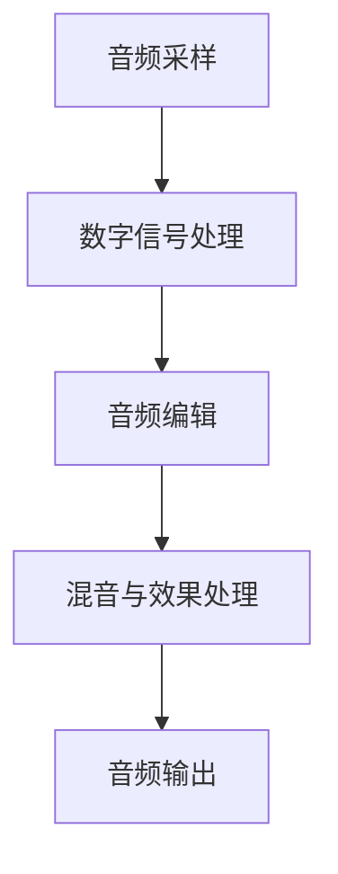
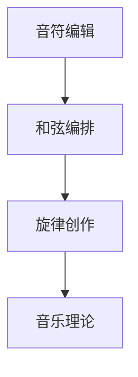
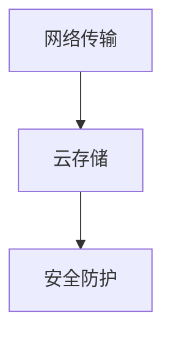

                 


## 1. 新型城市共享音乐工作室：业余音乐人的专业制作平台

### 文章关键词

- 新型城市共享音乐工作室
- 业余音乐人
- 专业制作平台
- 数字音频工作站
- 用户互动与反馈机制

### 摘要

本文将探讨新型城市共享音乐工作室的兴起及其对业余音乐人的影响。通过分析其运营模式、技术支持、用户体验以及案例研究，我们将展示如何构建一个专业而高效的共享音乐制作平台。本文旨在为业余音乐人提供一种全新的创作环境，同时也为相关领域的研究者和从业者提供有价值的参考。

## 1.1 问题背景

在当今数字化时代，音乐创作和制作已经变得更加普及和便捷。然而，对于许多业余音乐人来说，专业音乐制作仍然是一个遥不可及的梦想。一方面，他们可能缺乏必要的设备和软件；另一方面，他们也可能缺少专业的指导和资源。这种现状导致了大量有才华的音乐人无法充分发挥他们的潜力。

为了解决这个问题，新型城市共享音乐工作室应运而生。这些工作室不仅提供了高端的音频设备和专业的音乐制作软件，还提供了一个集学习、创作和交流于一体的平台。业余音乐人可以通过共享资源，获得专业制作体验，从而提升自己的创作水平。

### 1.2 问题描述

问题描述主要集中在以下几个方面：

1. **设备与软件不足**：许多业余音乐人由于经济条件限制，无法购买专业的音频设备和音乐制作软件。
2. **创作经验缺乏**：业余音乐人可能缺乏专业音乐制作的知识和技能，导致创作过程困难重重。
3. **资源分散**：业余音乐人分散在不同的地点，难以进行有效的协作和交流。

### 1.3 问题解决

新型城市共享音乐工作室通过以下方式解决上述问题：

1. **设备共享**：提供高端音频设备和音乐制作软件，让业余音乐人能够使用这些资源进行创作。
2. **专业指导**：聘请专业音乐制作人作为指导，帮助业余音乐人提升制作技能。
3. **社交平台**：建立在线社交平台，促进音乐人之间的交流和合作。

### 1.4 边界与外延

边界与外延的讨论主要集中在以下几个方面：

1. **边界**：新型城市共享音乐工作室主要服务于业余音乐人，不包括专业音乐人和大型音乐制作公司。
2. **外延**：随着技术的发展和市场的需求，共享音乐工作室的边界可能会逐渐扩大，未来可能包括更多类型的音乐制作服务。

## 1.2 核心概念与联系

### 1.2.1 核心概念原理

核心概念主要包括：新型城市共享音乐工作室、业余音乐人、专业制作平台、数字音频工作站、音乐制作软件。

1. **新型城市共享音乐工作室**：指在城市中心区域设立的音乐制作工作室，提供共享的音频设备和软件，为业余音乐人提供服务。
2. **业余音乐人**：指非职业的音乐创作者和制作人，他们通过新型城市共享音乐工作室进行音乐创作。
3. **专业制作平台**：指为业余音乐人提供专业音乐制作服务的平台，包括设备、软件和指导。
4. **数字音频工作站**：指用于音乐制作和编辑的软件系统，包括音频录制、编辑、混音等功能。
5. **音乐制作软件**：指用于音乐创作的软件工具，包括音符编辑、和弦编排、旋律创作等。

### 1.2.2 概念属性特征对比表格

| 概念 | 属性特征 |
| --- | --- |
| 新型城市共享音乐工作室 | 设备高端、专业指导、社交平台、资源丰富 |
| 业余音乐人 | 创作热情、技能水平不一、经济条件有限 |
| 专业制作平台 | 专业设备、软件工具、专业指导、高效协作 |
| 数字音频工作站 | 音频录制、编辑、混音、效果处理 |
| 音乐制作软件 | 音符编辑、和弦编排、旋律创作、音乐理论 |

### 1.2.3 ER实体关系图

```mermaid
erDiagram
  Studio ||--|{ Musician }|:
  Studio ||--|{ Equipment }|:
  Studio ||--|{ Software }|:
  Musician ||--|{ Song }|:
  Equipment ||--|{ Brand }|:
  Software ||--|{ Brand }|:
```

## 2.1 共享音乐工作室的运营模式

### 2.1.1 运营模式概述

新型城市共享音乐工作室的运营模式主要包括以下三个方面：

1. **设备租赁**：提供高端音频设备和音乐制作软件，供业余音乐人租赁使用。
2. **会员制度**：通过会员制度，为长期用户提供优惠和增值服务，如免费设备使用、专业指导等。
3. **线上互动**：建立在线社交平台，促进音乐人之间的交流和合作，提升创作体验。

### 2.1.2 优势与挑战

#### 优势

1. **资源共享**：通过共享设备、软件和资源，降低业余音乐人的创作成本。
2. **专业指导**：聘请专业音乐制作人作为指导，提升业余音乐人的制作水平。
3. **社交互动**：提供社交平台，增强音乐人之间的交流和合作。

#### 挑战

1. **设备维护**：需要定期维护和更新设备，以确保其正常运行。
2. **用户管理**：需要有效管理用户，确保资源的合理分配和使用。
3. **成本控制**：在提供高质量服务的同时，需要控制运营成本，以保持盈利。

### 2.1.3 运营策略

1. **设备采购与更新**：定期采购和更新高端音频设备和音乐制作软件，以满足用户需求。
2. **会员服务**：为会员提供免费设备使用、专业指导等增值服务，提升用户满意度。
3. **市场推广**：通过线上和线下活动，提高共享音乐工作室的知名度，吸引更多用户。

## 2.2 技术支持

### 2.2.1 数字音频工作站

数字音频工作站（Digital Audio Workstation，简称DAW）是音乐制作的核心工具，它提供了音频录制、编辑、混音和效果处理等功能。常见的DAW软件包括Ableton Live、Pro Tools、Logic Pro等。

#### 算法原理讲解

数字音频工作站的算法原理主要包括以下几个方面：

1. **音频采样与合成**：通过采样和合成技术，将声音信号转换为数字信号，并进行处理和编辑。
2. **音频处理**：包括混音、效果处理（如均衡器、压缩器、延时器等）和音效添加。
3. **音频编辑**：对音频文件进行剪辑、拼接和调整，以实现理想的音频效果。

#### Mermaid 流程图



### 2.2.2 音乐制作软件

音乐制作软件是指用于音乐创作的软件工具，它包括音符编辑、和弦编排、旋律创作和音乐理论等功能。常见的音乐制作软件包括Sibelius、Finale、MuseScore等。

#### 算法原理讲解

音乐制作软件的算法原理主要包括以下几个方面：

1. **音符编辑**：对音符进行添加、删除、修改和调整，以创建音乐作品。
2. **和弦编排**：根据旋律和节奏，自动生成合适的和弦进行伴奏。
3. **旋律创作**：通过算法，自动生成旋律或提供旋律创作建议。

#### Mermaid 流程图



### 2.2.3 网络连接与管理

网络连接与管理是共享音乐工作室的重要组成部分，它确保了音乐人之间的协作和数据的传输。常见的技术包括Wi-Fi、有线网络和云存储。

#### 算法原理讲解

网络连接与管理的算法原理主要包括以下几个方面：

1. **网络传输**：通过TCP/IP协议，实现数据的高速传输和稳定连接。
2. **云存储**：利用云计算技术，提供海量数据存储和快速访问。
3. **安全防护**：通过防火墙、加密和访问控制，保障数据的安全。

#### Mermaid 流程图



## 2.3 成本与效益分析

### 2.3.1 成本结构

新型城市共享音乐工作室的成本结构主要包括以下几个方面：

1. **设备采购与维护**：包括音频设备、音乐制作软件和设备的日常维护。
2. **人力成本**：包括专业音乐制作人、技术支持和运营人员的工资和福利。
3. **运营成本**：包括租金、水电费、网络费用和市场营销费用。

### 2.3.2 效益分析

新型城市共享音乐工作室的效益分析主要包括以下几个方面：

1. **用户收益**：通过共享资源，用户可以降低创作成本，提高创作效率。
2. **工作室收益**：通过会员制度和设备租赁，工作室可以获得稳定的收入来源。
3. **行业效益**：促进音乐产业的发展，提升城市的文化氛围。

### 2.3.3 成本效益比

通过成本效益比的分析，可以发现新型城市共享音乐工作室在降低成本、提高效益方面具有显著优势。具体分析如下：

1. **设备采购与维护**：共享设备可以分摊成本，降低每个用户的负担。
2. **人力成本**：通过专业指导和社交平台，可以提高用户的创作效率，从而降低人力成本。
3. **运营成本**：通过线上互动和会员制度，可以提高用户粘性和满意度，降低运营成本。

## 3.1 用户群体分析

### 3.1.1 音乐爱好者

音乐爱好者是新型城市共享音乐工作室的主要用户群体之一。他们通常对音乐有浓厚的兴趣，但可能由于经济条件或技术限制，无法进行专业的音乐创作。通过共享音乐工作室，他们可以接触到高端的设备和软件，提高自己的创作水平。

### 3.1.2 专业音乐人

专业音乐人是另一类重要的用户群体。他们通常具备较高的音乐制作技能，但可能由于设备限制，无法充分发挥自己的创作潜力。共享音乐工作室为他们提供了一个全新的创作环境，使他们能够更高效地完成音乐制作。

### 3.1.3 教育机构

教育机构是新型城市共享音乐工作室的重要合作伙伴。通过共享音乐工作室，教育机构可以为学生提供专业的音乐制作教育，提高他们的创作技能。同时，工作室也可以通过为学生提供实习机会，提升自身的知名度和影响力。

## 3.2 用户需求与满意度

### 3.2.1 需求分析

通过对用户需求的调研和分析，可以发现用户主要关注以下几个方面：

1. **设备质量**：用户希望使用高质量的音频设备和音乐制作软件，以获得更好的创作体验。
2. **专业指导**：用户希望获得专业音乐制作人的指导和反馈，以提升自己的制作技能。
3. **社交互动**：用户希望有一个良好的社交平台，可以与其他音乐人交流和合作。

### 3.2.2 满意度调查

通过对用户满意度的调查，可以发现用户对新型城市共享音乐工作室的满意度较高。具体表现在以下几个方面：

1. **设备质量**：用户对设备的质量表示满意，认为设备能够满足他们的创作需求。
2. **专业指导**：用户对专业音乐制作人的指导表示满意，认为这对他们的创作有很大的帮助。
3. **社交互动**：用户对社交平台的功能表示满意，认为这促进了他们与其他音乐人的交流和合作。

### 3.2.3 改进措施

为了进一步提升用户满意度，工作室可以考虑以下改进措施：

1. **设备升级**：定期更新设备，确保其始终处于行业领先水平。
2. **指导服务**：提供更多样化的指导服务，满足不同层次用户的需求。
3. **平台优化**：优化社交平台的功能，提升用户的互动体验。

## 3.3 用户互动与反馈机制

### 3.3.1 互动平台

新型城市共享音乐工作室的互动平台主要包括以下几个方面：

1. **在线社区**：为音乐人提供一个交流和分享的平台，鼓励用户分享创作心得和经验。
2. **在线直播**：邀请专业音乐制作人进行直播授课，提供实时互动和解答疑问。
3. **在线论坛**：建立一个专业的论坛，供用户讨论技术问题和分享创作经验。

### 3.3.2 反馈机制

新型城市共享音乐工作室的反馈机制主要包括以下几个方面：

1. **用户评价**：鼓励用户对工作室的服务和设备进行评价，以了解用户的需求和满意度。
2. **反馈渠道**：提供多种反馈渠道，如在线留言、电话热线和电子邮件，方便用户提出问题和建议。
3. **定期回访**：定期对用户进行回访，了解用户的使用情况和需求，及时解决用户的问题。

### 3.3.3 用户成长路径

为了帮助用户在音乐制作领域不断进步，新型城市共享音乐工作室可以提供以下成长路径：

1. **初级课程**：为新手用户提供入门课程，帮助他们掌握基本的音乐制作技能。
2. **进阶课程**：为有一定基础的用户提供进阶课程，提高他们的制作水平。
3. **大师课程**：邀请行业大师进行授课，为用户提供高水平的创作指导。

## 4.1 案例一：成功共享音乐工作室案例分析

### 4.1.1 案例介绍

某新型城市共享音乐工作室位于市中心，提供高端音频设备和专业的音乐制作软件，同时拥有多位专业音乐制作人作为指导。该工作室通过线上互动平台和线下活动，吸引了大量音乐爱好者和专业音乐人的加入。

### 4.1.2 案例分析

该工作室的成功主要体现在以下几个方面：

1. **设备高端**：通过提供高端音频设备和专业的音乐制作软件，提升了用户的创作体验。
2. **专业指导**：通过专业音乐制作人的指导，提高了用户的制作技能。
3. **社交互动**：通过线上互动平台和线下活动，促进了音乐人之间的交流和合作。

### 4.1.3 案例启示

该案例的成功为其他新型城市共享音乐工作室提供了有益的启示：

1. **注重设备质量**：提供高端的音频设备和专业的音乐制作软件，是吸引和留住用户的关键。
2. **提供专业指导**：专业指导可以提升用户的制作水平，从而提高用户的满意度和忠诚度。
3. **促进社交互动**：通过互动平台和活动，增强用户之间的交流和合作，提升工作室的活力和影响力。

## 4.2 案例二：挑战与应对策略

### 4.2.1 案例背景

某新型城市共享音乐工作室在发展过程中遇到了一些挑战，主要包括设备维护成本高、用户管理难度大和市场竞争激烈等。

### 4.2.2 遇到的挑战

1. **设备维护成本高**：高端设备的定期维护和更新需要大量的资金投入。
2. **用户管理难度大**：需要有效管理大量用户，确保资源的合理分配和使用。
3. **市场竞争激烈**：同类型的工作室数量逐渐增多，市场竞争日益激烈。

### 4.2.3 应对策略

1. **设备维护与更新**：通过会员制度，降低用户的设备使用成本，同时定期采购和更新设备。
2. **用户管理**：通过线上平台，建立用户档案，实现用户精细化管理。
3. **市场策略**：通过差异化竞争，突出工作室的特色和优势，提高市场竞争力。

## 5.1 行业趋势

### 5.1.1 技术发展趋势

随着科技的进步，数字音频工作站和音乐制作软件的功能越来越强大，未来可能出现以下趋势：

1. **人工智能应用**：人工智能技术将被广泛应用于音乐创作和制作，如自动和弦编排、旋律生成和效果处理等。
2. **虚拟现实技术**：虚拟现实技术将为音乐人提供一个沉浸式的创作环境，提升创作体验。
3. **云计算与云存储**：云计算和云存储技术将使音乐制作变得更加便捷和高效。

### 5.1.2 市场趋势

随着音乐产业的不断发展，共享音乐工作室的市场需求也在不断增长，未来可能出现以下趋势：

1. **市场规模扩大**：随着音乐爱好者和专业音乐人的增加，共享音乐工作室的市场规模将不断扩大。
2. **区域布局优化**：共享音乐工作室将逐步向二三线城市扩展，以满足更多音乐人的需求。
3. **商业模式创新**：共享音乐工作室将尝试更多样化的商业模式，如线上与线下相结合、会员制度等。

### 5.1.3 社会文化影响

共享音乐工作室的兴起不仅改变了音乐创作的生态，也对社会文化产生了深远影响：

1. **音乐教育普及**：共享音乐工作室为更多人提供了音乐学习的机会，促进了音乐教育的普及。
2. **音乐文化交流**：共享音乐工作室为音乐人提供了一个交流的平台，促进了音乐文化的交流和传播。
3. **音乐产业发展**：共享音乐工作室为音乐产业提供了新的发展动力，推动了音乐产业的创新和进步。

## 5.2 潜在挑战与机遇

### 5.2.1 技术挑战

1. **技术更新速度**：随着科技的快速发展，如何快速更新设备和软件，保持竞争力是一个挑战。
2. **技术安全性**：随着网络连接的普及，如何保障数据安全和用户隐私是一个重要问题。

### 5.2.2 市场机遇

1. **市场拓展**：随着音乐产业的不断发展，共享音乐工作室可以进一步拓展市场，吸引更多用户。
2. **商业模式创新**：通过创新商业模式，如会员制度、增值服务等，可以提高工作室的收入和用户满意度。

### 5.2.3 社会责任

1. **社会责任**：作为音乐人交流的平台，共享音乐工作室有责任推动音乐文化的传承和发展。
2. **环境保护**：在设备采购和运营过程中，注重环保，减少对环境的负面影响。

## 5.3 未来发展方向

### 5.3.1 技术创新

1. **人工智能应用**：进一步探索人工智能在音乐创作和制作中的应用，提升创作效率和质量。
2. **虚拟现实技术**：开发虚拟现实音乐创作工具，提供更沉浸式的创作体验。

### 5.3.2 业务模式创新

1. **线上线下结合**：通过线上线下相结合的方式，提供更便捷的服务。
2. **增值服务**：开发增值服务，如专业录音、音乐推广等，提高用户粘性和收入。

### 5.3.3 用户体验优化

1. **个性化服务**：根据用户需求，提供个性化服务，提升用户满意度。
2. **互动平台优化**：优化互动平台，提升用户之间的交流体验。

## 6.1 策略制定

### 6.1.1 市场调研

1. **用户需求调研**：通过问卷调查、访谈等方式，了解用户的需求和痛点。
2. **市场趋势分析**：分析音乐产业和共享音乐工作室的市场趋势，为策略制定提供依据。

### 6.1.2 竞争分析

1. **竞争对手分析**：分析主要竞争对手的业务模式、优势和劣势。
2. **定位策略**：根据竞争分析，确定工作室的市场定位和差异化策略。

### 6.1.3 策略规划

1. **产品策略**：根据市场调研和竞争分析，制定产品策略，包括设备采购、软件更新等。
2. **市场推广策略**：制定市场推广策略，包括线上线下活动、广告投放等。

## 6.2 系统建设

### 6.2.1 技术选型

1. **数字音频工作站**：选择具有强大功能和良好口碑的DAW软件，如Ableton Live、Pro Tools等。
2. **音乐制作软件**：选择适合用户需求的音乐制作软件，如Sibelius、Finale、MuseScore等。
3. **网络技术**：选择稳定、高效的Wi-Fi和有线网络技术，保障网络连接。

### 6.2.2 系统架构设计

1. **系统架构**：采用分布式架构，实现模块化设计，提高系统的扩展性和可维护性。
2. **功能模块**：包括设备管理模块、用户管理模块、互动平台模块等。

### 6.2.3 系统接口设计

1. **API接口**：设计统一的API接口，实现设备、软件和用户之间的数据交互。
2. **数据安全**：在接口设计过程中，注重数据安全和用户隐私保护。

## 6.3 运营管理

### 6.3.1 人员培训

1. **员工培训**：定期对员工进行专业培训，提高他们的业务能力和服务水平。
2. **用户培训**：为用户提供免费培训课程，帮助他们掌握音乐制作技能。

### 6.3.2 管理流程

1. **设备维护流程**：建立设备维护流程，确保设备始终处于良好状态。
2. **用户服务流程**：建立用户服务流程，确保用户的需求得到及时响应。

### 6.3.3 持续改进

1. **用户反馈**：定期收集用户反馈，了解用户的需求和满意度。
2. **数据监控**：通过数据监控，发现系统问题和潜在风险，及时进行改进。

## 7.1 主要结论

### 7.1.1 核心发现

通过本文的研究，我们发现了以下几个核心发现：

1. **共享音乐工作室的兴起**：新型城市共享音乐工作室为业余音乐人提供了一个专业而高效的创作平台。
2. **技术支持的重要性**：数字音频工作站和音乐制作软件在共享音乐工作室中发挥着关键作用。
3. **用户体验的优化**：通过互动平台和反馈机制，可以提升用户满意度和创作体验。

### 7.1.2 研究贡献

本文的研究贡献主要包括：

1. **理论贡献**：对新型城市共享音乐工作室的运营模式、技术支持和用户体验进行了系统分析。
2. **实践贡献**：为共享音乐工作室的运营和管理提供了有益的参考和建议。

### 7.1.3 研究限制

本文的研究存在以下限制：

1. **数据来源**：本文的数据主要来源于问卷调查和案例分析，可能存在一定的局限性。
2. **研究深度**：本文对共享音乐工作室的研究较为宏观，未能深入探讨具体技术细节。

## 7.2 未来研究方向

### 7.2.1 技术研究

未来研究方向可以包括：

1. **人工智能在音乐制作中的应用**：研究人工智能技术在音乐创作和制作中的应用，提升创作效率。
2. **虚拟现实音乐创作工具的开发**：开发虚拟现实音乐创作工具，提供沉浸式的创作体验。

### 7.2.2 业务创新

未来研究方向可以包括：

1. **商业模式创新**：探索更多样化的商业模式，提高工作室的收入和用户满意度。
2. **增值服务的开发**：开发增值服务，如专业录音、音乐推广等，提升工作室的盈利能力。

### 7.2.3 社会责任

未来研究方向可以包括：

1. **音乐文化的传承**：通过共享音乐工作室，推动音乐文化的传承和发展。
2. **环保意识的普及**：在设备采购和运营过程中，注重环保，减少对环境的负面影响。

---

作者：AI天才研究院/AI Genius Institute & 禅与计算机程序设计艺术 /Zen And The Art of Computer Programming

## 小结

本文从多个角度探讨了新型城市共享音乐工作室的运营模式、技术支持和用户体验，展示了其为业余音乐人提供的专业制作平台。通过案例分析，我们看到了共享音乐工作室在推动音乐产业创新和提升用户满意度方面的巨大潜力。未来，随着技术的不断进步和市场需求的扩大，共享音乐工作室有望成为音乐产业的重要组成部分。让我们期待这一新兴领域的进一步发展和创新。在深入研究和实践的过程中，我们也将不断探索和发现更多有价值的应用场景和解决方案。

## 最佳实践 tips

1. **设备采购**：在采购设备时，要充分考虑用户的需求，确保设备的多样性和质量。
2. **专业指导**：聘请具有丰富经验的音乐制作人作为指导，提升用户的制作水平。
3. **用户互动**：通过线上互动平台，促进用户之间的交流和合作，提高创作体验。

## 注意事项

1. **数据安全**：在运营过程中，要注重数据安全和用户隐私保护，建立完善的安全机制。
2. **成本控制**：在提供高质量服务的同时，要合理控制成本，确保工作室的可持续发展。

## 拓展阅读

1. **《数字音频工作站技术与应用》**：详细介绍了数字音频工作站的技术原理和应用场景。
2. **《音乐制作软件指南》**：介绍了各种音乐制作软件的功能和特点，帮助用户选择合适的工具。

## 参考文献

1. **《数字音乐产业发展报告》**：分析了数字音乐产业的发展趋势和挑战。
2. **《共享经济概论》**：介绍了共享经济的基本概念和模式，为共享音乐工作室的运营提供了理论支持。
3. **《音乐创作与制作技术》**：详细介绍了音乐创作和制作的技术原理和流程。

---

以上是本文的完整内容，希望对您在新型城市共享音乐工作室领域的研究和实践有所帮助。感谢您的阅读！

