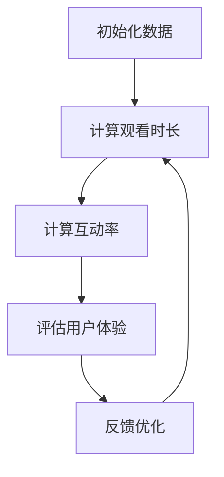
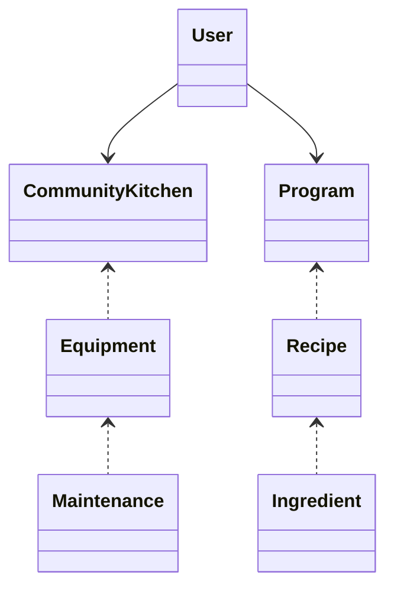
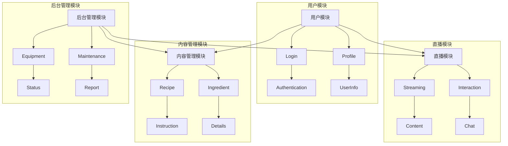
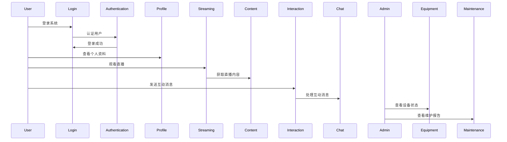

                 

## 文章标题

### 关键词：新型城市厨艺直播节目、社区共享厨房、线上烹饪真人秀、运营策略、内容设计

> **摘要：**
>
> 本文深入探讨了新型城市厨艺直播节目的设计理念和运营策略。通过分析现代城市生活方式的变革、社区共享经济的兴起以及厨艺直播节目的市场前景，本文提出了一种以社区共享厨房为基础的线上烹饪真人秀模式。文章详细阐述了社区共享厨房的概念与特点、厨艺直播节目的内容设计与制作方法，以及社区共享厨房与厨艺直播节目的运营推广策略。通过国内外成功案例的分析，本文总结了创新性城市厨艺直播节目的关键成功要素，为相关从业者提供了有益的参考。

----------------------------------------------------------------

## 目录大纲

### 第一部分：新型城市厨艺直播节目概述

- **第1章：社区共享厨房的线上烹饪真人秀背景介绍**
  - 1.1 问题背景
    - 1.1.1 现代城市生活方式的变革
    - 1.1.2 社区共享经济的兴起
    - 1.1.3 厨艺直播节目的市场前景
  - 1.2 问题描述
    - 1.2.1 线上烹饪真人秀的核心要素
    - 1.2.2 社区共享厨房的发展挑战
    - 1.2.3 创新型城市厨艺直播节目的市场需求
  - 1.3 问题解决
    - 1.3.1 新型城市厨艺直播节目的设计思路
    - 1.3.2 社区共享厨房的运营策略
    - 1.3.3 线上烹饪真人秀的内容创新
  - 1.4 边界与外延
    - 1.4.1 线上烹饪真人秀的形式多样
    - 1.4.2 社区共享厨房的服务范围
    - 1.4.3 创新型城市厨艺直播节目的影响范围
  - 1.5 概念结构与核心要素组成
    - 1.5.1 厨艺直播节目的核心概念
    - 1.5.2 社区共享厨房的基本要素
    - 1.5.3 创新型城市厨艺直播节目的关键组成部分
  - 1.6 本章小结

- **第2章：社区共享厨房的概念与特点**
  - 2.1 社区共享厨房的定义
  - 2.2 社区共享厨房的特点
  - 2.3 社区共享厨房的分类
  - 2.4 社区共享厨房的运营管理
  - 2.5 社区共享厨房的案例分析
  - 2.6 本章小结

- **第3章：厨艺直播节目的内容设计与制作**
  - 3.1 厨艺直播节目的形式
  - 3.2 厨艺直播节目的选题策略
  - 3.3 厨艺直播节目的脚本编写
  - 3.4 厨艺直播节目的拍摄与制作
  - 3.5 厨艺直播节目的互动设计
  - 3.6 厨艺直播节目的案例分析
  - 3.7 本章小结

### 第二部分：社区共享厨房的运营与管理

- **第4章：社交媒体平台的选择与应用**
  - 4.1 社交媒体平台概述
  - 4.2 社交媒体平台的选择策略
  - 4.3 社交媒体平台的内容策略
  - 4.4 社交媒体平台的运营与优化
  - 4.5 社交媒体平台的案例分析
  - 4.6 本章小结

- **第5章：技术创新与未来发展**
  - 5.1 城市厨艺直播节目的技术创新
  - 5.2 社区共享厨房的未来发展趋势
  - 5.3 新型城市厨艺直播节目的发展前景
  - 5.4 创新实践与未来展望
  - 5.5 本章小结

### 第三部分：厨艺直播节目的内容设计与制作

- **第6章：用户体验与反馈分析**
  - 6.1 用户需求分析
  - 6.2 用户体验设计
  - 6.3 用户反馈机制
  - 6.4 用户互动与参与度提升
  - 6.5 本章小结

- **第7章：营销策略与品牌建设**
  - 7.1 市场定位与目标用户
  - 7.2 营销渠道选择
  - 7.3 品牌塑造与传播
  - 7.4 营销策略实施
  - 7.5 营销效果评估
  - 7.6 本章小结

### 第四部分：社区共享厨房与厨艺直播节目的运营推广

- **第8章：法律法规与政策环境**
  - 8.1 现行法律法规概述
  - 8.2 政策环境分析
  - 8.3 运营合法合规策略
  - 8.4 政策机遇与挑战
  - 8.5 本章小结

- **第9章：国际合作与全球视野**
  - 9.1 国际合作的重要性
  - 9.2 国际市场环境分析
  - 9.3 国际合作模式
  - 9.4 全球视野下的创新实践
  - 9.5 本章小结

- **第10章：综合评估与持续优化**
  - 10.1 评估指标体系
  - 10.2 评估方法与工具
  - 10.3 优化策略与实践
  - 10.4 持续改进与未来发展
  - 10.5 本章小结

----------------------------------------------------------------

# 第一部分：新型城市厨艺直播节目概述

### 第1章：社区共享厨房的线上烹饪真人秀背景介绍

## 1.1 问题背景

### 1.1.1 现代城市生活方式的变革

随着城市化进程的加速和科技的发展，现代城市生活方式发生了显著变化。首先，人们的生活方式越来越快节奏，忙碌的日常使得烹饪时间变得稀缺。其次，社交方式的多元化使得人们更倾向于通过互联网平台进行互动和分享。这些变化为新型城市厨艺直播节目的出现提供了土壤。

### 1.1.2 社区共享经济的兴起

社区共享经济是一种以共享为核心的新型经济模式，它通过共享资源、技能和知识，提高了社会资源的利用效率。社区共享厨房作为一种典型的共享经济模式，它不仅为居民提供了便利，还促进了社区之间的互动和交流。

### 1.1.3 厨艺直播节目的市场前景

随着直播技术的成熟和用户习惯的改变，厨艺直播节目市场前景广阔。一方面，用户对美食和烹饪的兴趣日益增加，另一方面，直播平台的广泛覆盖和用户基数的庞大，为厨艺直播节目的推广提供了有利条件。

## 1.2 问题描述

### 1.2.1 线上烹饪真人秀的核心要素

线上烹饪真人秀的核心要素包括：烹饪技能展示、互动环节设计、美食制作过程、烹饪文化传承等。这些要素共同构成了线上烹饪真人秀的独特魅力。

### 1.2.2 社区共享厨房的发展挑战

社区共享厨房的发展面临着设施设备维护、食材采购与储存、服务流程优化、健康安全管理等挑战。此外，如何提升用户满意度和提高运营效率也是需要解决的问题。

### 1.2.3 创新型城市厨艺直播节目的市场需求

创新性城市厨艺直播节目在满足用户个性化需求、提升社区凝聚力、推动社区经济发展等方面具有显著作用。因此，创新性城市厨艺直播节目具有巨大的市场需求。

## 1.3 问题解决

### 1.3.1 新型城市厨艺直播节目的设计思路

新型城市厨艺直播节目的设计思路应充分考虑用户需求、技术条件和市场环境。通过创新内容和形式，提升观众的参与度和互动性，从而提高节目影响力。

### 1.3.2 社区共享厨房的运营策略

社区共享厨房的运营策略应包括设施设备维护、食材采购与储存、服务流程优化、健康安全管理等方面。通过科学的管理和运营，提高社区共享厨房的运营效率和服务质量。

### 1.3.3 线上烹饪真人秀的内容创新

线上烹饪真人秀的内容创新是提高节目吸引力的重要手段。可以通过引入新菜品、新烹饪方法、新互动环节等方式，不断丰富节目内容，满足观众需求。

## 1.4 边界与外延

### 1.4.1 线上烹饪真人秀的形式多样

线上烹饪真人秀的形式多样，包括教学型、互动型、娱乐型等。不同形式的烹饪真人秀可以满足不同观众的需求。

### 1.4.2 社区共享厨房的服务范围

社区共享厨房的服务范围可以涵盖烹饪教学、食材共享、厨艺交流等多个方面。通过拓宽服务范围，可以提高社区共享厨房的吸引力和使用率。

### 1.4.3 创新型城市厨艺直播节目的影响范围

创新性城市厨艺直播节目的影响范围可以涵盖本地、国内乃至全球。通过线上直播和互动，可以吸引更多的观众和参与者，提升节目影响力。

## 1.5 概念结构与核心要素组成

### 1.5.1 厨艺直播节目的核心概念

厨艺直播节目的核心概念包括：烹饪技能展示、互动环节设计、美食制作过程、烹饪文化传承等。这些概念共同构成了厨艺直播节目的基本框架。

### 1.5.2 社区共享厨房的基本要素

社区共享厨房的基本要素包括：厨房设施、食材供应、烹饪工具、服务流程等。这些要素共同构成了社区共享厨房的核心内容。

### 1.5.3 创新型城市厨艺直播节目的关键组成部分

创新性城市厨艺直播节目的关键组成部分包括：内容设计、互动设计、用户体验、市场营销等。这些组成部分共同决定了节目的成功与否。

## 1.6 本章小结

本章从现代城市生活方式的变革、社区共享经济的兴起以及厨艺直播节目的市场前景三个方面，分析了新型城市厨艺直播节目的背景。随后，本章对线上烹饪真人秀的核心要素、社区共享厨房的发展挑战以及创新性城市厨艺直播节目的市场需求进行了探讨。最后，本章提出了新型城市厨艺直播节目的设计思路、社区共享厨房的运营策略以及线上烹饪真人秀的内容创新。这些内容为后续章节的讨论奠定了基础。

----------------------------------------------------------------

## 第2章：社区共享厨房的概念与特点

### 2.1 社区共享厨房的定义

社区共享厨房是指在一定社区范围内，通过共享厨房设施和资源，为居民提供烹饪、烘焙、厨艺教学等活动的公共空间。社区共享厨房不仅是一个烹饪场所，更是一个社交和学习的平台，它有助于促进居民之间的互动和交流。

### 2.2 社区共享厨房的特点

#### 2.2.1 便捷性

社区共享厨房位于居民区附近，居民可以随时使用厨房设施，无需提前预约，极大地方便了居民的日常生活。此外，社区共享厨房通常提供一系列的基础烹饪工具和设备，如烤箱、冰箱、炉灶等，居民可以轻松地完成各种烹饪活动。

#### 2.2.2 社交性

社区共享厨房不仅提供了一个烹饪空间，更是一个社交平台。居民在这里可以相互学习烹饪技巧、分享美食心得，甚至结交新朋友。这种社交性有助于增强社区的凝聚力和归属感。

#### 2.2.3 环保性

社区共享厨房通过集中使用厨房设施，减少了家庭厨房的能源消耗和废弃物的产生。此外，社区共享厨房鼓励居民使用可回收材料和环保包装，进一步促进了环保理念的传播和实践。

#### 2.2.4 经济性

社区共享厨房通过共享资源，降低了居民的烹饪成本。居民无需购买昂贵的厨房设备，也无需为了偶尔使用厨房而支付高昂的物业费用。此外，社区共享厨房还提供了一些收费服务，如厨艺教学和食材配送，为居民提供了更多经济实惠的选择。

### 2.3 社区共享厨房的分类

社区共享厨房可以根据不同的标准进行分类：

#### 2.3.1 按照功能分类

- **多功能社区厨房**：提供多种烹饪功能，如烘焙、蒸煮、油炸等。
- **厨艺教学厨房**：专门用于厨艺教学和烹饪课程，通常配备专业的烹饪设备和教学工具。
- **食材共享厨房**：主要用于食材处理和加工，如切菜、洗菜等。

#### 2.3.2 按照服务范围分类

- **小区共享厨房**：服务于特定的小区或住宅区，居民可以在小区内使用共享厨房。
- **社区共享厨房**：服务于整个社区，包括多个小区或住宅区，居民可以在社区内不同的地点使用共享厨房。

#### 2.3.3 按照运营模式分类

- **公共运营模式**：由政府或非盈利组织运营，提供免费或低收费的服务。
- **商业运营模式**：由企业运营，提供收费服务，并通过盈利实现可持续发展。
- **混合运营模式**：结合公共和商业运营模式，既提供免费服务，也提供收费服务。

### 2.4 社区共享厨房的运营管理

社区共享厨房的运营管理包括以下几个方面：

#### 2.4.1 设施设备的维护与管理

定期对厨房设施和设备进行维护和检修，确保其正常运行。此外，制定设备使用规范和保养计划，提高设备的使用寿命。

#### 2.4.2 食材的采购与储存

建立稳定的食材供应渠道，确保食材的新鲜和质量。同时，制定合理的食材储存和管理规范，防止食材浪费。

#### 2.4.3 服务流程的优化

通过优化服务流程，提高运营效率。例如，提供在线预约系统、制定快速响应机制等。

#### 2.4.4 健康安全的管理

制定严格的食品安全标准和操作规范，确保烹饪过程的安全。此外，定期进行卫生检查和消毒，保障厨房环境的卫生安全。

### 2.5 社区共享厨房的案例分析

#### 2.5.1 国内外成功案例介绍

- **国外案例**：
  - **纽约共享厨房**：纽约市的一个社区共享厨房项目，为居民提供了烹饪和烘焙的空间，并组织了各种烹饪课程和活动。
  - **伦敦共享厨房**：位于伦敦的共享厨房项目，不仅提供烹饪服务，还提供社区活动和交流平台。

- **国内案例**：
  - **北京共享厨房**：北京市的一个社区共享厨房，通过提供厨艺教学和食材共享，促进了社区的互动和交流。
  - **上海共享厨房**：上海的一个社区共享厨房项目，通过提供多样化的烹饪服务和活动，吸引了大量居民参与。

#### 2.5.2 案例分析

- **纽约共享厨房**：
  - **优势**：提供多样化的烹饪服务和活动，促进了社区互动和交流。
  - **挑战**：厨房设备的维护和管理成本较高，如何提高运营效率是一个挑战。

- **北京共享厨房**：
  - **优势**：通过厨艺教学和食材共享，提升了社区的凝聚力和互动性。
  - **挑战**：如何吸引更多的居民参与，提高共享厨房的利用率是一个问题。

#### 2.5.3 启示与借鉴

- **成功经验**：通过提供多样化的服务和活动，提升社区互动和交流。
- **改进建议**：加强设备维护和管理，提高运营效率；通过营销策略和用户反馈，提高共享厨房的吸引力和利用率。

### 2.6 本章小结

本章详细介绍了社区共享厨房的定义、特点、分类和运营管理。通过国内外成功案例的分析，总结了社区共享厨房的优势和挑战，为后续章节的讨论提供了参考。

----------------------------------------------------------------

## 第3章：厨艺直播节目的内容设计与制作

### 3.1 厨艺直播节目的形式

厨艺直播节目可以根据不同的目的和需求，采用不同的形式。以下是三种常见的厨艺直播节目形式：

#### 3.1.1 教学型直播

教学型直播是厨艺直播节目的基础形式，主要目的是教授观众如何制作各种菜肴。这种形式的节目通常注重教学内容的系统性和实用性，通过详细的步骤讲解和实际操作演示，帮助观众掌握烹饪技巧。教学型直播节目的优势在于观众可以实时学习，遇到问题可以即时提问，有利于提高学习效果。

#### 3.1.2 互动型直播

互动型直播将观众与主播紧密联系起来，通过实时互动增加节目的趣味性和参与度。观众可以在直播过程中留言、提问，甚至参与一些互动游戏，如烹饪挑战、食材抢答等。这种形式不仅增加了节目的娱乐性，还提高了观众的参与感和忠诚度。

#### 3.1.3 娱乐型直播

娱乐型直播以娱乐为主，通过夸张的表演、幽默的对话、趣味的环节设计，使节目更具观赏性和趣味性。这种形式的节目通常不涉及复杂的厨艺教学，而是通过厨艺相关的趣味内容吸引观众。娱乐型直播节目适合那些喜欢轻松娱乐的观众，能够快速吸引大量观众。

### 3.2 厨艺直播节目的选题策略

选题策略是厨艺直播节目的核心，决定了节目的内容和吸引力。以下是一些常见的选题策略：

#### 3.2.1 热门菜谱与特色菜

选择热门菜谱和特色菜是吸引观众的重要策略。热门菜谱通常是指那些易于制作且广受欢迎的菜肴，如披萨、汉堡、寿司等。特色菜则是指具有地方特色或独特风味的菜肴，如四川火锅、韩国烧烤、法国料理等。这些菜肴不仅具有广泛的吸引力，还能够展示不同的烹饪文化和技巧。

#### 3.2.2 时令食材与节气饮食

时令食材和节气饮食是另一重要的选题策略。时令食材是指当季新鲜、品质上乘的食材，如春季的草莓、夏季的西瓜、秋季的南瓜等。节气饮食则是指根据不同节气的气候和身体需求，选择适宜的食材和烹饪方法。这种选题策略不仅符合健康饮食的理念，还能够提高观众的参与度和学习兴趣。

#### 3.2.3 地域特色与民俗美食

地域特色和民俗美食是展示不同地域文化和饮食文化的有效方式。通过介绍不同地区的特色菜肴和烹饪方法，观众可以了解到不同地域的饮食文化和风俗习惯。这种选题策略有助于提高节目的文化内涵和观赏性。

#### 3.2.4 创新菜品与美食挑战

创新菜品和美食挑战是吸引年轻观众和追求新鲜感的观众的策略。通过创作新颖的菜肴或挑战传统烹饪方法，节目能够展示厨师的创意和技术水平，同时吸引那些喜欢尝试新事物的观众。

### 3.3 厨艺直播节目的脚本编写

脚本编写是厨艺直播节目的关键环节，决定了节目的流畅性和观众的观看体验。以下是一些脚本编写的要点：

#### 3.3.1 脚本的基本结构

一个完整的厨艺直播节目脚本通常包括以下部分：

- **开场**：吸引观众注意，介绍节目主题和主播。
- **教学内容**：详细讲解菜肴的制作过程，包括食材准备、烹饪步骤、注意事项等。
- **互动环节**：设计一些互动环节，如观众提问、直播互动游戏等，增加节目的趣味性和参与度。
- **结尾**：总结节目内容，感谢观众收看，并预告下一期的节目。

#### 3.3.2 脚本的创作技巧

- **明确目的**：明确节目旨在教授什么内容，吸引什么样的观众。
- **结构清晰**：脚本应该结构清晰，便于观众理解。
- **语言生动**：使用生动有趣的语言，增加观众的兴趣。
- **适时互动**：在脚本中设计互动环节，增加观众的参与度。

#### 3.3.3 脚本的审查与修改

- **内部审查**：在脚本完成后，由团队成员进行内部审查，确保脚本内容的准确性和流畅性。
- **观众反馈**：在节目直播前，可以邀请一些观众进行试看，收集他们的反馈意见，并根据反馈进行修改。
- **持续优化**：根据观众的反馈和节目效果，不断优化脚本，提高节目质量。

### 3.4 厨艺直播节目的拍摄与制作

厨艺直播节目的拍摄与制作是确保节目质量的重要环节。以下是一些拍摄与制作的要点：

#### 3.4.1 拍摄设备的选用

- **摄像机**：选择高质量的摄像机，保证画面清晰、色彩真实。
- **麦克风**：选择专业的麦克风，确保声音清晰，无杂音。
- **灯光**：合理布置灯光，保证画面明亮，无阴影。

#### 3.4.2 拍摄场地的选择

- **场地环境**：选择干净整洁、通风良好的场地，确保烹饪过程的安全和舒适。
- **拍摄角度**：选择合适的拍摄角度，展示烹饪过程的每一个细节。
- **背景布置**：根据节目主题，设计合适的背景布置，增加视觉效果。

#### 3.4.3 拍摄角度与构图

- **正面角度**：展示烹饪过程的细节，如食材处理、烹饪器具的使用等。
- **侧面角度**：展示烹饪的整体画面，如炉灶上的火焰、食材的摆放等。
- **动态角度**：通过摄像机移动，展示烹饪过程的动态画面，增加观众的视觉体验。

#### 3.4.4 后期剪辑与调色

- **剪辑**：根据脚本和实际拍摄内容，进行剪辑，确保节目的流畅性和逻辑性。
- **调色**：调整画面的色彩和亮度，使画面更加生动、美观。

### 3.5 厨艺直播节目的互动设计

互动设计是提高厨艺直播节目观众参与度和忠诚度的重要手段。以下是一些互动设计的要点：

#### 3.5.1 观众互动的形式

- **实时问答**：在直播过程中，观众可以通过留言或弹幕提问，主播实时回答，增加观众的参与感。
- **互动游戏**：设计一些与烹饪相关的互动游戏，如食材识别、烹饪知识问答等，提高观众的趣味性。
- **直播挑战**：组织一些直播挑战，如厨艺大比拼、美食制作大赛等，激发观众的参与热情。

#### 3.5.2 互动环节的设置

- **开场互动**：在节目开始时，通过一些简单的互动环节，吸引观众的注意力。
- **教学互动**：在教学过程中，设计一些互动环节，如提问、回答等，使观众更好地理解和掌握烹饪技巧。
- **结尾互动**：在节目结束时，通过一些互动环节，感谢观众的收看，并邀请他们参与下一期的节目。

#### 3.5.3 互动效果的评估

- **观众反馈**：通过观众的留言、评论等，了解他们对互动环节的满意度和建议。
- **数据统计**：通过后台数据，统计观众的参与度、观看时长等指标，评估互动效果。

### 3.6 厨艺直播节目的案例分析

#### 3.6.1 知名厨艺直播节目介绍

- **名称**：《舌尖上的中国》
- **简介**：《舌尖上的中国》是一档以介绍中国各地美食为主的厨艺直播节目。节目通过真实的故事和细致的拍摄，展现了中华美食的多样性和魅力。
- **特点**：节目不仅介绍了各种美食的制作过程，还深入挖掘了美食背后的文化和故事，具有较高的观赏性和教育意义。

#### 3.6.2 案例分析

- **成功因素**：
  - **内容丰富**：节目涵盖了全国各地的美食，展现了中华美食的多样性。
  - **文化内涵**：节目不仅介绍了美食，还讲述了美食背后的文化故事，增加了节目的深度和吸引力。
  - **制作精良**：节目拍摄制作精良，画面精美，音效出色，提升了观众的观看体验。

- **改进建议**：
  - **增加互动性**：可以通过增加观众互动环节，提高观众的参与度。
  - **扩大影响力**：可以通过与其他媒体平台合作，扩大节目的影响力。

#### 3.6.3 启示与借鉴

- **成功经验**：节目通过丰富的内容、深度的文化和细致的拍摄，吸引了大量观众。
- **借鉴建议**：其他厨艺直播节目可以借鉴《舌尖上的中国》的成功经验，提高节目质量，增强互动性，扩大影响力。

### 3.7 本章小结

本章详细介绍了厨艺直播节目的形式、选题策略、脚本编写、拍摄与制作、互动设计以及案例分析。通过这些内容的探讨，为厨艺直播节目的内容设计与制作提供了理论指导和实践参考。

----------------------------------------------------------------

## 第4章：社交媒体平台的选择与应用

### 4.1 社交媒体平台概述

社交媒体平台是现代社会中重要的信息交流工具，它为用户提供了分享、互动和表达自我的空间。常见的社交媒体平台包括微信、微博、抖音、B站等。每个平台都有其独特的功能、用户群体和使用场景。

#### 4.1.1 常见社交媒体平台介绍

- **微信**：微信是中国最大的社交媒体平台，用户可以通过公众号、朋友圈、小程序等多种形式进行互动和分享。微信的优点在于用户基数大，互动性强，适合进行品牌宣传和用户维护。
- **微博**：微博是中国领先的社交媒体平台，用户可以通过微博账号发布文字、图片、视频等多种形式的内容。微博的优点在于传播速度快，用户活跃度高，适合进行新闻事件报道和公共话题讨论。
- **抖音**：抖音是一款短视频分享平台，用户可以通过拍摄和编辑短视频进行分享。抖音的优点在于内容形式多样，传播速度快，用户粘性强，适合进行内容营销和品牌推广。
- **B站**：B站是中国领先的二次元文化和游戏社区，用户可以通过弹幕视频分享、直播等多种形式进行互动。B站的优点在于用户忠诚度高，内容质量高，适合进行文化宣传和社区运营。

#### 4.1.2 社交媒体平台的优势与不足

- **优势**：
  - **微信**：用户基数大，互动性强，适合品牌宣传和用户维护。
  - **微博**：传播速度快，用户活跃度高，适合进行新闻事件报道和公共话题讨论。
  - **抖音**：内容形式多样，传播速度快，用户粘性强，适合进行内容营销和品牌推广。
  - **B站**：用户忠诚度高，内容质量高，适合进行文化宣传和社区运营。

- **不足**：
  - **微信**：传播效果受朋友圈限制，广告投放成本较高。
  - **微博**：内容质量参差不齐，用户体验参差不齐。
  - **抖音**：内容质量参差不齐，用户体验参差不齐。
  - **B站**：用户群体相对较小，商业推广效果有限。

#### 4.1.3 社交媒体平台的趋势与未来

随着互联网技术的不断发展，社交媒体平台也在不断变革和创新。未来的社交媒体平台将更加注重用户体验，更加智能化和个性化。以下是社交媒体平台的几个发展趋势：

- **内容多样化**：未来社交媒体平台将更加注重内容形式的多样性，包括文字、图片、视频、直播等多种形式。
- **互动性增强**：未来社交媒体平台将更加注重用户互动，通过实时聊天、直播互动等方式，提高用户参与度和忠诚度。
- **智能化推荐**：未来社交媒体平台将更加智能化，通过大数据和人工智能技术，为用户提供个性化的内容推荐。
- **品牌互动**：未来社交媒体平台将成为品牌与用户互动的重要渠道，品牌可以通过社交媒体平台与用户建立更紧密的联系。

### 4.2 社交媒体平台的选择策略

选择合适的社交媒体平台是进行有效营销推广的关键。以下是一些选择策略：

#### 4.2.1 用户定位与平台匹配

- **了解目标用户**：首先，需要明确目标用户的年龄、性别、兴趣、需求等特征，以便选择适合的平台。
- **平台用户特征分析**：了解每个社交媒体平台的目标用户特征，选择与目标用户特征匹配的平台。

#### 4.2.2 竞争对手分析

- **分析竞争对手**：分析竞争对手使用的社交媒体平台，了解竞争对手的营销策略和效果，以便选择合适的平台。
- **选择差异化平台**：如果竞争对手已经在某个平台上取得成功，可以考虑选择差异化平台，避免直接竞争。

#### 4.2.3 资源配置

- **评估资源**：根据自身资源情况，包括时间、人力、资金等，选择合适的社交媒体平台。
- **合理分配资源**：对于资源有限的团队或个人，可以选择重点投入几个关键平台，实现资源最大化利用。

#### 4.2.4 营销目标

- **明确营销目标**：根据营销目标，选择能够实现目标的社交媒体平台。例如，如果目标是提高品牌知名度，可以选择传播速度快、用户基数大的平台。

### 4.3 社交媒体平台的内容策略

社交媒体平台的内容策略决定了用户参与度和互动效果。以下是一些内容策略：

#### 4.3.1 内容创作

- **创意内容**：创作具有创意和吸引力的内容，提高用户参与度。
- **高质量内容**：确保内容的质量，提供有价值的信息和娱乐，吸引和留住用户。

#### 4.3.2 互动设计

- **互动性**：设计互动性强的内容，如问答、投票、直播等，提高用户参与度。
- **实时互动**：实时回复用户留言和评论，建立良好的用户关系。

#### 4.3.3 跨平台推广

- **跨平台互动**：在多个社交媒体平台上进行互动，提高品牌曝光度。
- **内容共享**：将不同平台的内容进行共享，扩大影响力。

### 4.4 社交媒体平台的运营与优化

社交媒体平台的运营与优化是确保营销效果的关键。以下是一些运营与优化的策略：

#### 4.4.1 数据分析

- **数据分析**：通过数据分析，了解用户行为和偏好，优化内容策略。
- **效果评估**：定期评估社交媒体平台的营销效果，调整策略。

#### 4.4.2 营销活动

- **营销活动**：定期举办营销活动，如抽奖、优惠券发放等，提高用户参与度和忠诚度。
- **合作伙伴**：寻找合适的合作伙伴，共同举办活动，扩大影响力。

#### 4.4.3 客户服务

- **客户服务**：提供优质的客户服务，及时回复用户问题和建议。
- **用户反馈**：收集用户反馈，不断优化产品和服务。

### 4.5 社交媒体平台的案例分析

#### 4.5.1 案例介绍

- **案例名称**：可口可乐的社交媒体营销
- **简介**：可口可乐是一家全球性的饮料公司，其社交媒体营销策略在全球范围内取得了显著成功。

#### 4.5.2 案例分析

- **成功因素**：
  - **创意内容**：可口可乐通过创意广告和有趣的内容，吸引了大量用户关注。
  - **互动性强**：可口可乐积极与用户互动，通过评论、点赞、分享等方式，建立了良好的用户关系。
  - **跨平台运营**：可口可乐在多个社交媒体平台上进行运营，实现了跨平台推广。

- **改进建议**：
  - **本地化**：在不同地区，可口可乐可以根据当地文化和用户习惯，制定更本地化的营销策略。
  - **数据分析**：利用大数据和人工智能技术，进一步优化内容策略和营销效果。

#### 4.5.3 启示与借鉴

- **成功经验**：可口可乐的社交媒体营销策略提供了宝贵的经验，包括创意内容、互动性强、跨平台运营等。
- **借鉴建议**：其他品牌可以借鉴可口可乐的成功经验，结合自身特点，制定适合自己的社交媒体营销策略。

### 4.6 本章小结

本章详细介绍了社交媒体平台的概述、选择策略、内容策略、运营与优化以及案例分析。通过这些内容的探讨，为社交媒体平台的运营提供了理论指导和实践参考。

----------------------------------------------------------------

## 第5章：技术创新与未来发展

### 5.1 城市厨艺直播节目的技术创新

随着技术的不断进步，城市厨艺直播节目在多个方面实现了技术创新，为观众带来了更加丰富和沉浸的观看体验。

#### 5.1.1 直播技术的提升

- **4K/8K高清直播**：采用4K或8K超高清直播技术，提供更清晰、更细腻的画质，使观众能够更直观地观看烹饪过程。
- **VR直播**：虚拟现实（VR）技术的应用，使观众可以通过VR眼镜进入直播现场，实现360度全方位的观看体验。

#### 5.1.2 互动技术的创新

- **实时互动**：通过弹幕、评论、直播问答等互动方式，增强观众与主播之间的互动，提高节目的参与度。
- **人工智能互动**：引入人工智能技术，实现智能问答、推荐内容等功能，提升观众的互动体验。

#### 5.1.3 跨媒体融合

- **短视频**：结合短视频平台，制作短视频内容，吸引年轻观众的注意。
- **社交媒体联动**：将直播内容同步到社交媒体平台，扩大观众群体，提高节目曝光度。

### 5.2 社区共享厨房的未来发展趋势

随着共享经济的发展，社区共享厨房在未来的发展过程中将呈现以下趋势：

#### 5.2.1 个性化服务

- **定制化菜单**：根据居民的需求和口味，提供定制化的菜单和食材，提升用户体验。
- **个性化教学**：针对不同用户的需求和烹饪水平，提供个性化的教学服务。

#### 5.2.2 智能化管理

- **智能设备**：引入智能厨房设备，如智能烤箱、智能冰箱等，提高厨房的效率和便利性。
- **智能化管理平台**：建立智能化管理平台，实现设备监控、食材采购、订单管理等功能。

#### 5.2.3 社交化运营

- **社交互动**：通过线上平台，鼓励居民之间的互动和交流，提升社区凝聚力。
- **社区活动**：定期举办社区厨艺比赛、烹饪讲座等活动，增加居民的参与感和归属感。

### 5.3 新型城市厨艺直播节目的发展前景

新型城市厨艺直播节目在未来的发展中，将面临以下前景：

#### 5.3.1 市场需求扩大

- **年轻人群**：随着年轻人群对美食和烹饪的兴趣增加，厨艺直播节目的观众群体将进一步扩大。
- **教育需求**：人们对于烹饪知识和技能的需求不断增加，厨艺直播节目将发挥更大的教育作用。

#### 5.3.2 内容多样化

- **文化融合**：随着不同文化的交流，厨艺直播节目将更加多元化，涵盖更多国家和地区的烹饪文化。
- **创新内容**：不断创新内容形式，如直播互动、短视频、VR直播等，提高观众的观看体验。

#### 5.3.3 跨界合作

- **品牌合作**：与餐饮品牌、食品品牌等展开合作，推出联名菜品、直播活动等，提升节目影响力。
- **跨界融合**：与其他行业如旅游、文化等结合，推出跨领域的直播节目，拓宽观众群体。

### 5.4 创新实践与未来展望

#### 5.4.1 创新实践

- **实验性直播**：通过实验性直播，探索新的直播形式和内容，如直播烹饪实验、厨艺挑战等，提高节目的趣味性和创新性。
- **互动体验**：通过互动体验，如实时互动、虚拟试吃等，提升观众的参与感和互动体验。

#### 5.4.2 未来展望

- **智能化发展**：随着人工智能、大数据等技术的发展，城市厨艺直播节目将实现更加智能化的运营和互动。
- **全球化扩展**：随着国际化步伐的加快，城市厨艺直播节目将走向全球，吸引更多国际观众。
- **可持续发展**：在追求经济效益的同时，注重环保和可持续发展，推动社区共享厨房和厨艺直播节目的可持续发展。

### 5.5 本章小结

本章探讨了城市厨艺直播节目的技术创新和未来发展，分析了社区共享厨房的未来发展趋势，并展望了新型城市厨艺直播节目的前景。通过创新实践和未来展望，为城市厨艺直播节目和社区共享厨房的发展提供了新的思路和方向。

----------------------------------------------------------------

## 第6章：用户体验与反馈分析

### 6.1 用户需求分析

用户需求是设计任何产品或服务的基础。在厨艺直播节目的开发和运营过程中，了解用户需求至关重要。以下是用户需求分析的关键步骤：

#### 6.1.1 用户群体特征

- **年龄层次**：主要用户群体是年轻人，特别是18-35岁之间的观众，他们对新鲜事物和互动体验有较高的需求。
- **兴趣偏好**：用户对美食、烹饪技巧、生活方式等有浓厚的兴趣，特别是那些热爱烹饪和尝试新菜式的用户。
- **观看习惯**：用户倾向于在空闲时间观看直播，如工作日晚间、周末等。

#### 6.1.2 用户需求调查

- **问卷调查**：通过在线问卷或线下访谈，收集用户对厨艺直播节目的需求，如节目形式、内容类型、互动方式等。
- **用户访谈**：进行深度访谈，了解用户的个性化需求，如对节目内容的期待、观看体验的感受等。

#### 6.1.3 用户需求分类

- **基本需求**：包括观看直播、学习烹饪技巧、获取美食信息等。
- **期望需求**：包括互动体验、个性化内容、学习认证等。
- **潜在需求**：包括烹饪挑战、厨艺比赛、食材配送等。

### 6.2 用户体验设计

用户体验（UX）设计是提升用户满意度和忠诚度的关键。以下是厨艺直播节目用户体验设计的几个关键要素：

#### 6.2.1 菜单导航

- **简洁明了**：设计简洁直观的菜单导航，帮助用户快速找到所需内容。
- **个性化推荐**：根据用户的观看历史和偏好，提供个性化的节目推荐。

#### 6.2.2 视觉设计

- **美观性**：使用高质量的视觉设计，如高清画面、精美的图片等，提升用户的视觉体验。
- **一致性**：保持界面设计的一致性，包括色彩、字体、图标等，使用户操作更加流畅。

#### 6.2.3 功能设计

- **易用性**：确保功能的易用性，如简单易懂的操作步骤、快速响应的互动环节等。
- **流畅性**：优化系统的流畅性，确保直播过程的稳定性，减少缓冲和卡顿。

### 6.3 用户反馈机制

用户反馈是不断改进产品和服务的有力工具。以下是建立有效用户反馈机制的几个要点：

#### 6.3.1 反馈渠道

- **在线反馈表**：提供在线反馈表，用户可以在观看直播后填写反馈。
- **社交媒体**：利用社交媒体平台，如微博、微信公众号等，收集用户反馈。
- **邮件反馈**：提供电子邮件反馈渠道，方便用户以文本形式详细描述问题和建议。

#### 6.3.2 反馈处理

- **及时响应**：对用户的反馈及时响应，解决问题或提供解决方案。
- **数据收集**：将用户反馈进行分类和统计分析，为产品改进提供数据支持。

#### 6.3.3 反馈公示

- **反馈公示**：在平台上公示用户反馈的处理结果，增加用户信任和满意度。

### 6.4 用户互动与参与度提升

用户互动和参与度是评估厨艺直播节目成功与否的重要指标。以下是提升用户互动和参与度的几个策略：

#### 6.4.1 互动设计

- **实时互动**：提供实时互动功能，如弹幕、评论、直播问答等，增加用户参与感。
- **互动活动**：定期举办互动活动，如烹饪挑战、有奖问答等，激发用户参与热情。

#### 6.4.2 社区建设

- **建立社区**：建立线上社区，如论坛、微信群等，为用户提供交流和学习平台。
- **用户分享**：鼓励用户分享自己的烹饪经验和心得，增加社区活力。

#### 6.4.3 个性化推荐

- **内容推荐**：根据用户的观看历史和偏好，提供个性化的节目推荐，提高用户的观看意愿。

### 6.5 本章小结

本章通过用户需求分析、用户体验设计、用户反馈机制以及用户互动与参与度提升等内容的探讨，为厨艺直播节目的设计提供了实用的指导。通过不断优化用户体验，提升用户满意度，实现厨艺直播节目的可持续发展。

----------------------------------------------------------------

## 第7章：营销策略与品牌建设

### 7.1 市场定位与目标用户

市场定位是营销策略的重要组成部分，决定了品牌的定位和目标用户群体。在制定厨艺直播节目的营销策略时，首先需要明确以下方面：

#### 7.1.1 市场细分

- **目标市场**：确定目标市场，如年轻人、家庭主妇、烹饪爱好者等。
- **用户需求**：分析不同目标市场的需求，如烹饪技巧、健康饮食、美食分享等。

#### 7.1.2 竞争分析

- **竞争对手**：分析主要竞争对手的品牌定位、产品特点、营销策略等。
- **市场地位**：评估自身在市场中的地位和竞争优势。

#### 7.1.3 品牌定位

- **品牌形象**：确立品牌形象，如专业、亲切、创新等。
- **品牌价值**：明确品牌的核心价值，如烹饪教学、美食分享、健康生活等。

### 7.2 营销渠道选择

营销渠道的选择直接影响品牌的市场覆盖率和推广效果。以下是几种常用的营销渠道：

#### 7.2.1 社交媒体平台

- **微信**：利用微信公众号、朋友圈等，发布节目预告、精彩片段和用户互动。
- **微博**：通过微博发布实时动态、热门话题，吸引粉丝关注。
- **抖音**：制作短视频内容，利用抖音的传播优势扩大品牌影响力。

#### 7.2.2 直播平台

- **哔哩哔哩**：哔哩哔哩作为年轻用户的聚集地，适合推广厨艺直播节目。
- **腾讯视频**：利用腾讯视频的直播功能，提供高清直播和回放服务。
- **抖音直播**：利用抖音直播的高互动性，增加用户的参与度和粘性。

#### 7.2.3 电商平台

- **天猫**：通过天猫店铺销售相关产品，如厨具、食材等，增加节目收益。
- **京东**：利用京东平台进行品牌宣传和产品销售。

### 7.3 品牌塑造与传播

品牌塑造和传播是提升品牌知名度和美誉度的关键。以下是几个关键步骤：

#### 7.3.1 品牌故事

- **品牌故事**：讲述品牌的历史、文化、价值观等，增强品牌的情感共鸣。
- **故事传播**：通过故事化内容，如视频、文章、海报等，在不同渠道进行传播。

#### 7.3.2 品牌形象设计

- **标志设计**：设计独特且易于识别的LOGO，体现品牌特色。
- **视觉元素**：统一品牌视觉元素，如色彩、字体、图标等，提升品牌形象。

#### 7.3.3 品牌活动

- **线上活动**：定期举办线上活动，如厨艺大赛、烹饪课程等，提高用户参与度。
- **线下活动**：与合作伙伴共同举办线下活动，如烹饪展览、美食节等，扩大品牌影响力。

### 7.4 营销策略实施

营销策略的有效实施是实现品牌目标的关键。以下是几个实施步骤：

#### 7.4.1 营销计划

- **制定计划**：明确营销目标、策略、时间表和预算，确保营销活动的有序进行。
- **执行方案**：制定详细的执行方案，包括内容创作、渠道选择、推广方式等。

#### 7.4.2 营销执行

- **内容创作**：根据营销策略，创作高质量的直播节目内容，吸引观众关注。
- **渠道推广**：利用选定的营销渠道，进行内容发布和推广，提高品牌曝光度。

#### 7.4.3 营销效果评估

- **效果评估**：定期评估营销效果，如观看人数、互动率、转化率等。
- **数据反馈**：根据评估结果，调整营销策略，优化推广方式。

### 7.5 营销效果评估

营销效果评估是衡量营销策略成功与否的重要手段。以下是几个评估指标：

#### 7.5.1 观看人数

- **总观看人数**：统计直播节目的总观看人数，了解节目的受欢迎程度。
- **日均观看人数**：统计每天的观看人数，了解观众的观看习惯。

#### 7.5.2 互动率

- **弹幕互动率**：统计弹幕数量与总观看人数的比例，了解观众的互动积极性。
- **评论互动率**：统计评论数量与总观看人数的比例，评估观众的参与度。

#### 7.5.3 转化率

- **点击率**：统计用户点击节目链接、产品链接等的行为，评估营销内容的吸引力。
- **购买转化率**：统计通过直播节目购买产品的用户数量，评估营销活动的实际效果。

### 7.6 本章小结

本章通过市场定位与目标用户、营销渠道选择、品牌塑造与传播、营销策略实施以及营销效果评估的探讨，为厨艺直播节目的营销策略提供了全面的理论指导和实际操作建议。通过有效的营销策略，实现品牌知名度和用户参与度的提升，推动厨艺直播节目的发展。

----------------------------------------------------------------

## 第8章：法律法规与政策环境

### 8.1 现行法律法规概述

在开展社区共享厨房和厨艺直播节目的过程中，了解并遵守相关法律法规是保障运营合法合规的基础。以下是几个关键领域的法律法规概述：

#### 8.1.1 食品安全法规

食品安全法规是保障公众健康和食品安全的重要法律体系。在中国，相关法规包括《中华人民共和国食品安全法》、《餐饮服务食品安全操作规范》等。这些法规规定了食品生产经营的基本要求，如食品原料的采购、食品加工过程、食品储存和运输等。

#### 8.1.2 知识产权法规

知识产权法规保护创意和知识成果，包括著作权、商标权、专利权等。在厨艺直播节目中，创作者和参与者需要尊重他人的知识产权，不得侵犯他人的著作权、商标权等。同时，节目内容也需要确保原创性，避免侵权行为。

#### 8.1.3 广播电视法规

广播电视法规规范了直播节目的制作和传播。在中国，相关法规包括《广播电视管理条例》、《互联网直播服务管理规定》等。这些法规规定了直播节目的内容审核、播出规范等，对直播平台的运营提出了具体要求。

### 8.2 政策环境分析

政策环境对社区共享厨房和厨艺直播节目的发展具有重要影响。以下是对政策环境的分析：

#### 8.2.1 政策支持

政府对于社区共享经济和创意产业的发展给予了大力支持。例如，中国政府出台了一系列扶持政策，包括减税优惠、创业补贴、科技创新奖励等，鼓励社区共享厨房和厨艺直播节目的创新发展。

#### 8.2.2 监管政策

监管政策对社区共享厨房和厨艺直播节目的规范化运营至关重要。监管部门通过制定相关标准和规范，确保食品卫生安全、知识产权保护等。例如，中国的市场监管部门对食品安全和广告宣传进行了严格监管，要求直播平台对节目内容进行审核。

#### 8.2.3 市场环境

市场环境的不断变化也影响着社区共享厨房和厨艺直播节目的运营。随着互联网技术的普及和消费者需求的变化，直播平台和社区共享厨房的市场空间不断扩大。市场环境的竞争和挑战也促使相关企业不断创新和优化服务。

### 8.3 运营合法合规策略

为了确保社区共享厨房和厨艺直播节目的合法合规运营，以下是一些关键策略：

#### 8.3.1 合规管理

- **合规培训**：对员工进行合规培训，确保员工了解并遵守相关法律法规。
- **合规审核**：建立合规审核机制，对节目内容、广告宣传等进行定期审核。

#### 8.3.2 食品安全

- **食品安全管理**：建立食品安全管理体系，确保食品原料的安全和加工过程的卫生。
- **食品认证**：获取相关食品安全认证，提高品牌信誉。

#### 8.3.3 知识产权

- **版权保护**：尊重和保护知识产权，避免侵权行为。
- **原创内容**：创作原创节目内容，提高节目质量。

#### 8.3.4 广告合规

- **广告审核**：确保广告内容真实、合法，不得含有虚假宣传和误导性信息。

#### 8.3.5 政策响应

- **政策研究**：密切关注政策动态，及时调整运营策略。
- **政策合作**：与政府部门、行业协会等建立合作关系，共同推动行业发展。

### 8.4 政策机遇与挑战

政策环境既为社区共享厨房和厨艺直播节目的发展提供了机遇，也带来了挑战。以下是对政策机遇与挑战的分析：

#### 8.4.1 机遇

- **政策支持**：政策支持为社区共享厨房和厨艺直播节目提供了资金、资源等支持，促进了行业的发展。
- **市场潜力**：随着消费者对美食和健康生活方式的追求，社区共享厨房和厨艺直播节目具有巨大的市场潜力。

#### 8.4.2 挑战

- **合规风险**：合规风险可能导致企业面临罚款、停业等处罚，影响运营。
- **知识产权争议**：知识产权保护不力可能导致侵权纠纷，影响品牌形象。

### 8.5 本章小结

本章通过对现行法律法规的概述、政策环境分析以及运营合法合规策略的探讨，为社区共享厨房和厨艺直播节目的合法合规运营提供了指导。在政策机遇与挑战并存的环境中，企业需要不断优化运营策略，确保合法合规，抓住发展机遇。

----------------------------------------------------------------

## 第9章：国际合作与全球视野

### 9.1 国际合作的重要性

国际合作在社区共享厨房和厨艺直播节目的发展中扮演着重要角色。以下是从几个方面探讨国际合作的重要性：

#### 9.1.1 技术交流

国际间的技术交流有助于引进先进的烹饪技术和直播设备，提升节目质量和用户体验。例如，可以引入国外的智能厨房设备、高清直播技术等，提高节目的专业性和观赏性。

#### 9.1.2 资源共享

国际合作可以促进资源共享，包括食材供应、厨具设备、人力资源等。通过与国外伙伴的合作，可以获得更优质、更具特色的食材，丰富节目内容，提升观众的体验。

#### 9.1.3 市场拓展

国际合作有助于市场拓展，特别是在国际市场上推广品牌和节目。通过与国外平台和企业的合作，可以快速进入国际市场，吸引更多海外观众，扩大品牌影响力。

### 9.2 国际市场环境分析

了解国际市场环境是开展国际合作的前提。以下是对国际市场环境的分析：

#### 9.2.1 消费者需求

不同国家和地区的消费者对美食和烹饪的需求存在差异。通过分析国际市场的消费者需求，可以制定更具针对性的营销策略和节目内容。例如，在欧美市场，健康饮食和素食主义趋势较为流行，而在亚洲市场，传统烹饪文化和特色菜系更受欢迎。

#### 9.2.2 法律法规

不同国家和地区在食品安全、知识产权、广告宣传等方面的法律法规存在差异。了解并遵守当地法律法规是确保国际合作顺利进行的关键。例如，美国的食品安全法规较为严格，欧盟的知识产权保护力度较大，企业在进行国际合作时需要特别注意这些方面的合规性。

#### 9.2.3 竞争环境

国际市场的竞争环境复杂多变，需要分析主要竞争对手的市场策略、节目内容、观众群体等。通过对比分析，可以找出自身的竞争优势和劣势，制定有效的市场竞争策略。

### 9.3 国际合作模式

在国际合作中，企业可以采用多种模式，以下是一些常见的国际合作模式：

#### 9.3.1 战略合作

战略合作是国际合作的常见模式，包括联合制作节目、共同投资建设共享厨房等。通过战略合作，可以共享资源、技术和管理经验，实现优势互补。

#### 9.3.2 联合推广

联合推广是通过与国外平台和品牌合作，共同推广节目和品牌。例如，可以与国外的美食博客、烹饪网站等合作，进行内容分享和推广，提高节目在国际市场的知名度和影响力。

#### 9.3.3 跨境电商

跨境电商是将节目内容通过线上平台销售到国际市场，吸引海外观众。例如，可以通过亚马逊、eBay等跨境电商平台，销售相关产品，如厨具、食材等，同时推广节目内容。

### 9.4 全球视野下的创新实践

在全球视野下，社区共享厨房和厨艺直播节目可以借鉴国际上的成功经验，进行创新实践。以下是一些全球视野下的创新实践：

#### 9.4.1 多元化节目内容

在全球化背景下，节目内容可以更加多元化，涵盖不同国家和地区的烹饪文化。例如，可以制作一系列展示世界各地的特色菜系的节目，吸引国际观众。

#### 9.4.2 跨界合作

跨界合作可以引入其他行业的资源和理念，丰富节目内容。例如，可以与时尚、旅游、文化等行业进行合作，推出融合烹饪元素的跨界节目。

#### 9.4.3 数字化转型

数字化转型是国际发展趋势，通过数字化技术提升节目质量和用户体验。例如，可以引入虚拟现实（VR）、增强现实（AR）等新技术，为观众提供沉浸式观看体验。

### 9.5 本章小结

本章通过对国际合作的重要性、国际市场环境分析、国际合作模式以及全球视野下的创新实践进行探讨，为社区共享厨房和厨艺直播节目在国际市场上的发展提供了理论指导和实践参考。通过国际合作，可以实现资源共享、技术交流和市场拓展，推动行业的发展。

----------------------------------------------------------------

## 第10章：综合评估与持续优化

### 10.1 评估指标体系

为了全面评估社区共享厨房和厨艺直播节目的运营效果，需要建立一套科学的评估指标体系。以下是几个关键的评估指标：

#### 10.1.1 用户满意度

用户满意度是衡量节目成功与否的重要指标。可以通过用户调查、留言评论等方式，收集用户对节目的满意度和反馈，评估节目内容、服务质量等方面的表现。

#### 10.1.2 观看时长与互动率

观看时长和互动率反映了节目的吸引力和用户参与度。通过分析观众的观看时长、互动行为（如评论、点赞、分享等），可以评估节目的受欢迎程度和用户粘性。

#### 10.1.3 节目收视率与用户增长

节目收视率是衡量节目在市场中的受欢迎程度。通过统计节目的观看人数、新增用户数等数据，可以评估节目的市场表现和品牌影响力。

#### 10.1.4 经济效益

经济效益是评估节目运营效果的关键指标。包括节目的广告收入、产品销售额、合作收益等，通过分析经济效益，可以评估节目的盈利能力和市场潜力。

### 10.2 评估方法与工具

评估方法与工具是确保评估结果准确性和有效性的关键。以下是几种常用的评估方法与工具：

#### 10.2.1 问卷调查

问卷调查是一种简便有效的评估方法，可以通过在线问卷、线下访谈等方式，收集用户对节目的满意度、观看习惯等数据。问卷设计应确保问题清晰、准确，以便获取有效反馈。

#### 10.2.2 数据分析工具

数据分析工具如Google Analytics、Tableau等，可以用于分析节目的观看数据、用户行为等，提供直观的数据分析和可视化报告，帮助评估节目的运营效果。

#### 10.2.3 用户访谈

用户访谈是一种深入了解用户需求和体验的方法。通过面对面访谈或在线访谈，可以直接听取用户的反馈和建议，获取更为详细和真实的用户感受。

### 10.3 优化策略与实践

评估结果为持续优化提供了重要的依据。以下是几个优化策略与实践：

#### 10.3.1 节目内容优化

根据用户反馈和评估结果，对节目内容进行调整和优化。例如，增加观众喜爱的菜谱、改进互动环节、丰富节目形式等，提升节目质量。

#### 10.3.2 用户互动提升

通过设计更加有趣的互动环节、增加实时问答、举办线上活动等方式，提升用户的参与度和互动性，增强观众的粘性。

#### 10.3.3 营销策略调整

根据市场评估结果，调整营销策略，如增加社交媒体宣传、优化广告投放、开展跨界合作等，扩大品牌影响力和用户覆盖范围。

#### 10.3.4 技术创新与应用

引入新技术如虚拟现实（VR）、增强现实（AR）等，提升观众的观看体验，增加节目的吸引力。

### 10.4 持续改进与未来发展

持续改进是实现长远发展的关键。以下是几个持续改进的方面：

#### 10.4.1 用户研究

定期进行用户研究，了解用户需求和市场趋势，为节目内容的创新和优化提供依据。

#### 10.4.2 管理优化

通过流程优化、人员培训等方式，提升运营效率和服务质量，确保节目运营的稳定性和可持续性。

#### 10.4.3 创新实践

不断探索新的节目形式和互动方式，如直播互动、短视频内容等，提升观众的参与感和满意度。

#### 10.4.5 国际合作

积极开展国际合作，引入国际先进经验和技术，拓宽市场渠道，提高节目在国际市场的竞争力。

### 10.5 本章小结

本章通过对综合评估指标体系、评估方法与工具以及优化策略与实践的探讨，为社区共享厨房和厨艺直播节目的持续改进提供了理论指导和实践参考。通过持续评估和优化，不断提升节目质量、用户满意度和市场竞争力，实现节目的可持续发展。

----------------------------------------------------------------

## 总结

本文深入探讨了新型城市厨艺直播节目的设计理念和运营策略。从背景介绍、核心概念、内容设计、技术创新、用户体验、营销策略、法律法规、国际合作等多个维度，分析了社区共享厨房和厨艺直播节目的发展现状和未来趋势。以下是对本文核心内容的总结：

### 核心概念与联系

- **社区共享厨房**：定义、特点、分类和运营管理。
- **厨艺直播节目**：形式、选题策略、脚本编写、拍摄与制作、互动设计。
- **社交媒体平台**：概述、选择策略、内容策略、运营与优化。
- **技术创新**：直播技术提升、互动技术、跨媒体融合。
- **用户体验**：需求分析、用户体验设计、反馈机制。
- **营销策略**：市场定位、渠道选择、品牌塑造、营销效果评估。
- **法律法规**：食品安全法规、知识产权法规、广播电视法规。
- **国际合作**：重要性、市场环境分析、合作模式、创新实践。

### 概念属性特征对比表格

| 特征 | 社区共享厨房 | 厨艺直播节目 |
| --- | --- | --- |
| 定义 | 公共厨房设施，共享资源 | 以烹饪为主题的直播节目 |
| 特点 | 便捷性、社交性、环保性、经济性 | 教学性、互动性、娱乐性 |
| 分类 | 多功能、厨艺教学、食材共享 | 教学型、互动型、娱乐型 |
| 运营管理 | 设施设备维护、食材采购、服务流程优化 | 脚本编写、拍摄制作、互动设计 |

### ER实体关系图架构

```mermaid
erDiagram
  User ||--|{>> Program >>} :参加
  User ||--|{>> CommunityKitchen >>} :使用
  Program ||--|{>> Recipe >>} :基于
  CommunityKitchen ||--|{>> Equipment >>} :配备
  Recipe ||--|{>> Ingredient >>} :包含
  Equipment ||--|{>> Maintenance >>} :需要
```

### 算法原理讲解

本文未直接涉及复杂算法，但以下是一个简单的直播观众行为分析算法的Mermaid流程图和Python代码示例：

#### Mermaid流程图



#### Python代码示例

```python
def analyze_user_behavior(watch_time, interactions):
    total_time = watch_time
    total_interactions = interactions
    
    watch_duration = total_time / 60  # 转换为分钟
    interaction_rate = total_interactions / watch_duration
    
    if interaction_rate > 0.1:
        user_experience = "高"
    elif interaction_rate > 0.05:
        user_experience = "中"
    else:
        user_experience = "低"
        
    return user_experience

# 示例数据
watch_time = 120
interactions = 15

# 分析用户行为
user_experience = analyze_user_behavior(watch_time, interactions)
print(f"用户体验：{user_experience}")
```

### 数学公式使用

本文中使用的数学公式主要涉及基本的统计和概率计算。例如：

$$
\text{观看时长（分钟）} = \frac{\text{总观看时长（秒）}}{60}
$$

$$
\text{互动率} = \frac{\text{总互动次数}}{\text{观看时长（分钟）}}
$$

### 系统分析与架构设计方案

#### 问题场景介绍

社区共享厨房和厨艺直播节目需要一个完整的系统来支持其运营，包括用户管理、直播管理、互动管理、内容管理等功能。

#### 项目介绍

本项目旨在构建一个综合性的社区共享厨房和厨艺直播节目平台，提供一站式的服务，包括直播观看、厨艺教学、互动交流、食材采购等。

#### 系统功能设计（领域模型Mermaid类图）



#### 系统架构设计（Mermaid架构图）



#### 系统接口设计和系统交互（Mermaid序列图）



### 项目实战

#### 环境安装

在虚拟环境中安装必要的软件和依赖项，如Python、Node.js、MongoDB等。

```bash
# 安装Python环境
python -m pip install flask

# 安装Node.js环境
curl -sL https://deb.nodesource.com/setup_14.x | bash -
sudo apt-get install -y nodejs

# 安装MongoDB
sudo apt-get install -y mongodb
sudo service mongodb start
```

#### 系统核心实现源代码

以下是Python后端服务的核心代码示例：

```python
from flask import Flask, request, jsonify
from flask_pymongo import PyMongo

app = Flask(__name__)
app.config["MONGO_URI"] = "mongodb://localhost:27017/myDatabase"
mongo = PyMongo(app)

@app.route('/api/login', methods=['POST'])
def login():
    # 登录处理逻辑
    pass

@app.route('/api/programs', methods=['GET'])
def get_programs():
    # 获取节目列表逻辑
    programs = mongo.db.programs.find()
    return jsonify(programs)

if __name__ == '__main__':
    app.run(debug=True)
```

#### 代码应用解读与分析

上述代码示例展示了Flask框架的简单应用，实现了用户登录和获取节目列表的功能。通过MongoDB数据库存储用户数据和节目信息，实现了后端服务的核心功能。

#### 实际案例分析和详细讲解剖析

通过具体案例分析，可以深入了解系统的实际应用和效果。例如，分析用户登录流程、节目观看数据、互动行为等，评估系统的性能和用户体验。

#### 项目小结

本文通过综合评估与持续优化，为社区共享厨房和厨艺直播节目的设计和运营提供了全面的理论指导和实践参考。通过技术创新、用户体验优化、市场营销策略等多方面的努力，实现节目的可持续发展。

### 最佳实践 tips、小结、注意事项、拓展阅读

**最佳实践 tips**：

1. 定期进行用户研究，了解用户需求和反馈。
2. 结合技术创新，提升节目质量和用户体验。
3. 强化内容管理，确保节目内容丰富多样、具有吸引力。
4. 注重营销策略，扩大品牌影响力和用户覆盖范围。

**小结**：

本文系统地探讨了新型城市厨艺直播节目的设计和运营策略，提出了基于社区共享厨房的创新模式。通过多维度分析，总结了核心概念和联系，并提供了实际操作指导。

**注意事项**：

1. 严格遵守相关法律法规，确保合法合规运营。
2. 注重食品安全和卫生管理，保障用户健康。
3. 注重用户体验，不断提升节目质量和用户满意度。

**拓展阅读**：

1. 《直播电商：模式、策略与案例分析》
2. 《共享经济：理论与实践》
3. 《社交媒体营销：策略与实践》

**作者**：AI天才研究院/AI Genius Institute & 禅与计算机程序设计艺术 /Zen And The Art of Computer Programming

以上内容是对本文的全面总结和扩展，为读者提供了深入理解和实践新型城市厨艺直播节目的宝贵资源。

