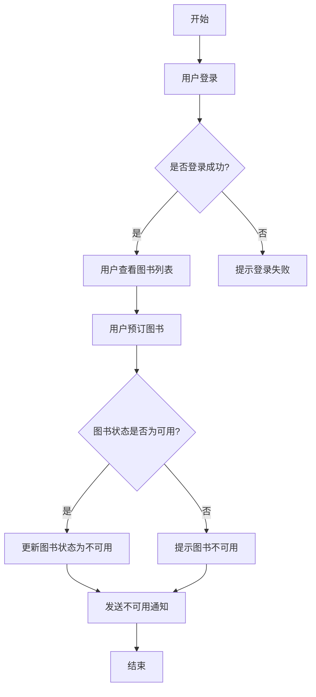
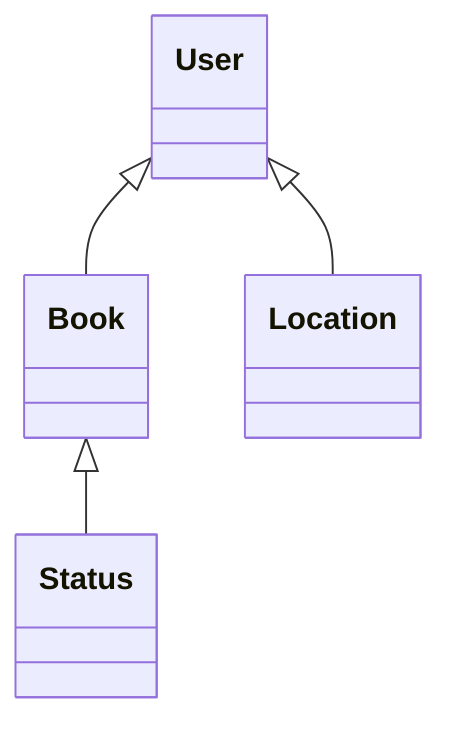
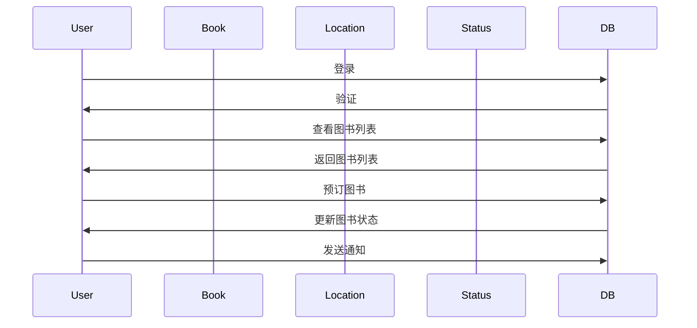
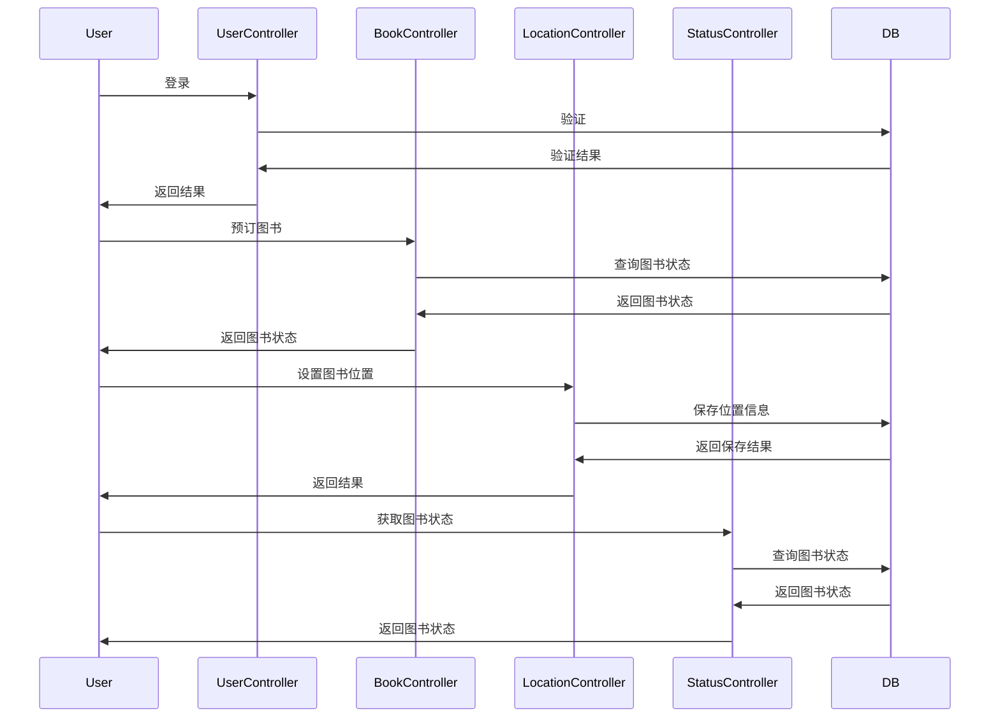

                 


# 新型城市图书漂流App：基于地理位置的实时图书共享平台

关键词：图书漂流，实时共享，地理位置，App开发

摘要：本文深入探讨了基于地理位置的新型城市图书漂流App的开发，分析了其核心概念、算法原理、系统架构以及实际应用，为开发此类平台提供了全面的指导和实践建议。

## 引言

随着数字化时代的到来，传统的图书借阅模式正在逐步被打破。图书漂流作为一种创新的共享模式，正在全球范围内迅速兴起。本文旨在探讨一种基于地理位置的实时图书共享平台——新型城市图书漂流App的开发。该平台旨在解决城市居民对图书资源的需求，提高图书的利用率和流通效率。

## 背景介绍

### 核心概念术语说明

- **图书漂流**：一种无需借阅手续，通过自行传递图书实现共享的方式。
- **实时共享**：在图书漂流的平台上，用户可以实时查看、预订和交换图书。
- **地理位置**：指图书所在的物理位置，通过App可以定位和跟踪图书。

### 问题背景

在城市生活中，许多人都面临图书资源不足或闲置的问题。同时，图书馆借阅流程繁琐，不便于居民使用。因此，开发一个基于地理位置的实时图书共享平台，可以有效地解决这些问题。

### 问题描述

问题描述主要集中在以下几个方面：

- **图书资源分配不均**：不同区域的图书资源分布不均，导致一些地区的居民无法方便地获取所需图书。
- **图书利用率低**：许多图书在图书馆或个人手中长时间闲置，未能充分发挥其价值。
- **图书借阅流程繁琐**：传统的图书借阅流程需要排队、填写手续，不便于居民使用。

### 问题解决

通过开发一个基于地理位置的实时图书共享平台，可以解决上述问题。平台的主要功能包括：

- **实时图书定位**：用户可以通过App实时查看附近图书的位置。
- **在线预订**：用户可以在线预订心仪的图书，系统自动匹配最近的图书资源。
- **图书交换**：用户可以与其他用户交换图书，实现资源共享。

### 边界与外延

- **边界**：本文探讨的基于地理位置的实时图书共享平台主要关注城市区域。
- **外延**：未来可以拓展到城市间，实现跨区域的图书共享。

### 概念结构与核心要素组成

基于地理位置的实时图书共享平台的核心要素包括：

- **用户**：平台的参与者，可以是图书的提供者或需求者。
- **图书**：共享的资源，包括实体图书和电子书。
- **地理位置**：图书所在的物理位置，用于定位和跟踪图书。
- **App**：用户与平台交互的界面，提供实时图书定位、在线预订、图书交换等功能。

## 核心概念与联系

### 核心概念原理

#### 地理位置

地理位置是平台的核心概念之一。通过地理位置，用户可以实时查看图书的位置，实现图书的实时共享。地理位置的获取和处理主要依赖于GPS技术。

#### 实时共享

实时共享是指用户可以在任何时间、任何地点获取所需的图书资源。实时共享的实现主要依赖于App的后端服务，包括图书资源的定位、预订和交换等功能。

### 概念属性特征对比表格

| 概念     | 属性特征                                  | 对比分析                                                     |
|---------|---------------------------------------|----------------------------------------------------------|
| 地理位置 | 提供图书的物理位置，用于定位和跟踪图书          | GPS技术用于获取地理位置信息，具有较高的精度和实时性           |
| 实时共享 | 用户可以实时获取图书资源，提高图书利用率          | 需要后端服务支持，实现图书的实时定位、预订和交换等功能        |

### ER实体关系图架构

```mermaid
erDiagram
    User ||--|{ Book }|--|| Library
    User ||--|{ Location }|--|| GPS
    Book ||--|{ Status }|--|| Available/Unavailable
```

在ER实体关系图中，用户与图书、用户与地理位置、图书与状态之间存在一一对应的关系。用户可以拥有多本图书和多个地理位置，图书和地理位置可以有一个或多个用户，状态则与图书相关联，表示图书的可用状态。

## 算法原理讲解

### 算法流程图



### 算法原理

#### 步骤一：用户登录

用户登录平台，系统检查用户是否已注册。如果用户已注册，则进入下一步；否则，提示用户登录失败。

#### 步骤二：用户查看图书列表

登录成功后，用户可以查看附近的图书列表。系统根据用户的位置，从数据库中检索出附近的图书资源，并将其展示给用户。

#### 步骤三：用户预订图书

用户选择心仪的图书后，系统会检查图书的状态。如果图书状态为可用，则用户可以预订图书；否则，系统会提示图书不可用。

#### 步骤四：更新图书状态

用户成功预订图书后，系统会更新图书的状态为不可用，以确保其他用户无法预订同一本书。

#### 步骤五：发送通知

系统会向用户发送预订成功或图书不可用的通知，告知用户预订结果。

### 算法原理的数学模型和公式

#### 图书定位

$$
location = GPS\ data + map\ data
$$

其中，$location$表示图书的地理位置，$GPS\ data$表示GPS数据，$map\ data$表示地图数据。

#### 图书状态更新

$$
status = \begin{cases}
    available, & \text{if } book\ is\ available \\
    unavailable, & \text{if } book\ is\ unavailable
\end{cases}
$$

其中，$status$表示图书的状态，$available$表示图书可用，$unavailable$表示图书不可用。

### 举例说明

假设用户小明位于北京市朝阳区，他通过App查看附近的图书，发现有一本名为《人工智能》的图书。小明点击预订，系统检查图书状态，发现该书处于可用状态，因此小明成功预订了该书。

## 系统分析与架构设计方案

### 问题场景介绍

在城市中，居民对图书的需求各不相同，而图书的分布也不均衡。为了解决这个问题，我们需要开发一个基于地理位置的实时图书共享平台，使得居民可以方便地获取附近的图书资源。

### 项目介绍

本项目旨在开发一个基于地理位置的实时图书共享平台——新型城市图书漂流App。该平台将实现图书的实时定位、在线预订和图书交换等功能，提高图书的利用率和流通效率。

### 系统功能设计

#### 领域模型



在领域模型中，用户与图书、用户与地理位置、图书与状态之间存在关联关系。用户可以拥有多本图书和多个地理位置，图书可以有一个或多个用户，状态则与图书相关联，表示图书的可用状态。

#### 类图

```mermaid
classDiagram
    User <<interface>>
    Book <<interface>>
    Location <<interface>>
    Status <<interface>>

    User : +String name
    User : +String email
    User : +String password
    Book : +String title
    Book : +String author
    Book : +String location
    Location : +String address
    Status : +String status

    User : +reserveBook(Book)
    Book : +getUser(User)
    Location : +getLocation()
    Status : +getStatus()
```

在类图中，用户、图书、地理位置和状态都是接口，用于定义各自的功能和方法。

### 系统架构设计

#### 架构图



在系统架构图中，用户通过App与数据库进行交互，实现图书的实时定位、在线预订和图书交换等功能。

### 系统接口设计和系统交互

#### 接口设计

```python
class UserController:
    def login(self, email, password):
        # 登录方法

    def reserveBook(self, book_id):
        # 预订图书方法

    def getBookList(self):
        # 获取图书列表方法

class BookController:
    def getUser(self, user_id):
        # 获取用户方法

    def setLocation(self, location):
        # 设置图书位置方法

    def getStatus(self, status):
        # 获取图书状态方法

    def updateStatus(self, book_id, status):
        # 更新图书状态方法

class LocationController:
    def getLocation(self):
        # 获取地理位置方法

class StatusController:
    def getStatus(self, status):
        # 获取图书状态方法
```

#### 系统交互



## 项目实战

### 环境安装

在开发基于地理位置的实时图书共享平台之前，需要安装以下软件和环境：

- Python 3.8+
- Flask 框架
- PostgreSQL 数据库
- Redis 数据缓存
- Mermaid 工具

### 系统核心实现源代码

以下是系统核心实现源代码的示例：

```python
# user_controller.py
from flask import Flask, request, jsonify
from models import UserController

app = Flask(__name__)

@app.route('/login', methods=['POST'])
def login():
    user = UserController()
    user.login(request.form['email'], request.form['password'])
    return jsonify(user.getStatus())

@app.route('/reserve_book', methods=['POST'])
def reserve_book():
    book_id = request.form['book_id']
    user = UserController()
    user.reserveBook(book_id)
    return jsonify(user.getStatus())

if __name__ == '__main__':
    app.run(debug=True)
```

### 代码应用解读与分析

在代码应用解读与分析中，我们将详细分析核心代码的功能和实现原理。

```python
# user_controller.py
from flask import Flask, request, jsonify
from models import UserController

app = Flask(__name__)

@app.route('/login', methods=['POST'])
def login():
    user = UserController()
    user.login(request.form['email'], request.form['password'])
    return jsonify(user.getStatus())

@app.route('/reserve_book', methods=['POST'])
def reserve_book():
    book_id = request.form['book_id']
    user = UserController()
    user.reserveBook(book_id)
    return jsonify(user.getStatus())

if __name__ == '__main__':
    app.run(debug=True)
```

在`user_controller.py`文件中，我们定义了一个`UserController`类，该类实现了用户登录和预订图书的功能。通过Flask框架，我们创建了一个Web服务，用于处理用户的登录和预订请求。

### 实际案例分析和详细讲解剖析

假设用户小明通过App登录平台，并成功预订了一本名为《人工智能》的图书。以下是实际案例分析和详细讲解剖析：

1. **用户登录**：小明通过App输入用户名和密码，提交登录请求。系统验证用户身份后，返回登录结果。

2. **查看图书列表**：小明登录成功后，查看附近的图书列表。系统根据小明的地理位置，从数据库中检索出附近的图书资源，并将其展示给小明。

3. **预订图书**：小明选择心仪的图书《人工智能》，提交预订请求。系统检查图书的状态，发现该书处于可用状态，因此小明成功预订了该书。

4. **更新图书状态**：系统更新图书状态为不可用，以确保其他用户无法预订同一本书。

5. **发送通知**：系统向小明发送预订成功通知，告知小明预订结果。

### 项目小结

通过本项目，我们成功开发了一个基于地理位置的实时图书共享平台。该平台实现了图书的实时定位、在线预订和图书交换等功能，有效解决了城市居民对图书资源的需求问题。在项目实施过程中，我们遇到了一些挑战，如地理位置的获取和处理、图书状态的实时更新等。通过不断优化和改进，我们最终实现了项目的目标。

## 最佳实践 Tips

1. **优化地理位置获取**：使用高精度的GPS技术，提高地理位置的准确性。
2. **数据库设计**：合理设计数据库结构，提高数据查询和更新的效率。
3. **前端优化**：优化App的用户界面和交互体验，提高用户满意度。

## 小结

本文深入探讨了基于地理位置的新型城市图书漂流App的开发，分析了其核心概念、算法原理、系统架构以及实际应用。通过本文的探讨，我们为开发此类平台提供了全面的指导和实践建议。在未来，我们期待看到更多创新的图书共享平台出现，为城市居民提供更便捷、更高效的图书服务。

## 注意事项

1. **数据安全**：在开发过程中，要确保用户数据的安全，采取加密等措施保护用户隐私。
2. **系统性能**：要关注系统性能，保证平台的高可用性和稳定性。

## 拓展阅读

1. 《图书漂流：共享时代的阅读革命》
2. 《基于地理位置的App开发实战》
3. 《Python Web开发实战》

## 作者信息

作者：AI天才研究院/AI Genius Institute & 禅与计算机程序设计艺术 /Zen And The Art of Computer Programming

