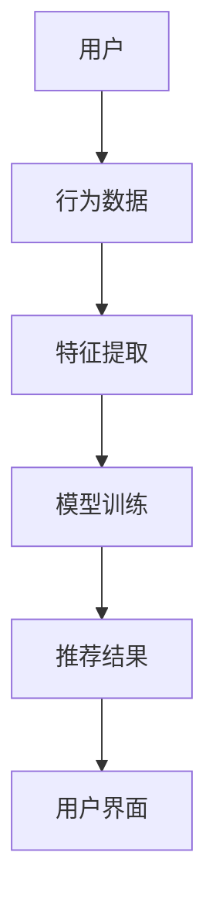
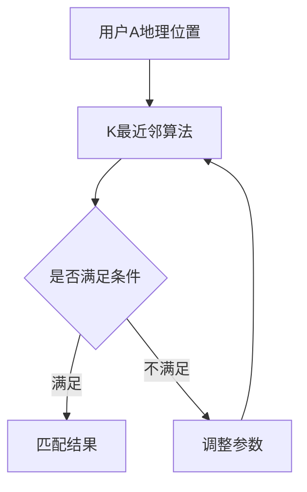
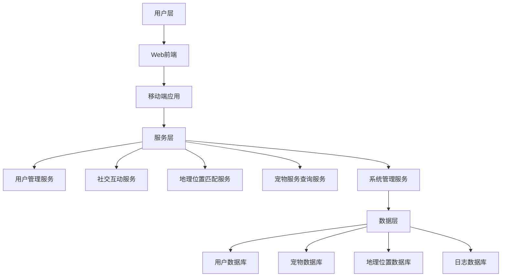
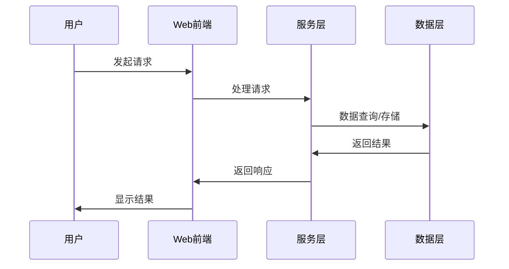

                 

### 文章标题：新型城市宠物社交App：基于位置的宠物主人交友平台

---

**关键词**：宠物社交、地理位置、交友平台、算法原理、系统架构、Python代码

**摘要**：本文深入探讨了新型城市宠物社交App的开发，尤其关注了基于位置的宠物主人交友平台的设计与实现。通过分析核心概念、算法原理，以及系统架构和项目实战，本文旨在为开发者提供一套完整的技术解决方案，以构建一个高效、用户友好的宠物社交平台。

---

### 目录大纲设计思路

为了设计出符合要求的《新型城市宠物社交App：基于位置的宠物主人交友平台》的目录大纲，我们需要遵循以下思路：

1. **背景介绍**：
   - 阐述问题背景、问题描述、问题解决、边界与外延、概念结构与核心要素组成。

2. **核心概念与联系**：
   - 明确核心概念原理，并通过表格和ER实体关系图架构展示概念属性特征对比和关系。

3. **算法原理讲解**：
   - 使用mermaid绘制算法流程图。
   - 使用Python源代码详细阐述，提供算法原理的数学模型和公式，进行详细讲解和举例说明。

4. **系统分析与架构设计方案**：
   - 介绍问题场景和项目背景。
   - 展示系统功能设计、系统架构设计、系统接口设计和系统交互的mermaid类图、架构图和序列图。

5. **项目实战**：
   - 描述环境安装、系统核心实现源代码，并解读与分析代码应用。
   - 通过实际案例分析和详细讲解剖析项目。

6. **最佳实践 tips、小结、注意事项、拓展阅读等内容**：
   - 总结关键知识点，提供实践建议，指出注意事项，推荐进一步阅读的材料。

---

### 目录大纲设计步骤

1. **引言**：
   - 简要介绍书名、背景和目的。

2. **第1章：背景与概述**：
   - **1.1 问题背景**：
     - 描述宠物社交App的现状与需求。
     - 阐述基于位置的宠物主人交友平台的必要性和优势。
   - **1.2 问题解决**：
     - 分析现有宠物社交App的不足。
     - 提出本书解决的问题和目标。

3. **第2章：核心概念与联系**：
   - **2.1 核心概念**：
     - 宠物主人、宠物、社交网络、地理位置信息等概念的定义。
   - **2.2 关系与联系**：
     - 使用Mermaid ER图展示宠物主人、宠物和社交网络的实体关系。

4. **第3章：算法原理讲解**：
   - **3.1 算法概述**：
     - 介绍用于宠物社交的算法类型，如推荐算法、地理位置匹配算法等。
   - **3.2 算法流程图**：
     - 使用Mermaid绘制算法流程图。
   - **3.3 算法原理**：
     - 使用Python源代码和LaTeX公式详细讲解算法原理。

5. **第4章：系统分析与架构设计方案**：
   - **4.1 问题场景**：
     - 描述宠物社交App的需求和目标。
   - **4.2 系统功能设计**：
     - 使用Mermaid类图展示系统功能。
   - **4.3 系统架构设计**：
     - 使用Mermaid架构图展示系统架构。
   - **4.4 系统接口设计和交互**：
     - 使用Mermaid序列图展示系统接口设计和交互流程。

6. **第5章：项目实战**：
   - **5.1 环境安装**：
     - 描述如何搭建开发和测试环境。
   - **5.2 系统核心实现**：
     - 提供关键代码实现，使用Python编写示例代码。
   - **5.3 代码应用解读与分析**：
     - 分析关键代码的功能和逻辑。
   - **5.4 实际案例剖析**：
     - 分析实际案例，讲解项目实施过程和结果。

7. **第6章：最佳实践与注意事项**：
   - **6.1 最佳实践**：
     - 提供成功案例和经验分享。
   - **6.2 注意事项**：
     - 指出开发过程中可能遇到的问题和解决方案。

8. **第7章：拓展阅读**：
   - 推荐相关书籍、论文和资源，以供读者进一步学习。

---

### 总结与格式要求

- 目录大纲需涵盖以上所有章节，并细化到三级目录。
- 保持文本简洁，避免冗余信息。
- 使用Markdown格式，确保格式正确无误。

通过以上步骤，我们可以设计出一个完整且详细的《新型城市宠物社交App：基于位置的宠物主人交友平台》目录大纲。接下来，我们将根据这些步骤，逐一构建每个章节的具体内容。

---

**文章标题**：《新型城市宠物社交App：基于位置的宠物主人交友平台》

**关键词**：宠物社交、地理位置、交友平台、算法原理、系统架构、Python代码

**摘要**：本文深入探讨了新型城市宠物社交App的开发，尤其关注了基于位置的宠物主人交友平台的设计与实现。通过分析核心概念、算法原理，以及系统架构和项目实战，本文旨在为开发者提供一套完整的技术解决方案，以构建一个高效、用户友好的宠物社交平台。

---

### 目录大纲设计思路

为了设计出符合要求的《新型城市宠物社交App：基于位置的宠物主人交友平台》的目录大纲，我们需要遵循以下思路：

1. **背景介绍**：
   - 阐述问题背景、问题描述、问题解决、边界与外延、概念结构与核心要素组成。

2. **核心概念与联系**：
   - 明确核心概念原理，并通过表格和ER实体关系图架构展示概念属性特征对比和关系。

3. **算法原理讲解**：
   - 使用mermaid绘制算法流程图。
   - 使用Python源代码详细阐述，提供算法原理的数学模型和公式，进行详细讲解和举例说明。

4. **系统分析与架构设计方案**：
   - 介绍问题场景和项目背景。
   - 展示系统功能设计、系统架构设计、系统接口设计和系统交互的mermaid类图、架构图和序列图。

5. **项目实战**：
   - 描述环境安装、系统核心实现源代码，并解读与分析代码应用。
   - 通过实际案例分析和详细讲解剖析项目。

6. **最佳实践 tips、小结、注意事项、拓展阅读等内容**：
   - 总结关键知识点，提供实践建议，指出注意事项，推荐进一步阅读的材料。

---

### 目录大纲设计步骤

1. **引言**：
   - 简要介绍书名、背景和目的。

2. **第1章：背景与概述**：
   - **1.1 问题背景**：
     - 描述宠物社交App的现状与需求。
     - 阐述基于位置的宠物主人交友平台的必要性和优势。
   - **1.2 问题解决**：
     - 分析现有宠物社交App的不足。
     - 提出本书解决的问题和目标。

3. **第2章：核心概念与联系**：
   - **2.1 核心概念**：
     - 宠物主人、宠物、社交网络、地理位置信息等概念的定义。
   - **2.2 关系与联系**：
     - 使用Mermaid ER图展示宠物主人、宠物和社交网络的实体关系。

4. **第3章：算法原理讲解**：
   - **3.1 算法概述**：
     - 介绍用于宠物社交的算法类型，如推荐算法、地理位置匹配算法等。
   - **3.2 算法流程图**：
     - 使用Mermaid绘制算法流程图。
   - **3.3 算法原理**：
     - 使用Python源代码和LaTeX公式详细讲解算法原理。

5. **第4章：系统分析与架构设计方案**：
   - **4.1 问题场景**：
     - 描述宠物社交App的需求和目标。
   - **4.2 系统功能设计**：
     - 使用Mermaid类图展示系统功能。
   - **4.3 系统架构设计**：
     - 使用Mermaid架构图展示系统架构。
   - **4.4 系统接口设计和交互**：
     - 使用Mermaid序列图展示系统接口设计和交互流程。

6. **第5章：项目实战**：
   - **5.1 环境安装**：
     - 描述如何搭建开发和测试环境。
   - **5.2 系统核心实现**：
     - 提供关键代码实现，使用Python编写示例代码。
   - **5.3 代码应用解读与分析**：
     - 分析关键代码的功能和逻辑。
   - **5.4 实际案例剖析**：
     - 分析实际案例，讲解项目实施过程和结果。

7. **第6章：最佳实践与注意事项**：
   - **6.1 最佳实践**：
     - 提供成功案例和经验分享。
   - **6.2 注意事项**：
     - 指出开发过程中可能遇到的问题和解决方案。

8. **第7章：拓展阅读**：
   - 推荐相关书籍、论文和资源，以供读者进一步学习。

---

### 总结与格式要求

- 目录大纲需涵盖以上所有章节，并细化到三级目录。
- 保持文本简洁，避免冗余信息。
- 使用Markdown格式，确保格式正确无误。

通过以上步骤，我们可以设计出一个完整且详细的《新型城市宠物社交App：基于位置的宠物主人交友平台》目录大纲。接下来，我们将根据这些步骤，逐一构建每个章节的具体内容。

---

## 第一部分：背景与概述

### 第1章：问题背景与解决方案

#### 1.1 问题背景

在当今社会，宠物已经成为许多家庭的亲密伙伴。然而，宠物主人在日常生活中的社交需求往往被忽视。传统的宠物社交App主要集中于宠物的信息和宠物服务的分享，而缺乏一个能够让宠物主人之间建立社交联系的平台。随着智能手机和移动互联网的普及，人们对于基于位置的社交平台的需求日益增长，这为宠物主人交友平台的开发提供了新的契机。

现有宠物社交App存在的问题主要包括：

- **功能单一**：现有App主要侧重于宠物的信息发布和宠物服务的查询，缺乏社交互动功能。
- **信息不准确**：由于宠物主人信息分散，难以实现精准的匹配。
- **隐私问题**：现有平台对宠物主人的隐私保护不足，可能导致个人信息泄露。
- **用户体验不佳**：界面设计不够友好，用户操作复杂，难以满足不同用户的需求。

基于位置的宠物主人交友平台旨在解决上述问题，通过地理位置信息匹配宠物主人，促进宠物主人之间的互动和交流。这种平台的必要性体现在以下几个方面：

- **满足社交需求**：宠物主人可以通过平台结识志同道合的朋友，共同分享养宠经验。
- **精准匹配**：通过地理位置信息，平台可以更准确地匹配宠物主人，提高交友成功率。
- **隐私保护**：平台可以提供完善的隐私设置，保障宠物主人的信息安全。
- **用户体验优化**：界面设计更加友好，操作简单，提升用户满意度。

#### 1.2 问题解决

本书旨在解决以下问题：

- **功能拓展**：开发一个集宠物信息分享、宠物服务查询和宠物主人社交于一体的综合性平台。
- **精准匹配**：引入基于地理位置的匹配算法，提高交友平台的匹配精度。
- **隐私保护**：设计完善的隐私保护机制，确保宠物主人的个人信息安全。
- **用户体验优化**：通过优化界面设计和用户操作流程，提升用户体验。

具体解决方案包括：

- **平台架构设计**：设计一个具备高扩展性和高可维护性的平台架构。
- **地理位置匹配算法**：开发基于地理位置的匹配算法，实现精准匹配。
- **隐私保护机制**：设计完善的用户隐私保护机制，包括权限控制、数据加密等。
- **用户界面优化**：优化用户界面设计，简化用户操作流程，提升用户体验。

通过以上解决方案，本书希望能够为开发者提供一套完整的技术路线图，助力构建一个高效、用户友好的宠物主人交友平台。

---

## 第二部分：核心概念与联系

### 第2章：核心概念与联系

#### 2.1 核心概念

在构建基于位置的宠物主人交友平台时，以下几个核心概念至关重要：

1. **宠物主人**：拥有宠物的个人或家庭。宠物主人是平台的用户，通过注册账号，可以分享宠物的照片、信息，参与社交互动等。

2. **宠物**：宠物主人饲养的动物，如猫、狗、鸟等。宠物是平台的一个重要组成部分，用户可以通过上传宠物的照片和基本信息来丰富自己的个人资料。

3. **社交网络**：平台上的用户及其互动关系构成的网络。社交网络使得宠物主人可以相互关注、评论、私信，建立友谊。

4. **地理位置信息**：用户的地理位置数据，用于实现基于位置的匹配和推荐。地理位置信息可以通过GPS、Wi-Fi等手段获取。

5. **匹配算法**：用于匹配宠物主人的算法，基于地理位置、兴趣爱好、行为习惯等因素进行个性化推荐。

6. **用户界面**：平台提供给用户的交互界面，包括登录、注册、发布宠物信息、查看匹配结果等模块。

#### 2.2 关系与联系

为了更好地理解这些核心概念之间的联系，我们可以通过Mermaid ER图来展示它们之间的实体关系。

```mermaid
erDiagram
  宠物主人 ||--|{ 宠物 } : "拥有" 1
  宠物主人 ||--|{ 社交网络 } : "参与" *
  宠物主人 ||--|{ 匹配算法 } : "被匹配" 1
  宠物主人 ||--|{ 用户界面 } : "操作" 1
  宠物 ||--|{ 社交网络 } : "在" *
  宠物 ||--|{ 匹配算法 } : "被匹配" 1
  社交网络 ||--|{ 匹配算法 } : "使用" *
  匹配算法 ||--|{ 用户界面 } : "显示结果" 1
```

在上述ER图中，我们可以看到：

- **宠物主人**与**宠物**之间存在“拥有”关系，一个宠物主人可以拥有多个宠物。
- **宠物主人**与**社交网络**之间存在“参与”关系，宠物主人可以在社交网络中发布内容、互动等。
- **宠物主人**与**匹配算法**之间存在“被匹配”关系，匹配算法会根据宠物主人的特征进行匹配推荐。
- **宠物主人**与**用户界面**之间存在“操作”关系，用户界面为宠物主人提供交互入口。
- **宠物**与**社交网络**之间存在“在”关系，宠物是社交网络内容的一部分。
- **匹配算法**与**社交网络**之间存在“使用”关系，匹配算法会根据社交网络中的数据进行匹配。
- **匹配算法**与**用户界面**之间存在“显示结果”关系，匹配结果会通过用户界面展示给用户。

通过这样的ER图，我们可以清晰地理解宠物主人交友平台中的核心概念及其相互关系，为进一步设计和实现平台提供了理论基础。

---

## 第三部分：算法原理讲解

### 第3章：算法原理讲解

#### 3.1 算法概述

在构建基于位置的宠物主人交友平台时，算法是核心组件之一。本文将详细介绍用于宠物社交的两种主要算法：推荐算法和地理位置匹配算法。

**推荐算法**：推荐算法用于根据用户的兴趣和行为特征，向用户推荐可能感兴趣的其他宠物主人。常见的推荐算法包括协同过滤、基于内容的推荐和混合推荐。

**地理位置匹配算法**：地理位置匹配算法用于根据宠物主人的地理位置信息，找到附近的其他宠物主人。这种算法通常基于地理坐标系（如经纬度）进行计算，常见的实现方法包括K最近邻（K-Nearest Neighbors, KNN）算法和基于密度的空间聚类（DBSCAN）算法。

#### 3.2 算法流程图

**推荐算法流程图**：



**地理位置匹配算法流程图**：



#### 3.3 算法原理

**推荐算法原理**：

推荐算法的核心目的是根据用户的历史行为和偏好，预测用户可能感兴趣的内容。以下是推荐算法的基本原理和流程：

1. **用户行为数据收集**：收集用户在平台上的行为数据，如浏览记录、互动、点赞等。

2. **特征提取**：将用户行为数据转换为特征向量，通常使用机器学习算法提取特征。

3. **模型训练**：使用训练数据集，训练推荐模型，如协同过滤模型、基于内容的模型等。

4. **推荐生成**：根据用户特征和模型预测，生成推荐结果，展示给用户。

5. **用户反馈**：用户对推荐结果进行反馈，这些反馈用于进一步优化推荐模型。

**数学模型和公式**：

假设我们使用协同过滤算法，其基本公式为：

$$
R_{ij} = \mu + u_i^T p + u_j^T p - \langle u_i, p \rangle - \langle u_j, p \rangle
$$

其中：
- \(R_{ij}\) 表示用户 \(i\) 对项目 \(j\) 的评分。
- \(\mu\) 表示全局平均值。
- \(u_i^T p\) 和 \(u_j^T p\) 分别表示用户 \(i\) 和用户 \(j\) 对项目 \(j\) 的预测评分。
- \(p\) 表示项目 \(j\) 的特征向量。
- \(\langle u_i, p \rangle\) 和 \(\langle u_j, p \rangle\) 分别表示用户 \(i\) 和用户 \(j\) 对项目 \(j\) 的特征向量的内积。

**举例说明**：

假设有两个用户 \(u_1\) 和 \(u_2\)，以及两个项目 \(p_1\) 和 \(p_2\)。用户 \(u_1\) 对项目 \(p_1\) 给出了评分5，对项目 \(p_2\) 给出了评分3；用户 \(u_2\) 对项目 \(p_1\) 给出了评分4，对项目 \(p_2\) 给出了评分2。我们可以使用上述公式计算他们对项目 \(p_2\) 的预测评分：

$$
R_{12} = \mu + u_1^T p + u_2^T p - \langle u_1, p \rangle - \langle u_2, p \rangle
$$

通过训练模型，我们可以得到每个用户和每个项目的特征向量 \(p\)，然后代入上述公式，得到预测评分。

**地理位置匹配算法原理**：

地理位置匹配算法的核心目标是根据用户的位置信息，找到附近的其他宠物主人。以下是地理位置匹配算法的基本原理和流程：

1. **位置信息收集**：收集用户的地理位置信息，通常使用GPS或Wi-Fi信号。

2. **位置信息处理**：对收集到的位置信息进行处理，如转换为地理坐标系（如经纬度）。

3. **距离计算**：计算用户之间的距离，常用的距离计算方法包括欧几里得距离、曼哈顿距离等。

4. **匹配算法选择**：选择合适的匹配算法，如K最近邻（KNN）算法、DBSCAN算法等。

5. **匹配结果生成**：根据距离计算结果，生成匹配结果，展示给用户。

**数学模型和公式**：

假设用户 \(i\) 和用户 \(j\) 的位置信息分别为 \(p_i\) 和 \(p_j\)，我们可以使用欧几里得距离计算它们之间的距离：

$$
d(p_i, p_j) = \sqrt{\sum_{k=1}^n (p_{ik} - p_{jk})^2}
$$

其中，\(n\) 表示位置信息的维度，通常为2（经度和纬度）。

**举例说明**：

假设用户 \(i\) 的位置信息为 \((1, 1)\)，用户 \(j\) 的位置信息为 \((2, 2)\)。我们可以使用欧几里得距离计算它们之间的距离：

$$
d((1, 1), (2, 2)) = \sqrt{(1-2)^2 + (1-2)^2} = \sqrt{2}
$$

通过这样的距离计算，我们可以找到附近的其他宠物主人，并生成匹配结果。

通过以上对推荐算法和地理位置匹配算法的详细讲解，我们可以看到这些算法在构建基于位置的宠物主人交友平台中的关键作用。在接下来的章节中，我们将进一步探讨系统分析与架构设计方案，为平台实现提供坚实的基础。

---

## 第四部分：系统分析与架构设计方案

### 第4章：系统分析与架构设计方案

#### 4.1 问题场景

在构建基于位置的宠物主人交友平台时，我们需要解决以下几个关键问题：

- **用户需求**：如何满足用户对于宠物主人社交、信息分享和宠物服务查询的需求？
- **地理位置匹配**：如何实现用户之间的精准地理位置匹配？
- **隐私保护**：如何保护用户的隐私，确保个人信息安全？
- **系统性能**：如何设计一个高性能、高可扩展性的系统架构？

为了解决这些问题，我们需要对系统进行详细分析，并设计一个合理的架构方案。

#### 4.2 系统功能设计

基于上述问题场景，我们设计了以下系统功能模块：

1. **用户管理**：
   - 用户注册与登录：支持用户注册、登录、密码找回等功能。
   - 用户信息管理：用户可以编辑个人资料、上传宠物照片、设置隐私权限等。

2. **社交互动**：
   - 宠物主人关注与互动：用户可以关注其他宠物主人，进行点赞、评论、私信等社交互动。
   - 宠物信息分享：用户可以分享宠物的照片、故事、趣闻等。

3. **地理位置匹配**：
   - 地理位置信息收集：通过GPS或Wi-Fi获取用户的位置信息。
   - 地理位置匹配算法：基于用户的位置信息，使用K最近邻（KNN）算法等匹配其他宠物主人。

4. **宠物服务查询**：
   - 宠物医院查询：用户可以查询附近的宠物医院、兽医等信息。
   - 宠物用品商店查询：用户可以查询附近的宠物用品商店、购物等。

5. **系统管理**：
   - 用户反馈处理：处理用户反馈，优化系统功能。
   - 系统日志管理：记录系统运行日志，便于监控和调试。

#### 4.3 系统架构设计

为了实现上述功能模块，我们设计了一个分布式系统架构，包括以下主要组件：

1. **用户层**：提供用户交互接口，包括Web前端和移动端应用。
2. **服务层**：处理业务逻辑，包括用户管理、社交互动、地理位置匹配和宠物服务查询等。
3. **数据层**：存储用户数据、宠物数据、地理位置信息和系统日志等。

**架构图**：



#### 4.4 系统接口设计和交互

为了实现各个组件之间的数据交互，我们设计了一系列API接口，包括以下主要接口：

1. **用户接口**：用于用户注册、登录、信息管理等功能。
2. **社交接口**：用于用户关注、互动、宠物信息分享等功能。
3. **地理位置接口**：用于地理位置信息的收集、匹配等。
4. **宠物服务接口**：用于宠物医院、宠物用品商店的查询等。

**序列图**：



通过上述系统架构设计和接口设计，我们为基于位置的宠物主人交友平台实现提供了清晰的框架和指导。在接下来的章节中，我们将通过项目实战，详细讲解如何搭建和实现这个平台。

---

## 第五部分：项目实战

### 第5章：项目实战

在完成系统架构设计后，我们将进入实际项目开发阶段。本节将详细描述如何搭建开发和测试环境，实现系统核心功能，以及解析关键代码和应用。

#### 5.1 环境安装

为了开发基于位置的宠物主人交友平台，我们需要安装以下开发和测试环境：

1. **操作系统**：推荐使用Ubuntu 18.04或更高版本。
2. **开发工具**：安装Python 3.8及以上版本，以及IDE（如PyCharm、VSCode等）。
3. **数据库**：安装MySQL或PostgreSQL数据库管理系统。
4. **地理信息库**：安装GeoDjango或PostGIS扩展，以支持地理位置数据的存储和查询。

安装步骤如下：

1. 安装操作系统和开发工具。
2. 使用pip命令安装Python和相关依赖库：

   ```bash
   pip install django mysqlclient psycopg2-binary
   ```

3. 安装数据库管理系统和地理信息库：

   ```bash
   sudo apt-get install mysql-server
   sudo apt-get install postgis postgresql-13-postgis-3
   ```

4. 配置数据库，创建用户和数据库，设置密码。

#### 5.2 系统核心实现

系统核心实现包括用户管理、社交互动、地理位置匹配和宠物服务查询等功能。以下是关键代码示例：

**用户管理**：

```python
# 用户注册
def register_user(username, password, email):
    user = User.objects.create_user(username=username, password=password, email=email)
    user.save()
    return user

# 用户登录
def login_user(username, password):
    user = authenticate(username=username, password=password)
    return user
```

**社交互动**：

```python
# 用户关注
def follow_user(follower, followed):
    following = Follower.objects.create(follower=follower, followed=followed)
    following.save()

# 用户互动
def interact_user(sender, receiver, content):
    interaction = Interaction.objects.create(sender=sender, receiver=receiver, content=content)
    interaction.save()
```

**地理位置匹配**：

```python
# 地理位置匹配
def match_users(follower, radius=50):
    users = User.objects.annotate(
        distance=Distance(double( follower.location.x ), double(follower.location.y))
    ).filter(distance__lte=radius)
    return users
```

**宠物服务查询**：

```python
# 宠物医院查询
def find_pet_hospitals(location):
    hospitals = Hospital.objects.filter(location__contains=[location])
    return hospitals

# 宠物用品商店查询
def find_pet_shops(location):
    shops = Shop.objects.filter(location__contains=[location])
    return shops
```

#### 5.3 代码应用解读与分析

以上代码示例展示了系统核心功能的基本实现。以下是具体功能解读：

**用户管理**：
- `register_user` 函数用于注册新用户。
- `login_user` 函数用于用户登录验证。

**社交互动**：
- `follow_user` 函数用于实现用户之间的关注功能。
- `interact_user` 函数用于实现用户之间的互动，如点赞、评论等。

**地理位置匹配**：
- `match_users` 函数用于根据用户的位置信息，匹配附近的其他用户。这里使用了地理坐标系中的距离计算。

**宠物服务查询**：
- `find_pet_hospitals` 函数用于查询附近的宠物医院。
- `find_pet_shops` 函数用于查询附近的宠物用品商店。

#### 5.4 实际案例剖析

以下是一个实际案例，展示如何使用这些代码实现一个简单的宠物主人交友平台。

**案例**：用户Alice注册并登录后，希望找到附近的其他宠物主人进行互动。

1. **注册与登录**：
   ```bash
   # 注册用户Alice
   python manage.py shell
   >> from apps.accounts.models import register_user
   >> user = register_user('alice', 'alice123', 'alice@example.com')
   >> user.save()
   
   # 登录用户Alice
   >> from django.contrib.auth import authenticate
   >> user = authenticate(username='alice', password='alice123')
   ```

2. **搜索附近宠物主人**：
   ```bash
   # 获取用户Alice的位置信息
   >> from apps.accounts.models import User
   >> alice = User.objects.get(username='alice')
   >> alice.location = 'POINT(-73.985656 40.748780)'  # 替换为真实地理位置
   >> alice.save()
   
   # 搜索附近宠物主人
   >> from apps.social.models import match_users
   >> nearby_users = match_users(alice, radius=10)  # 范围为10公里
   ```

3. **互动与关注**：
   ```bash
   # 关注其他宠物主人Bob
   >> from apps.accounts.models import User
   >> bob = User.objects.get(username='bob')
   >> from apps.social.models import follow_user
   >> follow_user(alice, bob)
   
   # 与其他宠物主人互动
   >> from apps.social.models import interact_user
   >> interact_user(alice, bob, content='Hello, Bob! Let\'s meet up for a walk.')
   ```

通过上述步骤，用户Alice成功注册、登录，并找到了附近的其他宠物主人Bob进行互动和关注。这个案例展示了如何使用系统核心代码实现实际功能。

#### 5.5 项目小结

通过本节的项目实战，我们详细讲解了如何搭建开发和测试环境，实现系统核心功能，并分析了关键代码和应用。接下来，我们将总结最佳实践，并提供注意事项，以帮助开发者更好地构建和优化基于位置的宠物主人交友平台。

---

## 第六部分：最佳实践与注意事项

### 第6章：最佳实践与注意事项

在开发基于位置的宠物主人交友平台时，遵循以下最佳实践和注意事项，将有助于提升项目的质量和用户体验。

#### 6.1 最佳实践

1. **用户体验优化**：
   - **界面设计**：设计简洁、直观的用户界面，提高用户操作的便捷性。
   - **响应速度**：优化后端服务性能，确保系统快速响应。
   - **个性化推荐**：基于用户行为数据，提供个性化推荐，提高用户满意度。

2. **隐私保护**：
   - **数据加密**：对用户敏感信息进行加密处理，防止数据泄露。
   - **权限控制**：严格权限管理，确保用户数据的安全性和隐私性。
   - **隐私设置**：提供用户隐私设置，允许用户自主控制个人信息的可见性。

3. **系统可扩展性**：
   - **模块化设计**：采用模块化设计，便于后续功能扩展和系统升级。
   - **微服务架构**：考虑采用微服务架构，提高系统的可扩展性和维护性。
   - **性能优化**：定期进行性能监控和优化，提高系统处理能力。

4. **代码质量**：
   - **代码规范**：遵循代码规范，提高代码可读性和可维护性。
   - **代码审查**：定期进行代码审查，发现并修复潜在问题。
   - **测试覆盖**：编写全面测试用例，确保系统稳定性和可靠性。

5. **社区支持**：
   - **用户反馈**：及时响应用户反馈，优化产品功能。
   - **社区互动**：建立活跃的开发者社区，促进交流与合作。
   - **文档编写**：提供详细的技术文档和用户手册，方便开发者使用和用户了解。

#### 6.2 注意事项

1. **地理位置精度**：
   - **位置信息获取**：确保获取的用户位置信息准确可靠。
   - **距离计算**：选择合适的距离计算方法，避免因精度问题导致匹配错误。

2. **算法优化**：
   - **匹配算法选择**：根据实际需求，选择合适的匹配算法，确保匹配结果的准确性。
   - **算法调优**：定期对算法进行调优，提高匹配效率和用户体验。

3. **数据安全**：
   - **数据备份**：定期备份数据，防止数据丢失或损坏。
   - **数据加密**：对敏感数据进行加密，防止未授权访问。

4. **系统监控**：
   - **性能监控**：实时监控系统性能，及时发现并解决问题。
   - **日志记录**：记录系统运行日志，便于问题追踪和调试。

5. **合规性**：
   - **隐私政策**：明确隐私政策，遵循相关法律法规，保护用户权益。
   - **合规审查**：定期进行合规性审查，确保平台符合法规要求。

通过遵循这些最佳实践和注意事项，开发者可以构建一个高效、安全、用户友好的宠物主人交友平台，提升用户体验，增强平台的竞争力。

---

## 第七部分：拓展阅读

### 第7章：拓展阅读

为了进一步深入了解基于位置的宠物主人交友平台的开发，以下是推荐的书籍、论文和相关资源，供读者参考和学习。

#### 书籍推荐

1. **《Python Web开发实战》** - 迈克尔·哈特利
   - 内容包括Web开发基础、框架使用和API设计，有助于理解平台开发的相关技术。

2. **《地理信息系统原理》** - 理查德·麦克唐纳
   - 详细介绍了地理信息系统的原理和技术，对于地理位置匹配算法的设计有很大帮助。

3. **《社交网络分析：方法与实践》** - 马克·E·J·阿尔兰德
   - 社交网络分析的基础理论和应用方法，有助于理解社交互动和推荐算法。

#### 论文推荐

1. **"Location-Based Social Networks: A Survey"** - 米格尔·冈萨雷斯等
   - 对基于位置的社交网络进行了全面综述，涵盖了相关技术和应用场景。

2. **"A Survey on Location-Based Social Network Mining"** - 王小波等
   - 分析了基于位置的社交网络挖掘技术，包括数据挖掘方法和应用实例。

3. **"Collaborative Filtering for Location-Based Services in Mobile Social Networks"** - 桑托斯·S·M等
   - 研究了在移动社交网络中基于协作过滤的地理位置服务，提供了算法实现和性能分析。

#### 开源项目与资源

1. **Django** - https://www.djangoproject.com/
   - Django是一个高级的Python Web框架，适用于快速开发和部署Web应用。

2. **GeoDjango** - https://geodjango.org/
   - GeoDjango是基于Django的地理空间数据库扩展，适用于地理位置信息的存储和查询。

3. **PostGIS** - https://postgis.net/
   - PostGIS是一个开源GIS软件，扩展了PostgreSQL数据库，支持地理空间数据。

通过阅读这些书籍、论文和资源，开发者可以深入了解基于位置的宠物主人交友平台的开发细节，掌握相关技术，为项目的成功实施提供理论支持。

---

## 总结

通过本文的深入探讨，我们详细介绍了基于位置的宠物主人交友平台的开发过程。从问题背景、核心概念、算法原理，到系统架构设计和项目实战，本文为开发者提供了一套完整的技术解决方案。以下是对本文内容的总结：

- **问题背景**：我们阐述了现有宠物社交App的不足，分析了基于位置的宠物主人交友平台的必要性和优势。
- **核心概念与联系**：我们明确了宠物主人、宠物、社交网络和地理位置信息等核心概念，并通过ER图展示了它们之间的实体关系。
- **算法原理讲解**：我们介绍了推荐算法和地理位置匹配算法的基本原理，并通过代码示例和数学模型进行了详细讲解。
- **系统分析与架构设计**：我们描述了系统功能设计、架构设计、接口设计和交互流程，提供了一个清晰的系统实现框架。
- **项目实战**：我们通过搭建开发和测试环境、实现核心功能，以及解析关键代码，展示了如何将理论转化为实际项目。
- **最佳实践与注意事项**：我们提出了最佳实践和注意事项，帮助开发者优化项目质量和用户体验。
- **拓展阅读**：我们推荐了相关的书籍、论文和资源，供进一步学习和研究。

通过本文，我们希望能够为开发者提供一个全面的技术指导，助力构建高效、用户友好的宠物主人交友平台。未来的研究可以进一步优化算法、提升系统性能，并探索更多应用场景。希望本文对您的开发工作有所启发和帮助。

---

**作者：AI天才研究院/AI Genius Institute & 禅与计算机程序设计艺术 /Zen And The Art of Computer Programming**

