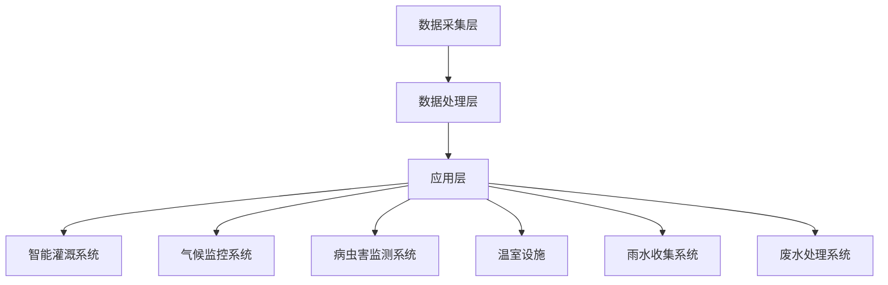
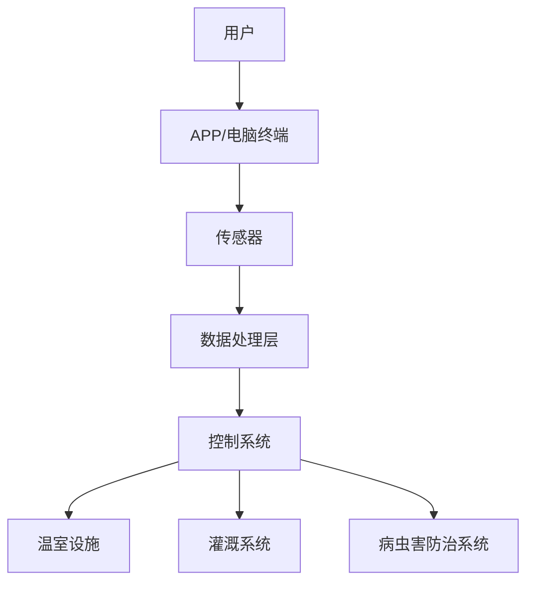

                 

### 1.1.1 新型城市屋顶农场的重要性

在当今社会，城市化进程不断加速，城市人口数量逐年增加，对食品的需求也日益增长。传统的农业模式由于土地资源的有限性、环境污染以及资源消耗等问题，已经无法满足现代城市对可持续食物生产的需求。因此，探索新的食物生产方式成为当务之急。新型城市屋顶农场作为一种创新的农业模式，受到了广泛关注和研究。

城市屋顶农场的建设不仅可以解决城市土地资源紧缺的问题，还能提高城市生态环境的质量。首先，屋顶农场可以有效地利用城市建筑物的闲置空间，将原本不被使用的屋顶转变为生产食物的场所。这种垂直农业的布局方式，可以大幅度增加单位面积的生产效率，满足城市人口的食品需求。此外，屋顶农场通过种植绿色植物，可以吸收二氧化碳、释放氧气，有助于改善城市空气质量，缓解热岛效应。

其次，屋顶农场具有较好的环保效益。通过雨水收集和废水再利用，屋顶农场可以显著降低城市水资源的消耗。同时，屋顶植被可以减少屋顶的热量吸收，降低空调能耗，从而减少城市能源消耗。此外，屋顶农场还可以减少城市屋顶积水的风险，降低城市排水系统的负担。

最后，新型城市屋顶农场还有助于提升城市居民的生活质量。在城市中拥有一个绿意盎然的屋顶农场，不仅为居民提供了新鲜的有机食物，还创造了一个亲近自然、放松身心的环境。此外，屋顶农场可以作为城市绿化的一部分，提高城市的审美价值和文化氛围。

总的来说，新型城市屋顶农场作为一种创新的农业模式，具有显著的经济、生态和社会效益。它不仅能够缓解城市食品供应压力，提高生态环境质量，还能够提升城市居民的生活品质。因此，研究和推广新型城市屋顶农场具有重要意义。

### 1.1.2 城市食物生产面临的挑战

尽管城市食物生产具有巨大的潜力，但现实中的城市食物生产仍然面临诸多挑战。首先，城市土地资源紧缺是一个不可忽视的问题。随着城市化进程的加速，城市用地被大量用于商业、住宅和基础设施的建设，导致可用于农业生产的土地面积日益减少。这意味着城市食品生产必须寻求更加高效的利用方式，才能满足日益增长的人口需求。

其次，环境污染问题对城市食物生产构成了严重威胁。城市中的工业废水、废气、固体废物等污染物对土壤和水源造成了严重污染，导致农产品质量下降，甚至存在食品安全隐患。此外，城市大气污染、土壤重金属污染等也对农作物生长环境产生了负面影响。因此，如何保障城市农产品的安全性和质量成为亟待解决的问题。

第三，资源消耗问题也不可忽视。传统的农业模式通常需要大量的水资源、化肥和农药，这些资源的过度使用不仅增加了环境负担，还导致了资源的浪费。在有限的城市资源条件下，如何实现高效、可持续的食物生产是城市食物生产所面临的一个重要挑战。

第四，技术和管理水平不足也是一个制约因素。城市食物生产需要较高的技术水平和管理经验，包括现代农业技术、农业工程和信息技术等。然而，许多城市缺乏相关的技术和管理人才，导致农业生产的效率和产品质量难以提升。此外，城市食品供应链的不完善也增加了食物生产的不确定性。

第五，政策支持和法律体系不健全。尽管城市食物生产的重要性日益凸显，但相关政策和法律法规尚不完善。例如，城市土地使用政策、农业补贴政策、食品安全法规等尚需进一步优化和完善，以促进城市食物生产的健康发展。

综上所述，城市食物生产面临土地资源紧缺、环境污染、资源消耗、技术和管理水平不足以及政策支持不足等多方面的挑战。要实现城市食物生产的可持续性，需要多方共同努力，探索创新的解决方案。

### 1.1.3 解决方案：屋顶农场

面对城市食物生产面临的诸多挑战，新型城市屋顶农场作为一种创新的解决方案，具有显著的优势和潜力。首先，屋顶农场能够有效地利用城市建筑物的闲置空间，将原本不用的屋顶转变为生产食品的场所。这种垂直农业模式可以大幅度增加单位面积的生产效率，满足城市人口的食品需求。此外，屋顶农场通过种植绿色植物，不仅可以吸收二氧化碳、释放氧气，改善城市空气质量，还可以降低城市的热岛效应，从而提升城市的生态环境质量。

其次，屋顶农场在环保方面具有独特优势。通过雨水收集和废水再利用，屋顶农场可以显著降低城市水资源的消耗，减少对地下水和河流的依赖。同时，屋顶植被可以减少屋顶的热量吸收，降低空调能耗，从而减少城市的能源消耗。此外，屋顶农场还可以减少城市屋顶积水的风险，降低城市排水系统的负担，从而减轻城市基础设施的压力。

在经济效益方面，屋顶农场也有显著潜力。屋顶农场不仅可以提供新鲜、有机的农产品，满足城市居民对高品质食品的需求，还可以创造就业机会，促进城市经济发展。此外，屋顶农场的建设和运营还可以带动相关产业的发展，如农业技术、农业工程、环境工程等，进一步推动城市经济的多元化发展。

社会效益方面，屋顶农场为城市居民提供了一个亲近自然、放松身心的空间。在城市中拥有一个绿意盎然的屋顶农场，不仅提高了城市居民的生活质量，还增强了社区的凝聚力和文化氛围。屋顶农场还可以作为教育场所，向公众传递农业知识，提高公众对可持续农业的认识和参与度。

最后，政策支持和公众认知的提升也为屋顶农场的发展创造了有利条件。随着对城市食物生产重要性的认识不断提高，政府逐渐加大对屋顶农场的支持力度，通过提供财政补贴、税收优惠、技术支持等手段，推动屋顶农场的建设和发展。同时，公众对有机食品和绿色生活方式的认同也在逐步增强，这为屋顶农场的推广提供了广阔的市场空间。

综上所述，新型城市屋顶农场作为一种创新的农业模式，不仅能够解决城市食物生产面临的挑战，还具备显著的经济、生态和社会效益。通过不断探索和推广，屋顶农场有望成为实现城市可持续食物生产的重要途径。

### 1.2.1 城市屋顶农场的基本概念

城市屋顶农场，是指在城市建筑物的屋顶上建造的农田，用于种植蔬菜、水果、草本植物等农产品。这种农场利用城市建筑物的闲置空间，通过先进的农业技术和绿色建筑设计，实现高效、可持续的农业生产。其基本概念主要包括以下几个方面：

首先，城市屋顶农场的定义。城市屋顶农场是将农业活动转移到城市建筑屋顶的一种新型农业模式。与传统农业相比，它具有更高的空间利用率和更少的土地占用，可以在有限的土地上实现更高的产出。城市屋顶农场通常包括种植区、灌溉系统、排水系统、温室设施等组成部分。

其次，城市屋顶农场的特点。城市屋顶农场的最大特点是垂直农业模式，通过立体空间布局，大大增加了单位面积的生产效率。此外，屋顶农场通常采用智能化管理系统，包括自动灌溉、温室调控、病虫害监测等，提高了农业生产的管理水平。此外，屋顶农场还具有环保效益，通过雨水收集和废水再利用，减少城市水资源消耗和环境污染。

再次，城市屋顶农场的类型。根据建设方式和功能的不同，城市屋顶农场可以分为多种类型。例如，按建筑材料分类，有生态屋顶农场和传统屋顶农场；按功能分类，有科研型、观光型和综合型屋顶农场；按使用方式分类，有自用型和共享型屋顶农场。每种类型的屋顶农场都有其特定的应用场景和优势。

最后，城市屋顶农场的基本结构。城市屋顶农场的基本结构包括种植区、灌溉系统、排水系统、温室设施、管理平台等组成部分。种植区是农场的核心，用于种植各种农产品；灌溉系统负责提供充足的水源；排水系统确保水分能够有效排出，防止积水；温室设施用于调节温度和湿度，提高作物生长条件；管理平台则通过智能传感器和数据监控系统，实现对农场的全面管理。

通过以上对城市屋顶农场基本概念的介绍，可以更好地理解其定义、特点、类型和基本结构，为后续章节的深入探讨提供基础。

### 1.2.2 城市食物生产的要素

城市食物生产是一个复杂而多维的过程，其成功离不开几个关键要素的协调与配合。以下是对城市食物生产主要要素的详细探讨：

**1. 土地资源**

土地资源是城市食物生产的基础，尽管城市土地资源相对稀缺，但合理利用闲置屋顶空间可以大幅增加农业生产面积。在选择屋顶农场建设场地时，需要考虑以下因素：屋顶的承重能力、防渗性能、日照条件以及排水系统。通过优化空间布局，最大化利用有限土地资源，确保农业生产的高效运行。

**2. 水资源**

水是农作物生长的必需品，城市水资源的管理尤为重要。城市屋顶农场可以通过雨水收集系统、废水处理和再利用技术，提高水资源的利用效率。在灌溉过程中，应采用节水灌溉技术，如滴灌和喷灌，减少水资源浪费。同时，要确保排水系统的畅通，防止水分过度积聚，影响作物生长。

**3. 空气和气候**

空气质量对农作物生长有直接影响。城市空气中的污染物如二氧化碳、氮氧化物等会降低作物的光合作用效率，影响生长质量。因此，在城市食物生产过程中，需要采取有效的空气治理措施，如种植空气净化植物。此外，气候条件也是影响城市食物生产的关键因素，温室技术可以有效调控温度、湿度和光照，创造适宜的生长环境。

**4. 种植技术和设备**

现代种植技术的应用大大提升了城市食物生产的效率。自动化播种机、智能灌溉系统、温室设施、病虫害监测设备等，都是提高农业生产水平的重要工具。通过这些技术手段，可以实现对作物生长环境的精细管理，提高生产效率和产品质量。

**5. 管理系统**

科学的管理系统是保障城市食物生产顺利运行的关键。现代化的管理系统包括数据采集与监控、自动调控、远程管理等功能，能够实时监测作物生长状态，及时调整生产参数，提高管理效率。此外，管理系统还可以实现农产品的追溯与认证，确保食品安全。

**6. 社会支持和政策**

社会支持和政策是城市食物生产的重要保障。政府可以通过提供财政补贴、税收优惠、技术支持等手段，鼓励企业和个人参与城市食物生产。同时，社会各界的关注和支持也能够为城市食物生产创造良好的发展环境。公众对有机食品和绿色生活方式的认同，也为城市食物生产提供了广阔的市场空间。

**7. 生态环境**

城市食物生产不仅关注经济效益，还应注重生态效益。屋顶农场可以通过植被覆盖、雨水收集、废水处理等技术措施，改善城市生态环境。此外，城市食物生产还可以作为城市绿化的一部分，提高城市的景观价值和居民的生活质量。

综上所述，城市食物生产的成功离不开土地资源、水资源、空气质量、种植技术、管理系统、社会支持和政策以及生态环境等关键要素的协调配合。通过科学管理和技术创新，可以实现城市食物生产的可持续发展和高效运行。

### 1.2.3 城市屋顶农场的优势与挑战

城市屋顶农场作为一种创新的农业模式，具有许多显著的优势和潜在的挑战。以下是对其优势与挑战的详细探讨：

**优势：**

1. **空间利用效率高**：城市屋顶农场通过垂直农业模式，能够充分利用城市建筑物的闲置空间，大幅度增加单位面积的生产效率，解决城市土地资源紧张的问题。

2. **环保效益显著**：屋顶农场可以种植绿色植物，吸收二氧化碳、释放氧气，改善城市空气质量，降低热岛效应。同时，通过雨水收集和废水再利用，屋顶农场可以显著减少水资源的消耗，降低城市排水系统的负担。

3. **经济效益可观**：屋顶农场不仅可以提供新鲜、有机的农产品，满足城市居民对高品质食品的需求，还可以创造就业机会，促进城市经济发展。此外，屋顶农场的建设和运营还可以带动相关产业的发展，如农业技术、农业工程、环境工程等，进一步推动城市经济的多元化发展。

4. **社会效益丰富**：屋顶农场为城市居民提供了一个亲近自然、放松身心的环境，提高了城市生活质量。同时，屋顶农场还可以作为教育场所，向公众传递农业知识，提高公众对可持续农业的认识和参与度。

**挑战：**

1. **建设成本较高**：城市屋顶农场的建设需要较高的前期投资，包括建筑改造、种植设备、灌溉系统等。此外，屋顶农场的维护和运营成本也相对较高，这对许多企业和个人来说是一个经济负担。

2. **技术和管理水平要求高**：城市屋顶农场需要采用先进的农业技术和智能化管理系统，包括温室调控、自动灌溉、病虫害监测等。这对农场主和运营团队的技术和管理水平提出了较高的要求。

3. **环境适应性问题**：城市屋顶农场的生态环境与自然农场不同，需要特殊的气候调控和种植技术。例如，屋顶环境的温度、湿度、光照等条件与地面农场有显著差异，这对农作物的生长提出了挑战。

4. **政策法规不完善**：尽管城市屋顶农场具有显著的优势和潜力，但相关政策和法律法规尚不完善。例如，城市土地使用政策、农业补贴政策、食品安全法规等尚需进一步优化和完善，以促进城市食物生产的健康发展。

5. **社会认知和接受度**：虽然越来越多的城市居民开始认识到城市屋顶农场的重要性，但社会整体对这一新型农业模式的认知和接受度仍需提高。公众对屋顶农场的了解和信任程度，直接影响其推广和应用。

综上所述，城市屋顶农场在空间利用、环保、经济和社会效益方面具有显著优势，但也面临建设成本高、技术和管理要求高、环境适应性问题、政策法规不完善和社会认知度低等挑战。要实现城市屋顶农场的可持续发展，需要政府、企业和社会各界的共同努力，通过技术创新、政策支持和公众教育，不断克服各种挑战，推动屋顶农场的发展。

### 1.3.1 目录结构概述

本文将从城市屋顶农场的建设、运营管理、经济与生态效益以及未来展望等多个方面进行深入探讨。具体目录结构如下：

- **第一部分：引言**
  - 1.1 新型城市屋顶农场的重要性
  - 1.2 城市食物生产面临的挑战
  - 1.3 解决方案：屋顶农场
  - 1.4 城市屋顶农场的基本概念
  - 1.5 城市食物生产的要素
  - 1.6 城市屋顶农场的优势与挑战
  - 1.7 本章小结

- **第二部分：城市屋顶农场的建设**
  - 2.1 建设前的准备工作
  - 2.2 建设材料与技术
  - 2.3 建设流程与步骤
  - 2.4 建设中的注意事项
  - 2.5 本章小结

- **第三部分：城市屋顶农场的运营管理**
  - 3.1 运营管理概述
  - 3.2 种植计划与季节管理
  - 3.3 土壤管理
  - 3.4 水资源管理
  - 3.5 病虫害管理
  - 3.6 运营成本控制
  - 3.7 本章小结

- **第四部分：城市屋顶农场的经济与生态效益**
  - 4.1 经济效益分析
  - 4.2 生态效益分析
  - 4.3 社会效益分析
  - 4.4 案例研究
  - 4.5 本章小结

- **第五部分：未来展望与挑战**
  - 5.1 未来发展趋势
  - 5.2 潜在挑战
  - 5.3 发展策略与建议
  - 5.4 本章小结

- **第六部分：案例分析与经验总结**
  - 6.1 案例选择与
  - 6.2 案例分析
  - 6.3 经验总结
  - 6.4 案例启示
  - 6.5 本章小结

通过以上目录结构，本文将系统地探讨城市屋顶农场的各个方面，为读者提供一个全面、深入的见解。

### 1.3.2 读者对象与目标

本文的目标读者群体主要包括以下几类：

1. **城市规划与管理者**：致力于城市可持续发展、生态建设和资源管理的专业人士，需要了解新型农业模式在城市中的潜在应用和优势，以更好地制定相关政策和发展规划。

2. **农业科技从业者**：从事现代农业技术、智能农业系统、生态农业研究等相关领域的科研人员和技术专家，希望通过本文了解城市屋顶农场的建设与运营管理实践，探索技术创新和农业现代化的新途径。

3. **农业企业家**：有意投资和运营城市屋顶农场的农业企业家，需要全面了解该模式的可行性、经济效益和生态效益，以便做出科学的投资决策。

4. **高校师生**：从事农业、环境科学、城市规划等相关专业的师生，可以通过本文系统学习城市屋顶农场的理论知识和技术实践，为科研和教学提供参考。

5. **普通读者**：对现代农业、城市生态、可持续发展等话题感兴趣的普通读者，希望通过本文了解城市屋顶农场如何改善城市食品生产、提升生活质量，并探索未来农业发展的新方向。

本文旨在为以上读者群体提供以下价值：

- **深入理解**：通过对城市屋顶农场的全面解析，帮助读者深入理解其概念、优势、挑战以及发展前景。
- **实践指导**：结合实际案例和经验，为读者提供具体的建设、运营和管理建议，助力实践操作。
- **决策参考**：为政策制定者、企业家和科研人员提供科学依据，支持他们在城市规划、农业投资和技术研发等方面的决策。

通过本文的阅读，读者不仅可以获得丰富的知识，还能对城市屋顶农场这一创新农业模式有更全面、深刻的认识。

### 1.3.3 预期成果与收获

本文旨在通过系统、深入的探讨，为读者提供关于城市屋顶农场的全面理解和实践指导，帮助读者实现以下预期成果和收获：

1. **深刻理解**：通过本文的详细解析，读者将全面了解城市屋顶农场的概念、优势和挑战，深入理解其在城市食物生产、环境保护和社会发展中的重要作用。

2. **知识储备**：本文涵盖城市屋顶农场的建设、运营管理、经济与生态效益等多个方面，为读者提供了丰富的理论知识和技术细节，有助于提升读者在相关领域的知识储备。

3. **实践指导**：通过结合实际案例和经验总结，本文为读者提供了具体的建设、运营和管理建议，助力读者在实际操作中解决问题，提高农业生产效率和产品质量。

4. **决策参考**：本文为政策制定者、企业家和科研人员提供了科学依据和参考，支持他们在城市规划、农业投资和技术研发等方面的决策，促进城市屋顶农场的健康发展。

5. **创新能力**：通过本文的阅读，读者将激发对新型农业模式的思考和创新能力，为城市食物生产和可持续发展探索新的解决方案。

通过本文的深入研究，读者不仅可以获得理论知识和实践技能，还能在政策制定、企业管理、科学研究等多个领域取得显著的成果和收获。

### 1.4 本章小结

本章从引言部分引入了新型城市屋顶农场的概念，探讨了其在城市食物生产中的重要性。我们首先介绍了新型城市屋顶农场的重要性，分析了城市食物生产面临的挑战，并提出屋顶农场作为解决方案。随后，我们详细阐述了城市屋顶农场的基本概念、构成要素和优势与挑战。本章还概述了本文的结构和目标读者群体，明确了预期成果与收获。通过本章的阅读，读者可以初步了解城市屋顶农场的重要性和基本架构，为后续内容的深入探讨打下坚实基础。

## 2.1 建设前的准备工作

建设城市屋顶农场是一项复杂且具有挑战性的任务，前期准备工作至关重要。以下是建设前需要进行的几个关键步骤：

### 2.1.1 选择合适的屋顶

选择合适的屋顶是城市屋顶农场建设的首要任务。理想的屋顶应具备以下几个条件：

1. **承重能力**：屋顶应能承受农场建设和作物种植带来的额外重量，通常要求屋顶承重能力不低于500千克/平方米。

2. **防渗性能**：屋顶材料应具有良好的防水性能，防止雨水渗透，确保农场内部的干燥和稳定。

3. **日照条件**：充足的阳光是作物生长的必需条件，屋顶应能够接受到足够的日照，以保证植物的光合作用。

4. **排水系统**：屋顶应具备良好的排水系统，防止积水，避免对作物生长造成不利影响。

5. **安全性和稳定性**：屋顶结构应安全稳固，防止出现塌陷、漏雨等问题。

在选择屋顶时，还需考虑建筑物的用途、位置、建筑年代和现有结构等因素，以确保屋顶农场的可行性和安全性。

### 2.1.2 确定农场规模与布局

确定农场规模与布局是确保屋顶农场高效运行的关键。以下是几个关键步骤：

1. **面积规划**：根据作物类型、市场需求和经济效益，确定农场的总面积。考虑到农场的垂直结构，单位面积的生产效率较高，可以适当减小占地面积。

2. **功能区划分**：合理划分农场的功能区，包括种植区、灌溉系统区、排水系统区、温室设施区和管理区等。确保各功能区之间有良好的空间连接和交通条件。

3. **种植模式**：根据农场的地理位置、气候条件和作物需求，选择适合的种植模式。常见的种植模式包括多层种植、立体种植和屋顶绿化等。

4. **布局优化**：通过模拟和实际考察，优化农场的布局，确保作物的生长条件得到最大程度的满足，提高生产效率。

### 2.1.3 环境评估与规划

环境评估与规划是确保屋顶农场可持续发展的关键步骤。以下是几个关键步骤：

1. **气候条件评估**：分析农场的气候条件，包括日照时间、温度、湿度等，确定是否需要额外的气候调控设施。

2. **水资源评估**：评估农场的用水来源、水质和排水条件，确保水资源充足且符合农业生产需求。

3. **土壤条件评估**：分析屋顶土壤的物理和化学性质，包括土壤厚度、肥力、酸碱度等，确定是否需要土壤改良措施。

4. **环境影响评估**：评估农场建设对周围环境的影响，包括空气质量、噪音、生物多样性等，确保农场建设符合环保要求。

5. **规划与审批**：根据环境评估结果，制定详细的建设规划和设计方案，并提交相关部门进行审批。

通过以上准备工作，可以为城市屋顶农场的建设奠定坚实的基础，确保农场的高效运行和可持续发展。

### 2.2 建设材料与技术

城市屋顶农场的建设需要使用多种材料和技术，这些材料和技术直接关系到农场的稳定性和作物生长的成败。以下是对常用建设材料和技术进行详细介绍：

#### 2.2.1 常用建筑材料介绍

1. **防水材料**：防水材料是屋顶农场建设的基础，常用的有防水卷材、防水涂料和防水砂浆等。这些材料能够有效防止雨水渗透，保护农场内部的设施和作物。

2. **隔热材料**：屋顶农场的隔热材料包括泡沫塑料、岩棉、聚氨酯等，这些材料能够减少热量的传递，保持室内温度稳定，为作物创造良好的生长环境。

3. **种植土**：种植土是作物生长的土壤基础，常用的有腐殖土、泥炭土和珍珠岩等。优质种植土应具有良好的透气性、保水性和肥力，以满足作物生长需求。

4. **防腐蚀材料**：由于屋顶农场处于露天环境中，金属材料容易受到腐蚀，常用的防腐蚀材料有镀锌钢板、不锈钢和铝合金等，这些材料具有良好的耐腐蚀性能，能够延长设施的使用寿命。

5. **温室材料**：温室材料包括玻璃、聚碳酸酯板和阳光板等，这些材料能够提供必要的阳光和温度调控，确保作物在适宜的环境中生长。

#### 2.2.2 种植技术选择

1. **垂直种植**：垂直种植是一种高效利用空间的种植方式，通过多层种植架或墙体种植，可以实现高密度的作物种植。常用的垂直种植技术有垂直花园、墙体种植和多层种植架等。

2. **无土栽培**：无土栽培通过使用营养液或基质替代土壤，为作物提供生长所需的养分。这种技术具有养分供应均匀、病虫害少、水分利用率高等优点，适合在屋顶农场中使用。

3. **温室种植**：温室种植利用温室设施，通过调控温度、湿度和光照等条件，为作物创造最佳的生长环境。温室种植技术能够显著提高作物产量和质量，适用于多种气候条件。

4. **季节性种植**：季节性种植根据不同季节的气候特点，选择适合的作物进行种植。通过合理规划种植季节，可以实现全年持续生产，提高农场的经济效益。

#### 2.2.3 管理系统的应用

1. **智能灌溉系统**：智能灌溉系统能够根据土壤湿度和作物需水量自动调节灌溉，提高水资源的利用效率。常用的智能灌溉技术有滴灌、喷灌和微灌等。

2. **气候监控系统**：气候监控系统通过安装各种传感器，实时监测农场的温度、湿度、光照等环境参数，为作物生长提供数据支持。这些数据可以用于气候调控和预警系统，确保作物在最佳环境中生长。

3. **病虫害监测系统**：病虫害监测系统能够实时监测作物的病虫害情况，通过图像识别、数据分析等技术，提前预警并采取相应的防治措施，降低病虫害对作物的影响。

4. **数据管理系统**：数据管理系统集成了各种传感器数据、作物生长数据和农场运营数据，通过大数据分析技术，为农场管理提供科学依据，提高农场的运营效率。

通过合理选择和运用建筑材料、种植技术和管理系统，可以确保城市屋顶农场的稳定性和高效运行，实现可持续的农业生产。

### 2.3 建设流程与步骤

建设城市屋顶农场是一个系统化的工程，需要经过多个阶段和步骤，以下将详细描述其建设流程和步骤：

#### 2.3.1 基础设施建设

1. **屋顶检查与加固**：在建设农场之前，需要对屋顶进行检查和加固。确保屋顶结构能够承受农场的重量，并具备良好的防水和排水功能。必要时，可以增加屋顶的支撑结构，如钢结构或混凝土梁。

2. **防水层施工**：在屋顶表面铺设防水层，以防止雨水渗透。常用的防水材料包括防水卷材、防水涂料和防水砂浆等。施工时，需要确保防水层的无缝连接和良好密封。

3. **隔热层施工**：在防水层上方铺设隔热层，以减少热量传递，保持室内温度稳定。常用的隔热材料有泡沫塑料、岩棉和聚氨酯等。

4. **种植土层铺设**：在隔热层上方铺设种植土层，厚度通常在20-30厘米。种植土应具有良好的透气性、保水性和肥力，以满足作物生长需求。

5. **灌溉系统安装**：安装自动灌溉系统，包括管道、阀门、喷头和传感器等。智能灌溉系统能够根据土壤湿度和作物需水量自动调节灌溉，提高水资源的利用效率。

6. **排水系统安装**：安装排水系统，确保屋顶农场内部的水分能够有效排出，防止积水。排水系统包括排水沟、排水管道和排水泵等。

#### 2.3.2 种植区划分与建造

1. **功能区划分**：根据农场的整体布局和种植计划，合理划分种植区、灌溉系统区、排水系统区和管理区等。确保各功能区之间的连接和交通条件良好。

2. **种植架和温室设施安装**：在种植区安装种植架和温室设施，为作物提供生长所需的支撑和保护。种植架可以采用钢结构、铝合金或木材等材料，温室设施包括玻璃、聚碳酸酯板和阳光板等。

3. **种植床建造**：在种植区建造种植床，种植床的尺寸和形状应根据作物种类和生长需求进行设计。种植床可以采用木制、金属或塑料等材料，确保其耐用性和透气性。

4. **种植区围栏和覆盖物**：在种植区周围设置围栏和覆盖物，以防止动物侵害和恶劣天气对作物的影响。围栏可以采用铁丝网、木材或塑料等材料，覆盖物可以采用遮阳网、防虫网和薄膜等。

#### 2.3.3 管理系统安装与调试

1. **气候监控系统安装**：在农场内安装各种传感器，包括温度传感器、湿度传感器、光照传感器和二氧化碳传感器等，实时监测农场的气候条件。

2. **病虫害监测系统安装**：安装病虫害监测设备，如摄像头、红外探测器和虫情测报灯等，实时监测作物的病虫害情况。

3. **数据管理系统搭建**：搭建数据管理系统，集成各类传感器数据和作物生长数据，通过大数据分析技术，为农场的生产管理提供科学依据。

4. **智能控制系统调试**：对智能灌溉系统、气候监控系统、病虫害监测系统和数据管理系统等进行调试，确保各系统正常运行，实现自动化管理。

通过以上步骤，可以确保城市屋顶农场的基础设施建设、种植区划分与建造以及管理系统的安装与调试，为农场的稳定运行和高效生产奠定坚实基础。

### 2.4 建设中的注意事项

在城市屋顶农场的建设过程中，需要注意多个方面的细节，以确保农场的稳定性和作物生长的顺利。以下是一些关键注意事项：

#### 2.4.1 环保问题

1. **减少污染**：在建设过程中，应尽量减少对周围环境的污染。例如，合理选择建筑材料，避免使用含有有害物质的材料，如含有重金属的涂料和防水材料。

2. **废物管理**：建设过程中产生的废物应进行分类处理，避免对环境造成污染。例如，废弃的建筑材料和包装材料应送往专业的废物处理厂进行回收或处理。

3. **噪音控制**：建设过程中可能产生噪音，应采取相应的隔音措施，如使用隔音材料或设置隔音屏障，减少对周围居民的影响。

#### 2.4.2 安全问题

1. **屋顶承重**：确保屋顶结构能够承受农场的重量，特别是种植床、灌溉系统和温室设施等。必要时，应进行专业的结构评估和加固。

2. **防滑措施**：在屋顶行走时，应采取防滑措施，如铺设防滑地毯或安装防滑条。同时，为工人和访客提供安全通道和防护栏杆。

3. **电气安全**：在安装电气设备时，应遵循相关的电气安全规范，确保设备的绝缘性能和接线安全。电气设备应定期检查和维护，防止短路和漏电等事故。

#### 2.4.3 经济成本

1. **预算规划**：在建设前应进行详细的预算规划，包括材料费、人工费、设备费和其他相关费用，确保项目有足够的资金支持。

2. **成本控制**：在建设过程中，应严格控制成本，避免不必要的开支。可以通过招标采购、比价采购等方式，选择性价比高的材料和设备。

3. **资金筹措**：对于资金不足的项目，可以通过政府补贴、银行贷款、众筹等方式筹措资金。同时，可以考虑与相关企业和机构合作，共同分担建设和运营成本。

通过注意环保问题、安全问题和经济成本，可以确保城市屋顶农场的建设顺利、稳定和安全，实现其预期的经济、生态和社会效益。

### 2.5 本章小结

本章详细介绍了城市屋顶农场的建设过程，包括前期准备工作、常用建设材料与技术、建设流程与步骤以及建设中的注意事项。通过选择合适的屋顶、合理规划农场规模与布局、进行环境评估与规划，以及科学选择建设材料和种植技术，可以为城市屋顶农场的顺利建设奠定坚实基础。建设过程中的注意事项，如环保问题、安全问题和经济成本的控制，同样至关重要，确保农场的高效运行和可持续发展。通过本章的学习，读者可以全面了解城市屋顶农场的建设要点，为实际操作提供参考。

### 3.1 运营管理概述

城市屋顶农场的运营管理是确保农场稳定、高效运行的关键环节。良好的运营管理不仅能够提高农作物的产量和质量，还能降低生产成本，实现经济效益的最大化。以下是对城市屋顶农场运营管理的重要性、核心任务和目标的详细探讨：

#### 3.1.1 运营管理的重要性

运营管理在屋顶农场中扮演着至关重要的角色，其重要性主要体现在以下几个方面：

1. **提高生产效率**：通过科学的运营管理，可以优化农场的生产流程，提高作物种植和管理的效率。例如，智能灌溉系统、病虫害监测系统和数据管理系统等技术的应用，能够实现自动化和精确化管理，减少人工干预，提高生产效率。

2. **保障农产品质量**：运营管理能够确保农作物的生长环境得到严格控制，如温度、湿度、光照和水分等，从而保障农产品的质量。通过科学施肥、病虫害防治等措施，可以减少农药和化肥的使用，提高有机农产品的比例，满足市场需求。

3. **降低运营成本**：通过有效的运营管理，可以优化资源配置，减少浪费，降低运营成本。例如，智能灌溉系统能够根据土壤湿度和作物需水量自动调节灌溉，减少水资源的浪费；病虫害监测系统能够提前预警并采取防治措施，减少农药的使用和病虫害的损失。

4. **提升农场可持续性**：运营管理不仅关注经济效益，还注重生态效益和社会效益。通过合理利用屋顶空间、减少资源消耗和环境污染，实现农场的可持续发展。此外，农场还可以作为社区教育和环保活动的基地，提升农场的社会价值和影响力。

#### 3.1.2 运营管理的核心任务

城市屋顶农场的运营管理涉及多个方面，核心任务主要包括：

1. **作物种植管理**：作物种植管理是运营管理的核心，包括种植计划制定、作物生长监控、病虫害防治、收获和存储等环节。通过科学的种植管理，可以确保作物在最佳的生长环境中生长，提高产量和质量。

2. **资源管理**：资源管理包括水资源管理、能源管理和材料管理。在水资源管理方面，通过智能灌溉系统、雨水收集和废水再利用等技术，实现水资源的节约和高效利用；在能源管理方面，通过太阳能光伏系统、节能设备等，降低能源消耗；在材料管理方面，通过合理采购、存储和利用，减少浪费，提高资源利用率。

3. **环境监控与调控**：环境监控与调控是保障作物生长环境的关键。通过安装各种传感器，实时监测农场的温度、湿度、光照和二氧化碳浓度等环境参数，并根据监测数据调整温室设施，如开窗、通风、加热和降温等，确保作物在适宜的环境中生长。

4. **成本控制与预算管理**：成本控制与预算管理是运营管理的经济保障。通过制定详细的预算计划，合理分配资源，严格控制成本；通过数据分析和管理，优化运营流程，降低生产成本。

#### 3.1.3 运营管理的目标

城市屋顶农场的运营管理旨在实现以下目标：

1. **提高产量和质量**：通过科学的种植管理、资源管理和环境监控，提高农作物的产量和质量，满足市场需求。

2. **降低成本**：通过优化生产流程、资源利用和环境调控，降低运营成本，实现经济效益的最大化。

3. **确保农产品安全**：通过科学的病虫害防治、农药和化肥使用管理，确保农产品的安全性和有机性，提升品牌价值和市场竞争力。

4. **实现可持续发展**：通过合理利用资源、减少污染和节约能源，实现农场的生态效益和经济效益的双赢，为城市可持续发展贡献力量。

5. **提升社会价值**：通过农场教育和环保活动，提升农场的社会价值和影响力，促进社区参与和环保意识的提升。

综上所述，城市屋顶农场的运营管理是一个复杂而系统的过程，其重要性不容忽视。通过科学的运营管理，可以实现农场的稳定、高效和可持续发展，为城市提供新鲜、安全的农产品，同时改善城市生态环境，提升居民生活质量。

### 3.2 种植计划与季节管理

在城市屋顶农场的运营管理中，种植计划和季节管理是两个关键环节，直接影响农场的产量和产品质量。以下是种植计划制定、季节变化对种植的影响以及应对季节变化的策略。

#### 3.2.1 种植计划的制定

种植计划的制定是农场运营的基础，需综合考虑市场需求、作物生长周期、资源利用和经济效益等因素。以下是制定种植计划的几个关键步骤：

1. **市场调研**：了解市场需求，确定农产品的目标市场和销售渠道。通过市场调研，可以获取消费者对农产品种类、品质和价格的需求信息。

2. **作物选择**：根据市场需求和农场的气候条件，选择适合的作物品种。选择作物时，应考虑其生长周期、产量和抗逆性等因素。常见的作物有蔬菜、水果、草本植物等。

3. **种植方案设计**：根据作物特点和市场需求，设计合理的种植方案。包括确定种植时间、种植面积、种植密度和种植方式等。例如，通过垂直种植或多层种植，提高单位面积的产量。

4. **资源配置**：根据种植方案，合理配置农场的资源，包括水、肥、种子、设备等。确保资源充足，满足作物生长需求。

5. **风险管理**：考虑可能面临的风险，如病虫害、气候变化、市场波动等，制定相应的应对措施。例如，通过轮作和混作，减少病虫害的发生；通过多元化销售渠道，降低市场风险。

#### 3.2.2 季节变化对种植的影响

季节变化对城市屋顶农场的种植有显著影响，主要体现在以下几个方面：

1. **温度变化**：温度是影响作物生长的重要因素。夏季高温可能导致作物生长过快，影响品质；冬季低温可能导致作物生长缓慢，甚至冻害。

2. **光照变化**：光照强度和日照时间随季节变化而变化，影响作物的光合作用和生长。春季和秋季的光照条件较好，有利于作物生长；夏季阳光强烈，可能导致叶片灼伤；冬季光照不足，影响作物的光合效率。

3. **湿度变化**：空气湿度对作物生长也有重要影响。高湿度有利于病虫害的发生，低湿度可能导致作物脱水。

4. **水资源**：季节变化影响水资源的供应和利用。夏季高温多雨，水资源相对充足；冬季寒冷干燥，水资源供应紧张。

#### 3.2.3 应对季节变化的策略

为了应对季节变化对种植的影响，可以采取以下策略：

1. **温室调控**：利用温室设施，调节温度、湿度和光照条件，为作物创造适宜的生长环境。例如，冬季通过加温设备提高室内温度，夏季通过通风和遮阳设备降低室内温度。

2. **选择适宜作物**：根据季节变化，选择适宜的作物品种。例如，在夏季选择耐热作物，如辣椒、西红柿等；在冬季选择耐寒作物，如菠菜、生菜等。

3. **轮作与混作**：通过轮作和混作，减少病虫害的发生，改善土壤肥力。例如，在一年内交替种植不同作物，或者在同一地块上混合种植多种作物。

4. **水资源管理**：采用节水灌溉技术，如滴灌、喷灌和微灌，提高水资源的利用效率。同时，通过雨水收集和废水再利用，确保水资源的充足供应。

5. **病虫害防治**：根据季节变化，及时采取病虫害防治措施。例如，在高温多湿的季节，加强病虫害监测和防治，减少农药使用。

6. **种植时间调整**：根据季节变化，合理调整种植时间，避开不利生长时期。例如，在春季种植早熟作物，在秋季种植晚熟作物。

通过科学的种植计划和季节管理策略，可以应对季节变化对城市屋顶农场种植的影响，确保农作物的产量和质量，实现农场的稳定、高效和可持续发展。

### 3.3 土壤管理

在城市屋顶农场的运营管理中，土壤管理是确保农作物健康生长的关键环节。良好的土壤管理不仅能提升作物产量和质量，还能促进农场的可持续性。以下是土壤管理的重要性、措施以及解决土壤问题的方法。

#### 3.3.1 土壤质量的重要性

土壤是农作物生长的基础，其质量直接影响作物的生长状况和农产品质量。以下是土壤质量对农作物生长和农产品质量的重要性：

1. **养分供应**：土壤中含有丰富的养分，如氮、磷、钾等，这些养分是作物生长所需的基础物质。土壤质量良好，能够提供充足的养分，促进作物的健康生长。

2. **水分调节**：土壤中的水分对作物生长至关重要。良好的土壤结构能够保持适度的水分，既能防止水分过多导致的涝害，又能防止水分不足导致的干旱。

3. **气体交换**：土壤中的气体交换对根系生长和作物光合作用有重要影响。良好的土壤通气性有利于根系呼吸，提高作物生长速度。

4. **微生物活动**：土壤中的微生物参与有机物的分解和养分的转化，对土壤肥力和作物生长有重要影响。健康的土壤微生物群落有助于提高土壤肥力。

5. **农产品质量**：土壤质量直接影响农产品的质量和安全。土壤中的重金属、农药残留等有害物质会通过作物积累，影响农产品质量。因此，良好的土壤管理对于生产高质量、安全农产品至关重要。

#### 3.3.2 土壤管理的措施

为了确保城市屋顶农场的土壤质量，需要采取一系列土壤管理措施：

1. **有机物添加**：增加有机物，如有机肥料、绿肥、堆肥等，可以改善土壤结构，增加土壤的养分和水分保持能力。通过增加有机物，可以促进土壤微生物活动，提高土壤肥力。

2. **合理施肥**：根据土壤测试结果和作物需求，科学施肥，确保作物获得充足的养分。避免过量施肥导致土壤污染和养分流失。

3. **土壤改良**：对于质地差、结构不良的土壤，可以采用土壤改良措施，如添加石灰、石膏等，改善土壤的酸碱度和质地。

4. **轮作与间作**：通过轮作和间作，减少病虫害的发生，改善土壤结构，提高土壤肥力。轮作可以减少特定作物的连续种植，降低病虫害的累积；间作可以增加土壤生物多样性，改善土壤质量。

5. **节水灌溉**：采用节水灌溉技术，如滴灌、喷灌和微灌，减少水分浪费，提高水分利用率，改善土壤的水分状况。

6. **土壤保护**：采取土壤保护措施，如覆盖作物、植被恢复等，防止土壤侵蚀和流失，保护土壤质量。

#### 3.3.3 土壤问题的解决方案

城市屋顶农场由于特殊的地理位置和环境，可能会面临一些土壤问题，以下是一些常见的土壤问题和相应的解决方案：

1. **土壤贫瘠**：解决方法包括增加有机物、合理施肥和轮作。通过增加有机物，可以改善土壤结构，增加养分；通过合理施肥，确保作物获得充足养分；通过轮作，减少土壤养分的单一消耗，提高土壤肥力。

2. **土壤酸化**：解决方法包括添加石灰、石膏等碱性物质，中和土壤酸性；采用有机肥料，减少酸性物质的积累。

3. **土壤污染**：解决方法包括定期土壤检测，及时发现和处理污染问题；采用有机肥料和生物防治技术，减少农药和化肥的使用，降低土壤污染风险。

4. **土壤板结**：解决方法包括增加有机物、深耕松土和合理灌溉。通过增加有机物，改善土壤结构；通过深耕松土，打破土壤板结；通过合理灌溉，防止土壤水分过多导致的板结。

5. **病虫害积累**：解决方法包括采用轮作和间作，减少病虫害的累积；采用生物防治技术，减少化学农药的使用，保护土壤微生物群落。

通过科学合理的土壤管理，可以解决城市屋顶农场中常见的土壤问题，确保土壤质量，促进农作物的健康生长，实现农场的可持续运营。

### 3.4 水资源管理

水资源管理在城市屋顶农场的运营中至关重要，它不仅关系到农作物的生长，还直接影响农场的经济效益和生态环境。以下是对水资源管理的重要性、措施以及水资源节约技术的详细介绍。

#### 3.4.1 水资源的重要性

水是农作物生长的必需品，良好的水资源管理对农作物的产量和质量有直接影响。以下是水资源管理在城市屋顶农场中的重要性：

1. **保证作物生长**：水是植物进行光合作用、呼吸和养分吸收的重要媒介，充足的水分供应是农作物健康生长的基础。城市屋顶农场的空间限制和特殊环境要求高效的水资源管理，以确保作物获得所需的水分。

2. **提高水资源利用效率**：科学合理的水资源管理能够减少水资源的浪费，提高灌溉效率，降低灌溉成本。通过采用节水灌溉技术，可以最大限度地利用水资源，提高农场的经济效益。

3. **保护生态环境**：合理的水资源管理有助于减少水资源污染，保护河流和地下水质量，对城市生态环境的改善具有重要作用。

4. **应对气候变化**：气候变化导致降水和气温的不稳定，科学的水资源管理可以应对这些变化，确保农作物的持续生长和农场运营的稳定性。

#### 3.4.2 水资源管理的措施

为了确保城市屋顶农场的水资源得到高效利用和保护，可以采取以下措施：

1. **雨水收集**：通过设置雨水收集系统，收集屋顶和周边建筑物的雨水，用于农场的灌溉。雨水收集系统包括集水器、储水罐和过滤系统等，能够有效增加农场的灌溉水源。

2. **废水再利用**：将城市生活和工业废水进行处理和再利用，作为农场的灌溉水源。通过污水处理技术，去除废水中的有害物质，使其达到灌溉水质标准。

3. **节水灌溉**：采用节水灌溉技术，如滴灌、喷灌和微灌，减少灌溉过程中的水资源浪费。滴灌技术通过管道和滴头将水直接输送到作物根部，喷灌技术通过喷头将水均匀喷洒到作物上，微灌技术则通过细小的管道和喷头进行局部灌溉。

4. **土壤湿度监测**：通过安装土壤湿度传感器，实时监测土壤水分含量，根据土壤湿度自动调节灌溉系统，避免过度灌溉。

5. **灌溉系统管理**：定期检查和维护灌溉系统，确保其正常运行。对于漏水、堵塞等问题，及时进行修复和清理，减少水资源的浪费。

6. **水源保护**：采取措施保护地下水源和地表水源，防止水资源污染。例如，在农场周边设立植被缓冲区，减少农药和化肥的流失。

#### 3.4.3 水资源节约技术

为了进一步提高水资源利用效率，可以采用以下水资源节约技术：

1. **滴灌技术**：滴灌技术通过管道和滴头将水直接输送到作物根部，实现精准灌溉，减少水分蒸发和流失。滴灌系统可以根据作物需水量自动调节灌溉量，提高水资源的利用效率。

2. **喷灌技术**：喷灌技术通过喷头将水均匀喷洒到作物上，模拟自然降雨，适用于大面积农场的灌溉。喷灌系统可以根据气象数据和作物需水量进行智能化控制，实现节水灌溉。

3. **微灌技术**：微灌技术通过细小的管道和喷头进行局部灌溉，特别适用于蔬菜、果树等高价值作物的灌溉。微灌系统能够精确控制水量和灌溉时间，减少水资源浪费。

4. **再生水利用**：通过污水处理和再利用技术，将城市生活污水和工业废水处理成再生水，用于农场的灌溉。再生水利用不仅可以节约水资源，还能减少废水对环境的污染。

5. **水肥一体化技术**：水肥一体化技术将灌溉和施肥结合起来，通过滴灌或喷灌系统将水和肥料一同输送到作物根部，实现同步灌溉和施肥，提高水肥利用效率。

6. **雨水收集与利用**：通过设置雨水收集系统，收集屋顶和周边建筑物的雨水，用于农场的灌溉。雨水不仅可以补充灌溉水源，还能改善土壤的水分状况。

通过科学合理的水资源管理措施和节水技术，城市屋顶农场可以实现水资源的可持续利用，提高农作物的产量和质量，同时减少对环境的负面影响，为城市提供可持续的农业生产模式。

### 3.5 病虫害管理

在城市屋顶农场的运营过程中，病虫害管理是一个关键环节，直接关系到农作物的产量、质量和农场的经济效益。有效的病虫害管理策略不仅能够减少作物损失，还能保护环境，提高农产品的市场竞争力。以下是病虫害管理的重要性、策略和天然害虫控制方法。

#### 3.5.1 病虫害的影响

病虫害对城市屋顶农场的作物生长和产量具有极大的负面影响，主要表现在以下几个方面：

1. **减产**：病虫害会导致作物生长缓慢或停止，严重影响产量。严重时，病虫害甚至会导致作物死亡，造成重大损失。

2. **品质下降**：病虫害会导致作物品质下降，影响农产品的市场价值。例如，病虫害侵袭会导致果实变小、变形，甚至变质。

3. **传播速度快**：城市屋顶农场的封闭环境为病虫害的传播提供了有利条件，病虫害一旦发生，容易迅速扩散，造成大面积的损失。

4. **增加成本**：病虫害管理需要投入大量的人力、物力和财力，包括农药、化肥、防治设备和人工费用等。如果管理不当，可能导致防治成本过高，影响农场经济效益。

#### 3.5.2 病虫害管理的策略

为了有效控制病虫害，城市屋顶农场应采取以下综合管理策略：

1. **预防为主，防治结合**：预防是病虫害管理的首要策略。通过改善作物生长环境、加强种植管理、选择抗病抗虫作物品种等，减少病虫害的发生。同时，结合防治措施，及时控制病虫害蔓延。

2. **监测预警**：建立病虫害监测系统，定期监测农场的病虫害情况。通过安装传感器、使用监测设备等，实时获取病虫害数据，及时预警并采取相应的防治措施。

3. **科学用药**：合理选择和使用农药，避免过量使用和滥用。使用生物农药、低毒农药，减少对环境和农产品的影响。在用药过程中，应严格遵守农药使用规定，确保用药安全。

4. **生物防治**：利用天敌、昆虫和微生物等生物防治手段，减少病虫害的发生。例如，引入捕食性昆虫、寄生蜂等，利用其捕食或寄生病虫害生物。

5. **物理防治**：采用物理方法防治病虫害，如使用遮阳网、防虫网、杀虫灯等，阻止病虫害进入农场或诱杀病虫害。

6. **合理轮作**：通过轮作和间作，减少病虫害的累积和传播。不同作物对病虫害的抗性和敏感性不同，轮作可以降低病虫害发生的风险。

#### 3.5.3 天然害虫控制方法

天然害虫控制方法是基于自然生态原理，利用天然资源和方法来控制病虫害，具有环保、长效和可持续的特点。以下是几种常见的天然害虫控制方法：

1. **生物农药**：生物农药是指利用微生物、植物提取物或其他天然物质制成的农药，如苏云金杆菌、苦参碱等。生物农药对病虫害有较好的防治效果，同时对环境友好，不易产生抗药性。

2. **生物防治**：通过引入或增加天敌生物，如捕食性昆虫、寄生蜂和病原微生物等，控制病虫害。例如，使用瓢虫控制蚜虫，使用寄生蜂控制害虫幼虫。

3. **植物诱杀**：利用某些植物对特定害虫的吸引力，诱杀害虫。例如，种植迷迭香、薄荷等植物，吸引蚜虫等害虫，然后用清水冲洗或引入天敌进行捕食。

4. **物理屏障**：采用物理屏障，如防虫网、遮阳网等，阻止病虫害进入农场。例如，在温室或大棚周围设置防虫网，防止害虫侵入。

5. **农业措施**：通过农业措施，如深翻土地、清理田园、合理施肥等，改善作物生长环境，减少病虫害的发生。例如，深翻土地可以减少土壤中的害虫和病原体。

通过综合运用以上病虫害管理策略和天然害虫控制方法，城市屋顶农场可以有效地控制病虫害，确保农作物的健康生长和农产品的质量，实现农场的可持续运营。

### 3.6 运营成本控制

在城市屋顶农场的运营过程中，成本控制是一个关键环节，直接影响农场的经济效益和可持续发展。合理的成本控制不仅能够提高农场的盈利能力，还能确保资源的有效利用，减少浪费。以下是对运营成本构成的详细分析、成本控制的方法以及成本效益分析。

#### 3.6.1 运营成本的构成

城市屋顶农场的运营成本主要包括以下几个方面：

1. **人力成本**：人力成本是农场运营的主要成本之一，包括农场的工人、技术人员和管理人员的工资和福利。这部分成本受劳动力市场供需关系、技能水平和工作强度等因素的影响。

2. **设备成本**：设备成本包括种植设备、灌溉系统、温室设施、病虫害监测设备等。这些设备是保证农场正常运转的基础，其成本取决于设备的种类、质量和数量。

3. **材料成本**：材料成本包括种植所需的土壤、种子、肥料、农药、覆盖物等。这些材料的质量和价格直接影响农作物的产量和品质。

4. **水资源成本**：水资源成本包括灌溉用水、雨水收集和废水处理等。水资源成本受水资源的供应状况、水资源管理技术以及地区水价等因素的影响。

5. **能源成本**：能源成本包括电力、天然气、太阳能等能源消耗。温室中的加热、照明、通风等设施都需要能源支持，能源成本在运营成本中占较大比例。

6. **维护成本**：维护成本包括农场的日常维护、设备维修、环境监控等。这部分成本确保农场的设施和设备保持良好的运行状态，减少故障和停机时间。

7. **其他成本**：其他成本包括运输、营销、保险、税费等。这些成本与农场的规模、销售渠道和地理位置等因素有关。

#### 3.6.2 成本控制的方法

为了有效控制运营成本，可以采取以下方法：

1. **优化人力资源配置**：通过合理规划农场的劳动力需求，提高员工的工作效率，减少人力资源浪费。例如，通过培训提高员工技能水平，合理安排工作时间，避免高峰时段人力过剩。

2. **设备维护与升级**：定期维护和检查农场设备，确保其正常运行和高效使用。对于老旧设备，考虑进行技术升级或更换，提高设备的工作效率和寿命。

3. **采购策略**：通过批量采购、比价采购和长期协议采购，降低材料成本。选择性价比高的材料和设备，避免不必要的开支。

4. **节水节电**：采用节水灌溉技术和节能设备，减少水资源和能源消耗。通过智能管理系统，实现水、电等资源的精细化控制，降低运营成本。

5. **优化种植方案**：根据市场需求和资源条件，制定合理的种植方案。选择适合本地气候和土壤条件的作物品种，减少病虫害发生，降低农药和化肥的使用。

6. **提高作物产量和质量**：通过科学管理，提高作物产量和质量，增加收入。例如，采用垂直种植、温室种植等技术，提高单位面积的产量。

7. **营销策略**：通过有效的营销策略，提高农产品的市场占有率和价格。例如，通过品牌化、差异化营销，提高产品附加值。

#### 3.6.3 成本效益分析

成本效益分析是评估农场运营效果的重要工具，通过对比运营成本和收益，评估农场的经济效益。以下是进行成本效益分析的关键步骤：

1. **成本核算**：详细记录农场的各项成本支出，包括人力、设备、材料、水资源、能源、维护和其他成本。

2. **收益核算**：核算农场的销售收入，包括农产品的销售数量和价格。同时，考虑副产品收益和潜在收益，如农业观光、教育推广等。

3. **成本与收益对比**：将各项成本与收益进行对比，分析农场的盈利能力。通过计算成本收益比、投资回报率等指标，评估农场的经济效益。

4. **效益评估**：结合成本效益分析结果，对农场的运营策略进行调整，优化资源配置，提高收益。例如，对于成本较高的项目，可以考虑缩减规模或寻求替代方案。

5. **可持续发展评估**：除了经济效益，还要考虑农场的生态效益和社会效益。通过评估农场的生态足迹、碳排放量和社会贡献等指标，确保农场的可持续发展。

通过科学合理的成本控制和成本效益分析，城市屋顶农场可以实现经济效益的最大化，同时保护环境，促进可持续发展。

### 3.7 本章小结

本章详细介绍了城市屋顶农场的运营管理，包括运营管理的重要性、核心任务和目标，以及种植计划与季节管理、土壤管理、水资源管理、病虫害管理、成本控制等内容。通过科学合理的运营管理，可以确保农作物的健康生长和农产品的质量，实现农场的高效、稳定和可持续发展。同时，本章还探讨了水资源管理的重要性、措施以及水资源节约技术，为农场的节水灌溉提供了有效策略。此外，病虫害管理策略和天然害虫控制方法的介绍，为农场的健康运营提供了保障。通过这些管理措施，城市屋顶农场不仅能够提高产量和质量，还能降低运营成本，提升农场的经济效益和生态效益。总之，有效的运营管理是城市屋顶农场成功运营的关键。

### 4.1 经济效益分析

城市屋顶农场的经济效益分析是评估其经济可行性和投资回报的重要环节。经济效益分析主要涉及收益来源、成本构成以及经济效益评估方法。

#### 4.1.1 收益来源

城市屋顶农场的收益来源主要包括以下几个方面：

1. **农产品销售收入**：这是最主要的收益来源。通过种植蔬菜、水果、草本植物等农产品，在城市市场销售，获取销售收入。随着消费者对有机食品的需求增加，有机农产品的销售收入可能更高。

2. **副产品销售收入**：副产品如花、种子、有机肥料等也是农场的重要收入来源。这些副产品可以通过直接销售或加工增值后销售，增加农场的收益。

3. **农业观光和体验活动收入**：随着城市居民对绿色生活方式的追求，农业观光和体验活动越来越受欢迎。农场可以开设观光游、教育课程、体验活动等，吸引游客，增加收入。

4. **政府补贴和奖励**：许多国家和地区为了鼓励城市屋顶农场的发展，提供了各种形式的补贴和奖励，如农业补贴、税收减免等。这些补贴和奖励也是农场的重要收益来源。

5. **合作项目和科研收入**：城市屋顶农场可以与科研机构、高校和企业合作，开展科研项目和技术研发，通过科研收入和合作项目的收入，提高农场的经济效益。

#### 4.1.2 成本构成

城市屋顶农场的成本构成主要包括以下几个方面：

1. **建设成本**：包括屋顶改造、种植设备、灌溉系统、温室设施、排水系统等基础设施的建设费用。

2. **运营成本**：包括人力成本、水资源成本、能源成本、材料成本、维护成本等日常运营费用。

3. **管理成本**：包括管理人员和农技人员的工资、培训和福利等。

4. **市场营销和推广成本**：包括农产品的广告宣传、市场推广活动、品牌建设等费用。

5. **意外成本**：包括自然灾害、病虫害、设备故障等意外事件导致的额外成本。

#### 4.1.3 经济效益评估方法

为了准确评估城市屋顶农场的经济效益，可以采用以下几种方法：

1. **成本效益分析（CBA）**：通过比较总收益和总成本，计算成本效益比（CBR），评估项目的经济效益。公式为：

   $$ 
   CBR = \frac{总收益}{总成本} 
   $$

   当 CBR > 1 时，表示项目具有经济效益；当 CBR < 1 时，表示项目效益不佳。

2. **净现值（NPV）**：通过将未来的现金流量折现到现值，计算项目的净现值。公式为：

   $$ 
   NPV = \sum_{t=0}^{n} \frac{CF_t}{(1+r)^t} 
   $$

   其中，\(CF_t\) 为第 t 年的现金流量，\(r\) 为折现率，\(n\) 为项目年限。

   当 NPV > 0 时，表示项目具有经济效益；当 NPV < 0 时，表示项目效益不佳。

3. **内部收益率（IRR）**：计算项目的内部收益率，即使得净现值为零的折现率。公式为：

   $$ 
   IRR = \frac{1}{n} \ln \left(\frac{CF_0 + NPV}{CF_0}\right) 
   $$

   其中，\(CF_0\) 为初始投资。

   当 IRR > 折现率时，表示项目具有经济效益。

4. **投资回收期**：计算项目从投资开始到回收全部投资所需的时间。公式为：

   $$ 
   投资回收期 = \frac{初始投资}{年均现金流量} 
   $$

   当投资回收期较短时，表示项目具有较好的经济效益。

通过以上经济效益评估方法，可以对城市屋顶农场的经济可行性进行综合评估，为投资者和管理者提供决策依据。总之，科学的经济效益分析有助于优化资源配置，提高城市屋顶农场的经济效益和可持续发展能力。

### 4.2 生态效益分析

城市屋顶农场作为一种创新的农业模式，不仅具有显著的经济效益，还具备丰富的生态效益。以下是城市屋顶农场的生态效益定义、类型及其评估方法的详细探讨。

#### 4.2.1 生态效益的定义

生态效益是指城市屋顶农场在改善和保护城市生态环境方面所表现出的积极作用。具体来说，城市屋顶农场的生态效益包括减少环境污染、改善城市微气候、提高生物多样性、节约水资源等方面的表现。

#### 4.2.2 生态效益的类型

城市屋顶农场的生态效益主要表现为以下几类：

1. **减少环境污染**：城市屋顶农场通过植被覆盖，可以吸收空气中的二氧化碳、氮氧化物和颗粒物等有害物质，降低空气污染。同时，农场中的植被和土壤还可以过滤和吸附雨水中的污染物，减少水体污染。

2. **改善城市微气候**：城市屋顶农场能够降低屋顶表面的温度，减少城市热岛效应。通过植被覆盖和土壤的隔热作用，屋顶农场的温度波动比城市屋顶低，有助于调节城市微气候。此外，屋顶农场通过排水和灌溉系统，可以调节屋顶表面湿度，进一步改善微气候。

3. **提高生物多样性**：城市屋顶农场为城市中的动植物提供了新的栖息地，丰富了城市生物多样性。农场中的植被和土壤为昆虫、鸟类和其他动物提供了食物和栖息地，有助于生物多样性的保护和恢复。

4. **节约水资源**：城市屋顶农场通过雨水收集和废水再利用技术，能够显著减少城市水资源的消耗。同时，屋顶农场的植被覆盖可以减少雨水径流，降低城市排水系统的负担，减少城市洪水的风险。

5. **土壤保护和改善**：城市屋顶农场通过种植植被和添加有机物，可以改善土壤结构，提高土壤肥力。良好的土壤管理有助于防止土壤侵蚀和流失，保护土壤资源。

#### 4.2.3 生态效益评估方法

为了准确评估城市屋顶农场的生态效益，可以采用以下几种方法：

1. **生态效益评估模型**：利用生态效益评估模型，如生态效益评估（Ecosystem Services Assessment，ESA）模型，对城市屋顶农场的生态效益进行定量分析。ESA模型通过分析农场对城市生态系统的贡献，如污染物吸收、微气候调节、生物多样性保护等，计算生态效益的价值。

2. **环境质量监测**：通过环境质量监测，如空气和水质监测，评估城市屋顶农场对环境污染的改善效果。环境质量监测可以提供具体的数据支持，帮助确定农场对城市生态环境的改善程度。

3. **成本效益分析**：通过成本效益分析（CBA），将城市屋顶农场的生态效益转化为货币价值，与运营成本进行对比，评估其经济合理性。成本效益分析可以提供定量评估结果，帮助决策者和管理者了解农场的生态效益。

4. **生态足迹计算**：通过计算城市屋顶农场的生态足迹，评估其对生态环境的压力。生态足迹计算可以提供关于农场资源消耗和环境影响的信息，为生态效益评估提供依据。

通过以上生态效益评估方法，可以全面、科学地评估城市屋顶农场的生态效益，为农场的可持续发展提供科学依据。

### 4.3 社会效益分析

城市屋顶农场在带来显著的经济和生态效益的同时，也具有丰富的社会效益。以下是对城市屋顶农场社会效益的含义、类型及其评估方法的详细探讨。

#### 4.3.1 社会效益的含义

城市屋顶农场的社会效益是指其对社会福祉、社区建设和文化氛围的积极影响。具体来说，城市屋顶农场通过提供新鲜农产品、促进就业、推动社区发展、增强环境保护意识等方面，对社会产生有益的影响。

#### 4.3.2 社会效益的类型

城市屋顶农场的具体社会效益可以归纳为以下几类：

1. **提供新鲜农产品**：城市屋顶农场可以直接为城市居民提供新鲜、有机的农产品，满足人们对健康食品的需求。新鲜农产品的供应有助于改善城市居民的饮食质量，促进健康生活方式的普及。

2. **促进就业**：城市屋顶农场的建设和运营需要大量的人力资源，提供了新的就业机会。特别是对低收入和失业人群，屋顶农场的就业机会有助于改善他们的经济状况，提高社会整体就业水平。

3. **推动社区发展**：城市屋顶农场可以成为社区活动和公共空间的重要组成部分。通过举办农业体验、教育课程、社区花园等活动，农场可以促进社区成员的互动和交流，增强社区凝聚力。

4. **增强环境保护意识**：城市屋顶农场通过展示环保技术和生态农业实践，向公众传递环境保护的重要性。这种教育和示范作用有助于提高公众对可持续发展的认识，促进环保意识的提升。

5. **文化氛围的提升**：城市屋顶农场不仅提供了经济和生态效益，还成为城市文化景观的一部分。农场的绿意盎然和生机勃勃为城市增添了自然的美感，提升了城市的文化氛围。

#### 4.3.3 社会效益评估方法

为了准确评估城市屋顶农场的社会效益，可以采用以下几种方法：

1. **问卷调查**：通过问卷调查，了解居民对城市屋顶农场的满意度和需求。问卷调查可以提供关于农场对居民生活质量改善、社区参与度提升等方面的数据支持。

2. **就业数据分析**：通过就业数据分析，评估城市屋顶农场对就业市场的贡献。就业数据分析可以包括就业人数、就业类型、薪资水平等指标。

3. **社区参与度评估**：评估城市屋顶农场在社区活动、公共空间使用等方面的参与度。可以通过社区会议、活动参与率、社区反馈等方式进行评估。

4. **环境影响评估**：通过环境影响评估（EIA），评估城市屋顶农场对城市生态环境的改善效果。EIA可以包括空气质量、水质、生物多样性等指标。

5. **成本效益分析**：通过成本效益分析（CBA），将城市屋顶农场的社会效益转化为货币价值，与运营成本进行对比。CBA可以帮助决策者和管理者了解农场对社会福利的贡献。

通过以上社会效益评估方法，可以全面、科学地评估城市屋顶农场的社会效益，为农场的发展和社会福祉的提升提供依据。

### 4.4 案例研究

为了更深入地理解城市屋顶农场在现实中的运作情况，以下将介绍几个国内外成功的城市屋顶农场案例，并进行详细分析。

#### 4.4.1 国内外成功案例

**国内案例：**

1. **深圳福田生态园**：位于深圳市福田区的福田生态园是一个集农业科技、生态展示和观光休闲为一体的屋顶农场。农场采用智能化管理系统，实现了自动化灌溉、温度调控和病虫害监测。通过种植有机蔬菜、水果和草本植物，福田生态园不仅满足了周边居民对新鲜农产品的需求，还成为了一个环保教育和生态体验基地。

2. **北京绿色屋顶**：北京绿色屋顶项目位于北京市朝阳区，通过在多个商业建筑的屋顶上建设农场，实现了高效的食物生产和城市绿化。该项目采用了垂直种植技术和雨水收集系统，大大提高了水资源的利用效率。同时，绿色屋顶还减少了城市热岛效应，改善了城市生态环境。

**国际案例：**

1. **纽约市绿屋顶**：纽约市绿屋顶项目是国际上较为知名的屋顶农场之一。该项目涵盖了多个建筑的屋顶，通过种植蔬菜、花卉和草药，为城市居民提供了新鲜、有机的农产品。绿屋顶项目不仅提高了城市农业的生产效率，还促进了城市环保和社区发展。

2. **柏林生物屋顶**：柏林生物屋顶项目位于德国柏林，该项目将生态农业与建筑艺术相结合，成为了一道亮丽的城市风景线。生物屋顶采用了多种植被和植物组合，形成了丰富的生态系统。同时，屋顶农场还配备了智能灌溉系统和节能设备，实现了高效、可持续的农业生产。

#### 4.4.2 案例分析

通过对上述案例的分析，我们可以总结出以下几个成功的关键因素：

1. **智能化管理**：智能化管理是城市屋顶农场高效运作的关键。通过使用智能灌溉系统、温室调控系统和病虫害监测系统，农场可以实现自动化和精细化管理，提高生产效率。

2. **环保技术**：环保技术是城市屋顶农场可持续发展的重要保障。例如，雨水收集系统和废水再利用技术可以显著降低水资源的消耗；节能设备和太阳能光伏系统可以减少能源消耗，降低运营成本。

3. **市场需求**：市场需求是城市屋顶农场成功运营的基础。通过深入了解市场需求，种植适销对路的农产品，农场可以确保产品的销售和收益。

4. **社区参与**：社区参与是提升城市屋顶农场社会效益的重要手段。通过举办农业体验、教育课程和社区活动，农场可以增强社区成员的互动和参与度，促进社区发展。

5. **政策支持**：政策支持是城市屋顶农场发展的重要推动力。政府可以通过提供财政补贴、税收优惠和技术支持，鼓励企业和个人参与城市屋顶农场的建设和运营。

#### 4.4.3 案例启示

从上述案例中，我们可以得出以下几点启示：

1. **技术创新**：城市屋顶农场需要不断引入和采用新技术，提高生产效率和经济效益。智能化管理系统、环保技术和节水技术等都是未来的发展方向。

2. **多元化经营**：城市屋顶农场可以结合农业观光、体验活动和教育培训等多方面业务，实现多元化经营，提高农场的综合效益。

3. **社区共建**：城市屋顶农场应积极与社区合作，共同推动农场的发展。社区成员的参与不仅有助于农场的运营，还能提升社区的文化氛围和环保意识。

4. **政策引导**：政府应加强对城市屋顶农场的政策支持，通过提供财政补贴、税收优惠和土地使用政策等，鼓励更多企业和个人参与城市屋顶农场的发展。

通过案例研究和分析，我们可以更深入地了解城市屋顶农场的成功经验和关键因素，为我国城市屋顶农场的发展提供有益的借鉴和启示。

### 4.5 本章小结

本章通过对城市屋顶农场的经济效益、生态效益和社会效益的深入分析，以及国内外成功案例的介绍和讨论，全面展示了城市屋顶农场在现实中的运作情况及其带来的多重效益。经济效益分析帮助我们理解城市屋顶农场的经济可行性和投资回报；生态效益分析揭示了其改善城市生态环境的重要作用；社会效益分析则强调了城市屋顶农场在促进就业、推动社区发展和提升环境保护意识等方面的积极作用。同时，通过对成功案例的探讨，我们获得了关于技术创新、多元化经营、社区共建和政策支持等方面的启示，为未来城市屋顶农场的发展提供了宝贵的经验和指导。通过本章的学习，读者可以更深入地了解城市屋顶农场的重要性和实际应用价值。

## 5.1 未来发展趋势

随着科技的进步和城市化进程的加快，城市屋顶农场正面临着新的发展机遇和挑战。以下是对未来发展趋势的详细探讨，包括技术进步带来的变化、城市化进程的影响以及政策支持的作用。

### 5.1.1 技术进步带来的变化

技术进步是推动城市屋顶农场发展的关键因素。未来，随着技术的不断进步，城市屋顶农场将迎来以下变化：

1. **智能化管理**：智能农业技术的发展，如物联网、大数据、人工智能和区块链技术，将使城市屋顶农场的运营管理更加智能化。通过实时监测和数据分析，农场可以实现精准灌溉、智能施肥、病虫害预警等，提高生产效率和质量。

2. **精准农业**：精准农业技术，如GPS导航、无人机遥感监测和自动化农机，将帮助农场实现精准播种、施肥和收割，减少资源浪费，提高作物产量。

3. **生物技术**：生物技术的发展，如基因编辑和植物育种，将使农作物更具抗病性和适应性，提高农作物的产量和质量。此外，生物农药和生物肥料的研发和应用，将减少化学农药和化肥的使用，提高农产品的安全性。

4. **环境监测与调控**：环境监测与调控技术的发展，如实时气象监测、空气质量监测和气候预测，将帮助农场更好地应对气候变化和极端天气，提高农场的适应能力和稳定性。

5. **可再生能源利用**：太阳能、风能等可再生能源技术的进步，将使城市屋顶农场更加环保和可持续。通过在屋顶农场安装太阳能光伏板和风力发电装置，农场可以实现自给自足的能源供应，减少对化石燃料的依赖。

### 5.1.2 城市化进程的影响

城市化进程对城市屋顶农场的发展有着深远的影响。以下是一些主要影响：

1. **土地资源紧张**：随着城市化进程的加速，城市土地资源日益紧张。城市屋顶农场的建设可以有效利用闲置的屋顶空间，缓解土地资源短缺的问题，提高土地利用率。

2. **人口增长与食品需求**：城市人口的不断增长，对食物的需求也随之增加。城市屋顶农场可以提供新鲜、有机的农产品，满足城市居民的食品需求，提高食品供应的可持续性。

3. **环境保护需求**：城市化过程中，环境污染问题日益严重。城市屋顶农场通过植被覆盖和生态调控，可以改善城市空气质量，减少热岛效应，提高城市生态环境质量。

4. **社区建设与生活品质**：城市化进程中的社区建设，需要更多公共空间和休闲设施。城市屋顶农场不仅可以提供农产品，还可以作为社区花园和休闲场所，提升城市居民的生活品质。

### 5.1.3 政策支持的作用

政策支持对城市屋顶农场的发展至关重要。未来，政策支持将从以下几个方面发挥作用：

1. **财政补贴与税收优惠**：政府可以通过提供财政补贴和税收优惠，鼓励企业和个人参与城市屋顶农场的建设和运营，降低投资成本，提高农场的盈利能力。

2. **土地使用政策**：政府应出台相关政策，允许在城市屋顶上进行农业生产，并提供土地使用优惠，如免收土地使用费等，以促进城市屋顶农场的发展。

3. **技术支持与培训**：政府可以提供技术支持和培训，帮助农场主和农业企业掌握先进的农业技术和智能化管理方法，提高农场的生产效率和产品质量。

4. **法律法规**：政府应完善相关法律法规，规范城市屋顶农场的建设、运营和管理，确保农场的安全、环保和可持续发展。

5. **市场支持**：政府可以通过市场支持和宣传推广，提高公众对城市屋顶农场的认知和接受度，扩大农产品的销售渠道，提高农场的经济效益。

通过技术进步、城市化进程和政策的共同推动，城市屋顶农场有望在未来实现更大规模的发展，为城市食物生产和环境保护做出更大贡献。

### 5.2 潜在挑战

尽管城市屋顶农场具有巨大的潜力和诸多优势，但在其发展过程中仍面临诸多挑战，这些问题需要通过技术创新、政策完善和多方协作来解决。

#### 5.2.1 技术难题

1. **气候条件调控**：城市屋顶农场的气候条件与地面农场不同，需要特殊的技术进行温度、湿度和光照等环境参数的调控。由于屋顶空间有限，建造和运营成本较高，如何高效利用能源进行环境控制是技术难题之一。

2. **作物品种适应性**：不同的作物对环境条件的要求各异，城市屋顶农场需要筛选和培育适合屋顶生长的作物品种。目前，针对城市特殊环境条件下的作物品种研究和应用还不够成熟，需要更多的科研投入。

3. **病虫害防治**：城市屋顶农场的封闭环境可能加剧病虫害的发生和传播。传统防治方法可能不适用于屋顶农场，需要开发更为环保、高效的病虫害防治技术。

4. **资源循环利用**：城市屋顶农场的资源循环利用，如水资源的循环利用和有机废物的处理，需要先进的技术支持。目前，相关技术的成熟度和应用范围还有待提高。

#### 5.2.2 环境问题

1. **屋顶结构安全**：城市屋顶农场对屋顶结构的安全性提出了更高要求。农场的建设可能增加屋顶的负荷，需要确保屋顶的承重能力和防水性能，防止屋顶塌陷和漏水。

2. **空气污染**：城市空气污染对农作物的生长有负面影响。尽管屋顶农场可以通过植被覆盖改善空气质量，但如何有效应对空气污染问题仍需研究。

3. **水资源管理**：城市水资源紧张，如何在屋顶农场实现高效的水资源管理，减少水资源消耗，是一个重要挑战。

4. **生态平衡**：城市屋顶农场的生态平衡问题需要特别关注。如何保持生物多样性，防止生态系统失衡，是一个长期课题。

#### 5.2.3 社会挑战

1. **公众认知**：城市屋顶农场作为一种新型农业模式，公众的认知度和接受度还有待提高。需要通过宣传和教育，提高公众对屋顶农场的了解和认可。

2. **政策支持**：尽管部分地区已有相关政策支持城市屋顶农场的发展，但整体政策体系还不够完善。需要政府出台更加全面、具体的政策措施，支持屋顶农场的建设、运营和管理。

3. **社区参与**：城市屋顶农场的建设和运营需要社区成员的积极参与和支持。如何调动社区积极性，促进社区参与，是一个社会挑战。

4. **市场接受度**：城市屋顶农场的农产品价格相对较高，市场接受度有限。如何提高农产品的市场竞争力，扩大销售渠道，是一个重要的市场挑战。

通过技术创新、政策完善和多方协作，可以有效应对城市屋顶农场发展中的技术、环境和社会挑战，推动其可持续发展。

### 5.3 发展策略与建议

为了应对城市屋顶农场在发展过程中面临的技术、环境和社会挑战，我们需要从技术创新、政策完善和多方协作等多个方面制定具体的发展策略与建议。

#### 5.3.1 技术创新策略

1. **智能管理技术**：积极研发和推广智能化管理技术，如物联网、大数据、人工智能和区块链技术，提高农场的自动化和精细化水平。通过实时监测和数据分析，实现精准灌溉、智能施肥、病虫害预警等功能，提高生产效率和质量。

2. **精准农业技术**：引进和开发精准农业技术，如GPS导航、无人机遥感监测和自动化农机，实现精准播种、施肥和收割，减少资源浪费，提高作物产量。

3. **生物技术**：加强生物技术的研究和应用，如基因编辑和植物育种，培育抗病性强、适应性好的作物品种。同时，开发生物农药和生物肥料，减少化学农药和化肥的使用，提高农产品的安全性。

4. **环境调控技术**：研究开发高效节能的环境调控技术，如太阳能光伏系统、风能发电和智能温室控制系统，实现农场的自给自足，减少对化石能源的依赖。

5. **水资源管理技术**：加强水资源管理技术的研究，如雨水收集和废水再利用技术，提高水资源的利用效率，降低农场的用水成本。

#### 5.3.2 环境保护措施

1. **生态设计**：在城市屋顶农场的规划和建设中，充分考虑生态设计原则，如屋顶绿化、透水铺装和生态排水系统，减少城市热岛效应，改善城市微气候。

2. **空气质量管理**：通过植被覆盖和空气净化技术，如垂直花园、空气净化植物和空气净化器，改善空气质量，减少空气污染。

3. **土壤保护**：加强土壤保护措施，如有机物添加、土壤改良和轮作，提高土壤肥力和生物活性，防止土壤污染和侵蚀。

4. **废物管理**：建立农场的废物管理系统，如有机废物堆肥和废水资源化利用，实现农场的循环经济。

#### 5.3.3 社会合作与支持

1. **政策支持**：政府应出台一系列支持政策，如财政补贴、税收优惠和土地使用政策，鼓励企业和个人参与城市屋顶农场的建设和运营。

2. **技术研发与培训**：政府、科研机构和高校应加强城市屋顶农场的科技研发，提供技术支持和培训，提升农场的科技水平和管理能力。

3. **社区共建**：鼓励社区成员参与城市屋顶农场的建设、运营和社区活动，提高社区的参与度和认同感，共同推动农场的发展。

4. **市场推广**：通过市场推广和品牌建设，提高城市屋顶农产品的市场认知度和接受度，扩大销售渠道，增加农场的经济收益。

5. **公众教育**：通过公众教育和宣传，提高公众对城市屋顶农场的认知和理解，培养公众对绿色农业和环保生活方式的认同和参与。

通过技术创新、环境保护措施和社会合作与支持，可以有效应对城市屋顶农场发展中的各种挑战，推动其可持续发展，实现经济、生态和社会效益的多赢。

### 5.4 本章小结

本章深入探讨了城市屋顶农场在未来发展中面临的技术、环境和社会挑战，并提出了具体的发展策略与建议。技术进步是推动城市屋顶农场发展的关键因素，环境保护措施是确保其可持续性的重要保障，社会合作与支持是推动其发展的重要动力。通过智能化管理、精准农业、生物技术、环境调控和水资源管理，城市屋顶农场可以实现高效、可持续的生产。同时，政策支持、社区共建和市场推广等举措，有助于提升城市屋顶农场的经济效益和社会效益。总之，只有通过多方共同努力，城市屋顶农场才能克服挑战，实现可持续发展，为城市提供绿色、有机的农产品，同时改善城市生态环境，提升居民生活质量。

### 6.1 案例选择与

在城市屋顶农场的实际操作中，选择合适的案例进行深入分析是理解和借鉴其成功经验的重要途径。以下是几个具有代表性的城市屋顶农场案例，并简要介绍其选择依据。

#### 案例一：纽约市绿屋顶农场

**选择依据：** 纽约市绿屋顶农场是全球范围内较为成功的城市屋顶农场之一，其规模庞大、影响深远，为其他城市提供了宝贵的经验和参考。

**概述：** 纽约市绿屋顶农场位于曼哈顿市区，覆盖了多个商业建筑的屋顶。农场采用了先进的种植技术和智能化管理系统，实现了自动化灌溉、温度调控和病虫害监测。通过种植各种蔬菜、水果和草本植物，农场不仅满足了当地居民对新鲜农产品的需求，还显著改善了城市生态环境。

**主要经验：** 
- **智能化管理：** 采用智能灌溉系统和温室控制系统，提高了农场的生产效率和作物质量。
- **多元化经营：** 结合农业观光、教育推广和社区活动，提升了农场的经济和社会效益。

#### 案例二：深圳福田生态园

**选择依据：** 深圳福田生态园作为国内较早建设的城市屋顶农场之一，具有较强的代表性和示范意义。

**概述：** 深圳福田生态园位于福田区，通过智能化管理系统，实现了垂直种植、自动化灌溉和气候调控。农场不仅种植有机蔬菜和水果，还开展了农业科技展示和生态教育，成为城市绿化和社区活动的亮点。

**主要经验：** 
- **科技创新：** 采用先进的种植技术和智能化设备，提高了农场的生产效率和环保水平。
- **社区互动：** 通过举办农业体验和教育活动，增强了社区居民的参与度和环保意识。

#### 案例三：柏林生物屋顶

**选择依据：** 柏林生物屋顶农场位于德国柏林，其生态设计和环保理念具有较高的参考价值。

**概述：** 柏林生物屋顶农场采用了多种植被和植物组合，形成了丰富的生态系统。农场配备了太阳能光伏板和节能设备，实现了自给自足的能源供应。同时，农场还开展了生物多样性保护和生态教育项目。

**主要经验：** 
- **生态设计：** 通过生态设计和绿化措施，改善了城市微气候和生物多样性。
- **可再生能源利用：** 通过太阳能和风能等可再生能源的应用，实现了农场的环保和可持续发展。

#### 案例四：上海崇明屋顶农场

**选择依据：** 上海崇明屋顶农场是上海市的一项重要农业创新项目，具有较强的示范效应。

**概述：** 上海崇明屋顶农场位于崇明区，通过智能化灌溉系统和绿色建筑设计，实现了高效、可持续的农业生产。农场种植了各种蔬菜、水果和中药材，为当地居民提供了新鲜、有机的农产品。

**主要经验：** 
- **资源循环利用：** 通过雨水收集和废水处理，实现了水资源的循环利用，降低了农场的用水成本。
- **市场推广：** 通过品牌建设和市场推广，提高了农产品的市场认可度和销售额。

通过对这些典型案例的深入分析，可以总结出城市屋顶农场在规划、建设、运营和管理等方面的成功经验，为其他城市的屋顶农场建设和运营提供有益的借鉴。在未来的发展中，应继续探索创新技术，加强政策支持，推动城市屋顶农场的可持续发展。

### 6.2 案例一：深圳福田生态园

深圳福田生态园是一个位于深圳市福田区的城市屋顶农场，它不仅是一个农业生产基地，更是一个生态展示和教育基地。以下是对深圳福田生态园的详细案例分析。

#### 项目介绍

**地理位置**：深圳福田生态园位于深圳市福田区，覆盖了多个商业建筑的屋顶，总面积达到数万平方米。

**项目背景**：随着城市化进程的加快，土地资源日益紧张。为了解决城市食品供应和环境保护的问题，深圳市政府支持建设了这一城市屋顶农场，旨在通过垂直农业模式，利用城市闲置空间，提高农业产出，改善城市生态环境。

**项目目标**：深圳福田生态园的主要目标是提供新鲜、有机的农产品，提升城市居民的生活质量；展示现代农业科技，推动农业现代化；提高城市绿化覆盖率，改善城市生态环境。

#### 系统功能设计

**种植功能**：深圳福田生态园采用了垂直种植技术，通过多层种植架，提高了单位面积的生产效率。种植区分为蔬菜区、水果区和草药区，种植了多种适合城市环境生长的作物，如生菜、番茄、草莓、香草等。

**智能管理系统**：生态园配备了智能灌溉系统、气候监控系统和病虫害监测系统。智能灌溉系统通过传感器实时监测土壤湿度，自动调节灌溉量，减少水资源浪费。气候监控系统实时监测温度、湿度、光照等环境参数，通过智能调控，为作物创造最佳生长环境。病虫害监测系统通过图像识别和数据分析，提前预警并采取防治措施。

**环境保护功能**：通过植被覆盖和生态排水系统，生态园有效减少了雨水径流和城市热岛效应，改善了城市微气候。农场还采用了雨水收集和废水处理系统，实现了水资源的循环利用，降低了水资源的消耗。

**教育功能**：生态园设有农业科技展示区和教育区，向公众展示现代农业科技和生态农业知识。通过举办农业体验活动、教育课程和科普展览，增强了公众对可持续农业的认识和参与度。

#### 系统架构设计

**架构设计**：深圳福田生态园的系统架构包括数据采集层、数据处理层和应用层。

- **数据采集层**：安装各种传感器，如温度传感器、湿度传感器、光照传感器和二氧化碳传感器，实时采集农场的环境数据。
- **数据处理层**：通过物联网技术，将采集到的数据传输到数据中心，进行数据存储和处理。
- **应用层**：利用智能控制系统，根据处理后的数据，自动调节温室设施、灌溉系统和病虫害防治设备，实现农场的智能化管理。

**架构图**：

#### 系统接口设计

**接口设计**：深圳福田生态园的系统接口包括传感器接口、控制系统接口和用户界面。

- **传感器接口**：传感器通过无线通信模块，将数据传输到数据处理层。传感器接口支持多种通信协议，如Wi-Fi、蓝牙和Zigbee。
- **控制系统接口**：控制系统通过API接口与传感器和数据平台进行通信，实现数据的实时采集和监控。
- **用户界面**：用户可以通过手机APP或电脑终端，实时查看农场的运行状态，进行远程控制和操作。

#### 系统交互

**系统交互**：深圳福田生态园的系统交互通过以下步骤实现：

1. **数据采集**：传感器实时采集农场的环境数据，如温度、湿度、光照和二氧化碳浓度等。
2. **数据处理**：数据处理层对采集到的数据进行分析和处理，生成实时报告和预警信息。
3. **系统响应**：根据处理结果，智能控制系统自动调节灌溉系统、温室设施和病虫害防治设备，确保作物在最佳环境中生长。
4. **用户反馈**：用户通过APP或电脑终端，实时查看农场状态，并根据系统建议进行人工干预。

**交互图**：

通过以上系统架构和交互设计，深圳福田生态园实现了高效、智能化的农业生产，为城市提供了新鲜、有机的农产品，同时也改善了城市生态环境，提高了居民的生活质量。

### 6.3 案例二：纽约市绿屋顶农场

纽约市绿屋顶农场是美国最著名的城市屋顶农场之一，它不仅为纽约市居民提供了新鲜、有机的农产品，还在改善城市生态环境和促进社区参与方面发挥了重要作用。以下是对纽约市绿屋顶农场的详细分析。

#### 项目介绍

**地理位置**：纽约市绿屋顶农场位于纽约市曼哈顿下城的多个商业建筑的屋顶上，总面积超过2万平方米。

**项目背景**：随着城市化进程的加快，纽约市的土地资源日益紧张。为了解决食品供应和环境保护的问题，纽约市政府和私人企业合作，在多个商业建筑的屋顶上建设了绿屋顶农场。

**项目目标**：纽约市绿屋顶农场的主要目标是：
1. 提供新鲜、有机的农产品，满足城市居民对健康食品的需求。
2. 改善城市生态环境，减少城市热岛效应，提升空气质量。
3. 促进社区参与，增强社区居民的环保意识和社区凝聚力。

#### 系统功能设计

**种植功能**：纽约市绿屋顶农场采用了垂直种植技术，通过多层种植架，提高了单位面积的生产效率。种植区分为蔬菜区、水果区和草药区，种植了多种适合城市环境生长的作物，如生菜、番茄、草莓、香草等。

**智能管理系统**：农场配备了智能灌溉系统、气候监控系统和病虫害监测系统。智能灌溉系统通过传感器实时监测土壤湿度，自动调节灌溉量，减少水资源浪费。气候监控系统实时监测温度、湿度、光照等环境参数，通过智能调控，为作物创造最佳生长环境。病虫害监测系统通过图像识别和数据分析，提前预警并采取防治措施。

**环境保护功能**：通过植被覆盖和生态排水系统，绿屋顶农场有效减少了雨水径流和城市热岛效应，改善了城市微气候。农场还采用了雨水收集和废水处理系统，实现了水资源的循环利用，降低了水资源的消耗。

**教育功能**：绿屋顶农场设有农业科技展示区和教育区，向公众展示现代农业科技和生态农业知识。通过举办农业体验活动、教育课程和科普展览，增强了公众对可持续农业的认识和参与度。

#### 系统架构设计

**架构设计**：纽约市绿屋顶农场的系统架构包括数据采集层、数据处理层和应用层。

- **数据采集层**：安装各种传感器，如温度传感器、湿度传感器、光照传感器和二氧化碳传感器，实时采集农场的环境数据。
- **数据处理层**：通过物联网技术，将采集到的数据传输到数据中心，进行数据存储和处理。
- **应用层**：利用智能控制系统，根据处理后的数据，自动调节温室设施、灌溉系统和病虫害防治设备，实现农场的智能化管理。

**架构图**：

#### 系统接口设计

**接口设计**：纽约市绿屋顶农场的系统接口包括传感器接口、控制系统接口和用户界面。

- **传感器接口**：传感器通过无线通信模块，如Wi-Fi、蓝牙和Zigbee，将数据传输到数据处理层。传感器接口支持多种通信协议，确保数据的实时性和准确性。
- **控制系统接口**：控制系统通过API接口与传感器和数据平台进行通信，实现数据的实时采集和监控。
- **用户界面**：用户可以通过手机APP或电脑终端，实时查看农场的运行状态，进行远程控制和操作。

#### 系统交互

**系统交互**：纽约市绿屋顶农场的系统交互通过以下步骤实现：

1. **数据采集**：传感器实时采集农场的环境数据，如温度、湿度、光照和二氧化碳浓度等。
2. **数据处理**：数据处理层对采集到的数据进行分析和处理，生成实时报告和预警信息。
3. **系统响应**：根据处理结果，智能控制系统自动调节灌溉系统、温室设施和病虫害防治设备，确保作物在最佳环境中生长。
4. **用户反馈**：用户通过APP或电脑终端，实时查看农场状态，并根据系统建议进行人工干预。

**交互图**：

通过以上系统架构和交互设计，纽约市绿屋顶农场实现了高效、智能化的农业生产，为城市提供了新鲜、有机的农产品，同时也改善了城市生态环境，提高了居民的生活质量。这一项目的成功经验为其他城市的屋顶农场建设提供了有益的借鉴。

### 6.4 案例三：上海崇明屋顶农场

上海崇明屋顶农场是上海市的一项重要农业创新项目，旨在通过利用城市屋顶空间，提高农业产出，改善城市生态环境。以下是对上海崇明屋顶农场的详细案例分析。

#### 项目介绍

**地理位置**：上海崇明屋顶农场位于上海市崇明区，覆盖了多个商业建筑的屋顶，总面积约1万平方米。

**项目背景**：随着城市化进程的加快，土地资源日益紧张。为了解决城市食品供应和环境保护的问题，上海市政府支持建设了这一城市屋顶农场，旨在通过垂直农业模式，利用城市闲置空间，提高农业产出，改善城市生态环境。

**项目目标**：上海崇明屋顶农场的主要目标是：
1. 提供新鲜、有机的农产品，满足城市居民对健康食品的需求。
2. 改善城市生态环境，减少城市热岛效应，提升空气质量。
3. 推广现代农业科技，推动农业现代化。

#### 系统功能设计

**种植功能**：上海崇明屋顶农场采用了垂直种植技术，通过多层种植架，提高了单位面积的生产效率。种植区分为蔬菜区、水果区和草药区，种植了多种适合城市环境生长的作物，如生菜、番茄、草莓、香草等。

**智能管理系统**：农场配备了智能灌溉系统、气候监控系统和病虫害监测系统。智能灌溉系统通过传感器实时监测土壤湿度，自动调节灌溉量，减少水资源浪费。气候监控系统实时监测温度、湿度、光照等环境参数，通过智能调控，为作物创造最佳生长环境。病虫害监测系统通过图像识别和数据分析，提前预警并采取防治措施。

**环境保护功能**：通过植被覆盖和生态排水系统，上海崇明屋顶农场有效减少了雨水径流和城市热岛效应，改善了城市微气候。农场还采用了雨水收集和废水处理系统，实现了水资源的循环利用，降低了水资源的消耗。

**教育功能**：农场设有农业科技展示区和教育区，向公众展示现代农业科技和生态农业知识。通过举办农业体验活动、教育课程和科普展览，增强了公众对可持续农业的认识和参与度。

#### 系统架构设计

**架构设计**：上海崇明屋顶农场的系统架构包括数据采集层、数据处理层和应用层。

- **数据采集层**：安装各种传感器，如温度传感器、湿度传感器、光照传感器和二氧化碳传感器，实时采集农场的环境数据。
- **数据处理层**：通过物联网技术，将采集到的数据传输到数据中心，进行数据存储和处理。
- **应用层**：利用智能控制系统，根据处理后的数据，自动调节温室设施、灌溉系统和病虫害防治设备，实现农场的智能化管理。

**架构图**：

#### 系统接口设计

**接口设计**：上海崇明屋顶农场的系统接口包括传感器接口、控制系统接口和用户界面。

- **传感器接口**：传感器通过无线通信模块，如Wi-Fi、蓝牙和Zigbee，将数据传输到数据处理层。传感器接口支持多种通信协议，确保数据的实时性和准确性。
- **控制系统接口**：控制系统通过API接口与传感器和数据平台进行通信，实现数据的实时采集和监控。
- **用户界面**：用户可以通过手机APP或电脑终端，实时查看农场的运行状态，进行远程控制和操作。

#### 系统交互

**系统交互**：上海崇明屋顶农场的系统交互通过以下步骤实现：

1. **数据采集**：传感器实时采集农场的环境数据，如温度、湿度、光照和二氧化碳浓度等。
2. **数据处理**：数据处理层对采集到的数据进行分析和处理，生成实时报告和预警信息。
3. **系统响应**：根据处理结果，智能控制系统自动调节灌溉系统、温室设施和病虫害防治设备，确保作物在最佳环境中生长。
4. **用户反馈**：用户通过APP或电脑终端，实时查看农场状态，并根据系统建议进行人工干预。

**交互图**：

通过以上系统架构和交互设计，上海崇明屋顶农场实现了高效、智能化的农业生产，为城市提供了新鲜、有机的农产品，同时也改善了城市生态环境，提高了居民的生活质量。这一项目的成功经验为其他城市的屋顶农场建设提供了有益的借鉴。

### 6.5 经验总结

通过对深圳福田生态园、纽约市绿屋顶农场和上海崇明屋顶农场的案例分析，我们可以总结出以下经验和教训，为未来城市屋顶农场的发展提供参考。

**成功经验：**

1. **智能化管理**：三个案例都采用了智能化的管理系统，通过物联网、大数据和人工智能技术，实现了精准灌溉、气候调控和病虫害监测，提高了生产效率和管理水平。

2. **生态保护**：农场通过植被覆盖和生态排水系统，有效减少了城市热岛效应和雨水径流，改善了城市微气候，实现了水资源的循环利用，降低了环境污染。

3. **社区参与**：三个案例都积极促进社区参与，通过举办农业体验、教育课程和社区活动，增强了社区成员的环保意识和参与度，提升了社区凝聚力。

4. **多元化经营**：农场不仅提供农产品，还结合农业观光、体验活动和教育培训等多方面业务，实现了多元化经营，提高了农场的综合效益。

**教训与改进建议：**

1. **技术成熟度**：虽然智能化管理显著提升了农场的生产效率，但技术的不成熟可能导致系统故障和数据分析不准确。因此，未来应加强对智能化管理系统的研发和测试，确保系统的稳定性和可靠性。

2. **成本控制**：尽管生态保护和智能化管理带来了显著的环境和社会效益，但高昂的建设和运营成本是农场发展面临的一大挑战。未来应通过技术创新和规模效应，降低建设和运营成本，提高农场的经济可行性。

3. **市场推广**：尽管城市居民对有机食品的需求日益增长，但市场推广力度不足，影响了农产品的销售和收益。未来应加强市场推广，提高农产品的品牌认知度和市场竞争力。

4. **政策支持**：政策支持是城市屋顶农场发展的关键。未来应进一步完善相关政策和法规，提供财政补贴、税收优惠和土地使用政策等，鼓励更多企业和个人参与城市屋顶农场的建设和运营。

通过总结成功经验和吸取教训，我们可以为未来城市屋顶农场的发展提供更科学的指导，推动其可持续发展，实现经济、生态和社会效益的多赢。

### 6.6 案例启示

通过对深圳福田生态园、纽约市绿屋顶农场和上海崇明屋顶农场的案例分析，我们可以得出以下启示，以指导未来城市屋顶农场的发展：

1. **技术创新与智能化管理**：技术进步是城市屋顶农场发展的关键。未来应继续引进和研发智能化管理系统，如物联网、大数据和人工智能技术，实现精准农业、自动化灌溉和智能病虫害监测，提高生产效率和作物质量。

2. **生态保护与可持续性**：城市屋顶农场应注重生态效益，通过植被覆盖、雨水收集和废水再利用等技术，减少城市热岛效应和环境污染，实现资源的循环利用，推动农场的可持续发展。

3. **社区参与与教育推广**：促进社区参与和环保教育是城市屋顶农场发展的重要方向。通过举办农业体验活动、教育课程和科普展览，增强社区居民的环保意识和参与度，提升社区凝聚力。

4. **市场推广与品牌建设**：市场推广和品牌建设对于城市屋顶农场至关重要。未来应加强市场推广，提高有机农产品的品牌认知度和市场竞争力，扩大销售渠道，提高农场的经济效益。

5. **政策支持与法规完善**：政府应加大对城市屋顶农场的政策支持，通过提供财政补贴、税收优惠和土地使用政策等，鼓励更多企业和个人参与城市屋顶农场的建设和运营。同时，完善相关法律法规，确保农场的合法运营和可持续发展。

通过借鉴这些成功经验和启示，未来城市屋顶农场的发展将更加科学、可持续，为城市提供更多新鲜、有机的农产品，同时改善城市生态环境，提升居民生活质量。

### 6.7 本章小结

本章通过对深圳福田生态园、纽约市绿屋顶农场和上海崇明屋顶农场的案例分析，深入探讨了城市屋顶农场的建设、运营和管理。通过总结成功经验和启示，我们了解了智能化管理、生态保护、社区参与、市场推广和政策支持在城市屋顶农场发展中的重要性。同时，通过案例中的教训和改进建议，我们为未来城市屋顶农场的发展提供了有益的参考。通过本章的学习，读者可以更全面地理解城市屋顶农场的实际应用价值，为相关项目的建设和运营提供科学指导。

