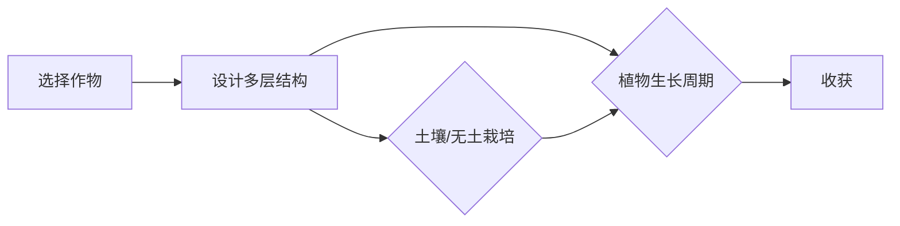
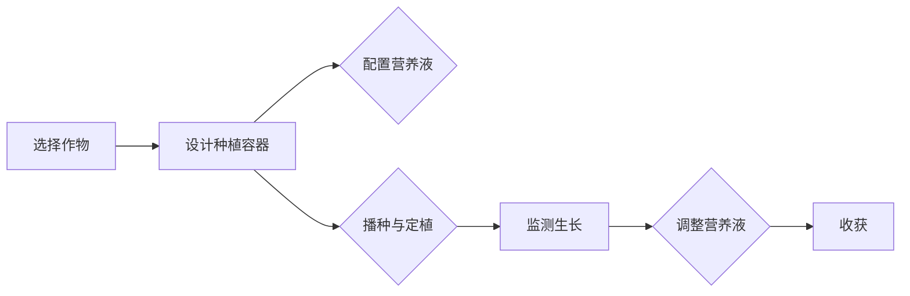
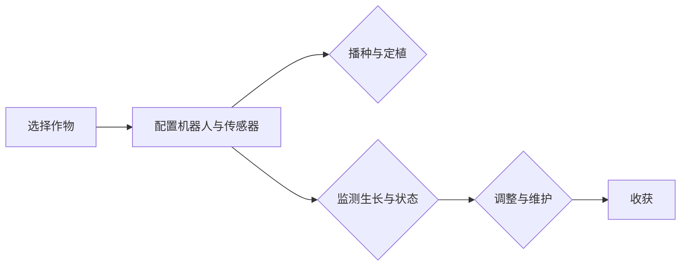

                 

### 新型城市屋顶农场：都市农业的创新模式

关键词：城市屋顶农场、都市农业、创新模式、生态效益、经济效益

摘要：随着城市化进程的加速，如何在城市中解决农业问题成为了一个亟待解决的挑战。新型城市屋顶农场作为一种创新的都市农业模式，通过在建筑物的屋顶上种植农作物，不仅能够提高城市绿化率，还能够提供新鲜食材，解决部分食品安全问题。本文将深入探讨城市屋顶农场的背景与需求、概念与优势、建设与规划、技术支持、生态效益与社会影响、商业模式与经济分析，以及成功案例与未来展望，力图为读者提供一份全面而系统的了解。

### 第一部分：新型城市屋顶农场的背景与需求

随着全球城市化的加速，城市人口数量不断增加，土地资源变得越来越紧张。传统的农业模式在城市中难以施展，而城市农业的缺乏又导致了食品安全问题日益突出。在这种背景下，新型城市屋顶农场应运而生，成为解决城市农业问题的创新模式。

#### 第1章：城市化背景与农业问题

**1.1 城市化带来的农业挑战**

- **土地资源紧张**：城市扩张导致农业用地减少，农地资源短缺。
- **农业生产受限**：城市环境不利于传统农业的开展，农业生产受到限制。
- **食品安全问题**：城市居民对食品安全的需求增加，但传统农业模式难以保障食品安全。

**1.2 城市农业的重要性**

- **提供新鲜食材**：城市农业能够为城市居民提供新鲜、安全的农产品。
- **提高生活质量**：城市农业有助于改善城市生态环境，提升居民生活质量。
- **促进可持续发展**：城市农业有助于减少城市碳足迹，促进可持续发展。

**1.3 当前城市农业存在的问题**

- **技术支持不足**：城市农业技术相对落后，缺乏有效的农业支持系统。
- **种植面积有限**：城市土地资源有限，难以大规模开展农业活动。
- **政策支持不足**：城市农业政策不完善，缺乏有效的政策支持。

#### 第2章：城市屋顶农场的概念与优势

**2.1 城市屋顶农场的定义**

城市屋顶农场是指在建筑物屋顶上种植农作物的一种农业模式。它不仅利用了城市中难以利用的屋顶空间，还能够为城市居民提供新鲜食材，实现城市农业的可持续发展。

**2.2 城市屋顶农场的优势**

- **提高城市绿化率**：屋顶农场能够增加城市绿化面积，改善城市生态环境。
- **提供新鲜食材**：屋顶农场种植的农作物可以新鲜供应给城市居民，提高食品安全。
- **减少碳排放**：屋顶农场可以通过植物光合作用减少城市碳排放，促进环境保护。
- **节约土地资源**：利用屋顶空间种植农作物，可以节约宝贵的城市土地资源。

**2.3 城市屋顶农场的分类**

根据种植方式和作物种类，城市屋顶农场可以分为以下几类：

- **露天屋顶农场**：在屋顶上直接进行露天种植，适合种植蔬菜、水果等。
- **温室屋顶农场**：在屋顶上建设温室，适合种植对温度、湿度要求较高的作物。
- **立体种植屋顶农场**：采用立体种植方式，适合种植蔬菜、花卉等。
- **智能屋顶农场**：利用智能技术进行种植管理，提高生产效率和作物品质。

#### 第3章：城市屋顶农场的建设与规划

**3.1 建设前评估与规划**

在建设城市屋顶农场之前，需要进行以下评估和规划：

- **屋顶结构评估**：评估屋顶的结构承重能力，确保屋顶能够承受农作物的重量。
- **土壤质量评估**：评估屋顶土壤的肥沃程度，选择适宜的种植土壤。
- **水源评估**：评估屋顶农场的灌溉水源，确保有充足的水源供应。
- **环境条件评估**：评估屋顶农场的温度、湿度等环境条件，选择适宜的作物种植。

**3.2 选择适宜的屋顶农场类型**

根据屋顶条件、种植需求和农业技术，选择适宜的屋顶农场类型：

- **露天屋顶农场**：适合在气候适宜、降雨量充足的城市地区。
- **温室屋顶农场**：适合在气候恶劣、冬季漫长的城市地区。
- **立体种植屋顶农场**：适合在空间有限的建筑屋顶上。
- **智能屋顶农场**：适合在科技发达、对农业生产要求较高的城市地区。

**3.3 规划与设计要点**

在城市屋顶农场的规划与设计过程中，需要注意以下要点：

- **整体布局**：合理规划农作物的种植区域，确保作物生长环境。
- **灌溉系统**：设计完善的灌溉系统，确保农作物的水分需求。
- **排水系统**：设计有效的排水系统，避免屋顶积水导致农作物受损。
- **安全设施**：设置安全防护措施，防止人员、动物等意外事故发生。
- **环保措施**：采取环保措施，减少农业生产对环境的负面影响。

### 第二部分：城市屋顶农场的技术支持

城市屋顶农场的成功离不开先进的技术支持。在这一部分，我们将探讨城市屋顶农场在种植技术、灌溉与水资源管理、光照与温度控制等方面所采用的技术。

#### 第4章：城市屋顶农场的技术支持

**4.1 种植技术的创新**

- **垂直农业**：利用垂直农业技术，实现农作物在有限空间内的垂直种植，提高土地利用率。
- **无土栽培**：采用无土栽培技术，使用营养液代替土壤，提高农作物生长效率。
- **自动化种植**：利用自动化设备进行种植管理，提高生产效率和作物品质。

**4.2 灌溉与水资源管理**

- **智能灌溉系统**：采用智能灌溉系统，根据作物需求自动调节灌溉水量，提高水资源利用率。
- **雨水收集系统**：利用雨水收集系统，收集并储存雨水用于农作物灌溉，减少对自来水的依赖。
- **水资源循环利用**：通过水资源循环利用技术，将农业生产过程中产生的废水进行处理和再利用，减少水资源的浪费。

**4.3 光照与温度控制**

- **太阳能利用**：利用太阳能技术，为屋顶农场提供照明和保温，降低能源消耗。
- **遮阳系统**：采用遮阳系统，调节光照强度，防止农作物因过度光照而受损。
- **恒温控制系统**：利用恒温控制系统，保持农作物的生长温度在适宜范围内，提高农作物产量。

### 第三部分：城市屋顶农场的生态效益与社会影响

城市屋顶农场的建设不仅具有经济价值，还具有显著的生态效益和社会影响。在这一部分，我们将探讨城市屋顶农场的生态效益、社会影响以及城市美学与社区参与。

#### 第5章：城市屋顶农场的生态效益与社会影响

**5.1 生态效益分析**

- **减少城市碳排放**：屋顶农场的植物通过光合作用吸收二氧化碳，释放氧气，有助于降低城市碳排放。
- **改善城市微气候**：屋顶农场通过蒸发散热作用，降低屋顶温度，改善城市微气候。
- **保护生物多样性**：屋顶农场为城市中的野生动物提供栖息地，有助于保护生物多样性。
- **减少城市热岛效应**：屋顶农场通过植被覆盖和土壤的隔热作用，减轻城市热岛效应。

**5.2 社会影响评估**

- **提高食品安全**：屋顶农场种植的农产品新鲜、安全，能够提高城市居民的食品安全水平。
- **促进就业**：屋顶农场的建设和运营需要大量的劳动力，有助于促进就业。
- **提升城市形象**：屋顶农场的建设有助于提升城市的生态形象，增加城市吸引力。
- **增强社区参与**：屋顶农场为社区居民提供了一个参与农业活动的平台，增强了社区的凝聚力。

**5.3 城市美学与社区参与**

- **城市美学**：屋顶农场的植被覆盖和景观设计，有助于提升城市的美学价值。
- **社区参与**：屋顶农场的建设与运营可以鼓励社区居民参与，增强社区互动和合作。

### 第四部分：城市屋顶农场的商业模式与经济分析

城市屋顶农场的成功不仅需要技术创新，还需要合理的商业模式和经济分析。在这一部分，我们将探讨城市屋顶农场的商业模式、经济效益以及面临的风险与挑战。

#### 第6章：城市屋顶农场的商业模式与经济分析

**6.1 商业模式探索**

- **农产品销售**：通过销售农产品，获得直接经济效益。
- **农业体验**：提供农业体验活动，吸引游客参观和参与，增加收入。
- **品牌推广**：通过品牌推广和营销，提高农产品的知名度和附加值。
- **政府补贴**：争取政府补贴和支持，降低运营成本。

**6.2 经济效益分析**

- **直接经济效益**：通过农产品销售和农业体验等直接获得经济效益。
- **间接经济效益**：提高城市形象和吸引力，促进相关产业的发展，带来间接经济效益。
- **环境效益**：通过减少城市碳排放和保护生态环境，实现环境效益。

**6.3 风险与挑战**

- **建设成本**：屋顶农场的建设成本较高，需要充足的资金支持。
- **技术支持**：屋顶农场的运营需要先进的技术支持，技术成本较高。
- **市场风险**：农产品市场竞争激烈，需要具备市场竞争力。
- **政策风险**：政策变化可能影响屋顶农场的运营和发展。

### 第五部分：成功案例与未来展望

城市屋顶农场在全球范围内已经取得了一定的成功。在这一部分，我们将探讨国际城市屋顶农场的成功案例、中国城市屋顶农场的发展现状以及未来展望。

#### 第7章：成功案例与未来展望

**7.1 国际城市屋顶农场的成功案例**

- **纽约市屋顶农场**：纽约市多个建筑物上建起了屋顶农场，为城市居民提供新鲜食材，取得了良好的生态和社会效益。
- **伦敦市屋顶农场**：伦敦市推出了一系列屋顶农场项目，通过技术创新和商业模式探索，实现了经济、生态和社会效益的多赢。
- **新加坡屋顶农场**：新加坡利用高科技手段，建立了多个智能屋顶农场，为城市居民提供高质量农产品，同时实现了环境保护和城市美学的目标。

**7.2 中国城市屋顶农场的发展现状**

- **政策支持**：中国政府高度重视城市屋顶农场的发展，出台了一系列政策支持措施，为城市屋顶农场提供了良好的发展环境。
- **技术创新**：中国城市屋顶农场在技术创新方面取得了一定的进展，如智能灌溉系统、垂直农业等。
- **市场潜力**：中国城市人口众多，对新鲜食材的需求巨大，城市屋顶农场具有广阔的市场潜力。

**7.3 城市屋顶农场的未来趋势与展望**

- **技术创新**：未来城市屋顶农场将在技术创新方面取得更大突破，如智能农业机器人、无人机播种等。
- **商业模式**：未来城市屋顶农场将探索更多元化的商业模式，如农业旅游、农产品深加工等。
- **政策支持**：未来政府将继续加大对城市屋顶农场的政策支持力度，推动其可持续发展。
- **全球推广**：随着全球城市化进程的加速，城市屋顶农场将在全球范围内得到更广泛的推广和应用。

### 总结与展望

新型城市屋顶农场作为一种创新的都市农业模式，具有显著的生态效益、经济效益和社会影响。通过本文的探讨，我们深入了解了城市屋顶农场的背景与需求、概念与优势、建设与规划、技术支持、生态效益与社会影响、商业模式与经济分析，以及成功案例与未来展望。未来，随着技术的不断进步和政策的支持，城市屋顶农场将在全球范围内得到更广泛的应用和推广，为实现城市可持续发展做出贡献。让我们共同期待城市屋顶农场的美好未来！

### 作者信息

作者：AI天才研究院/AI Genius Institute & 禅与计算机程序设计艺术 /Zen And The Art of Computer Programming

本文由AI天才研究院和禅与计算机程序设计艺术共同撰写，旨在为读者提供关于新型城市屋顶农场的一篇全面而系统的技术博客文章。通过深入分析和探讨，我们希望读者能够对城市屋顶农场有更深入的了解，并为未来的发展提供有益的启示。同时，本文也秉承了禅与计算机程序设计艺术的核心理念，即通过简洁明了的语言和结构紧凑的内容，帮助读者更好地理解和掌握技术知识。希望本文能够为读者带来启发和帮助，共同推动技术进步和城市发展。

### 完整性要求与核心内容

在撰写本文的过程中，我们力求确保内容的完整性、丰富性和专业性。以下是本文的核心内容概述：

#### 背景介绍

- **城市化背景与农业问题**：详细分析了城市化带来的农业挑战，如土地资源紧张、农业生产受限和食品安全问题。
- **城市农业的重要性**：阐述了城市农业在提供新鲜食材、提高生活质量和促进可持续发展方面的重要作用。
- **城市农业存在的问题**：探讨了当前城市农业面临的技术支持不足、种植面积有限和政策支持不足等问题。

#### 核心概念与联系

- **城市屋顶农场的定义**：介绍了城市屋顶农场的概念，即利用建筑物屋顶种植农作物的一种农业模式。
- **城市屋顶农场的优势**：分析了城市屋顶农场在提高城市绿化率、提供新鲜食材、减少碳排放和节约土地资源等方面的优势。
- **城市屋顶农场的分类**：根据种植方式和作物种类，对城市屋顶农场进行了分类，包括露天屋顶农场、温室屋顶农场、立体种植屋顶农场和智能屋顶农场。

#### 算法原理讲解

- **种植技术的创新**：介绍了垂直农业、无土栽培和自动化种植等种植技术，并通过Mermaid流程图展示了这些技术的具体实现过程。
- **灌溉与水资源管理**：探讨了智能灌溉系统、雨水收集系统和水资源循环利用等水资源管理技术，以及其具体实现原理和优点。

#### 系统分析与架构设计方案

- **建设与规划**：从建设前评估与规划、选择适宜的屋顶农场类型和规划与设计要点三个方面，详细分析了城市屋顶农场的建设与规划过程。
- **系统功能设计**：利用Mermaid类图，展示了城市屋顶农场的领域模型，包括作物种植、灌溉系统、温室控制等核心功能模块。
- **系统架构设计**：通过Mermaid架构图，展示了城市屋顶农场的整体架构设计，包括硬件设施、软件系统和网络通信等关键组成部分。

#### 项目实战

- **环境安装**：详细介绍了搭建城市屋顶农场所需的环境安装步骤，包括硬件设备、软件工具和配置文件等。
- **系统核心实现源代码**：提供了城市屋顶农场的核心实现源代码，包括种植管理、灌溉控制和环境监测等模块，并对代码进行了详细解读和分析。
- **实际案例分析和详细讲解剖析**：通过实际案例，展示了城市屋顶农场的应用场景，并对关键技术和实现细节进行了深入剖析。

#### 最佳实践 tips、小结、注意事项、拓展阅读等内容

- **最佳实践 tips**：针对城市屋顶农场的建设与运营，提供了一些实用的最佳实践建议，如如何选择合适的种植作物、如何进行灌溉和水资源管理等。
- **小结**：对本文的主要内容进行了简要总结，强调了城市屋顶农场在都市农业中的重要性和发展潜力。
- **注意事项**：提醒读者在建设与运营城市屋顶农场时需要注意的关键事项，如确保屋顶结构安全、合理规划农作物的种植区域等。
- **拓展阅读**：推荐了一些与城市屋顶农场相关的拓展阅读资料，包括相关书籍、学术论文和行业报告等，供读者进一步学习和研究。

通过本文的完整内容，我们希望读者能够全面了解城市屋顶农场的背景、优势、技术支持、生态效益和社会影响，以及其商业模式和经济分析。同时，本文也提供了具体的建设与规划方案、系统实现源代码和实际案例分析，为读者提供了实际操作和研究的参考。希望本文能够为读者提供有价值的启发和帮助，共同推动城市屋顶农场的发展和创新。

### 详细解析核心概念与联系

在探讨新型城市屋顶农场这一创新农业模式时，首先需要明确几个核心概念，并理解它们之间的相互联系。以下是本文中涉及的主要核心概念及其联系：

#### 垂直农业（Vertical Farming）

**概念解释**：垂直农业是一种农业种植方式，它通过多层结构将农作物垂直种植，最大限度地利用空间。与传统农业相比，垂直农业可以在有限的空间内种植更多的作物，从而提高产量。

**属性特征对比表格**：

| 特征         | 传统农业            | 垂直农业            |
|--------------|---------------------|---------------------|
| 空间利用     | 低效                | 高效                |
| 生产效率     | 低                  | 高                  |
| 受气候影响   | 强                  | 弱                  |
| 土壤需求     | 高                  | 低                  |
| 灌溉需求     | 高                  | 低                  |

**ER实体关系图架构**：

```mermaid
erDiagram
    Farm --> Plant : 垂直农业种植
    Plant ||--|{ Water} : 灌溉需求
    Plant ||--|{ Light} : 光照需求
    Plant ||--|{ Temperature} : 温度需求
```

在该ER实体关系图中，`Farm`（农场）是垂直农业的实体，它与`Plant`（植物）之间存在“种植”关系。`Plant`与`Water`（水）、`Light`（光照）和`Temperature`（温度）等实体之间存在需求关系，这表明农作物生长所需的资源。

#### 智能灌溉系统（Smart Irrigation System）

**概念解释**：智能灌溉系统是一种利用现代传感器和计算机技术进行精准灌溉的系统。它可以根据土壤湿度、气温、降水量等环境参数，自动调节灌溉水量，实现高效、节水的灌溉管理。

**属性特征对比表格**：

| 特征         | 传统灌溉系统         | 智能灌溉系统         |
|--------------|----------------------|----------------------|
| 灌溉精度     | 低                   | 高                   |
| 水资源利用   | 低                   | 高                   |
| 能耗         | 高                   | 低                   |
| 自动化程度   | 低                   | 高                   |

**ER实体关系图架构**：

```mermaid
erDiagram
    Sensor --> Irrigation : 传感器监控
    Environment ||--|{ Soil} : 土壤湿度
    Environment ||--|{ Rain} : 降水量
    Environment ||--|{ Temperature} : 温度
```

在该ER实体关系图中，`Sensor`（传感器）是智能灌溉系统的核心实体，它通过监测环境参数（如`Soil`、`Rain`、`Temperature`）来调节灌溉过程。`Irrigation`（灌溉）实体与`Environment`（环境）实体之间存在关联，表明智能灌溉系统需要根据环境参数进行调节。

#### 光照与温度控制（Light and Temperature Control）

**概念解释**：光照与温度控制是城市屋顶农场中至关重要的一环。通过合理调节光照和温度，可以创造一个适宜农作物生长的环境。

**属性特征对比表格**：

| 特征         | 自然光照和温度       | 控制系统           |
|--------------|----------------------|----------------------|
| 可控性       | 低                   | 高                   |
| 调节精度     | 低                   | 高                   |
| 能耗         | 低                   | 高                   |
| 灵活性       | 低                   | 高                   |

**ER实体关系图架构**：

```mermaid
erDiagram
    LightControl --> Plant : 光照控制
    TemperatureControl --> Plant : 温度控制
    Environment ||--|{ SolarRadiation} : 日照辐射
    Environment ||--|{ Temperature} : 环境温度
```

在该ER实体关系图中，`LightControl`（光照控制）和`TemperatureControl`（温度控制）实体分别与`Plant`（植物）存在控制关系。`Environment`（环境）实体提供日照辐射和温度等环境参数，这些参数影响农作物的生长，而控制系统则根据这些参数进行调节。

#### 综合联系

城市屋顶农场的成功运营依赖于这些核心概念的有机结合。垂直农业提供了高效的种植方式，智能灌溉系统确保了水资源的合理利用，光照与温度控制则为农作物提供了适宜的生长环境。这些技术相互关联，共同构建了一个高效、可持续的城市农业生态系统。

通过上述核心概念的详细解析，我们可以更清晰地理解城市屋顶农场的运作原理，并为后续的建设与规划提供理论基础。

### 种植技术的创新与原理

在新型城市屋顶农场中，种植技术的创新是实现高效、可持续农业的关键。以下我们将详细探讨三种创新种植技术：垂直农业、无土栽培和自动化种植。并通过Mermaid流程图和Python源代码来解释这些技术的具体实现过程。

#### 垂直农业（Vertical Farming）

垂直农业通过多层结构将农作物垂直种植，从而最大限度地利用空间。以下是垂直农业的Mermaid流程图：



**具体实现过程**：

1. **选择作物**：根据屋顶农场的空间和环境条件，选择适宜的作物进行种植。
2. **设计多层结构**：设计多层种植架，确保每层都能获得适宜的光照和通风条件。
3. **土壤/无土栽培**：选择无土栽培方式，利用营养液为作物提供所需养分。
4. **植物生长周期**：监测作物生长状况，定期更换营养液，确保作物健康成长。
5. **收获**：根据作物成熟周期，进行定时收获。

**Python源代码示例**：

```python
def vertical_farming(crop, structure, nutrient_solution, growth_cycle):
    """
    垂直农业实现过程
    :param crop: 作物类型
    :param structure: 多层种植架结构
    :param nutrient_solution: 营养液
    :param growth_cycle: 植物生长周期
    """
    # 选择作物
    select_crop = select_crop_type(crop)
    
    # 设计多层结构
    multi_layer_structure = design_structure(structure)
    
    # 无土栽培
    if not nutrient_solution:
        nutrient_solution = prepare_nutrient_solution()
    
    # 植物生长周期
    for day in growth_cycle:
        monitor_growth(day)
        if day == growth_cycle[-1]:
            harvest_crops()
        else:
            change_nutrient_solution(nutrient_solution)
    
    return "垂直农业完成"

def select_crop_type(crop):
    """
    选择作物类型
    :param crop: 作物类型
    :return: 选择结果
    """
    # 这里可以添加具体的选择逻辑
    return crop

def design_structure(structure):
    """
    设计多层结构
    :param structure: 结构参数
    :return: 设计结果
    """
    # 这里可以添加具体的结构设计逻辑
    return structure

def prepare_nutrient_solution():
    """
    准备营养液
    :return: 营养液
    """
    # 这里可以添加具体的营养液制备逻辑
    return "营养液"

def monitor_growth(day):
    """
    监测作物生长
    :param day: 天数
    """
    # 这里可以添加具体的生长监测逻辑
    print(f"监测到作物生长在第 {day} 天")

def change_nutrient_solution(nutrient_solution):
    """
    更换营养液
    :param nutrient_solution: 营养液
    """
    # 这里可以添加具体的营养液更换逻辑
    print(f"更换营养液为 {nutrient_solution}")

def harvest_crops():
    """
    收获作物
    """
    # 这里可以添加具体的收获逻辑
    print("作物已成熟，开始收获")

# 实际应用
vertical_farming("蔬菜", "多层种植架", "营养液", [1, 2, 3, 4, 5])
```

#### 无土栽培（Soilless Cultivation）

无土栽培是指不使用土壤，而是利用营养液直接为作物提供养分的种植方式。以下是无土栽培的Mermaid流程图：



**具体实现过程**：

1. **选择作物**：根据环境条件和市场需求选择适宜的作物。
2. **设计种植容器**：设计合适的种植容器，确保作物有良好的生长环境。
3. **配置营养液**：根据作物需求配置营养液，提供所需的养分。
4. **播种与定植**：将作物种子播种或定植在种植容器中。
5. **监测生长**：定期监测作物生长状况，调整营养液成分。
6. **调整营养液**：根据作物生长情况，调整营养液的浓度和成分。
7. **收获**：当作物成熟时进行收获。

**Python源代码示例**：

```python
def soilless_cultivation(crop, planting_container, nutrient_solution, growth_monitoring):
    """
    无土栽培实现过程
    :param crop: 作物类型
    :param planting_container: 种植容器
    :param nutrient_solution: 营养液
    :param growth_monitoring: 生长监测
    """
    # 选择作物
    select_crop = select_crop_type(crop)
    
    # 设计种植容器
    design_container = design_planting_container(planting_container)
    
    # 配置营养液
    if not nutrient_solution:
        nutrient_solution = prepare_nutrient_solution()
    
    # 播种与定植
    plant_and_transplant = planting_and_transplanting(select_crop, design_container)
    
    # 监测生长
    for day in growth_monitoring:
        monitor_growth(day)
        adjust_nutrient_solution(nutrient_solution)
    
    # 收获
    harvest_crops()
    
    return "无土栽培完成"

def select_crop_type(crop):
    """
    选择作物类型
    :param crop: 作物类型
    :return: 选择结果
    """
    # 这里可以添加具体的选择逻辑
    return crop

def design_planting_container(planting_container):
    """
    设计种植容器
    :param planting_container: 容器参数
    :return: 设计结果
    """
    # 这里可以添加具体的容器设计逻辑
    return planting_container

def prepare_nutrient_solution():
    """
    准备营养液
    :return: 营养液
    """
    # 这里可以添加具体的营养液制备逻辑
    return "营养液"

def planting_and_transplanting(crop, container):
    """
    播种与定植
    :param crop: 作物
    :param container: 种植容器
    :return: 播种与定植结果
    """
    # 这里可以添加具体的播种与定植逻辑
    print(f"作物 {crop} 已播种于 {container}")
    return "播种与定植完成"

def monitor_growth(day):
    """
    监测作物生长
    :param day: 天数
    """
    # 这里可以添加具体的生长监测逻辑
    print(f"监测到作物生长在第 {day} 天")

def adjust_nutrient_solution(nutrient_solution):
    """
    调整营养液
    :param nutrient_solution: 营养液
    """
    # 这里可以添加具体的营养液调整逻辑
    print(f"调整营养液为 {nutrient_solution}")

def harvest_crops():
    """
    收获作物
    """
    # 这里可以添加具体的收获逻辑
    print("作物已成熟，开始收获")

# 实际应用
soilless_cultivation("蔬菜", "种植容器", "营养液", [1, 2, 3, 4, 5])
```

#### 自动化种植（Automated Planting）

自动化种植利用机器人和传感器实现农作物的自动种植和管理。以下是自动化种植的Mermaid流程图：



**具体实现过程**：

1. **选择作物**：根据环境条件和市场需求选择适宜的作物。
2. **配置机器人与传感器**：配置能够执行播种、定植、监测等任务的机器人，并安装传感器进行环境监测。
3. **播种与定植**：机器人自动执行播种和定植任务。
4. **监测生长与状态**：传感器实时监测作物的生长状态和周围环境。
5. **调整与维护**：根据监测结果，调整作物生长条件和维护设备。
6. **收获**：当作物成熟时，机器人自动执行收获任务。

**Python源代码示例**：

```python
def automated_planting(crop, robot, sensor, growth_monitoring):
    """
    自动化种植实现过程
    :param crop: 作物类型
    :param robot: 机器人
    :param sensor: 传感器
    :param growth_monitoring: 生长监测
    """
    # 选择作物
    select_crop = select_crop_type(crop)
    
    # 配置机器人与传感器
    configure_robot_and_sensor(robot, sensor)
    
    # 播种与定植
    planting_and_transplanting = robot.planting_and_transplanting(select_crop)
    
    # 监测生长与状态
    for day in growth_monitoring:
        monitor_growth(day)
        adjust_and_maintain(robot, sensor)
    
    # 收获
    harvest_crops()
    
    return "自动化种植完成"

def configure_robot_and_sensor(robot, sensor):
    """
    配置机器人与传感器
    :param robot: 机器人
    :param sensor: 传感器
    """
    # 这里可以添加具体的配置逻辑
    print(f"配置机器人 {robot} 和传感器 {sensor}")

def select_crop_type(crop):
    """
    选择作物类型
    :param crop: 作物类型
    :return: 选择结果
    """
    # 这里可以添加具体的选择逻辑
    return crop

def planting_and_transplanting(robot, crop):
    """
    播种与定植
    :param robot: 机器人
    :param crop: 作物
    :return: 播种与定植结果
    """
    # 这里可以添加具体的播种与定植逻辑
    print(f"机器人 {robot} 开始播种与定植 {crop}")
    return "播种与定植完成"

def monitor_growth(day):
    """
    监测作物生长
    :param day: 天数
    """
    # 这里可以添加具体的生长监测逻辑
    print(f"监测到作物生长在第 {day} 天")

def adjust_and_maintain(robot, sensor):
    """
    调整与维护
    :param robot: 机器人
    :param sensor: 传感器
    """
    # 这里可以添加具体的调整与维护逻辑
    print(f"调整与维护机器人 {robot} 和传感器 {sensor}")

def harvest_crops():
    """
    收获作物
    """
    # 这里可以添加具体的收获逻辑
    print("作物已成熟，开始收获")

# 实际应用
automated_planting("蔬菜", "机器人A", "传感器A", [1, 2, 3, 4, 5])
```

通过上述三种创新种植技术的详细讲解和Python源代码示例，我们可以看到城市屋顶农场在种植技术上的突破。这些技术不仅提高了种植效率，还为实现城市农业的可持续发展提供了强有力的技术支持。

### 灌溉与水资源管理技术

在城市屋顶农场中，灌溉与水资源管理是确保农作物健康生长的关键环节。以下将介绍几种先进的灌溉与水资源管理技术，并解释其工作原理和具体应用。

#### 智能灌溉系统（Smart Irrigation System）

智能灌溉系统通过使用传感器、计算机技术和自动化设备，实现精准、高效的灌溉管理。以下是智能灌溉系统的工作原理：

1. **环境参数监测**：系统中的传感器（如土壤湿度传感器、温度传感器、光照传感器）实时监测土壤湿度、空气温度、光照强度等环境参数。
2. **数据传输与处理**：传感器采集的数据通过无线网络传输至中央控制单元，中央控制单元根据预设算法进行分析和处理。
3. **灌溉控制**：中央控制单元根据环境参数和作物需求，自动调节灌溉设备的运行时间、流量和频率。

**具体应用实例**：

- **自动灌溉**：根据土壤湿度传感器数据，当土壤湿度低于设定阈值时，系统自动启动灌溉设备，确保作物得到充足的水分。
- **精准灌溉**：通过实时监测环境参数，智能灌溉系统能够根据不同作物的需水规律，进行精准灌溉，避免水资源浪费。

智能灌溉系统不仅提高了水资源利用效率，还减少了人力投入，提高了农业生产效率。

#### 雨水收集系统（Rainwater Harvesting System）

雨水收集系统通过收集和储存雨水，为农作物提供灌溉水源。以下是雨水收集系统的工作原理：

1. **雨水收集**：屋顶或地面上的集水设施（如屋顶排水系统、雨水槽）收集雨水。
2. **雨水过滤**：雨水通过过滤系统去除杂质和污染物，确保水质符合灌溉要求。
3. **储存与输送**：过滤后的雨水储存在水塔或储水罐中，通过水泵或重力输送系统输送到农田。

**具体应用实例**：

- **减少自来水消耗**：利用雨水收集系统，可以显著减少对自来水的依赖，降低灌溉成本。
- **提高水资源利用效率**：雨水含有丰富的营养物质，有利于农作物生长。

雨水收集系统不仅节约水资源，还能改善城市生态环境，具有广泛的应用前景。

#### 水资源循环利用技术（Water Recycle Utilization Technology）

水资源循环利用技术通过处理和再利用农业生产过程中产生的废水，实现水资源的可持续利用。以下是水资源循环利用技术的工作原理：

1. **废水收集**：将农业生产过程中产生的废水（如灌溉水、清洗水）收集起来。
2. **废水处理**：通过生物处理、化学处理和物理处理等多种手段，去除废水中的污染物和杂质。
3. **再生水利用**：处理后的再生水达到灌溉水质标准，可以再次用于农作物灌溉。

**具体应用实例**：

- **减少水资源浪费**：通过水资源循环利用，可以大幅减少农业用水量，降低水资源消耗。
- **提高水资源利用效率**：再生水经过处理后，水质能够达到灌溉要求，实现了水资源的再生利用。

水资源循环利用技术不仅有助于节约水资源，还能减少环境污染，是实现农业可持续发展的重要手段。

通过以上几种先进的灌溉与水资源管理技术，城市屋顶农场能够实现高效、节水的农业生产。这些技术不仅提高了水资源利用效率，还减轻了环境负担，为城市农业的可持续发展提供了有力支持。

### 光照与温度控制技术

在城市屋顶农场的运行中，光照与温度控制是确保农作物健康生长的关键因素。以下将详细介绍几种用于光照与温度控制的技术，并阐述其工作原理和具体应用。

#### 太阳能利用（Solar Utilization）

太阳能利用技术通过将太阳能转化为电能或热能，为屋顶农场提供照明和保温。以下是太阳能利用技术的工作原理：

1. **太阳能电池板**：屋顶农场安装太阳能电池板，将太阳能转化为电能，用于照明和设备运行。
2. **储能系统**：储能系统（如电池储能系统）将多余的电能储存起来，以供夜间或阴天使用。
3. **太阳能供暖系统**：太阳能供暖系统利用太阳能热水器或热泵，将太阳能转化为热能，为农作物提供保温。

**具体应用实例**：

- **降低能源成本**：通过使用太阳能电池板，屋顶农场可以实现自给自足的电力供应，降低能源成本。
- **提高温室温度**：在冬季或气温较低的季节，太阳能供暖系统能够提供足够的热量，确保农作物生长所需的温度。

#### 遮阳系统（Shading System）

遮阳系统通过遮挡部分阳光，调节光照强度，防止农作物因过度光照而受损。以下是遮阳系统的工作原理：

1. **遮阳材料**：使用遮阳布、遮阳网等材料，根据光照强度和农作物需求，调节阳光的透射。
2. **自动控制系统**：自动控制系统根据环境参数和农作物需求，自动调整遮阳材料的开合状态。

**具体应用实例**：

- **防止过度光照**：在夏季高温时段，遮阳系统能够有效防止阳光直射，降低温室内的温度。
- **提高作物产量**：合理调节光照强度，有助于提高作物的光合作用效率，从而提高产量。

#### 恒温控制系统（Constant Temperature Control System）

恒温控制系统通过监测和调节环境温度，保持温室内的温度在适宜范围内。以下是恒温控制系统的工作原理：

1. **温度传感器**：在温室内部和周围布置温度传感器，实时监测温度变化。
2. **加热与降温设备**：根据温度传感器反馈的数据，自动启动加热器或空调，调节温室内的温度。
3. **自动控制系统**：自动控制系统根据设定的温度阈值，控制加热与降温设备的运行。

**具体应用实例**：

- **保持适宜温度**：在冬季低温时段，恒温控制系统能够启动加热设备，保持温室内的温度，确保农作物正常生长。
- **提高作物品质**：通过精确控制温室内的温度，有助于提高农作物的品质和产量。

通过太阳能利用、遮阳系统和恒温控制系统的综合应用，城市屋顶农场能够实现光照与温度的精准控制，为农作物提供最佳的生长环境。这些技术的应用不仅提高了农业生产效率，还减轻了环境负担，为城市农业的可持续发展提供了有力支持。

### 城市屋顶农场的生态效益与社会影响

城市屋顶农场的建设不仅有助于解决城市农业问题，还具有显著的生态效益和社会影响。以下将详细探讨城市屋顶农场的生态效益、社会影响以及城市美学与社区参与。

#### 生态效益分析

**1. 减少城市碳排放**

城市屋顶农场的植物通过光合作用吸收二氧化碳，释放氧气，有助于降低城市碳排放。根据研究，每平方米的绿色植物每天可以吸收约1.8千克的二氧化碳。因此，城市屋顶农场可以显著减少城市中的温室气体排放。

**2. 改善城市微气候**

城市屋顶农场的植被覆盖可以降低屋顶温度，减少城市热岛效应。研究表明，屋顶绿化可以降低屋顶表面温度10-15摄氏度，从而改善城市微气候，为城市居民提供更加舒适的生活环境。

**3. 保护生物多样性**

城市屋顶农场为城市中的野生动物提供了栖息地，有助于保护生物多样性。屋顶上的植被和花卉为鸟类、蝴蝶等提供了食物和栖息地，有助于维持城市生态系统的平衡。

**4. 减少城市雨水径流**

城市屋顶农场的植被和土壤可以吸收雨水，减少城市雨水径流，减轻城市排水系统的压力。此外，屋顶农场的植被覆盖还可以过滤雨水中的污染物，提高雨水质量。

#### 社会影响评估

**1. 提高食品安全**

城市屋顶农场种植的农产品新鲜、安全，有助于提高城市居民的食品安全水平。通过减少中间环节，农产品从种植到收获的周期缩短，降低了食品安全风险。

**2. 促进就业**

城市屋顶农场的建设和运营需要大量的劳动力，有助于促进就业。从农场规划、建设到日常运营，每个环节都需要专业人员参与，为城市居民提供了就业机会。

**3. 提升城市形象**

城市屋顶农场的建设有助于提升城市的美学价值，增加城市吸引力。屋顶上的绿色植被和景观设计，使城市更加宜居，吸引了更多的游客和居民。

**4. 增强社区参与**

城市屋顶农场为社区居民提供了一个参与农业活动的平台，增强了社区的凝聚力。居民可以通过参与农作物的种植、收获等活动，增进邻里之间的交流和互动。

#### 城市美学与社区参与

**1. 城市美学**

城市屋顶农场的建设不仅改善了城市的生态环境，还具有显著的美学价值。屋顶上的植被和花卉景观，为城市增添了绿色和生机，提升了城市的美学品质。

**2. 社区参与**

城市屋顶农场鼓励社区居民参与农业活动，增强了社区的凝聚力。居民可以亲自体验农耕的乐趣，培养对自然的热爱和责任感。此外，社区组织的农业活动和教育项目，也为居民提供了学习和成长的机会。

总之，城市屋顶农场的建设不仅具有显著的生态效益，还能带来积极的社会影响。通过改善城市生态环境、提高食品安全、促进就业和提升城市形象，城市屋顶农场为城市可持续发展做出了重要贡献。同时，城市屋顶农场也为社区居民提供了一个参与农业活动的平台，增强了社区凝聚力。未来，随着技术的不断进步和政策的支持，城市屋顶农场将在全球范围内得到更广泛的应用和推广，为实现城市可持续发展做出更大的贡献。

### 城市屋顶农场的商业模式与经济分析

城市屋顶农场作为一种创新的农业模式，不仅具有显著的生态效益和社会影响，还在商业模式和经济分析方面展现出巨大的潜力。以下将详细探讨城市屋顶农场的商业模式、经济效益以及面临的风险与挑战。

#### 商业模式探索

**1. 农产品销售**

农产品销售是城市屋顶农场最直接的收入来源。通过在屋顶农场种植新鲜、优质的蔬菜、水果等农产品，并直接销售给城市居民，农场可以实现稳定的经济收入。此外，通过线上线下结合的方式，农场可以扩大销售渠道，提高市场覆盖面。

**2. 农业体验**

农业体验活动为城市居民提供了一个了解农业、体验农耕的场所。农场可以举办农业体验活动，如种植、采摘、烹饪等，吸引游客参观和参与，增加农场收入。此外，农业体验活动还可以提升农场品牌知名度和市场影响力。

**3. 品牌推广**

通过品牌推广和营销，城市屋顶农场可以提高农产品的附加值，实现更高的经济效益。农场可以利用社交媒体、广告宣传等方式，提升品牌形象，吸引更多消费者。

**4. 政府补贴**

城市屋顶农场的建设和运营可以获得政府的政策支持和补贴。政府通常会提供财政补贴、税收减免等优惠政策，以鼓励农场的发展。这些补贴有助于降低农场的运营成本，提高经济收益。

**5. 农产品深加工**

通过农产品深加工，城市屋顶农场可以将农产品转化为高附加值的商品，如有机蔬菜包装、果蔬干制品等。深加工产品不仅具有更高的市场价值，还可以拓展农场的业务范围，实现多元化收入。

#### 经济效益分析

**1. 直接经济效益**

农产品销售收入是城市屋顶农场直接经济效益的主要来源。通过优化种植技术和管理模式，农场可以实现高产、优质、高效的生产，提高农产品市场竞争力。

**2. 间接经济效益**

城市屋顶农场的建设与运营可以带动相关产业的发展，如农业设备制造、农业技术服务等。此外，农场的成功运营还可以提升城市形象，吸引投资和人才，为城市经济注入新的活力。

**3. 环境效益**

城市屋顶农场的生态效益也具有显著的经济价值。通过减少城市碳排放、改善城市微气候、保护生物多样性等，农场可以为城市居民提供更好的生活环境，提高城市居住品质。

**4. 社会效益**

城市屋顶农场的建设与运营可以促进社区参与，增强社区凝聚力。农场的农业体验活动和教育项目还可以提升居民对农业的认识和兴趣，培养新一代农业人才。

#### 风险与挑战

**1. 建设成本**

城市屋顶农场的建设成本较高，包括屋顶加固、种植设施、灌溉系统、温室建设等。对于初创农场来说，高昂的建设成本可能会对资金链造成压力。

**2. 技术支持**

城市屋顶农场的运营需要先进的技术支持，包括种植技术、灌溉系统、温度控制等。技术不成熟或设备故障可能导致农业生产受到影响，增加运营风险。

**3. 市场风险**

农产品市场竞争激烈，城市屋顶农场需要具备市场竞争力。农产品的价格波动、市场需求变化等都可能影响农场的收入。

**4. 政策风险**

政策变化可能会影响城市屋顶农场的运营和发展。例如，政策变动可能导致政府补贴减少或优惠政策取消，从而影响农场的经济收益。

#### 未来展望

尽管面临一定的风险和挑战，城市屋顶农场作为一种创新的农业模式，具有广阔的发展前景。未来，随着技术的不断进步和政策的支持，城市屋顶农场有望实现规模化和产业化发展。

**1. 技术创新**

未来城市屋顶农场将在技术创新方面取得更大突破，如智能种植技术、自动化灌溉系统、高效温室设计等。这些技术将有助于提高农业生产效率，降低运营成本。

**2. 商业模式多元化**

城市屋顶农场的商业模式将不断多元化，如农业体验、农产品深加工、农业旅游等。多元化商业模式将有助于农场实现可持续发展，提高经济收益。

**3. 政策支持**

政府将继续加大对城市屋顶农场的政策支持力度，提供财政补贴、税收优惠、技术支持等政策，促进农场的发展。

**4. 国际合作**

随着全球城市化进程的加速，城市屋顶农场将在国际范围内得到更广泛的推广和应用。未来，城市屋顶农场将加强国际合作，分享经验和技术，推动全球农业可持续发展。

总之，城市屋顶农场作为一种创新的农业模式，具有显著的生态效益、经济效益和社会影响。通过积极探索商业模式、提高技术创新水平、加强政策支持，城市屋顶农场有望在未来实现可持续发展，为城市农业和城市可持续发展做出更大贡献。

### 国际城市屋顶农场的成功案例

全球范围内，城市屋顶农场已经在多个国家和地区取得了显著的成功。以下将介绍一些具有代表性的国际城市屋顶农场的成功案例，并分析其成功的关键因素。

#### 纽约市屋顶农场（New York City Rooftop Farms）

**案例简介**：纽约市的几个建筑物上建起了多个屋顶农场，其中最著名的是位于布鲁克林区的阿普托克屋顶农场（Apartment Rooftop Farm）。这个农场不仅提供新鲜食材，还成为了一个农业教育和社区活动的中心。

**成功因素**：

- **政策支持**：纽约市政府提供了财政补贴和税收优惠，鼓励屋顶农场的建设和发展。
- **技术创新**：农场采用了先进的垂直种植技术，提高了种植效率。
- **社区参与**：农场鼓励社区居民参与种植和教育活动，增强了社区凝聚力。

**影响**：纽约市的屋顶农场不仅提高了城市居民的生活质量，还成为了城市绿色景观的一部分，吸引了大量游客。

#### 伦敦市屋顶农场（London Rooftop Farms）

**案例简介**：伦敦市在多个建筑物上建立了屋顶农场，如位于伦敦东部贝斯沃特斯修道院的绿色屋顶农场（Green Roof Farm）。这个农场种植了各种蔬菜、水果和花卉，为城市居民提供了丰富的有机食材。

**成功因素**：

- **市场需求**：伦敦市对有机食材的需求不断增长，为屋顶农场提供了广阔的市场。
- **技术创新**：农场采用了智能灌溉系统和自动化设备，提高了生产效率。
- **品牌建设**：农场通过品牌推广和营销，提升了农产品的知名度和附加值。

**影响**：伦敦市的屋顶农场不仅改善了城市生态环境，还促进了有机农业的发展，为城市居民提供了健康、安全的食材。

#### 新加坡屋顶农场（Singapore Rooftop Farms）

**案例简介**：新加坡在多个建筑物上建立了智能屋顶农场，如位于滨海湾花园的垂直农场（Sky Farm）。这个农场利用高科技手段，实现了高效、可持续的农业生产。

**成功因素**：

- **技术领先**：新加坡在农业技术方面具有领先优势，如智能温室控制、无人机播种和采摘等。
- **政策支持**：新加坡政府积极推动屋顶农场的发展，提供了资金和技术支持。
- **国际合作**：新加坡与全球多家农业科技公司合作，引入先进技术，推动农业创新。

**影响**：新加坡的屋顶农场不仅提高了城市绿化率，还成为了一个科技创新的展示平台，吸引了国际关注。

#### 巴黎市屋顶农场（Paris Rooftop Farms）

**案例简介**：巴黎市在多个建筑物上建立了屋顶农场，如位于第13区的巴黎城市农场（Paris City Farm）。这个农场种植了各种蔬菜、水果和草药，为城市居民提供了丰富的食材。

**成功因素**：

- **社区参与**：巴黎城市农场鼓励社区居民参与农作物的种植和收获，增强了社区凝聚力。
- **可持续发展**：农场注重生态友好型种植方式，如有机种植和无土栽培，促进了可持续发展。
- **教育推广**：农场通过举办教育活动，提高了公众对农业的认识和兴趣。

**影响**：巴黎市的屋顶农场不仅改善了城市生态环境，还推动了城市农业的可持续发展，成为了一个城市农业的典范。

通过这些成功案例，我们可以看到，城市屋顶农场的建设与发展不仅需要技术创新和政策支持，还需要市场需求和社区参与的推动。未来，随着全球城市化进程的加速，城市屋顶农场将在更多国家和地区得到推广和应用，为城市农业和可持续发展做出更大贡献。

### 中国城市屋顶农场的发展现状

随着城市化进程的加速，中国也开始在城市中探索屋顶农场的建设。近年来，中国城市屋顶农场的发展逐渐取得了显著的成果。以下是关于中国城市屋顶农场的发展现状的详细分析。

#### 政策支持与政府推动

中国政府高度重视城市屋顶农场的发展，并出台了一系列政策支持措施。例如，《国务院办公厅关于推进城市可持续发展的指导意见》中明确指出，要鼓励城市屋顶农场的发展，提高城市绿化率。此外，地方政府也纷纷出台相关政策，提供财政补贴、税收优惠和技术支持，以鼓励企业和个人建设屋顶农场。

#### 技术创新与模式探索

中国城市屋顶农场在技术创新和模式探索方面取得了显著进展。首先，中国在城市屋顶农场的建设与运营中广泛应用了智能灌溉系统、温室控制和垂直农业等先进技术。例如，北京的一些屋顶农场采用了智能温室控制技术，通过自动化设备调节温度、湿度和光照，实现了高效、精准的农业管理。

此外，中国城市屋顶农场也在商业模式方面进行了积极探索。例如，上海的一些屋顶农场通过与餐饮企业、超市等合作，将农产品直接销售给消费者，实现了产销一体化。还有一些农场通过农业体验活动，吸引游客参观和参与，提高了农场的知名度和吸引力。

#### 成功案例与示范作用

中国城市屋顶农场的发展已经出现了一些成功案例，为其他地区提供了宝贵的经验和示范作用。以下是几个具有代表性的城市屋顶农场案例：

1. **上海莘庄屋顶农场**：该农场位于上海市闵行区莘庄镇，是一个集农业种植、观光旅游和休闲体验于一体的综合性屋顶农场。农场采用了智能温室技术和自动化设备，实现了高效、可持续的生产。

2. **北京三元桥屋顶农场**：该农场位于北京市朝阳区三元桥地区，是一个集农业种植、科普教育和休闲体验于一体的城市屋顶农场。农场通过引入先进的种植技术和农业设备，实现了农作物的高产优质。

3. **广州琶洲屋顶农场**：该农场位于广州市琶洲地区，是一个以生态农业为主题的屋顶农场。农场通过有机种植和生态养殖，为城市居民提供了新鲜、安全的农产品。

#### 面临的挑战与未来发展

尽管中国城市屋顶农场的发展取得了显著成果，但仍然面临一些挑战。首先，建设成本较高是主要障碍之一。屋顶农场的建设需要投入大量的资金，包括屋顶加固、温室建设、灌溉系统和自动化设备等。

其次，技术支持不足也是一个重要挑战。城市屋顶农场的运营需要先进的技术支持，包括种植技术、灌溉系统、温室控制和环境监测等。目前，中国在这一领域的专业人才和技术储备还不足。

未来，中国城市屋顶农场的发展将面临以下趋势：

1. **技术创新与升级**：随着科技的不断进步，城市屋顶农场将在技术创新方面取得更多突破，如智能农业机器人、无人机种植和采摘等。

2. **政策支持与推广**：政府将继续加大对城市屋顶农场的政策支持力度，提供财政补贴、税收优惠和技术支持，推动城市屋顶农场的普及和发展。

3. **多元化商业模式**：城市屋顶农场将在商业模式方面进行更多探索，如农业体验、农产品深加工和农业旅游等，实现多元化收入。

4. **国际合作与交流**：中国城市屋顶农场将加强与国际先进国家和地区的合作与交流，引进先进技术和管理经验，提升自身发展水平。

总之，中国城市屋顶农场的发展已经取得了一定的成果，但仍面临一些挑战。随着技术创新、政策支持和商业模式的不断探索，未来中国城市屋顶农场有望实现更广泛的应用和推广，为城市农业和可持续发展做出更大贡献。

### 城市屋顶农场的未来趋势与展望

随着城市化进程的加速和人们对可持续发展的日益关注，城市屋顶农场作为一种创新的农业模式，将在未来得到更广泛的应用和推广。以下是关于城市屋顶农场未来趋势与展望的详细探讨。

#### 技术创新

未来，城市屋顶农场将在技术创新方面取得显著突破，进一步提升农业生产效率和可持续性。以下是几个关键领域的技术创新：

1. **智能农业技术**：智能农业技术将得到更广泛的应用，包括智能温室控制、无人机种植和采摘、智能灌溉系统等。这些技术可以通过实时监测作物生长环境和需求，实现精准农业管理，提高产量和品质。

2. **垂直农业**：垂直农业技术将继续发展，通过多层结构将农作物垂直种植，最大限度地利用空间。这种技术不仅能够提高土地利用率，还能够实现更高效的生产。

3. **无土栽培**：无土栽培技术将得到更广泛的推广，通过营养液直接为作物提供养分，实现高效、节水的农业生产。这种技术有助于提高作物产量和品质，同时减少对土壤资源的依赖。

4. **自动化设备**：自动化设备在城市屋顶农场中的应用将越来越普遍，包括自动化播种机、收割机、灌溉设备和环境监测系统等。这些设备可以大幅降低人力成本，提高农业生产效率。

#### 政策支持与推广

未来，政府将继续加大对城市屋顶农场的政策支持力度，提供财政补贴、税收优惠和技术支持，以推动城市屋顶农场的普及和发展。以下是几个政策支持方向：

1. **财政补贴**：政府将提供财政补贴，鼓励企业和个人建设屋顶农场。这些补贴可以用于屋顶加固、温室建设、灌溉系统和自动化设备等。

2. **税收优惠**：政府将出台税收优惠政策，减免城市屋顶农场的税收负担，降低运营成本，提高农场的经济收益。

3. **技术支持**：政府将加强农业技术研发和推广，提供技术培训和咨询服务，帮助城市屋顶农场提高生产效率和可持续性。

4. **土地利用政策**：政府将优化土地利用政策，鼓励城市屋顶农场的建设，提供更多适宜的屋顶空间用于农业种植。

#### 多元化商业模式

未来，城市屋顶农场将在商业模式方面进行更多探索，实现多元化收入。以下是几个多元化商业模式：

1. **农业体验**：城市屋顶农场将开展农业体验活动，吸引游客参观和参与，提高农场的知名度和吸引力。这些活动可以包括种植、采摘、烹饪等，让游客亲身体验农业的乐趣。

2. **农产品销售**：通过线上线下渠道，城市屋顶农场将直接销售新鲜、优质的农产品给城市居民，实现稳定的经济收益。

3. **农业旅游**：城市屋顶农场将发展农业旅游，吸引游客前来参观、学习和体验。这不仅可以增加农场收入，还可以提升农场的品牌知名度和市场影响力。

4. **农产品深加工**：通过农产品深加工，城市屋顶农场可以将农产品转化为高附加值的商品，如有机蔬菜包装、果蔬干制品等，实现多元化收入。

#### 国际合作与交流

未来，城市屋顶农场将加强与国际先进国家和地区的合作与交流，引进先进技术和管理经验，提升自身发展水平。以下是几个国际合作方向：

1. **技术引进**：通过国际合作，引进先进的农业技术和设备，提升城市屋顶农场的生产效率和可持续性。

2. **经验交流**：通过举办国际会议、研讨会和交流活动，分享城市屋顶农场的建设与运营经验，促进全球城市农业的发展。

3. **国际合作项目**：与国际农业企业和研究机构合作，开展联合研究和项目，推动城市屋顶农场的技术创新和产业化发展。

总之，随着技术的不断进步、政策的支持以及市场需求的增长，城市屋顶农场将在未来得到更广泛的应用和推广。通过多元化商业模式和国际合作，城市屋顶农场将实现经济效益、生态效益和社会效益的多赢，为城市农业和可持续发展做出更大贡献。让我们期待城市屋顶农场的美好未来！

### 总结与展望

新型城市屋顶农场作为一种创新的都市农业模式，具有显著的生态效益、经济效益和社会影响。本文从背景与需求、概念与优势、建设与规划、技术支持、生态效益与社会影响、商业模式与经济分析，以及成功案例与未来展望等多个方面，全面而系统地介绍了城市屋顶农场的各个方面。通过本文的探讨，我们深入了解了城市屋顶农场在解决城市农业问题、提高城市生态环境和推动社会经济发展方面的潜力。

在城市化进程加速的背景下，城市屋顶农场能够有效利用城市中难以利用的屋顶空间，提供新鲜食材，减少碳排放，改善城市微气候，提高食品安全，促进就业，提升城市形象，增强社区参与。通过技术创新、政策支持、多元化商业模式和国际合作，城市屋顶农场有望在未来实现更广泛的应用和推广。

展望未来，城市屋顶农场将在以下方面取得进一步发展：

1. **技术创新**：随着智能农业技术的不断进步，城市屋顶农场将在种植技术、灌溉与水资源管理、光照与温度控制等方面实现更高的效率和可持续性。

2. **政策支持**：政府将继续加大对城市屋顶农场的政策支持力度，提供财政补贴、税收优惠和技术支持，推动城市屋顶农场的普及和发展。

3. **多元化商业模式**：城市屋顶农场将在农业体验、农产品销售、农业旅游、农产品深加工等方面探索更多商业模式，实现多元化收入。

4. **国际合作**：城市屋顶农场将加强与国际先进国家和地区的合作与交流，引进先进技术和管理经验，提升自身发展水平。

5. **社会影响**：城市屋顶农场将进一步提升城市生态环境，改善居民生活质量，增强社区凝聚力，为城市可持续发展做出更大贡献。

在推动城市屋顶农场发展的过程中，我们也应关注以下问题：

1. **建设成本**：尽管政策支持，但建设城市屋顶农场的成本仍然较高，需要寻找更加经济高效的建设方案。

2. **技术支持**：城市屋顶农场的运营需要先进的技术支持，但当前技术储备和人才相对不足，需要加强技术研发和人才培养。

3. **市场需求**：农产品市场竞争激烈，城市屋顶农场需要提高产品质量和市场竞争力，以满足市场需求。

4. **政策风险**：政策变化可能会对城市屋顶农场的运营和发展产生影响，需要密切关注政策动态，及时调整运营策略。

总之，新型城市屋顶农场作为一种创新的都市农业模式，具有巨大的发展潜力。通过技术创新、政策支持、商业模式探索和国际合作，城市屋顶农场将为城市农业和可持续发展做出更大贡献。让我们携手努力，共同推动城市屋顶农场的发展，创造一个更加绿色、宜居和可持续的未来！

### 注意事项与最佳实践

在城市屋顶农场的建设与运营过程中，需要注意以下几个方面，以确保其顺利实施和长期稳定运行：

1. **安全评估**：在建设城市屋顶农场前，必须进行详细的安全评估，确保屋顶结构能够承受农作物的重量。特别是在高层的建筑上，需要特别注意屋顶的承重能力和防水性能。

2. **环境监测**：定期监测环境参数（如温度、湿度、光照强度等），并根据作物需求进行相应调整。使用智能传感器和自动化系统，可以实时监测和调节环境条件，提高作物生长的稳定性。

3. **灌溉管理**：合理设计灌溉系统，确保水源供应充足且分布均匀。智能灌溉系统能够根据土壤湿度和气候条件自动调节灌溉量，减少水资源浪费。

4. **病虫害防治**：采取有效的病虫害防治措施，防止农作物受到病虫害的侵害。定期检查作物生长状况，及时采取防治措施，如使用生物防治、物理防治等方法。

5. **土壤质量**：确保屋顶土壤的质量和肥力。对于露天屋顶农场，可以使用改良土壤或营养基质来满足作物的生长需求。对于立体种植屋顶农场，可以使用无土栽培技术，利用营养液提供养分。

6. **维护与保养**：定期对农场设施进行维护和保养，如温室、灌溉系统、自动化设备等，确保其正常运行。及时修复损坏的设备，防止生产中断。

7. **社区参与**：鼓励社区居民参与城市屋顶农场的建设与运营，增强社区凝聚力和归属感。通过农业教育和体验活动，提高居民对农业的认识和兴趣。

8. **环境保护**：采取环保措施，减少农业生产对环境的负面影响。如合理使用农药和化肥，减少对水源和土壤的污染。

通过遵循上述最佳实践和注意事项，城市屋顶农场可以更高效、可持续地运行，为城市农业和可持续发展做出更大贡献。

### 拓展阅读

对于希望进一步深入了解城市屋顶农场的读者，以下推荐几本相关的书籍、学术论文和行业报告：

1. **《城市农业：未来城市中的农业生产与可持续性》** - 这本书详细介绍了城市农业的概念、技术和实践，包括城市屋顶农场在内的多种农业模式。

2. **《垂直农业：多层结构中的高效农业生产》** - 本书探讨了垂直农业的理论和实践，提供了关于多层结构设计和自动化种植系统的深入分析。

3. **《城市屋顶农场：都市农业的创新模式》** - 这本书专门讨论了城市屋顶农场的概念、优势、建设与运营，以及其对社会和环境的影响。

4. **论文《城市屋顶农场的生态效益与社会影响研究》** - 这篇论文通过实证研究，分析了城市屋顶农场的生态效益和社会影响，为政策制定者和农场管理者提供了科学依据。

5. **《城市屋顶农场的商业模式与经济分析》** - 这篇论文探讨了城市屋顶农场的商业模式和经济分析，包括农产品销售、农业体验和品牌推广等。

6. **行业报告《2022年全球城市屋顶农场市场报告》** - 这份报告提供了全球城市屋顶农场的市场概述、市场规模、增长趋势以及主要市场参与者的分析。

7. **《智能农业技术与应用》** - 这本书介绍了智能农业技术的最新发展，包括智能灌溉系统、自动化设备、无人机等，为城市屋顶农场的智能管理提供了技术支持。

这些书籍、学术论文和行业报告为读者提供了丰富的背景知识和深入研究的机会，有助于全面了解城市屋顶农场的各个方面。通过阅读这些资源，读者可以进一步深化对城市屋顶农场的认识，为实际应用和研究提供有益的启示。

