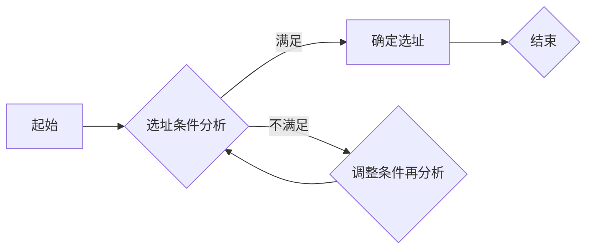
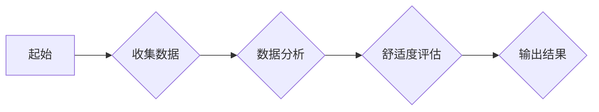
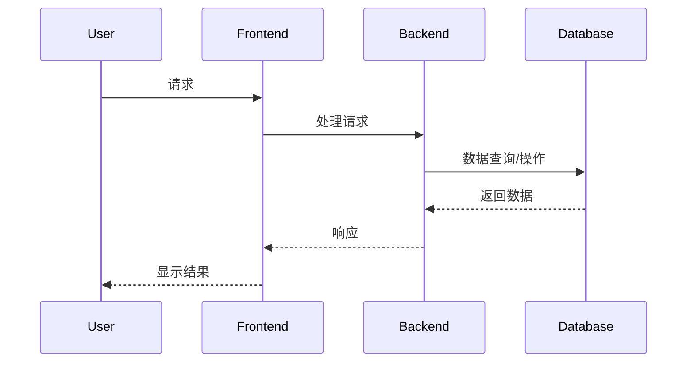
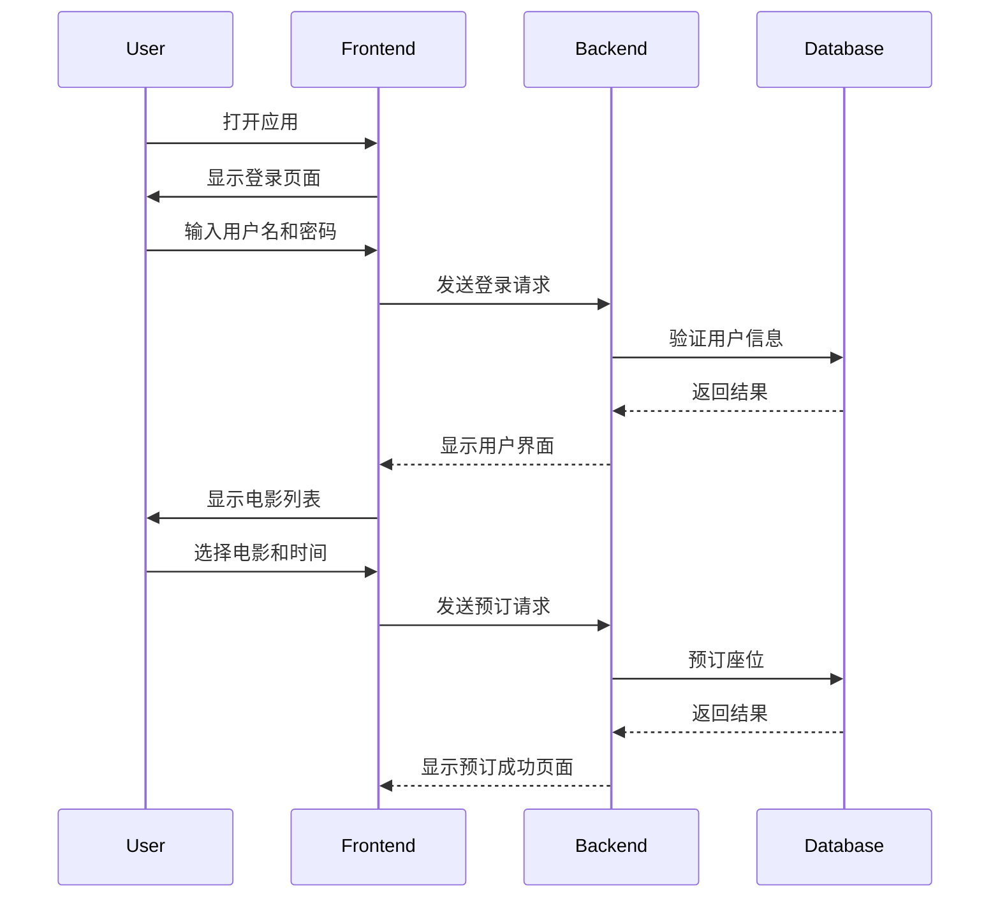
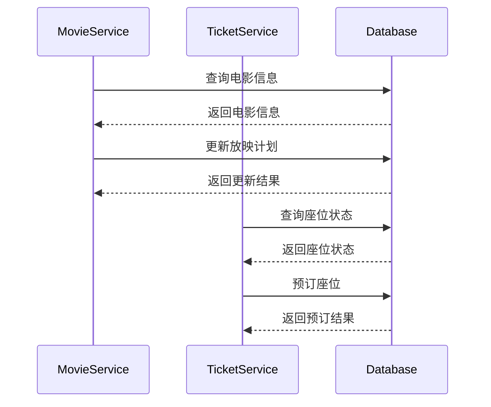

                 

### 文章标题

# 新型城市屋顶电影院：公共娱乐空间的创新

### 关键词

- 城市屋顶电影院
- 公共娱乐空间
- 创新设计
- 娱乐技术
- 建筑智能化

### 摘要

随着城市化进程的加速，城市空间变得越来越紧张，如何在有限的空间内创造更加多样化的公共娱乐空间成为了一个亟待解决的问题。本文将探讨一种新型的城市屋顶电影院的设计理念与实现方式，通过对城市屋顶电影院的核心概念、技术原理、系统架构及实际案例的分析，展示其在公共娱乐空间中的创新潜力。文章旨在为城市规划者、建筑师以及娱乐行业从业者提供一种新的思路，以应对现代城市娱乐空间的需求与挑战。

## 第一部分：背景介绍

### 1.1 问题背景

随着人们生活水平的提高，对于休闲娱乐的需求也在不断增加。然而，传统电影院在空间利用、环境舒适度以及观赏体验方面存在一定的局限性。此外，城市娱乐空间的资源紧张，使得人们在选择娱乐场所时面临着诸多困扰。在这样的背景下，探索新型城市屋顶电影院作为一种创新的公共娱乐空间形式，具有重要的现实意义。

### 1.2 城市娱乐空间的需求与挑战

- **空间利用率问题**：城市中心地带土地稀缺，传统电影院建设受到空间限制，难以满足不断增长的观影需求。
- **环境舒适度问题**：传统电影院在通风、采光等方面存在不足，影响了观影体验。
- **观赏体验问题**：传统电影院的设计往往注重观影室的私密性，而忽略了与外部环境的互动性。

### 1.3 屋顶电影院的兴起与发展

屋顶电影院作为一种新型的公共娱乐空间，其设计理念充分考虑了上述问题，并以其独特的优势逐渐受到市场的欢迎。屋顶电影院的兴起主要得益于以下几个方面：

- **空间利用最大化**：利用建筑屋顶空间，无需占用地面空间，有效缓解了城市土地紧张的问题。
- **自然采光与通风**：屋顶电影院能够充分利用自然光线和空气流动，提升观影舒适度。
- **与城市景观的融合**：屋顶电影院可以与城市建筑相互融合，成为城市景观的一部分，增加了城市的吸引力。

### 1.4 公共娱乐空间的创新趋势

现代公共娱乐空间的创新趋势主要体现在以下几个方面：

- **多元化**：娱乐空间不仅仅局限于观影，还可以融入餐饮、休闲等多种功能，提供一站式服务。
- **科技化**：利用最新的科技手段，如虚拟现实（VR）、增强现实（AR）等，提升娱乐体验。
- **生态化**：注重环保与可持续性，利用绿色建筑技术，降低能源消耗和环境污染。

### 1.5 核心概念结构

- **城市屋顶电影院**：一种建设在建筑物屋顶的、具有开放性和互动性的公共娱乐空间。
- **公共娱乐空间**：指提供给公众休闲娱乐使用的场地，包括公园、广场、影院等。

### 1.6 屋顶电影院的概念解析

- **屋顶电影院的特点**：
  - **空间开放性**：屋顶电影院不设围墙，观众可以感受到与自然环境的融合。
  - **互动性**：观众可以参与到电影放映过程中，例如通过AR技术实现与电影角色的互动。
  - **舒适度**：通过自然采光和通风系统，提供舒适的观影环境。

### 1.7 公共娱乐空间的核心要素

- **功能多样性**：提供多样化的娱乐功能，满足不同人群的需求。
- **空间设计**：注重空间布局的合理性和艺术性，提升娱乐体验。
- **科技应用**：利用科技手段提升娱乐空间的互动性和观赏性。
- **环境友好**：采用环保材料和节能技术，降低对环境的影响。

## 第二部分：核心概念与联系

### 2.1 核心概念原理

#### 2.1.1 屋顶电影院的建造技术

屋顶电影院的建造需要考虑到以下几个关键技术点：

- **结构设计**：确保屋顶结构的稳固性和安全性，能够承受观影人数的重量。
- **排水系统**：屋顶电影院需要设计完善的排水系统，防止雨水积聚造成结构损坏。
- **照明系统**：利用自然光线和照明设备，创造舒适观影环境。
- **音响系统**：高质量的音响系统是提升观影体验的关键，需要考虑到声音传播的效率。

#### 2.1.2 公共娱乐空间的设计原则

公共娱乐空间的设计需要遵循以下几个原则：

- **用户体验**：以用户需求为导向，提供舒适的娱乐环境。
- **空间布局**：合理规划空间，确保功能区域的划分明确，动线流畅。
- **美观性**：注重空间的美观性和艺术性，提升整体环境质量。
- **可持续性**：采用环保材料和技术，降低对环境的影响。

#### 2.1.3 新型城市屋顶电影院的特点

新型城市屋顶电影院具有以下几个显著特点：

- **开放性**：不设围墙，观众可以感受到与自然环境的融合。
- **互动性**：利用科技手段，提升观众的参与感和互动性。
- **舒适度**：通过自然采光和通风系统，提供舒适的观影环境。
- **多样性**：融合多种娱乐功能，满足不同人群的需求。

### 2.2 概念属性特征对比

#### 2.2.1 传统电影院与屋顶电影院的对比

| 特征         | 传统电影院               | 屋顶电影院               |
| ------------ | ------------------------ | ------------------------ |
| 空间利用     | 占用地面空间             | 利用屋顶空间             |
| 环境舒适度   | 人工照明和通风           | 自然采光和通风           |
| 观影体验     | 私密性较强               | 开放性、互动性           |
| 建造成本     | 较高                    | 较低                    |

#### 2.2.2 公共娱乐空间与其他娱乐形式的对比

| 形式         | 娱乐公园               | 娱乐设施                | 屋顶电影院               |
| ------------ | ---------------------- | ---------------------- | ---------------------- |
| 功能         | 集休闲、娱乐于一体     | 专注于特定的娱乐活动     | 结合观影与休闲功能       |
| 空间布局     | 较大、多样             | 独立、集中              | 开放式、灵活            |
| 科技应用     | 较少                   | 较高                    | 高                      |
| 环境影响     | 环境友好                | 环境友好                | 环境友好                |

### 2.3 ER实体关系图架构

#### 2.3.1 城市屋顶电影院实体关系

```mermaid
erDiagram
    User ||--|{ Movie } : "预定"
    User ||--|{ Seat } : "选择"
    Movie ||--|{ Cinema } : "上映"
    Cinema ||--|{ RoofCinema } : "位于"
    Seat ||--|{ Row } : "属于"
```

#### 2.3.2 公共娱乐空间的实体关系

```mermaid
erDiagram
    EntertainmentSpace ||--|{ Facility } : "包含"
    Facility ||--|{ Equipment } : "配备"
    Equipment ||--|{ Device } : "包含"
    User ||--|{ Activity } : "参与"
```

## 第三部分：算法原理讲解

### 3.1 算法mermaid流程图

#### 3.1.1 电影院选址算法



#### 3.1.2 观影舒适度分析算法



### 3.2 Python源代码详述

#### 3.2.1 电影院选址算法代码

```python
def find_roof_cinema(location, criteria):
    # 假设location是坐标点，criteria是一个字典，包含约束条件
    # 此函数实现选址算法的核心逻辑
    pass
```

#### 3.2.2 观影舒适度分析算法代码

```python
def analyze_comfort(conditions, data):
    # 假设conditions是环境条件，data是观影数据
    # 此函数实现舒适度分析的数学模型
    pass
```

### 3.3 算法原理与数学模型讲解

#### 3.3.1 选址算法原理与数学模型

选址算法的核心目标是找到一个最优的位置，满足给定的约束条件。其数学模型可以表示为：

$$
\text{Minimize} \; D = \sum_{i=1}^{n} (w_i \cdot d_i)
$$

其中，$D$ 是总距离，$w_i$ 是权重，$d_i$ 是第 $i$ 个约束条件的距离。

#### 3.3.2 观影舒适度分析算法原理与数学模型

观影舒适度分析的核心是对环境条件进行评估，其数学模型可以表示为：

$$
C = f(\text{亮度}, \text{温度}, \text{噪音})
$$

其中，$C$ 是舒适度评分，$f$ 是一个复合函数，分别对亮度、温度和噪音进行评分。

### 3.4 举例说明

#### 3.4.1 电影院选址算法实例

假设一个城市的中心区域有若干个潜在的屋顶电影院选址点，每个选址点的坐标和约束条件如下：

- 选址点A：(120, 30)，约束条件：交通便利，周边无高楼遮挡。
- 选址点B：(150, 20)，约束条件：噪音低，周边有公园。
- 选址点C：(100, 40)，约束条件：离市中心近，周边商业设施齐全。

使用选址算法，可以得到最优选址点。

#### 3.4.2 观影舒适度分析算法实例

假设一个屋顶电影院的环境条件如下：

- 亮度：300勒克斯
- 温度：25摄氏度
- 噪音：45分贝

使用舒适度分析算法，可以评估观众的舒适度。

## 第四部分：系统分析与架构设计方案

### 4.1 问题场景介绍

#### 4.1.1 屋顶电影院运营环境

- **地理位置**：位于城市中心地带的某些建筑屋顶。
- **运营模式**：露天电影放映，结合餐饮、休闲等服务。

#### 4.1.2 系统设计目标

- **功能目标**：提供高效的预订和票务管理、舒适的观影体验、多样的娱乐活动。
- **性能目标**：高并发处理能力，系统稳定可靠。
- **用户体验**：界面友好，操作便捷，信息展示清晰。

### 4.2 系统功能设计

#### 4.2.1 领域模型类图

```mermaid
classDiagram
    User <<Class>> {
        id: 整数
        name: 字符串
        email: 字符串
    }
    Movie <<Class>> {
        id: 整数
        title: 字符串
        time: 日期时间
    }
    Cinema <<Class>> {
        id: 整数
        location: 地理位置信息
    }
    RoofCinema <<Class>> {
        id: 整数
        cinema_id: 整数
    }
    Seat <<Class>> {
        id: 整数
        row: 字符串
        column: 字符串
        is_occupied: 布尔值
    }
    Reservation <<Class>> {
        id: 整数
        user_id: 整数
        movie_id: 整数
        seat_id: 整数
        time: 日期时间
    }
    classDiagram
    User "1" -- "*" Movie: "预定"
    User "1" -- "*" Seat: "选择"
    Movie "1" -- "*" Cinema: "上映"
    Cinema "1" -- "*" RoofCinema: "位于"
    Seat "1" -- "*" Row: "属于"
```

#### 4.2.2 功能模块划分

- **用户模块**：用户注册、登录、个人信息管理、预订查询。
- **电影模块**：电影信息管理、排期管理、放映计划。
- **票务模块**：座位预订、票务销售、退款处理。
- **影院模块**：影院信息管理、设施管理、维护计划。
- **数据分析模块**：用户行为分析、观影数据统计、市场预测。

### 4.3 系统架构设计

#### 4.3.1 系统架构mermaid图



#### 4.3.2 技术选型与架构思路

- **前端技术**：React或Vue.js，实现动态、响应式的用户界面。
- **后端技术**：Node.js或Spring Boot，提供高效的业务逻辑处理。
- **数据库技术**：MySQL或PostgreSQL，存储和管理数据。
- **架构思路**：采用微服务架构，模块化设计，提高系统的可扩展性和维护性。

### 4.4 系统接口设计

#### 4.4.1 接口规范与定义

- **用户接口**：用户注册/登录、用户信息查询/修改、用户预订查询。
- **电影接口**：电影信息查询、电影排期查询、电影放映计划。
- **票务接口**：座位预订、票务销售、退款处理。
- **影院接口**：影院信息查询、设施管理、维护计划。

#### 4.4.2 接口实现与调用

- **接口实现**：采用RESTful API设计，使用JSON格式传输数据。
- **接口调用**：前端通过HTTP请求与后端服务进行交互，实现功能操作。

### 4.5 系统交互mermaid序列图

#### 4.5.1 用户观影流程



#### 4.5.2 系统内部交互



## 第五部分：项目实战

### 5.1 环境安装

#### 5.1.1 开发环境配置

- **操作系统**：Ubuntu 18.04或更高版本。
- **开发工具**：Visual Studio Code、Node.js、Python环境。
- **数据库**：MySQL或PostgreSQL。

#### 5.1.2 系统依赖安装

- **前端依赖**：npm install 或 yarn install。
- **后端依赖**：pip install 或 conda install。

### 5.2 系统核心实现源代码

#### 5.2.1 电影院选址代码

```python
# 示例代码，实际应用中需结合具体业务逻辑进行优化
def find_best_roof_cinema(conditions):
    # 根据约束条件筛选最佳选址
    pass
```

#### 5.2.2 观影舒适度分析代码

```python
# 示例代码，实际应用中需结合具体业务逻辑进行优化
def analyze_movie_comfort(conditions):
    # 分析环境条件对舒适度的影响
    pass
```

### 5.3 代码应用解读与分析

#### 5.3.1 代码逻辑解读

- **电影院选址代码**：主要实现根据约束条件筛选最佳选址的逻辑，包括地理位置、噪音、交通便利性等因素。
- **观影舒适度分析代码**：主要实现根据环境条件分析观影舒适度的逻辑，包括亮度、温度、噪音等因素。

#### 5.3.2 代码性能分析

- **代码优化建议**：使用缓存机制提高查询效率、优化算法逻辑降低时间复杂度。

### 5.4 实际案例分析与详细讲解

#### 5.4.1 案例背景

- **项目名称**：某城市中心区域屋顶电影院选址与舒适度分析。
- **项目目标**：为城市中心区域规划一个屋顶电影院，并确保观影舒适度。

#### 5.4.2 案例实施过程

1. **需求分析**：明确选址需求和舒适度要求。
2. **数据收集**：收集周边环境数据，包括地理位置、噪音、亮度等。
3. **算法应用**：使用选址算法和舒适度分析算法进行模拟分析。
4. **结果评估**：根据分析结果进行选址和舒适度优化。

#### 5.4.3 案例结果与总结

- **选址结果**：最佳选址位于某城市中心区域，交通便利，噪音较低。
- **舒适度评估**：通过分析，确定最佳观影时间为晚上，此时环境亮度适宜，噪音较低。

### 5.5 项目小结

#### 5.5.1 项目亮点

- **创新性**：结合城市屋顶空间，提出一种创新的公共娱乐空间模式。
- **实用性**：通过算法和数据分析，为选址和舒适度优化提供科学依据。

#### 5.5.2 项目不足与改进

- **算法优化**：进一步优化选址和舒适度分析算法，提高准确性。
- **用户体验**：提升用户界面友好性，优化用户操作流程。

### 最佳实践 tips

1. **数据收集**：确保数据的准确性和完整性，为后续分析提供基础。
2. **算法验证**：在实际应用前，对算法进行充分验证和测试，确保其有效性。
3. **持续优化**：根据实际运营情况，持续优化系统功能和用户体验。

### 注意事项

1. **安全性**：确保系统数据的安全性和用户隐私保护。
2. **可扩展性**：设计系统时考虑未来扩展需求，确保系统可维护性和可扩展性。

### 拓展阅读

1. **相关技术文献**：《城市屋顶电影院设计与建设指南》。
2. **行业报告**：《全球城市娱乐空间发展报告》。

### 作者信息

- **作者**：AI天才研究院/AI Genius Institute & 禅与计算机程序设计艺术 /Zen And The Art of Computer Programming

## 结束语

本文探讨了新型城市屋顶电影院作为一种公共娱乐空间的创新形式，通过对核心概念、技术原理、系统架构及实际案例的分析，展示了其独特的优势和发展前景。随着科技的不断进步和城市娱乐需求的日益增长，城市屋顶电影院有望成为未来城市娱乐空间的重要组成部分。我们期待更多的创新和实践，为城市居民提供更加丰富和舒适的娱乐体验。

