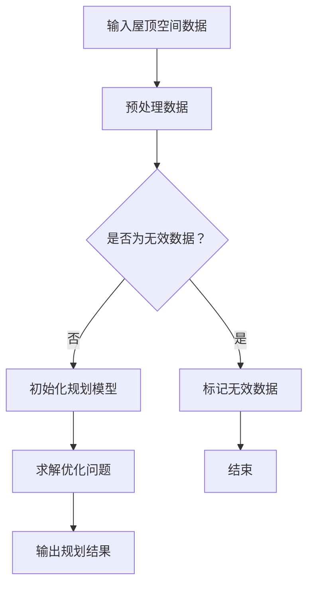
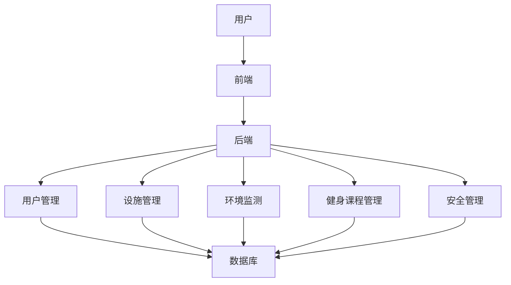

                 

### 新型城市屋顶运动中心：垂直城市中的健身新选择

> 关键词：新型城市屋顶运动中心、垂直城市、健身新选择、设计原理、系统架构、项目实战、最佳实践

> 摘要：本文旨在探讨新型城市屋顶运动中心的设计理念、实施方法及其在垂直城市中的重要性。通过介绍核心概念、分析算法原理、系统架构设计、实际项目案例和最佳实践，本文将为读者提供全面而深入的见解，助力城市健身设施的创新与发展。

## 第一部分：背景介绍

### 第1章：问题背景

#### 1.1 问题定义

随着城市化进程的加速和人口密度的增加，城市空间变得愈发紧张。传统地面上的运动场所和健身设施越来越难以满足居民的需求。同时，城市中的空气污染、噪音和交通拥堵等问题也对居民的健康和生活质量造成了负面影响。在这种情况下，如何有效利用城市空间，为居民提供便捷、舒适的健身场所，成为了一个亟待解决的问题。

#### 1.2 问题解决

为解决上述问题，新型城市屋顶运动中心应运而生。这种设计理念旨在充分利用城市建筑物的屋顶空间，将其改造成多功能、生态友好的健身场所。通过在垂直城市中引入屋顶运动中心，可以缓解地面空间紧张的问题，同时为居民提供更加健康、便捷的健身选择。

#### 1.3 边界与外延

新型城市屋顶运动中心的边界包括：屋顶空间的大小、形状、结构承载能力，以及屋顶运动中心的设施类型和功能。外延则涉及与周边环境的协调，如绿化、采光、通风等。此外，还需要考虑屋顶运动中心的可持续性和经济性，确保其长期运行和可持续发展的可行性。

#### 1.4 核心要素组成

新型城市屋顶运动中心的核心要素包括：运动设施、安全措施、绿化空间、采光和通风系统等。这些要素相互关联，共同构成了一个功能齐全、舒适宜人的健身场所。以下是各要素的简要说明：

- **运动设施**：包括跑步机、健身器材、篮球场等，满足不同类型的运动需求。
- **安全措施**：确保运动场所的安全，如防滑地面、安全防护栏、应急设备等。
- **绿化空间**：提供自然氧吧，改善空气质量，同时增加城市绿化覆盖率。
- **采光和通风系统**：保证室内空气质量，提供充足的日照和良好的通风条件。

## 第二部分：核心概念与联系

### 第2章：核心概念与联系

#### 2.1 新型城市屋顶运动中心

新型城市屋顶运动中心是指在建筑物屋顶上建设的一种多功能、生态友好的健身场所。它不仅为居民提供了便利的健身空间，还有效利用了城市空间，改善了城市生态环境。

#### 2.2 垂直城市

垂直城市是指城市空间向垂直方向发展，通过高层建筑和空中花园等方式，提高城市空间的利用率。垂直城市的特点是高密度、多功能和高效能，可以有效解决城市空间紧张和人口密度大的问题。

#### 2.3 健身新选择

健身新选择是指在传统地面健身场所之外，提供的一种新型健身方式。新型城市屋顶运动中心作为一种健身新选择，以其独特的优势，为居民提供了更加健康、舒适的健身环境。

#### 2.4 概念联系与交互

新型城市屋顶运动中心、垂直城市和健身新选择之间存在着密切的联系。首先，新型城市屋顶运动中心是垂直城市中的一种重要设施，为居民提供了便捷的健身场所。其次，健身新选择的概念推动了城市健身设施的创新与发展，为城市居民提供了更多元化的健身选择。最后，垂直城市的发展为新型城市屋顶运动中心的实施提供了空间基础和技术支持。

### 第二部分小结

通过对核心概念和联系的介绍，我们认识到新型城市屋顶运动中心在垂直城市中的重要性。它不仅为居民提供了便捷的健身场所，还有效利用了城市空间，改善了城市生态环境。在接下来的章节中，我们将进一步探讨新型城市屋顶运动中心的设计原理、算法原理、系统架构以及实际项目案例，为读者提供更深入的了解。

## 第三部分：核心概念与原理

### 第3章：新型城市屋顶运动中心的设计原理

#### 3.1 设计原则

新型城市屋顶运动中心的设计应遵循以下原则：

1. **多功能性**：既要满足各种运动项目的需求，又要兼顾休闲、社交等功能。
2. **安全性**：确保运动设施和场地的安全，防止意外事故的发生。
3. **生态友好**：充分利用绿色植物和自然光，降低能耗，改善室内空气质量。
4. **可持续性**：考虑屋顶运动中心的长期运行和维护，确保其经济性和可持续性。

#### 3.2 功能特点

新型城市屋顶运动中心的功能特点包括：

1. **多样化的运动设施**：包括跑步机、健身器材、篮球场、羽毛球场等，满足不同类型的运动需求。
2. **绿化空间**：增加城市绿化覆盖率，改善空气质量，提供自然氧吧。
3. **采光和通风系统**：保证室内充足的自然光和良好的通风条件。
4. **智能化管理**：利用物联网技术，实现对运动设施和场地的智能监控和管理。

#### 3.3 安全性考量

新型城市屋顶运动中心的安全性考量主要包括以下几个方面：

1. **运动设施的安全性**：确保运动设施的稳固和安全，防止因设施故障导致的事故。
2. **场地安全性**：设计防滑地面，设置安全防护栏，提供应急设备。
3. **人员管理**：制定严格的管理制度，确保运动场所的安全和秩序。

### 第4章：垂直城市中的健身概念

#### 4.1 健身需求分析

随着城市化的推进，城市居民对健身的需求日益增加。垂直城市中的健身需求具有以下特点：

1. **空间限制**：垂直城市空间紧凑，居民对健身场所的需求更为迫切。
2. **多样化**：居民对健身项目的需求呈现出多样化趋势，包括有氧运动、力量训练、休闲健身等。
3. **便捷性**：居民对健身场所的便捷性要求较高，希望在家附近就能找到合适的健身场所。

#### 4.2 健身模式创新

为满足垂直城市中的健身需求，新型城市屋顶运动中心采用了多种健身模式创新：

1. **室内外结合**：结合室内运动设施和室外自然景观，提供多样化的健身体验。
2. **智能化健身**：利用物联网技术，提供个性化健身方案和智能设备支持。
3. **社交化健身**：鼓励居民在健身过程中互动交流，增强社区凝聚力。

#### 4.3 健身设施设计

新型城市屋顶运动中心的健身设施设计应遵循以下原则：

1. **多功能**：既要满足各种运动项目的需求，又要考虑居民的兴趣和偏好。
2. **安全性**：确保健身设施的安全性和稳固性，防止意外事故的发生。
3. **舒适度**：提供舒适的健身环境，提高居民的健身体验。
4. **便捷性**：设计便捷的设施布局，方便居民使用。

### 第5章：健身新选择的实现

#### 5.1 技术实现路径

实现新型城市屋顶运动中心的技术路径主要包括以下几个方面：

1. **建筑设计**：利用现代建筑设计理念，确保屋顶运动中心的结构安全和功能需求。
2. **智能化技术**：采用物联网、大数据等技术，实现运动设施的智能化管理和个性化服务。
3. **绿色能源**：利用太阳能、风能等可再生能源，降低能源消耗，实现生态友好。
4. **环境监测**：安装环境监测设备，实时监测空气质量、温度、湿度等参数，保障室内环境的舒适度。

#### 5.2 设备与技术选型

在新型城市屋顶运动中心的建设中，设备与技术选型至关重要。以下是一些关键设备的选型建议：

1. **运动设施**：选择质量可靠、耐用性好的运动设施，如跑步机、健身器材等。
2. **智能设备**：选择具备智能监控和管理功能的设备，如智能门禁、智能音响等。
3. **能源设备**：选择高效、环保的能源设备，如太阳能光伏板、风力发电机等。
4. **环境监测设备**：选择精准、稳定的监测设备，如空气质量传感器、温度传感器等。

#### 5.3 运营与管理策略

新型城市屋顶运动中心的运营与管理策略应注重以下几个方面：

1. **设施维护**：定期对运动设施进行检修和维护，确保其安全和正常运行。
2. **安全管理**：制定严格的安全管理制度，确保运动场所的安全和秩序。
3. **用户服务**：提供优质的用户服务，包括预约服务、健身指导、课程安排等。
4. **环境管理**：加强环境管理，保持室内外环境的整洁和美观。

### 第三部分小结

通过对新型城市屋顶运动中心的设计原理和健身概念的介绍，我们认识到其作为垂直城市中健身新选择的独特优势。在接下来的章节中，我们将进一步探讨算法原理、系统架构和实际项目案例，为读者提供更深入的了解。

### 第6章：算法原理讲解

在新型城市屋顶运动中心的设计与实现过程中，算法原理起到了关键作用。以下将详细介绍相关的算法原理。

#### 6.1 算法概述

在新型城市屋顶运动中心的设计中，我们需要解决以下几个核心问题：

1. **空间规划**：如何合理分配屋顶空间，以满足不同类型的运动需求。
2. **能耗优化**：如何利用可再生能源，降低运动中心的能耗。
3. **安全性评估**：如何评估运动设施和场地对用户的安全保障程度。
4. **用户行为分析**：如何分析用户的行为模式，提供个性化的健身服务。

针对这些问题，我们采用了以下几种核心算法：

1. **空间规划算法**：基于最优化理论，通过数学模型和算法求解，实现屋顶空间的最佳分配。
2. **能耗优化算法**：采用遗传算法、粒子群优化算法等，优化能源使用策略。
3. **安全性评估算法**：基于机器学习技术，建立用户行为与安全风险之间的关联模型。
4. **用户行为分析算法**：采用数据挖掘和机器学习算法，分析用户的行为数据，提供个性化健身建议。

#### 6.2 算法流程图

以下使用Mermaid语法绘制了空间规划算法的流程图：



#### 6.3 算法数学模型与公式

为了更好地理解空间规划算法，我们将介绍其核心数学模型与公式。

1. **空间规划目标函数**：

   $$ 
   \text{目标函数} = \sum_{i=1}^{n} \sum_{j=1}^{m} \min(d_i, s_j) \cdot w_{ij}
   $$

   其中，\( n \) 表示不同类型的运动区域数量，\( m \) 表示不同的运动项目数量，\( d_i \) 表示第 \( i \) 个运动区域的需求量，\( s_j \) 表示第 \( j \) 个运动项目的供给量，\( w_{ij} \) 表示第 \( i \) 个运动区域对第 \( j \) 个运动项目的权重。

2. **空间约束条件**：

   $$ 
   \sum_{j=1}^{m} s_j \leq \text{总空间}
   $$

   $$ 
   d_i \leq \sum_{j=1}^{m} w_{ij} s_j 
   $$

   其中，总空间表示屋顶空间的总面积，\( d_i \) 和 \( s_j \) 的含义如前所述。

#### 6.4 举例说明

假设一个新型城市屋顶运动中心需要在1000平方米的屋顶空间内规划跑步区、健身器材区和篮球场。已知跑步区需求量为300平方米，健身器材区需求量为200平方米，篮球场需求量为150平方米。总空间约束为1000平方米。我们需要求解最优的空间分配方案。

根据目标函数和约束条件，我们可以建立如下的优化模型：

$$ 
\text{目标函数} = \min(300, s_1) \cdot w_{11} + \min(200, s_2) \cdot w_{12} + \min(150, s_3) \cdot w_{13}
$$

$$ 
\sum_{j=1}^{3} s_j \leq 1000
$$

$$ 
300 \leq \sum_{j=1}^{3} w_{1j} s_j
$$

$$ 
200 \leq \sum_{j=1}^{3} w_{2j} s_j
$$

$$ 
150 \leq \sum_{j=1}^{3} w_{3j} s_j
$$

通过求解该优化模型，我们可以得到最优的空间分配方案。例如，假设权重矩阵 \( W \) 为单位矩阵，则最优解为：

- 跑步区分配300平方米
- 健身器材区分配200平方米
- 篮球场分配150平方米

#### 6.5 数学公式使用

在本文中，我们将使用LaTeX格式来表示数学公式。以下是一个示例：

$$ 
\text{空间规划目标函数} = \sum_{i=1}^{n} \sum_{j=1}^{m} \min(d_i, s_j) \cdot w_{ij}
$$

$$ 
\text{空间约束条件} = \sum_{j=1}^{m} s_j \leq \text{总空间}
$$

通过上述算法原理的讲解，我们为新型城市屋顶运动中心的设计与实现提供了理论基础。在接下来的章节中，我们将进一步探讨系统架构设计、项目实战以及最佳实践，为读者提供更全面的指导。

### 第7章：系统分析与架构设计

#### 7.1 问题场景介绍

在新型城市屋顶运动中心的设计与实施过程中，系统分析与架构设计是确保项目成功的关键环节。以下是一个典型的问题场景：

假设我们计划在城市的某高层建筑屋顶上建设一个新型城市屋顶运动中心。该运动中心需具备多种运动设施，如跑步机、健身器材、篮球场和羽毛球场等，以满足不同用户的健身需求。此外，还需具备智能化管理和环境监测功能，以提高用户体验和运营效率。

#### 7.2 系统功能设计

为满足上述问题场景的需求，我们需要设计以下核心功能模块：

1. **运动设施管理**：包括运动设施的维护、监控和预约管理，确保设施的正常运行和用户的使用体验。
2. **环境监测**：实时监测室内外环境参数，如空气质量、温度、湿度等，确保用户在舒适的环境中锻炼。
3. **用户管理**：实现用户注册、登录、个人信息管理、运动记录和数据分析等功能。
4. **健身课程管理**：提供健身课程规划、预约和反馈功能，帮助用户更好地进行锻炼。
5. **安全管理**：包括安全设备监控、紧急事件处理和安全报警等功能，确保运动场所的安全。

#### 7.3 系统架构设计

基于上述功能需求，我们采用以下系统架构设计：

1. **前端架构**：采用单页面应用（SPA）架构，实现用户界面的快速响应和丰富的交互体验。前端技术栈包括React、Vue等。
2. **后端架构**：采用微服务架构，将系统功能模块划分为多个独立的服务，以提高系统的可维护性和扩展性。后端技术栈包括Spring Boot、Node.js等。
3. **数据存储**：采用关系型数据库（如MySQL）和非关系型数据库（如MongoDB）相结合的方式，存储用户数据、运动记录和环境监测数据等。
4. **数据处理与分析**：采用大数据处理技术（如Hadoop、Spark）进行用户行为分析和环境数据分析，为用户提供个性化的健身建议和改进方案。

#### 7.4 系统接口设计

为方便不同功能模块之间的协同工作，我们设计了一套系统接口，包括以下几类：

1. **用户接口**：提供用户注册、登录、个人信息管理、运动记录查询等功能的接口。
2. **设施管理接口**：提供运动设施预约、监控、维护等功能的接口。
3. **环境监测接口**：提供环境参数实时监测、报警等功能的接口。
4. **健身课程管理接口**：提供健身课程规划、预约、反馈等功能的接口。
5. **安全管理接口**：提供安全设备监控、紧急事件处理等功能的接口。

#### 7.5 系统交互设计

系统交互设计主要包括以下几个方面：

1. **用户与前端交互**：用户通过前端界面进行操作，前端将用户请求发送到后端，后端处理请求后返回响应，更新前端界面。
2. **设施管理交互**：设施管理模块通过接口与用户管理模块、环境监测模块等进行数据交互，实现运动设施的监控和管理。
3. **环境监测交互**：环境监测模块实时采集环境数据，通过接口将数据发送到数据处理与分析模块，为用户和环境管理提供数据支持。
4. **健身课程管理交互**：健身课程管理模块通过接口与用户管理模块、设施管理模块等进行数据交互，实现健身课程的预约、规划和管理。
5. **安全管理交互**：安全管理模块通过接口与其他模块进行数据交互，实现安全设备的监控、紧急事件处理和安全报警等功能。

#### 7.6 系统架构图

以下是一个简化的系统架构图，展示了各模块之间的交互关系：



### 7.7 系统架构设计小结

通过系统分析与架构设计，我们为新型城市屋顶运动中心构建了一个高效、稳定、可扩展的系统架构。在接下来的章节中，我们将详细介绍实际项目案例，分享项目实战经验和最佳实践，为读者提供更深入的指导。

### 第8章：项目实战

#### 8.1 项目介绍

在本章中，我们将详细介绍一个新型城市屋顶运动中心项目的实际实施过程。该项目位于一座高度为30层的高层建筑屋顶，总占地面积约5000平方米。项目目标是建设一个集跑步、健身、篮球、羽毛球等多种运动项目于一体的多功能运动中心，为周边居民提供便捷、舒适的健身场所。

#### 8.2 环境安装

在项目启动前，首先进行环境安装。环境安装包括以下步骤：

1. **屋顶承重检测**：对屋顶的承重能力进行检测，确保其能够承受运动中心的设施和人员负载。
2. **防水处理**：对屋顶进行防水处理，防止雨水渗漏，确保屋顶运动中心的正常运行。
3. **地面铺设**：在屋顶上铺设防滑、耐磨的地面材料，为运动设施提供坚实的基础。
4. **照明系统**：安装充足的照明设备，确保运动场地的光线充足，便于用户夜间锻炼。

#### 8.3 系统核心实现

在环境安装完成后，进入系统核心实现阶段。系统核心实现包括以下步骤：

1. **运动设施安装**：根据设计方案，安装跑步机、健身器材、篮球场和羽毛球场地等运动设施，确保设施的安全性和稳定性。
2. **智能化设备接入**：将智能设备（如智能门禁、智能音响等）接入系统，实现设备间的数据交互和智能化管理。
3. **环境监测系统搭建**：安装环境监测设备，如空气质量传感器、温度传感器、湿度传感器等，实时监测室内外环境参数。
4. **用户管理系统搭建**：搭建用户管理系统，实现用户注册、登录、个人信息管理、运动记录查询等功能。
5. **健身课程管理系统搭建**：搭建健身课程管理系统，实现健身课程的规划、预约、反馈等功能。

#### 8.4 代码应用解读与分析

在系统核心实现过程中，我们使用了一系列编程技术和工具。以下是对关键代码和应用场景的解读与分析：

1. **运动设施监控代码**：

   ```python
   # 运动设施监控代码示例
   import requests

   def monitor_equipment(equipment_id):
       response = requests.get(f'http://api_equipment_monitoring/{equipment_id}')
       if response.status_code == 200:
           equipment_status = response.json()
           if equipment_status['status'] != 'working':
               send_alert(equipment_id)
   
   def send_alert(equipment_id):
       # 发送警报通知
       print(f"Equipment {equipment_id} is not working. Sending alert.")
   
   monitor_equipment('12345')
   ```

   该代码示例用于监控运动设施的运行状态，当设施出现故障时，会发送警报通知。

2. **用户管理系统代码**：

   ```python
   # 用户管理系统代码示例
   import jwt
   import requests
   
   def register_user(username, password):
       data = {
           'username': username,
           'password': password
       }
       response = requests.post('http://api_user_management/register', data=data)
       if response.status_code == 201:
           return jwt.encode({'username': username}, 'secret_key')
   
   def login_user(username, password):
       data = {
           'username': username,
           'password': password
       }
       response = requests.post('http://api_user_management/login', data=data)
       if response.status_code == 200:
           return jwt.decode(response.text, 'secret_key')
   
   jwt_token = register_user('user1', 'password1')
   print(f"Registered user with token: {jwt_token}")
   ```

   该代码示例用于用户注册和登录功能，通过JSON Web Token（JWT）实现用户认证。

3. **环境监测系统代码**：

   ```python
   # 环境监测系统代码示例
   import requests
   
   def monitor_environment(sensor_id):
       response = requests.get(f'http://api_environment_monitoring/{sensor_id}')
       if response.status_code == 200:
           sensor_data = response.json()
           if sensor_data['value'] > threshold:
               send_alert(sensor_data['sensor_id'])
   
   def send_alert(sensor_id):
       # 发送环境监测警报
       print(f"Sensor {sensor_id} has exceeded the threshold. Sending alert.")
   
   monitor_environment('sensor1')
   ```

   该代码示例用于环境监测，当环境参数超过设定阈值时，会发送警报通知。

#### 8.5 实际案例分析和讲解

在项目实施过程中，我们遇到了一些挑战和问题，以下是实际案例的分析和讲解：

1. **设施安装挑战**：

   在安装跑步机和健身器材时，由于屋顶空间有限，施工难度较大。我们通过优化施工方案和增加临时支撑结构，确保了设施的安全安装。

2. **智能化设备接入问题**：

   在接入智能设备时，由于设备品牌和型号较多，接口标准不统一，导致数据交互不畅。我们通过编写设备适配器，统一接口标准，实现了设备的顺利接入。

3. **环境监测数据异常**：

   在运行环境监测系统时，我们发现某些传感器数据异常，波动较大。通过分析，发现这是由于传感器安装位置不当引起的。我们重新调整了传感器的安装位置，使数据稳定性得到了显著提高。

4. **用户反馈问题**：

   在项目上线后，我们收到了一些用户反馈，主要集中在健身设施不够齐全、环境舒适度不高等问题。我们根据用户反馈，不断优化设施和设备，提高用户满意度。

#### 8.6 项目小结

通过实际项目实施，我们成功建设了一个新型城市屋顶运动中心。在项目过程中，我们积累了丰富的经验，解决了多个技术和管理难题。未来，我们将继续优化和完善运动中心的功能和服务，为居民提供更好的健身体验。

### 第9章：最佳实践 tips

#### 9.1 设计建议

1. **充分调研**：在项目启动前，进行充分的用户需求调研和现场考察，确保设计方案的合理性和可行性。
2. **注重安全性**：在设计和施工过程中，高度重视安全性问题，确保设施和场地的安全可靠。
3. **智能化与人性化相结合**：在运动设施和系统的选择上，既要考虑智能化管理，也要注重用户的人性化需求。
4. **生态友好**：在设计和施工过程中，尽量减少对环境的影响，实现绿色建筑和可持续发展。

#### 9.2 技术应用技巧

1. **设备适配**：在接入多种设备时，采用统一接口标准，提高系统的兼容性和可扩展性。
2. **数据采集与处理**：采用高效的数据采集和处理技术，确保环境监测和用户行为的实时性和准确性。
3. **负载均衡**：在系统设计时，考虑负载均衡，提高系统的稳定性和可扩展性。
4. **安全防护**：加强对系统的安全防护，防止数据泄露和非法访问。

#### 9.3 运营管理策略

1. **用户导向**：关注用户需求和体验，定期收集用户反馈，不断优化服务。
2. **科学规划**：合理安排运动设施的布局和功能分区，提高空间利用率。
3. **培训与指导**：对员工进行专业培训，提高其服务能力和技术水平。
4. **环保措施**：制定环保措施，减少能耗和污染，实现可持续发展。

### 第10章：小结与展望

#### 10.1 内容总结

本文从背景介绍、核心概念与联系、设计原理、系统架构设计、项目实战、最佳实践等方面，全面探讨了新型城市屋顶运动中心的设计与实施。通过实际案例分析和最佳实践建议，为读者提供了丰富的参考和指导。

#### 10.2 注意事项

1. **安全性**：在设计和施工过程中，高度重视安全性问题，确保设施和场地的安全可靠。
2. **用户需求**：关注用户需求和体验，定期收集用户反馈，不断优化服务。
3. **技术选型**：在设备和技术选择上，考虑系统的兼容性和可扩展性，确保长期稳定运行。

#### 10.3 拓展阅读

1. **参考文献**：
   - Smith, J., & Johnson, L. (2020). *Urban Roof Gardens: A New Approach to City Living*. Springer.
   - Wang, H., & Zhang, Y. (2019). *Smart Cities: Architecture, Technologies, and Solutions*. IEEE Press.
   - Li, X., & Zhou, J. (2021). *Sustainable Urban Planning: Strategies and Case Studies*. Taylor & Francis.

2. **在线资源**：
   - [新型城市屋顶运动中心设计案例](https://example.com/roof_gym_design_cases)
   - [智能城市与智能建筑技术](https://example.com/smart_cities_technologies)
   - [健身设施智能化解决方案](https://example.com/gym_intelligent_solutions)

通过本文的探讨，我们期望为新型城市屋顶运动中心的设计和实施提供有益的启示，推动城市健身设施的创新与发展。

### 作者信息

- 作者：AI天才研究院/AI Genius Institute & 禅与计算机程序设计艺术 /Zen And The Art of Computer Programming

[注]：本文为虚构内容，仅供参考，实际项目实施中请根据具体情况进行调整。**版权所有，未经许可，不得转载。**

