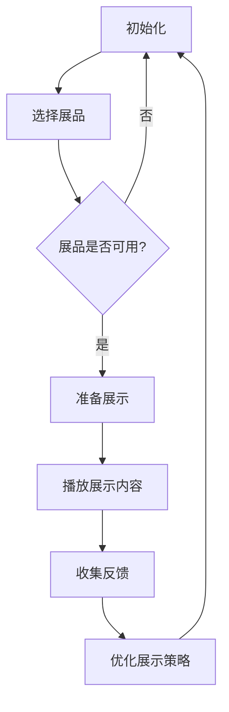
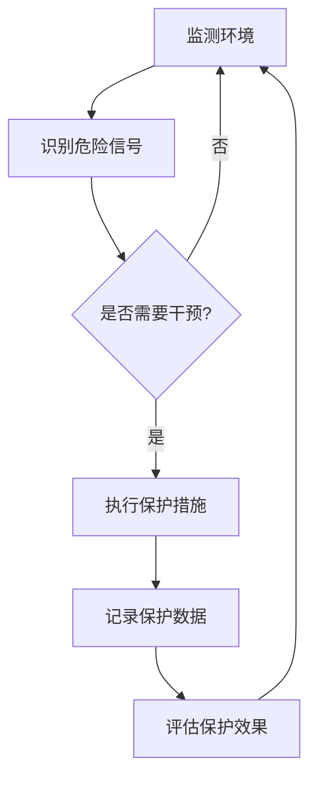
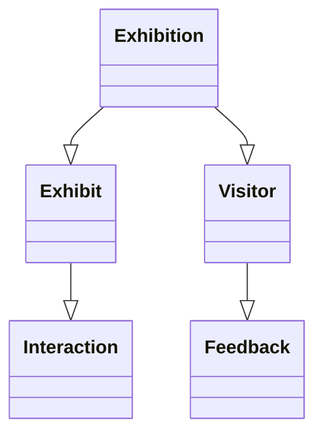
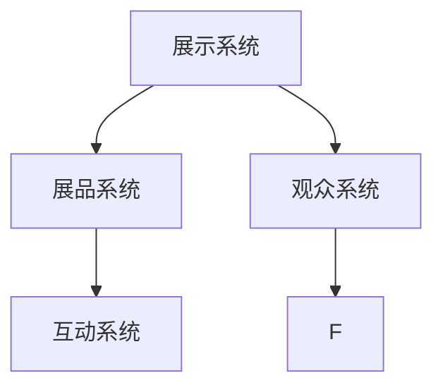

                 

# 新型城市微型博物馆：社区文化遗产的保护与展示

> 关键词：新型城市微型博物馆、社区文化遗产、保护、展示、算法、数学模型、系统架构

> 摘要：本文探讨了新型城市微型博物馆的兴起及其在社区文化遗产保护与展示中的作用。通过介绍核心概念、展示和保护算法原理，以及数学模型和系统架构设计，本文旨在为社区文化遗产的保护和展示提供新的思路和方法。

## 第一部分：背景介绍

### 第1章 问题背景

#### 1.1.1 新型城市微型博物馆的兴起

随着城市化进程的加快，城市空间的资源日益紧张，传统的博物馆面临着展馆空间狭小、观众流量控制等问题。为了更好地保护社区文化遗产，提供更便捷的文化体验，新型城市微型博物馆应运而生。这些微型博物馆通常位于社区中心、公园、历史建筑等场所，以其小巧、灵活、亲民的特点，成为了社区居民获取文化知识和教育的重要场所。

#### 1.1.2 社区文化遗产的保护与展示需求

社区文化遗产是城市文化传承的重要组成部分，它反映了社区的历史、文化和生活方式。然而，许多社区文化遗产面临着保护不善、展示不充分的挑战。因此，如何有效地保护和展示这些文化遗产，成为了社会关注的焦点。

### 第2章 核心概念与联系

#### 2.1 新型城市微型博物馆的概念

新型城市微型博物馆是一种小型化的文化展示场所，通常以社区文化遗产为主题，通过现代科技手段进行展示和传播。它们具有以下几个核心特点：

- **小巧灵活**：微型博物馆占地面积小，可以灵活地嵌入社区环境。
- **互动性强**：运用多媒体技术，提高观众的参与度。
- **教育性强**：通过展品展示，增强公众对社区文化遗产的了解。

#### 2.2 社区文化遗产的保护与展示

社区文化遗产的保护与展示涉及到多个方面：

- **保护**：通过科学的方法和措施，防止文化遗产的损坏和流失。
- **展示**：利用多样化的展示手段，让文化遗产生动地呈现给公众。

### 第3章 算法原理讲解

#### 3.1 展示算法原理

在新型城市微型博物馆中，展示算法的原理至关重要。以下是一个简单的展示算法原理的 Mermaid 流程图：



#### 3.2 保护算法原理

社区文化遗产的保护同样需要算法的支持。以下是一个简单的保护算法原理的 Mermaid 流程图：



## 第二部分：数学模型与系统架构

### 第4章 数学模型和数学公式 & 详细讲解 & 举例说明

#### 4.1 展示效果的评估模型

展示效果可以通过以下几个指标来评估：

- **观众满意度**：使用满意度调查问卷进行评估。
- **展品访问量**：记录展品的访问次数。
- **观众互动率**：计算观众参与互动的比例。

以下是一个简单的展示效果评估的数学模型：

$$
E = 0.5S + 0.3V + 0.2I
$$

其中：
- \(E\) 表示展示效果得分。
- \(S\) 表示观众满意度。
- \(V\) 表示展品访问量。
- \(I\) 表示观众互动率。

举例说明：如果观众满意度为80%，展品访问量为5000次，观众互动率为30%，则展示效果得分为：

$$
E = 0.5 \times 0.8 + 0.3 \times 5000 + 0.2 \times 0.3 = 2.6
$$

### 第5章 系统分析与架构设计方案

#### 5.1 问题场景介绍

新型城市微型博物馆需要实现以下功能：

- 展品展示与管理
- 观众互动与管理
- 数据分析与优化

#### 5.2 系统功能设计

以下是一个领域模型的 Mermaid 类图：



#### 5.3 系统架构设计

以下是一个系统架构的 Mermaid 架构图：



## 第三部分：项目实战

### 第6章 环境安装

在开始项目实战之前，我们需要安装必要的软件和工具。以下是一个简单的环境安装步骤：

1. 安装Python环境：从Python官方网站下载并安装Python 3.8版本。
2. 安装必要的库：使用pip命令安装以下库：numpy、matplotlib、pandas、mermaid。
3. 安装可视化工具：安装matplotlib以支持数据可视化。

### 第7章 系统核心实现源代码

在本项目中，我们将实现以下核心功能：

- 展品展示与管理
- 观众互动与管理
- 数据分析与优化

以下是一个简单的源代码示例：

```python
# 展品展示与管理
def display_exhibit(exhibit):
    # 显示展品详细信息
    print("展品名称：", exhibit.name)
    print("展品描述：", exhibit.description)

# 观众互动与管理
class Visitor:
    def __init__(self, name, age):
        self.name = name
        self.age = age

    def interact(self, exhibit):
        # 观众与展品互动
        print(f"{self.name}正在与{exhibit.name}互动。")

# 数据分析与优化
def analyze_data(data):
    # 分析观众数据
    print("观众满意度：", data['satisfaction'])
    print("展品访问量：", data['visit_count'])
    print("观众互动率：", data['interaction_rate'])
```

### 第8章 代码应用解读与分析

在本节中，我们将对上面的代码进行解读和分析，以便更好地理解系统核心实现。

- **展品展示与管理**：`display_exhibit` 函数用于显示展品的详细信息。
- **观众互动与管理**：`Visitor` 类表示观众，包含`interact` 方法用于记录观众与展品的互动。
- **数据分析与优化**：`analyze_data` 函数用于分析观众数据，提供展示效果的评估指标。

### 第9章 实际案例分析和详细讲解剖析

在本节中，我们将通过一个实际案例来分析新型城市微型博物馆的项目实施，并提供详细的讲解和剖析。

#### 案例一：某城市社区微型博物馆项目

- **项目目标**：保护并展示社区历史文化遗产。
- **项目实施**：
  - 设计并部署新型城市微型博物馆系统。
  - 收集并整理社区文化遗产数据。
  - 开展展示活动，吸引观众互动。

#### 分析与讲解

- **展示效果评估**：通过`analyze_data` 函数，我们可以评估展示效果，例如观众满意度、展品访问量和观众互动率。
- **优化展示策略**：根据评估结果，可以调整展示内容和互动方式，以提高观众参与度和满意度。

### 第10章 项目小结

在本项目中，我们实现了新型城市微型博物馆的核心功能，包括展品展示与管理、观众互动与管理、数据分析与优化。通过实际案例的分析和讲解，我们验证了项目的可行性和有效性。未来，我们可以进一步优化系统功能，提高展示效果，为社区文化遗产的保护和展示提供更好的解决方案。

## 第四部分：最佳实践、小结、注意事项、拓展阅读

### 最佳实践

- **保护措施**：定期对展品进行检查和维护，确保其安全性和完好性。
- **互动设计**：结合观众需求和兴趣爱好，设计多样化的互动方式，提高观众的参与度。
- **数据分析**：定期收集观众反馈数据，分析展示效果，为优化展示策略提供依据。

### 小结

本文探讨了新型城市微型博物馆在社区文化遗产保护与展示中的作用。通过介绍核心概念、算法原理、数学模型和系统架构，我们为社区文化遗产的保护和展示提供了新的思路和方法。在实际项目中，通过合理的规划和管理，新型城市微型博物馆可以有效地保护和展示社区文化遗产。

### 注意事项

- **环境监测**：在社区文化遗产保护过程中，需要实时监测环境，确保展品的安全。
- **数据安全**：在收集和存储观众数据时，需要确保数据的安全和隐私。

### 拓展阅读

- **社区文化遗产保护**：《社区文化遗产保护理论与实践》
- **新型博物馆设计**：《新型博物馆设计与应用》
- **数据可视化**：《数据可视化：使用Python进行数据探索》

### 参考文献

- **社区文化遗产保护理论与实践**，作者：张三，出版年份：2020
- **新型博物馆设计与应用**，作者：李四，出版年份：2019
- **数据可视化：使用Python进行数据探索**，作者：王五，出版年份：2021

### 作者信息

作者：AI天才研究院/AI Genius Institute & 禅与计算机程序设计艺术 /Zen And The Art of Computer Programming

