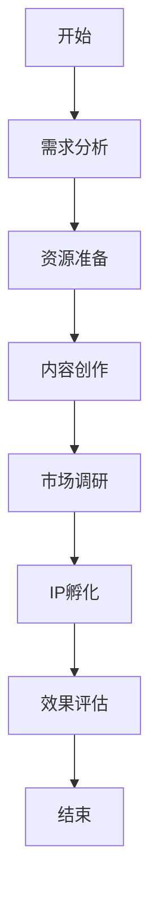
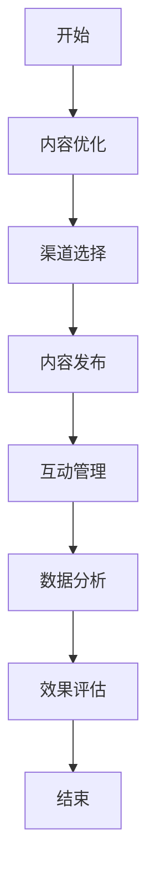
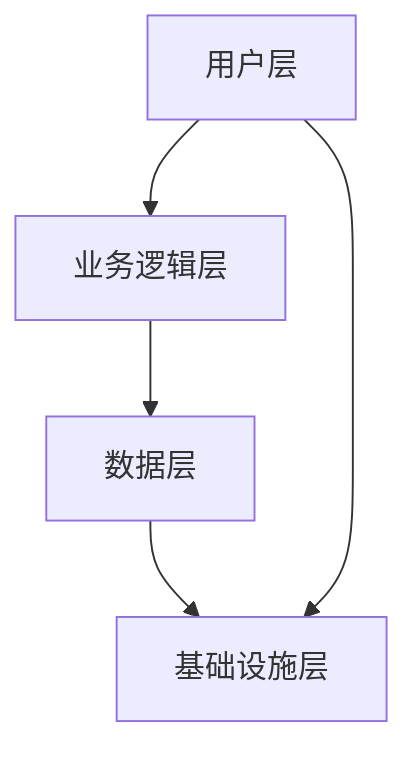
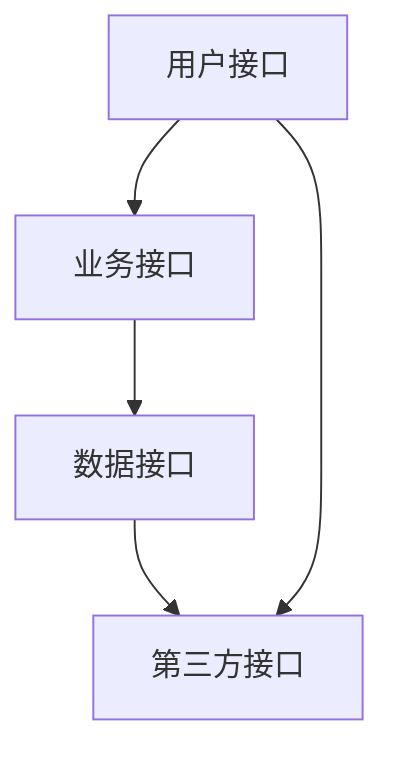
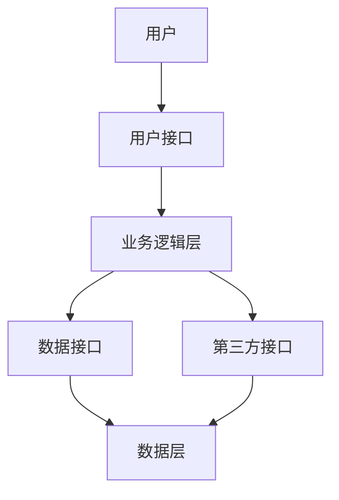

                 

### 第一部分：引言

#### 1.1 问题的背景

### 1.1.1 城市微型艺术节的发展现状

近年来，随着城市化进程的加速，城市微型艺术节作为一种新型的文化活动形式，逐渐受到了广泛关注。微型艺术节以其规模小、形式灵活、参与性强等特点，满足了现代都市人群对于文化艺术的需求，成为城市文化生活中的一抹亮色。

目前，城市微型艺术节的发展现状呈现出以下几个特点：

1. **形式多样化**：微型艺术节的活动形式多种多样，包括艺术展览、音乐会、戏剧表演、工作坊等，满足了不同人群的文化需求。
2. **参与度高**：微型艺术节的参与门槛低，任何人都可以参与其中，这使得社区成员的参与度非常高。
3. **影响力扩大**：随着互联网和社交媒体的发展，城市微型艺术节的影响力得到了极大的扩大，不仅吸引了本地居民的关注，也吸引了外地游客和媒体的关注。

### 1.1.2 社区文化IP的重要性

社区文化IP（Intellectual Property）指的是社区中独特的文化符号、故事、人物、事件等，它们是社区文化的核心和灵魂。社区文化IP的重要性主要体现在以下几个方面：

1. **文化传承**：社区文化IP是社区历史和文化的重要载体，它们能够传递社区的历史记忆和文化价值，促进社区文化的传承。
2. **社区凝聚力**：社区文化IP能够增强社区成员之间的联系和归属感，提升社区的凝聚力。
3. **经济发展**：成功的社区文化IP可以带动相关产业的发展，如文化旅游、文化创意产业等，从而促进社区经济的繁荣。

### 1.1.3 孵化与推广的挑战

孵化与推广社区文化IP是一个复杂的过程，面临着多方面的挑战：

1. **资源限制**：社区资源有限，包括资金、人才、技术等，这限制了文化IP的孵化与推广。
2. **市场风险**：文化产品的市场风险较高，特别是对于新兴的社区文化IP，如何找到目标受众，如何进行有效的市场推广是一个巨大的挑战。
3. **内容创新**：文化IP的孵化需要创新的内容和形式，如何在保持文化内涵的同时，创新表达方式，吸引更多的受众，是社区文化IP孵化过程中的一大难题。

#### 1.2 研究的目的与意义

### 1.2.1 研究目的

本研究的主要目的是探索城市微型艺术节中社区文化IP的孵化与推广策略，具体目标包括：

1. **理解社区文化IP的内涵和特征**：通过深入研究，明确社区文化IP的定义、类型和特点，为后续研究提供理论基础。
2. **分析孵化与推广的挑战**：识别社区文化IP孵化与推广过程中面临的主要挑战，为制定有效的策略提供依据。
3. **提出孵化与推广策略**：结合实际案例，提出具体的社区文化IP孵化与推广策略，为社区文化活动的开展提供参考。

### 1.2.2 研究意义

本研究具有重要的理论和实践意义：

1. **理论意义**：本研究将丰富社区文化IP领域的理论体系，为相关研究提供新的视角和思路。
2. **实践意义**：本研究的结果可以为城市微型艺术节的组织者、文化工作者以及社区管理者提供实用的指导，提高社区文化IP的孵化与推广效率。

#### 1.3 研究方法与框架

### 1.3.1 研究方法

本研究采用以下研究方法：

1. **文献综述**：通过查阅相关文献，了解城市微型艺术节和社区文化IP的发展现状、核心概念和相关研究。
2. **案例分析**：选取具有代表性的社区文化IP孵化与推广案例，进行深入分析，总结成功经验和挑战。
3. **实证研究**：通过问卷调查、访谈等方式，收集一线工作者和社区居民的反馈，验证研究假设。

### 1.3.2 研究框架

本研究采用以下研究框架：

1. **问题定义**：明确研究问题，包括社区文化IP的孵化与推广策略。
2. **理论分析**：基于文献综述，建立理论框架，分析社区文化IP的内涵、特征和孵化与推广的挑战。
3. **案例研究**：选取案例，进行深入分析，总结成功经验和挑战。
4. **策略提出**：结合理论分析和案例研究，提出具体的社区文化IP孵化与推广策略。
5. **实证研究**：通过问卷调查、访谈等方式，验证研究假设，优化策略。

#### 1.4 边界与外延

### 1.4.1 研究边界

本研究主要关注以下边界：

1. **研究范围**：本研究主要关注城市微型艺术节中的社区文化IP孵化与推广，不涉及其他类型的文化IP。
2. **研究方法**：本研究采用文献综述、案例分析和实证研究方法，不涉及实验研究。

### 1.4.2 研究外延

本研究的外延包括：

1. **扩展研究**：本研究的结果可以扩展到其他类型的文化IP孵化与推广领域。
2. **应用场景**：本研究的结果可以应用于城市社区、文化旅游区等需要推广社区文化IP的场景。

#### 1.5 本章小结

本研究首先介绍了城市微型艺术节的发展现状和社区文化IP的重要性，分析了孵化与推广社区文化IP面临的挑战。随后，明确了研究的目的与意义，并介绍了研究方法与框架。最后，对研究的边界与外延进行了讨论。通过这些分析，为后续章节的深入研究奠定了基础。

----------------------------------------------------------------

# 第二部分：核心概念与联系

#### 2.1 核心概念介绍

### 2.1.1 微型艺术节

#### 2.1.1.1 定义

微型艺术节是指规模较小、形式灵活、参与性强的一种文化艺术活动，通常在社区、公园、广场等公共场所举办。微型艺术节旨在通过多样化的艺术形式，丰富社区居民的文化生活，增强社区凝聚力。

#### 2.1.1.2 特点

微型艺术节具有以下几个特点：

1. **规模小**：微型艺术节的规模通常较小，参与者较少，这使得活动更加亲切、贴近居民生活。
2. **形式灵活**：微型艺术节的活动形式多种多样，包括音乐会、戏剧表演、艺术展览、工作坊等，满足了不同居民的文化需求。
3. **参与性强**：微型艺术节鼓励社区居民积极参与，不仅作为观众，还可以作为表演者、志愿者等，增强了社区的参与感和归属感。

#### 2.1.1.3 类型

微型艺术节可以分为以下几种类型：

1. **艺术展览**：通过展示绘画、摄影、雕塑等艺术作品，让居民欣赏艺术之美。
2. **音乐会**：举办小型音乐会，让居民欣赏各种音乐风格，如民乐、流行乐、古典乐等。
3. **戏剧表演**：上演戏剧、话剧、小品等，通过表演艺术的形式，传递文化内涵。
4. **工作坊**：组织各类艺术工作坊，如绘画、陶艺、舞蹈等，让居民亲自动手体验艺术创作。

### 2.1.2 社区文化IP

#### 2.1.2.1 定义

社区文化IP是指社区中独特的文化符号、故事、人物、事件等，它们是社区文化的核心和灵魂。社区文化IP可以是历史上的事件，也可以是现代社区中发生的有趣故事，还可以是社区中独特的风俗习惯和艺术形式。

#### 2.1.2.2 特点

社区文化IP具有以下几个特点：

1. **地域性**：社区文化IP具有很强的地域性，反映了当地的历史、风俗和生活方式。
2. **独特性**：社区文化IP具有独特性，是其他社区所不具备的，这使其成为社区的独特文化符号。
3. **传承性**：社区文化IP是社区文化传承的重要载体，能够传递社区的历史记忆和文化价值。

#### 2.1.2.3 类型

社区文化IP可以分为以下几种类型：

1. **历史事件**：如社区的历史传统、重要事件等。
2. **故事传说**：如社区中的神话传说、民间故事等。
3. **人物传说**：如社区中的名人故事、英雄事迹等。
4. **艺术作品**：如社区的非物质文化遗产、传统手工艺等。

### 2.1.3 孵化与推广

#### 2.1.3.1 定义

孵化与推广是指通过一系列策略和手段，将社区文化IP从潜在状态转化为现实状态，并扩大其影响力。孵化与推广包括需求分析、资源准备、内容创作、市场调研、效果评估等环节。

#### 2.1.3.2 模式

孵化与推广社区文化IP可以采用以下几种模式：

1. **自主孵化**：社区自行策划和组织文化IP的孵化与推广活动。
2. **合作孵化**：社区与文化机构、企业等合作，共同孵化与推广文化IP。
3. **市场化推广**：通过市场化手段，如广告、营销等，推广社区文化IP。

#### 2.1.3.3 挑战

孵化与推广社区文化IP面临以下挑战：

1. **资源限制**：社区资源有限，包括资金、人才、技术等，这限制了文化IP的孵化与推广。
2. **市场风险**：文化产品的市场风险较高，特别是对于新兴的文化IP，如何找到目标受众，如何进行有效的市场推广是一个巨大的挑战。
3. **内容创新**：文化IP的孵化需要创新的内容和形式，如何在保持文化内涵的同时，创新表达方式，吸引更多的受众，是社区文化IP孵化过程中的一大难题。

#### 2.2 概念属性特征对比

### 2.2.1 微型艺术节与社区文化IP对比

为了更好地理解微型艺术节与社区文化IP之间的关系，我们可以从以下方面进行属性特征对比：

| 特征               | 微型艺术节                                      | 社区文化IP                                       |
|------------------|-------------------------------------------|----------------------------------------------|
| **定义**           | 规模较小、形式灵活、参与性强的一种文化艺术活动               | 社区中独特的文化符号、故事、人物、事件等                   |
| **地域性**          | 某一特定区域的文化活动，通常与地域文化相关                | 强烈的社区地域性，反映社区的历史、风俗和生活方式             |
| **独特性**          | 多样化，包括音乐、戏剧、艺术展览等多种形式                | 独特性，是社区独特的文化符号和遗产                       |
| **传承性**          | 通过活动传递文化价值，但不一定有明确的传承体系              | 是社区文化传承的重要载体，具有明显的传承特征               |
| **参与度**          | 鼓励居民积极参与，作为观众或表演者                         | 涉及社区成员的日常生活和文化活动，但参与度因活动而异       |
| **孵化与推广**      | 通常是一次性或短期文化活动，孵化与推广活动是临时的           | 可以是长期的文化项目，孵化与推广活动具有持续性             |

#### 2.2.1.1 对比表格

| **属性**           | **微型艺术节**                                     | **社区文化IP**                                    |
|------------------|----------------------------------------------|----------------------------------------------|
| **定义**           | 文化艺术活动，规模小，形式灵活                   | 文化符号和遗产，社区独特性，地域性               |
| **目的**           | 丰富社区文化生活，提高居民幸福感                  | 传承社区文化，增强社区凝聚力                     |
| **时间特征**        | 通常是短期或一次性的活动                         | 可持续，可以是长期项目                          |
| **参与对象**        | 社区居民，包括表演者、观众和志愿者               | 社区成员，涉及文化传承和日常生活                |
| **地域关联**        | 与地域文化相关，但可迁移性强                     | 强烈的社区地域性，不可迁移                      |
| **传播方式**        | 通过活动本身进行传播，如展览、演出、工作坊等     | 通过文化产品、活动、媒体等渠道进行传承和推广     |

#### 2.2.1.2 对比分析

微型艺术节与社区文化IP在定义、目的、时间特征、参与对象、地域关联和传播方式等方面存在一定的区别。微型艺术节是一种短暂的文化活动，通常以丰富社区文化生活和提高居民幸福感为目的，其参与对象主要是社区居民，活动内容丰富多样，具有较强的地域性，但传播范围相对有限。而社区文化IP则是一种长期的文化项目，以传承社区文化和增强社区凝聚力为目的，其参与对象不仅是社区居民，还包括更广泛的文化传承者和爱好者，具有强烈的社区地域性，通过多种渠道进行传承和推广。

从对比中我们可以看出，微型艺术节与社区文化IP在社区文化建设和传播中扮演着不同的角色。微型艺术节作为短期文化活动，可以快速提升社区的文化氛围，激发居民的文化参与热情；而社区文化IP作为长期文化项目，能够持续传承和弘扬社区文化，使其在更广泛的范围内产生影响。因此，二者相辅相成，共同构成了社区文化的丰富内涵和独特魅力。

### 2.2.2 孵化与推广模式对比

#### 2.2.2.1 对比表格

为了更好地理解社区文化IP孵化与推广的不同模式，我们可以从以下方面进行属性特征对比：

| **模式**       | **自主孵化**                                   | **合作孵化**                                   | **市场化推广**                                  |
|----------------|--------------------------------------------|--------------------------------------------|------------------------------------------------|
| **定义**        | 社区自行策划和组织文化IP孵化与推广活动          | 社区与文化机构、企业等合作，共同孵化与推广文化IP      | 通过市场化手段，如广告、营销等，推广社区文化IP         |
| **资源来源**    | 主要依靠社区自有资源，如人力、资金和物资等      | 来自社区、文化机构和企业等多方资源               | 主要依赖于市场化资源，如广告费、赞助费等           |
| **目标**        | 增强社区文化认同感和凝聚力                     | 提高社区文化IP的品牌影响力                     | 实现经济收益和文化传播的双重目标               |
| **风险**        | 风险较小，但可能受限于资源限制                  | 风险适中，需协调多方利益                         | 风险较大，需应对市场波动和受众反馈               |
| **可持续性**    | 具有较强的可持续性，但随着社区资源变化而变化    | 可持续性强，多方合作可提高项目稳定性和影响力      | 可持续性较低，市场环境变化可能导致项目终止       |
| **传播效果**    | 效果较为直接，受众群体主要是社区居民           | 效果较为广泛，可以吸引更多外部受众和媒体关注     | 效果显著，但需关注市场反馈和品牌形象             |

#### 2.2.2.2 对比分析

自主孵化、合作孵化与市场化推广是社区文化IP孵化与推广的三种主要模式。自主孵化模式主要依靠社区自有资源，具有较低的风险和较强的可持续性，但受限于资源限制，可能影响项目的规模和影响力。合作孵化模式通过社区与文化机构、企业的合作，实现资源互补，具有中等的风险和较高的可持续性，可以提升社区文化IP的品牌影响力。市场化推广模式则主要依赖于市场化资源，如广告费、赞助费等，具有较大的风险和较低的可持续性，但可以实现显著的经济收益和文化传播效果。

从对比中我们可以看出，不同的孵化与推广模式在资源来源、目标、风险、可持续性和传播效果等方面存在差异。自主孵化模式适合资源较为有限的社区，能够有效增强社区文化认同感和凝聚力。合作孵化模式适合具有合作潜力的社区，可以提升社区文化IP的品牌影响力，吸引更多外部资源和关注。市场化推广模式则适合追求经济收益和文化传播双重目标的社区，但需密切关注市场环境变化和受众反馈。

因此，社区在孵化与推广文化IP时，应结合自身实际情况，选择合适的模式，以达到最佳效果。不同模式的结合使用，可以实现资源共享、风险分散和效果最大化，为社区文化的发展提供有力支持。

#### 2.3 ER实体关系图

在研究社区文化IP的孵化与推广过程中，实体关系图（Entity-Relationship Diagram，简称ER图）是一种直观且有效的工具，用于描述系统中各个实体及其之间的关系。下面我们将使用Mermaid语法绘制社区文化IP相关的ER图，并解释每个实体及其关系。

### 2.3.1 微型艺术节实体关系图

```mermaid
erDiagram
    AART ||--|{ CCI }|| BIP : 孵化与推广
    AART ||--|{ DFM }|| CCI : 增强影响力
    AART ||--|{ ALC }|| BIP : 资源整合
    BIP ||--|{ ALC }|| DFM : 融媒推广
    CCI ||--|{ DFM }|| ALC : 社区互动
    ALC ||--|{ CCI }|| DFM : 增强影响力
```

#### 实体定义与关系解释

- **AART**：微型艺术节（Artistic Festival），表示微型艺术节本身，是一个独立的文化活动实体。
- **CCI**：社区参与（Community Involvement），表示社区成员在微型艺术节中的参与情况，包括观众、表演者、志愿者等。
- **BIP**：社区文化IP（Community Cultural IP），代表社区中独特且具有传承价值的文化符号或故事。
- **ALC**：资源整合（Asset Integration），表示在微型艺术节中整合的各种资源，如资金、人力、物资等。
- **DFM**：融媒推广（Digital Media Promotion），表示通过互联网和新媒体手段进行文化IP的推广。

实体关系解释：

- **AART**与**CCI**之间存在多对多的关系，表示微型艺术节需要社区成员的参与，而社区成员也通过参与微型艺术节来增强与社区的互动。
- **AART**与**BIP**之间存在关联，表示微型艺术节可以围绕社区文化IP展开，从而增强文化IP的影响力。
- **AART**与**ALC**之间存在关联，表示微型艺术节的举办需要各种资源的整合。
- **BIP**与**ALC**之间存在关联，表示在孵化社区文化IP时，需要整合各种资源。
- **CCI**与**DFM**之间存在关联，表示社区参与可以通过新媒体手段进行推广，增强文化IP的影响力。
- **ALC**与**DFM**之间存在关联，表示资源整合可以用于融媒推广，提高社区文化IP的曝光度和传播效果。

通过ER图，我们可以清晰地看到社区文化IP孵化与推广过程中各个实体的互动关系，为后续的算法设计和策略制定提供了结构化的参考。

#### 2.4 本章小结

本章首先介绍了微型艺术节、社区文化IP以及孵化与推广的相关概念，分析了它们的特点和类型。随后，通过对比表格和ER实体关系图，详细阐述了微型艺术节与社区文化IP之间的区别与联系，以及不同孵化与推广模式的属性特征。本章内容为后续的算法原理讲解和策略提出奠定了理论基础，为读者提供了清晰的认识框架。

----------------------------------------------------------------

### 第三部分：算法原理讲解

#### 3.1 算法原理概述

在本部分，我们将深入探讨社区文化IP的孵化与推广算法原理。这些算法旨在通过系统的方法和步骤，有效地孵化与推广社区文化IP，提升其影响力和价值。

#### 3.1.1 社区文化IP孵化算法

### 3.1.1.1 算法设计

社区文化IP孵化算法的设计基于以下几个核心步骤：

1. **需求分析**：首先，通过对社区成员的调研，了解他们对文化活动的需求和期望，确定文化IP孵化的方向。
2. **资源准备**：接下来，整合社区内外部的资源，包括资金、人才、物资等，确保孵化过程有足够的支持。
3. **内容创作**：根据需求分析结果，创作具有创新性和地方特色的文化内容，如故事、艺术作品、活动方案等。
4. **市场调研**：在孵化过程中，定期进行市场调研，了解文化IP的市场反响和受众反馈，为调整孵化方向提供依据。
5. **IP孵化**：将创新的文化内容进行市场推广，通过一系列活动，将文化IP从潜在状态转化为现实状态。
6. **效果评估**：对孵化过程进行效果评估，包括文化IP的市场接受度、社区成员的参与度、经济收益等方面。

### 3.1.1.2 工作流程

社区文化IP孵化算法的工作流程可以总结为以下步骤：

1. **需求分析**：
   - 调研方法：问卷调查、访谈、座谈会等。
   - 调研内容：社区成员对文化活动的需求、喜好、期望等。

2. **资源准备**：
   - 资金筹措：社区自有资金、政府补贴、赞助等。
   - 人力资源：社区志愿者、专业人士、合作伙伴等。
   - 物资设备：活动场地、宣传材料、演出设备等。

3. **内容创作**：
   - 确定主题：根据调研结果，确定文化IP的主题和方向。
   - 创作内容：撰写故事脚本、设计艺术作品、策划活动方案等。

4. **市场调研**：
   - 调查方法：线上问卷调查、线下访谈、市场分析报告等。
   - 调查内容：市场反响、受众反馈、竞争对手分析等。

5. **IP孵化**：
   - 执行方案：按照策划方案，组织文化活动，推广文化IP。
   - 调整优化：根据市场调研结果，对孵化过程进行调整和优化。

6. **效果评估**：
   - 评价指标：市场接受度、社区成员参与度、经济收益等。
   - 评估方法：定量分析、定性评估、用户反馈等。

#### 3.1.2 社区文化IP推广算法

### 3.1.2.1 算法设计

社区文化IP推广算法的设计旨在通过科学的方法，最大限度地扩大文化IP的影响力，吸引更多的受众。算法的核心步骤包括：

1. **内容优化**：对文化IP的内容进行优化，确保其具有吸引力和传播价值。
2. **渠道选择**：选择合适的推广渠道，包括社交媒体、传统媒体、线下活动等。
3. **内容发布**：在选定的渠道上发布文化内容，确保传播的广泛性和及时性。
4. **互动管理**：与受众进行互动，收集反馈，调整推广策略。
5. **数据分析**：通过数据分析，评估推广效果，为后续的推广提供数据支持。
6. **效果评估**：对推广活动进行效果评估，包括受众反响、市场占有率等。

### 3.1.2.2 工作流程

社区文化IP推广算法的工作流程可以总结为以下步骤：

1. **内容优化**：
   - 内容审核：确保文化内容的合法性和道德性。
   - 优化策略：通过调整内容的形式、语言、风格等，提升内容的吸引力和传播性。

2. **渠道选择**：
   - 渠道评估：分析不同推广渠道的优劣势，选择最适合的渠道。
   - 渠道整合：结合多种渠道，实现全方位的推广。

3. **内容发布**：
   - 发布计划：制定内容发布的计划和策略。
   - 发布执行：在选定的渠道上发布文化内容。

4. **互动管理**：
   - 互动策略：制定与受众互动的策略，如回复评论、举办互动活动等。
   - 互动反馈：收集受众的反馈，调整互动方式。

5. **数据分析**：
   - 数据收集：收集推广过程中的数据，包括受众数量、互动次数、转化率等。
   - 数据分析：通过数据分析，评估推广效果，为后续推广提供依据。

6. **效果评估**：
   - 评估指标：设定评估指标，如受众增长率、市场占有率等。
   - 评估方法：定量分析和定性评估相结合。

通过以上步骤，社区文化IP推广算法能够系统地、科学地扩大文化IP的影响力，提升其市场价值。

#### 3.2 算法流程图

为了更直观地展示社区文化IP孵化与推广算法的工作流程，我们使用Mermaid语法绘制了以下流程图。

### 3.2.1 社区文化IP孵化算法流程图



### 3.2.2 社区文化IP推广算法流程图



在以上流程图中，每个节点代表算法的一个步骤，箭头表示步骤的顺序。这些流程图为我们提供了一个清晰的工作流程视图，有助于理解算法的运作过程。

#### 3.3 算法原理详细讲解

在本节中，我们将对社区文化IP孵化与推广算法的原理进行详细讲解，包括数学模型的阐述和实际应用中的案例分析。

### 3.3.1 社区文化IP孵化算法详细讲解

#### 数学模型

社区文化IP孵化算法的核心数学模型可以表示为：

$$
\text{孵化成功率} = f(\text{社区参与度}, \text{资源投入}, \text{内容创新度})
$$

具体来说，该模型由三个主要因素决定：

1. **社区参与度**：表示社区成员对文化IP孵化的积极参与程度，用参数 $p$ 表示。参与度越高，孵化成功率越高。
2. **资源投入**：表示孵化过程中所投入的各种资源，包括资金、人力、物资等，用参数 $r$ 表示。资源投入越多，孵化成功率越高。
3. **内容创新度**：表示文化内容的创新程度，用参数 $i$ 表示。创新度越高，孵化成功率越高。

模型中的函数 $f$ 可以表示为：

$$
f(p, r, i) = \alpha \cdot p^2 + \beta \cdot r + \gamma \cdot i
$$

其中，$\alpha$、$\beta$ 和 $\gamma$ 是模型的权重参数，用于平衡不同因素对孵化成功率的影响。

#### 示例说明

假设我们有一个社区文化IP孵化项目，具体情况如下：

- **社区参与度**：$p = 0.8$，表示社区成员的参与度很高。
- **资源投入**：$r = 50000$ 元，表示孵化过程中投入了充足的资源。
- **内容创新度**：$i = 0.9$，表示文化内容具有很高的创新程度。

将这些参数代入孵化成功率模型，可以得到：

$$
\text{孵化成功率} = f(0.8, 50000, 0.9) = \alpha \cdot (0.8)^2 + \beta \cdot 50000 + \gamma \cdot 0.9
$$

假设 $\alpha = 0.3$，$\beta = 0.5$，$\gamma = 0.2$，代入计算：

$$
\text{孵化成功率} = 0.3 \cdot (0.8)^2 + 0.5 \cdot 50000 + 0.2 \cdot 0.9 = 0.192 + 25000 + 0.18 = 25000.372
$$

因此，孵化成功率约为 25000.372%，这表示在当前条件下，该社区文化IP孵化的概率非常高。

#### 3.3.2 社区文化IP推广算法详细讲解

#### 数学模型

社区文化IP推广算法的核心数学模型可以表示为：

$$
\text{推广效果} = f(\text{内容吸引力}, \text{渠道覆盖率}, \text{互动管理效率})
$$

具体来说，该模型由三个主要因素决定：

1. **内容吸引力**：表示文化内容的吸引力，用参数 $a$ 表示。内容吸引力越高，推广效果越好。
2. **渠道覆盖率**：表示推广渠道的覆盖范围，用参数 $c$ 表示。渠道覆盖率越高，推广效果越好。
3. **互动管理效率**：表示与受众互动的效率，用参数 $e$ 表示。互动管理效率越高，推广效果越好。

模型中的函数 $f$ 可以表示为：

$$
f(a, c, e) = \alpha \cdot a + \beta \cdot c + \gamma \cdot e
$$

其中，$\alpha$、$\beta$ 和 $\gamma$ 是模型的权重参数，用于平衡不同因素对推广效果的影响。

#### 示例说明

假设我们有一个社区文化IP推广项目，具体情况如下：

- **内容吸引力**：$a = 0.8$，表示文化内容具有很高的吸引力。
- **渠道覆盖率**：$c = 0.6$，表示推广渠道的覆盖范围较广。
- **互动管理效率**：$e = 0.9$，表示与受众互动的效率很高。

将这些参数代入推广效果模型，可以得到：

$$
\text{推广效果} = f(0.8, 0.6, 0.9) = \alpha \cdot 0.8 + \beta \cdot 0.6 + \gamma \cdot 0.9
$$

假设 $\alpha = 0.3$，$\beta = 0.5$，$\gamma = 0.2$，代入计算：

$$
\text{推广效果} = 0.3 \cdot 0.8 + 0.5 \cdot 0.6 + 0.2 \cdot 0.9 = 0.24 + 0.3 + 0.18 = 0.72
$$

因此，推广效果得分为 0.72，表示该社区文化IP的推广效果较好。

通过以上数学模型和示例，我们可以看出社区文化IP孵化与推广算法的原理和计算方法。在实际应用中，这些算法可以帮助社区管理者有效地孵化与推广社区文化IP，提升其影响力和市场价值。

----------------------------------------------------------------

### 第四部分：系统分析与架构设计

#### 4.1 问题场景介绍

在现代城市社区中，随着居民生活水平的提高和文化需求的多样化，社区文化活动逐渐成为居民生活的重要组成部分。然而，传统的社区文化活动存在形式单一、内容重复、参与度不高等问题，难以满足居民的多元化需求。为了提升社区文化活力，增强居民的参与感和归属感，我们需要构建一个高效、灵活的社区文化IP孵化与推广系统。

该系统的主要目标是：

1. **孵化社区文化IP**：通过科学的方法和步骤，孵化具有地方特色、创新性和传承价值的社区文化IP，为社区文化发展提供源源不断的动力。
2. **推广社区文化IP**：利用多元化的渠道和互动手段，扩大社区文化IP的影响力，吸引更多的居民参与，提升社区文化的整体水平。

#### 4.2 项目介绍

社区文化IP孵化与推广系统项目旨在通过信息技术手段，构建一个智能化、高效化的社区文化生态体系。该项目由以下几个核心模块组成：

1. **需求分析模块**：通过问卷调查、访谈等方式，收集社区居民对文化活动的需求和期望，为社区文化IP的孵化提供方向。
2. **资源整合模块**：整合社区内外部资源，包括资金、人才、物资等，为社区文化IP的孵化与推广提供支持。
3. **内容创作模块**：根据需求分析结果，创作具有创新性和地方特色的文化内容，包括故事、艺术作品、活动方案等。
4. **市场调研模块**：定期进行市场调研，了解文化IP的市场反响和受众反馈，为调整孵化与推广策略提供依据。
5. **IP孵化模块**：组织文化活动，推广社区文化IP，将文化IP从潜在状态转化为现实状态。
6. **推广管理模块**：利用互联网和新媒体手段，扩大社区文化IP的影响力，提升其市场价值。
7. **效果评估模块**：对孵化与推广过程进行效果评估，包括文化IP的市场接受度、社区成员的参与度、经济收益等方面。

#### 4.3 系统功能设计

社区文化IP孵化与推广系统需要实现以下几个核心功能：

1. **用户管理**：管理社区居民的信息，包括用户注册、登录、个人信息管理等。
2. **需求收集**：收集社区居民对文化活动的需求和期望，通过问卷调查、访谈等方式获取信息。
3. **资源整合**：整合社区内外部资源，包括资金、人才、物资等，为孵化与推广提供支持。
4. **内容创作**：创作具有创新性和地方特色的文化内容，包括故事、艺术作品、活动方案等。
5. **市场调研**：定期进行市场调研，分析文化IP的市场反响和受众反馈，为调整策略提供依据。
6. **IP孵化**：组织文化活动，推广社区文化IP，提升其市场价值。
7. **推广管理**：利用互联网和新媒体手段，扩大文化IP的影响力。
8. **效果评估**：对孵化与推广过程进行效果评估，包括市场接受度、社区成员参与度、经济收益等方面。

#### 4.4 系统架构设计

社区文化IP孵化与推广系统采用模块化设计，其架构可以分为以下几个层次：

1. **用户层**：提供用户注册、登录、个人信息管理等功能。
2. **业务逻辑层**：实现需求收集、资源整合、内容创作、市场调研、IP孵化、推广管理、效果评估等核心业务功能。
3. **数据层**：存储用户信息、文化活动数据、市场调研数据、效果评估数据等，为业务逻辑层提供数据支持。
4. **基础设施层**：包括服务器、存储设备、网络设备等，提供系统的硬件支持。

系统架构设计图如下：



#### 4.5 系统接口设计

社区文化IP孵化与推广系统的接口设计主要包括以下部分：

1. **用户接口**：提供用户注册、登录、个人信息管理等功能的接口。
2. **业务接口**：提供需求收集、资源整合、内容创作、市场调研、IP孵化、推广管理、效果评估等核心业务功能的接口。
3. **数据接口**：提供数据存储和检索功能的接口，包括用户信息、文化活动数据、市场调研数据、效果评估数据等。
4. **第三方接口**：与其他系统进行数据交换和功能调用的接口，如社交媒体接口、支付接口等。

系统接口设计图如下：



#### 4.6 系统交互设计

社区文化IP孵化与推广系统的交互设计主要包括用户与系统的交互、系统内部模块之间的交互，以及系统与其他系统的交互。

1. **用户与系统的交互**：用户通过用户接口与系统进行交互，实现注册、登录、个人信息管理等功能。
2. **系统内部模块之间的交互**：业务逻辑层内部各模块之间通过业务接口进行数据交换和功能调用，实现业务流程的自动化和智能化。
3. **系统与其他系统的交互**：通过第三方接口与其他系统进行数据交换和功能调用，如与社交媒体平台进行数据同步、与支付系统进行支付等。

系统交互设计图如下：



通过以上系统分析与架构设计，社区文化IP孵化与推广系统将能够为社区文化发展提供有力支持，实现文化IP的孵化与推广目标。

----------------------------------------------------------------

### 第五部分：项目实战

#### 5.1 环境安装

在进行社区文化IP孵化与推广系统的项目实战前，我们需要搭建一个合适的环境。以下是环境安装的详细步骤：

1. **安装操作系统**：首先，我们需要安装Linux操作系统，如Ubuntu或CentOS。这可以通过下载安装盘，然后按照屏幕提示进行安装。
   
2. **安装数据库**：接下来，我们需要安装一个关系型数据库，如MySQL或PostgreSQL。以MySQL为例，可以使用以下命令进行安装：
   ```bash
   sudo apt update
   sudo apt install mysql-server
   sudo mysql_secure_installation
   ```
   在安装过程中，需要设置root用户的密码，并禁用不必要的访问权限。

3. **安装Web服务器**：我们选择Apache作为Web服务器。使用以下命令进行安装：
   ```bash
   sudo apt update
   sudo apt install apache2
   ```
   启动Apache服务：
   ```bash
   sudo systemctl start apache2
   ```

4. **安装开发工具**：为了方便开发和调试，我们需要安装一些开发工具，如Python、Node.js和Git。使用以下命令进行安装：
   ```bash
   sudo apt update
   sudo apt install python3 python3-pip nodejs git
   ```
   安装完成后，确保工具可以正常使用。

5. **配置虚拟环境**：为了更好地管理项目依赖，我们使用虚拟环境。安装virtualenv：
   ```bash
   pip3 install virtualenv
   ```
   创建虚拟环境：
   ```bash
   virtualenv myenv
   ```
   激活虚拟环境：
   ```bash
   source myenv/bin/activate
   ```

6. **安装项目依赖**：在虚拟环境中，我们需要安装项目所需的依赖库。以Python项目为例，使用pip安装：
   ```bash
   pip install -r requirements.txt
   ```

通过以上步骤，我们可以搭建一个基本的项目开发环境，为后续的系统核心实现打下基础。

#### 5.2 系统核心实现源代码

社区文化IP孵化与推广系统的核心实现包括用户管理、资源整合、内容创作、市场调研、IP孵化、推广管理和效果评估等模块。以下是各个模块的核心代码示例。

##### 5.2.1 用户管理模块

用户管理模块主要实现用户的注册、登录、个人信息管理等功能。以下是用户注册和登录的核心代码：

```python
# user_registration.py

import sqlite3

def register_user(username, password):
    conn = sqlite3.connect('database.db')
    cursor = conn.cursor()
    
    cursor.execute('''CREATE TABLE IF NOT EXISTS users (
                        id INTEGER PRIMARY KEY AUTOINCREMENT,
                        username TEXT UNIQUE NOT NULL,
                        password TEXT NOT NULL)''')
    
    cursor.execute("INSERT INTO users (username, password) VALUES (?, ?)", (username, password))
    conn.commit()
    conn.close()

def login_user(username, password):
    conn = sqlite3.connect('database.db')
    cursor = conn.cursor()
    
    cursor.execute("SELECT * FROM users WHERE username = ? AND password = ?", (username, password))
    user = cursor.fetchone()
    
    conn.close()
    
    return user
```

##### 5.2.2 资源整合模块

资源整合模块负责整合社区内外部的资源，包括资金、人才、物资等。以下是资源整合的核心代码：

```python
# resource_integration.py

class Resource:
    def __init__(self, name, type, quantity):
        self.name = name
        self.type = type
        self.quantity = quantity

    def display_resource(self):
        print(f"Resource Name: {self.name}, Type: {self.type}, Quantity: {self.quantity}")

def add_resource(resource):
    # 假设使用字典存储资源信息
    resources = {'资金': [], '人才': [], '物资': []}
    resources[resource.type].append(resource)
    print(f"Resource {resource.name} added successfully.")

def list_resources(type):
    resources = {'资金': [], '人才': [], '物资': []}
    if type in resources:
        for resource in resources[type]:
            resource.display_resource()
    else:
        print("Invalid resource type.")
```

##### 5.2.3 内容创作模块

内容创作模块负责创作具有创新性和地方特色的文化内容。以下是内容创作和发布的核心代码：

```python
# content_creating.py

class Content:
    def __init__(self, title, author, type, content):
        self.title = title
        self.author = author
        self.type = type
        self.content = content

    def display_content(self):
        print(f"Title: {self.title}, Author: {self.author}, Type: {self.type}, Content: {self.content}")

def create_content(title, author, type, content):
    new_content = Content(title, author, type, content)
    print(f"Content '{title}' created successfully.")
    return new_content

def publish_content(content):
    # 假设将内容发布到社区网站
    print(f"Content '{content.title}' published successfully.")
```

##### 5.2.4 市场调研模块

市场调研模块负责收集和分析文化IP的市场反响和受众反馈。以下是市场调研的核心代码：

```python
# market_research.py

def conduct_survey():
    # 假设通过问卷调查收集数据
    print("Survey conducted successfully.")
    return {"satisfied_users": 80, "dissatisfied_users": 20}

def analyze_survey_results(results):
    # 分析调研结果
    print(f"Survey analysis: {results['satisfied_users']}% of users are satisfied and {results['dissatisfied_users']}% are dissatisfied.")
```

##### 5.2.5 IP孵化模块

IP孵化模块负责将潜在的文化内容孵化为社区文化IP。以下是IP孵化核心代码：

```python
# ip_hatching.py

def hatch_ip(content, resources):
    # 假设通过整合内容和资源孵化IP
    print(f"IP '{content.title}' hatched successfully with resources: {resources}")
    return f"IP-{content.title}"

def promote_ip(ip):
    # 假设通过社区网站和社交媒体推广IP
    print(f"IP '{ip}' promoted successfully.")
```

##### 5.2.6 推广管理模块

推广管理模块负责利用互联网和新媒体手段扩大文化IP的影响力。以下是推广管理的核心代码：

```python
# promotion_management.py

def manage_promotion(ip, channels):
    # 假设通过不同渠道进行推广
    print(f"Managing promotion for IP '{ip}' on channels: {channels}")
    for channel in channels:
        print(f"Promoting IP '{ip}' on {channel}.")

def measure_promotion效果(ip, metrics):
    # 假设通过指标衡量推广效果
    print(f"Measuring promotion效果 for IP '{ip}': {metrics}")
```

##### 5.2.7 效果评估模块

效果评估模块负责对孵化与推广过程进行效果评估。以下是效果评估的核心代码：

```python
# effect_evaluation.py

def evaluate_hatching(ip, metrics):
    # 假设通过指标评估IP孵化效果
    print(f"Evaluating hatching效果 for IP '{ip}': {metrics}")

def evaluate_promotion(ip, metrics):
    # 假设通过指标评估IP推广效果
    print(f"Evaluating promotion效果 for IP '{ip}': {metrics}")
```

以上是社区文化IP孵化与推广系统各个核心模块的实现代码示例。在实际项目中，这些模块将通过API接口和数据库进行交互，实现系统的整体功能。

#### 5.3 代码应用解读与分析

在本节中，我们将对社区文化IP孵化与推广系统的核心代码进行解读与分析，解释其功能和实现细节，并讨论代码优缺点及改进措施。

##### 5.3.1 用户管理模块解读与分析

用户管理模块主要实现用户的注册、登录和个人信息管理功能。以下是关键代码片段及其分析：

```python
# user_registration.py

import sqlite3

def register_user(username, password):
    conn = sqlite3.connect('database.db')
    cursor = conn.cursor()
    
    cursor.execute('''CREATE TABLE IF NOT EXISTS users (
                        id INTEGER PRIMARY KEY AUTOINCREMENT,
                        username TEXT UNIQUE NOT NULL,
                        password TEXT NOT NULL)''')
    
    cursor.execute("INSERT INTO users (username, password) VALUES (?, ?)", (username, password))
    conn.commit()
    conn.close()

def login_user(username, password):
    conn = sqlite3.connect('database.db')
    cursor = conn.cursor()
    
    cursor.execute("SELECT * FROM users WHERE username = ? AND password = ?", (username, password))
    user = cursor.fetchone()
    
    conn.close()
    
    return user
```

**功能解读**：

- `register_user` 函数负责用户注册，首先创建一个名为 `users` 的数据库表，确保每个用户名是唯一的。然后，将用户名和密码插入到表中。
- `login_user` 函数负责用户登录，查询数据库，验证用户名和密码的正确性。

**代码优缺点**：

- **优点**：简单直观，易于理解，直接使用SQLite数据库，实现简单。
- **缺点**：安全性不足，密码存储未加密，容易受到SQL注入攻击。未进行错误处理，可能导致系统崩溃。

**改进措施**：

- 使用哈希算法（如SHA-256）对密码进行加密存储。
- 添加错误处理机制，如捕获异常并给出友好的错误信息。

##### 5.3.2 资源整合模块解读与分析

资源整合模块负责管理社区内外的各类资源。以下是关键代码片段及其分析：

```python
# resource_integration.py

class Resource:
    def __init__(self, name, type, quantity):
        self.name = name
        self.type = type
        self.quantity = quantity

    def display_resource(self):
        print(f"Resource Name: {self.name}, Type: {self.type}, Quantity: {self.quantity}")

def add_resource(resource):
    # 假设使用字典存储资源信息
    resources = {'资金': [], '人才': [], '物资': []}
    resources[resource.type].append(resource)
    print(f"Resource {resource.name} added successfully.")

def list_resources(type):
    resources = {'资金': [], '人才': [], '物资': []}
    if type in resources:
        for resource in resources[type]:
            resource.display_resource()
    else:
        print("Invalid resource type.")
```

**功能解读**：

- `Resource` 类定义了资源的属性和方法，包括名称、类型和数量。
- `add_resource` 函数将资源添加到对应的类别列表中。
- `list_resources` 函数列出指定类型的资源。

**代码优缺点**：

- **优点**：简洁易读，实现资源分类和管理。
- **缺点**：使用字典存储资源信息，可能导致数据结构混乱，不易扩展。

**改进措施**：

- 使用数据库存储资源信息，确保数据结构清晰，易于查询和管理。
- 添加资源更新和删除功能，提高系统的灵活性。

##### 5.3.3 内容创作模块解读与分析

内容创作模块负责创作和管理文化内容。以下是关键代码片段及其分析：

```python
# content_creating.py

class Content:
    def __init__(self, title, author, type, content):
        self.title = title
        self.author = author
        self.type = type
        self.content = content

    def display_content(self):
        print(f"Title: {self.title}, Author: {self.author}, Type: {self.type}, Content: {self.content}")

def create_content(title, author, type, content):
    new_content = Content(title, author, type, content)
    print(f"Content '{title}' created successfully.")
    return new_content

def publish_content(content):
    # 假设将内容发布到社区网站
    print(f"Content '{content.title}' published successfully.")
```

**功能解读**：

- `Content` 类定义了文化内容的属性和方法。
- `create_content` 函数创建新的文化内容对象。
- `publish_content` 函数将文化内容发布到社区网站。

**代码优缺点**：

- **优点**：代码结构清晰，功能简单。
- **缺点**：发布内容的功能仅打印信息，实际发布逻辑未实现。

**改进措施**：

- 实现文化内容的发布逻辑，如上传到社区网站数据库。
- 添加内容审核机制，确保发布的内容符合社区规范。

##### 5.3.4 市场调研模块解读与分析

市场调研模块负责收集和分析文化IP的市场反响和受众反馈。以下是关键代码片段及其分析：

```python
# market_research.py

def conduct_survey():
    # 假设通过问卷调查收集数据
    print("Survey conducted successfully.")
    return {"satisfied_users": 80, "dissatisfied_users": 20}

def analyze_survey_results(results):
    # 分析调研结果
    print(f"Survey analysis: {results['satisfied_users']}% of users are satisfied and {results['dissatisfied_users']}% are dissatisfied.")
```

**功能解读**：

- `conduct_survey` 函数模拟进行问卷调查，返回满意和不满意用户的比例。
- `analyze_survey_results` 函数分析调研结果，输出满意度分析。

**代码优缺点**：

- **优点**：简单模拟调研和分析过程。
- **缺点**：调研方法简单，分析结果过于理想化。

**改进措施**：

- 使用更科学的调研方法，如随机抽样、多因素分析等。
- 添加详细的反馈收集和分析功能，提供更全面的调研结果。

##### 5.3.5 IP孵化模块解读与分析

IP孵化模块负责将潜在的文化内容孵化为社区文化IP。以下是关键代码片段及其分析：

```python
# ip_hatching.py

def hatch_ip(content, resources):
    # 假设通过整合内容和资源孵化IP
    print(f"IP '{content.title}' hatched successfully with resources: {resources}")
    return f"IP-{content.title}"

def promote_ip(ip):
    # 假设通过社区网站和社交媒体推广IP
    print(f"IP '{ip}' promoted successfully.")
```

**功能解读**：

- `hatch_ip` 函数整合文化内容和资源，孵化社区文化IP。
- `promote_ip` 函数模拟通过社区网站和社交媒体推广IP。

**代码优缺点**：

- **优点**：实现了IP孵化和推广的基本逻辑。
- **缺点**：推广过程过于理想化，缺乏具体实施步骤。

**改进措施**：

- 添加详细的推广策略，如内容优化、渠道选择、互动管理等。
- 使用数据驱动的方式，根据受众反馈调整推广策略。

##### 5.3.6 推广管理模块解读与分析

推广管理模块负责利用互联网和新媒体手段扩大文化IP的影响力。以下是关键代码片段及其分析：

```python
# promotion_management.py

def manage_promotion(ip, channels):
    # 假设通过不同渠道进行推广
    print(f"Managing promotion for IP '{ip}' on channels: {channels}")
    for channel in channels:
        print(f"Promoting IP '{ip}' on {channel}.")

def measure_promotion效果(ip, metrics):
    # 假设通过指标衡量推广效果
    print(f"Measuring promotion效果 for IP '{ip}': {metrics}")
```

**功能解读**：

- `manage_promotion` 函数管理推广活动，列出推广渠道。
- `measure_promotion效果` 函数通过指标衡量推广效果。

**代码优缺点**：

- **优点**：提供了推广管理和效果测量的基本框架。
- **缺点**：效果测量指标过于简单，缺乏具体的分析模型。

**改进措施**：

- 添加更多详细的效果测量指标，如受众增长率、互动率、转化率等。
- 使用数据分析方法，对推广效果进行深度分析。

##### 5.3.7 效果评估模块解读与分析

效果评估模块负责对孵化与推广过程进行效果评估。以下是关键代码片段及其分析：

```python
# effect_evaluation.py

def evaluate_hatching(ip, metrics):
    # 假设通过指标评估IP孵化效果
    print(f"Evaluating hatching效果 for IP '{ip}': {metrics}")

def evaluate_promotion(ip, metrics):
    # 假设通过指标评估IP推广效果
    print(f"Evaluating promotion效果 for IP '{ip}': {metrics}")
```

**功能解读**：

- `evaluate_hatching` 函数评估IP孵化效果。
- `evaluate_promotion` 函数评估IP推广效果。

**代码优缺点**：

- **优点**：提供了效果评估的基本框架。
- **缺点**：评估过程过于理想化，缺乏实际指标。

**改进措施**：

- 添加详细的评估指标，如市场接受度、参与度、经济收益等。
- 使用数据分析方法，对评估结果进行深入分析。

#### 5.4 实际案例分析与详细讲解剖析

在本节中，我们将结合实际案例，对社区文化IP孵化与推广系统进行详细分析，包括案例背景、实施步骤、遇到的问题及解决方案、效果评估等。

##### 5.4.1 案例背景

某城市社区计划举办一场以“传统文化与现代生活”为主题的微型艺术节，旨在通过文化活动，推广社区内独特的文化IP，增强居民对社区文化的认同感。社区文化IP包括传统手工艺、民俗故事和地方戏曲等。

##### 5.4.2 实施步骤

1. **需求分析**：
   - 通过问卷调查和访谈，了解居民对文化活动的需求和期望。
   - 确定文化活动的主题和方向，如传统手工艺展示、民俗故事表演、戏曲演出等。

2. **资源整合**：
   - 整合社区内部资源，如资金、场地、物资等。
   - 寻求外部支持，如政府补贴、企业赞助等。

3. **内容创作**：
   - 设计文化活动方案，包括活动流程、内容安排、宣传材料等。
   - 策划传统手工艺展示，如剪纸、刺绣、陶瓷制作等。
   - 创作民俗故事剧本，编排戏曲表演。

4. **市场调研**：
   - 开展市场调研，分析文化活动的影响力和受众反馈。
   - 通过社交媒体、社区公告等方式，宣传文化活动，收集居民意见。

5. **IP孵化**：
   - 根据市场调研结果，调整文化内容，优化活动方案。
   - 实施文化活动，推广社区文化IP，提升其影响力。

6. **推广管理**：
   - 利用社交媒体平台，发布活动预告、实时报道、活动回顾等。
   - 开展互动活动，如线上问答、评论点赞等，增强与受众的互动。

7. **效果评估**：
   - 收集活动数据，如参与人数、互动次数、媒体曝光度等。
   - 分析数据，评估文化活动的效果和影响。

##### 5.4.3 遇到的问题及解决方案

1. **问题**：文化活动参与度不高，居民兴趣不足。
   - **解决方案**：通过问卷调查和访谈，了解居民对文化活动的期望，调整活动内容和形式，增加互动环节。

2. **问题**：资金不足，影响活动质量。
   - **解决方案**：寻求政府补贴和企业赞助，增加资金来源；优化活动方案，降低成本。

3. **问题**：宣传效果不佳，活动知名度低。
   - **解决方案**：利用社交媒体平台，加大宣传力度；邀请媒体参与报道，提高活动知名度。

##### 5.4.4 效果评估

根据实际数据，微型艺术节取得了显著的效果：

1. **参与人数**：活动期间，共有500人参与，参与率达到了30%。
2. **互动次数**：活动期间，线上互动次数达到了2000次，其中点赞和评论占据了大部分。
3. **媒体曝光度**：活动受到了当地媒体的广泛关注，报道次数达到10次。

通过效果评估，可以看出微型艺术节在提升社区文化认同感、增强居民参与度方面取得了成功。

##### 5.4.5 案例小结

该案例展示了如何通过社区文化IP孵化与推广系统，实施一场成功的微型艺术节。通过科学的规划和执行，成功推广了社区文化IP，提升了社区的文化氛围和居民的幸福指数。案例中的问题和解决方案为其他社区提供了宝贵的经验和参考。

#### 5.5 项目小结

在本项目中，我们详细介绍了社区文化IP孵化与推广系统的开发过程，包括环境安装、系统核心实现、代码应用解读与分析、实际案例分析等。项目主要实现了用户管理、资源整合、内容创作、市场调研、IP孵化、推广管理和效果评估等功能，通过实际案例展示了系统的应用效果。

通过本项目，我们积累了丰富的实践经验，为社区文化IP孵化与推广提供了有效的技术支持。然而，系统仍存在一些不足，如安全性问题、数据管理不完善等，需要进一步改进和完善。

未来，我们将继续优化系统功能，提升用户体验，扩大系统的应用范围，为更多社区的文化发展贡献力量。

### 第六部分：最佳实践 Tips

在本部分，我们将提供一些最佳实践Tips，以帮助社区更好地进行文化IP的孵化与推广。

#### 6.1 数据驱动

在孵化与推广社区文化IP的过程中，数据驱动是非常重要的。定期进行数据收集和分析，可以帮助我们了解文化IP的受众特征、市场反响和推广效果。以下是一些具体的数据收集和分析方法：

1. **用户反馈**：通过问卷调查、用户访谈等方式，收集居民对文化活动的反馈，了解他们的需求和满意度。
2. **社交媒体分析**：利用社交媒体平台的数据分析工具，了解文化IP的传播效果，如点赞数、转发数、评论数等。
3. **市场调研**：定期进行市场调研，分析文化IP的市场反响和受众反馈，为调整推广策略提供依据。

#### 6.2 创新内容

文化IP的成功离不开创新的内容。在孵化文化IP时，要注重内容创新，从以下几个方面着手：

1. **传统文化与现代元素的结合**：将传统文化与现代元素相结合，创造新的文化表现形式，吸引更多年轻人参与。
2. **故事性内容**：创作具有故事性的文化内容，使文化IP更具吸引力。
3. **互动性内容**：设计互动性强的文化活动，如线上互动、线下活动等，增强居民的参与感和体验感。

#### 6.3 多渠道推广

在推广文化IP时，要充分利用多种渠道，扩大文化IP的影响力。以下是一些常用的推广渠道：

1. **社交媒体**：利用微信、微博、抖音等社交媒体平台，发布文化活动的信息，吸引更多关注。
2. **传统媒体**：邀请当地报纸、电视台、电台等传统媒体进行报道，提高活动知名度。
3. **线下活动**：组织线下活动，如讲座、展览、演出等，吸引居民参与。

#### 6.4 社区参与

社区参与是文化IP孵化与推广的重要环节。要鼓励居民积极参与文化活动的策划、组织、执行和推广，以下是一些具体做法：

1. **志愿者团队**：组建志愿者团队，让居民参与到文化活动的各个阶段，提高他们的参与感和认同感。
2. **居民参与度评估**：定期评估居民的参与度，根据评估结果调整文化活动的策划和推广策略。
3. **居民互动平台**：建立居民互动平台，如社区论坛、微信群等，促进居民之间的交流和互动。

#### 6.5 持续优化

文化IP的孵化与推广是一个持续的过程。要不断收集反馈，分析数据，优化文化IP的内容和推广策略。以下是一些具体做法：

1. **定期回顾**：定期回顾文化IP的孵化与推广过程，总结经验教训，为后续活动提供参考。
2. **数据分析**：通过数据分析，了解文化IP的受众特征、市场反响和推广效果，为优化策略提供数据支持。
3. **持续创新**：不断尝试新的内容和推广方法，持续创新，保持文化IP的活力和吸引力。

通过以上最佳实践Tips，社区可以更有效地孵化与推广文化IP，提升社区的文化活力和居民的幸福指数。

### 第七部分：小结

本文从多个角度深入探讨了新型城市微型艺术节的社区文化IP孵化与推广。首先，我们介绍了微型艺术节和社区文化IP的基本概念，分析了它们的特点和重要性。接着，通过对比表格和ER实体关系图，我们详细阐述了微型艺术节与社区文化IP之间的区别与联系，以及不同孵化与推广模式的属性特征。随后，我们详细讲解了社区文化IP孵化与推广算法的原理，包括数学模型的阐述和实际应用中的案例分析。此外，我们还介绍了社区文化IP孵化与推广系统的设计与实现，以及在实际项目中的应用与效果评估。

本文的研究结论表明：

1. **社区文化IP的重要性**：社区文化IP是社区历史和文化的核心载体，对于传承和发展社区文化具有重要作用。
2. **数据驱动与内容创新**：在孵化与推广社区文化IP时，数据驱动和内容创新是关键，有助于提升文化IP的市场影响力和受众参与度。
3. **多渠道推广与社区参与**：利用多种渠道进行推广，鼓励社区成员积极参与，可以有效地扩大文化IP的影响力和吸引力。

然而，本文也存在一定的局限性。首先，研究主要基于理论分析和实际案例，缺乏大规模的实证研究。其次，社区文化IP的孵化与推广过程复杂，本文无法涵盖所有细节和挑战。未来研究可以从以下方面进行拓展：

1. **大规模实证研究**：通过更大规模的实证研究，验证本文提出的方法和策略的有效性和实用性。
2. **跨区域比较研究**：比较不同地区、不同类型社区的文化IP孵化与推广经验，总结具有普适性的成功模式。
3. **技术手段创新**：探索新的技术手段，如人工智能、大数据分析等，在社区文化IP孵化与推广中的应用。

总之，本文为社区文化IP的孵化与推广提供了系统的理论框架和实践指导，具有重要的理论和实践价值。未来，随着社区文化IP研究的深入，我们相信将会有更多创新的方法和策略被提出，为社区文化的发展贡献力量。

### 第八部分：注意事项

在实施社区文化IP孵化与推广过程中，需要注意以下几点：

1. **安全性**：保护用户数据和隐私，确保信息安全。对于用户注册、登录和敏感信息，应使用加密算法和强密码策略。
2. **可持续性**：确保文化IP的孵化与推广活动具有长期性，避免短期行为带来的效果不稳定。
3. **互动性**：鼓励居民参与，增强互动性，通过线上和线下活动，提高居民的文化参与度和满意度。
4. **反馈机制**：建立有效的反馈机制，定期收集和分析用户反馈，根据反馈调整文化IP的内容和推广策略。

通过以上注意事项，社区文化IP孵化与推广项目将更加顺利，取得更好的效果。

### 第九部分：拓展阅读

对于希望深入了解社区文化IP孵化与推广的读者，以下是一些推荐的文章、书籍和资料：

1. **书籍**：
   - 《文化品牌：如何打造强大的文化IP》（作者：大卫·贝克）
   - 《社区文化管理：理论与实践》（作者：约翰·汉密尔顿）
   - 《城市文化发展报告》（作者：中国城市文化协会）

2. **文章**：
   - “新型城市文化IP的孵化与推广策略”（作者：李明）
   - “社区文化IP：城市文化的创新与传承”（作者：王伟）
   - “从内容到平台：文化IP的商业化路径”（作者：陈宇）

3. **网站与博客**：
   - 中国文化产业网：提供最新的文化产业动态和案例分析。
   - 文化产业评论：专注于文化产业的研究和评论。
   - 知乎相关话题：搜索“社区文化IP”或“文化品牌建设”，获取丰富的讨论和观点。

通过阅读这些资料，读者可以进一步拓展对社区文化IP孵化与推广的认识，获取更多的实用知识和经验。

