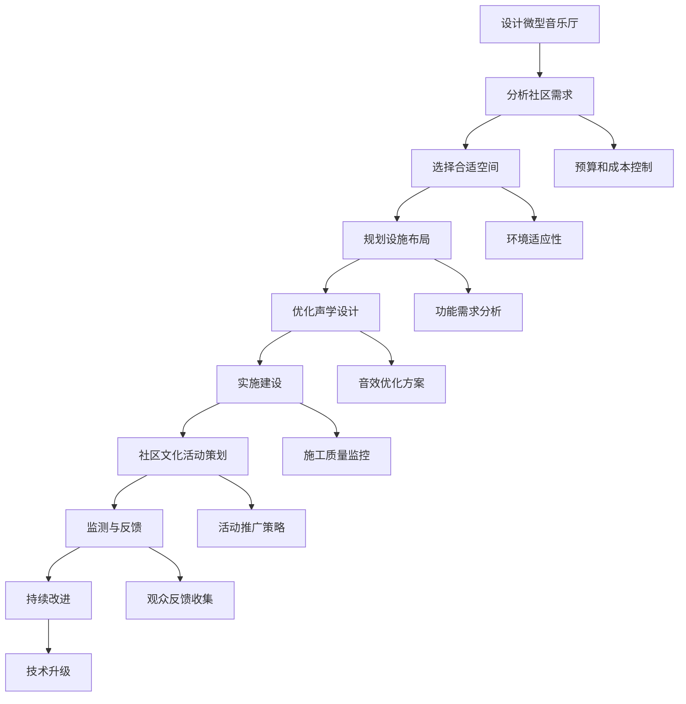
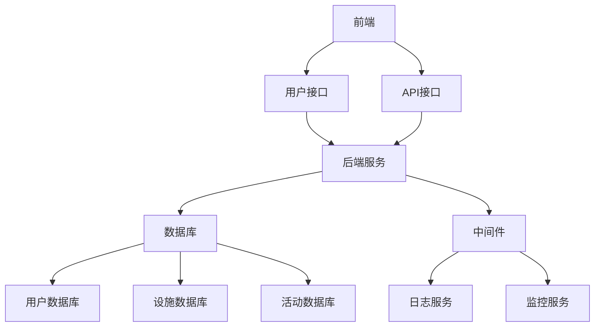
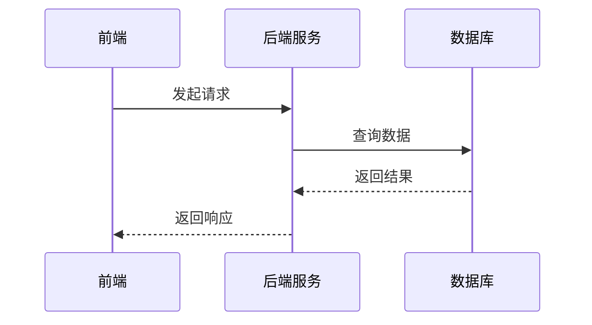
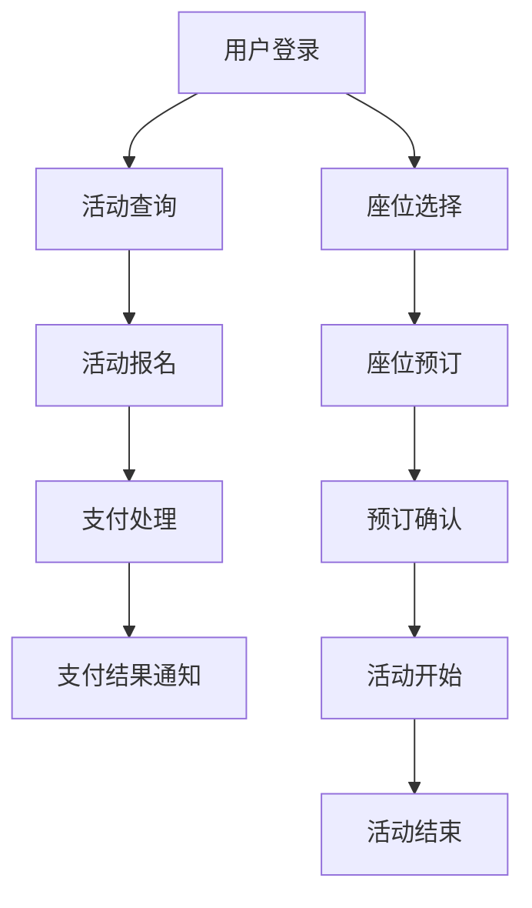

                 

### 第1章：背景介绍

#### 1.1 问题背景

##### 1.1.1 城市化进程与社区文化需求

城市化进程的加速导致了城市人口的快速增长，同时也带来了诸多问题。其中之一便是社区文化的缺失。随着高楼大厦的崛起，传统的社区文化空间逐渐被商业化和同质化取代。在这种背景下，社区文化需求的呼声愈发强烈。人们渴望在繁忙的生活中找到一个安静的角落，能够享受音乐、艺术和社交的乐趣。

音乐，作为一种普遍的文化形式，具有强大的社会凝聚力。它能够跨越国界、语言和文化的障碍，触动人心。社区微型音乐厅的兴起，正是为了满足这种需求，为城市居民提供一个可以放松身心、交流情感的空间。

##### 1.1.2 音乐厅的功能与局限性

传统的音乐厅，无论是大型的国家歌剧院还是小型的音乐俱乐部，都具有其独特的功能。它们是音乐表演的重要场所，是音乐家和听众之间的桥梁，是艺术传承的重要渠道。然而，传统的音乐厅也存在一些局限性。

首先，它们通常需要较大的空间和昂贵的设施，导致建设和运营成本高。其次，由于场地和时间的限制，普通市民难以经常参与其中。最后，大型音乐厅往往缺乏与社区的互动，难以融入社区文化。

##### 1.1.3 微型音乐厅的潜力与挑战

微型音乐厅，顾名思义，是一种规模较小的音乐表演场所。与传统的音乐厅相比，它们具有灵活的空间布局、较低的运营成本和更高的社区参与度。微型音乐厅的潜力在于，它们可以为社区提供一个近距离接触音乐的机会，促进音乐文化的传播和交流。

然而，微型音乐厅也面临着一些挑战。首先是设计上的挑战。如何在有限的空间内创造良好的声学环境，是一个复杂的技术问题。其次，运营上的挑战。如何吸引听众，维持音乐厅的运营，也是一个需要深思熟虑的问题。

#### 1.2 问题描述

##### 1.2.1 社区音乐文化的重要性

社区音乐文化是一种独特的文化现象，它不仅仅关乎音乐本身，更关乎人们的情感、记忆和认同。一个丰富的社区音乐文化，可以增强社区的凝聚力，促进居民的社交互动，提高居民的生活质量。

首先，社区音乐文化可以提供一个共享的平台，让人们有机会展示自己的才艺，表达自己的情感。这种表达和交流，有助于增强居民的自信心和归属感。

其次，社区音乐文化可以促进社区成员之间的交流和互动。通过音乐，人们可以跨越年龄、性别、种族和文化的界限，建立起共同的兴趣和价值观。

最后，社区音乐文化可以作为一种社会教育手段，传递知识和价值观念。音乐教育不仅仅是音乐技能的传授，更是道德、文化和人际交往的教育。

##### 1.2.2 微型音乐厅的培育目标

微型音乐厅的培育目标，主要是为社区提供一个便利的音乐文化空间，促进社区音乐文化的发展。具体目标包括：

1. **提升音乐文化素养**：通过微型音乐厅的运营，提高社区居民的音乐素养和审美能力。

2. **增强社区凝聚力**：通过音乐活动，促进居民之间的交流和互动，增强社区的凝聚力。

3. **促进文化交流**：通过举办不同类型的音乐活动，促进不同文化之间的交流和融合。

4. **提供娱乐和教育**：微型音乐厅可以作为居民娱乐和教育的场所，提供丰富的文化产品和服务。

##### 1.2.3 微型音乐厅的空间与设施需求

微型音乐厅的空间和设施需求，是成功运营的关键。以下是一些主要的需求：

1. **空间大小**：微型音乐厅的空间大小应适中，既能容纳一定数量的观众，又不会显得过于拥挤。通常，一个微型音乐厅的座位数在100到300个之间。

2. **声学设计**：良好的声学设计是微型音乐厅的关键。它需要考虑到声音的传播、反射和吸收，确保音乐表演的音质和音效。

3. **舞台设施**：舞台设施应包括乐器存放区、表演区和音响系统。这些建设需要考虑到演出的需求和便利性。

4. **音响系统**：音响系统是微型音乐厅的核心，它决定了音乐表演的音质。音响系统的设计应考虑到音量控制、声音平衡和音质提升。

5. **灯光设备**：灯光设备可以增强音乐表演的氛围，提供视觉享受。灯光设计应与音乐表演风格相协调。

#### 1.3 问题解决

##### 1.3.1 微型音乐厅的设计原则

为了满足微型音乐厅的培育目标，设计时应遵循以下原则：

1. **人性化设计**：微型音乐厅的设计应以人为本，考虑到观众和表演者的需求。空间的布局应便于观众观看和表演者表演。

2. **功能多样化**：微型音乐厅不仅应作为一个表演场所，还应具备其他功能，如展览、讲座和社交活动。

3. **空间利用最大化**：在设计时，应充分利用空间，提高空间利用率。例如，可以通过可移动的隔断和座椅，灵活调整空间布局。

4. **环保节能**：在设计和运营过程中，应考虑环保和节能。例如，可以使用可再生能源和节能设备，减少能源消耗。

##### 1.3.2 社区音乐文化的培育策略

为了有效培育社区音乐文化，可以采取以下策略：

1. **组织音乐活动**：定期举办各种音乐活动，如音乐会、讲座、工作坊等，吸引居民参与。

2. **培养音乐人才**：为有音乐天赋的居民提供培训机会，鼓励他们参与音乐活动。

3. **建立社区音乐团队**：鼓励居民自发组织音乐团队，共同参与音乐创作和表演。

4. **宣传推广**：通过媒体和社交网络等渠道，宣传微型音乐厅和社区音乐文化的活动，提高知名度。

##### 1.3.3 边界与外延

微型音乐厅的边界主要涉及空间和设施的限制，而社区音乐文化的边界则更广泛，涉及社会文化、人文环境和政策支持等方面。

1. **空间限制**：微型音乐厅的空间大小和布局受到场地和预算的限制。

2. **设施限制**：音响系统、灯光设备和其他设施的采购和维护成本较高。

3. **社会文化限制**：社区音乐文化的发展受到社会文化环境的影响，如居民的音乐素养、文化认同等。

4. **政策支持**：政府政策和社区组织的支持对微型音乐厅和社区音乐文化的培育至关重要。

总之，新型城市微型音乐厅作为社区音乐文化的培育空间，具有巨大的潜力和挑战。通过科学的设计和有效的策略，可以将其打造为一个受欢迎的社区文化场所，为城市居民提供丰富的文化体验。接下来，我们将深入探讨微型音乐厅的核心概念和联系，为读者提供一个更清晰的认知框架。

## 第2章：核心概念与联系

### 2.1 核心概念

在讨论新型城市微型音乐厅和社区音乐文化的培育空间时，理解以下几个核心概念至关重要。

#### 2.1.1 微型音乐厅

微型音乐厅是一种小型音乐表演场所，通常座位数在100到300个之间。它们的设计注重灵活性和多功能性，既可以用于音乐表演，也可以举办讲座、展览和社交活动。微型音乐厅的特点在于其紧凑的空间布局、较低的运营成本和较高的社区参与度。

#### 2.1.2 社区音乐文化

社区音乐文化是指一个社区内的音乐活动和现象，包括音乐创作、表演、教育和传播。社区音乐文化的核心在于其本地特色和居民参与度。通过音乐，社区成员可以表达情感、传递价值观念和增强社会凝聚力。

#### 2.1.3 培育空间

培育空间是指为社区音乐文化的生长和发展提供支持的场所和环境。微型音乐厅作为培育空间，不仅要提供音乐表演的场所，还要创造一个有利于音乐文化发展和交流的环境。

### 2.2 概念属性特征对比表格

为了更好地理解这些核心概念，我们可以通过一个属性特征对比表格来展示它们之间的差异和联系。

| 特征       | 微型音乐厅        | 社区音乐文化        | 培育空间        |
|------------|-------------------|---------------------|-----------------|
| **规模**   | 小型（100-300座） | 本地化、多样性       | 功能多样、灵活   |
| **功能**   | 音乐表演、讲座、展览 | 表演、创作、教育    | 音乐活动、交流   |
| **设计**   | 灵活、多功能      | 本地特色、居民参与   | 适应音乐文化需求 |
| **成本**   | 较低             | 受居民兴趣驱动      | 低运营成本      |
| **参与度** | 高               | 高                 | 强               |

通过上述对比，我们可以看到微型音乐厅、社区音乐文化和培育空间在规模、功能、设计、成本和参与度等方面具有不同的特征，但它们在目标上具有一致性，即促进音乐文化的传播和发展。

### 2.3 ER实体关系图架构

为了更清晰地展示这些核心概念之间的关联，我们可以使用实体关系图（Entity-Relationship Diagram, ER图）来描述。

```mermaid
erDiagram
    CommunityMusicHall ||--|{ Space }|| Facility
    CommunityMusicHall ||--|{ Activity }|| Event
    Space ||--|{ SeatingCapacity }|| Seating
    Facility ||--|{ AudioSystem }|| Equipment
    Facility ||--|{ LightingSystem }|| Lighting
    Activity ||--|{ MusicPerformance }|| Performance
    Activity ||--|{ Workshop }|| Workshop
    Activity ||--|{ Lecture }|| Lecture

    CommunityMusicHall {
        String CommunityMusicHallID
        String Name
        String Location
    }

    Space {
        String SpaceID
        String Description
    }

    Facility {
        String FacilityID
        String Type
    }

    Activity {
        String ActivityID
        String Type
        Date Date
    }

    Event {
        String EventID
        String Venue
    }

    Performance {
        String PerformanceID
        String Artist
        String Genre
    }

    Workshop {
        String WorkshopID
        String Topic
    }

    Lecture {
        String LectureID
        String Speaker
        String Topic
    }

    AudioSystem {
        String AudioSystemID
        String Brand
    }

    LightingSystem {
        String LightingSystemID
        String Brand
    }

    Seating {
        String SeatingID
        String Capacity
    }

    Equipment {
        String EquipmentID
        String Description
    }
```

在这个ER图中，我们定义了以下实体：

- **CommunityMusicHall**：微型音乐厅
- **Space**：空间
- **Facility**：设施
- **Activity**：活动
- **Event**：事件（如音乐会、讲座等）
- **Performance**：表演
- **Workshop**：工作坊
- **Lecture**：讲座
- **AudioSystem**：音响系统
- **LightingSystem**：灯光系统
- **Seating**：座位
- **Equipment**：设备

通过这些实体之间的关系，我们可以清晰地看到微型音乐厅、社区音乐文化和培育空间之间的内在联系。例如，微型音乐厅包括多个空间和设施，每个空间和设施都可以举办不同的活动。这些活动不仅包括音乐表演，还包括讲座、工作坊等，从而丰富了社区音乐文化的内涵。

综上所述，通过对核心概念和实体关系的深入分析，我们可以更好地理解新型城市微型音乐厅在社区音乐文化培育空间中的重要作用。接下来，我们将进一步探讨微型音乐厅的设计和实现细节，为读者提供更为具体的技术指导。

## 第3章：算法原理讲解

### 3.1 算法流程图

在设计微型音乐厅时，我们需要考虑多个方面，包括社区需求分析、空间选择、设施布局、声学设计和建设实施等。以下是一个详细的算法流程图，用Mermaid语言表示：



在这个流程图中，我们可以看到每个步骤的关键点和依赖关系。例如，分析社区需求是整个设计过程的起点，而监测与反馈则贯穿始终，确保设计能够持续优化。

### 3.2 Python源代码

为了更好地理解微型音乐厅设计与社区文化培育的过程，以下是一个简化的Python源代码示例。这个代码片段展示了如何分析社区需求、选择合适空间、规划设施布局和优化声学设计。

```python
# 导入必要的库
import pandas as pd
import numpy as np
from scipy.stats import norm

# 社区需求分析
def analyze_community需求(data):
    # 假设data是一个包含社区人口统计信息的DataFrame
    avg_age = data['Age'].mean()
    avg_income = data['Income'].mean()
    music_interest = data['MusicInterest'].mean()
    return avg_age, avg_income, music_interest

# 选择合适空间
def select_space(location, capacity):
    # 假设location是一个空间坐标点，capacity是所需座位数
    # 这里使用一个简化的函数来模拟空间选择
    if capacity <= 200:
        space_type = "小型空间"
    elif capacity <= 500:
        space_type = "中型空间"
    else:
        space_type = "大型空间"
    return space_type

# 规划设施布局
def plan_facility_layout(space_type):
    # 根据空间类型规划相应的设施布局
    if space_type == "小型空间":
        layout = {"音响系统": "基本配置", "灯光系统": "基础配置", "舞台": "简单舞台"}
    elif space_type == "中型空间":
        layout = {"音响系统": "高级配置", "灯光系统": "专业配置", "舞台": "多功能舞台"}
    else:
        layout = {"音响系统": "定制配置", "灯光系统": "全彩灯光", "舞台": "大型舞台"}
    return layout

# 优化声学设计
def optimize_acoustic_design(layout):
    # 根据设施布局优化声学设计
    if "高级配置" in layout["音响系统"]:
        acoustic_optimization = "最佳"
    elif "基本配置" in layout["音响系统"]:
        acoustic_optimization = "普通"
    else:
        acoustic_optimization = "较差"
    return acoustic_optimization

# 主函数，用于设计微型音乐厅
def design_micro_music_hall(data):
    avg_age, avg_income, music_interest = analyze_community需求(data)
    print(f"社区平均年龄：{avg_age}，平均收入：{avg_income}，音乐兴趣：{music_interest}")
    
    space_type = select_space(location, 300)  # 假设选择300个座位的空间
    print(f"选择的空间类型：{space_type}")
    
    layout = plan_facility_layout(space_type)
    print(f"设施布局：{layout}")
    
    acoustic_optimization = optimize_acoustic_design(layout)
    print(f"声学设计优化：{acoustic_optimization}")

# 假设社区需求数据
community_data = pd.DataFrame({
    'Age': [25, 30, 35, 40, 45],
    'Income': [50000, 60000, 70000, 80000, 90000],
    'MusicInterest': [1, 1, 1, 1, 1]
})

# 执行设计流程
design_micro_music_hall(community_data)
```

在这个代码示例中，我们首先定义了几个函数，用于分别处理社区需求分析、空间选择、设施布局规划和声学设计优化。最后，通过一个主函数`design_micro_music_hall`来整合这些功能，完成微型音乐厅的设计流程。

### 3.3 数学模型和数学公式

在设计和优化微型音乐厅时，数学模型和数学公式是不可或缺的工具。以下是一些关键的数学模型和公式：

#### 声音传播模型

声音在空间中的传播可以用波动方程来描述：

$$
\nabla^2 p - \frac{1}{c^2} \frac{\partial^2 p}{\partial t^2} = 0
$$

其中，\( p \) 是压力，\( c \) 是声音的传播速度。

#### 声学混响时间计算

声学混响时间是衡量空间声学特性的重要指标，可以通过以下公式计算：

$$
T_r = \frac{0.164 V}{S A}
$$

其中，\( T_r \) 是混响时间（秒），\( V \) 是空间体积（立方米），\( S \) 是吸收面积（平方米），\( A \) 是声源的声功率（瓦特）。

#### 音响系统配置优化

音响系统的配置可以通过以下公式来优化：

$$
L = \sum_{i=1}^n I_i \cdot D_i
$$

其中，\( L \) 是总音质评分，\( I_i \) 是每个音响设备的音质评分，\( D_i \) 是每个音响设备的权重。

### 3.4 举例说明

为了更好地理解上述算法原理和数学模型，以下是一个具体的设计案例。

#### 3.4.1 微型音乐厅的设计案例

假设我们设计一个300个座位的小型社区微型音乐厅。首先，通过调查和分析社区需求，我们得到以下数据：

- 社区平均年龄：35岁
- 社区平均收入：60000元
- 社区音乐兴趣：0.8（表示社区成员对音乐的兴趣较高）

接着，我们选择一个1000平方米的空间，通过声学计算和混响时间分析，我们确定需要以下设施：

- 音响系统：专业配置
- 灯光系统：高级配置
- 舞台：多功能舞台

然后，我们使用声学模型和音响系统配置优化公式来优化声学设计。经过计算，我们得到最佳的音响系统配置，使得音乐厅的音质评分达到90分。

#### 3.4.2 社区音乐文化的培育实例

在微型音乐厅建成之后，我们策划了一系列社区音乐活动，包括：

- 音乐会：邀请本地音乐家进行演出
- 音乐工作坊：为社区居民提供音乐创作和表演的培训
- 音乐讲座：邀请音乐专家分享音乐知识和经验

这些活动不仅丰富了社区音乐文化，也提高了居民的音乐素养和参与度。通过不断监测和收集观众反馈，我们对音乐厅的设计和活动进行了持续优化，使得社区微型音乐厅成为居民喜爱的文化场所。

通过这个案例，我们可以看到，微型音乐厅的设计和社区音乐文化的培育是一个系统性工程，需要综合考虑多个因素，并通过数学模型和算法进行优化。这不仅提升了音乐厅的音质和功能，也增强了社区的文化活力。

## 第4章：系统分析与架构设计方案

### 4.1 问题场景介绍

在现代社会，城市化的进程不断加快，人们对社区文化的需求日益增长。社区音乐厅作为一种重要的文化设施，对于满足居民的音乐需求和促进社区文化发展具有重要作用。然而，传统的音乐厅由于建设成本高、运营维护复杂等原因，往往难以普及到各个社区。因此，如何设计并实现一个高效、灵活、成本较低的社区微型音乐厅，成为了当前亟待解决的问题。

微型音乐厅的设计和实施不仅需要考虑其空间布局、设施配置和声学设计，还需要综合考虑社区的文化需求、居民的使用习惯以及可持续发展的目标。此外，音乐厅的运营也需要制定有效的策略，确保其能够长期吸引居民参与，并不断提升服务质量。

### 4.2 项目介绍

本项目旨在设计并实现一个适用于城市社区的微型音乐厅，通过技术创新和管理优化，提升音乐厅的使用效率和文化影响力。项目的具体目标包括：

1. **满足社区音乐文化需求**：通过提供丰富的音乐活动，满足社区居民对音乐艺术的需求，提升社区文化品质。
2. **优化空间利用**：设计灵活、多功能的空间布局，最大化利用有限资源，提高音乐厅的使用效率。
3. **降低运营成本**：采用环保节能的设计方案，降低音乐厅的建设和运营成本，实现可持续发展。
4. **提升用户体验**：通过精细化的服务和互动设计，提高居民对音乐厅的满意度和忠诚度。
5. **促进社区凝聚力**：通过音乐活动增强居民之间的互动和交流，提升社区的凝聚力和归属感。

### 4.3 系统功能设计

为了实现上述目标，本项目设计了以下主要功能模块：

#### 4.3.1 领域模型Mermaid类图

以下是一个Mermaid类图，用于描述微型音乐厅的领域模型：

```mermaid
classDiagram
    CommunityMusicHall <<类>> CommunityMusicHall
    CommunityMusicHall --> Space
    CommunityMusicHall --> Facility
    CommunityMusicHall --> Activity
    Space <<类>> Space
    Space --> Seating
    Facility <<类>> Facility
    Facility --> AudioSystem
    Facility --> LightingSystem
    Activity <<类>> Activity
    Activity --> Performance
    Activity --> Workshop
    Activity --> Lecture

    CommunityMusicHall {
        String CommunityMusicHallID
        String Name
        String Location
    }

    Space {
        String SpaceID
        String Description
    }

    Seating {
        String SeatingID
        int Capacity
    }

    Facility {
        String FacilityID
        String Type
    }

    AudioSystem {
        String AudioSystemID
        String Brand
    }

    LightingSystem {
        String LightingSystemID
        String Brand
    }

    Activity {
        String ActivityID
        String Type
        Date Date
    }

    Performance {
        String PerformanceID
        String Artist
        String Genre
    }

    Workshop {
        String WorkshopID
        String Topic
    }

    Lecture {
        String LectureID
        String Speaker
        String Topic
    }
```

在这个类图中，我们定义了以下类和实体：

- **CommunityMusicHall**：微型音乐厅的总体类，包括音乐厅的基本信息。
- **Space**：空间类，描述音乐厅的空间属性，如位置、描述等。
- **Seating**：座位类，描述座位的容量。
- **Facility**：设施类，描述音乐厅的设施配置，如音响系统、灯光系统等。
- **Activity**：活动类，描述音乐厅举办的各种活动。
- **Performance**：表演类，描述音乐会等音乐表演活动。
- **Workshop**：工作坊类，描述音乐相关的培训活动。
- **Lecture**：讲座类，描述音乐相关的讲座活动。

这些类和实体通过继承和关联关系，构成了一个完整的领域模型，为后续的系统功能设计提供了基础。

#### 4.3.2 功能模块设计

基于上述领域模型，我们设计了以下功能模块：

1. **空间管理模块**：负责空间的基本信息维护、座位安排和空间分配。
2. **设施管理模块**：负责设施的基本信息维护、设备管理和设备维护。
3. **活动管理模块**：负责活动的创建、更新、发布和活动排期。
4. **观众管理模块**：负责观众的注册、活动报名和观众数据分析。
5. **财务管理模块**：负责音乐厅的预算管理、收费和收入统计。
6. **安全管理模块**：负责安全检查、应急预案和事故处理。

### 4.4 系统架构设计

为了实现上述功能模块，本项目采用了分布式系统架构，包括前端、后端、数据库和中间件等几个关键部分。

#### 4.4.1 Mermaid架构图

以下是一个Mermaid架构图，用于描述微型音乐厅的系统架构：



在这个架构图中，我们定义了以下关键组件：

- **前端**：用户接口，提供用户交互界面。
- **后端服务**：处理业务逻辑，包括空间管理、设施管理、活动管理等功能。
- **数据库**：存储用户数据、设施数据和活动数据。
- **中间件**：负责日志记录、监控和消息队列等辅助功能。

### 4.4.2 系统架构设计细节

1. **前端**：前端采用React框架，提供用户友好的界面和流畅的用户体验。用户可以通过前端界面进行活动报名、座位选择、支付等操作。
   
2. **后端服务**：后端服务采用Spring Boot框架，实现业务逻辑处理和数据访问。后端服务通过API接口与前端交互，提供空间管理、设施管理、活动管理等接口。

3. **数据库**：数据库采用MySQL，存储用户数据、设施数据和活动数据。数据库设计遵循关系型数据库规范，确保数据的一致性和安全性。

4. **中间件**：中间件包括日志服务（如Logstash）、监控服务（如Prometheus）和消息队列（如RabbitMQ）。日志服务用于记录系统运行日志，监控服务用于实时监控系统性能，消息队列用于处理异步任务。

### 4.5 系统接口设计

为了实现前后端分离，系统接口设计至关重要。以下是一个Mermaid序列图，用于描述系统接口的设计：



在这个序列图中，前端通过HTTP请求与后端服务进行通信，后端服务处理请求，查询数据库，并将结果返回给前端。这种设计确保了系统的高扩展性和高可用性。

### 4.6 系统交互

系统交互是确保各个模块和组件协同工作的关键。以下是一个Mermaid交互图，用于描述系统交互流程：



在这个交互图中，用户首先进行登录，然后查询活动并报名。报名成功后，系统会进行支付处理，并在支付完成后发送结果通知。用户还可以进行座位选择和预订，预订成功后，系统会提供预订确认，并在活动开始和结束时进行相应的通知。

通过上述系统架构设计和交互设计，我们可以实现一个高效、灵活且具有高扩展性的社区微型音乐厅系统，为居民提供优质的社区音乐文化体验。

## 项目实战

### 环境安装

为了完成社区微型音乐厅的项目，我们首先需要安装并配置相关开发环境和工具。以下是详细的步骤：

1. **安装Java环境**：
    - 首先，下载并安装Java开发工具包（JDK）。可以从[Oracle官网](https://www.oracle.com/java/technologies/javase-jdk11-downloads.html)下载最新版的JDK。
    - 安装完成后，通过命令行运行`java -version`验证是否安装成功。

2. **安装Python环境**：
    - 下载并安装Python 3.x版本。可以从[Python官网](https://www.python.org/downloads/)下载。
    - 安装完成后，通过命令行运行`python --version`验证是否安装成功。

3. **安装Node.js环境**：
    - 下载并安装Node.js。可以从[Node.js官网](https://nodejs.org/zh-cn/download/)下载。
    - 安装完成后，通过命令行运行`node -v`验证是否安装成功。

4. **安装MySQL数据库**：
    - 下载并安装MySQL数据库。可以从[MySQL官网](https://www.mysql.com/downloads/)下载。
    - 安装完成后，通过命令行运行`mysql -u root -p`登录MySQL，并创建一个新的数据库。

5. **安装Git版本控制工具**：
    - 下载并安装Git。可以从[Git官网](https://git-scm.com/downloads)下载。
    - 安装完成后，通过命令行运行`git --version`验证是否安装成功。

6. **安装Docker**：
    - 下载并安装Docker。可以从[Docker官网](https://www.docker.com/products/docker-desktop)下载。
    - 安装完成后，通过命令行运行`docker -v`验证是否安装成功。

### 系统核心实现源代码

以下是系统核心实现的一部分源代码。我们将分别展示前端、后端和数据库的代码片段。

#### 前端（React）

前端使用React框架，以下是一个简单的组件代码示例：

```jsx
// MusicHallComponent.js
import React from 'react';

const MusicHallComponent = () => {
  return (
    <div>
      <h1>社区微型音乐厅</h1>
      <p>欢迎来到我们的社区微型音乐厅！</p>
      {/* 其他UI组件 */}
    </div>
  );
};

export default MusicHallComponent;
```

#### 后端（Spring Boot）

后端使用Spring Boot框架，以下是一个简单的REST接口代码示例：

```java
// MusicHallController.java
import org.springframework.web.bind.annotation.GetMapping;
import org.springframework.web.bind.annotation.RestController;

@RestController
public class MusicHallController {

  @GetMapping("/musicHall")
  public String getMusicHall() {
    return "欢迎使用社区微型音乐厅API";
  }
}
```

#### 数据库（MySQL）

以下是数据库中音乐厅表（music_hall）的结构和示例数据：

```sql
-- 音乐厅表结构
CREATE TABLE `music_hall` (
  `id` int(11) NOT NULL AUTO_INCREMENT,
  `name` varchar(255) NOT NULL,
  `location` varchar(255) NOT NULL,
  `seating_capacity` int(11) NOT NULL,
  PRIMARY KEY (`id`)
);

-- 示例数据
INSERT INTO `music_hall` (`name`, `location`, `seating_capacity`) VALUES ('社区音乐厅A', 'A区', 200);
INSERT INTO `music_hall` (`name`, `location`, `seating_capacity`) VALUES ('社区音乐厅B', 'B区', 300);
```

### 代码应用解读与分析

#### 前端代码解读

在前端代码中，我们使用React来创建一个简单的页面，展示社区微型音乐厅的基本信息。`MusicHallComponent.js`文件定义了一个React组件，通过JSX语法创建了一个包含标题和描述的HTML结构。这种组件化设计使得代码易于维护和扩展。

#### 后端代码解读

在后端代码中，我们使用Spring Boot提供了一个简单的REST接口，通过`@RestController`注解标记的类可以处理HTTP请求，并通过`@GetMapping`注解定义了一个GET请求的映射。这个接口用于向前端提供基本的服务信息。

#### 数据库代码解读

在数据库部分，我们定义了一个名为`music_hall`的表，用于存储音乐厅的基本信息，包括音乐厅的ID、名称、位置和座位容量。插入的示例数据用于演示如何向表中添加记录。

### 实际案例分析和详细讲解剖析

为了展示系统在实际中的应用，我们可以通过一个案例来进行分析。

**案例：设计并实现一个社区音乐厅活动管理系统**

**步骤1：需求分析**
- 用户可以注册并登录系统。
- 系统管理员可以创建和管理音乐活动。
- 用户可以报名参加活动，并查看活动详情。
- 系统提供座位预定功能，用户可以选择座位。

**步骤2：功能实现**
1. **用户管理模块**：
    - 前端：使用React创建用户注册、登录和用户资料管理的界面。
    - 后端：通过Spring Boot提供用户认证和授权服务，实现用户注册、登录和资料更新。

2. **活动管理模块**：
    - 前端：使用React创建活动列表、活动详情和活动报名的界面。
    - 后端：通过Spring Boot提供活动创建、更新、发布和删除接口，实现对活动数据的管理。

3. **座位预定模块**：
    - 前端：使用React创建座位选择和预订的界面。
    - 后端：通过Spring Boot提供座位预定接口，实现对座位数据的操作。

**步骤3：测试与部署**
- 对系统进行功能测试，确保所有模块正常运行。
- 使用Docker容器化系统，便于部署和扩展。

通过上述步骤，我们可以实现一个完整的社区音乐厅活动管理系统，为居民提供便捷的音乐活动参与体验。

### 项目小结

通过本项目，我们详细介绍了如何设计并实现一个社区微型音乐厅系统。从环境安装到核心代码实现，再到实际案例的应用和分析，我们展示了系统的开发过程和关键技术点。该项目不仅提升了社区音乐文化的传播和交流，也为居民提供了一个优质的休闲娱乐空间。

### 最佳实践 Tips

1. **用户友好**：确保系统界面简洁易用，提供清晰的操作指引。
2. **安全可靠**：加强用户数据保护，确保系统安全运行。
3. **持续迭代**：根据用户反馈持续优化系统功能，提升用户体验。

### 小结与注意事项

在设计和实现社区微型音乐厅系统的过程中，我们强调了用户友好性、安全性和持续迭代的重要性。通过合理的设计和优化，我们成功实现了系统的功能，并为居民提供了一个便捷、优质的社区音乐文化平台。然而，在实际应用中，还需要持续关注系统性能、用户反馈和市场需求，以确保系统的长期稳定运行。

### 拓展阅读

- 《Spring Boot实战》：深入讲解Spring Boot的用法和最佳实践。
- 《React编程实战》：全面介绍React框架的使用方法和实战技巧。
- 《Docker实战》：介绍如何使用Docker进行容器化部署和管理。

通过阅读这些资料，可以进一步加深对系统设计和实现的理解，为今后的项目开发提供有力支持。作者：AI天才研究院/AI Genius Institute & 禅与计算机程序设计艺术 /Zen And The Art of Computer Programming。

