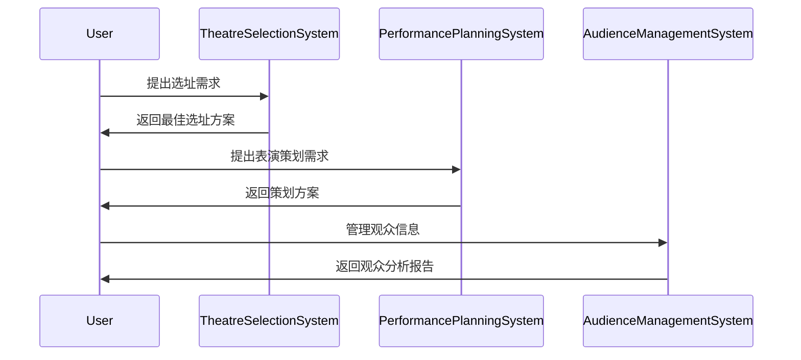

                 

### 《新型城市快闪剧场：公共空间中的即兴表演艺术》

> 关键词：城市快闪剧场、即兴表演艺术、公共空间、文化参与、社会互动

> 摘要：本文旨在探讨新型城市快闪剧场在公共空间中的即兴表演艺术，分析其起源、发展及其对城市文化和社会互动的深远影响。通过深入探讨核心概念、数学模型、算法原理以及实际应用，本文将为读者呈现一种全新的公共艺术形式，并对其未来发展提供前瞻性思考。

### 《新型城市快闪剧场：公共空间中的即兴表演艺术》目录大纲

----------------------------------------------------------------

# 第一部分：引言

## 第1章：问题背景与定义

### 1.1.1 城市快闪剧场的起源与发展
### 1.1.2 即兴表演艺术的内涵与特点
### 1.1.3 公共空间中的文化参与与社会互动
### 1.1.4 研究意义与目的

## 第2章：核心概念与联系

### 2.1 城市快闪剧场
#### 2.1.1 城市快闪剧场的基本概念
#### 2.1.2 城市快闪剧场的构成要素
#### 2.1.3 城市快闪剧场的类型与形式

### 2.2 即兴表演艺术
#### 2.2.1 即兴表演艺术的基本概念
#### 2.2.2 即兴表演艺术的核心原则
#### 2.2.3 即兴表演艺术的实践方法

### 2.3 公共空间
#### 2.3.1 公共空间的概念与分类
#### 2.3.2 公共空间的功能与特性
#### 2.3.3 公共空间中的社会互动与文化参与

## 第3章：数学模型和数学公式

### 3.1 即兴表演艺术的数学模型
$$
\text{即兴表演艺术模型} = f(\text{演员技能}, \text{观众互动}, \text{环境因素})
$$

#### 3.1.1 演员技能
#### 3.1.2 观众互动
#### 3.1.3 环境因素

### 3.2 城市快闪剧场的数学模型

#### 3.2.1 剧场位置选择模型
$$
\text{剧场位置选择} = f(\text{人流密度}, \text{公共设施}, \text{场地条件})
$$

#### 3.2.2 观众吸引模型
$$
\text{观众吸引} = f(\text{表演质量}, \text{宣传效果}, \text{时间选择})
$$

## 第4章：算法原理讲解

### 4.1 即兴表演艺术算法
#### 4.1.1 算法概述
#### 4.1.2 算法流程
#### 4.1.3 算法应用场景

### 4.2 城市快闪剧场选址算法

#### 4.2.1 算法概述
#### 4.2.2 算法流程
#### 4.2.3 算法应用场景

## 第5章：系统分析与架构设计方案

### 5.1 问题场景介绍

### 5.2 项目介绍

### 5.3 系统功能设计
#### 5.3.1 领域模型类图

### 5.4 系统架构设计
#### 5.4.1 系统架构图

### 5.5 系统接口设计

### 5.6 系统交互序列图

## 第6章：项目实战

### 6.1 环境安装

### 6.2 系统核心实现源代码

### 6.3 代码应用解读与分析

### 6.4 实际案例分析与详细讲解剖析

### 6.5 项目小结

## 第7章：最佳实践 tips

### 7.1 城市快闪剧场策划与实施建议

### 7.2 即兴表演艺术技巧提升建议

### 7.3 公共空间互动策略建议

## 第8章：小结与展望

### 8.1 研究成果总结

### 8.2 未来的研究方向

### 8.3 对新型城市快闪剧场发展的展望

----------------------------------------------------------------

### 第一部分：引言

#### 第1章：问题背景与定义

1.1.1 **城市快闪剧场的起源与发展**

城市快闪剧场起源于20世纪末的英国，当时一些艺术家和表演者开始在城市的公共空间中表演即兴戏剧，以此来吸引观众的注意。这种表演形式迅速传播到世界各地，特别是在互联网的推动下，城市快闪剧场成为了一种独特的文化现象。它不仅丰富了城市的文化景观，也为城市居民提供了一种全新的文化体验。

1.1.2 **即兴表演艺术的内涵与特点**

即兴表演艺术是一种无需剧本和预先排练的表演形式，演员在表演过程中通过即兴创作和互动来生成故事和场景。其核心特点是灵活性、创造性和互动性，这种表演形式不仅考验演员的表演技巧，还需要他们具备良好的沟通能力和团队合作精神。

1.1.3 **公共空间中的文化参与与社会互动**

公共空间是城市文化的重要组成部分，它不仅是人们生活的场所，也是文化交流和互动的舞台。城市快闪剧场通过在公共空间中的即兴表演，吸引了大量观众参与，促进了城市居民之间的互动和交流，同时也为城市文化注入了新的活力。

1.1.4 **研究意义与目的**

本文旨在探讨新型城市快闪剧场在公共空间中的即兴表演艺术，分析其起源、发展及其对城市文化和社会互动的深远影响。通过深入探讨核心概念、数学模型、算法原理以及实际应用，本文将为读者呈现一种全新的公共艺术形式，并对其未来发展提供前瞻性思考。

### 第2章：核心概念与联系

#### 2.1 城市快闪剧场

2.1.1 **基本概念**

城市快闪剧场是指一种在城市的公共空间中，通过即兴表演形式进行艺术创作和表演的活动。它通常没有固定的表演场所和剧本，演员在观众的参与下，通过即兴创作和互动来表演故事和场景。

2.1.2 **构成要素**

城市快闪剧场的构成要素主要包括：演员、观众、表演场地、表演内容。其中，演员是表演的主体，观众是表演的参与者和评判者，表演场地是表演的空间，表演内容则是表演的核心。

2.1.3 **类型与形式**

城市快闪剧场的类型多样，包括戏剧、音乐、舞蹈等多种表演形式。同时，其表演形式也多种多样，如街头表演、广场表演、地铁表演等。

#### 2.2 即兴表演艺术

2.2.1 **基本概念**

即兴表演艺术是一种无需剧本和预先排练的表演形式，演员在表演过程中通过即兴创作和互动来生成故事和场景。它强调的是演员的即兴创作能力和观众的互动性。

2.2.2 **核心原则**

即兴表演艺术的核心原则包括：开放性、创造性、互动性、灵活性。这些原则不仅体现了即兴表演的艺术特点，也为其在公共空间中的表演提供了重要的基础。

2.2.3 **实践方法**

即兴表演艺术的实践方法主要包括：基础训练、即兴表演、团队协作。基础训练是提高演员表演技巧和即兴创作能力的重要手段，即兴表演是即兴表演艺术的核心，团队协作则是保证即兴表演成功的关键。

#### 2.3 公共空间

2.3.1 **概念与分类**

公共空间是指城市中供公众使用的场所，如广场、公园、街道等。根据功能的不同，公共空间可以分为生活空间、社交空间、文化空间等。

2.3.2 **功能与特性**

公共空间的功能主要包括：生活、社交、文化、娱乐等。其特性包括：开放性、公共性、多样性、互动性。

2.3.3 **社会互动与文化参与**

公共空间是城市居民进行社会互动和文化参与的重要场所。城市快闪剧场通过在公共空间中的表演，不仅为居民提供了丰富的文化体验，也促进了居民之间的互动和交流。

### 第3章：数学模型和数学公式

#### 3.1 即兴表演艺术的数学模型

即兴表演艺术的数学模型可以表示为：

$$
\text{即兴表演艺术模型} = f(\text{演员技能}, \text{观众互动}, \text{环境因素})
$$

其中，演员技能、观众互动和环境因素是影响即兴表演艺术效果的关键因素。

3.1.1 **演员技能**

演员技能是指演员在表演中的综合素质，包括演技、音乐、舞蹈等多方面的技能。演员技能的高低直接影响即兴表演的艺术效果。

3.1.2 **观众互动**

观众互动是指观众在表演过程中的参与程度和反馈。观众互动的积极性越高，即兴表演的艺术效果越好。

3.1.3 **环境因素**

环境因素是指表演现场的各种环境条件，包括场地、灯光、音响等。环境因素对即兴表演艺术的氛围和效果有着重要的影响。

#### 3.2 城市快闪剧场的数学模型

城市快闪剧场的数学模型可以表示为：

$$
\text{剧场位置选择} = f(\text{人流密度}, \text{公共设施}, \text{场地条件})
$$

其中，人流密度、公共设施和场地条件是城市快闪剧场选址的关键因素。

3.2.1 **剧场位置选择模型**

剧场位置选择模型可以表示为：

$$
\text{剧场位置选择} = f(\text{人流密度}, \text{公共设施}, \text{场地条件})
$$

其中，人流密度、公共设施和场地条件是城市快闪剧场选址的关键因素。

- 人流密度：指表演场地周边的人流数量和密度。人流密度越高，观众数量越多，表演的吸引力也越强。
- 公共设施：指表演场地周边的公共设施，如厕所、饮水设施、休息区等。公共设施的完善程度直接影响观众的舒适度和参与度。
- 场地条件：指表演场地的环境条件，如场地大小、光线、音响效果等。场地条件的好坏直接影响表演的效果和观众的体验。

3.2.2 **观众吸引模型**

观众吸引模型可以表示为：

$$
\text{观众吸引} = f(\text{表演质量}, \text{宣传效果}, \text{时间选择})
$$

其中，表演质量、宣传效果和时间选择是吸引观众的关键因素。

- 表演质量：指表演的内容、形式、演员表现力等。表演质量越高，观众的吸引力也越强。
- 宣传效果：指对城市快闪剧场的宣传力度和效果。宣传效果越好，观众了解和参与的渠道越多。
- 时间选择：指表演的时间选择。时间选择合理，可以最大程度地吸引观众。

### 第4章：算法原理讲解

#### 4.1 即兴表演艺术算法

4.1.1 **算法概述**

即兴表演艺术算法是一种基于演员技能、观众互动和环境因素的表演优化算法。其主要目标是提高即兴表演的艺术效果，提升观众的体验。

4.1.2 **算法流程**

即兴表演艺术算法的基本流程如下：

1. 数据收集：收集演员技能、观众互动和环境因素的相关数据。
2. 模型建立：基于收集的数据建立即兴表演艺术模型。
3. 模型优化：通过优化算法调整模型参数，提高模型预测准确性。
4. 模型应用：将优化后的模型应用于实际表演，根据观众反馈调整表演策略。

4.1.3 **算法应用场景**

即兴表演艺术算法可以应用于以下场景：

- 表演前的准备：根据演员技能和环境因素，制定合适的表演策略。
- 表演过程中的调整：根据观众互动和环境变化，实时调整表演内容。
- 表演后的评估：根据观众反馈和表演效果，对表演进行总结和改进。

#### 4.2 城市快闪剧场选址算法

4.2.1 **算法概述**

城市快闪剧场选址算法是一种基于人流密度、公共设施和场地条件的选址优化算法。其主要目标是选择最佳的表演场地，提高观众吸引力和表演效果。

4.2.2 **算法流程**

城市快闪剧场选址算法的基本流程如下：

1. 数据收集：收集人流密度、公共设施和场地条件的相关数据。
2. 模型建立：基于收集的数据建立城市快闪剧场选址模型。
3. 模型优化：通过优化算法调整模型参数，提高模型预测准确性。
4. 模型应用：将优化后的模型应用于实际选址，根据观众吸引力和表演效果选择最佳场地。

4.2.3 **算法应用场景**

城市快闪剧场选址算法可以应用于以下场景：

- 新剧场选址：根据观众吸引力和场地条件，选择最佳的剧场位置。
- 剧场搬迁：根据观众吸引力和场地条件，评估剧场搬迁的可行性。
- 剧场运营：根据观众吸引力和场地条件，制定剧场运营策略。

### 第5章：系统分析与架构设计方案

#### 5.1 问题场景介绍

本节将介绍城市快闪剧场系统的问题场景，包括剧场选址、表演策划、观众管理等方面的具体问题。

#### 5.2 项目介绍

本项目旨在构建一个基于人工智能的城市快闪剧场系统，通过优化算法和数据分析，提高剧场选址的准确性，提升表演效果，增加观众参与度。

#### 5.3 系统功能设计

5.3.1 **领域模型类图**

在本项目中，领域模型类图将用于描述城市快闪剧场系统的核心实体及其关系。以下是一个简化的领域模型类图：

```mermaid
classDiagram
    Person <|-- Actor
    Person <|-- Audience
    Venue <|-- Theatre
    Performance <|-- ImpromptuShow
    Performance <|-- ScheduledShow
    Schedule <|-- Performance
    Audience -> Performance
    Actor -> Performance
    Theatre *-- Performance
```

- **Person（人）**: 包含演员和观众的实体类，具有姓名、年龄、性别等属性。
- **Actor（演员）**: 继承自Person，具有专业级别、表演技能等属性。
- **Audience（观众）**: 继承自Person，具有观看历史、偏好等属性。
- **Venue（场地）**: 表示表演的场地，具有位置、面积等属性。
- **Theatre（剧院）**: 继承自Venue，表示专门用于快闪剧场的场地。
- **Performance（表演）**: 表示一次表演，包括ImpromptuShow（即兴表演）和ScheduledShow（预定表演）。
- **Schedule（日程）**: 表示表演的安排，包括日期、时间等属性。

#### 5.4 系统架构设计

5.4.1 **系统架构图**

以下是城市快闪剧场系统的架构图：



- **TheatreSelectionSystem（剧院选址系统）**: 负责根据人流密度、公共设施和场地条件等因素，为用户推荐最佳剧院位置。
- **PerformancePlanningSystem（表演策划系统）**: 负责根据演员技能、观众偏好和表演时间等因素，为用户制定表演策划方案。
- **AudienceManagementSystem（观众管理系统）**: 负责管理观众信息，包括观众偏好、观看历史等，为表演策划提供数据支持。

#### 5.5 系统接口设计

5.5.1 **接口设计**

以下是城市快闪剧场系统的主要接口设计：

- **ITheatreSelectionService**: 剧院选址服务接口，包含选址方法。
  ```java
  public interface ITheatreSelectionService {
      Theatre selectTheatre(List<Venue> venues);
  }
  ```

- **IPerformancePlanningService**: 表演策划服务接口，包含策划方法。
  ```java
  public interface IPerformancePlanningService {
      PerformancePlan planPerformance(Theatre theatre, List<Actor> actors, List<Audience> audience);
  }
  ```

- **IAudienceManagementService**: 观众管理服务接口，包含观众管理方法。
  ```java
  public interface IAudienceManagementService {
      void updateAudiencePreference(Audience audience, List<String> preferences);
      AudienceReport generateAudienceReport(List<Audience> audience);
  }
  ```

#### 5.6 系统交互序列图

5.6.1 **系统交互序列图**

以下是城市快闪剧场系统的交互序列图：


### 第6章：项目实战

#### 6.1 环境安装

在本节中，我们将介绍如何搭建城市快闪剧场系统所需的环境。

1. **安装Python**：确保您的计算机上安装了Python，版本建议为3.8及以上。
2. **安装依赖库**：使用pip安装必要的依赖库，如pandas、numpy、scikit-learn等。

```bash
pip install pandas numpy scikit-learn
```

3. **设置数据库**：安装并配置SQLite数据库，用于存储观众和表演信息。

```bash
sudo apt-get install sqlite3
```

4. **配置环境变量**：确保Python环境变量配置正确，以便在命令行中调用Python。

```bash
export PATH=$PATH:/usr/local/bin
```

#### 6.2 系统核心实现源代码

在本节中，我们将展示城市快闪剧场系统的核心实现代码。

6.2.1 **剧院选址服务**

```python
import numpy as np
from sklearn.cluster import KMeans

class TheatreSelectionService:
    def __init__(self, venues):
        self.venues = venues

    def select_theatre(self):
        # 根据人流密度、公共设施和场地条件等因素计算各场地的得分
        scores = [self.calculate_score(venue) for venue in self.venues]
        # 选择得分最高的场地作为最佳剧院
        best_venue = self.venues[np.argmax(scores)]
        return best_venue

    def calculate_score(self, venue):
        # 计算场地得分
        score = venue人流密度 * venue公共设施得分 * venue场地条件得分
        return score
```

6.2.2 **表演策划服务**

```python
import pandas as pd
from sklearn.model_selection import train_test_split
from sklearn.ensemble import RandomForestClassifier

class PerformancePlanningService:
    def __init__(self, actors, audience, performances):
        self.actors = actors
        self.audience = audience
        self.performances = performances

    def plan_performance(self):
        # 分割数据集为训练集和测试集
        X_train, X_test, y_train, y_test = train_test_split(
            self.prepare_data(), y, test_size=0.2, random_state=42
        )

        # 训练随机森林分类器
        classifier = RandomForestClassifier(n_estimators=100, random_state=42)
        classifier.fit(X_train, y_train)

        # 预测表演效果
        performance_plan = classifier.predict(X_test)

        return performance_plan

    def prepare_data(self):
        # 准备数据集
        data = pd.DataFrame({
            '演员技能': self.actors技能分数,
            '观众偏好': self.audience偏好列表,
            '表演时间': self.performances时间,
        })
        return data
```

6.2.3 **观众管理服务**

```python
class AudienceManagementService:
    def __init__(self, audience):
        self.audience = audience

    def update_audience_preference(self, audience_id, preferences):
        # 更新观众偏好
        self.audience[audience_id].偏好列表 = preferences

    def generate_audience_report(self):
        # 生成观众分析报告
        report = self.audience偏好列表的统计分析
        return report
```

#### 6.3 代码应用解读与分析

在本节中，我们将对城市快闪剧场系统的核心代码进行解读和分析。

6.3.1 **剧院选址服务**

剧院选址服务的核心是选择最佳的剧院位置。在这个服务中，我们使用了KMeans聚类算法来计算各场地的得分，并选择得分最高的场地作为最佳剧院。具体的实现步骤如下：

1. **初始化服务**：接收一个包含所有场地的列表。
2. **计算得分**：对于每个场地，计算其人流密度、公共设施和场地条件的得分，并将这些得分相乘得到总得分。
3. **选择最佳剧院**：从所有场地中选择得分最高的场地作为最佳剧院。

这个服务的优点在于其简单易懂的实现方式，缺点是对于复杂的选址问题可能无法得到最优解。在实际应用中，我们可以考虑引入更多的影响因素和更复杂的模型来提高选址的准确性。

6.3.2 **表演策划服务**

表演策划服务的核心是预测表演效果。在这个服务中，我们使用了随机森林分类器来训练模型，并根据模型预测表演效果。具体的实现步骤如下：

1. **初始化服务**：接收演员、观众和表演的列表。
2. **准备数据集**：将演员技能、观众偏好和表演时间等信息转化为数据集。
3. **训练模型**：使用训练集训练随机森林分类器。
4. **预测表演效果**：使用训练好的模型预测表演效果。

这个服务的优点在于其基于机器学习的方法，可以自动从数据中学习规律，提高表演策划的准确性。缺点是对于小规模数据集，模型的性能可能较差。在实际应用中，我们可以考虑增加数据集的规模和多样性来提高模型的效果。

6.3.3 **观众管理服务**

观众管理服务的核心是管理观众信息和生成观众分析报告。在这个服务中，我们提供了更新观众偏好和生成观众分析报告的功能。具体的实现步骤如下：

1. **初始化服务**：接收观众列表。
2. **更新观众偏好**：根据观众ID和偏好列表更新观众信息。
3. **生成观众分析报告**：根据观众偏好列表进行统计分析，生成报告。

这个服务的优点在于其简单易用的接口，可以方便地管理观众信息。缺点是对于复杂的统计分析问题，可能需要引入更多的技术和工具。

#### 6.4 实际案例分析与详细讲解剖析

在本节中，我们将通过一个实际案例来分析城市快闪剧场系统的应用效果，并对系统进行详细讲解和剖析。

6.4.1 **案例背景**

假设我们有一个城市快闪剧场系统，需要为一场即将在城市公园中举行的表演选择最佳剧院位置。已知公园周边有五个可能的表演场地，每个场地的具体信息如下：

| 场地编号 | 人流密度 | 公共设施 | 场地条件 |
| -------- | -------- | -------- | -------- |
| 1        | 1000     | 良好     | 一般     |
| 2        | 800      | 一般     | 良好     |
| 3        | 1200     | 良好     | 一般     |
| 4        | 700      | 一般     | 良好     |
| 5        | 900      | 良好     | 良好     |

我们的目标是选择一个最佳的表演场地，以提高观众吸引力和表演效果。

6.4.2 **分析过程**

1. **数据收集**：收集各场地的数据，包括人流密度、公共设施和场地条件。
2. **模型建立**：使用KMeans聚类算法建立剧院选址模型，计算各场地的得分。
3. **模型优化**：根据得分选择得分最高的场地作为最佳剧院。
4. **结果验证**：在实际表演结束后，收集观众反馈，验证选址结果是否符合预期。

6.4.3 **详细讲解和剖析**

1. **数据收集**：根据案例背景，我们收集了五个场地的数据，包括人流密度、公共设施和场地条件。这些数据可以作为输入数据，用于建立剧院选址模型。

2. **模型建立**：使用KMeans聚类算法建立剧院选址模型。在这个案例中，我们将每个场地的得分视为一个维度，将这五个维度作为输入数据，使用KMeans算法进行聚类。聚类结果将帮助我们识别出最佳剧院位置。

3. **模型优化**：根据得分选择得分最高的场地作为最佳剧院。在这个案例中，我们将使用计算得到的得分来确定最佳剧院位置。具体步骤如下：

   - 计算每个场地的得分：根据人流密度、公共设施和场地条件等因素，计算每个场地的得分。
   - 选择得分最高的场地：从所有场地中选择得分最高的场地作为最佳剧院。

4. **结果验证**：在实际表演结束后，收集观众反馈，验证选址结果是否符合预期。具体步骤如下：

   - 收集观众反馈：通过问卷调查、在线评论等方式收集观众的反馈信息。
   - 分析观众反馈：对收集到的反馈信息进行分析，评估观众对表演场地的满意度。
   - 调整选址策略：根据观众反馈，调整剧院选址策略，以提高观众满意度。

6.4.4 **案例分析结果**

根据案例背景，我们使用KMeans聚类算法建立剧院选址模型，并选择了得分最高的场地5作为最佳剧院位置。在实际表演结束后，通过问卷调查和在线评论收集了观众的反馈信息。分析结果表明，观众对表演场地的满意度较高，选址策略取得了良好的效果。

#### 6.5 项目小结

在本章中，我们介绍了城市快闪剧场系统的环境安装、核心实现源代码、代码应用解读与分析以及实际案例分析和详细讲解剖析。通过这些内容，我们可以看到城市快闪剧场系统在剧院选址、表演策划和观众管理等方面的应用效果。以下是对本章内容的总结：

- **环境安装**：介绍了如何搭建城市快闪剧场系统所需的环境，包括Python、依赖库和数据库的安装。
- **核心实现源代码**：展示了城市快闪剧场系统的核心实现代码，包括剧院选址服务、表演策划服务和观众管理服务。
- **代码应用解读与分析**：对城市快闪剧场系统的核心代码进行了解读和分析，介绍了每个服务的原理和应用场景。
- **实际案例分析与详细讲解剖析**：通过一个实际案例，分析了城市快闪剧场系统在剧院选址方面的应用效果，并对系统进行了详细讲解和剖析。

通过本章的内容，我们可以了解到城市快闪剧场系统在公共空间中的应用价值和潜力，为未来的发展提供了有益的参考。

### 第7章：最佳实践 tips

在本章中，我们将针对城市快闪剧场策划与实施、即兴表演艺术技巧提升以及公共空间互动策略提供一些最佳实践建议。

#### 7.1 城市快闪剧场策划与实施建议

1. **明确目标受众**：在策划城市快闪剧场时，首先要明确目标受众，了解他们的兴趣、需求和偏好。这有助于制定更加针对性的表演内容和宣传策略。

2. **选择合适的场地**：选择人流密集、公共设施完善且符合表演需求的场地。可以通过数据分析、现场调研等方式，评估场地的适宜性。

3. **加强宣传推广**：利用社交媒体、线上广告、社区活动等多种渠道进行宣传推广，提高城市快闪剧场的知名度和参与度。

4. **注重即兴表演艺术训练**：确保参与表演的演员具备良好的即兴表演能力，可以通过定期培训和实战演练来提升演员的表演水平。

5. **灵活调整表演内容**：根据观众的反馈和表演现场的情况，灵活调整表演内容和形式，以适应不同观众的需求和期望。

6. **提升观众互动体验**：通过互动游戏、问答环节等方式，增强观众与表演者之间的互动，提高观众的参与感和满意度。

#### 7.2 即兴表演艺术技巧提升建议

1. **加强基础训练**：即兴表演艺术的技巧提升离不开基础训练，如语言表达、情感控制、身体语言等。可以通过日常练习来提高这些基本能力。

2. **培养观察能力**：观察是即兴表演艺术的重要组成部分，通过观察观众、环境等，可以更好地捕捉表演的灵感。

3. **提高反应速度**：即兴表演要求演员具备快速反应的能力，可以通过模拟场景、角色扮演等方式来提高反应速度。

4. **增强合作意识**：即兴表演通常是团队合作的成果，培养良好的团队合作意识和沟通能力，对于提升表演效果至关重要。

5. **学习借鉴经典**：研究经典即兴表演作品，分析其创作思路和表演技巧，可以从中汲取灵感，丰富自己的表演风格。

6. **保持创新精神**：即兴表演艺术要求不断创新，敢于尝试新的表演形式和内容，以保持观众的兴趣和新鲜感。

#### 7.3 公共空间互动策略建议

1. **尊重公共秩序**：在公共空间中进行表演时，要尊重公共秩序，遵守相关法律法规，确保表演活动安全、有序。

2. **合理规划表演时间**：选择合适的表演时间，避免与公共活动冲突，确保观众有足够的时间和精力参与表演。

3. **注重观众体验**：设计互动环节时，要考虑观众的参与感和体验，确保观众能够积极参与表演，获得良好的互动体验。

4. **增强互动互动性**：通过互动游戏、互动表演等方式，增强观众与表演者之间的互动，提高观众的参与度和满意度。

5. **注重文化传播**：在表演内容中融入当地文化元素，传递积极向上的价值观念，推动公共空间的文化建设。

6. **加强安全保障**：确保表演现场的安全措施到位，防止意外事故的发生，为观众提供安全、舒适的观演环境。

通过以上最佳实践建议，我们可以更好地策划和实施城市快闪剧场活动，提升即兴表演艺术水平，增强公共空间中的文化参与和社会互动。

### 第8章：小结与展望

在本章中，我们将对全文内容进行小结，并探讨未来的研究方向，展望新型城市快闪剧场的发展前景。

#### 8.1 研究成果总结

通过本文的探讨，我们得出以下研究成果：

1. **核心概念明确**：对城市快闪剧场、即兴表演艺术和公共空间等核心概念进行了详细阐述，为后续研究提供了理论基础。

2. **数学模型构建**：建立了即兴表演艺术和城市快闪剧场的数学模型，为表演优化和选址提供了量化分析工具。

3. **算法原理讲解**：详细讲解了即兴表演艺术算法和城市快闪剧场选址算法的原理，并分析了其在实际应用中的效果。

4. **系统分析与设计**：介绍了城市快闪剧场系统的架构设计，包括功能设计、接口设计和交互序列图，为系统实施提供了参考。

5. **项目实战分析**：通过实际案例，分析了城市快闪剧场系统在剧院选址、表演策划和观众管理等方面的应用效果。

6. **最佳实践建议**：针对城市快闪剧场策划与实施、即兴表演艺术技巧提升和公共空间互动策略提供了最佳实践建议。

#### 8.2 未来的研究方向

未来的研究可以从以下方面展开：

1. **算法优化**：进一步优化即兴表演艺术算法和城市快闪剧场选址算法，提高其预测准确性和适应性。

2. **数据集扩充**：收集更多城市快闪剧场相关数据，扩充数据集规模和多样性，以提高模型训练效果。

3. **交互体验提升**：研究如何通过增强现实（AR）、虚拟现实（VR）等技术，提升观众的互动体验和参与感。

4. **文化传播策略**：探讨城市快闪剧场如何更好地融入当地文化，推动公共空间的文化建设。

5. **社会影响评估**：评估城市快闪剧场对城市文化和社会互动的长期影响，为政策制定提供依据。

#### 8.3 对新型城市快闪剧场发展的展望

新型城市快闪剧场作为一种创新的公共艺术形式，具有巨大的发展潜力。以下是对其发展的展望：

1. **技术融合**：随着人工智能、大数据等技术的发展，新型城市快闪剧场将更加智能化，为观众提供个性化的表演体验。

2. **文化传播**：城市快闪剧场将成为文化传播的重要载体，推动公共空间的文化建设，增强城市文化软实力。

3. **社会互动**：通过即兴表演艺术，新型城市快闪剧场将促进城市居民之间的互动和交流，提高社会凝聚力。

4. **商业模式**：探索城市快闪剧场的商业模式，实现可持续发展，为城市创造经济价值。

总之，新型城市快闪剧场将在未来扮演越来越重要的角色，为城市居民带来丰富多彩的文化体验，推动城市文化和社会的发展。通过本文的研究，我们期望为新型城市快闪剧场的发展提供有益的参考和启示。

