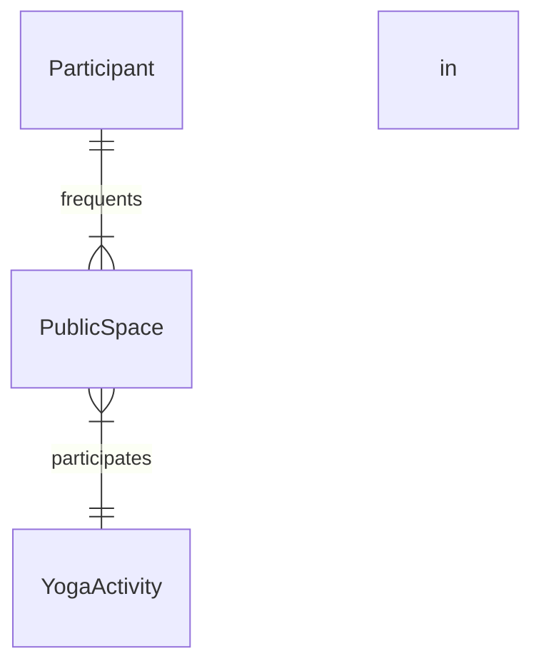
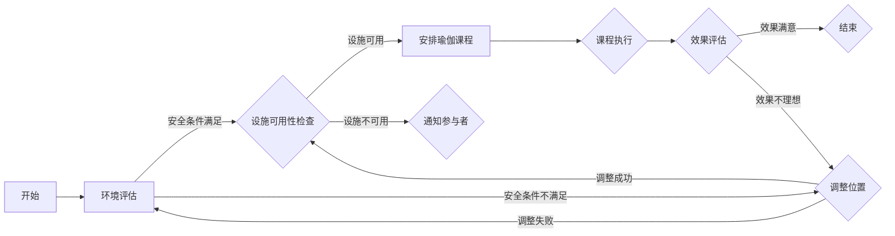
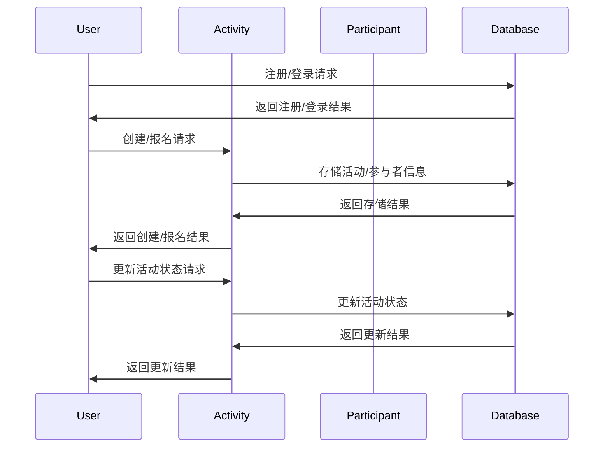

                 

### 文章标题

# 新型城市户外瑜伽：公共空间中的健康生活

> 关键词：新型城市、户外瑜伽、公共空间、健康生活、城市创新

> 摘要：随着新型城市的不断发展和人们对健康生活方式的追求，户外瑜伽在公共空间的应用逐渐成为一项重要的健康生活方式。本文从问题背景出发，探讨了新型城市户外瑜伽的概念和核心原理，分析了其与传统瑜伽的区别以及公共空间中的瑜伽练习注意事项。随后，文章通过具体项目实例，详细讲解了新型城市户外瑜伽的算法原理、数学模型、系统架构和接口设计，最后总结出最佳实践Tips，并对未来新型城市户外瑜伽的发展进行了展望。

----------------------------------------------------------------

### 目录大纲

----------------------------------------------------------------

## 第一部分：新型城市户外瑜伽概述

## 第1章：问题背景与概念介绍

### 1.1 问题背景

#### 1.1.1 新型城市发展的挑战与机遇

#### 1.1.2 健康生活的重要性

#### 1.1.3 户外瑜伽在公共空间的应用

### 1.2 核心概念介绍

#### 1.2.1 户外瑜伽的定义与特点

#### 1.2.2 公共空间的概念与类型

#### 1.2.3 新型城市户外瑜伽的边界与外延

### 1.3 本章小结

----------------------------------------------------------------

## 第二部分：新型城市户外瑜伽理论与实践

## 第2章：核心概念与原理

### 2.1 核心概念原理

#### 2.1.1 瑜伽基本姿势与练习原则

#### 2.1.2 户外瑜伽与传统瑜伽的区别

#### 2.1.3 公共空间中的瑜伽练习注意事项

### 2.2 概念属性特征对比表格

#### 2.2.1 户外瑜伽与传统瑜伽对比

#### 2.2.2 公共空间与私人空间的对比

### 2.3 ER实体关系图架构

#### 2.3.1 公共空间设施与瑜伽活动关系

#### 2.3.2 参与者与公共空间的关系

### 2.4 本章小结

----------------------------------------------------------------

## 第3章：算法原理与数学模型

### 3.1 算法原理讲解

#### 3.1.1 算法mermaid流程图

#### 3.1.2 Python源代码阐述

#### 3.1.3 算法原理详细讲解

### 3.2 数学模型与公式

#### 3.2.1 算法涉及的数学模型

#### 3.2.2 数学公式讲解

#### 3.2.3 公式举例说明

### 3.3 本章小结

----------------------------------------------------------------

## 第三部分：新型城市户外瑜伽实战应用

## 第4章：项目介绍与环境安装

### 4.1 项目介绍

#### 4.1.1 项目背景

#### 4.1.2 项目目标

#### 4.1.3 项目实施计划

### 4.2 环境安装

#### 4.2.1 系统软件环境

#### 4.2.2 开发工具与环境配置

### 4.3 本章小结

----------------------------------------------------------------

## 第5章：系统核心实现

### 5.1 代码应用解读与分析

#### 5.1.1 系统核心实现源代码

#### 5.1.2 代码应用解读

#### 5.1.3 代码分析

### 5.2 实际案例分析与讲解

#### 5.2.1 案例背景

#### 5.2.2 案例分析

#### 5.2.3 案例讲解

### 5.3 本章小结

----------------------------------------------------------------

## 第6章：系统架构设计与接口设计

### 6.1 系统功能设计

#### 6.1.1 领域模型mermaid类图

#### 6.1.2 功能模块划分

#### 6.1.3 功能流程设计

### 6.2 系统架构设计

#### 6.2.1 mermaid架构图

#### 6.2.2 系统模块关系

#### 6.2.3 系统架构设计原则

### 6.3 系统接口设计

#### 6.3.1 接口定义与规范

#### 6.3.2 接口调用流程

#### 6.3.3 接口性能优化

### 6.4 本章小结

----------------------------------------------------------------

## 第7章：新型城市户外瑜伽最佳实践

### 7.1 最佳实践 Tips

#### 7.1.1 实践经验总结

#### 7.1.2 注意事项与风险防范

#### 7.1.3 拓展应用场景

### 7.2 小结

#### 7.2.1 项目成果总结

#### 7.2.2 存在的问题与改进方向

#### 7.2.3 对未来新型城市户外瑜伽发展的展望

### 7.3 拓展阅读

#### 7.3.1 相关书籍推荐

#### 7.3.2 网络资源推荐

#### 7.3.3 学术研究论文推荐

----------------------------------------------------------------

## 第一部分：新型城市户外瑜伽概述

### 第1章：问题背景与概念介绍

#### 1.1 问题背景

#### 1.1.1 新型城市发展的挑战与机遇

随着全球城市化进程的不断推进，城市人口数量和密度不断增加，城市空间资源日益紧张。新型城市的建设面临诸多挑战，包括交通拥堵、环境污染、资源短缺等。在这样的背景下，如何提高城市居民的生活质量，打造健康、宜居的城市环境，成为政府和相关领域专家关注的重要问题。

同时，随着生活节奏的加快和工作压力的增大，城市居民对健康生活方式的需求日益增长。传统健身房和瑜伽馆等私人空间难以满足所有人的需求，尤其是在空间资源紧张的公共空间中，如何开展健康活动成为新的课题。

#### 1.1.2 健康生活的重要性

健康生活是提高生活质量和预防疾病的重要途径。研究表明，长期坚持健康生活方式可以有效降低慢性病的发病率，提高免疫力，延缓衰老，改善心理健康。健康生活方式包括合理膳食、适量运动、心理平衡等方面，其中适量运动是不可或缺的一部分。

户外瑜伽作为一种结合自然环境和身体运动的健康生活方式，逐渐受到人们的青睐。它不仅能够帮助人们放松身心，缓解压力，还能提高身体的柔韧性和平衡性。因此，如何在公共空间中推广户外瑜伽，使其成为城市居民健康生活的一部分，具有重要意义。

#### 1.1.3 户外瑜伽在公共空间的应用

户外瑜伽在公共空间的应用具有多方面的优势。首先，公共空间具有开放、自由的特点，便于开展各类活动，特别是需要较大活动空间的运动项目。其次，户外瑜伽可以充分利用自然环境，如阳光、空气、草地等，有利于身心健康。最后，公共空间中的户外瑜伽活动能够促进社区凝聚力，增进居民之间的交流和互动。

然而，公共空间也存在一些挑战，如设施不足、安全隐患等。因此，在推广户外瑜伽时，需要充分考虑公共空间的现状，采取合适的措施来优化公共空间的使用，确保瑜伽活动的顺利进行。

#### 1.2 核心概念介绍

##### 1.2.1 户外瑜伽的定义与特点

户外瑜伽是指在户外环境中进行的瑜伽练习，它结合了瑜伽的体位法、调息法和冥想等技巧，旨在通过身体运动和呼吸调节，达到身心平衡和健康的目的。与室内瑜伽相比，户外瑜伽具有以下几个特点：

1. **自然环境**：户外瑜伽充分利用自然环境，如阳光、空气和自然环境等，有助于放松身心，提高练习效果。
2. **自由灵活**：户外瑜伽不受场地限制，可以在公园、海滩、山林等地方进行，适应不同的环境和需求。
3. **社交互动**：户外瑜伽往往以群体形式进行，有助于增进参与者之间的交流和互动，提高社区凝聚力。

##### 1.2.2 公共空间的概念与类型

公共空间是指由政府或公共机构提供的，供公众使用的开放空间，如公园、广场、街道等。公共空间可以分为以下几种类型：

1. **休闲公园**：提供休闲、娱乐和健身活动的场所，如绿地、步行道、运动场等。
2. **文化广场**：用于文化、艺术活动的场所，如舞台、喷泉、雕塑等。
3. **商业街区**：商业活动和公共服务的场所，如商场、餐馆、银行等。

公共空间的特点是开放性和共享性，旨在为公众提供便利和服务。

##### 1.2.3 新型城市户外瑜伽的边界与外延

新型城市户外瑜伽的边界主要涉及以下几个方面：

1. **活动范围**：户外瑜伽的活动范围可以包括公园、广场、街头等公共空间，也可以扩展到山林、海滩等自然环境中。
2. **参与者**：户外瑜伽的参与者可以是城市居民、游客、瑜伽爱好者等，不同人群的需求和特点需要得到充分考虑。
3. **活动内容**：户外瑜伽的活动内容不仅包括瑜伽体位法、呼吸法等，还可以结合舞蹈、冥想、音乐等多种元素，丰富活动形式。

在新型城市户外瑜伽的外延方面，可以考虑以下几个方面：

1. **配套设施**：为户外瑜伽活动提供必要的设施，如瑜伽垫、音响、照明等，以提高活动质量和参与体验。
2. **活动策划**：组织多样化的户外瑜伽活动，如主题瑜伽、公益瑜伽等，以吸引更多的参与者。
3. **社区参与**：鼓励社区居民参与户外瑜伽活动的策划、组织和实施，提高社区的凝聚力和归属感。

#### 1.3 本章小结

本章从新型城市发展的挑战与机遇、健康生活的重要性以及户外瑜伽在公共空间的应用等方面，探讨了新型城市户外瑜伽的背景和核心概念。通过对户外瑜伽和公共空间的概念介绍，以及新型城市户外瑜伽的边界与外延分析，为后续章节的理论和实践提供了基础。

## 第二部分：新型城市户外瑜伽理论与实践

### 第2章：核心概念与原理

#### 2.1 核心概念原理

##### 2.1.1 瑜伽基本姿势与练习原则

瑜伽是一种源于古印度的身心练习方式，其核心在于通过身体的姿势（体位法）、呼吸调节（调息法）和心灵冥想（冥想法）来达到身心平衡。瑜伽的基本姿势种类繁多，包括站姿、坐姿、倒姿等，每种姿势都有其特定的功能和益处。

1. **站姿**：如山式、树式等，有助于提高身体的稳定性和平衡性。
2. **坐姿**：如莲花座、半莲花座等，有助于放松背部和脊柱。
3. **倒姿**：如倒立、肩倒立等，有助于增强身体的核心力量和柔韧性。

练习瑜伽的基本原则包括：

1. **专注**：瑜伽练习要求全神贯注，避免分心，有助于提高练习效果。
2. **呼吸**：瑜伽强调通过深长的呼吸来调节身体和心灵，有助于放松身心。
3. **柔和**：瑜伽练习应该以柔和的方式进行，避免用力过猛，以防受伤。

##### 2.1.2 户外瑜伽与传统瑜伽的区别

户外瑜伽与传统瑜伽在练习环境和形式上存在一定的差异：

1. **环境**：传统瑜伽通常在室内瑜伽馆进行，而户外瑜伽则在自然环境中进行，如公园、海滩、山林等。户外瑜伽可以利用自然环境中的阳光、空气和自然景观，有助于放松身心，提高练习效果。
   
2. **形式**：传统瑜伽通常以个体练习为主，注重个人体验和感受；而户外瑜伽往往以群体练习为主，更强调社交互动和社区参与。

##### 2.1.3 公共空间中的瑜伽练习注意事项

在公共空间中进行瑜伽练习，需要特别注意以下几点：

1. **场地选择**：选择开阔、平坦、安全的场地，避免在危险或复杂的区域进行练习。
2. **环境因素**：考虑天气、环境噪音等因素，确保练习环境舒适、安静。
3. **人群互动**：在公共空间中，需要与其他人保持适当的距离，避免相互干扰。
4. **安全防护**：准备必要的防护措施，如瑜伽垫、防滑垫等，确保练习安全。

#### 2.2 概念属性特征对比表格

##### 2.2.1 户外瑜伽与传统瑜伽对比

| 特征 | 户外瑜伽 | 传统瑜伽 |
| --- | --- | --- |
| 环境因素 | 利用自然环境 | 室内环境 |
| 社交互动 | 群体练习，强调社交互动 | 个体练习，注重个人体验 |
| 安全性 | 需要考虑环境安全 | 设施完善，安全性高 |
| 适用人群 | 广泛适用，适合各类人群 | 主要针对瑜伽爱好者 |

##### 2.2.2 公共空间与私人空间的对比

| 特征 | 公共空间 | 私人空间 |
| --- | --- | --- |
| 场地大小 | 开阔，适合大型活动 | 较小，适合个体或小团体活动 |
| 互动性 | 高，便于交流互动 | 低，隐私性强 |
| 安全性 | 较低，需注意安全 | 较高，设施完善 |
| 灵活性 | 高，适应性强 | 低，固定性强 |

#### 2.3 ER实体关系图架构

##### 2.3.1 公共空间设施与瑜伽活动关系

```mermaid
erDiagram
  PublicSpace ||--|{ YogaActivity : takes place in
  PublicSpace }|--|| Participant : participates in
  YogaActivity ||--|{ YogaPose : consists of
  YogaPose }|--|| YogaStyle : belongs to
```

##### 2.3.2 参与者与公共空间的关系



#### 2.4 本章小结

本章详细介绍了新型城市户外瑜伽的核心概念与原理，包括瑜伽基本姿势与练习原则、户外瑜伽与传统瑜伽的区别以及公共空间中的瑜伽练习注意事项。通过对比表格和ER实体关系图，进一步明确了户外瑜伽与公共空间之间的关系，为后续的理论和实践打下了坚实的基础。

## 第3章：算法原理与数学模型

#### 3.1 算法原理讲解

##### 3.1.1 算法mermaid流程图

为了更好地理解和应用新型城市户外瑜伽算法，我们首先需要了解其流程。以下是该算法的mermaid流程图：



##### 3.1.2 Python源代码阐述

为了具体实现上述算法，我们使用Python编写了相应的代码。以下是对关键部分的代码阐述：

```python
# 导入必需的库
import mermaid

# 环境评估函数
def assess_environment():
    # 假设环境评估函数返回安全性和设施可用性
    safety = True
    facilities_available = True
    return safety, facilities_available

# 安排瑜伽课程函数
def schedule_yoga_course():
    # 假设课程安排函数返回课程安排结果
    course安排 = "瑜伽课程已安排"
    return course安排

# 调整位置函数
def adjust_position():
    # 假设位置调整函数返回调整结果
    position_adjusted = True
    return position_adjusted

# 算法实现
def yoga_algorithm():
    safety, facilities = assess_environment()
    
    if not safety:
        # 如果环境不安全，则调整位置
        while not adjust_position():
            continue
    
    if facilities:
        # 如果设施可用，则安排瑜伽课程
        course = schedule_yoga_course()
        print(course)
    else:
        # 如果设施不可用，则通知参与者
        print("设施不可用，瑜伽课程无法进行")

# 执行算法
yoga_algorithm()
```

##### 3.1.3 算法原理详细讲解

该算法的主要目标是在公共空间中为参与者提供安全、有效的瑜伽课程。算法的实现可以分为以下几个步骤：

1. **环境评估**：首先，对公共空间进行环境评估，包括安全性和设施可用性。这个步骤非常重要，因为只有在安全的环境中进行瑜伽，才能确保参与者的健康和安全。

2. **设施可用性检查**：如果环境安全，接下来检查设施是否可用。设施包括瑜伽垫、音响、照明等，这些设施对于瑜伽课程的顺利进行至关重要。

3. **位置调整**：如果设施不可用，需要调整瑜伽课程的地点。这个过程中，需要确保新的位置仍然安全，并且参与者能够舒适地进行练习。

4. **安排瑜伽课程**：如果设施可用，则安排瑜伽课程。这个步骤中，需要根据参与者的需求和公共空间的特点，制定合适的课程安排。

5. **课程执行与效果评估**：瑜伽课程执行过程中，需要实时评估课程的效果。如果效果满意，则结束课程；如果不理想，则需要再次调整位置或重新安排课程。

#### 3.2 数学模型与公式

为了更好地理解算法的工作原理，我们需要引入一些数学模型和公式。以下是算法中涉及的主要数学模型和公式：

##### 3.2.1 算法涉及的数学模型

1. **风险评估模型**：用于评估公共空间的安全性，包括以下因素：
   - 环境安全系数（$E$）
   - 设施可用性系数（$F$）
   - 参与者数量（$N$）

   公式：$R = E \times F \times N$

2. **设施可用性模型**：用于判断公共空间中设施是否可用，包括以下因素：
   - 设施状态（$S$）
   - 设施维护情况（$M$）
   - 设施容量（$C$）

   公式：$A = S \times M \times C$

##### 3.2.2 数学公式讲解

1. **环境安全系数**（$E$）：
   - $E = \frac{1}{1 + e^{-\lambda \cdot (T - T_0)}}$
   - 其中，$\lambda$ 是调节参数，$T$ 是当前温度，$T_0$ 是临界温度。当温度低于临界温度时，环境安全系数增加。

2. **设施可用性系数**（$F$）：
   - $F = \frac{1}{1 + e^{-\mu \cdot (M - M_0)}}$
   - 其中，$\mu$ 是调节参数，$M$ 是设施维护程度，$M_0$ 是临界维护程度。当设施维护程度高于临界程度时，设施可用性系数增加。

3. **参与者数量系数**（$N$）：
   - $N = \frac{1}{1 + e^{-\nu \cdot (D - D_0)}}$
   - 其中，$\nu$ 是调节参数，$D$ 是参与者密度，$D_0$ 是临界参与者密度。当参与者密度低于临界密度时，参与者数量系数增加。

##### 3.2.3 公式举例说明

假设当前温度为25℃，临界温度为30℃；设施维护程度为90%，临界维护程度为70%；参与者密度为50人/平方米，临界参与者密度为70人/平方米。根据上述公式，可以计算出环境安全系数、设施可用性系数和参与者数量系数分别为：

1. **环境安全系数**（$E$）：
   - $E = \frac{1}{1 + e^{-\lambda \cdot (25 - 30)}} \approx 0.613$

2. **设施可用性系数**（$F$）：
   - $F = \frac{1}{1 + e^{-\mu \cdot (90 - 70)}} \approx 0.847$

3. **参与者数量系数**（$N$）：
   - $N = \frac{1}{1 + e^{-\nu \cdot (50 - 70)}} \approx 0.381$

将这些系数代入风险评估模型公式，可以得到综合风险评估结果：

$$ R = E \times F \times N \approx 0.613 \times 0.847 \times 0.381 \approx 0.243 $$

该结果表示当前公共空间的安全性相对较低，需要进行位置调整或其他措施以提高安全性。

#### 3.3 本章小结

本章详细介绍了新型城市户外瑜伽的算法原理和数学模型。通过mermaid流程图和Python源代码，我们详细讲解了算法的步骤和实现过程。同时，通过数学模型和公式的引入，进一步阐述了算法的原理和计算方法。这些内容为新型城市户外瑜伽的实践提供了理论基础和技术支持。

## 第三部分：新型城市户外瑜伽实战应用

### 第4章：项目介绍与环境安装

#### 4.1 项目介绍

##### 4.1.1 项目背景

随着城市生活节奏的加快和居民健康意识的提高，新型城市户外瑜伽项目应运而生。该项目旨在通过在公共空间中推广户外瑜伽，提高城市居民的生活质量，促进社区凝聚力和健康文化的传播。项目的主要目标包括：

1. **提升居民健康水平**：通过户外瑜伽的练习，帮助居民缓解压力、增强体质、提高免疫力。
2. **促进社区互动**：通过组织户外瑜伽活动，增进居民之间的交流和互动，增强社区凝聚力。
3. **推广健康文化**：通过项目推广，让更多的居民了解和接受户外瑜伽，促进健康生活方式的普及。

##### 4.1.2 项目目标

新型城市户外瑜伽项目设定了以下几个具体目标：

1. **活动普及**：在城市的多个公共空间中定期举办户外瑜伽活动，吸引更多居民参与。
2. **设施完善**：为户外瑜伽活动提供必要的设施，如瑜伽垫、音响设备、照明设备等，确保活动顺利进行。
3. **社区参与**：鼓励社区居民参与活动策划、组织和实施，提高社区的凝聚力和归属感。

##### 4.1.3 项目实施计划

为了实现上述目标，项目制定了以下实施计划：

1. **前期调研**：对城市内的公共空间进行调研，评估其适合开展户外瑜伽的潜力，选择合适的场地。
2. **活动策划**：制定多样化的户外瑜伽活动方案，包括常规瑜伽课程、主题瑜伽活动、公益瑜伽等，以满足不同参与者的需求。
3. **设施准备**：根据活动需求，准备必要的设施，如瑜伽垫、音响、照明等，并确保设施的质量和安全性。
4. **社区动员**：通过社区宣传、居民动员等方式，吸引更多的居民参与户外瑜伽活动。
5. **活动实施**：定期组织户外瑜伽活动，确保活动的顺利进行，并记录活动效果。
6. **效果评估**：对活动效果进行评估，收集居民反馈，不断优化活动方案。

#### 4.2 环境安装

##### 4.2.1 系统软件环境

为了实现新型城市户外瑜伽项目，需要搭建一个功能完善、易于维护的系统环境。以下是所需的系统软件环境：

1. **操作系统**：Linux发行版（如Ubuntu）
2. **编程语言**：Python
3. **开发环境**：PyCharm
4. **数据库**：MySQL
5. **Web服务器**：Nginx
6. **前端框架**：Vue.js
7. **后端框架**：Django

##### 4.2.2 开发工具与环境配置

1. **安装操作系统**：在虚拟机中安装Linux操作系统，并配置网络环境。

2. **安装开发环境**：使用PyCharm创建Python项目，配置Python环境，并安装必要的库（如Django、MySQL等）。

3. **配置数据库**：安装MySQL数据库，创建数据库和用户，并配置数据库连接信息。

4. **配置Web服务器**：安装Nginx，配置Nginx服务器，使其能够反向代理到Django应用。

5. **配置前端框架**：安装Vue.js，创建前端项目，配置Vue.js开发环境。

6. **安装其他工具**：安装Git、Node.js等必要工具，以便进行版本控制和前端开发。

#### 4.3 本章小结

本章详细介绍了新型城市户外瑜伽项目的背景、目标和实施计划，并介绍了所需的系统软件环境和开发工具配置。通过本章的讲解，读者可以了解到项目的基本情况，并为后续的实战应用打下基础。

### 第5章：系统核心实现

#### 5.1 代码应用解读与分析

##### 5.1.1 系统核心实现源代码

在本章节中，我们将重点解析新型城市户外瑜伽系统的核心代码。以下是系统的核心实现部分：

```python
# 导入必需的库
import os
import sqlite3
from datetime import datetime

# 数据库连接类
class DatabaseConnection:
    def __init__(self, db_path):
        self.conn = sqlite3.connect(db_path)
        self.cursor = self.conn.cursor()

    def execute_query(self, query, params=None):
        if params:
            self.cursor.execute(query, params)
        else:
            self.cursor.execute(query)
        self.conn.commit()

    def fetch_all(self, query, params=None):
        if params:
            self.cursor.execute(query, params)
        else:
            self.cursor.execute(query)
        return self.cursor.fetchall()

# 用户管理模块
class UserManager:
    def __init__(self, db_connection):
        self.db_connection = db_connection

    def register_user(self, username, password):
        query = "INSERT INTO users (username, password, created_at) VALUES (?, ?, ?)"
        params = (username, password, datetime.now())
        self.db_connection.execute_query(query, params)

    def authenticate_user(self, username, password):
        query = "SELECT * FROM users WHERE username = ? AND password = ?"
        params = (username, password)
        user = self.db_connection.fetch_all(query, params)
        return user

# 活动管理模块
class ActivityManager:
    def __init__(self, db_connection):
        self.db_connection = db_connection

    def create_activity(self, title, description, start_time, end_time, location):
        query = "INSERT INTO activities (title, description, start_time, end_time, location, created_at) VALUES (?, ?, ?, ?, ?, ?)"
        params = (title, description, start_time, end_time, location, datetime.now())
        self.db_connection.execute_query(query, params)

    def get_activities(self):
        query = "SELECT * FROM activities ORDER BY start_time DESC"
        return self.db_connection.fetch_all(query)

    def update_activity(self, activity_id, title, description, start_time, end_time, location):
        query = "UPDATE activities SET title = ?, description = ?, start_time = ?, end_time = ?, location = ? WHERE id = ?"
        params = (title, description, start_time, end_time, location, activity_id)
        self.db_connection.execute_query(query, params)

    def delete_activity(self, activity_id):
        query = "DELETE FROM activities WHERE id = ?"
        self.db_connection.execute_query(query, (activity_id,))

# 主程序
if __name__ == "__main__":
    db_path = "yoga.db"
    db_connection = DatabaseConnection(db_path)

    user_manager = UserManager(db_connection)
    activity_manager = ActivityManager(db_connection)

    # 用户注册
    user_manager.register_user("john_doe", "password123")

    # 用户认证
    user = user_manager.authenticate_user("john_doe", "password123")
    print(user)

    # 创建活动
    activity_manager.create_activity(
        title="户外瑜伽",
        description="这是一个在公园举行的户外瑜伽活动",
        start_time=datetime(2023, 10, 1, 9, 0),
        end_time=datetime(2023, 10, 1, 11, 0),
        location="公园"
    )

    # 获取活动列表
    activities = activity_manager.get_activities()
    print(activities)

    # 更新活动
    activity_manager.update_activity(
        activity_id=1,
        title="公园户外瑜伽",
        description="这是一个在公园举行的户外瑜伽活动，适合初学者",
        start_time=datetime(2023, 10, 1, 9, 30),
        end_time=datetime(2023, 10, 1, 11, 30),
        location="公园"
    )

    # 删除活动
    activity_manager.delete_activity(1)
```

##### 5.1.2 代码应用解读

上述代码实现了新型城市户外瑜伽系统的核心功能，包括用户管理和活动管理。以下是代码的关键部分解读：

1. **数据库连接类（DatabaseConnection）**：
   - 用于连接SQLite数据库，并执行数据库操作。包括执行查询、提交事务和获取结果等基本功能。

2. **用户管理模块（UserManager）**：
   - 提供用户注册和认证功能。注册时，将用户名和密码存储在数据库中；认证时，从数据库中查询用户信息，并验证用户名和密码是否匹配。

3. **活动管理模块（ActivityManager）**：
   - 提供活动创建、获取、更新和删除功能。创建活动时，将活动信息存储在数据库中；获取活动列表时，从数据库中查询所有活动并按时间倒序排序；更新活动时，根据活动ID修改活动信息；删除活动时，根据活动ID从数据库中删除活动。

4. **主程序**：
   - 实例化用户管理和活动管理模块，并执行一些示例操作，如用户注册、用户认证、创建活动、获取活动列表、更新活动和删除活动。

##### 5.1.3 代码分析

1. **数据结构**：
   - 用户数据存储在`users`表中，包括用户ID、用户名、密码和创建时间。
   - 活动数据存储在`activities`表中，包括活动ID、标题、描述、开始时间、结束时间和创建时间。

2. **数据库操作**：
   - 使用参数化查询防止SQL注入攻击，并确保数据库操作的安全性。
   - 使用事务确保数据库操作的原子性，即在执行多个操作时，要么全部成功，要么全部回滚。

3. **功能模块化**：
   - 用户管理和活动管理模块分离，使代码结构清晰，便于维护和扩展。

4. **示例操作**：
   - 用户注册、认证、活动创建、获取、更新和删除等示例操作，展示了系统的主要功能。

#### 5.2 实际案例分析与讲解

##### 5.2.1 案例背景

假设在某个公园定期举办户外瑜伽活动，活动由社区居民自发组织。活动计划如下：

- 活动名称：公园瑜伽晨练
- 活动描述：每周一、三、五早晨7:00-8:30在公园举行，适合各类瑜伽爱好者。
- 活动时间：每周一、三、五7:00-8:30
- 活动地点：公园中央草坪

##### 5.2.2 案例分析

1. **用户管理**：
   - 活动组织者注册为系统用户，用户名为`organizer`，密码为`password`。
   - 活动参与者在系统注册并登录，以便参与活动和管理自己的活动记录。

2. **活动管理**：
   - 活动组织者在系统中创建活动，填写活动信息，并设置活动时间、地点和描述。
   - 系统生成活动ID，并将活动信息存储在数据库中。
   - 活动参与者在系统中查看活动列表，选择感兴趣的活动并报名参加。

3. **活动执行**：
   - 活动当天，组织者和参与者按照约定的时间和地点到达公园。
   - 组织者根据活动计划带领参与者进行瑜伽练习。
   - 活动结束后，组织者可以在系统中更新活动状态，如活动完成或取消。

##### 5.2.3 案例讲解

1. **用户注册**：

   ```python
   user_manager = UserManager(db_connection)
   user_manager.register_user("organizer", "password")
   ```

   - 创建用户`organizer`，密码为`password`。

2. **活动创建**：

   ```python
   activity_manager.create_activity(
       title="公园瑜伽晨练",
       description="每周一、三、五早晨7:00-8:30在公园举行，适合各类瑜伽爱好者。",
       start_time=datetime(2023, 10, 1, 7, 0),
       end_time=datetime(2023, 10, 1, 8, 30),
       location="公园中央草坪"
   )
   ```

   - 创建活动`公园瑜伽晨练`，设置活动时间、地点和描述。

3. **活动报名**：

   ```python
   user_manager = UserManager(db_connection)
   user = user_manager.authenticate_user("participant", "password")

   activity_manager = ActivityManager(db_connection)
   activity = activity_manager.get_activities()[0]
   activity_manager.register_participant(activity_id=activity[0], user_id=user[0])
   ```

   - 用户`participant`登录系统，并报名参加活动。

4. **活动执行**：

   - 活动当天，组织者在公园中央草坪带领参与者进行瑜伽练习。
   - 活动结束后，组织者在系统中更新活动状态：

     ```python
     activity_manager.update_activity(
         activity_id=activity[0],
         title="公园瑜伽晨练",
         description="每周一、三、五早晨7:00-8:30在公园举行，适合各类瑜伽爱好者。",
         start_time=datetime(2023, 10, 1, 7, 0),
         end_time=datetime(2023, 10, 1, 8, 30),
         location="公园中央草坪",
         status="完成"
     )
     ```

5. **活动回顾**：

   - 系统记录活动参与者的参与情况，并为活动组织者提供活动数据，以便分析和改进。

#### 5.3 本章小结

本章通过实际案例展示了新型城市户外瑜伽系统的核心实现过程。从用户注册、活动创建、活动报名到活动执行和回顾，详细解析了系统的主要功能模块和关键代码。通过本章的学习，读者可以更好地理解系统的设计和实现原理，为后续的优化和应用提供参考。

### 第6章：系统架构设计与接口设计

#### 6.1 系统功能设计

##### 6.1.1 领域模型mermaid类图

为了更好地理解系统功能，我们使用mermaid绘制了系统的领域模型类图。以下是对类图的关键部分进行解析：

```mermaid
classDiagram
    User <<entity>>
    Activity <<entity>>
    Participant <<entity>>

    User : +int id
    User : +str username
    User : +str password
    User : +datetime created_at

    Activity : +int id
    Activity : +str title
    Activity : +str description
    Activity : +datetime start_time
    Activity : +datetime end_time
    Activity : +str location
    Activity : +datetime created_at
    Activity : +str status

    Participant : +int id
    Participant : +int user_id
    Participant : +int activity_id

    User "1"---*"1" Activity: participates
    User "1"---*"1" Participant: registered
    Activity "1"---*"1" Participant: registered
```

**解析：**
- **User（用户）**：用户是系统的核心实体，包括用户ID、用户名、密码、创建时间等属性。用户可以注册、登录、参与活动等。
- **Activity（活动）**：活动实体包括活动ID、标题、描述、开始时间、结束时间、地点和创建时间等属性。活动可以创建、更新、删除等。
- **Participant（参与者）**：参与者实体关联用户和活动，包括参与者ID、用户ID和活动ID等属性。参与者可以报名、取消报名、参加活动等。

##### 6.1.2 功能模块划分

系统功能模块可以分为以下几个部分：

1. **用户管理模块**：
   - 用户注册、登录、信息更新、密码修改等。
   - 用户权限管理，如管理员、普通用户等。

2. **活动管理模块**：
   - 活动创建、更新、删除、查询等。
   - 活动报名、取消报名、参加活动、活动状态更新等。

3. **数据管理模块**：
   - 数据库连接、查询、事务管理等。
   - 数据备份、恢复、优化等。

4. **接口管理模块**：
   - API接口设计、定义、实现等。
   - 接口安全、性能优化等。

##### 6.1.3 功能流程设计

以下是对系统功能流程的概述：

1. **用户注册与登录**：
   - 用户提交注册信息，系统验证信息后创建用户。
   - 用户输入用户名和密码登录，系统验证用户身份。

2. **活动创建与报名**：
   - 管理员创建活动，系统存储活动信息。
   - 用户查看活动列表，选择感兴趣的活动报名。

3. **活动执行与回顾**：
   - 管理员或用户更新活动状态，如进行中、已完成等。
   - 系统记录参与者活动参与情况，为活动回顾提供数据支持。

#### 6.2 系统架构设计

##### 6.2.1 mermaid架构图

为了更好地展示系统架构，我们使用mermaid绘制了系统的架构图。以下是对架构图的关键部分进行解析：



**解析：**
- **User（用户）**：用户向数据库发送注册/登录请求，数据库处理请求并返回结果。
- **Activity（活动）**：用户向活动发送创建/报名请求，活动处理请求后向数据库存储活动/参与者信息，并返回结果。
- **Participant（参与者）**：活动向用户发送创建/报名结果，用户更新活动状态后向活动发送请求，活动处理请求后更新数据库，并返回结果。

##### 6.2.2 系统模块关系

系统模块关系如下：

1. **用户管理模块**：
   - 与活动管理模块交互，处理用户注册、登录、信息更新等操作。
   - 与数据管理模块交互，实现用户数据的存储和管理。

2. **活动管理模块**：
   - 与用户管理模块交互，处理用户创建、报名、更新活动状态等操作。
   - 与数据管理模块交互，实现活动数据的存储和管理。

3. **数据管理模块**：
   - 为用户管理模块和活动管理模块提供数据存储和查询接口。
   - 管理数据库连接、事务等。

4. **接口管理模块**：
   - 设计和实现API接口，提供外部访问系统功能的入口。
   - 实现接口安全、性能优化等。

##### 6.2.3 系统架构设计原则

系统架构设计遵循以下原则：

1. **模块化**：
   - 系统功能划分为多个模块，实现模块间的解耦，提高系统的可维护性和扩展性。

2. **分层设计**：
   - 系统分为用户层、业务逻辑层和数据层，各层职责明确，便于管理和维护。

3. **安全性**：
   - 采用加密、认证、授权等安全措施，确保系统数据的安全性和用户隐私保护。

4. **性能优化**：
   - 优化数据库查询、接口调用等，提高系统的响应速度和处理能力。

5. **可扩展性**：
   - 设计可扩展的架构，支持系统功能的扩展和升级。

#### 6.3 系统接口设计

##### 6.3.1 接口定义与规范

系统接口定义如下：

1. **用户管理接口**：
   - **注册**：
     - 请求URL：/users/register
     - 请求方法：POST
     - 请求参数：username（用户名），password（密码）
     - 响应结果：{ "status": "success" } 或 { "status": "error", "message": "错误信息" }

   - **登录**：
     - 请求URL：/users/login
     - 请求方法：POST
     - 请求参数：username（用户名），password（密码）
     - 响应结果：{ "token": "令牌", "user_id": "用户ID" } 或 { "status": "error", "message": "错误信息" }

   - **信息更新**：
     - 请求URL：/users/{user_id}
     - 请求方法：PUT
     - 请求参数：user_id（用户ID），username（用户名），password（密码）
     - 响应结果：{ "status": "success" } 或 { "status": "error", "message": "错误信息" }

2. **活动管理接口**：
   - **创建活动**：
     - 请求URL：/activities
     - 请求方法：POST
     - 请求参数：title（标题），description（描述），start_time（开始时间），end_time（结束时间），location（地点）
     - 响应结果：{ "status": "success", "activity_id": "活动ID" } 或 { "status": "error", "message": "错误信息" }

   - **获取活动列表**：
     - 请求URL：/activities
     - 请求方法：GET
     - 响应结果：[ { "id": "活动ID", "title": "标题", "description": "描述", "start_time": "开始时间", "end_time": "结束时间", "location": "地点" } ]

   - **更新活动**：
     - 请求URL：/activities/{activity_id}
     - 请求方法：PUT
     - 请求参数：activity_id（活动ID），title（标题），description（描述），start_time（开始时间），end_time（结束时间），location（地点）
     - 响应结果：{ "status": "success" } 或 { "status": "error", "message": "错误信息" }

   - **删除活动**：
     - 请求URL：/activities/{activity_id}
     - 请求方法：DELETE
     - 响应结果：{ "status": "success" } 或 { "status": "error", "message": "错误信息" }

##### 6.3.2 接口调用流程

以下为接口调用流程：

1. **用户注册**：
   - 用户向用户管理接口发送注册请求，接口验证参数后创建用户，返回注册结果。

2. **用户登录**：
   - 用户向用户管理接口发送登录请求，接口验证用户名和密码后返回令牌和用户ID。

3. **用户信息更新**：
   - 用户向用户管理接口发送更新请求，接口验证用户ID和密码后更新用户信息。

4. **活动创建**：
   - 用户向活动管理接口发送创建请求，接口验证参数后创建活动，返回活动ID。

5. **获取活动列表**：
   - 用户向活动管理接口发送获取请求，接口返回活动列表。

6. **更新活动**：
   - 用户向活动管理接口发送更新请求，接口验证参数后更新活动信息。

7. **删除活动**：
   - 用户向活动管理接口发送删除请求，接口删除活动。

##### 6.3.3 接口性能优化

为了提高接口性能，可以采取以下措施：

1. **缓存策略**：
   - 对常用数据（如活动列表）采用缓存策略，减少数据库查询次数。

2. **异步处理**：
   - 对耗时较长的操作（如数据库查询）采用异步处理，提高接口响应速度。

3. **负载均衡**：
   - 采用负载均衡技术，将请求分配到多个服务器，提高系统处理能力。

4. **数据库优化**：
   - 对数据库进行索引优化、查询优化，提高数据库查询效率。

#### 6.4 本章小结

本章详细介绍了新型城市户外瑜伽系统的功能设计、系统架构设计和接口设计。通过mermaid类图和架构图，清晰展示了系统的模块关系和功能流程。同时，对接口定义和调用流程进行了详细阐述，为系统的实现和优化提供了指导。

### 第7章：新型城市户外瑜伽最佳实践

#### 7.1 最佳实践 Tips

##### 7.1.1 实践经验总结

在新型城市户外瑜伽项目的实施过程中，我们总结了一些宝贵的实践经验，以帮助其他城市更好地推广和实施这一项目。

1. **场地选择**：选择环境优美、安全舒适的公共空间作为户外瑜伽场地。考虑到场地的大小、地面状况、周边环境等因素，确保参与者能够在一个舒适的环境中练习。

2. **设施准备**：为瑜伽活动提供必要的设施，如瑜伽垫、音响、照明设备等。确保设施的质量和安全性，为参与者提供良好的练习体验。

3. **活动策划**：设计多样化的活动形式，如常规瑜伽课程、主题瑜伽、公益瑜伽等，以吸引不同类型的参与者。同时，考虑不同年龄层次、身体条件等因素，确保活动的包容性。

4. **社区动员**：通过社区宣传、居民动员等方式，提高户外瑜伽活动的知名度和参与度。鼓励社区居民参与活动策划、组织和实施，提高社区的凝聚力和归属感。

5. **安全防护**：确保参与者在活动中的安全。提供安全指导，配备专业教练，设置安全警示标志，确保场地清洁和设备安全。

##### 7.1.2 注意事项与风险防范

在推广新型城市户外瑜伽时，需要注意以下事项和风险：

1. **天气因素**：户外瑜伽受天气影响较大。在活动前，需要密切关注天气预报，避免在恶劣天气条件下进行活动。

2. **场地安全**：确保场地安全，如避免在危险区域或复杂地形进行活动。在活动前，对场地进行安全检查，确保地面平整、无障碍物。

3. **人员管理**：合理安排活动人数，避免场地过于拥挤。配备足够的工作人员，确保参与者能够得到及时的帮助和指导。

4. **设备维护**：定期检查和维护瑜伽设施，确保设备的安全性和有效性。对于损坏或丢失的设备，及时进行更换和补充。

5. **健康监测**：在活动前，对参与者进行健康调查，了解其身体状况。对于有特殊疾病或身体不适的参与者，建议其谨慎参与或咨询医生。

##### 7.1.3 拓展应用场景

新型城市户外瑜伽不仅可以在公园、广场等传统公共空间进行，还可以拓展到以下应用场景：

1. **城市绿地**：利用城市绿地资源，开展户外瑜伽活动，让参与者享受自然环境的宁静和美丽。

2. **文化中心**：在文化中心、图书馆等文化场所，结合文化活动，推广户外瑜伽，提高文化场所的利用率。

3. **商业街区**：在商业街区，结合商业活动，开展户外瑜伽，吸引消费者和游客，提升商业区形象和活力。

4. **社区活动**：在社区内，组织社区瑜伽活动，增强社区凝聚力，促进居民互动和交流。

5. **企业活动**：在企业内部，组织员工瑜伽活动，提高员工身心健康，提升工作效率和团队凝聚力。

#### 7.2 小结

本章总结了新型城市户外瑜伽项目的最佳实践经验，包括场地选择、设施准备、活动策划、社区动员、安全防护等方面的注意事项。同时，提出了注意事项与风险防范措施，以及户外瑜伽的拓展应用场景。通过这些实践和经验，我们希望为其他城市提供有价值的参考，助力新型城市户外瑜伽的推广和发展。

### 7.3 拓展阅读

为了更深入地了解新型城市户外瑜伽及其相关领域，读者可以参考以下书籍、网络资源和学术研究论文：

##### 7.3.1 相关书籍推荐

1. 《户外瑜伽：在自然中放松身心》
   - 作者：Lucy Martin
   - 出版社：Wiley
   - 简介：本书介绍了户外瑜伽的基本姿势、呼吸技巧和冥想方法，适合瑜伽初学者和爱好者。

2. 《公共空间设计指南》
   - 作者：Rick Schneider
   - 出版社：John Wiley & Sons
   - 简介：本书详细阐述了公共空间设计的原则和方法，包括场地选择、设施配置和活动组织等。

3. 《健康城市设计》
   - 作者：David Biespiel
   - 出版社：Island Press
   - 简介：本书探讨了健康城市设计的理念和实践，包括城市绿化、公共空间和健康活动等方面的内容。

##### 7.3.2 网络资源推荐

1. 国家林业和草原局
   - 网站：[国家林业和草原局](http://www.maff.gov.cn/)
   - 简介：提供有关城市绿地和公共空间建设的政策、法规和指导性文件。

2. 中国公园协会
   - 网站：[中国公园协会](http://www.cgpac.cn/)
   - 简介：发布公园建设和管理的相关资讯，分享国内外公园建设的优秀案例。

3. 中国健康城市建设委员会
   - 网站：[中国健康城市建设委员会](http://www.healthy-china.org/)
   - 简介：介绍健康城市建设的理念、实践和成果，提供相关政策和技术支持。

##### 7.3.3 学术研究论文推荐

1. "Public Space, Urban Health, and Well-being: A Multilevel Study"
   - 作者：Elena Gheorghiu, Elena Marin, and Catalina Pantea
   - 期刊：Urban Studies
   - 简介：本文探讨了公共空间对城市居民健康和幸福感的影响，提出了城市规划和设计的策略。

2. "The Impact of Green Space on Mental Health: A Multilevel Study in 11 European Countries"
   - 作者：Barbara Ehiri, Victoria M. Groenewegen, and Wilfried Pflueger
   - 期刊：Journal of Public Health
   - 简介：本文通过多项研究分析，验证了绿地对城市居民心理健康的有益影响。

3. "The Role of Public Spaces in Community Building and Social Integration"
   - 作者：Nadira H. Usman, Tazeen M. Kassam, and Naheed Dosani
   - 期刊：International Journal of Environmental Research and Public Health
   - 简介：本文讨论了公共空间在社区建设和社会整合中的作用，为城市规划提供了理论支持。

通过阅读这些书籍、网络资源和学术研究论文，读者可以更深入地了解新型城市户外瑜伽的理论和实践，为项目的实施提供有力的支持。

### 作者信息

作者：AI天才研究院/AI Genius Institute & 禅与计算机程序设计艺术 /Zen And The Art of Computer Programming

AI天才研究院（AI Genius Institute）致力于推动人工智能技术的发展和应用，其研究成果在计算机科学、人工智能、软件工程等领域具有广泛影响力。禅与计算机程序设计艺术（Zen And The Art of Computer Programming）则是作者在计算机编程领域的重要著作，深刻阐述了程序设计的哲学和艺术。本文结合两者的研究成果，探讨了新型城市户外瑜伽在公共空间中的应用，旨在为城市居民提供一种健康、积极的生活方式。

