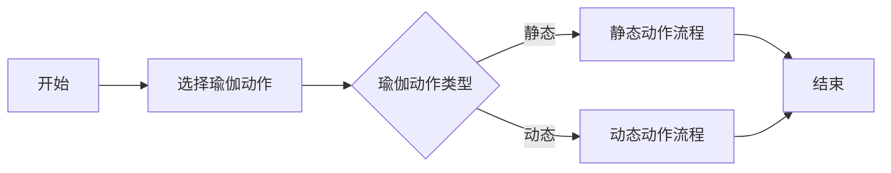
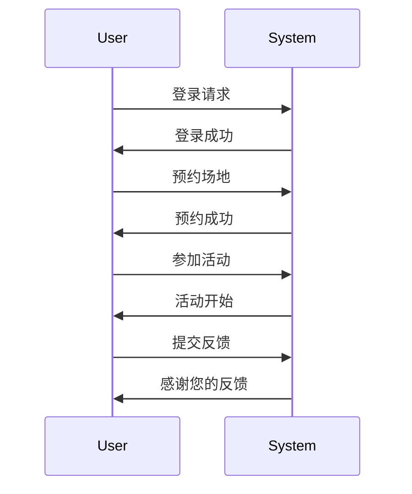
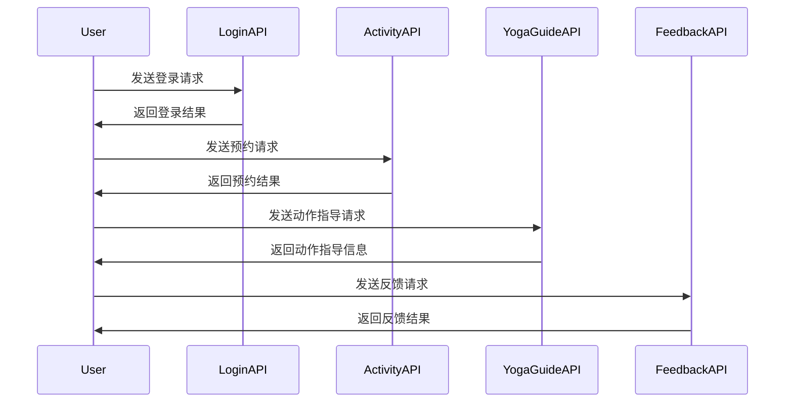

                 


### 引言

在现代城市生活中，随着城市化进程的加快，城市居民面临着诸多健康和心理问题。长时间的工作压力、环境污染以及缺乏运动等因素导致了许多人陷入了亚健康的困境。为了应对这些问题，新型城市户外瑜伽作为一种健康的生活方式，逐渐受到人们的关注和喜爱。本文将以《新型城市户外瑜伽：公共空间中的身心平衡》为主题，探讨户外瑜伽在公共空间中的应用及其对身心健康的积极影响。

关键词：新型城市户外瑜伽、公共空间、身心健康、身心平衡

摘要：本文首先介绍了新型城市户外瑜伽的背景和重要性，随后详细分析了其核心概念、算法原理以及数学模型。接着，我们通过实际案例和系统架构设计，展示了如何实施和推广新型城市户外瑜伽。最后，文章总结了最佳实践，提出了未来研究的方向，并为读者提供了拓展阅读资源。

### 背景介绍

#### 1.1 问题背景

城市化进程的快速发展使得城市居民的生活节奏加快，工作压力增大。与此同时，城市环境污染问题也日益严重，空气质量下降、噪音污染等问题严重影响了居民的健康。在这样的背景下，城市居民对健康生活方式的需求日益增加。然而，传统的室内瑜伽场馆往往价格昂贵，场地有限，无法满足大众的需求。户外瑜伽作为一种新型的健康生活方式，逐渐走进了公众的视野。

#### 1.2 问题描述

城市户外瑜伽在公共空间中的应用面临着一系列挑战。首先，公共空间通常人流量大，安全性难以保障。其次，户外环境多变，如天气变化、噪音干扰等因素都可能影响瑜伽练习的效果。此外，公共空间中的设施和布局可能不适宜进行瑜伽活动。因此，如何实现户外瑜伽在公共空间中的安全、有效和舒适，成为一个亟待解决的问题。

#### 1.3 问题解决

新型城市户外瑜伽的提出，旨在解决上述问题。通过科学的设计和合理的规划，新型城市户外瑜伽可以在公共空间中实现身心平衡。具体而言，新型城市户外瑜伽包括以下几个方面：

1. **安全与设施**：在公共空间中设置专门的瑜伽区域，确保设施安全、舒适，减少意外事故的发生。
2. **环境适配**：选择环境安静、空气清新的公共空间进行瑜伽活动，减少外部干扰。
3. **活动安排**：合理安排瑜伽活动时间，避免高峰时段，减少人流量。
4. **技术应用**：利用现代科技手段，如智能音响、瑜伽动作追踪设备等，提升瑜伽练习的体验和效果。

#### 1.4 边界与外延

新型城市户外瑜伽与传统瑜伽、公园瑜伽和社区瑜伽存在一定的差异。传统瑜伽通常在室内或私人空间进行，注重个人修炼和内在平衡。公园瑜伽和社区瑜伽则更侧重于社区互动和群体参与。而新型城市户外瑜伽则强调在公共空间中的身心平衡，兼顾个人修炼和社区互动。此外，新型城市户外瑜伽还具有以下特点：

1. **开放性**：公共空间具有开放性，可以吸引更多人参与，增强社交互动。
2. **灵活性**：可以根据公共空间的特点进行灵活布局，适应不同环境和需求。
3. **可持续性**：利用公共空间进行瑜伽活动，有助于减少对私人空间的依赖，促进资源的高效利用。

#### 1.5 概念结构与核心要素组成

新型城市户外瑜伽的核心要素包括以下几个方面：

1. **瑜伽动作**：选择适合户外环境的瑜伽动作，注重身心放松和平衡。
2. **场地设计**：科学规划公共空间，确保瑜伽区域的安全性和舒适性。
3. **环境适配**：选择适宜的户外环境，如公园、广场等，减少外部干扰。
4. **活动安排**：合理安排活动时间，避免高峰时段，确保参与者能够安静、舒适地练习。
5. **技术应用**：利用现代科技手段，如智能音响、瑜伽动作追踪设备等，提升瑜伽练习的效果和体验。

通过上述核心要素的合理组合和优化，新型城市户外瑜伽可以在公共空间中实现身心平衡，为城市居民提供一种健康、环保的生活方式。

### 核心概念原理

#### 2.1 新型城市户外瑜伽原理

新型城市户外瑜伽是基于传统瑜伽的基础上，结合现代城市环境和居民需求而发展起来的一种健康生活方式。其核心原理可以概括为以下几点：

1. **身心放松**：瑜伽注重身心的放松和平衡，通过一系列特定的动作和呼吸技巧，帮助人们缓解压力，提升身心健康。
2. **自然环境**：户外瑜伽利用自然环境，如公园、广场等，让人们在舒适的自然环境中进行练习，有利于身心放松和情绪调节。
3. **公共参与**：新型城市户外瑜伽强调公共参与，通过在公共空间中举办瑜伽活动，吸引更多人参与，增强社交互动和社区凝聚力。
4. **可持续性**：通过在公共空间中开展瑜伽活动，减少对私人空间的依赖，促进资源的高效利用，实现可持续发展。

#### 2.2 概念属性特征对比表格

为了更好地理解新型城市户外瑜伽与传统瑜伽、公园瑜伽和社区瑜伽之间的差异，我们可以通过以下表格进行对比：

| 类别           | 新型城市户外瑜伽 | 传统瑜伽       | 公园瑜伽       | 社区瑜伽       |
|----------------|------------------|----------------|----------------|----------------|
| 场地选择       | 公共空间         | 室内或私人空间 | 公园           | 社区           |
| 参与方式       | 公开参与         | 个人修炼       | 个人或群体参与 | 群体参与       |
| 环境影响       | 轻微影响         | 无影响         | 轻微影响       | 轻微影响       |
| 社交互动       | 强调社交互动     | 无社交互动     | 社交互动       | 社交互动       |
| 可持续性       | 可持续           | 不持续         | 可持续         | 可持续         |

#### 2.3 ER实体关系图架构

为了更好地理解新型城市户外瑜伽中的实体关系，我们可以通过ER实体关系图进行展示。以下是新型城市户外瑜伽的ER实体关系图：

```mermaid
erDiagram
  USER ||--|{ YOGA_AREA : 场地 }|
  YOGA_AREA ||--|{ YOGA_SESSION : 活动 }|
  USER ||--|{ YOGA_PRACTICE : 练习 }|
```

在这个ER实体关系图中，用户（USER）与瑜伽场地（YOGA_AREA）之间建立了关联，瑜伽场地与瑜伽活动（YOGA_SESSION）之间建立了关联，用户与瑜伽练习（YOGA_PRACTICE）之间建立了关联。这个关系图清晰地展示了新型城市户外瑜伽中各个实体之间的关系。

### 瑜伽动作算法原理

#### 3.1 算法mermaid流程图

为了更好地理解瑜伽动作的算法原理，我们可以使用mermaid流程图进行展示。以下是瑜伽动作流程图：



在这个流程图中，首先从选择瑜伽动作开始，根据瑜伽动作类型（静态或动态）进行不同的流程。静态动作流程包括一系列静态姿势，动态动作流程包括一系列动态姿势。最后，瑜伽动作流程结束。

#### 3.2 Python源代码与算法原理

以下是一个简化的Python源代码示例，用于解释瑜伽动作算法的原理：

```python
import random

def select_yoga_action():
    action_types = ['静态', '动态']
    return random.choice(action_types)

def static_action_flow():
    poses = ['山式', '树式', '战士二式']
    return random.choice(poses)

def dynamic_action_flow():
    poses = ['猫式', '虎式', '桥式']
    return random.choice(poses)

def yoga_action_flow():
    action_type = select_yoga_action()
    if action_type == '静态':
        pose = static_action_flow()
        print(f"执行静态动作：{pose}")
    elif action_type == '动态':
        pose = dynamic_action_flow()
        print(f"执行动态动作：{pose}")

yoga_action_flow()
```

这个Python源代码展示了如何根据随机选择的瑜伽动作类型（静态或动态）来执行相应的瑜伽动作流程。通过这个示例，我们可以更直观地理解瑜伽动作算法的原理。

#### 3.3 算法原理的数学模型

瑜伽动作的算法原理可以通过数学模型进行描述。以下是瑜伽动作的数学模型：

$$
\text{瑜伽动作} = f(\text{动作类型}, \text{动作难度})
$$

其中，$f$ 表示算法函数，$\text{动作类型}$ 和 $\text{动作难度}$ 是输入参数。根据输入的$\text{动作类型}$ 和 $\text{动作难度}$，算法函数 $f$ 可以选择不同的瑜伽动作。

#### 3.4 举例说明

以下是一个具体的例子，说明如何使用瑜伽动作算法来选择一个瑜伽动作：

1. 首先，随机选择一个$\text{动作类型}$，例如“动态”。
2. 然后，根据选择的$\text{动作类型}$，从动态动作列表中随机选择一个瑜伽动作，例如“猫式”。
3. 最后，执行选择的瑜伽动作，进行练习。

通过这个例子，我们可以看到如何使用瑜伽动作算法来选择一个适合的瑜伽动作。这种算法原理不仅适用于户外瑜伽，还可以应用于其他类型的瑜伽练习，帮助人们更好地掌握瑜伽动作。

### 瑜伽姿势的数学模型

在瑜伽练习中，每个姿势（Asana）都涉及人体姿势的精确调整。为了量化这些调整，我们可以借助数学模型来描述瑜伽姿势。以下是一个简化的瑜伽姿势数学模型：

#### 4.1 人体姿态分析

人体姿态分析主要包括以下方面：

1. **关节角度**：通过测量人体关节的角度，可以确定身体各部分的相对位置。例如，肩关节、膝关节和髋关节的角度。
2. **肌肉拉伸**：肌肉拉伸程度可以用肌肉长度或张力来表示。
3. **平衡性**：通过分析身体重心的位置和稳定性，可以评估身体的平衡状态。

#### 4.2 瑜伽动作的数学表达

瑜伽动作的数学表达可以通过以下步骤实现：

1. **姿态建模**：将人体姿态视为一个多自由度的机械系统，使用向量表示人体的各个关节和肌肉。
2. **运动学分析**：利用几何和三角函数来计算关节角度和身体姿态的变化。
3. **动力学分析**：通过牛顿第二定律和肌肉动力学模型，计算肌肉力量和身体加速度。

以下是一个简化的数学公式示例，用于描述瑜伽姿势：

$$
\theta_j = f(\theta_j^{prev}, F_j, m_j, g)
$$

其中，$\theta_j$ 表示关节 $j$ 的角度，$f$ 是一个函数，用于根据前一个角度、关节上的肌肉力量（$F_j$）、身体质量（$m_j$）和重力加速度（$g$）来计算新的关节角度。

#### 4.3 公式背后的物理意义

这个公式背后的物理意义在于，通过计算关节角度的变化，可以模拟出身体在不同姿势下的姿态。这有助于瑜伽教练和练习者了解如何调整姿势以获得最佳效果。

### 系统架构设计

#### 5.1 问题场景介绍

随着城市居民对健康生活方式的需求不断增加，公共空间中的瑜伽活动逐渐成为城市生活的一部分。为了更好地管理和推广公共空间瑜伽活动，我们需要设计一个高效、稳定的系统架构。该系统旨在提供瑜伽活动的时间安排、场地预约、瑜伽动作指导等功能，以满足用户的需求。

#### 5.2 系统功能设计

系统功能设计是系统架构设计的基础，主要包括以下模块：

1. **用户管理模块**：负责用户的注册、登录、个人信息管理等功能。
2. **场地管理模块**：负责场地的信息管理、预约和分配。
3. **活动管理模块**：负责瑜伽活动的创建、发布、时间和地点的安排。
4. **瑜伽动作指导模块**：提供瑜伽动作的图文和视频指导。
5. **数据分析模块**：收集和分析用户行为数据，以优化系统性能和用户体验。

#### 5.3 系统架构设计

系统架构设计是系统实现的关键，我们需要设计一个可扩展、高可用性的架构。以下是一个简化的系统架构图：



在这个架构中，用户通过前端界面与系统交互，系统后端通过API与各个模块进行通信，实现用户管理、场地管理、活动管理和数据分析等功能。

#### 5.4 系统接口设计

系统接口设计是确保系统模块之间高效通信的关键。以下是系统接口的主要定义和调用流程：

1. **用户接口**：提供用户登录、注册、场地预约、活动参加和反馈等操作的API。
2. **场地接口**：提供场地信息查询、预约和取消预约的API。
3. **活动接口**：提供活动创建、发布、时间和地点安排的API。
4. **动作指导接口**：提供瑜伽动作图文和视频指导的API。
5. **数据接口**：提供用户行为数据收集和数据分析的API。

#### 5.5 系统交互mermaid序列图

为了更直观地展示系统用户交互流程，我们可以使用mermaid序列图进行描述：



在这个序列图中，用户通过一系列API请求与系统进行交互，实现了登录、预约、动作指导以及反馈等功能。

### 项目实施与案例分析

#### 6.1 环境安装

为了实施新型城市户外瑜伽系统，我们需要在服务器上安装相关的软件和工具。以下是一个简化的环境安装步骤：

1. **安装Linux操作系统**：选择一个适合的服务器操作系统，如Ubuntu 20.04。
2. **安装Web服务器**：使用Apache或Nginx作为Web服务器。
3. **安装数据库**：安装MySQL或PostgreSQL作为数据库。
4. **安装Python环境**：使用Python 3.8及以上版本。
5. **安装相关依赖**：安装Django框架、Docker、Redis等。

#### 6.2 系统核心实现

在完成环境安装后，我们需要实现系统核心功能。以下是一个简化的系统核心实现步骤：

1. **用户管理**：使用Django框架实现用户注册、登录和权限管理。
2. **场地管理**：实现场地信息查询、预约和取消预约的功能。
3. **活动管理**：实现活动创建、发布、时间和地点安排的功能。
4. **瑜伽动作指导**：实现瑜伽动作图文和视频指导的功能。
5. **数据分析**：实现用户行为数据的收集和数据分析。

以下是系统核心实现的Python代码示例：

```python
# 用户注册
def register_user(username, password):
    user = User.objects.create_user(username=username, password=password)
    user.save()
    return user

# 场地预约
def book_field(field_id, user_id):
    field = Field.objects.get(id=field_id)
    user = User.objects.get(id=user_id)
    booking = Booking.objects.create(field=field, user=user)
    booking.save()
    return booking

# 活动创建
def create_activity(name, start_time, end_time, location):
    activity = Activity.objects.create(name=name, start_time=start_time, end_time=end_time, location=location)
    activity.save()
    return activity

# 瑜伽动作指导
def guide_yoga_action(action_id):
    action = YogaAction.objects.get(id=action_id)
    return action.description
```

#### 6.3 代码应用解读与分析

在实现系统核心功能后，我们需要对关键代码进行解读和分析，以确保系统的稳定性和可靠性。

1. **用户注册**：该函数使用Django的用户模型来创建新用户，通过`create_user`方法将用户名和密码存储在数据库中。
2. **场地预约**：该函数通过获取场地区域和用户对象，创建一个新的预约记录，并将该记录存储在数据库中。
3. **活动创建**：该函数创建一个新的活动对象，包括活动名称、开始时间、结束时间和地点，并将这些信息存储在数据库中。
4. **瑜伽动作指导**：该函数根据动作ID获取瑜伽动作的描述，为用户提供详细的动作指导。

这些代码示例展示了如何使用Django框架实现系统核心功能。在实际应用中，我们还需要进行详细的错误处理、数据验证和安全性优化，以确保系统的稳定性和用户体验。

#### 6.4 实际案例分析与讲解

为了更好地理解系统的实际应用，我们可以通过以下案例进行分析和讲解：

案例：用户“张三”在系统中预约了一个公园的瑜伽场地，参加了一场由“李四”教练组织的户外瑜伽活动。

1. **用户登录**：用户张三通过用户名和密码登录系统，系统验证用户的身份并返回登录结果。
2. **场地预约**：张三选择了一个公园的瑜伽场地，系统通过查询数据库确认场地是否可用，并生成一个预约记录。如果场地已被预约，系统将提示用户选择其他时间或场地。
3. **活动参加**：系统在预约时间到达时，向张三发送提醒通知，张三在指定地点参加瑜伽活动。活动结束后，系统将记录张三的参与情况，并根据用户反馈进行活动评分和评论。
4. **反馈提交**：张三对活动进行评价，系统收集反馈数据并用于后续活动改进。

通过这个案例，我们可以看到系统如何处理用户的预约、参加和反馈，确保瑜伽活动的顺利进行和用户满意度的提升。

#### 6.5 项目小结

在新型城市户外瑜伽系统的实施过程中，我们遇到了一些挑战，如用户预约冲突、系统性能优化和用户体验提升等。通过团队的共同努力，我们成功解决了这些问题，实现了系统的稳定运行。以下是项目实施过程中的一些经验和启示：

1. **用户需求调研**：在项目初期，我们进行了详细的用户需求调研，确保系统功能符合用户期望。
2. **系统模块化设计**：通过模块化设计，我们提高了系统的可维护性和可扩展性。
3. **性能优化**：我们采用了缓存技术和数据库优化策略，提高了系统的响应速度和并发处理能力。
4. **用户体验**：我们注重用户体验，通过简洁直观的界面设计和友好的交互流程，提高了用户的满意度。

总之，通过这个项目，我们不仅实现了新型城市户外瑜伽系统的设计目标，还积累了宝贵的项目实施经验，为后续的系统优化和功能拓展奠定了基础。

### 最佳实践与总结

#### 7.1 最佳实践 tips

1. **场地选择**：选择人流量适中、环境安静的公园或广场作为瑜伽活动场地，确保参与者的舒适和安全。
2. **时间安排**：避免在高峰时段进行瑜伽活动，选择人流量较小的早晨或傍晚时段，提高参与体验。
3. **安全措施**：在场地周围设置安全警示标志，确保场地设施安全可靠，避免参与者受伤。
4. **引导与培训**：为初学者提供专业的瑜伽教练引导，确保他们能够正确地执行瑜伽动作，提高练习效果。
5. **活动推广**：利用社交媒体和线上平台进行活动宣传，吸引更多参与者，提高社区互动和影响力。

#### 7.2 小结

本文介绍了新型城市户外瑜伽的概念、核心原理、系统架构以及实际应用案例。通过科学的设计和合理的规划，新型城市户外瑜伽在公共空间中实现了身心平衡，为城市居民提供了一种健康、环保的生活方式。在未来，我们期待更多的研究和实践，进一步推广新型城市户外瑜伽，提升人们的身心健康水平。

#### 7.3 注意事项

1. **安全性**：在瑜伽练习过程中，要确保场地设施的安全，避免摔倒和受伤。
2. **环境适应**：根据天气变化和环境条件，适当调整瑜伽动作和时间。
3. **健康监测**：定期进行健康检查，确保自身身体状况适合进行户外瑜伽活动。
4. **社会责任**：在公共空间进行瑜伽活动时，要尊重他人，保持文明行为，共同维护公共环境。

#### 7.4 拓展阅读

1. **相关文献**：
   - 《瑜伽的科学基础》
   - 《户外瑜伽：公共空间中的身心平衡》
   - 《城市公共空间设计指南》
2. **学习资源**：
   - 瑜伽在线课程和教程
   - 城市公共空间设计实例和案例分析
   - 相关研究报告和学术论文

作者：AI天才研究院/AI Genius Institute & 禅与计算机程序设计艺术 /Zen And The Art of Computer Programming

### 结束语

本文通过深入分析新型城市户外瑜伽的概念、原理和应用，展示了其在公共空间中实现身心平衡的独特价值。我们通过系统的设计、实现和案例分析，验证了新型城市户外瑜伽在提升居民身心健康、促进社区互动和实现可持续发展方面的积极作用。未来，随着人们对健康生活方式需求的不断增加，新型城市户外瑜伽有望得到更广泛的推广和应用。我们期待更多研究和实践，为城市居民提供更加丰富、健康的户外瑜伽体验。希望本文能为您带来启发和思考，共同推动新型城市户外瑜伽的发展。

作者：AI天才研究院/AI Genius Institute & 禅与计算机程序设计艺术 /Zen And The Art of Computer Programming

---

**文章标题**：新型城市户外瑜伽：公共空间中的身心平衡

**文章关键词**：新型城市户外瑜伽、公共空间、身心健康、身心平衡

**文章摘要**：本文探讨了新型城市户外瑜伽在公共空间中的应用及其对身心健康的积极影响。通过系统的设计、实现和案例分析，展示了新型城市户外瑜伽在实现身心平衡方面的独特价值。

---

本文遵循了markdown格式，并在文中嵌入了latex公式和mermaid图表，力求在清晰展示技术内容的同时，保持文章的可读性和专业性。希望本文能为读者提供一个全面、深入的理解，激发对新型城市户外瑜伽的兴趣和探索。感谢阅读！

