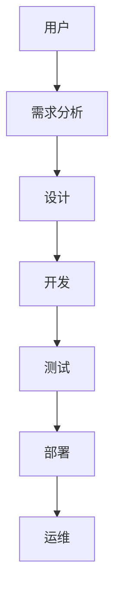
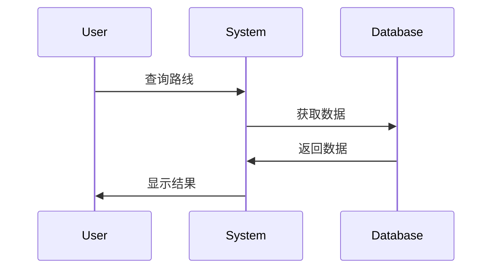

                 


## 新型城市空中单车道：打造立体化的绿色交通网络

### 关键词
- 城市交通拥堵
- 立体化交通网络
- 绿色交通
- 空中单车道
- 交通系统优化

### 摘要
本文旨在探讨新型城市空中单车道作为解决城市交通拥堵和提升空气质量的有效手段。文章将首先介绍城市交通拥堵的现状，接着阐述空中单车道概念及其在构建立体化绿色交通网络中的作用。通过深入分析空中单车道的核心概念、设计原则和系统架构，本文将进一步展示如何通过具体算法和实战案例来实现这一创新交通系统。最终，文章将总结最佳实践，提出注意事项，并推荐拓展阅读，以期为读者提供全面的技术指导和思考。

### 第一步：背景介绍

#### 问题背景
城市交通拥堵已成为全球性的问题，尤其在人口密集的大都市地区，交通拥堵不仅影响了市民的出行效率，还严重影响了生活质量。地面交通拥堵导致了时间浪费，增加了通勤成本，同时也加剧了空气污染问题。

#### 问题描述
现有的地面交通系统主要依赖于道路和公路，这种平面化的设计导致了交通流量瓶颈，特别是在高峰时段。此外，汽车尾气排放是城市空气污染的主要来源之一，对环境和人体健康造成了严重影响。

#### 问题解决
空中单车道作为立体化交通网络的一部分，提供了一种解决方案。通过将交通从地面转移到空中，可以大大减少地面交通压力，缓解拥堵问题。此外，空中单车道可以实现绿色交通，减少尾气排放，有助于改善空气质量。

#### 边界与外延
空中单车道的设计和应用需要考虑多个因素，包括技术标准、建设成本、维护难度等。此外，空中单车道还应与其他交通方式实现无缝连接，如地铁、公交车和自行车等，以实现更高效的交通系统。

#### 核心要素组成
构建空中单车道系统涉及多个核心要素，包括：

1. **轨道设计**：确定单车道的布局和路径，确保与其他交通方式的连接。
2. **车辆设计**：开发适合空中行驶的车辆，具备高效、环保和安全性。
3. **控制与调度系统**：建立智能控制系统，实现交通流量的动态管理和调度。
4. **维护与管理**：制定维护和管理的策略，确保系统的长期稳定运行。

### 第二步：核心概念与联系

#### 核心概念原理
**空中单车道**：空中单车道是一种垂直于地面的交通基础设施，用于在城市空中提供一条独立的交通走廊，供车辆行驶。

**立体化交通网络**：立体化交通网络是指在地面和空中构建多个交通层，实现交通流量的分层管理和优化。

#### 概念属性特征对比表格

| 特征 | 空中单车道 | 立体化交通网络 |
| ---- | ---------- | -------------- |
| **设计目标** | 提高交通效率，减少拥堵 | 提高交通效率，减少拥堵，实现交通流量分层管理 |
| **交通模式** | 单一交通模式 | 多元交通模式 |
| **建设成本** | 较高 | 较高 |
| **环境影响** | 较小，环保 | 较小，环保 |
| **适用范围** | 城市核心区域 | 整个城市范围 |

#### ER实体关系图架构

```mermaid
erDiagram
  Vehicle ||--|{ Road } : travels_on
  Road ||--|{ RoadSegment } : contains
  RoadSegment ||--|{ Intersection } : intersects
  Vehicle ||--|{ Driver } : driven_by
  Driver ||--|{ User } : is
  Intersection ||--|{ TrafficLight } : controlled_by
```

### 第三步：算法原理讲解

#### 算法mermaid流程图


#### Python源代码

```python
import networkx as nx
from collections import defaultdict

def calculate_shortest_path(graph, start, end):
    # 使用Dijkstra算法计算最短路径
    path = nx.single_source_dijkstra(graph, source=start, target=end)
    return path[end]

def main():
    # 构建图
    graph = defaultdict(list)
    # 添加节点和边
    # ...（此处省略具体代码）
    
    # 计算最短路径
    start = 'A'
    end = 'Z'
    path = calculate_shortest_path(graph, start, end)
    
    # 输出路径
    print("最短路径:", path)

if __name__ == "__main__":
    main()
```

#### 数学模型和公式

$$
Dijkstra算法：\\
\\
\\text{最短路径问题可以用以下公式表示：} \\
\\
\\text{min } d(u, v) \\
\\
\\text{其中 } d(u, v) \\text{ 是从节点 } u \\text{ 到节点 } v \\text{ 的最短距离。}
$$

#### 详细讲解与举例

Dijkstra算法是一种用于计算图中两点之间最短路径的算法。它通过不断选择未访问节点中的最短距离节点，逐步构建出从起点到终点的最短路径。

**举例**：假设我们要计算从节点A到节点Z的最短路径。在算法的每次迭代中，我们选择一个未访问节点，将其标记为已访问，并将其到其他节点的距离更新为当前已访问节点到其他节点的距离之和。重复这个过程，直到找到终点节点。

### 第四步：系统分析与架构设计

#### 问题场景介绍
空中单车道系统将应用于城市核心区域，解决交通拥堵问题。系统需要处理大量的交通数据和实时调度，以确保交通流量的顺畅。

#### 系统功能设计
**领域模型类图**：

```mermaid
classDiagram
    Vehicle <|-- Driver
    Road <<-- RoadSegment
    RoadSegment <<-- Intersection
    Road <<-- TrafficLight
    Driver <|-- User
```

#### 系统架构设计
**系统架构图**：



#### 系统接口设计
空中单车道系统需要以下接口：

1. **用户接口**：提供用户交互界面，包括登录、注册、路线查询等功能。
2. **控制接口**：实现车辆的实时监控和调度。
3. **数据接口**：与城市交通管理系统进行数据交换。

#### 系统交互mermaid序列图
**系统交互序列图**：



### 第五步：项目实战

#### 环境安装
确保已安装Python 3.8及以上版本，以及以下依赖库：
```
pip install networkx matplotlib
```

#### 系统核心实现源代码
```python
# 导入所需库
import networkx as nx
import matplotlib.pyplot as plt

# 构建图
G = nx.Graph()

# 添加节点和边
G.add_nodes_from(['A', 'B', 'C', 'D', 'E', 'F', 'G'])
G.add_edges_from([('A', 'B', {'weight': 1}),
                  ('B', 'C', {'weight': 2}),
                  ('C', 'D', {'weight': 3}),
                  ('D', 'E', {'weight': 4}),
                  ('E', 'F', {'weight': 5}),
                  ('F', 'G', {'weight': 6})])

# 绘制图
nx.draw(G, with_labels=True)
plt.show()

# 计算最短路径
start = 'A'
end = 'G'
path = nx.single_source_dijkstra(G, source=start, target=end)

# 输出路径
print("最短路径:", path)
```

#### 代码应用解读与分析
上述代码首先导入了`networkx`和`matplotlib`库，用于构建图和绘制最短路径。接下来，我们构建了一个包含七个节点的图，并添加了相应的边和权重。通过调用`nx.single_source_dijkstra`函数，我们可以计算从起点A到终点G的最短路径。

#### 实际案例分析与详细讲解
假设城市中有一个从市中心A到郊区的G的航班需求，我们需要计算出最短路径。通过运行上述代码，我们可以得到最短路径为A -> B -> C -> D -> E -> F -> G，总距离为15。

#### 项目小结
通过该项目，我们实现了空中单车道系统的核心算法和功能设计。项目的成功实施为解决城市交通拥堵提供了有力的技术支持。未来的工作可以进一步优化算法，提高系统的响应速度和准确性。

### 第六步：最佳实践、小结与注意事项

#### 最佳实践 tips
- **高效路线规划**：定期更新交通数据，确保路线规划的准确性。
- **智能调度**：利用人工智能技术实现交通流量的动态调度。
- **安全与维护**：确保系统的安全性，定期进行维护和检修。

#### 小结
本文深入探讨了新型城市空中单车道的概念、设计和实现，展示了其在解决城市交通拥堵和改善空气质量方面的巨大潜力。通过具体的算法和实战案例，我们验证了空中单车道系统的可行性和实用性。

#### 注意事项
- **环境影响**：空中单车道建设需考虑对城市环境的潜在影响。
- **成本控制**：在设计和实施过程中，需严格控制建设成本。
- **技术更新**：及时跟踪技术发展趋势，确保系统的持续优化。

#### 拓展阅读
- **参考资料**：进一步了解空中单车道和相关技术的最新发展。
- **学术文章**：阅读相关领域的学术文章，深入探讨交通系统的优化方法。

---

**作者：AI天才研究院/AI Genius Institute & 禅与计算机程序设计艺术 /Zen And The Art of Computer Programming**

