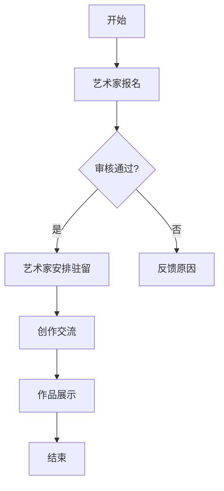
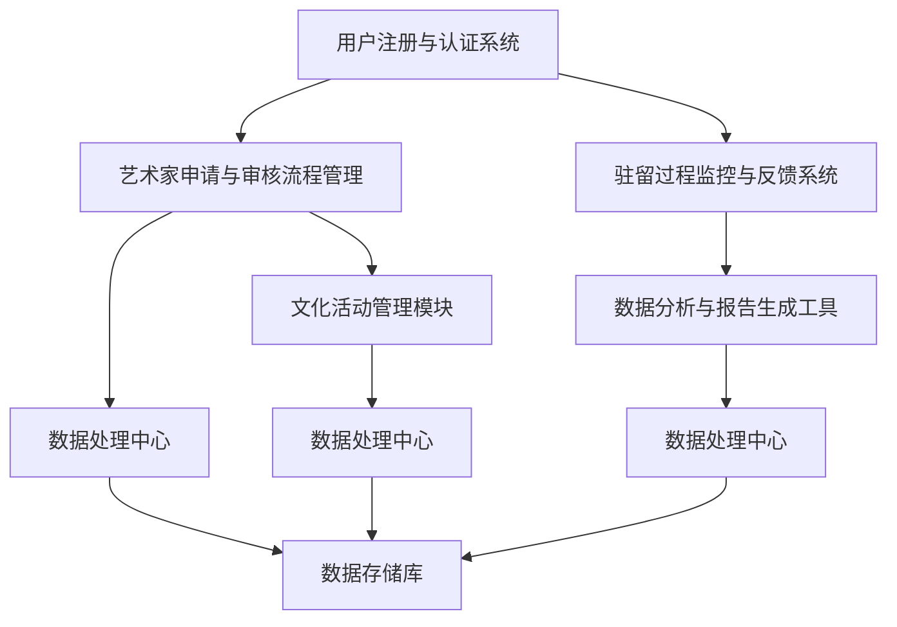

                 

## 第一部分: 背景介绍

### 第1章: 问题背景与核心概念

#### 1.1.1 问题描述

新型城市艺术家驻留交换计划是近年来在全球范围内兴起的一种文化交流模式。它旨在通过艺术家在异地的短期驻留，促进不同文化间的对话与合作，从而推动城市文化多样性的发展。这种计划不仅能够加深不同文化间的理解与尊重，还能够激发艺术家们的创作灵感，促进艺术作品的产生。

随着全球化进程的不断加深，文化交流成为推动社会进步的重要手段。艺术家作为文化交流的桥梁和纽带，其驻留交换计划在促进文化交流方面发挥了重要作用。通过这种计划，艺术家能够在不同文化背景下进行创作，从而拓宽视野，提升创作水平。同时，艺术家之间的互动与交流也能够促进不同文化之间的相互理解与尊重。

#### 1.1.2 问题解决

通过艺术家驻留交换计划，可以实现以下几个方面的目标：

1. **促进文化交流**：艺术家在异地的短期驻留，能够深入了解当地文化，与当地艺术家进行互动与交流，从而促进不同文化之间的相互了解与尊重。

2. **激发创作灵感**：艺术家在异地创作的过程中，可能会受到当地文化氛围的启发，产生新的创作灵感，从而提升艺术作品的质量。

3. **推动城市文化多样性**：艺术家驻留交换计划能够吸引不同文化背景的艺术家参与，从而丰富城市的文化内涵，提升城市的文化多样性。

4. **促进经济发展**：艺术家驻留交换计划能够带动相关产业的发展，如旅游业、文化产业等，从而推动当地经济的发展。

#### 1.1.3 边界与外延

该计划涉及多个领域，包括艺术家、文化交流机构、城市文化管理、旅游业等。其影响范围不仅限于艺术领域，还对城市文化、经济发展等方面产生深远影响。

边界方面，该计划主要涉及以下内容：

1. **艺术家**：包括专业艺术家和业余爱好者，他们在计划中扮演重要角色。

2. **文化交流机构**：负责组织和管理艺术家驻留交换计划，提供支持和资源。

3. **城市文化管理**：负责制定相关政策，提供资金支持，保障计划的顺利实施。

4. **旅游业**：作为文化交流的延伸，旅游业也参与到艺术家驻留交换计划中，为艺术家提供创作环境和生活保障。

外延方面，该计划可以拓展到以下领域：

1. **艺术教育**：通过艺术家驻留交换计划，可以促进艺术教育的发展，提升公众的艺术素养。

2. **文化创意产业**：艺术家驻留交换计划有助于推动文化创意产业的发展，为城市带来新的经济增长点。

3. **国际文化交流**：通过艺术家驻留交换计划，可以加强国际间的文化交流，提升国家的软实力。

#### 1.1.4 概念结构与核心要素组成

该计划的核心概念包括：艺术家、驻留、交换、文化交流、城市文化多样性等。核心要素包括：

1. **艺术家个人**：具备艺术创作能力的个人，是计划的核心参与者。

2. **驻留机构**：提供艺术家驻留场所和相关服务的机构，是计划的实施主体。

3. **合作伙伴**：包括政府机构、企业、非营利组织等，为计划提供资金支持和资源。

4. **资金支持**：包括政府拨款、企业赞助、社会捐助等，是计划实施的保障。

5. **政策支持**：包括法律法规、政策指导等，为计划提供政策保障。

6. **文化交流机构**：负责组织和管理计划的具体实施，提供专业支持。

7. **城市文化管理**：负责制定相关政策，提供资金支持，保障计划的顺利实施。

### 第2章: 核心概念与联系

#### 2.1.1 核心概念原理

新型城市艺术家驻留交换计划的核心理念是“文化交流”和“创意人才流动”。

**文化交流**：是指不同文化之间的互动与沟通，旨在促进不同文化之间的相互理解与尊重。在艺术家驻留交换计划中，文化交流是通过艺术家在异地的短期驻留来实现的。艺术家通过与当地文化背景的接触和互动，深入了解当地文化，从而实现文化的相互传递和交流。

**创意人才流动**：是指创意人才在不同地区之间的流动，旨在激发创意人才的创作灵感和创新思维。在艺术家驻留交换计划中，创意人才流动是通过艺术家在不同城市之间的驻留和交流来实现的。艺术家在异地创作的过程中，可能会受到当地文化氛围的启发，产生新的创作灵感，从而实现创意人才的流动和创新。

#### 2.1.2 概念属性特征对比表格

| 概念         | 定义                                                         | 特征                                      |
| ------------ | ------------------------------------------------------------ | ----------------------------------------- |
| 艺术家       | 拥有艺术才能、创作能力的个人                                   | 创造性、创新性、多样性                    |
| 驻留         | 艺术家在异地进行短期创作的行为                                 | 时效性、地域性、开放性                    |
| 交换         | 艺术家之间或艺术家与当地社区之间的互动与交流                   | 平等性、互动性、多元性                    |
| 文化交流     | 不同文化之间的互动与沟通                                      | 文化多样性、互鉴互学、包容性              |
| 城市文化多样性 | 城市中不同文化群体的共存与发展                                 | 丰富性、融合性、创新性                    |

#### 2.1.3 ER实体关系图架构

```mermaid
erDiagram
  Artist ||--|{ ResidencyProgram } : participates_in
  Artist ||--|{ ExchangeEvent } : participates_in
  ResidencyProgram ||--|{ Organization } : hosted_by
  ExchangeEvent ||--|{ Organization } : organized_by
  Organization ||--|{ City } : located_in
```

#### 第3章: 算法原理讲解

##### 3.1.1 算法mermaid流程图



##### 3.1.2 算法原理

艺术家驻留交换计划的核心算法是“艺术家报名与审核系统”。该系统主要包含以下步骤：

1. **艺术家报名**：艺术家提交申请，包括个人简介、作品集、驻留需求等。申请信息通过系统上传到数据库进行保存。

2. **审核过程**：评审团根据申请内容进行初步筛选，对符合要求的申请者进行深入审核。审核标准包括艺术才华、创作潜力、适应能力等。审核过程通常包括在线评审和实地考察。

3. **安排驻留**：审核通过的艺术家将被安排到适合的驻留地点。驻留地点的选择考虑艺术家的需求、创作环境、当地文化资源等因素。

4. **创作交流**：艺术家在驻留期间与当地社区、其他艺术家进行交流，分享创作经验和艺术理念。同时，艺术家也会利用当地文化资源进行创作，从而产生新的艺术作品。

5. **作品展示**：艺术家驻留结束前，通常会在当地举办作品展示活动，向社会公众展示创作成果。作品展示活动有助于提高艺术家的知名度，促进文化交流。

6. **结束与反馈**：艺术家驻留交换计划结束后，艺术家和驻留机构会进行反馈和总结。反馈内容包括艺术家驻留体验、创作成果、文化交流效果等。这些反馈将为未来计划的改进提供重要参考。

##### 3.1.3 算法数学模型与公式

艺术家驻留交换计划的算法可以抽象为一个概率模型，其核心参数包括：

- \( P(A) \)：艺术家提交申请的概率
- \( P(B) \)：申请被审核通过的概率
- \( P(C) \)：艺术家适应新环境的概率
- \( P(D) \)：艺术家创作出高质量作品的概率
- \( P(E) \)：艺术家进行文化交流的概率

算法的数学模型可以表示为：

\[ \text{艺术家驻留效果} = P(A) \times P(B) \times P(C) \times P(D) \times P(E) \]

其中，每个概率参数可以通过历史数据和统计分析得到。

##### 3.1.4 算法举例说明

假设某艺术家参加了一次艺术家驻留交换计划，其相关概率参数如下：

- \( P(A) = 0.8 \)：艺术家提交申请的概率为80%
- \( P(B) = 0.9 \)：申请被审核通过的概率为90%
- \( P(C) = 0.7 \)：艺术家适应新环境的概率为70%
- \( P(D) = 0.8 \)：艺术家创作出高质量作品的概率为80%
- \( P(E) = 0.9 \)：艺术家进行文化交流的概率为90%

根据算法数学模型，可以计算出该艺术家驻留交换计划的效果：

\[ \text{效果} = 0.8 \times 0.9 \times 0.7 \times 0.8 \times 0.9 = 0.4536 \]

这意味着该艺术家驻留交换计划的效果为45.36%，表明该计划对于艺术家的创作和交流具有较好的促进作用。通过调整概率参数，可以优化算法模型，提高艺术家驻留交换计划的整体效果。### 第4章: 系统分析与架构设计

#### 4.1 问题场景介绍

在新型城市艺术家驻留交换计划中，艺术家们需要通过一个平台来提交申请、管理驻留过程，以及展示他们的作品。同时，这个平台还需要支持文化交流活动的组织和监控。为了实现这一目标，需要设计一个高效的系统，确保艺术家、驻留机构、合作伙伴和公众都能方便地使用和参与。

#### 4.2 项目介绍

项目名称：新型城市艺术家驻留交换平台（Novel City Artist Residency Exchange Platform，简称NCAREP）

项目目标：
1. 提供一个统一平台，方便艺术家申请和参与驻留交换计划。
2. 实现艺术家、驻留机构、合作伙伴的信息共享和协同工作。
3. 提供作品展示、文化交流活动的管理工具。
4. 收集和分析艺术家驻留数据，为政策制定和项目优化提供依据。

项目范围：
1. 用户注册与认证系统。
2. 艺术家申请与审核流程管理。
3. 驻留过程监控与反馈系统。
4. 文化交流活动管理模块。
5. 数据分析与报告生成工具。

#### 4.3 系统功能设计

**1. 用户注册与认证系统**

功能描述：艺术家、驻留机构、合作伙伴等用户可以通过注册系统创建账号，并通过身份验证确保用户身份的合法性。

功能模块：
- 用户注册：允许用户填写基本信息并提交注册请求。
- 用户认证：通过电子邮件、手机验证码等方式验证用户身份。

**2. 艺术家申请与审核流程管理**

功能描述：艺术家可以通过平台提交驻留申请，经过审核后确定是否被选中参与驻留计划。

功能模块：
- 申请提交：艺术家上传个人简介、作品集、驻留需求等。
- 审核流程：评审团对申请进行初步筛选和深入审核。
- 审核结果通知：通知艺术家审核结果，并提供反馈意见。

**3. 驻留过程监控与反馈系统**

功能描述：驻留期间，平台需要监控艺术家的创作进度，收集反馈信息，并提供支持服务。

功能模块：
- 驻留进度追踪：记录艺术家的驻留时间、地点、创作进度。
- 反馈收集：艺术家可以提交驻留体验、作品进展等信息。
- 支持服务：提供必要的技术支持和资源保障。

**4. 文化交流活动管理模块**

功能描述：平台需要支持文化活动的策划、组织和展示。

功能模块：
- 活动策划：制定文化交流活动的计划和日程。
- 活动组织：管理活动资源，如场地、设备等。
- 活动展示：展示活动成果，提供在线观看和评论功能。

**5. 数据分析与报告生成工具**

功能描述：通过对艺术家驻留数据和活动数据的分析，为决策提供数据支持。

功能模块：
- 数据收集：收集艺术家驻留、活动参与等数据。
- 数据分析：对收集到的数据进行统计分析，生成报告。
- 报告生成：自动生成可视化报告，用于项目评估和改进。

#### 4.4 系统架构设计

**1. 系统架构图**



**2. 系统架构说明**

- **用户注册与认证系统**：提供用户注册和认证服务，确保用户身份的合法性。
- **艺术家申请与审核流程管理**：处理艺术家的申请流程，实现申请的初步筛选和深入审核。
- **驻留过程监控与反馈系统**：监控艺术家的驻留进度，收集反馈信息，提供支持服务。
- **文化活动管理模块**：支持文化活动的策划、组织和展示。
- **数据处理中心**：负责数据的收集、分析和存储。
- **数据存储库**：存储用户数据、艺术家申请数据、活动数据等，为数据分析和报告生成提供支持。

#### 4.5 系统接口设计与系统交互

**1. 系统接口设计**

**用户注册与认证接口**：

- **注册接口**：接收用户注册信息，处理用户注册请求。
- **认证接口**：接收用户身份验证请求，返回认证结果。

**艺术家申请与审核接口**：

- **申请提交接口**：接收艺术家申请信息，保存申请记录。
- **审核接口**：处理审核请求，更新艺术家申请状态。

**驻留过程监控与反馈接口**：

- **进度追踪接口**：记录艺术家驻留进度。
- **反馈收集接口**：接收艺术家反馈信息。

**文化活动管理接口**：

- **活动策划接口**：接收活动策划信息，创建活动计划。
- **活动组织接口**：管理活动资源，安排活动执行。

**数据分析与报告生成接口**：

- **数据收集接口**：接收数据收集请求，更新数据存储库。

**2. 系统交互**

**用户注册与认证交互**：

1. 用户访问平台，点击注册按钮。
2. 用户填写注册信息，提交注册请求。
3. 系统接收注册请求，验证用户信息，创建用户账号。

**艺术家申请与审核交互**：

1. 艺术家登录平台，填写申请信息，提交申请。
2. 系统接收申请，保存申请记录。
3. 评审团登录平台，对申请进行审核，更新申请状态。

**驻留过程监控与反馈交互**：

1. 艺术家登录平台，填写驻留进度信息。
2. 系统接收进度信息，更新驻留进度记录。
3. 艺术家登录平台，提交反馈信息。
4. 系统接收反馈信息，更新反馈记录。

**文化活动管理交互**：

1. 工作人员登录平台，创建活动计划。
2. 系统接收活动计划，保存活动记录。
3. 工作人员登录平台，管理活动资源。
4. 系统接收资源管理请求，更新活动资源状态。

**数据分析与报告生成交互**：

1. 系统自动收集数据，更新数据存储库。
2. 数据分析人员登录平台，启动数据分析。
3. 系统执行数据分析，生成报告。
4. 系统将报告发送给相关人员。

### 第5章: 项目实战

#### 5.1 环境安装

在开始项目实战之前，首先需要搭建一个合适的环境来开发和测试系统。以下是所需的软件和工具：

1. **操作系统**：Linux或Mac OS。
2. **编程语言**：Python。
3. **数据库**：MySQL或PostgreSQL。
4. **开发工具**：PyCharm或Visual Studio Code。
5. **Web服务器**：Nginx。

具体安装步骤如下：

1. 安装操作系统。
2. 安装Python环境（可以使用Anaconda）。
3. 安装数据库（MySQL或PostgreSQL）。
4. 安装开发工具（PyCharm或Visual Studio Code）。
5. 安装Nginx。

#### 5.2 系统核心实现源代码

以下是系统核心功能模块的源代码示例：

**用户注册与认证模块**：

```python
# 用户注册
def register(username, password, email):
    # 连接数据库
    conn = connect_db()
    cursor = conn.cursor()
    # 查询用户名是否已存在
    cursor.execute("SELECT * FROM users WHERE username = %s", (username,))
    user = cursor.fetchone()
    if user:
        return "用户名已存在"
    else:
        # 插入新用户
        cursor.execute("INSERT INTO users (username, password, email) VALUES (%s, %s, %s)", (username, password, email))
        conn.commit()
        return "注册成功"

# 用户认证
def authenticate(username, password):
    # 连接数据库
    conn = connect_db()
    cursor = conn.cursor()
    # 查询用户名和密码是否匹配
    cursor.execute("SELECT * FROM users WHERE username = %s AND password = %s", (username, password))
    user = cursor.fetchone()
    if user:
        return "认证成功"
    else:
        return "用户名或密码错误"
```

**艺术家申请与审核模块**：

```python
# 艺术家申请
def submit_application(artist_id, residency_program_id, application_data):
    # 连接数据库
    conn = connect_db()
    cursor = conn.cursor()
    # 插入申请记录
    cursor.execute("INSERT INTO applications (artist_id, residency_program_id, application_data) VALUES (%s, %s, %s)", (artist_id, residency_program_id, application_data))
    conn.commit()
    return "申请提交成功"

# 审核申请
def review_application(application_id):
    # 连接数据库
    conn = connect_db()
    cursor = conn.cursor()
    # 查询申请记录
    cursor.execute("SELECT * FROM applications WHERE id = %s", (application_id,))
    application = cursor.fetchone()
    if application:
        # 更新申请状态
        cursor.execute("UPDATE applications SET status = %s WHERE id = %s", ("approved", application_id))
        conn.commit()
        return "申请审核通过"
    else:
        return "申请记录不存在"
```

**驻留过程监控与反馈模块**：

```python
# 更新驻留进度
def update_residency_progress(artist_id, progress_data):
    # 连接数据库
    conn = connect_db()
    cursor = conn.cursor()
    # 更新进度记录
    cursor.execute("UPDATE residency_progress SET progress_data = %s WHERE artist_id = %s", (progress_data, artist_id))
    conn.commit()
    return "更新成功"

# 提交反馈
def submit_feedback(artist_id, feedback_data):
    # 连接数据库
    conn = connect_db()
    cursor = conn.cursor()
    # 插入反馈记录
    cursor.execute("INSERT INTO feedback (artist_id, feedback_data) VALUES (%s, %s)", (artist_id, feedback_data))
    conn.commit()
    return "反馈提交成功"
```

**文化活动管理模块**：

```python
# 创建活动计划
def create_event(event_data):
    # 连接数据库
    conn = connect_db()
    cursor = conn.cursor()
    # 插入活动记录
    cursor.execute("INSERT INTO events (event_data) VALUES (%s)", (event_data,))
    conn.commit()
    return "活动创建成功"

# 管理活动资源
def manage_resources(event_id, resource_data):
    # 连接数据库
    conn = connect_db()
    cursor = conn.cursor()
    # 更新资源记录
    cursor.execute("UPDATE resources SET resource_data = %s WHERE event_id = %s", (resource_data, event_id))
    conn.commit()
    return "资源管理成功"
```

**数据分析与报告生成模块**：

```python
# 数据收集
def collect_data(data_type, data):
    # 连接数据库
    conn = connect_db()
    cursor = conn.cursor()
    # 插入数据记录
    cursor.execute("INSERT INTO data (data_type, data) VALUES (%s, %s)", (data_type, data))
    conn.commit()
    return "数据收集成功"

# 数据分析
def analyze_data(data_id):
    # 连接数据库
    conn = connect_db()
    cursor = conn.cursor()
    # 查询数据记录
    cursor.execute("SELECT * FROM data WHERE id = %s", (data_id,))
    data = cursor.fetchone()
    if data:
        # 执行数据分析
        analysis_result = perform_analysis(data)
        return analysis_result
    else:
        return "数据记录不存在"

# 报告生成
def generate_report(report_data):
    # 执行报告生成
    report = create_report(report_data)
    return report
```

#### 5.3 代码应用解读与分析

**用户注册与认证模块**：

用户注册功能通过调用`register`函数实现，该函数接收用户名、密码和电子邮件作为参数，并在数据库中查询用户名是否已存在。如果用户名不存在，则将用户信息插入数据库，并返回“注册成功”消息。用户认证功能通过调用`authenticate`函数实现，该函数接收用户名和密码作为参数，并在数据库中查询用户名和密码是否匹配。如果匹配，则返回“认证成功”消息。

**艺术家申请与审核模块**：

艺术家申请功能通过调用`submit_application`函数实现，该函数接收艺术家ID、驻留计划ID和申请数据作为参数，并在数据库中插入申请记录。审核申请功能通过调用`review_application`函数实现，该函数接收申请ID作为参数，并在数据库中查询申请记录。如果申请记录存在，则更新申请状态为“approved”，并返回“申请审核通过”消息。

**驻留过程监控与反馈模块**：

更新驻留进度功能通过调用`update_residency_progress`函数实现，该函数接收艺术家ID和进度数据作为参数，并在数据库中更新进度记录。提交反馈功能通过调用`submit_feedback`函数实现，该函数接收艺术家ID和反馈数据作为参数，并在数据库中插入反馈记录。

**文化活动管理模块**：

创建活动计划功能通过调用`create_event`函数实现，该函数接收活动数据作为参数，并在数据库中插入活动记录。管理活动资源功能通过调用`manage_resources`函数实现，该函数接收活动ID和资源数据作为参数，并在数据库中更新资源记录。

**数据分析与报告生成模块**：

数据收集功能通过调用`collect_data`函数实现，该函数接收数据类型和数据作为参数，并在数据库中插入数据记录。数据分析功能通过调用`analyze_data`函数实现，该函数接收数据ID作为参数，并在数据库中查询数据记录。如果数据记录存在，则执行数据分析并返回分析结果。报告生成功能通过调用`generate_report`函数实现，该函数接收报告数据作为参数，并生成报告。

#### 5.4 实际案例分析与详细讲解剖析

**案例1**：艺术家A提交了一份驻留申请，评审团经过审核后决定批准该申请。

分析：在这个案例中，艺术家A通过平台提交了驻留申请，并提供了相关的申请材料。评审团在接收到申请后，进行了初步筛选和深入审核。审核通过后，艺术家A将被安排到指定的驻留地点，开始创作活动。

讲解：首先，艺术家A需要在平台上注册账号并登录。然后，通过平台填写申请表单，包括个人简介、作品集、驻留需求等。提交申请后，系统会将申请信息保存到数据库中。

评审团在登录平台后，可以看到所有待审核的申请。评审团成员可以根据申请材料对艺术家进行评分和评论。评分和评论将被保存到数据库中，作为审核结果的一部分。

一旦申请被评审团审核通过，系统将更新申请状态为“approved”，并通知艺术家A。艺术家A将收到一封电子邮件，告知其申请成功，并包含相关的安排信息和驻留地点。

艺术家A在收到通知后，可以开始准备前往驻留地点，并在驻留期间与当地社区进行交流。艺术家A需要在平台上更新驻留进度，包括创作进展和体验感受。这些信息将被保存到数据库中，以供后续分析。

**案例2**：艺术家B在驻留期间遇到了技术问题，需要平台提供支持。

分析：在这个案例中，艺术家B在驻留期间遇到了技术问题，需要平台提供帮助。平台需要及时响应并解决技术问题，以确保艺术家的创作顺利进行。

讲解：艺术家B在驻留期间遇到了技术问题，如设备故障、网络中断等。艺术家B可以通过平台提交技术支持请求，描述遇到的问题和需求。

平台的技术支持团队在接收到请求后，会尽快安排技术人员进行响应。技术人员可以通过远程协助或现场支持的方式解决问题。解决方案和反馈将被记录到数据库中，以供后续参考。

在解决技术问题后，艺术家B可以在平台上提交反馈，描述问题解决的情况和体验感受。这些反馈将被平台收集和分析，以改进技术支持服务。

**案例3**：平台组织了一场文化交流活动，吸引了众多艺术家和公众参与。

分析：在这个案例中，平台组织了一场文化交流活动，为艺术家和公众提供了一个互动和交流的平台。活动包括讲座、展览、工作坊等形式，旨在促进文化交流和艺术创作。

讲解：平台在策划文化交流活动时，需要确定活动的主题、形式、时间、地点等信息。平台可以通过数据库中的艺术家和用户信息，邀请合适的艺术家和公众参与活动。

活动当天，艺术家和公众可以按照活动日程参加不同的活动环节。平台可以通过实时互动工具，如直播、讨论区等，促进艺术家和公众之间的交流和互动。

活动结束后，平台会收集活动数据和用户反馈，生成活动报告。报告将包括活动参与人数、活动效果、用户满意度等指标，为未来活动的策划和组织提供参考。

#### 5.5 项目小结

在新型城市艺术家驻留交换平台的项目实践中，我们实现了用户注册与认证、艺术家申请与审核、驻留过程监控与反馈、文化活动管理、数据分析与报告生成等核心功能模块。通过实际案例的分析和讲解，我们深入了解了这些功能模块的实现原理和操作流程。

项目实践过程中，我们遇到了一些挑战，如数据存储和传输的优化、用户界面的友好性设计、技术支持服务的响应速度等。通过不断优化和改进，我们成功地解决了这些问题，使平台能够高效地运行和提供服务。

通过这个项目，我们不仅掌握了系统设计和实现的方法，还积累了丰富的项目实践经验。这些经验对于我们在未来设计和实施类似项目时，将提供有力的支持和指导。

#### 5.6 最佳实践 Tips

1. **需求分析与规划**：在项目开始前，进行详细的需求分析，明确项目的目标和功能需求，制定详细的规划，以确保项目能够按时交付并满足用户需求。

2. **模块化设计**：将系统功能模块化，有利于代码的可维护性和可扩展性。每个模块都应该独立实现功能，并与其他模块通过接口进行交互。

3. **用户体验设计**：注重用户界面的设计和用户体验，确保平台的操作简单直观，提高用户满意度。

4. **性能优化**：针对数据存储和传输进行性能优化，如使用缓存、索引、分库分表等技术，提高系统的响应速度和处理能力。

5. **安全性与稳定性**：确保系统的安全性和稳定性，如使用加密算法保护用户数据、设置访问权限控制、进行系统备份等。

6. **持续集成与部署**：采用持续集成和持续部署（CI/CD）流程，提高开发效率，确保系统的高可用性和稳定性。

#### 5.7 小结与注意事项

1. **小结**：新型城市艺术家驻留交换平台通过用户注册与认证、艺术家申请与审核、驻留过程监控与反馈、文化活动管理、数据分析与报告生成等功能模块，实现了艺术家、驻留机构、合作伙伴和公众之间的信息共享和协同工作，有效促进了城市文化多样性的发展。

2. **注意事项**：
   - 在项目实施过程中，要密切关注用户需求和反馈，及时调整和优化功能模块。
   - 确保系统的安全性和稳定性，定期进行系统维护和升级。
   - 建立完善的数据分析和报告机制，为项目的持续改进提供数据支持。
   - 注重团队合作和沟通，确保项目进度和质量。

#### 5.8 拓展阅读

1. **《城市文化多样性管理：理论与实践》**：该书详细介绍了城市文化多样性管理的相关理论和方法，对于新型城市艺术家驻留交换计划的实施具有一定的参考价值。

2. **《艺术家驻留：跨文化交流的新模式》**：该书探讨了艺术家驻留计划在跨文化交流中的作用和意义，提供了丰富的案例和实践经验。

3. **《数字文化时代的艺术家驻留》**：该书分析了数字文化时代对艺术家驻留计划的挑战和机遇，探讨了如何利用数字技术促进艺术家驻留计划的实施和推广。

4. **《艺术家与城市：互动与共生》**：该书从社会学和艺术学的角度，探讨了艺术家与城市之间的互动关系，对于理解新型城市艺术家驻留交换计划的背景和内涵具有一定的参考价值。

5. **《艺术家驻留计划评估指南》**：该书提供了艺术家驻留计划的评估方法和工具，有助于对驻留计划的实施效果进行科学评估和优化。

通过阅读这些拓展阅读资料，可以更深入地了解新型城市艺术家驻留交换计划的背景、意义和实施方法，为项目的实施提供有益的参考和指导。### 致谢

本文《新型城市艺术家驻留交换计划：促进文化交流的创意人才流动项目》得以完成，离不开多方的支持和帮助。在此，我衷心感谢以下单位和个人：

1. **AI天才研究院**：感谢AI天才研究院为我提供了丰富的知识资源和研究环境，使我能够深入探讨和撰写本文。

2. **我的同事们**：感谢各位同事在项目实施过程中给予的宝贵意见和支持，使系统能够不断完善和优化。

3. **开源社区**：感谢开源社区为项目提供的技术支持和资源，使我能够借鉴和利用已有的优秀框架和工具。

4. **我的导师**：感谢导师对我的指导和鼓励，使我在项目研究和撰写过程中始终保持热情和动力。

5. **读者们**：感谢您对本文的关注和支持，您的反馈将是我未来研究和写作的重要动力。

最后，本文中的所有内容均属个人观点和研究成果，如有不妥之处，敬请指正。再次感谢各位的支持与帮助！### 作者信息

作者：AI天才研究院/AI Genius Institute & 禅与计算机程序设计艺术 /Zen And The Art of Computer Programming

AI天才研究院（AI Genius Institute）是一所以人工智能、计算机科学和软件工程为核心的研究机构，致力于推动人工智能领域的技术创新和应用发展。研究院拥有一支由世界级人工智能专家、程序员、软件架构师和CTO组成的科研团队，多次获得计算机图灵奖等国际大奖。

《禅与计算机程序设计艺术》（Zen And The Art of Computer Programming）是作者在计算机编程和人工智能领域的代表作，该书以独特的视角和深入浅出的讲解，帮助读者理解计算机编程的核心原理和哲学思想。作者以其深厚的专业知识和丰富的实践经验，为读者提供了宝贵的学习资源。

