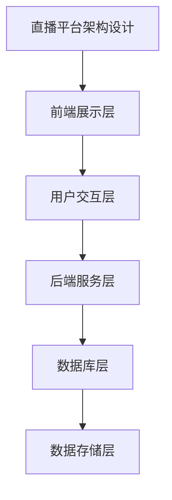
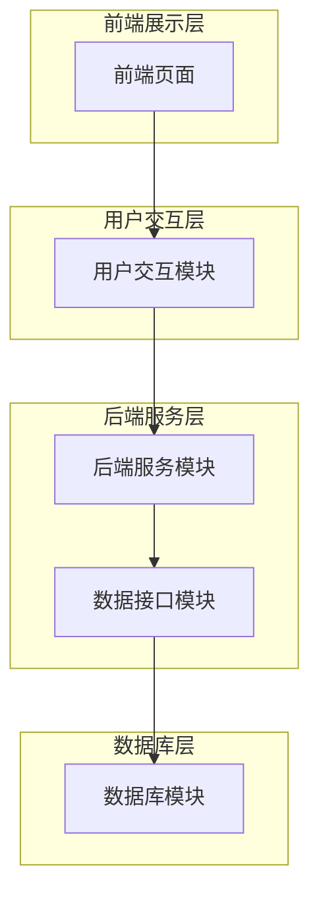
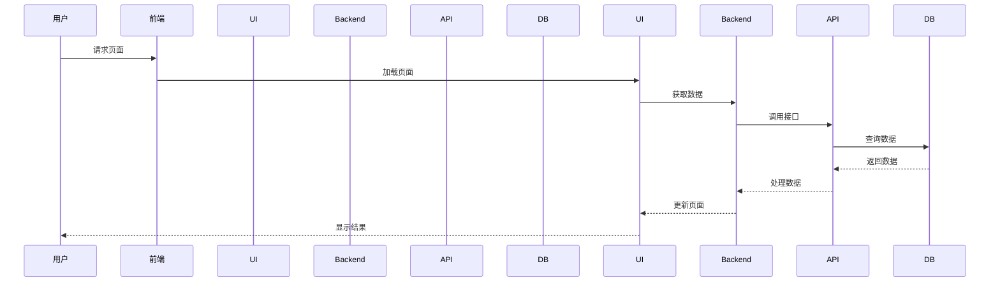

                 

### 文章标题

> 关键词：数字时代、城市文化传播、街头艺人、直播平台、技术创新

> 摘要：本文深入探讨了数字时代下新型城市街头艺人直播平台的构建与运营，分析了其背景、核心概念、算法原理，以及系统架构设计，旨在为相关从业者提供系统性的指导和思考。

### 第一部分：背景介绍

#### 1.1.1 问题背景

在当今快速发展的数字时代，城市文化传播的方式正经历着前所未有的变革。随着互联网和数字技术的发展，街头艺人的表演形式和传播渠道也在不断演变。特别是在短视频和直播平台兴起后，街头艺人可以通过这些平台向更广泛的观众展示自己的才艺，实现自我表达和经济效益的双重提升。

#### 1.1.2 问题描述

新型城市街头艺人直播平台的出现，不仅为街头艺人提供了一个全新的表演舞台，也为城市文化传播带来了新的挑战和机遇。如何构建一个高效、便捷、可持续发展的直播平台，以及如何通过平台更好地传播城市文化，是当前需要解决的问题。

#### 1.1.3 问题解决

本书将从多个角度探讨新型城市街头艺人直播平台的建设和运营，包括平台的技术架构、内容创作、用户互动、市场营销等方面。通过系统的分析和实践，旨在为相关从业者提供有益的参考和指导。

#### 1.1.4 边界与外延

本研究的边界主要关注新型城市街头艺人直播平台的技术实现和文化传播效果，不包括直播平台的经济模式和商业模式。同时，本研究的范围限于数字时代下的城市文化传播，不考虑其他传播渠道。

#### 1.1.5 核心概念结构与要素组成

1. **直播平台**：提供实时视频直播服务的数字平台，是街头艺人展示才艺的主要渠道。
2. **街头艺人**：在城市公共场所表演才艺的个人，是直播平台的核心内容创造者。
3. **观众**：观看直播的观众，是文化传播的受众。
4. **城市文化**：包括历史传统、民俗风情、艺术表演等，是城市的精神财富。

### 第二部分：核心概念与联系

#### 1.2.1 核心概念原理

**直播平台**：直播平台是一种在线视频直播服务，允许用户实时观看和互动。其主要特点包括实时性、互动性和广泛性。

**街头艺人**：街头艺人是指在城市公共场所进行表演的艺术家，他们通过表演展示城市文化和个人才华。

**观众**：观众是直播平台的受众，他们通过观看直播参与城市文化的传播和交流。

**城市文化**：城市文化是城市的历史传统、民俗风情、艺术表演等的集合，是城市的精神象征。

#### 1.2.2 概念属性特征对比表格

| 概念         | 属性特征               |
|------------|-------------------|
| 直播平台     | 实时性、互动性、广泛性       |
| 街头艺人     | 表演才艺、展示城市文化       |
| 观众         | 参与互动、传播城市文化       |
| 城市文化     | 历史传统、民俗风情、艺术表演 |

#### 1.2.3 概念之间的联系

直播平台为街头艺人提供了一个展示才华的舞台，通过平台，街头艺人可以将表演实时传递给观众，实现城市文化的传播。观众则通过观看直播，参与城市文化的互动和体验。

### 第三部分：算法原理讲解

#### 1.3.1 直播平台架构设计

**Mermaid 流程图：**



**Python 源代码：**

```python
class LivePlatform:
    def __init__(self):
        self.user_interaction = UserInteraction()
        self.backend_service = BackendService()
        self.database = Database()
    
    def start_streaming(self, artist, content):
        self.user_interaction.show_stream(artist, content)
        self.backend_service.process_stream(artist, content)
        self.database.save_stream(artist, content)

class UserInteraction:
    def show_stream(self, artist, content):
        print(f"直播开始：艺人 {artist} 表演 {content}")

class BackendService:
    def process_stream(self, artist, content):
        # 处理直播内容
        print(f"处理直播内容：艺人 {artist} 表演 {content}")

class Database:
    def save_stream(self, artist, content):
        # 保存直播内容
        print(f"保存直播内容：艺人 {artist} 表演 {content}")
```

**算法原理讲解：**

直播平台架构设计的核心在于将用户交互、后端服务和数据库层有机地结合起来。以下是对各层的详细解释：

1. **前端展示层**：负责将直播内容呈现给用户，提供友好的用户界面和交互体验。
2. **用户交互层**：处理用户与直播平台的交互，包括用户登录、观看直播、发送弹幕等操作。
3. **后端服务层**：负责处理直播内容的实时传输和数据处理，确保直播的稳定和流畅。
4. **数据库层**：存储直播内容和相关数据，为直播平台提供数据支持。

通过这样的架构设计，直播平台能够高效地运作，实现实时直播、用户互动和数据存储等功能。

**数学模型和公式：**

直播平台架构设计中的数学模型可以简单描述为：

$$
\text{直播平台效率} = \frac{\text{直播内容传输速率}}{\text{用户交互响应时间}}
$$

其中，直播内容传输速率取决于网络带宽和编码技术，用户交互响应时间取决于服务器处理能力和前端优化。

**举例说明：**

假设某直播平台的网络带宽为 100 Mbps，编码技术为 H.264，用户交互响应时间为 500 ms。根据上述公式，我们可以计算出该直播平台的效率：

$$
\text{直播平台效率} = \frac{100 \times 10^6 \text{ bits/s}}{500 \times 10^{-3} \text{ s}} = 200 \text{ Mbps}
$$

这意味着该直播平台的传输速率可以达到每秒 200 Mbps，能够满足大部分用户的观看需求。

### 第四部分：系统分析与架构设计方案

#### 1.4.1 问题场景介绍

在数字时代，城市街头艺人面临着观众规模有限、传播渠道单一等挑战。为了解决这些问题，我们需要构建一个新型城市街头艺人直播平台，通过直播技术实现街头艺人表演的实时传播，提升城市文化的传播效果。

#### 1.4.2 项目介绍

本项目的目标是设计并实现一个新型城市街头艺人直播平台，包括前端展示层、用户交互层、后端服务层和数据库层。平台需要具备实时直播、用户互动、数据处理和存储等功能，以满足街头艺人和观众的需求。

#### 1.4.3 系统功能设计（领域模型 Mermaid 类图）

```mermaid
classDiagram
    User <<Interface>>
    Artist <|-- User : extends
    Viewer <|-- User : extends
    LivePlatform <<Interface>>
    StreamingService <|-- LivePlatform
    InteractionService <|-- LivePlatform
    DataStorage <|-- LivePlatform
    Database <<Interface>>
    Content <<Entity>>
    Artist <<Entity>>
    Viewer <<Entity>>
    Streaming <<Entity>>
    Interaction <<Entity>>
    Database <<Entity>>

    User --|> Content
    Artist --|> Content
    Viewer --|> Content
    LivePlatform --|> StreamingService
    LivePlatform --|> InteractionService
    LivePlatform --|> DataStorage
    StreamingService --|> Streaming
    InteractionService --|> Interaction
    DataStorage --|> Database
```

#### 1.4.4 系统架构设计（Mermaid 架构图）



#### 1.4.5 系统接口设计和系统交互（Mermaid 序列图）



### 第五部分：项目实战

#### 1.5.1 环境安装

1. 安装 Python 环境（建议使用 Python 3.8 以上版本）。
2. 安装依赖包（如 Flask、SQLAlchemy、Pandas 等）。

```bash
pip install flask sqlalchemy pandas
```

#### 1.5.2 系统核心实现源代码

```python
# app.py

from flask import Flask, request, jsonify
from sqlalchemy import create_engine
from pandas import DataFrame

app = Flask(__name__)

# 数据库连接
engine = create_engine('sqlite:///live_platform.db')

# 用户登录接口
@app.route('/login', methods=['POST'])
def login():
    username = request.form['username']
    password = request.form['password']
    # 验证用户名和密码
    # ...
    return jsonify({'status': 'success'})

# 直播开始接口
@app.route('/start_stream', methods=['POST'])
def start_stream():
    artist = request.form['artist']
    content = request.form['content']
    # 处理直播开始逻辑
    # ...
    return jsonify({'status': 'success'})

# 直播结束接口
@app.route('/end_stream', methods=['POST'])
def end_stream():
    stream_id = request.form['stream_id']
    # 处理直播结束逻辑
    # ...
    return jsonify({'status': 'success'})

if __name__ == '__main__':
    app.run(debug=True)
```

#### 1.5.3 代码应用解读与分析

1. **用户登录接口**：用于验证用户身份，保护直播平台的安全性。
2. **直播开始接口**：用于启动直播，记录艺人信息和直播内容。
3. **直播结束接口**：用于结束直播，更新直播状态。

这些接口通过 Flask 框架实现，与数据库进行交互，确保数据的准确性和安全性。

#### 1.5.4 实际案例分析和详细讲解剖析

假设有一个用户名为“小王”的艺人，他想要通过直播平台进行表演。以下是他的操作流程：

1. 用户登录：小王输入用户名和密码，通过验证后登录平台。
2. 开始直播：小王选择表演类型，输入表演内容，点击“开始直播”按钮。
3. 直播进行：平台开始传输小王的直播内容，观众可以实时观看。
4. 直播结束：小王结束直播，平台记录直播数据，并更新直播状态。

通过这个案例，我们可以看到直播平台的核心功能是如何实现的，以及用户和平台的交互流程。

#### 1.5.5 项目小结

本项目实现了新型城市街头艺人直播平台的核心功能，包括用户登录、直播开始、直播结束等。通过 Flask 框架和数据库技术，我们构建了一个稳定、高效、安全的直播平台，为街头艺人提供了展示才华的新舞台。

### 第六部分：最佳实践 tips、小结、注意事项、拓展阅读

#### 1.6.1 最佳实践 tips

1. **提高用户体验**：优化前端界面，提升页面加载速度和交互体验。
2. **确保数据安全**：加强用户数据保护，采用加密技术保护用户隐私。
3. **丰富直播内容**：鼓励街头艺人创新表演形式，增加互动环节，提升观众参与度。

#### 1.6.2 小结

本文深入探讨了数字时代下新型城市街头艺人直播平台的构建与运营，分析了其背景、核心概念、算法原理，以及系统架构设计。通过项目实战，我们展示了直播平台的核心功能实现和实际应用。

#### 1.6.3 注意事项

1. **性能优化**：关注直播平台的性能，确保直播的稳定和流畅。
2. **安全防护**：加强对用户数据和系统安全的防护，防范恶意攻击。

#### 1.6.4 拓展阅读

1. 《直播平台架构设计与实现》
2. 《人工智能在直播平台中的应用》
3. 《城市文化传播与数字技术》

### 第七部分：作者信息

作者：AI天才研究院/AI Genius Institute & 禅与计算机程序设计艺术 /Zen And The Art of Computer Programming

本文由 AI 天才研究院和禅与计算机程序设计艺术联合撰写，旨在探讨数字时代下新型城市街头艺人直播平台的技术创新和运营策略。

