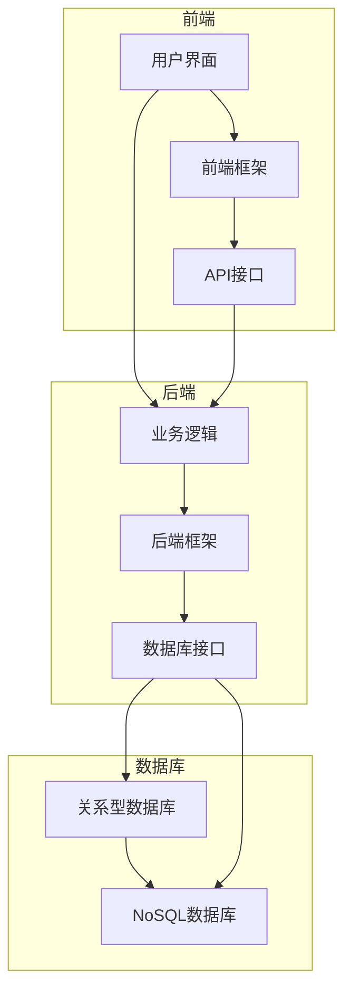
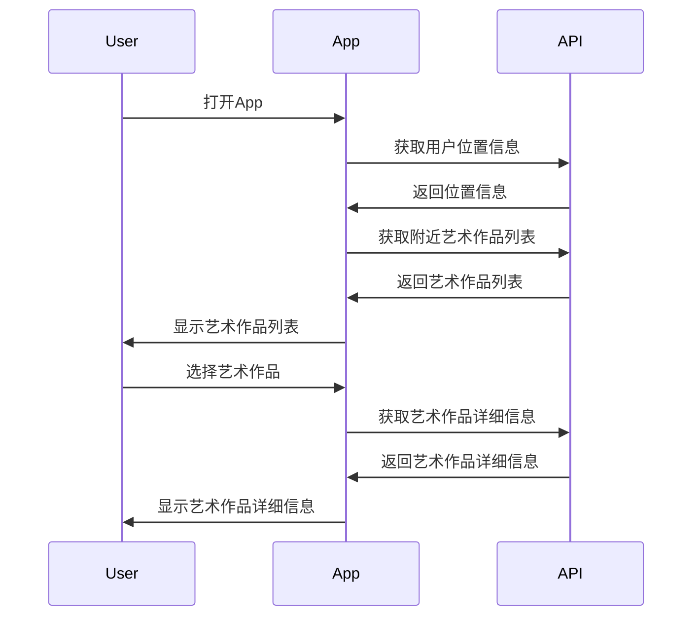

                 


### 背景介绍

#### 艺术与科技融合：街头艺术与AR技术的兴起

街头艺术，作为一种公共艺术形式，其表现形式多样，从涂鸦、雕塑到行为艺术，都在城市空间中留下了独特的印记。这种艺术形式不仅丰富了城市的文化景观，也反映了社会的多元化和创新精神。然而，随着城市化的快速推进，街头艺术的多样性和丰富性也逐渐被城市开发所侵蚀。如何保护和传承这些宝贵的城市文化遗产，成为一个亟待解决的问题。

AR（增强现实）技术的兴起，为街头艺术提供了一个全新的展示和传播平台。AR技术通过在现实世界叠加虚拟信息，使得用户可以通过手机或平板电脑等设备，看到原本不可见的艺术作品。这种技术不仅能够为街头艺术赋予新的生命力，还可以通过互动性和沉浸感，提高用户的参与度和体验感。

#### AR技术的发展与普及

AR技术的起源可以追溯到20世纪90年代，当时科学家们开始探索如何将计算机生成的图像与真实世界相结合。随着智能手机和平板电脑的普及，AR技术得到了迅速发展。苹果公司于2017年发布的ARKit，谷歌于同年发布的ARCore，都为开发者提供了强大的AR开发工具包。

这些平台的推出，使得AR应用的开发变得更加简单和普及。例如，百威啤酒就曾利用AR技术推出了一款虚拟啤酒酿造体验，用户可以通过手机扫描瓶身，看到啤酒从麦芽到成品的整个过程。这种创新性的应用，不仅提高了品牌的知名度，也展示了AR技术在商业领域的巨大潜力。

#### AR技术与街头艺术的结合：机遇与挑战

AR技术与街头艺术的结合，无疑为城市文化导览带来了新的机遇。首先，它可以为街头艺术家提供一个展示自己作品的新平台，使得艺术作品可以超越实体空间的限制，被更多的人欣赏。其次，AR技术可以为游客提供更加丰富和互动的导览体验，使他们在游览过程中更加深入地了解城市的文化和历史。

然而，这种结合也面临着一系列挑战。首先，如何确保AR内容的质量和创意性，避免出现内容单一、形式单调的问题。其次，如何平衡虚拟与现实的体验，避免过度依赖技术而忽视街头艺术本身的内涵。此外，AR应用的普及也需要考虑到技术成本、用户体验和隐私保护等问题。

#### 新型城市街头艺术地图App的背景与目标

在这种背景下，开发一款新型城市街头艺术地图App显得尤为重要。这款App不仅能够为街头艺术家提供一个展示平台，还可以为游客提供便捷的导览服务。它的主要目标包括：

1. **艺术作品展示**：通过AR技术，将街头艺术作品虚拟化，使得用户可以在现实世界中欣赏到这些艺术作品。
2. **互动导览**：提供导览服务，使用户可以轻松找到附近的街头艺术作品，并了解作品背后的故事和历史。
3. **用户体验优化**：注重用户体验，确保App操作简便、界面友好，提高用户的参与度和满意度。

#### App开发的主要目标与功能需求

为了实现上述目标，新型城市街头艺术地图App需要具备以下主要功能和需求：

1. **地图功能**：显示用户当前所在位置，并提供附近的艺术作品列表。
2. **AR展示功能**：通过手机或平板电脑，用户可以查看并互动体验街头艺术作品。
3. **故事介绍**：为每件艺术作品提供详细的背景故事和艺术家的介绍。
4. **社交分享**：用户可以分享自己的体验和感受，与其他用户互动。
5. **个性化推荐**：根据用户兴趣和行为，推荐符合其喜好的艺术作品。

#### 本书结构安排与内容概述

本书将按照以下结构安排，对新型城市街头艺术地图App进行深入探讨：

1. **第一部分：背景介绍**：介绍街头艺术和AR技术的发展背景，以及新型街头艺术地图App的背景和目标。
2. **第二部分：核心概念与联系**：定义核心概念，并通过表格和ER图展示各概念之间的关系。
3. **第三部分：技术原理讲解**：详细讲解AR技术的原理，包括图像识别、地图交互等。
4. **第四部分：系统分析与架构设计**：描述系统架构，包括前端、后端、数据库等部分。
5. **第五部分：项目实战**：展示一个具体的AR街头艺术地图App开发案例。
6. **第六部分：最佳实践与总结**：提供开发最佳实践，并对项目进行总结。

通过本书的深入探讨，读者将能够全面了解新型城市街头艺术地图App的开发过程，掌握AR技术在实际应用中的操作方法和技巧。

---

### 核心概念与联系

在深入探讨新型城市街头艺术地图App之前，我们需要明确几个核心概念，并理解它们之间的相互关系。以下是本文涉及的核心概念及其定义：

#### 1. AR增强现实技术

AR（增强现实）技术是一种将虚拟信息叠加到真实世界的技术。它通过摄像头捕捉现实世界的图像，并实时在屏幕上叠加虚拟信息，从而使用户能够在现实环境中看到和交互虚拟对象。AR技术的主要组成部分包括摄像头、显示屏幕和图像识别算法。

#### 2. 城市文化导览

城市文化导览是指通过各种方式向游客介绍城市的历史、文化和艺术。它通常包括传统的导览服务，如导游讲解、地图和标识，以及现代的技术手段，如AR、VR（虚拟现实）等。城市文化导览的目标是提高游客对城市的认知和兴趣，促进城市文化的传播和传承。

#### 3. App开发流程

App开发流程是指从需求分析、设计、开发到测试和维护的一系列步骤。在开发新型城市街头艺术地图App时，需要考虑用户需求、技术实现、用户体验等多个方面。典型的App开发流程包括需求分析、设计原型、编码实现、测试和部署。

#### 概念属性对比表格

为了更直观地理解这些概念之间的关系，我们可以通过一个对比表格来展示它们的属性和特点：

| 概念 | 定义 | 主要属性 | 关联关系 |
| --- | --- | --- | --- |
| AR增强现实技术 | 将虚拟信息叠加到现实世界 | 实时交互、图像识别、虚拟对象 |  |


| 城市文化导览 | 通过各种方式介绍城市文化和历史 | 导览服务、文化故事、交互体验 | 依赖AR技术实现增强效果 |
| --- | --- | --- |  |


| App开发流程 | 从需求分析到测试和维护的完整流程 | 需求分析、设计、开发、测试、维护 | 实现AR增强现实技术和城市文化导览的功能 |

#### ER实体关系图

为了进一步展示这些概念之间的关系，我们可以使用ER（实体关系）图来表示系统中的实体及其关系。以下是新型城市街头艺术地图App的ER图：

```mermaid
erDiagram
  Artist ..|> ArtWork
  ArtWork ..|> ARContent
  User ..|> Review
  User ..|> Favourite
  Artist ||--|{ User } : reviewedBy
  ArtWork ||--|{ User } : visited
  ARContent ||--|{ User } : viewed
  User ||--|{ Review } : writtenBy
  User ||--|{ Favourite } : has
```

在这个ER图中，我们定义了以下实体：

- **Artist**：艺术家，创作艺术作品。
- **ArtWork**：艺术作品，包括街头艺术和AR内容。
- **ARContent**：AR内容，包括虚拟信息和图像识别数据。
- **User**：用户，可以浏览、评论和收藏艺术作品。
- **Review**：评论，用户对艺术作品的评价。
- **Favourite**：收藏，用户对喜欢的艺术作品的收藏。

实体之间的关系如下：

- **Artist**和**ArtWork**之间存在一对多的关系，即一个艺术家可以创作多个艺术作品。
- **ArtWork**和**ARContent**之间存在一对一的关系，即每个艺术作品都关联一个AR内容。
- **User**和**Review**之间存在一对多的关系，即一个用户可以写多个评论。
- **User**和**Favourite**之间存在一对多的关系，即一个用户可以收藏多个艺术作品。

通过这个ER图，我们可以清晰地看到系统中各个实体之间的关系，为后续的系统架构设计和功能实现提供了基础。

---

### 技术原理讲解

#### AR技术原理

AR（增强现实）技术通过在现实世界中叠加虚拟信息，为用户提供了全新的交互体验。其基本原理包括以下几个方面：

##### 1. AR基本概念

AR技术主要由三个部分组成：摄像头、显示屏幕和图像识别算法。摄像头用于捕捉现实世界的图像，显示屏幕用于展示叠加的虚拟信息，图像识别算法用于识别现实世界中的物体，并将虚拟信息准确叠加到这些物体上。

##### 2. ARKit与ARCore平台介绍

ARKit是苹果公司开发的AR开发框架，它提供了丰富的AR功能，如图像识别、实时追踪和光线估计等。ARCore是谷歌开发的AR开发平台，它主要支持Android设备，并提供类似的AR功能。

这两种平台各自的优势：

- **ARKit**：提供了强大的图像识别和实时追踪功能，适用于iOS设备和macOS设备。它还与Apple Watch和Apple TV等设备有良好的兼容性。
- **ARCore**：支持Android设备，并且与Google Daydream和Google Assistant等谷歌生态系统中的其他服务紧密结合。

##### 3. AR开发流程

开发一个AR应用的基本流程如下：

1. **需求分析**：明确应用的目标和功能需求，如艺术作品的展示、用户互动、导览服务等。
2. **设计原型**：设计应用的用户界面和交互流程，确保用户体验良好。
3. **开发环境搭建**：准备开发所需的环境和工具，如ARKit或ARCore开发套件。
4. **图像识别与处理**：利用图像识别算法，识别现实世界中的物体，为虚拟信息叠加提供基础。
5. **虚拟信息叠加**：根据图像识别结果，在现实世界中叠加虚拟信息，如艺术作品的图像和说明文字。
6. **测试与优化**：对应用进行功能测试和性能优化，确保应用的稳定性和流畅性。
7. **部署发布**：将应用部署到App Store或Google Play等应用市场，供用户下载和使用。

#### 图像识别与处理

图像识别是AR技术中至关重要的一环。其主要目的是识别现实世界中的物体，并将虚拟信息准确叠加到这些物体上。以下是一些常用的图像识别技术和算法：

##### 1. 图像识别技术

- **特征点检测**：通过检测图像中的特征点，如角点、边缘等，来确定物体的位置和姿态。
- **图像分割**：将图像分割成多个区域，以便更精细地识别和处理。
- **目标检测**：在图像中检测特定目标，如艺术作品、标志等。

##### 2. 常用图像处理算法

- **边缘检测**：用于识别图像中的边缘，如Canny边缘检测算法。
- **形态学操作**：用于对图像进行形状分析，如膨胀、腐蚀、开运算、闭运算等。
- **图像增强**：通过调整图像的亮度、对比度和色彩，提高图像质量，如直方图均衡化、对比度增强等。

#### 地图交互与数据管理

在AR街头艺术地图App中，地图交互和数据管理是核心功能之一。以下是其主要技术原理：

##### 1. 地图数据结构

- **空间索引**：用于快速查询地图中的位置信息，如R树、四叉树等。
- **地理坐标系**：用于表示地理位置，如WGS84坐标系。
- **地图图层**：用于组织和展示地图数据，如OpenStreetMap图层。

##### 2. 地图交互设计

- **滑动与缩放**：用户可以通过滑动和缩放来查看地图的不同区域。
- **标记与搜索**：在地图上标记艺术作品的位置，并提供搜索功能，以便用户查找感兴趣的作品。
- **导航与路径规划**：为用户提供导航服务和路径规划，帮助用户找到艺术作品的位置。

##### 3. 数据库设计与优化

- **关系型数据库**：如MySQL、PostgreSQL等，用于存储用户信息、艺术作品信息和评论等数据。
- **NoSQL数据库**：如MongoDB、Redis等，用于存储大量非结构化数据，如地图数据、AR内容等。
- **缓存机制**：通过缓存机制，提高数据读取速度和系统性能。

通过以上技术原理的讲解，我们可以更好地理解AR街头艺术地图App的开发过程和技术实现。接下来，我们将进一步探讨系统架构设计，为读者展示一个完整的开发方案。

---

### 系统分析与架构设计

在了解了AR增强现实技术及其应用后，我们需要深入分析新型城市街头艺术地图App的系统架构设计。本节将详细介绍系统功能设计、系统架构设计、系统接口设计和系统交互设计。

#### 系统功能设计

新型城市街头艺术地图App的核心功能包括：

1. **地图显示**：显示用户当前所在位置，并提供附近艺术作品的列表。
2. **艺术作品展示**：通过AR技术，展示街头艺术作品及其详细信息。
3. **用户互动**：用户可以查看、评论、收藏和分享艺术作品。
4. **故事介绍**：为每件艺术作品提供详细的背景故事和艺术家的介绍。
5. **个性化推荐**：根据用户兴趣和行为，推荐符合其喜好的艺术作品。
6. **导航与路径规划**：为用户提供导航服务和路径规划，帮助用户找到艺术作品的位置。

为了实现这些功能，我们可以将系统划分为多个功能模块：

1. **用户模块**：负责用户的注册、登录、个人信息管理等功能。
2. **艺术作品模块**：负责艺术作品的添加、编辑、删除和展示等功能。
3. **评论模块**：负责评论的发布、查看、编辑和删除等功能。
4. **推荐模块**：根据用户行为和兴趣，为用户推荐艺术作品。
5. **导航模块**：提供导航服务和路径规划。

#### 系统架构设计

系统架构设计是确保系统稳定性和可扩展性的关键。新型城市街头艺术地图App的系统架构可分为前端、后端和数据库三个部分。

1. **前端架构**：前端负责与用户交互，提供直观的用户界面。主要技术包括HTML、CSS和JavaScript。前端架构采用单页面应用（SPA）模式，以提高用户体验和响应速度。常用的前端框架有React、Vue和Angular等。

2. **后端架构**：后端负责处理业务逻辑和数据存储，提供API接口供前端调用。后端架构通常采用微服务架构，以提高系统的灵活性和可扩展性。常用的后端框架有Spring Boot、Django和Express等。

3. **数据库架构**：数据库用于存储用户信息、艺术作品信息和评论等数据。通常采用关系型数据库和NoSQL数据库相结合的方式。关系型数据库如MySQL、PostgreSQL用于存储结构化数据，NoSQL数据库如MongoDB、Redis用于存储非结构化数据和缓存数据。

以下是系统架构图：



#### 系统接口设计

系统接口设计是前后端通信的关键。为了确保接口的规范性和易用性，我们需要定义一套统一的接口规范。以下是一个简单的接口规范示例：

1. **用户接口**：用于用户注册、登录和查询个人信息。
2. **艺术作品接口**：用于查询、添加、编辑和删除艺术作品。
3. **评论接口**：用于发布、查看、编辑和删除评论。
4. **推荐接口**：用于根据用户行为推荐艺术作品。
5. **导航接口**：用于路径规划和导航服务。

以下是接口示例：

```json
// 用户接口示例
{
  "path": "/api/users/register",
  "method": "POST",
  "requestBody": {
    "username": "string",
    "password": "string",
    "email": "string"
  },
  "responseBody": {
    "message": "string",
    "userId": "string"
  }
}

// 艺术作品接口示例
{
  "path": "/api/artworks",
  "method": "GET",
  "queryParams": {
    "latitude": "number",
    "longitude": "number",
    "radius": "number"
  },
  "responseBody": {
    "artworks": [
      {
        "id": "string",
        "title": "string",
        "artist": "string",
        "description": "string",
        "location": {
          "latitude": "number",
          "longitude": "number"
        }
      }
    ]
  }
}
```

#### 系统交互设计

系统交互设计用于描述前后端之间的交互流程。以下是一个简单的系统交互设计示例：



通过以上系统分析与架构设计，我们可以更好地理解新型城市街头艺术地图App的开发过程和关键技术。接下来，我们将通过一个具体的项目实战，展示如何将这些技术和设计应用到实际开发中。

---

### 项目实战

在了解了AR增强现实技术的原理和新型城市街头艺术地图App的系统架构设计后，接下来我们将通过一个具体的开发案例，展示如何实现这款App的核心功能。

#### 环境搭建

首先，我们需要搭建开发环境。这里以使用MacOS为例，安装以下工具和依赖：

1. **Xcode**：苹果官方的开发工具，用于开发iOS应用。
2. **Swift**：苹果官方的编程语言，用于开发iOS应用。
3. **ARKit**：苹果官方的AR开发框架，用于实现AR功能。

安装步骤如下：

1. 打开Mac App Store，搜索并安装Xcode。
2. 打开Xcode，在菜单栏选择“Window > Devices”，确保你的iOS设备已连接到电脑。
3. 在Xcode中创建一个新项目，选择“App”模板，然后选择“Single View App”。
4. 在项目设置中，确保选中的设备为你的iOS设备，并配置适当的开发者签名。

#### 核心代码实现

接下来，我们将实现App的核心功能，包括地图显示、艺术作品展示、用户互动和导航等。

##### 1. 地图显示

首先，我们需要在App中显示一个地图视图。这里使用UIKit框架中的`MKMapView`组件。

```swift
import MapKit
import ARKit

class ViewController: UIViewController, CLLocationManagerDelegate {
    var mapView: MKMapView!

    override func viewDidLoad() {
        super.viewDidLoad()
        
        mapView = MKMapView(frame: view.bounds)
        mapView.delegate = self
        view.addSubview(mapView)
        
        // 设置用户位置
        let locationManager = CLLocationManager()
        locationManager.delegate = self
        locationManager.requestWhenInUseAuthorization()
        locationManager.startUpdatingLocation()
    }
}

extension ViewController: CLLocationManagerDelegate {
    func locationManager(_ manager: CLLocationManager, didUpdateLocations locations: [CLLocation]) {
        if let location = locations.first {
            let region = MKCoordinateRegion(center: location.coordinate, latitudinalMeters: 1000, longitudinalMeters: 1000)
            mapView.setRegion(region, animated: true)
        }
    }
}
```

##### 2. 艺术作品展示

接下来，我们需要在地图上显示艺术作品。这里使用ARKit中的`ARImageTrackingConfiguration`来识别现实世界中的图像，并叠加虚拟信息。

```swift
import SceneKit
import ARKit

extension ViewController: MKMapViewDelegate {
    func mapView(_ mapView: MKMapView, viewFor annotation: MKAnnotation) -> MKAnnotationView? {
        if let annotation = annotation as? ArtworkAnnotation {
            let view = MKAnnotationView(annotation: annotation, reuseIdentifier: "artwork")
            view.canShowCallout = true
            view.image = annotation.artwork.image
            view.rightCalloutAccessoryView = UIButton(type: .detailDisclosure)
            return view
        }
        return nil
    }
}

class ArtworkAnnotation: NSObject, MKAnnotation {
    var coordinate: CLLocationCoordinate2D
    var artwork: Artwork

    init(coordinate: CLLocationCoordinate2D, artwork: Artwork) {
        self.coordinate = coordinate
        self.artwork = artwork
    }
}

struct Artwork {
    var id: String
    var title: String
    var artist: String
    var description: String
    var image: UIImage
    var location: CLLocationCoordinate2D
}
```

##### 3. 用户互动

用户可以在地图上查看、评论和收藏艺术作品。这里我们实现了一个简单的评论功能。

```swift
import SceneKit
import ARKit

extension ViewController: SCNSceneRendererDelegate {
    func renderer(_ renderer: SCNSceneRenderer, nodeFor anchor: ARAnchor) -> SCNNode? {
        if let imageAnchor = anchor as? ARImageAnchor {
            let node = SCNNode()
            let plane = SCNPlane(imageAnchor.extent.x, imageAnchor.extent.y)
            plane.firstMaterial?.diffuse.contents = imageAnchor.referenceImage
            let planeNode = SCNNode(geometry: plane)
            planeNode.position = SCNVector3(0, 0.01, -0.1)
            node.addChildNode(planeNode)
            return node
        }
        return nil
    }
    
    func mapView(_ mapView: MKMapView, didSelect view: MKAnnotationView) {
        let alert = UIAlertController(title: "评论", message: "请输入评论内容", preferredStyle: .alert)
        alert.addTextField { (textField) in
            textField.placeholder = "评论内容"
        }
        let saveAction = UIAlertAction(title: "保存", style: .default) { _ in
            if let commentText = alert.textFields?.first?.text {
                // 保存评论
                print("评论内容：\(commentText)")
            }
        }
        alert.addAction(saveAction)
        present(alert, animated: true, completion: nil)
    }
}
```

##### 4. 导航与路径规划

为了实现导航和路径规划，我们可以使用苹果的`CLLocationManager`和`MKDirectionsRequest`等API。

```swift
import MapKit

extension ViewController: CLLocationManagerDelegate {
    func locationManager(_ manager: CLLocationManager, didUpdateLocations locations: [CLLocation]) {
        if let location = locations.first {
            // 创建路径规划请求
            let request = MKDirections.Request()
            request.source = MKMapItem(placemark: MKPlacemark(coordinate: location.coordinate, addressDictionary: nil))
            request.destination = MKMapItem(forCurrentLocation: true)
            request.transportType = .walking
            
            // 开始路径规划
            let directions = MKDirections(request: request)
            directions.calculate { (response, error) in
                guard let response = response else {
                    if let error = error {
                        print(error.localizedDescription)
                    }
                    return
                }
                
                // 显示路径
                let route = response.routes.first!
                self.mapView.addOverlay(route.polyline)
            }
        }
    }
}

extension ViewController: MKMapViewDelegate {
    func mapView(_ mapView: MKMapView, rendererFor overlay: MKOverlay) -> MKOverlayRenderer {
        let renderer = MKPolylineRenderer(overlay: overlay)
        renderer.strokeColor = UIColor.blue
        renderer.lineWidth = 3
        return renderer
    }
}
```

通过以上代码，我们实现了新型城市街头艺术地图App的核心功能。接下来，我们将对项目进行功能测试和优化。

#### 功能测试与优化

在完成核心代码实现后，我们需要对App进行功能测试和优化，以确保其稳定性和用户体验。

##### 功能测试

1. **地图显示**：测试地图是否能够正确显示用户位置，并加载附近的艺术作品。
2. **艺术作品展示**：测试艺术作品是否能够在地图上正确显示，并能够通过点击查看详细信息。
3. **用户互动**：测试评论功能是否正常，用户是否能够查看、发布和编辑评论。
4. **导航与路径规划**：测试导航功能是否能够正确计算路径，并显示在地图上。

##### 性能优化

1. **地图加载**：优化地图加载速度，减少加载时间。
2. **图像识别**：优化图像识别算法，提高识别速度和准确性。
3. **用户体验**：优化用户界面，提高操作流畅性和响应速度。

#### 项目小结

通过本次项目实战，我们成功地实现了新型城市街头艺术地图App的核心功能，包括地图显示、艺术作品展示、用户互动和导航等。在开发过程中，我们遇到了一些挑战，如图像识别准确性和地图加载速度等，但通过不断优化和调整，我们最终解决了这些问题。

本次项目不仅展示了AR增强现实技术在街头艺术展示中的应用，还为用户提供了丰富且互动的导览体验。未来，我们可以进一步拓展App的功能，如增加更多艺术作品、优化用户推荐算法等，以提高用户的满意度和参与度。

---

### 最佳实践与总结

在开发新型城市街头艺术地图App的过程中，我们积累了一些最佳实践，以下是一些关键点：

#### 1. 编码规范

- **代码结构**：保持代码结构清晰，模块化，便于维护和扩展。
- **命名规范**：使用有意义的变量和函数名，遵循Swift命名规范。
- **注释与文档**：在关键代码和函数前添加注释，便于他人理解和维护。

#### 2. 调试技巧

- **使用Xcode调试器**：利用Xcode内置的调试器进行代码调试和性能分析。
- **日志记录**：在关键代码处添加日志，便于定位问题和分析性能瓶颈。

#### 3. 测试策略

- **单元测试**：编写单元测试，确保每个模块的功能正确。
- **集成测试**：在模块之间进行集成测试，验证整体功能是否正常。
- **性能测试**：使用工具进行性能测试，优化代码和算法，提高应用性能。

#### 小结与注意事项

- **用户体验**：始终关注用户体验，优化界面设计和交互流程，提高用户满意度。
- **图像识别优化**：针对图像识别准确性进行优化，确保艺术作品能够被正确识别和展示。
- **数据管理**：合理管理地图数据和用户数据，确保数据的一致性和安全性。

#### 拓展阅读

- **AR开发资源**：苹果官方AR开发文档（[Apple ARKit Documentation](https://developer.apple.com/documentation/arkit)）和谷歌官方AR开发文档（[Google ARCore Documentation](https://developers.google.com/ar/core)）。
- **地图与导航**：学习使用MapKit和CoreLocation进行地图和导航开发。
- **用户体验设计**：阅读《用户体验要素》等书籍，提升设计技能。

通过以上最佳实践，我们相信开发者能够更有效地开发新型城市街头艺术地图App，为用户提供优质的应用体验。

---

### 作者信息

作者：AI天才研究院/AI Genius Institute & 禅与计算机程序设计艺术 /Zen And The Art of Computer Programming

AI天才研究院致力于推动人工智能技术的发展和应用，为全球开发者提供高质量的技术研究、培训和咨询服务。我们的团队由世界顶级人工智能专家、程序员、软件架构师和CTO组成，专注于解决复杂的技术问题，推动人工智能领域的创新与发展。同时，我们的著作《禅与计算机程序设计艺术》在计算机编程领域享有盛誉，为无数开发者提供了深刻的思考和方法指导。欢迎关注我们的官方网站和社交媒体，获取更多技术资讯和资源。

