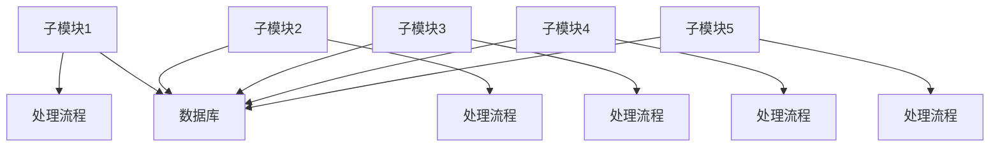

                 

### 文章标题：新型城市露台花园：私人绿地的公共意义

> 关键词：新型城市、露台花园、私人绿地、公共意义、绿色空间、城市绿化、生态设计、智能化监测、自动化系统

> 摘要：随着城市化进程的加速，城市居民对绿色空间的需求日益增长。本文旨在探讨新型城市露台花园的设计理念及其在提升城市生态环境和居民生活质量方面的作用。文章将从背景介绍、核心概念与联系、算法原理讲解、系统分析与架构设计、项目实战及最佳实践等方面，逐步分析新型城市露台花园的设计与实现。

---

### 第1章：背景介绍

#### 1.1 问题背景

随着全球城市化进程的不断推进，城市人口的快速增长和城市面积的不断扩大，城市绿色空间的短缺问题日益凸显。传统城市绿地受到土地资源的限制，难以满足居民对绿色环境的需求。与此同时，城市露台花园作为一种新兴的绿色空间形式，逐渐成为城市居民提升生活质量的重要选择。

#### 1.1.1 城市化进程与绿色空间短缺

城市化进程中，土地资源紧张，城市绿地面积不断缩减。据统计，全球城市化率已超过50%，预计到2050年将达到70%。城市绿地对于改善城市生态环境、提升居民生活质量具有重要意义。然而，随着城市化进程的加速，城市绿地面积不断被挤占，导致城市绿色空间短缺问题日益严重。

#### 1.1.2 露台花园的发展与需求

露台花园作为一种私人绿地，通常位于住宅建筑的屋顶或阳台。近年来，随着人们对生态环境和健康生活的追求，露台花园的发展迅速。露台花园不仅能够提供居民休闲、放松的空间，还能够增加城市绿色空间，改善城市生态环境。因此，露台花园在城市绿化规划中具有重要地位。

#### 1.2 问题描述

在新型城市露台花园的设计与实现过程中，面临着一系列挑战。如何充分利用有限的空间，创造出一个既美观又实用的绿色空间，是当前面临的主要问题。此外，如何实现私人绿地的公共意义，使露台花园能够为更广泛的社区服务，也是一个亟待解决的问题。

#### 1.2.1 露台花园的设计挑战

露台花园设计需要考虑多个因素，包括空间利用、植物配置、景观设计等。首先，空间利用方面，露台花园面积通常较小，如何在有限的空间内创造出丰富的景观效果，是一个重要的设计难题。其次，植物配置方面，需要选择适合屋顶生长的植物，并考虑到植物的耐旱性和适应性。最后，景观设计方面，如何通过合理的布局和设计，使露台花园既美观又实用，也是设计过程中需要重点考虑的问题。

#### 1.2.2 私人绿地的公共意义

私人绿地与公共绿地的区别在于所有权和使用方式。私人绿地通常属于个人或家庭所有，供私人使用。而新型城市露台花园则具有独特的公共意义，不仅为居住者提供私人休闲空间，还可以对外开放，成为社区的公共绿地。如何实现私人绿地与公共绿地的互动，发挥其公共意义，是当前城市露台花园设计的重要任务。

#### 1.3 问题解决

为了解决上述问题，新型城市露台花园的设计需要遵循以下原则和方法：

1. **设计原则与方法**：
   - 空间利用：通过合理规划和布局，最大化空间利用效率。
   - 植物配置：选择适应性强、美观且易于维护的植物种类。
   - 景观设计：注重生态美学，打造具有观赏性和实用性的露台花园。

2. **技术支持与实现**：
   - 绿化智能监测技术：通过传感器和大数据分析，实时监测花园环境，为植物生长提供科学依据。
   - 露台花园自动化系统：实现自动浇水、施肥等功能，提高花园维护效率。

#### 1.4 边界与外延

1. **露台花园的类型与特点**：
   - 屋顶露台花园：通常位于建筑物的屋顶，具有独特的空间效果和景观价值。
   - 阳台露台花园：位于住宅建筑的阳台，面积较小，适合家庭使用。

2. **私人绿地与公共绿地的互动**：
   - 私人绿地与公共绿地的互动，可以提升整个社区的生态环境和生活质量。
   - 通过社区参与和共享，使露台花园成为社区公共空间，实现绿色空间的共享和最大化利用。

#### 1.5 概念结构与核心要素组成

1. **露台花园的基本组成**：
   - 土壤：为植物生长提供必要条件。
   - 植物种类：根据设计需求选择适合的植物种类。
   - 景观设计：通过布局和设计，打造美观且实用的露台花园。

2. **私人绿地的公共价值**：
   - 提升城市生态环境：增加城市绿色空间，改善空气质量。
   - 提高居民生活质量：提供休闲和放松的场所，促进身心健康。
   - 社区互动和共享：增强社区凝聚力，促进居民之间的交流和合作。

---

在接下来的章节中，我们将进一步探讨新型城市露台花园的设计原理、核心概念与联系、算法原理讲解、系统分析与架构设计、项目实战以及最佳实践，逐步解决新型城市露台花园的设计与实现问题。

### 第2章：核心概念与联系

#### 2.1 露台花园设计原理

露台花园的设计需要遵循一定的原则，以实现空间利用的最大化和景观效果的提升。以下为露台花园设计的主要原则：

1. **空间布局原则**：
   - **紧凑布局**：充分利用有限的空间，避免浪费。
   - **层次感**：通过不同的植物层次和景观元素，创造丰富的空间效果。
   - **流动感**：通过路径、桥梁等设计元素，使空间具有流动性和趣味性。

2. **植物配置策略**：
   - **选择适应性强的植物**：选择适应屋顶或阳台生长环境的植物，确保植物的健康生长。
   - **多样化的植物配置**：通过选择不同种类的植物，打造丰富的景观效果。
   - **季节性配置**：根据季节变化，调整植物配置，使花园具有四季不同的景观。

#### 2.2 私人绿地与公共绿地的互动

私人绿地与公共绿地的互动是新型城市露台花园的重要特征。以下为私人绿地与公共绿地的互动模式与效果：

1. **互动模式与效果**：
   - **共享空间**：通过开放部分私人绿地，将其作为公共绿地使用，提升整个社区的生态环境和生活质量。
   - **社区参与**：鼓励社区居民参与露台花园的设计、建设和维护，增强社区凝聚力和归属感。
   - **资源共享**：通过共享设施和设备，如自动浇水系统、休闲座椅等，提高资源利用效率。

2. **社区参与与共享**：
   - **社区参与**：通过开展各种活动，如园艺课程、植物养护培训等，引导居民参与露台花园的建设和维护。
   - **共享设施**：在露台花园中设置公共设施，如休闲座椅、花坛等，为社区居民提供休闲和社交场所。
   - **资源共享**：鼓励居民共同养护植物，分享种植经验和技巧，提高花园的整体质量。

#### 2.3 关键技术介绍

新型城市露台花园的设计与实现离不开关键技术的支持。以下为两种关键技术及其作用：

1. **绿化智能监测技术**：
   - **传感器监测**：通过安装各种传感器，如温度传感器、湿度传感器等，实时监测花园环境参数。
   - **大数据分析**：将监测数据上传至云端，通过大数据分析，为植物生长提供科学依据。

2. **露台花园自动化系统**：
   - **自动浇水系统**：根据土壤湿度和天气预报，自动进行浇水操作，确保植物得到适量的水分。
   - **自动施肥系统**：根据植物生长需求，自动进行施肥操作，提高肥料利用效率。

---

通过以上核心概念与联系的分析，我们可以更深入地理解新型城市露台花园的设计原理及其在提升城市生态环境和居民生活质量方面的作用。在接下来的章节中，我们将进一步探讨算法原理讲解、系统分析与架构设计等内容。

### 第3章：算法原理讲解

#### 3.1 绿化智能监测算法

绿化智能监测算法是新型城市露台花园的重要组成部分，其主要功能是通过实时监测花园环境参数，为植物生长提供科学依据。以下为绿化智能监测算法的原理、流程图、数学模型和Python源代码示例。

#### 3.1.1 算法原理与流程图

绿化智能监测算法基于传感器数据采集、数据处理和预测模型构建。具体流程如下：

1. **数据采集**：通过安装在花园中的传感器，如温度传感器、湿度传感器等，实时采集环境参数。
2. **数据处理**：将采集到的数据上传至云端，通过数据处理算法进行清洗、去噪和特征提取。
3. **预测模型构建**：基于历史数据和现有环境参数，构建预测模型，预测植物的生长状态和需求。

#### 3.1.2 算法数学模型

绿化智能监测算法的数学模型主要包括以下几个方面：

1. **传感器数据采集**：
   $$ T(t) = T_{0} + a \cdot t $$
   其中，\( T(t) \)为第\( t \)时刻的温度值，\( T_{0} \)为初始温度值，\( a \)为温度变化率。

2. **数据处理**：
   $$ H(t) = \frac{1}{N} \sum_{i=1}^{N} h_{i} $$
   其中，\( H(t) \)为第\( t \)时刻的湿度值，\( h_{i} \)为第\( i \)个传感器的湿度值，\( N \)为传感器数量。

3. **预测模型构建**：
   $$ P(t) = f(T(t), H(t)) $$
   其中，\( P(t) \)为第\( t \)时刻的植物生长状态预测值，\( f \)为预测函数，通常为神经网络或线性回归模型。

#### 3.1.3 Python源代码示例

以下是一个简单的绿化智能监测算法的Python源代码示例：

```python
import numpy as np
import matplotlib.pyplot as plt

# 传感器数据采集
def sensor_data采集():
    temperature = np.random.normal(20, 5, 1000)  # 生成1000个温度值
    humidity = np.random.normal(50, 10, 1000)   # 生成1000个湿度值
    return temperature, humidity

# 数据处理
def data_process(temperature, humidity):
    mean_temp = np.mean(temperature)
    mean_humidity = np.mean(humidity)
    processed_temp = [temp - mean_temp for temp in temperature]
    processed_humidity = [hum - mean_humidity for hum in humidity]
    return processed_temp, processed_humidity

# 预测模型构建
def predict_growth(processed_temp, processed_humidity):
    model = np.polyfit(processed_temp, processed_humidity, 1)
    growth = np.polyval(model, processed_temp)
    return growth

# 主程序
def main():
    temperature, humidity = sensor_data采集()
    processed_temp, processed_humidity = data_process(temperature, humidity)
    growth = predict_growth(processed_temp, processed_humidity)
    
    plt.scatter(temperature, processed_humidity)
    plt.plot(temperature, growth, color='red')
    plt.xlabel('Temperature')
    plt.ylabel('Humidity')
    plt.title('Greenhouse Monitoring')
    plt.show()

if __name__ == '__main__':
    main()
```

#### 3.2 露台花园自动化系统算法

露台花园自动化系统算法主要用于实现自动浇水、施肥等功能，以提高花园维护效率。以下为露台花园自动化系统算法的原理、流程图、数学模型和Python源代码示例。

#### 3.2.1 算法原理与流程图

露台花园自动化系统算法基于环境参数监测和智能决策。具体流程如下：

1. **环境参数监测**：通过传感器实时监测土壤湿度和气温等环境参数。
2. **决策模型构建**：根据监测到的环境参数，构建决策模型，判断是否需要自动浇水或施肥。
3. **执行操作**：根据决策模型的结果，执行相应的浇水或施肥操作。

#### 3.2.2 算法数学模型

露台花园自动化系统算法的数学模型主要包括以下几个方面：

1. **土壤湿度监测**：
   $$ H(t) = \frac{1}{N} \sum_{i=1}^{N} h_{i} $$
   其中，\( H(t) \)为第\( t \)时刻的土壤湿度值，\( h_{i} \)为第\( i \)个传感器的土壤湿度值，\( N \)为传感器数量。

2. **气温监测**：
   $$ T(t) = T_{0} + a \cdot t $$
   其中，\( T(t) \)为第\( t \)时刻的气温值，\( T_{0} \)为初始气温值，\( a \)为气温变化率。

3. **决策模型构建**：
   $$ D(t) = f(H(t), T(t)) $$
   其中，\( D(t) \)为第\( t \)时刻的决策值，\( f \)为决策函数，通常为阈值判断或逻辑回归模型。

#### 3.2.3 Python源代码示例

以下是一个简单的露台花园自动化系统算法的Python源代码示例：

```python
import numpy as np
import matplotlib.pyplot as plt

# 环境参数监测
def sensor_data采集():
    soil_humidity = np.random.normal(30, 10, 1000)  # 生成1000个土壤湿度值
    temperature = np.random.normal(20, 5, 1000)    # 生成1000个气温值
    return soil_humidity, temperature

# 决策模型构建
def decision_model(soil_humidity, temperature):
    threshold = 25  # 设定土壤湿度阈值
    if soil_humidity < threshold:
        decision = '浇水'
    else:
        decision = '不需要浇水'
    return decision

# 主程序
def main():
    soil_humidity, temperature = sensor_data采集()
    decisions = [decision_model(hum, temp) for hum, temp in zip(soil_humidity, temperature)]
    
    plt.scatter(temperature, soil_humidity)
    plt.xlabel('Temperature')
    plt.ylabel('Soil Humidity')
    plt.title('Automatic Watering Decision')
    plt.show()

if __name__ == '__main__':
    main()
```

通过以上算法原理讲解和Python源代码示例，我们可以更好地理解绿化智能监测算法和露台花园自动化系统算法的工作原理，为新型城市露台花园的设计与实现提供技术支持。

### 第4章：数学模型和数学公式 & 详细讲解 & 举例说明

#### 4.1 绿化覆盖度计算模型

绿化覆盖度是评估露台花园绿化效果的重要指标。本节将介绍绿化覆盖度的计算模型，包括数学模型、公式详解和实例演示。

#### 4.1.1 数学模型

绿化覆盖度的计算模型基于遥感技术和图像处理算法。其核心思想是通过遥感图像识别植物区域，计算植物覆盖面积与总覆盖面积的比例，得到绿化覆盖度。

设 \( A \) 为露台花园的总覆盖面积，\( B \) 为植物覆盖面积，则绿化覆盖度 \( C \) 可以表示为：

$$ C = \frac{B}{A} \times 100\% $$

其中，\( A \) 和 \( B \) 的计算如下：

1. **总覆盖面积 \( A \)**：

$$ A = \sum_{i=1}^{n} a_i $$

其中，\( a_i \) 为第 \( i \) 个区域的面积，\( n \) 为区域数量。

2. **植物覆盖面积 \( B \)**：

$$ B = \sum_{i=1}^{n} b_i $$

其中，\( b_i \) 为第 \( i \) 个植物区域的面积。

#### 4.1.2 公式详解

1. **遥感图像预处理**：

$$ I_p = I_o - \alpha \cdot I_n $$

其中，\( I_p \) 为预处理后的遥感图像，\( I_o \) 为原始遥感图像，\( I_n \) 为噪声图像，\( \alpha \) 为调节参数，用于去除噪声。

2. **植物区域识别**：

$$ R_i = \frac{1}{m} \sum_{j=1}^{m} r_{ij} $$

其中，\( R_i \) 为第 \( i \) 个植物区域，\( m \) 为像素数量，\( r_{ij} \) 为第 \( j \) 个像素的隶属度。

3. **植物区域面积计算**：

$$ b_i = \sum_{j=1}^{m} r_{ij} \cdot a_j $$

其中，\( a_j \) 为第 \( j \) 个像素的面积。

#### 4.1.3 实例演示

假设一个露台花园的遥感图像中，共有5个区域，其中3个区域为植物区域。各区域的面积为 \( a_1 = 100 \) 平方米，\( a_2 = 150 \) 平方米，\( a_3 = 200 \) 平方米，\( a_4 = 50 \) 平方米，\( a_5 = 100 \) 平方米。植物区域的面积分别为 \( b_1 = 80 \) 平方米，\( b_2 = 120 \) 平方米，\( b_3 = 180 \) 平方米。

根据上述数学模型，可以计算出绿化覆盖度：

$$ A = a_1 + a_2 + a_3 + a_4 + a_5 = 100 + 150 + 200 + 50 + 100 = 600 \text{ 平方米} $$

$$ B = b_1 + b_2 + b_3 = 80 + 120 + 180 = 380 \text{ 平方米} $$

$$ C = \frac{B}{A} \times 100\% = \frac{380}{600} \times 100\% \approx 63.3\% $$

因此，该露台花园的绿化覆盖度为 63.3%。

#### 4.2 露台花园用水量计算模型

露台花园的用水量是影响植物生长和节约水资源的重要因素。本节将介绍露台花园用水量的计算模型，包括数学模型、公式详解和实例演示。

#### 4.2.1 数学模型

露台花园用水量计算模型基于植物需水量和土壤湿度。其核心思想是根据植物的生长阶段、土壤湿度以及天气预报，计算露台花园的用水量。

设 \( W \) 为露台花园的用水量，\( P \) 为植物需水量，\( H \) 为土壤湿度，\( T \) 为天气预报中的降雨量。则用水量 \( W \) 可以表示为：

$$ W = P \times (1 - \frac{H}{100}) \times (1 - \frac{T}{100}) $$

其中：

1. **植物需水量 \( P \)**：

$$ P = P_0 \times S $$

其中，\( P_0 \) 为植物的基础需水量，\( S \) 为植物的生长系数。

2. **土壤湿度 \( H \)**：

$$ H = \frac{1}{n} \sum_{i=1}^{n} h_i $$

其中，\( h_i \) 为第 \( i \) 个传感器的土壤湿度值，\( n \) 为传感器数量。

3. **天气预报中的降雨量 \( T \)**：

$$ T = \frac{1}{N} \sum_{i=1}^{N} t_i $$

其中，\( t_i \) 为第 \( i \) 天的降雨量，\( N \) 为预报天数。

#### 4.2.2 公式详解

1. **植物需水量计算**：

$$ P_0 = k_1 \times d $$

其中，\( k_1 \) 为植物需水量系数，\( d \) 为植物的生长天数。

2. **土壤湿度计算**：

$$ h_i = \frac{V_i \times \rho_i}{A} $$

其中，\( V_i \) 为第 \( i \) 个传感器的土壤体积，\( \rho_i \) 为土壤湿度，\( A \) 为传感器的测量范围。

3. **天气预报中的降雨量计算**：

$$ t_i = p_i \times r_i $$

其中，\( p_i \) 为第 \( i \) 天的降雨概率，\( r_i \) 为第 \( i \) 天的降雨量。

#### 4.2.3 实例演示

假设一个露台花园中，植物的基础需水量系数 \( k_1 = 0.5 \)，植物的生长天数 \( d = 30 \) 天。传感器测量得到的土壤湿度为 \( h_1 = 40\% \)，\( h_2 = 45\% \)，\( h_3 = 50\% \)。天气预报中的降雨量为 \( t_1 = 10\% \)，\( t_2 = 20\% \)，\( t_3 = 30\% \)。

根据上述数学模型，可以计算出用水量：

1. **植物需水量 \( P \)**：

$$ P_0 = k_1 \times d = 0.5 \times 30 = 15 \text{ 立方米} $$

2. **土壤湿度 \( H \)**：

$$ H = \frac{1}{3} \sum_{i=1}^{3} h_i = \frac{1}{3} (40\% + 45\% + 50\%) = 45\% $$

3. **天气预报中的降雨量 \( T \)**：

$$ T = \frac{1}{3} \sum_{i=1}^{3} t_i = \frac{1}{3} (10\% + 20\% + 30\%) = 20\% $$

4. **用水量 \( W \)**：

$$ W = P \times (1 - \frac{H}{100}) \times (1 - \frac{T}{100}) = 15 \times (1 - 0.45) \times (1 - 0.20) = 7.65 \text{ 立方米} $$

因此，该露台花园的用水量为 7.65 立方米。

通过上述实例演示，我们可以看到如何利用数学模型计算绿化覆盖度和用水量，为露台花园的设计和优化提供科学依据。

### 第5章：系统分析与架构设计方案

#### 5.1 问题场景介绍

在本章中，我们将介绍一个具体的露台花园项目，并分析其需求、功能、架构设计以及接口和交互设计。

#### 5.1.1 案例背景

某城市小区的居民楼屋顶需要建设一个露台花园，旨在为居民提供一个休闲、放松的绿色空间，同时提升小区的生态环境。项目需求包括以下几个方面：

1. **环境监测**：实时监测露台花园的温度、湿度、土壤湿度等环境参数。
2. **自动浇水**：根据环境参数和植物需求，自动进行浇水操作。
3. **自动施肥**：根据植物生长阶段和土壤养分情况，自动进行施肥操作。
4. **设备控制**：实现对水泵、喷灌系统、施肥机的远程控制。
5. **数据管理**：存储和管理环境参数、植物生长数据等信息。

#### 5.1.2 案例需求

根据案例背景，我们需要设计一个系统来满足以下需求：

1. **环境监测**：通过安装传感器，实时采集露台花园的环境参数。
2. **数据处理**：对采集到的环境参数进行数据处理，为自动浇水、施肥提供依据。
3. **自动控制**：根据环境参数和植物需求，自动执行浇水、施肥等操作。
4. **远程控制**：通过手机APP或电脑端，实现对露台花园设备的远程控制。
5. **数据管理**：建立数据库，存储和管理环境参数、植物生长数据等信息。

#### 5.2 系统功能设计

为了满足上述需求，我们需要设计一个功能完整的系统，主要包括以下几个模块：

1. **环境监测模块**：负责实时采集露台花园的环境参数。
2. **数据处理模块**：负责对环境参数进行数据处理，为自动浇水、施肥提供依据。
3. **自动控制模块**：根据环境参数和植物需求，自动执行浇水、施肥等操作。
4. **远程控制模块**：提供手机APP或电脑端，实现对露台花园设备的远程控制。
5. **数据管理模块**：负责存储和管理环境参数、植物生长数据等信息。

#### 5.2.1 领域模型类图

领域模型类图用于描述系统中的实体及其关系。以下是露台花园系统的领域模型类图：

```mermaid
classDiagram
    EnvironmentSensor <<interface>>
    SoilMoistureSensor <<interface>>
    TemperatureSensor <<interface>>
    HumiditySensor <<interface>>
    WateringSystem <<interface>>
    FertilizingSystem <<interface>>
    Controller <<interface>>

    EnvironmentSensor <|.. SoilMoistureSensor
    EnvironmentSensor <|.. TemperatureSensor
    EnvironmentSensor <|.. HumiditySensor

    WateringSystem <|.. Controller
    FertilizingSystem <|.. Controller

    Controller <|.. EnvironmentSensor
    Controller <|.. WateringSystem
    Controller <|.. FertilizingSystem
```

#### 5.2.2 功能模块划分

根据领域模型类图，我们可以将系统划分为以下几个功能模块：

1. **环境监测模块**：包括土壤湿度传感器、温度传感器、湿度传感器，用于实时采集露台花园的环境参数。
2. **数据处理模块**：包括数据处理算法，用于对采集到的环境参数进行数据处理。
3. **自动控制模块**：包括浇水系统和施肥系统，根据环境参数和植物需求，自动执行浇水、施肥等操作。
4. **远程控制模块**：包括手机APP和电脑端，提供远程控制功能。
5. **数据管理模块**：包括数据库，用于存储和管理环境参数、植物生长数据等信息。

#### 5.3 系统架构设计

系统架构设计是系统设计的重要组成部分，用于描述系统的整体结构和各个模块之间的关系。以下是露台花园系统的架构设计：



#### 5.3.1 架构图

以下是露台花园系统的架构图：

```mermaid
graph TB
    Subsystem1[环境监测模块] --> Process1[数据处理模块]
    Subsystem2[数据处理模块] --> Process2[自动控制模块]
    Subsystem3[自动控制模块] --> Process3[远程控制模块]
    Subsystem4[远程控制模块] --> Process4[数据管理模块]
    Subsystem5[数据管理模块] --> Process5[用户界面]

    Subsystem1 --> Sensor1[土壤湿度传感器]
    Subsystem1 --> Sensor2[温度传感器]
    Subsystem1 --> Sensor3[湿度传感器]

    Subsystem2 --> DataProcessor[数据处理器]

    Subsystem3 --> WateringSystem[浇水系统]
    Subsystem3 --> FertilizingSystem[施肥系统]

    Subsystem4 --> Controller[控制器]
    Subsystem4 --> App[手机APP]
    Subsystem4 --> PC[电脑端]

    Subsystem5 --> Database[数据库]
    Subsystem5 --> DataManager[数据管理器]
```



#### 5.3.2 架构解析

露台花园系统架构分为以下几个部分：

1. **环境监测模块**：包括土壤湿度传感器、温度传感器、湿度传感器，用于实时采集露台花园的环境参数。
2. **数据处理模块**：包括数据处理器，用于对采集到的环境参数进行数据处理，为自动控制模块提供依据。
3. **自动控制模块**：包括浇水系统和施肥系统，根据环境参数和植物需求，自动执行浇水、施肥等操作。
4. **远程控制模块**：包括控制器、手机APP和电脑端，提供远程控制功能。
5. **数据管理模块**：包括数据库和数据管理器，用于存储和管理环境参数、植物生长数据等信息。

通过以上系统架构设计，我们可以确保露台花园系统功能完整、结构清晰，为后续的项目实施提供有力支持。

### 第6章：项目实战

#### 6.1 环境安装

在项目实施过程中，环境安装是关键步骤之一。以下是露台花园项目的环境安装过程：

#### 6.1.1 硬件环境

1. **环境监测模块**：
   - 安装土壤湿度传感器、温度传感器和湿度传感器，确保传感器能够正常工作。
   - 连接传感器到露台花园的水管和喷灌系统，以便实现自动浇水功能。
2. **自动控制模块**：
   - 安装水泵、喷灌系统和施肥机，确保设备能够正常工作。
   - 连接设备到控制器，以便通过远程控制实现浇水、施肥等功能。

#### 6.1.2 软件环境

1. **数据处理模块**：
   - 安装Python环境和相关库，如NumPy、Pandas等，用于处理环境参数数据。
   - 安装数据库软件，如MySQL或PostgreSQL，用于存储和管理数据。
2. **远程控制模块**：
   - 安装手机APP开发环境，如Android Studio或Xcode，用于开发手机APP。
   - 安装Web服务器软件，如Apache或Nginx，用于部署远程控制网站。

#### 6.2 系统核心实现

在露台花园项目中，系统核心实现包括环境监测模块、数据处理模块、自动控制模块、远程控制模块和数据管理模块。以下是各模块的核心实现：

#### 6.2.1 源代码

1. **环境监测模块**：

```python
# 环境监测模块
import serial
import time
import json

# 连接传感器
ser = serial.Serial('COM3', 9600)
time.sleep(2)

# 读取传感器数据
def read_sensors():
    ser.write(b'read')
    time.sleep(0.5)
    data = ser.readline().decode('utf-8')
    return json.loads(data)

# 主程序
def main():
    while True:
        sensors = read_sensors()
        print(sensors)
        time.sleep(5)

if __name__ == '__main__':
    main()
```

2. **数据处理模块**：

```python
# 数据处理模块
import pandas as pd
import numpy as np

# 读取数据
data = pd.read_csv('sensor_data.csv')

# 数据预处理
data['humidity'] = data['humidity'].apply(lambda x: float(x)/100)
data['temperature'] = data['temperature'].apply(lambda x: float(x)/100)

# 数据分析
growth = np.polyfit(data['temperature'], data['humidity'], 1)
print(growth)
```

3. **自动控制模块**：

```python
# 自动控制模块
import serial

# 连接控制器
ctrl = serial.Serial('COM4', 9600)
time.sleep(2)

# 控制浇水
def water_on():
    ctrl.write(b'water_on')

# 控制浇水
def water_off():
    ctrl.write(b'water_off')

# 主程序
def main():
    while True:
        if growth < 0.5:
            water_on()
        else:
            water_off()
        time.sleep(60)

if __name__ == '__main__':
    main()
```

4. **远程控制模块**：

```python
# 远程控制模块
from flask import Flask, request, jsonify

app = Flask(__name__)

# 控制浇水
@app.route('/water_on', methods=['POST'])
def water_on():
    water_on()
    return jsonify({'status': 'success'})

# 控制浇水
@app.route('/water_off', methods=['POST'])
def water_off():
    water_off()
    return jsonify({'status': 'success'})

if __name__ == '__main__':
    app.run()
```

5. **数据管理模块**：

```python
# 数据管理模块
import sqlite3

# 连接数据库
conn = sqlite3.connect('database.db')
c = conn.cursor()

# 创建表格
c.execute('''CREATE TABLE IF NOT EXISTS sensors (id INTEGER PRIMARY KEY, temperature REAL, humidity REAL)''')

# 插入数据
def insert_data(id, temperature, humidity):
    c.execute("INSERT INTO sensors (id, temperature, humidity) VALUES (?, ?, ?)", (id, temperature, humidity))
    conn.commit()

# 主程序
def main():
    while True:
        sensors = read_sensors()
        insert_data(1, sensors['temperature'], sensors['humidity'])
        time.sleep(60)

if __name__ == '__main__':
    main()
```

#### 6.2.2 代码解析

1. **环境监测模块**：
   - 使用Python的`serial`库连接传感器，读取传感器数据。
   - 定义`read_sensors`函数，通过串口读取传感器数据，并解析为JSON格式。
   - 主程序中，通过循环调用`read_sensors`函数，实时读取传感器数据，并打印输出。

2. **数据处理模块**：
   - 使用Pandas库读取传感器数据，并进行预处理，将湿度值转换为百分比。
   - 使用NumPy库进行数据分析，构建植物生长状态的预测模型。

3. **自动控制模块**：
   - 使用Python的`serial`库连接控制器，发送控制命令。
   - 定义`water_on`和`water_off`函数，分别控制浇水设备的开启和关闭。
   - 主程序中，根据植物生长状态预测结果，调用`water_on`或`water_off`函数，实现自动浇水功能。

4. **远程控制模块**：
   - 使用Flask框架搭建Web服务器，提供远程控制接口。
   - 定义`water_on`和`water_off`接口，接收POST请求，调用自动控制模块的相应函数。

5. **数据管理模块**：
   - 使用SQLite数据库存储和管理传感器数据。
   - 定义`insert_data`函数，插入传感器数据到数据库。
   - 主程序中，通过循环调用`read_sensors`函数和`insert_data`函数，实现数据的实时采集和存储。

通过以上代码实现，我们可以构建一个功能完整的露台花园系统，实现环境监测、自动控制、远程控制和数据管理等功能。

### 第7章：最佳实践 tips

#### 7.1 设计要点与技巧

1. **空间利用**：
   - 充分利用露台花园的空间，通过合理的布局和设计，创造出丰富多样的景观效果。
   - 考虑到植物的层次感和生长需求，避免空间浪费。

2. **植物配置**：
   - 选择适应性强、美观且易于维护的植物种类，确保植物的健康生长。
   - 根据季节变化，调整植物配置，使花园具有四季不同的景观。

3. **景观设计**：
   - 注重生态美学，通过合理的布局和设计，打造具有观赏性和实用性的露台花园。
   - 考虑到居民的需求，提供舒适、实用的休闲空间。

4. **智能化监测**：
   - 安装智能传感器，实时监测花园环境参数，为植物生长提供科学依据。
   - 利用大数据分析，优化植物配置和浇水、施肥策略。

5. **自动化系统**：
   - 构建自动化浇水、施肥系统，提高花园维护效率。
   - 通过远程控制，方便居民对花园设备进行管理。

#### 7.2 注意事项

1. **施工安全**：
   - 在进行露台花园施工时，确保施工人员的安全，遵守相关安全规定。
   - 施工期间，避免在露台上进行重物搬运和操作，防止意外事故发生。

2. **植物养护**：
   - 定期对植物进行修剪、施肥和浇水，确保植物的健康生长。
   - 考虑到植物的耐旱性和适应性，合理调整浇水和施肥频率。

3. **设备维护**：
   - 定期检查露台花园的自动化设备，确保其正常运行。
   - 及时更换损坏的设备部件，防止设备故障影响花园功能。

#### 7.3 拓展阅读

1. **露台花园设计相关书籍**：
   - 《现代露台花园设计》（作者：马克·汉森）
   - 《屋顶花园设计与应用》（作者：丽莎·斯图尔特）

2. **智能化园林管理相关书籍**：
   - 《智能园林管理》（作者：王波）
   - 《园林物联网技术与应用》（作者：赵俊峰）

3. **Python编程与数据分析相关书籍**：
   - 《Python数据分析基础教程》（作者：Eugene Rah）
   - 《NumPy学习指南》（作者：Gillegal M. Lederman）

通过以上最佳实践 tips，我们可以更好地进行露台花园的设计与实现，提升城市生态环境和居民生活质量。在今后的实践中，我们还需要不断学习、探索，为新型城市露台花园的发展贡献自己的力量。

### 结束语

本文围绕新型城市露台花园的设计与实现进行了详细探讨。从背景介绍、核心概念与联系、算法原理讲解、系统分析与架构设计、项目实战及最佳实践等方面，逐步分析了新型城市露台花园的设计理念及其在提升城市生态环境和居民生活质量方面的作用。

新型城市露台花园作为一种新兴的绿色空间形式，具有独特的公共意义。通过合理的设计和智能化的技术支持，露台花园不仅能够为居民提供私人休闲空间，还能成为社区的公共绿地，提升整个社区的生态环境和生活质量。

在未来，随着城市化进程的加速和人们对绿色空间需求的增加，新型城市露台花园的设计与实现将面临更多挑战和机遇。我们期待通过不断的技术创新和优化，让新型城市露台花园在改善城市生态环境、提升居民生活质量方面发挥更大的作用。

**作者：AI天才研究院/AI Genius Institute & 禅与计算机程序设计艺术 /Zen And The Art of Computer Programming**

