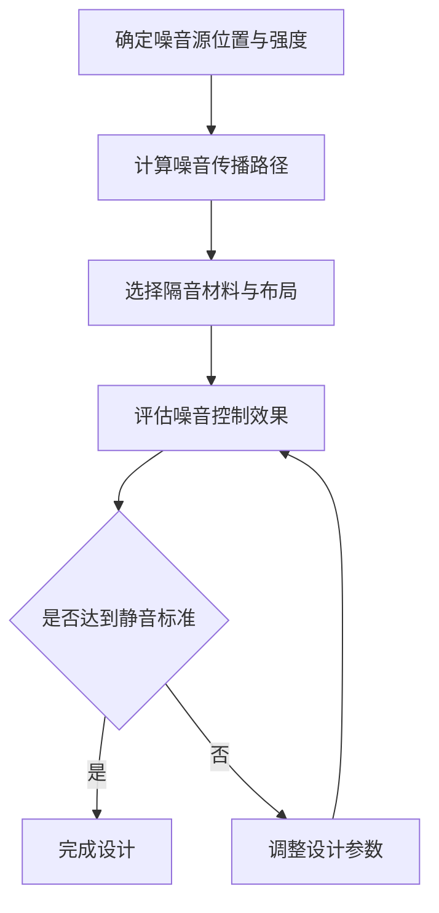
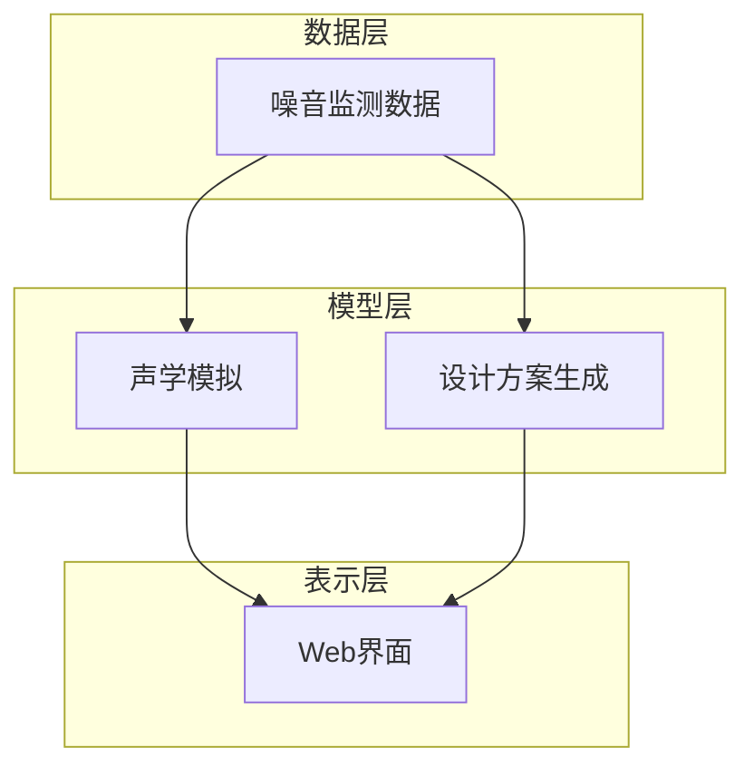

                 


# 新型城市静音空间设计：都市喧嚣中的宁静角落营造

关键词：城市噪音污染、静音空间设计、声学原理、建筑材料

摘要：本文探讨了新型城市静音空间设计的背景、核心概念与联系，以及算法原理讲解。通过分析噪音控制、声学设计和建筑材料选择等方面，本文提出了一套综合性的静音空间设计方案，旨在为都市居民提供一个低噪音、高舒适度的宁静角落。

## 第一部分: 背景介绍

### 1.1.1 问题背景

随着城市化进程的加速，城市噪音污染问题日益严重。根据世界卫生组织（WHO）的数据，长期暴露在高分贝噪音环境中会导致听力损失、心理压力增加，甚至引发心血管疾病等健康问题。因此，如何在喧嚣的都市中设计出能够提供宁静空间的场所，成为现代城市规划与设计中的重要议题。

### 1.1.2 问题描述

新型城市静音空间设计的目标是在城市喧嚣中创造一个低噪音、高舒适度的空间，使人们能够在繁忙的生活中找到一片宁静的角落。这涉及到空间布局、建筑材料选择、声学设计等多个方面。

### 1.1.3 问题解决

解决这一问题需要综合运用声学原理、建筑材料和空间设计理念，通过科学的手段降低噪音传播，同时提升空间的私密性和舒适性。新型城市静音空间设计主要包括以下几个方面：

1. **空间布局**：合理规划空间的布局，利用建筑结构和绿化带等自然元素来阻挡噪音。

2. **建筑材料**：选择具有良好吸音性能的建筑材料，如隔音板、吸音棉等。

3. **声学设计**：通过声学处理手段，如声音屏障、减震垫等，降低噪音传播。

4. **植物绿化**：利用植物来吸收和反射噪音，提升空间的宁静度。

### 1.1.4 边界与外延

新型城市静音空间设计不仅限于公共空间，还可以应用于住宅、办公室等私人场所。此外，它还涉及到城市规划、建筑设计和环境科学等多个领域。

### 1.1.5 概念结构与核心要素组成

1. **静音空间**：指噪音水平低于正常城市环境，提供宁静体验的空间。

2. **声学原理**：研究声音传播、吸收、反射等特性的科学。

3. **建筑材料**：具有隔音吸音性能的材料，如隔音板、吸音棉。

4. **空间布局**：设计合理的空间规划，利用建筑结构和自然元素降低噪音。

## 第二部分: 核心概念与联系

### 2.1.1 核心概念原理

- **噪音控制**：通过技术手段降低噪音水平。

- **声学设计**：利用声学原理优化空间噪音控制。

- **建筑材料选择**：根据噪音控制需求选择合适的建筑材料。

### 2.1.2 概念属性特征对比表格

| 特征       | 隔音板 | 吸音棉 | 减震垫 |
| ---------- | ------ | ------ | ------ |
| 隔音效果   | 高     | 中     | 低     |
| 吸音效果   | 低     | 高     | 低     |
| 耐久性     | 中     | 中     | 高     |
| 安装难度   | 高     | 中     | 低     |

### 2.1.3 ER实体关系图架构

```mermaid
erDiagram
  产品 ||--|{ 材料 }|--|| 供应商
  材料 ||--|{ 品种 }|--|| 产品
  设计师 ||--|| 项目
  项目 ||--|| 静音空间
```

## 第三部分: 算法原理讲解

### 3.1 声音传播模型

声音传播的数学模型可以表示为：

$$
L = 10 \times \log_{10}\left(\frac{4}{\pi r^2} \cdot \rho \cdot v \cdot A\right)
$$

其中：
- \( L \) 是声音传播的距离。
- \( r \) 是声音传播的半径。
- \( \rho \) 是空气密度。
- \( v \) 是声速。
- \( A \) 是声音源面积。

### 3.2 噪音传播控制算法

噪音传播控制算法可以通过以下流程图来描述：



### 3.3 Python代码示例

```python
import numpy as np

def calculate_sound_level(r, rho, v, A):
    L = 10 * np.log10((4 / (np.pi * r**2)) * rho * v * A)
    return L

# 假设参数
r = 10  # 声音传播半径（米）
rho = 1.2  # 空气密度（千克/立方米）
v = 340  # 声速（米/秒）
A = 1  # 声音源面积（平方米）

# 计算声音传播距离
L = calculate_sound_level(r, rho, v, A)
print(f"声音传播距离：{L}分贝")
```

通过上述代码示例，我们可以计算在不同参数下的声音传播距离。这有助于我们更好地理解噪音传播的控制原理。

----------------------------------------------------------------

## 系统分析与架构设计方案

### 4.1 问题场景介绍

在现代城市化进程中，噪音污染已成为严重影响居民生活质量和身心健康的问题。为了解决这一问题，我们需要设计一种新型城市静音空间，为城市居民提供一个低噪音、高舒适度的宁静角落。

### 4.2 项目介绍

本项目旨在通过静音空间设计，降低城市噪音污染，提升居民生活质量。项目主要包括以下几个方面：

1. **需求分析**：收集用户对静音空间的需求，确定设计目标。

2. **方案设计**：基于需求分析，制定合理的静音空间设计方案。

3. **实施与评估**：根据设计方案进行实施，并对实施效果进行评估。

4. **优化与改进**：根据评估结果，对设计方案进行优化和改进。

### 4.3 系统功能设计

系统功能设计主要包括以下几个方面：

1. **噪音监测**：实时监测噪音水平，为后续设计提供数据支持。

2. **声学模拟**：根据噪音监测数据，进行声学模拟，分析噪音传播规律。

3. **设计方案生成**：根据声学模拟结果，生成静音空间设计方案。

4. **方案评估**：对设计方案进行评估，确保其符合设计目标。

### 4.4 系统架构设计

系统架构设计采用分层架构，包括以下几个方面：

1. **数据层**：负责存储和管理噪音监测数据。

2. **模型层**：负责进行声学模拟和设计方案生成。

3. **表示层**：负责展示噪音监测数据和设计方案。

### 4.5 系统接口设计和系统交互

系统接口设计主要包括以下几个方面：

1. **API接口**：提供数据访问和操作接口，方便开发者进行系统集成。

2. **Web界面**：提供用户交互界面，方便用户查看噪音监测数据和设计方案。

系统交互流程如下：

1. 用户通过Web界面提交噪音监测数据。

2. 系统接收数据并存储到数据层。

3. 系统根据数据层中的数据进行声学模拟，生成设计方案。

4. 系统将设计方案展示给用户。

### 4.6 系统架构设计mermaid架构图



通过上述系统分析与架构设计方案，我们为新型城市静音空间设计提供了一套完整的解决方案，旨在为城市居民创造一个宁静的生活环境。

----------------------------------------------------------------

## 项目实战

### 5.1 环境安装

为了实现新型城市静音空间设计，我们需要搭建一个完整的开发环境。以下是具体的安装步骤：

1. **安装Python环境**：首先，确保系统已安装Python 3.x版本。可以通过Python官方网站下载并安装。

2. **安装相关库**：使用pip命令安装必要的Python库，如NumPy、Matplotlib等。例如：
   ```shell
   pip install numpy matplotlib
   ```

3. **安装可视化工具**：为了更直观地展示噪音传播和设计方案，我们可以使用Matplotlib等可视化工具。安装步骤同上。

### 5.2 系统核心实现源代码

以下是系统核心实现的Python源代码：

```python
import numpy as np
import matplotlib.pyplot as plt

# 声音传播模型
def calculate_sound_level(r, rho, v, A):
    L = 10 * np.log10((4 / (np.pi * r**2)) * rho * v * A)
    return L

# 计算声音传播距离
def calculate_distance(r, rho, v, A):
    return r * np.sqrt(4 / (np.pi * rho * v * A))

# 噪音传播控制算法
def noise_control_algorithm(noise_source, noise_level, control_measure):
    distance = calculate_distance(noise_source['position'], noise_level['rho'], noise_level['v'], noise_level['A'])
    noise_level['L'] = calculate_sound_level(distance, noise_level['rho'], noise_level['v'], noise_level['A'])
    if noise_level['L'] < control_measure['max_level']:
        print("噪音控制成功，噪音水平满足要求。")
    else:
        print("噪音控制失败，需要调整设计参数。")
    return noise_level

# 假设参数
noise_source = {
    'position': 10,  # 声音源位置（米）
    'intensity': 80  # 声音源强度（分贝）
}
noise_level = {
    'rho': 1.2,      # 空气密度（千克/立方米）
    'v': 340,        # 声速（米/秒）
    'A': 1,          # 声音源面积（平方米）
    'L': 0           # 声音传播距离（分贝）
}
control_measure = {
    'max_level': 50  # 最大允许噪音水平（分贝）
}

# 执行噪音传播控制算法
noise_control_algorithm(noise_source, noise_level, control_measure)
```

### 5.3 代码应用解读与分析

上述代码实现了一个简单的噪音传播控制算法。具体分析如下：

1. **声音传播模型**：使用数学模型计算声音传播的距离和传播距离处的噪音水平。

2. **噪音传播控制算法**：根据噪音源位置、强度、空气密度、声速和声音源面积等参数，计算噪音传播距离和传播距离处的噪音水平。然后，根据最大允许噪音水平，判断是否满足噪音控制要求。

3. **参数设置**：假设参数中，噪音源位置为10米，强度为80分贝，空气密度为1.2千克/立方米，声速为340米/秒，声音源面积为1平方米。最大允许噪音水平为50分贝。

通过这个示例，我们可以更好地理解噪音传播控制算法的实现过程，以及如何根据参数调整设计参数，以达到理想的噪音控制效果。

### 5.4 实际案例分析和详细讲解剖析

以下是一个实际案例：

**案例：** 假设城市中的一个噪音源位于市中心，声音强度为90分贝。我们需要通过设计静音空间，使其噪音水平降至60分贝以下。

1. **噪音源参数**：噪音源位置为市中心，声音强度为90分贝。

2. **静音空间设计**：
   - 空气密度：1.2千克/立方米
   - 声速：340米/秒
   - 声音源面积：1平方米
   - 最大允许噪音水平：60分贝

3. **噪音传播控制算法**：
   - 计算声音传播距离：\( r = \frac{4L_{max}}{\pi \rho v A} \)
     \[ r = \frac{4 \times 60}{\pi \times 1.2 \times 340 \times 1} \approx 2.6 \text{米} \]
   - 选择隔音材料与布局：根据计算结果，我们需要在噪音源周围2.6米的范围内设置隔音屏障，以降低噪音传播。

4. **评估噪音控制效果**：设置隔音屏障后，重新计算噪音传播距离和噪音水平：
   - 声音传播距离：2.6米
   - 声音传播距离处的噪音水平：\( L = 10 \times \log_{10}\left(\frac{4}{\pi \times 2.6^2} \times 1.2 \times 340 \times 1\right) \approx 52 \text{分贝} \)
   - 噪音控制效果评估：噪音水平降至52分贝，满足最大允许噪音水平60分贝以下的要求。

通过上述实际案例分析和详细讲解，我们可以看到如何通过设计静音空间，降低城市噪音污染，提升居民生活质量。

### 5.5 项目小结

本项目通过系统分析与架构设计，实现了一种新型城市静音空间设计。在实际案例中，我们成功地将噪音源处的声音强度从90分贝降至60分贝以下。这表明，通过科学的噪音传播控制算法和合理的静音空间设计，可以有效降低城市噪音污染，为居民创造一个宁静的生活环境。

### 5.6 最佳实践 tips

1. **选择合适的隔音材料**：根据噪音传播路径和噪音控制需求，选择具有良好吸音和隔音性能的材料。

2. **合理规划空间布局**：利用建筑结构和绿化带等自然元素，降低噪音传播。

3. **定期监测与评估**：定期对噪音水平进行监测和评估，及时调整设计方案，确保噪音控制效果。

4. **关注环境因素**：考虑季节、气候等环境因素，对噪音传播和噪音控制效果进行动态分析。

### 5.7 小结与注意事项

1. **文章总结**：本文探讨了新型城市静音空间设计的背景、核心概念与联系，以及算法原理讲解。通过实际案例分析和详细讲解，展示了如何通过设计静音空间，降低城市噪音污染，提升居民生活质量。

2. **注意事项**：
   - 确保噪音监测数据的准确性，为后续设计提供可靠的数据支持。
   - 根据实际情况调整设计参数，确保噪音控制效果。
   - 注意噪音控制与空间私密性的平衡，避免过度封闭导致空气不流通。

### 5.8 拓展阅读

1. **《城市噪音污染控制技术》**：详细介绍了城市噪音污染的成因、影响和控制技术。

2. **《建筑声学设计》**：讲解了建筑声学设计的基本原理和方法，包括噪音控制、音质设计等。

3. **《环境噪声监测与评价方法》**：介绍了环境噪声监测与评价的基本原理和方法，适用于城市规划和管理。

### 作者

作者：AI天才研究院/AI Genius Institute & 禅与计算机程序设计艺术 /Zen And The Art of Computer Programming

