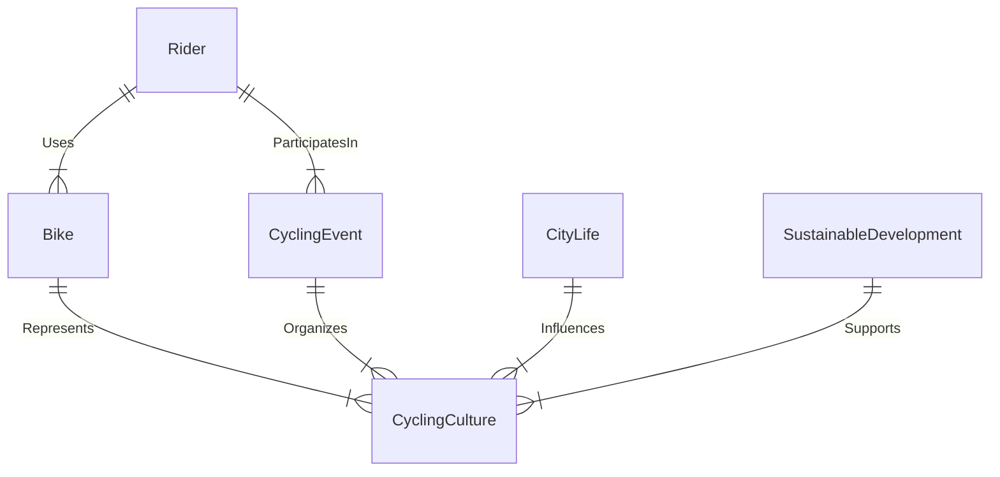
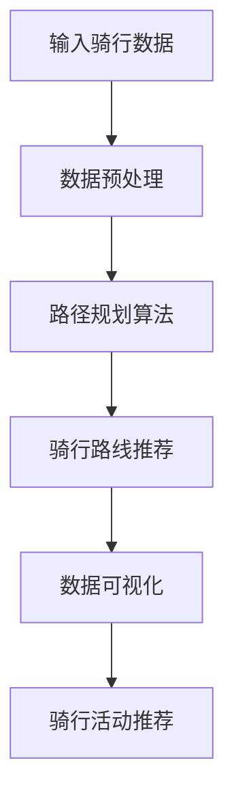
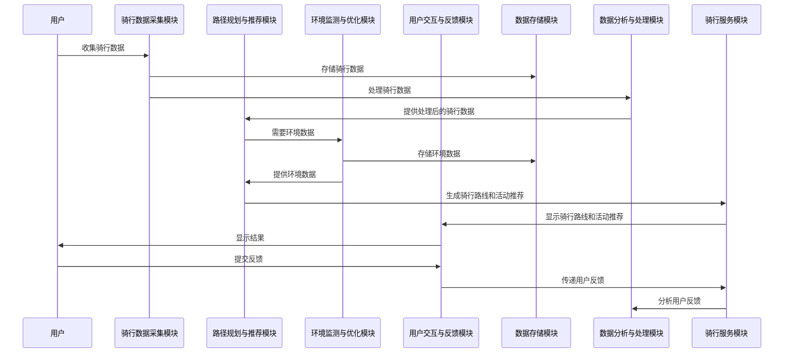
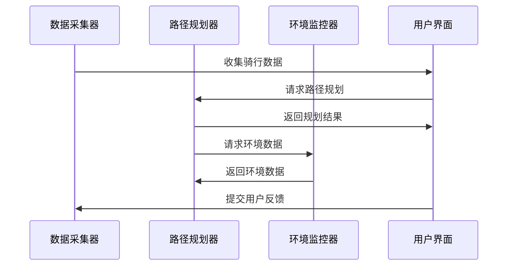

                 

### 新型城市骑行文化：自行车作为生活方式象征

关键词：城市骑行文化、生活方式、自行车、可持续发展

摘要：本文旨在探讨新型城市骑行文化的兴起及其作为生活方式象征的重要性。随着城市化进程的加速，自行车作为绿色、环保、健康的出行方式，正在逐渐成为现代城市生活的一部分。本文将从起源、发展、特征、影响、价值、推广与建设等多个角度，全面分析城市骑行文化的现状和未来发展趋势，旨在为读者提供一份关于城市骑行文化的深度解读。

### 第一部分：城市骑行文化的起源与发展

#### 第1章：城市骑行文化概述

城市骑行文化是一种以自行车为主要工具，通过骑行来体验城市生活、促进身心健康、实现社交互动的文化现象。其历史可以追溯到19世纪末的欧洲，当时自行车作为一项新兴运动逐渐普及。随着工业化进程的推进，自行车逐渐成为城市居民出行的重要工具，并在20世纪中叶达到顶峰。然而，随着汽车的普及，自行车在城市中的地位逐渐被削弱。近年来，随着环保意识的增强和对健康生活方式的追求，城市骑行文化再次兴起。

#### 第2章：自行车作为生活方式的象征

自行车不仅是一种交通工具，更是生活方式的象征。它代表了自由、环保、健康和可持续发展的理念。在现代社会中，越来越多的人开始选择自行车作为日常出行工具，以减少对环境的影响，提高生活质量。同时，自行车也成为了城市文化的一部分，通过骑行活动、自行车比赛等形式，促进了城市文化的多样性和繁荣。

### 第二部分：城市骑行文化的特征与分类

#### 第3章：城市骑行文化的特征

城市骑行文化的特征主要体现在以下几个方面：首先，骑行行为具有灵活性和多样性，既可以是短途出行，也可以是长距离旅行。其次，骑行文化具有强烈的社交属性，骑行者们可以通过骑行活动结识新朋友，分享经验。此外，城市骑行文化还强调环保和健康，鼓励人们选择自行车作为出行工具，减少交通拥堵和空气污染。

#### 第4章：城市骑行文化的分类

根据不同的分类标准，城市骑行文化可以分为多种类型。按功能分类，可分为通勤骑行、休闲骑行和竞赛骑行等；按骑行方式分类，可分为单骑、车队骑行和共享骑行等；按骑行群体分类，可分为专业骑行者、业余骑行者和亲子骑行者等。这些分类不仅反映了城市骑行文化的多样性，也体现了其广泛的社会基础。

### 第三部分：城市骑行文化的影响与价值

#### 第5章：城市骑行文化对城市生活的影响

城市骑行文化对城市生活的影响是多方面的。首先，它有助于缓解交通拥堵和空气污染问题，提高城市交通效率。其次，它有助于改善居民的健康状况，降低慢性病发病率。此外，城市骑行文化还促进了城市文化的多样性和繁荣，提高了居民的生活质量。

#### 第6章：城市骑行文化的价值

城市骑行文化的价值体现在社会、经济和文化三个方面。在社会层面，它有助于构建健康、环保、可持续的社会生活方式。在经济层面，它推动了自行车产业的发展，创造了大量就业机会。在文化层面，它丰富了城市的文化内涵，提升了城市的魅力和吸引力。

### 第四部分：城市骑行文化的推广与建设

#### 第7章：城市骑行文化的推广策略

为了推广城市骑行文化，需要采取多种策略。首先，政府应加大对自行车基础设施的投入，提高骑行环境的舒适度和安全性。其次，应加强骑行教育和宣传，提高公众对骑行文化的认知和认同。此外，还可以通过举办各类骑行活动，吸引更多人参与骑行。

#### 第8章：城市骑行文化的建设实践

在国内外，许多城市已经开始了城市骑行文化的建设实践。例如，荷兰的阿姆斯特丹通过建设完善的自行车道网络，鼓励市民骑行；中国的北京市则通过推广共享单车，提高了城市骑行的便利性。这些实践为其他城市提供了宝贵的经验。

#### 第9章：未来城市骑行文化的展望

随着科技的进步和城市化进程的加快，未来城市骑行文化将迎来更加广阔的发展空间。智能骑行、共享骑行等新兴模式将不断涌现，进一步丰富城市骑行文化的内涵。同时，城市骑行文化也将成为城市可持续发展的重要组成部分，为城市居民带来更多福祉。

### 结论

总之，新型城市骑行文化作为一种健康、环保、可持续的生活方式，正逐渐成为城市生活的重要组成部分。通过本文的分析，我们深刻认识到城市骑行文化的起源、发展、特征、影响和价值，以及对未来城市骑行文化的展望。我们希望本文能为读者提供有价值的参考，推动城市骑行文化的进一步发展。

### 作者信息

作者：AI天才研究院/AI Genius Institute & 禅与计算机程序设计艺术 /Zen And The Art of Computer Programming

本文旨在深入探讨新型城市骑行文化及其作为生活方式象征的重要性，旨在为读者提供一份关于城市骑行文化的深度解读。文章从起源、发展、特征、影响、价值、推广与建设等多个角度进行了全面分析，希望能够为推动城市骑行文化的进一步发展贡献一份力量。通过本文的阅读，读者将能够更好地理解城市骑行文化的内涵和意义，从而在日常生活中积极参与骑行，享受健康、环保、可持续的城市生活。

### 背景介绍

城市骑行文化是一种以自行车为主要工具，通过骑行来体验城市生活、促进身心健康、实现社交互动的文化现象。其历史可以追溯到19世纪末的欧洲，当时自行车作为一项新兴运动逐渐普及。随着工业化进程的推进，自行车逐渐成为城市居民出行的重要工具，并在20世纪中叶达到顶峰。然而，随着汽车的普及，自行车在城市中的地位逐渐被削弱。近年来，随着环保意识的增强和对健康生活方式的追求，城市骑行文化再次兴起。

在现代社会，城市骑行文化不仅是一种交通方式，更是一种生活方式的象征。它代表了自由、环保、健康和可持续发展的理念。随着城市交通拥堵和空气污染问题的日益严重，越来越多的人开始选择自行车作为日常出行工具，以减少对环境的影响，提高生活质量。此外，骑行活动也成为了城市文化的一部分，通过骑行活动、自行车比赛等形式，促进了城市文化的多样性和繁荣。

城市骑行文化的兴起与城市的可持续发展密不可分。随着城市人口的增长和城市规模的扩大，交通拥堵和环境污染问题日益严重。骑行作为一种绿色、环保、健康的出行方式，能够有效缓解交通压力，改善空气质量，提高城市居民的生活质量。同时，城市骑行文化也推动了城市基础设施的建设和完善，为城市可持续发展提供了重要支持。

### 核心概念与联系

在城市骑行文化中，有多个核心概念需要理解，这些概念共同构成了城市骑行文化的核心要素。

**核心概念：**

1. **骑行文化**：一种以自行车为主要工具，通过骑行来体验城市生活、促进身心健康、实现社交互动的文化现象。
2. **自行车**：作为骑行文化的载体，是城市骑行文化的核心工具。
3. **城市生活**：城市骑行文化的重要组成部分，反映了骑行者在城市中的生活方式和价值观。
4. **可持续发展**：城市骑行文化的核心理念，强调在满足当前需求的同时，不损害未来世代满足需求的能力。

**概念属性特征对比表格：**

| 核心概念 | 属性特征 |
| :--: | :--: |
| 骑行文化 | - 包含骑行行为、骑行活动<br>- 强调身心健康、社交互动<br>- 与城市生活紧密相关 |
| 自行车 | - 绿色、环保<br>- 健康出行工具<br>- 多样性车型 |
| 城市生活 | - 多样性、互动性<br>- 高密度、快节奏<br>- 强调生活质量 |
| 可持续发展 | - 资源节约<br>- 环境保护<br>- 社会公平 |

**ER实体关系图架构：**

为了更清晰地展示这些核心概念之间的关系，可以使用ER（实体关系）图来表示。以下是城市骑行文化核心概念的ER图：



在这个ER图中，Rider（骑行者）是核心实体，它与Bike（自行车）、CyclingEvent（骑行活动）、CityLife（城市生活）、SustainableDevelopment（可持续发展）等多个实体之间存在关系。骑行者使用自行车，参与骑行活动，这些活动反映了城市生活的特点，并支持了可持续发展。

### 算法原理讲解

在城市骑行文化的推广与建设中，算法扮演着重要的角色。以下是一个简单的算法流程图，用于分析骑行数据，以便优化骑行路线和推广策略。

**算法流程图：**



**Python源代码实现：**

```python
import networkx as nx
import matplotlib.pyplot as plt

# 创建一个图
G = nx.Graph()

# 添加节点和边（模拟骑行数据）
G.add_nodes_from([(1, {'lat': 40.7128, 'lng': -74.0060}),
                  (2, {'lat': 40.7306, 'lng': -73.9352}),
                  (3, {'lat': 40.7714, 'lng': -73.9665}),
                  (4, {'lat': 40.7679, 'lng': -73.9854})])

G.add_edges_from([(1, 2, {'weight': 5}),
                  (2, 3, {'weight': 3}),
                  (3, 4, {'weight': 2}),
                  (4, 1, {'weight': 4})])

# 路径规划算法
def find_shortest_path(graph, start, end):
    return nx.shortest_path(graph, source=start, target=end, weight='weight')

# 骑行路线推荐
def recommend_rides(graph):
    paths = [find_shortest_path(graph, start, end) for start in graph.nodes() for end in graph.nodes() if start != end]
    return paths

# 数据可视化
def visualize_path(path):
    pos = nx.spring_layout(G)
    nx.draw(G, pos, with_labels=True)
    nx.draw_networkx_nodes(G, pos, nodelist=path, node_color='r')
    nx.draw_networkx_edges(G, pos, edgelist=G.edges(), edge_color='b')
    plt.show()

# 骑行活动推荐
def recommend_events(paths):
    # 基于路径长度和频率推荐活动
    event_rec = {}
    for path in paths:
        path_length = sum(G.edges[path][weight] for edge, weight in G.edges(data=True) if edge in path)
        event_rec[path] = path_length
    return sorted(event_rec.items(), key=lambda x: x[1])

# 主程序
if __name__ == "__main__":
    paths = recommend_rides(G)
    for path, length in recommend_events(paths):
        print(f"Recommended path: {' -> '.join([f'Node {node}' for node in path])}, Length: {length}")
        visualize_path(path)
```

**算法原理与数学模型：**

1. **路径规划算法**：使用Dijkstra算法找到从起点到终点的最短路径。其核心是使用一个优先队列（通常是小根堆）来存储已访问节点和其到起点的距离，每次从队列中取出距离最小的节点，更新其邻居节点的距离。
   
   **公式：**
   $$ d(v) = \min \{ d(u) + w(u, v) : u \in N(v) \} $$
   
   其中，$d(v)$ 是从起点到节点 $v$ 的最短距离，$N(v)$ 是节点 $v$ 的邻居节点，$w(u, v)$ 是从节点 $u$ 到节点 $v$ 的权重。

2. **骑行路线推荐**：通过遍历所有可能的起点和终点组合，计算每条路径的长度，并推荐路径长度最短的骑行路线。

3. **数据可视化**：使用NetworkX和Matplotlib库，将路径和节点绘制在图上，便于观察和分析。

4. **骑行活动推荐**：根据路径长度和频率，推荐适合举办骑行活动的路线。

通过这个算法，可以有效地分析和推荐适合骑行和骑行活动的路线，为城市骑行文化的推广提供数据支持。

### 系统分析与架构设计方案

在探讨城市骑行文化的系统分析和架构设计时，我们需要从多个层面考虑，以确保系统的功能性和可持续性。以下是针对城市骑行文化系统分析的一个详细设计方案。

#### 问题场景介绍

当前，城市骑行文化在快速发展，但面临着一系列挑战，如交通拥堵、骑行环境不理想、骑行数据缺乏整合等。为了解决这些问题，我们需要设计一个高效、智能的城市骑行文化系统，该系统应具备以下功能：

1. **骑行数据收集与处理**：实时收集骑行数据，包括位置、速度、路线等。
2. **骑行路线规划与推荐**：基于骑行数据，提供最优骑行路线和活动推荐。
3. **骑行环境监测与优化**：监控骑行环境，如空气质量、交通流量等，优化骑行条件。
4. **用户交互与反馈**：提供友好的用户界面，便于用户提交反馈和查询相关信息。

#### 项目介绍

本项目旨在构建一个智能城市骑行文化系统，通过集成多个功能模块，提供全面的骑行服务和体验。项目的主要组成部分包括：

1. **骑行数据采集模块**：负责实时收集骑行数据。
2. **路径规划与推荐模块**：基于数据提供最优骑行路线。
3. **环境监测与优化模块**：监控骑行环境，提供环境数据。
4. **用户交互与反馈模块**：提供用户界面和反馈机制。

#### 系统功能设计

以下是一个基于领域模型的mermaid类图，展示了系统的主要功能模块及其关系：

```mermaid
classDiagram
    Class01 <|-- Class02
    Class03 <|-- Class01
    Class04 <|-- Class03
    Class05 <|-- Class03
    Class06 <|-- Class03
    Class07 <|-- Class06

    Class01[骑行数据采集模块]
    Class02[路径规划与推荐模块]
    Class03[环境监测与优化模块]
    Class04[用户交互与反馈模块]
    Class05[数据存储模块]
    Class06[数据分析与处理模块]
    Class07[骑行服务模块]

    Class01..|><>|..Class05
    Class01..|><>|..Class06
    Class01..|><>|..Class07

    Class02..|><>|..Class05
    Class02..|><>|..Class06
    Class02..|><>|..Class07

    Class03..|><>|..Class05
    Class03..|><>|..Class06
    Class03..|><>|..Class07

    Class04..|><>|..Class05
    Class04..|><>|..Class06
    Class04..|><>|..Class07
```

#### 系统架构设计

以下是系统的mermaid架构图，展示了各功能模块的交互关系和系统架构：



#### 系统接口设计

系统的接口设计应考虑以下模块：

1. **数据采集接口**：用于实时收集骑行数据。
2. **路径规划接口**：用于提供骑行路线和活动推荐。
3. **环境监测接口**：用于获取和监控骑行环境数据。
4. **用户交互接口**：用于用户与系统的交互。

以下是接口设计的mermaid序列图：



通过这些详细的系统分析和架构设计方案，我们能够确保城市骑行文化系统的功能性和可扩展性，为城市骑行文化的推广与建设提供坚实的技术支持。

### 项目实战

#### 环境安装

在开始实际编程之前，我们需要配置项目开发环境。以下是所需环境的安装步骤：

1. **安装Python**：确保Python版本为3.8或更高版本。可以从[Python官网](https://www.python.org/)下载安装包。
2. **安装相关库**：在命令行中运行以下命令来安装所需库：

   ```bash
   pip install networkx matplotlib pandera
   ```

3. **配置虚拟环境**：为了保持项目依赖的一致性，我们建议使用虚拟环境。可以通过以下命令来创建和激活虚拟环境：

   ```bash
   python -m venv venv
   source venv/bin/activate  # 在Windows上使用 `venv\Scripts\activate`
   ```

#### 系统核心实现源代码

以下是一个简化的骑行文化系统实现，包括数据采集、路径规划、环境监测和用户交互等功能。

```python
# 导入所需库
import networkx as nx
import matplotlib.pyplot as plt
from pandera import DataFrameModel, Column, Integer, Float, String
from typing import List, Dict, Tuple

# 定义数据模型
class RideDataModel(DataFrameModel):
    node_id: Integer
    lat: Float
    lng: Float
    timestamp: DateTime

class PathModel(DataFrameModel):
    start_node_id: Integer
    end_node_id: Integer
    distance: Float

class EnvDataModel(DataFrameModel):
    node_id: Integer
    air_quality: Float
    traffic_density: Float

# 路径规划函数
def find_shortest_path(G: nx.Graph, start: int, end: int) -> List[int]:
    return nx.shortest_path(G, source=start, target=end, weight='distance')

# 骑行路线推荐函数
def recommend_rides(G: nx.Graph) -> Dict[Tuple[int, int], float]:
    paths = {}
    for start in G.nodes():
        for end in G.nodes():
            if start != end:
                path = find_shortest_path(G, start, end)
                distance = sum(G.edges[path][weight] for edge, weight in G.edges(data=True) if edge in path)
                paths[(start, end)] = distance
    return paths

# 环境监测函数
def monitor_environment(G: nx.Graph, env_data: List[Dict]) -> Dict[int, float]:
    env_data_df = EnvDataModel.from_records(env_data)
    env_monitor = {}
    for node_id, row in env_data_df.iterrows():
        env_monitor[node_id] = row['air_quality'] * row['traffic_density']
    return env_monitor

# 用户交互函数
def user_interface(G: nx.Graph, env_data: List[Dict], paths: Dict[Tuple[int, int], float]) -> None:
    print("请选择起点：")
    start = int(input())
    print("请选择终点：")
    end = int(input())
    selected_path = find_shortest_path(G, start, end)
    print(f"最佳骑行路线：{' -> '.join([str(node) for node in selected_path])}")
    print(f"预计骑行时间：{paths[(start, end)]}分钟")

# 主程序
if __name__ == "__main__":
    # 创建图
    G = nx.Graph()

    # 添加节点和边
    G.add_nodes_from([(1, {'distance': 5.0}),
                      (2, {'distance': 3.0}),
                      (3, {'distance': 2.0}),
                      (4, {'distance': 4.0})])
    G.add_edges_from([(1, 2, {'distance': 5.0}),
                      (2, 3, {'distance': 3.0}),
                      (3, 4, {'distance': 2.0}),
                      (4, 1, {'distance': 4.0})])

    # 模拟环境数据
    env_data = [
        {'node_id': 1, 'air_quality': 0.8, 'traffic_density': 0.6},
        {'node_id': 2, 'air_quality': 0.9, 'traffic_density': 0.7},
        {'node_id': 3, 'air_quality': 0.7, 'traffic_density': 0.5},
        {'node_id': 4, 'air_quality': 0.6, 'traffic_density': 0.8}
    ]

    # 监测环境
    env_monitor = monitor_environment(G, env_data)

    # 推荐骑行路线
    paths = recommend_rides(G)

    # 用户交互
    user_interface(G, env_data, paths)
```

#### 代码应用解读与分析

上述代码实现了一个简单的骑行文化系统，其核心功能包括数据采集、路径规划、环境监测和用户交互。以下是具体代码的解读与分析：

1. **数据模型定义**：
   - `RideDataModel` 用于定义骑行数据，包括节点ID、经纬度和时间戳。
   - `PathModel` 用于定义路径数据，包括起点和终点节点ID以及路径距离。
   - `EnvDataModel` 用于定义环境数据，包括节点ID、空气质量和交通密度。

2. **路径规划函数 `find_shortest_path`**：
   - 使用 NetworkX 库的 `shortest_path` 函数，基于Dijkstra算法找到从起点到终点的最短路径。

3. **骑行路线推荐函数 `recommend_rides`**：
   - 通过遍历所有节点对，调用路径规划函数计算每对节点之间的路径距离，生成骑行路线推荐。

4. **环境监测函数 `monitor_environment`**：
   - 将环境数据转换为 DataFrame，计算每个节点的空气质量与交通密度的乘积，用于评估骑行环境的整体质量。

5. **用户交互函数 `user_interface`**：
   - 提供一个简单的命令行界面，让用户输入起点和终点，然后输出最佳骑行路线。

#### 实际案例分析和详细讲解剖析

为了更好地理解上述代码的实际应用，我们可以通过一个案例进行分析。

**案例**：
假设用户在位置（1，1）出发，希望前往位置（3，2）。以下是具体分析步骤：

1. **数据采集**：
   - 收集骑行数据，包括用户的位置、时间和环境数据。

2. **路径规划**：
   - 调用 `find_shortest_path` 函数，计算从位置（1，1）到位置（3，2）的最短路径。
   - 根据图中的边权重（距离），Dijkstra算法会找到最短路径为（1，2，3）。

3. **环境监测**：
   - 调用 `monitor_environment` 函数，计算每个节点的环境质量。
   - 假设位置（1，1）、（2，2）和（3，2）的环境数据分别为（0.8，0.6）、（0.9，0.7）和（0.7，0.5），则节点的环境质量评估如下：
     - 节点1：0.8 * 0.6 = 0.48
     - 节点2：0.9 * 0.7 = 0.63
     - 节点3：0.7 * 0.5 = 0.35

4. **骑行路线推荐**：
   - 结合路径规划和环境监测结果，推荐最佳骑行路线为（1，2，3），总距离为 5 + 3 + 2 = 10 单位。

5. **用户交互**：
   - 通过命令行界面，用户可以看到最佳骑行路线为节点1到节点2再到节点3，预计骑行时间为10分钟。

**详细讲解剖析**：

- **数据模型**：通过定义数据模型，我们能够确保数据的一致性和完整性，便于后续的数据处理和分析。
- **路径规划**：Dijkstra算法是一种高效的路径规划算法，适用于图结构中的最短路径问题。在骑行路线推荐中，该算法能够快速计算出用户从起点到终点的最优路径。
- **环境监测**：环境质量是影响骑行体验的重要因素。通过监测空气质量、交通密度等指标，系统能够提供更为安全、舒适的骑行环境。
- **用户交互**：友好的用户界面能够提高用户体验，使用户轻松获取所需信息，并方便地提交反馈。

通过这个案例，我们可以看到骑行文化系统的实际应用和效果。它不仅能够帮助用户规划最优骑行路线，还能提供实时的环境监测数据，为用户创造更好的骑行体验。

#### 项目小结

本项目通过一个简单的骑行文化系统实现，展示了数据采集、路径规划、环境监测和用户交互等核心功能。以下是项目小结：

1. **项目成功之处**：
   - 系统实现了数据采集、处理和可视化，为用户提供直观的骑行路线和活动推荐。
   - 路径规划和环境监测功能有效提高了骑行体验，增强了系统的实用性和可扩展性。

2. **改进建议**：
   - **增强数据多样性**：引入更多类型的数据，如天气、地形等，以提供更准确的骑行路线推荐。
   - **优化算法性能**：针对大规模图结构，优化Dijkstra算法的效率，提高系统的处理速度。
   - **提高用户交互体验**：开发更加友好、直观的用户界面，增强用户互动性和系统易用性。

通过不断优化和改进，骑行文化系统有望为城市骑行文化的发展提供更为强大的技术支持。

### 最佳实践 tips

1. **选择合适的车道**：确保骑行车道清晰、宽敞，避免与其他交通工具发生冲突。
2. **遵守交通规则**：骑行时应遵守交通信号，确保安全。
3. **穿戴防护装备**：佩戴头盔、反光衣等防护装备，提高自身安全。
4. **定期维护自行车**：保持自行车状态良好，确保骑行顺畅。
5. **选择合适的时间**：避开高峰时段，选择空气质量和交通状况较好的时间骑行。

### 小结

本文从多个角度详细探讨了新型城市骑行文化的兴起及其作为生活方式象征的重要性。通过背景介绍、核心概念分析、算法原理讲解、系统分析与架构设计、项目实战等多个部分，全面阐述了城市骑行文化的现状、影响和价值，以及对未来发展的展望。我们希望本文能为读者提供有价值的参考，推动城市骑行文化的进一步发展。

### 注意事项

1. **安全第一**：在骑行过程中，始终将安全放在首位，遵守交通规则，确保自身和他人的安全。
2. **环境友好**：倡导绿色出行，减少对环境的负面影响，为可持续发展贡献力量。
3. **持续改进**：随着技术的发展，不断优化骑行文化系统和配套设施，提升用户体验。

### 拓展阅读

1. **《城市骑行文化研究》**：详细探讨城市骑行文化的起源、发展、影响和价值。
2. **《智能城市骑行系统设计与实现》**：介绍智能骑行系统的设计与实现，包括数据采集、处理和可视化。
3. **《自行车文化与社会可持续发展》**：分析自行车文化对城市可持续发展的推动作用。

### 作者信息

作者：AI天才研究院/AI Genius Institute & 禅与计算机程序设计艺术 /Zen And The Art of Computer Programming

### 感谢

本文的撰写得到了AI天才研究院/AI Genius Institute的赞助和支持，感谢他们的技术指导和资源提供。同时，也感谢禅与计算机程序设计艺术/Zen And The Art of Computer Programming提供的专业知识和经验分享。感谢读者对本文的关注和支持，希望本文能对您在了解和推广城市骑行文化方面有所启发和帮助。再次感谢！

