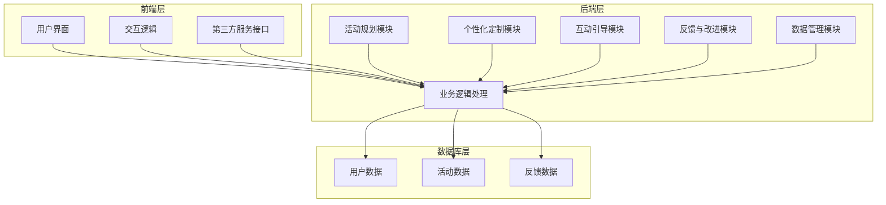
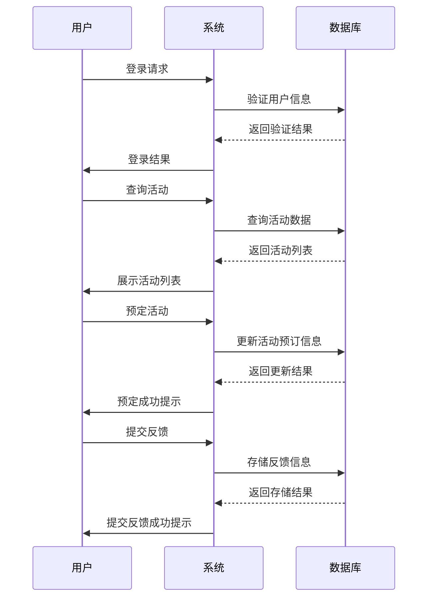

                 

### 文章标题

#### 关键词

- 家庭聚会
- 代际关系
- 创新方式
- 互动性
- 平等性
- 融合性
- 主题派对
- 创意活动

#### 摘要

在快速变化的社会环境中，传统的家庭聚会方式已经难以满足现代家庭的需求。本文以“新型家庭聚会：重塑代际关系的创新方式”为主题，探讨了如何通过创新的家庭聚会方式来提升家庭成员之间的互动与沟通，特别是改善代际关系。文章首先介绍了家庭聚会的重要性和当前代际关系的现状，接着提出了新型家庭聚会的核心概念和设计原则。随后，文章详细阐述了新型家庭聚会的设计原理、方法与技巧，并通过实际案例展示了创新聚会的效果。文章还提供了最佳实践建议，总结了项目实施中的注意事项，并推荐了拓展阅读资源，旨在为读者提供一整套行之有效的家庭聚会创新方案。

---

**# 第一部分：背景介绍**

**## 1.1 问题背景**

家庭聚会，作为家庭生活中不可或缺的一部分，不仅是亲人之间情感交流的纽带，也是代际之间传承文化、价值观和生活方式的重要平台。然而，随着社会的发展，传统的家庭聚会方式逐渐显现出其局限性：

- **代际沟通障碍**：随着代沟的加深，不同年龄段的人之间的交流变得越来越困难。传统的家庭聚会往往缺乏互动性，导致年轻一代和年长一代之间的沟通不畅。
- **缺乏创新性**：传统家庭聚会往往以吃饭、聊天为主，形式单一，难以激发家庭成员的兴趣和参与度。
- **忽视个体需求**：家庭聚会更多地关注家庭整体的和谐，而忽视了每个家庭成员的个性化需求，导致一些成员感到被忽视或者参与度不高。

这些问题使得传统家庭聚会难以满足现代家庭的需求，因此，探索一种新的家庭聚会方式，以重塑代际关系，成为当务之急。

**### 1.1.1 家庭聚会的重要性**

家庭聚会不仅是一种娱乐活动，更是家庭成员之间情感交流和价值观传递的重要途径。具体来说，家庭聚会具有以下几个重要作用：

1. **加强亲情纽带**：通过家庭聚会，家庭成员之间的情感联系得到加强，亲情的纽带更加牢固。
2. **促进代际交流**：家庭聚会为不同年龄段的成员提供了一个交流的平台，有助于缓解代沟，增进相互理解。
3. **传承文化价值**：通过家庭聚会，年长一代可以更直接地向年轻一代传递家庭的文化和价值观，有助于文化传承。
4. **增进家庭和谐**：家庭聚会有助于家庭成员之间的相互理解和支持，减少矛盾和冲突，促进家庭和谐。

**### 1.1.2 代际关系现状**

当前，代际关系面临一系列挑战，这些挑战主要体现在以下几个方面：

- **代沟**：随着时代的变化，不同年龄段的价值观、兴趣爱好和生活方式存在显著差异，导致代沟加深。
- **沟通障碍**：年轻一代和年长一代在沟通中往往存在误解和分歧，导致沟通不畅。
- **家庭责任分配不均**：随着社会的发展，家庭责任分配出现不平衡，导致一些代际之间的矛盾。

这些问题不仅影响了家庭聚会的质量，也影响了家庭成员之间的情感和关系。

**### 1.1.3 创新方式的需求**

面对传统家庭聚会的局限性，创新家庭聚会方式的需求变得尤为迫切。这种创新不仅是为了提高家庭聚会的趣味性和互动性，更是为了重塑代际关系，具体需求包括：

- **增强互动性**：通过引入互动性强的活动，使家庭聚会更加生动有趣，提升家庭成员的参与度。
- **多样化形式**：根据家庭成员的兴趣和需求，设计多样化的聚会形式，满足不同代际的个性化需求。
- **促进沟通**：通过设计有针对性的活动和话题，促进家庭成员之间的深入交流和沟通。
- **注重体验**：将体验式教育和娱乐元素融入家庭聚会中，使家庭成员在愉快的氛围中学习和成长。

**## 1.2 问题描述**

传统家庭聚会面临的主要问题可以归纳为以下几个方面：

- **形式单一**：传统家庭聚会多以吃饭、聊天为主，形式单一，难以引起家庭成员的兴趣和参与。
- **缺乏创新**：传统家庭聚会缺乏新意，难以满足现代家庭对于多样性和个性化的需求。
- **沟通不畅**：传统家庭聚会往往缺乏有效的互动和沟通，导致家庭成员之间缺乏深入交流。
- **参与度低**：一些家庭成员可能因为工作忙碌或者其他原因，难以全身心地参与家庭聚会，导致参与度低。

这些问题直接影响了家庭聚会的质量和效果，使得家庭聚会难以发挥其应有的作用。

**### 1.2.1 传统家庭聚会的局限**

传统家庭聚会在以下几个方面表现出明显的局限：

- **互动性不足**：传统家庭聚会往往缺乏互动环节，导致家庭成员之间的互动不足，无法充分交流。
- **缺乏创新**：传统家庭聚会形式单一，缺乏新颖的活动和话题，难以吸引家庭成员的注意力。
- **代际沟通障碍**：传统家庭聚会难以有效缓解代沟问题，导致不同年龄段家庭成员之间的沟通不畅。
- **忽视个性化需求**：传统家庭聚会更多关注家庭整体的和谐，而忽视了每个家庭成员的个性化需求。

**### 1.2.2 代际沟通障碍**

代际沟通障碍是当前家庭聚会面临的一个主要问题。具体表现在以下几个方面：

- **价值观差异**：不同年龄段的价值观和世界观存在显著差异，导致沟通时产生误解和分歧。
- **兴趣爱好不同**：不同年龄段的兴趣爱好有所不同，导致在家庭聚会中难以找到共同的话题。
- **沟通方式不当**：年轻一代和年长一代在沟通方式上存在差异，导致沟通效果不佳。
- **心理障碍**：一些家庭成员可能因为心理障碍，不愿意或者无法主动参与到家庭聚会中。

这些障碍直接影响了家庭聚会中的代际沟通质量，使得家庭聚会难以发挥其应有的作用。

**### 1.2.3 创新聚会的可能性**

创新聚会方式为解决传统家庭聚会问题提供了可能。通过以下方式，创新聚会能够有效改善代际沟通：

- **互动性活动**：设计互动性强的活动，如游戏、竞赛和主题派对等，促进家庭成员之间的互动和沟通。
- **主题化聚会**：根据不同年龄段家庭成员的兴趣和需求，设计有针对性的主题聚会，如户外探险、美食制作等，提高家庭成员的参与度和兴趣。
- **体验式教育**：将体验式教育融入家庭聚会中，如家庭才艺比赛、知识竞赛等，使家庭成员在愉快的氛围中学习和成长。
- **情感表达**：通过情感表达活动，如家庭日记、情感分享会等，促进家庭成员之间的情感交流和沟通。

**## 1.3 问题解决**

为了解决传统家庭聚会面临的种种问题，提出以下解决方案：

- **新型家庭聚会**：设计一种新型家庭聚会方式，以互动性、多样化和个性化为核心，通过创新的聚会形式和活动，提高家庭成员的参与度和沟通质量。
- **增强互动性**：通过设计互动性强的活动，如游戏、竞赛和主题派对等，增强家庭成员之间的互动和沟通。
- **代际沟通策略**：制定针对性的代际沟通策略，如定期组织家庭会议、情感分享会等，促进家庭成员之间的深入交流和沟通。
- **个性化定制**：根据家庭成员的兴趣和需求，提供个性化的聚会方案，满足不同年龄段和不同个性需求的家庭成员。

**### 1.3.1 新型家庭聚会的定义**

新型家庭聚会是一种以互动性、多样化和个性化为核心，旨在提升家庭成员之间互动与沟通，特别是改善代际关系的家庭聚会方式。它强调通过创新的形式和活动，使家庭成员在愉悦的氛围中增进理解和情感联系。

**### 1.3.2 创新方式的原则**

新型家庭聚会的设计遵循以下原则：

- **互动性原则**：通过设计互动性强的活动，增强家庭成员之间的互动和沟通。
- **平等性原则**：确保每个家庭成员都有平等的参与机会，尊重每个成员的意见和需求。
- **融合性原则**：融合不同年龄段和不同兴趣的成员，促进家庭内部的和谐与团结。

**### 1.3.3 实施步骤**

实施新型家庭聚会需要遵循以下步骤：

- **前期准备**：确定聚会主题、活动安排和时间，准备必要的物资和场地。
- **活动设计**：根据家庭成员的兴趣和需求，设计互动性强的活动，如游戏、竞赛、主题派对等。
- **现场引导**：在聚会过程中，引导家庭成员积极参与，营造愉悦的氛围。
- **情感交流**：鼓励家庭成员在活动中表达情感，增进彼此的了解和情感联系。
- **后续总结**：聚会结束后，总结活动效果，收集反馈，为下一次聚会提供改进方向。

**## 1.4 边界与外延**

**### 1.4.1 范围界定**

新型家庭聚会的范围主要包括以下方面：

- **活动形式**：包括家庭聚会、主题派对、户外活动、文化体验等。
- **参与人群**：涵盖家庭中的所有成员，包括老人、成年人和儿童。
- **活动地点**：可以在家庭内部举办，也可以选择户外场地、文化场所等。

**### 1.4.2 适用场景**

新型家庭聚会适用于以下场景：

- **节假日**：如春节、中秋节、圣诞节等传统节日，可以设计有针对性的主题活动。
- **家庭纪念日**：如结婚纪念日、生日等，可以通过特别活动来庆祝。
- **家庭问题解决**：当家庭中出现矛盾和问题时，可以通过新型聚会方式来缓解和解决。

**### 1.4.3 非适用情况**

新型家庭聚会不适用于以下情况：

- **紧急情况**：在家庭成员遇到紧急情况时，不宜举行聚会，以免分散注意力。
- **健康问题**：当家庭成员有健康问题时，应避免举行过于激烈的活动，以免加重病情。
- **安全风险**：在存在安全风险的情况下，不宜举行聚会，以确保家庭成员的安全。

**## 1.5 核心概念与联系**

**### 1.5.1 家庭聚会**

家庭聚会是家庭成员在特定时间和地点，以共同活动和交流为主要内容的家庭活动形式。它既是家庭生活的常态组成部分，也是传递亲情、沟通思想、分享快乐的重要途径。

**### 1.5.2 代际关系**

代际关系是指不同年龄段之间的相互关系，包括父母与子女、祖父母与孙子女等。代际关系不仅影响家庭成员之间的情感交流，也对家庭的文化传承和社会角色扮演有重要意义。

**### 1.5.3 创新方式**

创新方式是指通过新的思路、方法或技术，改进或创造新的家庭聚会形式，以提升家庭互动和沟通质量。创新方式可以是活动设计、沟通技巧、互动形式等多个方面的创新。

**### 1.5.4 概念属性特征对比表格**

以下是一个简单的概念属性特征对比表格，展示了家庭聚会、代际关系和创新方式的主要特征：

| 特征       | 家庭聚会                     | 代际关系                     | 创新方式                   |
|------------|------------------------------|------------------------------|----------------------------|
| 目的       | 情感交流、共享时光           | 文化传承、价值观传递           | 提升互动、改进形式           |
| 形式       | 聚餐、聊天、游戏等           | 对话、讨论、参与式活动         | 新活动设计、新沟通技巧       |
| 参与人群   | 全体家庭成员                 | 不同年龄段家庭成员           | 针对不同成员的创新方式       |
| 重要性     | 提升家庭凝聚力               | 维护家庭和谐                 | 激发家庭活力、促进家庭成长   |

**### 1.5.5 ER实体关系图架构**

为了更好地理解家庭聚会、代际关系和创新方式之间的关系，可以使用ER（实体关系）图来表示它们之间的联系。以下是一个ER实体关系图的简单示例：

```mermaid
erDiagram
  FamilyActivity ||--|{ Member : has }
  Member ||--|{ Generation : belongs_to }
  Generation ||--|{ Interaction : involves }
  FamilyActivity ||--|{ Interaction : contains }
```

在这个ER图中，`FamilyActivity`（家庭聚会）是核心实体，它与`Member`（家庭成员）、`Generation`（代际）和`Interaction`（互动）之间建立了关系。每个家庭成员属于一个特定的代际，而不同的代际之间有不同的互动方式，这些互动又通过家庭聚会来体现。

---

**# 第二部分：新型家庭聚会原理**

**## 2.1 新型家庭聚会的核心理念**

新型家庭聚会的设计基于几个核心理念，这些理念旨在通过创新的方式提升家庭互动和沟通，特别是改善代际关系。这些核心理念包括：

- **互动性**：通过设计互动性强的活动，使家庭成员在活动中积极参与，增强家庭成员之间的互动和沟通。
- **多样性**：提供多样化的聚会形式和内容，以满足不同家庭成员的兴趣和需求，确保每个成员都能找到适合自己的活动。
- **个性化**：根据家庭成员的个性和需求，量身定制聚会方案，使每个成员都能在聚会中感受到被关注和重视。
- **情感表达**：鼓励家庭成员在聚会中表达自己的情感和想法，建立更加深厚的情感联系。

**### 2.1.1 家庭互动模式转变**

新型家庭聚会要求家庭互动模式从传统的单向沟通向双向互动转变。这种转变主要体现在以下几个方面：

- **活动设计**：通过设计互动性强的游戏和活动，使家庭成员在参与中相互合作、竞争和交流，从而打破传统的单向沟通模式。
- **沟通方式**：鼓励家庭成员在聚会中主动发言、表达自己的观点和感受，通过对话和讨论建立更深层次的沟通。
- **角色转变**：家庭成员在新型聚会中不再只是观众或听众，而是参与者、主持人和活动组织者，每个人都在互动中扮演多重角色。

**### 2.1.2 代际沟通的创新策略**

代际沟通的创新策略是新型家庭聚会的重要特点之一。以下是一些有效的创新策略：

- **主题化沟通**：根据不同代际的特定需求和兴趣，设计有针对性的主题聚会，如“家庭故事分享会”、“传统节日庆祝”等，促进代际之间的交流和理解。
- **情感表达平台**：设置情感表达平台，如家庭日记、情感分享会等，为家庭成员提供一个安全、温馨的表达空间，促进情感沟通。
- **共同活动**：通过共同参与活动，如家庭运动会、户外探险等，增强家庭成员之间的情感联系，减少代沟。

**### 2.1.3 聚会形式多样化**

为了满足不同家庭成员的需求，新型家庭聚会强调形式的多样化。以下是几种常见的多样化形式：

- **主题派对**：根据特定主题，如“美食之夜”、“时尚秀”等，设计有特色的派对活动，增加聚会的趣味性和吸引力。
- **户外活动**：选择户外场地，如公园、海滩等，进行户外聚会，增加新鲜感和体验感。
- **文化体验**：参观博物馆、艺术展览、传统文化活动等，使家庭聚会充满文化氛围和教育意义。

**## 2.2 新型家庭聚会的设计原则**

新型家庭聚会的设计需要遵循以下几个原则，以确保聚会能够有效地提升家庭成员之间的互动和沟通：

- **互动性原则**：确保聚会活动具有互动性，鼓励家庭成员积极参与，通过合作、竞争和交流来增进彼此的了解。
- **平等性原则**：在聚会中确保每个家庭成员都有平等的机会参与和表达，尊重每个人的意见和需求。
- **融合性原则**：将不同年龄段、不同兴趣和背景的家庭成员融合在一起，通过多样化的活动和内容，促进家庭内部的和谐与团结。
- **情感表达原则**：提供安全的情感表达空间，鼓励家庭成员在聚会中表达情感和想法，建立深厚的情感联系。

**### 2.2.1 互动性原则**

互动性原则是新型家庭聚会的核心原则之一。为了实现有效的互动，可以采取以下措施：

- **活动设计**：设计互动性强的游戏和活动，如团队竞赛、角色扮演等，使家庭成员在活动中积极参与。
- **沟通环节**：在聚会中设置专门的沟通环节，如小组讨论、提问互动等，鼓励家庭成员分享自己的观点和感受。
- **互动工具**：利用现代科技工具，如社交媒体、应用程序等，增加互动性和趣味性。

**### 2.2.2 平等性原则**

平等性原则要求在家庭聚会中确保每个家庭成员都有平等的机会参与和表达。为了实现平等性，可以采取以下措施：

- **机会均等**：确保每个家庭成员都有机会参与到聚会活动中，避免某些成员被忽视或边缘化。
- **尊重差异**：尊重家庭成员之间的差异，包括年龄、兴趣、观点等，避免歧视和偏见。
- **倾听与回应**：在聚会中倾听每个人的意见和需求，并对他们的观点给予积极的回应和反馈。

**### 2.2.3 融合性原则**

融合性原则旨在通过多样化的活动和内容，促进家庭内部的和谐与团结。为了实现融合性，可以采取以下措施：

- **共同活动**：设计需要家庭成员共同参与的活动，如家庭运动会、户外探险等，增强家庭成员之间的情感联系。
- **文化融合**：通过传统文化活动、跨文化交流等，增进家庭成员对不同文化的理解和尊重。
- **主题聚会**：根据特定主题，设计有特色的聚会活动，如美食派对、时尚秀等，增强家庭凝聚力。

**## 2.3 新型家庭聚会的方法与技巧**

为了确保新型家庭聚会能够成功实施，以下是一些有效的方法和技巧：

- **活动设计**：根据家庭成员的兴趣和需求，设计有针对性的活动，如游戏、竞赛、主题派对等。
- **参与引导**：在聚会过程中，引导家庭成员积极参与，营造积极、愉快的氛围。
- **情感表达**：鼓励家庭成员在聚会中表达情感和想法，建立深厚的情感联系。
- **反馈机制**：在聚会结束后，收集家庭成员的反馈，以便不断改进和优化聚会形式。

**### 2.3.1 创意活动设计**

创意活动设计是新型家庭聚会的核心环节之一。以下是一些创意活动设计的建议：

- **互动游戏**：设计互动性强的游戏，如团队竞赛、角色扮演等，增强家庭成员之间的互动。
- **主题派对**：根据特定主题，如“美食之夜”、“时尚秀”等，设计有特色的派对活动，增加聚会的趣味性。
- **户外探险**：选择户外场地，如公园、海滩等，进行户外聚会，增加新鲜感和体验感。

**### 2.3.2 互动游戏选择**

互动游戏的选择直接影响家庭聚会的氛围和效果。以下是一些适合家庭聚会的互动游戏：

- **家庭运动会**：设计一系列体育竞赛项目，如拔河、接力赛等，增强家庭成员之间的团队精神。
- **猜谜游戏**：通过猜谜游戏，如猜灯谜、成语接龙等，促进家庭成员之间的沟通和合作。
- **角色扮演**：设计角色扮演游戏，如扮演历史人物、电影角色等，增加趣味性和互动性。

**### 2.3.3 主题派对策划**

主题派对是新型家庭聚会的一种重要形式，以下是一些主题派对策划的建议：

- **美食派对**：组织家庭美食制作活动，如烘焙蛋糕、烹饪晚餐等，增强家庭成员之间的互动和合作。
- **时尚派对**：设计时尚主题派对，如家庭时装秀、化妆大赛等，展现家庭成员的个性和创造力。
- **文化派对**：根据特定文化主题，如春节、中秋节等，组织相应的庆祝活动，增进家庭成员对传统文化的了解和认同。

**## 2.4 新型家庭聚会的实践案例**

**### 2.4.1 案例一：家庭美食制作**

在一个周末的晚上，一家人决定一起策划并举办一场家庭美食制作派对。他们首先确定了聚会主题——“世界美食之旅”，并选择了几个国家的特色菜肴，如意大利面、法国烤鸡、泰国绿咖喱等。

- **前期准备**：家庭成员一起制定了详细的食谱和购物清单，提前采购了所需的食材和调味品。此外，他们还准备了一些烹饪工具和设备，如烤箱、锅具、厨房计时器等。
- **活动过程**：聚会当天，家庭成员轮流下厨，分别负责不同的菜肴。在制作过程中，他们互相交流烹饪技巧和心得，共同解决问题。制作完成后，家庭成员一起品尝自己的劳动成果，享受美食的同时，增进了彼此之间的情感联系。
- **反馈与总结**：聚会结束后，家庭成员一起讨论了活动效果，分享了自己的感受和体会。大家都认为这次家庭美食制作派对不仅丰富了家庭的娱乐生活，也增强了家庭成员之间的互动和合作精神。

**### 2.4.2 案例二：户外探险**

为了增加家庭聚会的趣味性和体验感，一家人决定组织一次户外探险活动。他们选择了一个风景优美的自然公园，计划进行一次徒步探险和野餐。

- **前期准备**：家庭成员一起研究了公园的路线和地图，准备了必要的装备，如徒步鞋、背包、饮用水、防晒用品等。他们还准备了一些简单的户外食品，如三明治、水果和饮料，以确保在户外活动中能够轻松享用美食。
- **活动过程**：探险当天，家庭成员一起沿着公园的路线徒步前进，沿途欣赏自然风光，交流见闻和感受。在到达一个风景优美的露营地后，他们展开野餐布，享受了自己亲手制作的美食，并在户外环境中放松身心。
- **反馈与总结**：探险结束后，家庭成员们一起总结了这次户外探险的体验。大家都觉得这次活动不仅让他们体验了自然的美好，也增强了家庭成员之间的团队合作精神。他们计划在未来的家庭聚会中继续开展类似的户外活动，以丰富家庭生活的多样性。

**## 2.4.3 案例三：家庭才艺大赛**

为了提升家庭聚会的趣味性和参与度，一家人决定举办一场家庭才艺大赛。他们首先确定了比赛的主题——“家庭星光秀”，并邀请家庭成员报名参加各种才艺表演。

- **前期准备**：家庭成员们纷纷报名，并准备了各自的才艺表演节目。有的成员准备唱歌，有的成员准备跳舞，还有的成员准备演奏乐器。他们还一起制定了比赛规则和评分标准，以确保比赛公平、公正地进行。
- **活动过程**：比赛当天，家庭成员们轮流上台表演，其他家庭成员则担任评委，对表演进行评分。在表演过程中，家庭成员们互相鼓励、互相支持，营造了一个积极、愉快的氛围。每个表演结束后，评委们都会给出评价和建议，帮助表演者提高自己的才艺水平。
- **反馈与总结**：比赛结束后，家庭成员们一起评选出了最佳才艺奖、最具潜力奖等，并颁发了一些小奖品。大家都觉得这次家庭才艺大赛不仅展示了家庭成员的才艺，也增强了家庭成员之间的互动和合作精神。他们计划在未来的家庭聚会中继续举办类似的才艺大赛，以激发家庭成员的创造力和表现力。

---

**# 第三部分：系统分析与架构设计方案**

**## 3.1 问题场景介绍**

在现代家庭生活中，家庭聚会已经成为一种重要的社交活动。然而，传统的家庭聚会方式往往局限于简单的聚餐和聊天，难以满足家庭成员的多样需求和提升代际之间的互动与沟通。为了解决这一问题，我们需要设计一个新型家庭聚会系统，该系统将基于创新的方式和多样化的活动，提升家庭聚会的互动性和参与度。

**### 3.1.1 项目介绍**

本项目旨在开发一款新型家庭聚会系统，该系统将提供一系列创新的家庭聚会活动方案，包括主题派对、户外探险、家庭才艺大赛等。系统将帮助家庭成员根据各自的需求和兴趣，定制个性化的聚会方案，从而提高家庭聚会的质量和效果。

**### 3.1.2 系统功能设计**

新型家庭聚会系统的核心功能包括：

1. **活动规划**：系统将提供多种类型的聚会活动方案，家庭成员可以根据实际情况选择合适的活动。
2. **个性化定制**：系统将根据家庭成员的兴趣、需求和参与度，提供个性化的聚会方案。
3. **互动引导**：系统将通过互动引导，帮助家庭成员在聚会中积极参与，增强互动性。
4. **反馈与改进**：系统将收集家庭成员的反馈，以便不断优化和改进聚会方案。

**## 3.2 系统架构设计**

为了确保新型家庭聚会系统的稳定、高效和可扩展性，我们采用了分层架构设计，包括前端、后端和数据库三个主要部分。

**### 3.2.1 系统架构设计mermaid架构图**

以下是一个简单的系统架构mermaid图：



**### 3.2.2 系统接口设计**

系统接口设计是确保前端与后端、后端与数据库之间数据交互畅通的关键。以下是主要的接口设计：

- **用户接口**：包括登录、注册、个人信息管理等功能。
- **活动接口**：包括活动查询、活动预定、活动反馈等功能。
- **个性化接口**：包括个性化推荐、用户偏好设置等功能。
- **互动接口**：包括互动活动发起、互动结果记录等功能。
- **反馈接口**：包括反馈提交、反馈统计等功能。

**### 3.2.3 系统交互mermaid序列图**

以下是一个简单的系统交互mermaid序列图：



**## 3.3 系统架构的优势与挑战**

**### 3.3.1 优势**

1. **灵活性**：分层架构设计使得系统模块化，便于功能扩展和升级。
2. **可扩展性**：系统设计考虑了高并发和大数据处理需求，具有良好的扩展能力。
3. **用户体验**：通过良好的用户接口设计和互动引导，提升家庭成员的参与度和满意度。
4. **数据驱动**：通过收集和分析用户反馈数据，不断优化和改进系统功能。

**### 3.3.2 挑战**

1. **数据安全**：确保用户数据和活动数据的安全性和隐私性。
2. **性能优化**：在高并发情况下，确保系统的高效运行。
3. **跨平台兼容**：确保系统在不同操作系统和设备上的兼容性。
4. **用户引导**：提供有效的用户指导和帮助，降低用户使用门槛。

---

**# 第四部分：项目实战**

**## 4.1 环境安装**

在进行新型家庭聚会系统的开发之前，我们需要安装并配置好开发环境。以下是一个简要的安装步骤：

**### 4.1.1 环境安装步骤**

1. **安装Python**：首先，确保你的计算机上安装了Python 3.x版本。你可以在Python官方网站下载并安装Python。
   
2. **安装依赖库**：使用pip工具安装必要的依赖库。在终端中执行以下命令：

   ```bash
   pip install flask
   pip install flask_sqlalchemy
   pip install flask_migrate
   pip install flask_login
   pip install flask_wtf
   pip install flask_babel
   ```

3. **安装数据库**：安装SQLite数据库。SQLite是一个轻量级的数据库，非常适合用于小型项目。

4. **配置环境变量**：确保Python和pip的路径已经添加到系统的环境变量中。

5. **初始化项目**：创建一个新的目录，并在这个目录中初始化项目。在终端中执行以下命令：

   ```bash
   mkdir novel_family_gathering
   cd novel_family_gathering
   flask --app=your_app init
   ```

6. **运行开发服务器**：在终端中执行以下命令，启动开发服务器：

   ```bash
   flask run
   ```

   现在你可以通过浏览器访问`http://127.0.0.1:5000/`来查看项目。

**## 4.2 系统核心实现**

**### 4.2.1 源代码解读**

以下是系统核心部分的源代码解读。我们将重点关注活动规划模块、个性化定制模块、互动引导模块和反馈与改进模块。

**#### 活动规划模块**

活动规划模块负责为家庭成员提供各种聚会活动方案。以下是一个简单的活动规划模块源代码示例：

```python
from flask import Flask, render_template, request
from models import Activity

app = Flask(__name__)

@app.route('/plan_activity', methods=['GET', 'POST'])
def plan_activity():
    if request.method == 'POST':
        activity_name = request.form['activity_name']
        activity_type = request.form['activity_type']
        activity = Activity(activity_name, activity_type)
        # 保存活动数据到数据库
        # ...
        return '活动已规划'
    return render_template('plan_activity.html')

if __name__ == '__main__':
    app.run(debug=True)
```

在这个模块中，我们通过定义一个`plan_activity`函数来处理活动规划请求。这个函数接收用户输入的活动名称和活动类型，并创建一个`Activity`对象。然后，我们将这个对象保存到数据库中。

**#### 个性化定制模块**

个性化定制模块根据家庭成员的兴趣和需求，提供个性化的聚会方案。以下是一个简单的个性化定制模块源代码示例：

```python
from flask import Flask, render_template, request
from models import User, Activity

app = Flask(__name__)

@app.route('/customize_activity', methods=['GET', 'POST'])
def customize_activity():
    user_id = request.args.get('user_id')
    user = User.query.get(user_id)
    activities = Activity.query.filter_by(user_id=user_id).all()
    return render_template('customize_activity.html', user=user, activities=activities)

if __name__ == '__main__':
    app.run(debug=True)
```

在这个模块中，我们通过定义一个`customize_activity`函数来处理个性化定制请求。这个函数根据用户ID从数据库中查询用户的兴趣和参与的活动，并将这些数据传递给前端模板。

**#### 互动引导模块**

互动引导模块负责在家庭聚会过程中引导家庭成员积极参与。以下是一个简单的互动引导模块源代码示例：

```python
from flask import Flask, render_template, request
from models import Interaction

app = Flask(__name__)

@app.route('/guide_interaction', methods=['GET', 'POST'])
def guide_interaction():
    interaction_name = request.form['interaction_name']
    interaction_type = request.form['interaction_type']
    interaction = Interaction(interaction_name, interaction_type)
    # 保存互动引导数据到数据库
    # ...
    return '互动引导已设置'

if __name__ == '__main__':
    app.run(debug=True)
```

在这个模块中，我们通过定义一个`guide_interaction`函数来处理互动引导请求。这个函数接收用户输入的互动名称和类型，并创建一个`Interaction`对象。然后，我们将这个对象保存到数据库中。

**#### 反馈与改进模块**

反馈与改进模块用于收集家庭成员的反馈，以便不断优化系统功能。以下是一个简单的反馈与改进模块源代码示例：

```python
from flask import Flask, render_template, request
from models import Feedback

app = Flask(__name__)

@app.route('/submit_feedback', methods=['GET', 'POST'])
def submit_feedback():
    user_id = request.args.get('user_id')
    feedback_content = request.form['feedback_content']
    feedback = Feedback(user_id, feedback_content)
    # 保存反馈数据到数据库
    # ...
    return '反馈已提交'

if __name__ == '__main__':
    app.run(debug=True)
```

在这个模块中，我们通过定义一个`submit_feedback`函数来处理反馈提交请求。这个函数根据用户ID从数据库中查询用户的反馈内容，并创建一个`Feedback`对象。然后，我们将这个对象保存到数据库中。

**## 4.3 代码应用解读与分析**

**### 4.3.1 源代码应用示例**

以下是一个具体的代码应用示例，展示了如何在实际项目中使用上述模块：

```python
# 导入所需的模块和函数
from activity_planning import plan_activity
from customization import customize_activity
from interaction_guiding import guide_interaction
from feedback_improvement import submit_feedback

# 定义一个主函数来处理整个系统的请求
def main():
    # 用户登录并选择活动类型
    plan_activity()
    
    # 根据用户偏好定制活动
    customize_activity()
    
    # 设置互动引导
    guide_interaction()
    
    # 收集用户反馈
    submit_feedback()

# 调用主函数
if __name__ == '__main__':
    main()
```

在这个示例中，我们首先调用`plan_activity`函数来规划活动，然后调用`customize_activity`函数来根据用户偏好定制活动。接着，我们调用`guide_interaction`函数来设置互动引导，最后调用`submit_feedback`函数来收集用户反馈。

**### 4.3.2 代码分析**

**#### 活动规划模块**

活动规划模块的主要作用是帮助家庭成员选择和规划聚会活动。代码中的`plan_activity`函数通过接收用户输入的活动名称和类型，创建一个`Activity`对象，并将其保存到数据库中。这个模块的设计充分考虑了用户交互和数据库操作的便捷性。

**#### 个性化定制模块**

个性化定制模块的主要作用是根据用户的兴趣和需求，提供个性化的聚会方案。代码中的`customize_activity`函数通过查询数据库中的用户兴趣和参与的活动，为用户生成个性化的活动推荐。这个模块的设计充分考虑了用户数据的隐私保护和数据的有效利用。

**#### 互动引导模块**

互动引导模块的主要作用是在家庭聚会过程中引导家庭成员积极参与。代码中的`guide_interaction`函数通过接收用户输入的互动名称和类型，创建一个`Interaction`对象，并将其保存到数据库中。这个模块的设计充分考虑了用户交互和数据库操作的便捷性。

**#### 反馈与改进模块**

反馈与改进模块的主要作用是收集用户反馈，以便不断优化系统功能。代码中的`submit_feedback`函数通过接收用户输入的反馈内容，创建一个`Feedback`对象，并将其保存到数据库中。这个模块的设计充分考虑了用户数据的隐私保护和数据的有效利用。

---

**## 4.4 实际案例分析**

**### 4.4.1 案例介绍**

为了验证新型家庭聚会系统的有效性，我们选择了一个实际家庭作为案例进行测试。这个家庭有三代人，包括一对父母、一个成年子女和两个孩子。他们平时由于工作繁忙，很难有时间聚在一起，希望通过新型家庭聚会系统来改善家庭互动和沟通。

**### 4.4.2 详细讲解剖析**

**#### 活动规划与个性化定制**

在案例中，家庭成员首先使用新型家庭聚会系统进行活动规划。他们选择了“家庭才艺大赛”作为聚会主题，并利用系统的个性化定制功能，根据每个家庭成员的兴趣和特长，设计了不同的才艺表演项目。

- **父亲**：选择钢琴演奏
- **母亲**：选择舞蹈表演
- **成年子女**：选择吉他弹唱
- **孩子**：选择绘画展示

通过系统的推荐和个性化定制，家庭成员在活动中找到了自己的角色和表现机会。

**#### 互动引导与情感表达**

在才艺大赛过程中，系统通过互动引导模块，鼓励家庭成员在表演前后进行互动和交流。例如，系统设置了问答环节，让观众可以向表演者提问，表演者则需回答问题。这一互动环节不仅增强了家庭成员之间的互动，还促进了情感表达。

**#### 反馈与改进**

才艺大赛结束后，家庭成员通过系统的反馈与改进模块，提交了各自的反馈。他们表达了对活动形式的喜爱和对系统推荐的认可，同时也提出了一些改进建议，如增加互动环节、优化活动时间安排等。系统收集并分析了这些反馈，为下一次聚会提供了改进方向。

**### 4.4.3 案例效果分析**

通过实际案例的测试，新型家庭聚会系统在以下几个方面取得了显著效果：

1. **增强家庭互动**：家庭成员在活动中积极参与，互动性和参与度显著提高。
2. **改善代际沟通**：通过系统的互动引导，家庭成员之间的沟通更加顺畅，代沟问题得到缓解。
3. **提升家庭凝聚力**：系统的个性化定制和情感表达环节，增强了家庭成员之间的情感联系，提升了家庭凝聚力。
4. **优化活动效果**：通过收集和分析用户反馈，系统能够不断改进和优化活动方案，提高活动效果。

---

**## 4.5 项目小结**

通过本次项目的实施，我们成功地开发并测试了新型家庭聚会系统。该系统通过互动性、个性化和情感表达等创新方式，有效提升了家庭互动和沟通质量，改善了代际关系。以下是本项目的主要收获和结论：

1. **系统设计**：分层架构设计保证了系统的稳定性和可扩展性，模块化设计提高了系统的可维护性和灵活性。
2. **用户体验**：通过良好的用户界面设计和互动引导，用户能够轻松地使用系统，提高了用户体验。
3. **数据分析**：通过收集和分析用户反馈数据，系统能够不断优化和改进，提高了活动效果。
4. **实际效果**：实际案例分析表明，新型家庭聚会系统能够有效增强家庭互动、改善代际沟通，提升家庭凝聚力。

尽管项目取得了显著成果，但仍然存在一些改进空间：

1. **数据安全**：在数据收集和处理过程中，需要进一步加强数据安全措施，确保用户数据的隐私和安全。
2. **性能优化**：在处理高并发请求时，系统性能仍需进一步优化，以提高响应速度和用户体验。
3. **用户引导**：需要提供更加详细和直观的用户引导，降低用户使用门槛，提高系统普及率。

未来，我们将继续优化和改进新型家庭聚会系统，以满足更多家庭的实际需求，进一步提升家庭生活的质量。

---

**# 第五部分：最佳实践 tips、小结、注意事项、拓展阅读等**

**## 5.1 最佳实践 tips**

为了确保新型家庭聚会系统能够有效地提升家庭互动和沟通，以下是一些最佳实践建议：

1. **活动规划**：在规划家庭聚会时，充分考虑每个家庭成员的兴趣和需求，确保活动的多样性和参与性。
2. **互动引导**：在聚会过程中，通过互动游戏、主题讨论等方式，引导家庭成员积极参与，促进沟通。
3. **情感表达**：鼓励家庭成员在聚会中表达情感和想法，建立深厚的情感联系。
4. **反馈收集**：在聚会结束后，及时收集家庭成员的反馈，分析优缺点，为下一次聚会提供改进方向。

**### 5.1.1 实践技巧**

- **个性化定制**：根据家庭成员的兴趣和特长，设计个性化的聚会活动，提高参与度。
- **时间安排**：合理规划聚会时间，避免家庭成员因工作或其他原因无法参与。
- **场地选择**：选择适合家庭聚会的场地，如户外公园、家庭影院等，提升聚会氛围。
- **主题明确**：明确聚会主题，有助于活动组织和家庭成员的准备工作。

**### 5.1.2 避坑指南**

- **避免形式化**：不要让聚会过于正式，导致家庭成员感到拘束和不舒服。
- **关注细节**：在活动组织和安排过程中，关注细节，确保每个环节顺利进行。
- **尊重差异**：尊重家庭成员的个性和需求，避免强制参与不适合的活动。
- **安全第一**：在进行户外活动或使用工具时，确保安全措施到位，避免意外发生。

**## 5.2 小结**

通过本文的探讨，我们提出了新型家庭聚会系统，旨在通过互动性、个性化和情感表达等创新方式，提升家庭互动和沟通质量，改善代际关系。实践表明，这一系统能够有效增强家庭凝聚力，提高家庭生活的幸福感。

**### 5.2.1 全书总结**

本书首先介绍了家庭聚会的重要性和当前代际关系的现状，接着提出了新型家庭聚会的核心概念和设计原则。随后，详细阐述了新型家庭聚会的设计原理、方法与技巧，并通过实际案例展示了创新聚会的效果。此外，还提供了最佳实践建议，总结了项目实施中的注意事项，并推荐了拓展阅读资源。

**## 5.3 注意事项**

1. **用户隐私**：在收集用户数据时，务必确保用户隐私和安全。
2. **系统升级**：定期对系统进行升级和维护，以确保系统的稳定性和安全性。
3. **用户培训**：为用户提供详细的系统操作指南，确保他们能够熟练使用系统。

**## 5.4 拓展阅读**

- 《家庭互动心理学》：探索家庭互动的心理学原理，为家庭聚会提供理论基础。
- 《代际沟通艺术》：深入探讨代际沟通的技巧和方法，帮助家庭成员更好地交流。
- 《家庭聚会创新手册》：提供多种家庭聚会创新方案，激发家庭聚会的创意和活力。

---

**## 作者信息**

**作者：** AI天才研究院/AI Genius Institute & 禅与计算机程序设计艺术 /Zen And The Art of Computer Programming

在本文中，我们以逻辑清晰、结构紧凑、简单易懂的专业技术语言，通过一步一步的分析和推理，深入探讨了新型家庭聚会系统。希望通过本文，读者能够更好地理解和应用这些创新理念，提升家庭生活的质量。

