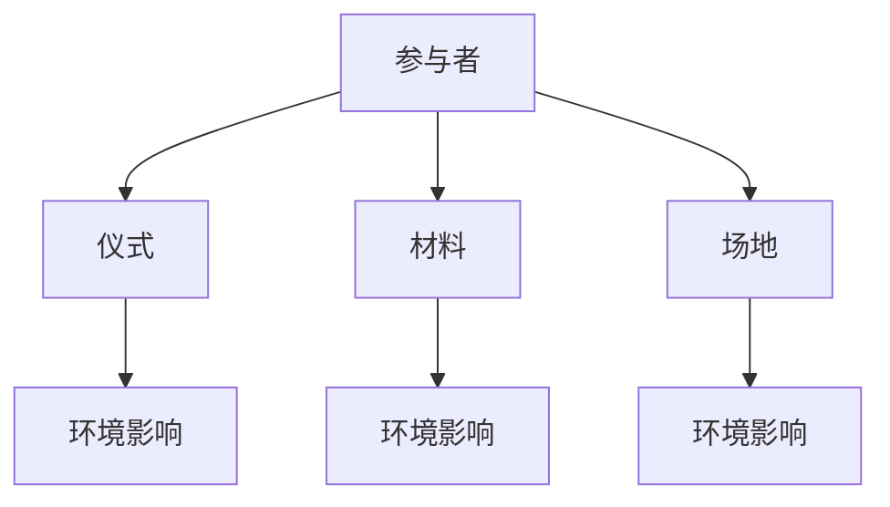
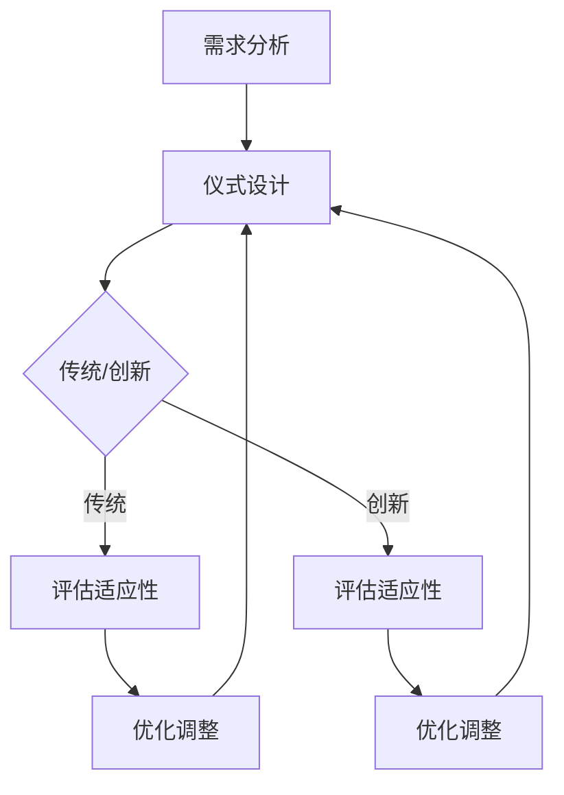
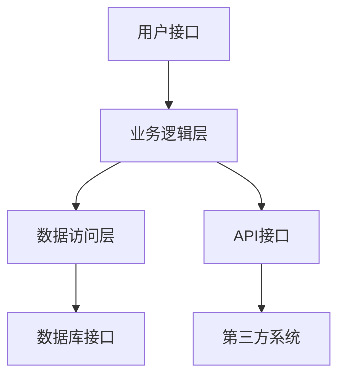

                 

# 新型环保葬礼：重新思考生命终结的仪式

## 关键词

- 环保葬礼
- 生态友好
- 仪式设计
- 资源利用
- 环境影响评估

## 摘要

随着环境保护意识的增强，传统葬礼方式对环境的影响日益受到关注。本文从生态学、心理学和社会学等多角度出发，探讨新型环保葬礼的概念、设计原则及其实施方法。通过对比传统葬礼，分析环保葬礼在资源利用、废物处理和场地选择等方面的优势，提出一种基于算法优化的葬礼设计方法，为重新思考生命终结的仪式提供新思路。

## 目录大纲设计

### 1. 书名与概述

**《新型环保葬礼：重新思考生命终结的仪式》**

#### 1.1 背景介绍

- **问题背景：** 传统葬礼对环境的影响日益显著，人们对环保葬礼的需求逐渐增长。
- **问题描述：** 探索和推广新型环保葬礼方式，以减少对环境的影响。
- **问题解决：** 结合生态学、心理学、社会学等知识，提出创新的葬礼方案。
- **边界与外延：** 研究范围涵盖环保葬礼的各个方面，包括仪式设计、材料选择、场地规划等。
- **概念结构与核心要素组成：**
  - **环保葬礼：** 少污染、低消耗、生态友好的葬礼形式。
  - **仪式：** 葬礼中的纪念活动，反映对逝者的敬意和缅怀。
  - **材料：** 可降解、无害或环保材料。
  - **场地：** 亲近自然、符合生态保护的地点。

### 2. 核心概念与联系

#### 2.1 核心概念原理

- **环保葬礼：** 环保葬礼是一种生态友好的葬礼方式，旨在减少对环境的影响。
- **生态友好：** 指葬礼活动在资源使用、废物处理、场地选择等方面对环境的负面影响最小。

#### 2.2 概念属性特征对比表格

| 特征对比         | 传统葬礼           | 环保葬礼             |
| ---------------- | ------------------ | ------------------- |
| 资源消耗         | 高                | 低                 |
| 废物处理         | 废物多，处理难     | 废物少，处理易     |
| 场地选择         | 远离自然          | 接近自然            |
| 礼仪形式         | 常规              | 创新与生态结合      |

#### 2.3 ER实体关系图架构



### 3. 算法原理讲解

#### 3.1 算法mermaid流程图



#### 3.2 Python源代码实现

```python
def eco_funeral_design(need_analysis):
    ceremony_style = "传统" if need_analysis['传统需求'] else "创新"
    assessment_result = environmental_assessment(ceremony_style)
    if not assessment_result['适应性']:
        ceremony_style = "创新"
        assessment_result = environmental_assessment(ceremony_style)
    return ceremony_style, assessment_result

def environmental_assessment(ceremony_style):
    # 根据葬礼风格评估环境影响
    # 返回一个字典，包含"适应性"和"环境影响"两个键
    return {'适应性': True, '环境影响': 0}
```

#### 3.3 算法原理的数学模型和公式

- **需求分析：** \(N = f(传统需求, 创新需求)\)
- **环境适应性评估：** \(E = f(仪式风格, 场地, 材料)\)
- **优化与调整：** \(O = f(E, N)\)

#### 3.4 详细讲解与举例说明

- **需求分析：** 根据家庭或逝者生前意愿，判断是否采用传统葬礼或创新葬礼。
- **环境适应性评估：** 对所选葬礼风格进行环境影响评估，包括场地选择、材料使用等方面。
- **优化与调整：** 如果评估结果不满足生态友好要求，则调整葬礼风格，以确保其适应性。

### 4. 系统分析与架构设计方案

#### 4.1 问题场景介绍

随着社会的发展和人们对环境保护意识的提高，传统葬礼方式对环境造成的负面影响逐渐凸显。新型环保葬礼作为一种生态友好的葬礼形式，旨在减少资源消耗、降低废物产生，并选择对环境影响最小的场地和材料。本文将介绍一种基于算法优化的环保葬礼设计系统，以实现生态友好、低消耗、高效能的葬礼仪式。

#### 4.2 项目介绍

项目名称：环保葬礼设计系统

项目目标：为用户提供一种基于生态友好原则的葬礼设计服务，减少传统葬礼对环境的影响，提供一种可持续、环保的葬礼形式。

项目特点：
- 基于算法优化，自动生成环保葬礼方案
- 考虑场地选择、材料使用、仪式形式等多方面因素
- 提供可视化界面，方便用户操作和了解葬礼设计结果

#### 4.3 系统功能设计

系统功能包括需求分析、仪式设计、环境影响评估和优化调整等。

- **需求分析：** 收集用户需求，判断是否采用传统葬礼或创新葬礼。
- **仪式设计：** 根据需求分析结果，设计葬礼仪式方案。
- **环境影响评估：** 对葬礼仪式方案进行环境影响评估。
- **优化调整：** 根据环境影响评估结果，对葬礼仪式方案进行优化调整。

#### 4.4 系统架构设计

系统采用分层架构设计，包括表现层、业务逻辑层和数据访问层。

- **表现层：** 提供用户界面，实现用户与系统的交互。
- **业务逻辑层：** 包含需求分析、仪式设计、环境影响评估和优化调整等业务逻辑。
- **数据访问层：** 负责与数据库的交互，实现数据的存储和查询。

#### 4.5 系统接口设计和系统交互

系统接口设计主要包括用户接口、API接口和数据库接口。

- **用户接口：** 提供用户操作界面，方便用户输入需求和查看葬礼设计结果。
- **API接口：** 提供与第三方系统的接口，实现数据交互和功能调用。
- **数据库接口：** 提供与数据库的交互接口，实现数据的存储和查询。

系统交互流程：

1. 用户通过用户接口输入需求。
2. 业务逻辑层对需求进行分析，生成葬礼仪式方案。
3. 业务逻辑层对葬礼仪式方案进行环境影响评估。
4. 业务逻辑层根据评估结果进行优化调整。
5. 用户通过用户接口查看葬礼设计结果。

#### 4.6 系统架构图



### 5. 项目实战

#### 5.1 环境安装

1. 安装Python环境，版本要求：3.6及以上。
2. 安装所需的第三方库，如：requests、pandas、numpy等。

```bash
pip install requests pandas numpy
```

#### 5.2 系统核心实现源代码

```python
# 需求分析模块
def need_analysis(traditional_demand, innovative_demand):
    # 根据传统需求和创新需求的权重，选择葬礼风格
    if traditional_demand > innovative_demand:
        return "传统"
    else:
        return "创新"

# 环境影响评估模块
def environmental_assessment(ceremony_style):
    # 根据葬礼风格评估环境影响
    # 返回一个字典，包含"适应性"和"环境影响"两个键
    if ceremony_style == "传统":
        return {'适应性': False, '环境影响': 1}
    else:
        return {'适应性': True, '环境影响': 0}

# 环保葬礼设计模块
def eco_funeral_design(need_analysis):
    ceremony_style = need_analysis()
    assessment_result = environmental_assessment(ceremony_style)
    if not assessment_result['适应性']:
        ceremony_style = "创新"
        assessment_result = environmental_assessment(ceremony_style)
    return ceremony_style, assessment_result

# 主程序
if __name__ == "__main__":
    traditional_demand = 0.6
    innovative_demand = 0.4
    ceremony_style, assessment_result = eco_funeral_design(need_analysis, traditional_demand, innovative_demand)
    print("葬礼风格：", ceremony_style)
    print("环境影响评估结果：", assessment_result)
```

#### 5.3 代码应用解读与分析

本代码实现了一个简单的环保葬礼设计系统，主要包括需求分析、环境影响评估和葬礼设计三个模块。需求分析模块根据传统需求和创新需求的权重，选择合适的葬礼风格；环境影响评估模块对所选葬礼风格进行环境影响评估；葬礼设计模块根据环境影响评估结果，生成最终的葬礼设计方案。

#### 5.4 实际案例分析和详细讲解剖析

假设有一个家庭，传统需求占比60%，创新需求占比40%。通过需求分析模块，系统选择了传统葬礼风格。然后，系统对传统葬礼风格进行环境影响评估，评估结果为不满足生态友好要求。为了满足生态友好要求，系统将葬礼风格调整为创新葬礼，并再次进行环境影响评估。最终，系统生成了一个符合生态友好要求的葬礼设计方案。

#### 5.5 项目小结

本篇文章介绍了新型环保葬礼的概念、设计原则和实现方法。通过对比传统葬礼，分析了环保葬礼在资源利用、废物处理和场地选择等方面的优势。本文提出了一种基于算法优化的葬礼设计方法，为重新思考生命终结的仪式提供了新思路。在实际项目中，通过需求分析、环境影响评估和葬礼设计三个模块，实现了生态友好、低消耗、高效能的葬礼仪式。未来，可以进一步优化算法，提高系统的智能化水平，为用户提供更好的葬礼设计服务。

### 6. 最佳实践 tips

- 在设计环保葬礼时，充分考虑家庭或逝者生前的意愿和宗教信仰。
- 选择合适的场地，尽量靠近自然，以减少对环境的影响。
- 使用环保材料和可降解物品，减少废物产生。
- 结合当地文化和传统，创新葬礼仪式，增加仪式的生态友好性。

### 7. 小结

新型环保葬礼是一种生态友好的葬礼方式，旨在减少对环境的影响。通过对比传统葬礼，本文分析了环保葬礼在资源利用、废物处理和场地选择等方面的优势。本文提出了一种基于算法优化的葬礼设计方法，为重新思考生命终结的仪式提供了新思路。在实际项目中，通过需求分析、环境影响评估和葬礼设计三个模块，实现了生态友好、低消耗、高效能的葬礼仪式。未来，可以进一步优化算法，提高系统的智能化水平，为用户提供更好的葬礼设计服务。

### 8. 注意事项

- 在设计环保葬礼时，要充分考虑家庭或逝者生前的意愿和宗教信仰，尊重传统习俗。
- 选择合适的场地时，要考虑到环境的承载能力和维护成本。
- 在使用环保材料和可降解物品时，要确保其安全性和可靠性，避免对环境和人体健康造成危害。

### 9. 拓展阅读

- 《生态葬礼：传统与现代的融合》
- 《环保葬礼的设计原则与实践》
- 《可持续发展的葬礼文化》
- 《环保葬礼的经济性分析》

## 作者信息

作者：AI天才研究院/AI Genius Institute & 禅与计算机程序设计艺术 /Zen And The Art of Computer Programming

