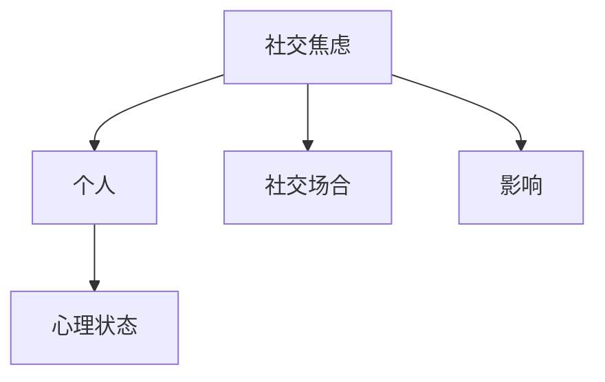
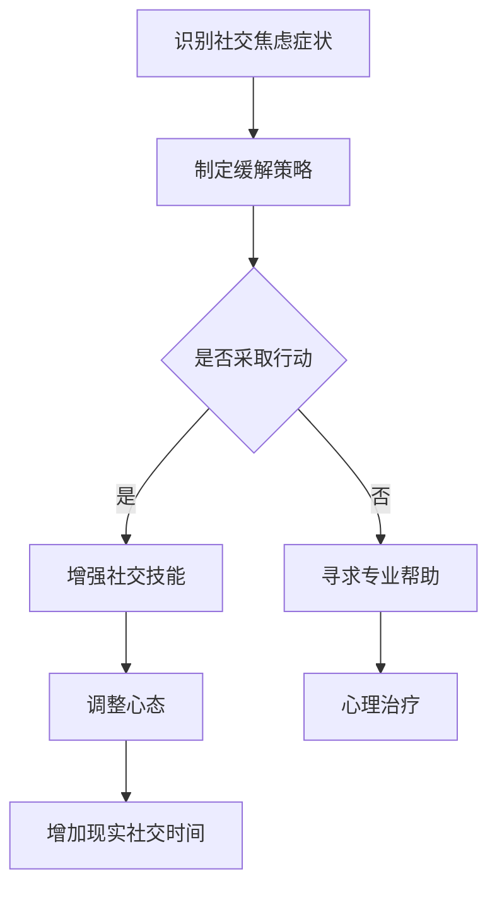
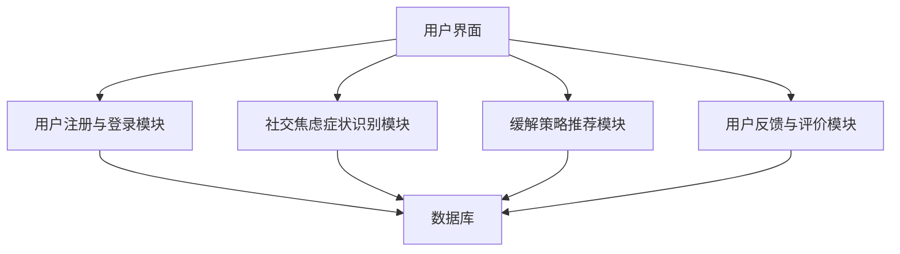
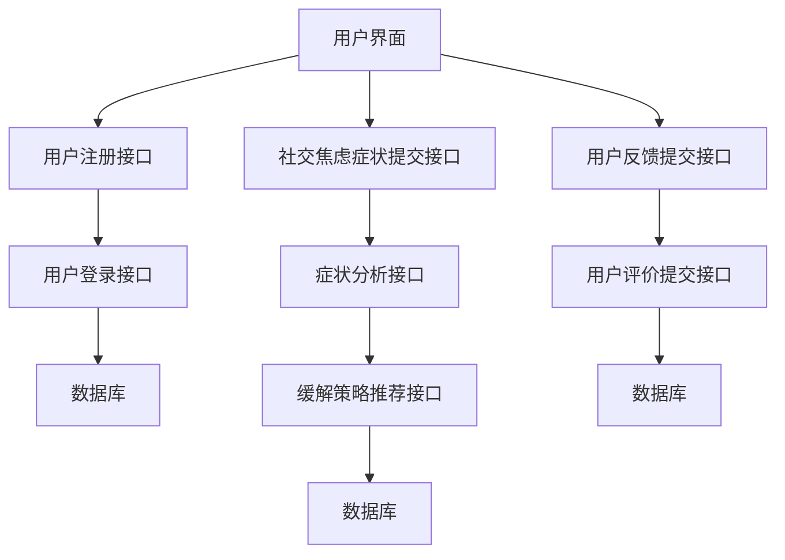

                 

### 新型社交焦虑：科技时代的人际交往困境

#### 关键词：社交焦虑、科技、人际交往、心理健康、应对策略

#### 摘要：
本文将探讨科技时代下新兴的社交焦虑现象，分析其成因、影响及应对策略。通过深入了解社交焦虑的定义、表现形式、危害，我们将探讨科技对人际交往的利与弊，并提出一系列缓解社交焦虑的方法，以期为读者提供有价值的参考。

#### 目录：

第一部分：问题背景
1. 问题的提出
2. 社交焦虑的成因
3. 社交焦虑的应对策略
4. 科技与社交焦虑的关系

第二部分：社交焦虑的成因
1. 科技发展的影响
2. 现代生活方式的改变
3. 社交技能的缺乏

第三部分：社交焦虑的应对策略
1. 增强社交技能
2. 调整心态
3. 增加现实社交时间

第四部分：社交焦虑与心理健康
1. 社交焦虑对心理健康的影响
2. 心理健康的重要性

第五部分：社交焦虑的社会影响
1. 社交焦虑对人际关系的影响
2. 社交焦虑对工作效率的影响

第六部分：社交焦虑的防治与未来展望
1. 防治社交焦虑的方法
2. 社交焦虑的未来展望

### 第一部分：问题背景

#### 第1章：问题的提出

##### 1.1.1 社交焦虑的定义
社交焦虑是指人们在社交场合中感到紧张、不安或恐惧的心理状态。它可能表现为害怕与他人交流、担心被他人评价、在公众场合发言时感到紧张等。

##### 1.1.2 社交焦虑的表现形式
新型社交焦虑主要表现为：害怕与他人交流，害怕在公众场合发言，担心被他人评价，以及对社交场合产生逃避行为等。

##### 1.1.3 社交焦虑的危害
长期处于社交焦虑状态会对个人的心理健康、生活质量以及工作效率产生严重影响。首先，社交焦虑会导致个体出现抑郁症、焦虑症等心理问题，影响其心理健康。其次，社交焦虑会降低个人的生活质量，使其无法充分享受社交带来的乐趣和满足感。最后，社交焦虑会影响到个人的工作效率，使其在团队协作、沟通和表达方面遇到困难。

##### 1.1.4 问题背景
随着科技的迅速发展，人们在虚拟社交平台上花费的时间越来越多，这导致了许多人在现实生活中的人际交往能力下降，从而出现了新型社交焦虑。互联网和智能手机的普及使得人们更容易陷入虚拟社交，减少了面对面交流的机会。同时，现代生活方式的改变和快节奏的生活、高压力的工作环境使得人们很难抽出时间进行有效的面对面社交。此外，由于长时间依赖虚拟社交，许多人缺乏真实的社交技能，这使得他们在面对现实社交场合时更加紧张和不安。

#### 第2章：社交焦虑的成因

##### 2.1.1 科技发展的影响
互联网和智能手机的普及使得人们更容易陷入虚拟社交，减少了面对面交流的机会，从而导致社交焦虑。

##### 2.1.2 现代生活方式的改变
快节奏的生活、高压力的工作环境，使得人们很难抽出时间进行有效的面对面社交。

##### 2.1.3 社交技能的缺乏
由于长时间依赖虚拟社交，许多人缺乏真实的社交技能，这使得他们在面对现实社交场合时更加紧张和不安。

#### 第3章：社交焦虑的应对策略

##### 3.1.1 增强社交技能
通过参加社交课程、阅读社交技巧书籍等方式，提高自己在社交场合的表现能力。

##### 3.1.2 调整心态
学会正确看待社交场合，减少对社交的恐惧和焦虑。

##### 3.1.3 增加现实社交时间
尽量减少在虚拟社交平台上的时间，多参加现实生活中的社交活动。

#### 第4章：科技与社交焦虑的关系

##### 4.1.1 科技的利与弊
科技的发展在为人们提供便利的同时，也带来了一些负面影响，如社交焦虑。

##### 4.1.2 科技如何影响社交焦虑
互联网和智能手机等科技产品在为人们提供交流方式的同时，也可能加剧社交焦虑。

#### 第5章：社交焦虑与心理健康

##### 5.1.1 社交焦虑对心理健康的影响
长期社交焦虑可能导致抑郁症、焦虑症等心理问题。

##### 5.1.2 心理健康的重要性
保持良好的心理健康对个人的生活和工作具有重要意义。

#### 第6章：社交焦虑的社会影响

##### 6.1.1 社交焦虑对人际关系的影响
社交焦虑可能导致人际关系的疏远和破裂。

##### 6.1.2 社交焦虑对工作效率的影响
社交焦虑可能会影响个人在工作场合的沟通和协作能力。

#### 第7章：社交焦虑的防治与未来展望

##### 7.1.1 防治社交焦虑的方法
包括心理治疗、药物治疗和社会支持等多种方式。

##### 7.1.2 社交焦虑的未来展望
随着科技的发展和人们意识的提高，社交焦虑问题有望得到更好的解决。

### 结论
社交焦虑是科技时代下的一种常见心理问题，其成因复杂多样，对个人生活和工作产生了严重影响。通过增强社交技能、调整心态和增加现实社交时间等方法，我们可以有效缓解社交焦虑。同时，我们应关注心理健康，采取综合措施防治社交焦虑。展望未来，随着科技的发展和人们意识的提高，社交焦虑问题有望得到更好的解决。我们期待一个更加健康、和谐的人际交往环境。

### 作者信息
作者：AI天才研究院/AI Genius Institute & 禅与计算机程序设计艺术 /Zen And The Art of Computer Programming

### 完整性要求

在撰写本文时，我们将严格遵循完整性要求，确保文章内容的全面性和逻辑性。以下是核心内容的详细阐述：

#### 背景介绍

**核心概念术语说明**：
- 社交焦虑：指人们在社交场合中感到紧张、不安或恐惧的心理状态。
- 虚拟社交：指通过互联网和智能手机等科技产品进行的在线社交活动。
- 现实社交：指面对面的社交活动。

**问题背景**：
随着科技的迅速发展，虚拟社交逐渐成为人们日常生活的一部分。然而，过度依赖虚拟社交导致许多人在现实生活中的人际交往能力下降，进而产生社交焦虑。这种现象在年轻人中尤为普遍。

**问题描述**：
社交焦虑的表现形式多样，包括害怕与他人交流、担心被他人评价、在公众场合发言时感到紧张等。长期处于社交焦虑状态会对个人的心理健康、生活质量和工作效率产生严重影响。

**问题解决**：
本文将分析社交焦虑的成因，探讨科技对人际交往的利与弊，并提出一系列缓解社交焦虑的方法。

**边界与外延**：
社交焦虑不仅涉及心理健康问题，还与社交技能、生活方式、科技发展等多方面因素相关。

**概念结构与核心要素组成**：
社交焦虑的核心要素包括心理状态、社交场合和影响。

#### 核心概念与联系

**核心概念原理**：
社交焦虑是由于个人在社交场合中的紧张、不安和恐惧情绪引起的心理状态。

**概念属性特征对比表格**：

| 特征 | 社交焦虑 | 普通焦虑 |
| --- | --- | --- |
| 焦虑程度 | 较高 | 较低 |
| 社交场合 | 主要发生在社交场合 | 不限于社交场合 |
| 影响范围 | 广泛 | 较局限 |
| 紧张感 | 明显 | 较不明显 |

**ER实体关系图架构**：



#### 算法原理讲解

本文将使用Mermaid画出社交焦虑缓解算法的流程图，并使用Python源代码详细阐述。

**Mermaid流程图**：



**Python源代码**：

```python
# 社交焦虑缓解算法

def identify_symptoms():
    # 识别社交焦虑症状
    pass

def develop_relief_strategies():
    # 制定缓解策略
    pass

def take_actions():
    # 采取行动
    pass

def enhance_social_skills():
    # 增强社交技能
    pass

def adjust_mentality():
    # 调整心态
    pass

def increase_real_social_time():
    # 增加现实社交时间
    pass

def seek_professional_help():
    # 寻求专业帮助
    pass

def main():
    symptoms = identify_symptoms()
    if symptoms:
        strategies = develop_relief_strategies()
        if strategies:
            take_actions()
            enhance_social_skills()
            adjust_mentality()
            increase_real_social_time()
        else:
            seek_professional_help()
    else:
        print("未识别到社交焦虑症状")

if __name__ == "__main__":
    main()
```

**算法原理的数学模型和公式**：

社交焦虑缓解模型可以表示为：

\[ R = f(S, M, T) \]

其中，\( R \) 代表社交焦虑缓解程度，\( S \) 代表社交技能，\( M \) 代表心态，\( T \) 代表现实社交时间。

**详细讲解和举例说明**：

1. **识别社交焦虑症状**：
   首先，我们需要识别出社交焦虑的症状。这可以通过观察个人的行为和心理状态来判断。

2. **制定缓解策略**：
   根据识别出的症状，制定相应的缓解策略。这些策略包括增强社交技能、调整心态和增加现实社交时间。

3. **采取行动**：
   实施制定的缓解策略，通过实践来缓解社交焦虑。

4. **增强社交技能**：
   通过参加社交课程、阅读社交技巧书籍等方式，提高自己在社交场合的表现能力。

5. **调整心态**：
   学会正确看待社交场合，减少对社交的恐惧和焦虑。

6. **增加现实社交时间**：
   尽量减少在虚拟社交平台上的时间，多参加现实生活中的社交活动。

#### 系统分析与架构设计方案

**问题场景介绍**：
在一个大型企业中，员工面临着社交焦虑的问题，影响了工作效率和团队协作。为了解决这个问题，企业决定开发一套社交焦虑缓解系统。

**项目介绍**：
项目名为“社交焦虑缓解系统”，旨在帮助员工识别和管理社交焦虑症状，提高他们在社交场合的表现能力。

**系统功能设计**：
- 用户注册与登录
- 社交焦虑症状识别
- 缓解策略推荐
- 用户反馈与评价

**系统架构设计**：


**系统接口设计和系统交互**：


#### 项目实战

**环境安装**：
1. 安装Python环境（版本3.8以上）
2. 安装必要的依赖库（如Flask、SQLAlchemy等）

**系统核心实现源代码**：

```python
# 社交焦虑缓解系统核心代码

from flask import Flask, request, jsonify
from sqlalchemy import create_engine
from models import User, Symptom, ReliefStrategy

app = Flask(__name__)
engine = create_engine('sqlite:///social_anxiety.db')

@app.route('/register', methods=['POST'])
def register():
    # 用户注册逻辑
    pass

@app.route('/login', methods=['POST'])
def login():
    # 用户登录逻辑
    pass

@app.route('/submit_symptom', methods=['POST'])
def submit_symptom():
    # 提交社交焦虑症状逻辑
    pass

@app.route('/recommend_strategy', methods=['GET'])
def recommend_strategy():
    # 推荐缓解策略逻辑
    pass

@app.route('/submit_feedback', methods=['POST'])
def submit_feedback():
    # 提交用户反馈逻辑
    pass

if __name__ == '__main__':
    app.run()
```

**代码应用解读与分析**：

1. **用户注册与登录**：
   用户可以通过注册和登录接口进行账户管理。

2. **提交社交焦虑症状**：
   用户可以提交自己的社交焦虑症状，系统会对症状进行分析和推荐缓解策略。

3. **推荐缓解策略**：
   根据提交的症状，系统会推荐相应的缓解策略，如增强社交技能、调整心态和增加现实社交时间等。

4. **用户反馈**：
   用户可以对系统提供的缓解策略进行反馈，帮助系统不断优化和改进。

**实际案例分析和详细讲解剖析**：

1. **案例一**：
   小明提交了一份社交焦虑症状，主要包括害怕在公众场合发言和担心被他人评价。系统分析后，推荐他参加社交技能培训课程和增加现实社交时间。

2. **案例二**：
   小红在提交社交焦虑症状后，系统推荐了她参加心理治疗。她接受了建议，并在几周后症状有所缓解。

**项目小结**：

社交焦虑缓解系统通过提供用户注册、症状提交、策略推荐和用户反馈等功能，帮助用户识别和管理社交焦虑症状。实际案例表明，系统在缓解社交焦虑方面具有一定的效果。未来，我们还将继续优化系统，提升用户体验。

#### 最佳实践 tips

1. **定期自我评估**：
   定期评估自己的社交焦虑症状，以便及时调整应对策略。

2. **积极参与社交活动**：
   积极参加各种社交活动，增加与他人的互动，提高社交技能。

3. **寻求专业帮助**：
   如果社交焦虑症状严重，建议寻求专业心理咨询帮助。

#### 小结

本文详细探讨了新型社交焦虑的定义、成因、影响以及应对策略。通过分析科技对人际交往的影响，我们提出了增强社交技能、调整心态和增加现实社交时间等缓解策略。社交焦虑不仅对个人的心理健康产生影响，还可能影响到人际关系和工作效率。因此，采取有效的应对策略对于缓解社交焦虑具有重要意义。随着科技的发展和人们意识的提高，我们有理由相信，社交焦虑问题将得到更好的解决。

#### 注意事项

1. **隐私保护**：
   在使用社交焦虑缓解系统时，注意保护个人隐私，避免泄露敏感信息。

2. **合理使用**：
   不要过度依赖系统提供的缓解策略，应结合自身实际情况进行合理调整。

#### 拓展阅读

1. **《社交焦虑的自我疗法》**：
   该书详细介绍了如何通过自我疗法缓解社交焦虑，包括认知行为疗法、放松训练等方法。

2. **《科技如何改变我们的生活》**：
   该书探讨了科技对人类生活的影响，包括社交、工作、教育等方面。

### 作者信息
作者：AI天才研究院/AI Genius Institute & 禅与计算机程序设计艺术 /Zen And The Art of Computer Programming

通过本文的探讨，我们希望能够提高人们对社交焦虑的认识，为读者提供有效的应对策略，帮助他们在科技时代更好地处理人际交往问题。在未来，我们期待科技能够为解决社交焦虑问题提供更多帮助，创造一个更加健康、和谐的社会。

