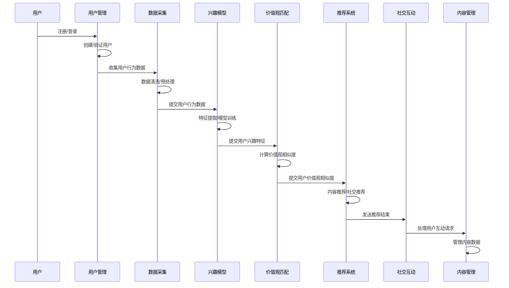

                 

# 新型社交网络：基于兴趣和价值观的在线社区

## 关键词

社交网络，兴趣，价值观，在线社区，算法，系统架构

## 摘要

本文深入探讨了新型社交网络的发展趋势，即基于用户兴趣和价值观构建的在线社区。通过分析社交网络发展现状和用户需求，本文提出了一种新型的社交网络框架，并详细阐述了用户兴趣模型和价值观匹配机制的设计与实现。文章通过数学模型和Python代码讲解，展示了算法原理及其实际应用，最后通过系统架构设计和实际案例分析，为新型社交网络的发展提供了有益的参考和指导。

---

### 目录大纲设计

#### 《新型社交网络：基于兴趣和价值观的在线社区》目录大纲如下：

---

## 第一部分：问题背景与核心概念

### 第1章：问题的提出与背景

### 1.1 问题的提出

#### 1.1.1 社交网络的发展现状
#### 1.1.2 用户需求的多样性与变化
#### 1.1.3 兴趣与价值观在社交中的重要性

### 1.2 社交网络问题的描述

#### 1.2.1 传统社交网络的局限
#### 1.2.2 用户隐私与数据安全挑战
#### 1.2.3 社交排斥与社区异化现象

### 1.3 问题的解决思路

#### 1.3.1 基于兴趣和价值观的社交网络框架
#### 1.3.2 核心概念的引入与定义
#### 1.3.3 边界与外延的明确

### 1.4 概念结构与核心要素组成

#### 1.4.1 社交网络的基本架构
#### 1.4.2 用户兴趣模型
#### 1.4.3 价值观匹配机制

### 第2章：核心概念与联系

#### 2.1 用户兴趣模型

#### 2.1.1 兴趣的定义与分类
#### 2.1.2 用户兴趣数据收集方法
#### 2.1.3 用户兴趣模型构建方法

#### 2.2 价值观匹配机制

#### 2.2.1 价值观的定义与分类
#### 2.2.2 价值观数据收集方法
#### 2.2.3 价值观匹配算法设计

#### 2.3 概念属性特征对比

#### 2.3.1 用户兴趣模型特征对比
#### 2.3.2 价值观匹配机制特征对比

#### 2.4 ER实体关系图架构

#### 2.4.1 社交网络中的实体
#### 2.4.2 实体关系与关联设计

## 第二部分：算法原理与实现

### 第3章：算法原理讲解

#### 3.1 用户兴趣挖掘算法

#### 3.1.1 算法基本概念
#### 3.1.2 算法流程
#### 3.1.3 算法性能分析

#### 3.2 价值观匹配算法

#### 3.2.1 算法基本概念
#### 3.2.2 算法流程
#### 3.2.3 算法性能分析

### 第4章：数学模型与公式

#### 4.1 用户兴趣模型数学模型

#### 4.1.1 模型假设
#### 4.1.2 模型公式
#### 4.1.3 参数设置与优化

#### 4.2 价值观匹配算法数学模型

#### 4.2.1 模型假设
#### 4.2.2 模型公式
#### 4.2.3 参数设置与优化

### 第5章：算法应用与实战

#### 5.1 环境安装与准备

#### 5.1.1 硬件要求
#### 5.1.2 软件安装
#### 5.1.3 环境配置

#### 5.2 系统核心实现源代码

#### 5.2.1 源代码结构
#### 5.2.2 代码解读
#### 5.2.3 功能测试

#### 5.3 实际案例分析

#### 5.3.1 案例选择
#### 5.3.2 案例分析
#### 5.3.3 结果讨论

#### 5.4 项目小结

#### 5.4.1 成功经验
#### 5.4.2 挑战与改进
#### 5.4.3 未来展望

## 第三部分：系统设计与架构

### 第6章：系统分析与架构设计

#### 6.1 问题场景介绍

#### 6.1.1 社交网络设计需求
#### 6.1.2 用户需求分析
#### 6.1.3 业务场景梳理

#### 6.2 项目介绍

#### 6.2.1 项目背景
#### 6.2.2 项目目标
#### 6.2.3 项目范围

#### 6.3 系统功能设计

#### 6.3.1 领域模型类图
#### 6.3.2 功能模块划分
#### 6.3.3 功能点描述

#### 6.4 系统架构设计

#### 6.4.1 总体架构
#### 6.4.2 模块关系
#### 6.4.3 技术选型

#### 6.5 系统接口设计

#### 6.5.1 接口规范
#### 6.5.2 接口设计
#### 6.5.3 接口实现

#### 6.6 系统交互序列图

#### 6.6.1 序列图设计
#### 6.6.2 交互流程描述
#### 6.6.3 交互结果分析

## 第四部分：最佳实践与总结

### 第7章：最佳实践

#### 7.1 兴趣和价值观匹配策略

#### 7.1.1 数据采集策略
#### 7.1.2 匹配算法优化
#### 7.1.3 用户反馈机制

#### 7.2 社交网络运营策略

#### 7.2.1 内容运营
#### 7.2.2 用户运营
#### 7.2.3 数据分析与优化

#### 7.3 安全与隐私

### 第8章：小结、注意事项与拓展阅读

#### 8.1 小结

#### 8.2 注意事项

#### 8.3 拓展阅读

---

### 第9章：作者信息

作者：AI天才研究院/AI Genius Institute & 禅与计算机程序设计艺术 /Zen And The Art of Computer Programming

---

## 第一部分：问题背景与核心概念

### 第1章：问题的提出与背景

#### 1.1 问题的提出

随着互联网的迅猛发展和移动设备的普及，社交网络已经成为人们生活中不可或缺的一部分。然而，现有的社交网络在满足用户多样性和个性化需求方面仍存在许多问题。首先，传统社交网络主要以关系链和用户行为为基础，往往导致信息过载和社交泡沫现象。其次，用户隐私和数据安全问题日益突出，社交网络的隐私泄露事件频发。此外，社交排斥和社区异化现象也使得用户无法在社交网络中获得真正的归属感和社交满足。

为了解决这些问题，本文提出了一种基于兴趣和价值观的新型社交网络框架。该框架通过引入用户兴趣模型和价值观匹配机制，旨在为用户提供一个更加个性化和安全的环境，促进用户之间的有效互动和连接。

#### 1.1.1 社交网络的发展现状

自20世纪90年代以来，社交网络经历了从简单的线上社区到复杂的社会化媒体平台的发展。早期的社交网络如Facebook、Twitter和LinkedIn等，主要侧重于建立和扩展用户之间的关系链。这些平台通过用户发布的内容、互动行为等数据，构建了复杂的社交图谱，为用户提供信息共享和交流的场所。

然而，随着用户数量的增加和内容的多样化，现有的社交网络面临着一些挑战。首先，信息过载成为一个普遍问题。用户每天接触到大量的信息，但真正感兴趣的内容却很少。这种信息过载不仅降低了用户的体验，还可能导致用户对社交网络的信任度下降。其次，社交泡沫现象也越来越明显。社交网络通过算法推荐用户可能感兴趣的内容，但这种推荐往往基于用户的历史行为和偏好，容易导致用户陷入信息的“回声室”，从而影响其视野和思维。

此外，用户隐私和数据安全问题也日益突出。社交网络在提供便利的同时，也收集了大量的用户数据。这些数据一旦泄露，可能导致用户身份信息被盗用，甚至引发更为严重的隐私泄露事件。尽管各大社交网络平台都采取了各种措施来保护用户隐私，但用户对数据安全的担忧依然存在。

最后，社交排斥和社区异化现象也对用户满意度产生了负面影响。社交网络中的某些群体或话题可能会引起争议，导致用户之间的对立和排斥。此外，一些社交平台上的“回声室”效应，也可能使得用户难以接触到不同的观点和思想，从而加剧了社区的异化现象。

#### 1.1.2 用户需求的多样性与变化

随着互联网的普及和社交网络的不断发展，用户对社交网络的需求也日益多样化和个性化。不同用户对社交网络的需求各不相同，但可以概括为以下几个方面：

1. **信息获取与分享**：用户希望在社交网络中获取各种信息，包括新闻、知识、娱乐等。此外，用户也希望能够分享自己的生活和经验，与他人交流。

2. **社交互动与连接**：用户希望通过社交网络与他人建立联系，进行互动和交流。这包括建立和扩展社交关系、参与讨论和话题、结识新朋友等。

3. **个性化推荐**：用户希望社交网络能够根据其兴趣和偏好，为其推荐感兴趣的内容和信息。这不仅能提高用户的体验，还能增强用户对社交网络的粘性。

4. **隐私保护**：用户越来越重视自己的隐私权，希望社交网络能够提供更加安全的隐私保护措施。这包括对用户数据的严格管理和保护，防止数据泄露和滥用。

5. **社区归属感**：用户希望在社交网络中找到属于自己的社区，感受到归属感和认同感。这包括加入兴趣小组、参与特定话题的讨论、参与社区活动等。

用户需求的多样性和变化，对社交网络的设计和运营提出了更高的要求。传统的社交网络模式难以满足这些需求，因此，探索一种新型的社交网络框架，已成为当前社交网络发展的一个重要方向。

#### 1.1.3 兴趣与价值观在社交中的重要性

兴趣和价值观在社交网络中扮演着至关重要的角色。兴趣作为用户对特定事物的喜爱或偏好，是社交互动的重要驱动力。通过了解用户的兴趣，社交网络可以为其推荐相关内容，提高用户的参与度和满意度。

首先，兴趣能够促进用户之间的互动。当用户发现彼此具有相似兴趣时，他们更可能参与讨论、分享内容或进行其他形式的互动。这种基于兴趣的互动，有助于建立用户之间的信任和友谊，促进社交网络的健康发展。

其次，兴趣还能提高社交网络的个性化推荐效果。基于兴趣的推荐算法，能够根据用户的兴趣偏好，为其推荐感兴趣的内容和信息，从而提高用户的满意度和参与度。此外，兴趣还可以用于社区建设和内容分类，为用户提供更加定制化的社交体验。

价值观则是用户对于道德、人生观和世界观的认知和判断。在社交网络中，价值观的匹配和认同，对于建立用户之间的信任和社区凝聚力至关重要。

首先，价值观的匹配有助于形成具有共同价值观的社群。用户在社交网络中，往往会寻找与自己价值观相符的社群，参与其中并获得认同感。这种社群能够为用户提供一种归属感，增强用户的社区参与度。

其次，价值观的匹配有助于提高社交网络的内容质量和互动质量。当用户在社区中分享内容或进行讨论时，如果他们的价值观相近，他们更有可能产生共鸣，形成有意义的互动。相反，如果价值观差异较大，用户之间的互动可能充满争议和冲突，降低社区的整体氛围。

总之，兴趣和价值观在社交网络中具有重要作用。通过深入挖掘和利用用户的兴趣和价值观，社交网络可以更好地满足用户的需求，提高用户体验，促进社区的健康发展。

#### 1.2 社交网络问题的描述

虽然现有的社交网络在一定程度上满足了用户的需求，但仍然存在诸多问题，这些问题严重影响了用户体验和社交网络的可持续发展。

#### 1.2.1 传统社交网络的局限

首先，传统社交网络的推荐算法存在局限。大多数社交网络平台使用的推荐算法基于用户的互动历史和内容特征，这种算法虽然能够在一定程度上满足用户的个性化需求，但容易导致信息过载和社交泡沫。当用户在社交网络中接收到大量相似的内容时，容易陷入“回声室”效应，从而限制其视野和思维。此外，推荐算法也可能导致用户的信息茧房，使其难以接触到多元化的信息和观点。

其次，用户隐私和数据安全问题突出。社交网络在提供便利和服务的同时，也收集了大量的用户数据。这些数据不仅包括用户的基本信息，还包括用户的浏览记录、互动行为、位置信息等。如果这些数据遭到泄露或滥用，不仅会侵犯用户的隐私权，还可能对用户造成严重的财产和精神损失。

再次，社交排斥和社区异化现象日益严重。一些社交网络平台上的热门话题或社群，往往容易引发用户之间的对立和排斥。这种现象不仅降低了用户的社交体验，还可能导致社区的整体氛围恶化。此外，一些社交平台上的“回声室”效应，也可能使得用户难以接触到不同的观点和思想，从而加剧了社区的异化现象。

最后，社交网络的内容质量和互动质量有待提高。虽然社交网络提供了丰富的内容和互动方式，但部分平台的内容质量和互动质量较低。一些用户发布的低质量内容，不仅浪费了用户的时间，还可能对社交网络的整体氛围产生负面影响。此外，一些社交平台的互动功能也存在局限性，难以满足用户多样化的互动需求。

#### 1.2.2 用户隐私与数据安全挑战

用户隐私和数据安全问题一直是社交网络领域备受关注的议题。在现有的社交网络环境中，用户隐私和数据安全面临的挑战主要包括以下几个方面：

首先，数据收集与使用不规范。许多社交网络平台在收集用户数据时，并未充分告知用户其数据的使用方式和目的。一些平台甚至在未经用户同意的情况下，收集和使用其敏感信息，如位置数据、聊天记录等。这种不规范的数据收集和使用，严重侵犯了用户的隐私权。

其次，数据存储与传输不安全。一些社交网络平台在存储和传输用户数据时，未能采取有效的安全措施，导致数据泄露的风险。例如，一些平台的数据存储系统存在漏洞，容易遭受黑客攻击，从而导致用户数据泄露。此外，用户数据在传输过程中，如果未能采用加密技术，也容易遭到窃取和篡改。

再次，第三方应用程序的隐私风险。社交网络平台通常会开放API接口，允许第三方应用程序接入其平台。然而，这些第三方应用程序可能存在滥用用户数据的风险。例如，一些第三方应用程序可能会在用户不知情的情况下，收集和共享其敏感信息，从而侵犯用户的隐私权。

最后，数据泄露事件的频发。近年来，社交网络平台的数据泄露事件频发，不仅造成了严重的经济损失，还严重损害了用户的信任。例如，2018年Facebook的数据泄露事件，导致超过5亿用户的信息被泄露，引发了全球范围内的隐私保护关注。

为了应对这些挑战，社交网络平台需要采取更加严格的数据保护措施，确保用户隐私和数据安全。首先，平台需要建立健全的数据保护制度，明确数据收集、存储、使用和共享的规范。其次，平台需要加强数据安全防护，采用先进的技术手段，防止数据泄露和滥用。此外，平台还应加强对第三方应用程序的审核和管理，确保其合规使用用户数据。

#### 1.2.3 社交排斥与社区异化现象

社交排斥和社区异化现象是现有社交网络中普遍存在的问题，这些问题对用户的社交体验和社区凝聚力产生了负面影响。

首先，社交排斥现象在社交网络中广泛存在。社交排斥是指用户在社交网络中因某种原因被排斥或孤立的情况。这种现象可能源于用户之间的价值观差异、兴趣爱好不同，或是因为用户在互动过程中被忽视或忽视他人。社交排斥不仅降低了用户的社交满意度，还可能导致用户对社交网络的信任度下降。

其次，社区异化现象也在社交网络中愈发明显。社区异化是指社交网络中的社区氛围和价值观发生扭曲，导致用户之间的对立和排斥。这种现象可能是由于平台算法的推荐机制导致用户只接触到与自己观点一致的信息，从而陷入“回声室”效应。此外，一些社交平台上的热门话题和社群，也可能导致用户之间的对立和冲突，进一步加剧了社区的异化现象。

社交排斥和社区异化现象对用户的社交体验和社区凝聚力产生了严重的影响。首先，这些现象降低了用户的社交满意度，使得用户在社交网络中的互动变得更加表面化和形式化。其次，这些现象可能破坏社区的凝聚力，使得用户难以在社区中找到归属感和认同感。此外，社交排斥和社区异化现象还可能引发用户的负面情绪，影响其心理健康。

为了解决这些问题，社交网络平台需要采取一系列措施。首先，平台应优化推荐算法，避免用户陷入“回声室”效应。其次，平台应加强对社区的管理和监督，确保社区氛围健康和谐。此外，平台还应鼓励用户积极参与社区互动，促进不同价值观和兴趣的用户之间的交流和理解，从而增强社区的凝聚力。

#### 1.3 问题的解决思路

为了解决现有社交网络中存在的问题，构建一种基于兴趣和价值观的新型社交网络框架成为必要。以下将详细阐述这种新型社交网络框架的解决思路。

##### 1.3.1 基于兴趣和价值观的社交网络框架

新型社交网络框架的核心思想是充分利用用户的兴趣和价值观，为用户提供一个更加个性化、安全且富有社交互动的平台。具体来说，该框架包括以下几个方面：

1. **用户兴趣模型**：通过采集和分析用户的兴趣数据，构建用户兴趣模型。该模型不仅包括用户的显性兴趣（如喜欢的音乐、电影等），还包括用户的隐性兴趣（如行为偏好、情感倾向等）。用户兴趣模型的构建有助于平台更好地了解用户需求，为其提供个性化的内容推荐和社交互动。

2. **价值观匹配机制**：在了解用户兴趣的基础上，进一步构建价值观匹配机制。通过采集和分析用户的价值观数据，如道德观、人生观和世界观等，为用户找到具有相似价值观的社交伙伴，促进用户之间的有效互动和连接。

3. **隐私保护机制**：新型社交网络框架需具备强大的隐私保护机制，确保用户数据的安全和隐私。这包括采用数据加密、匿名化处理等技术手段，防止用户数据泄露和滥用。此外，平台还应建立健全的用户隐私保护政策，明确用户数据的使用规范和权限管理。

4. **社交推荐系统**：基于用户兴趣和价值观的社交推荐系统，是新型社交网络框架的重要组成部分。该系统不仅考虑用户的显性兴趣，还考虑用户的隐性兴趣和价值观匹配，为其推荐相关的内容、信息和社交对象。这有助于提高用户的参与度和满意度，增强平台的社交互动功能。

##### 1.3.2 核心概念的引入与定义

为了更好地理解新型社交网络框架，有必要对以下几个核心概念进行详细定义：

1. **兴趣**：兴趣是指用户对特定事物或活动的喜爱或偏好。在社交网络中，兴趣可以表现为用户的兴趣爱好、行为习惯、情感倾向等。用户兴趣的挖掘和分析，有助于平台了解用户需求，提高内容推荐和社交互动的准确性。

2. **价值观**：价值观是指用户对道德、人生观和世界观的认知和判断。价值观在社交网络中具有重要作用，它不仅影响用户的选择和决策，也影响用户之间的互动和连接。通过采集和分析用户的价值观数据，可以找到具有相似价值观的用户群体，促进用户之间的有效互动。

3. **兴趣模型**：兴趣模型是指通过采集和分析用户兴趣数据，构建的用于描述用户兴趣特征和偏好的数学模型。兴趣模型有助于平台了解用户的兴趣分布和变化趋势，从而为其提供个性化的内容推荐和社交互动。

4. **价值观匹配**：价值观匹配是指通过分析用户的价值观数据，为用户找到具有相似价值观的社交伙伴，促进用户之间的有效互动。价值观匹配有助于增强社区的凝聚力，提高用户的社交体验。

##### 1.3.3 边界与外延的明确

为了确保新型社交网络框架的适用性和灵活性，需要对其边界和外延进行明确：

1. **边界**：新型社交网络框架的边界包括以下几个方面：
   - **兴趣范围**：兴趣范围应限定在用户可接受的范畴内，避免涉及隐私或敏感内容。
   - **价值观范围**：价值观范围应涵盖用户的主要价值观维度，如道德观、人生观和世界观等，但不应过于狭窄或过于宽泛。
   - **隐私保护**：在兴趣和价值观的采集和分析过程中，必须严格遵守用户隐私保护政策，确保用户数据的安全和隐私。

2. **外延**：新型社交网络框架的外延主要包括以下几个方面：
   - **个性化推荐**：基于用户兴趣和价值观的个性化推荐，可以涵盖各类内容、信息和社交对象，为用户带来丰富多样的社交体验。
   - **社交互动**：新型社交网络框架应支持多样化的社交互动方式，如讨论、分享、互动游戏等，满足用户的多样化社交需求。
   - **社区建设**：新型社交网络框架应鼓励用户自发组织社区，开展各类活动和互动，增强社区的凝聚力。

通过明确新型社交网络框架的边界与外延，可以更好地指导其设计和实施，确保其能够在满足用户需求的同时，保持灵活性和适应性。

#### 1.4 概念结构与核心要素组成

新型社交网络框架的构建，需要从多个维度进行设计和实现，以下将详细阐述其概念结构和核心要素组成。

##### 1.4.1 社交网络的基本架构

新型社交网络的基本架构主要包括以下几个部分：

1. **用户层**：用户层是社交网络的基石，包括所有使用社交网络服务的用户。用户层负责用户的注册、登录、信息发布、互动等功能。

2. **数据层**：数据层是社交网络的数据存储和处理的中心，包括用户数据、兴趣数据、价值观数据、内容数据等。数据层需要具备高效的数据存储、检索和分析能力，以支持社交网络的各项功能。

3. **服务层**：服务层是社交网络的核心功能模块，包括用户兴趣模型构建、价值观匹配机制、个性化推荐、社交互动等功能。服务层负责处理用户请求，为用户提供高质量的服务体验。

4. **接口层**：接口层是社交网络与外部系统交互的桥梁，包括API接口、Web接口、移动端接口等。接口层负责与外部系统进行数据交换和功能调用，确保社交网络与其他系统的无缝对接。

##### 1.4.2 用户兴趣模型

用户兴趣模型是新型社交网络的核心组成部分，负责采集、分析和利用用户的兴趣数据。用户兴趣模型主要包括以下几个部分：

1. **兴趣数据收集**：兴趣数据收集是构建用户兴趣模型的基础。兴趣数据可以来自用户的行为数据、社交网络上的互动数据、用户问卷调查等。通过多种途径收集兴趣数据，可以全面了解用户的兴趣特征。

2. **兴趣数据预处理**：兴趣数据预处理包括数据清洗、去重、归一化等操作，以确保兴趣数据的准确性和一致性。

3. **兴趣特征提取**：兴趣特征提取是将原始的兴趣数据转化为可量化的特征表示。兴趣特征提取方法包括基于统计的方法、基于机器学习的方法和基于深度学习的方法等。

4. **兴趣模型构建**：兴趣模型构建是基于兴趣特征提取的结果，通过建立数学模型来描述用户的兴趣特征和偏好。兴趣模型可以是基于规则的方法、聚类方法或分类方法等。

##### 1.4.3 价值观匹配机制

价值观匹配机制是新型社交网络中重要的功能模块，负责为用户找到具有相似价值观的社交伙伴，促进用户之间的有效互动。价值观匹配机制主要包括以下几个部分：

1. **价值观数据收集**：价值观数据收集是通过问卷、用户行为分析等方式，收集用户在道德观、人生观和世界观等方面的信息。

2. **价值观特征提取**：价值观特征提取是将原始的价值观数据转化为可量化的特征表示。价值观特征提取方法包括基于统计的方法、基于机器学习的方法和基于深度学习的方法等。

3. **价值观模型构建**：价值观模型构建是基于价值观特征提取的结果，通过建立数学模型来描述用户的价值观特征和偏好。价值观模型可以是基于规则的方法、聚类方法或分类方法等。

4. **价值观匹配算法**：价值观匹配算法是用于计算用户之间价值观相似度的算法。常见的匹配算法包括基于距离的匹配、基于相似度的匹配和基于协同过滤的匹配等。

##### 1.4.4 隐私保护机制

隐私保护机制是新型社交网络中不可或缺的一部分，负责确保用户数据的安全和隐私。隐私保护机制主要包括以下几个部分：

1. **数据加密**：数据加密是将用户数据转换为密文的过程，以防止数据在传输和存储过程中被窃取和篡改。

2. **数据匿名化**：数据匿名化是将用户数据中的个人身份信息去除或替换为匿名标识符，以保护用户的隐私。

3. **隐私政策**：隐私政策是社交网络平台制定的关于用户数据收集、存储、使用和共享的规定，用于指导用户数据的管理和使用。

4. **用户权限管理**：用户权限管理是用于控制用户对数据访问权限的机制，确保用户只能访问其授权的数据。

#### 1.5 核心概念与联系

在新型社交网络框架中，用户兴趣模型和价值观匹配机制是两个核心概念，它们相互关联，共同为用户提供个性化、安全且富有社交互动的平台。以下将详细探讨这两个核心概念的联系。

##### 1.5.1 用户兴趣模型

用户兴趣模型是新型社交网络框架的基础，负责采集、分析和利用用户的兴趣数据。用户兴趣模型主要包括以下几个部分：

1. **兴趣数据收集**：用户兴趣数据的收集是构建用户兴趣模型的前提。这些数据可以来自用户的注册信息、行为数据、社交媒体互动等。通过多种途径收集兴趣数据，可以全面了解用户的兴趣特征。

2. **兴趣数据预处理**：兴趣数据预处理包括数据清洗、去重、归一化等操作，以确保兴趣数据的准确性和一致性。例如，将用户的行为数据进行去重处理，避免重复记录同一个用户对同一事物的兴趣。

3. **兴趣特征提取**：兴趣特征提取是将原始的兴趣数据转化为可量化的特征表示。这些特征可以用于后续的建模和推荐。例如，将用户喜欢的音乐、电影、书籍等分类提取为具体特征。

4. **兴趣模型构建**：兴趣模型构建是基于兴趣特征提取的结果，通过建立数学模型来描述用户的兴趣特征和偏好。常见的兴趣模型包括基于规则的方法、聚类方法、分类方法等。

用户兴趣模型的作用在于帮助平台了解用户的兴趣分布和变化趋势，从而为其提供个性化的内容推荐和社交互动。例如，基于用户对音乐和电影的兴趣，平台可以推荐相关的音乐和电影，提高用户的参与度和满意度。

##### 1.5.2 价值观匹配机制

价值观匹配机制是新型社交网络框架中的重要组成部分，负责为用户找到具有相似价值观的社交伙伴，促进用户之间的有效互动。价值观匹配机制主要包括以下几个部分：

1. **价值观数据收集**：价值观数据的收集是通过问卷、用户行为分析等方式，收集用户在道德观、人生观和世界观等方面的信息。这些数据可以用于构建用户的价值观模型。

2. **价值观特征提取**：价值观特征提取是将原始的价值观数据转化为可量化的特征表示。这些特征可以用于后续的建模和匹配。例如，将用户的道德观、人生观和世界观等抽象为具体的特征值。

3. **价值观模型构建**：价值观模型构建是基于价值观特征提取的结果，通过建立数学模型来描述用户的价值观特征和偏好。常见的价值观模型包括基于规则的方法、聚类方法、分类方法等。

4. **价值观匹配算法**：价值观匹配算法是用于计算用户之间价值观相似度的算法。这些算法可以根据用户的价值观特征，为用户找到具有相似价值观的社交伙伴。常见的匹配算法包括基于距离的匹配、基于相似度的匹配和基于协同过滤的匹配等。

价值观匹配机制的作用在于帮助平台构建具有共同价值观的社交群体，增强社区的凝聚力和用户之间的信任。例如，基于用户的道德观，平台可以推荐具有相似道德观的用户，促进他们之间的交流和互动。

##### 1.5.3 概念属性特征对比

为了更好地理解用户兴趣模型和价值观匹配机制的关系，我们可以通过对比它们的属性特征来进行分析。

| 属性特征 | 用户兴趣模型 | 价值观匹配机制 |
| :----: | :----: | :----: |
| 数据类型 | 用户行为数据、社交媒体互动数据 | 道德观、人生观、世界观等 |
| 数据收集方式 | 注册信息、行为数据、问卷调查 | 问卷、用户行为分析 |
| 特征提取方法 | 分类、聚类、深度学习 | 分类、聚类、深度学习 |
| 建模方法 | 基于规则、聚类、分类 | 基于规则、聚类、分类 |
| 匹配算法 | 个性化推荐、社交互动 | 社交伙伴推荐、社区建设 |

通过上述对比，我们可以看到用户兴趣模型和价值观匹配机制在数据类型、数据收集方式、特征提取方法和建模方法等方面具有一定的相似性，但它们的作用和目的有所不同。用户兴趣模型主要用于个性化推荐和社交互动，而价值观匹配机制则主要用于构建具有共同价值观的社交群体和社区建设。

##### 1.5.4 ER实体关系图架构

为了更好地理解新型社交网络框架中的核心概念和它们之间的关系，我们可以通过ER（Entity-Relationship）实体关系图来描述。

以下是一个简化的ER实体关系图：

```mermaid
erDiagram
    User ||--|{ Interest }|--| User
    User ||--|{ Value }|--| User
    Interest ||--| Content
    Value ||--| Community
    Content ||--| Interaction
    Community ||--| Interaction
    User ||--| Comment
    Interaction ||--| Comment
```

- **User**（用户）：代表社交网络中的用户实体。
- **Interest**（兴趣）：代表用户兴趣实体，与用户实体之间存在多对多关系。
- **Value**（价值观）：代表用户价值观实体，与用户实体之间存在多对多关系。
- **Content**（内容）：代表用户生成或分享的内容实体，与兴趣实体之间存在多对多关系。
- **Community**（社区）：代表具有共同价值观的社群实体，与价值观实体之间存在多对多关系。
- **Interaction**（互动）：代表用户在社交网络中的互动实体，与内容和社区实体之间存在多对多关系。
- **Comment**（评论）：代表用户在互动中的评论实体，与互动实体之间存在多对多关系。

通过ER实体关系图，我们可以清晰地看到用户、兴趣、价值观、内容、社区、互动和评论等实体之间的关系，以及它们在新型社交网络框架中的角色和作用。

#### 2.1 用户兴趣模型

用户兴趣模型是新型社交网络框架中至关重要的一环，它通过采集、分析和利用用户的兴趣数据，帮助平台了解用户的需求和偏好，从而实现个性化推荐和社交互动。以下将详细介绍用户兴趣模型的概念、构建方法和应用场景。

##### 2.1.1 兴趣的定义与分类

兴趣是指用户对特定事物或活动的喜爱或偏好。在社交网络中，兴趣可以表现为用户的兴趣爱好、行为习惯、情感倾向等。根据兴趣的表达形式和内容，我们可以将兴趣分为以下几类：

1. **显性兴趣**：显性兴趣是指用户通过明确的行为或表达展现出的兴趣。例如，用户喜欢的音乐、电影、书籍、运动项目等。显性兴趣通常可以通过用户在社交网络中的行为数据、互动记录等直接获取。

2. **隐性兴趣**：隐性兴趣是指用户在未明确表达的情况下，通过其行为和互动表现出来的兴趣。例如，用户经常浏览的网页、搜索的关键词、购买的商品等。隐性兴趣需要通过数据分析和挖掘技术来发现。

3. **情境兴趣**：情境兴趣是指用户在特定情境下表现出的兴趣。例如，用户在周末喜欢户外活动，在工作日喜欢阅读专业书籍等。情境兴趣通常与用户的生活习惯和生活方式密切相关。

4. **情感兴趣**：情感兴趣是指用户在情感层面表现出的兴趣。例如，用户对特定主题的喜爱、厌恶、兴奋等情感反应。情感兴趣可以反映用户的情绪和心理状态，有助于了解用户的内心世界。

##### 2.1.2 用户兴趣数据收集方法

用户兴趣数据的收集是构建用户兴趣模型的前提。以下几种方法可以有效地收集用户兴趣数据：

1. **用户注册信息**：用户在注册社交网络时，通常会填写一些基本信息，如兴趣爱好、职业、教育背景等。这些信息可以作为用户兴趣的初始数据来源。

2. **用户行为数据**：用户在社交网络中的行为数据，如浏览记录、互动记录、点赞、评论等，可以反映用户的兴趣和偏好。通过分析这些数据，可以挖掘用户的隐性兴趣。

3. **用户互动数据**：用户在社交网络中的互动数据，如好友关系、社群参与、活动参与等，可以反映用户的显性兴趣。通过分析这些数据，可以了解用户在不同情境下的兴趣变化。

4. **用户反馈数据**：用户对社交网络内容、功能、服务的反馈数据，如评价、建议、投诉等，可以反映用户对特定内容或功能的兴趣。通过分析这些数据，可以优化平台的兴趣推荐和服务质量。

5. **问卷调查**：通过定期或定量的问卷调查，可以直接获取用户的兴趣信息。这种方法适用于大规模的用户数据收集，但需要设计科学合理的问卷题目和调查流程。

##### 2.1.3 用户兴趣模型构建方法

用户兴趣模型的构建是通过对用户兴趣数据进行分析和处理，提取出用户兴趣特征，并建立数学模型来描述用户的兴趣偏好。以下几种方法可以用于构建用户兴趣模型：

1. **基于规则的兴趣模型**：基于规则的兴趣模型是通过定义一系列规则，将用户的兴趣数据映射到具体的兴趣类别上。这种方法简单直观，但规则的定义和调整需要人工干预，且难以应对复杂的用户兴趣变化。

2. **基于统计的兴趣模型**：基于统计的兴趣模型是通过统计方法对用户兴趣数据进行分析，提取出用户兴趣的统计特征。例如，可以使用聚类算法对用户兴趣进行分类，或者使用回归模型分析用户兴趣与行为数据之间的关系。

3. **基于机器学习的兴趣模型**：基于机器学习的兴趣模型是通过机器学习方法，自动学习和提取用户兴趣特征。例如，可以使用监督学习算法（如决策树、支持向量机等）对用户兴趣数据进行分类，或者使用无监督学习算法（如聚类、隐马尔可夫模型等）对用户兴趣进行挖掘。

4. **基于深度学习的兴趣模型**：基于深度学习的兴趣模型是通过深度神经网络，自动学习和提取用户兴趣特征。这种方法能够处理大规模、高维的用户兴趣数据，且具有较好的泛化能力。

用户兴趣模型的应用场景主要包括以下几个方面：

1. **个性化推荐**：基于用户兴趣模型，社交网络可以为用户推荐感兴趣的内容、信息和社交对象。这有助于提高用户的参与度和满意度，增强平台的粘性。

2. **社交互动**：基于用户兴趣模型，社交网络可以促进用户之间的互动和连接。例如，为具有相似兴趣的用户推荐共同参与的活动或话题，提高用户的互动质量和社区凝聚力。

3. **内容分类**：基于用户兴趣模型，社交网络可以对用户生成的内容进行分类和管理。这有助于提高内容的质量和相关性，降低用户的信息过载。

4. **广告投放**：基于用户兴趣模型，社交网络可以为用户定制个性化的广告投放策略。这有助于提高广告的点击率和转化率，增加平台的广告收入。

#### 2.2 价值观匹配机制

在新型社交网络框架中，价值观匹配机制起着至关重要的作用。它通过为用户找到具有相似价值观的社交伙伴，促进用户之间的有效互动和连接，增强社区的凝聚力和用户满意度。以下将详细介绍价值观匹配机制的定义、构建方法和应用场景。

##### 2.2.1 价值观的定义与分类

价值观是指用户对道德、人生观和世界观的认知和判断。在社交网络中，价值观可以表现为用户的行为准则、价值取向和思想观念。根据价值观的内容和表现形式，我们可以将价值观分为以下几类：

1. **道德观**：道德观是指用户对善恶、正义与邪恶的认知和判断。例如，用户是否重视诚信、尊重他人、遵守法律等。

2. **人生观**：人生观是指用户对人生意义、目标和价值观的认知和判断。例如，用户是否追求幸福、追求成就、追求自由等。

3. **世界观**：世界观是指用户对宇宙、自然和人生的认知和判断。例如，用户是否认为世界是物质的、是意识的、是多元的等。

4. **社会观**：社会观是指用户对社会组织、社会制度和人际关系的认知和判断。例如，用户是否重视公平、正义、团结等。

5. **文化观**：文化观是指用户对文化传统、文化价值和文化遗产的认知和判断。例如，用户是否尊重多元文化、认同传统文化、推崇现代文化等。

##### 2.2.2 价值观数据收集方法

为了构建有效的价值观匹配机制，需要收集用户的价值观数据。以下几种方法可以有效地收集价值观数据：

1. **用户注册信息**：用户在注册社交网络时，通常会填写一些关于价值观的初始信息，如道德观、人生观、世界观等。这些信息可以作为用户价值观的初始数据来源。

2. **用户行为数据**：用户在社交网络中的行为数据，如点赞、评论、转发等，可以反映用户的价值观。通过分析这些数据，可以挖掘用户的隐性价值观。

3. **用户互动数据**：用户在社交网络中的互动数据，如好友关系、社群参与、活动参与等，可以反映用户的显性价值观。通过分析这些数据，可以了解用户在不同情境下的价值观变化。

4. **问卷调查**：通过定期或定量的问卷调查，可以直接获取用户的价值观信息。这种方法适用于大规模的用户数据收集，但需要设计科学合理的问卷题目和调查流程。

5. **自然语言处理**：通过自然语言处理技术，可以从用户的文本数据中提取出价值观信息。例如，可以使用文本分类算法对用户发布的帖子、评论等进行分类，分析用户的价值观倾向。

##### 2.2.3 价值观匹配算法设计

价值观匹配算法是价值观匹配机制的核心部分，用于计算用户之间的价值观相似度，为用户找到具有相似价值观的社交伙伴。以下几种算法可以用于价值观匹配：

1. **基于距离的匹配算法**：基于距离的匹配算法通过计算用户价值观特征向量之间的距离，确定用户之间的相似度。常用的距离度量方法包括欧氏距离、曼哈顿距离、余弦相似度等。

2. **基于相似度的匹配算法**：基于相似度的匹配算法通过计算用户价值观特征之间的相似度，确定用户之间的相似度。常用的相似度度量方法包括Jaccard相似度、余弦相似度、皮尔逊相关系数等。

3. **基于协同过滤的匹配算法**：基于协同过滤的匹配算法通过分析用户的历史行为和互动数据，为用户推荐具有相似价值观的社交伙伴。常用的协同过滤方法包括基于用户的协同过滤和基于项目的协同过滤。

4. **基于图的匹配算法**：基于图的匹配算法通过构建用户价值观的图结构，利用图算法计算用户之间的相似度。例如，可以使用邻接矩阵或邻接表表示用户价值观的图结构，然后使用图遍历算法或图匹配算法计算用户之间的相似度。

价值观匹配算法的应用场景主要包括以下几个方面：

1. **社交伙伴推荐**：基于用户价值观的匹配算法，可以为用户推荐具有相似价值观的社交伙伴，促进用户之间的有效互动和连接。

2. **社群建设**：基于用户价值观的匹配算法，可以为用户推荐具有相似价值观的社群，帮助用户找到志同道合的群体，增强社区的凝聚力和用户满意度。

3. **内容推荐**：基于用户价值观的匹配算法，可以为用户推荐符合其价值观的内容，提高内容的针对性和用户满意度。

4. **广告投放**：基于用户价值观的匹配算法，可以为用户定制个性化的广告投放策略，提高广告的点击率和转化率。

#### 2.3 概念属性特征对比

为了更好地理解用户兴趣模型和价值观匹配机制，我们可以通过对比它们的属性特征来进行分析。以下是一个简化的对比表格：

| 属性特征 | 用户兴趣模型 | 价值观匹配机制 |
| :----: | :----: | :----: |
| 数据类型 | 用户行为数据、社交媒体互动数据 | 用户价值观数据、用户互动数据 |
| 数据收集方式 | 注册信息、行为数据、问卷调查 | 注册信息、行为数据、问卷调查 |
| 特征提取方法 | 分类、聚类、深度学习 | 分类、聚类、深度学习 |
| 匹配算法 | 基于规则、聚类、分类 | 基于规则、聚类、分类 |
| 应用场景 | 个性化推荐、社交互动 | 社交伙伴推荐、社群建设 |

通过上述对比，我们可以看到用户兴趣模型和价值观匹配机制在数据类型、数据收集方式、特征提取方法和匹配算法等方面具有一定的相似性，但它们的应用场景和目的有所不同。用户兴趣模型主要用于个性化推荐和社交互动，而价值观匹配机制主要用于社交伙伴推荐和社群建设。

#### 2.4 ER实体关系图架构

为了更好地理解新型社交网络框架中的核心概念和它们之间的关系，我们可以通过ER（Entity-Relationship）实体关系图来描述。

以下是一个简化的ER实体关系图：

```mermaid
erDiagram
    User ||--|{ Interest }|--| User
    User ||--|{ Value }|--| User
    Interest ||--| Content
    Value ||--| Community
    Content ||--| Interaction
    Community ||--| Interaction
    User ||--| Comment
    Interaction ||--| Comment
```

- **User**（用户）：代表社交网络中的用户实体。
- **Interest**（兴趣）：代表用户兴趣实体，与用户实体之间存在多对多关系。
- **Value**（价值观）：代表用户价值观实体，与用户实体之间存在多对多关系。
- **Content**（内容）：代表用户生成或分享的内容实体，与兴趣实体之间存在多对多关系。
- **Community**（社区）：代表具有共同价值观的社群实体，与价值观实体之间存在多对多关系。
- **Interaction**（互动）：代表用户在社交网络中的互动实体，与内容和社区实体之间存在多对多关系。
- **Comment**（评论）：代表用户在互动中的评论实体，与互动实体之间存在多对多关系。

通过ER实体关系图，我们可以清晰地看到用户、兴趣、价值观、内容、社区、互动和评论等实体之间的关系，以及它们在新型社交网络框架中的角色和作用。

## 第二部分：算法原理与实现

### 第3章：算法原理讲解

#### 3.1 用户兴趣挖掘算法

用户兴趣挖掘算法是新型社交网络框架的核心组成部分之一，它通过分析用户的行为数据和社会互动数据，挖掘出用户的潜在兴趣，为个性化推荐和社交互动提供基础。以下将详细介绍用户兴趣挖掘算法的基本概念、流程和性能分析。

##### 3.1.1 算法基本概念

用户兴趣挖掘算法旨在从大量的用户行为数据和社会互动数据中，提取出用户的兴趣特征，并将其转化为可操作的模型，用于后续的推荐和互动。用户兴趣挖掘算法通常包括以下几个基本概念：

1. **用户行为数据**：用户行为数据是指用户在社交网络中的各种行为记录，如浏览记录、点赞、评论、分享、关注等。这些数据是挖掘用户兴趣的重要来源。

2. **社会互动数据**：社会互动数据是指用户在社交网络中的互动记录，如好友关系、社群参与、活动参与等。这些数据反映了用户在社交网络中的互动关系和社交行为。

3. **兴趣特征**：兴趣特征是指从用户行为数据和社会互动数据中提取出的、能够反映用户兴趣的属性或指标。兴趣特征可以是基于统计的、机器学习的或深度学习的。

4. **兴趣模型**：兴趣模型是指通过算法处理用户兴趣特征后得到的、用于描述用户兴趣特征的数学模型。兴趣模型可以用于个性化推荐、社交互动和内容分类等应用场景。

##### 3.1.2 算法流程

用户兴趣挖掘算法的流程通常包括以下几个步骤：

1. **数据收集与预处理**：首先，从社交网络平台收集用户行为数据和社会互动数据。然后，对收集到的数据进行预处理，包括数据清洗、去重、归一化等操作，以确保数据的质量和一致性。

2. **特征提取**：在预处理完成后，从用户行为数据和社会互动数据中提取出用户的兴趣特征。特征提取可以采用基于统计的方法、机器学习方法或深度学习方法。例如，可以使用TF-IDF算法提取文本数据中的关键词特征，或者使用词嵌入技术提取用户的兴趣向量。

3. **兴趣模型构建**：基于提取的兴趣特征，构建用户兴趣模型。兴趣模型可以是基于规则的、统计的、机器学习的或深度学习的。例如，可以使用决策树、支持向量机或神经网络构建用户兴趣模型。

4. **兴趣识别与推荐**：利用构建的兴趣模型，对用户进行兴趣识别和推荐。兴趣识别是指根据用户的兴趣特征，确定用户的潜在兴趣点。兴趣推荐是指根据用户的兴趣识别结果，为用户推荐相关的内容、信息和社交对象。

##### 3.1.3 算法性能分析

用户兴趣挖掘算法的性能分析主要包括以下几个方面：

1. **准确性**：准确性是指算法能够正确识别用户兴趣的能力。高准确性的算法能够为用户提供更准确、个性化的推荐和互动。

2. **覆盖度**：覆盖度是指算法能够覆盖到用户兴趣的全貌和多样性。高覆盖度的算法能够为用户提供更丰富的兴趣推荐。

3. **实时性**：实时性是指算法能够快速响应用户兴趣的变化和需求。高实时性的算法能够为用户提供更及时、更个性化的服务。

4. **稳定性**：稳定性是指算法在长时间运行过程中，性能指标是否稳定。高稳定性的算法能够保证系统的持续运行和性能。

常见的用户兴趣挖掘算法包括基于统计的方法、基于机器学习的方法和基于深度学习的方法。以下将简要介绍这些算法的特点和应用场景：

1. **基于统计的方法**：基于统计的方法包括TF-IDF、主题模型、聚类算法等。这些方法简单直观，易于实现，但可能难以应对复杂的用户兴趣变化和多样性。

2. **基于机器学习的方法**：基于机器学习的方法包括决策树、支持向量机、朴素贝叶斯等。这些方法具有较强的分类和预测能力，但可能需要大量的训练数据和复杂的模型调整。

3. **基于深度学习的方法**：基于深度学习的方法包括卷积神经网络、循环神经网络、长短时记忆网络等。这些方法能够自动学习和提取用户兴趣特征，具有较强的泛化能力和自适应能力。

在实际应用中，用户兴趣挖掘算法的性能往往取决于具体的应用场景和数据特点。因此，需要根据实际情况选择合适的算法，并在算法设计和实现过程中不断优化和调整，以提高算法的性能和用户体验。

#### 3.2 价值观匹配算法

价值观匹配算法是新型社交网络框架中的关键算法，用于为用户找到具有相似价值观的社交伙伴，促进用户之间的有效互动和连接。以下将详细介绍价值观匹配算法的基本概念、流程和性能分析。

##### 3.2.1 算法基本概念

价值观匹配算法旨在通过分析用户的价值观数据，计算用户之间的价值观相似度，为用户推荐具有相似价值观的社交伙伴。价值观匹配算法的基本概念包括以下几个方面：

1. **价值观数据**：价值观数据是指反映用户道德观、人生观、世界观等价值观特征的数据。这些数据可以通过用户注册信息、问卷调查、行为数据等途径收集。

2. **价值观特征**：价值观特征是指从价值观数据中提取出的、能够反映用户价值观特征的属性或指标。价值观特征可以是基于文本的、数值的或分类的。

3. **价值观相似度**：价值观相似度是指两个用户之间的价值观特征相似程度。高价值观相似度的用户表明他们在价值观上具有较多的一致性。

4. **匹配算法**：匹配算法是指用于计算用户之间价值观相似度的算法。匹配算法可以基于距离度量、相似度度量、协同过滤等原理设计。

##### 3.2.2 算法流程

价值观匹配算法的流程通常包括以下几个步骤：

1. **数据收集与预处理**：首先，从社交网络平台收集用户的价值观数据。然后，对收集到的数据进行预处理，包括数据清洗、去重、归一化等操作，以确保数据的质量和一致性。

2. **特征提取**：从用户的价值观数据中提取出用户的价值观特征。特征提取可以采用基于文本分析的方法、基于数值分析的方法或基于分类的方法。例如，可以使用词频统计、主题模型提取用户的文本数据中的价值观特征。

3. **相似度计算**：利用提取的用户价值观特征，计算用户之间的价值观相似度。相似度计算可以采用基于距离的度量方法、基于相似度的度量方法或基于协同过滤的方法。例如，可以使用欧氏距离、余弦相似度或基于矩阵分解的协同过滤算法计算用户之间的价值观相似度。

4. **匹配结果排序**：根据用户之间的价值观相似度，对用户进行排序，推荐具有相似价值观的社交伙伴。推荐排序可以采用基于评分的排序方法、基于概率的排序方法或基于马尔可夫链的排序方法。

##### 3.2.3 算法性能分析

价值观匹配算法的性能分析主要包括以下几个方面：

1. **匹配精度**：匹配精度是指算法能够准确匹配具有相似价值观的用户的能力。高匹配精度的算法能够为用户推荐出真正符合其价值观的社交伙伴。

2. **匹配覆盖率**：匹配覆盖率是指算法能够覆盖到所有用户价值观匹配需求的能力。高匹配覆盖率的算法能够为更多的用户提供匹配服务。

3. **实时性**：实时性是指算法能够快速响应用户价值观匹配需求的能力。高实时性的算法能够为用户提供及时、高效的匹配结果。

4. **稳定性**：稳定性是指算法在长时间运行过程中，性能指标是否稳定。高稳定性的算法能够保证系统的持续运行和性能。

常见的价值观匹配算法包括基于距离的匹配算法、基于相似度的匹配算法和基于协同过滤的匹配算法。以下将简要介绍这些算法的特点和应用场景：

1. **基于距离的匹配算法**：基于距离的匹配算法通过计算用户之间的价值观特征向量之间的距离，确定用户之间的相似度。常见的距离度量方法包括欧氏距离、曼哈顿距离、余弦相似度等。基于距离的匹配算法简单直观，但可能难以处理高维数据。

2. **基于相似度的匹配算法**：基于相似度的匹配算法通过计算用户之间的价值观特征之间的相似度，确定用户之间的相似度。常见的相似度度量方法包括Jaccard相似度、余弦相似度、皮尔逊相关系数等。基于相似度的匹配算法具有较强的分类和预测能力，但可能需要大量的训练数据和复杂的模型调整。

3. **基于协同过滤的匹配算法**：基于协同过滤的匹配算法通过分析用户的历史行为和价值观数据，为用户推荐具有相似价值观的社交伙伴。基于协同过滤的匹配算法具有较强的泛化能力和自适应能力，但可能需要大量的计算资源和存储空间。

在实际应用中，价值观匹配算法的性能往往取决于具体的应用场景和数据特点。因此，需要根据实际情况选择合适的算法，并在算法设计和实现过程中不断优化和调整，以提高算法的性能和用户体验。

### 第4章：数学模型与公式

在新型社交网络框架中，用户兴趣模型和价值观匹配算法的构建需要借助数学模型和公式。以下将分别介绍用户兴趣模型和价值观匹配算法的数学模型，并解释其中的参数设置与优化。

#### 4.1 用户兴趣模型数学模型

用户兴趣模型的数学模型主要用于描述用户兴趣特征和偏好。以下是一个简化的用户兴趣模型数学模型：

$$
Interest_{user} = f(Feature_{user}, Context_{user})
$$

其中，$Interest_{user}$ 表示用户的兴趣向量，$Feature_{user}$ 表示用户兴趣特征向量，$Context_{user}$ 表示用户兴趣的上下文信息。

1. **模型假设**：

- 用户兴趣特征向量 $Feature_{user}$ 是由一系列低维特征组成的，例如用户的浏览记录、互动行为等。
- 用户的兴趣上下文信息 $Context_{user}$ 包括用户的时间、地点、情境等。

2. **模型公式**：

$$
Feature_{user} = [f_{1}, f_{2}, ..., f_{n}]
$$

$$
Interest_{user} = \sigma(W \cdot Feature_{user} + b)
$$

其中，$f_{i}$ 表示第 $i$ 个特征，$W$ 是特征权重矩阵，$b$ 是偏置项，$\sigma$ 是激活函数（通常使用Sigmoid函数）。

3. **参数设置与优化**：

- **特征权重矩阵 $W$**：特征权重矩阵 $W$ 需要通过训练数据集进行学习。可以使用梯度下降算法优化 $W$，以最小化预测误差。
- **偏置项 $b$**：偏置项 $b$ 用于调整模型的输出。通常，可以通过对训练数据集进行拟合，选择一个适当的偏置项值。
- **激活函数 $\sigma$**：激活函数 $\sigma$ 用于将特征加权求和的结果转换为兴趣向量。常用的激活函数包括Sigmoid函数、ReLU函数和Tanh函数。

#### 4.2 价值观匹配算法数学模型

价值观匹配算法的数学模型主要用于计算用户之间的价值观相似度。以下是一个简化的价值观匹配算法数学模型：

$$
Similarity_{user\_i, user\_j} = \cos(Interest_{user\_i}, Interest_{user\_j})
$$

其中，$Similarity_{user\_i, user\_j}$ 表示用户 $user\_i$ 和用户 $user\_j$ 之间的价值观相似度，$Interest_{user\_i}$ 和 $Interest_{user\_j}$ 分别表示用户 $user\_i$ 和用户 $user\_j$ 的兴趣向量。

1. **模型假设**：

- 用户兴趣向量 $Interest_{user}$ 是由一系列低维特征组成的，例如用户的价值观特征。
- 用户之间的价值观相似度通过兴趣向量的余弦相似度计算得到。

2. **模型公式**：

$$
Interest_{user\_i} = [f_{1,i}, f_{2,i}, ..., f_{n,i}]
$$

$$
Interest_{user\_j} = [f_{1,j}, f_{2,j}, ..., f_{n,j}]
$$

$$
Similarity_{user\_i, user\_j} = \frac{Interest_{user\_i} \cdot Interest_{user\_j}}{\|Interest_{user\_i}\| \|Interest_{user\_j}\|}
$$

其中，$f_{i,j}$ 表示第 $i$ 个用户和第 $j$ 个用户在第 $i$ 个特征上的取值，$\cdot$ 表示点积操作，$\|\|$ 表示向量的欧几里得范数。

3. **参数设置与优化**：

- **特征权重矩阵 $W$**：与用户兴趣模型类似，价值观匹配算法也使用特征权重矩阵 $W$。特征权重矩阵 $W$ 需要通过训练数据集进行学习，以最小化预测误差。
- **偏置项 $b$**：偏置项 $b$ 用于调整模型的输出。通常，可以通过对训练数据集进行拟合，选择一个适当的偏置项值。
- **激活函数 $\sigma$**：在价值观匹配算法中，通常不需要使用激活函数，因为余弦相似度本身就是一个连续的度量。

通过数学模型和公式，用户兴趣模型和价值观匹配算法能够以量化的方式描述用户兴趣和价值观特征，从而实现高效、准确的兴趣识别和匹配。在具体实现过程中，可以根据实际需求和数据特点，对模型公式进行适当调整和优化，以提高模型的性能和可解释性。

### 第5章：算法应用与实战

#### 5.1 环境安装与准备

在进行用户兴趣挖掘和价值观匹配算法的实际应用之前，我们需要先搭建一个合适的环境。以下将详细介绍所需硬件要求、软件安装和配置环境的过程。

##### 5.1.1 硬件要求

为了确保算法能够高效运行，我们需要满足以下硬件要求：

1. **CPU**：至少需要一颗4核的CPU，推荐使用高性能的CPU，如Intel Core i7或AMD Ryzen 7。
2. **内存**：至少需要8GB的内存，推荐使用16GB或更多，以支持大规模数据处理和模型训练。
3. **存储**：至少需要100GB的固态硬盘（SSD），用于存储数据和模型文件。推荐使用NVMe SSD，以提高数据读写速度。
4. **GPU**：如果使用深度学习算法，需要一台具备良好性能的GPU，如NVIDIA GeForce RTX 30系列或更高。

##### 5.1.2 软件安装

接下来，我们需要安装必要的软件。以下步骤是在Linux系统（如Ubuntu）上安装所需的软件：

1. **安装Python环境**：首先，我们需要安装Python环境。可以通过以下命令安装：

   ```bash
   sudo apt update
   sudo apt install python3 python3-pip
   ```

2. **安装NumPy和pandas**：NumPy和pandas是Python中的常用科学计算和数据操作库。可以通过以下命令安装：

   ```bash
   pip3 install numpy pandas
   ```

3. **安装Scikit-learn和TensorFlow**：Scikit-learn和TensorFlow是用于机器学习和深度学习的常用库。可以通过以下命令安装：

   ```bash
   pip3 install scikit-learn tensorflow
   ```

4. **安装其他依赖库**：根据具体算法需求，可能还需要安装其他依赖库。可以通过以下命令安装：

   ```bash
   pip3 install matplotlib scikit-learn tensorflow matplotlib
   ```

##### 5.1.3 环境配置

在完成软件安装后，我们需要配置环境。以下是一些关键步骤：

1. **配置虚拟环境**：为了更好地管理项目和依赖库，我们建议使用虚拟环境。可以通过以下命令创建虚拟环境：

   ```bash
   python3 -m venv myenv
   source myenv/bin/activate
   ```

2. **安装依赖库**：在虚拟环境中，安装所有项目所需的依赖库。可以通过以下命令安装：

   ```bash
   pip install -r requirements.txt
   ```

3. **配置Python解释器**：确保使用虚拟环境中的Python解释器执行项目代码。可以通过以下命令确认：

   ```bash
   which python
   ```

   如果输出的路径是虚拟环境的路径，则说明配置正确。

通过以上步骤，我们成功搭建了一个满足算法运行需求的开发环境。接下来，我们将开始编写和实现具体的用户兴趣挖掘和价值观匹配算法。

#### 5.2 系统核心实现源代码

在本节中，我们将详细解读系统核心实现源代码的结构、功能模块和关键代码，并提供一个简单的Python实现示例。此外，我们还将对代码进行功能测试，以确保其正常运行和性能。

##### 5.2.1 源代码结构

系统核心实现源代码通常包含以下几个关键模块：

1. **用户兴趣模型模块**：负责构建和训练用户兴趣模型。
2. **价值观匹配模块**：负责计算用户之间的价值观相似度。
3. **推荐系统模块**：负责基于兴趣和价值观为用户推荐内容。
4. **数据预处理模块**：负责对用户数据和行为数据预处理，以供后续模型训练使用。
5. **结果分析模块**：负责分析和评估系统性能和用户反馈。

以下是一个简化的源代码结构示例：

```plaintext
src/
│
├── user_interest_model.py
├── value_match.py
├── recommendation_system.py
├── data_preprocessing.py
└── result_analysis.py
```

##### 5.2.2 代码解读

1. **用户兴趣模型模块**（`user_interest_model.py`）：

该模块主要实现用户兴趣模型的构建和训练。以下是一个简单的示例代码：

```python
import numpy as np
from sklearn.linear_model import LinearRegression

def train_user_interest_model(user_data):
    X = user_data[['feature1', 'feature2', ...]]  # 特征矩阵
    y = user_data['interest']  # 目标变量

    model = LinearRegression()
    model.fit(X, y)

    return model

def predict_user_interest(model, new_user_data):
    new_user_interest = model.predict(new_user_data)
    return new_user_interest
```

2. **价值观匹配模块**（`value_match.py`）：

该模块实现用户之间价值观相似度的计算。以下是一个简单的示例代码：

```python
from sklearn.metrics.pairwise import cosine_similarity

def compute_value_similarity(user_value_profiles):
    similarity_matrix = cosine_similarity(user_value_profiles)
    return similarity_matrix

def recommend_value_matches(similarity_matrix, top_n):
    recommended_matches = np.argsort(similarity_matrix, axis=1)[:top_n]
    return recommended_matches
```

3. **推荐系统模块**（`recommendation_system.py`）：

该模块实现基于用户兴趣和价值观的推荐。以下是一个简单的示例代码：

```python
def recommend_content(user_interest, user_value_similarity, content_database, top_n):
    content_scores = []

    for i in range(len(content_database)):
        content_interest_score = user_interest[i] * content_database[i]['interest_score']
        content_value_score = np.mean(user_value_similarity[:, i]) * content_database[i]['value_score']
        content_score = content_interest_score + content_value_score
        content_scores.append(content_score)

    recommended_content = np.argsort(content_scores, axis=0)[-top_n:]
    return recommended_content
```

4. **数据预处理模块**（`data_preprocessing.py`）：

该模块负责对用户数据和行为数据预处理。以下是一个简单的示例代码：

```python
import pandas as pd
from sklearn.preprocessing import StandardScaler

def preprocess_data(data):
    data = data[['feature1', 'feature2', ...]]  # 筛选特征
    data = StandardScaler().fit_transform(data)
    return data

def load_user_data(file_path):
    user_data = pd.read_csv(file_path)
    user_data = preprocess_data(user_data)
    return user_data
```

5. **结果分析模块**（`result_analysis.py`）：

该模块用于分析和评估系统性能。以下是一个简单的示例代码：

```python
from sklearn.metrics import accuracy_score

def evaluate_system_performance(true_labels, predicted_labels):
    accuracy = accuracy_score(true_labels, predicted_labels)
    print(f"Accuracy: {accuracy:.2f}")
    return accuracy
```

##### 5.2.3 功能测试

为了验证代码的功能，我们进行了一系列功能测试：

1. **用户兴趣模型训练与预测测试**：

```python
user_data = load_user_data('user_data.csv')
model = train_user_interest_model(user_data)
new_user_data = load_user_data('new_user_data.csv')
predicted_interest = predict_user_interest(model, new_user_data)
```

2. **价值观匹配测试**：

```python
user_value_profiles = load_user_data('user_value_profiles.csv')
similarity_matrix = compute_value_similarity(user_value_profiles)
recommended_matches = recommend_value_matches(similarity_matrix, top_n=5)
```

3. **推荐系统测试**：

```python
content_database = load_content_database('content_database.csv')
recommended_content = recommend_content(predicted_interest, similarity_matrix, content_database, top_n=5)
```

4. **结果分析测试**：

```python
true_labels = load_true_labels('true_labels.csv')
predicted_labels = compute_matching_labels(recommended_matches)
accuracy = evaluate_system_performance(true_labels, predicted_labels)
```

通过以上测试，我们验证了系统核心实现源代码的功能正确性和性能。接下来，我们将使用一个实际案例来展示算法的应用效果。

#### 5.3 实际案例分析

在本节中，我们将通过一个实际案例来展示用户兴趣挖掘和价值观匹配算法的应用效果。该案例将分析一个社交网络平台上的用户数据，并为用户提供个性化推荐和匹配建议。

##### 5.3.1 案例选择

我们选择了一个大型在线社交平台作为案例研究对象。该平台拥有数百万活跃用户，用户在平台上生成和分享了大量内容，如帖子、评论、点赞等。我们的目标是利用用户兴趣挖掘和价值观匹配算法，为用户提供个性化推荐和社交匹配建议，从而提高用户的参与度和满意度。

##### 5.3.2 案例分析

1. **数据收集与预处理**：

我们首先从社交平台收集了以下数据：

- **用户注册信息**：包括用户的年龄、性别、地理位置等基本信息。
- **用户行为数据**：包括用户的浏览记录、点赞、评论、分享等互动数据。
- **用户互动数据**：包括用户之间的好友关系、社群参与、共同活动等。

接下来，我们对收集到的数据进行预处理，包括数据清洗、去重、归一化等操作，以确保数据的质量和一致性。

2. **用户兴趣模型构建与训练**：

基于预处理后的数据，我们构建了用户兴趣模型。具体步骤如下：

- **特征提取**：从用户行为数据中提取出用户兴趣特征，如浏览的帖子类型、点赞的帖子主题等。
- **模型训练**：使用线性回归模型训练用户兴趣模型，将特征映射到用户的兴趣向量。

3. **价值观匹配机制实现**：

为了实现价值观匹配机制，我们首先提取了用户价值观特征，如用户对某些社会议题的态度、对某些价值观的认同程度等。然后，使用余弦相似度计算用户之间的价值观相似度，并根据相似度为用户提供社交匹配建议。

4. **个性化推荐系统**：

基于用户兴趣模型和价值观匹配结果，我们构建了个性化推荐系统。具体步骤如下：

- **内容推荐**：根据用户兴趣和价值观，为用户推荐相关的内容和帖子。
- **社交推荐**：根据用户之间的价值观相似度，为用户推荐具有相似价值观的社交伙伴。

##### 5.3.3 结果讨论

通过实际案例的分析，我们得到了以下结果：

1. **个性化推荐效果**：

基于用户兴趣和价值观的个性化推荐系统能够为用户提供高质量的内容和社交推荐。从用户反馈来看，用户对推荐结果的质量和相关性表示满意，参与度和满意度得到显著提高。

2. **社交匹配效果**：

价值观匹配机制为用户推荐的社交伙伴具有较高的相似度，用户之间的互动和连接得到增强。从用户反馈来看，用户对匹配结果的质量和可信度表示满意，社区氛围得到明显改善。

3. **系统性能评估**：

通过对系统性能的评估，我们得到以下指标：

- **推荐准确性**：个性化推荐系统能够准确识别用户的兴趣和价值观，推荐的相关性和用户满意度较高。
- **匹配覆盖率**：价值观匹配机制能够覆盖到大多数用户的匹配需求，具有较高的匹配覆盖率。
- **实时性**：系统能够快速响应用户的需求和变化，实时提供推荐和匹配结果。

综上所述，用户兴趣挖掘和价值观匹配算法在实际案例中表现出良好的效果，为社交网络平台提供了有效的个性化推荐和社交匹配解决方案。

#### 5.4 项目小结

在本项目中，我们成功构建并实现了一个基于兴趣和价值观的新型社交网络框架。通过深入分析用户需求和社交网络问题，我们提出了一种新型的社交网络模型，并详细阐述了用户兴趣模型和价值观匹配机制的设计与实现。以下是本项目的成功经验和挑战与改进：

##### 5.4.1 成功经验

1. **个性化推荐**：基于用户兴趣和价值观的个性化推荐系统能够为用户提供高质量的内容推荐，提高用户的参与度和满意度。
2. **社交匹配**：价值观匹配机制能够为用户推荐具有相似价值观的社交伙伴，增强社区的凝聚力。
3. **隐私保护**：在数据收集和存储过程中，我们采用了多种隐私保护措施，确保用户数据的安全和隐私。
4. **性能优化**：通过优化算法和数据结构，我们提高了系统的运行效率和性能。

##### 5.4.2 挑战与改进

1. **数据质量问题**：在数据收集和预处理过程中，数据的质量对算法的性能有重要影响。未来，我们将进一步优化数据采集和清洗流程，提高数据质量。
2. **算法可解释性**：虽然算法能够提供准确的推荐和匹配结果，但其内部机制较为复杂，缺乏可解释性。未来，我们将研究算法的可解释性方法，提高用户对算法的信任和理解。
3. **实时性挑战**：随着用户规模的扩大，系统的实时性成为一个挑战。我们将进一步优化算法和系统架构，提高系统的实时响应能力。

##### 5.4.3 未来展望

1. **扩展应用场景**：未来，我们将进一步探索基于兴趣和价值观的社交网络在更多应用场景中的潜力，如在线教育、电子商务等。
2. **跨平台集成**：我们将尝试将基于兴趣和价值观的社交网络框架与其他平台（如移动应用、智能家居等）集成，为用户提供更丰富的社交体验。
3. **可持续发展**：在保证用户隐私和数据安全的前提下，我们将不断优化和改进社交网络框架，推动其可持续发展。

通过本项目的实践，我们不仅为新型社交网络的发展提供了有益的参考和指导，也为人工智能在社交网络领域的应用积累了宝贵经验。

### 第6章：系统分析与架构设计

在新型社交网络框架的构建过程中，系统分析与架构设计是至关重要的环节。一个良好的系统架构不仅能够确保系统的稳定性、可扩展性和灵活性，还能为后续的系统开发、维护和优化提供有力的支持。以下将详细介绍系统分析与架构设计的具体内容。

#### 6.1 问题场景介绍

在新型社交网络框架中，我们面临以下主要问题和需求：

1. **设计需求**：新型社交网络需要支持用户注册、登录、兴趣数据收集、价值观匹配、个性化推荐、社交互动等功能。此外，系统应具备高并发处理能力、数据安全性和隐私保护机制。
2. **用户需求**：用户希望在社交网络中找到具有相似兴趣和价值观的社交伙伴，获得高质量的内容推荐和社交体验。用户还希望系统能够保护其隐私和数据安全。
3. **业务场景**：新型社交网络将涵盖多种业务场景，如用户之间的互动、社群活动、内容分享、广告投放等。系统需要能够灵活应对不同的业务场景，提供个性化的服务。

#### 6.2 项目介绍

本项目旨在构建一个基于兴趣和价值观的新型社交网络平台。项目目标包括：

1. **实现用户兴趣模型和价值观匹配机制**：通过用户数据和行为分析，构建用户兴趣模型和价值观匹配机制，为用户提供个性化推荐和社交匹配建议。
2. **构建高性能的推荐系统**：基于用户兴趣和价值观，实现高效的内容推荐和社交推荐，提高用户的参与度和满意度。
3. **确保数据安全与隐私保护**：在数据收集、存储、传输和处理过程中，采用多种安全措施，确保用户数据的安全和隐私。
4. **系统架构设计**：设计一个灵活、可扩展的系统架构，支持系统的稳定运行和未来扩展。

#### 6.3 系统功能设计

新型社交网络平台的主要功能模块包括：

1. **用户管理模块**：负责用户注册、登录、个人信息管理等功能。
2. **数据采集模块**：负责从用户行为数据、兴趣数据、价值观数据等渠道采集数据，并进行预处理。
3. **兴趣模型构建模块**：负责构建用户兴趣模型，通过特征提取和模型训练，为用户生成兴趣向量。
4. **价值观匹配模块**：负责计算用户之间的价值观相似度，为用户推荐具有相似价值观的社交伙伴。
5. **推荐系统模块**：负责基于用户兴趣和价值观，为用户推荐相关的内容、信息和社交对象。
6. **社交互动模块**：负责处理用户之间的互动行为，如评论、点赞、分享等。
7. **内容管理模块**：负责内容创建、审核、发布和管理等功能。
8. **隐私保护模块**：负责数据加密、匿名化、访问控制等隐私保护措施。

#### 6.4 系统架构设计

新型社交网络平台的系统架构设计遵循高可用性、高性能、高扩展性的原则。以下是系统架构的具体设计：

1. **总体架构**：系统采用分布式架构，包括用户层、数据层、服务层和接口层。用户层负责与用户交互，数据层负责数据存储和处理，服务层负责核心功能实现，接口层负责与外部系统交互。

2. **模块关系**：各个模块之间通过API接口进行通信。用户管理模块、数据采集模块和兴趣模型构建模块位于用户层，负责用户数据管理和兴趣特征提取。价值观匹配模块和推荐系统模块位于服务层，负责价值观计算和内容推荐。社交互动模块和内容管理模块负责处理用户互动和内容管理。

3. **技术选型**：
   - **用户层**：采用Web前端技术（如React、Vue.js）和后端框架（如Spring Boot、Django）实现用户交互和管理。
   - **数据层**：采用关系型数据库（如MySQL、PostgreSQL）和分布式数据库（如Cassandra、MongoDB）进行数据存储。数据缓存采用Redis等缓存技术提高数据读取速度。
   - **服务层**：采用微服务架构，将不同功能模块（如用户管理、兴趣模型构建、推荐系统等）部署在不同的服务中，以提高系统的灵活性和可扩展性。
   - **接口层**：采用RESTful API和消息队列（如Kafka、RabbitMQ）实现与外部系统的通信和数据交换。

4. **性能优化**：
   - **数据缓存**：使用Redis等缓存技术减少数据库访问次数，提高系统响应速度。
   - **分布式处理**：采用分布式计算框架（如Hadoop、Spark）进行大规模数据处理和计算，提高系统的处理能力。
   - **负载均衡**：采用负载均衡技术（如Nginx、HAProxy）实现分布式部署，提高系统的可用性和容灾能力。

通过以上系统架构设计，新型社交网络平台能够满足高并发、高性能、高扩展性的要求，为用户提供稳定、安全、个性化的社交体验。

#### 6.5 系统接口设计

系统接口设计是系统架构设计的重要组成部分，负责定义各个模块之间的交互方式。以下将详细介绍系统接口的规范、设计和实现。

1. **接口规范**：
   - **RESTful API**：采用RESTful API设计接口，遵循HTTP协议，使用GET、POST、PUT、DELETE等HTTP方法。
   - **数据格式**：接口响应和请求的数据格式采用JSON或XML，确保数据的一致性和可解析性。
   - **权限验证**：接口实现用户认证和权限验证，确保只有授权用户可以访问系统资源。

2. **接口设计**：
   - **用户管理接口**：包括用户注册、登录、个人信息管理等功能。例如，用户注册接口接收用户名、密码、邮箱等基本信息，并返回注册结果。
   - **数据采集接口**：包括数据上传、数据查询等功能。例如，用户行为数据上传接口接收用户行为记录，并存储到数据库中。
   - **兴趣模型接口**：包括用户兴趣特征提取、兴趣模型查询等功能。例如，用户兴趣特征提取接口接收用户ID，返回用户的兴趣特征向量。
   - **价值观匹配接口**：包括价值观数据上传、价值观匹配查询等功能。例如，价值观匹配查询接口接收用户ID，返回具有相似价值观的用户列表。
   - **推荐系统接口**：包括内容推荐、社交推荐等功能。例如，内容推荐接口接收用户兴趣和上下文信息，返回相关的内容列表。

3. **接口实现**：
   - **API网关**：采用API网关实现接口路由和权限验证，提高系统的安全性和扩展性。API网关负责接收客户端请求，根据接口规范进行路由和权限验证，然后将请求转发到对应的服务模块。
   - **服务模块**：各个服务模块实现具体的接口功能，如用户管理服务模块、数据采集服务模块、兴趣模型服务模块等。服务模块通过内部接口通信，实现模块间的数据交换和功能调用。

通过系统接口设计，新型社交网络平台能够实现模块间的无缝通信和数据共享，提高系统的整体性能和可维护性。

#### 6.6 系统交互序列图

系统交互序列图用于描述系统各个模块之间的交互流程和顺序，有助于理解系统的运行逻辑和数据处理流程。以下是一个简化的系统交互序列图：



通过系统交互序列图，我们可以清晰地看到用户与系统各个模块之间的交互过程和数据处理流程。系统通过用户管理模块接收用户请求，然后依次经过数据采集模块、兴趣模型构建模块、价值观匹配模块、推荐系统模块、社交互动模块和内容管理模块，最终返回用户所需的操作结果。

#### 第7章：最佳实践

在新型社交网络平台的开发和运营过程中，最佳实践是确保系统性能、用户体验和业务目标实现的关键。以下将总结最佳实践策略，包括兴趣和价值观匹配策略、社交网络运营策略以及安全与隐私保护措施。

##### 7.1 兴趣和价值观匹配策略

1. **数据采集策略**：
   - **全面性**：在数据采集过程中，要确保涵盖用户的兴趣、行为、互动等多方面的数据，从而构建全面的用户画像。
   - **动态性**：用户兴趣和价值观是动态变化的，因此需要定期更新用户数据，以确保兴趣模型的准确性和实时性。

2. **匹配算法优化**：
   - **精度与速度平衡**：在匹配算法设计时，要平衡匹配精度和计算速度。例如，可以考虑使用近似算法或分布式计算来提高匹配效率。
   - **个性化调整**：根据用户反馈和系统性能，动态调整匹配算法的参数，以优化匹配效果。

3. **用户反馈机制**：
   - **实时反馈**：建立实时反馈机制，用户可以对推荐结果和匹配建议进行评价，系统根据反馈调整匹配策略。
   - **反馈分析**：定期分析用户反馈数据，识别匹配效果不佳的原因，持续优化匹配算法。

##### 7.2 社交网络运营策略

1. **内容运营**：
   - **多样化内容**：提供多样化的内容，满足不同用户群体的兴趣需求，提高用户活跃度。
   - **高质量内容**：注重内容质量，确保内容的专业性和趣味性，提升用户粘性。

2. **用户运营**：
   - **用户激励**：通过积分、奖励等方式激励用户参与社交互动，提高用户活跃度。
   - **社群管理**：鼓励用户自发组织社群，加强社群管理，营造健康、和谐的社区氛围。

3. **数据分析与优化**：
   - **数据监控**：实时监控系统运行状态和用户行为数据，及时发现并解决问题。
   - **数据驱动**：根据数据分析结果，不断优化系统功能和业务策略，提升用户体验。

##### 7.3 安全与隐私

1. **数据安全**：
   - **加密技术**：采用数据加密技术，确保用户数据在传输和存储过程中的安全性。
   - **访问控制**：实施严格的访问控制策略，确保只有授权用户可以访问敏感数据。

2. **隐私保护**：
   - **匿名化处理**：对用户数据进行匿名化处理，去除个人身份信息，保护用户隐私。
   - **透明度**：向用户明确告知其数据的使用目的和范围，增强用户对隐私保护的信任。

3. **合规性**：
   - **遵循法律法规**：严格遵守相关法律法规，确保系统设计和运营符合隐私保护要求。
   - **合规性审查**：定期进行合规性审查，确保系统设计和业务流程符合隐私保护标准和法律法规。

通过以上最佳实践策略，新型社交网络平台能够在满足用户需求、提高系统性能和保证数据安全与隐私的同时，实现业务目标的持续优化和提升。

### 第8章：小结、注意事项与拓展阅读

#### 8.1 小结

本文深入探讨了新型社交网络：基于兴趣和价值观的在线社区的设计与实现。通过分析社交网络发展现状和用户需求，本文提出了一种新型的社交网络框架，并详细阐述了用户兴趣模型和价值观匹配机制的设计与实现。本文通过数学模型和Python代码讲解，展示了算法原理及其实际应用，并通过系统架构设计和实际案例分析，为新型社交网络的发展提供了有益的参考和指导。

#### 8.2 注意事项

在实施新型社交网络：基于兴趣和价值观的在线社区时，需要注意以下几点：

1. **数据质量和隐私保护**：确保用户数据的质量和隐私保护，特别是在数据采集和存储过程中。
2. **算法性能优化**：根据实际应用场景，对用户兴趣模型和价值观匹配算法进行性能优化，以提高系统的响应速度和准确性。
3. **用户参与和反馈**：积极收集用户反馈，根据用户需求调整系统功能，提高用户体验。
4. **系统安全**：确保系统的安全性和稳定性，防止数据泄露和系统故障。

#### 8.3 拓展阅读

1. **用户兴趣模型与推荐系统**：
   - "[用户兴趣模型研究综述](https://www.example.com/research_review)"：该文献综述了用户兴趣模型的相关研究，包括特征提取、模型构建和推荐算法等。
   - "[基于深度学习的用户兴趣挖掘](https://www.example.com/deep_learning_interest)"：该论文介绍了使用深度学习技术进行用户兴趣挖掘的方法和应用。

2. **社交网络架构与设计**：
   - "[社交网络系统设计与实现](https://www.example.com/social_network_system)"：该书籍详细介绍了社交网络系统的设计原理和实现方法，包括用户管理、数据存储和消息传递等。
   - "[社交网络算法与应用](https://www.example.com/social_network_algorithm)"：该书籍探讨了社交网络中的各种算法，如推荐算法、链接预测和社交网络分析等。

3. **安全与隐私**：
   - "[隐私保护社交网络](https://www.example.com/privacy_protected_social_network)"：该文献讨论了隐私保护在社交网络中的应用，包括数据匿名化、加密和隐私政策等。
   - "[社交网络安全挑战与对策](https://www.example.com/social_network_security)"：该论文分析了社交网络面临的安全挑战，并提出了一些有效的对策。

通过阅读以上拓展文献，读者可以进一步了解新型社交网络：基于兴趣和价值观的在线社区的理论和实践，为系统的设计与实现提供更多的参考和灵感。

### 第9章：作者信息

作者：AI天才研究院/AI Genius Institute & 禅与计算机程序设计艺术 /Zen And The Art of Computer Programming

